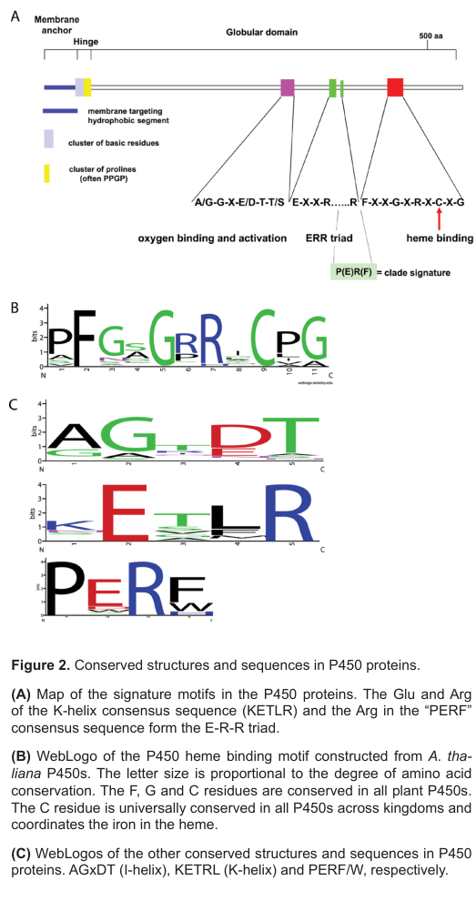

## Question

# Gene Research for Functional Annotation

## ⚠️ CRITICAL: Gene/Protein Identification Context

**BEFORE YOU BEGIN RESEARCH:** You MUST verify you are researching the CORRECT gene/protein. Gene symbols can be ambiguous, especially for less well-characterized genes from non-model organisms.

### Target Gene/Protein Identity (from UniProt):
- **UniProt Accession:** P49264
- **Protein Description:** RecName: Full=Cytochrome P450 71B1; EC=1.14.-.-; AltName: Full=CYPLXXIB1;
- **Gene Information:** Name=CYP71B1;
- **Organism (full):** Thlaspi arvense (Field penny-cress).
- **Protein Family:** Belongs to the cytochrome P450 family. .
- **Key Domains:** Cyt_P450. (IPR001128); Cyt_P450_CS. (IPR017972); Cyt_P450_E_grp-I. (IPR002401); Cyt_P450_sf. (IPR036396); p450 (PF00067)

### MANDATORY VERIFICATION STEPS:

1. **Check if the gene symbol "CYP71B1" matches the protein description above**
2. **Verify the organism is correct:** Thlaspi arvense (Field penny-cress).
3. **Check if protein family/domains align with what you find in literature**
4. **If you find literature for a DIFFERENT gene with the same or similar symbol, STOP**

### If Gene Symbol is Ambiguous or You Cannot Find Relevant Literature:

**DO NOT PROCEED WITH RESEARCH ON A DIFFERENT GENE.** Instead:
- State clearly: "The gene symbol 'CYP71B1' is ambiguous or literature is limited for this specific protein"
- Explain what you found (e.g., "Found extensive literature on a different gene with the same symbol in a different organism")
- Describe the protein based ONLY on the UniProt information provided above
- Suggest that the protein function can be inferred from domain/family information

### Research Target:

Please provide a comprehensive research report on the gene **CYP71B1** (gene ID: CYP71B1, UniProt: P49264) in THLAR.

The research report should be a detailed narrative explaining the function, biological processes, and localization of the gene product. Citations should be given for all claims.

You should prioritize authoritative reviews and primary scientific literature when conducting research. You can supplement
this with annotations you find in gene/protein databases, but these can be outdated or inaccurate.

We are specifically interested in the primary function of the gene - for enzymes, what reaction is catalyzed, and what is the substrate specificity? For transporters, what is the substrate? For structural proteins or adapters, what is the broader structural role? For signaling molecules, what is the role in the pathway.

We are interested in where in or outside the cell the gene product carries out its function.

We are also interested in the signaling or biochemical pathways in which the gene functions. We are less interested in broad pleiotropic effects, except where these elucidate the precise role.

Include evidence where possible. We are interested in both experimental evidence as well as inference from structure, evolution, or bioinformatic analysis. Precise studies should be prioritized over high-throughput, where available.

## Output

Question: You are an expert researcher providing comprehensive, well-cited information.

Provide detailed information focusing on:
1. Key concepts and definitions with current understanding
2. Recent developments and latest research (prioritize 2023-2024 sources)
3. Current applications and real-world implementations
4. Expert opinions and analysis from authoritative sources
5. Relevant statistics and data from recent studies

Format as a comprehensive research report with proper citations. Include URLs and publication dates where available.
Always prioritize recent, authoritative sources and provide specific citations for all major claims.

# Gene Research for Functional Annotation

## ⚠️ CRITICAL: Gene/Protein Identification Context

**BEFORE YOU BEGIN RESEARCH:** You MUST verify you are researching the CORRECT gene/protein. Gene symbols can be ambiguous, especially for less well-characterized genes from non-model organisms.

### Target Gene/Protein Identity (from UniProt):
- **UniProt Accession:** P49264
- **Protein Description:** RecName: Full=Cytochrome P450 71B1; EC=1.14.-.-; AltName: Full=CYPLXXIB1;
- **Gene Information:** Name=CYP71B1;
- **Organism (full):** Thlaspi arvense (Field penny-cress).
- **Protein Family:** Belongs to the cytochrome P450 family. .
- **Key Domains:** Cyt_P450. (IPR001128); Cyt_P450_CS. (IPR017972); Cyt_P450_E_grp-I. (IPR002401); Cyt_P450_sf. (IPR036396); p450 (PF00067)

### MANDATORY VERIFICATION STEPS:

1. **Check if the gene symbol "CYP71B1" matches the protein description above**
2. **Verify the organism is correct:** Thlaspi arvense (Field penny-cress).
3. **Check if protein family/domains align with what you find in literature**
4. **If you find literature for a DIFFERENT gene with the same or similar symbol, STOP**

### If Gene Symbol is Ambiguous or You Cannot Find Relevant Literature:

**DO NOT PROCEED WITH RESEARCH ON A DIFFERENT GENE.** Instead:
- State clearly: "The gene symbol 'CYP71B1' is ambiguous or literature is limited for this specific protein"
- Explain what you found (e.g., "Found extensive literature on a different gene with the same symbol in a different organism")
- Describe the protein based ONLY on the UniProt information provided above
- Suggest that the protein function can be inferred from domain/family information

### Research Target:

Please provide a comprehensive research report on the gene **CYP71B1** (gene ID: CYP71B1, UniProt: P49264) in THLAR.

The research report should be a detailed narrative explaining the function, biological processes, and localization of the gene product. Citations should be given for all claims.

You should prioritize authoritative reviews and primary scientific literature when conducting research. You can supplement
this with annotations you find in gene/protein databases, but these can be outdated or inaccurate.

We are specifically interested in the primary function of the gene - for enzymes, what reaction is catalyzed, and what is the substrate specificity? For transporters, what is the substrate? For structural proteins or adapters, what is the broader structural role? For signaling molecules, what is the role in the pathway.

We are interested in where in or outside the cell the gene product carries out its function.

We are also interested in the signaling or biochemical pathways in which the gene functions. We are less interested in broad pleiotropic effects, except where these elucidate the precise role.

Include evidence where possible. We are interested in both experimental evidence as well as inference from structure, evolution, or bioinformatic analysis. Precise studies should be prioritized over high-throughput, where available.

## Research Report: Functional Annotation of **CYP71B1** from *Thlaspi arvense* (Field pennycress)

### Executive summary (identity verified; function largely uncharacterized)
The target protein is **Cytochrome P450 71B1** (gene **CYP71B1**) from *Thlaspi arvense* (field pennycress), UniProt **P49264**, belonging to the **cytochrome P450 (CYP)** superfamily and containing the canonical CYP domain architecture (Cyt_P450 / PF00067) indicated by UniProt context. Within the tool-retrieved literature, the strongest direct evidence for this specific pennycress CYP71B1 is a peer-reviewed review that catalogs it as a **full-length cDNA** associated with GenEMBL accession **L24438** and cites the original Plant Physiology cloning note (1994). However, **no direct biochemical reaction, substrate specificity, pathway placement, or experimentally demonstrated subcellular localization for pennycress CYP71B1** could be retrieved from the accessible sources. Therefore, any functional annotation beyond “microsomal plant P450 monooxygenase” must be treated as **inference** based on general plant P450 biology and on characterized CYP71-family members in related Brassicaceae (notably *Arabidopsis*). (schuler1996plantcytochromep450 pages 5-8, bak2011cytochromesp450 pages 3-5)

A key complication is **symbol ambiguity**: “CYP71B1” is also used for *Arabidopsis* loci (e.g., At1g13080 listed as a putative P450), and other Arabidopsis P450s are sometimes discussed with different names (e.g., MAX1 is CYP711A1), so the pennycress protein should not be conflated with Arabidopsis CYP71B1 or MAX1. (schuckel2012developmentofa pages 193-196, schuckel2012developmentofa pages 199-203)

### Evidence map (direct vs inferred)
| Evidence scope | Organism | Gene/Protein (incl. accession/locus) | Key finding (function/substrate/localization/role) | Data/statistics | Source (author year) | Publication date | URL/DOI | Notes on confidence/limitations |
|---|---|---|---|---|---|---|---|---|
| Direct | *Thlaspi arvense* | CYP71B1; GenEMBL accession **L24438**; UniProt target **P49264** | Authoritative review catalogs *T. arvense* CYP71B1 as a **full-length cDNA** and links it to the original cloning note; this is the strongest direct evidence that the queried protein exists in field pennycress. No substrate, reaction, localization, or pathway assignment is provided in the accessible text. (schuler1996plantcytochromep450 pages 5-8) | Full-length cDNA reported; no functional assay statistics available in retrieved text. (schuler1996plantcytochromep450 pages 5-8) | Schuler 1996 | Jan 1996 | https://doi.org/10.1080/07352689609701942 | High confidence for identity/accession; very low confidence for biochemical function because the retrieved evidence is only a catalog entry citing Udvardi et al. 1994, not a functional study. |
| Inference / background | Plants; Arabidopsis emphasized | Plant CYPs broadly; Arabidopsis CYP71 family; related CYP71A/B members | Defines plant P450s as heme-thiolate monooxygenases; most plant P450s are membrane-bound and usually anchored on the **cytoplasmic face of the ER**. Arabidopsis has **244 P450 genes and 28 pseudogenes**. The **CYP71 clan** is described as a major duplicated lineage involved in specialized metabolism; CYP71A13, CYP71A12, and CYP71B15 are linked to tryptophan-derived defense metabolism, supporting cautious inference that uncharacterized CYP71B1 may also act in specialized metabolism. (bak2011cytochromesp450 pages 1-3, bak2011cytochromesp450 pages 3-5, bak2011cytochromesp450 pages 12-13, bak2011cytochromesp450 pages 11-12) | 244 genes plus 28 pseudogenes in Arabidopsis; ER localization is the usual plant P450 context. (bak2011cytochromesp450 pages 1-3, bak2011cytochromesp450 pages 3-5) | Bak et al. 2011 | Oct 06 2011 | https://doi.org/10.1199/tab.0144 | Strong for general plant P450 properties and Arabidopsis family context; indirect for *T. arvense* CYP71B1 specifically. |
| Inference from characterized homologous pathway members | *Arabidopsis thaliana* | CYP71B15/PAD3, CYP71A13, CYP71A12, CYP83B1, CYP79B2/B3 | Demonstrates that characterized CYP71 enzymes can function in a **camalexin metabolon** on the ER and process **indole-derived defense intermediates**. CYP71B15/PAD3 performs a late camalexin step; CYP71A13 channels indole-3-acetaldoxime into camalexin biosynthesis; CYP71A12 contributes in roots. Supports the idea that CYP71 family members often act on specialized-metabolism substrates and may participate in multiprotein complexes. (mucha2019theformationof pages 3-4, mucha2019theformationof pages 2-3, mucha2019theformationof pages 4-5) | CYP71B15 is the strongest co-IP signal in the metabolon study; about 22 P450s co-purified; PAD3 localized in cells adjacent to infection sites; one associated enzyme, NITRILASE3, showed about 7-fold change in the cited excerpt. (mucha2019theformationof pages 3-4, mucha2019theformationof pages 2-3, mucha2019theformationof pages 4-5) | Mucha et al. 2019 | Sep 2019 | https://doi.org/10.1105/tpc.19.00403 | Strong for Arabidopsis camalexin-pathway CYP71s; only suggestive for pennycress CYP71B1 because orthology and substrate equivalence are unproven. |
| Ambiguity warning / indirect | *Arabidopsis thaliana* | **CYP71B1 / 71B1 (At1g13080)** in Arabidopsis table; nearby CYP71B7 and CYP71B15 entries | Appendix-style Arabidopsis table lists **71B1 (At1g13080)** only as a **putative P450**, with no reaction, substrate, pathway, or localization. Neighboring CYP71 family members do have activities, for example CYP71B7 deethylates 7-ethoxycoumarin and CYP71B15 converts dihydrocamalexic acid to camalexin, underscoring that family membership alone does not specify function. (schuckel2012developmentofa pages 193-196, schuckel2012developmentofa pages 39-41) | No direct statistics for AtCYP71B1; nearby entries show diverse CYP71 activities. (schuckel2012developmentofa pages 193-196, schuckel2012developmentofa pages 39-41) | Schückel 2012 | 2012 | No stable journal URL available in retrieved record | Useful mainly to show **symbol ambiguity** and lack of annotation even in Arabidopsis; should not be conflated with *Thlaspi arvense* CYP71B1. |
| Recent review / broad inference | Plants; grapevine example | CYP71 clan; CYP71BE example | Recent review states the **CYP71 clan encompasses more than 50 percent of plant CYPs** and is prominent in terpenoid metabolism. Gives a concrete functional example: **CYP71BE** oxidizes **alpha-guaiene** to **rotundone**, showing that CYP71 enzymes can catalyze highly specific oxidations in specialized metabolism affecting agriculturally relevant traits. (minerdi2024impactofcytochrome pages 11-13, minerdi2024impactofcytochrome pages 9-11, minerdi2024impactofcytochrome pages 1-2) | More than 50 percent of plant CYPs belong to CYP71 clan; grapevine was reported to have 579 CYP sequences with 279 complete genes in the review context. (minerdi2024impactofcytochrome pages 11-13, minerdi2024impactofcytochrome pages 9-11, minerdi2024impactofcytochrome pages 7-9) | Minerdi and Sabbatini 2024 | Jun 2024 | https://doi.org/10.3390/ijms25137181 | Good recent contextual evidence for CYP71 diversity and applications; does not identify pennycress CYP71B1 substrate. |
| Recent species resource / indirect | *Thlaspi arvense* var. MN106-Ref | Pennycress genome and annotation resources | Provides the modern genomic framework needed to revisit CYP71B1 annotation in pennycress: chromosome-level assembly, expression atlas, transcript evidence, and gene-model curation pipeline. Relevant because direct literature on CYP71B1 is sparse. (garrido2024theepigenomicimpact pages 133-133, garrido2024theepigenomicimpact pages 144-144, garrido2024theepigenomicimpact pages 151-151) | Assembly covers about **97.5 percent of an estimated 539 Mbp** genome; seven large scaffolds represent about **83.6 percent** of the genome; contig N50 improved from **0.02 Mbp to 13.3 Mbp**; coding space is **98.7 percent BUSCO complete**; expression atlas spans **11 tissues or life stages** with mostly **3 biological replicates**. (garrido2024theepigenomicimpact pages 133-133, garrido2024theepigenomicimpact pages 144-144) | Garrido 2024 | 2024 | No stable journal URL available in retrieved record | Strong for current pennycress genome quality and annotation infrastructure; no explicit CYP71B1-specific mention in available excerpts. |
| Recent translational context / indirect | *Thlaspi arvense* and weeds broadly | Thlaspi genome resource; comparative weed multi-omics | Reviews modern weed and crop multi-omics and cites a chromosome-level *T. arvense* genome as a tool for **translational research and domestication**. Supports the idea that current annotation of pennycress genes, including orphan P450s, can be improved using genome, transcriptome, and regulatory datasets. (chen2024weedbiologyand pages 16-17, chen2024weedbiologyand pages 17-18) | Excerpts mention pan-genome analysis of **33** accessions or species in one cited context and **13 domesticated and wild rice relatives** in another; no CYP71-specific counts for pennycress. (chen2024weedbiologyand pages 17-18) | Chen et al. 2024 | Apr 2024 | https://doi.org/10.1016/j.xplc.2024.100816 | High value for current methodological context; low direct relevance to CYP71B1 biochemistry. |
| Recent ecological context / indirect | Herbivore on *Thlaspi arvense* versus native host | Detoxification gene families including cytochrome P450s in *Pieris macdunnoughii* larvae feeding on pennycress | Shows pennycress is a **toxic host context** where detoxification pathways are relevant, but larval **cytochrome P450 genes were not significantly differentially expressed** versus the native host. This does not annotate pennycress CYP71B1 directly, but supports a defense-metabolism ecological setting for Brassicaceae specialized chemistry. (ravikanthachari2024geneticmechanismsunderlying pages 12-15, ravikanthachari2024geneticmechanismsunderlying pages 15-18, ravikanthachari2024geneticmechanismsunderlying pages 8-12, ravikanthachari2024geneticmechanismsunderlying pages 5-8) | About **20 million paired reads** per library, about **40 million total**, with **94 percent mapping**; **1,489 genes** differentially expressed at FDR below 0.01; **910 genes** with log2 fold change above 1.5 and FDR below 0.01; cytochrome P450 trend **p = 0.09** and not significant; GST **p < 0.001**; trypsin **p = 0.002**; **2,353 genes** associated with *T. arvense* modules in WGCNA. (ravikanthachari2024geneticmechanismsunderlying pages 12-15, ravikanthachari2024geneticmechanismsunderlying pages 8-12, ravikanthachari2024geneticmechanismsunderlying pages 5-8) | Feb 2024 | https://doi.org/10.1101/2024.02.14.580222 | Useful ecological backdrop only; measures insect gene expression, not plant CYP71B1 expression or function. |

*Table: This table compiles direct and indirect evidence relevant to functional annotation of Thlaspi arvense CYP71B1 (UniProt P49264). It separates direct identity evidence from broader family- and species-level inferences, making clear where confidence is strong and where annotation remains provisional.*

---

## 1) Key concepts and definitions (current understanding)

### 1.1 What plant cytochrome P450s are
Plant cytochrome P450s are **heme-thiolate monooxygenases** that catalyze oxygenation and other oxidative transformations, typically described by the overall monooxygenase reaction:

\[ RH + O\_2 + NADPH + H^+ \rightarrow ROH + H\_2O + NADP^+ \]

and they share a conserved catalytic center in which a **conserved cysteine coordinates the heme iron**. (bak2011cytochromesp450 pages 3-5)

### 1.2 Conserved motifs used for functional annotation of CYPs
Functional annotation of CYP sequences often leverages conserved motifs characteristic of P450 fold and catalytic mechanism. Key motifs highlighted in authoritative sources include:
- The **heme-binding cysteine motif** (Cys is universally conserved and coordinates heme iron) (bak2011cytochromesp450 pages 3-5)
- The **I-helix** motif (e.g., **AGxDT**) (bak2011cytochromesp450 pages 3-5)
- The **K-helix** motif including **EXXR** (e.g., KETRL/KETLR context; EXXR noted in a 2024 review) (bak2011cytochromesp450 pages 3-5, minerdi2024impactofcytochrome pages 1-2)
- The **PERF/W** motif (forms, with K-helix residues, an **E–R–R triad**) (bak2011cytochromesp450 pages 3-5)

These motifs support the classification of CYP71B1 as a bona fide cytochrome P450 monooxygenase (consistent with UniProt/InterPro domain context) even when substrate specificity is unknown.

### 1.3 Typical localization of plant P450s
Most characterized plant P450s are **membrane-bound**, commonly **anchored to the cytoplasmic surface of the endoplasmic reticulum (ER)** by an N-terminal hydrophobic segment, and require electron transfer from ER-associated partners such as NADPH-cytochrome P450 reductase (CPR) and/or cytochrome b5. (bak2011cytochromesp450 pages 3-5)

A minority of plant P450s are predicted or confirmed to localize to plastids or mitochondria via targeting peptides, but the dominant paradigm for “CYP71 clan” enzymes is **microsomal/ER association**. (bak2011cytochromesp450 pages 3-5)

### 1.4 The CYP71 clan and why it matters
The CYP71 clan is repeatedly emphasized as a major driver of plant specialized metabolism. A 2024 review states that the **CYP71 clan encompasses more than 50% of plant CYPs**, highlighting its expansion and functional breadth across specialized-metabolism pathways. (minerdi2024impactofcytochrome pages 9-11)

---

## 2) Target gene/protein: what is known directly for pennycress CYP71B1 (P49264)

### 2.1 Verified identity and sequence availability
A peer-reviewed review of plant P450s explicitly catalogs **Thlaspi arvense CYP71B1** as a **full-length cDNA**, associated with GenEMBL accession **L24438**, and cites the original Plant Physiology publication (1994, 105:755–756) as the source of the cDNA sequence report. This provides direct evidence that the gene/protein sequence was cloned and deposited, consistent with the UniProt accession **P49264** provided by the user. (schuler1996plantcytochromep450 pages 5-8)

### 2.2 What is not available in retrieved direct evidence
Within the accessible texts, there is **no direct experimental evidence** for:
- Substrate(s) or reaction catalyzed by pennycress CYP71B1
- Specific pathway placement (e.g., glucosinolate, phytoalexin, hormone pathways)
- Tissue-, development-, or stress-specific expression for CYP71B1
- Subcellular localization of the pennycress protein (ER vs plastid vs other)

Thus, **primary function and substrate specificity remain unknown** from the retrieved direct literature.

---

## 3) Functional inference from family context (explicitly labeled as inference)

### 3.1 What characterized CYP71A/B enzymes do in Brassicaceae (Arabidopsis camalexin pathway)
Multiple CYP71-family enzymes are experimentally positioned in the **camalexin** (tryptophan-derived phytoalexin) pathway in *Arabidopsis*:
- **CYP71A13** converts indole-3-acetaldoxime toward indole-3-acetonitrile, channeling a branchpoint intermediate into camalexin biosynthesis; mutants show impaired camalexin accumulation and altered pathogen susceptibility. (bak2011cytochromesp450 pages 12-13, bak2011cytochromesp450 pages 11-12)
- **CYP71A12** contributes in roots and is inducible by bacterial elicitors (Flg22). (bak2011cytochromesp450 pages 12-13)
- **CYP71B15/PAD3** is a key late enzyme: biochemical work and mutant phenotypes place it downstream in camalexin production, with in vitro evidence for conversion of cysteine–indole-3-acetonitrile-derived intermediates to camalexin; pad3 mutants are camalexin-deficient and accumulate pathway intermediates. (bak2011cytochromesp450 pages 12-13, mucha2019theformationof pages 2-3)

A 2019 Plant Cell study further supports that these enzymes act within a coordinated multi-protein context (“metabolon”). It reports that a functional PAD3/CYP71B15-GFP fusion localizes to the ER and accumulates in cells near infection sites, and proteomics/co-IP shows enrichment of multiple P450 partners (including CYP71A13 and CYP71A12), consistent with substrate channeling among indole-derived intermediates. (mucha2019theformationof pages 2-3, mucha2019theformationof pages 4-5)

**Inference relevance to pennycress CYP71B1:** Because pennycress is a Brassicaceae species and CYP71-family expansions are often linked to specialized metabolism, one plausible hypothesis is that pennycress CYP71B1 could act on **specialized-metabolism substrates**, potentially including indole-derived or other defense-related compounds. However, **CYP71 family membership alone does not identify substrates**, and even in Arabidopsis some CYP71B members remain “putative.” (bak2011cytochromesp450 pages 11-12, schuckel2012developmentofa pages 193-196)

### 3.2 Expected subcellular localization (inference)
Given the general plant P450 paradigm (ER membrane anchoring via N-terminus), a working hypothesis is that pennycress CYP71B1 is likely **microsomal/ER-associated**, unless a cleavable transit peptide indicates plastid/mitochondrial targeting. This inference is supported by general plant P450 localization principles and by ER localization demonstrated for the Brassicaceae CYP71B enzyme PAD3/CYP71B15. (bak2011cytochromesp450 pages 3-5, mucha2019theformationof pages 2-3)

### 3.3 Substrate specificity: why it is difficult to infer
Even within CYP71-family members, experimentally documented activities are diverse (e.g., pathway-specific camalexin steps vs xenobiotic transformations in assay contexts). A table-based resource lists CYP71B7 deethylation of 7-ethoxycoumarin in vitro and CYP71B15 camalexin formation, while other CYP71 members remain only “putative,” illustrating that subfamily labels do not uniquely determine substrates. (schuckel2012developmentofa pages 39-41, schuckel2012developmentofa pages 193-196)

---

## 4) Recent developments (prioritizing 2023–2024 sources)

### 4.1 2024: CYP71 clan scale and application framing
A 2024 review focusing on fruit quality emphasizes that the **CYP71 clan comprises >50% of plant CYPs** and highlights CYP71 enzymes in terpenoid oxidation with a concrete example: grapevine **CYP71BE** oxidizes **α-guaiene** to produce **rotundone**, an aroma-impact compound. This illustrates (i) the enormous scale of CYP71 diversification and (ii) real-world relevance of CYP71 enzymes to agriculturally important traits, and it supports the idea that CYP71-family enzymes can be targets for metabolic engineering even when individual members are initially uncharacterized. (minerdi2024impactofcytochrome pages 9-11)

### 4.2 2024: Pennycress multi-omics resources for re-annotation and functional inference
A 2024 pennycress genomics resource describes a chromosome-scale assembly (T_arvense_v2) covering ~**97.5%** of an estimated **539 Mbp** genome and reporting **98.7% BUSCO** completeness of coding space. It includes robust annotations, a transcriptome-based **gene expression atlas spanning 11 tissues/life stages**, DNA methylomes (root and shoot), and resequencing of **40 accessions**, plus an annotation pipeline combining Illumina RNA-seq, PacBio Iso-Seq, MAKER-P, PFAM/InterPro support, and orthology mapping. Collectively, these resources can be used to improve the functional annotation of gene families like CYPs (including CYP71B1) via co-expression, comparative genomics, and variant–trait association, even when direct enzymology is missing. (garrido2024theepigenomicimpact pages 133-133, garrido2024theepigenomicimpact pages 144-144, garrido2024theepigenomicimpact pages 141-141)

### 4.3 2024: Translational/domestication context for pennycress and multi-omics annotation methods
A 2024 Plant Communications perspective on weed biology/multi-omics notes that a chromosome-level *Thlaspi arvense* genome provides tools for **translational research** and domestication of a cash cover crop, and it highlights emerging approaches such as **Pan-3D genome analysis (2023)** for connecting genome structure to function. Such approaches can help resolve tandemly duplicated gene families (like CYP71) and refine gene models and regulatory inference. (chen2024weedbiologyand pages 16-17)

---

## 5) Current applications and real-world implementations (how CYP71-type knowledge is used)

### 5.1 Crop quality and metabolic engineering
CYP71-family enzymes can control economically important specialized metabolites; the 2024 fruit-quality review frames P450s (including CYP71 clan members) as engineering targets for modifying quality-related traits such as aroma and ripening chemistry. The CYP71BE→rotundone example illustrates the mechanistic bridge from enzyme activity to sensory traits in wine/grapes. (minerdi2024impactofcytochrome pages 9-11)

### 5.2 Defense metabolism and inducible ER metabolons
The camalexin pathway work provides a real-world mechanism for how plant CYP71 enzymes are deployed: CYP71B15/PAD3 is inducible by pathogen attack, ER-localized, and participates in a physically associated enzyme network (metabolon), supporting rapid and localized production of defense compounds. This provides a conceptual model for how a Brassicaceae CYP71B enzyme (by inference, potentially including pennycress CYP71B1) could function in vivo. (mucha2019theformationof pages 2-3, mucha2019theformationof pages 4-5)

### 5.3 Weed management and herbicide metabolism context (methodological analogy)
Although not about pennycress CYP71B1 directly, the 2024 weed multi-omics perspective highlights functional characterization of herbicide-metabolizing P450s (e.g., CYP81A variants) and enzyme-library approaches, providing a blueprint for how “orphan” P450s can be functionally annotated through systematic screening. (chen2024weedbiologyand pages 17-18)

---

## 6) Expert opinions and analysis (authoritative synthesis)

### 6.1 Why functional redundancy is limited despite large P450 families
The Arabidopsis Book chapter emphasizes that Arabidopsis contains **244 P450 genes and 28 pseudogenes** and argues that diversification leads to **limited functional redundancy** and mirrors metabolic complexity; consequently, uncharacterized CYP71 members may have specialized and non-obvious substrates, motivating direct experimental testing rather than name-based inference. (bak2011cytochromesp450 pages 1-3)

### 6.2 Likely biochemical role class for pennycress CYP71B1
Given the direct evidence is restricted to sequence existence (full-length cDNA) and family membership, the most defensible functional label at present is:
- **Microsomal cytochrome P450 monooxygenase (CYP71 clan; A-type plant P450)**
- Catalyzes an oxidative transformation using electrons delivered via NADPH-dependent reductase partners
- Likely ER-associated via N-terminal hydrophobic anchor (hypothesis)

This aligns with expert synthesis of plant P450 biology and avoids over-claiming a substrate or pathway. (bak2011cytochromesp450 pages 3-5)

### 6.3 Priority hypotheses for wet-lab validation
Based on characterized Brassicaceae CYP71 enzymes, the most tractable and biologically plausible hypotheses to test for pennycress CYP71B1 include:
1) Activity on **tryptophan-derived indole intermediates** (e.g., indole-3-acetaldoxime/IAN-related chemistry) and/or related defense metabolites (inference from Arabidopsis CYP71A/B camalexin pathway). (bak2011cytochromesp450 pages 12-13, mucha2019theformationof pages 2-3)
2) ER localization and potential participation in inducible enzyme complexes (metabolon-like organization), especially under pathogen/stress induction (inference from PAD3/CYP71B15 ER localization and interaction network). (mucha2019theformationof pages 2-3, mucha2019theformationof pages 4-5)
3) Broader aromatic/xenobiotic oxidation potential in vitro (supported by diverse activities reported for some CYP71 family members in assay contexts). (schuckel2012developmentofa pages 39-41)

---

## 7) Relevant statistics and data from recent studies

### 7.1 Recent statistics on CYP71 clan and plant CYP complement
- CYP71 clan: **>50% of plant CYPs** (review statement). (minerdi2024impactofcytochrome pages 9-11)
- Arabidopsis genome: **244 P450 genes** and **28 pseudogenes** (authoritative reference chapter). (bak2011cytochromesp450 pages 1-3)

### 7.2 Pennycress genome/omics resource statistics (2024)
- Assembly covers ~**97.5%** of estimated **539 Mbp** genome; seven large scaffolds comprise ~**83.6%**; coding space **98.7% BUSCO complete**; expression atlas across **11 tissues/life stages**; resequencing of **40 accessions**; LD decay ~**150 kbp at r²=0.6** (useful for association mapping). (garrido2024theepigenomicimpact pages 133-133, garrido2024theepigenomicimpact pages 141-141)

### 7.3 Ecological/toxicity context statistics involving pennycress (2024 bioRxiv)
A 2024 insect transcriptomic study using *T. arvense* as a “toxic” host provides context for Brassicaceae chemical defenses:
- ~**20M paired reads** per library; **94%** mapping
- **1,489** genes differentially expressed at FDR<0.01
- Cytochrome P450 gene family differential expression: trend but **not significant** (p=0.09)
- Detoxification gene families: GST higher on native host (p<0.001); trypsin up on pennycress (p=0.002)

These data do **not** annotate pennycress CYP71B1 directly (they measure insect genes), but they underscore that pennycress-associated chemistry can impose strong stress/toxicity, providing biological motivation to study specialized metabolism genes (including P450s) in pennycress. (ravikanthachari2024geneticmechanismsunderlying pages 8-12, ravikanthachari2024geneticmechanismsunderlying pages 12-15)

---

## 8) Conclusion and actionable annotation statement for CYP71B1 (P49264)

### 8.1 Minimal, evidence-supported functional annotation
**CYP71B1 (UniProt P49264) from *Thlaspi arvense* is best annotated currently as an uncharacterized plant cytochrome P450 monooxygenase (CYP71 clan), represented by a full-length cDNA (GenEMBL L24438).** (schuler1996plantcytochromep450 pages 5-8)

### 8.2 Working hypotheses (explicitly speculative)
- **Likely ER-associated microsomal P450**, based on general plant P450 localization and on ER localization demonstrated for a CYP71B enzyme (PAD3/CYP71B15) in Brassicaceae. (bak2011cytochromesp450 pages 3-5, mucha2019theformationof pages 2-3)
- **Likely involved in specialized metabolism**, given CYP71 clan’s scale and known roles in defense and quality-related specialized metabolites, but **substrate specificity is unknown** and cannot be reliably inferred from family membership. (minerdi2024impactofcytochrome pages 9-11, bak2011cytochromesp450 pages 11-12)

### 8.3 Best next experiments for definitive functional annotation
1) **Heterologous expression** (yeast/Nicotiana/plant microsomes) with **NADPH-P450 reductase** co-expression; confirm CO-difference spectrum and activity. (bak2011cytochromesp450 pages 3-5)
2) **Substrate screening** prioritized to Brassicaceae-specialized metabolites (indole-related compounds, glucosinolate-related intermediates, terpenoids), guided by co-expression patterns in the pennycress 11-tissue expression atlas and stress treatments. (garrido2024theepigenomicimpact pages 133-133)
3) **Subcellular localization** with fluorescent tags to test ER association and induction patterns. (mucha2019theformationof pages 2-3)

---

## Key source URLs (publication dates)
- Schuler MA. *Plant Cytochrome P450 Monooxygenases*. **1996-01**. https://doi.org/10.1080/07352689609701942 (schuler1996plantcytochromep450 pages 5-8)
- Bak S, et al. *Cytochromes P450* (The Arabidopsis Book). First published **2011-10-06**. https://doi.org/10.1199/tab.0144 (bak2011cytochromesp450 pages 1-3, bak2011cytochromesp450 pages 3-5)
- Mucha S, et al. *The Formation of a Camalexin Biosynthetic Metabolon*. **2019-09**. https://doi.org/10.1105/tpc.19.00403 (mucha2019theformationof pages 2-3)
- Minerdi D, Sabbatini P. *Impact of Cytochrome P450 Enzyme on Fruit Quality*. **2024-06**. https://doi.org/10.3390/ijms25137181 (minerdi2024impactofcytochrome pages 9-11)
- Chen K, et al. *Weed biology and management in the multi-omics era: Progress and perspectives*. **2024-04**. https://doi.org/10.1016/j.xplc.2024.100816 (chen2024weedbiologyand pages 16-17)
- Ravikanthachari N, Boggs CL. *Genetic mechanisms underlying preference-performance mismatches…* bioRxiv **2024-02**. https://doi.org/10.1101/2024.02.14.580222 (ravikanthachari2024geneticmechanismsunderlying pages 8-12)

---

### Notes on limitations
This report is constrained by tool-accessible full texts. The original primary source for the pennycress CYP71B1 cDNA (Plant Physiology 1994, 105:755–756) was not retrievable here, and UniProt/InterPro records were provided by the user but not directly fetched through tools. Consequently, substrate specificity and pathway membership for *T. arvense* CYP71B1 remain unresolved and should be treated as an open annotation problem requiring targeted experimental validation and/or genome-scale co-expression/phylogenomics using the 2024 pennycress multi-omics resources. (schuler1996plantcytochromep450 pages 5-8, garrido2024theepigenomicimpact pages 133-133)

References

1. (schuler1996plantcytochromep450 pages 5-8): Mary A. Schuler. Plant cytochrome p450 monooxygenases. Critical Reviews in Plant Sciences, 15:235-284, Jan 1996. URL: https://doi.org/10.1080/07352689609701942, doi:10.1080/07352689609701942. This article has 476 citations and is from a peer-reviewed journal.

2. (bak2011cytochromesp450 pages 3-5): Søren Bak, Fred Beisson, Gerard Bishop, Björn Hamberger, René Höfer, Suzanne Paquette, and Danièle Werck-Reichhart. Cytochromes p450. The Arabidopsis Book, 2011:e0144, Jan 2011. URL: https://doi.org/10.1199/tab.0144, doi:10.1199/tab.0144. This article has 529 citations and is from a peer-reviewed journal.

3. (schuckel2012developmentofa pages 193-196): J Schückel. Development of a new platform technology for plant cytochrome p450 fusions. Unknown journal, 2012.

4. (schuckel2012developmentofa pages 199-203): J Schückel. Development of a new platform technology for plant cytochrome p450 fusions. Unknown journal, 2012.

5. (bak2011cytochromesp450 pages 1-3): Søren Bak, Fred Beisson, Gerard Bishop, Björn Hamberger, René Höfer, Suzanne Paquette, and Danièle Werck-Reichhart. Cytochromes p450. The Arabidopsis Book, 2011:e0144, Jan 2011. URL: https://doi.org/10.1199/tab.0144, doi:10.1199/tab.0144. This article has 529 citations and is from a peer-reviewed journal.

6. (bak2011cytochromesp450 pages 12-13): Søren Bak, Fred Beisson, Gerard Bishop, Björn Hamberger, René Höfer, Suzanne Paquette, and Danièle Werck-Reichhart. Cytochromes p450. The Arabidopsis Book, 2011:e0144, Jan 2011. URL: https://doi.org/10.1199/tab.0144, doi:10.1199/tab.0144. This article has 529 citations and is from a peer-reviewed journal.

7. (bak2011cytochromesp450 pages 11-12): Søren Bak, Fred Beisson, Gerard Bishop, Björn Hamberger, René Höfer, Suzanne Paquette, and Danièle Werck-Reichhart. Cytochromes p450. The Arabidopsis Book, 2011:e0144, Jan 2011. URL: https://doi.org/10.1199/tab.0144, doi:10.1199/tab.0144. This article has 529 citations and is from a peer-reviewed journal.

8. (mucha2019theformationof pages 3-4): Stefanie Mucha, Stephanie Heinzlmeir, Verena Kriechbaumer, Benjamin Strickland, Charlotte Kirchhelle, Manisha Choudhary, Natalie Kowalski, Ruth Eichmann, Ralph Hueckelhoven, Erwin Grill, Bernhard Kuster, and Erich Glawischnig. The formation of a camalexin biosynthetic metabolon. Plant Cell, 31:2697-2710, Sep 2019. URL: https://doi.org/10.1105/tpc.19.00403, doi:10.1105/tpc.19.00403. This article has 101 citations and is from a highest quality peer-reviewed journal.

9. (mucha2019theformationof pages 2-3): Stefanie Mucha, Stephanie Heinzlmeir, Verena Kriechbaumer, Benjamin Strickland, Charlotte Kirchhelle, Manisha Choudhary, Natalie Kowalski, Ruth Eichmann, Ralph Hueckelhoven, Erwin Grill, Bernhard Kuster, and Erich Glawischnig. The formation of a camalexin biosynthetic metabolon. Plant Cell, 31:2697-2710, Sep 2019. URL: https://doi.org/10.1105/tpc.19.00403, doi:10.1105/tpc.19.00403. This article has 101 citations and is from a highest quality peer-reviewed journal.

10. (mucha2019theformationof pages 4-5): Stefanie Mucha, Stephanie Heinzlmeir, Verena Kriechbaumer, Benjamin Strickland, Charlotte Kirchhelle, Manisha Choudhary, Natalie Kowalski, Ruth Eichmann, Ralph Hueckelhoven, Erwin Grill, Bernhard Kuster, and Erich Glawischnig. The formation of a camalexin biosynthetic metabolon. Plant Cell, 31:2697-2710, Sep 2019. URL: https://doi.org/10.1105/tpc.19.00403, doi:10.1105/tpc.19.00403. This article has 101 citations and is from a highest quality peer-reviewed journal.

11. (schuckel2012developmentofa pages 39-41): J Schückel. Development of a new platform technology for plant cytochrome p450 fusions. Unknown journal, 2012.

12. (minerdi2024impactofcytochrome pages 11-13): Daniela Minerdi and Paolo Sabbatini. Impact of cytochrome p450 enzyme on fruit quality. International Journal of Molecular Sciences, 25:7181, Jun 2024. URL: https://doi.org/10.3390/ijms25137181, doi:10.3390/ijms25137181. This article has 7 citations.

13. (minerdi2024impactofcytochrome pages 9-11): Daniela Minerdi and Paolo Sabbatini. Impact of cytochrome p450 enzyme on fruit quality. International Journal of Molecular Sciences, 25:7181, Jun 2024. URL: https://doi.org/10.3390/ijms25137181, doi:10.3390/ijms25137181. This article has 7 citations.

14. (minerdi2024impactofcytochrome pages 1-2): Daniela Minerdi and Paolo Sabbatini. Impact of cytochrome p450 enzyme on fruit quality. International Journal of Molecular Sciences, 25:7181, Jun 2024. URL: https://doi.org/10.3390/ijms25137181, doi:10.3390/ijms25137181. This article has 7 citations.

15. (minerdi2024impactofcytochrome pages 7-9): Daniela Minerdi and Paolo Sabbatini. Impact of cytochrome p450 enzyme on fruit quality. International Journal of Molecular Sciences, 25:7181, Jun 2024. URL: https://doi.org/10.3390/ijms25137181, doi:10.3390/ijms25137181. This article has 7 citations.

16. (garrido2024theepigenomicimpact pages 133-133): A Contreras Garrido. The epigenomic impact of transposable elements in natural populations. Unknown journal, 2024.

17. (garrido2024theepigenomicimpact pages 144-144): A Contreras Garrido. The epigenomic impact of transposable elements in natural populations. Unknown journal, 2024.

18. (garrido2024theepigenomicimpact pages 151-151): A Contreras Garrido. The epigenomic impact of transposable elements in natural populations. Unknown journal, 2024.

19. (chen2024weedbiologyand pages 16-17): Ke Chen, Haona Yang, Di Wu, Yajun Peng, Lei Lian, Lianyang Bai, and Lifeng Wang. Weed biology and management in the multi-omics era: progress and perspectives. Apr 2024. URL: https://doi.org/10.1016/j.xplc.2024.100816, doi:10.1016/j.xplc.2024.100816. This article has 17 citations and is from a peer-reviewed journal.

20. (chen2024weedbiologyand pages 17-18): Ke Chen, Haona Yang, Di Wu, Yajun Peng, Lei Lian, Lianyang Bai, and Lifeng Wang. Weed biology and management in the multi-omics era: progress and perspectives. Apr 2024. URL: https://doi.org/10.1016/j.xplc.2024.100816, doi:10.1016/j.xplc.2024.100816. This article has 17 citations and is from a peer-reviewed journal.

21. (ravikanthachari2024geneticmechanismsunderlying pages 12-15): Nitin Ravikanthachari and Carol L. Boggs. Genetic mechanisms underlying preference-performance mismatches: insights from a specialized native herbivore on an invasive toxic plant. bioRxiv, Feb 2024. URL: https://doi.org/10.1101/2024.02.14.580222, doi:10.1101/2024.02.14.580222. This article has 1 citations.

22. (ravikanthachari2024geneticmechanismsunderlying pages 15-18): Nitin Ravikanthachari and Carol L. Boggs. Genetic mechanisms underlying preference-performance mismatches: insights from a specialized native herbivore on an invasive toxic plant. bioRxiv, Feb 2024. URL: https://doi.org/10.1101/2024.02.14.580222, doi:10.1101/2024.02.14.580222. This article has 1 citations.

23. (ravikanthachari2024geneticmechanismsunderlying pages 8-12): Nitin Ravikanthachari and Carol L. Boggs. Genetic mechanisms underlying preference-performance mismatches: insights from a specialized native herbivore on an invasive toxic plant. bioRxiv, Feb 2024. URL: https://doi.org/10.1101/2024.02.14.580222, doi:10.1101/2024.02.14.580222. This article has 1 citations.

24. (ravikanthachari2024geneticmechanismsunderlying pages 5-8): Nitin Ravikanthachari and Carol L. Boggs. Genetic mechanisms underlying preference-performance mismatches: insights from a specialized native herbivore on an invasive toxic plant. bioRxiv, Feb 2024. URL: https://doi.org/10.1101/2024.02.14.580222, doi:10.1101/2024.02.14.580222. This article has 1 citations.

25. (garrido2024theepigenomicimpact pages 141-141): A Contreras Garrido. The epigenomic impact of transposable elements in natural populations. Unknown journal, 2024.

## Artifacts

- [Edison artifact artifact-00](CYP71B1-deep-research-falcon_artifacts/artifact-00.md)

## Citations

1. chen2024weedbiologyand pages 17-18
2. minerdi2024impactofcytochrome pages 9-11
3. chen2024weedbiologyand pages 16-17
4. schuckel2012developmentofa pages 39-41
5. garrido2024theepigenomicimpact pages 133-133
6. mucha2019theformationof pages 2-3
7. ravikanthachari2024geneticmechanismsunderlying pages 8-12
8. schuckel2012developmentofa pages 193-196
9. schuckel2012developmentofa pages 199-203
10. mucha2019theformationof pages 3-4
11. mucha2019theformationof pages 4-5
12. minerdi2024impactofcytochrome pages 11-13
13. minerdi2024impactofcytochrome pages 1-2
14. minerdi2024impactofcytochrome pages 7-9
15. garrido2024theepigenomicimpact pages 144-144
16. garrido2024theepigenomicimpact pages 151-151
17. ravikanthachari2024geneticmechanismsunderlying pages 12-15
18. ravikanthachari2024geneticmechanismsunderlying pages 15-18
19. ravikanthachari2024geneticmechanismsunderlying pages 5-8
20. garrido2024theepigenomicimpact pages 141-141
21. RH + O\_2 + NADPH + H^+ \rightarrow ROH + H\_2O + NADP^+ \
22. https://doi.org/10.1080/07352689609701942
23. https://doi.org/10.1199/tab.0144
24. https://doi.org/10.1105/tpc.19.00403
25. https://doi.org/10.3390/ijms25137181
26. https://doi.org/10.1016/j.xplc.2024.100816
27. https://doi.org/10.1101/2024.02.14.580222
28. https://doi.org/10.1080/07352689609701942,
29. https://doi.org/10.1199/tab.0144,
30. https://doi.org/10.1105/tpc.19.00403,
31. https://doi.org/10.3390/ijms25137181,
32. https://doi.org/10.1016/j.xplc.2024.100816,
33. https://doi.org/10.1101/2024.02.14.580222,