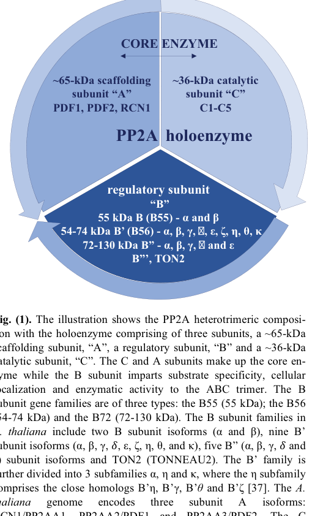

## Question

# Gene Research for Functional Annotation

## ⚠️ CRITICAL: Gene/Protein Identification Context

**BEFORE YOU BEGIN RESEARCH:** You MUST verify you are researching the CORRECT gene/protein. Gene symbols can be ambiguous, especially for less well-characterized genes from non-model organisms.

### Target Gene/Protein Identity (from UniProt):
- **UniProt Accession:** F6LAX4
- **Protein Description:** SubName: Full=Protein phosphatase 2A structural subunit {ECO:0000313|EnsemblPlants:TraesCS5A02G168400.5};
- **Gene Information:** Name=LOC123103357 {ECO:0000313|EnsemblPlants:TraesCS5A02G168400.5}; Synonyms=LOC123120841 {ECO:0000313|EnsemblPlants:TraesCS5D02G172700.4};
- **Organism (full):** Triticum aestivum (Wheat).
- **Protein Family:** Belongs to the phosphatase 2A regulatory subunit A family.
- **Key Domains:** ARM-like. (IPR011989); ARM-type_fold. (IPR016024); HEAT. (IPR000357); HEAT_type_2. (IPR021133); PP2A/SF3B1-like_HEAT. (IPR054573)

### MANDATORY VERIFICATION STEPS:

1. **Check if the gene symbol "LOC123103357" matches the protein description above**
2. **Verify the organism is correct:** Triticum aestivum (Wheat).
3. **Check if protein family/domains align with what you find in literature**
4. **If you find literature for a DIFFERENT gene with the same or similar symbol, STOP**

### If Gene Symbol is Ambiguous or You Cannot Find Relevant Literature:

**DO NOT PROCEED WITH RESEARCH ON A DIFFERENT GENE.** Instead:
- State clearly: "The gene symbol 'LOC123103357' is ambiguous or literature is limited for this specific protein"
- Explain what you found (e.g., "Found extensive literature on a different gene with the same symbol in a different organism")
- Describe the protein based ONLY on the UniProt information provided above
- Suggest that the protein function can be inferred from domain/family information

### Research Target:

Please provide a comprehensive research report on the gene **LOC123103357** (gene ID: F6LAX4, UniProt: F6LAX4) in WHEAT.

The research report should be a detailed narrative explaining the function, biological processes, and localization of the gene product. Citations should be given for all claims.

You should prioritize authoritative reviews and primary scientific literature when conducting research. You can supplement
this with annotations you find in gene/protein databases, but these can be outdated or inaccurate.

We are specifically interested in the primary function of the gene - for enzymes, what reaction is catalyzed, and what is the substrate specificity? For transporters, what is the substrate? For structural proteins or adapters, what is the broader structural role? For signaling molecules, what is the role in the pathway.

We are interested in where in or outside the cell the gene product carries out its function.

We are also interested in the signaling or biochemical pathways in which the gene functions. We are less interested in broad pleiotropic effects, except where these elucidate the precise role.

Include evidence where possible. We are interested in both experimental evidence as well as inference from structure, evolution, or bioinformatic analysis. Precise studies should be prioritized over high-throughput, where available.

## Output

Question: You are an expert researcher providing comprehensive, well-cited information.

Provide detailed information focusing on:
1. Key concepts and definitions with current understanding
2. Recent developments and latest research (prioritize 2023-2024 sources)
3. Current applications and real-world implementations
4. Expert opinions and analysis from authoritative sources
5. Relevant statistics and data from recent studies

Format as a comprehensive research report with proper citations. Include URLs and publication dates where available.
Always prioritize recent, authoritative sources and provide specific citations for all major claims.

# Gene Research for Functional Annotation

## ⚠️ CRITICAL: Gene/Protein Identification Context

**BEFORE YOU BEGIN RESEARCH:** You MUST verify you are researching the CORRECT gene/protein. Gene symbols can be ambiguous, especially for less well-characterized genes from non-model organisms.

### Target Gene/Protein Identity (from UniProt):
- **UniProt Accession:** F6LAX4
- **Protein Description:** SubName: Full=Protein phosphatase 2A structural subunit {ECO:0000313|EnsemblPlants:TraesCS5A02G168400.5};
- **Gene Information:** Name=LOC123103357 {ECO:0000313|EnsemblPlants:TraesCS5A02G168400.5}; Synonyms=LOC123120841 {ECO:0000313|EnsemblPlants:TraesCS5D02G172700.4};
- **Organism (full):** Triticum aestivum (Wheat).
- **Protein Family:** Belongs to the phosphatase 2A regulatory subunit A family.
- **Key Domains:** ARM-like. (IPR011989); ARM-type_fold. (IPR016024); HEAT. (IPR000357); HEAT_type_2. (IPR021133); PP2A/SF3B1-like_HEAT. (IPR054573)

### MANDATORY VERIFICATION STEPS:

1. **Check if the gene symbol "LOC123103357" matches the protein description above**
2. **Verify the organism is correct:** Triticum aestivum (Wheat).
3. **Check if protein family/domains align with what you find in literature**
4. **If you find literature for a DIFFERENT gene with the same or similar symbol, STOP**

### If Gene Symbol is Ambiguous or You Cannot Find Relevant Literature:

**DO NOT PROCEED WITH RESEARCH ON A DIFFERENT GENE.** Instead:
- State clearly: "The gene symbol 'LOC123103357' is ambiguous or literature is limited for this specific protein"
- Explain what you found (e.g., "Found extensive literature on a different gene with the same symbol in a different organism")
- Describe the protein based ONLY on the UniProt information provided above
- Suggest that the protein function can be inferred from domain/family information

### Research Target:

Please provide a comprehensive research report on the gene **LOC123103357** (gene ID: F6LAX4, UniProt: F6LAX4) in WHEAT.

The research report should be a detailed narrative explaining the function, biological processes, and localization of the gene product. Citations should be given for all claims.

You should prioritize authoritative reviews and primary scientific literature when conducting research. You can supplement
this with annotations you find in gene/protein databases, but these can be outdated or inaccurate.

We are specifically interested in the primary function of the gene - for enzymes, what reaction is catalyzed, and what is the substrate specificity? For transporters, what is the substrate? For structural proteins or adapters, what is the broader structural role? For signaling molecules, what is the role in the pathway.

We are interested in where in or outside the cell the gene product carries out its function.

We are also interested in the signaling or biochemical pathways in which the gene functions. We are less interested in broad pleiotropic effects, except where these elucidate the precise role.

Include evidence where possible. We are interested in both experimental evidence as well as inference from structure, evolution, or bioinformatic analysis. Precise studies should be prioritized over high-throughput, where available.

## Research Report: Functional Annotation of Wheat LOC123103357 (UniProt F6LAX4) — PP2A Structural/Scaffold Subunit A Family

### Executive summary (identity verification and evidence boundaries)
The gene symbol **LOC123103357** (UniProt **F6LAX4**) is annotated in UniProt (per user-provided entry) as a **protein phosphatase 2A (PP2A) structural/scaffold subunit A** from **Triticum aestivum (wheat)**, belonging to the **PP2A regulatory subunit A (PR65/PP2AA) family** and containing **HEAT/ARM-like repeat domains**. Using tool-based literature retrieval, I did **not** recover primary literature that explicitly references **UniProt F6LAX4**, **LOC123103357**, or the wheat gene model **TraesCS5A02G168400**. Therefore, the most defensible functional annotation is **family-based**, grounded in canonical PP2A-A (scaffold) structure–function evidence and plant PP2A pathway biology, supplemented by cereal (including wheat) examples involving PP2A subunits more broadly. (bheri2019pp2aphosphatasestake pages 2-3, cortelezzi2025plantpp2aa pages 3-4)

### 1) Key concepts and definitions (current understanding)

#### 1.1 What PP2A is
Protein phosphatase 2A (PP2A) is a major **Ser/Thr protein phosphatase** that typically functions as a **heterotrimeric holoenzyme** composed of: 
- **A**: scaffolding/structural subunit (also called PR65/PP2AA), 
- **C**: catalytic subunit (PP2AC), 
- **B**: regulatory subunit (multiple families/isoforms) that directs **substrate selection** and **subcellular targeting**. (bheri2019pp2aphosphatasestake pages 2-3, cortelezzi2025plantpp2aa pages 1-3)

The **A and C subunits form the “core enzyme” (A–C dimer)**, which then associates with a regulatory B subunit to form the active holoenzyme. (bheri2019pp2aphosphatasestake pages 2-3, cortelezzi2025plantpp2aa pages 1-3)

#### 1.2 What a PP2A “structural/scaffold A subunit” does
The **primary function** of a PP2A-A/PR65 protein is **not catalysis**; rather, it is to:
- provide a **protein–protein interaction scaffold** for assembly of the A–C core enzyme, and
- enable recruitment of different B subunits, thereby indirectly controlling **substrate specificity**, **localization**, and **activity modulation** of PP2A holoenzymes. (bheri2019pp2aphosphatasestake pages 2-3, cortelezzi2025plantpp2aa pages 1-3)

A widely cited quantitative feature is that the A subunit is **~65 kDa**, whereas the catalytic C subunit is **~36 kDa**. (bheri2019pp2aphosphatasestake pages 2-3)

#### 1.3 Domain architecture (HEAT/ARM-like alpha-solenoid repeats)
The PP2A-A scaffold is an **alpha-solenoid repeat protein** composed of **15 tandem HEAT repeats** that fold into a **horseshoe-shaped** scaffold. This architecture positions the catalytic C subunit and regulatory B subunit(s) on a common face of the complex and creates extensive interaction surfaces for holoenzyme assembly. (bheri2019pp2aphosphatasestake pages 2-3, cortelezzi2025plantpp2aa pages 3-4, bheri2019pp2aphosphatasestake media 3af103ea)

A 2024 structural review of alpha-solenoids contextualizes HEAT repeats as ~40-residue units that stack into superhelical scaffolds enabling flexible, modular protein–protein interactions; it uses PP2A-A (PR65/A) as a canonical example with **15 HEAT repeats** and emphasizes that surface-exposed (often non-conserved) residues are important for partner recognition. (arrias2024diversityandstructural‐functional pages 8-10, arrias2024diversityandstructural‐functional pages 2-5)

### 2) Recent developments and latest research (prioritize 2023–2024)

#### 2.1 Updated view of phosphatase specificity (2023)
A major 2023 synthesis in *Trends in Biochemical Sciences* argues that PPP-family phosphatases (including PP2A) achieve **high substrate and site specificity** primarily via **holoenzyme assembly** with regulatory/scaffolding subunits plus **docking interactions**, rather than through broad “housekeeping” dephosphorylation. Mechanistically, specificity is layered:
- intrinsic catalytic-site preferences (e.g., pThr vs pSer tendencies),
- holoenzyme-dependent reshaping of active-site context,
- distal docking via **short linear motifs (SLiMs)** or structural elements on substrates that bind regulatory/scaffold-defined surfaces. (nguyen2023substrateandphosphorylation pages 1-3, nguyen2023substrateandphosphorylation pages 3-4, nguyen2023substrateandphosphorylation pages 4-6)

Although this is largely animal/yeast-informed biochemistry, the mechanistic principle directly supports functional annotation of plant PP2A-A scaffolds: the scaffold’s key role is enabling assembly of holoenzymes that create distinct docking/active-site contexts. (nguyen2023substrateandphosphorylation pages 1-3, nguyen2023substrateandphosphorylation pages 14-16)

#### 2.2 HEAT-repeat scaffolds as a broad structural theme (2024)
The 2024 *Protein Science* review on alpha-solenoid proteins reports large-scale database prevalence of HEAT-repeat proteins and gives a quantitative snapshot: **~28,202 HEAT-containing proteins** in UniProtKB (accessed **June 17, 2024**). This highlights that the PP2A-A/HEAT-repeat scaffold is part of an expansive class of modular scaffolds central to signaling and macromolecular complex assembly. (arrias2024diversityandstructural‐functional pages 2-5)

#### 2.3 Plant signaling contexts linked to PP2A (2023)
A 2023 review of plant PP2A B′/B56 subunits connects PP2A complexes to multiple plant physiological processes and provides mechanistic examples involving PP2A scaffolding A subunits. For example, salicylic acid is reported to bind **PP2A scaffolding subunits A3 and A1/RCN1**, inhibiting PP2A and affecting phosphorylation of downstream targets (e.g., PIN2 in auxin transport contexts). (heidari2023distinctcladesof pages 6-7)

### 3) Functional annotation for wheat LOC123103357 (inference from PP2AA family)

Because no gene-specific wheat studies were retrieved for F6LAX4/LOC123103357, the statements below should be interpreted as **high-confidence family-level functional inference** for a wheat PP2A-A (PR65) homolog.

#### 3.1 Molecular function (what it “does”)
**Predicted molecular function:** PP2A-A scaffold that binds PP2A catalytic C subunit and recruits regulatory B subunits to form PP2A holoenzymes. (bheri2019pp2aphosphatasestake pages 2-3, cortelezzi2025plantpp2aa pages 1-3)

**Catalytic reaction:** The PP2A-A subunit does **not** catalyze dephosphorylation; catalysis is performed by PP2A-C. Therefore, **no substrate specificity can be assigned to the A subunit alone**. Instead, substrate specificity arises mainly from the **regulatory B** subunit and holoenzyme context. (bheri2019pp2aphosphatasestake pages 2-3, cortelezzi2025plantpp2aa pages 1-3)

**Mechanistic details relevant for annotation:**
- The A subunit’s **15 HEAT repeats** provide conserved loops for binding both C and B subunits, enabling formation of the A–C core and recruitment of regulatory B subunits. (cortelezzi2025plantpp2aa pages 3-4)
- PP2A holoenzyme assembly is modulated by post-translational events on the catalytic C subunit (e.g., C-terminal motif and methylation) that affect B-subunit recruitment to the A–C core, linking scaffold assembly to regulated signaling outputs. (bheri2019pp2aphosphatasestake pages 3-4, cortelezzi2025plantpp2aa pages 3-4)

#### 3.2 Subcellular localization (where it acts)
Direct localization data for wheat F6LAX4 were not retrieved. Plant PP2A reviews indicate that A and B subunits can have **diverse subcellular localization patterns** (predicted/experimental), consistent with PP2A’s role as a versatile signaling phosphatase across compartments; in contrast, catalytic C subunits are described as more predominantly cytosolic. This supports the expectation that a wheat PP2AA scaffold may participate in PP2A holoenzymes targeted to distinct compartments depending on the regulatory B subunit. (cortelezzi2025plantpp2aa pages 3-4)

#### 3.3 Biological processes/pathways likely impacted (plant/cereal contexts)
Family-level genetic evidence places PP2AA scaffolds upstream of many developmental and stress-response processes because they are required to assemble PP2A complexes.

**Auxin and root development:** In Arabidopsis, the PP2AA scaffold **RCN1/PP2AA1** is implicated in maintaining normal auxin distribution and root stem cell function, with redundancy among PP2AA paralogs revealed by double-mutant phenotypes. This supports a model in which PP2AA scaffolds contribute to hormone-regulated development through assembly of specific PP2A holoenzymes. (bheri2019pp2aphosphatasestake pages 13-14)

**Brassinosteroid (BR) signaling and immunity (mechanistic pathway examples):** Plant PP2A B′-containing complexes can dephosphorylate BR pathway components (e.g., BRI1 receptor kinase at the membrane and BZR1 transcription factor in the nucleus), and B′ subunits also participate in immune signaling modulation. These processes require scaffolding A subunits to assemble the corresponding holoenzymes. (heidari2023distinctcladesof pages 4-6, heidari2023distinctcladesof pages 1-2)

**Salicylic acid (SA) regulation of PP2A:** SA binding to PP2A scaffolding subunits (A3 and A1/RCN1) provides a mechanistic link between immune hormone signaling and direct modulation of PP2A complex activity. (heidari2023distinctcladesof pages 6-7)

### 4) Current applications and real-world implementations (cereal/crop context)

Direct translational studies on wheat LOC123103357 were not found in the retrieved set; however, PP2A subunits (including PP2AA in cereals) are being used as **candidate genes** and engineering targets for agronomic traits.

#### 4.1 Nutrient-stress tolerance engineering (maize example; mechanistic relevance to cereals)
Overexpression of a maize PP2AA gene (**ZmPP2AA1**) improved low-phosphate tolerance by remodeling root architecture, demonstrating that manipulating the PP2AA scaffold can affect hormone-linked developmental outputs relevant to nutrient acquisition. This provides a plausible application pattern for cereal PP2AA homologs (including wheat homologs) in breeding/engineering programs targeting nutrient-use efficiency. (bheri2019pp2aphosphatasestake pages 13-14)

#### 4.2 Disease resistance genetics (wheat association)
A 2023 review notes that in wheat, a **PP2A B′ gene** has been linked by GWAS to resistance to *Blumeria graminis* (powdery mildew), and that manipulating PP2A catalytic subunits can alter resistance phenotypes. While this does not directly implicate LOC123103357, it demonstrates that PP2A holoenzyme components are already appearing as **genetic markers/candidates** in wheat disease-resistance research, and A-subunit scaffolds are essential partners in such holoenzymes. (heidari2023distinctcladesof pages 6-7)

### 5) Relevant statistics and data points from recent and authoritative sources

Key quantitative/statistical facts that support annotation and context:
- **PP2A subunit masses:** A subunit ~**65 kDa**; C subunit ~**36 kDa**. (bheri2019pp2aphosphatasestake pages 2-3)
- **PP2A-A repeat count:** **15 HEAT repeats**, forming a horseshoe-shaped scaffold. (bheri2019pp2aphosphatasestake pages 2-3, cortelezzi2025plantpp2aa pages 3-4, bheri2019pp2aphosphatasestake media 3af103ea)
- **Arabidopsis combinatorial potential:** 3 A subunits, 5 C subunits, 17 B subunits → **255** theoretical heterotrimers (illustrating how scaffolds enable large functional space). (cortelezzi2025plantpp2aa pages 3-4)
- **Wheat PP2A family scale:** a genome-wide comparative summary reports **67 PP2A entries/genes in wheat** (broad PP2A family context; not specific to F6LAX4). (bheri2019pp2aphosphatasestake pages 3-4)
- **HEAT-repeat proteins prevalence (2024):** UniProtKB contains ~**28,202** HEAT-containing proteins (accessed **June 17, 2024**), indicating the wide distribution of HEAT-repeat scaffolds like PP2AA. (arrias2024diversityandstructural‐functional pages 2-5)

### 6) Expert interpretation and analysis (authoritative sources)

Across authoritative reviews, the consensus interpretation is that PP2A functional versatility derives from:
1) a conserved catalytic core (PP2AC),
2) a repeat-based scaffold (PP2AA/PR65) that organizes the complex, and
3) diverse regulatory subunits (B families) plus docking motifs that enforce substrate/site selectivity.

The 2023 phosphatase specificity framework emphasizes that phosphatases achieve “precision” via **holoenzyme assembly and docking**, aligning with plant PP2A reviews that emphasize B-subunit-determined substrate specificity and localization. This supports assigning LOC123103357’s primary function as **holoenzyme scaffolding** rather than direct enzymatic catalysis. (nguyen2023substrateandphosphorylation pages 1-3, bheri2019pp2aphosphatasestake pages 2-3)

### 7) Visual evidence
Schematics of PP2A holoenzyme architecture (A scaffold with associated B and C subunits) were retrieved from Bheri & Pandey (2019), supporting the structural concept underlying PP2AA annotation. (bheri2019pp2aphosphatasestake media 3af103ea, bheri2019pp2aphosphatasestake media bd4029ce)

### 8) Consolidated fact table
The following table consolidates the highest-confidence facts and the evidence boundary for wheat LOC123103357/F6LAX4.

| Claim/Fact | Evidence summary | Organism/context | Source (with DOI URL) | Publication date/year | Citation ID(s) |
|---|---|---|---|---|---|
| Target identity from provided UniProt context | User-provided UniProt annotation identifies F6LAX4 as a **Triticum aestivum** protein phosphatase 2A structural/scaffold subunit family member, with gene name **LOC123103357**, linked to **TraesCS5A02G168400.5** and synonym **LOC123120841 / TraesCS5D02G172700.4**; domains reported include ARM-like/HEAT. However, retrieved literature did **not** directly map or experimentally characterize F6LAX4/LOC123103357/TraesCS5A02G168400 specifically, so annotation must be treated as family-based rather than gene-specific literature-backed. | Wheat; UniProt-derived target context plus literature gap | No direct paper retrieved for this exact wheat gene; family interpretation supported by PP2A-A structural reviews: https://doi.org/10.2174/1389202920666190517110605 ; https://doi.org/10.3390/kinasesphosphatases3010005 | UniProt context provided by user; supporting reviews 2019, 2025 | (bheri2019pp2aphosphatasestake pages 2-3, cortelezzi2025plantpp2aa pages 3-4) |
| Canonical PP2A A-subunit structure | PP2A A is the **scaffolding/structural** subunit, approximately **~65 kDa**, built from **15 tandem HEAT repeats**; these repeats form a **horseshoe-shaped α-helical scaffold** characteristic of PR65/PP2AA proteins. | Eukaryotic PP2A; applicable to plant PP2AA family inference | Bheri & Pandey 2019, https://doi.org/10.2174/1389202920666190517110605 ; Cortelezzi et al. 2025, https://doi.org/10.3390/kinasesphosphatases3010005 | 2019; 2025 | (bheri2019pp2aphosphatasestake pages 2-3, cortelezzi2025plantpp2aa pages 3-4, bheri2019pp2aphosphatasestake media 3af103ea) |
| Core biochemical role | The A subunit binds the **catalytic C subunit** to form the **PP2A core enzyme (A–C dimer)** and provides the platform for **regulatory B-subunit recruitment**. This is the principal function of a PP2AA protein; it is a scaffold, not the catalytic phosphatase itself. | General PP2A holoenzyme biology; used for functional annotation of wheat PP2AA-like proteins | Cortelezzi et al. 2025, https://doi.org/10.3390/kinasesphosphatases3010005 ; Bheri & Pandey 2019, https://doi.org/10.2174/1389202920666190517110605 | 2025; 2019 | (bheri2019pp2aphosphatasestake pages 2-3, cortelezzi2025plantpp2aa pages 3-4, cortelezzi2025plantpp2aa pages 1-3, bheri2019pp2aphosphatasestake media bd4029ce) |
| Substrate specificity and localization logic | The **B subunit** is the major determinant of **substrate specificity**, **subcellular localization**, and modulation of enzymatic activity; thus a PP2AA scaffold influences substrate choice indirectly by enabling assembly of particular holoenzymes rather than recognizing phosphosubstrates directly. | General plant/eukaryotic PP2A principle | Bheri & Pandey 2019, https://doi.org/10.2174/1389202920666190517110605 ; Cortelezzi et al. 2025, https://doi.org/10.3390/kinasesphosphatases3010005 | 2019; 2025 | (bheri2019pp2aphosphatasestake pages 2-3, cortelezzi2025plantpp2aa pages 1-3) |
| Assembly mechanism details | Conserved loops in A-subunit HEAT repeats contact both C and B subunits; C-subunit C-terminal **TPDYFL** motif and terminal Leu methylation promote B-subunit association with the A–C dimer, facilitating holoenzyme assembly. | Canonical PP2A assembly mechanism; inferred for plant PP2AA proteins | Cortelezzi et al. 2025, https://doi.org/10.3390/kinasesphosphatases3010005 ; Bheri & Pandey 2019, https://doi.org/10.2174/1389202920666190517110605 | 2025; 2019 | (cortelezzi2025plantpp2aa pages 3-4, bheri2019pp2aphosphatasestake pages 3-4) |
| Localization evidence relevant to annotation | Reviews indicate plant A and B subunits show **diverse predicted/observed subcellular localizations**, whereas catalytic C subunits are more predominantly cytosolic. No direct localization experiment for wheat F6LAX4 was retrieved. | Plant PP2A family; not gene-specific for F6LAX4 | Cortelezzi et al. 2025, https://doi.org/10.3390/kinasesphosphatases3010005 | 2025 | (cortelezzi2025plantpp2aa pages 3-4) |
| Plant functional role: auxin/root development | PP2AA family members participate in **auxin distribution and root developmental control**. In Arabidopsis, **RCN1/PP2AA1** helps maintain normal auxin distribution and root stem cell function; genetic redundancy is evident because single **pp2aa2** or **pp2aa3** mutants are near-normal, whereas **rcn1 pp2aa2** and **rcn1 pp2aa3** double mutants show developmental defects. | Arabidopsis PP2AA family evidence informing plant functional annotation | Bheri & Pandey 2019, https://doi.org/10.2174/1389202920666190517110605 | 2019 | (bheri2019pp2aphosphatasestake pages 13-14) |
| Plant functional role: low-phosphate adaptation | In maize, **ZmPP2AA1** is induced in roots by **low phosphate**; overexpression promotes **lateral and axial root formation**, alters free IAA/auxin sensitivity, and improves performance under Pi deficiency, showing a practical growth-regulatory role for PP2AA scaffolds in cereals. | Maize; closest cereal functional evidence for PP2AA application | Wang et al. 2017, https://doi.org/10.1371/journal.pone.0176538 ; summarized in Bheri & Pandey 2019, https://doi.org/10.2174/1389202920666190517110605 | 2017; 2019 | (bheri2019pp2aphosphatasestake pages 13-14) |
| Broad plant roles | Plant PP2A complexes are described as key regulators of **abiotic stress**, **biotic stress**, and **developmental programs**; because A subunits are essential scaffolds for holoenzyme assembly, these roles are mechanistically relevant to PP2AA family members even when direct wheat-gene evidence is sparse. | Plant PP2A family overview | Cortelezzi et al. 2025, https://doi.org/10.3390/kinasesphosphatases3010005 ; Bheri & Pandey 2019, https://doi.org/10.2174/1389202920666190517110605 | 2025; 2019 | (cortelezzi2025plantpp2aa pages 1-3, bheri2019pp2aphosphatasestake pages 2-3) |
| Quantitative stats: structural and family counts | Key quantitative values reported include **15 HEAT repeats**, A subunit **~65 kDa**, catalytic C subunit **~36 kDa**, and in **Arabidopsis**: **3 A**, **5 C**, and **17 B** subunits, allowing a theoretical **255** heterotrimeric PP2A combinations. | General/Arabidopsis PP2A family statistics | Bheri & Pandey 2019, https://doi.org/10.2174/1389202920666190517110605 ; Cortelezzi et al. 2025, https://doi.org/10.3390/kinasesphosphatases3010005 | 2019; 2025 | (bheri2019pp2aphosphatasestake pages 2-3, cortelezzi2025plantpp2aa pages 3-4) |
| Quantitative stat relevant to wheat | A review excerpt reports **67 PP2A entries/genes in wheat** in genome-wide comparative data, but this number is for the broader PP2A family and does **not** specifically validate F6LAX4 as one experimentally studied PP2AA scaffold gene. | Wheat genome-wide PP2A family overview | Bheri & Pandey 2019, https://doi.org/10.2174/1389202920666190517110605 | 2019 | (bheri2019pp2aphosphatasestake pages 3-4) |

*Table: This table consolidates the verified identity context and the strongest literature-supported facts relevant to annotating wheat UniProt F6LAX4 as a PP2A A/scaffold subunit. It is useful because direct wheat gene-specific papers were not found, so the best-supported annotation relies on canonical PP2AA structure-function evidence and cereal/plant family studies.*

### 9) Limitations and recommendations for next steps
- **Limitation:** No retrieved paper explicitly mentions **F6LAX4 / LOC123103357 / TraesCS5A02G168400**, so wheat gene-specific experimental evidence (expression patterns, phenotypes, localization assays, interaction partners) could not be cited here.
- **Recommendation:** To move from family-level inference to gene-specific annotation, prioritize retrieving wheat genome annotation papers and proteomics/interaction datasets keyed to **TraesCS5A02G168400** and its homeolog(s), and/or use wheat expression atlases to determine tissue/stress responsiveness; then experimentally test PP2AA–PP2AC binding and subcellular localization via tagged constructs.

### Key sources (URLs)
- Nguyen H, Kettenbach AN. *Trends Biochem Sci.* Aug 2023. “Substrate and phosphorylation site selection by phosphoprotein phosphatases.” https://doi.org/10.1016/j.tibs.2023.04.004 (nguyen2023substrateandphosphorylation pages 1-3)
- Heidari B et al. *Int J Mol Sci.* Jul 2023. “Distinct Clades of Protein Phosphatase 2A Regulatory B’/B56 Subunits Engage in Different Physiological Processes.” https://doi.org/10.3390/ijms241512255 (heidari2023distinctcladesof pages 6-7)
- Arrías PN et al. *Protein Science.* Oct 2024. “Diversity and structural‐functional insights of alpha‐solenoid proteins.” https://doi.org/10.1002/pro.5189 (arrias2024diversityandstructural‐functional pages 8-10)
- Bheri M, Pandey GK. *Current Genomics.* Jul 2019. “PP2A Phosphatases Take a Giant Leap in the Post-Genomics Era.” https://doi.org/10.2174/1389202920666190517110605 (bheri2019pp2aphosphatasestake pages 2-3)

References

1. (bheri2019pp2aphosphatasestake pages 2-3): Malathi Bheri and Girdhar K. Pandey. Pp2a phosphatases take a giant leap in the post-genomics era. Current Genomics, 20:154-171, Jul 2019. URL: https://doi.org/10.2174/1389202920666190517110605, doi:10.2174/1389202920666190517110605. This article has 25 citations and is from a peer-reviewed journal.

2. (cortelezzi2025plantpp2aa pages 3-4): Juan I. Cortelezzi, Martina Zubillaga, Victoria R. Scardino, María N. Muñiz García, and Daniela A. Capiati. Plant pp2a: a versatile enzyme with key physiological functions. Kinases and Phosphatases, 3:5, Mar 2025. URL: https://doi.org/10.3390/kinasesphosphatases3010005, doi:10.3390/kinasesphosphatases3010005. This article has 3 citations.

3. (cortelezzi2025plantpp2aa pages 1-3): Juan I. Cortelezzi, Martina Zubillaga, Victoria R. Scardino, María N. Muñiz García, and Daniela A. Capiati. Plant pp2a: a versatile enzyme with key physiological functions. Kinases and Phosphatases, 3:5, Mar 2025. URL: https://doi.org/10.3390/kinasesphosphatases3010005, doi:10.3390/kinasesphosphatases3010005. This article has 3 citations.

4. (bheri2019pp2aphosphatasestake media 3af103ea): Malathi Bheri and Girdhar K. Pandey. Pp2a phosphatases take a giant leap in the post-genomics era. Current Genomics, 20:154-171, Jul 2019. URL: https://doi.org/10.2174/1389202920666190517110605, doi:10.2174/1389202920666190517110605. This article has 25 citations and is from a peer-reviewed journal.

5. (arrias2024diversityandstructural‐functional pages 8-10): Paula Nazarena Arrías, Zarifa Osmanli, Estefanía Peralta, Patricio Manuel Chinestrad, Alexander Miguel Monzon, and Silvio C. E. Tosatto. Diversity and structural‐functional insights of alpha‐solenoid proteins. Protein Science : A Publication of the Protein Society, Oct 2024. URL: https://doi.org/10.1002/pro.5189, doi:10.1002/pro.5189. This article has 12 citations.

6. (arrias2024diversityandstructural‐functional pages 2-5): Paula Nazarena Arrías, Zarifa Osmanli, Estefanía Peralta, Patricio Manuel Chinestrad, Alexander Miguel Monzon, and Silvio C. E. Tosatto. Diversity and structural‐functional insights of alpha‐solenoid proteins. Protein Science : A Publication of the Protein Society, Oct 2024. URL: https://doi.org/10.1002/pro.5189, doi:10.1002/pro.5189. This article has 12 citations.

7. (nguyen2023substrateandphosphorylation pages 1-3): Hieu Nguyen and Arminja N. Kettenbach. Substrate and phosphorylation site selection by phosphoprotein phosphatases. Trends in Biochemical Sciences, 48:713-725, Aug 2023. URL: https://doi.org/10.1016/j.tibs.2023.04.004, doi:10.1016/j.tibs.2023.04.004. This article has 48 citations and is from a domain leading peer-reviewed journal.

8. (nguyen2023substrateandphosphorylation pages 3-4): Hieu Nguyen and Arminja N. Kettenbach. Substrate and phosphorylation site selection by phosphoprotein phosphatases. Trends in Biochemical Sciences, 48:713-725, Aug 2023. URL: https://doi.org/10.1016/j.tibs.2023.04.004, doi:10.1016/j.tibs.2023.04.004. This article has 48 citations and is from a domain leading peer-reviewed journal.

9. (nguyen2023substrateandphosphorylation pages 4-6): Hieu Nguyen and Arminja N. Kettenbach. Substrate and phosphorylation site selection by phosphoprotein phosphatases. Trends in Biochemical Sciences, 48:713-725, Aug 2023. URL: https://doi.org/10.1016/j.tibs.2023.04.004, doi:10.1016/j.tibs.2023.04.004. This article has 48 citations and is from a domain leading peer-reviewed journal.

10. (nguyen2023substrateandphosphorylation pages 14-16): Hieu Nguyen and Arminja N. Kettenbach. Substrate and phosphorylation site selection by phosphoprotein phosphatases. Trends in Biochemical Sciences, 48:713-725, Aug 2023. URL: https://doi.org/10.1016/j.tibs.2023.04.004, doi:10.1016/j.tibs.2023.04.004. This article has 48 citations and is from a domain leading peer-reviewed journal.

11. (heidari2023distinctcladesof pages 6-7): Behzad Heidari, Dugassa Nemie-Feyissa, and Cathrine Lillo. Distinct clades of protein phosphatase 2a regulatory b’/b56 subunits engage in different physiological processes. International Journal of Molecular Sciences, 24:12255, Jul 2023. URL: https://doi.org/10.3390/ijms241512255, doi:10.3390/ijms241512255. This article has 6 citations.

12. (bheri2019pp2aphosphatasestake pages 3-4): Malathi Bheri and Girdhar K. Pandey. Pp2a phosphatases take a giant leap in the post-genomics era. Current Genomics, 20:154-171, Jul 2019. URL: https://doi.org/10.2174/1389202920666190517110605, doi:10.2174/1389202920666190517110605. This article has 25 citations and is from a peer-reviewed journal.

13. (bheri2019pp2aphosphatasestake pages 13-14): Malathi Bheri and Girdhar K. Pandey. Pp2a phosphatases take a giant leap in the post-genomics era. Current Genomics, 20:154-171, Jul 2019. URL: https://doi.org/10.2174/1389202920666190517110605, doi:10.2174/1389202920666190517110605. This article has 25 citations and is from a peer-reviewed journal.

14. (heidari2023distinctcladesof pages 4-6): Behzad Heidari, Dugassa Nemie-Feyissa, and Cathrine Lillo. Distinct clades of protein phosphatase 2a regulatory b’/b56 subunits engage in different physiological processes. International Journal of Molecular Sciences, 24:12255, Jul 2023. URL: https://doi.org/10.3390/ijms241512255, doi:10.3390/ijms241512255. This article has 6 citations.

15. (heidari2023distinctcladesof pages 1-2): Behzad Heidari, Dugassa Nemie-Feyissa, and Cathrine Lillo. Distinct clades of protein phosphatase 2a regulatory b’/b56 subunits engage in different physiological processes. International Journal of Molecular Sciences, 24:12255, Jul 2023. URL: https://doi.org/10.3390/ijms241512255, doi:10.3390/ijms241512255. This article has 6 citations.

16. (bheri2019pp2aphosphatasestake media bd4029ce): Malathi Bheri and Girdhar K. Pandey. Pp2a phosphatases take a giant leap in the post-genomics era. Current Genomics, 20:154-171, Jul 2019. URL: https://doi.org/10.2174/1389202920666190517110605, doi:10.2174/1389202920666190517110605. This article has 25 citations and is from a peer-reviewed journal.

## Artifacts

- [Edison artifact artifact-00](F6LAX4-deep-research-falcon_artifacts/artifact-00.md)

## Citations

1. heidari2023distinctcladesof pages 6-7
2. nguyen2023substrateandphosphorylation pages 1-3
3. nguyen2023substrateandphosphorylation pages 3-4
4. nguyen2023substrateandphosphorylation pages 4-6
5. nguyen2023substrateandphosphorylation pages 14-16
6. heidari2023distinctcladesof pages 4-6
7. heidari2023distinctcladesof pages 1-2
8. https://doi.org/10.2174/1389202920666190517110605
9. https://doi.org/10.3390/kinasesphosphatases3010005
10. https://doi.org/10.1371/journal.pone.0176538
11. https://doi.org/10.1016/j.tibs.2023.04.004
12. https://doi.org/10.3390/ijms241512255
13. https://doi.org/10.1002/pro.5189
14. https://doi.org/10.2174/1389202920666190517110605,
15. https://doi.org/10.3390/kinasesphosphatases3010005,
16. https://doi.org/10.1002/pro.5189,
17. https://doi.org/10.1016/j.tibs.2023.04.004,
18. https://doi.org/10.3390/ijms241512255,