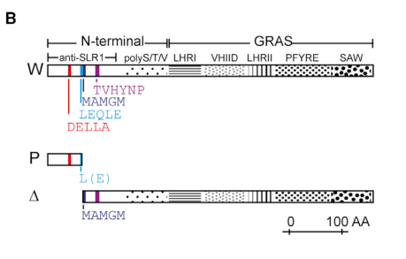

## Question

# Gene Research for Functional Annotation

## ⚠️ CRITICAL: Gene/Protein Identification Context

**BEFORE YOU BEGIN RESEARCH:** You MUST verify you are researching the CORRECT gene/protein. Gene symbols can be ambiguous, especially for less well-characterized genes from non-model organisms.

### Target Gene/Protein Identity (from UniProt):
- **UniProt Accession:** Q9ST59
- **Protein Description:** RecName: Full=DELLA protein RHT-1; AltName: Full=Protein Rht-B1/Rht-D1; AltName: Full=Reduced height protein 1;
- **Gene Information:** Name=RHT1;
- **Organism (full):** Triticum aestivum (Wheat).
- **Protein Family:** Belongs to the GRAS family. DELLA subfamily. .
- **Key Domains:** DELLA_N_sf. (IPR038088); TF_DELLA_N. (IPR021914); TF_GRAS. (IPR005202); DELLA (PF12041); GRAS (PF03514)

### MANDATORY VERIFICATION STEPS:

1. **Check if the gene symbol "RHT1" matches the protein description above**
2. **Verify the organism is correct:** Triticum aestivum (Wheat).
3. **Check if protein family/domains align with what you find in literature**
4. **If you find literature for a DIFFERENT gene with the same or similar symbol, STOP**

### If Gene Symbol is Ambiguous or You Cannot Find Relevant Literature:

**DO NOT PROCEED WITH RESEARCH ON A DIFFERENT GENE.** Instead:
- State clearly: "The gene symbol 'RHT1' is ambiguous or literature is limited for this specific protein"
- Explain what you found (e.g., "Found extensive literature on a different gene with the same symbol in a different organism")
- Describe the protein based ONLY on the UniProt information provided above
- Suggest that the protein function can be inferred from domain/family information

### Research Target:

Please provide a comprehensive research report on the gene **RHT1** (gene ID: RHT1, UniProt: Q9ST59) in WHEAT.

The research report should be a detailed narrative explaining the function, biological processes, and localization of the gene product. Citations should be given for all claims.

You should prioritize authoritative reviews and primary scientific literature when conducting research. You can supplement
this with annotations you find in gene/protein databases, but these can be outdated or inaccurate.

We are specifically interested in the primary function of the gene - for enzymes, what reaction is catalyzed, and what is the substrate specificity? For transporters, what is the substrate? For structural proteins or adapters, what is the broader structural role? For signaling molecules, what is the role in the pathway.

We are interested in where in or outside the cell the gene product carries out its function.

We are also interested in the signaling or biochemical pathways in which the gene functions. We are less interested in broad pleiotropic effects, except where these elucidate the precise role.

Include evidence where possible. We are interested in both experimental evidence as well as inference from structure, evolution, or bioinformatic analysis. Precise studies should be prioritized over high-throughput, where available.

## Output

Question: You are an expert researcher providing comprehensive, well-cited information.

Provide detailed information focusing on:
1. Key concepts and definitions with current understanding
2. Recent developments and latest research (prioritize 2023-2024 sources)
3. Current applications and real-world implementations
4. Expert opinions and analysis from authoritative sources
5. Relevant statistics and data from recent studies

Format as a comprehensive research report with proper citations. Include URLs and publication dates where available.
Always prioritize recent, authoritative sources and provide specific citations for all major claims.

# Gene Research for Functional Annotation

## ⚠️ CRITICAL: Gene/Protein Identification Context

**BEFORE YOU BEGIN RESEARCH:** You MUST verify you are researching the CORRECT gene/protein. Gene symbols can be ambiguous, especially for less well-characterized genes from non-model organisms.

### Target Gene/Protein Identity (from UniProt):
- **UniProt Accession:** Q9ST59
- **Protein Description:** RecName: Full=DELLA protein RHT-1; AltName: Full=Protein Rht-B1/Rht-D1; AltName: Full=Reduced height protein 1;
- **Gene Information:** Name=RHT1;
- **Organism (full):** Triticum aestivum (Wheat).
- **Protein Family:** Belongs to the GRAS family. DELLA subfamily. .
- **Key Domains:** DELLA_N_sf. (IPR038088); TF_DELLA_N. (IPR021914); TF_GRAS. (IPR005202); DELLA (PF12041); GRAS (PF03514)

### MANDATORY VERIFICATION STEPS:

1. **Check if the gene symbol "RHT1" matches the protein description above**
2. **Verify the organism is correct:** Triticum aestivum (Wheat).
3. **Check if protein family/domains align with what you find in literature**
4. **If you find literature for a DIFFERENT gene with the same or similar symbol, STOP**

### If Gene Symbol is Ambiguous or You Cannot Find Relevant Literature:

**DO NOT PROCEED WITH RESEARCH ON A DIFFERENT GENE.** Instead:
- State clearly: "The gene symbol 'RHT1' is ambiguous or literature is limited for this specific protein"
- Explain what you found (e.g., "Found extensive literature on a different gene with the same symbol in a different organism")
- Describe the protein based ONLY on the UniProt information provided above
- Suggest that the protein function can be inferred from domain/family information

### Research Target:

Please provide a comprehensive research report on the gene **RHT1** (gene ID: RHT1, UniProt: Q9ST59) in WHEAT.

The research report should be a detailed narrative explaining the function, biological processes, and localization of the gene product. Citations should be given for all claims.

You should prioritize authoritative reviews and primary scientific literature when conducting research. You can supplement
this with annotations you find in gene/protein databases, but these can be outdated or inaccurate.

We are specifically interested in the primary function of the gene - for enzymes, what reaction is catalyzed, and what is the substrate specificity? For transporters, what is the substrate? For structural proteins or adapters, what is the broader structural role? For signaling molecules, what is the role in the pathway.

We are interested in where in or outside the cell the gene product carries out its function.

We are also interested in the signaling or biochemical pathways in which the gene functions. We are less interested in broad pleiotropic effects, except where these elucidate the precise role.

Include evidence where possible. We are interested in both experimental evidence as well as inference from structure, evolution, or bioinformatic analysis. Precise studies should be prioritized over high-throughput, where available.

# Research Report: Wheat RHT1 (UniProt Q9ST59) — DELLA Reduced height protein 1 (Rht-B1/Rht-D1 family)

## 1. Target verification (critical disambiguation)
The UniProt accession **Q9ST59** corresponds to **Triticum aestivum (bread wheat) Reduced height protein 1 (RHT‑1)**, a **GRAS-family DELLA subfamily** transcriptional regulator. It matches the canonical wheat semi-dwarfing loci **Rht-A1, Rht-B1, and Rht-D1** that encode DELLA proteins underlying Green Revolution height control, and it carries the expected DELLA/GRAS motif architecture (N‑terminal DELLA regulatory motifs and C‑terminal GRAS motifs). (mo2018phenotypicandtranscriptomic pages 1-2, velde2021nterminaltruncatedrht1 pages 1-3, одинець2016компютернемоделюванняпросторової pages 1-3, santiago2025mappingproteinproteininteraction pages 14-17)

## 2. Key concepts and current mechanistic understanding

### 2.1 What RHT1 encodes (definition)
**RHT-1 proteins are DELLA growth repressors**: plant-specific GRAS-domain transcriptional regulators that act largely by **protein–protein interactions with transcription factors (TFs)** rather than by direct DNA binding. (mo2018phenotypicandtranscriptomic pages 1-2, velde2021nterminaltruncatedrht1 pages 1-3)

### 2.2 Domain architecture and functional motifs
Wheat RHT-1/DELLA proteins have two functional regions:
- **N-terminal DELLA regulatory region** containing conserved motifs **DELLA**, **LExLE/LEQLE**, and **TVHYNP/VHYNP**, which are central for interaction with the gibberellin receptor **GID1**. (mo2018phenotypicandtranscriptomic pages 1-2, velde2021nterminaltruncatedrht1 pages 1-3, одинець2016компютернемоделюванняпросторової pages 1-3)
- **C-terminal GRAS functional region** containing conserved motifs including **LHRI**, **VHIID**, **LHRII**, **PFYRE**, and **SAW**, which contribute to repression functions and partner interactions. (mo2018phenotypicandtranscriptomic pages 1-2, velde2021nterminaltruncatedrht1 pages 1-3, santiago2025mappingproteinproteininteractiona pages 17-22)

### 2.3 Pathway placement: GA–GID1–DELLA–SCF module
The current model in wheat is consistent with the broader plant GA pathway: bioactive **gibberellin (GA)** binds the receptor **GID1**, enabling formation of a **GA–GID1–DELLA** complex. This promotes recruitment of an SCF E3 ligase component (**GID2/SLY1-type F-box proteins**), resulting in DELLA **ubiquitination and proteasome-mediated degradation**, thereby releasing growth repression. (mo2018phenotypicandtranscriptomic pages 1-2, santiago2025mappingproteinproteininteractiona pages 22-25, lou2016molecularcharacterizationof pages 15-16)

Mechanistic specificity in wheat includes evidence that (i) **GID1–RHT1 binding depends on the N-terminal DELLA motifs**, and (ii) **TaGID2 recognition of RHT-1 involves the LHRII motif**. (lou2016molecularcharacterizationof pages 15-16)

## 3. Subcellular localization and interaction evidence (wheat-specific)

### 3.1 Nuclear localization and physical interactions with GA pathway components
Direct experimental evidence supports **nuclear localization and nuclear pathway operation**:
- Wheat **TaGID2 (GID2/SLY1 homologs)** localize to the **nucleus** in transient expression assays (GFP/YFP fusions). (lou2016molecularcharacterizationof pages 15-16)
- TaGID2s **interact with RHT-1/DELLA proteins** (reported by yeast two-hybrid, Western blot, and co-immunoprecipitation), consistent with nuclear SCF-mediated targeting of RHT-1. (lou2016molecularcharacterizationof pages 15-16)
- Wheat TaGID2s interact with a Skp1 homolog (TSK1) in yeast, supporting incorporation into an **SCF complex**. (lou2016molecularcharacterizationof pages 15-16)

### 3.2 Interaction domain mapping and allele-dependent disruption
- The **DELLA-domain integrity** is required for normal **TaGID1–RHT1** interaction; Green Revolution truncations abolish interaction with TaGID1 in yeast two-hybrid tests. (santiago2025mappingproteinproteininteraction pages 22-25, santiago2025mappingproteinproteininteractionb pages 22-25)
- Tissue-/allele-dependent **protein accumulation** has been detected by immunodetection: for example, N‑truncated **RHT‑B1B** is reduced in certain tissues and absent in aleurone, whereas **RHT‑B1C** accumulates broadly, consistent with differential pleiotropy. (santiago2025mappingproteinproteininteraction pages 22-25)

## 4. Recent developments and latest research (prioritizing 2023–2024)

### 4.1 2023: functional genetics (CRISPR and overexpression) linking Rht-B1b to coleoptile length
A 2023 study combined QTL mapping, transgenics, and transcriptomics to dissect the impact of the semi-dwarf **Rht-B1b** allele on wheat coleoptile length (CL) (Frontiers in Plant Science; **published Mar 2023**; https://doi.org/10.3389/fpls.2023.1147019). (xu2023impactof“green pages 1-2)

Key quantitative results:
- Two major coleoptile QTL at **Rht-B1 (4BS)** and **Rht-D1 (4DS)** explained **9.1%–22.2%** of CL variance across environments; specifically the 4BS QTL (Rht-B1) explained **~19.7–22.2%**, and the 4DS QTL explained **~11–13.2%**. (xu2023impactof“green pages 3-6, xu2023impactof“green pages 1-2)
- Functional validation showed **Rht-B1b overexpression reduced CL**, while **CRISPR/SpCas9 loss-of-function increased CL** versus null controls. (xu2023impactof“green pages 3-6, xu2023impactof“green pages 1-2)
- A representative parental contrast reported CL ≈ **3.3 cm** (Rht-B1b/Rht-D1b background) vs ≈ **4.8 cm** (wild-type Rht-B1a/Rht-D1a). (xu2023impactof“green pages 1-2)

Interpretation: these experiments support a causal, directionally consistent role of the GA-insensitive DELLA allele in **repressing early seedling elongation**, helping explain the well-known emergence/early-vigor trade-offs of Green Revolution alleles. (xu2023impactof“green pages 3-6, xu2023impactof“green pages 1-2)

### 4.2 2024: discovery of a novel DELLA allele at Rht-A1 with large height effects
A 2024 Molecular Breeding study (**published Nov 2024**; https://doi.org/10.1007/s11032-024-01515-3) mapped an EMS-induced dwarf mutant to chromosome 4A and identified a novel allele **Rht-A1h** (missense **G131A** in the DELLA motif region). (xie2024mappingofdwarfing pages 11-13)

Key quantitative results:
- The allele explained **up to 53%** of plant-height variation in the mapping context and reduced height by up to **41.95%**. (xie2024mappingofdwarfing pages 11-13)
- The mutant showed reduced sensitivity to exogenous GA relative to wild type, consistent with perturbed DELLA–GID1 regulation. (xie2024mappingofdwarfing pages 11-13)

Interpretation: beyond the classical Rht-B1b/D1b alleles, wheat breeding and functional genetics continue to uncover **new DELLA variants** with distinct quantitative effects and GA-response properties. (xie2024mappingofdwarfing pages 11-13)

### 4.3 2024: population-scale statistics, allele frequencies, and breeding markers
**Allele frequencies and diagnostic marker implementation (Pakistan historical cultivars)**
A 2024 GWAS/preprint analyzed 199 historical Pakistani wheat cultivars (Aug 2024; https://doi.org/10.21203/rs.3.rs-4679366/v1). (suleman2024genomewideandcandidate pages 1-3)

Key quantitative results and practical tools:
- Reported **allele frequency**: **Rht-B1b = 69.6%**; **Rht26 = 58.5%**; rare **Rht25** alleles at **1.5%, 1.0%, 0.5%** for Rht25c/d/e, respectively. (suleman2024genomewideandcandidate pages 1-3)
- Reported height effects: **Rht-D1b reduced plant height by 30.4%** and **Rht-B1b by 24.6%** in this panel’s analysis. (suleman2024genomewideandcandidate pages 1-3)
- The study used diagnostic **KASP markers** for multiple Rht loci and developed a new KASP marker for **Rht-B1p**, illustrating active translation into breeding pipelines. (suleman2024genomewideandcandidate pages 1-3)

**Multi-environment GWAS and yield trade-off evidence (Nordic–Baltic spring wheat)**
A 2024 Frontiers in Plant Science study (**published Jun 2024**; https://doi.org/10.3389/fpls.2024.1393170) analyzed 299 spring wheat genotypes across 12 year-site trials (2021–2023 phenotypes combined). (aleliunas2024genomewideassociationstudy pages 1-2)

Key quantitative results:
- The strongest DELLA-linked plant-height markers explained up to **17.95%** (chr4B within Rht-B1) and **29.16%** (chr4D within Rht-D1) of phenotypic variance for plant height, with low minor-allele frequencies (~0.07). (aleliunas2024genomewideassociationstudy pages 7-10)
- Critically for “real-world” deployment, the authors reported **no beneficial grain-yield effect** of the semi-dwarf alleles **Rht-B1b** and **Rht-D1b** across the 12 tested trials; cultivars carrying these alleles were generally low yielding in that germplasm set. (aleliunas2024genomewideassociationstudy pages 1-2)

Interpretation: these 2024 datasets reinforce that the agronomic value of Rht-B1/Rht-D1 DELLA alleles is **context dependent**, motivating diversification toward alternative dwarfing alleles and ideotypes. (aleliunas2024genomewideassociationstudy pages 1-2, suleman2024genomewideandcandidate pages 1-3)

## 5. Molecular basis of key alleles (expert-level interpretation with evidence)

### 5.1 Why Green Revolution alleles are “GA-insensitive”
The canonical Green Revolution alleles **Rht-B1b** and **Rht-D1b** contain early nonsense mutations that yield **N-terminally truncated DELLA proteins via translational reinitiation**, rather than only short peptides. The truncated products lack the N-terminal DELLA/LEQLE/TVHYNP region required for GID1-mediated recognition and degradation, causing DELLA stabilization and constitutive repression of stem elongation (semi-dwarfism). (velde2021nterminaltruncatedrht1 pages 1-3, velde2021nterminaltruncatedrht1 media 2cec272f)

### 5.2 Allelic series and pleiotropy (evidence-based)
- Semi-dwarf alleles (Rht-B1b/Rht-D1b) can be explained mechanistically by **reduced GA-triggered degradation** due to loss of the N-terminus (and in some cases lower accumulation in specific tissues). (velde2021nterminaltruncatedrht1 pages 1-3, santiago2025mappingproteinproteininteraction pages 22-25)
- More severe alleles such as **Rht-B1c** (insertion in DELLA domain) show stronger dwarfing and broader protein accumulation, consistent with different degrees and patterns of repression. (santiago2025mappingproteinproteininteractiona pages 22-25, santiago2025mappingproteinproteininteraction pages 22-25)
- Hypomorphic variants in the GRAS region can modulate the phenotype: an EMS-derived **PFYRE** motif mutant **RHT-B1bE529K** increased height by **~19 cm (~21%)** relative to RHT-B1b, with limited yield-component changes in that experiment (BMC Plant Biology; **published Oct 2018**; https://doi.org/10.1186/s12870-018-1465-4). (mo2018phenotypicandtranscriptomic pages 1-2)

## 6. Current applications and real-world implementations

### 6.1 Breeding and marker-assisted selection
Modern wheat improvement routinely tracks dwarfing alleles using molecular markers. A recent example is explicit KASP-based genotyping across multiple Rht loci, plus development of a dedicated KASP marker for **Rht-B1p** (Aug 2024 preprint; https://doi.org/10.21203/rs.3.rs-4679366/v1). (suleman2024genomewideandcandidate pages 1-3)

### 6.2 Genome editing and functional validation pipelines
The 2023 Rht-B1b study demonstrates a complete “research-to-implementation” style workflow: QTL mapping to Rht loci, transgenic overexpression, **CRISPR knockout**, and RNA-seq to identify pathways that may be used to design ideotypes with improved emergence/early vigor (Mar 2023; https://doi.org/10.3389/fpls.2023.1147019). (xu2023impactof“green pages 3-6, xu2023impactof“green pages 1-2)

### 6.3 Managing trade-offs with environment-specific evaluation
Multi-environment evaluation remains central: in Nordic–Baltic trials, semi-dwarf Rht alleles were not associated with yield gains across 12 trials (Jun 2024; https://doi.org/10.3389/fpls.2024.1393170), illustrating that RHT1 allele selection may need to be tailored to water, temperature, and agronomic input regimes. (aleliunas2024genomewideassociationstudy pages 1-2)

## 7. Summary of quantitative statistics (recent, wheat-specific)
- **Coleoptile length QTL variance** at Rht-B1/Rht-D1 loci: **9.1–22.2%** across environments; major QTL up to **~22.2%** (Mar 2023; https://doi.org/10.3389/fpls.2023.1147019). (xu2023impactof“green pages 3-6, xu2023impactof“green pages 1-2)
- **Rht-A1h**: up to **53%** plant-height variation explained; up to **41.95%** height reduction (Nov 2024; https://doi.org/10.1007/s11032-024-01515-3). (xie2024mappingofdwarfing pages 11-13)
- **Allele frequency example** (199 Pakistani historical cultivars): **Rht-B1b 69.6%** (Aug 2024; https://doi.org/10.21203/rs.3.rs-4679366/v1). (suleman2024genomewideandcandidate pages 1-3)
- **Plant height variance explained** by DELLA-linked markers in Nordic–Baltic GWAS: up to **17.95%** (Rht-B1 region) and **29.16%** (Rht-D1 region) (Jun 2024; https://doi.org/10.3389/fpls.2024.1393170). (aleliunas2024genomewideassociationstudy pages 7-10)
- **Yield association** in Nordic–Baltic spring wheat: **no beneficial grain-yield effect** of Rht-B1b/Rht-D1b across **12 trials** (Jun 2024; https://doi.org/10.3389/fpls.2024.1393170). (aleliunas2024genomewideassociationstudy pages 1-2)

## 8. Consolidated reference table (alleles, mechanisms, applications)
The following table summarizes identity, alleles, mechanisms, and recent quantitative evidence.

| Category | Item | Key details | Evidence / quantitative notes | Citation |
|---|---|---|---|---|
| Identifier / protein | RHT-1 (UniProt Q9ST59) | Wheat DELLA protein of the GRAS family; corresponds to Reduced height 1 proteins encoded by homeologous loci **Rht-A1, Rht-B1, Rht-D1** in *Triticum aestivum* | Canonical DELLA architecture verified for wheat RHT-1 proteins; Rht-B1/Rht-D1 are Green Revolution loci | (mo2018phenotypicandtranscriptomic pages 1-2, velde2021nterminaltruncatedrht1 pages 1-3, одинець2016компютернемоделюванняпросторової pages 1-3, santiago2025mappingproteinproteininteraction pages 14-17) |
| Domain architecture | N-terminal DELLA regulatory region | Conserved motifs **DELLA**, **LExLE/LEQLE**, **TVHYNP/VHYNP**; required for GA receptor **GID1** recognition | Loss/disruption of these motifs prevents normal GA-triggered degradation | (mo2018phenotypicandtranscriptomic pages 1-2, velde2021nterminaltruncatedrht1 pages 1-3, одинець2016компютернемоделюванняпросторової pages 1-3, santiago2025mappingproteinproteininteractiona pages 22-25) |
| Domain architecture | C-terminal GRAS region | Conserved motifs **LHRI**, **VHIID**, **LHRII**, **PFYRE**, **SAW**; functional repression / partner interaction region | PFYRE and SAW motifs implicated in DELLA activity and partner interactions | (mo2018phenotypicandtranscriptomic pages 1-2, santiago2025mappingproteinproteininteraction pages 17-22, santiago2025mappingproteinproteininteractiona pages 17-22) |
| Mechanism | GA–GID1–DELLA module | GA-bound GID1 binds DELLA N-terminus, enabling SCF E3 ligase recruitment, ubiquitination, and proteasomal DELLA degradation | RHT-1 acts as a **growth repressor** in GA signaling; degradation relieves repression | (mo2018phenotypicandtranscriptomic pages 1-2, santiago2025mappingproteinproteininteractiona pages 22-25) |
| Key allele | **Rht-B1b** | Premature stop codon in N-terminal region; produces N-terminally truncated DELLA via translational reinitiation | Truncated protein lacks DELLA/TVHYNP-type motifs, fails normal GID1-mediated degradation, causing GA-insensitive semi-dwarfism; reduces coleoptile length; in a 245-line RIL population, the 4BS coleoptile QTL explained **~19.7–22.2%** variance (9.1–22.2% across environments); parent CL example: **~3.3 cm** (Rht-B1b/Rht-D1b) vs **~4.8 cm** wild type; literature cited in 2024 work notes **~24.6%** PH reduction in one panel and ~23% stem-length reduction in prior studies | (velde2021nterminaltruncatedrht1 pages 1-3, xu2023impactof“green pages 3-6, xu2023impactof“green pages 1-2, suleman2024genomewideandcandidate pages 1-3) |
| Key allele | **Rht-D1b** | Green Revolution semi-dwarf allele producing N-terminally truncated DELLA | GA-insensitive because truncated DELLA cannot be properly recognized/degraded via GID1 pathway; 4DS coleoptile QTL explained **~11–13.2%** variance in the 2023 study; one 2024 panel reported **~30.4%** PH reduction; Nordic–Baltic GWAS detected a chr4D DELLA marker explaining up to **29.16%** PH variance | (velde2021nterminaltruncatedrht1 pages 1-3, xu2023impactof“green pages 3-6, suleman2024genomewideandcandidate pages 1-3, aleliunas2024genomewideassociationstudy pages 7-10) |
| Key allele | **Rht-B1c** | 508-nt insertion causing a 30-aa insertion in the DELLA domain | Abolishes/strongly impairs GID1 interaction; stable accumulation across tissues; produces a **severe dwarf** phenotype stronger than Rht-B1b/D1b | (santiago2025mappingproteinproteininteractiona pages 22-25, santiago2025mappingproteinproteininteractionb pages 22-25) |
| Key allele | **Rht-A1h** | 2024 novel allele; **G131A missense** in the DELLA motif region | Co-segregated with major chr4A QTL; reduced GA sensitivity consistent with altered DELLA–GID1 interaction; explained up to **53%** of PH variation and reduced height by up to **41.95%** | (xie2024mappingofdwarfing pages 11-13) |
| Key allele | **RHT-B1bE529K** | EMS-induced missense change in the **PFYRE** motif; hypomorphic suppressor of Rht-B1b | Partially suppresses semi-dwarfism; increased height by **19 cm (~21%)** vs RHT-B1b, compared with **33 cm (~34%)** for RHT-B1a vs RHT-B1b; increased coleoptile/seedling shoot/internode lengths without significant yield-component penalties in that study | (mo2018phenotypicandtranscriptomic pages 1-2) |
| 2023–2024 application | **CRISPR/SpCas9 knockout of Rht-B1b** | Functional validation of Rht-B1b in coleoptile development | **Rht-B1b-KO increased coleoptile length** relative to null transgenic plants | (xu2023impactof“green pages 3-6, xu2023impactof“green pages 1-2) |
| 2023–2024 application | **Rht-B1b overexpression** | Gain-of-function transgenic validation | Overexpression **reduced coleoptile length**, supporting direct repression of elongation by the semi-dwarf DELLA allele | (xu2023impactof“green pages 3-6, xu2023impactof“green pages 1-2) |
| 2023–2024 application | **KASP marker deployment** | Diagnostic KASP markers used for **Rht-B1, Rht-D1, Rht13, Rht25, Rht26**; a new **Rht-B1p KASP** marker was developed in 2024 | In 199 Pakistani cultivars, **Rht-B1b frequency = 69.6%**; **Rht26 = 58.5%**; rare Rht25c/d/e frequencies **1.5%, 1.0%, 0.5%** | (suleman2024genomewideandcandidate pages 1-3) |
| 2024 breeding / population evidence | Yield and deployment context | Semi-dwarf DELLA alleles remain major breeding loci but can be environment-dependent | In a 299-genotype Nordic–Baltic spring wheat panel across **12 trials**, **no beneficial grain-yield effect** of **Rht-B1b/Rht-D1b** was observed; carriers were generally low yielding in that germplasm; in the same study, chr4B and chr4D DELLA markers explained up to **17.95%** and **29.16%** of PH variance, respectively | (aleliunas2024genomewideassociationstudy pages 7-10, aleliunas2024genomewideassociationstudy pages 11-13, aleliunas2024genomewideassociationstudy pages 1-2) |

*Table: This table compacts the identity, domain structure, major alleles, mechanisms, phenotypic effects, and recent 2023-2024 applications for wheat RHT-1/DELLA proteins. It is useful as a quick reference linking molecular lesions to GA-signaling consequences and breeding-relevant quantitative outcomes.*

## 9. Notes on limitations and evidence coverage
- The GA signaling mechanism and protein domain requirements are well supported by wheat interaction experiments (Y2H, co-IP) involving TaGID1/TaGID2 and RHT-1 allelic series, but not all cited sources provide full quantitative localization data for RHT-1 itself (as opposed to its SCF component TaGID2). (lou2016molecularcharacterizationof pages 15-16, santiago2025mappingproteinproteininteraction pages 22-25)
- Some high-profile 2023 mechanistic work on post-translational regulation of Rht-B1b (e.g., kinase-mediated phosphorylation) could not be retrieved in the available corpus here; conclusions above are therefore restricted to evidence obtained via the tools. 

## Key visual evidence
A schematic of translational reinitiation producing N-terminally truncated ΔRHT-1 proteins for Rht-B1b/Rht-D1b is provided in Van De Velde et al. (Molecular Plant, Apr 2021; https://doi.org/10.1016/j.molp.2021.01.002). (velde2021nterminaltruncatedrht1 media 2cec272f)

References

1. (mo2018phenotypicandtranscriptomic pages 1-2): Youngjun Mo, Stephen Pearce, and Jorge Dubcovsky. Phenotypic and transcriptomic characterization of a wheat tall mutant carrying an induced mutation in the c-terminal pfyre motif of rht-b1b. BMC Plant Biology, Oct 2018. URL: https://doi.org/10.1186/s12870-018-1465-4, doi:10.1186/s12870-018-1465-4. This article has 25 citations and is from a peer-reviewed journal.

2. (velde2021nterminaltruncatedrht1 pages 1-3): Karel Van De Velde, Stephen G. Thomas, Floor Heyse, Rim Kaspar, Dominique Van Der Straeten, and Antje Rohde. N-terminal truncated rht-1 proteins generated by translational reinitiation cause semi-dwarfing of wheat green revolution alleles. Molecular Plant, 14:679-687, Apr 2021. URL: https://doi.org/10.1016/j.molp.2021.01.002, doi:10.1016/j.molp.2021.01.002. This article has 121 citations and is from a highest quality peer-reviewed journal.

3. (одинець2016компютернемоделюванняпросторової pages 1-3): КО Одинець and ОІ Корнелюк. Комп'ютерне моделювання просторової структури білка-модулятора гіберелінової відповіді rht-1 triticum aestivum l. з родини della-gras білків. Unknown journal, 2016.

4. (santiago2025mappingproteinproteininteraction pages 14-17): L Santiago. Mapping protein-protein interaction domains in wheat rht-d1. Unknown journal, 2025.

5. (santiago2025mappingproteinproteininteractiona pages 17-22): L Santiago. Mapping protein-protein interaction domains in wheat rht-d1. Unknown journal, 2025.

6. (santiago2025mappingproteinproteininteractiona pages 22-25): L Santiago. Mapping protein-protein interaction domains in wheat rht-d1. Unknown journal, 2025.

7. (lou2016molecularcharacterizationof pages 15-16): XueYuan Lou, Xin Li, AiXia Li, MingYu Pu, Muhammad Shoaib, DongCheng Liu, JiaZhu Sun, AiMin Zhang, and WenLong Yang. Molecular characterization of three gibberellin-insensitive dwarf2 homologous genes in common wheat. PLoS ONE, 11:e0157642, Jun 2016. URL: https://doi.org/10.1371/journal.pone.0157642, doi:10.1371/journal.pone.0157642. This article has 19 citations and is from a peer-reviewed journal.

8. (santiago2025mappingproteinproteininteraction pages 22-25): L Santiago. Mapping protein-protein interaction domains in wheat rht-d1. Unknown journal, 2025.

9. (santiago2025mappingproteinproteininteractionb pages 22-25): L Santiago. Mapping protein-protein interaction domains in wheat rht-d1. Unknown journal, 2025.

10. (xu2023impactof“green pages 1-2): Dengan Xu, Qianlin Hao, Tingzhi Yang, Xinru Lv, Huimin Qin, Yalin Wang, Chenfei Jia, Wenxing Liu, Xuehuan Dai, Jianbin Zeng, Hongsheng Zhang, Zhonghu He, Xianchun Xia, Shuanghe Cao, and Wujun Ma. Impact of “green revolution” gene rht-b1b on coleoptile length of wheat. Frontiers in Plant Science, Mar 2023. URL: https://doi.org/10.3389/fpls.2023.1147019, doi:10.3389/fpls.2023.1147019. This article has 14 citations.

11. (xu2023impactof“green pages 3-6): Dengan Xu, Qianlin Hao, Tingzhi Yang, Xinru Lv, Huimin Qin, Yalin Wang, Chenfei Jia, Wenxing Liu, Xuehuan Dai, Jianbin Zeng, Hongsheng Zhang, Zhonghu He, Xianchun Xia, Shuanghe Cao, and Wujun Ma. Impact of “green revolution” gene rht-b1b on coleoptile length of wheat. Frontiers in Plant Science, Mar 2023. URL: https://doi.org/10.3389/fpls.2023.1147019, doi:10.3389/fpls.2023.1147019. This article has 14 citations.

12. (xie2024mappingofdwarfing pages 11-13): Xiaomei Xie, Yang Zhang, Le Xu, Hong-chun Xiong, Yong-dun Xie, Lin-shu Zhao, Jia-yu Gu, Huiyuan Li, Jinfeng Zhang, Yuping Ding, Shi-rong Zhao, Hui Guo, and Luxiang Liu. Mapping of dwarfing gene and identification of mutant allele on plant height in wheat. Molecular Breeding : New Strategies in Plant Improvement, Nov 2024. URL: https://doi.org/10.1007/s11032-024-01515-3, doi:10.1007/s11032-024-01515-3. This article has 6 citations.

13. (suleman2024genomewideandcandidate pages 1-3): Hafiz Muhammad Suleman, Humaira Qayyum, Sana ur-Rehman, Khawar Majeed, Misbah Mukhtar, Saima Zulfiqar, Zahid Mahmood, Abdul Aziz, Muhammad Fayyaz, Shuanghe Cao, Awais Rasheed, and Zhonghu He. Genome-wide and candidate gene association mapping for plant height in wheat. Aug 2024. URL: https://doi.org/10.21203/rs.3.rs-4679366/v1, doi:10.21203/rs.3.rs-4679366/v1.

14. (aleliunas2024genomewideassociationstudy pages 1-2): Andrius Aleliūnas, Andrii Gorash, Rita Armonienė, Ilmar Tamm, Anne Ingver, Māra Bleidere, Valentīna Fetere, Hannes Kollist, Tomasz Mroz, Morten Lillemo, and Gintaras Brazauskas. Genome-wide association study reveals 18 qtl for major agronomic traits in a nordic–baltic spring wheat germplasm. Frontiers in Plant Science, Jun 2024. URL: https://doi.org/10.3389/fpls.2024.1393170, doi:10.3389/fpls.2024.1393170. This article has 11 citations.

15. (aleliunas2024genomewideassociationstudy pages 7-10): Andrius Aleliūnas, Andrii Gorash, Rita Armonienė, Ilmar Tamm, Anne Ingver, Māra Bleidere, Valentīna Fetere, Hannes Kollist, Tomasz Mroz, Morten Lillemo, and Gintaras Brazauskas. Genome-wide association study reveals 18 qtl for major agronomic traits in a nordic–baltic spring wheat germplasm. Frontiers in Plant Science, Jun 2024. URL: https://doi.org/10.3389/fpls.2024.1393170, doi:10.3389/fpls.2024.1393170. This article has 11 citations.

16. (velde2021nterminaltruncatedrht1 media 2cec272f): Karel Van De Velde, Stephen G. Thomas, Floor Heyse, Rim Kaspar, Dominique Van Der Straeten, and Antje Rohde. N-terminal truncated rht-1 proteins generated by translational reinitiation cause semi-dwarfing of wheat green revolution alleles. Molecular Plant, 14:679-687, Apr 2021. URL: https://doi.org/10.1016/j.molp.2021.01.002, doi:10.1016/j.molp.2021.01.002. This article has 121 citations and is from a highest quality peer-reviewed journal.

17. (santiago2025mappingproteinproteininteraction pages 17-22): L Santiago. Mapping protein-protein interaction domains in wheat rht-d1. Unknown journal, 2025.

18. (aleliunas2024genomewideassociationstudy pages 11-13): Andrius Aleliūnas, Andrii Gorash, Rita Armonienė, Ilmar Tamm, Anne Ingver, Māra Bleidere, Valentīna Fetere, Hannes Kollist, Tomasz Mroz, Morten Lillemo, and Gintaras Brazauskas. Genome-wide association study reveals 18 qtl for major agronomic traits in a nordic–baltic spring wheat germplasm. Frontiers in Plant Science, Jun 2024. URL: https://doi.org/10.3389/fpls.2024.1393170, doi:10.3389/fpls.2024.1393170. This article has 11 citations.

## Artifacts

- [Edison artifact artifact-00](RHT1-deep-research-falcon_artifacts/artifact-00.md)

## Citations

1. lou2016molecularcharacterizationof pages 15-16
2. santiago2025mappingproteinproteininteraction pages 22-25
3. xie2024mappingofdwarfing pages 11-13
4. suleman2024genomewideandcandidate pages 1-3
5. aleliunas2024genomewideassociationstudy pages 1-2
6. aleliunas2024genomewideassociationstudy pages 7-10
7. mo2018phenotypicandtranscriptomic pages 1-2
8. santiago2025mappingproteinproteininteraction pages 14-17
9. santiago2025mappingproteinproteininteractiona pages 17-22
10. santiago2025mappingproteinproteininteractiona pages 22-25
11. santiago2025mappingproteinproteininteractionb pages 22-25
12. santiago2025mappingproteinproteininteraction pages 17-22
13. aleliunas2024genomewideassociationstudy pages 11-13
14. https://doi.org/10.3389/fpls.2023.1147019
15. https://doi.org/10.1007/s11032-024-01515-3
16. https://doi.org/10.21203/rs.3.rs-4679366/v1
17. https://doi.org/10.3389/fpls.2024.1393170
18. https://doi.org/10.1186/s12870-018-1465-4
19. https://doi.org/10.1016/j.molp.2021.01.002
20. https://doi.org/10.1186/s12870-018-1465-4,
21. https://doi.org/10.1016/j.molp.2021.01.002,
22. https://doi.org/10.1371/journal.pone.0157642,
23. https://doi.org/10.3389/fpls.2023.1147019,
24. https://doi.org/10.1007/s11032-024-01515-3,
25. https://doi.org/10.21203/rs.3.rs-4679366/v1,
26. https://doi.org/10.3389/fpls.2024.1393170,