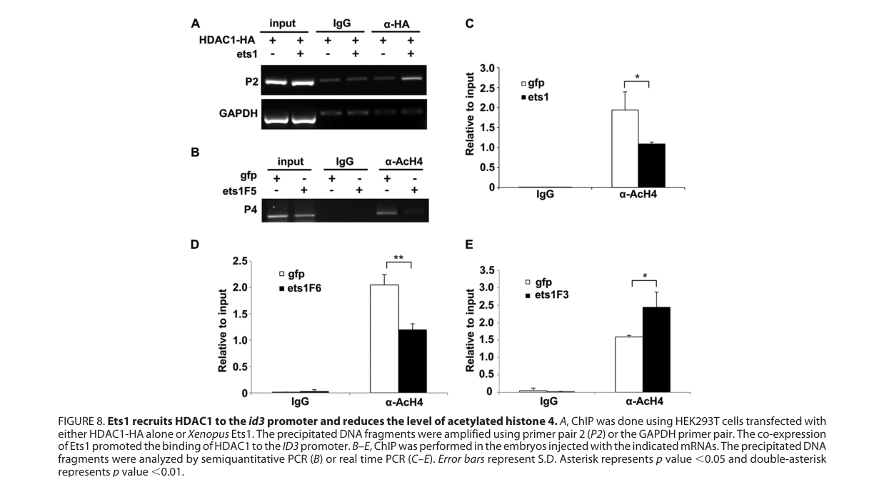

## Question

# Gene Research for Functional Annotation

## ⚠️ CRITICAL: Gene/Protein Identification Context

**BEFORE YOU BEGIN RESEARCH:** You MUST verify you are researching the CORRECT gene/protein. Gene symbols can be ambiguous, especially for less well-characterized genes from non-model organisms.

### Target Gene/Protein Identity (from UniProt):
- **UniProt Accession:** P18755
- **Protein Description:** RecName: Full=Protein c-ets-1-A; Short=C-ets-1A;
- **Gene Information:** Name=ets1-a;
- **Organism (full):** Xenopus laevis (African clawed frog).
- **Protein Family:** Belongs to the ETS family. .
- **Key Domains:** Ets1_N_flank. (IPR045688); Ets_dom. (IPR000418); ETS_fam. (IPR046328); Pointed_dom. (IPR003118); SAM/pointed_sf. (IPR013761)

### MANDATORY VERIFICATION STEPS:

1. **Check if the gene symbol "ets1-a" matches the protein description above**
2. **Verify the organism is correct:** Xenopus laevis (African clawed frog).
3. **Check if protein family/domains align with what you find in literature**
4. **If you find literature for a DIFFERENT gene with the same or similar symbol, STOP**

### If Gene Symbol is Ambiguous or You Cannot Find Relevant Literature:

**DO NOT PROCEED WITH RESEARCH ON A DIFFERENT GENE.** Instead:
- State clearly: "The gene symbol 'ets1-a' is ambiguous or literature is limited for this specific protein"
- Explain what you found (e.g., "Found extensive literature on a different gene with the same symbol in a different organism")
- Describe the protein based ONLY on the UniProt information provided above
- Suggest that the protein function can be inferred from domain/family information

### Research Target:

Please provide a comprehensive research report on the gene **ets1-a** (gene ID: ets1-a, UniProt: P18755) in XENLA.

The research report should be a detailed narrative explaining the function, biological processes, and localization of the gene product. Citations should be given for all claims.

You should prioritize authoritative reviews and primary scientific literature when conducting research. You can supplement
this with annotations you find in gene/protein databases, but these can be outdated or inaccurate.

We are specifically interested in the primary function of the gene - for enzymes, what reaction is catalyzed, and what is the substrate specificity? For transporters, what is the substrate? For structural proteins or adapters, what is the broader structural role? For signaling molecules, what is the role in the pathway.

We are interested in where in or outside the cell the gene product carries out its function.

We are also interested in the signaling or biochemical pathways in which the gene functions. We are less interested in broad pleiotropic effects, except where these elucidate the precise role.

Include evidence where possible. We are interested in both experimental evidence as well as inference from structure, evolution, or bioinformatic analysis. Precise studies should be prioritized over high-throughput, where available.

## Output

Question: You are an expert researcher providing comprehensive, well-cited information.

Provide detailed information focusing on:
1. Key concepts and definitions with current understanding
2. Recent developments and latest research (prioritize 2023-2024 sources)
3. Current applications and real-world implementations
4. Expert opinions and analysis from authoritative sources
5. Relevant statistics and data from recent studies

Format as a comprehensive research report with proper citations. Include URLs and publication dates where available.
Always prioritize recent, authoritative sources and provide specific citations for all major claims.

# Gene Research for Functional Annotation

## ⚠️ CRITICAL: Gene/Protein Identification Context

**BEFORE YOU BEGIN RESEARCH:** You MUST verify you are researching the CORRECT gene/protein. Gene symbols can be ambiguous, especially for less well-characterized genes from non-model organisms.

### Target Gene/Protein Identity (from UniProt):
- **UniProt Accession:** P18755
- **Protein Description:** RecName: Full=Protein c-ets-1-A; Short=C-ets-1A;
- **Gene Information:** Name=ets1-a;
- **Organism (full):** Xenopus laevis (African clawed frog).
- **Protein Family:** Belongs to the ETS family. .
- **Key Domains:** Ets1_N_flank. (IPR045688); Ets_dom. (IPR000418); ETS_fam. (IPR046328); Pointed_dom. (IPR003118); SAM/pointed_sf. (IPR013761)

### MANDATORY VERIFICATION STEPS:

1. **Check if the gene symbol "ets1-a" matches the protein description above**
2. **Verify the organism is correct:** Xenopus laevis (African clawed frog).
3. **Check if protein family/domains align with what you find in literature**
4. **If you find literature for a DIFFERENT gene with the same or similar symbol, STOP**

### If Gene Symbol is Ambiguous or You Cannot Find Relevant Literature:

**DO NOT PROCEED WITH RESEARCH ON A DIFFERENT GENE.** Instead:
- State clearly: "The gene symbol 'ets1-a' is ambiguous or literature is limited for this specific protein"
- Explain what you found (e.g., "Found extensive literature on a different gene with the same symbol in a different organism")
- Describe the protein based ONLY on the UniProt information provided above
- Suggest that the protein function can be inferred from domain/family information

### Research Target:

Please provide a comprehensive research report on the gene **ets1-a** (gene ID: ets1-a, UniProt: P18755) in XENLA.

The research report should be a detailed narrative explaining the function, biological processes, and localization of the gene product. Citations should be given for all claims.

You should prioritize authoritative reviews and primary scientific literature when conducting research. You can supplement
this with annotations you find in gene/protein databases, but these can be outdated or inaccurate.

We are specifically interested in the primary function of the gene - for enzymes, what reaction is catalyzed, and what is the substrate specificity? For transporters, what is the substrate? For structural proteins or adapters, what is the broader structural role? For signaling molecules, what is the role in the pathway.

We are interested in where in or outside the cell the gene product carries out its function.

We are also interested in the signaling or biochemical pathways in which the gene functions. We are less interested in broad pleiotropic effects, except where these elucidate the precise role.

Include evidence where possible. We are interested in both experimental evidence as well as inference from structure, evolution, or bioinformatic analysis. Precise studies should be prioritized over high-throughput, where available.

# Functional annotation report: *ets1-a* (UniProt P18755), *Xenopus laevis*

## Identity and interpretation of the evidence

**The target is the African clawed frog protein c-Ets-1A, encoded by *ets1-a*/*ets1a*, not human ETS1 or the *Xenopus tropicalis ets1* protein.** The supplied UniProt record identifies P18755 as an ETS-family protein with an ETS DNA-binding domain, an Ets1 N-terminal flank, and a pointed/SAM-related domain. This assignment agrees with experimental work that explicitly cloned the *X. laevis ets1a* open reading frame and distinguished it from the second *X. laevis* copy, *ets1b*. **The gene symbol 'ets1-a' is ambiguous or literature is limited for this specific protein:** much of the developmental literature calls the proteins collectively “Ets1,” and its loss-of-function reagents reduce both copies. Consequently, those experiments establish a role for *X. laevis* Ets1 activity, **not a uniquely demonstrated endogenous requirement for P18755**. (wang2015theprotooncogenetranscription pages 2-3, wang2015theprotooncogenetranscription pages 3-4, nie2015dualdevelopmentalrole pages 6-7)

## Primary molecular function and site of action

**Ets1-A is a sequence-specific transcriptional regulator, not an enzyme, transporter, or extracellular structural protein.** Its ETS domain supports DNA-associated transcriptional control; in experimentally expressed *X. laevis* Ets1a, the ETS-containing region also mediates association with histone deacetylase 1 (HDAC1). The most clearly established frog genomic target is the BMP-responsive ***id3* promoter**: FLAG-tagged frog Ets1a occupied its predicted binding region in embryo chromatin-immunoprecipitation assays. Co-immunoprecipitation, deletion constructs and promoter-chromatin assays support a model in which Ets1-associated HDAC1 lowers local histone-H4 acetylation and *id3* expression. **HDAC1, rather than Ets1-A, supplies the deacetylase activity**; the study did not establish the complete set of DNA sequences or genes recognized by endogenous P18755. (wang2015theprotooncogenetranscription pages 2-3, wang2015theprotooncogenetranscription pages 7-9, wang2015theprotooncogenetranscription pages 9-10, wang2015theprotooncogenetranscription media 4bc0cb80)

Ets1-A’s **functional site is inferred to be the nucleus**, because it acts at a chromatin-bound promoter and participates in transcriptional regulation. The retrieved frog experiments demonstrate promoter occupancy by expressed tagged Ets1a, but do not establish a quantitative, endogenous Ets1a-versus-Ets1b subcellular distribution. Tissue expression should therefore not be mistaken for a protein-localization assay. (wang2015theprotooncogenetranscription pages 2-3, wang2015theprotooncogenetranscription pages 7-9)

At the tissue level, *ets1a* transcripts occur in **premigratory and migrating cranial neural crest**, including streams that contribute to the cardiac neural crest, and in **presumptive heart mesoderm**. Compared with *ets1a*, *ets1b* is more prominent in presumptive crest and persists more broadly in the later first heart field; *ets1a* becomes increasingly restricted to blood islands there. Earlier *ets-1* expression mapping also detected transcripts in neural-crest derivatives and developing vascular/endothelial territories, although those older assays did not assign every signal to the modern *ets1a* homeolog. These are embryonic expression sites, not evidence of secretion into blood or extracellular space. (nie2015dualdevelopmentalrole pages 6-7, nie2015dualdevelopmentalrole pages 18-20, meyer1997ets1andets2 pages 1-1, meyer1997ets1andets2 pages 5-6)

## Developmental pathways and biological processes

**FGF inputs and BMP-output control.** In *X. laevis* embryos, inhibition of FGF signaling reduced *ets1* expression, whereas eFGF induced it in animal-cap experiments; Wnt3a gave a weaker induction. The authors also placed *ets1* downstream of the neural-crest regulator Lrig3. These experiments identify upstream regulatory inputs but do not establish that each acts specifically on endogenous *ets1a* rather than *ets1b*. (wang2015theprotooncogenetranscription pages 3-4)

Downstream, excess cloned Ets1a **attenuated transcriptional output from the BMP pathway without reducing Smad1/5/8 phosphorylation**. Ets1a repressed *id3*, while added Id3 partially relieved repression of neural-crest markers. The Ets1–HDAC1 interaction and decreased promoter histone acetylation provide a more precise mechanism than describing Ets1-A simply as a BMP inhibitor: it regulates a BMP-responsive gene **at the level of transcriptional/chromatin output**, rather than demonstrably blocking BMP receptors or Smad phosphorylation. Pharmacological HDAC inhibition reversed Ets1-dependent repression of *foxd3*, although that intervention does not by itself prove that HDAC1 is the only relevant deacetylase in vivo. The promoter-binding and acetylation experiments are illustrated in the study’s Figure 8. (wang2015theprotooncogenetranscription pages 7-9, wang2015theprotooncogenetranscription pages 9-10, wang2015theprotooncogenetranscription media 4bc0cb80)

**Neural-crest migration is the best-supported developmental role of combined Ets1 activity.** In whole *X. laevis* embryos, reducing both homeologs did **not obviously prevent initial** *foxd3* and *snail2* expression, but neural-crest cells subsequently failed to extend and segregate normally into migratory streams. For one morpholino, disrupted cranial-crest segmentation/extension was observed in **17/20 (85%)** and **20/24 (83%)** embryos in reported assays. Independently, transplantation of Ets1-depleted cranial-crest tissue into wild-type hosts supported a requirement within the crest for normal migration. Thus, impaired migration and delamination are better-established physiological outcomes than an absolute requirement for initial whole-embryo crest induction. The effects of ectopic high-dose Ets1a are different: excess expression represses crest markers, consistent with a dosage- and context-dependent regulatory role, not a simple one-directional specification switch. (wang2015theprotooncogenetranscription pages 6-7, wang2015theprotooncogenetranscription pages 4-6, nie2015dualdevelopmentalrole pages 6-7)

**Heart development involves two distinguishable tissues.** Fate-map-guided Ets1 knockdown in neural crest disrupted its migration and was associated with malformed or missing aortic arch arteries and a misshapen outflow tract. Targeting presumptive **heart mesoderm** instead caused much more severe endocardial and heart-tube defects, including diminished endocardial tissue and absent ventricular trabeculae; expression of the cardiac marker *Tbx20* was reduced in **15/19** embryos in a reported assay, and cardiac gene expression was rescued by Ets1 add-back. These experiments show distinct tissue requirements but used a morpholino recognizing both Ets1a and Ets1b. They **do not identify a direct Ets1a DNA target responsible for endocardium formation**, nor demonstrate that P18755 alone accounts for the cardiac phenotype. (nie2015dualdevelopmentalrole pages 6-7, nie2015dualdevelopmentalrole pages 4-6, nie2015dualdevelopmentalrole pages 8-10)

**Additional, more tentative regulatory links.** In *X. laevis*, Ets1 manipulation altered expression of ***msmb3L***: overexpression increased it and knockdown reduced it. *msmb3L* depletion itself disturbed crest migration, with abnormal *sox10*-marked streams in **9/13 (69.2%)** embryos at stage 20. However, ChIP did **not** detect Ets1 binding at the tested proximal *msmb3L* promoter site, so direct regulation at that site is unsupported. The underlying *ets1* knockout RNA-seq discovery was performed in ***X. tropicalis***, not in an *X. laevis ets1a*-specific mutant. Separately, embryo immunoprecipitation showed association of Ets1 with the transcriptional cofactor Vgll3; co-expression increased an MCAT-sequence reporter by approximately **1.7-fold** in cultured cells. Neither study demonstrates an indispensable, homeolog-specific Ets1-A interaction at a native neural-crest target. (wang2020rna‐seqanalysison pages 8-10, wang2020rna‐seqanalysison pages 2-4, simon2017vestigiallike3is pages 8-11)

The following evidence summary separates protein-specific constructs from shared-homeolog perturbations:

| Finding | Strongest primary assay | Paralog-specific status | Key citation |
|---|---|---|---|
| Ectopically expressed Ets1 binds the *id3* promoter, recruits HDAC1, and reduces local histone-H4 acetylation, supporting direct repression of BMP-responsive *id3*. | *X. laevis* embryo ChIP, co-immunoprecipitation, deletion mapping, and promoter histone-acetylation assays | **Ets1a-derived construct:** the cloned open reading frame was explicitly *X. laevis ets1a*, making this the closest protein-specific evidence for P18755; however, it tests tagged or overexpressed protein rather than endogenous native P18755 alone. | (wang2015theprotooncogenetranscription pages 2-3, wang2015theprotooncogenetranscription pages 7-9, wang2015theprotooncogenetranscription media 4bc0cb80) |
| Combined Ets1 depletion blocks cranial neural-crest migration or stream extension: 85% (17/20) and 83% (20/24) in representative experiments. | Antisense-morpholino loss of function followed by whole-mount marker analysis | **Not P18755-specific:** reagents depleted both *ets1a* and *ets1b*, so the phenotype establishes combined Ets1-homeolog function, not a unique endogenous role for Ets1a/P18755. | (wang2015theprotooncogenetranscription pages 6-7, wang2015theprotooncogenetranscription pages 4-6) |
| Ets1 has separable tissue-autonomous roles: it supports cardiac neural-crest migration and is required in heart mesoderm for endocardial and cardiac development; mesodermal knockdown reduced *Tbx20* in 15/19 embryos. | Fate-map-targeted morpholino injection, neural-crest transplantation, cardiac histology, in situ hybridization, and rescue | **Not P18755-specific:** the shared translation-blocking morpholino targeted Ets1a and Ets1b; both homeologs are expressed in these tissues, with Ets1b reported as more prominent. | (nie2015dualdevelopmentalrole pages 6-7, nie2015dualdevelopmentalrole pages 8-10) |
| Ets1 positively regulates *msmb3L* expression, but ChIP did **not** detect binding at the predicted proximal *msmb3L* promoter site; regulation may therefore be indirect or occur through another element. | *X. laevis* gain- and loss-of-function RT-PCR plus FLAG-Ets1 ChIP-qPCR, with *id3* as a positive control | **Not P18755-specific:** experiments refer to Ets1 without demonstrating an Ets1a-only endogenous effect; direct promoter occupancy was negative. | (wang2020rna‐seqanalysison pages 8-10) |
| Vgll3 interacts with Ets1 in embryos, and co-expression stimulated an MCAT reporter by approximately 1.7-fold. | Embryo immunoprecipitation and HEK293 luciferase-reporter assay | **Not P18755-specific:** the study did not distinguish Ets1a from Ets1b, and the reporter result does not prove that the interaction is required for endogenous neural-crest transcription. | (simon2017vestigiallike3is pages 8-11) |

*Table: Primary evidence for Xenopus laevis ets1-a/P18755, with explicit separation of Ets1a-derived construct results from experiments that jointly perturb ets1a and ets1b. This prevents combined-homeolog phenotypes from being overstated as native P18755-specific functions.*

## Current use, recent research, and limitations

The **real-world application of these findings is experimental functional annotation and developmental modeling**: accessible *Xenopus* embryos permit spatially targeted perturbation, crest transplantation, promoter-ChIP assays, and separate assessment of neural-crest and cardiac-mesoderm contributions to heart formation. Comparisons with human congenital-heart phenotypes are biologically informative, but the frog studies are **not a clinical validation of P18755 as a therapeutic target**. (nie2015dualdevelopmentalrole pages 4-6, nie2015dualdevelopmentalrole pages 3-4)

**Recency assessment.** The strongest direct *X. laevis* mechanistic studies identified here were published in **2015** and **2017**; the **2020** follow-up tested *X. laevis msmb3L* while deriving its mutant-transcriptome results from *X. tropicalis*. Retrieved **2024** cardiac-development synthesis discusses, among other topics, **human** ETS1-associated chromatin findings; it supplies no new experiment uniquely identifying frog Ets1-A/P18755 function. It would therefore be misleading to label human ETS1 results, *X. tropicalis* mutant data, or general 2023–2024 neural-crest findings as recent direct evidence for P18755. A remaining priority is an *ets1a*-selective endogenous perturbation with an *ets1b* comparison and rescue, coupled to endogenous protein-localization and target-occupancy measurements. (wang2015theprotooncogenetranscription pages 2-3, simon2017vestigiallike3is pages 8-11, wang2020rna‐seqanalysison pages 2-4, wang2020rna‐seqanalysison pages 8-10, li2024themolecularmechanisms pages 6-7)

### Principal sources and publication dates

- Wang **et al.**, “The Proto-oncogene Transcription Factor Ets1 Regulates Neural Crest Development through Histone Deacetylase 1 to Mediate Output of Bone Morphogenetic Protein Signaling,” *Journal of Biological Chemistry*, **4 September 2015**. https://doi.org/10.1074/jbc.M115.644864. Primary *X. laevis ets1a*-construct, promoter and combined-homeolog perturbation study. (wang2015theprotooncogenetranscription pages 2-3, wang2015theprotooncogenetranscription pages 7-9)
- Nie and Bronner, “Dual developmental role of transcriptional regulator Ets1 in Xenopus cardiac neural crest vs. heart mesoderm,” *Cardiovascular Research*, **April 2015**. https://doi.org/10.1093/cvr/cvv043. Primary tissue-targeting, transplantation and cardiac-phenotype study. (nie2015dualdevelopmentalrole pages 6-7, nie2015dualdevelopmentalrole pages 4-6)
- Simon **et al.**, “Vestigial-like 3 is a novel Ets1 interacting partner and regulates trigeminal nerve formation and cranial neural crest migration,” *Biology Open*, **September 2017**. https://doi.org/10.1242/bio.026153. Primary interaction and reporter evidence. (simon2017vestigiallike3is pages 8-11)
- Wang **et al.**, “RNA-Seq analysis on *ets1* mutant embryos of *Xenopus tropicalis* identifies microseminoprotein beta gene 3 as an essential regulator of neural crest migration,” *FASEB Journal*, **2020**. https://doi.org/10.1096/fj.202000603R. Distinguishes *X. tropicalis* RNA-seq from *X. laevis* follow-up assays. (wang2020rna‐seqanalysison pages 2-4, wang2020rna‐seqanalysison pages 8-10)
- Meyer **et al.**, “Ets-1 and Ets-2 proto-oncogenes exhibit differential and restricted expression patterns during *Xenopus laevis* oogenesis and embryogenesis,” *International Journal of Developmental Biology*, **August 1997**. https://doi.org/10.1387/ijdb.9303349. Primary developmental-expression evidence with older, non-homeolog-specific nomenclature. (meyer1997ets1andets2 pages 1-1, meyer1997ets1andets2 pages 1-2)
- Li **et al.**, “The molecular mechanisms of cardiac development and related diseases,” *Signal Transduction and Targeted Therapy*, **December 2024**. https://doi.org/10.1038/s41392-024-02069-8. Recent broader review, **not** direct evidence for frog P18755. (li2024themolecularmechanisms pages 6-7)

References

1. (wang2015theprotooncogenetranscription pages 2-3): Chengdong Wang, Richard Kin Ting Kam, Weili Shi, Yin Xia, Xiongfong Chen, Ying Cao, Jianmin Sun, Yanzhi Du, Gang Lu, Zijiang Chen, Wood Yee Chan, Sun On Chan, Yi Deng, and Hui Zhao. The proto-oncogene transcription factor ets1 regulates neural crest development through histone deacetylase 1 to mediate output of bone morphogenetic protein signaling. Journal of Biological Chemistry, 290:21925-21938, Sep 2015. URL: https://doi.org/10.1074/jbc.m115.644864, doi:10.1074/jbc.m115.644864. This article has 58 citations and is from a domain leading peer-reviewed journal.

2. (wang2015theprotooncogenetranscription pages 3-4): Chengdong Wang, Richard Kin Ting Kam, Weili Shi, Yin Xia, Xiongfong Chen, Ying Cao, Jianmin Sun, Yanzhi Du, Gang Lu, Zijiang Chen, Wood Yee Chan, Sun On Chan, Yi Deng, and Hui Zhao. The proto-oncogene transcription factor ets1 regulates neural crest development through histone deacetylase 1 to mediate output of bone morphogenetic protein signaling. Journal of Biological Chemistry, 290:21925-21938, Sep 2015. URL: https://doi.org/10.1074/jbc.m115.644864, doi:10.1074/jbc.m115.644864. This article has 58 citations and is from a domain leading peer-reviewed journal.

3. (nie2015dualdevelopmentalrole pages 6-7): Shuyi Nie and Marianne E. Bronner. Dual developmental role of transcriptional regulator ets1 in xenopus cardiac neural crest vs. heart mesoderm. Cardiovascular research, 106 1:67-75, Apr 2015. URL: https://doi.org/10.1093/cvr/cvv043, doi:10.1093/cvr/cvv043. This article has 50 citations and is from a domain leading peer-reviewed journal.

4. (wang2015theprotooncogenetranscription pages 7-9): Chengdong Wang, Richard Kin Ting Kam, Weili Shi, Yin Xia, Xiongfong Chen, Ying Cao, Jianmin Sun, Yanzhi Du, Gang Lu, Zijiang Chen, Wood Yee Chan, Sun On Chan, Yi Deng, and Hui Zhao. The proto-oncogene transcription factor ets1 regulates neural crest development through histone deacetylase 1 to mediate output of bone morphogenetic protein signaling. Journal of Biological Chemistry, 290:21925-21938, Sep 2015. URL: https://doi.org/10.1074/jbc.m115.644864, doi:10.1074/jbc.m115.644864. This article has 58 citations and is from a domain leading peer-reviewed journal.

5. (wang2015theprotooncogenetranscription pages 9-10): Chengdong Wang, Richard Kin Ting Kam, Weili Shi, Yin Xia, Xiongfong Chen, Ying Cao, Jianmin Sun, Yanzhi Du, Gang Lu, Zijiang Chen, Wood Yee Chan, Sun On Chan, Yi Deng, and Hui Zhao. The proto-oncogene transcription factor ets1 regulates neural crest development through histone deacetylase 1 to mediate output of bone morphogenetic protein signaling. Journal of Biological Chemistry, 290:21925-21938, Sep 2015. URL: https://doi.org/10.1074/jbc.m115.644864, doi:10.1074/jbc.m115.644864. This article has 58 citations and is from a domain leading peer-reviewed journal.

6. (wang2015theprotooncogenetranscription media 4bc0cb80): Chengdong Wang, Richard Kin Ting Kam, Weili Shi, Yin Xia, Xiongfong Chen, Ying Cao, Jianmin Sun, Yanzhi Du, Gang Lu, Zijiang Chen, Wood Yee Chan, Sun On Chan, Yi Deng, and Hui Zhao. The proto-oncogene transcription factor ets1 regulates neural crest development through histone deacetylase 1 to mediate output of bone morphogenetic protein signaling. Journal of Biological Chemistry, 290:21925-21938, Sep 2015. URL: https://doi.org/10.1074/jbc.m115.644864, doi:10.1074/jbc.m115.644864. This article has 58 citations and is from a domain leading peer-reviewed journal.

7. (nie2015dualdevelopmentalrole pages 18-20): Shuyi Nie and Marianne E. Bronner. Dual developmental role of transcriptional regulator ets1 in xenopus cardiac neural crest vs. heart mesoderm. Cardiovascular research, 106 1:67-75, Apr 2015. URL: https://doi.org/10.1093/cvr/cvv043, doi:10.1093/cvr/cvv043. This article has 50 citations and is from a domain leading peer-reviewed journal.

8. (meyer1997ets1andets2 pages 1-1): David E. Meyer, Marcel Durliat, F. Senan, Michael W. Wolff, Michèle André, J. Hourdry, and Par Julien Remy. Ets-1 and ets-2 proto-oncogenes exhibit differential and restricted expression patterns during xenopus laevis oogenesis and embryogenesis. The International journal of developmental biology, 41 4:607-20, Aug 1997. URL: https://doi.org/10.1387/ijdb.9303349, doi:10.1387/ijdb.9303349. This article has 68 citations.

9. (meyer1997ets1andets2 pages 5-6): David E. Meyer, Marcel Durliat, F. Senan, Michael W. Wolff, Michèle André, J. Hourdry, and Par Julien Remy. Ets-1 and ets-2 proto-oncogenes exhibit differential and restricted expression patterns during xenopus laevis oogenesis and embryogenesis. The International journal of developmental biology, 41 4:607-20, Aug 1997. URL: https://doi.org/10.1387/ijdb.9303349, doi:10.1387/ijdb.9303349. This article has 68 citations.

10. (wang2015theprotooncogenetranscription pages 6-7): Chengdong Wang, Richard Kin Ting Kam, Weili Shi, Yin Xia, Xiongfong Chen, Ying Cao, Jianmin Sun, Yanzhi Du, Gang Lu, Zijiang Chen, Wood Yee Chan, Sun On Chan, Yi Deng, and Hui Zhao. The proto-oncogene transcription factor ets1 regulates neural crest development through histone deacetylase 1 to mediate output of bone morphogenetic protein signaling. Journal of Biological Chemistry, 290:21925-21938, Sep 2015. URL: https://doi.org/10.1074/jbc.m115.644864, doi:10.1074/jbc.m115.644864. This article has 58 citations and is from a domain leading peer-reviewed journal.

11. (wang2015theprotooncogenetranscription pages 4-6): Chengdong Wang, Richard Kin Ting Kam, Weili Shi, Yin Xia, Xiongfong Chen, Ying Cao, Jianmin Sun, Yanzhi Du, Gang Lu, Zijiang Chen, Wood Yee Chan, Sun On Chan, Yi Deng, and Hui Zhao. The proto-oncogene transcription factor ets1 regulates neural crest development through histone deacetylase 1 to mediate output of bone morphogenetic protein signaling. Journal of Biological Chemistry, 290:21925-21938, Sep 2015. URL: https://doi.org/10.1074/jbc.m115.644864, doi:10.1074/jbc.m115.644864. This article has 58 citations and is from a domain leading peer-reviewed journal.

12. (nie2015dualdevelopmentalrole pages 4-6): Shuyi Nie and Marianne E. Bronner. Dual developmental role of transcriptional regulator ets1 in xenopus cardiac neural crest vs. heart mesoderm. Cardiovascular research, 106 1:67-75, Apr 2015. URL: https://doi.org/10.1093/cvr/cvv043, doi:10.1093/cvr/cvv043. This article has 50 citations and is from a domain leading peer-reviewed journal.

13. (nie2015dualdevelopmentalrole pages 8-10): Shuyi Nie and Marianne E. Bronner. Dual developmental role of transcriptional regulator ets1 in xenopus cardiac neural crest vs. heart mesoderm. Cardiovascular research, 106 1:67-75, Apr 2015. URL: https://doi.org/10.1093/cvr/cvv043, doi:10.1093/cvr/cvv043. This article has 50 citations and is from a domain leading peer-reviewed journal.

14. (wang2020rna‐seqanalysison pages 8-10): Chengdong Wang, Xufeng Qi, Xiang Zhou, Jianmin Sun, Dongqing Cai, Gang Lu, Xiongfong Chen, Zhihua Jiang, Yong‐Gang Yao, Wai Yee Chan, and Hui Zhao. Rna‐seq analysis on ets1 mutant embryos of xenopus tropicalis identifies microseminoprotein beta gene 3 as an essential regulator of neural crest migration. The FASEB Journal, 34:12726-12738, Jul 2020. URL: https://doi.org/10.1096/fj.202000603r, doi:10.1096/fj.202000603r. This article has 8 citations.

15. (wang2020rna‐seqanalysison pages 2-4): Chengdong Wang, Xufeng Qi, Xiang Zhou, Jianmin Sun, Dongqing Cai, Gang Lu, Xiongfong Chen, Zhihua Jiang, Yong‐Gang Yao, Wai Yee Chan, and Hui Zhao. Rna‐seq analysis on ets1 mutant embryos of xenopus tropicalis identifies microseminoprotein beta gene 3 as an essential regulator of neural crest migration. The FASEB Journal, 34:12726-12738, Jul 2020. URL: https://doi.org/10.1096/fj.202000603r, doi:10.1096/fj.202000603r. This article has 8 citations.

16. (simon2017vestigiallike3is pages 8-11): Emilie Simon, Nadine Thézé, Sandrine Fédou, Pierre Thiébaud, and Corinne Faucheux. Vestigial-like 3 is a novel ets1 interacting partner and regulates trigeminal nerve formation and cranial neural crest migration. Biology Open, 6:1528-1540, Sep 2017. URL: https://doi.org/10.1242/bio.026153, doi:10.1242/bio.026153. This article has 40 citations and is from a peer-reviewed journal.

17. (nie2015dualdevelopmentalrole pages 3-4): Shuyi Nie and Marianne E. Bronner. Dual developmental role of transcriptional regulator ets1 in xenopus cardiac neural crest vs. heart mesoderm. Cardiovascular research, 106 1:67-75, Apr 2015. URL: https://doi.org/10.1093/cvr/cvv043, doi:10.1093/cvr/cvv043. This article has 50 citations and is from a domain leading peer-reviewed journal.

18. (li2024themolecularmechanisms pages 6-7): Yingrui Li, Jianlin Du, Songbai Deng, Bin Liu, X. Jing, Yuling Yan, Ya-jie Liu, Jing Wang, Xiaobo Zhou, and Qiang She. The molecular mechanisms of cardiac development and related diseases. Signal Transduction and Targeted Therapy, Dec 2024. URL: https://doi.org/10.1038/s41392-024-02069-8, doi:10.1038/s41392-024-02069-8. This article has 133 citations and is from a peer-reviewed journal.

19. (meyer1997ets1andets2 pages 1-2): David E. Meyer, Marcel Durliat, F. Senan, Michael W. Wolff, Michèle André, J. Hourdry, and Par Julien Remy. Ets-1 and ets-2 proto-oncogenes exhibit differential and restricted expression patterns during xenopus laevis oogenesis and embryogenesis. The International journal of developmental biology, 41 4:607-20, Aug 1997. URL: https://doi.org/10.1387/ijdb.9303349, doi:10.1387/ijdb.9303349. This article has 68 citations.

## Artifacts

- [Edison artifact artifact-00](ets1-a-deep-research-falcon_artifacts/artifact-00.md)

## Citations

1. wang2015theprotooncogenetranscription pages 3-4
2. li2024themolecularmechanisms pages 6-7
3. wang2015theprotooncogenetranscription pages 2-3
4. nie2015dualdevelopmentalrole pages 6-7
5. wang2015theprotooncogenetranscription pages 7-9
6. wang2015theprotooncogenetranscription pages 9-10
7. nie2015dualdevelopmentalrole pages 18-20
8. wang2015theprotooncogenetranscription pages 6-7
9. wang2015theprotooncogenetranscription pages 4-6
10. nie2015dualdevelopmentalrole pages 4-6
11. nie2015dualdevelopmentalrole pages 8-10
12. nie2015dualdevelopmentalrole pages 3-4
13. https://doi.org/10.1074/jbc.M115.644864.
14. https://doi.org/10.1093/cvr/cvv043.
15. https://doi.org/10.1242/bio.026153.
16. https://doi.org/10.1096/fj.202000603R.
17. https://doi.org/10.1387/ijdb.9303349.
18. https://doi.org/10.1038/s41392-024-02069-8.
19. https://doi.org/10.1074/jbc.m115.644864,
20. https://doi.org/10.1093/cvr/cvv043,
21. https://doi.org/10.1387/ijdb.9303349,
22. https://doi.org/10.1096/fj.202000603r,
23. https://doi.org/10.1242/bio.026153,
24. https://doi.org/10.1038/s41392-024-02069-8,