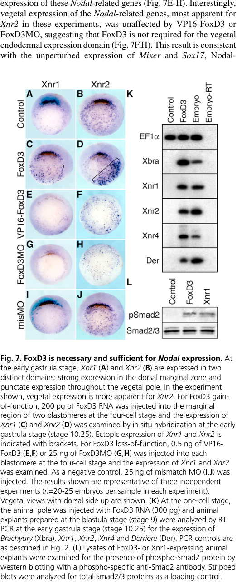

## Question

# Gene Research for Functional Annotation

## ⚠️ CRITICAL: Gene/Protein Identification Context

**BEFORE YOU BEGIN RESEARCH:** You MUST verify you are researching the CORRECT gene/protein. Gene symbols can be ambiguous, especially for less well-characterized genes from non-model organisms.

### Target Gene/Protein Identity (from UniProt):
- **UniProt Accession:** Q9DEN4
- **Protein Description:** RecName: Full=Forkhead box protein D3-A; Short=FoxD3-A; Short=FoxD3a; AltName: Full=Fork head domain-related protein 6; Short=FKH-6; Short=Forkhead protein 6; Short=xFD-6; Short=xFKH6;
- **Gene Information:** Name=foxd3-a; Synonyms=fkh6, foxd3a {ECO:0000312|EMBL:CAC12963.1};
- **Organism (full):** Xenopus laevis (African clawed frog).
- **Protein Family:** Not specified in UniProt
- **Key Domains:** FH_FOXD3. (IPR047392); Fork_head_dom. (IPR001766); FOX_domain-containing. (IPR050211); TF_fork_head_CS_2. (IPR030456); WH-like_DNA-bd_sf. (IPR036388)

### MANDATORY VERIFICATION STEPS:

1. **Check if the gene symbol "foxd3-a" matches the protein description above**
2. **Verify the organism is correct:** Xenopus laevis (African clawed frog).
3. **Check if protein family/domains align with what you find in literature**
4. **If you find literature for a DIFFERENT gene with the same or similar symbol, STOP**

### If Gene Symbol is Ambiguous or You Cannot Find Relevant Literature:

**DO NOT PROCEED WITH RESEARCH ON A DIFFERENT GENE.** Instead:
- State clearly: "The gene symbol 'foxd3-a' is ambiguous or literature is limited for this specific protein"
- Explain what you found (e.g., "Found extensive literature on a different gene with the same symbol in a different organism")
- Describe the protein based ONLY on the UniProt information provided above
- Suggest that the protein function can be inferred from domain/family information

### Research Target:

Please provide a comprehensive research report on the gene **foxd3-a** (gene ID: foxd3-a, UniProt: Q9DEN4) in XENLA.

The research report should be a detailed narrative explaining the function, biological processes, and localization of the gene product. Citations should be given for all claims.

You should prioritize authoritative reviews and primary scientific literature when conducting research. You can supplement
this with annotations you find in gene/protein databases, but these can be outdated or inaccurate.

We are specifically interested in the primary function of the gene - for enzymes, what reaction is catalyzed, and what is the substrate specificity? For transporters, what is the substrate? For structural proteins or adapters, what is the broader structural role? For signaling molecules, what is the role in the pathway.

We are interested in where in or outside the cell the gene product carries out its function.

We are also interested in the signaling or biochemical pathways in which the gene functions. We are less interested in broad pleiotropic effects, except where these elucidate the precise role.

Include evidence where possible. We are interested in both experimental evidence as well as inference from structure, evolution, or bioinformatic analysis. Precise studies should be prioritized over high-throughput, where available.

## Output

Question: You are an expert researcher providing comprehensive, well-cited information.

Provide detailed information focusing on:
1. Key concepts and definitions with current understanding
2. Recent developments and latest research (prioritize 2023-2024 sources)
3. Current applications and real-world implementations
4. Expert opinions and analysis from authoritative sources
5. Relevant statistics and data from recent studies

Format as a comprehensive research report with proper citations. Include URLs and publication dates where available.
Always prioritize recent, authoritative sources and provide specific citations for all major claims.

# Gene Research for Functional Annotation

## ⚠️ CRITICAL: Gene/Protein Identification Context

**BEFORE YOU BEGIN RESEARCH:** You MUST verify you are researching the CORRECT gene/protein. Gene symbols can be ambiguous, especially for less well-characterized genes from non-model organisms.

### Target Gene/Protein Identity (from UniProt):
- **UniProt Accession:** Q9DEN4
- **Protein Description:** RecName: Full=Forkhead box protein D3-A; Short=FoxD3-A; Short=FoxD3a; AltName: Full=Fork head domain-related protein 6; Short=FKH-6; Short=Forkhead protein 6; Short=xFD-6; Short=xFKH6;
- **Gene Information:** Name=foxd3-a; Synonyms=fkh6, foxd3a {ECO:0000312|EMBL:CAC12963.1};
- **Organism (full):** Xenopus laevis (African clawed frog).
- **Protein Family:** Not specified in UniProt
- **Key Domains:** FH_FOXD3. (IPR047392); Fork_head_dom. (IPR001766); FOX_domain-containing. (IPR050211); TF_fork_head_CS_2. (IPR030456); WH-like_DNA-bd_sf. (IPR036388)

### MANDATORY VERIFICATION STEPS:

1. **Check if the gene symbol "foxd3-a" matches the protein description above**
2. **Verify the organism is correct:** Xenopus laevis (African clawed frog).
3. **Check if protein family/domains align with what you find in literature**
4. **If you find literature for a DIFFERENT gene with the same or similar symbol, STOP**

### If Gene Symbol is Ambiguous or You Cannot Find Relevant Literature:

**DO NOT PROCEED WITH RESEARCH ON A DIFFERENT GENE.** Instead:
- State clearly: "The gene symbol 'foxd3-a' is ambiguous or literature is limited for this specific protein"
- Explain what you found (e.g., "Found extensive literature on a different gene with the same symbol in a different organism")
- Describe the protein based ONLY on the UniProt information provided above
- Suggest that the protein function can be inferred from domain/family information

### Research Target:

Please provide a comprehensive research report on the gene **foxd3-a** (gene ID: foxd3-a, UniProt: Q9DEN4) in XENLA.

The research report should be a detailed narrative explaining the function, biological processes, and localization of the gene product. Citations should be given for all claims.

You should prioritize authoritative reviews and primary scientific literature when conducting research. You can supplement
this with annotations you find in gene/protein databases, but these can be outdated or inaccurate.

We are specifically interested in the primary function of the gene - for enzymes, what reaction is catalyzed, and what is the substrate specificity? For transporters, what is the substrate? For structural proteins or adapters, what is the broader structural role? For signaling molecules, what is the role in the pathway.

We are interested in where in or outside the cell the gene product carries out its function.

We are also interested in the signaling or biochemical pathways in which the gene functions. We are less interested in broad pleiotropic effects, except where these elucidate the precise role.

Include evidence where possible. We are interested in both experimental evidence as well as inference from structure, evolution, or bioinformatic analysis. Precise studies should be prioritized over high-throughput, where available.

# Functional annotation report: *foxd3-a* (UniProt Q9DEN4), *Xenopus laevis*

## Identity and scope

The supplied UniProt identity specifies **FoxD3-A**, encoded by *foxd3-a* in the African clawed frog, *Xenopus laevis*. Its aliases include **XFD-6** and **XFKH-6/FKH-6**. This identification agrees with primary literature explicitly naming Xenopus FoxD3 “Xfd6/Xfkh6”; original XFD-6 studies also identify a conserved forkhead DNA-binding domain. Thus, the relevant protein is a **FoxD-family transcription factor**, not the similarly named FoxD2, FoxD4, FoxN3, or a FoxD3 protein from another species. (steiner2006foxd3regulationof pages 1-2, scheucher2004transcriptionpatternsof pages 1-2)

**Attribution limit:** Much experimental literature calls the reagent or transcript simply “Xenopus FoxD3” or “XFD-6,” without demonstrating that its assay distinguishes the Q9DEN4 *foxd3-a* product from any closely related *X. laevis* copy. The findings below support annotation of this identified FoxD3 lineage, but not an independently established, copy-exclusive phenotype for Q9DEN4. (lef2003aforkhead pages 2-3, steiner2006foxd3regulationof pages 1-2)

## Primary molecular function and cellular localization

**FoxD3 is a DNA-binding transcriptional regulator that acts predominantly as a repressor in the experimentally examined Xenopus organizer context.** Its conserved forkhead/winged-helix domain provides the DNA-binding function; substituting two conserved DNA-contact residues, N140A/H144A, abolished the mesoderm-inducing activity of native FoxD3 and of a repression-domain fusion. An Engrailed–FoxD3 repressor fusion retained native-like activity, whereas a VP16–FoxD3 activator fusion opposed it. FoxD3 also repressed reporter transcription approximately **15-fold** in gastrula explants. These are functional tests of repression, not proof that a particular endogenous gene is directly bound and repressed. (steiner2006foxd3regulationof pages 4-5)

**Site of action: the nucleus.** Immunocytochemistry detected nuclear FoxD3 protein after experimental expression, consistent with the DNA-binding assays and its role as a transcription factor. The protein is not itself the secreted Nodal signal: it changes gene expression within FoxD3-expressing cells, which can then affect neighboring cells through secreted signals. The available nuclear-protein observation does not establish a quantitative, tissue-wide distribution of endogenous Q9DEN4 protein. (steiner2006foxd3regulationof pages 6-7, steiner2006foxd3regulationof pages 4-5)

## Established developmental pathway: organizer → Nodal → Smad2

In the gastrula **Spemann organizer**, FoxD3 regulates dorsal mesoderm formation and body-axis development. Gain- and loss-of-function experiments place it **upstream of the Nodal-related ligands** Xnr1 and Xnr2 in the dorsal marginal zone: ectopic FoxD3 induced their expression, whereas FoxD3 morpholino or antagonistic VP16–FoxD3 reduced their organizer expression. FoxD3 also induced Xnr4 in animal-pole explants and increased phosphorylated Smad2. In contrast, the vegetal expression of the tested Nodal-related genes was comparatively preserved after FoxD3 inhibition, so its demonstrated requirement is spatially specific, not a universal requirement for Nodal expression. Figure 7 of the primary study documents the Xnr1/Xnr2 expression experiments. (steiner2006foxd3regulationof pages 7-8, steiner2006foxd3regulationof media 377ba223)

The causal pathway is supported by epistasis and signaling inhibition. A Nodal antagonist, Cerberus-short, or an inhibitor of Smad2-dependent transcription blocked FoxD3-induced mesodermal markers; FoxD3-expressing cells induced *Brachyury* in **adjacent cells lacking detectable FoxD3 protein**, demonstrating a non-cell-autonomous response. Providing Xnr1 reduced axial defects after FoxD3 knockdown from **75% (n = 24)** to **24% (n = 21)**, whereas FoxD3 knockdown did not block mesodermal responses to supplied Xnr1. Thus, FoxD3 regulates production or maintenance of an inducing signal upstream of Nodal–Smad2 signaling rather than serving as a Nodal receptor or Smad2 itself. (steiner2006foxd3regulationof pages 6-7, steiner2006foxd3regulationof pages 7-8)

The authors’ mechanistic interpretation is **indirect derepression**: FoxD3 may repress an inhibitor that would otherwise prevent organizer Nodal-gene expression. The relevant endogenous inhibitor and any direct FoxD3-bound regulatory element were **not identified** in these experiments. Although ectopic FoxD3 can induce Nodal expression, endogenous FoxD3 expression begins after the initial onset of organizer Nodal expression; **maintenance or amplification**, rather than initiation, is therefore the better-supported physiological role. In one rescue analysis, FoxD3 morpholino produced axial defects in **79% of embryos (30/38)**, reduced to **9% (5/54)** by morpholino-resistant FoxD3 RNA; these results strengthen the loss-of-function interpretation but are not homeolog-specific evidence. (steiner2006foxd3regulationof pages 8-9, steiner2006foxd3regulationof pages 9-10, steiner2006foxd3regulationof pages 4-5)

## Neural crest expression and regulatory context

FoxD3 has a second developmental context in the **neural crest**, a migratory embryonic progenitor population. Whole-mount in situ hybridization in *X. laevis* localized **XFD-6 transcripts to migrating cranial neural crest arising near the midbrain and hindbrain**. This identifies the cells expressing the gene, not an extracellular destination for FoxD3 protein. A 2024 single-cell neural-crest study places *foxd3* alongside *snail2* and *sox8* in an early, immature neural-crest expression program; its deeply resequenced whole-embryo series was from ***X. tropicalis***, so it should not be treated as a Q9DEN4-specific measurement. (scheucher2004transcriptionpatternsof pages 1-2, kotov2024atimeresolvedsinglecell pages 1-2)

For the **gastrula organizer**, canonical Wnt/β-catenin–TCF regulation is a supported upstream input to *foxd3*. In *X. laevis*, Tcf1 overexpression expanded *foxd3* expression in **75% of embryos (n = 61)**, while Tcf1 knockdown abolished expression in **50% (n = 86)**. Complementary experiments in ***X. tropicalis*** found approximately **threefold** *foxd3* upregulation after experimental Wnt activation and β-catenin enrichment at three regions near its locus. Because that chromatin-immunoprecipitation assay detected β-catenin rather than Tcf1 itself—and was performed in *X. tropicalis*—it supports a conserved Wnt-responsive regulatory connection, **not** direct proof of Tcf1 occupancy at the *X. laevis foxd3-a* locus. (janssens2013thewntsignaling pages 3-4, janssens2013thewntsignaling pages 4-5)

## Developments and research use in 2024

Recent *X. laevis* experiments use *foxd3* primarily as an **expression readout of neural-crest patterning**, not as a copy-specific molecular perturbation. Kaneshima and colleagues reported that increasing tissue contraction expanded the *Foxd3*-expressing region at approximately stages **12 and 15**; relaxing tension with blebbistatin or AaXKR reduced it. Their analysis links mechanical conditions to FGF/Wnt activity and neural-crest formation but does **not** show that FoxD3 itself senses mechanical force. Separately, Prdm15 knockdown reduced *foxd3* expression in migrating cranial neural crest at stage **23**; the study examined Wnt4-dependent rescue of developmental markers, without establishing direct PRDM15 binding to, or direct Wnt4 transcriptional control of, *foxd3-a*. (kaneshima2024enhancementofneural pages 1-2, kaneshima2024enhancementofneural pages 7-8, saumweber2024prdm15actsupstream pages 7-9, kaneshima2024enhancementofneural pages 5-7)

One practical research application is **generation of neural-crest-like cells from Xenopus blastula explants** using BMP-pathway inhibition and Wnt-pathway activation with CHIR99021. The induced transcriptional state included *foxd3*. Following transplantation, treated explants showed migration in **27/27** cases, compared with **0/20** vehicle controls, and populated pharyngeal arches as Sox9-positive cells in **14/14** assessed embryos, compared with **0/13** controls. This validates a neural-crest induction platform; it does **not** demonstrate that FoxD3 alone produces those behaviors or establish a therapeutic use for Q9DEN4. (huber2024smallmoleculemediatedreprogramming pages 4-6, huber2024smallmoleculemediatedreprogramming pages 1-3)

The evidence hierarchy and organism-specific limitations are summarized below.

| Feature | Strongest direct evidence and quantitative finding | Boundary / caveat | Primary source |
|---|---|---|---|
| Identity: FoxD3 = XFD-6/XFKH-6 | Xenopus FoxD3 is explicitly identified as the ortholog historically named **Xfd6/Xfkh6**, matching the Q9DEN4 aliases supplied for **foxd3-a**. | The historical experiments generally studied “Xenopus FoxD3/XFD-6” and did not resolve modern *X. laevis* homeologs; they therefore cannot automatically be assigned uniquely to Q9DEN4. | Steiner et al., *Development* (2006), [doi:10.1242/dev.02663](https://doi.org/10.1242/dev.02663) (steiner2006foxd3regulationof pages 1-2) |
| Nuclear forkhead transcriptional repressor | FoxD3 protein was detected in nuclei. Native FoxD3 repressed a reporter about **15-fold**; DNA-contact substitutions **N140A/H144A** abolished mesoderm induction, while an Engrailed-repressor fusion retained activity and a VP16-activator fusion antagonized it. | Demonstrates DNA-binding-dependent repression, but not direct occupancy or repression of a named endogenous target. Nuclear localization was shown after experimental expression. | Steiner et al., *Development* (2006), [doi:10.1242/dev.02663](https://doi.org/10.1242/dev.02663) (steiner2006foxd3regulationof pages 6-7, steiner2006foxd3regulationof pages 4-5) |
| Organizer Nodal–Smad2 pathway | FoxD3 induced **Xnr1, Xnr2 and Xnr4**, promoted Smad2 phosphorylation, and required Nodal/Smad2 signaling for mesoderm induction. FoxD3 knockdown produced axial defects in **75%** of embryos; co-injected **Xnr1** reduced this to **24%**. | Evidence supports FoxD3 acting upstream to maintain organizer Nodal expression by repressing an unidentified Nodal inhibitor; direct regulation of an *Xnr* locus was not established. | Steiner et al., *Development* (2006), [doi:10.1242/dev.02663](https://doi.org/10.1242/dev.02663) (steiner2006foxd3regulationof pages 6-7, steiner2006foxd3regulationof pages 7-8, steiner2006foxd3regulationof pages 9-10, steiner2006foxd3regulationof media 377ba223) |
| Tissue expression: cranial neural crest | Whole-mount in situ hybridization localized **XFD-6 transcripts to migrating neural crest cells originating from the mesencephalon and rhombencephalon**. | This is transcript localization, not subcellular protein localization or homeolog-specific functional evidence. | Scheucher et al., *Roux’s Archives of Developmental Biology* (1995), [doi:10.1007/BF00241274](https://doi.org/10.1007/BF00241274) (scheucher2004transcriptionpatternsof pages 1-2) |
| Canonical Wnt/β-catenin–Tcf1 upstream regulation | In *X. laevis*, Tcf1 overexpression expanded *foxd3* in **75%** of embryos (n=61), whereas Tcf1 knockdown abolished expression in **50%** (n=86). In *X. tropicalis*, Wnt activation raised *foxd3* mRNA about **3-fold**, and β-catenin ChIP enriched three regions near the *foxd3* locus. | The ChIP was performed in ***X. tropicalis*** and detected β-catenin/LEF-TCF complexes, not Tcf1 specifically; it is ortholog-level support rather than Q9DEN4/homeolog-specific evidence. | Janssens et al., *International Journal of Developmental Biology* (published online 8 March 2013), [doi:10.1387/ijdb.120191kv](https://doi.org/10.1387/ijdb.120191kv) (janssens2013thewntsignaling pages 3-4, janssens2013thewntsignaling pages 4-5) |
| 2024 neural-crest marker under mechanical regulation | At stages 12 and 15, increased contractile force expanded the *Foxd3*-expressing neural-crest region; blebbistatin or AaXKR-mediated tension relaxation reduced it (**p < 0.001** in reported categorical analyses). Force manipulation also altered FGF/Wnt activity. | *Foxd3* was an expression readout; the study did not perturb FoxD3 itself or distinguish *foxd3-a*/Q9DEN4 from another copy. | Kaneshima et al., *International Journal of Developmental Biology* (published online 2 April 2024), [doi:10.1387/ijdb.230273tm](https://doi.org/10.1387/ijdb.230273tm) (kaneshima2024enhancementofneural pages 1-2, kaneshima2024enhancementofneural pages 7-8, kaneshima2024enhancementofneural pages 5-7) |
| 2024 BMP-inhibition/Wnt-activation application | Stage-9 blastula explants treated with a BMP inhibitor plus CHIR99021 acquired a neural-crest transcriptional state including *foxd3*. Induced cells migrated after grafting in **27/27** cases versus **0/20** controls and populated pharyngeal arches as Sox9-positive cells in **14/14** cases versus **0/13** controls. | This is a neural-crest induction/reprogramming application, not evidence that FoxD3 alone causes the migration or differentiation, and it does not resolve the Q9DEN4 homeolog. | Huber & LaBonne, *Developmental Biology* (January 2024), [doi:10.1016/j.ydbio.2023.10.004](https://doi.org/10.1016/j.ydbio.2023.10.004) (huber2024smallmoleculemediatedreprogramming pages 4-6, huber2024smallmoleculemediatedreprogramming pages 1-3) |

*Table: Direct and supporting evidence for annotating Xenopus laevis foxd3-a/Q9DEN4, with quantitative findings and explicit species, target, and homeolog-resolution limitations.*

## Annotation conclusion

The most defensible primary annotation for **Q9DEN4/FoxD3-A** is **nuclear forkhead DNA-binding transcriptional regulator, experimentally supported as a repressor in Xenopus organizer assays**. Its best-resolved pathway function is to sustain **organizer Nodal-related gene expression**, enabling secreted Nodal-dependent **Smad2 signaling** and dorsal mesoderm induction; its expression in developing and migrating neural crest supports an additional neural-crest regulatory context. Neither a direct endogenous repression target explaining the Nodal effect nor a function proven unique to the *foxd3-a* copy was established by the cited experiments. (steiner2006foxd3regulationof pages 7-8, scheucher2004transcriptionpatternsof pages 1-2, steiner2006foxd3regulationof pages 4-5, steiner2006foxd3regulationof pages 9-10)

**Principal sources, with publication dates and URLs:** Steiner et al., *Development*, December 2006, https://doi.org/10.1242/dev.02663; Scheucher et al., *Roux’s Archives of Developmental Biology*, **1995** (the retrieved bibliographic record carries a later indexing date), https://doi.org/10.1007/BF00241274; Janssens et al., *International Journal of Developmental Biology*, published online **8 March 2013**, https://doi.org/10.1387/ijdb.120191kv; Kaneshima et al., *International Journal of Developmental Biology*, published online **2 April 2024**, https://doi.org/10.1387/ijdb.230273tm; Huber and LaBonne, *Developmental Biology*, **January 2024**, https://doi.org/10.1016/j.ydbio.2023.10.004; Saumweber et al., *Frontiers in Cell and Developmental Biology*, **February 2024**, https://doi.org/10.3389/fcell.2024.1316048; Kotov et al., *PNAS*, published **29 April 2024**, https://doi.org/10.1073/pnas.2311685121. (steiner2006foxd3regulationof pages 1-2, scheucher2004transcriptionpatternsof pages 1-2, janssens2013thewntsignaling pages 1-3, kaneshima2024enhancementofneural pages 1-2, huber2024smallmoleculemediatedreprogramming pages 1-3, saumweber2024prdm15actsupstream pages 7-9, kotov2024atimeresolvedsinglecell pages 1-2)

References

1. (steiner2006foxd3regulationof pages 1-2): Aaron B. Steiner, Mark J. Engleka, Qun Lu, Eileen C. Piwarzyk, Sergey Yaklichkin, Julie L. Lefebvre, James W. Walters, Liliam Pineda-Salgado, Patricia A. Labosky, and Daniel S. Kessler. Foxd3 regulation of nodal in the spemann organizer is essential for xenopus dorsal mesoderm development. Development, 133:4827-4838, Dec 2006. URL: https://doi.org/10.1242/dev.02663, doi:10.1242/dev.02663. This article has 56 citations and is from a domain leading peer-reviewed journal.

2. (scheucher2004transcriptionpatternsof pages 1-2): Michaela Scheucher, Petra Dege, Jutta Lef, Sigurd Hille, and Walter Kn�chel. Transcription patterns of four different fork head/hnf-3 related genes (xfd-4, 6, 9 and 10) in xenopus laevis embryos. Roux's archives of developmental biology, 204:203-211, Jan 2004. URL: https://doi.org/10.1007/bf00241274, doi:10.1007/bf00241274. This article has 22 citations.

3. (lef2003aforkhead pages 2-3): Jutta Lef, Petra Dege, M. Scheucher, V. Forsbach-Birk, Joachim H. Clement, and Walter Knöchel. A fork head related multigene family is transcribed in xenopus laevis embryos. The International journal of developmental biology, 40 1:245-53, Feb 2003. URL: https://doi.org/10.1387/ijdb.8735935, doi:10.1387/ijdb.8735935. This article has 27 citations.

4. (steiner2006foxd3regulationof pages 4-5): Aaron B. Steiner, Mark J. Engleka, Qun Lu, Eileen C. Piwarzyk, Sergey Yaklichkin, Julie L. Lefebvre, James W. Walters, Liliam Pineda-Salgado, Patricia A. Labosky, and Daniel S. Kessler. Foxd3 regulation of nodal in the spemann organizer is essential for xenopus dorsal mesoderm development. Development, 133:4827-4838, Dec 2006. URL: https://doi.org/10.1242/dev.02663, doi:10.1242/dev.02663. This article has 56 citations and is from a domain leading peer-reviewed journal.

5. (steiner2006foxd3regulationof pages 6-7): Aaron B. Steiner, Mark J. Engleka, Qun Lu, Eileen C. Piwarzyk, Sergey Yaklichkin, Julie L. Lefebvre, James W. Walters, Liliam Pineda-Salgado, Patricia A. Labosky, and Daniel S. Kessler. Foxd3 regulation of nodal in the spemann organizer is essential for xenopus dorsal mesoderm development. Development, 133:4827-4838, Dec 2006. URL: https://doi.org/10.1242/dev.02663, doi:10.1242/dev.02663. This article has 56 citations and is from a domain leading peer-reviewed journal.

6. (steiner2006foxd3regulationof pages 7-8): Aaron B. Steiner, Mark J. Engleka, Qun Lu, Eileen C. Piwarzyk, Sergey Yaklichkin, Julie L. Lefebvre, James W. Walters, Liliam Pineda-Salgado, Patricia A. Labosky, and Daniel S. Kessler. Foxd3 regulation of nodal in the spemann organizer is essential for xenopus dorsal mesoderm development. Development, 133:4827-4838, Dec 2006. URL: https://doi.org/10.1242/dev.02663, doi:10.1242/dev.02663. This article has 56 citations and is from a domain leading peer-reviewed journal.

7. (steiner2006foxd3regulationof media 377ba223): Aaron B. Steiner, Mark J. Engleka, Qun Lu, Eileen C. Piwarzyk, Sergey Yaklichkin, Julie L. Lefebvre, James W. Walters, Liliam Pineda-Salgado, Patricia A. Labosky, and Daniel S. Kessler. Foxd3 regulation of nodal in the spemann organizer is essential for xenopus dorsal mesoderm development. Development, 133:4827-4838, Dec 2006. URL: https://doi.org/10.1242/dev.02663, doi:10.1242/dev.02663. This article has 56 citations and is from a domain leading peer-reviewed journal.

8. (steiner2006foxd3regulationof pages 8-9): Aaron B. Steiner, Mark J. Engleka, Qun Lu, Eileen C. Piwarzyk, Sergey Yaklichkin, Julie L. Lefebvre, James W. Walters, Liliam Pineda-Salgado, Patricia A. Labosky, and Daniel S. Kessler. Foxd3 regulation of nodal in the spemann organizer is essential for xenopus dorsal mesoderm development. Development, 133:4827-4838, Dec 2006. URL: https://doi.org/10.1242/dev.02663, doi:10.1242/dev.02663. This article has 56 citations and is from a domain leading peer-reviewed journal.

9. (steiner2006foxd3regulationof pages 9-10): Aaron B. Steiner, Mark J. Engleka, Qun Lu, Eileen C. Piwarzyk, Sergey Yaklichkin, Julie L. Lefebvre, James W. Walters, Liliam Pineda-Salgado, Patricia A. Labosky, and Daniel S. Kessler. Foxd3 regulation of nodal in the spemann organizer is essential for xenopus dorsal mesoderm development. Development, 133:4827-4838, Dec 2006. URL: https://doi.org/10.1242/dev.02663, doi:10.1242/dev.02663. This article has 56 citations and is from a domain leading peer-reviewed journal.

10. (kotov2024atimeresolvedsinglecell pages 1-2): Aleksandr Kotov, Subham Seal, Mansour Alkobtawi, Vincent Kappès, Sofia Medina Ruiz, Hugo Arbès, Richard M. Harland, Leonid Peshkin, and Anne H. Monsoro-Burq. A time-resolved single-cell roadmap of the logic driving anterior neural crest diversification from neural border to migration stages. Proceedings of the National Academy of Sciences, Apr 2024. URL: https://doi.org/10.1073/pnas.2311685121, doi:10.1073/pnas.2311685121. This article has 26 citations and is from a highest quality peer-reviewed journal.

11. (janssens2013thewntsignaling pages 3-4): Sylvie Janssens, Olaf Van Den Broek, Ian R. Davenport, Robbert C. Akkers, Fei Liu, Gert Jan C. Veenstra, Stefan Hoppler, Kris Vleminckx, and Olivier Destrée. The wnt signaling mediator tcf1 is required for expression of foxd3 during xenopus gastrulation. The International journal of developmental biology, 57 1:49-54, Mar 2013. URL: https://doi.org/10.1387/ijdb.120191kv, doi:10.1387/ijdb.120191kv. This article has 11 citations.

12. (janssens2013thewntsignaling pages 4-5): Sylvie Janssens, Olaf Van Den Broek, Ian R. Davenport, Robbert C. Akkers, Fei Liu, Gert Jan C. Veenstra, Stefan Hoppler, Kris Vleminckx, and Olivier Destrée. The wnt signaling mediator tcf1 is required for expression of foxd3 during xenopus gastrulation. The International journal of developmental biology, 57 1:49-54, Mar 2013. URL: https://doi.org/10.1387/ijdb.120191kv, doi:10.1387/ijdb.120191kv. This article has 11 citations.

13. (kaneshima2024enhancementofneural pages 1-2): Toki Kaneshima, Masaki Ogawa, Takayoshi Yamamoto, Yosuke Tsuboyama, Yuki Miyata, Takahiro Kotani, Takaharu Okajima, and Tatsuo Michiue. Enhancement of neural crest formation by mechanical force in xenopus development. The International journal of developmental biology, 68 1:25-37, Jan 2024. URL: https://doi.org/10.1387/ijdb.230273tm, doi:10.1387/ijdb.230273tm. This article has 4 citations.

14. (kaneshima2024enhancementofneural pages 7-8): Toki Kaneshima, Masaki Ogawa, Takayoshi Yamamoto, Yosuke Tsuboyama, Yuki Miyata, Takahiro Kotani, Takaharu Okajima, and Tatsuo Michiue. Enhancement of neural crest formation by mechanical force in xenopus development. The International journal of developmental biology, 68 1:25-37, Jan 2024. URL: https://doi.org/10.1387/ijdb.230273tm, doi:10.1387/ijdb.230273tm. This article has 4 citations.

15. (saumweber2024prdm15actsupstream pages 7-9): Ernestine Saumweber, Slim Mzoughi, Arin Khadra, Anja Werberger, Sven Schumann, Ernesto Guccione, Michael J. Schmeisser, and Susanne J. Kühl. Prdm15 acts upstream of wnt4 signaling in anterior neural development of xenopus laevis. Frontiers in Cell and Developmental Biology, Feb 2024. URL: https://doi.org/10.3389/fcell.2024.1316048, doi:10.3389/fcell.2024.1316048. This article has 6 citations.

16. (kaneshima2024enhancementofneural pages 5-7): Toki Kaneshima, Masaki Ogawa, Takayoshi Yamamoto, Yosuke Tsuboyama, Yuki Miyata, Takahiro Kotani, Takaharu Okajima, and Tatsuo Michiue. Enhancement of neural crest formation by mechanical force in xenopus development. The International journal of developmental biology, 68 1:25-37, Jan 2024. URL: https://doi.org/10.1387/ijdb.230273tm, doi:10.1387/ijdb.230273tm. This article has 4 citations.

17. (huber2024smallmoleculemediatedreprogramming pages 4-6): Paul B. Huber and Carole LaBonne. Small molecule-mediated reprogramming of xenopus blastula stem cells to a neural crest state. Developmental Biology, 505:34-41, Jan 2024. URL: https://doi.org/10.1016/j.ydbio.2023.10.004, doi:10.1016/j.ydbio.2023.10.004. This article has 10 citations and is from a peer-reviewed journal.

18. (huber2024smallmoleculemediatedreprogramming pages 1-3): Paul B. Huber and Carole LaBonne. Small molecule-mediated reprogramming of xenopus blastula stem cells to a neural crest state. Developmental Biology, 505:34-41, Jan 2024. URL: https://doi.org/10.1016/j.ydbio.2023.10.004, doi:10.1016/j.ydbio.2023.10.004. This article has 10 citations and is from a peer-reviewed journal.

19. (janssens2013thewntsignaling pages 1-3): Sylvie Janssens, Olaf Van Den Broek, Ian R. Davenport, Robbert C. Akkers, Fei Liu, Gert Jan C. Veenstra, Stefan Hoppler, Kris Vleminckx, and Olivier Destrée. The wnt signaling mediator tcf1 is required for expression of foxd3 during xenopus gastrulation. The International journal of developmental biology, 57 1:49-54, Mar 2013. URL: https://doi.org/10.1387/ijdb.120191kv, doi:10.1387/ijdb.120191kv. This article has 11 citations.

## Artifacts

- [Edison artifact artifact-00](foxd3-a-deep-research-falcon_artifacts/artifact-00.md)

## Citations

1. scheucher2004transcriptionpatternsof pages 1-2
2. lef2003aforkhead pages 2-3
3. kotov2024atimeresolvedsinglecell pages 1-2
4. janssens2013thewntsignaling pages 3-4
5. janssens2013thewntsignaling pages 4-5
6. kaneshima2024enhancementofneural pages 1-2
7. kaneshima2024enhancementofneural pages 7-8
8. kaneshima2024enhancementofneural pages 5-7
9. huber2024smallmoleculemediatedreprogramming pages 4-6
10. huber2024smallmoleculemediatedreprogramming pages 1-3
11. janssens2013thewntsignaling pages 1-3
12. doi:10.1242/dev.02663
13. doi:10.1007/BF00241274
14. doi:10.1387/ijdb.120191kv
15. doi:10.1387/ijdb.230273tm
16. doi:10.1016/j.ydbio.2023.10.004
17. https://doi.org/10.1242/dev.02663
18. https://doi.org/10.1007/BF00241274
19. https://doi.org/10.1387/ijdb.120191kv
20. https://doi.org/10.1387/ijdb.230273tm
21. https://doi.org/10.1016/j.ydbio.2023.10.004
22. https://doi.org/10.1242/dev.02663;
23. https://doi.org/10.1007/BF00241274;
24. https://doi.org/10.1387/ijdb.120191kv;
25. https://doi.org/10.1387/ijdb.230273tm;
26. https://doi.org/10.1016/j.ydbio.2023.10.004;
27. https://doi.org/10.3389/fcell.2024.1316048;
28. https://doi.org/10.1073/pnas.2311685121.
29. https://doi.org/10.1242/dev.02663,
30. https://doi.org/10.1007/bf00241274,
31. https://doi.org/10.1387/ijdb.8735935,
32. https://doi.org/10.1073/pnas.2311685121,
33. https://doi.org/10.1387/ijdb.120191kv,
34. https://doi.org/10.1387/ijdb.230273tm,
35. https://doi.org/10.3389/fcell.2024.1316048,
36. https://doi.org/10.1016/j.ydbio.2023.10.004,