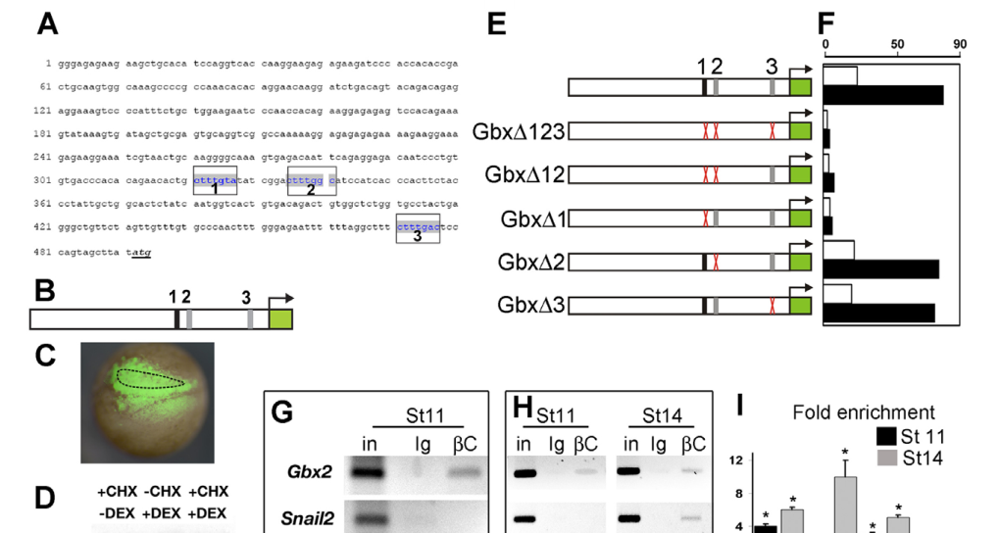

## Question

# Gene Research for Functional Annotation

## ⚠️ CRITICAL: Gene/Protein Identification Context

**BEFORE YOU BEGIN RESEARCH:** You MUST verify you are researching the CORRECT gene/protein. Gene symbols can be ambiguous, especially for less well-characterized genes from non-model organisms.

### Target Gene/Protein Identity (from UniProt):
- **UniProt Accession:** Q91907
- **Protein Description:** RecName: Full=Homeobox protein GBX-2; AltName: Full=Gastrulation and brain-specific homeobox protein 2; AltName: Full=XGBX-2;
- **Gene Information:** Name=gbx2;
- **Organism (full):** Xenopus laevis (African clawed frog).
- **Protein Family:** Not specified in UniProt
- **Key Domains:** GBX-1/2. (IPR042982); HD. (IPR001356); HD_metazoa. (IPR020479); Homeobox_CS. (IPR017970); Homeodomain-like_sf. (IPR009057)

### MANDATORY VERIFICATION STEPS:

1. **Check if the gene symbol "gbx2" matches the protein description above**
2. **Verify the organism is correct:** Xenopus laevis (African clawed frog).
3. **Check if protein family/domains align with what you find in literature**
4. **If you find literature for a DIFFERENT gene with the same or similar symbol, STOP**

### If Gene Symbol is Ambiguous or You Cannot Find Relevant Literature:

**DO NOT PROCEED WITH RESEARCH ON A DIFFERENT GENE.** Instead:
- State clearly: "The gene symbol 'gbx2' is ambiguous or literature is limited for this specific protein"
- Explain what you found (e.g., "Found extensive literature on a different gene with the same symbol in a different organism")
- Describe the protein based ONLY on the UniProt information provided above
- Suggest that the protein function can be inferred from domain/family information

### Research Target:

Please provide a comprehensive research report on the gene **gbx2** (gene ID: gbx2, UniProt: Q91907) in XENLA.

The research report should be a detailed narrative explaining the function, biological processes, and localization of the gene product. Citations should be given for all claims.

You should prioritize authoritative reviews and primary scientific literature when conducting research. You can supplement
this with annotations you find in gene/protein databases, but these can be outdated or inaccurate.

We are specifically interested in the primary function of the gene - for enzymes, what reaction is catalyzed, and what is the substrate specificity? For transporters, what is the substrate? For structural proteins or adapters, what is the broader structural role? For signaling molecules, what is the role in the pathway.

We are interested in where in or outside the cell the gene product carries out its function.

We are also interested in the signaling or biochemical pathways in which the gene functions. We are less interested in broad pleiotropic effects, except where these elucidate the precise role.

Include evidence where possible. We are interested in both experimental evidence as well as inference from structure, evolution, or bioinformatic analysis. Precise studies should be prioritized over high-throughput, where available.

## Output

Question: You are an expert researcher providing comprehensive, well-cited information.

Provide detailed information focusing on:
1. Key concepts and definitions with current understanding
2. Recent developments and latest research (prioritize 2023-2024 sources)
3. Current applications and real-world implementations
4. Expert opinions and analysis from authoritative sources
5. Relevant statistics and data from recent studies

Format as a comprehensive research report with proper citations. Include URLs and publication dates where available.
Always prioritize recent, authoritative sources and provide specific citations for all major claims.

# Gene Research for Functional Annotation

## ⚠️ CRITICAL: Gene/Protein Identification Context

**BEFORE YOU BEGIN RESEARCH:** You MUST verify you are researching the CORRECT gene/protein. Gene symbols can be ambiguous, especially for less well-characterized genes from non-model organisms.

### Target Gene/Protein Identity (from UniProt):
- **UniProt Accession:** Q91907
- **Protein Description:** RecName: Full=Homeobox protein GBX-2; AltName: Full=Gastrulation and brain-specific homeobox protein 2; AltName: Full=XGBX-2;
- **Gene Information:** Name=gbx2;
- **Organism (full):** Xenopus laevis (African clawed frog).
- **Protein Family:** Not specified in UniProt
- **Key Domains:** GBX-1/2. (IPR042982); HD. (IPR001356); HD_metazoa. (IPR020479); Homeobox_CS. (IPR017970); Homeodomain-like_sf. (IPR009057)

### MANDATORY VERIFICATION STEPS:

1. **Check if the gene symbol "gbx2" matches the protein description above**
2. **Verify the organism is correct:** Xenopus laevis (African clawed frog).
3. **Check if protein family/domains align with what you find in literature**
4. **If you find literature for a DIFFERENT gene with the same or similar symbol, STOP**

### If Gene Symbol is Ambiguous or You Cannot Find Relevant Literature:

**DO NOT PROCEED WITH RESEARCH ON A DIFFERENT GENE.** Instead:
- State clearly: "The gene symbol 'gbx2' is ambiguous or literature is limited for this specific protein"
- Explain what you found (e.g., "Found extensive literature on a different gene with the same symbol in a different organism")
- Describe the protein based ONLY on the UniProt information provided above
- Suggest that the protein function can be inferred from domain/family information

### Research Target:

Please provide a comprehensive research report on the gene **gbx2** (gene ID: gbx2, UniProt: Q91907) in XENLA.

The research report should be a detailed narrative explaining the function, biological processes, and localization of the gene product. Citations should be given for all claims.

You should prioritize authoritative reviews and primary scientific literature when conducting research. You can supplement
this with annotations you find in gene/protein databases, but these can be outdated or inaccurate.

We are specifically interested in the primary function of the gene - for enzymes, what reaction is catalyzed, and what is the substrate specificity? For transporters, what is the substrate? For structural proteins or adapters, what is the broader structural role? For signaling molecules, what is the role in the pathway.

We are interested in where in or outside the cell the gene product carries out its function.

We are also interested in the signaling or biochemical pathways in which the gene functions. We are less interested in broad pleiotropic effects, except where these elucidate the precise role.

Include evidence where possible. We are interested in both experimental evidence as well as inference from structure, evolution, or bioinformatic analysis. Precise studies should be prioritized over high-throughput, where available.

# Functional annotation report: *gbx2* in *Xenopus laevis*

## Identity and principal function

The specified target is **UniProt Q91907**, the *Xenopus laevis* (African clawed frog) protein named **GBX2**, **XGBX-2**, or gastrulation and brain-specific homeobox protein 2. The supplied UniProt annotation identifies GBX-1/2 and homeodomain-related signatures; the *Xenopus* literature independently describes Xgbx-2 as a noncluster homeobox gene and tests Gbx2 as a developmental transcription factor. This report concerns that frog protein, **not** zebrafish *gbx1*, which can perform a comparable early boundary-patterning role but is a different gene. The reviewed papers generally name the gene or experimental construct rather than explicitly mapping it to accession Q91907. [UniProt record: https://www.uniprot.org/uniprotkb/Q91907/entry.] (king1998anteriorstructuraldefects pages 1-2, li2009theposteriorizinggene pages 1-2, rhinn2009zebrafishgbx1refines pages 1-2)

**Primary annotation:** GBX2 is a **homeodomain-containing regulator of embryonic gene expression**. It translates positional signals into distinct anterior–posterior identities, notably at the developing midbrain–hindbrain interface and the neural-plate border, where it helps specify early neural crest and posterior sensory-placode territories. It is **not an enzyme or transporter**; there is no catalytic reaction or transported substrate to assign. Its relevant molecular activity is regulation of transcription, including experimentally supported antagonism of *otx2* expression, rather than production of a secreted signaling molecule. (li2009theposteriorizinggene pages 1-2, li2009theposteriorizinggene pages 3-4, steventon2012mutualrepressionbetween pages 4-6)

## Where GBX2 acts

At the **tissue** level, in situ hybridization in *Xenopus* found *gbx2* transcripts in broad posterior ectoderm during gastrulation. At stage 12 they overlap the neural-crest marker *snail2* in prospective crest cells; sections localized the signal to ectoderm rather than underlying mesoderm. As neurulation proceeds, expression becomes regionally restricted, including the rostral-hindbrain side of the midbrain–hindbrain boundary and posterior neural-fold/preplacodal territories. Anterior *otx2* and posterior *gbx2* domains initially overlap and subsequently resolve into adjoining territories in both neural plate and preplacodal ectoderm. Thus, expression should **not** be described as confined to a narrow hindbrain stripe at every stage. (li2009theposteriorizinggene pages 3-4, steventon2012mutualrepressionbetween pages 2-3, king1998anteriorstructuraldefects pages 1-2)

At the **subcellular** level, transcriptional function and the homeodomain indicate action predominantly **in the nucleus, at gene-regulatory DNA with transcriptional cofactors**. In heterologous cultured cells, tagged Gbx2 was observed in the nucleus and recruited the Groucho-family corepressor TLE4 there. That is direct evidence for the localization of the tested constructs, but it is **not** a measurement of endogenous Q91907 protein localization in frog embryonic cells. GBX2 is not known from these studies to execute its principal function at the plasma membrane or outside the cell. (heimbucher2007gbx2andotx2 pages 3-5, heimbucher2007gbx2andotx2 pages 5-6)

## Mechanism and developmental pathways

**Canonical Wnt signaling → *gbx2* → early neural-crest regulatory program.** The most specific upstream mechanism established in *Xenopus* is direct **regulation of the *gbx2* gene** by Wnt/β-catenin–TCF/LEF signaling. Wnt8 or inducible β-catenin increased *gbx2* expression; Wnt-pathway inhibition decreased it. A roughly 500-base-pair *gbx2* upstream segment drove reporter expression in prospective neural crest, its β-catenin response depended on a TCF/LEF site, and β-catenin chromatin immunoprecipitation recovered this region at gastrula stage 11. *Gbx2* induction persisted when new protein synthesis was inhibited. Together these experiments provide unusually strong evidence that *gbx2* is an **immediate Wnt-responsive transcriptional target**. They do **not** show that GBX2 itself binds that TCF/LEF site. (li2009theposteriorizinggene pages 3-4, li2009theposteriorizinggene pages 4-6, li2009theposteriorizinggene media 99c61185)

GBX2 acts **downstream of this signal and upstream of early crest-specification genes**. Two independent *gbx2* morpholinos inhibited *snail2* expression, and morpholino-resistant Gbx2 constructs rescued the phenotype. Targeting prospective neural-crest cells, but not adjacent neural-plate or epidermal precursors, reproduced the crest effect. At gastrula stages, depletion reduced *pax3* and *msx1*; supplying Pax3 or Msx1 restored downstream crest markers, whereas supplying Gbx2 did not rescue Pax3/Msx1 inhibition. In Wnt epistasis experiments, Gbx2 depletion reduced β-catenin-induced crest-marker expansion from **75–86% of embryos to under 2%** in the reported groups; supplying Gbx2 likewise overcame inhibition by dominant-negative Dishevelled. These are functional and epistasis data, **not proof that GBX2 directly binds the *pax3*, *msx1*, or *snail2* promoters**. (li2009theposteriorizinggene pages 3-4, li2009theposteriorizinggene pages 6-8, li2009theposteriorizinggene pages 4-6)

**Wnt and BMP inputs distinguish crest from placode.** In the experimental model, Wnt-induced Gbx2 cooperates functionally with **Zic1**, a factor associated with appropriate neural-plate-border/BMP conditions. Coexpression of Gbx2 and Zic1 in animal caps induced neural-crest markers, whereas Gbx2 inhibited the anterior preplacodal program marked by *six1*. *Gbx2* knockdown expanded *six1* territory; overexpression shifted it anteriorly. Importantly, at the doses used to examine this neural-fold decision, regional neural-plate markers including *otx2* and *en2* were largely unchanged. The authors therefore distinguish **posteriorization of the neural fold** from wholesale posteriorization of the neural plate. “Interaction with Zic1” here denotes demonstrated *functional cooperation*, not an established direct GBX2–ZIC1 protein complex. (li2009theposteriorizinggene pages 8-9, li2009theposteriorizinggene pages 6-8, li2009theposteriorizinggene pages 9-10)

**Otx2 opposition → positional boundaries and the isthmic organizer.** *Xenopus* neural targeting of Gbx2 shifted the *en1*-marked midbrain–hindbrain boundary **anteriorly**, whereas Otx2 shifted it **posteriorly**. In the preplacodal region, Gbx2 or a Gbx2–repressor fusion reduced *otx2* expression; *gbx2* knockdown expanded it, and reciprocal Otx2 perturbations reduced *gbx2*. These experiments support a cross-repressive transcriptional network that places posterior hindbrain next to anterior midbrain and also subdivides sensory progenitors. The interface is associated with the **isthmic organizer**, a local signaling center involving FGF8 and WNT1 in vertebrate brain development. The *Xenopus* expression and misexpression results establish boundary positioning; they do **not**, by themselves, establish direct binding of GBX2 to the *otx2* promoter or direct physical binding between GBX2 and OTX2 proteins. (steventon2012mutualrepressionbetween pages 4-6, steventon2012mutualrepressionbetween pages 2-3, heimbucher2007gbx2andotx2 pages 1-2)

A plausible **repression mechanism** is recruitment of Groucho/TLE corepressors: biochemical experiments identified an N-terminal **eh1-like motif** in Gbx2 that associates with the TLE4 WD40 domain, and cultured-cell reporter tests showed TLE4-dependent repression. Tagged Gbx2 and TLE4 also colocalized in nuclei. Crucially, those biochemical and localization experiments used cultured cells, and the functional organizer tests in that study used **medaka**, not *Xenopus*. They support a conserved mechanistic interpretation of frog Gbx2–Otx2 antagonism, rather than proving that endogenous Q91907 recruits TLE4 at a specified frog locus. (heimbucher2007gbx2andotx2 pages 3-5, heimbucher2007gbx2andotx2 pages 1-2, heimbucher2007gbx2andotx2 pages 5-6, heimbucher2007gbx2andotx2 pages 9-10)

## Additional experimentally supported roles

**Otic-placode specification.** In *Xenopus* preplacodal ectoderm, loss of Gbx2 reduced the early otic markers *pax8* and *pax2* and later otic-vesicle development, while leaving the general preplacodal marker *eya1* intact. Early activation of a Gbx2 homeodomain–Engrailed repressor fusion also impaired otic markers; later activation did not abolish their expression. Conversely, ectopic full-length Gbx2 alone did **not** generate ectopic *pax8* or *pax2*. Thus GBX2 is **necessary early but insufficient alone** for otic identity, with functions beyond simply excluding Otx2; its exact direct otic targets have not been identified in these experiments. In the placodal *otx2* response, the 2012 study reported Gbx2-mediated repression in **68% of embryos examined (*n*=26)** and *otx2* expansion after Gbx2 knockdown in **73% (*n*=33)**. (steventon2012mutualrepressionbetween pages 3-4, steventon2012mutualrepressionbetween pages 4-6)

**Later placode assembly and cell behavior.** Live imaging of frog preplacodal grafts showed that future placode cells travel with greater directional persistence than surrounding cells. When investigators activated an **engineered, inducible Gbx2–repressor fusion** at late stages, otic cells became more dispersed and otic morphology was abnormal despite continued *pax2* expression. Automated tracking found reduced persistence (**P = 1.5 × 10⁻³**) without a significant change in mean speed (**P = 0.51**). This supports a later Gbx2-responsive **cell-behavior program**, but does not identify its direct targets or show that native GBX2 represses every affected gene. Earlier ectopic Xgbx-2 expression also reduced N-cadherin expression and calcium-dependent adhesion; those gain-of-function observations make altered adhesion a plausible contributor, **not a proven direct GBX2→N-cadherin transcriptional link**. (steventon2016directionalcellmovements pages 2-3, steventon2016directionalcellmovements pages 4-5, king1998anteriorstructuraldefects pages 1-2)

## Recent findings and interpretation

The most directly relevant **2023 primary study** examined the timing of head-patterning markers in frog embryos. Wild-type *gbx2* was detectable from approximately **stage 10.5**; experimental BMP inhibition with inducible Smad6 delayed/reduced its early expression, with detection reported from **stage 11.5**. In BMP4-ventralized embryos, timed Smad6 activation most strongly restored *gbx2* when initiated at **stages 10–10.5**. The investigators reported at least **three repetitions and more than 40 embryos per condition**. This places *gbx2* expression within a **BMP-sensitive temporal context** and supports its use as an anterior-hindbrain positional marker. Their proposed BMP-dependent “head timer” remains a **hypothesis**: the work did not show direct SMAD binding to *gbx2*, demonstrate that GBX2 itself constitutes the timer, or supersede the direct Wnt-regulatory evidence. A 2024 neural-plate-border review continues to describe Otx2/Gbx2 regional opposition, but is synthesis rather than a new frog GBX2 perturbation study. (zhu2023patterningofthe pages 2-4, zhu2023patterningofthe pages 4-6, zhu2023patterningofthe pages 6-8, esmaeli2024molecularsignalingdirecting pages 4-5)

The evidence hierarchy below separates findings **demonstrated in *X. laevis*** from protein-level or cross-species inferences. (li2009theposteriorizinggene pages 1-2, heimbucher2007gbx2andotx2 pages 3-5, zhu2023patterningofthe pages 4-6)

| Functional claim | Evidence in *Xenopus laevis* | Interpretation / limit |
|---|---|---|
| Homeodomain, nuclear transcription factor | Q91907 is supplied as XGBX-2 with a metazoan homeodomain. Xenopus experiments used its DNA-binding homeodomain in Gbx2–Engrailed-repressor fusions that reproduced full-length Gbx2 activity. (li2009theposteriorizinggene pages 1-2, steventon2012mutualrepressionbetween pages 4-6, heimbucher2007gbx2andotx2 pages 9-10) | Strong evidence for a sequence-specific transcriptional regulator rather than an enzyme, transporter, or structural protein. Nuclear localization is expected from this role but was demonstrated directly only with tagged Gbx2 in heterologous cells, not endogenous Q91907 in Xenopus tissue. (heimbucher2007gbx2andotx2 pages 3-5) |
| Direct Wnt8–β-catenin–TCF/LEF-responsive upstream enhancer | Wnt8 or inducible β-catenin expanded endogenous *gbx2*; Wnt inhibition reduced it. A ~500-bp upstream region drove GFP in prospective neural crest, deletion identified an essential TCF/LEF site, and stage-11 ChIP recovered this region with β-catenin; induction persisted during protein-synthesis inhibition. (li2009theposteriorizinggene pages 3-4, li2009theposteriorizinggene pages 4-6, li2009theposteriorizinggene media 99c61185) | High-confidence direct **upstream regulation of the *gbx2* gene** by canonical Wnt signaling during gastrulation. This does not identify DNA sites bound by GBX2 protein or prove that every Wnt-dependent GBX2 function is direct. |
| Early neural-crest specification and posterior neural-fold identity | Two Gbx2 morpholinos inhibited *snail2* and were rescued by morpholino-resistant Gbx2/Gbx2-EnR constructs. Gbx2 loss reduced *pax3* and *msx1*; their RNAs rescued downstream neural-crest markers. Gbx2 cooperated with Zic1, inhibited the preplacodal gene *six1*, and converted neural-fold rather than general neural-plate identity. (li2009theposteriorizinggene pages 6-8, li2009theposteriorizinggene pages 8-9, li2009theposteriorizinggene pages 3-4) | Strong loss-, gain-, rescue- and epistasis evidence places Gbx2 upstream of Pax3/Msx1 in early neural-crest induction. At the tested doses, regional neural-plate markers including *otx2* and *en2* remained normal, so posteriorization of the neural fold should not be conflated with wholesale posteriorization of the neural plate. (li2009theposteriorizinggene pages 6-8) |
| Otx2 antagonism and midbrain–hindbrain boundary positioning | Xenopus Otx2 overexpression shifted the En1 boundary posteriorly, whereas Gbx2 shifted it anteriorly. In the preplacodal region, Gbx2 reduced *otx2*, Gbx2 knockdown expanded it, and repressor-form experiments supported reciprocal transcriptional repression. (steventon2012mutualrepressionbetween pages 4-6) | Strong functional evidence that Gbx2/Otx2 antagonism positions ectodermal boundaries, including the neural midbrain–hindbrain organizer. These perturbations show transcriptional/genetic antagonism, not direct GBX2–OTX2 protein binding or direct occupancy of the *otx2* locus. |
| Initial otic-placode specification | Splice- and translation-blocking Gbx2 morpholinos reduced the otic markers *pax8* and *pax2* and later decreased otic-vesicle size, while the general preplacodal marker *eya1* remained intact. Early Gbx2-EnR activation impaired otic markers, whereas later activation did not; ectopic Gbx2 alone did not induce otic markers. (steventon2012mutualrepressionbetween pages 3-4, steventon2012mutualrepressionbetween pages 4-6) | Gbx2 is necessary early, but not sufficient alone, for otic specification and is dispensable for general preplacodal-region formation and later maintenance of otic identity. The relevant direct GBX2 target genes remain unidentified. |
| Directional movement during otic-placode assembly | Late activation of engineered Gbx2-EnR-GR left Pax2 expression approximately positioned but produced dispersed cells and abnormal otic morphology. Repressing Gbx2-responsive targets reduced movement persistence without significantly changing mean speed; automatic tracking gave *P*=1.5×10⁻³ and manual tracking *P*=1.09×10⁻¹⁰. (steventon2016directionalcellmovements pages 2-3, steventon2016directionalcellmovements pages 4-5) | Supports a later role for the Gbx2-regulated program in persistent, directional placodal cell movement. Because an engineered homeodomain–repressor fusion broadly represses responsive loci, the experiment neither identifies direct endogenous GBX2 targets nor establishes whether native GBX2 activates or represses them at this stage. |
| BMP-dependent timing of *gbx2* expression (2023) | Wild-type *gbx2* was detected from stage 10.5; Smad6-mediated BMP inhibition delayed/reduced it to stage 11.5. In BMP4-ventralized embryos, timed Smad6 activation restored *gbx2* most strongly at stages 10–10.5; each condition used >40 embryos and at least three repetitions. (zhu2023patterningofthe pages 2-4, zhu2023patterningofthe pages 4-6) | Recent evidence places *gbx2* within a temporally BMP-sensitive head-patterning sequence and supports its use as an anterior-hindbrain marker. It does not demonstrate direct BMP/SMAD occupancy at *gbx2*, direct regulation of GBX2 protein, or establish *gbx2* itself as the proposed developmental timer. (zhu2023patterningofthe pages 6-8) |

*Table: Evidence-ranked functional annotation for *Xenopus laevis* GBX2/Q91907, separating direct Xenopus findings from mechanistic inference and cross-system localization evidence.*

## Research use and remaining uncertainties

In practice, *gbx2* expression is used as a **developmental readout** for posterior ectoderm/anterior hindbrain and for testing how Wnt or timed BMP perturbations alter head patterning; manipulations of frog Gbx2 are also used to dissect **neural-crest versus placodal fate** and **otic-placode morphogenesis**. These are research applications in embryos, not established clinical or industrial uses of the frog protein. Most compelling direct evidence concerns Wnt control of *gbx2* and its necessity for early cell-fate decisions. Important unresolved points are the **native protein’s endogenous subcellular distribution**, its **genome-wide directly bound targets**, and the exact cofactors that determine whether it activates or represses a given target in frog tissues. (li2009theposteriorizinggene pages 4-6, li2009theposteriorizinggene pages 3-4, steventon2012mutualrepressionbetween pages 4-6, steventon2016directionalcellmovements pages 3-4)

### Key sources and dates

- Zhu K, Spaink HP, Durston AJ. **Published 3 July 2023.** “Patterning of the Vertebrate Head in Time and Space by BMP Signaling.” *Journal of Developmental Biology* **11**, 31. https://doi.org/10.3390/jdb11030031. (zhu2023patterningofthe pages 1-2, zhu2023patterningofthe pages 4-6)
- Esmaeli M *et al.* **July 2024.** “Molecular signaling directing neural plate border formation.” *International Journal of Developmental Biology* **68**, 65–78. https://doi.org/10.1387/ijdb.230231me. **Review and cross-species context.** (esmaeli2024molecularsignalingdirecting pages 4-5)
- Li B *et al.* **October 2009.** “The posteriorizing gene Gbx2 is a direct target of Wnt signalling and the earliest factor in neural crest induction.” *Development* **136**, 3267–3278. https://doi.org/10.1242/dev.036954. **Primary *Xenopus* mechanism and loss-of-function evidence.** (li2009theposteriorizinggene pages 1-2, li2009theposteriorizinggene pages 4-6)
- Steventon B, Mayor R, Streit A. **July 2012.** “Mutual repression between Gbx2 and Otx2 in sensory placodes reveals a general mechanism for ectodermal patterning.” *Developmental Biology* **367**, 55–65. https://doi.org/10.1016/j.ydbio.2012.04.025. **Primary *Xenopus* and chick study; species-specific experiments are distinguished above.** (steventon2012mutualrepressionbetween pages 1-2, steventon2012mutualrepressionbetween pages 4-6)
- Steventon B, Mayor R, Streit A. **November 2016.** “Directional cell movements downstream of Gbx2 and Otx2 control the assembly of sensory placodes.” *Biology Open* **5**, 1620–1624. https://doi.org/10.1242/bio.020966. **Primary *Xenopus* live-imaging study.** (steventon2016directionalcellmovements pages 1-2, steventon2016directionalcellmovements pages 4-5)
- King MW, Ndiema M, Neff AW. **August 1998.** “Anterior structural defects by misexpression of Xgbx-2 in early Xenopus embryos are associated with altered expression of cell adhesion molecules.” *Developmental Dynamics* **212**, 563–579. https://doi.org/10.1002/(SICI)1097-0177(199808)212:4%3C563::AID-AJA9%3E3.0.CO;2-F. (king1998anteriorstructuraldefects pages 1-2)
- Heimbucher T *et al.* **January 2007.** “Gbx2 and Otx2 Interact with the WD40 Domain of Groucho/Tle Corepressors.” *Molecular and Cellular Biology* **27**, 340–351. https://doi.org/10.1128/MCB.00811-06. **Biochemical/cell-culture and medaka evidence; not direct endogenous frog-protein evidence.** (heimbucher2007gbx2andotx2 pages 1-2, heimbucher2007gbx2andotx2 pages 3-5)

References

1. (king1998anteriorstructuraldefects pages 1-2): Michael W. King, Moses Ndiema, and Anton W. Neff. Anterior structural defects by misexpression of xgbx‐2 in early xenopus embryos are associated with altered expression of cell adhesion molecules. Developmental Dynamics, 212:563-579, Aug 1998. URL: https://doi.org/10.1002/(sici)1097-0177(199808)212:4<563::aid-aja9>3.0.co;2-f, doi:10.1002/(sici)1097-0177(199808)212:4<563::aid-aja9>3.0.co;2-f. This article has 30 citations and is from a peer-reviewed journal.

2. (li2009theposteriorizinggene pages 1-2): Bo Li, Sei Kuriyama, Mauricio Moreno, and Roberto Mayor. The posteriorizing gene gbx2 is a direct target of wnt signalling and the earliest factor in neural crest induction. Development, 136:3267-3278, Oct 2009. URL: https://doi.org/10.1242/dev.036954, doi:10.1242/dev.036954. This article has 178 citations and is from a domain leading peer-reviewed journal.

3. (rhinn2009zebrafishgbx1refines pages 1-2): Muriel Rhinn, Klaus Lun, Reiner Ahrendt, Michaela Geffarth, and Michael Brand. Zebrafish gbx1 refines the midbrain-hindbrain boundary border and mediates the wnt8 posteriorization signal. Neural Development, 4:12-12, Apr 2009. URL: https://doi.org/10.1186/1749-8104-4-12, doi:10.1186/1749-8104-4-12. This article has 63 citations and is from a peer-reviewed journal.

4. (li2009theposteriorizinggene pages 3-4): Bo Li, Sei Kuriyama, Mauricio Moreno, and Roberto Mayor. The posteriorizing gene gbx2 is a direct target of wnt signalling and the earliest factor in neural crest induction. Development, 136:3267-3278, Oct 2009. URL: https://doi.org/10.1242/dev.036954, doi:10.1242/dev.036954. This article has 178 citations and is from a domain leading peer-reviewed journal.

5. (steventon2012mutualrepressionbetween pages 4-6): Ben Steventon, Roberto Mayor, and Andrea Streit. Mutual repression between gbx2 and otx2 in sensory placodes reveals a general mechanism for ectodermal patterning. Developmental Biology, 367-540:55-65, Jul 2012. URL: https://doi.org/10.1016/j.ydbio.2012.04.025, doi:10.1016/j.ydbio.2012.04.025. This article has 89 citations and is from a peer-reviewed journal.

6. (steventon2012mutualrepressionbetween pages 2-3): Ben Steventon, Roberto Mayor, and Andrea Streit. Mutual repression between gbx2 and otx2 in sensory placodes reveals a general mechanism for ectodermal patterning. Developmental Biology, 367-540:55-65, Jul 2012. URL: https://doi.org/10.1016/j.ydbio.2012.04.025, doi:10.1016/j.ydbio.2012.04.025. This article has 89 citations and is from a peer-reviewed journal.

7. (heimbucher2007gbx2andotx2 pages 3-5): Thomas Heimbucher, Christina Murko, Baubak Bajoghli, Narges Aghaallaei, Anja Huber, Ronald Stebegg, Dirk Eberhard, Maria Fink, Antonio Simeone, and Thomas Czerny. Gbx2 and otx2 interact with the wd40 domain of groucho/tle corepressors. Jan 2007. URL: https://doi.org/10.1128/mcb.00811-06, doi:10.1128/mcb.00811-06. This article has 56 citations and is from a domain leading peer-reviewed journal.

8. (heimbucher2007gbx2andotx2 pages 5-6): Thomas Heimbucher, Christina Murko, Baubak Bajoghli, Narges Aghaallaei, Anja Huber, Ronald Stebegg, Dirk Eberhard, Maria Fink, Antonio Simeone, and Thomas Czerny. Gbx2 and otx2 interact with the wd40 domain of groucho/tle corepressors. Jan 2007. URL: https://doi.org/10.1128/mcb.00811-06, doi:10.1128/mcb.00811-06. This article has 56 citations and is from a domain leading peer-reviewed journal.

9. (li2009theposteriorizinggene pages 4-6): Bo Li, Sei Kuriyama, Mauricio Moreno, and Roberto Mayor. The posteriorizing gene gbx2 is a direct target of wnt signalling and the earliest factor in neural crest induction. Development, 136:3267-3278, Oct 2009. URL: https://doi.org/10.1242/dev.036954, doi:10.1242/dev.036954. This article has 178 citations and is from a domain leading peer-reviewed journal.

10. (li2009theposteriorizinggene media 99c61185): Bo Li, Sei Kuriyama, Mauricio Moreno, and Roberto Mayor. The posteriorizing gene gbx2 is a direct target of wnt signalling and the earliest factor in neural crest induction. Development, 136:3267-3278, Oct 2009. URL: https://doi.org/10.1242/dev.036954, doi:10.1242/dev.036954. This article has 178 citations and is from a domain leading peer-reviewed journal.

11. (li2009theposteriorizinggene pages 6-8): Bo Li, Sei Kuriyama, Mauricio Moreno, and Roberto Mayor. The posteriorizing gene gbx2 is a direct target of wnt signalling and the earliest factor in neural crest induction. Development, 136:3267-3278, Oct 2009. URL: https://doi.org/10.1242/dev.036954, doi:10.1242/dev.036954. This article has 178 citations and is from a domain leading peer-reviewed journal.

12. (li2009theposteriorizinggene pages 8-9): Bo Li, Sei Kuriyama, Mauricio Moreno, and Roberto Mayor. The posteriorizing gene gbx2 is a direct target of wnt signalling and the earliest factor in neural crest induction. Development, 136:3267-3278, Oct 2009. URL: https://doi.org/10.1242/dev.036954, doi:10.1242/dev.036954. This article has 178 citations and is from a domain leading peer-reviewed journal.

13. (li2009theposteriorizinggene pages 9-10): Bo Li, Sei Kuriyama, Mauricio Moreno, and Roberto Mayor. The posteriorizing gene gbx2 is a direct target of wnt signalling and the earliest factor in neural crest induction. Development, 136:3267-3278, Oct 2009. URL: https://doi.org/10.1242/dev.036954, doi:10.1242/dev.036954. This article has 178 citations and is from a domain leading peer-reviewed journal.

14. (heimbucher2007gbx2andotx2 pages 1-2): Thomas Heimbucher, Christina Murko, Baubak Bajoghli, Narges Aghaallaei, Anja Huber, Ronald Stebegg, Dirk Eberhard, Maria Fink, Antonio Simeone, and Thomas Czerny. Gbx2 and otx2 interact with the wd40 domain of groucho/tle corepressors. Jan 2007. URL: https://doi.org/10.1128/mcb.00811-06, doi:10.1128/mcb.00811-06. This article has 56 citations and is from a domain leading peer-reviewed journal.

15. (heimbucher2007gbx2andotx2 pages 9-10): Thomas Heimbucher, Christina Murko, Baubak Bajoghli, Narges Aghaallaei, Anja Huber, Ronald Stebegg, Dirk Eberhard, Maria Fink, Antonio Simeone, and Thomas Czerny. Gbx2 and otx2 interact with the wd40 domain of groucho/tle corepressors. Jan 2007. URL: https://doi.org/10.1128/mcb.00811-06, doi:10.1128/mcb.00811-06. This article has 56 citations and is from a domain leading peer-reviewed journal.

16. (steventon2012mutualrepressionbetween pages 3-4): Ben Steventon, Roberto Mayor, and Andrea Streit. Mutual repression between gbx2 and otx2 in sensory placodes reveals a general mechanism for ectodermal patterning. Developmental Biology, 367-540:55-65, Jul 2012. URL: https://doi.org/10.1016/j.ydbio.2012.04.025, doi:10.1016/j.ydbio.2012.04.025. This article has 89 citations and is from a peer-reviewed journal.

17. (steventon2016directionalcellmovements pages 2-3): Ben Steventon, Roberto Mayor, and Andrea Streit. Directional cell movements downstream of gbx2 and otx2 control the assembly of sensory placodes. Biology Open, 5:1620-1624, Nov 2016. URL: https://doi.org/10.1242/bio.020966, doi:10.1242/bio.020966. This article has 19 citations and is from a peer-reviewed journal.

18. (steventon2016directionalcellmovements pages 4-5): Ben Steventon, Roberto Mayor, and Andrea Streit. Directional cell movements downstream of gbx2 and otx2 control the assembly of sensory placodes. Biology Open, 5:1620-1624, Nov 2016. URL: https://doi.org/10.1242/bio.020966, doi:10.1242/bio.020966. This article has 19 citations and is from a peer-reviewed journal.

19. (zhu2023patterningofthe pages 2-4): Kongju Zhu, Herman P. Spaink, and Antony J. Durston. Patterning of the vertebrate head in time and space by bmp signaling. Journal of Developmental Biology, 11:31, Jul 2023. URL: https://doi.org/10.3390/jdb11030031, doi:10.3390/jdb11030031. This article has 3 citations.

20. (zhu2023patterningofthe pages 4-6): Kongju Zhu, Herman P. Spaink, and Antony J. Durston. Patterning of the vertebrate head in time and space by bmp signaling. Journal of Developmental Biology, 11:31, Jul 2023. URL: https://doi.org/10.3390/jdb11030031, doi:10.3390/jdb11030031. This article has 3 citations.

21. (zhu2023patterningofthe pages 6-8): Kongju Zhu, Herman P. Spaink, and Antony J. Durston. Patterning of the vertebrate head in time and space by bmp signaling. Journal of Developmental Biology, 11:31, Jul 2023. URL: https://doi.org/10.3390/jdb11030031, doi:10.3390/jdb11030031. This article has 3 citations.

22. (esmaeli2024molecularsignalingdirecting pages 4-5): Mojtaba Esmaeli, Mahdi Barazesh, Zeinab Karimi, Shiva Roshankhah, and Ali Ghanbari. Molecular signaling directing neural plate border formation. The International journal of developmental biology, 68 2:65-78, Jul 2024. URL: https://doi.org/10.1387/ijdb.230231me, doi:10.1387/ijdb.230231me. This article has 10 citations.

23. (steventon2016directionalcellmovements pages 3-4): Ben Steventon, Roberto Mayor, and Andrea Streit. Directional cell movements downstream of gbx2 and otx2 control the assembly of sensory placodes. Biology Open, 5:1620-1624, Nov 2016. URL: https://doi.org/10.1242/bio.020966, doi:10.1242/bio.020966. This article has 19 citations and is from a peer-reviewed journal.

24. (zhu2023patterningofthe pages 1-2): Kongju Zhu, Herman P. Spaink, and Antony J. Durston. Patterning of the vertebrate head in time and space by bmp signaling. Journal of Developmental Biology, 11:31, Jul 2023. URL: https://doi.org/10.3390/jdb11030031, doi:10.3390/jdb11030031. This article has 3 citations.

25. (steventon2012mutualrepressionbetween pages 1-2): Ben Steventon, Roberto Mayor, and Andrea Streit. Mutual repression between gbx2 and otx2 in sensory placodes reveals a general mechanism for ectodermal patterning. Developmental Biology, 367-540:55-65, Jul 2012. URL: https://doi.org/10.1016/j.ydbio.2012.04.025, doi:10.1016/j.ydbio.2012.04.025. This article has 89 citations and is from a peer-reviewed journal.

26. (steventon2016directionalcellmovements pages 1-2): Ben Steventon, Roberto Mayor, and Andrea Streit. Directional cell movements downstream of gbx2 and otx2 control the assembly of sensory placodes. Biology Open, 5:1620-1624, Nov 2016. URL: https://doi.org/10.1242/bio.020966, doi:10.1242/bio.020966. This article has 19 citations and is from a peer-reviewed journal.

## Artifacts

- [Edison artifact artifact-00](gbx2-deep-research-falcon_artifacts/artifact-00.md)

## Citations

1. li2009theposteriorizinggene pages 6-8
2. steventon2012mutualrepressionbetween pages 4-6
3. zhu2023patterningofthe pages 6-8
4. esmaeli2024molecularsignalingdirecting pages 4-5
5. king1998anteriorstructuraldefects pages 1-2
6. li2009theposteriorizinggene pages 1-2
7. li2009theposteriorizinggene pages 3-4
8. steventon2012mutualrepressionbetween pages 2-3
9. li2009theposteriorizinggene pages 4-6
10. li2009theposteriorizinggene pages 8-9
11. li2009theposteriorizinggene pages 9-10
12. steventon2012mutualrepressionbetween pages 3-4
13. steventon2016directionalcellmovements pages 2-3
14. steventon2016directionalcellmovements pages 4-5
15. zhu2023patterningofthe pages 2-4
16. zhu2023patterningofthe pages 4-6
17. steventon2016directionalcellmovements pages 3-4
18. zhu2023patterningofthe pages 1-2
19. steventon2012mutualrepressionbetween pages 1-2
20. steventon2016directionalcellmovements pages 1-2
21. UniProt record: https://www.uniprot.org/uniprotkb/Q91907/entry.
22. https://www.uniprot.org/uniprotkb/Q91907/entry.]
23. https://doi.org/10.3390/jdb11030031.
24. https://doi.org/10.1387/ijdb.230231me.
25. https://doi.org/10.1242/dev.036954.
26. https://doi.org/10.1016/j.ydbio.2012.04.025.
27. https://doi.org/10.1242/bio.020966.
28. https://doi.org/10.1002/(SICI
29. https://doi.org/10.1128/MCB.00811-06.
30. https://doi.org/10.1002/(sici
31. https://doi.org/10.1242/dev.036954,
32. https://doi.org/10.1186/1749-8104-4-12,
33. https://doi.org/10.1016/j.ydbio.2012.04.025,
34. https://doi.org/10.1128/mcb.00811-06,
35. https://doi.org/10.1242/bio.020966,
36. https://doi.org/10.3390/jdb11030031,
37. https://doi.org/10.1387/ijdb.230231me,