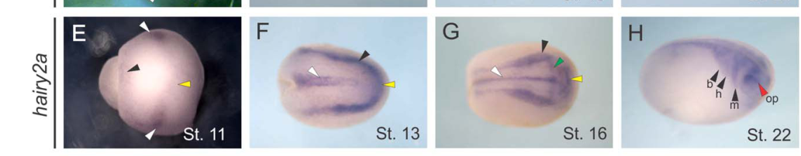

## Question

# Gene Research for Functional Annotation

## ⚠️ CRITICAL: Gene/Protein Identification Context

**BEFORE YOU BEGIN RESEARCH:** You MUST verify you are researching the CORRECT gene/protein. Gene symbols can be ambiguous, especially for less well-characterized genes from non-model organisms.

### Target Gene/Protein Identity (from UniProt):
- **UniProt Accession:** Q90Z12
- **Protein Description:** RecName: Full=Transcription factor HES-4-A; AltName: Full=Hairy and enhancer of split 4-A; AltName: Full=Protein hairy-2; Short=Xhairy2 {ECO:0000303|PubMed:17436284}; AltName: Full=Protein hairy-2a; Short=Xhairy2a {ECO:0000303|PubMed:17724611};
- **Gene Information:** Name=hes4-a; Synonyms=hairy2 {ECO:0000312|EMBL:AAD43304.1}, hairy2a {ECO:0000303|PubMed:11703945};
- **Organism (full):** Xenopus laevis (African clawed frog).
- **Protein Family:** Not specified in UniProt
- **Key Domains:** bHLH_dom. (IPR011598); HES_HEY. (IPR050370); HLH_DNA-bd_sf. (IPR036638); Orange_dom. (IPR003650); Hairy_orange (PF07527)

### MANDATORY VERIFICATION STEPS:

1. **Check if the gene symbol "hes4-a" matches the protein description above**
2. **Verify the organism is correct:** Xenopus laevis (African clawed frog).
3. **Check if protein family/domains align with what you find in literature**
4. **If you find literature for a DIFFERENT gene with the same or similar symbol, STOP**

### If Gene Symbol is Ambiguous or You Cannot Find Relevant Literature:

**DO NOT PROCEED WITH RESEARCH ON A DIFFERENT GENE.** Instead:
- State clearly: "The gene symbol 'hes4-a' is ambiguous or literature is limited for this specific protein"
- Explain what you found (e.g., "Found extensive literature on a different gene with the same symbol in a different organism")
- Describe the protein based ONLY on the UniProt information provided above
- Suggest that the protein function can be inferred from domain/family information

### Research Target:

Please provide a comprehensive research report on the gene **hes4-a** (gene ID: hes4-a, UniProt: Q90Z12) in XENLA.

The research report should be a detailed narrative explaining the function, biological processes, and localization of the gene product. Citations should be given for all claims.

You should prioritize authoritative reviews and primary scientific literature when conducting research. You can supplement
this with annotations you find in gene/protein databases, but these can be outdated or inaccurate.

We are specifically interested in the primary function of the gene - for enzymes, what reaction is catalyzed, and what is the substrate specificity? For transporters, what is the substrate? For structural proteins or adapters, what is the broader structural role? For signaling molecules, what is the role in the pathway.

We are interested in where in or outside the cell the gene product carries out its function.

We are also interested in the signaling or biochemical pathways in which the gene functions. We are less interested in broad pleiotropic effects, except where these elucidate the precise role.

Include evidence where possible. We are interested in both experimental evidence as well as inference from structure, evolution, or bioinformatic analysis. Precise studies should be prioritized over high-throughput, where available.

## Output

Question: You are an expert researcher providing comprehensive, well-cited information.

Provide detailed information focusing on:
1. Key concepts and definitions with current understanding
2. Recent developments and latest research (prioritize 2023-2024 sources)
3. Current applications and real-world implementations
4. Expert opinions and analysis from authoritative sources
5. Relevant statistics and data from recent studies

Format as a comprehensive research report with proper citations. Include URLs and publication dates where available.
Always prioritize recent, authoritative sources and provide specific citations for all major claims.

# Gene Research for Functional Annotation

## ⚠️ CRITICAL: Gene/Protein Identification Context

**BEFORE YOU BEGIN RESEARCH:** You MUST verify you are researching the CORRECT gene/protein. Gene symbols can be ambiguous, especially for less well-characterized genes from non-model organisms.

### Target Gene/Protein Identity (from UniProt):
- **UniProt Accession:** Q90Z12
- **Protein Description:** RecName: Full=Transcription factor HES-4-A; AltName: Full=Hairy and enhancer of split 4-A; AltName: Full=Protein hairy-2; Short=Xhairy2 {ECO:0000303|PubMed:17436284}; AltName: Full=Protein hairy-2a; Short=Xhairy2a {ECO:0000303|PubMed:17724611};
- **Gene Information:** Name=hes4-a; Synonyms=hairy2 {ECO:0000312|EMBL:AAD43304.1}, hairy2a {ECO:0000303|PubMed:11703945};
- **Organism (full):** Xenopus laevis (African clawed frog).
- **Protein Family:** Not specified in UniProt
- **Key Domains:** bHLH_dom. (IPR011598); HES_HEY. (IPR050370); HLH_DNA-bd_sf. (IPR036638); Orange_dom. (IPR003650); Hairy_orange (PF07527)

### MANDATORY VERIFICATION STEPS:

1. **Check if the gene symbol "hes4-a" matches the protein description above**
2. **Verify the organism is correct:** Xenopus laevis (African clawed frog).
3. **Check if protein family/domains align with what you find in literature**
4. **If you find literature for a DIFFERENT gene with the same or similar symbol, STOP**

### If Gene Symbol is Ambiguous or You Cannot Find Relevant Literature:

**DO NOT PROCEED WITH RESEARCH ON A DIFFERENT GENE.** Instead:
- State clearly: "The gene symbol 'hes4-a' is ambiguous or literature is limited for this specific protein"
- Explain what you found (e.g., "Found extensive literature on a different gene with the same symbol in a different organism")
- Describe the protein based ONLY on the UniProt information provided above
- Suggest that the protein function can be inferred from domain/family information

### Research Target:

Please provide a comprehensive research report on the gene **hes4-a** (gene ID: hes4-a, UniProt: Q90Z12) in XENLA.

The research report should be a detailed narrative explaining the function, biological processes, and localization of the gene product. Citations should be given for all claims.

You should prioritize authoritative reviews and primary scientific literature when conducting research. You can supplement
this with annotations you find in gene/protein databases, but these can be outdated or inaccurate.

We are specifically interested in the primary function of the gene - for enzymes, what reaction is catalyzed, and what is the substrate specificity? For transporters, what is the substrate? For structural proteins or adapters, what is the broader structural role? For signaling molecules, what is the role in the pathway.

We are interested in where in or outside the cell the gene product carries out its function.

We are also interested in the signaling or biochemical pathways in which the gene functions. We are less interested in broad pleiotropic effects, except where these elucidate the precise role.

Include evidence where possible. We are interested in both experimental evidence as well as inference from structure, evolution, or bioinformatic analysis. Precise studies should be prioritized over high-throughput, where available.

# Functional annotation report: *Xenopus laevis hes4-a* (UniProt Q90Z12)

## Identity and principal function

**The target is the African clawed frog *hes4-a* gene product, Hairy2a—not Hairy2b or human HES4.** A Xenopus nomenclature review explicitly maps *hes4-a*, *hes4a* and *hairy2a/XHairy2a* to the **hes4.S** homeolog; *hes4.L* corresponds to *hairy2b*. It lists *hes3* separately. Older papers using “Xhairy2” without a suffix therefore require caution before their results are assigned to Q90Z12. (lopez2022multiplefunctionsof pages 95-96)

Hairy2a’s best-supported **primary molecular function is transcriptional repression in embryonic neural-border cells**. The bHLH DNA-binding and Orange domains specified for Q90Z12 fit the Hairy/HES transcription-factor architecture examined experimentally in Xenopus; they do not indicate an enzyme or transporter. In neural-crest assays, an inducible Hairy2a bHLH–Engrailed repressor chimera promoted *snail2* and *foxd3* expression much like overexpressed full-length Hairy2, whereas an analogous activator chimera inhibited those markers. These results support repression as its functional mode, but do not identify a complete set of directly bound Hairy2a target genes. The proposed WRPW–Groucho corepressor and N-box-binding mechanism is plausible for Hairy-family proteins; direct occupancy of particular Q90Z12 target promoters was not established by these experiments. (vega‐lopez2015functionalanalysisof pages 20-21, vega‐lopez2015functionalanalysisof pages 6-8)

The evidence below distinguishes Hairy2a-specific observations from broader or historically ambiguous Hairy2 findings.

| Observation | Primary experiment & data | Interpretation / caveat |
|---|---|---|
| Identity: Q90Z12 is *X. laevis hes4-a* | Current nomenclature maps **hes4.S** to **hairy2a/XHairy2a/hes4a/hes4-a** and distinguishes it from **hes4.L = hairy2b/Xhairy2b** (lopez2022multiplefunctionsof pages 95-96) | Establishes the correct S-subgenome homeolog. Results specific to hairy2b or historical unsuffixed “Xhairy2” cannot automatically be assigned to Q90Z12. |
| Positive response to Notch signaling | Activating Notch/Su(H) with Su(H)Ank-MT-GR expanded hairy2a expression in **58% (n=26)**; dominant-negative Delta-Stu reduced it in **53% (n=36)** (vega‐lopez2015functionalanalysisof pages 3-5) | Strong pathway-ordering evidence that hairy2a is Notch/Delta responsive; it does not demonstrate direct RBPJ occupancy of the *hes4-a* promoter. |
| Negative relationship with BMP–Smad activity | BMP inhibition expanded hairy2a expression, whereas Smad4b-mediated elevation of BMP signaling reduced it in **84% (n=19)** (vega‐lopez2015functionalanalysisof pages 3-5) | Places hairy2a expression within the BMP-activity gradient governing neural-border specification. Direct regulation by Smad was not established. |
| Hairy2A suppresses *bmp4* and promotes neural-crest specification | Hairy2A overexpression strongly repressed *bmp4*, expanded *Xslug* and *Xmsx1*, and rescued loss of *Xslug* caused by inhibition of Xiro1 or Notch; experiments involved at least 35–45 embryos, with effects generally in at least 70% (glavic2004interplaybetweennotch pages 7-8, glavic2004interplaybetweennotch pages 5-7) | Supports the pathway **Xiro1 → Delta/Notch → Hairy2A → reduced BMP4 output**, enabling appropriate neural-border BMP levels. Direct Hairy2A occupancy of *bmp4* was not shown. |
| Molecular role as a transcriptional repressor | Inducible hairy2a bHLH–Engrailed repressor and bHLH–E1A activator chimeras produced opposing effects on *snail2* and *foxd3*; the repressor phenocopied wild-type hairy2 activity, whereas the activator inhibited neural-crest markers (vega‐lopez2015functionalanalysisof pages 6-8) | Functional-domain evidence supports transcriptional repression as the primary molecular activity. Exact percentages are omitted because panel-to-construct assignments are ambiguous in the extracted text. |
| Cooperation with Msx1 in neural-crest induction | In animal caps, hairy2a alone induced *sox2* and only weak *snail1*; coexpression of hairy2a and *msx1* produced strong *snail1* without *sox2* (vega‐lopez2015functionalanalysisof pages 11-12) | Hairy2a is not sufficient by itself to impose a selective neural-crest program in naïve ectoderm; it cooperates with neural-border factors such as Msx1. |
| Neural-border and neural-crest tissue localization | In situ hybridization detected hairy2a from stage 11 at the neural-plate border and prechordal mesoderm; at stages 13–16 in anterior neural folds, prospective neural crest, and floor plate; and at stage 22 in migrating cephalic neural crest and optic placode (vega‐lopez2015functionalanalysisof pages 3-5) | Defines transcript localization. Nuclear protein localization is expected for a bHLH transcription factor but was not directly shown by these experiments. |
| Cell-fate and survival effects are separable from proliferation | In 2015 phospho-histone-H3 assays, hairy2a gain- or dominant-negative loss-of-function caused **no significant proliferation change**; hairy2a overexpression nevertheless suppressed normal apoptosis in **75% (n=8)** (vega‐lopez2015functionalanalysisof pages 11-12) | Neural-crest territory changes primarily reflected altered cell fate and survival rather than proliferation under these assay conditions. |
| Earlier progenitor-maintenance evidence requires identity caution | A 2007 study using unsuffixed Xhairy2 reported that knockdown induced *p27xic1*, reduced Slug/FoxD3, caused apoptosis of mitotic cells, and eliminated multiple neural-crest derivatives (nagatomo2007xenopushairy2functions pages 1-2) | Supports a broader Hairy2 role in maintaining mitotic, undifferentiated progenitors, but historical unsuffixed nomenclature prevents confident attribution exclusively to Q90Z12/hairy2a and does not override the paralog-specific 2015 result. |

*Table: Gene-specific evidence hierarchy for Xenopus laevis Q90Z12 (hes4-a/hairy2a), separating direct paralog-specific results from pathway inference and historically ambiguous Xhairy2 findings.*

## Cellular and anatomical localization

**The nucleus is the expected site of molecular action:** Hairy2a is a DNA-associated transcriptional regulator, rather than a secreted ligand or membrane receptor. This is a functional inference from its domains and transcriptional assays; the cited expression experiments map **RNA in embryonic tissues**, not the subcellular distribution of endogenous Q90Z12 protein. (vega‐lopez2015functionalanalysisof pages 20-21, vega‐lopez2015functionalanalysisof pages 6-8)

Hairy2a transcripts appear by approximately **stage 11** at the neural-plate border and in prechordal mesoderm. At stages **13–16**, expression is prominent in anterior neural folds, prospective neural crest and prospective floor plate; by **stage 22**, it is detected in migrating cranial neural-crest streams and the optic placode. Double-label analyses place hairy2a expression within the *foxd3*-positive neural-crest territory. These are locations where the gene is expressed, not proof of a separate biochemical function in every tissue. The study’s Figure 1 provides visual evidence of the embryonic expression pattern. (vega‐lopez2015functionalanalysisof pages 3-5, vega‐lopez2015functionalanalysisof media 55a9d20d)

## Signaling pathway and biological role

The strongest pathway model is **Xiro1 → Delta1/Notch → Hairy2a → modulation of BMP4-dependent neural-border specification**. In Xenopus embryos, Delta ligands are expressed around prospective crest cells, whereas Notch activity and Hairy2A occur in the crest territory. Temporally controlled activation of Xiro1 or Notch expanded neural-crest markers and increased Hairy2A expression; pathway inhibition had the opposite effect. Hairy2A expression also rescued loss of *Xslug* after interference with Xiro1 or Notch signaling, placing it functionally downstream in that experimental context. The authors proposed that Hairy2A-mediated reduction of *bmp4* helps produce a BMP environment permissive for neural-crest specification. This is **pathway-ordering evidence**, not proof that Hairy2a directly binds the *bmp4* promoter. (glavic2004interplaybetweennotch pages 1-2, glavic2004interplaybetweennotch pages 7-8, glavic2004interplaybetweennotch pages 5-7)

Independent, paralog-resolved experiments reinforced that relationship. Notch/Su(H) activation expanded *hairy2a* expression in **58% of embryos (n=26)**, and interference with Delta signaling reduced it in **53% (n=36)**. Conversely, reducing BMP signaling expanded *hairy2a* expression, while elevating BMP pathway activity with Smad4b decreased its expression in **84% (n=19)**. Thus, Notch signaling promotes *hairy2a* expression and BMP-pathway activity opposes it under these conditions; whether BMP/Smad acts directly at the gene remains unresolved. The corresponding embryonic assay panels were also examined visually. (vega‐lopez2015functionalanalysisof pages 3-5, vega‐lopez2015functionalanalysisof media 5458a89e)

Hairy2a helps establish an appropriate **cell-fate program**, rather than acting as a sufficient stand-alone neural-crest inducer. In naïve ectodermal animal caps, induced *hairy2a* alone produced neural marker *sox2* and only weak neural-crest-associated *snail1*. Coexpression with the neural-border regulator *msx1* produced strong *snail1* without *sox2*, showing cooperation in this assay. Hairy2a gain of function also altered neural-crest, neural-plate and epidermal marker territories; its activity can rescue some effects of *hairy2b* depletion, indicating overlapping functions but **not** that a Hairy2b-specific depletion phenotype is evidence of Hairy2a’s unique necessity. (vega‐lopez2015functionalanalysisof pages 6-8, vega‐lopez2015functionalanalysisof pages 11-12)

**Progenitor maintenance and survival need a qualification.** A 2007 study of unsuffixed “Xhairy2” reported morpholino-sensitive loss of *Slug* and *FoxD3*, ectopic expression of cell-cycle inhibitor *p27xic1*, and apoptosis of mitotic cells, interpreting Hairy2 as maintaining undifferentiated neural-crest progenitors. Because that designation does not securely separate the S and L homeologs, these findings should not all be assigned specifically to Q90Z12. In the paralog-resolved 2015 study, Hairy2a overexpression reduced the usual apoptosis pattern in **75% of embryos (n=8)**, but gain- and dominant-negative loss-of-function assays detected **no significant change in phospho-histone-H3 proliferation measurements**. Its observed expansion of crest-marker territory in those assays was therefore attributed to cell-fate changes, not a demonstrated proliferation increase. (nagatomo2007xenopushairy2functions pages 1-2, vega‐lopez2015functionalanalysisof pages 11-12)

## Research status and practical use

This annotation rests chiefly on targeted **Xenopus embryo perturbation, neural-crest explants, animal-cap assays and whole-mount expression studies**, rather than an established therapeutic or industrial application. A 2024 review describes neural-plate-border development as a temporally coordinated integration of Notch, BMP, Wnt and FGF pathways, but does not replace the older Hairy2a-specific functional experiments with a new Q90Z12-specific molecular mechanism. Consequently, assigning a direct Wnt response, a definitive DNA-binding sequence for an endogenous target, or a universal effect on proliferation to Q90Z12 would exceed the evidence reviewed here. (vega‐lopez2015functionalanalysisof pages 3-5, vega‐lopez2015functionalanalysisof pages 6-8, vega‐lopez2015functionalanalysisof pages 11-12, esmaeli2024molecularsignalingdirecting pages 8-10)

A **March 2025 bioRxiv preprint** reported increased *hes4/hairy2a* RNA after miR-196a depletion in dissected neural-border and premigratory-crest tissue. This is a recent transcriptomic association, **not** a demonstration that miR-196a directly targets Hairy2a; it also does not supersede the targeted functional studies. (godden2025micrornamir196acontrols pages 8-10)

**Key sources and publication dates:** Glavic *et al.*, *Development*, January 2004, https://doi.org/10.1242/dev.00945; Nagatomo and Hashimoto, *Developmental Dynamics*, June 2007, https://doi.org/10.1002/dvdy.21152; Vega-López *et al.*, *Developmental Dynamics*, August 2015, https://doi.org/10.1002/dvdy.24295; López, *Multiple Functions of Notch Signaling during Early Embryogenesis*, April 2022, https://doi.org/10.1201/9781003050230-8; Esmaeli *et al.*, *International Journal of Developmental Biology*, July 2024, https://doi.org/10.1387/ijdb.230231me; Godden *et al.*, bioRxiv preprint, March 2025, https://doi.org/10.1101/2025.03.05.641602. (glavic2004interplaybetweennotch pages 1-2, lopez2022multiplefunctionsof pages 95-96, nagatomo2007xenopushairy2functions pages 1-2, vega‐lopez2015functionalanalysisof pages 11-12, esmaeli2024molecularsignalingdirecting pages 8-10, godden2025micrornamir196acontrols pages 8-10)

References

1. (lopez2022multiplefunctionsof pages 95-96): Silvia L. López. Multiple functions of notch signaling during early embryogenesis. Xenopus, pages 77-124, Apr 2022. URL: https://doi.org/10.1201/9781003050230-8, doi:10.1201/9781003050230-8. This article has 3 citations.

2. (vega‐lopez2015functionalanalysisof pages 20-21): Guillermo A. Vega‐López, Marcela Bonano, Celeste Tríbulo, Juan P. Fernández, Tristán H. Agüero, and Manuel J. Aybar. Functional analysis of hairy genes in xenopus neural crest initial specification and cell migration. Developmental Dynamics, 244:988-1013, Aug 2015. URL: https://doi.org/10.1002/dvdy.24295, doi:10.1002/dvdy.24295. This article has 23 citations and is from a peer-reviewed journal.

3. (vega‐lopez2015functionalanalysisof pages 6-8): Guillermo A. Vega‐López, Marcela Bonano, Celeste Tríbulo, Juan P. Fernández, Tristán H. Agüero, and Manuel J. Aybar. Functional analysis of hairy genes in xenopus neural crest initial specification and cell migration. Developmental Dynamics, 244:988-1013, Aug 2015. URL: https://doi.org/10.1002/dvdy.24295, doi:10.1002/dvdy.24295. This article has 23 citations and is from a peer-reviewed journal.

4. (vega‐lopez2015functionalanalysisof pages 3-5): Guillermo A. Vega‐López, Marcela Bonano, Celeste Tríbulo, Juan P. Fernández, Tristán H. Agüero, and Manuel J. Aybar. Functional analysis of hairy genes in xenopus neural crest initial specification and cell migration. Developmental Dynamics, 244:988-1013, Aug 2015. URL: https://doi.org/10.1002/dvdy.24295, doi:10.1002/dvdy.24295. This article has 23 citations and is from a peer-reviewed journal.

5. (glavic2004interplaybetweennotch pages 7-8): Alvaro Glavic, Francisca Silva, Manuel J. Aybar, Francisco Bastidas, and Roberto Mayor. Interplay between notch signaling and the homeoprotein<i>xiro1</i>is required for neural crest induction in<i>xenopus</i>embryos. Development, 131:347-359, Jan 2004. URL: https://doi.org/10.1242/dev.00945, doi:10.1242/dev.00945. This article has 142 citations and is from a domain leading peer-reviewed journal.

6. (glavic2004interplaybetweennotch pages 5-7): Alvaro Glavic, Francisca Silva, Manuel J. Aybar, Francisco Bastidas, and Roberto Mayor. Interplay between notch signaling and the homeoprotein<i>xiro1</i>is required for neural crest induction in<i>xenopus</i>embryos. Development, 131:347-359, Jan 2004. URL: https://doi.org/10.1242/dev.00945, doi:10.1242/dev.00945. This article has 142 citations and is from a domain leading peer-reviewed journal.

7. (vega‐lopez2015functionalanalysisof pages 11-12): Guillermo A. Vega‐López, Marcela Bonano, Celeste Tríbulo, Juan P. Fernández, Tristán H. Agüero, and Manuel J. Aybar. Functional analysis of hairy genes in xenopus neural crest initial specification and cell migration. Developmental Dynamics, 244:988-1013, Aug 2015. URL: https://doi.org/10.1002/dvdy.24295, doi:10.1002/dvdy.24295. This article has 23 citations and is from a peer-reviewed journal.

8. (nagatomo2007xenopushairy2functions pages 1-2): Kan‐Ichiro Nagatomo and Chikara Hashimoto. Xenopus hairy2 functions in neural crest formation by maintaining cells in a mitotic and undifferentiated state. Developmental Dynamics, 236:1475-1483, Jun 2007. URL: https://doi.org/10.1002/dvdy.21152, doi:10.1002/dvdy.21152. This article has 35 citations and is from a peer-reviewed journal.

9. (vega‐lopez2015functionalanalysisof media 55a9d20d): Guillermo A. Vega‐López, Marcela Bonano, Celeste Tríbulo, Juan P. Fernández, Tristán H. Agüero, and Manuel J. Aybar. Functional analysis of hairy genes in xenopus neural crest initial specification and cell migration. Developmental Dynamics, 244:988-1013, Aug 2015. URL: https://doi.org/10.1002/dvdy.24295, doi:10.1002/dvdy.24295. This article has 23 citations and is from a peer-reviewed journal.

10. (glavic2004interplaybetweennotch pages 1-2): Alvaro Glavic, Francisca Silva, Manuel J. Aybar, Francisco Bastidas, and Roberto Mayor. Interplay between notch signaling and the homeoprotein<i>xiro1</i>is required for neural crest induction in<i>xenopus</i>embryos. Development, 131:347-359, Jan 2004. URL: https://doi.org/10.1242/dev.00945, doi:10.1242/dev.00945. This article has 142 citations and is from a domain leading peer-reviewed journal.

11. (vega‐lopez2015functionalanalysisof media 5458a89e): Guillermo A. Vega‐López, Marcela Bonano, Celeste Tríbulo, Juan P. Fernández, Tristán H. Agüero, and Manuel J. Aybar. Functional analysis of hairy genes in xenopus neural crest initial specification and cell migration. Developmental Dynamics, 244:988-1013, Aug 2015. URL: https://doi.org/10.1002/dvdy.24295, doi:10.1002/dvdy.24295. This article has 23 citations and is from a peer-reviewed journal.

12. (esmaeli2024molecularsignalingdirecting pages 8-10): Mojtaba Esmaeli, Mahdi Barazesh, Zeinab Karimi, Shiva Roshankhah, and Ali Ghanbari. Molecular signaling directing neural plate border formation. The International journal of developmental biology, 68 2:65-78, Jul 2024. URL: https://doi.org/10.1387/ijdb.230231me, doi:10.1387/ijdb.230231me. This article has 10 citations.

13. (godden2025micrornamir196acontrols pages 8-10): Alice May Godden, Nicole Ward, Meghane Sittewelle, Marco Antonaci, Aleksandr Kotov, Anne Helene Monsoro-Burq, and Grant N Nicholas Wheeler. Microrna mir-196a controls neural crest patterning by repressing immature neural ectoderm programs in xenopus embryos. bioRxiv, Mar 2025. URL: https://doi.org/10.1101/2025.03.05.641602, doi:10.1101/2025.03.05.641602. This article has 2 citations.

## Artifacts

- [Edison artifact artifact-00](hes4-a-deep-research-falcon_artifacts/artifact-00.md)

## Citations

1. lopez2022multiplefunctionsof pages 95-96
2. glavic2004interplaybetweennotch pages 7-8
3. glavic2004interplaybetweennotch pages 5-7
4. glavic2004interplaybetweennotch pages 1-2
5. esmaeli2024molecularsignalingdirecting pages 8-10
6. https://doi.org/10.1242/dev.00945;
7. https://doi.org/10.1002/dvdy.21152;
8. https://doi.org/10.1002/dvdy.24295;
9. https://doi.org/10.1201/9781003050230-8;
10. https://doi.org/10.1387/ijdb.230231me;
11. https://doi.org/10.1101/2025.03.05.641602.
12. https://doi.org/10.1201/9781003050230-8,
13. https://doi.org/10.1002/dvdy.24295,
14. https://doi.org/10.1242/dev.00945,
15. https://doi.org/10.1002/dvdy.21152,
16. https://doi.org/10.1387/ijdb.230231me,
17. https://doi.org/10.1101/2025.03.05.641602,