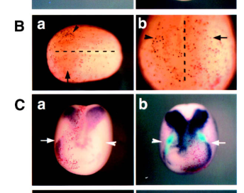

## Question

# Gene Research for Functional Annotation

## ⚠️ CRITICAL: Gene/Protein Identification Context

**BEFORE YOU BEGIN RESEARCH:** You MUST verify you are researching the CORRECT gene/protein. Gene symbols can be ambiguous, especially for less well-characterized genes from non-model organisms.

### Target Gene/Protein Identity (from UniProt):
- **UniProt Accession:** Q91399
- **Protein Description:** RecName: Full=DNA-binding protein inhibitor ID-3-A {ECO:0000250|UniProtKB:Q02535}; AltName: Full=Inhibitor of DNA binding 3 {ECO:0000303|PubMed:10525185}; Short=XId3 {ECO:0000303|PubMed:10525185}; Short=XIdI {ECO:0000303|PubMed:7619724}; Short=XIdIa {ECO:0000312|EMBL:AAB34946.1}; Short=XIdIb {ECO:0000303|PubMed:7619724}; Short=XIdx {ECO:0000312|EMBL:AAB34225.1}; AltName: Full=Inhibitor of differentiation 3-A;
- **Gene Information:** Name=id3-a; Synonyms=id3 {ECO:0000312|EMBL:CAC00501.1};
- **Organism (full):** Xenopus laevis (African clawed frog).
- **Protein Family:** Not specified in UniProt
- **Key Domains:** bHLH_dom. (IPR011598); DNA-bd_prot-inh. (IPR026052); HLH_DNA-bd_sf. (IPR036638); HLH (PF00010)

### MANDATORY VERIFICATION STEPS:

1. **Check if the gene symbol "id3-a" matches the protein description above**
2. **Verify the organism is correct:** Xenopus laevis (African clawed frog).
3. **Check if protein family/domains align with what you find in literature**
4. **If you find literature for a DIFFERENT gene with the same or similar symbol, STOP**

### If Gene Symbol is Ambiguous or You Cannot Find Relevant Literature:

**DO NOT PROCEED WITH RESEARCH ON A DIFFERENT GENE.** Instead:
- State clearly: "The gene symbol 'id3-a' is ambiguous or literature is limited for this specific protein"
- Explain what you found (e.g., "Found extensive literature on a different gene with the same symbol in a different organism")
- Describe the protein based ONLY on the UniProt information provided above
- Suggest that the protein function can be inferred from domain/family information

### Research Target:

Please provide a comprehensive research report on the gene **id3-a** (gene ID: id3-a, UniProt: Q91399) in XENLA.

The research report should be a detailed narrative explaining the function, biological processes, and localization of the gene product. Citations should be given for all claims.

You should prioritize authoritative reviews and primary scientific literature when conducting research. You can supplement
this with annotations you find in gene/protein databases, but these can be outdated or inaccurate.

We are specifically interested in the primary function of the gene - for enzymes, what reaction is catalyzed, and what is the substrate specificity? For transporters, what is the substrate? For structural proteins or adapters, what is the broader structural role? For signaling molecules, what is the role in the pathway.

We are interested in where in or outside the cell the gene product carries out its function.

We are also interested in the signaling or biochemical pathways in which the gene functions. We are less interested in broad pleiotropic effects, except where these elucidate the precise role.

Include evidence where possible. We are interested in both experimental evidence as well as inference from structure, evolution, or bioinformatic analysis. Precise studies should be prioritized over high-throughput, where available.

## Output

Question: You are an expert researcher providing comprehensive, well-cited information.

Provide detailed information focusing on:
1. Key concepts and definitions with current understanding
2. Recent developments and latest research (prioritize 2023-2024 sources)
3. Current applications and real-world implementations
4. Expert opinions and analysis from authoritative sources
5. Relevant statistics and data from recent studies

Format as a comprehensive research report with proper citations. Include URLs and publication dates where available.
Always prioritize recent, authoritative sources and provide specific citations for all major claims.

# Gene Research for Functional Annotation

## ⚠️ CRITICAL: Gene/Protein Identification Context

**BEFORE YOU BEGIN RESEARCH:** You MUST verify you are researching the CORRECT gene/protein. Gene symbols can be ambiguous, especially for less well-characterized genes from non-model organisms.

### Target Gene/Protein Identity (from UniProt):
- **UniProt Accession:** Q91399
- **Protein Description:** RecName: Full=DNA-binding protein inhibitor ID-3-A {ECO:0000250|UniProtKB:Q02535}; AltName: Full=Inhibitor of DNA binding 3 {ECO:0000303|PubMed:10525185}; Short=XId3 {ECO:0000303|PubMed:10525185}; Short=XIdI {ECO:0000303|PubMed:7619724}; Short=XIdIa {ECO:0000312|EMBL:AAB34946.1}; Short=XIdIb {ECO:0000303|PubMed:7619724}; Short=XIdx {ECO:0000312|EMBL:AAB34225.1}; AltName: Full=Inhibitor of differentiation 3-A;
- **Gene Information:** Name=id3-a; Synonyms=id3 {ECO:0000312|EMBL:CAC00501.1};
- **Organism (full):** Xenopus laevis (African clawed frog).
- **Protein Family:** Not specified in UniProt
- **Key Domains:** bHLH_dom. (IPR011598); DNA-bd_prot-inh. (IPR026052); HLH_DNA-bd_sf. (IPR036638); HLH (PF00010)

### MANDATORY VERIFICATION STEPS:

1. **Check if the gene symbol "id3-a" matches the protein description above**
2. **Verify the organism is correct:** Xenopus laevis (African clawed frog).
3. **Check if protein family/domains align with what you find in literature**
4. **If you find literature for a DIFFERENT gene with the same or similar symbol, STOP**

### If Gene Symbol is Ambiguous or You Cannot Find Relevant Literature:

**DO NOT PROCEED WITH RESEARCH ON A DIFFERENT GENE.** Instead:
- State clearly: "The gene symbol 'id3-a' is ambiguous or literature is limited for this specific protein"
- Explain what you found (e.g., "Found extensive literature on a different gene with the same symbol in a different organism")
- Describe the protein based ONLY on the UniProt information provided above
- Suggest that the protein function can be inferred from domain/family information

### Research Target:

Please provide a comprehensive research report on the gene **id3-a** (gene ID: id3-a, UniProt: Q91399) in XENLA.

The research report should be a detailed narrative explaining the function, biological processes, and localization of the gene product. Citations should be given for all claims.

You should prioritize authoritative reviews and primary scientific literature when conducting research. You can supplement
this with annotations you find in gene/protein databases, but these can be outdated or inaccurate.

We are specifically interested in the primary function of the gene - for enzymes, what reaction is catalyzed, and what is the substrate specificity? For transporters, what is the substrate? For structural proteins or adapters, what is the broader structural role? For signaling molecules, what is the role in the pathway.

We are interested in where in or outside the cell the gene product carries out its function.

We are also interested in the signaling or biochemical pathways in which the gene functions. We are less interested in broad pleiotropic effects, except where these elucidate the precise role.

Include evidence where possible. We are interested in both experimental evidence as well as inference from structure, evolution, or bioinformatic analysis. Precise studies should be prioritized over high-throughput, where available.

# Functional annotation report: *Xenopus laevis id3-a* (UniProt Q91399)

## Identity and scope

The supplied UniProt record identifies **Q91399** as the African clawed frog (*Xenopus laevis*) protein **DNA-binding protein inhibitor ID-3-A**, encoded by *id3-a*; its reported names include XId3, XIdI and XIdx. The record’s helix–loop–helix (HLH) and DNA-binding-protein-inhibitor domains agree with primary Xenopus literature describing Id3 as an Id-family HLH regulator. This is **not** Id2, Id4, or a mammalian ID3 protein. Importantly, older experiments generally name “Xenopus Id3” or XId3 without demonstrating that their probes, morpholino targets, and measured protein discriminate the modern *id3-a* product from another Id3 copy. Accordingly, the embryonic findings below are strong evidence for **Xenopus Id3 biology**, but should not all be interpreted as uniquely proven Q91399-specific effects. [UniProt record: https://www.uniprot.org/uniprotkb/Q91399/entry.] (liu2003cloningandcharacterization pages 1-3, liu2003cloningandcharacterization pages 3-4, liu2003cloningandcharacterization pages 4-6)

## Primary molecular function and site of action

Id3 is **not an enzyme, transporter, or direct sequence-specific DNA-binding transcription factor**. Id proteins retain an HLH dimerization region but lack the basic DNA-binding region characteristic of basic HLH (bHLH) transcription factors. Their established family-level mechanism is to associate with bHLH partners—particularly broadly expressed E proteins—thereby reducing formation of transcriptionally active, DNA-binding bHLH dimers. The resulting effect is regulation of gene expression, differentiation and progenitor behaviour rather than catalysis of a biochemical reaction. The E-protein-sequestration mechanism is well supported for the Id family; the Xenopus studies cited here did **not** identify a particular Q91399-bound E protein as the mediator of the neural-crest phenotype. (liu2003cloningandcharacterization pages 1-3, kee2005toproliferateor pages 1-2)

A useful direct functional constraint comes from Liu and Harland’s Xenopus embryo and animal-cap *misexpression* experiments: under their sensitized assay conditions, Id3 antagonized **NeuroD-induced** differentiation-associated activity, whereas it did not comparably inhibit neurogenin- or MyoD-induced activity. Id2 inhibited NeuroD and MyoD, and Id4 inhibited all three in those assays. These are **functional interactions under specific expression conditions**, not proof that Id3 directly binds NeuroD or that its specificity is universal. Liu and Harland, *Developmental Biology*, **December 2003**, https://doi.org/10.1016/j.ydbio.2003.08.017. (liu2003cloningandcharacterization pages 7-8, liu2003cloningandcharacterization pages 12-13)

**Subcellular localization:** Id3’s plausible working site is the **intracellular, principally nuclear transcription-regulatory compartment**, because its proposed activity is to prevent bHLH partners from engaging DNA. However, the retrieved Xenopus experiments primarily map **Id3 mRNA within embryos**, not Q91399 protein within individual cells. Nuclear enrichment, nuclear–cytoplasmic partitioning, and any extracellular location should therefore **not** be claimed as experimentally established for *id3-a*. The word “DNA-binding inhibitor” describes its effect on other factors, not direct DNA recognition by Id3. (liu2003cloningandcharacterization pages 1-3, kee2005toproliferateor pages 1-2)

## Biological role: maintaining neural-crest progenitors

The clearest in-vivo function is **support of cell-cycle progression and survival in early neural-crest progenitors at the neural-plate border**. Kee and Bronner-Fraser detected Xenopus Id3 transcripts in premigratory and early migratory neural crest and depleted Id3 with a translation-blocking morpholino targeted to prospective crest. *Slug*, *sox10* and *foxD3* expression declined or disappeared; an Id2 morpholino did not reproduce this effect, and supplying morpholino-resistant **chick Id3** rescued progenitor-marker loss. These experiments provide stronger functional evidence than expression overlap alone, although the paper did not establish modern *id3-a*-versus-other-copy selectivity. Kee and Bronner-Fraser, *Genes & Development*, **March 2005**, https://doi.org/10.1101/gad.1257405. (kee2005toproliferateor pages 1-2, kee2005toproliferateor pages 3-4)

The phenotype was associated with **reduced mitosis followed by cell death**, rather than a demonstrated conversion of crest cells into neural or epidermal fate. Phospho-histone-H3 staining showed fewer mitotic cells near the injected neural-plate border in **91% of 23** Id3-depleted embryos, accompanied by ectopic expression of the cyclin-dependent-kinase inhibitor *p27Xic1*. Excess TUNEL staining on the depleted side occurred in **89% of 38** embryos; **81% of 32** control-morpholino embryos lacked a corresponding excess. Conversely, Id3 overexpression increased BrdU labeling and expanded the neural-crest-marker domain. The authors proposed that Id3 might sequester a transcription factor that otherwise activates cell-cycle inhibitors, but the identity and physical binding of that proposed factor were **not established**. The published Figure 5 provides visual evidence for the mitotic, *p27Xic1* and TUNEL assays. (kee2005toproliferateor pages 6-7, kee2005toproliferateor pages 7-8, kee2005toproliferateor media 2e483152)

Anatomically, earlier Id3 mRNA is widespread in gastrula ectoderm, then becomes prominent at the neural-plate border and in parts of the anterior neural plate and hindbrain. Additional reported transcript sites include eye and otic territories, myotome margins and some other embryonic tissues. These locations indicate where the gene is **expressed**; they do not independently establish an Id3 protein function in each tissue. (kee2005toproliferateor pages 1-2, liu2003cloningandcharacterization pages 4-6, liu2003cloningandcharacterization pages 8-10)

## Pathway placement and regulation

**BMP input.** XId3 is a BMP-responsive gene, placing Id3 downstream of an extracellular developmental signal rather than making the Id3 protein itself a BMP ligand or receptor. In a Xenopus microarray experiment using dissociated animal-cap cells, BMP2 produced approximately **9.0-fold XId3 induction** relative to the cycloheximide-treated comparison; persistence of induction under protein-synthesis inhibition supports relatively direct transcriptional responsiveness, not a measured change in Q91399 enzymatic activity. Peiffer *et al.*, *Developmental Dynamics*, **February 2005** (published online December 20, 2004), https://doi.org/10.1002/dvdy.20230. (peiffer2005axenopusdna pages 4-5, peiffer2005axenopusdna pages 1-2)

BMP responsiveness is **context-dependent**, not a claim that BMP is required for every Id3-expressing cell. Ectopic BMP4 induced sharply bounded Id3 transcript domains in intact Xenopus embryos, but additional BMP4 did not raise Id3 mRNA in the tested isolated ectodermal explants; the BMP antagonist noggin also did **not** abolish Id3 in those explants. In a separate neural-crest-induction assay, combined **Chordin-mediated BMP antagonism and Wnt8** maintained or increased Id3 expression, whereas either condition alone reduced it. Thus, direct BMP responsiveness at one developmental stage or assay is compatible with Id3 maintenance at a Wnt-positive, BMP-modulated neural-plate border: tissue, dose and additional inputs matter. This interpretation does not establish the exact integration mechanism. (liu2003cloningandcharacterization pages 6-7, liu2003cloningandcharacterization pages 8-10, kee2005toproliferateor pages 3-4, kee2005toproliferateor pages 7-8)

A **16-base-pair BMP-response-element core** from the Xenopus *id3* regulatory region contains Smad1- and Smad4-recognition sequences separated by a five-nucleotide spacer. Shortening that spacer impaired responsiveness of experimental reporters; multimerized XId3-derived elements have been used as BMP transcriptional readouts, including in mouse embryonic stem cells and transgenic animals. The published model invokes a Smad1/Smad4–Schnurri regulatory complex. This is evidence for a useful **cis-regulatory reporter**, not evidence that the Id3 protein itself binds Smads or that the short reporter reproduces every endogenous *id3* expression domain. Javier *et al.*, *PLOS ONE*, **September 2012**, https://doi.org/10.1371/journal.pone.0042566; Doan *et al.*, *PLOS ONE*, **September 2012**, https://doi.org/10.1371/journal.pone.0044009. (javier2012bmpindicatormice pages 2-3, doan2012abmpreporter pages 2-4, javier2012bmpindicatormice pages 1-2)

**Notch input.** In Xenopus embryos, expression of an activated Notch intracellular domain expanded the Id3 expression territory, whereas dominant-inhibitory Delta reduced it. Two consensus Suppressor-of-Hairless/CSL sites were reported in the Xenopus Id3 promoter. Together these observations support positive regulation by Notch; the cited gain/loss experiments alone should not be mistaken for proof of occupancy at those sites in every endogenous cell. By contrast, FGF8 expression or dominant-negative Ras did not detectably alter Id3 in the tested naïve ectodermal explants—a **limited negative result**, not an exclusion of FGF involvement elsewhere. (liu2003cloningandcharacterization pages 7-8, liu2003cloningandcharacterization pages 6-7, liu2003cloningandcharacterization pages 3-4)

## Current assessment, applications and evidence limits

A review **published July 9, 2024** places BMP, Wnt, FGF and Notch in a spatially and temporally coordinated neural-plate-border network, consistent with the older Xenopus perturbation studies; it does **not** provide a new accession-specific mechanism for Q91399. Esmaeli *et al.*, *International Journal of Developmental Biology*, **2024**, https://doi.org/10.1387/ijdb.230231me. Targeted searches did not identify a **2023–2024 experimental study specifically resolving Q91399/id3-a** protein localization or binding partners. It would therefore be misleading to replace the direct 2003–2005 functional evidence with recent studies of unrelated species’ ID3 proteins. (esmaeli2024molecularsignalingdirecting pages 1-2, liu2003cloningandcharacterization pages 1-3, kee2005toproliferateor pages 6-7)

The documented real-world **research applications** are Xenopus embryo and animal-cap perturbation assays for neural-crest regulation and an XId3-derived BRE used as a BMP-signaling reporter. The reporter reads activity of a regulatory DNA element; it is **not a therapeutic use of the Q91399 protein**. The most defensible functional annotation is: **an HLH-mediated antagonist of bHLH transcriptional activity that, in the Xenopus Id3 experimental literature, sustains proliferation and survival of neural-crest progenitors and integrates developmentally restricted BMP/Notch-associated inputs.** Direct assignment of every historical phenotype to the *a* copy, the identity of its operative cell-cycle-regulatory binding partner, and measured Q91399-specific subcellular localization remain unresolved. (kee2005toproliferateor pages 3-4, liu2003cloningandcharacterization pages 7-8, javier2012bmpindicatormice pages 2-3, kee2005toproliferateor pages 7-8)

The following evidence-tier summary separates observations made in Xenopus Id3 experiments from promoter-reporter results and accession-level inference.

| Finding | Evidence and study/date | Interpretive limit |
|---|---|---|
| **Identity and family** | UniProt Q91399 identifies *X. laevis* **id3-a** (XId3/XIdI) as an inhibitor-of-DNA-binding/differentiation protein with an HLH domain. Xenopus Id proteins lack the basic DNA-binding region and antagonize bHLH activity through dimerization; legacy work also called Xenopus Id3 “Xidx” (Liu & Harland, 2003) (liu2003cloningandcharacterization pages 1-3) | The accession-level identity comes from UniProt. Most older embryo studies report “Xenopus Id3” without assays that discriminate the *id3-a* and *id3-b* homoeologs; their results therefore support Xenopus Id3 function but are not invariably Q91399-specific. |
| **Selective bHLH inhibition** | In sensitized embryo and animal-cap assays, Id3 inhibited NeuroD-induced activity but did not inhibit MyoD or neurogenin under the tested conditions; Id2 and Id4 had broader profiles (Liu & Harland, December 2003) (liu2003cloningandcharacterization pages 7-8, liu2003cloningandcharacterization pages 12-13) | This is functional antagonism, not direct biochemical measurement of Id3–NeuroD or Id3–E-protein binding. Partner specificity may depend on dose and cellular context, and the construct was not proven uniquely to represent the modern *id3-a* homoeolog. |
| **Neural-crest requirement** | Neural-crest-targeted Id3 morpholino reduced or abolished *slug*, *sox10* and *foxD3* expression; the morpholino blocked Id3 translation specifically, an Id2 morpholino did not phenocopy it, and morpholino-resistant chick Id3 rescued progenitor loss (Kee & Bronner-Fraser, March 2005) (kee2005toproliferateor pages 3-4) | Strong loss-of-function and rescue evidence for Xenopus Id3, but morpholino sequence specificity relative to both modern homoeologs was not established. |
| **Cell-cycle progression** | Id3 depletion reduced phospho-histone-H3-positive mitotic cells in the neural-crest region in **91% of 23 embryos** and induced the CDK inhibitor *p27Xic1*. Id3 overexpression increased BrdU labeling and expanded the neural-crest domain (Kee & Bronner-Fraser, 2005) (kee2005toproliferateor pages 7-8, kee2005toproliferateor pages 6-7) | Supports a proliferation-maintenance role; the proposed mechanism—sequestration of an unidentified factor that activates cell-cycle inhibitors—was not demonstrated by partner-binding experiments. |
| **Progenitor survival** | TUNEL staining increased on the Id3-depleted side in **89% of 38 embryos**, beginning from late gastrula/early neurula stages; **81% of 32** control-morpholino embryos were negative for a side-to-side increase (Kee & Bronner-Fraser, 2005) (kee2005toproliferateor pages 7-8) | Cell death follows impaired cell-cycle progression and does not prove that Id3 directly controls an apoptotic effector. |
| **BMP-responsive expression** | In dissociated animal-cap cells treated with BMP2 plus cycloheximide, XId3 showed approximately **9.0-fold** microarray induction, consistent with direct transcriptional responsiveness (Peiffer et al., February 2005) (peiffer2005axenopusdna pages 4-5, peiffer2005axenopusdna pages 1-2) | “Direct” means induction persisted when new protein synthesis was inhibited; it does not itself demonstrate endogenous promoter occupancy or Q91399 protein function. BMP dependence is context-specific: in isolated ectoderm, BMP4 did not further elevate Id3 and noggin did **not** abolish Id3, implying additional regulatory inputs (liu2003cloningandcharacterization pages 6-7). |
| **XId3 BMP-response element** | A **16-bp** core BRE upstream of XId3 contains Smad1- and Smad4-binding motifs separated by five nucleotides. Multimerized XId3 BRE reporters responded to BMP, while shortening the spacer eliminated responsiveness; reporter applications included transgenic frog, fish and mouse systems (Javier et al. and Doan et al., September 2012) (javier2012bmpindicatormice pages 2-3, doan2012abmpreporter pages 2-4, javier2012bmpindicatormice pages 1-2) | These experiments validate an XId3-derived cis-regulatory module and BMP reporter, not the biochemical activity of the Q91399 protein. The minimal BRE/promoter does not reproduce every endogenous Id3 expression domain. |
| **Notch regulation** | Activated Notch intracellular domain expanded Id3 expression, whereas dominant-inhibitory Delta reduced it; the promoter contains two consensus Su(H)/RBPJ sites (Liu & Harland, 2003) (liu2003cloningandcharacterization pages 7-8) | Supports positive pathway regulation but does not by itself prove direct RBPJ occupancy or homoeolog-specific regulation. A 2024 review places Notch alongside BMP, Wnt and FGF in the temporospatial neural-plate-border network rather than treating any one pathway as sufficient (Esmaeli et al., published July 9, 2024) (esmaeli2024molecularsignalingdirecting pages 1-2). |
| **Cellular and anatomical localization** | Id3 mRNA occurs broadly in gastrula ectoderm and later at the neural-plate border, premigratory/migratory neural crest, anterior neural plate, hindbrain, eye and otic territories; later expression also occurs in myotome margins, heart, blood islands and fin mesenchyme (Liu & Harland, 2003; Kee & Bronner-Fraser, 2005) (kee2005toproliferateor pages 1-2, liu2003cloningandcharacterization pages 8-10, liu2003cloningandcharacterization pages 4-6) | These are anatomical **mRNA-expression** data, not direct subcellular localization of Q91399 protein. A nuclear/intracellular site of action is mechanistically expected for an HLH transcriptional inhibitor, but no located study directly measured *id3-a*-specific nuclear–cytoplasmic protein distribution. |

*Table: Evidence-tier summary for Xenopus laevis Q91399/id3-a, separating direct Xenopus Id3 experiments from pathway-reporter results and homoeolog-level inference. It highlights the strongest quantitative findings and the principal accession-specific limitations.*

References

1. (liu2003cloningandcharacterization pages 1-3): Karen J Liu and Richard M Harland. Cloning and characterization of xenopus id4 reveals differing roles for id genes. Developmental biology, 264 2:339-51, Dec 2003. URL: https://doi.org/10.1016/j.ydbio.2003.08.017, doi:10.1016/j.ydbio.2003.08.017. This article has 88 citations and is from a peer-reviewed journal.

2. (liu2003cloningandcharacterization pages 3-4): Karen J Liu and Richard M Harland. Cloning and characterization of xenopus id4 reveals differing roles for id genes. Developmental biology, 264 2:339-51, Dec 2003. URL: https://doi.org/10.1016/j.ydbio.2003.08.017, doi:10.1016/j.ydbio.2003.08.017. This article has 88 citations and is from a peer-reviewed journal.

3. (liu2003cloningandcharacterization pages 4-6): Karen J Liu and Richard M Harland. Cloning and characterization of xenopus id4 reveals differing roles for id genes. Developmental biology, 264 2:339-51, Dec 2003. URL: https://doi.org/10.1016/j.ydbio.2003.08.017, doi:10.1016/j.ydbio.2003.08.017. This article has 88 citations and is from a peer-reviewed journal.

4. (kee2005toproliferateor pages 1-2): Yun Kee and Marianne Bronner-Fraser. To proliferate or to die: role of id3 in cell cycle progression and survival of neural crest progenitors. Genes & development, 19 6:744-55, Mar 2005. URL: https://doi.org/10.1101/gad.1257405, doi:10.1101/gad.1257405. This article has 130 citations and is from a highest quality peer-reviewed journal.

5. (liu2003cloningandcharacterization pages 7-8): Karen J Liu and Richard M Harland. Cloning and characterization of xenopus id4 reveals differing roles for id genes. Developmental biology, 264 2:339-51, Dec 2003. URL: https://doi.org/10.1016/j.ydbio.2003.08.017, doi:10.1016/j.ydbio.2003.08.017. This article has 88 citations and is from a peer-reviewed journal.

6. (liu2003cloningandcharacterization pages 12-13): Karen J Liu and Richard M Harland. Cloning and characterization of xenopus id4 reveals differing roles for id genes. Developmental biology, 264 2:339-51, Dec 2003. URL: https://doi.org/10.1016/j.ydbio.2003.08.017, doi:10.1016/j.ydbio.2003.08.017. This article has 88 citations and is from a peer-reviewed journal.

7. (kee2005toproliferateor pages 3-4): Yun Kee and Marianne Bronner-Fraser. To proliferate or to die: role of id3 in cell cycle progression and survival of neural crest progenitors. Genes & development, 19 6:744-55, Mar 2005. URL: https://doi.org/10.1101/gad.1257405, doi:10.1101/gad.1257405. This article has 130 citations and is from a highest quality peer-reviewed journal.

8. (kee2005toproliferateor pages 6-7): Yun Kee and Marianne Bronner-Fraser. To proliferate or to die: role of id3 in cell cycle progression and survival of neural crest progenitors. Genes & development, 19 6:744-55, Mar 2005. URL: https://doi.org/10.1101/gad.1257405, doi:10.1101/gad.1257405. This article has 130 citations and is from a highest quality peer-reviewed journal.

9. (kee2005toproliferateor pages 7-8): Yun Kee and Marianne Bronner-Fraser. To proliferate or to die: role of id3 in cell cycle progression and survival of neural crest progenitors. Genes & development, 19 6:744-55, Mar 2005. URL: https://doi.org/10.1101/gad.1257405, doi:10.1101/gad.1257405. This article has 130 citations and is from a highest quality peer-reviewed journal.

10. (kee2005toproliferateor media 2e483152): Yun Kee and Marianne Bronner-Fraser. To proliferate or to die: role of id3 in cell cycle progression and survival of neural crest progenitors. Genes & development, 19 6:744-55, Mar 2005. URL: https://doi.org/10.1101/gad.1257405, doi:10.1101/gad.1257405. This article has 130 citations and is from a highest quality peer-reviewed journal.

11. (liu2003cloningandcharacterization pages 8-10): Karen J Liu and Richard M Harland. Cloning and characterization of xenopus id4 reveals differing roles for id genes. Developmental biology, 264 2:339-51, Dec 2003. URL: https://doi.org/10.1016/j.ydbio.2003.08.017, doi:10.1016/j.ydbio.2003.08.017. This article has 88 citations and is from a peer-reviewed journal.

12. (peiffer2005axenopusdna pages 4-5): Daniel A. Peiffer, Andreas Von Bubnoff, Yongchol Shin, Atsushi Kitayama, Makoto Mochii, Naoto Ueno, and Ken W.Y. Cho. A xenopus dna microarray approach to identify novel direct bmp target genes involved in early embryonic development. Developmental Dynamics, 232:445-456, Feb 2005. URL: https://doi.org/10.1002/dvdy.20230, doi:10.1002/dvdy.20230. This article has 40 citations and is from a peer-reviewed journal.

13. (peiffer2005axenopusdna pages 1-2): Daniel A. Peiffer, Andreas Von Bubnoff, Yongchol Shin, Atsushi Kitayama, Makoto Mochii, Naoto Ueno, and Ken W.Y. Cho. A xenopus dna microarray approach to identify novel direct bmp target genes involved in early embryonic development. Developmental Dynamics, 232:445-456, Feb 2005. URL: https://doi.org/10.1002/dvdy.20230, doi:10.1002/dvdy.20230. This article has 40 citations and is from a peer-reviewed journal.

14. (liu2003cloningandcharacterization pages 6-7): Karen J Liu and Richard M Harland. Cloning and characterization of xenopus id4 reveals differing roles for id genes. Developmental biology, 264 2:339-51, Dec 2003. URL: https://doi.org/10.1016/j.ydbio.2003.08.017, doi:10.1016/j.ydbio.2003.08.017. This article has 88 citations and is from a peer-reviewed journal.

15. (javier2012bmpindicatormice pages 2-3): Anna L. Javier, L. Doan, M. Luong, N. Soledad, Reyes De Mochel, Aixu Sun, E. Monuki, Ken W. Y. Cho, and Michael Schubert. Bmp indicator mice reveal dynamic regulation of transcriptional response. PLoS ONE, 7:e42566, Sep 2012. URL: https://doi.org/10.1371/journal.pone.0042566, doi:10.1371/journal.pone.0042566. This article has 45 citations and is from a peer-reviewed journal.

16. (doan2012abmpreporter pages 2-4): Linda T. Doan, Anna L. Javier, Nicole M. Furr, Kevin L. Nguyen, Ken W. Cho, and Edwin S. Monuki. A bmp reporter with ultrasensitive characteristics reveals that high bmp signaling is not required for cortical hem fate. PLoS ONE, 7:e44009, Sep 2012. URL: https://doi.org/10.1371/journal.pone.0044009, doi:10.1371/journal.pone.0044009. This article has 18 citations and is from a peer-reviewed journal.

17. (javier2012bmpindicatormice pages 1-2): Anna L. Javier, L. Doan, M. Luong, N. Soledad, Reyes De Mochel, Aixu Sun, E. Monuki, Ken W. Y. Cho, and Michael Schubert. Bmp indicator mice reveal dynamic regulation of transcriptional response. PLoS ONE, 7:e42566, Sep 2012. URL: https://doi.org/10.1371/journal.pone.0042566, doi:10.1371/journal.pone.0042566. This article has 45 citations and is from a peer-reviewed journal.

18. (esmaeli2024molecularsignalingdirecting pages 1-2): Mojtaba Esmaeli, Mahdi Barazesh, Zeinab Karimi, Shiva Roshankhah, and Ali Ghanbari. Molecular signaling directing neural plate border formation. The International journal of developmental biology, 68 2:65-78, Jul 2024. URL: https://doi.org/10.1387/ijdb.230231me, doi:10.1387/ijdb.230231me. This article has 10 citations.

## Artifacts

- [Edison artifact artifact-00](id3-a-deep-research-falcon_artifacts/artifact-00.md)

## Citations

1. liu2003cloningandcharacterization pages 1-3
2. kee2005toproliferateor pages 3-4
3. kee2005toproliferateor pages 7-8
4. liu2003cloningandcharacterization pages 6-7
5. liu2003cloningandcharacterization pages 7-8
6. esmaeli2024molecularsignalingdirecting pages 1-2
7. liu2003cloningandcharacterization pages 3-4
8. liu2003cloningandcharacterization pages 4-6
9. kee2005toproliferateor pages 1-2
10. liu2003cloningandcharacterization pages 12-13
11. kee2005toproliferateor pages 6-7
12. liu2003cloningandcharacterization pages 8-10
13. peiffer2005axenopusdna pages 4-5
14. peiffer2005axenopusdna pages 1-2
15. javier2012bmpindicatormice pages 2-3
16. doan2012abmpreporter pages 2-4
17. javier2012bmpindicatormice pages 1-2
18. UniProt record: https://www.uniprot.org/uniprotkb/Q91399/entry.
19. https://www.uniprot.org/uniprotkb/Q91399/entry.]
20. https://doi.org/10.1016/j.ydbio.2003.08.017.
21. https://doi.org/10.1101/gad.1257405.
22. https://doi.org/10.1002/dvdy.20230.
23. https://doi.org/10.1371/journal.pone.0042566;
24. https://doi.org/10.1371/journal.pone.0044009.
25. https://doi.org/10.1387/ijdb.230231me.
26. https://doi.org/10.1016/j.ydbio.2003.08.017,
27. https://doi.org/10.1101/gad.1257405,
28. https://doi.org/10.1002/dvdy.20230,
29. https://doi.org/10.1371/journal.pone.0042566,
30. https://doi.org/10.1371/journal.pone.0044009,
31. https://doi.org/10.1387/ijdb.230231me,