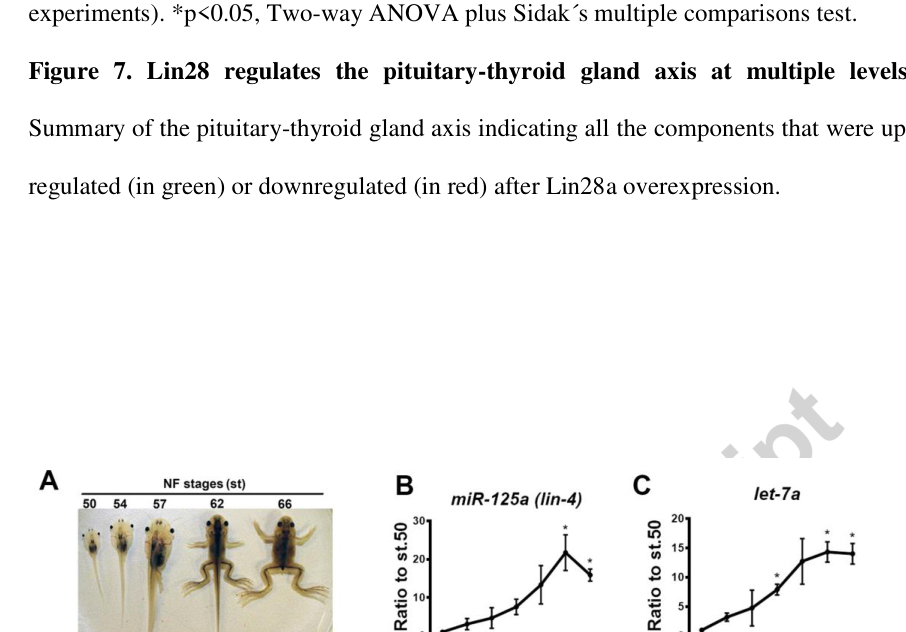

## Question

# Gene Research for Functional Annotation

## ⚠️ CRITICAL: Gene/Protein Identification Context

**BEFORE YOU BEGIN RESEARCH:** You MUST verify you are researching the CORRECT gene/protein. Gene symbols can be ambiguous, especially for less well-characterized genes from non-model organisms.

### Target Gene/Protein Identity (from UniProt):
- **UniProt Accession:** Q8JHC4
- **Protein Description:** RecName: Full=Protein lin-28 homolog A; Short=Lin-28A;
- **Gene Information:** Name=lin28a; Synonyms=lin28;
- **Organism (full):** Xenopus laevis (African clawed frog).
- **Protein Family:** Belongs to the lin-28 family. .
- **Key Domains:** CSD. (IPR011129); CSP_DNA-bd. (IPR002059); Lin-28_RNA-binding. (IPR051373); Lin-28A-like_Znf-CCHC_2. (IPR054081); NA-bd_OB-fold. (IPR012340)

### MANDATORY VERIFICATION STEPS:

1. **Check if the gene symbol "lin28a" matches the protein description above**
2. **Verify the organism is correct:** Xenopus laevis (African clawed frog).
3. **Check if protein family/domains align with what you find in literature**
4. **If you find literature for a DIFFERENT gene with the same or similar symbol, STOP**

### If Gene Symbol is Ambiguous or You Cannot Find Relevant Literature:

**DO NOT PROCEED WITH RESEARCH ON A DIFFERENT GENE.** Instead:
- State clearly: "The gene symbol 'lin28a' is ambiguous or literature is limited for this specific protein"
- Explain what you found (e.g., "Found extensive literature on a different gene with the same symbol in a different organism")
- Describe the protein based ONLY on the UniProt information provided above
- Suggest that the protein function can be inferred from domain/family information

### Research Target:

Please provide a comprehensive research report on the gene **lin28a** (gene ID: lin28a, UniProt: Q8JHC4) in XENLA.

The research report should be a detailed narrative explaining the function, biological processes, and localization of the gene product. Citations should be given for all claims.

You should prioritize authoritative reviews and primary scientific literature when conducting research. You can supplement
this with annotations you find in gene/protein databases, but these can be outdated or inaccurate.

We are specifically interested in the primary function of the gene - for enzymes, what reaction is catalyzed, and what is the substrate specificity? For transporters, what is the substrate? For structural proteins or adapters, what is the broader structural role? For signaling molecules, what is the role in the pathway.

We are interested in where in or outside the cell the gene product carries out its function.

We are also interested in the signaling or biochemical pathways in which the gene functions. We are less interested in broad pleiotropic effects, except where these elucidate the precise role.

Include evidence where possible. We are interested in both experimental evidence as well as inference from structure, evolution, or bioinformatic analysis. Precise studies should be prioritized over high-throughput, where available.

## Output

Question: You are an expert researcher providing comprehensive, well-cited information.

Provide detailed information focusing on:
1. Key concepts and definitions with current understanding
2. Recent developments and latest research (prioritize 2023-2024 sources)
3. Current applications and real-world implementations
4. Expert opinions and analysis from authoritative sources
5. Relevant statistics and data from recent studies

Format as a comprehensive research report with proper citations. Include URLs and publication dates where available.
Always prioritize recent, authoritative sources and provide specific citations for all major claims.

# Gene Research for Functional Annotation

## ⚠️ CRITICAL: Gene/Protein Identification Context

**BEFORE YOU BEGIN RESEARCH:** You MUST verify you are researching the CORRECT gene/protein. Gene symbols can be ambiguous, especially for less well-characterized genes from non-model organisms.

### Target Gene/Protein Identity (from UniProt):
- **UniProt Accession:** Q8JHC4
- **Protein Description:** RecName: Full=Protein lin-28 homolog A; Short=Lin-28A;
- **Gene Information:** Name=lin28a; Synonyms=lin28;
- **Organism (full):** Xenopus laevis (African clawed frog).
- **Protein Family:** Belongs to the lin-28 family. .
- **Key Domains:** CSD. (IPR011129); CSP_DNA-bd. (IPR002059); Lin-28_RNA-binding. (IPR051373); Lin-28A-like_Znf-CCHC_2. (IPR054081); NA-bd_OB-fold. (IPR012340)

### MANDATORY VERIFICATION STEPS:

1. **Check if the gene symbol "lin28a" matches the protein description above**
2. **Verify the organism is correct:** Xenopus laevis (African clawed frog).
3. **Check if protein family/domains align with what you find in literature**
4. **If you find literature for a DIFFERENT gene with the same or similar symbol, STOP**

### If Gene Symbol is Ambiguous or You Cannot Find Relevant Literature:

**DO NOT PROCEED WITH RESEARCH ON A DIFFERENT GENE.** Instead:
- State clearly: "The gene symbol 'lin28a' is ambiguous or literature is limited for this specific protein"
- Explain what you found (e.g., "Found extensive literature on a different gene with the same symbol in a different organism")
- Describe the protein based ONLY on the UniProt information provided above
- Suggest that the protein function can be inferred from domain/family information

### Research Target:

Please provide a comprehensive research report on the gene **lin28a** (gene ID: lin28a, UniProt: Q8JHC4) in XENLA.

The research report should be a detailed narrative explaining the function, biological processes, and localization of the gene product. Citations should be given for all claims.

You should prioritize authoritative reviews and primary scientific literature when conducting research. You can supplement
this with annotations you find in gene/protein databases, but these can be outdated or inaccurate.

We are specifically interested in the primary function of the gene - for enzymes, what reaction is catalyzed, and what is the substrate specificity? For transporters, what is the substrate? For structural proteins or adapters, what is the broader structural role? For signaling molecules, what is the role in the pathway.

We are interested in where in or outside the cell the gene product carries out its function.

We are also interested in the signaling or biochemical pathways in which the gene functions. We are less interested in broad pleiotropic effects, except where these elucidate the precise role.

Include evidence where possible. We are interested in both experimental evidence as well as inference from structure, evolution, or bioinformatic analysis. Precise studies should be prioritized over high-throughput, where available.

# Functional annotation report: *lin28a* in *Xenopus laevis*

## Identity and scope

The supplied UniProt accession **Q8JHC4** identifies Lin-28 homolog A (Lin28a) from the African clawed frog, *Xenopus laevis*. This assignment is consistent with primary research that separately cloned *X. laevis lin28a* and its paralog *lin28b* for experimental overexpression. Vertebrate LIN28 proteins have a cold-shock RNA-binding domain and CCHC-type zinc knuckles, matching the supplied domain annotations. The accession-to-sequence mapping itself was supplied in the question, rather than independently demonstrated by the retrieved papers. Findings for LIN28B or the related frog *X. tropicalis* are therefore identified separately below. (faunes2017theheterochronicgene pages 6-10, faunes2017theheterochronicgene pages 18-22, oyejobi2024regulatingprotein–rnainteractions pages 3-5)

**Functional conclusion.** *X. laevis* Lin28a is best annotated as an **intracellular RNA-binding, post-transcriptional regulator of developmental timing**, not an enzyme or transporter. The best-established biochemical activity of vertebrate LIN28A is selective binding of let-7 precursor microRNAs and recruitment of the *enzymes* TUT4/TUT7, which changes precursor processing; LIN28 proteins can also bind mRNAs. In *X. laevis* specifically, experimentally increasing Lin28a delays metamorphosis and alters the pituitary–thyroid-hormone pathway. Direct biochemical binding of a particular RNA by Q8JHC4, however, was not established by the frog metamorphosis study. (faunes2017theheterochronicgene pages 14-18, faunes2017theheterochronicgene pages 18-22, oyejobi2024regulatingprotein–rnainteractions pages 1-3, yi2024structuralbasisfor pages 1-2)

The following evidence summary distinguishes target-species measurements from cross-species mechanistic inference:

| Evidence tier | Verified finding | Interpretation / limitation | Publication, DOI URL and year |
|---|---|---|---|
| **Direct target-species evidence: endogenous expression** | In *Xenopus laevis*, endogenous Lin28a protein was detected in the CNS at pre-/pro-metamorphic stages 50–54 and declined after stage 54. *lin28a* RNA localized to ventricular-layer CNS cells and developing hindlimbs. Figure inspection supports these tissue-expression assignments. (faunes2017theheterochronicgene pages 10-14, faunes2017theheterochronicgene media bb643e79) | Strong evidence for developmental and tissue localization. The in-situ data localize **RNA**, not protein within cytoplasmic versus nuclear compartments; *lin28a* RNA was not detected by the study’s metamorphic-stage RT-qPCR assay despite protein detection. | Faunes et al., *Developmental Biology*, [DOI](https://doi.org/10.1016/j.ydbio.2017.03.026), **2017** |
| **Direct target-species evidence: transgenic function** | Heat-shock-induced *X. laevis lin28a* overexpression beginning at stage 50 delayed completion of metamorphosis by about one month; induction beginning at stage 54 delayed it by 10–15 days. Induction at stages 57–62 had no effect. (faunes2017theheterochronicgene pages 10-14, faunes2017theheterochronicgene pages 14-18) | Establishes a timing-dependent role for excess Lin28a before endogenous thyroid-hormone-axis activation. This is an overexpression phenotype, not loss-of-function proof of necessity. | Faunes et al., *Developmental Biology*, [DOI](https://doi.org/10.1016/j.ydbio.2017.03.026), **2017** |
| **Direct target-species evidence: thyroid-axis epistasis and omics** | Lin28a overexpression prevented normal activation of TH-response genes *thrβA* and *klf9*. Exogenous T3 restored target-gene responsiveness and gill resorption; T3 and T4 dose-dependently restored forelimb emergence. Pituitary *tshα/tshβ* expression decreased, with TSH reduction validated by RT-qPCR. Proteomics found **18** altered limb proteins and **32** altered tail proteins; brain RNA-seq found **161 upregulated** and **213 downregulated** transcripts. (faunes2017theheterochronicgene pages 14-18) | Places Lin28a principally upstream of, or parallel to, TH signaling and supports effects on pituitary hormone output, TH transport/metabolism and target-tissue responsiveness. The authors favored an upstream role, but direct binding of the altered frog RNAs or proteins by Lin28a was **not demonstrated**. | Faunes et al., *Developmental Biology*, [DOI](https://doi.org/10.1016/j.ydbio.2017.03.026), **2017** |
| **High-quality mechanistic inference: human structural study** | Cryo-EM structures of human LIN28A–pre-let-7–TUT4/7 complexes, at resolutions up to **3.53 Å**, showed that TUT4/7 normally favor distributive mono-uridylation, whereas LIN28A clamps pre-let-7 onto the enzymes to enable processive oligo-uridylation; the latter blocks Dicer processing and promotes precursor degradation. (yi2024structuralbasisfor pages 1-2) | Provides a strong conserved molecular model for Q8JHC4: an RNA-binding regulator rather than an enzyme. It is human structural and biochemical evidence, not a direct assay of *X. laevis* Q8JHC4. | Yi et al., *Nature Structural & Molecular Biology*, [DOI](https://doi.org/10.1038/s41594-024-01357-9), **2024** |
| **Cross-species mechanistic synthesis** | Vertebrate LIN28 proteins contain an N-terminal cold-shock domain and a zinc-knuckle domain comprising **two CCHC-type knuckles**. The domains bind distinct precursor-RNA elements, including GGAG-like motifs. LIN28A is typically cytoplasmic and acts on pre-let-7 through TUT4/DIS3L2; LIN28B localization is cell-type dependent and can be nuclear or cytoplasmic. (oyejobi2024regulatingprotein–rnainteractions pages 1-3, oyejobi2024regulatingprotein–rnainteractions pages 3-5) | Domain architecture aligns with the supplied Q8JHC4 InterPro annotations and supports conserved pre-let-7 and mRNA binding. “Cytoplasmic LIN28A” is a broad vertebrate model, not direct subcellular fractionation of Q8JHC4 in frog cells. | Oyejobi et al., *International Journal of Molecular Sciences*, [DOI](https://doi.org/10.3390/ijms25073585), **2024** |
| **Non-target evidence—do not transfer without qualification** | In *Xenopus tropicalis*, not *X. laevis*, *lin28a/b* were reported as FGF-responsive genes required for germ-layer patterning; putative positive regulation of miR-17-92-family miRNAs and possible interaction with pre-miR-363 were investigated. (warrander2012theroleofa pages 103-106, warrander2012theroleof pages 74-79, warrander2012theroleofa pages 1-4) | Comparative evidence only. It neither directly tests Q8JHC4 nor justifies assigning the FGF/germ-layer or miR-17-92 mechanism specifically to *X. laevis* Lin28a. Some binding assays used human LIN28A and RNA, further requiring species separation. | Warrander, University of York PhD thesis, **2012**; no peer-reviewed article DOI established in the available record |

*Table: Evidence-graded findings for Xenopus laevis LIN28A, separating direct target-species experiments from conserved human mechanisms and non-target Xenopus tropicalis results.*

## Molecular role and substrate specificity

LIN28A’s cold-shock domain and its pair of CCHC zinc knuckles recognize different features of precursor RNA. Structural studies summarized in a **2024 review** describe bipartite recognition of pre-let-7 hairpins, including a GGAG-like element bound by the zinc-knuckle region; variation in precursor sequence and structure affects recognition. Thus, the most defensible candidate RNA substrate class for frog Lin28a is **let-7-family precursor microRNAs**, rather than all microRNAs indiscriminately. Binding to selected mRNAs is another documented vertebrate LIN28 activity, but the identities of direct mRNA substrates of Q8JHC4 in frog metamorphosis remain unresolved. Oyejobi et al., *International Journal of Molecular Sciences*, published **22 March 2024**, https://doi.org/10.3390/ijms25073585. (oyejobi2024regulatingprotein–rnainteractions pages 1-3, oyejobi2024regulatingprotein–rnainteractions pages 3-5, faunes2017theheterochronicgene pages 18-22)

The biochemical distinction is important: **LIN28A binds and recruits; TUT4/TUT7 catalyze uridine addition.** In a **2024 human** cryo-electron-microscopy and biochemical study, LIN28A held pre-let-7 on TUT4/TUT7 to favor processive addition of multiple 3′ uridines. Without LIN28A, the enzymes instead favored single-uridine addition, which can promote precursor maturation. Oligouridylated pre-let-7 is poorly processed by Dicer and is directed toward degradation, lowering mature let-7 output. Structures resolved to **3.53 Å** provide strong mechanistic support for a conserved LIN28A function, but these complexes did **not** contain *X. laevis* Q8JHC4. Yi et al., *Nature Structural & Molecular Biology*, **July 2024**, https://doi.org/10.1038/s41594-024-01357-9. (yi2024structuralbasisfor pages 1-2, oyejobi2024regulatingprotein–rnainteractions pages 1-3)

## Location: tissue and subcellular context

Direct *X. laevis* measurements placed endogenous **Lin28a protein in the central nervous system** at pre- and pro-metamorphic stages **50–54**, with lower protein abundance after stage 54. In-situ hybridization detected ***lin28a* RNA** in CNS ventricular-layer cells and developing hindlimbs. These observations support a role in developing neural and limb tissues, but an RNA in-situ signal does not establish where the protein resides *within* an individual cell. Notably, the authors did not detect *lin28a* RNA with their metamorphic-stage RT-qPCR assay despite detecting its protein by immunoblot; assay-specific nondetection should not be interpreted as proof of absent protein. Faunes et al., *Developmental Biology* **425:142–151**, **May 2017**, https://doi.org/10.1016/j.ydbio.2017.03.026. The paper’s expression panels also provide visual evidence for the ventricular-layer and hindlimb assignments. (faunes2017theheterochronicgene pages 10-14, faunes2017theheterochronicgene media bb643e79)

At the **subcellular** level, the conserved pre-let-7/TUTase mechanism places LIN28A’s principal characterized activity in the **cytoplasm**, following precursor export from the nucleus. This is a cross-species functional inference, **not** direct cytoplasmic fractionation or imaging of Q8JHC4 in *X. laevis* cells. The frog study cites cytoplasmic *and* nuclear Lin28a detection in ***X. tropicalis***; it describes Lin28b as predominantly nuclear in that species. A 2024 review additionally cautions that LIN28B localization varies across cell types, so an absolute LIN28A-versus-LIN28B compartment rule is unwarranted. No extracellular function is indicated by the evidence reviewed. (faunes2017theheterochronicgene pages 18-22, oyejobi2024regulatingprotein–rnainteractions pages 1-3)

## Developmental pathway demonstrated in *X. laevis*

The strongest direct target-species result concerns **metamorphic timing and thyroid-hormone physiology**. Heat-shock-inducible *X. laevis lin28a* overexpression starting at stage **50** delayed completion of metamorphosis by approximately **one month**: transgenic animals remained around stage 57 when controls had completed metamorphosis. Induction starting at stage **54** delayed completion by **10–15 days**; starting at stages **57–62** did not produce a delay. Controls addressed heat shock and unrelated transgene effects. These are **gain-of-function** results establishing what elevated Lin28a can do, not a demonstration that endogenous Lin28a is individually indispensable. Faunes et al., **2017**, https://doi.org/10.1016/j.ydbio.2017.03.026. The inspected phenotype panels illustrate this developmental delay. (faunes2017theheterochronicgene pages 10-14, faunes2017theheterochronicgene pages 14-18, faunes2017theheterochronicgene media 47a8a9b4)

The pathway-level experiments locate Lin28a **upstream of, or parallel to, thyroid-hormone action**, rather than establishing Lin28a as a thyroid receptor or hormone-synthesis enzyme. Overexpression suppressed normal CNS induction of thyroid-responsive *thrβA* and *klf9*. Nevertheless, externally supplied T3 still elicited target-gene responses and **gill resorption**; either T3 or T4 promoted **forelimb emergence** in delayed animals. These rescue experiments argue that hormone availability or pathway regulation contributes substantially to the phenotype, while leaving open additional tissue-specific effects downstream of hormone. The authors themselves favored an upstream interpretation but stated that direct molecular targets remained to be established. (faunes2017theheterochronicgene pages 14-18, faunes2017theheterochronicgene pages 18-22)

Candidate intermediate changes were documented before overt metamorphic delay. Brain transcriptomics found **161 increased and 213 decreased transcripts**, including reduced pituitary thyroid-stimulating-hormone subunit transcripts; TSH reduction was subsequently checked by RT-qPCR. Proteomics identified **18 altered limb proteins and 32 altered tail proteins**. Reported changes included reduced serum albumin isoforms, which participate in thyroid-hormone transport, and changes potentially affecting T4-to-T3 conversion or thyroid-receptor activity. These are **downstream expression associations**, not proof that Lin28a directly binds the relevant frog RNAs, controls TSH secretion, or physically inhibits thyroid receptors. Faunes et al., **2017**, https://doi.org/10.1016/j.ydbio.2017.03.026. (faunes2017theheterochronicgene pages 14-18, faunes2017theheterochronicgene pages 18-22)

In a related functional assay, stage-53/54 hindlimbs overexpressing Lin28a regenerated **five digits** at approximately **61 days** after amputation, compared with **three to four** in controls. Because the same intervention delays metamorphosis—a period when regenerative ability changes—this result is evidence of altered regenerative outcome, but does not by itself isolate a direct, limb-cell-autonomous regeneration mechanism. Lin28a overexpression also reduced the CNS differentiation markers *dcx* and *mbp*, consistent with altered developmental timing. (faunes2017theheterochronicgene pages 10-14)

## Boundaries of the annotation and current use

The ***X. tropicalis*** FGF-signaling and germ-layer experiments should **not** be attributed to Q8JHC4: experiments in that species found FGF-responsive *lin28a/lin28b* expression and reduced mesodermal responses after combined Lin28 depletion. Suggested regulation of miR-17-92-family members, including pre-miR-363, likewise does not establish those molecules as direct substrates of *X. laevis* Lin28a. Separately, the *X. laevis* metamorphosis study tracked increasing mature let-7 during development, but did not demonstrate that Lin28a’s thyroid-axis phenotype was caused specifically by let-7 suppression. (warrander2012theroleofa pages 103-106, warrander2012theroleof pages 74-79, faunes2017theheterochronicgene pages 10-14, warrander2012theroleofa pages 1-4)

**Research implementation, not an established treatment:** inducible frog Lin28a transgenics provide an experimental means to perturb metamorphic timing, hormone responsiveness and appendage-regeneration outcomes. The **2024** mechanistic literature discusses inhibiting LIN28–let-7 interactions as a prospective drug-discovery strategy, principally in human cancer; it does not establish a clinical application of this frog protein. Overall, the highest-confidence Q8JHC4 annotation is **developmentally regulated RNA-binding protein associated experimentally with the timing of *X. laevis* metamorphosis**; cytoplasmic pre-let-7 suppression is a strong conserved mechanistic hypothesis that still requires protein-specific testing in this species. (faunes2017theheterochronicgene pages 6-10, faunes2017theheterochronicgene pages 14-18, oyejobi2024regulatingprotein–rnainteractions pages 1-3, yi2024structuralbasisfor pages 1-2)

References

1. (faunes2017theheterochronicgene pages 6-10): Fernando Faunes, Daniel G. Gundermann, Rosana Muñoz, Renzo Bruno, and Juan Larraín. The heterochronic gene lin28 regulates amphibian metamorphosis through disturbance of thyroid hormone function. Developmental Biology, 425:142-151, May 2017. URL: https://doi.org/10.1016/j.ydbio.2017.03.026, doi:10.1016/j.ydbio.2017.03.026. This article has 16 citations and is from a peer-reviewed journal.

2. (faunes2017theheterochronicgene pages 18-22): Fernando Faunes, Daniel G. Gundermann, Rosana Muñoz, Renzo Bruno, and Juan Larraín. The heterochronic gene lin28 regulates amphibian metamorphosis through disturbance of thyroid hormone function. Developmental Biology, 425:142-151, May 2017. URL: https://doi.org/10.1016/j.ydbio.2017.03.026, doi:10.1016/j.ydbio.2017.03.026. This article has 16 citations and is from a peer-reviewed journal.

3. (oyejobi2024regulatingprotein–rnainteractions pages 3-5): Greater Kayode Oyejobi, Xiaodan Yan, Piotr Sliz, and Longfei Wang. Regulating protein–rna interactions: advances in targeting the lin28/let-7 pathway. International Journal of Molecular Sciences, 25:3585, Mar 2024. URL: https://doi.org/10.3390/ijms25073585, doi:10.3390/ijms25073585. This article has 19 citations.

4. (faunes2017theheterochronicgene pages 14-18): Fernando Faunes, Daniel G. Gundermann, Rosana Muñoz, Renzo Bruno, and Juan Larraín. The heterochronic gene lin28 regulates amphibian metamorphosis through disturbance of thyroid hormone function. Developmental Biology, 425:142-151, May 2017. URL: https://doi.org/10.1016/j.ydbio.2017.03.026, doi:10.1016/j.ydbio.2017.03.026. This article has 16 citations and is from a peer-reviewed journal.

5. (oyejobi2024regulatingprotein–rnainteractions pages 1-3): Greater Kayode Oyejobi, Xiaodan Yan, Piotr Sliz, and Longfei Wang. Regulating protein–rna interactions: advances in targeting the lin28/let-7 pathway. International Journal of Molecular Sciences, 25:3585, Mar 2024. URL: https://doi.org/10.3390/ijms25073585, doi:10.3390/ijms25073585. This article has 19 citations.

6. (yi2024structuralbasisfor pages 1-2): Gangshun Yi, Mingda Ye, Loic Carrique, Afaf El-Sagheer, Tom Brown, Chris J. Norbury, Peijun Zhang, and Robert J. C. Gilbert. Structural basis for activity switching in polymerases determining the fate of let-7 pre-mirnas. Nature Structural & Molecular Biology, 31:1426-1438, Jul 2024. URL: https://doi.org/10.1038/s41594-024-01357-9, doi:10.1038/s41594-024-01357-9. This article has 4 citations and is from a highest quality peer-reviewed journal.

7. (faunes2017theheterochronicgene pages 10-14): Fernando Faunes, Daniel G. Gundermann, Rosana Muñoz, Renzo Bruno, and Juan Larraín. The heterochronic gene lin28 regulates amphibian metamorphosis through disturbance of thyroid hormone function. Developmental Biology, 425:142-151, May 2017. URL: https://doi.org/10.1016/j.ydbio.2017.03.026, doi:10.1016/j.ydbio.2017.03.026. This article has 16 citations and is from a peer-reviewed journal.

8. (faunes2017theheterochronicgene media bb643e79): Fernando Faunes, Daniel G. Gundermann, Rosana Muñoz, Renzo Bruno, and Juan Larraín. The heterochronic gene lin28 regulates amphibian metamorphosis through disturbance of thyroid hormone function. Developmental Biology, 425:142-151, May 2017. URL: https://doi.org/10.1016/j.ydbio.2017.03.026, doi:10.1016/j.ydbio.2017.03.026. This article has 16 citations and is from a peer-reviewed journal.

9. (warrander2012theroleofa pages 103-106): F Warrander. The role of lin28, an fgf signalling target, in development and mirna regulation. Unknown journal, 2012.

10. (warrander2012theroleof pages 74-79): F Warrander. The role of lin28, an fgf signalling target, in development and mirna regulation. Unknown journal, 2012.

11. (warrander2012theroleofa pages 1-4): F Warrander. The role of lin28, an fgf signalling target, in development and mirna regulation. Unknown journal, 2012.

12. (faunes2017theheterochronicgene media 47a8a9b4): Fernando Faunes, Daniel G. Gundermann, Rosana Muñoz, Renzo Bruno, and Juan Larraín. The heterochronic gene lin28 regulates amphibian metamorphosis through disturbance of thyroid hormone function. Developmental Biology, 425:142-151, May 2017. URL: https://doi.org/10.1016/j.ydbio.2017.03.026, doi:10.1016/j.ydbio.2017.03.026. This article has 16 citations and is from a peer-reviewed journal.

## Artifacts

- [Edison artifact artifact-00](lin28a-deep-research-falcon_artifacts/artifact-00.md)

## Citations

1. faunes2017theheterochronicgene pages 14-18
2. yi2024structuralbasisfor pages 1-2
3. faunes2017theheterochronicgene pages 10-14
4. faunes2017theheterochronicgene pages 6-10
5. faunes2017theheterochronicgene pages 18-22
6. warrander2012theroleofa pages 103-106
7. warrander2012theroleof pages 74-79
8. warrander2012theroleofa pages 1-4
9. DOI
10. https://doi.org/10.1016/j.ydbio.2017.03.026
11. https://doi.org/10.1038/s41594-024-01357-9
12. https://doi.org/10.3390/ijms25073585
13. https://doi.org/10.3390/ijms25073585.
14. https://doi.org/10.1038/s41594-024-01357-9.
15. https://doi.org/10.1016/j.ydbio.2017.03.026.
16. https://doi.org/10.1016/j.ydbio.2017.03.026,
17. https://doi.org/10.3390/ijms25073585,
18. https://doi.org/10.1038/s41594-024-01357-9,