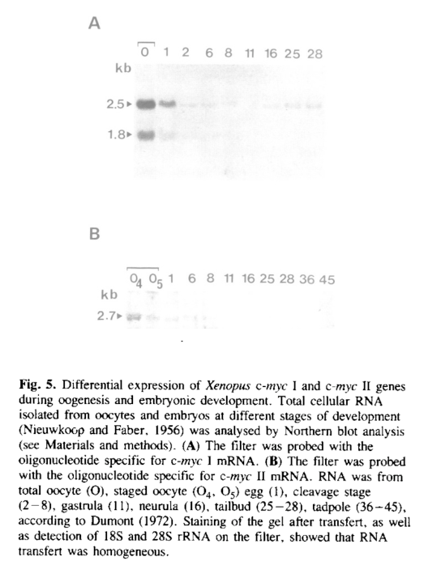

## Question

# Gene Research for Functional Annotation

## ⚠️ CRITICAL: Gene/Protein Identification Context

**BEFORE YOU BEGIN RESEARCH:** You MUST verify you are researching the CORRECT gene/protein. Gene symbols can be ambiguous, especially for less well-characterized genes from non-model organisms.

### Target Gene/Protein Identity (from UniProt):
- **UniProt Accession:** P06171
- **Protein Description:** RecName: Full=Transcriptional regulator Myc-A; AltName: Full=c-Myc I;
- **Gene Information:** Name=myc-a; Synonyms=myc, myc1;
- **Organism (full):** Xenopus laevis (African clawed frog).
- **Protein Family:** Not specified in UniProt
- **Key Domains:** bHLH_dom. (IPR011598); HLH_DNA-bd_sf. (IPR036638); Myc-LZ. (IPR003327); Myc_transcription_factors. (IPR050433); Tscrpt_reg_Myc. (IPR002418)

### MANDATORY VERIFICATION STEPS:

1. **Check if the gene symbol "myc-a" matches the protein description above**
2. **Verify the organism is correct:** Xenopus laevis (African clawed frog).
3. **Check if protein family/domains align with what you find in literature**
4. **If you find literature for a DIFFERENT gene with the same or similar symbol, STOP**

### If Gene Symbol is Ambiguous or You Cannot Find Relevant Literature:

**DO NOT PROCEED WITH RESEARCH ON A DIFFERENT GENE.** Instead:
- State clearly: "The gene symbol 'myc-a' is ambiguous or literature is limited for this specific protein"
- Explain what you found (e.g., "Found extensive literature on a different gene with the same symbol in a different organism")
- Describe the protein based ONLY on the UniProt information provided above
- Suggest that the protein function can be inferred from domain/family information

### Research Target:

Please provide a comprehensive research report on the gene **myc-a** (gene ID: myc-a, UniProt: P06171) in XENLA.

The research report should be a detailed narrative explaining the function, biological processes, and localization of the gene product. Citations should be given for all claims.

You should prioritize authoritative reviews and primary scientific literature when conducting research. You can supplement
this with annotations you find in gene/protein databases, but these can be outdated or inaccurate.

We are specifically interested in the primary function of the gene - for enzymes, what reaction is catalyzed, and what is the substrate specificity? For transporters, what is the substrate? For structural proteins or adapters, what is the broader structural role? For signaling molecules, what is the role in the pathway.

We are interested in where in or outside the cell the gene product carries out its function.

We are also interested in the signaling or biochemical pathways in which the gene functions. We are less interested in broad pleiotropic effects, except where these elucidate the precise role.

Include evidence where possible. We are interested in both experimental evidence as well as inference from structure, evolution, or bioinformatic analysis. Precise studies should be prioritized over high-throughput, where available.

## Output

Question: You are an expert researcher providing comprehensive, well-cited information.

Provide detailed information focusing on:
1. Key concepts and definitions with current understanding
2. Recent developments and latest research (prioritize 2023-2024 sources)
3. Current applications and real-world implementations
4. Expert opinions and analysis from authoritative sources
5. Relevant statistics and data from recent studies

Format as a comprehensive research report with proper citations. Include URLs and publication dates where available.
Always prioritize recent, authoritative sources and provide specific citations for all major claims.

# Gene Research for Functional Annotation

## ⚠️ CRITICAL: Gene/Protein Identification Context

**BEFORE YOU BEGIN RESEARCH:** You MUST verify you are researching the CORRECT gene/protein. Gene symbols can be ambiguous, especially for less well-characterized genes from non-model organisms.

### Target Gene/Protein Identity (from UniProt):
- **UniProt Accession:** P06171
- **Protein Description:** RecName: Full=Transcriptional regulator Myc-A; AltName: Full=c-Myc I;
- **Gene Information:** Name=myc-a; Synonyms=myc, myc1;
- **Organism (full):** Xenopus laevis (African clawed frog).
- **Protein Family:** Not specified in UniProt
- **Key Domains:** bHLH_dom. (IPR011598); HLH_DNA-bd_sf. (IPR036638); Myc-LZ. (IPR003327); Myc_transcription_factors. (IPR050433); Tscrpt_reg_Myc. (IPR002418)

### MANDATORY VERIFICATION STEPS:

1. **Check if the gene symbol "myc-a" matches the protein description above**
2. **Verify the organism is correct:** Xenopus laevis (African clawed frog).
3. **Check if protein family/domains align with what you find in literature**
4. **If you find literature for a DIFFERENT gene with the same or similar symbol, STOP**

### If Gene Symbol is Ambiguous or You Cannot Find Relevant Literature:

**DO NOT PROCEED WITH RESEARCH ON A DIFFERENT GENE.** Instead:
- State clearly: "The gene symbol 'myc-a' is ambiguous or literature is limited for this specific protein"
- Explain what you found (e.g., "Found extensive literature on a different gene with the same symbol in a different organism")
- Describe the protein based ONLY on the UniProt information provided above
- Suggest that the protein function can be inferred from domain/family information

### Research Target:

Please provide a comprehensive research report on the gene **myc-a** (gene ID: myc-a, UniProt: P06171) in XENLA.

The research report should be a detailed narrative explaining the function, biological processes, and localization of the gene product. Citations should be given for all claims.

You should prioritize authoritative reviews and primary scientific literature when conducting research. You can supplement
this with annotations you find in gene/protein databases, but these can be outdated or inaccurate.

We are specifically interested in the primary function of the gene - for enzymes, what reaction is catalyzed, and what is the substrate specificity? For transporters, what is the substrate? For structural proteins or adapters, what is the broader structural role? For signaling molecules, what is the role in the pathway.

We are interested in where in or outside the cell the gene product carries out its function.

We are also interested in the signaling or biochemical pathways in which the gene functions. We are less interested in broad pleiotropic effects, except where these elucidate the precise role.

Include evidence where possible. We are interested in both experimental evidence as well as inference from structure, evolution, or bioinformatic analysis. Precise studies should be prioritized over high-throughput, where available.

# Functional annotation report: *Xenopus laevis* myc-a (UniProt P06171)

## Identity and scope

The supplied UniProt identity identifies **myc-a as c-Myc I**, a transcriptional regulator from *Xenopus laevis* (African clawed frog). This distinction matters: *X. laevis* also has a separate **c-myc II** gene, as well as N-myc and L-myc family members. Vriz and colleagues identified c-myc I as the major maternal c-myc transcript and the sequence represented by their earlier Xenopus clone; the two c-myc proteins are approximately **92% identical**, making unqualified “Xenopus c-Myc” experiments difficult to assign to P06171 alone. The supplied P06171 basic helix–loop–helix (bHLH) and Myc leucine-zipper annotations agree with the conserved architecture reported for Xenopus Myc proteins. The accession-to-clone assignment here follows the identity supplied in the question; the cited experiments do not themselves make an accession-number cross-reference. [Vriz *et al.*, December 1989, https://doi.org/10.1002/j.1460-2075.1989.tb08593.x; Schreiber-Agus *et al.*, April 1993, https://doi.org/10.1128/mcb.13.4.2456-2468.1993.] (vriz1989differentialexpressionof pages 1-2, vriz1989differentialexpressionof pages 2-4, schreiberagus1993comparativeanalysisof pages 1-2)

## Primary molecular function

**Myc-a is best annotated as a nuclear, DNA-associated transcriptional regulator, not an enzyme or transporter.** Its conserved C-terminal basic region provides the expected DNA-contact surface, while its helix–loop–helix/leucine-zipper region supports dimerization; the N-terminal region is associated with transcriptional regulation. In the established vertebrate MYC mechanism, MYC partners with MAX to recognize E-box regulatory sequences, particularly **5′-CACGTG-3′**, and recruits transcriptional cofactors that affect gene expression and chromatin. This is a strong *domain- and evolutionary-based inference* for P06171, **not** a demonstration that purified P06171 binds a particular endogenous Xenopus promoter. [Lemaitre *et al.*, September 1995, https://doi.org/10.1128/mcb.15.9.5054; Ascanelli *et al.*, 21 March 2024, https://doi.org/10.3389/fcell.2024.1357589.] (lemaitre1995selectiveandrapid pages 1-2, ascanelli2024manipulatingmycfor pages 1-2)

An important developmental exception prevents an overly simple annotation: in **transcriptionally silent, early-cleavage embryos**, nuclear Xenopus c-Myc was *not* detectably associated with E-box binding or productive MAX interaction. Embryonic nuclear extracts could disrupt an experimentally assembled Myc–MAX DNA-binding complex. Those assays examined c-Myc protein without resolving its gene of origin; they do not negate a transcriptional role for myc-a at later stages, but they do show that nuclear presence alone does not establish E-box-dependent activity at every stage. The investigators proposed a possible early replication-associated function, **not a proven biochemical role specific to myc-a**. [Lemaitre *et al.*, September 1995, https://doi.org/10.1128/mcb.15.9.5054.] (lemaitre1995selectiveandrapid pages 1-2, lemaitre1995selectiveandrapid pages 4-6, lemaitre1995selectiveandrapid pages 6-7)

A construct explicitly containing the **xc-myc1/c-Myc I coding sequence** cooperated with activated H-Ras to form transformed foci in primary rat embryo fibroblasts. This directly establishes functional potential of the relevant paralog in a heterologous assay; it does not establish that transformation is its normal function in frog embryos. [Schreiber-Agus *et al.*, April 1993, https://doi.org/10.1128/mcb.13.4.2456-2468.1993.] (schreiberagus1993comparativeanalysisof pages 4-5)

## Biological processes and pathway context

**Maternal-to-zygotic development — direct myc-a transcript evidence.** Paralog-specific 5′-UTR probes show that c-myc I supplies the **predominant maternal c-myc RNA** during oogenesis, declines after fertilization, and is expressed again from the zygotic genome after gastrulation. By contrast, c-myc II contributes approximately **5–10% of total oocyte c-myc RNA** in the original analysis and was not detected again at later embryonic stages. Thus, sustained post-gastrula c-myc transcription is more securely attributable to myc-a than are measurements made with probes that recognize both genes. Earlier work measured roughly **7.4 pg, or 5 × 10⁶ myc RNA molecules, per stage-VI oocyte**, but that earlier measurement did not resolve the two paralogs. [Vriz *et al.*, December 1989, https://doi.org/10.1002/j.1460-2075.1989.tb08593.x; Taylor *et al.*, December 1986, https://doi.org/10.1002/j.1460-2075.1986.tb04683.x.] (vriz1989differentialexpressionof pages 6-7, vriz1989differentialexpressionof pages 5-6, vriz1989differentialexpressionof media d899daac, taylor1986xenopusmycproto‐oncogene pages 2-3)

**Wnt-dependent neural-plate-border specification — compelling Xenopus c-Myc evidence, but not myc-a-specific.** Xenopus c-myc RNA appears at the neural-plate border by approximately **stage 11**, before the neural-crest marker *slug*; inhibiting Wnt signaling reduces this expression. Depleting c-Myc suppresses early neural-crest markers including *slug*, *foxd3*, and *twist*, and disrupts subsequent neural-crest derivatives. Rescue with c-Myc, but not Slug alone, argues that the phenotype involves additional c-Myc-dependent processes. Tests of mitosis, DNA synthesis, cell size and apoptosis support the authors’ interpretation that the early phenotype reflects **cell-fate specification rather than simply fewer surviving or dividing cells**. For example, cranial neural-crest *sox10* expression was absent or markedly reduced in **91% of examined embryos (n = 87)**. Crucially, the morpholino targeted a shared translation-initiation region in **three c-Myc variants**, and the rescue cDNA was **c-Myc II-like**. Therefore, the study establishes a requirement for Xenopus c-Myc activity, **not an exclusive requirement for P06171/myc-a**. [Bellmeyer *et al.*, June 2003, https://doi.org/10.1016/S1534-5807(03)00160-6.] (bellmeyer2003theprotooncogenecmyc pages 1-2, bellmeyer2003theprotooncogenecmyc pages 2-4, bellmeyer2003theprotooncogenecmyc pages 4-6, bellmeyer2003theprotooncogenecmyc pages 6-7, bellmeyer2003theprotooncogenecmyc pages 11-12)

**Thyroid-hormone-dependent intestinal remodeling — relevant pathway, paralog unresolved.** Xenopus work synthesized in a 2018 review places c-Myc between thyroid hormone **T3–thyroid-hormone receptor (TR)** signaling and expression of **PRMT1**, a protein arginine methyltransferase: the reported mechanism involves TR binding at a response element associated with *c-myc*, followed by c-Myc binding at a *PRMT1* intronic enhancer. During *X. laevis* intestinal metamorphosis, c-myc-expressing epithelial cell clusters near the connective tissue co-localize with proliferative stem/progenitor-cell markers; the opposing MAX-network factor Mad1 is enriched in degenerating larval cells nearer the lumen. These observations support a role for c-Myc signaling in adult intestinal epithelial formation or expansion, but the reviewed c-myc assays do **not** establish that the responding product is specifically myc-a. Moreover, Mad1 **knockout** experiments discussed in that review used the related species ***X. tropicalis*** and should not be represented as a myc-a knockout in *X. laevis*. [Okada and Shi, September 2018, https://doi.org/10.1186/s13578-018-0249-8.] (okada2018thebalanceof pages 2-4, okada2018thebalanceof pages 4-6)

## Where the protein acts

The physiologically relevant **site of action for its established transcription-factor role is the nucleus/chromatin**. Xenopus c-Myc protein was found predominantly in the nuclear fraction of somatic cells, whereas oocytes contained a large, relatively stable **maternal cytoplasmic stockpile**. After fertilization, the phosphorylated **p64** c-Myc-containing complex selectively entered embryonic nuclei; a **p61** form remained cytoplasmic. One study estimated the mature-oocyte c-Myc protein stockpile at **4 × 10⁵–6 × 10⁵ times** the amount in a proliferating somatic cell. These antibody/fractionation studies establish striking **stage-dependent compartmentalization of Xenopus c-Myc**, but did not discriminate the myc-a protein from the highly similar c-myc II product. Expression *at the neural-plate border* or *in the intestinal epithelium* describes **which cells express c-myc RNA**, not an extracellular location for the protein. [King *et al.*, December 1986, https://doi.org/10.1128/mcb.6.12.4499-4508.1986; Gusse *et al.*, December 1989, https://doi.org/10.1128/mcb.9.12.5395-5403.1989; Lemaitre *et al.*, September 1995, https://doi.org/10.1128/mcb.15.9.5054.] (king1986expressionofthe pages 1-2, gusse1989translocationofa pages 1-2, lemaitre1995selectiveandrapid pages 1-2)

## Evidence assessment and recent developments

The most defensible **P06171-specific conclusions** are its identity as c-Myc I, its distinctive maternal and post-gastrula **RNA-expression pattern**, conserved transcription-regulator domains, and the transforming capacity of an explicitly identified xc-myc1 construct. Nuclear transport, early embryonic E-box inactivity, neural-crest phenotypes, and the intestinal T3–c-Myc–PRMT1 pathway are important Xenopus observations **whose c-Myc paralog attribution remains unresolved**. (vriz1989differentialexpressionof pages 6-7, schreiberagus1993comparativeanalysisof pages 4-5, lemaitre1995selectiveandrapid pages 1-2, bellmeyer2003theprotooncogenecmyc pages 11-12, okada2018thebalanceof pages 4-6)

**2023–2024 research refines the general MYC model rather than providing new P06171-specific experiments.** A 2024 biochemical study of **human MYC (UniProt P01106)** reported that interactions between its disordered N-terminal regions and MYC–MAX DNA-binding domain modulate DNA association; its findings must not be attributed experimentally to frog P06171. A March 2024 review similarly describes MYC–MAX, Myc-box-mediated cofactor recruitment, and potential regenerative applications across animals, while emphasizing the need to control oncogenic activity. For **myc-a specifically**, the outstanding tests are paralog-selective loss and rescue, protein-level localization with paralog-resolving reagents, and demonstration of endogenous MAX association and promoter occupancy at defined developmental stages. [Schütz *et al.*, 2024, https://doi.org/10.1021/acs.biochem.3c00608; Ascanelli *et al.*, 21 March 2024, https://doi.org/10.3389/fcell.2024.1357589.] (schutz2024intrinsicallydisorderedregions pages 1-5, ascanelli2024manipulatingmycfor pages 1-2)

The following evidence map makes the distinction between **direct myc-a findings**, pooled Xenopus c-Myc experiments, and conserved-family inference explicit.

| Claim | Main experimental evidence | Applicability to P06171 | Reference DOI/date |
|---|---|---|---|
| **Maternal accumulation and post-gastrula zygotic expression** | Paralog-specific 5′-UTR probes showed that **c-myc I** is the major maternal transcript, declines after fertilization, and is re-expressed after gastrulation; c-myc II remained maternal-only. (vriz1989differentialexpressionof pages 6-7, vriz1989differentialexpressionof pages 5-6, vriz1989differentialexpressionof media d899daac) | **Direct—high confidence at RNA level.** c-myc I corresponds to myc-a/P06171 under the specified UniProt identity. | [10.1002/j.1460-2075.1989.tb08593.x](https://doi.org/10.1002/j.1460-2075.1989.tb08593.x), December 1989 |
| **Oncogenic cooperation with activated H-Ras** | An expression construct explicitly containing the **xc-myc1** coding region generated transformed foci when cotransfected with activated H-ras into primary rat embryo fibroblasts. (schreiberagus1993comparativeanalysisof pages 4-5) | **Direct—moderate/high confidence.** The construct was xc-myc1, but the assay used heterologous mammalian cells and establishes transforming potential rather than normal frog physiology. | [10.1128/MCB.13.4.2456-2468.1993](https://doi.org/10.1128/MCB.13.4.2456-2468.1993), April 1993 |
| **Cytoplasmic storage in oocytes and nuclear entry after fertilization** | Immunochemical fractionation found a very large maternal c-Myc stockpile in oocyte cytoplasm; after fertilization, phosphorylated p64 c-Myc in a 15S complex entered cleavage-stage nuclei, whereas p61 remained cytoplasmic. (lemaitre1995selectiveandrapid pages 4-6, lemaitre1995selectiveandrapid pages 1-2, gusse1989translocationofa pages 1-2) | **Supportive but paralog-unresolved.** Antibodies and protein forms did not distinguish products of myc-a/c-myc I from other highly similar c-myc variants. | [10.1128/MCB.9.12.5395-5403.1989](https://doi.org/10.1128/MCB.9.12.5395-5403.1989), December 1989; [10.1128/MCB.15.9.5054](https://doi.org/10.1128/MCB.15.9.5054), September 1995 |
| **Early embryonic nuclear c-Myc lacks detectable E-box binding** | Nuclear p64 c-Myc did not bind CACGTG E-box DNA or associate productively with added MAX; embryonic nuclear extract disrupted a preassembled Myc–MAX E-box-binding complex. (lemaitre1995selectiveandrapid pages 4-6, lemaitre1995selectiveandrapid pages 6-7) | **Supportive but paralog-unresolved.** This directly characterizes pooled embryonic c-Myc protein, not purified P06171; it cautions against assuming canonical transcriptional activity during transcriptionally silent cleavage stages. | [10.1128/MCB.15.9.5054](https://doi.org/10.1128/MCB.15.9.5054), September 1995 |
| **Wnt-dependent c-Myc activity specifies neural-plate-border/neural-crest fate** | Wnt inhibition reduced c-myc expression; a morpholino against the conserved initiation region of **three c-Myc variants** suppressed neural-crest markers and derivatives. Rescue used a c-Myc II-like cDNA (~98% identical to X14807). (bellmeyer2003theprotooncogenecmyc pages 10-11, bellmeyer2003theprotooncogenecmyc pages 4-6, bellmeyer2003theprotooncogenecmyc pages 6-7, bellmeyer2003theprotooncogenecmyc pages 11-12) | **Not myc-a-specific.** The experiment demonstrates a combined Xenopus c-Myc requirement but does not prove that P06171 alone mediates the phenotype. | [10.1016/S1534-5807(03)00160-6](https://doi.org/10.1016/S1534-5807(03)00160-6), June 2003 |
| **T3–TR → c-Myc → PRMT1 signaling during intestinal remodeling** | Review synthesis reports TR binding at a thyroid-response element in the c-myc promoter, followed by c-Myc binding to a PRMT1 intronic enhancer; c-Myc-positive epithelial clusters coincide with proliferating adult stem/progenitor cells. (okada2018thebalanceof pages 2-4, okada2018thebalanceof pages 4-6, sun2014epigeneticregulationof pages 4-5) | **Biologically relevant but isoform-unresolved.** The reviewed intestinal studies refer to c-Myc without establishing that the transcript/protein is specifically P06171 rather than another c-myc variant. | [10.1186/s13578-018-0249-8](https://doi.org/10.1186/s13578-018-0249-8), September 2018 |
| **Canonical MAX/E-box transcription mechanism** | A 2024 review describes conserved MYC–MAX heterodimerization, recognition of the 5′-CACGTG-3′ E-box, cofactor recruitment, chromatin remodeling, and MYC-box-dependent regulation. (ascanelli2024manipulatingmycfor pages 1-2) | **Inference only for P06171.** The mechanism is strongly established for vertebrate MYC generally and matches P06171’s bHLH-LZ domains, but it has not been validated directly for purified P06171; early Xenopus embryos are a demonstrated exception. | [10.3389/fcell.2024.1357589](https://doi.org/10.3389/fcell.2024.1357589), 21 March 2024 |

*Table: This table separates direct c-myc I/myc-a evidence from experiments that pooled Xenopus c-Myc variants or extrapolated conserved MYC mechanisms. It highlights where functional claims can—and cannot—be assigned specifically to P06171.*

References

1. (vriz1989differentialexpressionof pages 1-2): S. Vriz, M. Taylor, and M. Méchali. Differential expression of two xenopus c‐myc proto‐oncogenes during development. The EMBO Journal, 8:4091-4097, Dec 1989. URL: https://doi.org/10.1002/j.1460-2075.1989.tb08593.x, doi:10.1002/j.1460-2075.1989.tb08593.x. This article has 78 citations.

2. (vriz1989differentialexpressionof pages 2-4): S. Vriz, M. Taylor, and M. Méchali. Differential expression of two xenopus c‐myc proto‐oncogenes during development. The EMBO Journal, 8:4091-4097, Dec 1989. URL: https://doi.org/10.1002/j.1460-2075.1989.tb08593.x, doi:10.1002/j.1460-2075.1989.tb08593.x. This article has 78 citations.

3. (schreiberagus1993comparativeanalysisof pages 1-2): Nicole Schreiber-Agus, Richard Torres, Jim Horner, Anna Lau, Milan Jamrich, and Ronald A. DePinho. Comparative analysis of the expression and oncogenic activities of xenopus c-, n-, and l-myc homologs. Molecular and Cellular Biology, 13:2456-2468, Apr 1993. URL: https://doi.org/10.1128/mcb.13.4.2456-2468.1993, doi:10.1128/mcb.13.4.2456-2468.1993. This article has 34 citations and is from a domain leading peer-reviewed journal.

4. (lemaitre1995selectiveandrapid pages 1-2): Jean-Marc Lemaitre, Stephane Bocquet, Robin Buckle, and Marcel Mechali. Selective and rapid nuclear translocation of a c-myc-containing complex after fertilization of xenopus laevis eggs. Molecular and Cellular Biology, 15:5054-5062, Sep 1995. URL: https://doi.org/10.1128/mcb.15.9.5054, doi:10.1128/mcb.15.9.5054. This article has 36 citations and is from a domain leading peer-reviewed journal.

5. (ascanelli2024manipulatingmycfor pages 1-2): Camilla Ascanelli, Rowda Dahir, and Catherine H. Wilson. Manipulating myc for reparative regeneration. Frontiers in Cell and Developmental Biology, Mar 2024. URL: https://doi.org/10.3389/fcell.2024.1357589, doi:10.3389/fcell.2024.1357589. This article has 12 citations.

6. (lemaitre1995selectiveandrapid pages 4-6): Jean-Marc Lemaitre, Stephane Bocquet, Robin Buckle, and Marcel Mechali. Selective and rapid nuclear translocation of a c-myc-containing complex after fertilization of xenopus laevis eggs. Molecular and Cellular Biology, 15:5054-5062, Sep 1995. URL: https://doi.org/10.1128/mcb.15.9.5054, doi:10.1128/mcb.15.9.5054. This article has 36 citations and is from a domain leading peer-reviewed journal.

7. (lemaitre1995selectiveandrapid pages 6-7): Jean-Marc Lemaitre, Stephane Bocquet, Robin Buckle, and Marcel Mechali. Selective and rapid nuclear translocation of a c-myc-containing complex after fertilization of xenopus laevis eggs. Molecular and Cellular Biology, 15:5054-5062, Sep 1995. URL: https://doi.org/10.1128/mcb.15.9.5054, doi:10.1128/mcb.15.9.5054. This article has 36 citations and is from a domain leading peer-reviewed journal.

8. (schreiberagus1993comparativeanalysisof pages 4-5): Nicole Schreiber-Agus, Richard Torres, Jim Horner, Anna Lau, Milan Jamrich, and Ronald A. DePinho. Comparative analysis of the expression and oncogenic activities of xenopus c-, n-, and l-myc homologs. Molecular and Cellular Biology, 13:2456-2468, Apr 1993. URL: https://doi.org/10.1128/mcb.13.4.2456-2468.1993, doi:10.1128/mcb.13.4.2456-2468.1993. This article has 34 citations and is from a domain leading peer-reviewed journal.

9. (vriz1989differentialexpressionof pages 6-7): S. Vriz, M. Taylor, and M. Méchali. Differential expression of two xenopus c‐myc proto‐oncogenes during development. The EMBO Journal, 8:4091-4097, Dec 1989. URL: https://doi.org/10.1002/j.1460-2075.1989.tb08593.x, doi:10.1002/j.1460-2075.1989.tb08593.x. This article has 78 citations.

10. (vriz1989differentialexpressionof pages 5-6): S. Vriz, M. Taylor, and M. Méchali. Differential expression of two xenopus c‐myc proto‐oncogenes during development. The EMBO Journal, 8:4091-4097, Dec 1989. URL: https://doi.org/10.1002/j.1460-2075.1989.tb08593.x, doi:10.1002/j.1460-2075.1989.tb08593.x. This article has 78 citations.

11. (vriz1989differentialexpressionof media d899daac): S. Vriz, M. Taylor, and M. Méchali. Differential expression of two xenopus c‐myc proto‐oncogenes during development. The EMBO Journal, 8:4091-4097, Dec 1989. URL: https://doi.org/10.1002/j.1460-2075.1989.tb08593.x, doi:10.1002/j.1460-2075.1989.tb08593.x. This article has 78 citations.

12. (taylor1986xenopusmycproto‐oncogene pages 2-3): M.V. Taylor, M. Gusse, G.I. Evan, N. Dathan, and M. Mechali. Xenopus myc proto‐oncogene during development: expression as a stable maternal mrna uncoupled from cell division. The EMBO Journal, 5:3563-3570, Dec 1986. URL: https://doi.org/10.1002/j.1460-2075.1986.tb04683.x, doi:10.1002/j.1460-2075.1986.tb04683.x. This article has 126 citations.

13. (bellmeyer2003theprotooncogenecmyc pages 1-2): Amy Bellmeyer, Jessica Krase, Julie Lindgren, and Carole LaBonne. The protooncogene c-myc is an essential regulator of neural crest formation in xenopus. Developmental cell, 4 6:827-39, Jun 2003. URL: https://doi.org/10.1016/s1534-5807(03)00160-6, doi:10.1016/s1534-5807(03)00160-6. This article has 232 citations and is from a highest quality peer-reviewed journal.

14. (bellmeyer2003theprotooncogenecmyc pages 2-4): Amy Bellmeyer, Jessica Krase, Julie Lindgren, and Carole LaBonne. The protooncogene c-myc is an essential regulator of neural crest formation in xenopus. Developmental cell, 4 6:827-39, Jun 2003. URL: https://doi.org/10.1016/s1534-5807(03)00160-6, doi:10.1016/s1534-5807(03)00160-6. This article has 232 citations and is from a highest quality peer-reviewed journal.

15. (bellmeyer2003theprotooncogenecmyc pages 4-6): Amy Bellmeyer, Jessica Krase, Julie Lindgren, and Carole LaBonne. The protooncogene c-myc is an essential regulator of neural crest formation in xenopus. Developmental cell, 4 6:827-39, Jun 2003. URL: https://doi.org/10.1016/s1534-5807(03)00160-6, doi:10.1016/s1534-5807(03)00160-6. This article has 232 citations and is from a highest quality peer-reviewed journal.

16. (bellmeyer2003theprotooncogenecmyc pages 6-7): Amy Bellmeyer, Jessica Krase, Julie Lindgren, and Carole LaBonne. The protooncogene c-myc is an essential regulator of neural crest formation in xenopus. Developmental cell, 4 6:827-39, Jun 2003. URL: https://doi.org/10.1016/s1534-5807(03)00160-6, doi:10.1016/s1534-5807(03)00160-6. This article has 232 citations and is from a highest quality peer-reviewed journal.

17. (bellmeyer2003theprotooncogenecmyc pages 11-12): Amy Bellmeyer, Jessica Krase, Julie Lindgren, and Carole LaBonne. The protooncogene c-myc is an essential regulator of neural crest formation in xenopus. Developmental cell, 4 6:827-39, Jun 2003. URL: https://doi.org/10.1016/s1534-5807(03)00160-6, doi:10.1016/s1534-5807(03)00160-6. This article has 232 citations and is from a highest quality peer-reviewed journal.

18. (okada2018thebalanceof pages 2-4): Morihiro Okada and Yun-Bo Shi. The balance of two opposing factors mad and myc regulates cell fate during tissue remodeling. Cell & Bioscience, Sep 2018. URL: https://doi.org/10.1186/s13578-018-0249-8, doi:10.1186/s13578-018-0249-8. This article has 12 citations and is from a peer-reviewed journal.

19. (okada2018thebalanceof pages 4-6): Morihiro Okada and Yun-Bo Shi. The balance of two opposing factors mad and myc regulates cell fate during tissue remodeling. Cell & Bioscience, Sep 2018. URL: https://doi.org/10.1186/s13578-018-0249-8, doi:10.1186/s13578-018-0249-8. This article has 12 citations and is from a peer-reviewed journal.

20. (king1986expressionofthe pages 1-2): Michael W. King, James M. Roberts, and Robert N. Eisenman. Expression of the c-myc proto-oncogene during development of xenopus laevis. Molecular and Cellular Biology, 6:4499-4508, Dec 1986. URL: https://doi.org/10.1128/mcb.6.12.4499-4508.1986, doi:10.1128/mcb.6.12.4499-4508.1986. This article has 119 citations and is from a domain leading peer-reviewed journal.

21. (gusse1989translocationofa pages 1-2): Michel Gusse, Jacques Ghysdael, Gerard Evan, Thierry Soussi, and Marcel Méchali. Translocation of a store of maternal cytoplasmic c-myc protein into nuclei during early development. Molecular and Cellular Biology, 9:5395-5403, Dec 1989. URL: https://doi.org/10.1128/mcb.9.12.5395-5403.1989, doi:10.1128/mcb.9.12.5395-5403.1989. This article has 105 citations and is from a domain leading peer-reviewed journal.

22. (schutz2024intrinsicallydisorderedregions pages 1-5): Stefan Schütz, Christian Bergsdorf, Sandra Hänni-Holzinger, Andreas Lingel, Martin Renatus, Alvar D. Gossert, and Wolfgang Jahnke. Intrinsically disordered regions in the transcription factor myc:max modulate dna binding via intramolecular interactions. Jan 2024. URL: https://doi.org/10.1021/acs.biochem.3c00608, doi:10.1021/acs.biochem.3c00608. This article has 18 citations and is from a peer-reviewed journal.

23. (bellmeyer2003theprotooncogenecmyc pages 10-11): Amy Bellmeyer, Jessica Krase, Julie Lindgren, and Carole LaBonne. The protooncogene c-myc is an essential regulator of neural crest formation in xenopus. Developmental cell, 4 6:827-39, Jun 2003. URL: https://doi.org/10.1016/s1534-5807(03)00160-6, doi:10.1016/s1534-5807(03)00160-6. This article has 232 citations and is from a highest quality peer-reviewed journal.

24. (sun2014epigeneticregulationof pages 4-5): Guihong Sun, Liezhen Fu, and Yun-Bo Shi. Epigenetic regulation of thyroid hormone-induced adult intestinal stem cell development during anuran metamorphosis. Cell & Bioscience, Nov 2014. URL: https://doi.org/10.1186/2045-3701-4-73, doi:10.1186/2045-3701-4-73. This article has 35 citations and is from a peer-reviewed journal.

## Artifacts

- [Edison artifact artifact-00](myc-a-deep-research-falcon_artifacts/artifact-00.md)

## Citations

1. schreiberagus1993comparativeanalysisof pages 4-5
2. ascanelli2024manipulatingmycfor pages 1-2
3. vriz1989differentialexpressionof pages 1-2
4. vriz1989differentialexpressionof pages 2-4
5. schreiberagus1993comparativeanalysisof pages 1-2
6. lemaitre1995selectiveandrapid pages 1-2
7. lemaitre1995selectiveandrapid pages 4-6
8. lemaitre1995selectiveandrapid pages 6-7
9. vriz1989differentialexpressionof pages 6-7
10. vriz1989differentialexpressionof pages 5-6
11. bellmeyer2003theprotooncogenecmyc pages 1-2
12. bellmeyer2003theprotooncogenecmyc pages 2-4
13. bellmeyer2003theprotooncogenecmyc pages 4-6
14. bellmeyer2003theprotooncogenecmyc pages 6-7
15. bellmeyer2003theprotooncogenecmyc pages 11-12
16. okada2018thebalanceof pages 2-4
17. okada2018thebalanceof pages 4-6
18. king1986expressionofthe pages 1-2
19. gusse1989translocationofa pages 1-2
20. schutz2024intrinsicallydisorderedregions pages 1-5
21. bellmeyer2003theprotooncogenecmyc pages 10-11
22. sun2014epigeneticregulationof pages 4-5
23. Vriz *et al.*, December 1989, https://doi.org/10.1002/j.1460-2075.1989.tb08593.x; Schreiber-Agus *et al.*, April 1993, https://doi.org/10.1128/mcb.13.4.2456-2468.1993.
24. Lemaitre *et al.*, September 1995, https://doi.org/10.1128/mcb.15.9.5054; Ascanelli *et al.*, 21 March 2024, https://doi.org/10.3389/fcell.2024.1357589.
25. Lemaitre *et al.*, September 1995, https://doi.org/10.1128/mcb.15.9.5054.
26. Schreiber-Agus *et al.*, April 1993, https://doi.org/10.1128/mcb.13.4.2456-2468.1993.
27. Vriz *et al.*, December 1989, https://doi.org/10.1002/j.1460-2075.1989.tb08593.x; Taylor *et al.*, December 1986, https://doi.org/10.1002/j.1460-2075.1986.tb04683.x.
28. Bellmeyer *et al.*, June 2003, https://doi.org/10.1016/S1534-5807(03)00160-6.
29. Okada and Shi, September 2018, https://doi.org/10.1186/s13578-018-0249-8.
30. King *et al.*, December 1986, https://doi.org/10.1128/mcb.6.12.4499-4508.1986; Gusse *et al.*, December 1989, https://doi.org/10.1128/mcb.9.12.5395-5403.1989; Lemaitre *et al.*, September 1995, https://doi.org/10.1128/mcb.15.9.5054.
31. Schütz *et al.*, 2024, https://doi.org/10.1021/acs.biochem.3c00608; Ascanelli *et al.*, 21 March 2024, https://doi.org/10.3389/fcell.2024.1357589.
32. 10.1002/j.1460-2075.1989.tb08593.x
33. 10.1128/MCB.13.4.2456-2468.1993
34. 10.1128/MCB.9.12.5395-5403.1989
35. 10.1128/MCB.15.9.5054
36. 10.1016/S1534-5807(03)00160-6
37. 10.1186/s13578-018-0249-8
38. 10.3389/fcell.2024.1357589
39. https://doi.org/10.1002/j.1460-2075.1989.tb08593.x;
40. https://doi.org/10.1128/mcb.13.4.2456-2468.1993.]
41. https://doi.org/10.1128/mcb.15.9.5054;
42. https://doi.org/10.3389/fcell.2024.1357589.]
43. https://doi.org/10.1128/mcb.15.9.5054.]
44. https://doi.org/10.1002/j.1460-2075.1986.tb04683.x.]
45. https://doi.org/10.1016/S1534-5807(03
46. https://doi.org/10.1186/s13578-018-0249-8.]
47. https://doi.org/10.1128/mcb.6.12.4499-4508.1986;
48. https://doi.org/10.1128/mcb.9.12.5395-5403.1989;
49. https://doi.org/10.1021/acs.biochem.3c00608;
50. https://doi.org/10.1002/j.1460-2075.1989.tb08593.x
51. https://doi.org/10.1128/MCB.13.4.2456-2468.1993
52. https://doi.org/10.1128/MCB.9.12.5395-5403.1989
53. https://doi.org/10.1128/MCB.15.9.5054
54. https://doi.org/10.1186/s13578-018-0249-8
55. https://doi.org/10.3389/fcell.2024.1357589
56. https://doi.org/10.1002/j.1460-2075.1989.tb08593.x,
57. https://doi.org/10.1128/mcb.13.4.2456-2468.1993,
58. https://doi.org/10.1128/mcb.15.9.5054,
59. https://doi.org/10.3389/fcell.2024.1357589,
60. https://doi.org/10.1002/j.1460-2075.1986.tb04683.x,
61. https://doi.org/10.1016/s1534-5807(03
62. https://doi.org/10.1186/s13578-018-0249-8,
63. https://doi.org/10.1128/mcb.6.12.4499-4508.1986,
64. https://doi.org/10.1128/mcb.9.12.5395-5403.1989,
65. https://doi.org/10.1021/acs.biochem.3c00608,
66. https://doi.org/10.1186/2045-3701-4-73,