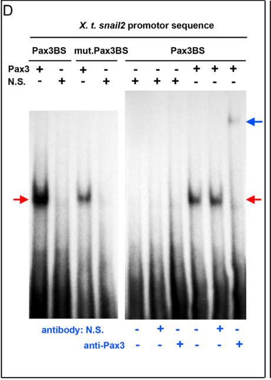

## Question

# Gene Research for Functional Annotation

## ⚠️ CRITICAL: Gene/Protein Identification Context

**BEFORE YOU BEGIN RESEARCH:** You MUST verify you are researching the CORRECT gene/protein. Gene symbols can be ambiguous, especially for less well-characterized genes from non-model organisms.

### Target Gene/Protein Identity (from UniProt):
- **UniProt Accession:** Q645N4
- **Protein Description:** RecName: Full=Paired box protein Pax-3-A; Short=xPax3-A; AltName: Full=Paired-domain transcription factor Pax3-A;
- **Gene Information:** Name=pax3-a; Synonyms=pax3 {ECO:0000312|EMBL:AAI08574.1}, pax3A {ECO:0000303|PubMed:15843410};
- **Organism (full):** Xenopus laevis (African clawed frog).
- **Protein Family:** Belongs to the paired homeobox family. .
- **Key Domains:** HD. (IPR001356); Homeobox_CS. (IPR017970); Homeodomain-like_sf. (IPR009057); PAIRED_DNA-bd_site. (IPR043182); Paired_dom. (IPR001523)

### MANDATORY VERIFICATION STEPS:

1. **Check if the gene symbol "pax3-a" matches the protein description above**
2. **Verify the organism is correct:** Xenopus laevis (African clawed frog).
3. **Check if protein family/domains align with what you find in literature**
4. **If you find literature for a DIFFERENT gene with the same or similar symbol, STOP**

### If Gene Symbol is Ambiguous or You Cannot Find Relevant Literature:

**DO NOT PROCEED WITH RESEARCH ON A DIFFERENT GENE.** Instead:
- State clearly: "The gene symbol 'pax3-a' is ambiguous or literature is limited for this specific protein"
- Explain what you found (e.g., "Found extensive literature on a different gene with the same symbol in a different organism")
- Describe the protein based ONLY on the UniProt information provided above
- Suggest that the protein function can be inferred from domain/family information

### Research Target:

Please provide a comprehensive research report on the gene **pax3-a** (gene ID: pax3-a, UniProt: Q645N4) in XENLA.

The research report should be a detailed narrative explaining the function, biological processes, and localization of the gene product. Citations should be given for all claims.

You should prioritize authoritative reviews and primary scientific literature when conducting research. You can supplement
this with annotations you find in gene/protein databases, but these can be outdated or inaccurate.

We are specifically interested in the primary function of the gene - for enzymes, what reaction is catalyzed, and what is the substrate specificity? For transporters, what is the substrate? For structural proteins or adapters, what is the broader structural role? For signaling molecules, what is the role in the pathway.

We are interested in where in or outside the cell the gene product carries out its function.

We are also interested in the signaling or biochemical pathways in which the gene functions. We are less interested in broad pleiotropic effects, except where these elucidate the precise role.

Include evidence where possible. We are interested in both experimental evidence as well as inference from structure, evolution, or bioinformatic analysis. Precise studies should be prioritized over high-throughput, where available.

## Output

Question: You are an expert researcher providing comprehensive, well-cited information.

Provide detailed information focusing on:
1. Key concepts and definitions with current understanding
2. Recent developments and latest research (prioritize 2023-2024 sources)
3. Current applications and real-world implementations
4. Expert opinions and analysis from authoritative sources
5. Relevant statistics and data from recent studies

Format as a comprehensive research report with proper citations. Include URLs and publication dates where available.
Always prioritize recent, authoritative sources and provide specific citations for all major claims.

# Gene Research for Functional Annotation

## ⚠️ CRITICAL: Gene/Protein Identification Context

**BEFORE YOU BEGIN RESEARCH:** You MUST verify you are researching the CORRECT gene/protein. Gene symbols can be ambiguous, especially for less well-characterized genes from non-model organisms.

### Target Gene/Protein Identity (from UniProt):
- **UniProt Accession:** Q645N4
- **Protein Description:** RecName: Full=Paired box protein Pax-3-A; Short=xPax3-A; AltName: Full=Paired-domain transcription factor Pax3-A;
- **Gene Information:** Name=pax3-a; Synonyms=pax3 {ECO:0000312|EMBL:AAI08574.1}, pax3A {ECO:0000303|PubMed:15843410};
- **Organism (full):** Xenopus laevis (African clawed frog).
- **Protein Family:** Belongs to the paired homeobox family. .
- **Key Domains:** HD. (IPR001356); Homeobox_CS. (IPR017970); Homeodomain-like_sf. (IPR009057); PAIRED_DNA-bd_site. (IPR043182); Paired_dom. (IPR001523)

### MANDATORY VERIFICATION STEPS:

1. **Check if the gene symbol "pax3-a" matches the protein description above**
2. **Verify the organism is correct:** Xenopus laevis (African clawed frog).
3. **Check if protein family/domains align with what you find in literature**
4. **If you find literature for a DIFFERENT gene with the same or similar symbol, STOP**

### If Gene Symbol is Ambiguous or You Cannot Find Relevant Literature:

**DO NOT PROCEED WITH RESEARCH ON A DIFFERENT GENE.** Instead:
- State clearly: "The gene symbol 'pax3-a' is ambiguous or literature is limited for this specific protein"
- Explain what you found (e.g., "Found extensive literature on a different gene with the same symbol in a different organism")
- Describe the protein based ONLY on the UniProt information provided above
- Suggest that the protein function can be inferred from domain/family information

### Research Target:

Please provide a comprehensive research report on the gene **pax3-a** (gene ID: pax3-a, UniProt: Q645N4) in XENLA.

The research report should be a detailed narrative explaining the function, biological processes, and localization of the gene product. Citations should be given for all claims.

You should prioritize authoritative reviews and primary scientific literature when conducting research. You can supplement
this with annotations you find in gene/protein databases, but these can be outdated or inaccurate.

We are specifically interested in the primary function of the gene - for enzymes, what reaction is catalyzed, and what is the substrate specificity? For transporters, what is the substrate? For structural proteins or adapters, what is the broader structural role? For signaling molecules, what is the role in the pathway.

We are interested in where in or outside the cell the gene product carries out its function.

We are also interested in the signaling or biochemical pathways in which the gene functions. We are less interested in broad pleiotropic effects, except where these elucidate the precise role.

Include evidence where possible. We are interested in both experimental evidence as well as inference from structure, evolution, or bioinformatic analysis. Precise studies should be prioritized over high-throughput, where available.

# Functional annotation report: *Xenopus laevis* pax3-a (UniProt Q645N4)

## Identity and confidence boundary

**The gene symbol `pax3-a` is ambiguous in the experimental literature, although the protein specified here is identifiable.** The supplied [UniProt record Q645N4](https://www.uniprot.org/uniprotkb/Q645N4/entry) identifies *Xenopus laevis* (African clawed frog) **paired box protein Pax-3-A**, also called xPax3-A; its paired DNA-binding domain and homeodomain are consistent with the paired-homeobox transcription-factor family. This report concerns that protein, **not** teleost Pax3a, Pax7, or *X. tropicalis* Pax3. However, the principal frog studies generally call their reagents “Pax3” without establishing that they exclusively detect or perturb the Q645N4-encoded *X. laevis* copy rather than another Pax3 copy. Their results therefore support annotation of the **Xenopus Pax3 activity represented by Pax3-A**, but not experimentally proven, copy-exclusive functions of Q645N4. (monsoroburq2005msx1andpax3 pages 4-5, hong2007theactivityof pages 1-2, plouhinec2014pax3andzic1 pages 2-3)

## Primary molecular function and site of action

Pax3-A is best annotated as a **sequence-specific developmental transcription regulator**. Its paired domain and homeodomain indicate DNA recognition rather than catalysis, transport, or a structural role. The expected functional compartment is the **nucleus**, where Pax3 regulates transcription at genomic regulatory elements; it is not an extracellular signaling molecule. Experimental support for the mechanism includes Pax3-dependent transcription and sequence-specific binding of a Pax3-containing extract to regulatory DNA, although the retrieved studies do not independently establish nuclear localization specifically for Q645N4 by imaging. Pax3 activity is detected in embryonic neural-plate-border and neural-crest progenitors and in the developing hatching gland; these are **tissue locations**, not subcellular localization measurements. (hong2007theactivityof pages 3-4, plouhinec2014pax3andzic1 pages 8-9, hong2007theactivityof pages 4-6, plouhinec2014pax3andzic1 media ad2417e7)

A particularly well-resolved transcriptional connection is **`snail2`**, a neural-crest specification gene. Activating Pax3 in ectoderm induces `snail2` despite inhibition of new protein synthesis, and Pax3 depletion diminishes its induction in embryos. In an electrophoretic mobility-shift assay, Pax3 bound a candidate `snail2` promoter element; mutation weakened binding, and an anti-Pax3 antibody supershifted the complex. The cropped **Figure 4D** documents this binding experiment. These observations support a direct Pax3–`snail2` regulatory connection, while stopping short of demonstrating that the assayed endogenous Q645N4 protein occupies that exact site in *X. laevis* chromatin: the candidate promoter sequence was selected using the *X. tropicalis* genome. (plouhinec2014pax3andzic1 pages 8-9, plouhinec2014pax3andzic1 pages 4-8, plouhinec2014pax3andzic1 media ad2417e7)

Pax3 also **positively regulates endogenous `pax3` transcription** in an inducible-ectoderm assay. Pax3 expression raised endogenous `pax3` transcripts fivefold without a translation inhibitor and 31-fold with cycloheximide; Pax3 bound a conserved upstream element in vitro, with mutation and antibody-supershift controls. Positive feedback could help maintain the neural-border transcriptional state, but the authors caution that cycloheximide itself can amplify expression responses. Neither the endogenous transcript assay nor the regulatory-site experiment establishes which *X. laevis* Pax3 copy is autoregulated. Other Pax3-responsive genes, including `twist1`, `foxd3`, `tfap2b`, and `cyp26c1`, contribute to the proposed network, but **protein-synthesis-independent induction alone identifies an immediate-early candidate, not proven physical DNA binding at every locus**. In the same study, `snail1` had stronger evidence for direct activation by **Zic1**, and `axin2` responded to Zic1 alone rather than Pax3 alone in the immediate-early assay. (plouhinec2014pax3andzic1 pages 3-4, plouhinec2014pax3andzic1 pages 8-9, plouhinec2014pax3andzic1 pages 4-8)

The evidence and its gene-identity limitations are summarized below.

| Mechanism | Experimental observation | Evidence strength / identity caveat | Publication date and DOI URL |
|---|---|---|---|
| **Molecular identity and compartment** | The supplied UniProt record identifies **Q645N4** as *Xenopus laevis* Pax3-A (`pax3-a`), a paired-homeobox-family transcription factor containing a paired DNA-binding domain and homeodomain. Its promoter-binding activity implies action in the nucleus. | Accession, organism, and domain identity come from the user-supplied UniProt record. Nuclear localization is a strong functional inference, but the retrieved studies did not demonstrate Q645N4-specific protein localization. Most Xenopus experiments report generic Pax3 and do not show that their reagents selectively assay `pax3-a` rather than another *X. laevis* copy. | [UniProt Q645N4](https://www.uniprot.org/uniprotkb/Q645N4/entry) |
| **Direct activation of `snail2`** | In Pax3-activated ectoderm, `snail2` was induced despite cycloheximide treatment and was reduced after Pax3 knockdown. EMSA showed Pax3 binding to a predicted `snail2` promoter motif: mutation weakened the shift, and anti-Pax3 antibody produced a supershift. (plouhinec2014pax3andzic1 pages 8-9, plouhinec2014pax3andzic1 pages 4-8, plouhinec2014pax3andzic1 media ad2417e7) | **Strong direct-binding evidence** for a Pax3–`snail2` connection. Cycloheximide resistance alone indicates an immediate-early candidate, not physical binding; the mutation and supershift assays independently support sequence-specific binding. Regulatory-site discovery used the *X. tropicalis* genome, whereas functional ectoderm and knockdown assays used *X. laevis*. The Pax3 reagent was not shown to be Q645N4-specific. | Plouhinec et al., **February 2014**: [https://doi.org/10.1016/j.ydbio.2013.12.010](https://doi.org/10.1016/j.ydbio.2013.12.010) |
| **Positive `pax3` autoregulation** | Exogenous Pax3 induced endogenous `pax3` transcripts approximately **5-fold** without cycloheximide and **31-fold** with it; Pax3 plus Zic1 produced **77-fold** and **16-fold** induction, respectively. Pax3 bound a conserved upstream `pax3` element in EMSA; mutation reduced binding and anti-Pax3 caused a supershift. (plouhinec2014pax3andzic1 pages 8-9) | Supports a direct positive-feedback loop that may stabilize neural-border identity. Cycloheximide can cause superinduction, so those fold changes require caution; EMSA strengthens the direct-regulation interpretation. The promoter analysis does not resolve *X. laevis* `pax3-a` versus `pax3-b`. | Plouhinec et al., **February 2014**: [https://doi.org/10.1016/j.ydbio.2013.12.010](https://doi.org/10.1016/j.ydbio.2013.12.010) |
| **Pax3–Zic1 combinatorial neural-crest specification** | Pax3 alone expanded `foxd3` in **65%** of embryos (n=48) and `snail2` in **63%** (n=51); Pax3 plus Zic1 induced ectopic ventral `foxd3` in **71%** (n=42) and `snail2` in **60%** (n=55). Wnt3a expanded Pax3 and `foxd3`, whereas dominant-negative Tcf3 suppressed them. Pax3/Zic1-induced ectoderm underwent EMT; **77%** of grafts migrated along normal crest routes (n=70), versus 0% of controls, and **44%** formed melanocyte-like cells. (sato2005neuralcrestdetermination pages 3-4, sato2005neuralcrestdetermination pages 1-2, milet2013pax3andzic1 pages 3-4, milet2013pax3andzic1 pages 4-5) | **Strong functional evidence** that Pax3 cooperates with Zic1 downstream of Wnt to initiate a multipotent neural-crest program. It does not prove that every induced gene is a direct Pax3 target. The studies did not establish Q645N4-selective perturbation. | Sato et al., **May 2005**: [https://doi.org/10.1242/dev.01823](https://doi.org/10.1242/dev.01823); Milet et al., **March 2013**: [https://doi.org/10.1073/pnas.1219124110](https://doi.org/10.1073/pnas.1219124110) |
| **Hatching-gland specification** | Pax3 is expressed with the hatching-enzyme gene `Xhe` in superficial ectoderm and later hatching gland. Activated Pax3GR caused premature hatching and induced `Xhe` and `Crisp` within four hours. `Xhe` induction persisted during cycloheximide treatment, whereas `Crisp` induction was strongly reduced; Pax3 morpholino reduced endogenous and Noggin/Wnt-induced `Xhe`. (hong2007theactivityof pages 4-6, hong2007theactivityof pages 6-7) | Supports Pax3 as necessary and sufficient for hatching-gland fate. `Xhe` is an immediate-early candidate, but direct promoter occupancy was not shown; `Crisp` is more consistent with indirect regulation. Localization evidence is primarily RNA-level, and the reagents were not proven `pax3-a`-specific. | Hong and Saint-Jeannet, **June 2007**: [https://doi.org/10.1091/mbc.e06-11-1047](https://doi.org/10.1091/mbc.e06-11-1047) |
| **Genome-scale Pax3 regulatory network** | In *X. laevis* neural-border/crest explants, Pax3 morpholino RNA-seq found **1,179 decreased**, **357 increased**, and **11,462 unchanged** transcripts. Pax3-FLAG ChIP-seq from **100 stage-14 embryos** identified **657** potential targets; 475 occurred in the single-cell crest dataset, and **17 candidates** overlapped ChIP-seq, knockdown, and GRN prediction. `cfb` and `bmp5` were both Pax3-bound and morphant-responsive. (kotov2024atimeresolvedsinglecell pages 5-6, kotov2024atimeresolvedsinglecell pages 4-5) | Major recent evidence expanding the Pax3 network. ChIP peaks indicate occupancy, while knockdown adds regulatory association; neither alone proves direct activation. The single-cell atlas was based on ***X. tropicalis***, whereas Pax3 morpholino and ChIP validation mapped to the ***X. laevis*** v9.2 genome. Copy-selective action on Q645N4 was not demonstrated. | Kotov et al., **29 April 2024**: [https://doi.org/10.1073/pnas.2311685121](https://doi.org/10.1073/pnas.2311685121) |
| **Mechanical inputs upstream of Pax3-associated crest induction** | Increased ectodermal tension through Plekhg5 expanded Pax3, `foxd3`, and `snail2` domains and significantly increased PAX3-positive cells; force relaxation suppressed crest markers, while force activated FGF/ERK and Wnt-associated signaling. Separately, elevated blastocoel pressure promoted cytoplasmic YAP retention and impaired β-catenin nuclear entry; nuclear β-catenin rescued crest induction in YAP-depleted embryos. (kaneshima2024enhancementofneural pages 4-5, alasaadi2024competenceforneural pages 11-12, alasaadi2024competenceforneural pages 10-11, alasaadi2024competenceforneural pages 4-5) | Important **2024 upstream context**, not proof that force or pressure directly regulates `pax3-a`. Kaneshima measured PAX3-positive cells but did not establish Pax3 as the causal mediator. Alasaadi established pressure–YAP–β-catenin/Wnt control of competence but did not directly test a Pax3 regulatory step; earlier YAP–TEAD occupancy at the `pax3` promoter provides complementary evidence. (gee2011yesassociatedprotein65 pages 9-9) | Kaneshima et al., **January 2024**: [https://doi.org/10.1387/ijdb.230273tm](https://doi.org/10.1387/ijdb.230273tm); Alasaadi et al., **March 2024**: [https://doi.org/10.1038/s41556-024-01378-y](https://doi.org/10.1038/s41556-024-01378-y) |

*Table: Evidence matrix for *Xenopus laevis* UniProt Q645N4, separating direct molecular findings from immediate-early, functional, and upstream contextual evidence. It highlights the central limitation that most published Pax3 perturbations were not demonstrated to be `pax3-a`-specific.*

## Developmental pathway and biological processes

**Neural-crest specification is the principal experimentally established Pax3 function in Xenopus.** Pax3 operates at the neural plate border with the zinc-finger transcription factor Zic1, converting inductive information into expression of neural-crest specifiers, particularly `snail2` and `foxd3`. In embryos, Pax3 alone expanded `foxd3` expression in **65%** of cases (*n*=48) and `snail2` in **63%** (*n*=51). In ventral ectoderm, where either factor alone was insufficient for substantial ectopic induction, combined Pax3 and Zic1 induced `foxd3` in **71%** (*n*=42) and `snail2` in **60%** (*n*=55). These percentages describe responses to experimental gene activation, **not** the abundance of Pax3-A-positive cells or a Q645N4-specific effect. (sato2005neuralcrestdetermination pages 3-4, sato2005neuralcrestdetermination pages 1-2)

The relevant upstream pathways are **Wnt, FGF, and BMP patterning**. Wnt3a expands Pax3 and neural-crest-marker expression, whereas dominant-negative Tcf3 suppresses them; increased BMP activity suppresses the Pax3/Zic1 border domains, whereas BMP inhibition expands them. Functional experiments place Pax3 downstream of, or converging with, Msx1 during FGF8- and Wnt-dependent crest induction: Wnt-dependent `snail2` induction requires Pax3 activity, while FGF8 acts through both Msx1 and Pax3. An independent experiment found that Fgf8a depletion reduced the Pax3 expression domain in **91%** of embryos (*n*=56). These are pathway and epistasis relationships; they do **not** show that FGF, BMP, or Wnt directly binds or biochemically modifies Pax3-A. (monsoroburq2005msx1andpax3 pages 1-2, sato2005neuralcrestdetermination pages 3-4, hong2007theactivityof pages 4-6)

Pax3/Zic1 coactivation can initiate a broader **functional neural-crest program**, not merely marker expression. Induced ectoderm underwent epithelial-to-mesenchymal transition, migrated on fibronectin, and followed normal neural-crest pathways after transplantation: **77%** of induced grafts migrated (*n*=70), compared with **0%** of control grafts (*n*=24). In culture, **44%** of Pax3/Zic1-induced explants developed melanocyte-like cells; the induced population also displayed neuronal and cartilage-associated differentiation potential in the study’s additional assays. This establishes the developmental consequence of the *combination*, not that Pax3-A alone directly transcribes every terminal differentiation gene. (milet2013pax3andzic1 pages 3-4, milet2013pax3andzic1 pages 4-5)

Pax3 also has a distinguishable role in **hatching-gland specification**. Its expression overlaps the hatching-enzyme marker `Xhe` in superficial ectoderm and later gland tissue. Inducible Pax3 caused premature hatching and activated `Xhe` and `Crisp` in animal explants; Pax3 depletion reduced `Xhe`. `Xhe` induction persisted during cycloheximide treatment, consistent with an immediate-early Pax3 response, whereas `Crisp` induction did not. Direct Pax3 binding to the `Xhe` locus was not established in that study. The relative activity of Pax3 and Zic1 helps partition **neural crest, hatching gland, and preplacodal ectoderm** at the border; the hatching-gland result should not be conflated with direct specification of placodes by Pax3. (hong2007theactivityof pages 1-2, hong2007theactivityof pages 4-6, hong2007theactivityof pages 6-7)

## Recent developments, 2024

A study published **29 April 2024** integrated single-cell developmental trajectories with experimental Pax3-network testing. An important species distinction is that its deeply resequenced **single-cell atlas derives from *X. tropicalis***, whereas its Pax3 morpholino RNA-seq and stage-14 Pax3-FLAG ChIP-seq validation mapped to the ***X. laevis* genome**. The latter identified **1,179 decreased**, **357 increased**, and **11,462 unchanged** transcripts after Pax3 depletion; ChIP-seq identified **657 potential Pax3-associated targets** using **100 embryos**, and **17 candidate genes** were supported by the intersection of occupancy, depletion response, and computational network prediction. `cfb` and `bmp5` were examples both bound in the assay and altered by depletion. These results expand the candidate regulatory network, but occupancy and expression change together do not establish whether a particular gene is activated directly by **Q645N4 rather than another Pax3 copy**, or whether every bound site is functional. [Kotov *et al.*, *PNAS*, 2024](https://doi.org/10.1073/pnas.2311685121). (kotov2024atimeresolvedsinglecell pages 5-6, kotov2024atimeresolvedsinglecell pages 1-2, kotov2024atimeresolvedsinglecell pages 4-5)

Two other **2024** studies refined the *upstream physical context* of crest induction. Applied ectodermal tension expanded the Pax3 and neural-crest-marker domains and increased the number of **PAX3-positive cells**, alongside FGF/Wnt-associated responses; this connects mechanics to the Pax3-positive border state without demonstrating Pax3 as the necessary mediator. Independently, blastocoel hydrostatic pressure altered neural-crest competence through YAP-dependent Wnt/β-catenin responsiveness; β-catenin-directed rescue supported that pathway mechanism, but the pressure experiments did not establish a direct regulatory step at `pax3-a`. Earlier promoter-occupancy experiments provide a more specific bridge: YAP and TEAD1 cooperated to expand Pax3-positive border progenitors, and endogenous YAP associated with a conserved TEAD-site-containing `pax3` promoter region. [Kaneshima *et al.*, *International Journal of Developmental Biology*, January 2024](https://doi.org/10.1387/ijdb.230273tm); [Alasaadi *et al.*, *Nature Cell Biology*, March 2024](https://doi.org/10.1038/s41556-024-01378-y); [Gee *et al.*, *PLOS ONE*, June 2011](https://doi.org/10.1371/journal.pone.0020309). (gee2011yesassociatedprotein65 pages 9-9, kaneshima2024enhancementofneural pages 4-5, alasaadi2024competenceforneural pages 10-11)

## Annotation conclusion and limitations

**Recommended primary function:** nuclear, DNA-binding **paired-box/homeodomain transcription factor** involved in specifying the embryonic neural-plate-border/neural-crest program; the best-supported direct molecular link is Pax3 binding to a `snail2` regulatory sequence. **Additional context-dependent role:** promotion of hatching-gland identity and hatching-enzyme-gene expression. **Principal pathway placement:** downstream of Wnt/FGF/BMP-dependent border patterning and YAP–TEAD-associated control of `pax3` expression, cooperating with Zic1 to activate crest specifiers. The protein has **no enzymatic reaction or transport substrate** to annotate. The essential outstanding qualification is copy specificity: the available original studies substantiate these activities for experimental Xenopus **Pax3**, but do not conclusively assign every finding to the particular *X. laevis* Pax3-A protein **Q645N4**. (monsoroburq2005msx1andpax3 pages 1-2, plouhinec2014pax3andzic1 pages 2-3, plouhinec2014pax3andzic1 pages 8-9, hong2007theactivityof pages 6-7, plouhinec2014pax3andzic1 media ad2417e7)

References

1. (monsoroburq2005msx1andpax3 pages 4-5): Anne-Hélène Monsoro-Burq, Estee Wang, and Richard Harland. Msx1 and pax3 cooperate to mediate fgf8 and wnt signals during xenopus neural crest induction. Developmental cell, 8 2:167-78, Feb 2005. URL: https://doi.org/10.1016/j.devcel.2004.12.017, doi:10.1016/j.devcel.2004.12.017. This article has 405 citations and is from a highest quality peer-reviewed journal.

2. (hong2007theactivityof pages 1-2): Chang-Soo Hong and Jean-Pierre Saint-Jeannet. The activity of pax3 and zic1 regulates three distinct cell fates at the neural plate border. Molecular Biology of the Cell, 18:2192-2202, Jun 2007. URL: https://doi.org/10.1091/mbc.e06-11-1047, doi:10.1091/mbc.e06-11-1047. This article has 212 citations and is from a domain leading peer-reviewed journal.

3. (plouhinec2014pax3andzic1 pages 2-3): Jean-Louis Plouhinec, Daniel D. Roche, Caterina Pegoraro, Ana Leonor Figueiredo, Frédérique Maczkowiak, Lisa J. Brunet, Cécile Milet, Jean-Philippe Vert, Nicolas Pollet, Richard M. Harland, and Anne H. Monsoro-Burq. Pax3 and zic1 trigger the early neural crest gene regulatory network by the direct activation of multiple key neural crest specifiers. Developmental biology, 386 2:461-72, Feb 2014. URL: https://doi.org/10.1016/j.ydbio.2013.12.010, doi:10.1016/j.ydbio.2013.12.010. This article has 150 citations and is from a peer-reviewed journal.

4. (hong2007theactivityof pages 3-4): Chang-Soo Hong and Jean-Pierre Saint-Jeannet. The activity of pax3 and zic1 regulates three distinct cell fates at the neural plate border. Molecular Biology of the Cell, 18:2192-2202, Jun 2007. URL: https://doi.org/10.1091/mbc.e06-11-1047, doi:10.1091/mbc.e06-11-1047. This article has 212 citations and is from a domain leading peer-reviewed journal.

5. (plouhinec2014pax3andzic1 pages 8-9): Jean-Louis Plouhinec, Daniel D. Roche, Caterina Pegoraro, Ana Leonor Figueiredo, Frédérique Maczkowiak, Lisa J. Brunet, Cécile Milet, Jean-Philippe Vert, Nicolas Pollet, Richard M. Harland, and Anne H. Monsoro-Burq. Pax3 and zic1 trigger the early neural crest gene regulatory network by the direct activation of multiple key neural crest specifiers. Developmental biology, 386 2:461-72, Feb 2014. URL: https://doi.org/10.1016/j.ydbio.2013.12.010, doi:10.1016/j.ydbio.2013.12.010. This article has 150 citations and is from a peer-reviewed journal.

6. (hong2007theactivityof pages 4-6): Chang-Soo Hong and Jean-Pierre Saint-Jeannet. The activity of pax3 and zic1 regulates three distinct cell fates at the neural plate border. Molecular Biology of the Cell, 18:2192-2202, Jun 2007. URL: https://doi.org/10.1091/mbc.e06-11-1047, doi:10.1091/mbc.e06-11-1047. This article has 212 citations and is from a domain leading peer-reviewed journal.

7. (plouhinec2014pax3andzic1 media ad2417e7): Jean-Louis Plouhinec, Daniel D. Roche, Caterina Pegoraro, Ana Leonor Figueiredo, Frédérique Maczkowiak, Lisa J. Brunet, Cécile Milet, Jean-Philippe Vert, Nicolas Pollet, Richard M. Harland, and Anne H. Monsoro-Burq. Pax3 and zic1 trigger the early neural crest gene regulatory network by the direct activation of multiple key neural crest specifiers. Developmental biology, 386 2:461-72, Feb 2014. URL: https://doi.org/10.1016/j.ydbio.2013.12.010, doi:10.1016/j.ydbio.2013.12.010. This article has 150 citations and is from a peer-reviewed journal.

8. (plouhinec2014pax3andzic1 pages 4-8): Jean-Louis Plouhinec, Daniel D. Roche, Caterina Pegoraro, Ana Leonor Figueiredo, Frédérique Maczkowiak, Lisa J. Brunet, Cécile Milet, Jean-Philippe Vert, Nicolas Pollet, Richard M. Harland, and Anne H. Monsoro-Burq. Pax3 and zic1 trigger the early neural crest gene regulatory network by the direct activation of multiple key neural crest specifiers. Developmental biology, 386 2:461-72, Feb 2014. URL: https://doi.org/10.1016/j.ydbio.2013.12.010, doi:10.1016/j.ydbio.2013.12.010. This article has 150 citations and is from a peer-reviewed journal.

9. (plouhinec2014pax3andzic1 pages 3-4): Jean-Louis Plouhinec, Daniel D. Roche, Caterina Pegoraro, Ana Leonor Figueiredo, Frédérique Maczkowiak, Lisa J. Brunet, Cécile Milet, Jean-Philippe Vert, Nicolas Pollet, Richard M. Harland, and Anne H. Monsoro-Burq. Pax3 and zic1 trigger the early neural crest gene regulatory network by the direct activation of multiple key neural crest specifiers. Developmental biology, 386 2:461-72, Feb 2014. URL: https://doi.org/10.1016/j.ydbio.2013.12.010, doi:10.1016/j.ydbio.2013.12.010. This article has 150 citations and is from a peer-reviewed journal.

10. (sato2005neuralcrestdetermination pages 3-4): Takahiko Sato, Noriaki Sasai, and Yoshiki Sasai. Neural crest determination by co-activation of pax3 and zic1 genes in xenopus ectoderm. Development, 132:2355-2363, May 2005. URL: https://doi.org/10.1242/dev.01823, doi:10.1242/dev.01823. This article has 257 citations and is from a domain leading peer-reviewed journal.

11. (sato2005neuralcrestdetermination pages 1-2): Takahiko Sato, Noriaki Sasai, and Yoshiki Sasai. Neural crest determination by co-activation of pax3 and zic1 genes in xenopus ectoderm. Development, 132:2355-2363, May 2005. URL: https://doi.org/10.1242/dev.01823, doi:10.1242/dev.01823. This article has 257 citations and is from a domain leading peer-reviewed journal.

12. (milet2013pax3andzic1 pages 3-4): Cécile Milet, Frédérique Maczkowiak, Daniel D. Roche, and Anne Hélène Monsoro-Burq. Pax3 and zic1 drive induction and differentiation of multipotent, migratory, and functional neural crest in xenopus embryos. Proceedings of the National Academy of Sciences, 110:5528-5533, Mar 2013. URL: https://doi.org/10.1073/pnas.1219124110, doi:10.1073/pnas.1219124110. This article has 137 citations and is from a highest quality peer-reviewed journal.

13. (milet2013pax3andzic1 pages 4-5): Cécile Milet, Frédérique Maczkowiak, Daniel D. Roche, and Anne Hélène Monsoro-Burq. Pax3 and zic1 drive induction and differentiation of multipotent, migratory, and functional neural crest in xenopus embryos. Proceedings of the National Academy of Sciences, 110:5528-5533, Mar 2013. URL: https://doi.org/10.1073/pnas.1219124110, doi:10.1073/pnas.1219124110. This article has 137 citations and is from a highest quality peer-reviewed journal.

14. (hong2007theactivityof pages 6-7): Chang-Soo Hong and Jean-Pierre Saint-Jeannet. The activity of pax3 and zic1 regulates three distinct cell fates at the neural plate border. Molecular Biology of the Cell, 18:2192-2202, Jun 2007. URL: https://doi.org/10.1091/mbc.e06-11-1047, doi:10.1091/mbc.e06-11-1047. This article has 212 citations and is from a domain leading peer-reviewed journal.

15. (kotov2024atimeresolvedsinglecell pages 5-6): Aleksandr Kotov, Subham Seal, Mansour Alkobtawi, Vincent Kappès, Sofia Medina Ruiz, Hugo Arbès, Richard M. Harland, Leonid Peshkin, and Anne H. Monsoro-Burq. A time-resolved single-cell roadmap of the logic driving anterior neural crest diversification from neural border to migration stages. Proceedings of the National Academy of Sciences, Apr 2024. URL: https://doi.org/10.1073/pnas.2311685121, doi:10.1073/pnas.2311685121. This article has 26 citations and is from a highest quality peer-reviewed journal.

16. (kotov2024atimeresolvedsinglecell pages 4-5): Aleksandr Kotov, Subham Seal, Mansour Alkobtawi, Vincent Kappès, Sofia Medina Ruiz, Hugo Arbès, Richard M. Harland, Leonid Peshkin, and Anne H. Monsoro-Burq. A time-resolved single-cell roadmap of the logic driving anterior neural crest diversification from neural border to migration stages. Proceedings of the National Academy of Sciences, Apr 2024. URL: https://doi.org/10.1073/pnas.2311685121, doi:10.1073/pnas.2311685121. This article has 26 citations and is from a highest quality peer-reviewed journal.

17. (kaneshima2024enhancementofneural pages 4-5): Toki Kaneshima, Masaki Ogawa, Takayoshi Yamamoto, Yosuke Tsuboyama, Yuki Miyata, Takahiro Kotani, Takaharu Okajima, and Tatsuo Michiue. Enhancement of neural crest formation by mechanical force in xenopus development. The International journal of developmental biology, 68 1:25-37, Jan 2024. URL: https://doi.org/10.1387/ijdb.230273tm, doi:10.1387/ijdb.230273tm. This article has 4 citations.

18. (alasaadi2024competenceforneural pages 11-12): Delan N Alasaadi, Lucas Alvizi, Jonas Hartmann, Namid R Stillman, Prachiti Moghe, Takashi Hiiragi, and Roberto Mayor. Competence for neural crest induction is controlled by hydrostatic pressure through yap. Nature Cell Biology, 26:530-541, Mar 2024. URL: https://doi.org/10.1038/s41556-024-01378-y, doi:10.1038/s41556-024-01378-y. This article has 38 citations and is from a highest quality peer-reviewed journal.

19. (alasaadi2024competenceforneural pages 10-11): Delan N Alasaadi, Lucas Alvizi, Jonas Hartmann, Namid R Stillman, Prachiti Moghe, Takashi Hiiragi, and Roberto Mayor. Competence for neural crest induction is controlled by hydrostatic pressure through yap. Nature Cell Biology, 26:530-541, Mar 2024. URL: https://doi.org/10.1038/s41556-024-01378-y, doi:10.1038/s41556-024-01378-y. This article has 38 citations and is from a highest quality peer-reviewed journal.

20. (alasaadi2024competenceforneural pages 4-5): Delan N Alasaadi, Lucas Alvizi, Jonas Hartmann, Namid R Stillman, Prachiti Moghe, Takashi Hiiragi, and Roberto Mayor. Competence for neural crest induction is controlled by hydrostatic pressure through yap. Nature Cell Biology, 26:530-541, Mar 2024. URL: https://doi.org/10.1038/s41556-024-01378-y, doi:10.1038/s41556-024-01378-y. This article has 38 citations and is from a highest quality peer-reviewed journal.

21. (gee2011yesassociatedprotein65 pages 9-9): Stephen T. Gee, Sharon L. Milgram, Kenneth L. Kramer, Frank L. Conlon, and Sally A. Moody. Yes-associated protein 65 (yap) expands neural progenitors and regulates pax3 expression in the neural plate border zone. PLoS ONE, 6:e20309, Jun 2011. URL: https://doi.org/10.1371/journal.pone.0020309, doi:10.1371/journal.pone.0020309. This article has 128 citations and is from a peer-reviewed journal.

22. (monsoroburq2005msx1andpax3 pages 1-2): Anne-Hélène Monsoro-Burq, Estee Wang, and Richard Harland. Msx1 and pax3 cooperate to mediate fgf8 and wnt signals during xenopus neural crest induction. Developmental cell, 8 2:167-78, Feb 2005. URL: https://doi.org/10.1016/j.devcel.2004.12.017, doi:10.1016/j.devcel.2004.12.017. This article has 405 citations and is from a highest quality peer-reviewed journal.

23. (kotov2024atimeresolvedsinglecell pages 1-2): Aleksandr Kotov, Subham Seal, Mansour Alkobtawi, Vincent Kappès, Sofia Medina Ruiz, Hugo Arbès, Richard M. Harland, Leonid Peshkin, and Anne H. Monsoro-Burq. A time-resolved single-cell roadmap of the logic driving anterior neural crest diversification from neural border to migration stages. Proceedings of the National Academy of Sciences, Apr 2024. URL: https://doi.org/10.1073/pnas.2311685121, doi:10.1073/pnas.2311685121. This article has 26 citations and is from a highest quality peer-reviewed journal.

## Artifacts

- [Edison artifact artifact-00](pax3-a-deep-research-falcon_artifacts/artifact-00.md)

## Citations

1. hong2007theactivityof pages 1-2
2. hong2007theactivityof pages 3-4
3. hong2007theactivityof pages 4-6
4. sato2005neuralcrestdetermination pages 3-4
5. sato2005neuralcrestdetermination pages 1-2
6. hong2007theactivityof pages 6-7
7. kotov2024atimeresolvedsinglecell pages 5-6
8. kotov2024atimeresolvedsinglecell pages 4-5
9. kaneshima2024enhancementofneural pages 4-5
10. alasaadi2024competenceforneural pages 11-12
11. alasaadi2024competenceforneural pages 10-11
12. alasaadi2024competenceforneural pages 4-5
13. kotov2024atimeresolvedsinglecell pages 1-2
14. UniProt record Q645N4
15. UniProt Q645N4
16. https://doi.org/10.1016/j.ydbio.2013.12.010
17. https://doi.org/10.1242/dev.01823
18. https://doi.org/10.1073/pnas.1219124110
19. https://doi.org/10.1091/mbc.e06-11-1047
20. https://doi.org/10.1073/pnas.2311685121
21. https://doi.org/10.1387/ijdb.230273tm
22. https://doi.org/10.1038/s41556-024-01378-y
23. Kotov *et al.*, *PNAS*, 2024
24. Kaneshima *et al.*, *International Journal of Developmental Biology*, January 2024
25. Alasaadi *et al.*, *Nature Cell Biology*, March 2024
26. Gee *et al.*, *PLOS ONE*, June 2011
27. https://www.uniprot.org/uniprotkb/Q645N4/entry
28. https://doi.org/10.1016/j.ydbio.2013.12.010](https://doi.org/10.1016/j.ydbio.2013.12.010
29. https://doi.org/10.1242/dev.01823](https://doi.org/10.1242/dev.01823
30. https://doi.org/10.1073/pnas.1219124110](https://doi.org/10.1073/pnas.1219124110
31. https://doi.org/10.1091/mbc.e06-11-1047](https://doi.org/10.1091/mbc.e06-11-1047
32. https://doi.org/10.1073/pnas.2311685121](https://doi.org/10.1073/pnas.2311685121
33. https://doi.org/10.1387/ijdb.230273tm](https://doi.org/10.1387/ijdb.230273tm
34. https://doi.org/10.1038/s41556-024-01378-y](https://doi.org/10.1038/s41556-024-01378-y
35. https://doi.org/10.1371/journal.pone.0020309
36. https://doi.org/10.1016/j.devcel.2004.12.017,
37. https://doi.org/10.1091/mbc.e06-11-1047,
38. https://doi.org/10.1016/j.ydbio.2013.12.010,
39. https://doi.org/10.1242/dev.01823,
40. https://doi.org/10.1073/pnas.1219124110,
41. https://doi.org/10.1073/pnas.2311685121,
42. https://doi.org/10.1387/ijdb.230273tm,
43. https://doi.org/10.1038/s41556-024-01378-y,
44. https://doi.org/10.1371/journal.pone.0020309,