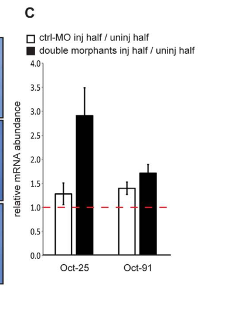

## Question

# Gene Research for Functional Annotation

## ⚠️ CRITICAL: Gene/Protein Identification Context

**BEFORE YOU BEGIN RESEARCH:** You MUST verify you are researching the CORRECT gene/protein. Gene symbols can be ambiguous, especially for less well-characterized genes from non-model organisms.

### Target Gene/Protein Identity (from UniProt):
- **UniProt Accession:** Q7T103
- **Protein Description:** RecName: Full=POU domain, class 5, transcription factor 1.1; AltName: Full=POU class V protein oct-25 {ECO:0000312|EMBL:ABH07383.1}; Short=XOct-25 {ECO:0000312|EMBL:AAH55964.1};
- **Gene Information:** Name=pou5f1.1; Synonyms=oct-25 {ECO:0000312|EMBL:CAG27841.1};
- **Organism (full):** Xenopus laevis (African clawed frog).
- **Protein Family:** Belongs to the POU transcription factor family. Class-5
- **Key Domains:** HD. (IPR001356); Homeobox_CS. (IPR017970); Homeodomain-like_sf. (IPR009057); Lambda_DNA-bd_dom_sf. (IPR010982); POU. (IPR013847)

### MANDATORY VERIFICATION STEPS:

1. **Check if the gene symbol "pou5f1.1" matches the protein description above**
2. **Verify the organism is correct:** Xenopus laevis (African clawed frog).
3. **Check if protein family/domains align with what you find in literature**
4. **If you find literature for a DIFFERENT gene with the same or similar symbol, STOP**

### If Gene Symbol is Ambiguous or You Cannot Find Relevant Literature:

**DO NOT PROCEED WITH RESEARCH ON A DIFFERENT GENE.** Instead:
- State clearly: "The gene symbol 'pou5f1.1' is ambiguous or literature is limited for this specific protein"
- Explain what you found (e.g., "Found extensive literature on a different gene with the same symbol in a different organism")
- Describe the protein based ONLY on the UniProt information provided above
- Suggest that the protein function can be inferred from domain/family information

### Research Target:

Please provide a comprehensive research report on the gene **pou5f1.1** (gene ID: pou5f1.1, UniProt: Q7T103) in XENLA.

The research report should be a detailed narrative explaining the function, biological processes, and localization of the gene product. Citations should be given for all claims.

You should prioritize authoritative reviews and primary scientific literature when conducting research. You can supplement
this with annotations you find in gene/protein databases, but these can be outdated or inaccurate.

We are specifically interested in the primary function of the gene - for enzymes, what reaction is catalyzed, and what is the substrate specificity? For transporters, what is the substrate? For structural proteins or adapters, what is the broader structural role? For signaling molecules, what is the role in the pathway.

We are interested in where in or outside the cell the gene product carries out its function.

We are also interested in the signaling or biochemical pathways in which the gene functions. We are less interested in broad pleiotropic effects, except where these elucidate the precise role.

Include evidence where possible. We are interested in both experimental evidence as well as inference from structure, evolution, or bioinformatic analysis. Precise studies should be prioritized over high-throughput, where available.

## Output

Question: You are an expert researcher providing comprehensive, well-cited information.

Provide detailed information focusing on:
1. Key concepts and definitions with current understanding
2. Recent developments and latest research (prioritize 2023-2024 sources)
3. Current applications and real-world implementations
4. Expert opinions and analysis from authoritative sources
5. Relevant statistics and data from recent studies

Format as a comprehensive research report with proper citations. Include URLs and publication dates where available.
Always prioritize recent, authoritative sources and provide specific citations for all major claims.

# Gene Research for Functional Annotation

## ⚠️ CRITICAL: Gene/Protein Identification Context

**BEFORE YOU BEGIN RESEARCH:** You MUST verify you are researching the CORRECT gene/protein. Gene symbols can be ambiguous, especially for less well-characterized genes from non-model organisms.

### Target Gene/Protein Identity (from UniProt):
- **UniProt Accession:** Q7T103
- **Protein Description:** RecName: Full=POU domain, class 5, transcription factor 1.1; AltName: Full=POU class V protein oct-25 {ECO:0000312|EMBL:ABH07383.1}; Short=XOct-25 {ECO:0000312|EMBL:AAH55964.1};
- **Gene Information:** Name=pou5f1.1; Synonyms=oct-25 {ECO:0000312|EMBL:CAG27841.1};
- **Organism (full):** Xenopus laevis (African clawed frog).
- **Protein Family:** Belongs to the POU transcription factor family. Class-5
- **Key Domains:** HD. (IPR001356); Homeobox_CS. (IPR017970); Homeodomain-like_sf. (IPR009057); Lambda_DNA-bd_dom_sf. (IPR010982); POU. (IPR013847)

### MANDATORY VERIFICATION STEPS:

1. **Check if the gene symbol "pou5f1.1" matches the protein description above**
2. **Verify the organism is correct:** Xenopus laevis (African clawed frog).
3. **Check if protein family/domains align with what you find in literature**
4. **If you find literature for a DIFFERENT gene with the same or similar symbol, STOP**

### If Gene Symbol is Ambiguous or You Cannot Find Relevant Literature:

**DO NOT PROCEED WITH RESEARCH ON A DIFFERENT GENE.** Instead:
- State clearly: "The gene symbol 'pou5f1.1' is ambiguous or literature is limited for this specific protein"
- Explain what you found (e.g., "Found extensive literature on a different gene with the same symbol in a different organism")
- Describe the protein based ONLY on the UniProt information provided above
- Suggest that the protein function can be inferred from domain/family information

### Research Target:

Please provide a comprehensive research report on the gene **pou5f1.1** (gene ID: pou5f1.1, UniProt: Q7T103) in XENLA.

The research report should be a detailed narrative explaining the function, biological processes, and localization of the gene product. Citations should be given for all claims.

You should prioritize authoritative reviews and primary scientific literature when conducting research. You can supplement
this with annotations you find in gene/protein databases, but these can be outdated or inaccurate.

We are specifically interested in the primary function of the gene - for enzymes, what reaction is catalyzed, and what is the substrate specificity? For transporters, what is the substrate? For structural proteins or adapters, what is the broader structural role? For signaling molecules, what is the role in the pathway.

We are interested in where in or outside the cell the gene product carries out its function.

We are also interested in the signaling or biochemical pathways in which the gene functions. We are less interested in broad pleiotropic effects, except where these elucidate the precise role.

Include evidence where possible. We are interested in both experimental evidence as well as inference from structure, evolution, or bioinformatic analysis. Precise studies should be prioritized over high-throughput, where available.

# Functional annotation report: *Xenopus laevis* pou5f1.1 / Oct-25

## Identity and nomenclature

The supplied UniProt accession [Q7T103](https://www.uniprot.org/uniprotkb/Q7T103/entry) identifies the research target as the African clawed frog (*Xenopus laevis*) POU class-V transcription factor **Oct-25**, annotated as **pou5f1.1**. **The gene symbol is ambiguous across nomenclature systems:** a 2022 review instead calls *X. laevis* Oct-25 **Pou5f3.2/XlPou25**, distinguishing it from **Pou5f3.1/Oct-91** and **Pou5f3.3/Oct-60**. The review does not cross-reference Q7T103, so the safest link between the supplied accession and experimental literature is the *Oct-25 protein name*, not an assumption that every occurrence of “pou5f1.1” identifies the same sequence. This report uses experiments explicitly concerning *Xenopus* Oct-25 and does not attribute Oct-91 or Oct-60 findings to it. (bakhmet2022thefunctionaldiversity pages 3-4, cao2013regulationofgerm pages 2-4)

Oct-25 belongs to the DNA-binding POU-V family. Its conserved POU-specific and POU-homeodomain regions fit the domains supplied for Q7T103; experimentally, Oct-25 recognizes an octamer-related DNA sequence, exemplified by **ATGCAAAT**. It is a transcriptional regulator, **not an enzyme or transporter**: its relevant molecular substrates are regulatory DNA and partner transcription factors, rather than a chemical substrate. Other POU-V paralogs share substantial POU-domain similarity, but their expression and developmental functions are not identical. (michel2011onthefunction pages 22-25, cao2008oct25repressestranscription pages 1-2, cao2008oct25repressestranscription pages 5-6)

## Primary molecular function and pathways

**Oct-25 controls how embryonic cells transcribe responses to germ-layer-inducing signals.** In particular, it restrains mesendoderm-inducing **Nodal/Activin–Smad2** signaling at target promoters. In the primary study by Cao and colleagues, Oct-25 physically associated with **FAST1/FoxH1, Smad2 and WBSCR11** in pull-down and co-immunoprecipitation experiments. Electrophoretic mobility-shift assays and embryo chromatin immunoprecipitation (ChIP) placed Oct-25-containing complexes at the **goosecoid (*Gsc*)** and ***Mix2*** promoters. Oct-25 suppressed their Xnr1/Nodal- or Activin-responsive transcription; knocking down endogenous Oct-25 reduced recovery of these promoter regions in ChIP. This locates the inhibitory action at the **nuclear transcriptional response**, rather than establishing that Oct-25 blocks secretion of Nodal ligands or activation of their receptors. [Cao et al., *Journal of Biological Chemistry*, 5 December 2008](https://doi.org/10.1074/jbc.M803532200). (cao2008oct25repressestranscription pages 4-5, cao2008oct25repressestranscription pages 7-8, cao2008oct25repressestranscription pages 1-2)

The mechanism is **not simply direct binding to an octamer at every repressed gene**. Oct-25 binds an octamer-like site in the *Gsc* promoter, yet *Gsc* reporters lacking that site remain repressible. At the *Mix2* activin-response element, the evidence supports recruitment through DNA-bound FAST1 rather than verified direct Oct-25 recognition of a local octamer. Engineered transcriptional-activation and transcriptional-repression versions of Oct-25 both inhibited the native *Gsc*/*Mix2* responses, although they had opposite effects on an artificial octamer reporter. Together, these tests support **protein–protein-mediated inhibitory promoter complexes** as a major mode of action; histone-deacetylase activity was not required in that assay. [Cao et al., 2008](https://doi.org/10.1074/jbc.M803532200). (cao2008oct25repressestranscription pages 1-1, cao2008oct25repressestranscription pages 5-6, cao2008oct25repressestranscription pages 4-5)

Oct-25 also antagonizes two earlier inputs to germ-layer specification: maternal **VegT** and **Wnt/β-catenin–TCF** signaling. Cao and colleagues demonstrated Oct-25 interactions with **VegT and Tcf3** and complexes on regulatory DNA associated with ***Xnr1* and *Siamois***. Oct-25 and Tcf3 can associate with β-catenin in a larger complex; this **does not establish direct Oct-25–β-catenin binding**. Overexpression inhibited VegT/β-catenin-responsive transcription and β-catenin-induced secondary-axis formation. Because some loss-of-function tests depleted more than one POU-V paralog, their complete embryonic phenotype cannot be assigned uniquely to Oct-25. [Cao et al., *The EMBO Journal*, June 2007](https://doi.org/10.1038/sj.emboj.7601736). (cao2007pou‐vfactorsantagonize pages 3-4, cao2007pou‐vfactorsantagonize pages 9-10, cao2007pou‐vfactorsantagonize pages 1-1)

An earlier study identified Oct-25 as a regulator of the BMP-responsive ***Xvent-2B*** gene, with reported promoter binding and interaction with Xvent2. This adds a connection to dorsoventral transcriptional regulation, although the detailed 2004 experiments could not be independently checked in full text here and carry less weight than the directly inspected 2007–2008 experiments. [Cao et al., *Journal of Biological Chemistry*, October 2004](https://doi.org/10.1074/jbc.M407544200). (cao2013regulationofgerm pages 2-4, cao2015germlayerformation pages 6-6)

The following matrix separates experimentally demonstrated mechanisms from their limitations.

| Mechanism or context | Direct observation | Evidence limitations | Primary study DOI and year |
|---|---|---|---|
| Identity and nomenclature | The requested UniProt record identifies **Q7T103** as *Xenopus laevis* **pou5f1.1/Oct-25**; contemporary literature instead maps **Oct-25/XlPou25 to Pou5f3.2**, distinct from Pou5f3.1/Oct-91 and Pou5f3.3/Oct-60. (bakhmet2022thefunctionaldiversity pages 4-5, bakhmet2022thefunctionaldiversity pages 3-4) | The literature source does not cross-reference Q7T103; therefore, Oct-25 is the safest identity anchor, while **pou5f1.1 versus pou5f3.2 remains a database-era nomenclature discrepancy**. | Review: [10.1098/rsob.220065](https://doi.org/10.1098/rsob.220065), 2022 |
| Xvent-2B/BMP-response regulation | Oct-25 was reported to bind the **Xvent-2B promoter** and interact with Xvent2, linking it to regulation of BMP-responsive transcription and resistance to terminal differentiation. (cao2013regulationofgerm pages 2-4) | Supported here through a later review because the 2004 primary full text was unavailable; quantitative and assay-level details were not independently checked. | Primary study: [10.1074/jbc.M407544200](https://doi.org/10.1074/jbc.M407544200), 2004 |
| VegT and β-catenin pathway antagonism | GST pull-down, co-immunoprecipitation and EMSA assays showed Oct-25 interactions with **VegT** and **Tcf3** and promoter-associated complexes at **Xnr1** and **Siamois** regulatory DNA. Oct-25 did not need to bind β-catenin directly: Tcf3 bridged a ternary Oct-25–Tcf3–β-catenin complex. Overexpression inhibited VegT/β-catenin-responsive transcription, whereas POU-V depletion enhanced Siamois activation. (cao2007pou‐vfactorsantagonize pages 3-4, cao2007pou‐vfactorsantagonize pages 9-10, cao2007pou‐vfactorsantagonize pages 1-1) | Some depletion experiments targeted Oct-25 together with Oct-60, and related interactions were shared by other POU-V paralogs; not every phenotype is uniquely attributable to Oct-25. | [10.1038/sj.emboj.7601736](https://doi.org/10.1038/sj.emboj.7601736), 2007 |
| Nodal/Activin nuclear-response repression | Oct-25 physically interacted with **FAST1/FoxH1, Smad2 and WBSCR11** in pull-down and co-immunoprecipitation assays. EMSA and ChIP demonstrated Oct-25-containing complexes at the **Gsc** and **Mix2** promoters; Oct25 morpholino treatment reduced recovery of these promoter fragments. Oct-25 inhibited Xnr1-, Activin-, Smad2-, FAST1- and WBSCR11-responsive reporter activity. (cao2008oct25repressestranscription pages 4-5) | Oct-25 directly recognized an octamer-like site in Gsc, but repression persisted after deletion of that site and Mix2 lacked verified direct Oct-25 DNA binding. Thus, repression relies substantially on protein–protein recruitment rather than only sequence-specific DNA recognition. | [10.1074/jbc.M803532200](https://doi.org/10.1074/jbc.M803532200), 2008 |
| Transcriptional mode at Gsc/Mix2 | Activating VP16–Oct25 and repressing EVE–Oct25 behaved oppositely on an artificial eight-octamer reporter, yet **both repressed Gsc/Mix2 promoters and mesendoderm formation**; histone-deacetylase activity was dispensable. This supports conversion of signal-transducer complexes into promoter-bound inhibitory assemblies. (cao2008oct25repressestranscription pages 1-1, cao2008oct25repressestranscription pages 5-6) | Fusion proteins are engineered reagents, and overexpression may not reproduce endogenous stoichiometry; the experiments define mechanism but not all physiological target genes. | [10.1074/jbc.M803532200](https://doi.org/10.1074/jbc.M803532200), 2008 |
| H4K20me3-dependent developmental silencing | Suv4-20h1/h2 depletion reduced H4K20me3 enrichment at the Oct-25 locus and caused approximately **threefold higher Oct-25 mRNA** at neurula stage, while Oct-91 was unaffected. Oct-25 was among the ten most upregulated transcripts in the morphant microarray. (nicetto2013suv420hhistonemethyltransferases pages 9-9, nicetto2013suv420hhistonemethyltransferases pages 7-9, nicetto2013suv420hhistonemethyltransferases pages 9-11) | The evidence measures locus-associated chromatin and Oct-25 RNA, not endogenous Oct-25 protein abundance or subcellular localization. Some ChIP work used *X. tropicalis*, although the developmental mechanism was evaluated across Xenopus experiments. | [10.1371/journal.pgen.1003188](https://doi.org/10.1371/journal.pgen.1003188), 2013 |
| Exit from pluripotency and neural differentiation | In Suv4-20h double morphants, **71%** of targeted embryos showed severe eye defects; simultaneous Oct-25 knockdown reduced this to **49%** (*p*=0.0188), restoring retinal pigment and lens organization. This epistasis supports a causal requirement to silence Oct-25 for neuroectodermal differentiation. (nicetto2013suv420hhistonemethyltransferases pages 9-11) | Rescue was partial, indicating additional Suv4-20h-regulated genes or processes. Global Oct-25 loss itself impairs anterior neural development, showing that function depends on developmental timing and dosage. | [10.1371/journal.pgen.1003188](https://doi.org/10.1371/journal.pgen.1003188), 2013 |
| Cellular localization | Promoter ChIP in embryos and physical association with nuclear FAST1/FoxH1, Smad2 and WBSCR11 establish that functional Oct-25 occupies **nuclear chromatin-associated transcription complexes**. (cao2008oct25repressestranscription pages 4-5, cao2008oct25repressestranscription pages 7-8) | No definitive endogenous-protein imaging study was identified; nuclear localization is strongly supported functionally but should not be presented as direct microscopy evidence. | [10.1074/jbc.M803532200](https://doi.org/10.1074/jbc.M803532200), 2008 |

*Table: Mechanistic evidence for Xenopus Oct-25, with nomenclature and paralog limitations made explicit. The matrix separates direct experiments from review-level or inferential support.*

## Biological process, expression and cellular location

Oct-25 helps maintain **developmental competence** while preventing inappropriate or premature mesodermal and endodermal transcription. Its activity is therefore **stage- and dosage-dependent**, not a universal block on differentiation. Reported Oct-25 transcripts occur in the animal and marginal regions of early embryos and subsequently in restricted neural-region patterns; these are **embryonic tissue-expression measurements, not protein-localization images**. [Cao, *Cell & Bioscience*, March 2013](https://doi.org/10.1186/2045-3701-3-15). (cao2013regulationofgerm pages 2-4, michel2011onthefunction pages 25-28)

There is particularly strong evidence that Oct-25 must later be **silenced for normal neuroectodermal differentiation**. In a Xenopus study, depletion of the histone methyltransferases Suv4-20h1/h2 reduced repressive **H4K20me3** at the Oct-25 locus; Oct-25 RNA was approximately **threefold higher** at early neurula stage (*p* = 0.0123), whereas Oct-91 RNA was unaffected. Oct-25 was among the ten most upregulated transcripts in that experiment. Reducing Oct-25 alongside Suv4-20h1/h2 partially rescued neural/eye development: the proportion of embryos with the reported eye defect fell from **71% to 49%** (*p* = 0.0188). These are evidence for an epigenetically regulated **exit from an Oct-25-associated undifferentiated state**, not proof that Oct-25 alone explains every Suv4-20h phenotype. Notably, global Oct-25 depletion itself impairs anterior neural development. Some locus-level ChIP analyses used *X. tropicalis* embryos; those measurements should not be mistaken for sequence-specific validation of the supplied *X. laevis* accession. [Nicetto et al., *PLoS Genetics*, January 2013](https://doi.org/10.1371/journal.pgen.1003188). (nicetto2013suv420hhistonemethyltransferases pages 7-9, nicetto2013suv420hhistonemethyltransferases pages 9-11, nicetto2013suv420hhistonemethyltransferases pages 9-9, nicetto2013suv420hhistonemethyltransferases media 4bcb426d, nicetto2013suv420hhistonemethyltransferases media b2eb92d4)

**Site of action: the cell nucleus, at chromatin-associated regulatory complexes.** This assignment is strongly supported by Oct-25 ChIP at embryonic promoters and its interaction with nuclear Smad2/FAST1-associated transcriptional machinery. The retrieved work does **not** establish a measured nuclear-to-cytoplasmic distribution of endogenous Q7T103 protein by imaging; the subcellular designation follows from demonstrated promoter occupancy and transcription-factor mechanism. Oct-25 should not be described as an extracellular signaling ligand. [Cao et al., 2008](https://doi.org/10.1074/jbc.M803532200). (cao2008oct25repressestranscription pages 4-5, cao2008oct25repressestranscription pages 7-8)

## Recent research, use and limits of interpretation

A [2022 synthesis of vertebrate POU-V proteins](https://doi.org/10.1098/rsob.220065) emphasizes preservation of an undifferentiated developmental state while documenting substantial functional differences among species and paralogs. That perspective supports interpreting Oct-25 as a **context-dependent regulator of competence and signal-responsive transcription**, rather than equating it wholesale with mammalian OCT4. Xenopus embryo microinjection, animal-cap assays, promoter reporters, ChIP and targeted knockdown are its principal **research applications**; the cited studies do not establish a clinical implementation for Oct-25 itself. (bakhmet2022thefunctionaldiversity pages 4-5, bakhmet2022thefunctionaldiversity pages 8-9, cao2008oct25repressestranscription pages 4-5, nicetto2013suv420hhistonemethyltransferases pages 1-2)

The [29 April 2024 single-cell neural-crest study by Kotov and colleagues](https://doi.org/10.1073/pnas.2311685121) provides recent context for POU-family expression during Xenopus development, but its foundational single-cell series comes from ***X. tropicalis***, and its displayed neural-border validation names **pou5f3.1**. It therefore **cannot be used as a gene-specific functional demonstration for *X. laevis* Q7T103/Oct-25** without an accession- or sequence-level match. Likewise, Oct-60 and Oct-91 expression in regenerating larval cornea must not be assigned to Oct-25: a separate *X. laevis* tissue survey detected **oct25 RNA in flank ectoderm, but not in the control or regenerating corneas** tested. [Perry et al., *Developmental Biology*, February 2013](https://doi.org/10.1016/j.ydbio.2012.12.005). (kotov2024atimeresolvedsinglecell pages 1-2, kotov2024atimeresolvedsinglecell pages 4-5, perry2013expressionofpluripotency pages 6-7)

**Conclusion.** For the supplied Q7T103 identity, the best-supported primary annotation is **Oct-25: a nuclear POU-V DNA-binding transcription factor that modulates VegT/Wnt and Nodal/Activin-responsive promoter complexes to time germ-layer specification, and whose subsequent chromatin-mediated repression permits normal neural differentiation**. The strongest direct molecular experiments date from **2007–2008**, with a quantitative epigenetic and rescue test in **2013**. Current naming conventions and studies of other Xenopus POU-V paralogs require explicit identity checks before transferring further functional claims to Q7T103. (cao2007pou‐vfactorsantagonize pages 3-4, cao2008oct25repressestranscription pages 4-5, nicetto2013suv420hhistonemethyltransferases pages 9-11, bakhmet2022thefunctionaldiversity pages 3-4)

References

1. (bakhmet2022thefunctionaldiversity pages 3-4): Evgeny I. Bakhmet and Alexey N. Tomilin. The functional diversity of the pouv-class proteins across vertebrates. Open Biology, Jun 2022. URL: https://doi.org/10.1098/rsob.220065, doi:10.1098/rsob.220065. This article has 8 citations and is from a peer-reviewed journal.

2. (cao2013regulationofgerm pages 2-4): Ying Cao. Regulation of germ layer formation by pluripotency factors during embryogenesis. Cell & Bioscience, 3:15, Mar 2013. URL: https://doi.org/10.1186/2045-3701-3-15, doi:10.1186/2045-3701-3-15. This article has 18 citations and is from a peer-reviewed journal.

3. (michel2011onthefunction pages 22-25): Laura Michel. On the function of xenopus oct4 protein homologs: molecular construction of dominant interference variants and functional analysis in early frog development. Dissertation, Jan 2011. URL: https://doi.org/10.5282/edoc.13613, doi:10.5282/edoc.13613. This article has 0 citations.

4. (cao2008oct25repressestranscription pages 1-2): Ying Cao, Doreen Siegel, Franz Oswald, and Walter Knóchel. Oct25 represses transcription of nodal/activin target genes by interaction with signal transducers during xenopus gastrulation*. Journal of Biological Chemistry, 283:34168-34177, Dec 2008. URL: https://doi.org/10.1074/jbc.m803532200, doi:10.1074/jbc.m803532200. This article has 46 citations and is from a domain leading peer-reviewed journal.

5. (cao2008oct25repressestranscription pages 5-6): Ying Cao, Doreen Siegel, Franz Oswald, and Walter Knóchel. Oct25 represses transcription of nodal/activin target genes by interaction with signal transducers during xenopus gastrulation*. Journal of Biological Chemistry, 283:34168-34177, Dec 2008. URL: https://doi.org/10.1074/jbc.m803532200, doi:10.1074/jbc.m803532200. This article has 46 citations and is from a domain leading peer-reviewed journal.

6. (cao2008oct25repressestranscription pages 4-5): Ying Cao, Doreen Siegel, Franz Oswald, and Walter Knóchel. Oct25 represses transcription of nodal/activin target genes by interaction with signal transducers during xenopus gastrulation*. Journal of Biological Chemistry, 283:34168-34177, Dec 2008. URL: https://doi.org/10.1074/jbc.m803532200, doi:10.1074/jbc.m803532200. This article has 46 citations and is from a domain leading peer-reviewed journal.

7. (cao2008oct25repressestranscription pages 7-8): Ying Cao, Doreen Siegel, Franz Oswald, and Walter Knóchel. Oct25 represses transcription of nodal/activin target genes by interaction with signal transducers during xenopus gastrulation*. Journal of Biological Chemistry, 283:34168-34177, Dec 2008. URL: https://doi.org/10.1074/jbc.m803532200, doi:10.1074/jbc.m803532200. This article has 46 citations and is from a domain leading peer-reviewed journal.

8. (cao2008oct25repressestranscription pages 1-1): Ying Cao, Doreen Siegel, Franz Oswald, and Walter Knóchel. Oct25 represses transcription of nodal/activin target genes by interaction with signal transducers during xenopus gastrulation*. Journal of Biological Chemistry, 283:34168-34177, Dec 2008. URL: https://doi.org/10.1074/jbc.m803532200, doi:10.1074/jbc.m803532200. This article has 46 citations and is from a domain leading peer-reviewed journal.

9. (cao2007pou‐vfactorsantagonize pages 3-4): Ying Cao, Doreen Siegel, Cornelia Donow, Sigrun Knöchel, Li Yuan, and Walter Knöchel. Pou‐v factors antagonize maternal vegt activity and β‐catenin signaling in xenopus embryos. The EMBO Journal, 26:2942-2954, Jun 2007. URL: https://doi.org/10.1038/sj.emboj.7601736, doi:10.1038/sj.emboj.7601736. This article has 67 citations.

10. (cao2007pou‐vfactorsantagonize pages 9-10): Ying Cao, Doreen Siegel, Cornelia Donow, Sigrun Knöchel, Li Yuan, and Walter Knöchel. Pou‐v factors antagonize maternal vegt activity and β‐catenin signaling in xenopus embryos. The EMBO Journal, 26:2942-2954, Jun 2007. URL: https://doi.org/10.1038/sj.emboj.7601736, doi:10.1038/sj.emboj.7601736. This article has 67 citations.

11. (cao2007pou‐vfactorsantagonize pages 1-1): Ying Cao, Doreen Siegel, Cornelia Donow, Sigrun Knöchel, Li Yuan, and Walter Knöchel. Pou‐v factors antagonize maternal vegt activity and β‐catenin signaling in xenopus embryos. The EMBO Journal, 26:2942-2954, Jun 2007. URL: https://doi.org/10.1038/sj.emboj.7601736, doi:10.1038/sj.emboj.7601736. This article has 67 citations.

12. (cao2015germlayerformation pages 6-6): Ying Cao. Germ layer formation during xenopus embryogenesis: the balance between pluripotency and differentiation. Science China Life Sciences, 58:336-342, Apr 2015. URL: https://doi.org/10.1007/s11427-015-4799-2, doi:10.1007/s11427-015-4799-2. This article has 6 citations.

13. (bakhmet2022thefunctionaldiversity pages 4-5): Evgeny I. Bakhmet and Alexey N. Tomilin. The functional diversity of the pouv-class proteins across vertebrates. Open Biology, Jun 2022. URL: https://doi.org/10.1098/rsob.220065, doi:10.1098/rsob.220065. This article has 8 citations and is from a peer-reviewed journal.

14. (nicetto2013suv420hhistonemethyltransferases pages 9-9): Dario Nicetto, Matthias Hahn, Julia Jung, Tobias D. Schneider, Tobias Straub, Robert David, Gunnar Schotta, and Ralph A. W. Rupp. Suv4-20h histone methyltransferases promote neuroectodermal differentiation by silencing the pluripotency-associated oct-25 gene. PLoS Genetics, 9:e1003188, Jan 2013. URL: https://doi.org/10.1371/journal.pgen.1003188, doi:10.1371/journal.pgen.1003188. This article has 44 citations and is from a domain leading peer-reviewed journal.

15. (nicetto2013suv420hhistonemethyltransferases pages 7-9): Dario Nicetto, Matthias Hahn, Julia Jung, Tobias D. Schneider, Tobias Straub, Robert David, Gunnar Schotta, and Ralph A. W. Rupp. Suv4-20h histone methyltransferases promote neuroectodermal differentiation by silencing the pluripotency-associated oct-25 gene. PLoS Genetics, 9:e1003188, Jan 2013. URL: https://doi.org/10.1371/journal.pgen.1003188, doi:10.1371/journal.pgen.1003188. This article has 44 citations and is from a domain leading peer-reviewed journal.

16. (nicetto2013suv420hhistonemethyltransferases pages 9-11): Dario Nicetto, Matthias Hahn, Julia Jung, Tobias D. Schneider, Tobias Straub, Robert David, Gunnar Schotta, and Ralph A. W. Rupp. Suv4-20h histone methyltransferases promote neuroectodermal differentiation by silencing the pluripotency-associated oct-25 gene. PLoS Genetics, 9:e1003188, Jan 2013. URL: https://doi.org/10.1371/journal.pgen.1003188, doi:10.1371/journal.pgen.1003188. This article has 44 citations and is from a domain leading peer-reviewed journal.

17. (michel2011onthefunction pages 25-28): Laura Michel. On the function of xenopus oct4 protein homologs: molecular construction of dominant interference variants and functional analysis in early frog development. Dissertation, Jan 2011. URL: https://doi.org/10.5282/edoc.13613, doi:10.5282/edoc.13613. This article has 0 citations.

18. (nicetto2013suv420hhistonemethyltransferases media 4bcb426d): Dario Nicetto, Matthias Hahn, Julia Jung, Tobias D. Schneider, Tobias Straub, Robert David, Gunnar Schotta, and Ralph A. W. Rupp. Suv4-20h histone methyltransferases promote neuroectodermal differentiation by silencing the pluripotency-associated oct-25 gene. PLoS Genetics, 9:e1003188, Jan 2013. URL: https://doi.org/10.1371/journal.pgen.1003188, doi:10.1371/journal.pgen.1003188. This article has 44 citations and is from a domain leading peer-reviewed journal.

19. (nicetto2013suv420hhistonemethyltransferases media b2eb92d4): Dario Nicetto, Matthias Hahn, Julia Jung, Tobias D. Schneider, Tobias Straub, Robert David, Gunnar Schotta, and Ralph A. W. Rupp. Suv4-20h histone methyltransferases promote neuroectodermal differentiation by silencing the pluripotency-associated oct-25 gene. PLoS Genetics, 9:e1003188, Jan 2013. URL: https://doi.org/10.1371/journal.pgen.1003188, doi:10.1371/journal.pgen.1003188. This article has 44 citations and is from a domain leading peer-reviewed journal.

20. (bakhmet2022thefunctionaldiversity pages 8-9): Evgeny I. Bakhmet and Alexey N. Tomilin. The functional diversity of the pouv-class proteins across vertebrates. Open Biology, Jun 2022. URL: https://doi.org/10.1098/rsob.220065, doi:10.1098/rsob.220065. This article has 8 citations and is from a peer-reviewed journal.

21. (nicetto2013suv420hhistonemethyltransferases pages 1-2): Dario Nicetto, Matthias Hahn, Julia Jung, Tobias D. Schneider, Tobias Straub, Robert David, Gunnar Schotta, and Ralph A. W. Rupp. Suv4-20h histone methyltransferases promote neuroectodermal differentiation by silencing the pluripotency-associated oct-25 gene. PLoS Genetics, 9:e1003188, Jan 2013. URL: https://doi.org/10.1371/journal.pgen.1003188, doi:10.1371/journal.pgen.1003188. This article has 44 citations and is from a domain leading peer-reviewed journal.

22. (kotov2024atimeresolvedsinglecell pages 1-2): Aleksandr Kotov, Subham Seal, Mansour Alkobtawi, Vincent Kappès, Sofia Medina Ruiz, Hugo Arbès, Richard M. Harland, Leonid Peshkin, and Anne H. Monsoro-Burq. A time-resolved single-cell roadmap of the logic driving anterior neural crest diversification from neural border to migration stages. Proceedings of the National Academy of Sciences, Apr 2024. URL: https://doi.org/10.1073/pnas.2311685121, doi:10.1073/pnas.2311685121. This article has 26 citations and is from a highest quality peer-reviewed journal.

23. (kotov2024atimeresolvedsinglecell pages 4-5): Aleksandr Kotov, Subham Seal, Mansour Alkobtawi, Vincent Kappès, Sofia Medina Ruiz, Hugo Arbès, Richard M. Harland, Leonid Peshkin, and Anne H. Monsoro-Burq. A time-resolved single-cell roadmap of the logic driving anterior neural crest diversification from neural border to migration stages. Proceedings of the National Academy of Sciences, Apr 2024. URL: https://doi.org/10.1073/pnas.2311685121, doi:10.1073/pnas.2311685121. This article has 26 citations and is from a highest quality peer-reviewed journal.

24. (perry2013expressionofpluripotency pages 6-7): Kimberly J. Perry, Alvin G. Thomas, and Jonathan J. Henry. Expression of pluripotency factors in larval epithelia of the frog xenopus: evidence for the presence of cornea epithelial stem cells. Developmental biology, 374 2:281-94, Feb 2013. URL: https://doi.org/10.1016/j.ydbio.2012.12.005, doi:10.1016/j.ydbio.2012.12.005. This article has 37 citations and is from a peer-reviewed journal.

## Artifacts

- [Edison artifact artifact-00](pou5f1.1-deep-research-falcon_artifacts/artifact-00.md)

## Citations

1. cao2013regulationofgerm pages 2-4
2. bakhmet2022thefunctionaldiversity pages 3-4
3. michel2011onthefunction pages 22-25
4. cao2015germlayerformation pages 6-6
5. bakhmet2022thefunctionaldiversity pages 4-5
6. michel2011onthefunction pages 25-28
7. bakhmet2022thefunctionaldiversity pages 8-9
8. kotov2024atimeresolvedsinglecell pages 1-2
9. kotov2024atimeresolvedsinglecell pages 4-5
10. perry2013expressionofpluripotency pages 6-7
11. Q7T103
12. Cao et al., *Journal of Biological Chemistry*, 5 December 2008
13. Cao et al., 2008
14. Cao et al., *The EMBO Journal*, June 2007
15. Cao et al., *Journal of Biological Chemistry*, October 2004
16. 10.1098/rsob.220065
17. 10.1074/jbc.M407544200
18. 10.1038/sj.emboj.7601736
19. 10.1074/jbc.M803532200
20. 10.1371/journal.pgen.1003188
21. Cao, *Cell & Bioscience*, March 2013
22. Nicetto et al., *PLoS Genetics*, January 2013
23. 2022 synthesis of vertebrate POU-V proteins
24. 29 April 2024 single-cell neural-crest study by Kotov and colleagues
25. Perry et al., *Developmental Biology*, February 2013
26. https://www.uniprot.org/uniprotkb/Q7T103/entry
27. https://doi.org/10.1074/jbc.M803532200
28. https://doi.org/10.1038/sj.emboj.7601736
29. https://doi.org/10.1074/jbc.M407544200
30. https://doi.org/10.1098/rsob.220065
31. https://doi.org/10.1371/journal.pgen.1003188
32. https://doi.org/10.1186/2045-3701-3-15
33. https://doi.org/10.1073/pnas.2311685121
34. https://doi.org/10.1016/j.ydbio.2012.12.005
35. https://doi.org/10.1098/rsob.220065,
36. https://doi.org/10.1186/2045-3701-3-15,
37. https://doi.org/10.5282/edoc.13613,
38. https://doi.org/10.1074/jbc.m803532200,
39. https://doi.org/10.1038/sj.emboj.7601736,
40. https://doi.org/10.1007/s11427-015-4799-2,
41. https://doi.org/10.1371/journal.pgen.1003188,
42. https://doi.org/10.1073/pnas.2311685121,
43. https://doi.org/10.1016/j.ydbio.2012.12.005,