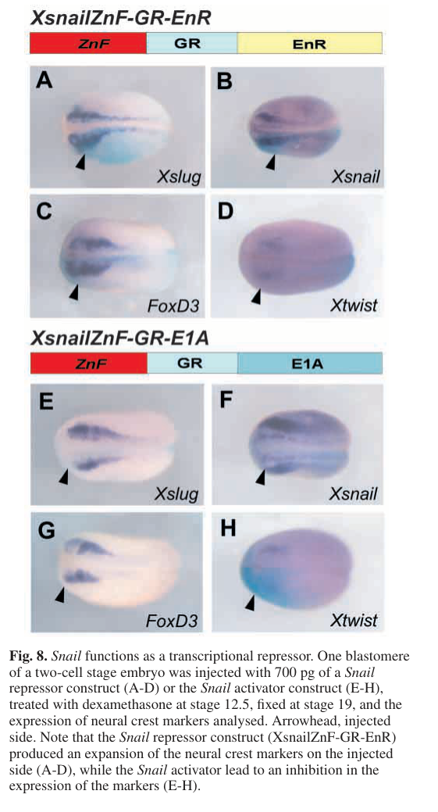

## Question

# Gene Research for Functional Annotation

## ⚠️ CRITICAL: Gene/Protein Identification Context

**BEFORE YOU BEGIN RESEARCH:** You MUST verify you are researching the CORRECT gene/protein. Gene symbols can be ambiguous, especially for less well-characterized genes from non-model organisms.

### Target Gene/Protein Identity (from UniProt):
- **UniProt Accession:** P19382
- **Protein Description:** RecName: Full=Protein snail homolog Sna; Short=Protein Xsnail; Short=Protein xSna;
- **Gene Information:** Name=snai1; Synonyms=sna;
- **Organism (full):** Xenopus laevis (African clawed frog).
- **Protein Family:** Belongs to the snail C2H2-type zinc-finger protein family.
- **Key Domains:** Znf_C2H2_sf. (IPR036236); Znf_C2H2_type. (IPR013087); zf-C2H2 (PF00096)

### MANDATORY VERIFICATION STEPS:

1. **Check if the gene symbol "snai1" matches the protein description above**
2. **Verify the organism is correct:** Xenopus laevis (African clawed frog).
3. **Check if protein family/domains align with what you find in literature**
4. **If you find literature for a DIFFERENT gene with the same or similar symbol, STOP**

### If Gene Symbol is Ambiguous or You Cannot Find Relevant Literature:

**DO NOT PROCEED WITH RESEARCH ON A DIFFERENT GENE.** Instead:
- State clearly: "The gene symbol 'snai1' is ambiguous or literature is limited for this specific protein"
- Explain what you found (e.g., "Found extensive literature on a different gene with the same symbol in a different organism")
- Describe the protein based ONLY on the UniProt information provided above
- Suggest that the protein function can be inferred from domain/family information

### Research Target:

Please provide a comprehensive research report on the gene **snai1** (gene ID: snai1, UniProt: P19382) in XENLA.

The research report should be a detailed narrative explaining the function, biological processes, and localization of the gene product. Citations should be given for all claims.

You should prioritize authoritative reviews and primary scientific literature when conducting research. You can supplement
this with annotations you find in gene/protein databases, but these can be outdated or inaccurate.

We are specifically interested in the primary function of the gene - for enzymes, what reaction is catalyzed, and what is the substrate specificity? For transporters, what is the substrate? For structural proteins or adapters, what is the broader structural role? For signaling molecules, what is the role in the pathway.

We are interested in where in or outside the cell the gene product carries out its function.

We are also interested in the signaling or biochemical pathways in which the gene functions. We are less interested in broad pleiotropic effects, except where these elucidate the precise role.

Include evidence where possible. We are interested in both experimental evidence as well as inference from structure, evolution, or bioinformatic analysis. Precise studies should be prioritized over high-throughput, where available.

## Output

Question: You are an expert researcher providing comprehensive, well-cited information.

Provide detailed information focusing on:
1. Key concepts and definitions with current understanding
2. Recent developments and latest research (prioritize 2023-2024 sources)
3. Current applications and real-world implementations
4. Expert opinions and analysis from authoritative sources
5. Relevant statistics and data from recent studies

Format as a comprehensive research report with proper citations. Include URLs and publication dates where available.
Always prioritize recent, authoritative sources and provide specific citations for all major claims.

# Gene Research for Functional Annotation

## ⚠️ CRITICAL: Gene/Protein Identification Context

**BEFORE YOU BEGIN RESEARCH:** You MUST verify you are researching the CORRECT gene/protein. Gene symbols can be ambiguous, especially for less well-characterized genes from non-model organisms.

### Target Gene/Protein Identity (from UniProt):
- **UniProt Accession:** P19382
- **Protein Description:** RecName: Full=Protein snail homolog Sna; Short=Protein Xsnail; Short=Protein xSna;
- **Gene Information:** Name=snai1; Synonyms=sna;
- **Organism (full):** Xenopus laevis (African clawed frog).
- **Protein Family:** Belongs to the snail C2H2-type zinc-finger protein family.
- **Key Domains:** Znf_C2H2_sf. (IPR036236); Znf_C2H2_type. (IPR013087); zf-C2H2 (PF00096)

### MANDATORY VERIFICATION STEPS:

1. **Check if the gene symbol "snai1" matches the protein description above**
2. **Verify the organism is correct:** Xenopus laevis (African clawed frog).
3. **Check if protein family/domains align with what you find in literature**
4. **If you find literature for a DIFFERENT gene with the same or similar symbol, STOP**

### If Gene Symbol is Ambiguous or You Cannot Find Relevant Literature:

**DO NOT PROCEED WITH RESEARCH ON A DIFFERENT GENE.** Instead:
- State clearly: "The gene symbol 'snai1' is ambiguous or literature is limited for this specific protein"
- Explain what you found (e.g., "Found extensive literature on a different gene with the same symbol in a different organism")
- Describe the protein based ONLY on the UniProt information provided above
- Suggest that the protein function can be inferred from domain/family information

### Research Target:

Please provide a comprehensive research report on the gene **snai1** (gene ID: snai1, UniProt: P19382) in XENLA.

The research report should be a detailed narrative explaining the function, biological processes, and localization of the gene product. Citations should be given for all claims.

You should prioritize authoritative reviews and primary scientific literature when conducting research. You can supplement
this with annotations you find in gene/protein databases, but these can be outdated or inaccurate.

We are specifically interested in the primary function of the gene - for enzymes, what reaction is catalyzed, and what is the substrate specificity? For transporters, what is the substrate? For structural proteins or adapters, what is the broader structural role? For signaling molecules, what is the role in the pathway.

We are interested in where in or outside the cell the gene product carries out its function.

We are also interested in the signaling or biochemical pathways in which the gene functions. We are less interested in broad pleiotropic effects, except where these elucidate the precise role.

Include evidence where possible. We are interested in both experimental evidence as well as inference from structure, evolution, or bioinformatic analysis. Precise studies should be prioritized over high-throughput, where available.

# Functional annotation report: *snai1* in *Xenopus laevis*

## Identity and scope

The supplied UniProt record [P19382](https://www.uniprot.org/uniprotkb/P19382/entry) identifies the African clawed frog protein as Snail homolog Sna, also called Xsnail or xSna, encoded by *snai1* (*sna*). The identity is consistent with *X. laevis* experimental literature: investigators studied **Xsnail** separately from **Xslug/Snai2**, using distinct coding sequences and gene-specific untranslated-region probes to avoid cross-hybridization. Their Xsnail construct encodes a 259-residue protein with a C-terminal zinc-finger region; the supplied UniProt annotation assigns it to the Snail C2H2 zinc-finger family. Findings for Xslug, human SNAI1, or other species are **not** treated here as direct evidence for P19382. The cited experiments establish the Xsnail identity and species, although they do not independently sequence-match their experimental clone to accession P19382. (aybar2003snailprecedesslug pages 2-3, aybar2003snailprecedesslug pages 3-4)

## Primary molecular function and site of action

**Xsnail is a developmental transcriptional repressor, not an enzyme or transporter.** Its zinc-finger region provides the presumed DNA-recognition component; its consequential activity is regulation of gene expression during neural-crest formation. In a decisive functional test, a fusion of the Xsnail zinc-finger region to an Engrailed repression domain expanded neural-crest-marker expression, whereas fusion to an E1A activation domain inhibited those markers. This supports repression as the relevant mode of action, but does not establish which endogenous promoters the native protein binds. The opposing phenotypes are shown in Aybar and colleagues’ Figure 8. (aybar2003snailprecedesslug pages 2-3, aybar2003snailprecedesslug pages 7-8, aybar2003snailprecedesslug media 3766ba6e)

**The expected functional compartment is the nucleus**, where a DNA-binding transcriptional regulator can alter transcription. This is a mechanistic inference from the zinc-finger fusion and gene-expression experiments, **not** a claim that endogenous *X. laevis* Snail1 was localized by microscopy or subcellular fractionation in the cited studies. Snail acts inside embryonic cells rather than as a secreted signal; its developmental consequences extend to neighboring signaling programs. (aybar2003snailprecedesslug pages 2-3)

## Developmental processes and pathway position

Xsnail RNA first appears in the **dorsal marginal zone** before gastrulation, then at the **neural-plate border by approximately stage 11**; Xslug expression there becomes detectable at approximately **stage 12.5**. At neurula stages, Xsnail marks prospective crest cells and an adjacent domain associated with the future neural-tube roof plate. These measurements locate the expressing embryonic tissues; they are **not** measurements of intracellular protein distribution. Early marginal-zone expression also means that unconditioned early manipulations could indirectly affect the crest through mesoderm, a concern addressed by temporally inducible constructs in the principal functional study. (aybar2003snailprecedesslug pages 2-3, aybar2003snailprecedesslug pages 3-4)

Conditional Xsnail activation expanded crest-marker domains: endogenous Snail in **85% of embryos (n=107)**, Slug in **76% (n=96)**, Zic5 in **63% (n=97)**, Twist in **67% (n=86)**, and FoxD3 in **62% (n=85)**. Blocking proliferation did not abolish marker-domain expansion. In isolated animal caps, Xsnail induced crest-associated Snail, Slug, Twist, Zic5, and Ets1 without inducing the tested neural-plate markers NCAM and Sox2 or mesoderm marker Xbra. These experiments support a role in **crest specification** rather than merely increasing cell division or creating mesoderm first. They do not show that each induced gene is a direct transcriptional target. (aybar2003snailprecedesslug pages 3-4, aybar2003snailprecedesslug pages 4-5)

Snail and Slug are distinct, ordered components of this regulatory cascade: Slug expression follows Snail, and experimentally supplied Slug rescued dominant-negative Snail’s crest-marker phenotype, whereas supplied Snail did not effectively rescue dominant-negative Slug. When Xsnail was activated **after crest specification**, the Slug-positive migrating population increased in **81% of embryos (n=43)**; a dominant-negative Xsnail construct reduced migration in **67% (n=48)**. Thus, Xsnail contributes both to establishing the neural-crest program and to its later migratory phase. The migration outcomes were assessed primarily by the extent of marker-positive cell populations, not single-cell motility measurements. (aybar2003snailprecedesslug pages 7-8)

Two experimentally supported connections help place Xsnail within signaling networks. Xsnail expression **reduced BMP4 RNA** in animal caps, consistent with inhibition of a BMP-dependent epidermal program during crest induction. Separately, in an Xiro/Notch-network study, Xsnail suppressed Xiro3-induced **Delta1** expression in animal caps, while dominant-negative Snail increased Delta1 expression in embryos. The proposed network has spatially restricted Delta/Notch activity contributing to neural-plate-border patterning. **BMP4 and Delta1 are expression-responsive candidates, not demonstrated direct DNA-binding targets of Xsnail**: promoter occupancy or equivalent direct-target evidence was not established in those experiments. (aybar2003snailprecedesslug pages 4-5, aybar2003snailprecedesslug pages 10-11, glavic2004interplaybetweennotch pages 8-9)

A biochemical study additionally found that tagged Xenopus Snail **co-immunoprecipitates with Ppa**, an F-box component associated with ubiquitin-ligase regulation of developmental transcription factors. This establishes association under the assay conditions; the passages examined do **not** independently establish a Snail1-specific ubiquitination rate, protein half-life, or Ppa-dependent degradation mechanism. (lander2011thefboxprotein pages 2-4, lander2011thefboxprotein pages 4-6)

The evidence and its limits are summarized below.

| Claim | Direct Xsnail evidence and quantitative outcomes | Interpretation / limitation | Primary study DOI / year |
|---|---|---|---|
| C2H2 zinc-finger transcriptional repression | The Xsnail zinc-finger region (aa 134–259) fused to the Engrailed repressor domain expanded Xslug, Xsnail, FoxD3 and Xtwist expression; fusion to the E1A activation domain inhibited these markers (Figure 8). (aybar2003snailprecedesslug pages 2-3, aybar2003snailprecedesslug media 3766ba6e) | Strong functional evidence that Xsnail DNA recognition normally supports repression. Engineered fusions do not identify endogenous bound promoters or prove direct regulation of individual markers. | [10.1242/dev.00238](https://doi.org/10.1242/dev.00238) (2003) |
| Neural-crest specification | Conditional Xsnail activation expanded endogenous Snail in 85% of embryos (n=107) and Slug/Snai2 in 76% (n=96); Zic5, Twist and FoxD3 domains also expanded. Snail appeared at the neural-plate border at stage 11, before Slug at stage 12.5. (aybar2003snailprecedesslug pages 3-4) | Supports an early, upstream role in crest specification. Results rely chiefly on overexpression and dominant-negative constructs rather than a clean endogenous snai1 knockout. | [10.1242/dev.00238](https://doi.org/10.1242/dev.00238) (2003) |
| Neural-crest migration | Activating Xsnail at stage 16 increased the Slug-positive migrating population in 81% of embryos (n=43); dominant-negative Xsnail reduced migration in 67% (n=48). (aybar2003snailprecedesslug pages 7-8) | Demonstrates a post-specification requirement and sufficiency under experimental conditions, but marker-domain enlargement is not a direct biophysical measurement of motility. | [10.1242/dev.00238](https://doi.org/10.1242/dev.00238) (2003) |
| BMP4 inhibition | Xsnail expression inhibited BMP4 RNA in animal-cap assays while inducing crest markers without NCAM, Sox2 or Xbra. (aybar2003snailprecedesslug pages 10-11, aybar2003snailprecedesslug pages 4-5) | BMP4 is a plausible downstream mediator, but no promoter-binding or chromatin assay established it as a direct Xsnail target. | [10.1242/dev.00238](https://doi.org/10.1242/dev.00238) (2003) |
| Delta1 repression | Xsnail completely suppressed Xiro3-induced Delta1 RNA in the reported animal-cap RT-PCR assay; dominant-negative Snail increased Delta1 expression. Each embryo experiment was repeated at least twice with ≥52 embryos, and effects occurred in ≥65%. (glavic2004interplaybetweennotch pages 8-9) | Expression and perturbation evidence supports repression within the crest network, but direct Xsnail binding to Delta1 regulatory DNA was not tested. | [10.1242/dev.00945](https://doi.org/10.1242/dev.00945) (2004) |
| Regulation by the F-box protein Ppa | Tagged Xenopus Snail co-immunoprecipitated with tagged Ppa in embryo extracts, supporting physical association with an SCF-type ubiquitin-ligase component. (lander2011thefboxprotein pages 4-6, lander2011thefboxprotein pages 2-4) | Direct interaction is supported, but the cited experiments do not provide a Snail1-specific ubiquitination ladder, half-life measurement or proteasome-rescue assay; detailed turnover evidence primarily concerned other factors. | [10.1083/jcb.201012085](https://doi.org/10.1083/jcb.201012085) (2011) |
| snai1 in a reprogrammed neural-crest state | RNA-seq detected induction of snai1, separately from snai2, in BMP-inhibitor/CHIR-treated Xenopus animal caps. The 82/82 positive-explant result measured snai2—not snai1. (huber2024smallmoleculemediatedreprogramming pages 3-4) | Current expression-level evidence places snai1 in the induced crest program, but there was no snai1-specific perturbation or quantitative causal effect. | [10.1016/j.ydbio.2023.10.004](https://doi.org/10.1016/j.ydbio.2023.10.004) (published 2024) |
| Nuclear site of action | Zinc-finger-dependent transcriptional repression and effects on target-gene RNA imply action at nuclear chromatin. (aybar2003snailprecedesslug pages 2-3) | Nuclear localization is mechanistically well supported but remains inferred here: the cited Xsnail studies did not show endogenous Snail1 localization by imaging or nuclear–cytoplasmic fractionation. | [10.1242/dev.00238](https://doi.org/10.1242/dev.00238) (2003) |

*Table: Direct evidence and key limitations for Xenopus laevis snai1/Xsnail (P19382), kept separate from Snai2/Slug findings. The table distinguishes functional results from inferred localization and unproven direct targets.*

## Recent research and experimental use

Recent studies continue to place *snai1* in the *Xenopus* stem-cell-to-neural-crest program, but should not be mistaken for new demonstrations of its molecular mechanism. In **2024**, York and colleagues identified *snai1* among neural-crest-associated genes expressed in *X. laevis* blastula animal-pole cells, informing their analysis of shared blastula and crest stem-cell programs. This is expression and evolutionary-context evidence, not an *snai1*-specific causal perturbation. (york2024sharedfeaturesof pages 1-3)

In another **2024** study, BMP inhibition together with Wnt-pathway activation by CHIR99021 induced a neural-crest-like state in Xenopus blastula explants; RNA sequencing detected induction of **both *snai1* and *snai2* as separate genes**. All **82/82** treated explants tested positive for the **Snai2** marker, versus **0/59** vehicle controls: those numbers **must not be assigned to Snai1**. The work provides a practical experimental reprogramming assay and a transcriptomic readout involving *snai1*, not evidence that manipulating *snai1* itself caused reprogramming. No clinical implementation of frog P19382 follows from these studies. (huber2024smallmoleculemediatedreprogramming pages 3-4)

## Annotation boundaries

The strongest species-specific functional assignment is **zinc-finger-dependent transcriptional repression associated with neural-crest specification and subsequent migration**. Mesodermal expression is documented, but the cited Xsnail animal-cap experiment did not induce Xbra and does not establish that this protein independently specifies mesoderm. Likewise, Snail-family associations with E-cadherin repression, survival, and apoptosis—particularly experiments on mammalian Snail or Xenopus **Snai2/Slug**—should not be converted into direct P19382 target or function annotations without Xsnail-specific evidence. The principal functional evidence relies substantially on inducible overexpression, engineered repressor/activator fusions, and dominant-negative constructs rather than an endogenous allele-specific knockout; direct genomic targets and endogenous subcellular localization remain important unresolved details. (aybar2003snailprecedesslug pages 3-4, aybar2003snailprecedesslug pages 1-2, klymkowsky2010mechanismsdrivingneural pages 6-7, cobaleda2007functionofthe pages 2-3, aybar2003snailprecedesslug pages 2-3)

### Principal publications

- **Aybar MJ, Nieto MA, Mayor R. February 2003.** “Snail precedes Slug in the genetic cascade required for the specification and migration of the Xenopus neural crest.” *Development* **130**, 483–494. https://doi.org/10.1242/dev.00238. Primary Xsnail timing, functional repression, crest specification, and migration experiments. (aybar2003snailprecedesslug pages 1-2, aybar2003snailprecedesslug pages 7-8)
- **Glavic A and colleagues. January 2004.** “Interplay between Notch signaling and the homeoprotein Xiro1 is required for neural crest induction in Xenopus embryos.” *Development* **131**, 347–359. https://doi.org/10.1242/dev.00945. Delta1 expression and pathway-context experiments. (glavic2004interplaybetweennotch pages 8-9)
- **Lander R, Nordin K, LaBonne C. July 2011.** “The F-box protein Ppa is a common regulator of core EMT factors Twist, Snail, Slug, and Sip1.” *Journal of Cell Biology* **194**, 17–25. https://doi.org/10.1083/jcb.201012085. Ppa–Snail association. (lander2011thefboxprotein pages 2-4)
- **Huber PB, LaBonne C. January 2024.** “Small molecule-mediated reprogramming of Xenopus blastula stem cells to a neural crest state.” *Developmental Biology* **505**, 34–41. https://doi.org/10.1016/j.ydbio.2023.10.004. Reprogramming-associated *snai1* expression, separately measured from *snai2*. (huber2024smallmoleculemediatedreprogramming pages 3-4)
- **York JR and colleagues. 2024.** “Shared features of blastula and neural crest stem cells evolved at the base of vertebrates.” *Nature Ecology & Evolution* **8**, 1680–1692. https://doi.org/10.1038/s41559-024-02476-8. Recent developmental and evolutionary expression context. (york2024sharedfeaturesof pages 1-3)

References

1. (aybar2003snailprecedesslug pages 2-3): Manuel J. Aybar, M. Angela Nieto, and Roberto Mayor. Snail precedes slug in the genetic cascade required for the specification and migration of the xenopus neural crest. Development, 130:483-494, Feb 2003. URL: https://doi.org/10.1242/dev.00238, doi:10.1242/dev.00238. This article has 303 citations and is from a domain leading peer-reviewed journal.

2. (aybar2003snailprecedesslug pages 3-4): Manuel J. Aybar, M. Angela Nieto, and Roberto Mayor. Snail precedes slug in the genetic cascade required for the specification and migration of the xenopus neural crest. Development, 130:483-494, Feb 2003. URL: https://doi.org/10.1242/dev.00238, doi:10.1242/dev.00238. This article has 303 citations and is from a domain leading peer-reviewed journal.

3. (aybar2003snailprecedesslug pages 7-8): Manuel J. Aybar, M. Angela Nieto, and Roberto Mayor. Snail precedes slug in the genetic cascade required for the specification and migration of the xenopus neural crest. Development, 130:483-494, Feb 2003. URL: https://doi.org/10.1242/dev.00238, doi:10.1242/dev.00238. This article has 303 citations and is from a domain leading peer-reviewed journal.

4. (aybar2003snailprecedesslug media 3766ba6e): Manuel J. Aybar, M. Angela Nieto, and Roberto Mayor. Snail precedes slug in the genetic cascade required for the specification and migration of the xenopus neural crest. Development, 130:483-494, Feb 2003. URL: https://doi.org/10.1242/dev.00238, doi:10.1242/dev.00238. This article has 303 citations and is from a domain leading peer-reviewed journal.

5. (aybar2003snailprecedesslug pages 4-5): Manuel J. Aybar, M. Angela Nieto, and Roberto Mayor. Snail precedes slug in the genetic cascade required for the specification and migration of the xenopus neural crest. Development, 130:483-494, Feb 2003. URL: https://doi.org/10.1242/dev.00238, doi:10.1242/dev.00238. This article has 303 citations and is from a domain leading peer-reviewed journal.

6. (aybar2003snailprecedesslug pages 10-11): Manuel J. Aybar, M. Angela Nieto, and Roberto Mayor. Snail precedes slug in the genetic cascade required for the specification and migration of the xenopus neural crest. Development, 130:483-494, Feb 2003. URL: https://doi.org/10.1242/dev.00238, doi:10.1242/dev.00238. This article has 303 citations and is from a domain leading peer-reviewed journal.

7. (glavic2004interplaybetweennotch pages 8-9): Alvaro Glavic, Francisca Silva, Manuel J. Aybar, Francisco Bastidas, and Roberto Mayor. Interplay between notch signaling and the homeoprotein<i>xiro1</i>is required for neural crest induction in<i>xenopus</i>embryos. Development, 131:347-359, Jan 2004. URL: https://doi.org/10.1242/dev.00945, doi:10.1242/dev.00945. This article has 143 citations and is from a domain leading peer-reviewed journal.

8. (lander2011thefboxprotein pages 2-4): Rachel Lander, Kara Nordin, and Carole LaBonne. The f-box protein ppa is a common regulator of core emt factors twist, snail, slug, and sip1. The Journal of Cell Biology, 194:17-25, Jul 2011. URL: https://doi.org/10.1083/jcb.201012085, doi:10.1083/jcb.201012085. This article has 172 citations.

9. (lander2011thefboxprotein pages 4-6): Rachel Lander, Kara Nordin, and Carole LaBonne. The f-box protein ppa is a common regulator of core emt factors twist, snail, slug, and sip1. The Journal of Cell Biology, 194:17-25, Jul 2011. URL: https://doi.org/10.1083/jcb.201012085, doi:10.1083/jcb.201012085. This article has 172 citations.

10. (huber2024smallmoleculemediatedreprogramming pages 3-4): Paul B. Huber and Carole LaBonne. Small molecule-mediated reprogramming of xenopus blastula stem cells to a neural crest state. Developmental Biology, 505:34-41, Jan 2024. URL: https://doi.org/10.1016/j.ydbio.2023.10.004, doi:10.1016/j.ydbio.2023.10.004. This article has 10 citations and is from a peer-reviewed journal.

11. (york2024sharedfeaturesof pages 1-3): Joshua R. York, Anjali Rao, Paul B. Huber, Elizabeth N. Schock, Andrew Montequin, Sara Rigney, and Carole LaBonne. Shared features of blastula and neural crest stem cells evolved at the base of vertebrates. Nature ecology & evolution, 8:1680-1692, Jul 2024. URL: https://doi.org/10.1038/s41559-024-02476-8, doi:10.1038/s41559-024-02476-8. This article has 15 citations and is from a highest quality peer-reviewed journal.

12. (aybar2003snailprecedesslug pages 1-2): Manuel J. Aybar, M. Angela Nieto, and Roberto Mayor. Snail precedes slug in the genetic cascade required for the specification and migration of the xenopus neural crest. Development, 130:483-494, Feb 2003. URL: https://doi.org/10.1242/dev.00238, doi:10.1242/dev.00238. This article has 303 citations and is from a domain leading peer-reviewed journal.

13. (klymkowsky2010mechanismsdrivingneural pages 6-7): Michael Klymkowsky, Christy Cortez Rossi, and Kristin Bruk Artinger. Mechanisms driving neural crest induction and migration in the zebrafish and xenopus laevis. Cell Adhesion & Migration, 4:595-608, Oct 2010. URL: https://doi.org/10.4161/cam.4.4.12962, doi:10.4161/cam.4.4.12962. This article has 63 citations and is from a peer-reviewed journal.

14. (cobaleda2007functionofthe pages 2-3): César Cobaleda, María Pérez-Caro, Carolina Vicente-Dueñas, and Isidro Sánchez-García. Function of the zinc-finger transcription factor snai2 in cancer and development. Annual review of genetics, 41:41-61, Dec 2007. URL: https://doi.org/10.1146/annurev.genet.41.110306.130146, doi:10.1146/annurev.genet.41.110306.130146. This article has 231 citations and is from a domain leading peer-reviewed journal.

## Artifacts

- [Edison artifact artifact-00](snai1-deep-research-falcon_artifacts/artifact-00.md)

## Citations

1. aybar2003snailprecedesslug pages 2-3
2. aybar2003snailprecedesslug pages 7-8
3. aybar2003snailprecedesslug pages 3-4
4. glavic2004interplaybetweennotch pages 8-9
5. huber2024smallmoleculemediatedreprogramming pages 3-4
6. york2024sharedfeaturesof pages 1-3
7. lander2011thefboxprotein pages 2-4
8. aybar2003snailprecedesslug pages 4-5
9. aybar2003snailprecedesslug pages 10-11
10. lander2011thefboxprotein pages 4-6
11. aybar2003snailprecedesslug pages 1-2
12. klymkowsky2010mechanismsdrivingneural pages 6-7
13. cobaleda2007functionofthe pages 2-3
14. P19382
15. 10.1242/dev.00238
16. 10.1242/dev.00945
17. 10.1083/jcb.201012085
18. 10.1016/j.ydbio.2023.10.004
19. https://www.uniprot.org/uniprotkb/P19382/entry
20. https://doi.org/10.1242/dev.00238
21. https://doi.org/10.1242/dev.00945
22. https://doi.org/10.1083/jcb.201012085
23. https://doi.org/10.1016/j.ydbio.2023.10.004
24. https://doi.org/10.1242/dev.00238.
25. https://doi.org/10.1242/dev.00945.
26. https://doi.org/10.1083/jcb.201012085.
27. https://doi.org/10.1016/j.ydbio.2023.10.004.
28. https://doi.org/10.1038/s41559-024-02476-8.
29. https://doi.org/10.1242/dev.00238,
30. https://doi.org/10.1242/dev.00945,
31. https://doi.org/10.1083/jcb.201012085,
32. https://doi.org/10.1016/j.ydbio.2023.10.004,
33. https://doi.org/10.1038/s41559-024-02476-8,
34. https://doi.org/10.4161/cam.4.4.12962,
35. https://doi.org/10.1146/annurev.genet.41.110306.130146,