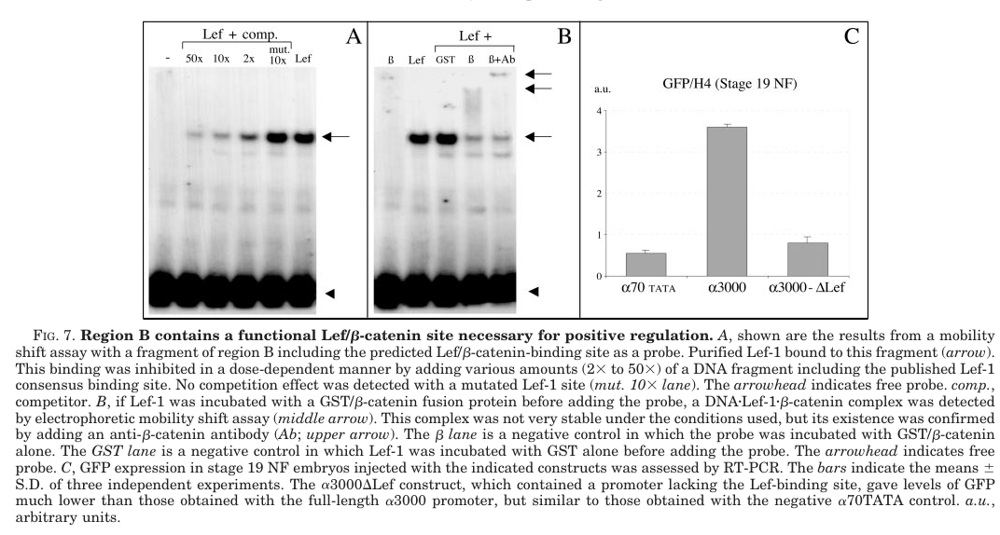

## Question

# Gene Research for Functional Annotation

## ⚠️ CRITICAL: Gene/Protein Identification Context

**BEFORE YOU BEGIN RESEARCH:** You MUST verify you are researching the CORRECT gene/protein. Gene symbols can be ambiguous, especially for less well-characterized genes from non-model organisms.

### Target Gene/Protein Identity (from UniProt):
- **UniProt Accession:** Q91924
- **Protein Description:** RecName: Full=Zinc finger protein SNAI2; AltName: Full=Protein slug-alpha; AltName: Full=Protein snail homolog 2; AltName: Full=Snail protein homolog Slug; Short=xSlu;
- **Gene Information:** Name=snai2; Synonyms=slu, slug;
- **Organism (full):** Xenopus laevis (African clawed frog).
- **Protein Family:** Belongs to the snail C2H2-type zinc-finger protein family.
- **Key Domains:** Znf_C2H2_sf. (IPR036236); Znf_C2H2_type. (IPR013087); zf-C2H2 (PF00096)

### MANDATORY VERIFICATION STEPS:

1. **Check if the gene symbol "snai2" matches the protein description above**
2. **Verify the organism is correct:** Xenopus laevis (African clawed frog).
3. **Check if protein family/domains align with what you find in literature**
4. **If you find literature for a DIFFERENT gene with the same or similar symbol, STOP**

### If Gene Symbol is Ambiguous or You Cannot Find Relevant Literature:

**DO NOT PROCEED WITH RESEARCH ON A DIFFERENT GENE.** Instead:
- State clearly: "The gene symbol 'snai2' is ambiguous or literature is limited for this specific protein"
- Explain what you found (e.g., "Found extensive literature on a different gene with the same symbol in a different organism")
- Describe the protein based ONLY on the UniProt information provided above
- Suggest that the protein function can be inferred from domain/family information

### Research Target:

Please provide a comprehensive research report on the gene **snai2** (gene ID: snai2, UniProt: Q91924) in XENLA.

The research report should be a detailed narrative explaining the function, biological processes, and localization of the gene product. Citations should be given for all claims.

You should prioritize authoritative reviews and primary scientific literature when conducting research. You can supplement
this with annotations you find in gene/protein databases, but these can be outdated or inaccurate.

We are specifically interested in the primary function of the gene - for enzymes, what reaction is catalyzed, and what is the substrate specificity? For transporters, what is the substrate? For structural proteins or adapters, what is the broader structural role? For signaling molecules, what is the role in the pathway.

We are interested in where in or outside the cell the gene product carries out its function.

We are also interested in the signaling or biochemical pathways in which the gene functions. We are less interested in broad pleiotropic effects, except where these elucidate the precise role.

Include evidence where possible. We are interested in both experimental evidence as well as inference from structure, evolution, or bioinformatic analysis. Precise studies should be prioritized over high-throughput, where available.

## Output

Question: You are an expert researcher providing comprehensive, well-cited information.

Provide detailed information focusing on:
1. Key concepts and definitions with current understanding
2. Recent developments and latest research (prioritize 2023-2024 sources)
3. Current applications and real-world implementations
4. Expert opinions and analysis from authoritative sources
5. Relevant statistics and data from recent studies

Format as a comprehensive research report with proper citations. Include URLs and publication dates where available.
Always prioritize recent, authoritative sources and provide specific citations for all major claims.

# Gene Research for Functional Annotation

## ⚠️ CRITICAL: Gene/Protein Identification Context

**BEFORE YOU BEGIN RESEARCH:** You MUST verify you are researching the CORRECT gene/protein. Gene symbols can be ambiguous, especially for less well-characterized genes from non-model organisms.

### Target Gene/Protein Identity (from UniProt):
- **UniProt Accession:** Q91924
- **Protein Description:** RecName: Full=Zinc finger protein SNAI2; AltName: Full=Protein slug-alpha; AltName: Full=Protein snail homolog 2; AltName: Full=Snail protein homolog Slug; Short=xSlu;
- **Gene Information:** Name=snai2; Synonyms=slu, slug;
- **Organism (full):** Xenopus laevis (African clawed frog).
- **Protein Family:** Belongs to the snail C2H2-type zinc-finger protein family.
- **Key Domains:** Znf_C2H2_sf. (IPR036236); Znf_C2H2_type. (IPR013087); zf-C2H2 (PF00096)

### MANDATORY VERIFICATION STEPS:

1. **Check if the gene symbol "snai2" matches the protein description above**
2. **Verify the organism is correct:** Xenopus laevis (African clawed frog).
3. **Check if protein family/domains align with what you find in literature**
4. **If you find literature for a DIFFERENT gene with the same or similar symbol, STOP**

### If Gene Symbol is Ambiguous or You Cannot Find Relevant Literature:

**DO NOT PROCEED WITH RESEARCH ON A DIFFERENT GENE.** Instead:
- State clearly: "The gene symbol 'snai2' is ambiguous or literature is limited for this specific protein"
- Explain what you found (e.g., "Found extensive literature on a different gene with the same symbol in a different organism")
- Describe the protein based ONLY on the UniProt information provided above
- Suggest that the protein function can be inferred from domain/family information

### Research Target:

Please provide a comprehensive research report on the gene **snai2** (gene ID: snai2, UniProt: Q91924) in XENLA.

The research report should be a detailed narrative explaining the function, biological processes, and localization of the gene product. Citations should be given for all claims.

You should prioritize authoritative reviews and primary scientific literature when conducting research. You can supplement
this with annotations you find in gene/protein databases, but these can be outdated or inaccurate.

We are specifically interested in the primary function of the gene - for enzymes, what reaction is catalyzed, and what is the substrate specificity? For transporters, what is the substrate? For structural proteins or adapters, what is the broader structural role? For signaling molecules, what is the role in the pathway.

We are interested in where in or outside the cell the gene product carries out its function.

We are also interested in the signaling or biochemical pathways in which the gene functions. We are less interested in broad pleiotropic effects, except where these elucidate the precise role.

Include evidence where possible. We are interested in both experimental evidence as well as inference from structure, evolution, or bioinformatic analysis. Precise studies should be prioritized over high-throughput, where available.

# Functional annotation of *snai2* in *Xenopus laevis*

## Identity and principal function

The protein specified here by UniProt **Q91924** is *Xenopus laevis* Snai2, historically called **Slug**, **XSlug**, or **slug-alpha**. It is **not** Snai1/Snail: Xenopus studies examine Snail and Slug as distinct, related genes and place Snail earlier in the neural-crest regulatory cascade. The supplied UniProt designation is consistent with the literature’s Snail-family zinc-finger transcriptional repressor. A genomic comparison found two expressed *X. laevis* Slug pseudoalleles whose predicted proteins have **five identical zinc fingers**; the available papers do not independently establish which pseudoallele corresponds to accession Q91924. Consequently, conclusions from experiments described simply as “XSlug” should not automatically be assigned to one pseudoallele. (zhang2006annfκband pages 1-2, aybar2003snailprecedesslug pages 1-2, vallin2001cloningandcharacterization pages 7-7, vallin2001cloningandcharacterization pages 3-3)

**Primary molecular role:** Snai2 is a sequence-directed **transcriptional repressor** that helps establish and maintain a viable, appropriately migratory neural-crest population. Its C-terminal C2H2 zinc fingers provide DNA-recognition capacity, while its N-terminal SNAG region participates in assembling a repression complex. It is neither an enzyme with a catalytic substrate nor a membrane transporter. Snail-family factors recognize E-box-related DNA sequences; experimentally characterized mammalian Snai2 recognizes E2-boxes including **CAGGTG/CACCTG**, but the complete target-site specificity of *X. laevis* Q91924 has not been established by equivalent protein–DNA experiments. In Xenopus embryos, a fusion of the Slug zinc-finger region to an alternative Engrailed repression domain rescues loss of Slug-dependent neural-crest development, whereas the zinc-finger region alone does not. This is particularly persuasive evidence that **DNA targeting coupled to repression**, rather than zinc-finger binding alone, is central to its developmental activity. (zhang2006annfκband pages 1-2, langer2008ajubalimproteins pages 5-6, villarejo2014differentialroleof pages 1-2)

## Where it acts

At the **tissue level**, *slug/snai2* RNA is detectable after *snai1* during gastrulation—approximately stage 12.5 in the examined Xenopus embryos—and is present in the presumptive cranial neural crest at the neural-plate border. Analyses distinguishing the two *X. laevis* pseudoalleles found overlapping expression in presumptive cephalic neural-crest territory at stage 14. Their promoter reporters were active at the neural-plate border, most strongly in cranial crest around stage 19, and remained detectable, more weakly, in migrating cells entering the branchial arches at stage 25. Early zygotic Slug RNA has also been reported in dorsal mesendoderm, consistent with functional effects on mesodermal markers. These are principally **RNA-expression and promoter-reporter observations**, not measurements of endogenous Slug protein abundance. (vallin2001cloningandcharacterization pages 3-3, vallin2001cloningandcharacterization pages 4-6, zhang2006annfκband pages 1-2, aybar2003snailprecedesslug pages 2-3)

At the **subcellular level**, its DNA-directed repression and interaction with nuclear corepressor machinery place the functional transcription-factor activity in the **nucleus**; it should not be annotated as secreted or as a cell-surface receptor. Nuclear Snail–Ajuba association and promoter recruitment were directly demonstrated in cultured cells, alongside Xenopus genetic evidence that related Ajuba proteins support XSlug function. Those experiments do **not**, however, amount to direct immunolocalization of *endogenous X. laevis* Q91924. Thus nuclear function is strongly supported mechanistically, while the precise endogenous nuclear-versus-cytoplasmic distribution of this particular protein remains less directly documented. (langer2008ajubalimproteins pages 2-4, langer2008ajubalimproteins pages 5-6, langer2008ajubalimproteins pages 1-2, vallin2001cloningandcharacterization pages 3-3)

## Mechanism and developmental pathways

**Wnt input into *snai2*.** Canonical Wnt signaling acts upstream of Slug transcription through LEF/β-catenin. In a promoter study using *X. laevis* embryos, purified LEF1 bound a Slug-promoter fragment, β-catenin joined the DNA-bound complex, and deletion of **eight bases** from the LEF site reduced promoter-driven GFP RNA to approximately basal reporter levels. This establishes a specific cis-regulatory Wnt connection; it does **not** mean that LEF’s site in the *snai2* promoter is itself a DNA target bound by Snai2 protein. Promoter-region cooperation indicates that the LEF element alone does not account for the complete neural-crest-specific expression pattern. Current neural-plate-border models additionally incorporate BMP and FGF signaling and factors such as Pax3/Zic1, but their individual connections to Slug should not be given the same direct-promoter evidentiary status as LEF/β-catenin. Vallin *et al.*, *Journal of Biological Chemistry*, **August 2001**, https://doi.org/10.1074/jbc.M103167200; Esmaeli *et al.*, *International Journal of Developmental Biology*, **July 2024**, https://doi.org/10.1387/ijdb.230231me. **Visual evidence:** the original study’s cropped Figure 7 shows the DNA-binding assays and loss of reporter activity after LEF-site deletion. (vallin2001cloningandcharacterization pages 7-7, vallin2001cloningandcharacterization pages 7-8, vallin2001cloningandcharacterization media d6d9b910, esmaeli2024molecularsignalingdirecting pages 4-5)

**Repression and corepressors.** Xenopus XSlug requires Ajuba-family LIM proteins **XLIMD1 and XWTIP** for its neural-crest-promoting activity. Depleting either cofactor diminishes crest-marker expression; excess cofactor cannot expand neural crest when XSlug is depleted; and XSlug overexpression does not restore expansion when the cofactors are depleted. The Engrailed–Slug zinc-finger fusion bypasses the cofactor-depletion defect, supporting a model in which these proteins enable Snail-family **transcriptional repression**, rather than acting only by increasing Slug expression. Biochemical interaction through SNAG and recruitment of Ajuba to an E-cadherin promoter were established largely in mammalian cultured cells; these results strengthen the mechanism but should **not** be recast as chromatin-occupancy proof for a particular endogenous *X. laevis* Slug target. Langer *et al.*, *Developmental Cell*, **March 2008**, https://doi.org/10.1016/j.devcel.2008.01.005. (langer2008ajubalimproteins pages 2-4, langer2008ajubalimproteins pages 4-5, langer2008ajubalimproteins pages 5-6, langer2008ajubalimproteins pages 6-9)

**Specification, movement, and survival.** Gain-of-function and dominant-negative experiments place Snail upstream of Slug and implicate both in neural-crest specification and migration. In one migration assay, Slug overexpression increased the population of Slug-positive migrating crest cells in **77% of embryos (47 examined)**. These assays show developmental causality but do not isolate a direct Slug-regulated migration gene. Separately, XSlug depletion increases apoptosis and disrupts mesodermal and neural-crest-related markers. Anti-apoptotic **Bcl-xL** suppresses the apoptosis phenotype and restores expression of affected markers: Sox9 expression was unaffected in **26/35** rescued embryos and Xbra in **26/32**. RelA/NF-κB activity is implicated in a feedback circuit that promotes Slug/Snail expression, while Slug supports NF-κB-responsive output. Zhang *et al.* classified downregulation of pro-apoptotic **caspase-9** RNA as a *direct* Slug regulatory response using inducible-factor/protein-synthesis-dependence logic; they did **not** establish direct binding of Q91924 to a mapped caspase-9 promoter by ChIP or binding-site mutagenesis. The Bcl-xL rescue supports a substantial **survival component** to developmental phenotypes, not proof that every loss of a crest marker reflects a primary specification defect. Aybar *et al.*, *Development*, **February 2003**, https://doi.org/10.1242/dev.00238; Zhang *et al.*, *PLoS ONE*, **December 2006**, https://doi.org/10.1371/journal.pone.0000106. (aybar2003snailprecedesslug pages 7-8, zhang2006annfκband pages 7-9, zhang2006annfκband pages 4-5, zhang2006annfκband pages 5-7, zhang2006annfκband pages 9-10, zhang2006annfκband pages 2-3)

**Timing by protein turnover.** The Xenopus F-box protein **Ppa** recognizes Snail-family proteins, including Slug, as part of ubiquitin–proteasome-dependent control of their abundance. This offers a mechanism for restricting the timing of neural-crest epithelial-to-mesenchymal changes even when *snai2* RNA is present. The 2011 paper’s new interaction and degradation experiments focus mainly on other EMT regulators and cite earlier Slug-specific Ppa work; they should not be described as newly demonstrating every Slug-specific phenotype. Lander *et al.*, *Journal of Cell Biology*, **July 2011**, https://doi.org/10.1083/jcb.201012085. (lander2011thefboxprotein pages 2-4, lander2011thefboxprotein pages 1-2, lander2011thefboxprotein pages 4-6)

A qualification to the conventional “Slug removes E-cadherin to permit movement” model is important in **this species**. Mammalian promoter experiments support E-cadherin repression by Snail-family proteins, but an independent *X. laevis* study found that migrating cranial crest cells **retain E-cadherin**, alongside other cadherins. E-cadherin depletion impaired their migration and protrusions, and other tested classical cadherins did not replace it. That study did **not** perturb Slug directly; rather, it shows why Slug-associated crest migration cannot be equated with complete E-cadherin elimination in Xenopus. Huang *et al.*, *Developmental Biology*, **March 2016**, https://doi.org/10.1016/j.ydbio.2016.02.007. (huang2016ecadherinisrequired pages 1-2, huang2016ecadherinisrequired pages 4-6)

## Recent results and research applications, 2023–2024

A **2023 *X. laevis*** Adam11-knockdown study found expanded **Slug/Snai2-positive neural-crest territory**, alongside Sox8/Sox9 changes and increased canonical Wnt readouts. This adds an upstream context in which Snai2 expression responds to altered signaling; it does **not** quantify an intrinsic Snai2 biochemical activity or show that Snai2 mediates all Adam11 effects. Pandey *et al.*, *Frontiers in Cell and Developmental Biology*, **September 2023**, https://doi.org/10.3389/fcell.2023.1271178. (pandey2023adam11anovel pages 4-6, pandey2023adam11anovel pages 6-10)

In a practical **2024 Xenopus animal-cap differentiation protocol**, BMP-receptor inhibition with K02288 plus Wnt-pathway activation with CHIR99021 induced *snai2* expression in **82/82 stage-17 explants**, versus **0/59 vehicle controls**. Treatment also raised β-catenin approximately **two- to threefold** and lowered phospho-SMAD1/5/8 by **more than 80%** at the measured stages. Thus *snai2* serves as a robust **readout for induced neural-crest identity** in an experimentally useful model; these data alone do not test whether Snai2 is necessary for reprogramming. Huber and LaBonne, *Developmental Biology*, **January 2024**, https://doi.org/10.1016/j.ydbio.2023.10.004. (huber2024smallmoleculemediatedreprogramming pages 3-4)

A separate **2024** comparative analysis reported increasing Xenopus *snai2* expression from blastula to later neural-crest stages and showed that perturbing **Pou5f3**, an upstream regulator, changes *snai2* expression. It is evidence for the emerging regulatory context, **not** a 2024 Snai2 loss-of-function study. York *et al.*, *Nature Ecology & Evolution*, **July 2024**, https://doi.org/10.1038/s41559-024-02476-8. Moreover, a frequently cited later-stage *snai2*:eGFP reporter and Wnt-dependent re-expression study used ***X. tropicalis***, not *X. laevis*; its differentiating-crest observations are informative comparative evidence, not direct localization or functional proof for Q91924. Li *et al.*, *Scientific Reports*, **August 2019**, https://doi.org/10.1038/s41598-019-47665-9. (york2024sharedfeaturesof pages 4-6, york2024sharedfeaturesof pages 6-7, li2019anewtransgenic pages 1-2)

The following summary distinguishes direct functional results from gene-expression readouts and cross-species mechanistic inference. (langer2008ajubalimproteins pages 5-6, huber2024smallmoleculemediatedreprogramming pages 3-4, pandey2023adam11anovel pages 4-6)

| Feature | Strongest *X. laevis* evidence and limits | Representative peer-reviewed publication |
|---|---|---|
| Identity and domain architecture | Two *X. laevis Slug/snai2* pseudoalleles show similar expression; their proteins have five identical zinc fingers. This supports the supplied Q91924 family assignment but does not independently map Q91924 to a specific pseudoallele. (vallin2001cloningandcharacterization pages 7-7, vallin2001cloningandcharacterization pages 3-3) | Vallin et al., *J. Biol. Chem.* (2001), [10.1074/jbc.M103167200](https://doi.org/10.1074/jbc.M103167200) |
| Upstream Wnt control | Lef-1 bound a conserved site in the *Slug/snai2* promoter; β-catenin formed a ternary complex, and deleting 8 bp from the site reduced reporter expression to near-background. This is an **upstream element controlling snai2**, not a downstream DNA target bound by Snai2 protein. (vallin2001cloningandcharacterization pages 7-7, vallin2001cloningandcharacterization media d6d9b910) | Vallin et al., *J. Biol. Chem.* (2001), [10.1074/jbc.M103167200](https://doi.org/10.1074/jbc.M103167200) |
| Repressor mechanism and Ajuba cofactors | Depleting XLIMD1/WTIP blocked XSlug-dependent neural-crest development; an Engrailed repression domain fused to Slug zinc fingers rescued the defect, whereas zinc fingers alone did not. Embryo genetics strongly supports repression, but direct XSlug occupancy of an endogenous *X. laevis* target promoter was not shown. (langer2008ajubalimproteins pages 5-6, langer2008ajubalimproteins pages 6-9) | Langer et al., *Developmental Cell* (2008), [10.1016/j.devcel.2008.01.005](https://doi.org/10.1016/j.devcel.2008.01.005) |
| Survival and NF-κB/Bcl-xL circuit | Slug depletion increased apoptosis; Bcl-xL rescued TUNEL and developmental-marker defects, with Sox9 rescued in 26/35 embryos and Xbra in 26/32. NF-κB perturbations support a feedback circuit. Caspase-9 was called a direct Slug target using protein-synthesis-dependence criteria, but promoter binding or site mutagenesis was not demonstrated. (zhang2006annfκband pages 7-9, zhang2006annfκband pages 4-5, zhang2006annfκband pages 2-3) | Zhang et al., *PLoS ONE* (2006), [10.1371/journal.pone.0000106](https://doi.org/10.1371/journal.pone.0000106) |
| Recent upstream modulation | Adam11 knockdown expanded the Slug/Snai2-positive territory together with Sox8/Sox9 and increased canonical Wnt readouts. Snai2 was principally an expression marker; the study did not perturb Snai2 or quantify a Snai2-specific fold change. (pandey2023adam11anovel pages 4-6, pandey2023adam11anovel pages 6-10) | Pandey et al., *Front. Cell Dev. Biol.* (2023), [10.3389/fcell.2023.1271178](https://doi.org/10.3389/fcell.2023.1271178) |
| Current experimental application | BMP inhibition plus Wnt activation induced endogenous *snai2* in 82/82 blastula explants versus 0/59 vehicle controls; β-catenin rose 2–3-fold and pSMAD1/5/8 fell by >80%. This validates *snai2* as a neural-crest-state readout, not as proof of Snai2 necessity. (huber2024smallmoleculemediatedreprogramming pages 3-4) | Huber & LaBonne, *Developmental Biology* (2024), [10.1016/j.ydbio.2023.10.004](https://doi.org/10.1016/j.ydbio.2023.10.004) |

*Table: Species-specific evidence supporting the identity, regulation, repressor activity, survival function, and current experimental use of *Xenopus laevis* Slug/Snai2. The table separates direct mechanistic findings from marker-based or inferential evidence.*

**Annotation conclusion:** The best-supported assignment for *X. laevis* Q91924 is a **nucleus-acting Snail-family, C2H2 zinc-finger transcriptional repressor** within the Wnt-responsive neural-crest gene-regulatory network. Xenopus perturbation experiments support roles in crest development, appropriately timed migration-related behavior, and cell survival; direct repression of specific endogenous Xenopus promoters and endogenous protein-level localization are less completely resolved than its developmental function. (langer2008ajubalimproteins pages 5-6, vallin2001cloningandcharacterization pages 7-7, zhang2006annfκband pages 2-3, vallin2001cloningandcharacterization pages 3-3)

References

1. (zhang2006annfκband pages 1-2): Chi Zhang, Timothy F. Carl, Evan D. Trudeau, Thomas Simmet, and Michael W. Klymkowsky. An nf-κb and slug regulatory loop active in early vertebrate mesoderm. PLoS ONE, 1:e106, Dec 2006. URL: https://doi.org/10.1371/journal.pone.0000106, doi:10.1371/journal.pone.0000106. This article has 63 citations and is from a peer-reviewed journal.

2. (aybar2003snailprecedesslug pages 1-2): Manuel J. Aybar, M. Angela Nieto, and Roberto Mayor. Snail precedes slug in the genetic cascade required for the specification and migration of the xenopus neural crest. Development, 130:483-494, Feb 2003. URL: https://doi.org/10.1242/dev.00238, doi:10.1242/dev.00238. This article has 303 citations and is from a domain leading peer-reviewed journal.

3. (vallin2001cloningandcharacterization pages 7-7): Jérôme Vallin, Raphaël Thuret, Emiliana Giacomello, Marisa M. Faraldo, Jean P. Thiery, and Florence Broders. Cloning and characterization of threexenopus slug promoters reveal direct regulation by lef/β-catenin signaling*. The Journal of Biological Chemistry, 276:30350-30358, Aug 2001. URL: https://doi.org/10.1074/jbc.m103167200, doi:10.1074/jbc.m103167200. This article has 214 citations.

4. (vallin2001cloningandcharacterization pages 3-3): Jérôme Vallin, Raphaël Thuret, Emiliana Giacomello, Marisa M. Faraldo, Jean P. Thiery, and Florence Broders. Cloning and characterization of threexenopus slug promoters reveal direct regulation by lef/β-catenin signaling*. The Journal of Biological Chemistry, 276:30350-30358, Aug 2001. URL: https://doi.org/10.1074/jbc.m103167200, doi:10.1074/jbc.m103167200. This article has 214 citations.

5. (langer2008ajubalimproteins pages 5-6): Ellen M. Langer, Yunfeng Feng, Hou Zhaoyuan, Frank J. Rauscher, Kristen L. Kroll, and Gregory D. Longmore. Ajuba lim proteins are snail/slug corepressors required for neural crest development in xenopus. Developmental cell, 14 3:424-36, Mar 2008. URL: https://doi.org/10.1016/j.devcel.2008.01.005, doi:10.1016/j.devcel.2008.01.005. This article has 146 citations and is from a highest quality peer-reviewed journal.

6. (villarejo2014differentialroleof pages 1-2): Ana Villarejo, Álvaro Cortés-Cabrera, Patricia Molina-Ortíz, Francisco Portillo, and Amparo Cano. Differential role of snail1 and snail2 zinc fingers in e-cadherin repression and epithelial to mesenchymal transition. Journal of Biological Chemistry, 289:930-941, Jan 2014. URL: https://doi.org/10.1074/jbc.m113.528026, doi:10.1074/jbc.m113.528026. This article has 216 citations and is from a domain leading peer-reviewed journal.

7. (vallin2001cloningandcharacterization pages 4-6): Jérôme Vallin, Raphaël Thuret, Emiliana Giacomello, Marisa M. Faraldo, Jean P. Thiery, and Florence Broders. Cloning and characterization of threexenopus slug promoters reveal direct regulation by lef/β-catenin signaling*. The Journal of Biological Chemistry, 276:30350-30358, Aug 2001. URL: https://doi.org/10.1074/jbc.m103167200, doi:10.1074/jbc.m103167200. This article has 214 citations.

8. (aybar2003snailprecedesslug pages 2-3): Manuel J. Aybar, M. Angela Nieto, and Roberto Mayor. Snail precedes slug in the genetic cascade required for the specification and migration of the xenopus neural crest. Development, 130:483-494, Feb 2003. URL: https://doi.org/10.1242/dev.00238, doi:10.1242/dev.00238. This article has 303 citations and is from a domain leading peer-reviewed journal.

9. (langer2008ajubalimproteins pages 2-4): Ellen M. Langer, Yunfeng Feng, Hou Zhaoyuan, Frank J. Rauscher, Kristen L. Kroll, and Gregory D. Longmore. Ajuba lim proteins are snail/slug corepressors required for neural crest development in xenopus. Developmental cell, 14 3:424-36, Mar 2008. URL: https://doi.org/10.1016/j.devcel.2008.01.005, doi:10.1016/j.devcel.2008.01.005. This article has 146 citations and is from a highest quality peer-reviewed journal.

10. (langer2008ajubalimproteins pages 1-2): Ellen M. Langer, Yunfeng Feng, Hou Zhaoyuan, Frank J. Rauscher, Kristen L. Kroll, and Gregory D. Longmore. Ajuba lim proteins are snail/slug corepressors required for neural crest development in xenopus. Developmental cell, 14 3:424-36, Mar 2008. URL: https://doi.org/10.1016/j.devcel.2008.01.005, doi:10.1016/j.devcel.2008.01.005. This article has 146 citations and is from a highest quality peer-reviewed journal.

11. (vallin2001cloningandcharacterization pages 7-8): Jérôme Vallin, Raphaël Thuret, Emiliana Giacomello, Marisa M. Faraldo, Jean P. Thiery, and Florence Broders. Cloning and characterization of threexenopus slug promoters reveal direct regulation by lef/β-catenin signaling*. The Journal of Biological Chemistry, 276:30350-30358, Aug 2001. URL: https://doi.org/10.1074/jbc.m103167200, doi:10.1074/jbc.m103167200. This article has 214 citations.

12. (vallin2001cloningandcharacterization media d6d9b910): Jérôme Vallin, Raphaël Thuret, Emiliana Giacomello, Marisa M. Faraldo, Jean P. Thiery, and Florence Broders. Cloning and characterization of threexenopus slug promoters reveal direct regulation by lef/β-catenin signaling*. The Journal of Biological Chemistry, 276:30350-30358, Aug 2001. URL: https://doi.org/10.1074/jbc.m103167200, doi:10.1074/jbc.m103167200. This article has 214 citations.

13. (esmaeli2024molecularsignalingdirecting pages 4-5): Mojtaba Esmaeli, Mahdi Barazesh, Zeinab Karimi, Shiva Roshankhah, and Ali Ghanbari. Molecular signaling directing neural plate border formation. The International journal of developmental biology, 68 2:65-78, Jul 2024. URL: https://doi.org/10.1387/ijdb.230231me, doi:10.1387/ijdb.230231me. This article has 10 citations.

14. (langer2008ajubalimproteins pages 4-5): Ellen M. Langer, Yunfeng Feng, Hou Zhaoyuan, Frank J. Rauscher, Kristen L. Kroll, and Gregory D. Longmore. Ajuba lim proteins are snail/slug corepressors required for neural crest development in xenopus. Developmental cell, 14 3:424-36, Mar 2008. URL: https://doi.org/10.1016/j.devcel.2008.01.005, doi:10.1016/j.devcel.2008.01.005. This article has 146 citations and is from a highest quality peer-reviewed journal.

15. (langer2008ajubalimproteins pages 6-9): Ellen M. Langer, Yunfeng Feng, Hou Zhaoyuan, Frank J. Rauscher, Kristen L. Kroll, and Gregory D. Longmore. Ajuba lim proteins are snail/slug corepressors required for neural crest development in xenopus. Developmental cell, 14 3:424-36, Mar 2008. URL: https://doi.org/10.1016/j.devcel.2008.01.005, doi:10.1016/j.devcel.2008.01.005. This article has 146 citations and is from a highest quality peer-reviewed journal.

16. (aybar2003snailprecedesslug pages 7-8): Manuel J. Aybar, M. Angela Nieto, and Roberto Mayor. Snail precedes slug in the genetic cascade required for the specification and migration of the xenopus neural crest. Development, 130:483-494, Feb 2003. URL: https://doi.org/10.1242/dev.00238, doi:10.1242/dev.00238. This article has 303 citations and is from a domain leading peer-reviewed journal.

17. (zhang2006annfκband pages 7-9): Chi Zhang, Timothy F. Carl, Evan D. Trudeau, Thomas Simmet, and Michael W. Klymkowsky. An nf-κb and slug regulatory loop active in early vertebrate mesoderm. PLoS ONE, 1:e106, Dec 2006. URL: https://doi.org/10.1371/journal.pone.0000106, doi:10.1371/journal.pone.0000106. This article has 63 citations and is from a peer-reviewed journal.

18. (zhang2006annfκband pages 4-5): Chi Zhang, Timothy F. Carl, Evan D. Trudeau, Thomas Simmet, and Michael W. Klymkowsky. An nf-κb and slug regulatory loop active in early vertebrate mesoderm. PLoS ONE, 1:e106, Dec 2006. URL: https://doi.org/10.1371/journal.pone.0000106, doi:10.1371/journal.pone.0000106. This article has 63 citations and is from a peer-reviewed journal.

19. (zhang2006annfκband pages 5-7): Chi Zhang, Timothy F. Carl, Evan D. Trudeau, Thomas Simmet, and Michael W. Klymkowsky. An nf-κb and slug regulatory loop active in early vertebrate mesoderm. PLoS ONE, 1:e106, Dec 2006. URL: https://doi.org/10.1371/journal.pone.0000106, doi:10.1371/journal.pone.0000106. This article has 63 citations and is from a peer-reviewed journal.

20. (zhang2006annfκband pages 9-10): Chi Zhang, Timothy F. Carl, Evan D. Trudeau, Thomas Simmet, and Michael W. Klymkowsky. An nf-κb and slug regulatory loop active in early vertebrate mesoderm. PLoS ONE, 1:e106, Dec 2006. URL: https://doi.org/10.1371/journal.pone.0000106, doi:10.1371/journal.pone.0000106. This article has 63 citations and is from a peer-reviewed journal.

21. (zhang2006annfκband pages 2-3): Chi Zhang, Timothy F. Carl, Evan D. Trudeau, Thomas Simmet, and Michael W. Klymkowsky. An nf-κb and slug regulatory loop active in early vertebrate mesoderm. PLoS ONE, 1:e106, Dec 2006. URL: https://doi.org/10.1371/journal.pone.0000106, doi:10.1371/journal.pone.0000106. This article has 63 citations and is from a peer-reviewed journal.

22. (lander2011thefboxprotein pages 2-4): Rachel Lander, Kara Nordin, and Carole LaBonne. The f-box protein ppa is a common regulator of core emt factors twist, snail, slug, and sip1. The Journal of Cell Biology, 194:17-25, Jul 2011. URL: https://doi.org/10.1083/jcb.201012085, doi:10.1083/jcb.201012085. This article has 172 citations.

23. (lander2011thefboxprotein pages 1-2): Rachel Lander, Kara Nordin, and Carole LaBonne. The f-box protein ppa is a common regulator of core emt factors twist, snail, slug, and sip1. The Journal of Cell Biology, 194:17-25, Jul 2011. URL: https://doi.org/10.1083/jcb.201012085, doi:10.1083/jcb.201012085. This article has 172 citations.

24. (lander2011thefboxprotein pages 4-6): Rachel Lander, Kara Nordin, and Carole LaBonne. The f-box protein ppa is a common regulator of core emt factors twist, snail, slug, and sip1. The Journal of Cell Biology, 194:17-25, Jul 2011. URL: https://doi.org/10.1083/jcb.201012085, doi:10.1083/jcb.201012085. This article has 172 citations.

25. (huang2016ecadherinisrequired pages 1-2): Chaolie Huang, Marie-Claire Kratzer, Doris Wedlich, and Jubin Kashef. E-cadherin is required for cranial neural crest migration in xenopus laevis. Developmental biology, 411 2:159-171, Mar 2016. URL: https://doi.org/10.1016/j.ydbio.2016.02.007, doi:10.1016/j.ydbio.2016.02.007. This article has 72 citations and is from a peer-reviewed journal.

26. (huang2016ecadherinisrequired pages 4-6): Chaolie Huang, Marie-Claire Kratzer, Doris Wedlich, and Jubin Kashef. E-cadherin is required for cranial neural crest migration in xenopus laevis. Developmental biology, 411 2:159-171, Mar 2016. URL: https://doi.org/10.1016/j.ydbio.2016.02.007, doi:10.1016/j.ydbio.2016.02.007. This article has 72 citations and is from a peer-reviewed journal.

27. (pandey2023adam11anovel pages 4-6): Ankit Pandey, Hélène Cousin, Brett Horr, and Dominique Alfandari. Adam11 a novel regulator of wnt and bmp4 signaling in neural crest and cancer. Frontiers in Cell and Developmental Biology, Sep 2023. URL: https://doi.org/10.3389/fcell.2023.1271178, doi:10.3389/fcell.2023.1271178. This article has 12 citations.

28. (pandey2023adam11anovel pages 6-10): Ankit Pandey, Hélène Cousin, Brett Horr, and Dominique Alfandari. Adam11 a novel regulator of wnt and bmp4 signaling in neural crest and cancer. Frontiers in Cell and Developmental Biology, Sep 2023. URL: https://doi.org/10.3389/fcell.2023.1271178, doi:10.3389/fcell.2023.1271178. This article has 12 citations.

29. (huber2024smallmoleculemediatedreprogramming pages 3-4): Paul B. Huber and Carole LaBonne. Small molecule-mediated reprogramming of xenopus blastula stem cells to a neural crest state. Jan 2024. URL: https://doi.org/10.1016/j.ydbio.2023.10.004, doi:10.1016/j.ydbio.2023.10.004. This article has 10 citations and is from a peer-reviewed journal.

30. (york2024sharedfeaturesof pages 4-6): Joshua R. York, Anjali Rao, Paul B. Huber, Elizabeth N. Schock, Andrew Montequin, Sara Rigney, and Carole LaBonne. Shared features of blastula and neural crest stem cells evolved at the base of vertebrates. Nature ecology & evolution, 8:1680-1692, Jul 2024. URL: https://doi.org/10.1038/s41559-024-02476-8, doi:10.1038/s41559-024-02476-8. This article has 15 citations and is from a highest quality peer-reviewed journal.

31. (york2024sharedfeaturesof pages 6-7): Joshua R. York, Anjali Rao, Paul B. Huber, Elizabeth N. Schock, Andrew Montequin, Sara Rigney, and Carole LaBonne. Shared features of blastula and neural crest stem cells evolved at the base of vertebrates. Nature ecology & evolution, 8:1680-1692, Jul 2024. URL: https://doi.org/10.1038/s41559-024-02476-8, doi:10.1038/s41559-024-02476-8. This article has 15 citations and is from a highest quality peer-reviewed journal.

32. (li2019anewtransgenic pages 1-2): Jiejing Li, Mark Perfetto, Christopher Materna, Rebecca Li, Hong Thi Tran, Kris Vleminckx, Melinda K. Duncan, and Shuo Wei. A new transgenic reporter line reveals wnt-dependent snai2 re-expression and cranial neural crest differentiation in xenopus. Scientific Reports, Aug 2019. URL: https://doi.org/10.1038/s41598-019-47665-9, doi:10.1038/s41598-019-47665-9. This article has 27 citations and is from a peer-reviewed journal.

## Artifacts

- [Edison artifact artifact-00](snai2-deep-research-falcon_artifacts/artifact-00.md)

## Citations

1. huber2024smallmoleculemediatedreprogramming pages 3-4
2. aybar2003snailprecedesslug pages 1-2
3. vallin2001cloningandcharacterization pages 7-7
4. vallin2001cloningandcharacterization pages 3-3
5. langer2008ajubalimproteins pages 5-6
6. villarejo2014differentialroleof pages 1-2
7. vallin2001cloningandcharacterization pages 4-6
8. aybar2003snailprecedesslug pages 2-3
9. langer2008ajubalimproteins pages 2-4
10. langer2008ajubalimproteins pages 1-2
11. vallin2001cloningandcharacterization pages 7-8
12. esmaeli2024molecularsignalingdirecting pages 4-5
13. langer2008ajubalimproteins pages 4-5
14. langer2008ajubalimproteins pages 6-9
15. aybar2003snailprecedesslug pages 7-8
16. lander2011thefboxprotein pages 2-4
17. lander2011thefboxprotein pages 1-2
18. lander2011thefboxprotein pages 4-6
19. huang2016ecadherinisrequired pages 1-2
20. huang2016ecadherinisrequired pages 4-6
21. york2024sharedfeaturesof pages 4-6
22. york2024sharedfeaturesof pages 6-7
23. li2019anewtransgenic pages 1-2
24. 10.1074/jbc.M103167200
25. 10.1016/j.devcel.2008.01.005
26. 10.1371/journal.pone.0000106
27. 10.3389/fcell.2023.1271178
28. 10.1016/j.ydbio.2023.10.004
29. https://doi.org/10.1074/jbc.M103167200;
30. https://doi.org/10.1387/ijdb.230231me.
31. https://doi.org/10.1016/j.devcel.2008.01.005.
32. https://doi.org/10.1242/dev.00238;
33. https://doi.org/10.1371/journal.pone.0000106.
34. https://doi.org/10.1083/jcb.201012085.
35. https://doi.org/10.1016/j.ydbio.2016.02.007.
36. https://doi.org/10.3389/fcell.2023.1271178.
37. https://doi.org/10.1016/j.ydbio.2023.10.004.
38. https://doi.org/10.1038/s41559-024-02476-8.
39. https://doi.org/10.1038/s41598-019-47665-9.
40. https://doi.org/10.1074/jbc.M103167200
41. https://doi.org/10.1016/j.devcel.2008.01.005
42. https://doi.org/10.1371/journal.pone.0000106
43. https://doi.org/10.3389/fcell.2023.1271178
44. https://doi.org/10.1016/j.ydbio.2023.10.004
45. https://doi.org/10.1371/journal.pone.0000106,
46. https://doi.org/10.1242/dev.00238,
47. https://doi.org/10.1074/jbc.m103167200,
48. https://doi.org/10.1016/j.devcel.2008.01.005,
49. https://doi.org/10.1074/jbc.m113.528026,
50. https://doi.org/10.1387/ijdb.230231me,
51. https://doi.org/10.1083/jcb.201012085,
52. https://doi.org/10.1016/j.ydbio.2016.02.007,
53. https://doi.org/10.3389/fcell.2023.1271178,
54. https://doi.org/10.1016/j.ydbio.2023.10.004,
55. https://doi.org/10.1038/s41559-024-02476-8,
56. https://doi.org/10.1038/s41598-019-47665-9,