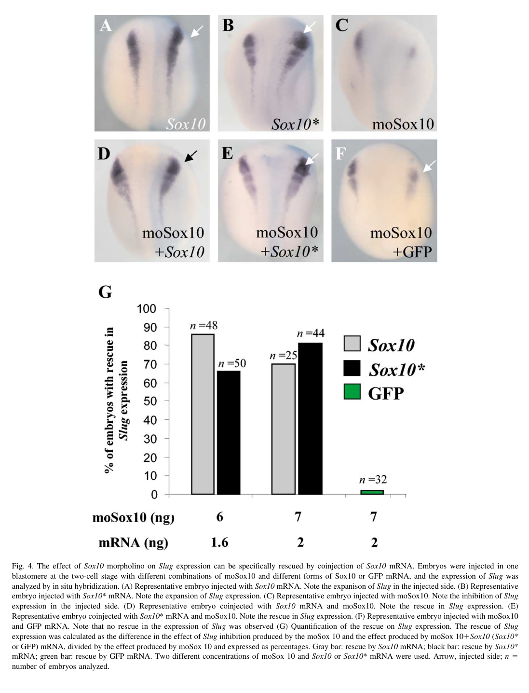

## Question

# Gene Research for Functional Annotation

## ⚠️ CRITICAL: Gene/Protein Identification Context

**BEFORE YOU BEGIN RESEARCH:** You MUST verify you are researching the CORRECT gene/protein. Gene symbols can be ambiguous, especially for less well-characterized genes from non-model organisms.

### Target Gene/Protein Identity (from UniProt):
- **UniProt Accession:** Q8AXX8
- **Protein Description:** RecName: Full=Transcription factor Sox-10 {ECO:0000312|EMBL:AAN62483.1}; AltName: Full=SRY (sex determining region Y)-box 10;
- **Gene Information:** Name=sox10;
- **Organism (full):** Xenopus laevis (African clawed frog).
- **Protein Family:** Not specified in UniProt
- **Key Domains:** HMG_box_dom. (IPR009071); HMG_box_dom_sf. (IPR036910); Sox_N. (IPR022151); SOX_TF. (IPR050917); HMG_box (PF00505)

### MANDATORY VERIFICATION STEPS:

1. **Check if the gene symbol "sox10" matches the protein description above**
2. **Verify the organism is correct:** Xenopus laevis (African clawed frog).
3. **Check if protein family/domains align with what you find in literature**
4. **If you find literature for a DIFFERENT gene with the same or similar symbol, STOP**

### If Gene Symbol is Ambiguous or You Cannot Find Relevant Literature:

**DO NOT PROCEED WITH RESEARCH ON A DIFFERENT GENE.** Instead:
- State clearly: "The gene symbol 'sox10' is ambiguous or literature is limited for this specific protein"
- Explain what you found (e.g., "Found extensive literature on a different gene with the same symbol in a different organism")
- Describe the protein based ONLY on the UniProt information provided above
- Suggest that the protein function can be inferred from domain/family information

### Research Target:

Please provide a comprehensive research report on the gene **sox10** (gene ID: sox10, UniProt: Q8AXX8) in XENLA.

The research report should be a detailed narrative explaining the function, biological processes, and localization of the gene product. Citations should be given for all claims.

You should prioritize authoritative reviews and primary scientific literature when conducting research. You can supplement
this with annotations you find in gene/protein databases, but these can be outdated or inaccurate.

We are specifically interested in the primary function of the gene - for enzymes, what reaction is catalyzed, and what is the substrate specificity? For transporters, what is the substrate? For structural proteins or adapters, what is the broader structural role? For signaling molecules, what is the role in the pathway.

We are interested in where in or outside the cell the gene product carries out its function.

We are also interested in the signaling or biochemical pathways in which the gene functions. We are less interested in broad pleiotropic effects, except where these elucidate the precise role.

Include evidence where possible. We are interested in both experimental evidence as well as inference from structure, evolution, or bioinformatic analysis. Precise studies should be prioritized over high-throughput, where available.

## Output

Question: You are an expert researcher providing comprehensive, well-cited information.

Provide detailed information focusing on:
1. Key concepts and definitions with current understanding
2. Recent developments and latest research (prioritize 2023-2024 sources)
3. Current applications and real-world implementations
4. Expert opinions and analysis from authoritative sources
5. Relevant statistics and data from recent studies

Format as a comprehensive research report with proper citations. Include URLs and publication dates where available.
Always prioritize recent, authoritative sources and provide specific citations for all major claims.

# Gene Research for Functional Annotation

## ⚠️ CRITICAL: Gene/Protein Identification Context

**BEFORE YOU BEGIN RESEARCH:** You MUST verify you are researching the CORRECT gene/protein. Gene symbols can be ambiguous, especially for less well-characterized genes from non-model organisms.

### Target Gene/Protein Identity (from UniProt):
- **UniProt Accession:** Q8AXX8
- **Protein Description:** RecName: Full=Transcription factor Sox-10 {ECO:0000312|EMBL:AAN62483.1}; AltName: Full=SRY (sex determining region Y)-box 10;
- **Gene Information:** Name=sox10;
- **Organism (full):** Xenopus laevis (African clawed frog).
- **Protein Family:** Not specified in UniProt
- **Key Domains:** HMG_box_dom. (IPR009071); HMG_box_dom_sf. (IPR036910); Sox_N. (IPR022151); SOX_TF. (IPR050917); HMG_box (PF00505)

### MANDATORY VERIFICATION STEPS:

1. **Check if the gene symbol "sox10" matches the protein description above**
2. **Verify the organism is correct:** Xenopus laevis (African clawed frog).
3. **Check if protein family/domains align with what you find in literature**
4. **If you find literature for a DIFFERENT gene with the same or similar symbol, STOP**

### If Gene Symbol is Ambiguous or You Cannot Find Relevant Literature:

**DO NOT PROCEED WITH RESEARCH ON A DIFFERENT GENE.** Instead:
- State clearly: "The gene symbol 'sox10' is ambiguous or literature is limited for this specific protein"
- Explain what you found (e.g., "Found extensive literature on a different gene with the same symbol in a different organism")
- Describe the protein based ONLY on the UniProt information provided above
- Suggest that the protein function can be inferred from domain/family information

### Research Target:

Please provide a comprehensive research report on the gene **sox10** (gene ID: sox10, UniProt: Q8AXX8) in XENLA.

The research report should be a detailed narrative explaining the function, biological processes, and localization of the gene product. Citations should be given for all claims.

You should prioritize authoritative reviews and primary scientific literature when conducting research. You can supplement
this with annotations you find in gene/protein databases, but these can be outdated or inaccurate.

We are specifically interested in the primary function of the gene - for enzymes, what reaction is catalyzed, and what is the substrate specificity? For transporters, what is the substrate? For structural proteins or adapters, what is the broader structural role? For signaling molecules, what is the role in the pathway.

We are interested in where in or outside the cell the gene product carries out its function.

We are also interested in the signaling or biochemical pathways in which the gene functions. We are less interested in broad pleiotropic effects, except where these elucidate the precise role.

Include evidence where possible. We are interested in both experimental evidence as well as inference from structure, evolution, or bioinformatic analysis. Precise studies should be prioritized over high-throughput, where available.

# Functional annotation report: *sox10* in *Xenopus laevis*

## Identity and primary function

The supplied UniProt accession [Q8AXX8](https://www.uniprot.org/uniprotkb/Q8AXX8/entry) identifies *Xenopus laevis* Sox10, not the similarly named Sox8 or Sox9 paralogs or a Sox10 protein from another species. A primary Xenopus study independently identified a 446-amino-acid Sox10 ortholog, classified it with the SoxE transcription factors, and predicted an HMG DNA-binding box at residues 98–166 and a C-terminal transactivation region at residues 358–446. Its reported amino-acid identity was 71% with mammalian SOX10 and 61% with zebrafish Sox10. This sequence and domain evidence agrees with the HMG-box, Sox_N and SOX-transcription-factor annotations supplied for Q8AXX8; it does not independently establish an accession-to-clone sequence match. (honore2003sox10isrequired pages 5-7)

**Primary annotation:** Sox10 is a sequence-specific, DNA-associated transcriptional regulator of neural-crest development. In frog embryos it is required both for establishment or maintenance of early neural-crest precursors and for development of melanogenic and peripheral-ganglion derivatives. It is **not** a pigment-synthesis enzyme, transporter or secreted signaling ligand: its relevant molecular activity is regulation of gene expression in cells responding to developmental signals. SOX-family HMG domains recognize related DNA motifs and bend DNA; SoxE proteins can bind cooperatively as DNA-dependent dimers. These molecular properties are well supported at the family level, whereas the cited Xenopus study inferred the frog protein’s DNA-binding and activation regions from sequence rather than directly assaying Q8AXX8 binding to a particular genomic site. (honore2003sox10isrequired pages 5-7, schock2020sortingsoxdiverse pages 1-3, honore2003sox10isrequired pages 1-4)

## Where and when it functions

Whole-mount in situ hybridization first localized *sox10* RNA to the prospective neural crest at approximately embryonic stages 12–12.5, with strong expression by stage 15. Expression subsequently occurs in premigratory neural folds, migrating cranial and trunk crest—including cranial migratory streams and developing melanocytes—and the prospective otic placode and later otic vesicle. These observations establish **the cells and tissues expressing the gene**, not the subcellular position of its protein. Its inferred functional compartment is the **nucleus**, where an HMG-box transcription factor binds regulatory DNA; direct visualization of endogenous Xenopus Sox10 nuclear localization was not established in the retrieved primary study. Nuclear localization and DNA-binding competence have been examined for SOX10 in other systems, but should not be mistaken for a frog-specific localization assay. (honore2003sox10isrequired pages 5-7, honore2003sox10isrequired pages 7-9, schock2020sortingsoxdiverse pages 4-5)

## Experimental evidence for the developmental role

Honoré, Aybar and Mayor’s *Developmental Biology* study, published **August 2003**, used a translation-blocking *sox10* morpholino, control oligonucleotides, targeted injections and mRNA rescue in Xenopus embryos ([DOI: 10.1016/S0012-1606(03)00247-1](https://doi.org/10.1016/S0012-1606(03)00247-1)). On the injected side, reduced expression occurred for the early neural-crest markers **Slug/Snai2 in 38% of embryos** (*n*=56), **FoxD3 in 35%** (*n*=42) and **Sox9 in 33%** (*n*=38); the adjacent neural-plate marker Sox2 expanded in **48%** (*n*=38). Sox10 RNA reversed **60–86% of the morpholino-induced Slug inhibition** under tested conditions, and morpholino-resistant Sox10* RNA reversed **more than 68%**; unrelated GFP RNA did not rescue. The rescue experiments, including the relevant figure, substantially strengthen the assignment of this phenotype to Sox10 depletion rather than an unrelated morpholino effect. They do **not**, by themselves, prove direct binding of Sox10 to the *snai2*, *foxd3* or *sox9* loci. (honore2003sox10isrequired pages 7-9, honore2003sox10isrequired media 06e363f7)

The same study observed increased TUNEL staining in **33%** of injected embryos (*n*=31) and reduced phospho-histone-H3 staining in **55%** (*n*=25), consistent with reduced neural-fold cell survival and proliferation. At stage 38, **45%** of morphants (*n*=44) had fewer or nearly no visible melanocytes, compared with visible melanocytes in **100%** of controls (*n*=33). The authors noted that the later pigment phenotype was less penetrant than early marker loss and suggested waning morpholino action or developmental replacement as possible explanations. Thus, specification, survival and later differentiation probably overlap; their individual causal contributions cannot be completely resolved by these injections. (honore2003sox10isrequired pages 9-11)

An induced-neural-crest explant assay offers more specific evidence for a later lineage role. After Sox10 inhibition, early **Twist, Snail and *sox10* transcripts remained detectable**, whereas later **Mitf, c-kit and c-ret** markers did not. Retention of *sox10* RNA is compatible with a **translation-blocking** morpholino and is not evidence of preserved Sox10 protein. In a separate conjugate assay, pigmented melanocytes appeared in approximately **44% of controls** (*n*=9), but in **none of the Sox10-depleted conjugates** (*n*=7). These findings implicate Sox10 in progression toward melanogenic and peripheral-ganglion identities, although loss of a marker is not proof that Sox10 directly transcribes that marker’s gene. (honore2003sox10isrequired pages 9-11, honore2003sox10isrequired pages 11-13)

The independent Xenopus study by Aoki and colleagues, published **July 2003**, reported that Sox10 overexpression greatly expanded melanocyte precursors and induced the melanocyte marker **dct/trp2** in otherwise naïve ectoderm ([DOI: 10.1016/S0012-1606(03)00161-1](https://doi.org/10.1016/S0012-1606(03)00161-1)). This gain-of-function result supports an ability to initiate a pigment-lineage transcriptional program. Its full text was not available in the retrieved corpus; the specific finding here is supported by a subsequent specialist review, rather than independently verified from the original experimental report. (schock2020sortingsoxdiverse pages 6-7)

The following table separates frog-specific experiments from expression-only observations and mechanisms established principally in other vertebrates.

| Evidence system and date | Experiment or observation | Precise result | Inference / limitation |
|---|---|---|---|
| *Xenopus laevis*, Honoré et al., 2003 | Sequence and domain analysis | Predicted 446-aa protein; HMG DNA-binding box at residues 98–166; putative C-terminal transactivation domain at residues 358–446. Protein identity was 71% versus human, rat, and mouse SOX10 and 61% versus zebrafish Sox10. (honore2003sox10isrequired pages 5-7) | Verifies that the cloned frog protein is an orthologous SoxE-family transcription factor matching Q8AXX8. DNA binding and transactivation were inferred from sequence/domain conservation rather than tested biochemically in this study. |
| *X. laevis*, Honoré et al., 2003 | Sox10 morpholino loss of function and mRNA rescue | Neural-crest expression was reduced for **Slug/Snai2 in 38%** (*n*=56) and **FoxD3 in 35%** (*n*=42). Sox10 mRNA restored Slug by **60–86%**, and morpholino-resistant Sox10\* restored it by **>68%**; GFP did not rescue. Rescue was calculated as the fractional reversal of morpholino-induced inhibition. (honore2003sox10isrequired pages 7-9, honore2003sox10isrequired media 06e363f7) | Strong, specificity-controlled evidence that Sox10 is required for early neural-crest specification or maintenance. These assays do not establish that Slug or FoxD3 is a direct DNA-bound target. |
| *X. laevis*, Honoré et al., 2003 | TUNEL and phospho-histone-H3 assays after Sox10 depletion | Increased apoptosis occurred in **33%** of embryos (*n*=31), while reduced phospho-H3 staining occurred in **55%** (*n*=25). (honore2003sox10isrequired pages 11-13, honore2003sox10isrequired pages 9-11) | Supports roles in neural-fold cell survival and proliferation. The whole-embryo morpholino design cannot fully separate direct Sox10 effects from secondary consequences of failed neural-crest specification. |
| *X. laevis*, Honoré et al., 2003 | Stage-38 melanocyte phenotype | **45%** of Sox10-morphant embryos had reduced or nearly absent melanocytes (*n*=44), whereas melanocytes were present in **100%** of controls (*n*=33). (honore2003sox10isrequired pages 9-11) | Direct developmental evidence that Sox10 activity is required for normal melanocyte production; incomplete penetrance may reflect waning morpholino activity or developmental compensation. |
| *X. laevis*, Honoré et al., 2003 | Noggin/Wnt5-induced neural-crest explants with Sox10 depletion | Early markers **Twist, Snail, and sox10 RNA** remained detectable, but late melanogenic/gangliogenic markers **mitf, c-kit, and c-ret** were absent. Control conjugates formed melanocytes in about **44%** of cases (*n*=9), whereas Sox10-depleted conjugates formed none (*n*=7). (honore2003sox10isrequired pages 14-15, honore2003sox10isrequired pages 9-11) | Indicates a later requirement for Sox10 in melanogenic and peripheral-ganglion differentiation in addition to its early role. Continued sox10 transcript does not imply production of functional protein under translation-blocking morpholino treatment. |
| *X. laevis*, Honoré et al., 2003 | Perturbation of upstream signaling and transcription factors | FGF-receptor inhibition with SU5402 inhibited sox10 expression in **68%** (*n*=48); dominant-negative Wnt8 inhibited it in **38%** (*n*=40); Snail overexpression expanded the sox10 domain in **72%** (*n*=48). (honore2003sox10isrequired pages 11-13) | Places sox10 downstream of FGF/Wnt-dependent neural-crest induction and Snail activity. Changes in transcript domains do not prove direct binding of Snail or Wnt/FGF effectors to sox10 regulatory DNA. |
| *X. laevis*, Aoki et al., 2003; summarized by Schock and LaBonne, 2020 | Sox10 gain of function | Sox10 overexpression markedly expanded melanocyte precursors and induced **dct/trp2** expression in otherwise naïve ectoderm. (schock2020sortingsoxdiverse pages 6-7) | Demonstrates melanocyte-program-inducing capacity in frog ectoderm. The cited review supports the phenotype, but this summary alone does not establish direct Xenopus Sox10 occupancy of the dct promoter. |
| *X. laevis*, York et al., 2024 | Comparative transcriptomics of blastula and neural-crest cells | **sox10** was classified as neural-crest-enriched together with **zic3, pax3, and dlx5**; the analysis considered transcripts expressed at fewer than 10 TPM in animal-pole cells and significantly enriched in neural crest. (york2024sharedfeaturesof pages 4-6) | Current observational support for sox10 as a neural-crest-associated transcript. Sox10 was not functionally perturbed, and the supplied results do not report its gene-specific fold change or *P* value. |
| Amphibian and vertebrate systems, Alasaadi et al., 2024 | Hydrostatic-pressure, YAP, and Wnt experiments using Sox10 as a neural-crest readout | Increased pressure or cell packing reduced nuclear YAP and neural-crest competence; YAP and Wnt/β-catenin perturbations tested pathway causality, while Sox10 expression served as a neural-crest readout. (alasaadi2024competenceforneural pages 8-9, alasaadi2024competenceforneural pages 6-7) | Extends the upstream context of Sox10 expression to a pressure–YAP–Wnt mechanism. It is not a functional manipulation of Sox10 and does not show direct YAP binding to the sox10 locus. |
| Primarily mammalian and zebrafish evidence, reviewed 2006–2020 | Promoter/binding and transcriptional-regulation studies | SOX10 directly activates **MITF** and **DCT/TRP2** in the melanocyte network; **MPZ/P0** contains functional Sox10-binding elements, and **GJB1/CX32** is directly regulated through characterized SOX10-binding sites. (kelsh2006sortingoutsox10 pages 6-7, schock2020sortingsoxdiverse pages 7-9, schock2020sortingsoxdiverse pages 4-5) | Strong mechanistic ortholog evidence for lineage-specific targets, but it should not be presented as direct biochemical validation in *X. laevis*. Conservation makes analogous regulation plausible rather than proven for Q8AXX8. |

*Table: Evidence supporting the functional annotation of Xenopus laevis Sox10, with quantitative results and explicit limitations. Direct frog experiments are separated from observational findings and molecular mechanisms inferred from other vertebrates.*

## Regulatory pathways and plausible transcriptional targets

**Inputs to *sox10*.** In the 2003 Xenopus study, localized FGF-receptor inhibition with SU5402 reduced *sox10* expression in **68%** of embryos (*n*=48), and dominant-negative Wnt8 reduced it in **38%** (*n*=40). Snail gain of function expanded the *sox10*-positive domain in **72%** (*n*=48); dominant-negative Snail suppressed it in **68%** (*n*=39). Dominant-negative Slug also reduced *sox10*, but Slug overexpression did not appreciably induce it, and the authors cautioned that dominant-negative Slug can affect Snail. Their proposed hierarchy is therefore **FGF/Wnt-dependent induction → Snail-dependent *sox10* expression → neural-crest program including Slug**, not a demonstrated direct FGF, Wnt or Snail interaction with *sox10* regulatory DNA. (honore2003sox10isrequired pages 11-13, honore2003sox10isrequired pages 14-15)

**Melanocyte output.** The mechanistically best-characterized SOX10 target relationship across vertebrates is activation of **MITF**, a melanocyte-lineage regulator; SOX10 also participates in regulation of **DCT/TRP2** and other pigmentation genes, often cooperating with PAX3 or MITF. Promoter-binding and transcriptional evidence discussed in authoritative reviews comes substantially from mammalian cell systems and zebrafish, **not** direct occupancy measurements of Xenopus Q8AXX8. The frog explant result—loss of *mitf* expression after Sox10 inhibition—and the Aoki gain-of-function phenotype are consistent with conservation of this circuit, but cannot alone show that Xenopus Sox10 directly binds the frog *mitf* or *dct* regulatory regions. (kelsh2006sortingoutsox10 pages 6-7, schock2020sortingsoxdiverse pages 7-9, honore2003sox10isrequired pages 9-11, schock2020sortingsoxdiverse pages 6-7)

**Glial and neural output: a cross-species qualification.** SOX10-dependent **ERBB3** expression provides a mechanism by which neural-crest progenitors can respond to neuregulin-associated glial cues; other-vertebrate promoter studies support regulation of the myelin gene **MPZ/P0** and **GJB1/CX32**. These observations help explain the broader SOX10 glial program, but they are not direct demonstrations that frog Q8AXX8 binds those loci. The particularly clear Xenopus late-lineage assay in the retrieved primary literature concerns **c-ret-positive peripheral-ganglion** and melanocyte markers, rather than a frog-specific Schwann-cell myelin transcription assay. Likewise, **Sox9**, although partially overlapping and capable of some compensation among SoxE factors, has a more prominent established chondrogenic role; its functions should not be assigned wholesale to Sox10. (kelsh2006sortingoutsox10 pages 6-7, kelsh2006sortingoutsox10 pages 7-9, honore2003sox10isrequired pages 9-11, schock2020sortingsoxdiverse pages 6-7, schock2020sortingsoxdiverse pages 4-5)

## Recent research and practical use

A comparative primary study published **July 2024**, York and colleagues, identified *sox10* among transcripts enriched in Xenopus neural-crest cells relative to blastula animal-pole cells ([*Nature Ecology & Evolution*, DOI: 10.1038/s41559-024-02476-8](https://doi.org/10.1038/s41559-024-02476-8)). This reinforces its value as a marker of the established neural-crest program. It is **expression evidence**, not a new Sox10 loss-of-function or biochemical assay; a gene-specific fold change for *sox10* was not provided in the retrieved passage. (york2024sharedfeaturesof pages 4-6)

In a study published **March 2024**, Alasaadi and colleagues showed that hydrostatic pressure can lower nuclear YAP activity and impair Wnt-dependent competence for neural-crest induction across experimental systems ([*Nature Cell Biology*, DOI: 10.1038/s41556-024-01378-y](https://doi.org/10.1038/s41556-024-01378-y)). Sox10 was among the neural-crest expression readouts, while causal manipulations concerned pressure, YAP and Wnt signaling. This extends the **upstream context** in which *sox10* is expressed; it does not demonstrate that SOX10 mediates the pressure response or that YAP directly binds the *sox10* locus. (alasaadi2024competenceforneural pages 8-9, alasaadi2024competenceforneural pages 6-7)

A concrete research implementation is the Xenopus ***sox10*:GFP reporter**, in which upstream *sox10* regulatory sequences drive GFP to visualize neural-crest-associated expression. For example, a **2018** study of the formin Daam1 used this reporter to assess changes in the neural-crest program ([DOI: 10.1002/dvg.23108](https://doi.org/10.1002/dvg.23108)). Reporter fluorescence measures regulatory activity and is useful for developmental imaging; it does not establish endogenous Sox10 protein abundance or direct SOX10 action on the tested downstream genes. (ossipova2018regulationofneural pages 1-3)

**Evidence-weighted conclusion.** The strongest annotation for *X. laevis* Q8AXX8 is an **HMG-box/SoxE transcription factor acting intracellularly, most plausibly in the nucleus, to sustain early neural-crest development and enable melanocyte and peripheral-ganglion differentiation**. FGF, Wnt and Snail regulate its embryonic expression. Conservation and other-vertebrate biochemical studies make direct MITF-centered melanocyte regulation and glial transcriptional functions plausible, but their precise DNA targets, biochemical binding specificity and endogenous protein localization remain less directly established for this particular frog protein than its developmental phenotype. (honore2003sox10isrequired pages 5-7, honore2003sox10isrequired pages 7-9, honore2003sox10isrequired pages 9-11, honore2003sox10isrequired pages 11-13, kelsh2006sortingoutsox10 pages 6-7)

References

1. (honore2003sox10isrequired pages 5-7): Stella M Honoré, Manuel J Aybar, and Roberto Mayor. Sox10 is required for the early development of the prospective neural crest in xenopus embryos. Developmental biology, 260 1:79-96, Aug 2003. URL: https://doi.org/10.1016/s0012-1606(03)00247-1, doi:10.1016/s0012-1606(03)00247-1. This article has 297 citations and is from a peer-reviewed journal.

2. (schock2020sortingsoxdiverse pages 1-3): Elizabeth N. Schock and Carole LaBonne. Sorting sox: diverse roles for sox transcription factors during neural crest and craniofacial development. Frontiers in Physiology, Dec 2020. URL: https://doi.org/10.3389/fphys.2020.606889, doi:10.3389/fphys.2020.606889. This article has 87 citations.

3. (honore2003sox10isrequired pages 1-4): Stella M Honoré, Manuel J Aybar, and Roberto Mayor. Sox10 is required for the early development of the prospective neural crest in xenopus embryos. Developmental biology, 260 1:79-96, Aug 2003. URL: https://doi.org/10.1016/s0012-1606(03)00247-1, doi:10.1016/s0012-1606(03)00247-1. This article has 297 citations and is from a peer-reviewed journal.

4. (honore2003sox10isrequired pages 7-9): Stella M Honoré, Manuel J Aybar, and Roberto Mayor. Sox10 is required for the early development of the prospective neural crest in xenopus embryos. Developmental biology, 260 1:79-96, Aug 2003. URL: https://doi.org/10.1016/s0012-1606(03)00247-1, doi:10.1016/s0012-1606(03)00247-1. This article has 297 citations and is from a peer-reviewed journal.

5. (schock2020sortingsoxdiverse pages 4-5): Elizabeth N. Schock and Carole LaBonne. Sorting sox: diverse roles for sox transcription factors during neural crest and craniofacial development. Frontiers in Physiology, Dec 2020. URL: https://doi.org/10.3389/fphys.2020.606889, doi:10.3389/fphys.2020.606889. This article has 87 citations.

6. (honore2003sox10isrequired media 06e363f7): Stella M Honoré, Manuel J Aybar, and Roberto Mayor. Sox10 is required for the early development of the prospective neural crest in xenopus embryos. Developmental biology, 260 1:79-96, Aug 2003. URL: https://doi.org/10.1016/s0012-1606(03)00247-1, doi:10.1016/s0012-1606(03)00247-1. This article has 297 citations and is from a peer-reviewed journal.

7. (honore2003sox10isrequired pages 9-11): Stella M Honoré, Manuel J Aybar, and Roberto Mayor. Sox10 is required for the early development of the prospective neural crest in xenopus embryos. Developmental biology, 260 1:79-96, Aug 2003. URL: https://doi.org/10.1016/s0012-1606(03)00247-1, doi:10.1016/s0012-1606(03)00247-1. This article has 297 citations and is from a peer-reviewed journal.

8. (honore2003sox10isrequired pages 11-13): Stella M Honoré, Manuel J Aybar, and Roberto Mayor. Sox10 is required for the early development of the prospective neural crest in xenopus embryos. Developmental biology, 260 1:79-96, Aug 2003. URL: https://doi.org/10.1016/s0012-1606(03)00247-1, doi:10.1016/s0012-1606(03)00247-1. This article has 297 citations and is from a peer-reviewed journal.

9. (schock2020sortingsoxdiverse pages 6-7): Elizabeth N. Schock and Carole LaBonne. Sorting sox: diverse roles for sox transcription factors during neural crest and craniofacial development. Frontiers in Physiology, Dec 2020. URL: https://doi.org/10.3389/fphys.2020.606889, doi:10.3389/fphys.2020.606889. This article has 87 citations.

10. (honore2003sox10isrequired pages 14-15): Stella M Honoré, Manuel J Aybar, and Roberto Mayor. Sox10 is required for the early development of the prospective neural crest in xenopus embryos. Developmental biology, 260 1:79-96, Aug 2003. URL: https://doi.org/10.1016/s0012-1606(03)00247-1, doi:10.1016/s0012-1606(03)00247-1. This article has 297 citations and is from a peer-reviewed journal.

11. (york2024sharedfeaturesof pages 4-6): Joshua R. York, Anjali Rao, Paul B. Huber, Elizabeth N. Schock, Andrew Montequin, Sara Rigney, and Carole LaBonne. Shared features of blastula and neural crest stem cells evolved at the base of vertebrates. Nature ecology & evolution, 8:1680-1692, Jul 2024. URL: https://doi.org/10.1038/s41559-024-02476-8, doi:10.1038/s41559-024-02476-8. This article has 15 citations and is from a highest quality peer-reviewed journal.

12. (alasaadi2024competenceforneural pages 8-9): Delan N Alasaadi, Lucas Alvizi, Jonas Hartmann, Namid R Stillman, Prachiti Moghe, Takashi Hiiragi, and Roberto Mayor. Competence for neural crest induction is controlled by hydrostatic pressure through yap. Nature Cell Biology, 26:530-541, Mar 2024. URL: https://doi.org/10.1038/s41556-024-01378-y, doi:10.1038/s41556-024-01378-y. This article has 39 citations and is from a highest quality peer-reviewed journal.

13. (alasaadi2024competenceforneural pages 6-7): Delan N Alasaadi, Lucas Alvizi, Jonas Hartmann, Namid R Stillman, Prachiti Moghe, Takashi Hiiragi, and Roberto Mayor. Competence for neural crest induction is controlled by hydrostatic pressure through yap. Nature Cell Biology, 26:530-541, Mar 2024. URL: https://doi.org/10.1038/s41556-024-01378-y, doi:10.1038/s41556-024-01378-y. This article has 39 citations and is from a highest quality peer-reviewed journal.

14. (kelsh2006sortingoutsox10 pages 6-7): Robert N. Kelsh. Sorting out sox10 functions in neural crest development. BioEssays, 28:788-798, Aug 2006. URL: https://doi.org/10.1002/bies.20445, doi:10.1002/bies.20445. This article has 352 citations and is from a peer-reviewed journal.

15. (schock2020sortingsoxdiverse pages 7-9): Elizabeth N. Schock and Carole LaBonne. Sorting sox: diverse roles for sox transcription factors during neural crest and craniofacial development. Frontiers in Physiology, Dec 2020. URL: https://doi.org/10.3389/fphys.2020.606889, doi:10.3389/fphys.2020.606889. This article has 87 citations.

16. (kelsh2006sortingoutsox10 pages 7-9): Robert N. Kelsh. Sorting out sox10 functions in neural crest development. BioEssays, 28:788-798, Aug 2006. URL: https://doi.org/10.1002/bies.20445, doi:10.1002/bies.20445. This article has 352 citations and is from a peer-reviewed journal.

17. (ossipova2018regulationofneural pages 1-3): Olga Ossipova, Ryan Kerney, Jean‐Pierre Saint‐Jeannet, and Sergei Y. Sokol. Regulation of neural crest development by the formin family protein daam1. genesis, Apr 2018. URL: https://doi.org/10.1002/dvg.23108, doi:10.1002/dvg.23108. This article has 17 citations and is from a peer-reviewed journal.

## Artifacts

- [Edison artifact artifact-00](sox10-deep-research-falcon_artifacts/artifact-00.md)

## Citations

1. schock2020sortingsoxdiverse pages 6-7
2. york2024sharedfeaturesof pages 4-6
3. ossipova2018regulationofneural pages 1-3
4. schock2020sortingsoxdiverse pages 1-3
5. schock2020sortingsoxdiverse pages 4-5
6. alasaadi2024competenceforneural pages 8-9
7. alasaadi2024competenceforneural pages 6-7
8. schock2020sortingsoxdiverse pages 7-9
9. Q8AXX8
10. DOI: 10.1016/S0012-1606(03)00247-1
11. DOI: 10.1016/S0012-1606(03)00161-1
12. *Nature Ecology & Evolution*, DOI: 10.1038/s41559-024-02476-8
13. *Nature Cell Biology*, DOI: 10.1038/s41556-024-01378-y
14. DOI: 10.1002/dvg.23108
15. https://www.uniprot.org/uniprotkb/Q8AXX8/entry
16. https://doi.org/10.1016/S0012-1606(03
17. https://doi.org/10.1038/s41559-024-02476-8
18. https://doi.org/10.1038/s41556-024-01378-y
19. https://doi.org/10.1002/dvg.23108
20. https://doi.org/10.1016/s0012-1606(03
21. https://doi.org/10.3389/fphys.2020.606889,
22. https://doi.org/10.1038/s41559-024-02476-8,
23. https://doi.org/10.1038/s41556-024-01378-y,
24. https://doi.org/10.1002/bies.20445,
25. https://doi.org/10.1002/dvg.23108,