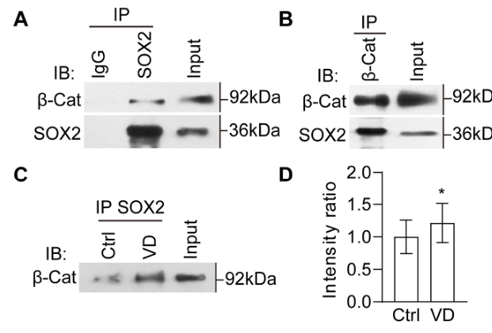

## Question

# Gene Research for Functional Annotation

## ⚠️ CRITICAL: Gene/Protein Identification Context

**BEFORE YOU BEGIN RESEARCH:** You MUST verify you are researching the CORRECT gene/protein. Gene symbols can be ambiguous, especially for less well-characterized genes from non-model organisms.

### Target Gene/Protein Identity (from UniProt):
- **UniProt Accession:** O42569
- **Protein Description:** RecName: Full=Transcription factor Sox-2; Short=XSox2; Short=XlSox-2; AltName: Full=SRY (sex determining region Y)-box 2;
- **Gene Information:** Name=sox2;
- **Organism (full):** Xenopus laevis (African clawed frog).
- **Protein Family:** Not specified in UniProt
- **Key Domains:** HMG_box_dom. (IPR009071); HMG_box_dom_sf. (IPR036910); SOX_fam. (IPR022097); SRY-related_HMG-box_TF-like. (IPR050140); HMG_box (PF00505)

### MANDATORY VERIFICATION STEPS:

1. **Check if the gene symbol "sox2" matches the protein description above**
2. **Verify the organism is correct:** Xenopus laevis (African clawed frog).
3. **Check if protein family/domains align with what you find in literature**
4. **If you find literature for a DIFFERENT gene with the same or similar symbol, STOP**

### If Gene Symbol is Ambiguous or You Cannot Find Relevant Literature:

**DO NOT PROCEED WITH RESEARCH ON A DIFFERENT GENE.** Instead:
- State clearly: "The gene symbol 'sox2' is ambiguous or literature is limited for this specific protein"
- Explain what you found (e.g., "Found extensive literature on a different gene with the same symbol in a different organism")
- Describe the protein based ONLY on the UniProt information provided above
- Suggest that the protein function can be inferred from domain/family information

### Research Target:

Please provide a comprehensive research report on the gene **sox2** (gene ID: sox2, UniProt: O42569) in XENLA.

The research report should be a detailed narrative explaining the function, biological processes, and localization of the gene product. Citations should be given for all claims.

You should prioritize authoritative reviews and primary scientific literature when conducting research. You can supplement
this with annotations you find in gene/protein databases, but these can be outdated or inaccurate.

We are specifically interested in the primary function of the gene - for enzymes, what reaction is catalyzed, and what is the substrate specificity? For transporters, what is the substrate? For structural proteins or adapters, what is the broader structural role? For signaling molecules, what is the role in the pathway.

We are interested in where in or outside the cell the gene product carries out its function.

We are also interested in the signaling or biochemical pathways in which the gene functions. We are less interested in broad pleiotropic effects, except where these elucidate the precise role.

Include evidence where possible. We are interested in both experimental evidence as well as inference from structure, evolution, or bioinformatic analysis. Precise studies should be prioritized over high-throughput, where available.

## Output

Question: You are an expert researcher providing comprehensive, well-cited information.

Provide detailed information focusing on:
1. Key concepts and definitions with current understanding
2. Recent developments and latest research (prioritize 2023-2024 sources)
3. Current applications and real-world implementations
4. Expert opinions and analysis from authoritative sources
5. Relevant statistics and data from recent studies

Format as a comprehensive research report with proper citations. Include URLs and publication dates where available.
Always prioritize recent, authoritative sources and provide specific citations for all major claims.

# Gene Research for Functional Annotation

## ⚠️ CRITICAL: Gene/Protein Identification Context

**BEFORE YOU BEGIN RESEARCH:** You MUST verify you are researching the CORRECT gene/protein. Gene symbols can be ambiguous, especially for less well-characterized genes from non-model organisms.

### Target Gene/Protein Identity (from UniProt):
- **UniProt Accession:** O42569
- **Protein Description:** RecName: Full=Transcription factor Sox-2; Short=XSox2; Short=XlSox-2; AltName: Full=SRY (sex determining region Y)-box 2;
- **Gene Information:** Name=sox2;
- **Organism (full):** Xenopus laevis (African clawed frog).
- **Protein Family:** Not specified in UniProt
- **Key Domains:** HMG_box_dom. (IPR009071); HMG_box_dom_sf. (IPR036910); SOX_fam. (IPR022097); SRY-related_HMG-box_TF-like. (IPR050140); HMG_box (PF00505)

### MANDATORY VERIFICATION STEPS:

1. **Check if the gene symbol "sox2" matches the protein description above**
2. **Verify the organism is correct:** Xenopus laevis (African clawed frog).
3. **Check if protein family/domains align with what you find in literature**
4. **If you find literature for a DIFFERENT gene with the same or similar symbol, STOP**

### If Gene Symbol is Ambiguous or You Cannot Find Relevant Literature:

**DO NOT PROCEED WITH RESEARCH ON A DIFFERENT GENE.** Instead:
- State clearly: "The gene symbol 'sox2' is ambiguous or literature is limited for this specific protein"
- Explain what you found (e.g., "Found extensive literature on a different gene with the same symbol in a different organism")
- Describe the protein based ONLY on the UniProt information provided above
- Suggest that the protein function can be inferred from domain/family information

### Research Target:

Please provide a comprehensive research report on the gene **sox2** (gene ID: sox2, UniProt: O42569) in XENLA.

The research report should be a detailed narrative explaining the function, biological processes, and localization of the gene product. Citations should be given for all claims.

You should prioritize authoritative reviews and primary scientific literature when conducting research. You can supplement
this with annotations you find in gene/protein databases, but these can be outdated or inaccurate.

We are specifically interested in the primary function of the gene - for enzymes, what reaction is catalyzed, and what is the substrate specificity? For transporters, what is the substrate? For structural proteins or adapters, what is the broader structural role? For signaling molecules, what is the role in the pathway.

We are interested in where in or outside the cell the gene product carries out its function.

We are also interested in the signaling or biochemical pathways in which the gene functions. We are less interested in broad pleiotropic effects, except where these elucidate the precise role.

Include evidence where possible. We are interested in both experimental evidence as well as inference from structure, evolution, or bioinformatic analysis. Precise studies should be prioritized over high-throughput, where available.

# Functional annotation report: *sox2* in *Xenopus laevis*

## Identity and principal function

**The target is the African clawed frog transcription factor Sox2**, also called XSox2 or XlSox-2; the accession supplied for this report is [UniProt O42569](https://www.uniprot.org/uniprotkb/O42569/entry). The gene symbol, organism and supplied HMG-box/SOX-domain annotations agree with experimental literature identifying frog Sox2 as a member of the **SoxB1 group**, alongside the distinct proteins Sox1 and Sox3. Results obtained by perturbing Sox3 alone, or by studying mouse SOX2, should not be assigned to O42569. Most frog studies identify *sox2* or Sox2 without establishing that an assay discriminates every closely related SoxB1 protein or *X. laevis* homeolog. (buitragodelgado2018atransitionfrom pages 1-6, rogers2009xenopussox3activates pages 2-3, agathocleous2009adirectionalwntβcateninsox2proneural pages 1-2)

Sox2’s primary function is **intracellular regulation of transcriptional programs governing neural competence and cell-state transitions**. It is not an enzyme, transporter or extracellular signal. The conserved SOX high-mobility-group domain recognizes A/T-rich DNA motifs—commonly represented for SOX proteins as **5′-WWCAAW-3′**, where W is A or T—and bends DNA; the motif describes family-level binding preference, **not** a binding site experimentally established for purified O42569. The effect on transcription depends on developmental context and regulatory partners. In *X. laevis*, nuclear Sox2 immunoreactivity has been documented in spinal-cord ependymal cells, while experimental nuclear translocation of a dominant-negative Sox2 construct has been used to inhibit its function. Its operative compartment is therefore the **nucleus of expressing cells**, rather than the extracellular space. (marelli2024sumodependenttranscriptionalrepression pages 1-2, gaete2012spinalcordregeneration pages 1-2, munoz2015regenerationofxenopus pages 10-12)

The principal *X. laevis* contexts and the strength of their evidence are summarized here. The distinctions between functional perturbation, expression markers and proposed—not demonstrated—direct transcriptional targets are important. (munoz2015regenerationofxenopus pages 10-12, gao2023βcateninandsox2 pages 9-12, hack2024temporaltranscriptomicprofiling pages 2-5)

| Context | Experimentally supported SOX2 role | Principal method and quantitative evidence | Caution |
|---|---|---|---|
| Embryonic neural induction (2009) | BMP inhibition induces *sox2* through FGF4/FGFR signaling; Sox3 activates *sox2*, whereas inducible Sox2 activates *geminin* without detectable need for new protein synthesis. | Smad5 inhibition, FGF4 morpholino, FGFR inhibitor/dominant-negative receptor, bFGF rescue, animal-cap assays, inducible Sox–glucocorticoid-receptor constructs and cycloheximide. [Marchal et al., 2009](https://doi.org/10.1073/pnas.0906352106); [Rogers et al., 2009](https://doi.org/10.1016/j.mod.2008.10.005) (marchal2009bmpinhibitioninitiates pages 1-2, marchal2009bmpinhibitioninitiates pages 2-3, rogers2009xenopussox3activates pages 3-5) | FGF4→*sox2* is an upstream expression relationship. Cycloheximide resistance makes *geminin* an immediate Sox2-responsive candidate, but promoter occupancy or direct HMG-box binding was not demonstrated. Sox3 results must not be attributed to Sox2. |
| Developing retina (2005–2009) | Frizzled-5/canonical Wnt maintains Sox2, which confers neural competence and permits proneural/neurogenic gene expression. Sox2 and Wnt also restrain terminal differentiation through Notch; a separate Wnt proliferative branch is Sox2-independent. | Xfz5 inhibition reduced optic-vesicle Sox2 in **70% of embryos (n=92)**. Sox2 knockdown reduced retinal clone size by **58%** and inhibited *Xash3* in **82% (n=55)** and *Xdelta-1* in **85% (n=71)**; Sox2 RNA partially rescued Xfz5 knockdown. Activated Wnt increased BrdU-positive cells about fivefold, and this persisted with dominant-negative Sox2. [Van Raay et al., 2005](https://doi.org/10.1016/j.neuron.2005.02.023); [Agathocleous et al., 2009](https://doi.org/10.1242/dev.040451) (agathocleous2009adirectionalwntβcateninsox2proneural pages 1-2, agathocleous2009adirectionalwntβcateninsox2proneural pages 4-6, raay2005frizzled5signaling pages 5-6, agathocleous2009adirectionalwntβcateninsox2proneural pages 6-7) | Genetic epistasis supports pathway order, not direct Sox2 binding to proneural or Notch genes. Sox2 alone did **not** stimulate retinal proliferation; it instead inhibited neuronal differentiation and favored Müller glial differentiation. |
| Spinal-cord regeneration (2012–2015) | Injury activates ventricular Sox2/3-positive neural progenitors. Sox2 activity is required for functional swimming recovery and axonal regrowth after transection. | BrdU labeling, two-photon lineage imaging, spinal electroporation of Sox2 morpholino, Western blotting and inducible dominant-negative Sox2. At regenerative stage 50, almost **50%** of Sox2/3-positive cells incorporated BrdU at 2 days post-transection, falling to **<10%** at 6 days; Sox2 knockdown prevented significant swimming recovery and axons failed to cross the lesion at 15 days. [Gaete et al., 2012](https://doi.org/10.1186/1749-8104-7-13); [Muñoz et al., 2015](https://doi.org/10.1016/j.ydbio.2015.03.009) (munoz2015regenerationofxenopus pages 5-8, munoz2015regenerationofxenopus pages 8-10, munoz2015regenerationofxenopus pages 10-12, gaete2012spinalcordregeneration pages 1-2) | The antibody and Sox3-promoter lineage reporter identify overlapping Sox2/3 populations. The principal morpholino was designed to favor Sox2, but SoxB1 redundancy and possible dominant-negative effects on related Sox proteins limit absolute paralog specificity. |
| Developing thalamus (2023) | Endogenous SOX2 physically associates with β-catenin; reciprocal knockdowns reduced the partner protein, supporting cross-regulation. SOX2 marks predominantly differentiated thalamic neurons in this context, not only stem/progenitor cells. | Reciprocal co-immunoprecipitation from *X. laevis* brain, SOX2- and β-catenin-targeting morpholinos, immunostaining and visual deprivation. SOX2-positive cells rose from approximately **25.3%** of thalamic cells at stage 40 to **32.1%** at stages 46–49; many coexpressed HuC/D or tubulin rather than PCNA, BLBP or vimentin. [Gao et al., 2023](https://doi.org/10.3390/ijms241713593) (gao2023βcateninandsox2 pages 13-15, gao2023βcateninandsox2 pages 2-4, gao2023βcateninandsox2 pages 9-12, gao2023βcateninandsox2 media 3f5cd380) | Co-immunoprecipitation establishes association, not direct DNA targeting or the stoichiometry of a transcriptional complex. The proposed self-reinforcing SOX2–β-catenin loop remains a mechanistic model. |
| Developing eye transcriptome (2024) | *sox2* is part of the expressed retinal-progenitor/developmental and regeneration-associated program across eye development. | Bulk RNA-seq of whole *X. laevis* eyes at stages 24, 27 and 35. The filtered dataset contained **17,693 transcripts**, with **1,126** differentially expressed genes between stages 27 and 24 and **8,403** between stages 35 and 27. [Hack et al., 2024](https://doi.org/10.3390/cells13161390) (hack2024temporaltranscriptomicprofiling pages 1-2, hack2024temporaltranscriptomicprofiling pages 2-5) | This is expression/resource evidence only: Sox2 was not functionally perturbed, cell-type resolution is absent, and no direct Sox2 target was established. The 2024 SUMO–Sox2 study used human neural stem cells and is not evidence for frog O42569 (marelli2024sumodependenttranscriptionalrepression pages 2-3). |

*Table: Species-specific evidence for Xenopus laevis SOX2/XSox2 (UniProt O42569), separating causal perturbation and protein-interaction results from expression-only observations. Caveats prevent conflating Sox2 with Sox3, direct targets with pathway epistasis, or human-cell findings with frog biology.*

## Developmental functions and pathways

### Neural ectoderm: acquisition of competence

Embryonic Sox2 expression is associated with prospective neuroectoderm and the neural plate. In a *X. laevis* neural-induction experiment, inhibiting BMP/Smad5 signaling induced *sox2*, whereas blockade of FGF receptors or depletion of FGF4 prevented this induction; adding bFGF restored *sox2* expression in FGF4-depleted embryos. This establishes a context-dependent **BMP inhibition → FGF signaling → *sox2* expression** relationship, not direct binding of an FGF-pathway protein to the *sox2* gene. Separately, inducible Sox3 activated *sox2* without new protein synthesis: that is evidence about **Sox3 upstream of Sox2**, not evidence that Sox2 directly activates itself. (marchal2009bmpinhibitioninitiates pages 1-2, marchal2009bmpinhibitioninitiates pages 2-3, rogers2009xenopussox3activates pages 3-5)

Sox2 is more than a passive neural marker, but its expression alone does **not** prove irreversible neural commitment. Experimental analysis found that part of an early *sox2*-positive neural-plate domain depends on FGF and can still adopt epidermal fate without organizer signals. Xenopus gain-of-function experiments expanded early neural-marker domains following *sox2* expression, and inducible Sox2 activated the neural-progenitor-associated gene *geminin* even when protein synthesis was inhibited. The latter makes *geminin* an **immediate Sox2-responsive candidate**; it does not, by itself, establish Sox2 occupancy of a *geminin* enhancer. Sox2 activity at the neural-plate border can also suppress the neural-crest markers *foxd3* and *snail2*, illustrating how its effect depends on the cell state and developmental stage. (wills2010bmpantagonistsand pages 1-2, rogers2009xenopussox3activates pages 3-5, buitragodelgado2018atransitionfrom pages 6-9)

### Retina: Wnt input, neural competence and differentiation control

The clearest pathway-level functional evidence is in the developing *X. laevis* retina. Frizzled-5-dependent canonical **Wnt/β-catenin signaling maintains Sox2 expression** in retinal progenitors; Sox2, in turn, enables expression of proneural/neurogenic genes and competence for neural differentiation. Inhibiting Frizzled-5 reduced optic-vesicle *sox2* expression in **70% of embryos (n = 92)**. Sox2 inhibition reduced retinal clone size by **58%** and inhibited *Xash3* and *Xdelta-1* expression in **82% (n = 55)** and **85% (n = 71)** of embryos, respectively. Sox2 RNA partially rescued the smaller-eye phenotype caused by Frizzled-5 inhibition: the affected fraction fell from **73% to 35%**. These loss-of-function and rescue results support pathway order, **Frizzled-5/Wnt → Sox2 → neural competence**, but do not show that Sox2 binds the *Xash3* or *Xdelta-1* promoters. (raay2005frizzled5signaling pages 1-2, raay2005frizzled5signaling pages 5-6)

Subsequent experiments resolved an apparent paradox: Sox2 helps establish proneural potential yet can **restrain terminal neuronal differentiation**, in part through Notch-pathway activity, and favor Müller glial differentiation. Canonical Wnt also promotes retinal progenitor proliferation through a **separate, Sox2-independent branch**: activated Wnt produced approximately a fivefold increase in BrdU-positive retinal cells, whereas Sox2 overexpression alone did not; Wnt-driven proliferation persisted when Sox2 activity was blocked. Sox2 and Cyclin E1 together yielded **16.7 ± 1.8%** BrdU-positive neuroepithelial-like cells, compared with **6.5 ± 1.0%** for Cyclin E1 and **0.2 ± 0.2%** for Sox2 alone. The authors propose directional feedback in which Sox2 restrains Wnt signaling and proneural factors subsequently reduce Sox2, allowing differentiation. Thus, describing Sox2 alone as a general mitogen would misstate these retinal experiments. (agathocleous2009adirectionalwntβcateninsox2proneural pages 1-2, agathocleous2009adirectionalwntβcateninsox2proneural pages 4-6, agathocleous2009adirectionalwntβcateninsox2proneural pages 8-9, agathocleous2009adirectionalwntβcateninsox2proneural pages 6-7)

### Spinal cord: progenitor response and functional regeneration

In larval *X. laevis*, Sox2-positive cells reside in the spinal-cord ependymal/ventricular region and respond to injury. After transection in regenerative-stage animals, nearly **50% of Sox2/3-positive ventricular-zone cells incorporated BrdU at two days**, falling to **less than 10% at six days**; later-stage froglets showed a delayed, restricted response. Live imaging of cells labeled with a Sox3-promoter reporter showed proliferation, movement toward the lesion and neuronal progeny. Because that reporter and some antibody measurements identify **overlapping Sox2/Sox3-positive populations**, they establish the behavior of the population more securely than Sox2-specific lineage tracing. (munoz2015regenerationofxenopus pages 5-8, munoz2015regenerationofxenopus pages 8-10)

There is also **causal Sox2 evidence**. Electroporation of a Sox2-targeting morpholino into larval spinal-cord cells reduced Sox2 protein; unlike controls, injured animals failed to recover significant swimming ability, and labeled axons did not cross the lesion at the **15-day** examination. Independently, inducible dominant-negative Sox2 delayed functional and axonal recovery. Earlier tail-amputation experiments likewise found that dominant-negative Sox2 reduced spinal-cord-cell proliferation and impaired regeneration. These findings support a requirement for Sox2-associated activity in the regenerative neural-progenitor program, without identifying its direct transcriptional targets; dominant-negative constructs may also affect related SoxB1 activity. This is a **research-model application**, not an established treatment for human spinal injury. (munoz2015regenerationofxenopus pages 10-12, gaete2012spinalcordregeneration pages 1-2, gaete2012spinalcordregeneration pages 5-7)

## Recent research and current applications, 2023–2024

**Thalamic development, 2023.** Gao and colleagues explicitly used *X. laevis* tadpoles and found that approximately **25.3%** of thalamic cells were SOX2-positive at stage 40, rising to approximately **32.1%** at stages 46–49. Contrary to treating every SOX2-positive brain cell as a stem cell, **most SOX2-positive thalamic cells in this study had differentiated-neuron markers or morphology**. Two days of visual deprivation shifted the measured cell-state balance toward proliferation and away from differentiated neurons. SOX2 and β-catenin morpholinos reduced expression of the targeted proteins, with evidence of reciprocal changes; reciprocal co-immunoprecipitation demonstrated an endogenous SOX2–β-catenin association in frog brain. The interaction measured in thalamic tissue increased under visual deprivation. **Figure 8** documents the protein-association experiments; its results support association and a proposed regulatory loop, **not** a proven direct SOX2–β-catenin DNA-bound target complex or a named target gene. [Gao *et al.*, published 2 September 2023](https://doi.org/10.3390/ijms241713593). (gao2023βcateninandsox2 pages 1-2, gao2023βcateninandsox2 pages 13-15, gao2023βcateninandsox2 pages 2-4, gao2023βcateninandsox2 pages 9-12, gao2023βcateninandsox2 media 3f5cd380)

**Developing-eye resource, 2024.** Bulk sequencing of *X. laevis* eyes at stages **24, 27 and 35** detected *sox2* among development- and regeneration-associated transcripts. After filtering, the dataset comprised **17,693 transcripts**; the authors identified **1,126** differentially expressed genes between stages 24 and 27 and **8,403** between stages 27 and 35. It provides a resource for retinal-progenitor and eye-regrowth research, but **does not perturb Sox2 or identify its direct targets**. [Hack, Petereit and Tseng, published August 2024](https://doi.org/10.3390/cells13161390). A separate 2024 comparative study examined shared blastula/neural-crest stem-cell programs and used frog *sox2* expression as part of its pluripotency-associated evidence, rather than establishing a new Sox2-specific biochemical function. [York *et al.*, published July 2024](https://doi.org/10.1038/s41559-024-02476-8). (hack2024temporaltranscriptomicprofiling pages 1-2, hack2024temporaltranscriptomicprofiling pages 2-5, york2024sharedfeaturesof pages 1-3)

**Interpretive boundaries.** A [March 2024 study of SUMO-dependent SOX2 repression](https://doi.org/10.1371/journal.pone.0298818) performed its functional experiments in **human neural stem cells**, not *X. laevis*; its gene-repression mechanism should not be assigned to O42569 without frog-specific testing. Similarly, observed changes in *sox2* expression after BMP, FGF or Wnt manipulation are upstream regulatory evidence, not direct measurement of Sox2 DNA binding. The defensible functional annotation is therefore **a nuclear SoxB1/HMG transcriptional regulator of neural competence and context-dependent progenitor-to-neuron/glia transitions**, with particularly strong species-specific perturbation evidence in retina and regenerating spinal cord, and newer protein-interaction evidence in thalamus. (marelli2024sumodependenttranscriptionalrepression pages 2-3, marchal2009bmpinhibitioninitiates pages 1-2, raay2005frizzled5signaling pages 5-6, munoz2015regenerationofxenopus pages 10-12, gao2023βcateninandsox2 pages 9-12)

References

1. (buitragodelgado2018atransitionfrom pages 1-6): Elsy Buitrago-Delgado, Elizabeth N. Schock, Kara Nordin, and Carole LaBonne. A transition from soxb1 to soxe transcription factors is essential for progression from pluripotent blastula cells to neural crest cells. Jul 2018. URL: https://doi.org/10.1101/359752, doi:10.1101/359752. This article has 27 citations and is from a peer-reviewed journal.

2. (rogers2009xenopussox3activates pages 2-3): Crystal D. Rogers, Naoe Harafuji, Tenley Archer, Doreen D. Cunningham, and Elena S. Casey. Xenopus sox3 activates sox2 and geminin and indirectly represses xvent2 expression to induce neural progenitor formation at the expense of non-neural ectodermal derivatives. Mechanisms of Development, 126:42-55, Jan 2009. URL: https://doi.org/10.1016/j.mod.2008.10.005, doi:10.1016/j.mod.2008.10.005. This article has 111 citations.

3. (agathocleous2009adirectionalwntβcateninsox2proneural pages 1-2): Michalis Agathocleous, Ilina Iordanova, Minde I. Willardsen, Xiao Yan Xue, Monica L. Vetter, William A. Harris, and Kathryn B. Moore. A directional wnt/β-catenin-sox2-proneural pathway regulates the transition from proliferation to differentiation in the <i>xenopus</i> retina. Development, 136:3289-3299, Oct 2009. URL: https://doi.org/10.1242/dev.040451, doi:10.1242/dev.040451. This article has 145 citations and is from a domain leading peer-reviewed journal.

4. (marelli2024sumodependenttranscriptionalrepression pages 1-2): Elisa Marelli, Jaime Hughes, and Paul J. Scotting. Sumo-dependent transcriptional repression by sox2 inhibits the proliferation of neural stem cells. PLOS ONE, 19:e0298818, Mar 2024. URL: https://doi.org/10.1371/journal.pone.0298818, doi:10.1371/journal.pone.0298818. This article has 5 citations and is from a peer-reviewed journal.

5. (gaete2012spinalcordregeneration pages 1-2): Marcia Gaete, Rosana Muñoz, Natalia Sánchez, Ricardo Tampe, Mauricio Moreno, Esteban G Contreras, Dasfne Lee-Liu, and Juan Larraín. Spinal cord regeneration in xenopus tadpoles proceeds through activation of sox2-positive cells. Neural Development, Apr 2012. URL: https://doi.org/10.1186/1749-8104-7-13, doi:10.1186/1749-8104-7-13. This article has 131 citations and is from a peer-reviewed journal.

6. (munoz2015regenerationofxenopus pages 10-12): Rosana Muñoz, Gabriela Edwards-Faret, Mauricio Moreno, Nikole Zuñiga, Hollis Cline, and Juan Larraín. Regeneration of xenopus laevis spinal cord requires sox2/3 expressing cells. Developmental biology, 408 2:229-43, Dec 2015. URL: https://doi.org/10.1016/j.ydbio.2015.03.009, doi:10.1016/j.ydbio.2015.03.009. This article has 85 citations and is from a peer-reviewed journal.

7. (gao2023βcateninandsox2 pages 9-12): Juanmei Gao, Yufang Lu, Yuhao Luo, Xinyi Duan, Peiyao Chen, Xinyu Zhang, Xiaohua Wu, Mengsheng Qiu, and Wanhua Shen. Β-catenin and sox2 interaction regulate visual experience-dependent cell homeostasis in the developing xenopus thalamus. International Journal of Molecular Sciences, 24:13593, Sep 2023. URL: https://doi.org/10.3390/ijms241713593, doi:10.3390/ijms241713593. This article has 2 citations.

8. (hack2024temporaltranscriptomicprofiling pages 2-5): Samantha J. Hack, Juli Petereit, and Kelly Ai-Sun Tseng. Temporal transcriptomic profiling of the developing xenopus laevis eye. Cells, 13:1390, Aug 2024. URL: https://doi.org/10.3390/cells13161390, doi:10.3390/cells13161390. This article has 4 citations.

9. (marchal2009bmpinhibitioninitiates pages 1-2): Leslie Marchal, Guillaume Luxardi, Virginie Thomé, and Laurent Kodjabachian. Bmp inhibition initiates neural induction via fgf signaling and zic genes. Proceedings of the National Academy of Sciences, 106:17437-17442, Oct 2009. URL: https://doi.org/10.1073/pnas.0906352106, doi:10.1073/pnas.0906352106. This article has 159 citations and is from a highest quality peer-reviewed journal.

10. (marchal2009bmpinhibitioninitiates pages 2-3): Leslie Marchal, Guillaume Luxardi, Virginie Thomé, and Laurent Kodjabachian. Bmp inhibition initiates neural induction via fgf signaling and zic genes. Proceedings of the National Academy of Sciences, 106:17437-17442, Oct 2009. URL: https://doi.org/10.1073/pnas.0906352106, doi:10.1073/pnas.0906352106. This article has 159 citations and is from a highest quality peer-reviewed journal.

11. (rogers2009xenopussox3activates pages 3-5): Crystal D. Rogers, Naoe Harafuji, Tenley Archer, Doreen D. Cunningham, and Elena S. Casey. Xenopus sox3 activates sox2 and geminin and indirectly represses xvent2 expression to induce neural progenitor formation at the expense of non-neural ectodermal derivatives. Mechanisms of Development, 126:42-55, Jan 2009. URL: https://doi.org/10.1016/j.mod.2008.10.005, doi:10.1016/j.mod.2008.10.005. This article has 111 citations.

12. (agathocleous2009adirectionalwntβcateninsox2proneural pages 4-6): Michalis Agathocleous, Ilina Iordanova, Minde I. Willardsen, Xiao Yan Xue, Monica L. Vetter, William A. Harris, and Kathryn B. Moore. A directional wnt/β-catenin-sox2-proneural pathway regulates the transition from proliferation to differentiation in the <i>xenopus</i> retina. Development, 136:3289-3299, Oct 2009. URL: https://doi.org/10.1242/dev.040451, doi:10.1242/dev.040451. This article has 145 citations and is from a domain leading peer-reviewed journal.

13. (raay2005frizzled5signaling pages 5-6): Terence J. Van Raay, Kathryn B. Moore, Ilina Iordanova, Michael Steele, Milan Jamrich, William A. Harris, and Monica L. Vetter. Frizzled 5 signaling governs the neural potential of progenitors in the developing xenopus retina. Neuron, 46:23-36, Apr 2005. URL: https://doi.org/10.1016/j.neuron.2005.02.023, doi:10.1016/j.neuron.2005.02.023. This article has 228 citations and is from a highest quality peer-reviewed journal.

14. (agathocleous2009adirectionalwntβcateninsox2proneural pages 6-7): Michalis Agathocleous, Ilina Iordanova, Minde I. Willardsen, Xiao Yan Xue, Monica L. Vetter, William A. Harris, and Kathryn B. Moore. A directional wnt/β-catenin-sox2-proneural pathway regulates the transition from proliferation to differentiation in the <i>xenopus</i> retina. Development, 136:3289-3299, Oct 2009. URL: https://doi.org/10.1242/dev.040451, doi:10.1242/dev.040451. This article has 145 citations and is from a domain leading peer-reviewed journal.

15. (munoz2015regenerationofxenopus pages 5-8): Rosana Muñoz, Gabriela Edwards-Faret, Mauricio Moreno, Nikole Zuñiga, Hollis Cline, and Juan Larraín. Regeneration of xenopus laevis spinal cord requires sox2/3 expressing cells. Developmental biology, 408 2:229-43, Dec 2015. URL: https://doi.org/10.1016/j.ydbio.2015.03.009, doi:10.1016/j.ydbio.2015.03.009. This article has 85 citations and is from a peer-reviewed journal.

16. (munoz2015regenerationofxenopus pages 8-10): Rosana Muñoz, Gabriela Edwards-Faret, Mauricio Moreno, Nikole Zuñiga, Hollis Cline, and Juan Larraín. Regeneration of xenopus laevis spinal cord requires sox2/3 expressing cells. Developmental biology, 408 2:229-43, Dec 2015. URL: https://doi.org/10.1016/j.ydbio.2015.03.009, doi:10.1016/j.ydbio.2015.03.009. This article has 85 citations and is from a peer-reviewed journal.

17. (gao2023βcateninandsox2 pages 13-15): Juanmei Gao, Yufang Lu, Yuhao Luo, Xinyi Duan, Peiyao Chen, Xinyu Zhang, Xiaohua Wu, Mengsheng Qiu, and Wanhua Shen. Β-catenin and sox2 interaction regulate visual experience-dependent cell homeostasis in the developing xenopus thalamus. International Journal of Molecular Sciences, 24:13593, Sep 2023. URL: https://doi.org/10.3390/ijms241713593, doi:10.3390/ijms241713593. This article has 2 citations.

18. (gao2023βcateninandsox2 pages 2-4): Juanmei Gao, Yufang Lu, Yuhao Luo, Xinyi Duan, Peiyao Chen, Xinyu Zhang, Xiaohua Wu, Mengsheng Qiu, and Wanhua Shen. Β-catenin and sox2 interaction regulate visual experience-dependent cell homeostasis in the developing xenopus thalamus. International Journal of Molecular Sciences, 24:13593, Sep 2023. URL: https://doi.org/10.3390/ijms241713593, doi:10.3390/ijms241713593. This article has 2 citations.

19. (gao2023βcateninandsox2 media 3f5cd380): Juanmei Gao, Yufang Lu, Yuhao Luo, Xinyi Duan, Peiyao Chen, Xinyu Zhang, Xiaohua Wu, Mengsheng Qiu, and Wanhua Shen. Β-catenin and sox2 interaction regulate visual experience-dependent cell homeostasis in the developing xenopus thalamus. International Journal of Molecular Sciences, 24:13593, Sep 2023. URL: https://doi.org/10.3390/ijms241713593, doi:10.3390/ijms241713593. This article has 2 citations.

20. (hack2024temporaltranscriptomicprofiling pages 1-2): Samantha J. Hack, Juli Petereit, and Kelly Ai-Sun Tseng. Temporal transcriptomic profiling of the developing xenopus laevis eye. Cells, 13:1390, Aug 2024. URL: https://doi.org/10.3390/cells13161390, doi:10.3390/cells13161390. This article has 4 citations.

21. (marelli2024sumodependenttranscriptionalrepression pages 2-3): Elisa Marelli, Jaime Hughes, and Paul J. Scotting. Sumo-dependent transcriptional repression by sox2 inhibits the proliferation of neural stem cells. PLOS ONE, 19:e0298818, Mar 2024. URL: https://doi.org/10.1371/journal.pone.0298818, doi:10.1371/journal.pone.0298818. This article has 5 citations and is from a peer-reviewed journal.

22. (wills2010bmpantagonistsand pages 1-2): Andrea E. Wills, Vivian M. Choi, Margaux J. Bennett, Mustafa K. Khokha, and Richard M. Harland. Bmp antagonists and fgf signaling contribute to different domains of the neural plate in xenopus. Developmental biology, 337 2:335-50, Jan 2010. URL: https://doi.org/10.1016/j.ydbio.2009.11.008, doi:10.1016/j.ydbio.2009.11.008. This article has 57 citations and is from a peer-reviewed journal.

23. (buitragodelgado2018atransitionfrom pages 6-9): Elsy Buitrago-Delgado, Elizabeth N. Schock, Kara Nordin, and Carole LaBonne. A transition from soxb1 to soxe transcription factors is essential for progression from pluripotent blastula cells to neural crest cells. Jul 2018. URL: https://doi.org/10.1101/359752, doi:10.1101/359752. This article has 27 citations and is from a peer-reviewed journal.

24. (raay2005frizzled5signaling pages 1-2): Terence J. Van Raay, Kathryn B. Moore, Ilina Iordanova, Michael Steele, Milan Jamrich, William A. Harris, and Monica L. Vetter. Frizzled 5 signaling governs the neural potential of progenitors in the developing xenopus retina. Neuron, 46:23-36, Apr 2005. URL: https://doi.org/10.1016/j.neuron.2005.02.023, doi:10.1016/j.neuron.2005.02.023. This article has 228 citations and is from a highest quality peer-reviewed journal.

25. (agathocleous2009adirectionalwntβcateninsox2proneural pages 8-9): Michalis Agathocleous, Ilina Iordanova, Minde I. Willardsen, Xiao Yan Xue, Monica L. Vetter, William A. Harris, and Kathryn B. Moore. A directional wnt/β-catenin-sox2-proneural pathway regulates the transition from proliferation to differentiation in the <i>xenopus</i> retina. Development, 136:3289-3299, Oct 2009. URL: https://doi.org/10.1242/dev.040451, doi:10.1242/dev.040451. This article has 145 citations and is from a domain leading peer-reviewed journal.

26. (gaete2012spinalcordregeneration pages 5-7): Marcia Gaete, Rosana Muñoz, Natalia Sánchez, Ricardo Tampe, Mauricio Moreno, Esteban G Contreras, Dasfne Lee-Liu, and Juan Larraín. Spinal cord regeneration in xenopus tadpoles proceeds through activation of sox2-positive cells. Neural Development, Apr 2012. URL: https://doi.org/10.1186/1749-8104-7-13, doi:10.1186/1749-8104-7-13. This article has 131 citations and is from a peer-reviewed journal.

27. (gao2023βcateninandsox2 pages 1-2): Juanmei Gao, Yufang Lu, Yuhao Luo, Xinyi Duan, Peiyao Chen, Xinyu Zhang, Xiaohua Wu, Mengsheng Qiu, and Wanhua Shen. Β-catenin and sox2 interaction regulate visual experience-dependent cell homeostasis in the developing xenopus thalamus. International Journal of Molecular Sciences, 24:13593, Sep 2023. URL: https://doi.org/10.3390/ijms241713593, doi:10.3390/ijms241713593. This article has 2 citations.

28. (york2024sharedfeaturesof pages 1-3): Joshua R. York, Anjali Rao, Paul B. Huber, Elizabeth N. Schock, Andrew Montequin, Sara Rigney, and Carole LaBonne. Shared features of blastula and neural crest stem cells evolved at the base of vertebrates. Nature ecology & evolution, 8:1680-1692, Jul 2024. URL: https://doi.org/10.1038/s41559-024-02476-8, doi:10.1038/s41559-024-02476-8. This article has 15 citations and is from a highest quality peer-reviewed journal.

## Artifacts

- [Edison artifact artifact-00](sox2-deep-research-falcon_artifacts/artifact-00.md)

## Citations

1. marelli2024sumodependenttranscriptionalrepression pages 2-3
2. buitragodelgado2018atransitionfrom pages 1-6
3. marelli2024sumodependenttranscriptionalrepression pages 1-2
4. gaete2012spinalcordregeneration pages 1-2
5. munoz2015regenerationofxenopus pages 10-12
6. hack2024temporaltranscriptomicprofiling pages 2-5
7. marchal2009bmpinhibitioninitiates pages 1-2
8. marchal2009bmpinhibitioninitiates pages 2-3
9. munoz2015regenerationofxenopus pages 5-8
10. munoz2015regenerationofxenopus pages 8-10
11. hack2024temporaltranscriptomicprofiling pages 1-2
12. wills2010bmpantagonistsand pages 1-2
13. buitragodelgado2018atransitionfrom pages 6-9
14. gaete2012spinalcordregeneration pages 5-7
15. york2024sharedfeaturesof pages 1-3
16. UniProt O42569
17. Marchal et al., 2009
18. Rogers et al., 2009
19. Van Raay et al., 2005
20. Agathocleous et al., 2009
21. Gaete et al., 2012
22. Muñoz et al., 2015
23. Gao et al., 2023
24. Hack et al., 2024
25. Gao *et al.*, published 2 September 2023
26. Hack, Petereit and Tseng, published August 2024
27. York *et al.*, published July 2024
28. March 2024 study of SUMO-dependent SOX2 repression
29. https://www.uniprot.org/uniprotkb/O42569/entry
30. https://doi.org/10.1073/pnas.0906352106
31. https://doi.org/10.1016/j.mod.2008.10.005
32. https://doi.org/10.1016/j.neuron.2005.02.023
33. https://doi.org/10.1242/dev.040451
34. https://doi.org/10.1186/1749-8104-7-13
35. https://doi.org/10.1016/j.ydbio.2015.03.009
36. https://doi.org/10.3390/ijms241713593
37. https://doi.org/10.3390/cells13161390
38. https://doi.org/10.1038/s41559-024-02476-8
39. https://doi.org/10.1371/journal.pone.0298818
40. https://doi.org/10.1101/359752,
41. https://doi.org/10.1016/j.mod.2008.10.005,
42. https://doi.org/10.1242/dev.040451,
43. https://doi.org/10.1371/journal.pone.0298818,
44. https://doi.org/10.1186/1749-8104-7-13,
45. https://doi.org/10.1016/j.ydbio.2015.03.009,
46. https://doi.org/10.3390/ijms241713593,
47. https://doi.org/10.3390/cells13161390,
48. https://doi.org/10.1073/pnas.0906352106,
49. https://doi.org/10.1016/j.neuron.2005.02.023,
50. https://doi.org/10.1016/j.ydbio.2009.11.008,
51. https://doi.org/10.1038/s41559-024-02476-8,