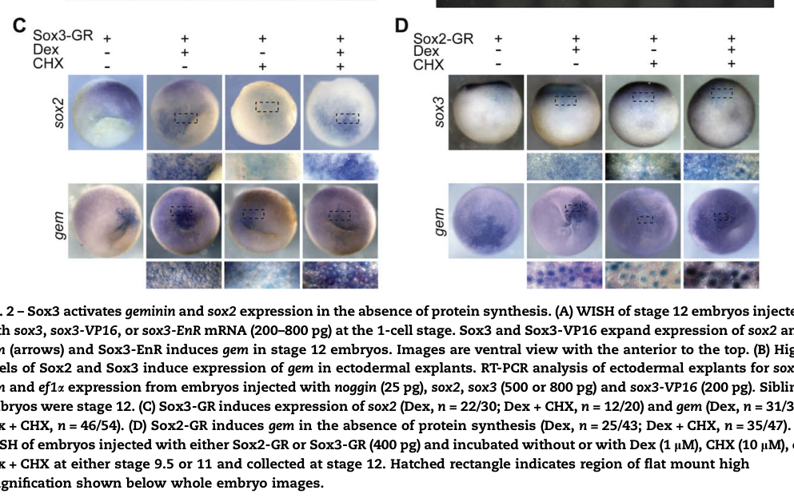
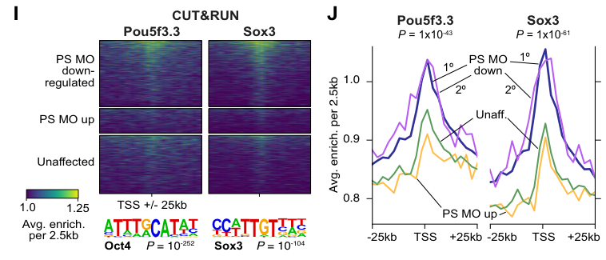

## Question

# Gene Research for Functional Annotation

## ⚠️ CRITICAL: Gene/Protein Identification Context

**BEFORE YOU BEGIN RESEARCH:** You MUST verify you are researching the CORRECT gene/protein. Gene symbols can be ambiguous, especially for less well-characterized genes from non-model organisms.

### Target Gene/Protein Identity (from UniProt):
- **UniProt Accession:** P55863
- **Protein Description:** RecName: Full=Transcription factor Sox-3-A; Short=xSox3; AltName: Full=xSox-B1;
- **Gene Information:** Name=sox3-a; Synonyms=sox3;
- **Organism (full):** Xenopus laevis (African clawed frog).
- **Protein Family:** Not specified in UniProt
- **Key Domains:** HMG_box_dom. (IPR009071); HMG_box_dom_sf. (IPR036910); SOX_fam. (IPR022097); SRY-related_HMG-box_TF-like. (IPR050140); HMG_box (PF00505)

### MANDATORY VERIFICATION STEPS:

1. **Check if the gene symbol "sox3-a" matches the protein description above**
2. **Verify the organism is correct:** Xenopus laevis (African clawed frog).
3. **Check if protein family/domains align with what you find in literature**
4. **If you find literature for a DIFFERENT gene with the same or similar symbol, STOP**

### If Gene Symbol is Ambiguous or You Cannot Find Relevant Literature:

**DO NOT PROCEED WITH RESEARCH ON A DIFFERENT GENE.** Instead:
- State clearly: "The gene symbol 'sox3-a' is ambiguous or literature is limited for this specific protein"
- Explain what you found (e.g., "Found extensive literature on a different gene with the same symbol in a different organism")
- Describe the protein based ONLY on the UniProt information provided above
- Suggest that the protein function can be inferred from domain/family information

### Research Target:

Please provide a comprehensive research report on the gene **sox3-a** (gene ID: sox3-a, UniProt: P55863) in XENLA.

The research report should be a detailed narrative explaining the function, biological processes, and localization of the gene product. Citations should be given for all claims.

You should prioritize authoritative reviews and primary scientific literature when conducting research. You can supplement
this with annotations you find in gene/protein databases, but these can be outdated or inaccurate.

We are specifically interested in the primary function of the gene - for enzymes, what reaction is catalyzed, and what is the substrate specificity? For transporters, what is the substrate? For structural proteins or adapters, what is the broader structural role? For signaling molecules, what is the role in the pathway.

We are interested in where in or outside the cell the gene product carries out its function.

We are also interested in the signaling or biochemical pathways in which the gene functions. We are less interested in broad pleiotropic effects, except where these elucidate the precise role.

Include evidence where possible. We are interested in both experimental evidence as well as inference from structure, evolution, or bioinformatic analysis. Precise studies should be prioritized over high-throughput, where available.

## Output

Question: You are an expert researcher providing comprehensive, well-cited information.

Provide detailed information focusing on:
1. Key concepts and definitions with current understanding
2. Recent developments and latest research (prioritize 2023-2024 sources)
3. Current applications and real-world implementations
4. Expert opinions and analysis from authoritative sources
5. Relevant statistics and data from recent studies

Format as a comprehensive research report with proper citations. Include URLs and publication dates where available.
Always prioritize recent, authoritative sources and provide specific citations for all major claims.

# Gene Research for Functional Annotation

## ⚠️ CRITICAL: Gene/Protein Identification Context

**BEFORE YOU BEGIN RESEARCH:** You MUST verify you are researching the CORRECT gene/protein. Gene symbols can be ambiguous, especially for less well-characterized genes from non-model organisms.

### Target Gene/Protein Identity (from UniProt):
- **UniProt Accession:** P55863
- **Protein Description:** RecName: Full=Transcription factor Sox-3-A; Short=xSox3; AltName: Full=xSox-B1;
- **Gene Information:** Name=sox3-a; Synonyms=sox3;
- **Organism (full):** Xenopus laevis (African clawed frog).
- **Protein Family:** Not specified in UniProt
- **Key Domains:** HMG_box_dom. (IPR009071); HMG_box_dom_sf. (IPR036910); SOX_fam. (IPR022097); SRY-related_HMG-box_TF-like. (IPR050140); HMG_box (PF00505)

### MANDATORY VERIFICATION STEPS:

1. **Check if the gene symbol "sox3-a" matches the protein description above**
2. **Verify the organism is correct:** Xenopus laevis (African clawed frog).
3. **Check if protein family/domains align with what you find in literature**
4. **If you find literature for a DIFFERENT gene with the same or similar symbol, STOP**

### If Gene Symbol is Ambiguous or You Cannot Find Relevant Literature:

**DO NOT PROCEED WITH RESEARCH ON A DIFFERENT GENE.** Instead:
- State clearly: "The gene symbol 'sox3-a' is ambiguous or literature is limited for this specific protein"
- Explain what you found (e.g., "Found extensive literature on a different gene with the same symbol in a different organism")
- Describe the protein based ONLY on the UniProt information provided above
- Suggest that the protein function can be inferred from domain/family information

### Research Target:

Please provide a comprehensive research report on the gene **sox3-a** (gene ID: sox3-a, UniProt: P55863) in XENLA.

The research report should be a detailed narrative explaining the function, biological processes, and localization of the gene product. Citations should be given for all claims.

You should prioritize authoritative reviews and primary scientific literature when conducting research. You can supplement
this with annotations you find in gene/protein databases, but these can be outdated or inaccurate.

We are specifically interested in the primary function of the gene - for enzymes, what reaction is catalyzed, and what is the substrate specificity? For transporters, what is the substrate? For structural proteins or adapters, what is the broader structural role? For signaling molecules, what is the role in the pathway.

We are interested in where in or outside the cell the gene product carries out its function.

We are also interested in the signaling or biochemical pathways in which the gene functions. We are less interested in broad pleiotropic effects, except where these elucidate the precise role.

Include evidence where possible. We are interested in both experimental evidence as well as inference from structure, evolution, or bioinformatic analysis. Precise studies should be prioritized over high-throughput, where available.

# Functional annotation report: *sox3-a* (UniProt P55863), *Xenopus laevis*

## Identity and scope

The supplied UniProt identity describes **Sox3-A**, also called **xSox3** or **xSox-B1**, from the African clawed frog, *Xenopus laevis*. This matches the organism and broad protein identity in the original *X. laevis* xSox3 cloning study: its cDNA encodes a predicted 309-amino-acid protein with a 79-amino-acid high-mobility-group (HMG) box characteristic of SOX transcription factors. Subsequent work places Sox3 in the **SoxB1 subgroup**, alongside the distinct proteins Sox1 and Sox2. Thus, the supplied HMG-box and SOX-family annotations are consistent with the literature; Sox3 is a transcription factor, **not an enzyme or transporter**. (penzel1997characterizationandearly pages 1-2, penzel1997characterizationandearly pages 2-3, archer2011interactionofsox1 pages 1-2)

**Protein-specific qualification:** Older experiments generally name their reagent “xSox3” or “Sox3,” not UniProt P55863. Moreover, *X. laevis* has L and S homeologous subgenomes, and a 2023 study detected maternal *sox3* RNA from both. The sources examined do **not** establish that every historical clone, antibody signal, or perturbation is exclusive to the particular *sox3-a* protein represented by P55863. The strongest functional annotation is therefore for ***X. laevis* Sox3 at the gene/reagent level**, with protein-specific attribution qualified rather than assumed. These are not studies of a similarly named human, zebrafish, or *X. tropicalis* protein. (penzel1997characterizationandearly pages 1-2, phelps2023hybridizationledto pages 6-8)

## Primary molecular function and cellular location

Sox3 is a **sequence-specific, chromatin-associated transcriptional regulator**. Its HMG box supports DNA binding and DNA bending; a commonly reported **SOX-family**, rather than P55863-specific, preferred sequence is 5′-(A/T)(A/T)CAA(A/T)G-3′. Depending on regulatory context, Xenopus Sox3 can promote an early ectodermal/neural-progenitor transcriptional program or repress a mesendoderm-promoting target. Its substrates in the functional sense are **regulatory DNA and associated transcriptional complexes**, not a molecule consumed in a catalytic reaction. (penzel1997characterizationandearly pages 2-3, wegner1999fromheadto pages 1-2, rogers2009xenopussox3activates pages 5-7, kormish2010interactionsbetweensox pages 8-9)

The relevant **site of action is the nucleus, on embryonic chromatin**: stage-8 *X. laevis* Sox3 CUT&RUN signal occurs near transcription start sites and regulatory regions, including sites associated with genes sensitive to Sox3/Pou5f3 perturbation. This establishes chromatin association in embryos and supports nuclear function; it is not a P55863-homeolog-specific microscopy measurement. Sox3 is not characterized here as a secreted or membrane protein. *Sox3 RNA expression in a tissue should also not be confused with a measurement of protein localization within its cells.* (phelps2023hybridizationledto pages 9-10, phelps2023hybridizationledto media c6ebbf8e)

## Biological processes and mechanistic evidence

**Maternal genome activation and ectodermal competence.** Sox3 transcripts are present in unfertilized *X. laevis* eggs and early cleavage embryos. The original study detected maternal RNA in the animal hemisphere, followed by zygotic expression in dorsal animal ectoderm and marginal-zone regions from late blastula onward. This distribution positions Sox3 to affect the earliest ectodermal transcriptional responses. In the 2023 *X. laevis* study, abundant maternal *sox3* transcripts arose from **both** subgenomes; stage-8 Sox3 chromatin occupancy, enhancer profiling, and morpholino perturbations implicated Sox3 together with Pou5f3 factors in embryonic genome activation. The data distinguish differential regulation of **L- versus S-encoded target genes**, not the independent biochemical activities of L- and S-encoded Sox3 proteins. (penzel1997characterizationandearly pages 1-2, penzel1997characterizationandearly pages 3-4, phelps2023hybridizationledto pages 6-8, phelps2023hybridizationledto pages 9-10)

**Early neural-progenitor transcription.** In *X. laevis* embryos, inducible Sox3-GR increased *sox2* expression in **22/30** dexamethasone-treated embryos and **12/20** embryos treated with dexamethasone plus the protein-synthesis inhibitor cycloheximide. Corresponding *geminin* responses were **31/35** and **46/54**. These results show that new intermediary protein synthesis is **not required** for those responses, supporting their designation as *primary* Sox3-responsive genes. They do not, by themselves, demonstrate Sox3 occupancy at each gene’s regulatory DNA. By comparison, the reported inhibition of the BMP-response gene *Xvent2* by Sox3 is **indirect**. In the same experiments, Sox3 overexpression expanded early neural-marker domains, increased neural-plate proliferation by approximately **1.4-fold** in a phospho-histone-H3 assay (**n = 14; p = 0.0014**), and delayed expression of proneural and neuronal markers. These are experimental overexpression effects, not measurements of normal P55863 protein dosage. (rogers2009xenopussox3activates pages 3-5, rogers2009xenopussox3activates pages 5-7, rogers2009xenopussox3activates media 488f0422)

**BMP, FGF, and neural induction.** Sox3 is best understood as a transcriptional component of **ectodermal competence and neural-progenitor specification**, rather than as a BMP or FGF receptor or ligand. A Sox3-targeting morpholino impaired Noggin-mediated induction of neural markers in *X. laevis* ectodermal explants; morpholino-resistant *sox3* RNA rescued the effect, strengthening the specificity of this loss-of-function result. Perturbation experiments further distinguish *sox3* from *sox2*: **BMP inhibition supports early Sox3 expression**, whereas endogenous FGF signaling becomes important for its **continued expression**. Dominant-negative FGFR4a reduced *sox3* expression at stage 12 in **56/63** embryos; in contrast, *sox2* was inhibited earlier, at stage 10.5, in **42/62**. FGF8a can expand *sox3* expression, but that does not make FGF obligatory for its initial neural-induction response. Because maternal *sox3* RNA is already present, “induction” must be interpreted with this timing in mind. (rogers2009xenopussox3activates pages 7-8, rogers2011theresponseof pages 4-7, rogers2011theresponseof pages 1-2, rogers2011theresponseof pages 2-4)

**Wnt/β-catenin and Nodal-related transcription.** An authoritative review of the original Xenopus experiments identifies the Wnt- and VegT-responsive gene ***xnr5*** as a promoter-level Sox3 repression target. It reports adjacent SOX and TCF sites, binding in embryonic extracts, and a requirement for the SOX site in *xnr5* repression. The review also reports physical association of Xenopus Sox3 with β-catenin and inhibition of β-catenin/TCF reporter activity. Crucially, it distinguishes reporter repression—which need not require Sox3 DNA binding—from endogenous *xnr5* repression, **which does**. Precisely how Sox3 occupancy, β-catenin association, and TCF/co-repressor activity combine at *xnr5* remains unresolved; β-catenin binding alone should not be presented as the complete mechanism. Through *xnr5*, Sox3 can constrain early Nodal-related, mesendoderm-promoting transcription where its activity is present. The underlying 1999 and 2003 primary papers were identified through this review but their full experimental texts were not available for independent assessment here. (kormish2010interactionsbetweensox pages 2-4, kormish2010interactionsbetweensox pages 6-8, kormish2010interactionsbetweensox pages 8-9, kormish2010interactionsbetweensox pages 1-2)

**Partner and dose dependence.** *X. laevis* ectodermal-explant experiments found that reducing endogenous Oct91, a Xenopus POU factor, weakened Sox3-driven neural-marker induction. Conversely, high combined Sox3 and Oct91 expression could suppress markers induced by Oct91 alone. These are **functional interactions**, not proof that Sox3 physically binds Oct91; the outcome depends on experimental dose and developmental context. They also caution against treating Sox1, Sox2, and Sox3 as fully interchangeable. (archer2011interactionofsox1 pages 1-2, archer2011interactionofsox1 pages 5-7, archer2011interactionofsox1 pages 7-8)

## Tissue distribution, recent developments, and research use

The original *X. laevis* expression analysis found strong Sox3 RNA expression during late gastrula-to-neurula development in prospective neural structures and later in developing brain, eye/lens epithelium, and additional head-associated structures. It also detected RNA in adult brain and ovary. **These are transcript-distribution findings**, not evidence that the protein is extracellular or that it performs an identical function in each tissue. (penzel1997characterizationandearly pages 1-2, penzel1997characterizationandearly pages 2-3, penzel1997characterizationandearly pages 3-4)

Recent work refines the early-chromatin interpretation. Phelps *et al.* (**October 2023**) identified **15,654** putative accessible, acetylated distal regulatory regions in early *X. laevis* embryos, including **5,047** high-confidence predicted enhancers. Among aligned high-confidence enhancer regions, only **21%** retained activity in both homeologs; differential enhancer density tracked differential L/S gene activation (**p = 1.3 × 10⁻¹⁶**). Sox3 and Pou5f3 occupancy analyses connect maternal transcription factors to this divergent regulatory landscape, but **21% is an enhancer-conservation statistic, not a Sox3-specific binding or knockout rate**. These findings make subgenome-aware analysis important when using historical “Sox3” annotations. (phelps2023hybridizationledto pages 6-8, phelps2023hybridizationledto pages 9-10)

As a **research application**, *sox3* expression is used to delineate developing neural tissue. Edri *et al.* (**5 December 2023**) used the original *X. laevis sox3* in-situ probe together with a notochord marker to assess neural-tube closure after experimental reduction of retinoic-acid signaling. In that study Sox3 served as an **anatomical/developmental marker**; the work does not establish Sox3 as the molecular cause of the retinoic-acid-induced defect or as a clinical diagnostic assay. A **July 2024** comparative study of Xenopus and lamprey likewise used SoxB1 expression in its analysis of blastula and neural-crest-related states; the examined passages did not establish a new, P55863-specific Sox3 perturbation result. Separately, influential chromatin-pioneering experiments by Gentsch *et al.* (**2019**) were performed in ***X. tropicalis***: they inform evolutionary interpretation but must not be cited as direct functional tests of *X. laevis* P55863. (edri2023alcoholinducesneural pages 2-3, york2024sharedfeaturesof pages 1-3, york2024sharedfeaturesof pages 3-4)

**Assessment.** The best-supported annotation is an **embryonic, nuclear SoxB1 DNA-binding transcription factor** that helps establish maternal-to-zygotic regulatory competence, promotes early neural-progenitor gene expression, and can restrict *xnr5*/Nodal-related transcription in context. Specificity for the **P55863 Sox3-A protein**, as opposed to other *X. laevis* Sox3 homeolog products, remains the principal evidence gap. No clinical implementation for this frog protein is established by the examined studies. (penzel1997characterizationandearly pages 2-3, rogers2009xenopussox3activates pages 5-7, phelps2023hybridizationledto pages 9-10, kormish2010interactionsbetweensox pages 8-9)

### Selected sources and URLs

- Penzel *et al.* **October 1997**, original *X. laevis* xSox3 cloning and expression: https://doi.org/10.1387/ijdb.9415486. (penzel1997characterizationandearly pages 1-2)
- Rogers *et al.* **January 2009**, Sox3 gain/loss experiments and early neural transcription: https://doi.org/10.1016/j.mod.2008.10.005. (rogers2009xenopussox3activates pages 1-2, rogers2009xenopussox3activates pages 3-5)
- Kormish, Sinner & Zorn, **2010**, expert review of SOX–Wnt mechanisms and *xnr5*: https://doi.org/10.1002/dvdy.22046. (kormish2010interactionsbetweensox pages 2-4, kormish2010interactionsbetweensox pages 8-9)
- Archer, Jin & Casey, **February 2011**, SoxB1–Oct91 functional experiments: https://doi.org/10.1016/j.ydbio.2010.12.013. (archer2011interactionofsox1 pages 1-2, archer2011interactionofsox1 pages 7-8)
- Rogers, Ferzli & Casey, **December 2011**, BMP/FGF requirements: https://doi.org/10.1186/1471-213x-11-74. (rogers2011theresponseof pages 4-7)
- Phelps *et al.* **October 2023**, *X. laevis* Sox3 chromatin occupancy and L/S genome activation: https://doi.org/10.7554/eLife.83952. (phelps2023hybridizationledto pages 9-10, phelps2023hybridizationledto pages 6-8)
- Edri *et al.* **5 December 2023**, *sox3* as a neural-tube assay marker: https://doi.org/10.3389/fcell.2023.1282273. (edri2023alcoholinducesneural pages 1-2, edri2023alcoholinducesneural pages 2-3)
- York *et al.* **July 2024**, comparative stem-cell-state context: https://doi.org/10.1038/s41559-024-02476-8. (york2024sharedfeaturesof pages 1-3)

References

1. (penzel1997characterizationandearly pages 1-2): R. Penzel, R. Oschwald, Y. Chen, L. Tacke, and H. Grunz. Characterization and early embryonic expression of a neural specific transcription factor xsox3 in xenopus laevis. The International journal of developmental biology, 41 5:667-77, Oct 1997. URL: https://doi.org/10.1387/ijdb.9415486, doi:10.1387/ijdb.9415486. This article has 222 citations.

2. (penzel1997characterizationandearly pages 2-3): R. Penzel, R. Oschwald, Y. Chen, L. Tacke, and H. Grunz. Characterization and early embryonic expression of a neural specific transcription factor xsox3 in xenopus laevis. The International journal of developmental biology, 41 5:667-77, Oct 1997. URL: https://doi.org/10.1387/ijdb.9415486, doi:10.1387/ijdb.9415486. This article has 222 citations.

3. (archer2011interactionofsox1 pages 1-2): Tenley C. Archer, Jing Jin, and Elena S. Casey. Interaction of sox1, sox2, sox3 and oct4 during primary neurogenesis. Developmental biology, 350 2:429-40, Feb 2011. URL: https://doi.org/10.1016/j.ydbio.2010.12.013, doi:10.1016/j.ydbio.2010.12.013. This article has 154 citations and is from a peer-reviewed journal.

4. (phelps2023hybridizationledto pages 6-8): Wesley A. Phelps, Matthew D. Hurton, Taylor N Ayers, Anne E. Carlson, Joel C. Rosenbaum, and Miler T. Lee. Hybridization led to a rewired pluripotency network in the allotetraploid xenopus laevis. eLife, Oct 2023. URL: https://doi.org/10.7554/elife.83952, doi:10.7554/elife.83952. This article has 14 citations and is from a domain leading peer-reviewed journal.

5. (wegner1999fromheadto pages 1-2): M. Wegner. From head to toes: the multiple facets of sox proteins. Nucleic Acids Research, 27:1409-1420, Mar 1999. URL: https://doi.org/10.1093/nar/27.6.1409, doi:10.1093/nar/27.6.1409. This article has 1252 citations and is from a highest quality peer-reviewed journal.

6. (rogers2009xenopussox3activates pages 5-7): Crystal D. Rogers, Naoe Harafuji, Tenley Archer, Doreen D. Cunningham, and Elena S. Casey. Xenopus sox3 activates sox2 and geminin and indirectly represses xvent2 expression to induce neural progenitor formation at the expense of non-neural ectodermal derivatives. Mechanisms of Development, 126:42-55, Jan 2009. URL: https://doi.org/10.1016/j.mod.2008.10.005, doi:10.1016/j.mod.2008.10.005. This article has 111 citations.

7. (kormish2010interactionsbetweensox pages 8-9): Jay D. Kormish, Débora Sinner, and Aaron M. Zorn. Interactions between sox factors and wnt/β‐catenin signaling in development and disease. Developmental Dynamics, 239:56-68, Aug 2010. URL: https://doi.org/10.1002/dvdy.22046, doi:10.1002/dvdy.22046. This article has 388 citations and is from a peer-reviewed journal.

8. (phelps2023hybridizationledto pages 9-10): Wesley A. Phelps, Matthew D. Hurton, Taylor N Ayers, Anne E. Carlson, Joel C. Rosenbaum, and Miler T. Lee. Hybridization led to a rewired pluripotency network in the allotetraploid xenopus laevis. eLife, Oct 2023. URL: https://doi.org/10.7554/elife.83952, doi:10.7554/elife.83952. This article has 14 citations and is from a domain leading peer-reviewed journal.

9. (phelps2023hybridizationledto media c6ebbf8e): Wesley A. Phelps, Matthew D. Hurton, Taylor N Ayers, Anne E. Carlson, Joel C. Rosenbaum, and Miler T. Lee. Hybridization led to a rewired pluripotency network in the allotetraploid xenopus laevis. eLife, Oct 2023. URL: https://doi.org/10.7554/elife.83952, doi:10.7554/elife.83952. This article has 14 citations and is from a domain leading peer-reviewed journal.

10. (penzel1997characterizationandearly pages 3-4): R. Penzel, R. Oschwald, Y. Chen, L. Tacke, and H. Grunz. Characterization and early embryonic expression of a neural specific transcription factor xsox3 in xenopus laevis. The International journal of developmental biology, 41 5:667-77, Oct 1997. URL: https://doi.org/10.1387/ijdb.9415486, doi:10.1387/ijdb.9415486. This article has 222 citations.

11. (rogers2009xenopussox3activates pages 3-5): Crystal D. Rogers, Naoe Harafuji, Tenley Archer, Doreen D. Cunningham, and Elena S. Casey. Xenopus sox3 activates sox2 and geminin and indirectly represses xvent2 expression to induce neural progenitor formation at the expense of non-neural ectodermal derivatives. Mechanisms of Development, 126:42-55, Jan 2009. URL: https://doi.org/10.1016/j.mod.2008.10.005, doi:10.1016/j.mod.2008.10.005. This article has 111 citations.

12. (rogers2009xenopussox3activates media 488f0422): Crystal D. Rogers, Naoe Harafuji, Tenley Archer, Doreen D. Cunningham, and Elena S. Casey. Xenopus sox3 activates sox2 and geminin and indirectly represses xvent2 expression to induce neural progenitor formation at the expense of non-neural ectodermal derivatives. Mechanisms of Development, 126:42-55, Jan 2009. URL: https://doi.org/10.1016/j.mod.2008.10.005, doi:10.1016/j.mod.2008.10.005. This article has 111 citations.

13. (rogers2009xenopussox3activates pages 7-8): Crystal D. Rogers, Naoe Harafuji, Tenley Archer, Doreen D. Cunningham, and Elena S. Casey. Xenopus sox3 activates sox2 and geminin and indirectly represses xvent2 expression to induce neural progenitor formation at the expense of non-neural ectodermal derivatives. Mechanisms of Development, 126:42-55, Jan 2009. URL: https://doi.org/10.1016/j.mod.2008.10.005, doi:10.1016/j.mod.2008.10.005. This article has 111 citations.

14. (rogers2011theresponseof pages 4-7): Crystal D Rogers, George S Ferzli, and Elena S Casey. The response of early neural genes to fgf signaling or inhibition of bmp indicate the absence of a conserved neural induction module. BMC Developmental Biology, 11:74-74, Dec 2011. URL: https://doi.org/10.1186/1471-213x-11-74, doi:10.1186/1471-213x-11-74. This article has 27 citations and is from a peer-reviewed journal.

15. (rogers2011theresponseof pages 1-2): Crystal D Rogers, George S Ferzli, and Elena S Casey. The response of early neural genes to fgf signaling or inhibition of bmp indicate the absence of a conserved neural induction module. BMC Developmental Biology, 11:74-74, Dec 2011. URL: https://doi.org/10.1186/1471-213x-11-74, doi:10.1186/1471-213x-11-74. This article has 27 citations and is from a peer-reviewed journal.

16. (rogers2011theresponseof pages 2-4): Crystal D Rogers, George S Ferzli, and Elena S Casey. The response of early neural genes to fgf signaling or inhibition of bmp indicate the absence of a conserved neural induction module. BMC Developmental Biology, 11:74-74, Dec 2011. URL: https://doi.org/10.1186/1471-213x-11-74, doi:10.1186/1471-213x-11-74. This article has 27 citations and is from a peer-reviewed journal.

17. (kormish2010interactionsbetweensox pages 2-4): Jay D. Kormish, Débora Sinner, and Aaron M. Zorn. Interactions between sox factors and wnt/β‐catenin signaling in development and disease. Developmental Dynamics, 239:56-68, Aug 2010. URL: https://doi.org/10.1002/dvdy.22046, doi:10.1002/dvdy.22046. This article has 388 citations and is from a peer-reviewed journal.

18. (kormish2010interactionsbetweensox pages 6-8): Jay D. Kormish, Débora Sinner, and Aaron M. Zorn. Interactions between sox factors and wnt/β‐catenin signaling in development and disease. Developmental Dynamics, 239:56-68, Aug 2010. URL: https://doi.org/10.1002/dvdy.22046, doi:10.1002/dvdy.22046. This article has 388 citations and is from a peer-reviewed journal.

19. (kormish2010interactionsbetweensox pages 1-2): Jay D. Kormish, Débora Sinner, and Aaron M. Zorn. Interactions between sox factors and wnt/β‐catenin signaling in development and disease. Developmental Dynamics, 239:56-68, Aug 2010. URL: https://doi.org/10.1002/dvdy.22046, doi:10.1002/dvdy.22046. This article has 388 citations and is from a peer-reviewed journal.

20. (archer2011interactionofsox1 pages 5-7): Tenley C. Archer, Jing Jin, and Elena S. Casey. Interaction of sox1, sox2, sox3 and oct4 during primary neurogenesis. Developmental biology, 350 2:429-40, Feb 2011. URL: https://doi.org/10.1016/j.ydbio.2010.12.013, doi:10.1016/j.ydbio.2010.12.013. This article has 154 citations and is from a peer-reviewed journal.

21. (archer2011interactionofsox1 pages 7-8): Tenley C. Archer, Jing Jin, and Elena S. Casey. Interaction of sox1, sox2, sox3 and oct4 during primary neurogenesis. Developmental biology, 350 2:429-40, Feb 2011. URL: https://doi.org/10.1016/j.ydbio.2010.12.013, doi:10.1016/j.ydbio.2010.12.013. This article has 154 citations and is from a peer-reviewed journal.

22. (edri2023alcoholinducesneural pages 2-3): Tamir Edri, Dor Cohen, Yehuda Shabtai, and Abraham Fainsod. Alcohol induces neural tube defects by reducing retinoic acid signaling and promoting neural plate expansion. Frontiers in Cell and Developmental Biology, Dec 2023. URL: https://doi.org/10.3389/fcell.2023.1282273, doi:10.3389/fcell.2023.1282273. This article has 14 citations.

23. (york2024sharedfeaturesof pages 1-3): Joshua R. York, Anjali Rao, Paul B. Huber, Elizabeth N. Schock, Andrew Montequin, Sara Rigney, and Carole LaBonne. Shared features of blastula and neural crest stem cells evolved at the base of vertebrates. Nature ecology & evolution, 8:1680-1692, Jul 2024. URL: https://doi.org/10.1038/s41559-024-02476-8, doi:10.1038/s41559-024-02476-8. This article has 15 citations and is from a highest quality peer-reviewed journal.

24. (york2024sharedfeaturesof pages 3-4): Joshua R. York, Anjali Rao, Paul B. Huber, Elizabeth N. Schock, Andrew Montequin, Sara Rigney, and Carole LaBonne. Shared features of blastula and neural crest stem cells evolved at the base of vertebrates. Nature ecology & evolution, 8:1680-1692, Jul 2024. URL: https://doi.org/10.1038/s41559-024-02476-8, doi:10.1038/s41559-024-02476-8. This article has 15 citations and is from a highest quality peer-reviewed journal.

25. (rogers2009xenopussox3activates pages 1-2): Crystal D. Rogers, Naoe Harafuji, Tenley Archer, Doreen D. Cunningham, and Elena S. Casey. Xenopus sox3 activates sox2 and geminin and indirectly represses xvent2 expression to induce neural progenitor formation at the expense of non-neural ectodermal derivatives. Mechanisms of Development, 126:42-55, Jan 2009. URL: https://doi.org/10.1016/j.mod.2008.10.005, doi:10.1016/j.mod.2008.10.005. This article has 111 citations.

26. (edri2023alcoholinducesneural pages 1-2): Tamir Edri, Dor Cohen, Yehuda Shabtai, and Abraham Fainsod. Alcohol induces neural tube defects by reducing retinoic acid signaling and promoting neural plate expansion. Frontiers in Cell and Developmental Biology, Dec 2023. URL: https://doi.org/10.3389/fcell.2023.1282273, doi:10.3389/fcell.2023.1282273. This article has 14 citations.

## Artifacts

## Citations

1. penzel1997characterizationandearly pages 1-2
2. rogers2011theresponseof pages 4-7
3. york2024sharedfeaturesof pages 1-3
4. penzel1997characterizationandearly pages 2-3
5. phelps2023hybridizationledto pages 6-8
6. wegner1999fromheadto pages 1-2
7. kormish2010interactionsbetweensox pages 8-9
8. phelps2023hybridizationledto pages 9-10
9. penzel1997characterizationandearly pages 3-4
10. rogers2011theresponseof pages 1-2
11. rogers2011theresponseof pages 2-4
12. kormish2010interactionsbetweensox pages 2-4
13. kormish2010interactionsbetweensox pages 6-8
14. kormish2010interactionsbetweensox pages 1-2
15. edri2023alcoholinducesneural pages 2-3
16. york2024sharedfeaturesof pages 3-4
17. edri2023alcoholinducesneural pages 1-2
18. https://doi.org/10.1387/ijdb.9415486.
19. https://doi.org/10.1016/j.mod.2008.10.005.
20. https://doi.org/10.1002/dvdy.22046.
21. https://doi.org/10.1016/j.ydbio.2010.12.013.
22. https://doi.org/10.1186/1471-213x-11-74.
23. https://doi.org/10.7554/eLife.83952.
24. https://doi.org/10.3389/fcell.2023.1282273.
25. https://doi.org/10.1038/s41559-024-02476-8.
26. https://doi.org/10.1387/ijdb.9415486,
27. https://doi.org/10.1016/j.ydbio.2010.12.013,
28. https://doi.org/10.7554/elife.83952,
29. https://doi.org/10.1093/nar/27.6.1409,
30. https://doi.org/10.1016/j.mod.2008.10.005,
31. https://doi.org/10.1002/dvdy.22046,
32. https://doi.org/10.1186/1471-213x-11-74,
33. https://doi.org/10.3389/fcell.2023.1282273,
34. https://doi.org/10.1038/s41559-024-02476-8,