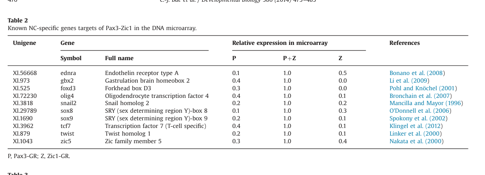

## Question

# Gene Research for Functional Annotation

## ⚠️ CRITICAL: Gene/Protein Identification Context

**BEFORE YOU BEGIN RESEARCH:** You MUST verify you are researching the CORRECT gene/protein. Gene symbols can be ambiguous, especially for less well-characterized genes from non-model organisms.

### Target Gene/Protein Identity (from UniProt):
- **UniProt Accession:** Q6VVD7
- **Protein Description:** RecName: Full=Transcription factor Sox-8 {ECO:0000250|UniProtKB:P57073};
- **Gene Information:** Name=sox8;
- **Organism (full):** Xenopus laevis (African clawed frog).
- **Protein Family:** Not specified in UniProt
- **Key Domains:** HMG_box_dom. (IPR009071); HMG_box_dom_sf. (IPR036910); Sox_N. (IPR022151); SOX_TF. (IPR050917); HMG_box (PF00505)

### MANDATORY VERIFICATION STEPS:

1. **Check if the gene symbol "sox8" matches the protein description above**
2. **Verify the organism is correct:** Xenopus laevis (African clawed frog).
3. **Check if protein family/domains align with what you find in literature**
4. **If you find literature for a DIFFERENT gene with the same or similar symbol, STOP**

### If Gene Symbol is Ambiguous or You Cannot Find Relevant Literature:

**DO NOT PROCEED WITH RESEARCH ON A DIFFERENT GENE.** Instead:
- State clearly: "The gene symbol 'sox8' is ambiguous or literature is limited for this specific protein"
- Explain what you found (e.g., "Found extensive literature on a different gene with the same symbol in a different organism")
- Describe the protein based ONLY on the UniProt information provided above
- Suggest that the protein function can be inferred from domain/family information

### Research Target:

Please provide a comprehensive research report on the gene **sox8** (gene ID: sox8, UniProt: Q6VVD7) in XENLA.

The research report should be a detailed narrative explaining the function, biological processes, and localization of the gene product. Citations should be given for all claims.

You should prioritize authoritative reviews and primary scientific literature when conducting research. You can supplement
this with annotations you find in gene/protein databases, but these can be outdated or inaccurate.

We are specifically interested in the primary function of the gene - for enzymes, what reaction is catalyzed, and what is the substrate specificity? For transporters, what is the substrate? For structural proteins or adapters, what is the broader structural role? For signaling molecules, what is the role in the pathway.

We are interested in where in or outside the cell the gene product carries out its function.

We are also interested in the signaling or biochemical pathways in which the gene functions. We are less interested in broad pleiotropic effects, except where these elucidate the precise role.

Include evidence where possible. We are interested in both experimental evidence as well as inference from structure, evolution, or bioinformatic analysis. Precise studies should be prioritized over high-throughput, where available.

## Output

Question: You are an expert researcher providing comprehensive, well-cited information.

Provide detailed information focusing on:
1. Key concepts and definitions with current understanding
2. Recent developments and latest research (prioritize 2023-2024 sources)
3. Current applications and real-world implementations
4. Expert opinions and analysis from authoritative sources
5. Relevant statistics and data from recent studies

Format as a comprehensive research report with proper citations. Include URLs and publication dates where available.
Always prioritize recent, authoritative sources and provide specific citations for all major claims.

# Gene Research for Functional Annotation

## ⚠️ CRITICAL: Gene/Protein Identification Context

**BEFORE YOU BEGIN RESEARCH:** You MUST verify you are researching the CORRECT gene/protein. Gene symbols can be ambiguous, especially for less well-characterized genes from non-model organisms.

### Target Gene/Protein Identity (from UniProt):
- **UniProt Accession:** Q6VVD7
- **Protein Description:** RecName: Full=Transcription factor Sox-8 {ECO:0000250|UniProtKB:P57073};
- **Gene Information:** Name=sox8;
- **Organism (full):** Xenopus laevis (African clawed frog).
- **Protein Family:** Not specified in UniProt
- **Key Domains:** HMG_box_dom. (IPR009071); HMG_box_dom_sf. (IPR036910); Sox_N. (IPR022151); SOX_TF. (IPR050917); HMG_box (PF00505)

### MANDATORY VERIFICATION STEPS:

1. **Check if the gene symbol "sox8" matches the protein description above**
2. **Verify the organism is correct:** Xenopus laevis (African clawed frog).
3. **Check if protein family/domains align with what you find in literature**
4. **If you find literature for a DIFFERENT gene with the same or similar symbol, STOP**

### If Gene Symbol is Ambiguous or You Cannot Find Relevant Literature:

**DO NOT PROCEED WITH RESEARCH ON A DIFFERENT GENE.** Instead:
- State clearly: "The gene symbol 'sox8' is ambiguous or literature is limited for this specific protein"
- Explain what you found (e.g., "Found extensive literature on a different gene with the same symbol in a different organism")
- Describe the protein based ONLY on the UniProt information provided above
- Suggest that the protein function can be inferred from domain/family information

### Research Target:

Please provide a comprehensive research report on the gene **sox8** (gene ID: sox8, UniProt: Q6VVD7) in XENLA.

The research report should be a detailed narrative explaining the function, biological processes, and localization of the gene product. Citations should be given for all claims.

You should prioritize authoritative reviews and primary scientific literature when conducting research. You can supplement
this with annotations you find in gene/protein databases, but these can be outdated or inaccurate.

We are specifically interested in the primary function of the gene - for enzymes, what reaction is catalyzed, and what is the substrate specificity? For transporters, what is the substrate? For structural proteins or adapters, what is the broader structural role? For signaling molecules, what is the role in the pathway.

We are interested in where in or outside the cell the gene product carries out its function.

We are also interested in the signaling or biochemical pathways in which the gene functions. We are less interested in broad pleiotropic effects, except where these elucidate the precise role.

Include evidence where possible. We are interested in both experimental evidence as well as inference from structure, evolution, or bioinformatic analysis. Precise studies should be prioritized over high-throughput, where available.

# Functional annotation report: *sox8* in *Xenopus laevis*

## Identity and principal function

The specified accession, [UniProt Q6VVD7](https://www.uniprot.org/uniprotkb/Q6VVD7/entry), identifies *Xenopus laevis* Sox8, not the related Sox9 or Sox10 proteins. Its supplied HMG-box, Sox_N and SOX-transcription-factor annotations agree with the literature’s classification of Sox8 in the **SoxE transcription-factor subfamily**, alongside Sox9 and Sox10. The strongest organism-specific functional annotation is **an early regulator of the embryonic neural-crest gene-regulatory program**. Sox8 is not an enzyme or transporter: its relevant molecular activity is regulation of DNA-dependent transcription. (alvarado2025sox8amultifaceted pages 1-2, schock2020sortingsoxdiverse pages 4-5, schock2020sortingsoxdiverse pages 1-3)

**Molecular mechanism and cellular location.** The HMG domain of SoxE proteins binds sequence-selective DNA in the minor groove and bends it; other conserved SoxE regions mediate dimerization and transcriptional activation. A 2025 Sox8 review describes a SoxE consensus motif, 5′-(A/T)(A/T)CAA(A/T)G-3′, and approximately 70–85° DNA bending. These are **family-level biochemical properties**, not a measurement of Q6VVD7 binding to a particular *Xenopus* regulatory element. Experiments with **mouse Sox8** show that the HMG-domain tail also contacts other transcription factors’ DNA-binding domains, offering a mechanistic basis for partner-dependent transcriptional control. Conserved nuclear-localization signals within the HMG domain make the **nucleus, at gene-regulatory DNA**, the expected site of *Xenopus* Sox8 action; a Q6VVD7-specific subcellular-localization experiment was not established by the sources examined. ([González Alvarado and Aprato, *Biology Open*, accepted 22 January 2025](https://doi.org/10.1242/bio.061840); [Wißmüller *et al.*, *Nucleic Acids Research*, published online 31 March 2006](https://doi.org/10.1093/nar/gkl105)). (alvarado2025sox8amultifaceted pages 2-3, wissmuller2006thehighmobilitygroupdomain pages 1-2)

## Organism-specific biological role and location in the embryo

In *X. laevis*, *sox8* is expressed at the **neural plate border and nascent neural crest**, before the other SoxE paralogs *sox9* and *sox10*. Expression continues in neural folds and migrating neural-crest populations. Thus, the developmental location of expressing **cells** changes as the crest forms and migrates; this should not be confused with the protein’s inferred **intracellular nuclear** location. Neural crest cells are embryonic progenitors that migrate and produce several derivatives, but expression in their progenitors does not, by itself, establish a Sox8-specific function in every derivative. ([Schock and LaBonne, *Frontiers in Physiology*, 8 December 2020](https://doi.org/10.3389/fphys.2020.606889)). (schock2020sortingsoxdiverse pages 3-4, schock2020sortingsoxdiverse pages 4-5, milet2013pax3andzic1 pages 1-2)

**Causal evidence:** Published expert reviews of [O’Donnell *et al.*, “Functional analysis of Sox8 during neural crest development in Xenopus,” *Development* **133**, 3817–3826 (2006)](https://doi.org/10.1242/dev.02558) report that Sox8 depletion delays neural-crest progenitor induction and disrupts subsequent neural-crest development/migration. They report rescue of the Sox8-morphant neural-crest phenotype by Sox8, Sox9 **or** Sox10. The most defensible interpretation is that Sox8 supplies an **early, partly interchangeable SoxE transcriptional function** in this system, while the observed migration defects need not represent a separate, direct motility mechanism. The original 2006 article’s full experimental text was unavailable for independent checking here; specific depletion percentages, individual downstream genes and rescue doses should therefore **not** be attributed to it on the basis of this report. ([Schock and LaBonne, 2020](https://doi.org/10.3389/fphys.2020.606889); [González Alvarado and Aprato, 2025](https://doi.org/10.1242/bio.061840)). (schock2020sortingsoxdiverse pages 4-5, alvarado2025sox8amultifaceted pages 4-5)

The temporal evidence is unusually informative. In a primary *X. laevis* animal-cap experiment, activation of Pax3 and Zic1 at **stage 10** elicited *sox8*, *snail1* and *myc* during **stages 12–15**, ahead of the later *sox10* program. This supports an early specification role rather than assigning Sox8 primarily to terminal differentiation. ([Milet *et al.*, *PNAS*, 2 April 2013](https://doi.org/10.1073/pnas.1219124110)). (milet2013pax3andzic1 pages 2-3, milet2013pax3andzic1 pages 1-2)

## Signaling inputs and gene-regulatory placement

The best-supported pathway annotation is **BMP attenuation and Wnt input → neural-plate-border regulators, including Pax3, Zic1 and TFAP2A → induction of the neural-crest program containing *sox8***. In *X. laevis* ectodermal explants, **0.1 ng Noggin mRNA plus 100 pg Wnt1 mRNA** strongly induced *sox8* and other neural-crest markers after **10 hours**; *sox8* was not among the earlier genes induced at five hours. This places its expression downstream of the combined experimental signaling conditions, **not** as proof that Wnt or a BMP effector binds the *sox8* locus directly. ([Hong and Saint-Jeannet, *Molecular Biology of the Cell*, June 2007](https://doi.org/10.1091/mbc.e06-11-1047)). (hong2007theactivityof pages 3-4)

Pax3/Zic1 gain of function provides stronger evidence for the intervening transcriptional step: it induces a timed neural-crest program that includes *sox8*. In a separate *X. laevis* microarray study with **five independently analyzed samples per condition**, *sox8* was among the induced neural-crest genes. Its tabulated **relative expression**, normalized to the Pax3-plus-Zic1 condition, was **0.1** with Pax3 alone, **0.3** with Zic1 alone and **1.0** with both. Those are *relative microarray values*, **not measured fold changes or percentages of embryos**; the combination is consistent with cooperative induction but does not demonstrate direct binding of either regulator to *sox8* DNA. ([Bae *et al.*, *Developmental Biology*, available online 17 December 2013; 2014 volume](https://doi.org/10.1016/j.ydbio.2013.12.011)). (bae2014identificationofpax3 pages 1-2, bae2014identificationofpax3 pages 3-4, bae2014identificationofpax3 media 7fa657a7)

TFAP2A provides an additional upstream connection. In *Xenopus* explants, induced AP2A together with Noggin increased *sox8*; unlike *snail2*, *sox8* was **not** induced under protein-synthesis inhibition in the tested assay. Accordingly, these data support AP2A-associated **indirect or protein-synthesis-dependent** induction of *sox8*, not a demonstrated immediate-early AP2A target. In the same study, *ap2a* remained expressed in neural-crest cells remaining beside the neural tube after Sox8 depletion, so Sox8 was not required for that measured late *ap2a* expression. ([de Crozé *et al.*, *PNAS*, 4 January 2011](https://doi.org/10.1073/pnas.1010740107)). (croze2011reiterativeap2aactivity pages 3-5, croze2011reiterativeap2aactivity pages 2-3)

The following table separates functional perturbation from expression measurements and cross-species interpretation. Its numerical microarray entry was checked against the cropped source table. (bae2014identificationofpax3 pages 3-4, bae2014identificationofpax3 media 7fa657a7)

| Finding | Evidence | Interpretation / limits | Source URL and year |
|---|---|---|---|
| **Direct loss of function:** Sox8 morphants show delayed neural-crest induction and defective migration; Sox8, Sox9, or Sox10 can rescue the neural-crest phenotype. | The evidence originates from O’Donnell et al. (2006), but the accessible support here is **second-hand synthesis in expert reviews**, not firsthand inspection of the original experiments. The reviews describe Sox8 as the earliest SoxE factor expressed in *X. laevis* neural crest and report cross-rescue by all three SoxE factors. (schock2020sortingsoxdiverse pages 4-5, alvarado2025sox8amultifaceted pages 4-5) | **Evidence tier: direct perturbation, indirectly verified.** Supports an early, partly redundant role in neural-crest specification and migration. Exact sample sizes, marker-level effects, morpholino controls, and rescue doses were not independently checked here. | [O’Donnell et al., Development](https://doi.org/10.1242/dev.02558), 2006; [Schock & LaBonne](https://doi.org/10.3389/fphys.2020.606889), 2020; [González Alvarado & Aprato](https://doi.org/10.1242/bio.061840), 2025 |
| **BMP attenuation plus Wnt signaling induces sox8.** | In *X. laevis* animal-cap explants, **0.1 ng Noggin mRNA plus 100 pg Wnt1 mRNA** strongly induced neural-crest markers including *sox8* after **10 h**, whereas *sox8* was not among the early genes induced after **5 h**. (hong2007theactivityof pages 3-4) | **Evidence tier: direct pathway perturbation.** Places *sox8* downstream of combined BMP attenuation and canonical-Wnt input, but does not show direct Wnt/β-catenin or BMP-regulator binding at the *sox8* locus. | [Hong & Saint-Jeannet](https://doi.org/10.1091/mbc.e06-11-1047), 2007 |
| **Pax3 and Zic1 place sox8 early in the neural-crest transcriptional sequence.** | Inducible Pax3-GR and Zic1-GR were activated at stage 10 in *X. laevis* ectoderm. *sox8*, *snail1*, and *myc* appeared during stages **12–15**, before the later induction of *sox10*. (milet2013pax3andzic1 pages 2-3, milet2013pax3andzic1 pages 1-2) | **Evidence tier: direct gain of function.** Demonstrates that Pax3/Zic1 activity is sufficient to induce *sox8* in competent ectoderm and establishes temporal order. It does **not** establish direct Pax3 or Zic1 binding to *sox8* regulatory DNA. | [Milet et al.](https://doi.org/10.1073/pnas.1219124110), 2013 |
| **Pax3–Zic1 cooperation strongly enriches sox8 expression.** | In a five-replicate *X. laevis* Genome 2.0 microarray screen, normalized *sox8* values were **0.1 with Pax3-GR alone, 0.3 with Zic1-GR alone, and 1.0 with Pax3-GR plus Zic1-GR**. The source table and cropped visual confirm the row and column assignments. (bae2014identificationofpax3 pages 1-2, bae2014identificationofpax3 pages 3-4, bae2014identificationofpax3 media 7fa657a7) | **Evidence tier: replicated transcriptomic gain of function.** These are **relative normalized values, not fold changes**. The assay supports cooperative regulation but does not by itself prove direct transcriptional control. | [Bae et al.](https://doi.org/10.1016/j.ydbio.2013.12.011), online 17 December 2013; issue 2014 |
| **Recent single-cell work retains sox8 as an early neural-crest marker.** | The 2024 study analyzed an **eight-stage *X. tropicalis* single-cell series** and performed selected transcriptomic and epigenomic validation in Xenopus, including *X. laevis* tissue experiments. It classifies *sox8* with *snai2* and *foxd3* in the early immature neural-crest program preceding later *sox10*, *twist1*, and *cdh2* programs. (kotov2024atimeresolvedsinglecell pages 1-2, kotov2024atimeresolvedsinglecell pages 2-3) | **Evidence tier: modern atlas/contextual evidence.** Valuable for timing and cell-state annotation, but it is not purely *X. laevis* discovery data and contains **no Sox8-specific causal perturbation** establishing Q6VVD7 function. | [Kotov et al.](https://doi.org/10.1073/pnas.2311685121), published 29 April 2024 |
| **High-resolution imaging reveals heterogeneous onset and Zic1-responsive sox8 induction.** | HCR-FISH detected *sox8* in the dorsal neural-fold region at stage **12.5**; at this stage, nascent *sox8* transcription was associated with high Zic1 even where Pax3 was low. In animal-pole explants, Zic1-GR alone significantly induced *sox8*, while combined Pax3-GR/Zic1-GR produced robust induction. (montequin2025dynamicandnonuniform pages 7-10, montequin2025dynamicandnonuniform pages 5-7) | **Evidence tier: direct expression imaging plus gain of function, provisional.** Supports differential upstream contributions from Zic1 and Pax3, but does not prove direct DNA binding. The cited October 2025 source is a **bioRxiv preprint**, not a 2023–2024 peer-reviewed study. | [Montequin & LaBonne](https://doi.org/10.1101/2025.10.03.680132), October 2025 preprint |

*Table: Evidence table for Xenopus laevis Sox8 (UniProt Q6VVD7), separating direct perturbation, pathway induction, transcriptomic, and provisional findings. It highlights species and methodological limitations to prevent overinterpretation.*

## Recent research and research uses

A [*PNAS* study published **29 April 2024**](https://doi.org/10.1073/pnas.2311685121) places *sox8* among early, immature neural-crest markers, preceding later *sox10*, *twist1* and *cdh2* programs. Importantly, its deeply sampled single-cell developmental series was drawn from ***X. tropicalis***, whereas selected neural-border/neural-crest validation experiments used ***X. laevis***. It advances the framework for interpreting the program but does **not** constitute Sox8-specific loss-of-function evidence for Q6VVD7. It illustrates a current practical use of *sox8* **transcripts as an early developmental marker** in frog neural-crest research, rather than an established therapeutic application of the frog protein. (kotov2024atimeresolvedsinglecell pages 1-2, kotov2024atimeresolvedsinglecell pages 2-3, kotov2024atimeresolvedsinglecell pages 4-5)

Additional *X. laevis* high-resolution imaging in an [**October 2025 bioRxiv preprint**](https://doi.org/10.1101/2025.10.03.680132) detected *sox8* at approximately **stage 12.5**, documented nonuniform expression across neural-crest regions and later migratory streams, and found that experimentally activated **Zic1 alone** significantly induced *sox8* in animal-pole explants. This refines the older simple picture of an exclusively Pax3–Zic1-overlap-defined onset; it does **not** establish direct Zic1 occupancy of the *sox8* locus and should be distinguished from peer-reviewed 2023–2024 evidence. (montequin2025dynamicandnonuniform pages 5-7, montequin2025dynamicandnonuniform pages 7-10)

Cross-species work supports biochemical conservation but cannot establish additional roles for this *X. laevis* accession. For example, the 2025 Sox8 review discusses **mouse** myelin maintenance and findings from **2023** demyelination experiments, as well as **2024** mouse cartilage-regeneration work. These are relevant comparative hypotheses, **not demonstrated glial, cartilage or disease functions of Q6VVD7**. The review likewise emphasizes that Sox8 remains less individually characterized than Sox9 and Sox10. ([González Alvarado and Aprato, 2025](https://doi.org/10.1242/bio.061840)). (alvarado2025sox8amultifaceted pages 1-2, alvarado2025sox8amultifaceted pages 3-4, alvarado2025sox8amultifaceted pages 4-5)

**Annotation conclusion.** Label *X. laevis* Sox8 as a **presumptively nuclear, HMG-box SoxE DNA-binding transcriptional regulator acting early in neural-crest specification**, with continued expression in migrating neural crest. Its early developmental role has perturbation-and-rescue support reported in expert reviews; its signaling placement and expression timing have direct *X. laevis* experimental support. **A Q6VVD7-specific genomic binding site, definitively direct target gene, protein-localization assay and distinct enzymatic reaction were not established by the evidence examined.** (schock2020sortingsoxdiverse pages 4-5, milet2013pax3andzic1 pages 2-3, hong2007theactivityof pages 3-4, croze2011reiterativeap2aactivity pages 3-5, alvarado2025sox8amultifaceted pages 2-3)

References

1. (alvarado2025sox8amultifaceted pages 1-2): María Nazareth González Alvarado and Jessica Aprato. Sox8: a multifaceted transcription factor in development and disease. Biology Open, Feb 2025. URL: https://doi.org/10.1242/bio.061840, doi:10.1242/bio.061840. This article has 15 citations and is from a peer-reviewed journal.

2. (schock2020sortingsoxdiverse pages 4-5): Elizabeth N. Schock and Carole LaBonne. Sorting sox: diverse roles for sox transcription factors during neural crest and craniofacial development. Frontiers in Physiology, Dec 2020. URL: https://doi.org/10.3389/fphys.2020.606889, doi:10.3389/fphys.2020.606889. This article has 87 citations.

3. (schock2020sortingsoxdiverse pages 1-3): Elizabeth N. Schock and Carole LaBonne. Sorting sox: diverse roles for sox transcription factors during neural crest and craniofacial development. Frontiers in Physiology, Dec 2020. URL: https://doi.org/10.3389/fphys.2020.606889, doi:10.3389/fphys.2020.606889. This article has 87 citations.

4. (alvarado2025sox8amultifaceted pages 2-3): María Nazareth González Alvarado and Jessica Aprato. Sox8: a multifaceted transcription factor in development and disease. Biology Open, Feb 2025. URL: https://doi.org/10.1242/bio.061840, doi:10.1242/bio.061840. This article has 15 citations and is from a peer-reviewed journal.

5. (wissmuller2006thehighmobilitygroupdomain pages 1-2): Sandra Wißmüller, Thomas Kosian, M. Wolf, M. Finzsch, and M. Wegner. The high-mobility-group domain of sox proteins interacts with dna-binding domains of many transcription factors. Nucleic Acids Research, 34:1735-1744, Mar 2006. URL: https://doi.org/10.1093/nar/gkl105, doi:10.1093/nar/gkl105. This article has 239 citations and is from a highest quality peer-reviewed journal.

6. (schock2020sortingsoxdiverse pages 3-4): Elizabeth N. Schock and Carole LaBonne. Sorting sox: diverse roles for sox transcription factors during neural crest and craniofacial development. Frontiers in Physiology, Dec 2020. URL: https://doi.org/10.3389/fphys.2020.606889, doi:10.3389/fphys.2020.606889. This article has 87 citations.

7. (milet2013pax3andzic1 pages 1-2): Cécile Milet, Frédérique Maczkowiak, Daniel D. Roche, and Anne Hélène Monsoro-Burq. Pax3 and zic1 drive induction and differentiation of multipotent, migratory, and functional neural crest in xenopus embryos. Proceedings of the National Academy of Sciences, 110:5528-5533, Mar 2013. URL: https://doi.org/10.1073/pnas.1219124110, doi:10.1073/pnas.1219124110. This article has 137 citations and is from a highest quality peer-reviewed journal.

8. (alvarado2025sox8amultifaceted pages 4-5): María Nazareth González Alvarado and Jessica Aprato. Sox8: a multifaceted transcription factor in development and disease. Biology Open, Feb 2025. URL: https://doi.org/10.1242/bio.061840, doi:10.1242/bio.061840. This article has 15 citations and is from a peer-reviewed journal.

9. (milet2013pax3andzic1 pages 2-3): Cécile Milet, Frédérique Maczkowiak, Daniel D. Roche, and Anne Hélène Monsoro-Burq. Pax3 and zic1 drive induction and differentiation of multipotent, migratory, and functional neural crest in xenopus embryos. Proceedings of the National Academy of Sciences, 110:5528-5533, Mar 2013. URL: https://doi.org/10.1073/pnas.1219124110, doi:10.1073/pnas.1219124110. This article has 137 citations and is from a highest quality peer-reviewed journal.

10. (hong2007theactivityof pages 3-4): Chang-Soo Hong and Jean-Pierre Saint-Jeannet. The activity of pax3 and zic1 regulates three distinct cell fates at the neural plate border. Molecular Biology of the Cell, 18:2192-2202, Jun 2007. URL: https://doi.org/10.1091/mbc.e06-11-1047, doi:10.1091/mbc.e06-11-1047. This article has 212 citations and is from a domain leading peer-reviewed journal.

11. (bae2014identificationofpax3 pages 1-2): Chang-Joon Bae, Byung-Yong Park, Young-Hoon Lee, John W. Tobias, Chang-Soo Hong, and Jean-Pierre Saint-Jeannet. Identification of pax3 and zic1 targets in the developing neural crest. Developmental biology, 386 2:473-83, Feb 2014. URL: https://doi.org/10.1016/j.ydbio.2013.12.011, doi:10.1016/j.ydbio.2013.12.011. This article has 65 citations and is from a peer-reviewed journal.

12. (bae2014identificationofpax3 pages 3-4): Chang-Joon Bae, Byung-Yong Park, Young-Hoon Lee, John W. Tobias, Chang-Soo Hong, and Jean-Pierre Saint-Jeannet. Identification of pax3 and zic1 targets in the developing neural crest. Developmental biology, 386 2:473-83, Feb 2014. URL: https://doi.org/10.1016/j.ydbio.2013.12.011, doi:10.1016/j.ydbio.2013.12.011. This article has 65 citations and is from a peer-reviewed journal.

13. (bae2014identificationofpax3 media 7fa657a7): Chang-Joon Bae, Byung-Yong Park, Young-Hoon Lee, John W. Tobias, Chang-Soo Hong, and Jean-Pierre Saint-Jeannet. Identification of pax3 and zic1 targets in the developing neural crest. Developmental biology, 386 2:473-83, Feb 2014. URL: https://doi.org/10.1016/j.ydbio.2013.12.011, doi:10.1016/j.ydbio.2013.12.011. This article has 65 citations and is from a peer-reviewed journal.

14. (croze2011reiterativeap2aactivity pages 3-5): Noémie de Crozé, Frédérique Maczkowiak, and Anne H. Monsoro-Burq. Reiterative ap2a activity controls sequential steps in the neural crest gene regulatory network. Proceedings of the National Academy of Sciences, 108:155-160, Dec 2011. URL: https://doi.org/10.1073/pnas.1010740107, doi:10.1073/pnas.1010740107. This article has 196 citations and is from a highest quality peer-reviewed journal.

15. (croze2011reiterativeap2aactivity pages 2-3): Noémie de Crozé, Frédérique Maczkowiak, and Anne H. Monsoro-Burq. Reiterative ap2a activity controls sequential steps in the neural crest gene regulatory network. Proceedings of the National Academy of Sciences, 108:155-160, Dec 2011. URL: https://doi.org/10.1073/pnas.1010740107, doi:10.1073/pnas.1010740107. This article has 196 citations and is from a highest quality peer-reviewed journal.

16. (kotov2024atimeresolvedsinglecell pages 1-2): Aleksandr Kotov, Subham Seal, Mansour Alkobtawi, Vincent Kappès, Sofia Medina Ruiz, Hugo Arbès, Richard M. Harland, Leonid Peshkin, and Anne H. Monsoro-Burq. A time-resolved single-cell roadmap of the logic driving anterior neural crest diversification from neural border to migration stages. Proceedings of the National Academy of Sciences, Apr 2024. URL: https://doi.org/10.1073/pnas.2311685121, doi:10.1073/pnas.2311685121. This article has 26 citations and is from a highest quality peer-reviewed journal.

17. (kotov2024atimeresolvedsinglecell pages 2-3): Aleksandr Kotov, Subham Seal, Mansour Alkobtawi, Vincent Kappès, Sofia Medina Ruiz, Hugo Arbès, Richard M. Harland, Leonid Peshkin, and Anne H. Monsoro-Burq. A time-resolved single-cell roadmap of the logic driving anterior neural crest diversification from neural border to migration stages. Proceedings of the National Academy of Sciences, Apr 2024. URL: https://doi.org/10.1073/pnas.2311685121, doi:10.1073/pnas.2311685121. This article has 26 citations and is from a highest quality peer-reviewed journal.

18. (montequin2025dynamicandnonuniform pages 7-10): Andrew Montequin and Carole LaBonne. Dynamic and non-uniform expression of key transcription factors provides novel insights into the emergence of neural crest cells at the neural plate border. BioRxiv, Oct 2025. URL: https://doi.org/10.1101/2025.10.03.680132, doi:10.1101/2025.10.03.680132. This article has 0 citations.

19. (montequin2025dynamicandnonuniform pages 5-7): Andrew Montequin and Carole LaBonne. Dynamic and non-uniform expression of key transcription factors provides novel insights into the emergence of neural crest cells at the neural plate border. BioRxiv, Oct 2025. URL: https://doi.org/10.1101/2025.10.03.680132, doi:10.1101/2025.10.03.680132. This article has 0 citations.

20. (kotov2024atimeresolvedsinglecell pages 4-5): Aleksandr Kotov, Subham Seal, Mansour Alkobtawi, Vincent Kappès, Sofia Medina Ruiz, Hugo Arbès, Richard M. Harland, Leonid Peshkin, and Anne H. Monsoro-Burq. A time-resolved single-cell roadmap of the logic driving anterior neural crest diversification from neural border to migration stages. Proceedings of the National Academy of Sciences, Apr 2024. URL: https://doi.org/10.1073/pnas.2311685121, doi:10.1073/pnas.2311685121. This article has 26 citations and is from a highest quality peer-reviewed journal.

21. (alvarado2025sox8amultifaceted pages 3-4): María Nazareth González Alvarado and Jessica Aprato. Sox8: a multifaceted transcription factor in development and disease. Biology Open, Feb 2025. URL: https://doi.org/10.1242/bio.061840, doi:10.1242/bio.061840. This article has 15 citations and is from a peer-reviewed journal.

## Artifacts

- [Edison artifact artifact-00](sox8-deep-research-falcon_artifacts/artifact-00.md)

## Citations

1. hong2007theactivityof pages 3-4
2. schock2020sortingsoxdiverse pages 4-5
3. schock2020sortingsoxdiverse pages 1-3
4. wissmuller2006thehighmobilitygroupdomain pages 1-2
5. schock2020sortingsoxdiverse pages 3-4
6. kotov2024atimeresolvedsinglecell pages 1-2
7. kotov2024atimeresolvedsinglecell pages 2-3
8. montequin2025dynamicandnonuniform pages 7-10
9. montequin2025dynamicandnonuniform pages 5-7
10. kotov2024atimeresolvedsinglecell pages 4-5
11. UniProt Q6VVD7
12. González Alvarado and Aprato, *Biology Open*, accepted 22 January 2025
13. Wißmüller *et al.*, *Nucleic Acids Research*, published online 31 March 2006
14. Schock and LaBonne, *Frontiers in Physiology*, 8 December 2020
15. O’Donnell *et al.*, “Functional analysis of Sox8 during neural crest development in Xenopus,” *Development* **133**, 3817–3826 (2006)
16. Schock and LaBonne, 2020
17. González Alvarado and Aprato, 2025
18. Milet *et al.*, *PNAS*, 2 April 2013
19. Hong and Saint-Jeannet, *Molecular Biology of the Cell*, June 2007
20. Bae *et al.*, *Developmental Biology*, available online 17 December 2013; 2014 volume
21. de Crozé *et al.*, *PNAS*, 4 January 2011
22. O’Donnell et al., Development
23. Schock & LaBonne
24. González Alvarado & Aprato
25. Hong & Saint-Jeannet
26. Milet et al.
27. Bae et al.
28. Kotov et al.
29. Montequin & LaBonne
30. *PNAS* study published **29 April 2024**
31. **October 2025 bioRxiv preprint**
32. https://www.uniprot.org/uniprotkb/Q6VVD7/entry
33. https://doi.org/10.1242/bio.061840
34. https://doi.org/10.1093/nar/gkl105
35. https://doi.org/10.3389/fphys.2020.606889
36. https://doi.org/10.1242/dev.02558
37. https://doi.org/10.1073/pnas.1219124110
38. https://doi.org/10.1091/mbc.e06-11-1047
39. https://doi.org/10.1016/j.ydbio.2013.12.011
40. https://doi.org/10.1073/pnas.1010740107
41. https://doi.org/10.1073/pnas.2311685121
42. https://doi.org/10.1101/2025.10.03.680132
43. https://doi.org/10.1242/bio.061840,
44. https://doi.org/10.3389/fphys.2020.606889,
45. https://doi.org/10.1093/nar/gkl105,
46. https://doi.org/10.1073/pnas.1219124110,
47. https://doi.org/10.1091/mbc.e06-11-1047,
48. https://doi.org/10.1016/j.ydbio.2013.12.011,
49. https://doi.org/10.1073/pnas.1010740107,
50. https://doi.org/10.1073/pnas.2311685121,
51. https://doi.org/10.1101/2025.10.03.680132,