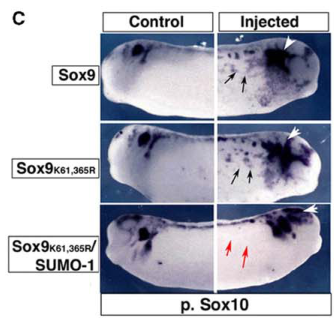

## Question

# Gene Research for Functional Annotation

## ⚠️ CRITICAL: Gene/Protein Identification Context

**BEFORE YOU BEGIN RESEARCH:** You MUST verify you are researching the CORRECT gene/protein. Gene symbols can be ambiguous, especially for less well-characterized genes from non-model organisms.

### Target Gene/Protein Identity (from UniProt):
- **UniProt Accession:** B7ZR65
- **Protein Description:** RecName: Full=Transcription factor Sox-9-A {ECO:0000305};
- **Gene Information:** Name=sox9-a; Synonyms=sox9 {ECO:0000303|PubMed:11807034};
- **Organism (full):** Xenopus laevis (African clawed frog).
- **Protein Family:** Not specified in UniProt
- **Key Domains:** HMG_box_dom. (IPR009071); HMG_box_dom_sf. (IPR036910); Sox_N. (IPR022151); SOX_TF. (IPR050917); HMG_box (PF00505)

### MANDATORY VERIFICATION STEPS:

1. **Check if the gene symbol "sox9-a" matches the protein description above**
2. **Verify the organism is correct:** Xenopus laevis (African clawed frog).
3. **Check if protein family/domains align with what you find in literature**
4. **If you find literature for a DIFFERENT gene with the same or similar symbol, STOP**

### If Gene Symbol is Ambiguous or You Cannot Find Relevant Literature:

**DO NOT PROCEED WITH RESEARCH ON A DIFFERENT GENE.** Instead:
- State clearly: "The gene symbol 'sox9-a' is ambiguous or literature is limited for this specific protein"
- Explain what you found (e.g., "Found extensive literature on a different gene with the same symbol in a different organism")
- Describe the protein based ONLY on the UniProt information provided above
- Suggest that the protein function can be inferred from domain/family information

### Research Target:

Please provide a comprehensive research report on the gene **sox9-a** (gene ID: sox9-a, UniProt: B7ZR65) in XENLA.

The research report should be a detailed narrative explaining the function, biological processes, and localization of the gene product. Citations should be given for all claims.

You should prioritize authoritative reviews and primary scientific literature when conducting research. You can supplement
this with annotations you find in gene/protein databases, but these can be outdated or inaccurate.

We are specifically interested in the primary function of the gene - for enzymes, what reaction is catalyzed, and what is the substrate specificity? For transporters, what is the substrate? For structural proteins or adapters, what is the broader structural role? For signaling molecules, what is the role in the pathway.

We are interested in where in or outside the cell the gene product carries out its function.

We are also interested in the signaling or biochemical pathways in which the gene functions. We are less interested in broad pleiotropic effects, except where these elucidate the precise role.

Include evidence where possible. We are interested in both experimental evidence as well as inference from structure, evolution, or bioinformatic analysis. Precise studies should be prioritized over high-throughput, where available.

## Output

Question: You are an expert researcher providing comprehensive, well-cited information.

Provide detailed information focusing on:
1. Key concepts and definitions with current understanding
2. Recent developments and latest research (prioritize 2023-2024 sources)
3. Current applications and real-world implementations
4. Expert opinions and analysis from authoritative sources
5. Relevant statistics and data from recent studies

Format as a comprehensive research report with proper citations. Include URLs and publication dates where available.
Always prioritize recent, authoritative sources and provide specific citations for all major claims.

# Gene Research for Functional Annotation

## ⚠️ CRITICAL: Gene/Protein Identification Context

**BEFORE YOU BEGIN RESEARCH:** You MUST verify you are researching the CORRECT gene/protein. Gene symbols can be ambiguous, especially for less well-characterized genes from non-model organisms.

### Target Gene/Protein Identity (from UniProt):
- **UniProt Accession:** B7ZR65
- **Protein Description:** RecName: Full=Transcription factor Sox-9-A {ECO:0000305};
- **Gene Information:** Name=sox9-a; Synonyms=sox9 {ECO:0000303|PubMed:11807034};
- **Organism (full):** Xenopus laevis (African clawed frog).
- **Protein Family:** Not specified in UniProt
- **Key Domains:** HMG_box_dom. (IPR009071); HMG_box_dom_sf. (IPR036910); Sox_N. (IPR022151); SOX_TF. (IPR050917); HMG_box (PF00505)

### MANDATORY VERIFICATION STEPS:

1. **Check if the gene symbol "sox9-a" matches the protein description above**
2. **Verify the organism is correct:** Xenopus laevis (African clawed frog).
3. **Check if protein family/domains align with what you find in literature**
4. **If you find literature for a DIFFERENT gene with the same or similar symbol, STOP**

### If Gene Symbol is Ambiguous or You Cannot Find Relevant Literature:

**DO NOT PROCEED WITH RESEARCH ON A DIFFERENT GENE.** Instead:
- State clearly: "The gene symbol 'sox9-a' is ambiguous or literature is limited for this specific protein"
- Explain what you found (e.g., "Found extensive literature on a different gene with the same symbol in a different organism")
- Describe the protein based ONLY on the UniProt information provided above
- Suggest that the protein function can be inferred from domain/family information

### Research Target:

Please provide a comprehensive research report on the gene **sox9-a** (gene ID: sox9-a, UniProt: B7ZR65) in XENLA.

The research report should be a detailed narrative explaining the function, biological processes, and localization of the gene product. Citations should be given for all claims.

You should prioritize authoritative reviews and primary scientific literature when conducting research. You can supplement
this with annotations you find in gene/protein databases, but these can be outdated or inaccurate.

We are specifically interested in the primary function of the gene - for enzymes, what reaction is catalyzed, and what is the substrate specificity? For transporters, what is the substrate? For structural proteins or adapters, what is the broader structural role? For signaling molecules, what is the role in the pathway.

We are interested in where in or outside the cell the gene product carries out its function.

We are also interested in the signaling or biochemical pathways in which the gene functions. We are less interested in broad pleiotropic effects, except where these elucidate the precise role.

Include evidence where possible. We are interested in both experimental evidence as well as inference from structure, evolution, or bioinformatic analysis. Precise studies should be prioritized over high-throughput, where available.

# Functional annotation report: *Xenopus laevis* sox9-a (UniProt B7ZR65)

## Identity and scope of the evidence

The supplied [UniProt B7ZR65 record](https://www.uniprot.org/uniprotkb/B7ZR65/entry) identifies the target as *Xenopus laevis* (African clawed frog) transcription factor Sox-9-A, encoded by **sox9-a** (also called **sox9**). Its annotated HMG-box, Sox_N and SOX-transcription-factor domains agree with the literature’s classification of Sox9 as a DNA-binding SoxE transcription factor. This is **not** the fish protein commonly called sox9a. The gene symbol **“sox9-a” is ambiguous across organisms, and literature that identifies this specific Xenopus protein by accession is limited**. The Xenopus experiments below generally name their reagent or measured transcript “Sox9,” without establishing that their results apply uniquely to B7ZR65 rather than another Xenopus Sox9 form. Consequently, they support annotation of **Xenopus Sox9 function**, with accession-specific attribution treated as an inference. (taylor2005soxefactorsfunction pages 1-2, schock2020sortingsoxdiverse pages 4-5)

## Primary molecular function and cellular location

**Sox9 is a developmental transcriptional regulator, not an enzyme, transporter or extracellular signaling ligand.** Its HMG box is the defining DNA-binding domain of Sox proteins; SoxE factors, including Sox9, regulate transcription in cooperation with other proteins. Thus, the relevant functional location is **the nucleus**, at regulatory DNA and associated transcriptional complexes—not the extracellular space or cartilage matrix. Nuclear DNA engagement is strongly supported by the domain and Sox-family mechanism, although the retrieved Xenopus studies do **not** provide a B7ZR65-specific nuclear-localization or DNA-occupancy assay. Sox8 and Sox10 are related SoxE factors and can substitute for Sox9 in some developmental assays, so a Sox9-expression result alone does not identify a unique Sox9-A target gene. (taylor2005soxefactorsfunction pages 1-2, taylor2005soxefactorsfunction pages 3-4, schock2020sortingsoxdiverse pages 4-5)

An experimentally characterized biochemical switch is **SUMOylation**. Taylor and LaBonne found that Xenopus Sox9 can be SUMOylated at K61 and, predominantly, K365; altering these sites changed developmental activity without detectable change in protein stability. In their embryo assays, non-SUMOylatable Sox9 increased the neural-crest marker **Sox10** in **97% of embryos (n=81)**, whereas a constitutive SUMO-1 fusion inhibited Sox10 in **97% (n=82)**. The same constructs produced ectopic melanoblasts in **92% (n=121)** and **0% (n=162)**, respectively. These results establish a context-dependent change in Sox9 regulatory output, **not** direct Sox9 binding to the *sox10* gene. Taylor and LaBonne, *Developmental Cell*, November 2005, [doi:10.1016/j.devcel.2005.09.016](https://doi.org/10.1016/j.devcel.2005.09.016). (taylor2005soxefactorsfunction pages 4-6, taylor2005soxefactorsfunction media 5ac7f9ca)

## Biological processes and pathway placement

**Neural-crest specification.** Sox9 is expressed in Xenopus neural-crest precursors after Sox8 and before Sox10. Embryonic depletion of Sox9 has been reported to impair neural-crest precursor formation, while increased Sox9 can expand the precursor domain. A particularly informative functional-rescue experiment depleted Sox10: early neural-crest-marker expression was reduced or absent in **90% (n=59)** of depleted embryos, but only **18% (n=40)** remained inhibited following Sox9 mRNA co-expression, close to **21% (n=52)** after Sox10 mRNA rescue. Sox9 therefore has demonstrated **SoxE-like regulatory capacity in the neural-crest program**, although this rescue does not show that endogenous Sox9-A alone is indispensable. Taylor and LaBonne, 2005, [doi:10.1016/j.devcel.2005.09.016](https://doi.org/10.1016/j.devcel.2005.09.016); Schock and LaBonne, review, *Frontiers in Physiology*, December 2020, [doi:10.3389/fphys.2020.606889](https://doi.org/10.3389/fphys.2020.606889). (taylor2005soxefactorsfunction pages 3-4, taylor2005soxefactorsfunction pages 1-2, schock2020sortingsoxdiverse pages 4-5)

**Otic-placode and inner-ear development.** Sox9 is an early marker of the induced Xenopus otic placode, and Sox9 depletion has been reported to prevent normal inner-ear formation. In a gain-of-function study, Sox9 produced **enlarged ears in 55% (n=94)** of embryos and increased expression of the early otic marker **Pax8 in 52% (n=50)**; enlarged or ectopic otocysts were also observed. A constitutive SUMO–Sox9 fusion expanded placodal Pax8 expression in **47% (n=44)**, whereas non-SUMOylatable Sox9 reduced it in **61% (n=55)**. These findings place Sox9 activity in **otic fate specification and development**, rather than a biochemical pathway in which Sox9 itself is a secreted signal. Taylor and LaBonne, 2005, [doi:10.1016/j.devcel.2005.09.016](https://doi.org/10.1016/j.devcel.2005.09.016). (taylor2005soxefactorsfunction pages 1-2, taylor2005soxefactorsfunction pages 3-4, taylor2005soxefactorsfunction media 5ac7f9ca)

**Craniofacial cartilage.** Sox9 expression persists in cells contributing to facial cartilage. A review of Xenopus loss-of-function work reports severe craniofacial chondrogenic defects in Sox9 morphants, including loss of **Meckel’s cartilage**. This supports a role in converting neural-crest-derived cells into craniofacial cartilage. However, frequently cited statements that SOX9 directly regulates **COL2A1** or opposes osteoblast fate rely substantially on experiments in other vertebrates; the material reviewed here does **not** establish either as a direct transcriptional action of B7ZR65 in Xenopus. Schock and LaBonne, 2020, [doi:10.3389/fphys.2020.606889](https://doi.org/10.3389/fphys.2020.606889), discussing Spokony *et al.*, *Development*, January 2002, [doi:10.1242/dev.129.2.421](https://doi.org/10.1242/dev.129.2.421). (taylor2005soxefactorsfunction pages 1-2, schock2020sortingsoxdiverse pages 6-7)

**Relation to upstream signaling and migration.** Xenopus experiments place **Dkk2, Lrp6 and β-catenin** in Wnt-linked neural-crest induction. Dkk2 overexpression expanded the territory expressing *sox9* and other crest markers, whereas Dkk2 depletion displaced *sox9* expression laterally rather than clearly abolishing it. This places *sox9* expression **within a Wnt-responsive developmental context**; it does not demonstrate that Dkk2 physically regulates Sox9-A or that Sox9 directly transduces Wnt signaling. Devotta *et al.*, *eLife*, July 2018, [doi:10.7554/eLife.34404](https://doi.org/10.7554/eLife.34404). (devotta2018dkk2promotesneural pages 4-7)

## Recent research and application of the annotation

A relevant **2023 primary study** used *sox9* to distinguish an already specified neural-crest territory from its subsequent epithelial–mesenchymal transition (EMT) and migration. When placodal **MMP28** was depleted in *X. laevis*, *twist*, *sox10*, *snai2*, *sox8* and *foxd3* decreased, but **sox9 and snai1 expression were unaffected**; the researchers used the latter two transcripts to identify the remaining neural-crest territory. This refines Sox9’s use as an **experimental marker of crest identity**: loss of later EMT regulators or migration need not entail loss of *sox9* expression. Crucially, **MMP28—not Sox9—was perturbed** in this study, so the result is not evidence that Sox9 controls MMP28 or Twist. Gouignard *et al.*, *PLOS Biology*, **17 August 2023**, [doi:10.1371/journal.pbio.3002261](https://doi.org/10.1371/journal.pbio.3002261). (gouignard2023paracrineregulationof pages 1-2, gouignard2023paracrineregulationof pages 4-6, gouignard2023paracrineregulationof pages 2-4)

This is the principal **real-world implementation** supported by the recent evidence: measuring *sox9* expression to map or assess neural-crest tissue in Xenopus embryo experiments. Xenopus Sox9 perturbation and rescue also provide an **in vivo research model** for otic and craniofacial development; they should not be interpreted as a clinical use or as proof of an accession-specific therapeutic target. No retrieved **2023–2024** primary experiment definitively assigned a newly measured mechanism specifically to B7ZR65. (taylor2005soxefactorsfunction pages 3-4, gouignard2023paracrineregulationof pages 4-6, schock2020sortingsoxdiverse pages 6-7)

The evidence matrix below separates direct Sox9 perturbations from studies that only measured *sox9* expression.

| Biological claim | Exact experimental support and numerical findings | Evidence level / specificity caveat | Study DOI / year |
|---|---|---|---|
| Sox9 has SoxE activity capable of supporting neural-crest precursor formation. | Sox10 morpholino reduced or eliminated early neural-crest-marker expression in 90% of embryos (n=59). Co-expression of Sox9 reduced the inhibited fraction to 18% (n=40), similar to rescue with Sox10 (21% inhibited; n=52). (taylor2005soxefactorsfunction pages 3-4) | Primary Xenopus embryo rescue experiment. Demonstrates functional interchangeability with Sox10, but the construct was called generic “Sox9”; it was not accession-resolved to B7ZR65/sox9-a. | [10.1016/j.devcel.2005.09.016](https://doi.org/10.1016/j.devcel.2005.09.016), 2005 |
| Sox9 promotes otic-placode and inner-ear development. | Sox9 expression produced enlarged ears in 55% of embryos (n=94) and supernumerary otocysts in approximately 3%–5%; it expanded the early otic marker Pax8 in 52% (n=50). (taylor2005soxefactorsfunction pages 3-4) | Primary gain-of-function evidence in Xenopus. Earlier morpholino work also reported failure of inner-ear formation after Sox9 depletion, but neither study unambiguously identifies B7ZR65. (taylor2005soxefactorsfunction pages 1-2) | [10.1016/j.devcel.2005.09.016](https://doi.org/10.1016/j.devcel.2005.09.016), 2005 |
| SUMOylation switches Sox9 between neural-crest/melanocyte-promoting and otic-promoting activities. | Biochemical assays identified Sox9 SUMOylation at K61 and predominantly K365. Non-SUMOylatable Sox9 K61,365R increased Sox10 expression in 97% (n=81), whereas a constitutive SUMO-1 fusion inhibited Sox10 in 97% (n=82). The non-SUMOylatable form induced ectopic melanoblasts in 92% (n=121), versus 0% (n=162) for the SUMO fusion; conversely, the SUMO fusion expanded Pax8 in 47% (n=44), while the non-SUMOylatable form reduced placodal Pax8 in 61% (n=55). (taylor2005soxefactorsfunction media 5ac7f9ca, taylor2005soxefactorsfunction pages 4-6) | Strong primary biochemical and embryo perturbation evidence. Mutating the sites did not alter protein stability, supporting altered regulatory activity rather than degradation. The Sox9 reagent remains accession-ambiguous. (taylor2005soxefactorsfunction pages 4-6) | [10.1016/j.devcel.2005.09.016](https://doi.org/10.1016/j.devcel.2005.09.016), 2005 |
| Xenopus Sox9 is required for normal craniofacial chondrogenesis. | An authoritative review reports that Sox9 morphants show severe craniofacial cartilage defects, including complete loss of Meckel’s cartilage, citing Spokony et al. (2002). (schock2020sortingsoxdiverse pages 6-7) | Secondary evidence summarizing a primary Xenopus study. The associated statements about failure of mesenchymal condensation and direct Col2a1 regulation draw substantially on mammalian work and should not be treated as direct B7ZR65-specific Xenopus validation. | [10.3389/fphys.2020.606889](https://doi.org/10.3389/fphys.2020.606889), 2020; underlying study [10.1242/dev.129.2.421](https://doi.org/10.1242/dev.129.2.421), 2002 |
| Dkk2/Wnt–β-catenin signaling is associated with expansion of the sox9-positive neural-crest domain. | Dkk2 overexpression laterally expanded sox8, sox9 and sox10 expression, resembling Wnt8, Lrp6 and β-catenin gain-of-function. Dkk2 depletion shifted sox9 laterally rather than clearly reducing its level, while Lrp6 or β-catenin rescued other neural-crest defects. (devotta2018dkk2promotesneural pages 4-7) | Primary Xenopus pathway evidence positioning Dkk2 upstream of Lrp6/β-catenin. Sox9 was an expression readout; no direct Dkk2/Sox9 interaction, Sox9 DNA binding or B7ZR65-specific regulation was demonstrated. | [10.7554/eLife.34404](https://doi.org/10.7554/eLife.34404), 2018 |
| Sox9 marks induced neural crest independently of a later MMP28-dependent EMT module. | Placodal MMP28 knockdown strongly reduced twist, sox10, snai2, sox8 and foxd3, but did not affect sox9 or snai1. The residual neural-crest territory was identified by co-expression of sox9 and snai1; migration measured with sox9 showed significant impairment (control n=53, splice-MO n=44, translation-MO n=7; p=0.0034 for a reported comparison). (gouignard2023paracrineregulationof pages 4-6, gouignard2023paracrineregulationof pages 2-4) | Recent primary Xenopus laevis evidence. Sox9 was a lineage marker, not the manipulated molecule; the result suggests Sox9 expression precedes or lies outside the MMP28–Twist EMT branch, but it does not establish a direct pathway relationship or accession identity. | [10.1371/journal.pbio.3002261](https://doi.org/10.1371/journal.pbio.3002261), published 17 August 2023 |
| Accession-level attribution remains unresolved. | The supplied UniProt record identifies B7ZR65 as Xenopus laevis Transcription factor Sox-9-A, gene sox9-a, with Sox/HMG domains. Retrieved functional studies generally use “Sox9” without accession- or homeolog-specific reagents. | Functions above are best annotated as experimentally supported for Xenopus Sox9/SoxE and biologically plausible for B7ZR65, not proven uniquely for Sox9-A. Fish sox9a studies concern different proteins and are excluded. | UniProt B7ZR65; literature evidence summarized above |

*Table: Experimental evidence supporting functional annotation of Xenopus laevis Sox9, with quantitative findings and explicit accession-level limitations. The table separates direct perturbation evidence from pathway-marker observations and cross-study inference.*

**Annotation conclusion.** The best-supported functional description for B7ZR65 is **a presumptive nuclear SoxE/HMG-box transcription factor contributing to neural-crest specification, otic development and craniofacial chondrogenesis, with developmental output modulated by SUMOylation**. Nuclear localization and SoxE molecular activity follow from its supplied domain identity and Xenopus Sox9 experiments; the **specificity of those experimental results for the Sox9-A protein B7ZR65 remains unverified**. Direct B7ZR65 DNA targets and protein-specific subcellular measurements remain unresolved in the evidence reviewed. (taylor2005soxefactorsfunction pages 1-2, taylor2005soxefactorsfunction pages 4-6, schock2020sortingsoxdiverse pages 6-7)

References

1. (taylor2005soxefactorsfunction pages 1-2): Kimberly M. Taylor and Carole LaBonne. Soxe factors function equivalently during neural crest and inner ear development and their activity is regulated by sumoylation. Developmental cell, 9 5:593-603, Nov 2005. URL: https://doi.org/10.1016/j.devcel.2005.09.016, doi:10.1016/j.devcel.2005.09.016. This article has 213 citations and is from a highest quality peer-reviewed journal.

2. (schock2020sortingsoxdiverse pages 4-5): Elizabeth N. Schock and Carole LaBonne. Sorting sox: diverse roles for sox transcription factors during neural crest and craniofacial development. Frontiers in Physiology, Dec 2020. URL: https://doi.org/10.3389/fphys.2020.606889, doi:10.3389/fphys.2020.606889. This article has 87 citations.

3. (taylor2005soxefactorsfunction pages 3-4): Kimberly M. Taylor and Carole LaBonne. Soxe factors function equivalently during neural crest and inner ear development and their activity is regulated by sumoylation. Developmental cell, 9 5:593-603, Nov 2005. URL: https://doi.org/10.1016/j.devcel.2005.09.016, doi:10.1016/j.devcel.2005.09.016. This article has 213 citations and is from a highest quality peer-reviewed journal.

4. (taylor2005soxefactorsfunction pages 4-6): Kimberly M. Taylor and Carole LaBonne. Soxe factors function equivalently during neural crest and inner ear development and their activity is regulated by sumoylation. Developmental cell, 9 5:593-603, Nov 2005. URL: https://doi.org/10.1016/j.devcel.2005.09.016, doi:10.1016/j.devcel.2005.09.016. This article has 213 citations and is from a highest quality peer-reviewed journal.

5. (taylor2005soxefactorsfunction media 5ac7f9ca): Kimberly M. Taylor and Carole LaBonne. Soxe factors function equivalently during neural crest and inner ear development and their activity is regulated by sumoylation. Developmental cell, 9 5:593-603, Nov 2005. URL: https://doi.org/10.1016/j.devcel.2005.09.016, doi:10.1016/j.devcel.2005.09.016. This article has 213 citations and is from a highest quality peer-reviewed journal.

6. (schock2020sortingsoxdiverse pages 6-7): Elizabeth N. Schock and Carole LaBonne. Sorting sox: diverse roles for sox transcription factors during neural crest and craniofacial development. Frontiers in Physiology, Dec 2020. URL: https://doi.org/10.3389/fphys.2020.606889, doi:10.3389/fphys.2020.606889. This article has 87 citations.

7. (devotta2018dkk2promotesneural pages 4-7): Arun Devotta, Chang-Soo Hong, and Jean-Pierre Saint-Jeannet. Dkk2 promotes neural crest specification by activating wnt/β-catenin signaling in a gsk3β independent manner. eLife, Jul 2018. URL: https://doi.org/10.7554/elife.34404, doi:10.7554/elife.34404. This article has 50 citations and is from a domain leading peer-reviewed journal.

8. (gouignard2023paracrineregulationof pages 1-2): Nadège Gouignard, Anne Bibonne, João F. Mata, Fernanda Bajanca, Bianka Berki, Elias H. Barriga, Jean-Pierre Saint-Jeannet, and Eric Theveneau. Paracrine regulation of neural crest emt by placodal mmp28. PLOS Biology, 21:e3002261, Aug 2023. URL: https://doi.org/10.1371/journal.pbio.3002261, doi:10.1371/journal.pbio.3002261. This article has 8 citations and is from a highest quality peer-reviewed journal.

9. (gouignard2023paracrineregulationof pages 4-6): Nadège Gouignard, Anne Bibonne, João F. Mata, Fernanda Bajanca, Bianka Berki, Elias H. Barriga, Jean-Pierre Saint-Jeannet, and Eric Theveneau. Paracrine regulation of neural crest emt by placodal mmp28. PLOS Biology, 21:e3002261, Aug 2023. URL: https://doi.org/10.1371/journal.pbio.3002261, doi:10.1371/journal.pbio.3002261. This article has 8 citations and is from a highest quality peer-reviewed journal.

10. (gouignard2023paracrineregulationof pages 2-4): Nadège Gouignard, Anne Bibonne, João F. Mata, Fernanda Bajanca, Bianka Berki, Elias H. Barriga, Jean-Pierre Saint-Jeannet, and Eric Theveneau. Paracrine regulation of neural crest emt by placodal mmp28. PLOS Biology, 21:e3002261, Aug 2023. URL: https://doi.org/10.1371/journal.pbio.3002261, doi:10.1371/journal.pbio.3002261. This article has 8 citations and is from a highest quality peer-reviewed journal.

## Artifacts

- [Edison artifact artifact-00](sox9-a-deep-research-falcon_artifacts/artifact-00.md)

## Citations

1. taylor2005soxefactorsfunction pages 3-4
2. taylor2005soxefactorsfunction pages 1-2
3. taylor2005soxefactorsfunction pages 4-6
4. schock2020sortingsoxdiverse pages 6-7
5. schock2020sortingsoxdiverse pages 4-5
6. gouignard2023paracrineregulationof pages 1-2
7. gouignard2023paracrineregulationof pages 4-6
8. gouignard2023paracrineregulationof pages 2-4
9. UniProt B7ZR65 record
10. doi:10.1016/j.devcel.2005.09.016
11. doi:10.3389/fphys.2020.606889
12. doi:10.1242/dev.129.2.421
13. doi:10.7554/eLife.34404
14. doi:10.1371/journal.pbio.3002261
15. 10.1016/j.devcel.2005.09.016
16. 10.3389/fphys.2020.606889
17. 10.1242/dev.129.2.421
18. 10.7554/eLife.34404
19. 10.1371/journal.pbio.3002261
20. https://www.uniprot.org/uniprotkb/B7ZR65/entry
21. https://doi.org/10.1016/j.devcel.2005.09.016
22. https://doi.org/10.3389/fphys.2020.606889
23. https://doi.org/10.1242/dev.129.2.421
24. https://doi.org/10.7554/eLife.34404
25. https://doi.org/10.1371/journal.pbio.3002261
26. https://doi.org/10.1016/j.devcel.2005.09.016,
27. https://doi.org/10.3389/fphys.2020.606889,
28. https://doi.org/10.7554/elife.34404,
29. https://doi.org/10.1371/journal.pbio.3002261,