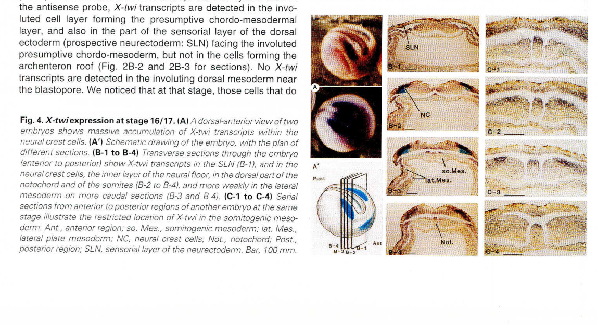

## Question

# Gene Research for Functional Annotation

## ⚠️ CRITICAL: Gene/Protein Identification Context

**BEFORE YOU BEGIN RESEARCH:** You MUST verify you are researching the CORRECT gene/protein. Gene symbols can be ambiguous, especially for less well-characterized genes from non-model organisms.

### Target Gene/Protein Identity (from UniProt):
- **UniProt Accession:** P13903
- **Protein Description:** RecName: Full=Twist-related protein; AltName: Full=T18; AltName: Full=X-twist;
- **Gene Information:** Name=twist1; Synonyms=xtwi;
- **Organism (full):** Xenopus laevis (African clawed frog).
- **Protein Family:** Not specified in UniProt
- **Key Domains:** bHLH_dom. (IPR011598); E-box_TF_Regulators. (IPR050283); HLH_DNA-bd_sf. (IPR036638); TWIST1_bHLH. (IPR047093); HLH (PF00010)

### MANDATORY VERIFICATION STEPS:

1. **Check if the gene symbol "twist1" matches the protein description above**
2. **Verify the organism is correct:** Xenopus laevis (African clawed frog).
3. **Check if protein family/domains align with what you find in literature**
4. **If you find literature for a DIFFERENT gene with the same or similar symbol, STOP**

### If Gene Symbol is Ambiguous or You Cannot Find Relevant Literature:

**DO NOT PROCEED WITH RESEARCH ON A DIFFERENT GENE.** Instead:
- State clearly: "The gene symbol 'twist1' is ambiguous or literature is limited for this specific protein"
- Explain what you found (e.g., "Found extensive literature on a different gene with the same symbol in a different organism")
- Describe the protein based ONLY on the UniProt information provided above
- Suggest that the protein function can be inferred from domain/family information

### Research Target:

Please provide a comprehensive research report on the gene **twist1** (gene ID: twist1, UniProt: P13903) in XENLA.

The research report should be a detailed narrative explaining the function, biological processes, and localization of the gene product. Citations should be given for all claims.

You should prioritize authoritative reviews and primary scientific literature when conducting research. You can supplement
this with annotations you find in gene/protein databases, but these can be outdated or inaccurate.

We are specifically interested in the primary function of the gene - for enzymes, what reaction is catalyzed, and what is the substrate specificity? For transporters, what is the substrate? For structural proteins or adapters, what is the broader structural role? For signaling molecules, what is the role in the pathway.

We are interested in where in or outside the cell the gene product carries out its function.

We are also interested in the signaling or biochemical pathways in which the gene functions. We are less interested in broad pleiotropic effects, except where these elucidate the precise role.

Include evidence where possible. We are interested in both experimental evidence as well as inference from structure, evolution, or bioinformatic analysis. Precise studies should be prioritized over high-throughput, where available.

## Output

Question: You are an expert researcher providing comprehensive, well-cited information.

Provide detailed information focusing on:
1. Key concepts and definitions with current understanding
2. Recent developments and latest research (prioritize 2023-2024 sources)
3. Current applications and real-world implementations
4. Expert opinions and analysis from authoritative sources
5. Relevant statistics and data from recent studies

Format as a comprehensive research report with proper citations. Include URLs and publication dates where available.
Always prioritize recent, authoritative sources and provide specific citations for all major claims.

# Gene Research for Functional Annotation

## ⚠️ CRITICAL: Gene/Protein Identification Context

**BEFORE YOU BEGIN RESEARCH:** You MUST verify you are researching the CORRECT gene/protein. Gene symbols can be ambiguous, especially for less well-characterized genes from non-model organisms.

### Target Gene/Protein Identity (from UniProt):
- **UniProt Accession:** P13903
- **Protein Description:** RecName: Full=Twist-related protein; AltName: Full=T18; AltName: Full=X-twist;
- **Gene Information:** Name=twist1; Synonyms=xtwi;
- **Organism (full):** Xenopus laevis (African clawed frog).
- **Protein Family:** Not specified in UniProt
- **Key Domains:** bHLH_dom. (IPR011598); E-box_TF_Regulators. (IPR050283); HLH_DNA-bd_sf. (IPR036638); TWIST1_bHLH. (IPR047093); HLH (PF00010)

### MANDATORY VERIFICATION STEPS:

1. **Check if the gene symbol "twist1" matches the protein description above**
2. **Verify the organism is correct:** Xenopus laevis (African clawed frog).
3. **Check if protein family/domains align with what you find in literature**
4. **If you find literature for a DIFFERENT gene with the same or similar symbol, STOP**

### If Gene Symbol is Ambiguous or You Cannot Find Relevant Literature:

**DO NOT PROCEED WITH RESEARCH ON A DIFFERENT GENE.** Instead:
- State clearly: "The gene symbol 'twist1' is ambiguous or literature is limited for this specific protein"
- Explain what you found (e.g., "Found extensive literature on a different gene with the same symbol in a different organism")
- Describe the protein based ONLY on the UniProt information provided above
- Suggest that the protein function can be inferred from domain/family information

### Research Target:

Please provide a comprehensive research report on the gene **twist1** (gene ID: twist1, UniProt: P13903) in XENLA.

The research report should be a detailed narrative explaining the function, biological processes, and localization of the gene product. Citations should be given for all claims.

You should prioritize authoritative reviews and primary scientific literature when conducting research. You can supplement
this with annotations you find in gene/protein databases, but these can be outdated or inaccurate.

We are specifically interested in the primary function of the gene - for enzymes, what reaction is catalyzed, and what is the substrate specificity? For transporters, what is the substrate? For structural proteins or adapters, what is the broader structural role? For signaling molecules, what is the role in the pathway.

We are interested in where in or outside the cell the gene product carries out its function.

We are also interested in the signaling or biochemical pathways in which the gene functions. We are less interested in broad pleiotropic effects, except where these elucidate the precise role.

Include evidence where possible. We are interested in both experimental evidence as well as inference from structure, evolution, or bioinformatic analysis. Precise studies should be prioritized over high-throughput, where available.

# Functional annotation of *twist1* in *Xenopus laevis*

## Identity and principal function

**The requested protein is the African clawed frog (*Xenopus laevis*) Twist-related protein, UniProt [P13903](https://www.uniprot.org/uniprotkb/P13903/entry), encoded by *twist1* and also called **X-twi/X-twist**; T18 and *xtwi* are aliases supplied with the accession.** The original frog sequence was described as twist-related, and subsequent comparison of vertebrate sequences and embryonic expression supported calling X-twi a vertebrate Twist homolog. This is not an annotation of human TWIST1, zebrafish *twist1* paralogs, or the related Twist-family factor Paraxis. (stoetzel2004xtwiisexpressed pages 7-8)

Its **primary molecular role is transcriptional regulation**, not catalysis, transport, or extracellular structural support. The supplied UniProt annotation identifies a basic helix–loop–helix (bHLH) DNA-binding domain, consistent with the literature’s description of a basic region recognizing E-box DNA motifs (CANNTG) and a helix–loop–helix region enabling dimerization with another Twist molecule or an E protein such as E12/E47. A separate conserved carboxy-terminal **WR domain**, or Twist box, mediates regulatory protein interactions. DNA-recognition capability does not establish which endogenous *X. laevis* genes are **direct** Twist-bound targets; the clearest frog-specific mechanistic experiments instead concern its interaction with Snail factors and its effect on neural-crest fate. (lander2013interactionsbetweentwist pages 2-4, lander2013interactionsbetweentwist pages 4-5)

The best-supported developmental assignment is **control of cranial neural-crest formation and differentiation, particularly the balance between craniofacial cartilage-associated and alternative neural-crest programs**. This is more precise than describing Twist simply as a universal switch for epithelial–mesenchymal transition (EMT) or cell migration. Its expression in mesoderm and somites indicates additional developmental contexts, but the evidence reviewed here is strongest for its neural-crest role. (lander2013interactionsbetweentwist pages 2-4, lander2013interactionsbetweentwist pages 5-7, stoetzel2004xtwiisexpressed pages 4-5)

## Where and when it acts

Stoetzel and colleagues detected **X-twi RNA**, not protein, in unfertilized eggs and before gastrulation; signal increased from approximately embryonic stages 8–9. Their RT-PCR assessment assigned **49% of detected egg X-twi signal to the animal quarter, 28% to the equatorial half, and 23% to the vegetal quarter** under their sampling scheme. These are regional RNA measurements, not protein abundances or a measure of developmental importance. At stages 13–14, transcripts appeared in presumptive neural and mesodermal territories, including the prechordal region and forming notochord. They became prominent in cranial neural crest around stages 16–17, marked migrating cephalic crest around stages 22–23, and were subsequently detected in branchial arches and somitic tissues. Expression persisted in embryos experimentally dorsalized with LiCl or ventralized by UV treatment, suggesting that initial expression does not require normal dorsal–ventral mesoderm regionalization; these experiments do **not** establish what the early RNA does. The journal article itself is printed as **1998**, although some searchable metadata assign it a later year. (stoetzel2004xtwiisexpressed pages 3-4, stoetzel2004xtwiisexpressed pages 4-5, stoetzel2004xtwiisexpressed pages 1-2, stoetzel2004xtwiisexpressed pages 6-7)

The original study’s **Figure 4** documents the especially strong stage-16/17 neural-crest *mRNA* signal in whole embryos and sections. It should not be interpreted as immunolocalization of Twist protein. (stoetzel2004xtwiisexpressed pages 4-5, stoetzel2004xtwiisexpressed media 9f9c5545)

**Subcellular location:** a bHLH factor that recognizes genomic regulatory DNA and influences chromatin recruitment is expected to perform its principal transcriptional function **in the nucleus of expressing cells**. However, the frog studies retrieved here do not establish an endogenous P13903 protein distribution by nuclear/cytoplasmic staining. Embryonic in situ hybridization identifies *transcript-bearing cells*, not the protein’s compartment. No extracellular site, membrane-transporter role, or catalytic substrate is supported. (lander2013interactionsbetweentwist pages 9-9, lander2013interactionsbetweentwist pages 2-4, stoetzel2004xtwiisexpressed pages 4-5)

## Direct functional and biochemical evidence

In the most informative *X. laevis* perturbation study, Lander and colleagues delivered a **translation-blocking Twist morpholino** into a prospective neural-crest blastomere. Depletion diminished neural-crest *Snail1/Snail2* expression, markedly reduced *Sox9* and *Sox10*, expanded the neural-border marker *Zic1*, and impaired later cranial cartilage. At later stages, loss of the cartilage-associated marker *Sox9* was accompanied by increased expression of the glial-associated marker *Foxd3*. Importantly, a **morpholino-resistant Twist construct rescued Sox9 expression**, strengthening the causal attribution to Twist depletion. Both too little and ectopic excess Twist disturbed normal neural-crest development: its effect is dosage- and context-dependent. Marker changes indicate altered developmental programs; they should not automatically be called direct Twist transcriptional targets. (lander2013interactionsbetweentwist pages 2-4, lander2013interactionsbetweentwist pages 1-2)

Co-immunoprecipitation showed that frog Twist interacts with **Snail1 and Snail2** through its WR domain; removing that domain prevents normal Snail binding and produces neural-crest phenotypes resembling Twist depletion. The interaction can reduce **Snail2 recruitment to E-box-containing chromatin**, even though it does not simply abolish Twist dimerization or DNA-binding capacity. Twist therefore does not act solely as an isolated DNA-binding switch: it also regulates the activity of another set of developmental transcription factors. The study does **not** support the blanket claim that Twist transcriptionally represses both *snail* genes: their expression responses depend on experimental context. (lander2013interactionsbetweentwist pages 4-5, lander2013interactionsbetweentwist pages 4-4, lander2013interactionsbetweentwist pages 9-9)

**GSK3β phosphorylation provides a regulatory connection to signaling.** Kinase assays and LiCl-sensitive phosphorylation in embryo extracts support phosphorylation of the Twist carboxy-terminal region. Substituting **serine 148** with nonphosphorylatable alanine weakened Snail2 binding, reduced cartilage-associated *Sox9*, and increased *Foxd3/Sox10*; a phosphomimetic aspartate substitution had substantially different, often opposite, effects. Wnt8 expression reduced Twist–Snail2 association, consistent with inhibition of GSK3 activity. These assays establish a plausible **Wnt–GSK3–Twist/Snail regulatory interface** in the experimental system; they do not show that every Wnt effect on frog neural crest is mediated by Twist. (lander2013interactionsbetweentwist pages 5-7, lander2013interactionsbetweentwist pages 7-8, lander2013interactionsbetweentwist pages 8-9)

## Position in developmental pathways

At the upstream end of the neural-crest gene-regulatory network, **Pax3 promotes *twist1* expression**. In *X. laevis* animal-cap experiments, induced Pax3 activated *twist1* despite blockade of new protein synthesis, and Pax3 depletion decreased *twist1* in embryos. Zic1 alone neither induced it in that assay nor was required for its measured expression in vivo. Thus *twist1* is an **immediate-early, potentially direct Pax3-responsive gene** in these conditions—not a demonstrated direct Zic1 target. Direct Pax3 occupancy of a frog *twist1* regulatory sequence was not established by those particular experiments; Pax3/Zic1 binding assays in the paper examined other loci. A separate Pax3/Zic1 animal-cap screen also recovered *twist* among downstream neural-crest genes. The broader FGF/Wnt/BMP neural-border signaling framework supplies context for Pax3 induction, but does not by itself demonstrate ligand-to-Twist specificity. (plouhinec2014pax3andzic1 pages 4-8, bae2014identificationofpax3 pages 1-2, plouhinec2014pax3andzic1 pages 1-2)

Taken together, the experimentally supported pathway-level description is **neural-border regulation → Pax3-responsive *twist1* expression → Twist-dependent neural-crest gene programs and WR-domain interactions with Snail1/Snail2**, with GSK3-sensitive phosphorylation modulating the latter interactions. This is a transcriptional and cell-fate regulatory role rather than a claim that Twist itself secretes a signal or drives cell movement directly. (plouhinec2014pax3andzic1 pages 4-8, lander2013interactionsbetweentwist pages 2-4, lander2013interactionsbetweentwist pages 5-7)

## Recent research and research use

A **2024 single-cell and validation study** placed *twist1* in later premigratory and ectomesoderm-associated neural-crest states. Its discovery single-cell series resequenced whole ** *X. tropicalis* ** embryos; *X. laevis* neural-border/crest explants provided part of the experimental network validation. In the latter, **TFAP2e knockdown reduced 586 genes overall, including *twist1***. The number 586 describes the whole affected gene set, **not** a *twist1*-specific effect size, and the authors did not directly knock down Twist in that test. Its reported 16 neural-crest transcriptional states concern the wider dataset, not 16 Twist-defined populations. This mixed-species design makes species identification indispensable when annotating P13903. (kotov2024atimeresolvedsinglecell pages 1-2, kotov2024atimeresolvedsinglecell pages 2-3, kotov2024atimeresolvedsinglecell pages 4-5)

In another **2024 comparison**, *X. laevis* *twist1* transcript abundance increased across sampled blastula-to-neural-crest stages, unlike the corresponding lamprey expression trajectory. The reported cross-species correlations—**r = 0.60** at blastula and **r = 0.28–0.29** in sampled neural-crest stages—describe broader transcriptomic comparisons, **not Twist-specific measurements**. The expression difference suggests developmental-network evolution but does not establish a different biochemical function or functional requirement for Twist. (york2024sharedfeaturesof pages 4-6, york2024sharedfeaturesof pages 3-4, york2024sharedfeaturesof pages 1-3)

A practical implementation is **whole-mount *twist1* RNA in situ hybridization as a readout of cranial neural-crest populations and pharyngeal-arch streams**. For example, a *X. laevis* Hmgn1-depletion study measured fewer *twist1*-positive cells and altered crest-stream extension alongside other neural-crest readouts. A changed *twist1* stain under another gene’s perturbation is evidence about the marked cell population or its transcriptional state—not proof that Twist directly caused the observed movement defect. Nor do these developmental experiments constitute a demonstrated therapeutic application of the frog protein. (ihewulezi2021functionofchromatin pages 1-2, ihewulezi2021functionofchromatin pages 6-7)

The distinction between **RNA expression, protein activity, and fate** remains important. A 2026 vertebrate comparative study proposed that destabilization through an AU-rich *Twist1* 3′ UTR can delay transcript accumulation despite earlier enhancer activity, favoring later ectomesenchymal identity; its species-specific results should not be transferred to **P13903** without confirming that the assayed sequence was the *X. laevis* locus. Likewise, a zebrafish Twist1–BMP/Id2a–FGF model is informative comparative biology, **not** direct experimental evidence for those precise interactions in this frog protein. (busby2026ectomesenchymalidentityemerges pages 1-2, busby2026ectomesenchymalidentityemerges pages 6-8)

The evidence by organism and method is summarized below. (lander2013interactionsbetweentwist pages 2-4, plouhinec2014pax3andzic1 pages 4-8, kotov2024atimeresolvedsinglecell pages 2-3)

| Study | Species and experimental test | Main *twist1* finding | Interpretation and limitation |
|---|---|---|---|
| [Stoetzel et al. (1998)](https://doi.org/10.1387/ijdb.9727830) | *X. laevis* RT-PCR and whole-mount/section in situ hybridization across embryonic stages | Maternal/early RNA was detected before gastrulation, increased from stages 8–9, and accumulated strongly in cranial neural crest at stages 16/17; later signal marked migrating cranial crest, branchial arches, somites and mesoderm. (stoetzel2004xtwiisexpressed pages 3-4, stoetzel2004xtwiisexpressed pages 4-5, stoetzel2004xtwiisexpressed pages 1-2) | Establishes when and where the transcript occurs, not protein localization or functional necessity. Early low-level RNA does not by itself prove an early developmental function. |
| [Lander et al. (2013)](https://doi.org/10.1038/ncomms2543) | *X. laevis* targeted translation-blocking morpholino, morpholino-resistant rescue, gain-of-function, co-immunoprecipitation and phosphorylation-mutant assays | Depletion reduced neural-crest Sox9/Sox10 and impaired cranial cartilage; morpholino-resistant Twist rescued Sox9. The WR domain bound Snail1/2, and GSK3-regulated S148 substitutions shifted Sox9, Foxd3/Sox10 and cartilage outcomes. (lander2013interactionsbetweentwist pages 5-7, lander2013interactionsbetweentwist pages 2-4, lander2013interactionsbetweentwist pages 4-5) | Strongest organism-specific evidence that correctly dosed Twist is required for cranial neural-crest formation and fate diversification. The work supports protein interaction and phosphorylation mechanisms, but does not demonstrate endogenous protein subcellular localization or define a comprehensive set of direct DNA targets. |
| [Plouhinec et al. (2014)](https://doi.org/10.1016/j.ydbio.2013.12.010) | *X. laevis* animal-cap transcriptomics with inducible Pax3/Zic1, cycloheximide blockade of new protein synthesis, and in vivo morpholino validation | Pax3 induced *twist1* despite translation blockade, and Pax3 depletion reduced it in vivo; Zic1 alone neither induced *twist1* nor was required for its expression. (plouhinec2014pax3andzic1 pages 4-8) | Supports *twist1* as an immediate-early, potentially direct Pax3 target. Direct Pax3 occupancy of a *twist1* cis-regulatory element was not shown in the reported experiment, so “direct target” should remain qualified. |
| [Kotov et al. (2024)](https://doi.org/10.1073/pnas.2311685121) | Discovery scRNA-seq used eight stages of whole *X. tropicalis* embryos; network validation used microdissected *X. laevis* neural-border/crest explants, morpholinos and ChIP-seq | *twi1* marked ectomesoderm-associated and some post-EMT states. In *X. laevis*, TFAP2e depletion decreased 586 genes globally, including *twist1*, *sox10*, *sncaip* and *fn1*. (kotov2024atimeresolvedsinglecell pages 1-2, kotov2024atimeresolvedsinglecell pages 2-3, kotov2024atimeresolvedsinglecell pages 4-5) | Modern cell-state evidence places *twist1* in later premigratory/EMT and ectomesodermal programs. The value 586 is the global downregulated-gene count, not a *twist1*-specific statistic; *twist1* itself was not knocked down, and direct TFAP2e binding to its locus was not established. |
| [York et al. (2024)](https://doi.org/10.1038/s41559-024-02476-8) | Comparative transcriptomics of *X. laevis* and sea lamprey blastula/neural-crest stages | *twist1* increased monotonically from blastula through early and late neural-crest stages in *X. laevis*, unlike the lamprey trajectory. Reported cross-species correlations—blastula *r*=0.60, early crest *r*=0.28 and late crest *r*=0.29—apply to broader transcriptomic/GRN comparisons, not specifically to *twist1*. (york2024sharedfeaturesof pages 4-6, york2024sharedfeaturesof pages 1-3) | Supports evolutionary divergence in expression dynamics, not a frog-specific biochemical mechanism. There was no *twist1*-directed perturbation or rescue, so altered expression cannot establish altered functional requirement. |

*Table: Organism- and method-resolved evidence for Xenopus *twist1*, separating direct functional tests from expression or network-level observations. Limitations prevent conflating global statistics, ortholog data, and direct *twist1* mechanisms.*

### Selected primary sources and links

- **Stoetzel et al., 1998**, “X-twi is expressed prior to gastrulation … in *Xenopus laevis* embryos,” *International Journal of Developmental Biology* **42**, 747–756. [https://doi.org/10.1387/ijdb.9727830](https://doi.org/10.1387/ijdb.9727830). The article’s printed year is 1998. (stoetzel2004xtwiisexpressed pages 1-2)
- **Lander et al., February 2013**, “Interactions between Twist and other core epithelial–mesenchymal transition factors are controlled by GSK3-mediated phosphorylation,” *Nature Communications*. [https://doi.org/10.1038/ncomms2543](https://doi.org/10.1038/ncomms2543). (lander2013interactionsbetweentwist pages 1-2, lander2013interactionsbetweentwist pages 2-4)
- **Plouhinec et al., February 2014**, “Pax3 and Zic1 trigger the early neural crest gene regulatory network …,” *Developmental Biology* **386**, 461–472. [https://doi.org/10.1016/j.ydbio.2013.12.010](https://doi.org/10.1016/j.ydbio.2013.12.010). (plouhinec2014pax3andzic1 pages 1-2, plouhinec2014pax3andzic1 pages 4-8)
- **Kotov et al., published April 29, 2024**, “A time-resolved single-cell roadmap …,” *PNAS* **121**, e2311685121. [https://doi.org/10.1073/pnas.2311685121](https://doi.org/10.1073/pnas.2311685121). Discovery and validation include different *Xenopus* species, as specified above. (kotov2024atimeresolvedsinglecell pages 1-2, kotov2024atimeresolvedsinglecell pages 4-5)
- **York et al., July 2024**, “Shared features of blastula and neural crest stem cells evolved at the base of vertebrates,” *Nature Ecology & Evolution* **8**, 1680–1692. [https://doi.org/10.1038/s41559-024-02476-8](https://doi.org/10.1038/s41559-024-02476-8). (york2024sharedfeaturesof pages 4-6, york2024sharedfeaturesof pages 1-3)

References

1. (stoetzel2004xtwiisexpressed pages 7-8): C. Stoetzel, A. Bolcato-Bellemin, P. Bourgeois, F. Perrin‐Schmitt, D. Meyer, M. Wolff, and P. Remy. X-twi is expressed prior to gastrulation in presumptive neurectodermal and mesodermal cells in dorsalized and ventralized xenopus laevis embryos. The International journal of developmental biology, 42 6:747-56, Sep 2004. URL: https://doi.org/10.1387/ijdb.9727830, doi:10.1387/ijdb.9727830. This article has 11 citations.

2. (lander2013interactionsbetweentwist pages 2-4): Rachel Lander, Talia Nasr, Stacy D. Ochoa, Kara Nordin, Maneeshi S. Prasad, and Carole LaBonne. Interactions between twist and other core epithelial–mesenchymal transition factors are controlled by gsk3-mediated phosphorylation. Nature Communications, Feb 2013. URL: https://doi.org/10.1038/ncomms2543, doi:10.1038/ncomms2543. This article has 100 citations and is from a highest quality peer-reviewed journal.

3. (lander2013interactionsbetweentwist pages 4-5): Rachel Lander, Talia Nasr, Stacy D. Ochoa, Kara Nordin, Maneeshi S. Prasad, and Carole LaBonne. Interactions between twist and other core epithelial–mesenchymal transition factors are controlled by gsk3-mediated phosphorylation. Nature Communications, Feb 2013. URL: https://doi.org/10.1038/ncomms2543, doi:10.1038/ncomms2543. This article has 100 citations and is from a highest quality peer-reviewed journal.

4. (lander2013interactionsbetweentwist pages 5-7): Rachel Lander, Talia Nasr, Stacy D. Ochoa, Kara Nordin, Maneeshi S. Prasad, and Carole LaBonne. Interactions between twist and other core epithelial–mesenchymal transition factors are controlled by gsk3-mediated phosphorylation. Nature Communications, Feb 2013. URL: https://doi.org/10.1038/ncomms2543, doi:10.1038/ncomms2543. This article has 100 citations and is from a highest quality peer-reviewed journal.

5. (stoetzel2004xtwiisexpressed pages 4-5): C. Stoetzel, A. Bolcato-Bellemin, P. Bourgeois, F. Perrin‐Schmitt, D. Meyer, M. Wolff, and P. Remy. X-twi is expressed prior to gastrulation in presumptive neurectodermal and mesodermal cells in dorsalized and ventralized xenopus laevis embryos. The International journal of developmental biology, 42 6:747-56, Sep 2004. URL: https://doi.org/10.1387/ijdb.9727830, doi:10.1387/ijdb.9727830. This article has 11 citations.

6. (stoetzel2004xtwiisexpressed pages 3-4): C. Stoetzel, A. Bolcato-Bellemin, P. Bourgeois, F. Perrin‐Schmitt, D. Meyer, M. Wolff, and P. Remy. X-twi is expressed prior to gastrulation in presumptive neurectodermal and mesodermal cells in dorsalized and ventralized xenopus laevis embryos. The International journal of developmental biology, 42 6:747-56, Sep 2004. URL: https://doi.org/10.1387/ijdb.9727830, doi:10.1387/ijdb.9727830. This article has 11 citations.

7. (stoetzel2004xtwiisexpressed pages 1-2): C. Stoetzel, A. Bolcato-Bellemin, P. Bourgeois, F. Perrin‐Schmitt, D. Meyer, M. Wolff, and P. Remy. X-twi is expressed prior to gastrulation in presumptive neurectodermal and mesodermal cells in dorsalized and ventralized xenopus laevis embryos. The International journal of developmental biology, 42 6:747-56, Sep 2004. URL: https://doi.org/10.1387/ijdb.9727830, doi:10.1387/ijdb.9727830. This article has 11 citations.

8. (stoetzel2004xtwiisexpressed pages 6-7): C. Stoetzel, A. Bolcato-Bellemin, P. Bourgeois, F. Perrin‐Schmitt, D. Meyer, M. Wolff, and P. Remy. X-twi is expressed prior to gastrulation in presumptive neurectodermal and mesodermal cells in dorsalized and ventralized xenopus laevis embryos. The International journal of developmental biology, 42 6:747-56, Sep 2004. URL: https://doi.org/10.1387/ijdb.9727830, doi:10.1387/ijdb.9727830. This article has 11 citations.

9. (stoetzel2004xtwiisexpressed media 9f9c5545): C. Stoetzel, A. Bolcato-Bellemin, P. Bourgeois, F. Perrin‐Schmitt, D. Meyer, M. Wolff, and P. Remy. X-twi is expressed prior to gastrulation in presumptive neurectodermal and mesodermal cells in dorsalized and ventralized xenopus laevis embryos. The International journal of developmental biology, 42 6:747-56, Sep 2004. URL: https://doi.org/10.1387/ijdb.9727830, doi:10.1387/ijdb.9727830. This article has 11 citations.

10. (lander2013interactionsbetweentwist pages 9-9): Rachel Lander, Talia Nasr, Stacy D. Ochoa, Kara Nordin, Maneeshi S. Prasad, and Carole LaBonne. Interactions between twist and other core epithelial–mesenchymal transition factors are controlled by gsk3-mediated phosphorylation. Nature Communications, Feb 2013. URL: https://doi.org/10.1038/ncomms2543, doi:10.1038/ncomms2543. This article has 100 citations and is from a highest quality peer-reviewed journal.

11. (lander2013interactionsbetweentwist pages 1-2): Rachel Lander, Talia Nasr, Stacy D. Ochoa, Kara Nordin, Maneeshi S. Prasad, and Carole LaBonne. Interactions between twist and other core epithelial–mesenchymal transition factors are controlled by gsk3-mediated phosphorylation. Nature Communications, Feb 2013. URL: https://doi.org/10.1038/ncomms2543, doi:10.1038/ncomms2543. This article has 100 citations and is from a highest quality peer-reviewed journal.

12. (lander2013interactionsbetweentwist pages 4-4): Rachel Lander, Talia Nasr, Stacy D. Ochoa, Kara Nordin, Maneeshi S. Prasad, and Carole LaBonne. Interactions between twist and other core epithelial–mesenchymal transition factors are controlled by gsk3-mediated phosphorylation. Nature Communications, Feb 2013. URL: https://doi.org/10.1038/ncomms2543, doi:10.1038/ncomms2543. This article has 100 citations and is from a highest quality peer-reviewed journal.

13. (lander2013interactionsbetweentwist pages 7-8): Rachel Lander, Talia Nasr, Stacy D. Ochoa, Kara Nordin, Maneeshi S. Prasad, and Carole LaBonne. Interactions between twist and other core epithelial–mesenchymal transition factors are controlled by gsk3-mediated phosphorylation. Nature Communications, Feb 2013. URL: https://doi.org/10.1038/ncomms2543, doi:10.1038/ncomms2543. This article has 100 citations and is from a highest quality peer-reviewed journal.

14. (lander2013interactionsbetweentwist pages 8-9): Rachel Lander, Talia Nasr, Stacy D. Ochoa, Kara Nordin, Maneeshi S. Prasad, and Carole LaBonne. Interactions between twist and other core epithelial–mesenchymal transition factors are controlled by gsk3-mediated phosphorylation. Nature Communications, Feb 2013. URL: https://doi.org/10.1038/ncomms2543, doi:10.1038/ncomms2543. This article has 100 citations and is from a highest quality peer-reviewed journal.

15. (plouhinec2014pax3andzic1 pages 4-8): Jean-Louis Plouhinec, Daniel D. Roche, Caterina Pegoraro, Ana Leonor Figueiredo, Frédérique Maczkowiak, Lisa J. Brunet, Cécile Milet, Jean-Philippe Vert, Nicolas Pollet, Richard M. Harland, and Anne H. Monsoro-Burq. Pax3 and zic1 trigger the early neural crest gene regulatory network by the direct activation of multiple key neural crest specifiers. Developmental biology, 386 2:461-72, Feb 2014. URL: https://doi.org/10.1016/j.ydbio.2013.12.010, doi:10.1016/j.ydbio.2013.12.010. This article has 150 citations and is from a peer-reviewed journal.

16. (bae2014identificationofpax3 pages 1-2): Chang-Joon Bae, Byung-Yong Park, Young-Hoon Lee, John W. Tobias, Chang-Soo Hong, and Jean-Pierre Saint-Jeannet. Identification of pax3 and zic1 targets in the developing neural crest. Developmental biology, 386 2:473-83, Feb 2014. URL: https://doi.org/10.1016/j.ydbio.2013.12.011, doi:10.1016/j.ydbio.2013.12.011. This article has 65 citations and is from a peer-reviewed journal.

17. (plouhinec2014pax3andzic1 pages 1-2): Jean-Louis Plouhinec, Daniel D. Roche, Caterina Pegoraro, Ana Leonor Figueiredo, Frédérique Maczkowiak, Lisa J. Brunet, Cécile Milet, Jean-Philippe Vert, Nicolas Pollet, Richard M. Harland, and Anne H. Monsoro-Burq. Pax3 and zic1 trigger the early neural crest gene regulatory network by the direct activation of multiple key neural crest specifiers. Developmental biology, 386 2:461-72, Feb 2014. URL: https://doi.org/10.1016/j.ydbio.2013.12.010, doi:10.1016/j.ydbio.2013.12.010. This article has 150 citations and is from a peer-reviewed journal.

18. (kotov2024atimeresolvedsinglecell pages 1-2): Aleksandr Kotov, Subham Seal, Mansour Alkobtawi, Vincent Kappès, Sofia Medina Ruiz, Hugo Arbès, Richard M. Harland, Leonid Peshkin, and Anne H. Monsoro-Burq. A time-resolved single-cell roadmap of the logic driving anterior neural crest diversification from neural border to migration stages. Proceedings of the National Academy of Sciences, Apr 2024. URL: https://doi.org/10.1073/pnas.2311685121, doi:10.1073/pnas.2311685121. This article has 26 citations and is from a highest quality peer-reviewed journal.

19. (kotov2024atimeresolvedsinglecell pages 2-3): Aleksandr Kotov, Subham Seal, Mansour Alkobtawi, Vincent Kappès, Sofia Medina Ruiz, Hugo Arbès, Richard M. Harland, Leonid Peshkin, and Anne H. Monsoro-Burq. A time-resolved single-cell roadmap of the logic driving anterior neural crest diversification from neural border to migration stages. Proceedings of the National Academy of Sciences, Apr 2024. URL: https://doi.org/10.1073/pnas.2311685121, doi:10.1073/pnas.2311685121. This article has 26 citations and is from a highest quality peer-reviewed journal.

20. (kotov2024atimeresolvedsinglecell pages 4-5): Aleksandr Kotov, Subham Seal, Mansour Alkobtawi, Vincent Kappès, Sofia Medina Ruiz, Hugo Arbès, Richard M. Harland, Leonid Peshkin, and Anne H. Monsoro-Burq. A time-resolved single-cell roadmap of the logic driving anterior neural crest diversification from neural border to migration stages. Proceedings of the National Academy of Sciences, Apr 2024. URL: https://doi.org/10.1073/pnas.2311685121, doi:10.1073/pnas.2311685121. This article has 26 citations and is from a highest quality peer-reviewed journal.

21. (york2024sharedfeaturesof pages 4-6): Joshua R. York, Anjali Rao, Paul B. Huber, Elizabeth N. Schock, Andrew Montequin, Sara Rigney, and Carole LaBonne. Shared features of blastula and neural crest stem cells evolved at the base of vertebrates. Nature ecology & evolution, 8:1680-1692, Jul 2024. URL: https://doi.org/10.1038/s41559-024-02476-8, doi:10.1038/s41559-024-02476-8. This article has 15 citations and is from a highest quality peer-reviewed journal.

22. (york2024sharedfeaturesof pages 3-4): Joshua R. York, Anjali Rao, Paul B. Huber, Elizabeth N. Schock, Andrew Montequin, Sara Rigney, and Carole LaBonne. Shared features of blastula and neural crest stem cells evolved at the base of vertebrates. Nature ecology & evolution, 8:1680-1692, Jul 2024. URL: https://doi.org/10.1038/s41559-024-02476-8, doi:10.1038/s41559-024-02476-8. This article has 15 citations and is from a highest quality peer-reviewed journal.

23. (york2024sharedfeaturesof pages 1-3): Joshua R. York, Anjali Rao, Paul B. Huber, Elizabeth N. Schock, Andrew Montequin, Sara Rigney, and Carole LaBonne. Shared features of blastula and neural crest stem cells evolved at the base of vertebrates. Nature ecology & evolution, 8:1680-1692, Jul 2024. URL: https://doi.org/10.1038/s41559-024-02476-8, doi:10.1038/s41559-024-02476-8. This article has 15 citations and is from a highest quality peer-reviewed journal.

24. (ihewulezi2021functionofchromatin pages 1-2): Chibuike Ihewulezi and Jean‐Pierre Saint‐Jeannet. Function of chromatin modifier hmgn1 during neural crest and craniofacial development. genesis, Sep 2021. URL: https://doi.org/10.1002/dvg.23447, doi:10.1002/dvg.23447. This article has 3 citations and is from a peer-reviewed journal.

25. (ihewulezi2021functionofchromatin pages 6-7): Chibuike Ihewulezi and Jean‐Pierre Saint‐Jeannet. Function of chromatin modifier hmgn1 during neural crest and craniofacial development. genesis, Sep 2021. URL: https://doi.org/10.1002/dvg.23447, doi:10.1002/dvg.23447. This article has 3 citations and is from a peer-reviewed journal.

26. (busby2026ectomesenchymalidentityemerges pages 1-2): Lara C. Busby, Jessica R. Patrick, Luke W. Lyons, Abby J. Bergman, and Megan L. Martik. Ectomesenchymal identity emerges via relief of twist1 transcript destabilisation. Nature Communications, Aug 2026. URL: https://doi.org/10.1038/s41467-026-76557-6, doi:10.1038/s41467-026-76557-6. This article has 0 citations and is from a highest quality peer-reviewed journal.

27. (busby2026ectomesenchymalidentityemerges pages 6-8): Lara C. Busby, Jessica R. Patrick, Luke W. Lyons, Abby J. Bergman, and Megan L. Martik. Ectomesenchymal identity emerges via relief of twist1 transcript destabilisation. Nature Communications, Aug 2026. URL: https://doi.org/10.1038/s41467-026-76557-6, doi:10.1038/s41467-026-76557-6. This article has 0 citations and is from a highest quality peer-reviewed journal.

## Artifacts

- [Edison artifact artifact-00](twist1-deep-research-falcon_artifacts/artifact-00.md)

## Citations

1. stoetzel2004xtwiisexpressed pages 7-8
2. stoetzel2004xtwiisexpressed pages 1-2
3. lander2013interactionsbetweentwist pages 2-4
4. lander2013interactionsbetweentwist pages 4-5
5. lander2013interactionsbetweentwist pages 5-7
6. stoetzel2004xtwiisexpressed pages 4-5
7. stoetzel2004xtwiisexpressed pages 3-4
8. stoetzel2004xtwiisexpressed pages 6-7
9. lander2013interactionsbetweentwist pages 9-9
10. lander2013interactionsbetweentwist pages 1-2
11. lander2013interactionsbetweentwist pages 4-4
12. lander2013interactionsbetweentwist pages 7-8
13. lander2013interactionsbetweentwist pages 8-9
14. kotov2024atimeresolvedsinglecell pages 1-2
15. kotov2024atimeresolvedsinglecell pages 2-3
16. kotov2024atimeresolvedsinglecell pages 4-5
17. york2024sharedfeaturesof pages 4-6
18. york2024sharedfeaturesof pages 3-4
19. york2024sharedfeaturesof pages 1-3
20. ihewulezi2021functionofchromatin pages 1-2
21. ihewulezi2021functionofchromatin pages 6-7
22. busby2026ectomesenchymalidentityemerges pages 1-2
23. busby2026ectomesenchymalidentityemerges pages 6-8
24. P13903
25. Stoetzel et al. (1998)
26. Lander et al. (2013)
27. Plouhinec et al. (2014)
28. Kotov et al. (2024)
29. York et al. (2024)
30. https://doi.org/10.1387/ijdb.9727830
31. https://doi.org/10.1038/ncomms2543
32. https://doi.org/10.1016/j.ydbio.2013.12.010
33. https://doi.org/10.1073/pnas.2311685121
34. https://doi.org/10.1038/s41559-024-02476-8
35. https://www.uniprot.org/uniprotkb/P13903/entry
36. https://doi.org/10.1387/ijdb.9727830](https://doi.org/10.1387/ijdb.9727830
37. https://doi.org/10.1038/ncomms2543](https://doi.org/10.1038/ncomms2543
38. https://doi.org/10.1016/j.ydbio.2013.12.010](https://doi.org/10.1016/j.ydbio.2013.12.010
39. https://doi.org/10.1073/pnas.2311685121](https://doi.org/10.1073/pnas.2311685121
40. https://doi.org/10.1038/s41559-024-02476-8](https://doi.org/10.1038/s41559-024-02476-8
41. https://doi.org/10.1387/ijdb.9727830,
42. https://doi.org/10.1038/ncomms2543,
43. https://doi.org/10.1016/j.ydbio.2013.12.010,
44. https://doi.org/10.1016/j.ydbio.2013.12.011,
45. https://doi.org/10.1073/pnas.2311685121,
46. https://doi.org/10.1038/s41559-024-02476-8,
47. https://doi.org/10.1002/dvg.23447,
48. https://doi.org/10.1038/s41467-026-76557-6,