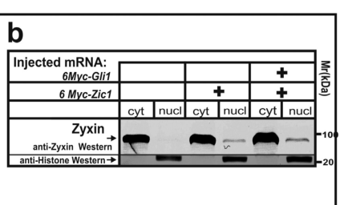

## Question

# Gene Research for Functional Annotation

## ⚠️ CRITICAL: Gene/Protein Identification Context

**BEFORE YOU BEGIN RESEARCH:** You MUST verify you are researching the CORRECT gene/protein. Gene symbols can be ambiguous, especially for less well-characterized genes from non-model organisms.

### Target Gene/Protein Identity (from UniProt):
- **UniProt Accession:** O73689
- **Protein Description:** RecName: Full=Zinc finger protein ZIC 1; Short=XZic1; Short=XlZic1; AltName: Full=ODD-paired-like; Short=Xopl; AltName: Full=ZIC-related protein 1; Short=ZIC-r1; AltName: Full=Zinc finger protein of the cerebellum 1;
- **Gene Information:** Name=zic1; Synonyms=opl;
- **Organism (full):** Xenopus laevis (African clawed frog).
- **Protein Family:** Belongs to the GLI C2H2-type zinc-finger protein family.
- **Key Domains:** GLI-like. (IPR043359); Znf-C2H2_ZIC1-5/GLI1-3-like. (IPR056436); Znf_C2H2_sf. (IPR036236); Znf_C2H2_type. (IPR013087); Znf_ZIC. (IPR041643)

### MANDATORY VERIFICATION STEPS:

1. **Check if the gene symbol "zic1" matches the protein description above**
2. **Verify the organism is correct:** Xenopus laevis (African clawed frog).
3. **Check if protein family/domains align with what you find in literature**
4. **If you find literature for a DIFFERENT gene with the same or similar symbol, STOP**

### If Gene Symbol is Ambiguous or You Cannot Find Relevant Literature:

**DO NOT PROCEED WITH RESEARCH ON A DIFFERENT GENE.** Instead:
- State clearly: "The gene symbol 'zic1' is ambiguous or literature is limited for this specific protein"
- Explain what you found (e.g., "Found extensive literature on a different gene with the same symbol in a different organism")
- Describe the protein based ONLY on the UniProt information provided above
- Suggest that the protein function can be inferred from domain/family information

### Research Target:

Please provide a comprehensive research report on the gene **zic1** (gene ID: zic1, UniProt: O73689) in XENLA.

The research report should be a detailed narrative explaining the function, biological processes, and localization of the gene product. Citations should be given for all claims.

You should prioritize authoritative reviews and primary scientific literature when conducting research. You can supplement
this with annotations you find in gene/protein databases, but these can be outdated or inaccurate.

We are specifically interested in the primary function of the gene - for enzymes, what reaction is catalyzed, and what is the substrate specificity? For transporters, what is the substrate? For structural proteins or adapters, what is the broader structural role? For signaling molecules, what is the role in the pathway.

We are interested in where in or outside the cell the gene product carries out its function.

We are also interested in the signaling or biochemical pathways in which the gene functions. We are less interested in broad pleiotropic effects, except where these elucidate the precise role.

Include evidence where possible. We are interested in both experimental evidence as well as inference from structure, evolution, or bioinformatic analysis. Precise studies should be prioritized over high-throughput, where available.

## Output

Question: You are an expert researcher providing comprehensive, well-cited information.

Provide detailed information focusing on:
1. Key concepts and definitions with current understanding
2. Recent developments and latest research (prioritize 2023-2024 sources)
3. Current applications and real-world implementations
4. Expert opinions and analysis from authoritative sources
5. Relevant statistics and data from recent studies

Format as a comprehensive research report with proper citations. Include URLs and publication dates where available.
Always prioritize recent, authoritative sources and provide specific citations for all major claims.

# Gene Research for Functional Annotation

## ⚠️ CRITICAL: Gene/Protein Identification Context

**BEFORE YOU BEGIN RESEARCH:** You MUST verify you are researching the CORRECT gene/protein. Gene symbols can be ambiguous, especially for less well-characterized genes from non-model organisms.

### Target Gene/Protein Identity (from UniProt):
- **UniProt Accession:** O73689
- **Protein Description:** RecName: Full=Zinc finger protein ZIC 1; Short=XZic1; Short=XlZic1; AltName: Full=ODD-paired-like; Short=Xopl; AltName: Full=ZIC-related protein 1; Short=ZIC-r1; AltName: Full=Zinc finger protein of the cerebellum 1;
- **Gene Information:** Name=zic1; Synonyms=opl;
- **Organism (full):** Xenopus laevis (African clawed frog).
- **Protein Family:** Belongs to the GLI C2H2-type zinc-finger protein family.
- **Key Domains:** GLI-like. (IPR043359); Znf-C2H2_ZIC1-5/GLI1-3-like. (IPR056436); Znf_C2H2_sf. (IPR036236); Znf_C2H2_type. (IPR013087); Znf_ZIC. (IPR041643)

### MANDATORY VERIFICATION STEPS:

1. **Check if the gene symbol "zic1" matches the protein description above**
2. **Verify the organism is correct:** Xenopus laevis (African clawed frog).
3. **Check if protein family/domains align with what you find in literature**
4. **If you find literature for a DIFFERENT gene with the same or similar symbol, STOP**

### If Gene Symbol is Ambiguous or You Cannot Find Relevant Literature:

**DO NOT PROCEED WITH RESEARCH ON A DIFFERENT GENE.** Instead:
- State clearly: "The gene symbol 'zic1' is ambiguous or literature is limited for this specific protein"
- Explain what you found (e.g., "Found extensive literature on a different gene with the same symbol in a different organism")
- Describe the protein based ONLY on the UniProt information provided above
- Suggest that the protein function can be inferred from domain/family information

### Research Target:

Please provide a comprehensive research report on the gene **zic1** (gene ID: zic1, UniProt: O73689) in XENLA.

The research report should be a detailed narrative explaining the function, biological processes, and localization of the gene product. Citations should be given for all claims.

You should prioritize authoritative reviews and primary scientific literature when conducting research. You can supplement
this with annotations you find in gene/protein databases, but these can be outdated or inaccurate.

We are specifically interested in the primary function of the gene - for enzymes, what reaction is catalyzed, and what is the substrate specificity? For transporters, what is the substrate? For structural proteins or adapters, what is the broader structural role? For signaling molecules, what is the role in the pathway.

We are interested in where in or outside the cell the gene product carries out its function.

We are also interested in the signaling or biochemical pathways in which the gene functions. We are less interested in broad pleiotropic effects, except where these elucidate the precise role.

Include evidence where possible. We are interested in both experimental evidence as well as inference from structure, evolution, or bioinformatic analysis. Precise studies should be prioritized over high-throughput, where available.

# Functional annotation report: *zic1* in *Xenopus laevis*

## Identity and principal function

**Identity check.** The supplied UniProt record [O73689](https://www.uniprot.org/uniprotkb/O73689/entry) identifies the African clawed frog (*Xenopus laevis*) gene *zic1*, synonym *opl*, and its product Zic1, also called XZic1, Opl and Zic-related-1. Xenopus research explicitly uses Zic-related-1 for Zic1, consistent with that identification. Its annotated GLI-like, C2H2 zinc-finger domains agree with the experimentally studied Zic1 zinc-finger region and with its classification among GLI-related Zic transcription factors. This is **not** a report on mammalian ZIC1 or another frog Zic paralog. The historical studies reviewed here do not establish which, if either, modern *X. laevis* L/S homeolog corresponds individually to every experimental construct or to O73689; homeolog-specific claims are therefore avoided. (martynova2018thecytoskeletalprotein pages 1-3, merzdorf2007emergingrolesfor pages 6-7, martynova2018thecytoskeletalprotein pages 3-5)

**Primary annotation:** Zic1 is an intracellular, predominantly **nuclear transcriptional regulator** of early neural and neural-plate-border fate. Its zinc fingers recognize GLI-like DNA sequences and mediate interactions with other proteins. In Xenopus, the most compelling direct-target evidence combines translation-independent induction of *snai1* with sequence-specific binding to a conserved *snai1* promoter element in an electrophoretic mobility-shift assay. Zic1 is neither an enzyme with a defined catalytic reaction nor a transporter with a molecular substrate; its relevant molecular inputs are regulatory DNA, transcriptional partners and developmental signaling context. Importantly, sequence-specific binding to an isolated element does not itself demonstrate occupancy of that endogenous element in embryonic chromatin. (merzdorf2007emergingrolesfor pages 6-7, plouhinec2014pax3andzic1 pages 4-8, martynova2018thecytoskeletalprotein pages 1-3)

A Xenopus embryo study provides protein-level localization evidence: Zic1 was nuclear in gastrula-stage cells, whereas its interacting partner Zyxin was predominantly cytoplasmic; nuclear/cytoplasmic fractionation and interaction assays examined the Zic1–Gli1–Zyxin complex. This is distinct from *zic1* **RNA** expression at neural-plate borders, which establishes the tissue in which the protein can act, not its location within a cell. No extracellular Zic1 function is established. The proposed effects of Zic1 and Zyxin on Gli1 nuclear retention are context-dependent, rather than evidence that every Zic1 developmental phenotype is mediated by Hedgehog signaling. (martynova2018thecytoskeletalprotein pages 3-5, martynova2018thecytoskeletalprotein media 701c6aa9)

## Pathway position and experimentally defined roles

**Neural induction: BMP inhibition → Zic1 → neural specification.** In the early embryo, organizer-derived BMP antagonism provides an upstream setting for *zic1* expression. Noggin-induced *zic1* expression persisted when protein synthesis was blocked with cycloheximide and when FGF signaling was inhibited; by comparison, induction of *zic3* required FGF signaling. Thus *zic1* is an immediate or proximal response to BMP inhibition, whereas the related *zic3* integrates a distinguishable FGF input. BMP4 suppressed early *zic1* initiation. Blocking Zic1 alone or Zic3 alone elicited compensatory expression of the other, but simultaneous depletion almost abolished the neural marker *sox2* at stages 10, 13 and 23. This supports **joint necessity for robust neural specification**, not a unique, nonredundant requirement for Zic1 under every condition. Translation independence of *zic1* induction supports a proximal BMP response but does not identify a BMP-responsive factor physically bound to its native promoter. The 2009 study is [Marchal et al., *PNAS*, October 2009, DOI:10.1073/pnas.0906352106](https://doi.org/10.1073/pnas.0906352106). (marchal2009bmpinhibitioninitiates pages 4-5, marchal2009bmpinhibitioninitiates pages 3-4, marchal2009bmpinhibitioninitiates pages 5-6)

**Neural plate border: Pax3 and Zic1 jointly specify neural crest.** The two genes overlap in prospective neural crest ectoderm before the definitive markers *foxd3* and *snai2/Slug* appear. Coexpression induced ectopic neural crest in ventral Xenopus ectoderm, whereas either factor alone was insufficient there; induction depended on Wnt signaling. In loss-of-function experiments, Zic1 morpholino suppressed *foxd3* in **76% of embryos (n=37)** and *Slug* in **69% (n=42)**. Coinjected wild-type *zic1* rescued the *foxd3* phenotype in **69% (n=32)**. Pax3 could not substitute for depleted Zic1 in that assay, supporting the need for both activities rather than treating them as interchangeable factors. These results are from [Sato et al., *Development*, May 2005, DOI:10.1242/dev.01823](https://doi.org/10.1242/dev.01823). (sato2005neuralcrestdetermination pages 1-2, sato2005neuralcrestdetermination pages 4-5)

Zic1’s output also depends on **relative Pax3 activity**. In Xenopus embryo and explant experiments, Zic1 promoted the preplacodal markers *Six1* and *Eya1*, while Pax3 opposed that preplacodal response; combined activity favored neural crest, and stronger Pax3 activity promoted hatching-gland fate. Zic1 depletion reduced preplacodal *Six1* and neural-crest *Snail2* while expanding neural *Sox2*. Accordingly, “neural-crest factor” is useful shorthand but incomplete: Zic1 helps resolve *alternative* fates at the neural plate border. [Hong and Saint-Jeannet, *Molecular Biology of the Cell*, June 2007, DOI:10.1091/mbc.e06-11-1047](https://doi.org/10.1091/mbc.e06-11-1047). (hong2007theactivityof pages 7-9, hong2007theactivityof pages 6-7, hong2007theactivityof pages 1-2)

This cooperative switch has been tested beyond marker induction. In animal-cap ectoderm, Pax3 plus Zic1 initiated a temporally ordered neural-crest program, cadherin switching and cell delamination. Grafted induced cells followed normal cranial neural-crest migration territories and produced several differentiated derivatives. Effective specification required activation during an early ectodermal competence window, before approximately neurula stage 11.5; activating the pair in already committed mesoderm did not yield the neural-crest marker *snail2*. These results establish a **research application**—experimentally generating functional neural-crest-like cells—rather than a clinical implementation or a Zic1-alone reprogramming method. [Milet et al., *PNAS*, April 2013, DOI:10.1073/pnas.1219124110](https://doi.org/10.1073/pnas.1219124110). (milet2013pax3andzic1 pages 1-2, milet2013pax3andzic1 pages 2-3, milet2013pax3andzic1 pages 4-5)

**Immediate transcriptional outputs.** Inducible Zic1 activated *snai1* despite translation blockade, Zic1 depletion reduced embryonic *snai1* expression, and Zic1 bound a predicted conserved *snai1* promoter sequence in vitro with sequence-sensitive competition. This is stronger molecular evidence for a direct Zic1 target than expression correlation alone. Broader Pax3/Zic1 perturbation screens identified candidate immediate regulators—including *snai1/2*, *foxd3*, *twist1* and *tfap2b*—but translation-independent responses must not all be presented as proven physical Zic1 binding at native loci. One Xenopus neural-border screen reported **83 enriched genes** and **25 candidate immediate targets**; another used combined-factor induction to identify cooperatively responsive genes. [Plouhinec et al., *Developmental Biology*, February 2014, online December 2013, DOI:10.1016/j.ydbio.2013.12.010](https://doi.org/10.1016/j.ydbio.2013.12.010); [Bae et al., *Developmental Biology*, February 2014, DOI:10.1016/j.ydbio.2013.12.011](https://doi.org/10.1016/j.ydbio.2013.12.011). (plouhinec2014pax3andzic1 pages 1-2, plouhinec2014pax3andzic1 pages 4-8, bae2014identificationofpax3 pages 3-4)

**Wnt output and neural regionalization.** In Noggin-neuralized Xenopus ectoderm, an activated Zic1 construct increased *wnt1*, *wnt4* and *wnt8b*. Dominant-negative Wnt8 or GSK3 prevented Zic1/Noggin-dependent induction of *en-2*, a midbrain–hindbrain boundary marker; interfering with Zic1 reduced embryonic *wnt1* and *en-2*. These perturbations place Wnt pathway activity downstream of, or required for, this Zic1-driven regionalizing output. They **do not prove** that Zic1 directly binds a *wnt1* or *wnt8b* promoter; Wnt1 is a proposed intermediary. [Merzdorf and Sive, *International Journal of Developmental Biology*, 2006, DOI:10.1387/ijdb.052110cm](https://doi.org/10.1387/ijdb.052110cm). (merzdorf2006thezic1gene pages 2-3, merzdorf2006thezic1gene pages 3-5)

Additional Xenopus target studies refine the annotation without equating downstream effects with direct binding. Inducible-Zic1 screening of approximately **14,400 transcripts** found **85 increased** and **21 decreased** at least twofold. One Zic1-responsive gene, *aqp-3b*, but not the related *aqp-3*, was induced in the assay; Zic1 gain- and dominant-interference experiments altered its expression in embryos. *aqp-3b* RNA localized to neural-fold tips as folding progressed. A proposed contribution to neural-tube closure remains a hypothesis about **Aqp-3b**, not an experimentally established structural or water-transport function of Zic1 itself. [Cornish et al., *Developmental Dynamics*, May 2009, DOI:10.1002/dvdy.21953](https://doi.org/10.1002/dvdy.21953). (cornish2009amicroarrayscreen pages 2-3, cornish2009amicroarrayscreen pages 9-10, cornish2009amicroarrayscreen pages 7-8)

In a later CNS study, *zic1* knockdown reduced *prdm12* in midbrain and other neural domains; inducible Zic1 expanded midbrain *prdm12* in **more than 85%** of embryos in a reported 0.5-ng *zic1GR* experiment. Dominant-negative TCF reduced *prdm12*, consistent with Wnt involvement. This supports *prdm12* as a **downstream, Wnt-associated output**, but direct Zic1 binding at *prdm12* was not established. [Rahman et al., *International Journal of Developmental Neuroscience*, September 2020, DOI:10.1002/jdn.10048](https://doi.org/10.1002/jdn.10048). (rahman2020prdomaincontainingprotein pages 6-9, rahman2020prdomaincontainingprotein pages 9-12)

**Hedgehog/Gli cross-talk.** Yeast two-hybrid, embryo co-immunoprecipitation and in-vitro pull-down experiments found that Zic1’s zinc-finger-containing region interacts with Zyxin, principally through Zyxin’s second LIM domain. Gli1, Zic1 and Zyxin associated in a ternary complex, and their combinations modified a Gli-responsive reporter. This establishes a plausible transcriptional interface with Shh/Gli signaling, while evidence for the precise effects on individual endogenous Shh target genes remains less direct than the binding and reporter results. [Martynova et al., *Biochemical and Biophysical Research Communications*, September 2018, DOI:10.1016/j.bbrc.2018.08.164](https://doi.org/10.1016/j.bbrc.2018.08.164). (martynova2018thecytoskeletalprotein pages 1-3, martynova2018thecytoskeletalprotein pages 3-5, martynova2018thecytoskeletalprotein media 701c6aa9)

The following table separates direct biochemical observations from pathway perturbations and marker-only applications.

| Pathway or target | Experimental evidence and key quantitative result | Evidence-graded conclusion and limitation | Publication year, DOI/URL |
|---|---|---|---|
| BMP inhibition → **zic1**; FGF → **zic3**; Zic1/Zic3 → **sox2** | Noggin-induced **zic1** persisted with cycloheximide and after FGF blockade, whereas **zic3** required FGF. Single knockdowns caused compensatory increases of the other gene (~2-fold for Zic1 and ~4-fold for Zic3); double knockdown nearly eliminated **sox2** at stages 10, 13 and 23. (marchal2009bmpinhibitioninitiates pages 4-5, marchal2009bmpinhibitioninitiates pages 3-4) | **Strong pathway evidence:** zic1 is an immediate/proximal BMP-inhibition response, distinct from FGF-responsive zic3; together they are required for definitive neural induction. Translation independence does **not** by itself prove Zic1 occupancy of the endogenous locus. | 2009; [10.1073/pnas.0906352106](https://doi.org/10.1073/pnas.0906352106) |
| Pax3 + Zic1 → neural-crest determination | Coexpression induced ectopic neural crest in ventral ectoderm, whereas either factor alone was insufficient there. Zic1 morpholino suppressed **Foxd3** in 76% (n=37) and **Slug/snai2** in 69% (n=42); wild-type zic1 rescued the phenotype in 69% (n=32). (sato2005neuralcrestdetermination pages 1-2, sato2005neuralcrestdetermination pages 4-5) | **Strong necessity, rescue and synergy evidence:** Pax3 and Zic1 jointly operate as an upstream neural-border transcriptional switch. These assays establish functional cooperation, not direct binding to every induced neural-crest gene. | 2005; [10.1242/dev.01823](https://doi.org/10.1242/dev.01823) |
| **snail1/snai1** direct regulation | Inducible Zic1 activated **snail1** despite translation blockade; Zic1 depletion reduced its expression from stages 11.5–14. EMSA showed Zic1 binding to a predicted conserved **snail1** promoter element, with effective wild-type but weak mutant-oligonucleotide competition. (plouhinec2014pax3andzic1 pages 4-8) | **Direct biochemical evidence:** snail1 is a high-confidence direct Zic1 target. EMSA demonstrates sequence-specific binding in vitro, but it is not endogenous-locus ChIP in embryos. | 2014 (online 17 Dec 2013); [10.1016/j.ydbio.2013.12.010](https://doi.org/10.1016/j.ydbio.2013.12.010) |
| Zic1 → **wnt1/wnt8b** → **en-2** | Zic1ΔC plus Noggin induced **wnt1, wnt4** and **wnt8b**; Zic1 expanded the **wnt8b** domain, whereas dominant-interfering Zic1 reduced **wnt1** and **en-2**. Dominant-negative Wnt8 or GSK3 blocked Zic1/Noggin-dependent **en-2** induction. (merzdorf2006thezic1gene pages 2-3, merzdorf2006thezic1gene pages 3-5) | **Strong functional pathway placement:** Zic1 activates Wnt-pathway output required for midbrain–hindbrain-boundary **en-2** expression. The experiments do not establish direct Zic1 occupancy of wnt promoters; Wnt1 is the best-supported proposed intermediary. | 2006; [10.1387/ijdb.052110cm](https://doi.org/10.1387/ijdb.052110cm) |
| Preplacodal **Six1/Eya1** versus neural-crest fate | Zic1 overexpression activated **Six1** and **Eya1**; Zic1 depletion reduced Six1 and neural-crest **Snail2**, while expanding neural **Sox2**. Pax3 opposed preplacodal induction, whereas Pax3 plus Zic1 favored neural crest. (hong2007theactivityof pages 7-9, hong2007theactivityof pages 1-2) | **Strong fate-selection evidence:** Zic1 promotes preplacodal identity when acting without high Pax3 activity; the relative activities of Zic1 and Pax3 partition preplacodal, neural-crest and hatching-gland fates. Direct Zic1 binding to Six1/Eya1 regulatory DNA was not shown. | 2007; [10.1091/mbc.e06-11-1047](https://doi.org/10.1091/mbc.e06-11-1047) |
| Zic1–Gli1–Zyxin complex; nuclear localization | Yeast two-hybrid screening of 3×10^5 transformants yielded 39 validated positives representing 12 proteins, including Zic1 residues 242–443. Interaction was confirmed by embryo co-IP and pull-down; full-length Zyxin co-precipitated ~70-kDa Myc-Zic1 and ~180-kDa Myc-Gli1. Fractionation/localization assays found Zic1 nuclear in gastrula cells; stage-14 Gli-reporter assays used five independent experiments. (martynova2018thecytoskeletalprotein pages 1-3, martynova2018thecytoskeletalprotein pages 3-5) | **Strong interaction and localization evidence:** Zic1 is a nuclear transcriptional regulator whose zinc-finger region forms a complex with Gli1 and Zyxin, potentially tuning Shh/Gli output. The proposed regional fine-tuning of endogenous Shh targets remains partly interpretive, and the study did not resolve zic1 homeologs. | 2018; [10.1016/j.bbrc.2018.08.164](https://doi.org/10.1016/j.bbrc.2018.08.164) |
| Zic1 → **aqp-3b** in neural folds | A 14,400-transcript inducible-Zic1/translation-block screen found 85 genes increased ≥2-fold and 21 decreased ≥2-fold; 16 candidates were qRT-PCR validated. **aqp-3b**, but not aqp-3, responded to Zic1; 100 pg zic1 RNA increased and 100 pg dominant-interfering zic1 reduced its expression. Expression peaked at stages 14–18 and localized to neural-fold tips. (cornish2009amicroarrayscreen pages 2-3, cornish2009amicroarrayscreen pages 9-10, cornish2009amicroarrayscreen pages 7-8) | **High-confidence immediate Zic1-responsive target:** gain/loss perturbations and spatial overlap support developmental relevance. Translation-independent induction supports direct regulation but does not demonstrate endogenous promoter occupancy; a role in neural-tube closure is plausible rather than proven. | 2009; [10.1002/dvdy.21953](https://doi.org/10.1002/dvdy.21953) |
| Zic1/Wnt → **prdm12** | Zic1 morpholino reduced **prdm12** in midbrain, motor-neuron and trigeminal-ganglion domains. Inducible Zic1 expanded midbrain prdm12 expression in >85% of embryos after 0.5 ng zic1GR RNA and dexamethasone at stage 14; dominant-negative TCF reduced or eliminated prdm12 on the injected side. (rahman2020prdomaincontainingprotein pages 1-6, rahman2020prdomaincontainingprotein pages 6-9, rahman2020prdomaincontainingprotein pages 9-12) | **Strong downstream-pathway evidence:** prdm12 lies downstream of Zic1 and canonical Wnt during CNS differentiation. No Zic1 binding assay was reported, so direct transcriptional regulation of the prdm12 locus is unproven. | 2020; [10.1002/jdn.10048](https://doi.org/10.1002/jdn.10048) |
| 2024 BMPi/CHIR neural-crest reprogramming | K02288-mediated BMP inhibition plus CHIR99021-mediated Wnt activation robustly induced **zic1** as a neural-border marker. Induced grafts migrated in all cases (27/27) versus 0/20 controls, expressed Sox9 in 14/14 versus 0/13 controls, and produced cartilage in 27/27 grafts. (huber2024smallmoleculemediatedreprogramming pages 4-6, huber2024smallmoleculemediatedreprogramming pages 3-4) | **Strong application-level neural-crest evidence, but no new Zic1 causality:** zic1 was an expression readout, not knocked down, overexpressed or edited. The study validates a chemically induced state consistent with the established BMP/Wnt–Zic1 network but does not directly test O73689 function. | 2024 (online Oct 2023); [10.1016/j.ydbio.2023.10.004](https://doi.org/10.1016/j.ydbio.2023.10.004) |

*Table: Evidence grading for Xenopus laevis Zic1/Opl (UniProt O73689), separating direct binding, pathway perturbation, localization and marker-only findings. Quantitative values are included only where explicitly reported.*

## Research status and interpretation of 2023–2024 work

A 2024 Xenopus application used BMP-receptor inhibition with **K02288** and Wnt activation with **CHIR99021** to reprogram blastula ectoderm toward neural crest. *zic1* was an induced **neural-border expression readout**, not the experimentally perturbed gene. Grafts from the treated cells migrated in **27/27** cases versus **0/20** vehicle controls and expressed Sox9 in **14/14** versus **0/13** controls. Those striking outcomes validate the chemically induced cell state, **not** a new estimate of O73689-specific necessity. [Huber and LaBonne, *Developmental Biology*, January 2024; published online October 2023, DOI:10.1016/j.ydbio.2023.10.004](https://doi.org/10.1016/j.ydbio.2023.10.004). (huber2024smallmoleculemediatedreprogramming pages 4-6, huber2024smallmoleculemediatedreprogramming pages 3-4)

Another 2024 Xenopus study found that experimentally changing embryonic mechanical tension altered neural-crest formation and FGF/Wnt activity. This advances the understanding of signals surrounding neural-border specification but does not itself show force acting directly through Zic1. Meanwhile, a 2024 mouse cerebellar study mapped changing **mouse Zic1/Zic2** genome binding during neuronal maturation; it offers a testable model for context-dependent Zic transcription but is **not** an occupancy map or functional experiment for Xenopus O73689. Species and paralog differences matter: mammalian neural-crest specification does not assign the same uniquely essential role to mouse Zic1 as the Xenopus Pax3/Zic1 experiments do. [Kaneshima et al., *International Journal of Developmental Biology*, January 2024, DOI:10.1387/ijdb.230273tm](https://doi.org/10.1387/ijdb.230273tm); [Minto et al., *BMC Biology*, September 2024, DOI:10.1186/s12915-024-01989-9](https://doi.org/10.1186/s12915-024-01989-9). (kaneshima2024enhancementofneural pages 4-5, minto2024genomebindingproperties pages 2-5, houtmeyers2013thezicgene pages 18-19)

**Conclusion and limits.** For the supplied *X. laevis* identity, the defensible functional annotation is **nuclear GLI-related C2H2 zinc-finger transcriptional regulator that integrates BMP-dependent neural induction with Pax3- and Wnt-dependent neural-plate-border specification, with additional context-dependent Gli interactions**. The strongest Xenopus causal evidence comes from embryo knockdown/rescue, inducible-factor and explant experiments; in-vitro *snai1* promoter binding supplies unusually precise target-level evidence. Other proposed direct targets, homeolog-specific assignments and broad extrapolations from mouse genomic studies remain unresolved rather than established properties of O73689. (marchal2009bmpinhibitioninitiates pages 4-5, plouhinec2014pax3andzic1 pages 4-8, sato2005neuralcrestdetermination pages 4-5, martynova2018thecytoskeletalprotein pages 3-5)

References

1. (martynova2018thecytoskeletalprotein pages 1-3): N.Y. Martynova, E.A. Parshina, L.V. Ermolina, and A.G. Zaraisky. The cytoskeletal protein zyxin interacts with the zinc-finger transcription factor zic1 and plays the role of a scaffold for gli1 and zic1 interactions during early development of xenopus laevis. Sep 2018. URL: https://doi.org/10.1016/j.bbrc.2018.08.164, doi:10.1016/j.bbrc.2018.08.164. This article has 13 citations and is from a peer-reviewed journal.

2. (merzdorf2007emergingrolesfor pages 6-7): Christa S. Merzdorf. Emerging roles for zic genes in early development. Developmental Dynamics, 236:922-940, Apr 2007. URL: https://doi.org/10.1002/dvdy.21098, doi:10.1002/dvdy.21098. This article has 185 citations and is from a peer-reviewed journal.

3. (martynova2018thecytoskeletalprotein pages 3-5): N.Y. Martynova, E.A. Parshina, L.V. Ermolina, and A.G. Zaraisky. The cytoskeletal protein zyxin interacts with the zinc-finger transcription factor zic1 and plays the role of a scaffold for gli1 and zic1 interactions during early development of xenopus laevis. Sep 2018. URL: https://doi.org/10.1016/j.bbrc.2018.08.164, doi:10.1016/j.bbrc.2018.08.164. This article has 13 citations and is from a peer-reviewed journal.

4. (plouhinec2014pax3andzic1 pages 4-8): Jean-Louis Plouhinec, Daniel D. Roche, Caterina Pegoraro, Ana Leonor Figueiredo, Frédérique Maczkowiak, Lisa J. Brunet, Cécile Milet, Jean-Philippe Vert, Nicolas Pollet, Richard M. Harland, and Anne H. Monsoro-Burq. Pax3 and zic1 trigger the early neural crest gene regulatory network by the direct activation of multiple key neural crest specifiers. Developmental biology, 386 2:461-72, Feb 2014. URL: https://doi.org/10.1016/j.ydbio.2013.12.010, doi:10.1016/j.ydbio.2013.12.010. This article has 150 citations and is from a peer-reviewed journal.

5. (martynova2018thecytoskeletalprotein media 701c6aa9): N.Y. Martynova, E.A. Parshina, L.V. Ermolina, and A.G. Zaraisky. The cytoskeletal protein zyxin interacts with the zinc-finger transcription factor zic1 and plays the role of a scaffold for gli1 and zic1 interactions during early development of xenopus laevis. Sep 2018. URL: https://doi.org/10.1016/j.bbrc.2018.08.164, doi:10.1016/j.bbrc.2018.08.164. This article has 13 citations and is from a peer-reviewed journal.

6. (marchal2009bmpinhibitioninitiates pages 4-5): Leslie Marchal, Guillaume Luxardi, Virginie Thomé, and Laurent Kodjabachian. Bmp inhibition initiates neural induction via fgf signaling and zic genes. Proceedings of the National Academy of Sciences, 106:17437-17442, Oct 2009. URL: https://doi.org/10.1073/pnas.0906352106, doi:10.1073/pnas.0906352106. This article has 159 citations and is from a highest quality peer-reviewed journal.

7. (marchal2009bmpinhibitioninitiates pages 3-4): Leslie Marchal, Guillaume Luxardi, Virginie Thomé, and Laurent Kodjabachian. Bmp inhibition initiates neural induction via fgf signaling and zic genes. Proceedings of the National Academy of Sciences, 106:17437-17442, Oct 2009. URL: https://doi.org/10.1073/pnas.0906352106, doi:10.1073/pnas.0906352106. This article has 159 citations and is from a highest quality peer-reviewed journal.

8. (marchal2009bmpinhibitioninitiates pages 5-6): Leslie Marchal, Guillaume Luxardi, Virginie Thomé, and Laurent Kodjabachian. Bmp inhibition initiates neural induction via fgf signaling and zic genes. Proceedings of the National Academy of Sciences, 106:17437-17442, Oct 2009. URL: https://doi.org/10.1073/pnas.0906352106, doi:10.1073/pnas.0906352106. This article has 159 citations and is from a highest quality peer-reviewed journal.

9. (sato2005neuralcrestdetermination pages 1-2): Takahiko Sato, Noriaki Sasai, and Yoshiki Sasai. Neural crest determination by co-activation of pax3 and zic1 genes in xenopus ectoderm. Development, 132:2355-2363, May 2005. URL: https://doi.org/10.1242/dev.01823, doi:10.1242/dev.01823. This article has 257 citations and is from a domain leading peer-reviewed journal.

10. (sato2005neuralcrestdetermination pages 4-5): Takahiko Sato, Noriaki Sasai, and Yoshiki Sasai. Neural crest determination by co-activation of pax3 and zic1 genes in xenopus ectoderm. Development, 132:2355-2363, May 2005. URL: https://doi.org/10.1242/dev.01823, doi:10.1242/dev.01823. This article has 257 citations and is from a domain leading peer-reviewed journal.

11. (hong2007theactivityof pages 7-9): Chang-Soo Hong and Jean-Pierre Saint-Jeannet. The activity of pax3 and zic1 regulates three distinct cell fates at the neural plate border. Molecular Biology of the Cell, 18:2192-2202, Jun 2007. URL: https://doi.org/10.1091/mbc.e06-11-1047, doi:10.1091/mbc.e06-11-1047. This article has 212 citations and is from a domain leading peer-reviewed journal.

12. (hong2007theactivityof pages 6-7): Chang-Soo Hong and Jean-Pierre Saint-Jeannet. The activity of pax3 and zic1 regulates three distinct cell fates at the neural plate border. Molecular Biology of the Cell, 18:2192-2202, Jun 2007. URL: https://doi.org/10.1091/mbc.e06-11-1047, doi:10.1091/mbc.e06-11-1047. This article has 212 citations and is from a domain leading peer-reviewed journal.

13. (hong2007theactivityof pages 1-2): Chang-Soo Hong and Jean-Pierre Saint-Jeannet. The activity of pax3 and zic1 regulates three distinct cell fates at the neural plate border. Molecular Biology of the Cell, 18:2192-2202, Jun 2007. URL: https://doi.org/10.1091/mbc.e06-11-1047, doi:10.1091/mbc.e06-11-1047. This article has 212 citations and is from a domain leading peer-reviewed journal.

14. (milet2013pax3andzic1 pages 1-2): Cécile Milet, Frédérique Maczkowiak, Daniel D. Roche, and Anne Hélène Monsoro-Burq. Pax3 and zic1 drive induction and differentiation of multipotent, migratory, and functional neural crest in xenopus embryos. Proceedings of the National Academy of Sciences, 110:5528-5533, Mar 2013. URL: https://doi.org/10.1073/pnas.1219124110, doi:10.1073/pnas.1219124110. This article has 137 citations and is from a highest quality peer-reviewed journal.

15. (milet2013pax3andzic1 pages 2-3): Cécile Milet, Frédérique Maczkowiak, Daniel D. Roche, and Anne Hélène Monsoro-Burq. Pax3 and zic1 drive induction and differentiation of multipotent, migratory, and functional neural crest in xenopus embryos. Proceedings of the National Academy of Sciences, 110:5528-5533, Mar 2013. URL: https://doi.org/10.1073/pnas.1219124110, doi:10.1073/pnas.1219124110. This article has 137 citations and is from a highest quality peer-reviewed journal.

16. (milet2013pax3andzic1 pages 4-5): Cécile Milet, Frédérique Maczkowiak, Daniel D. Roche, and Anne Hélène Monsoro-Burq. Pax3 and zic1 drive induction and differentiation of multipotent, migratory, and functional neural crest in xenopus embryos. Proceedings of the National Academy of Sciences, 110:5528-5533, Mar 2013. URL: https://doi.org/10.1073/pnas.1219124110, doi:10.1073/pnas.1219124110. This article has 137 citations and is from a highest quality peer-reviewed journal.

17. (plouhinec2014pax3andzic1 pages 1-2): Jean-Louis Plouhinec, Daniel D. Roche, Caterina Pegoraro, Ana Leonor Figueiredo, Frédérique Maczkowiak, Lisa J. Brunet, Cécile Milet, Jean-Philippe Vert, Nicolas Pollet, Richard M. Harland, and Anne H. Monsoro-Burq. Pax3 and zic1 trigger the early neural crest gene regulatory network by the direct activation of multiple key neural crest specifiers. Developmental biology, 386 2:461-72, Feb 2014. URL: https://doi.org/10.1016/j.ydbio.2013.12.010, doi:10.1016/j.ydbio.2013.12.010. This article has 150 citations and is from a peer-reviewed journal.

18. (bae2014identificationofpax3 pages 3-4): Chang-Joon Bae, Byung-Yong Park, Young-Hoon Lee, John W. Tobias, Chang-Soo Hong, and Jean-Pierre Saint-Jeannet. Identification of pax3 and zic1 targets in the developing neural crest. Developmental biology, 386 2:473-83, Feb 2014. URL: https://doi.org/10.1016/j.ydbio.2013.12.011, doi:10.1016/j.ydbio.2013.12.011. This article has 65 citations and is from a peer-reviewed journal.

19. (merzdorf2006thezic1gene pages 2-3): Christa S. Merzdorf and Hazel L. Sive. The zic1 gene is an activator of wnt signaling. The International journal of developmental biology, 50 7:611-7, Jan 2006. URL: https://doi.org/10.1387/ijdb.052110cm, doi:10.1387/ijdb.052110cm. This article has 77 citations.

20. (merzdorf2006thezic1gene pages 3-5): Christa S. Merzdorf and Hazel L. Sive. The zic1 gene is an activator of wnt signaling. The International journal of developmental biology, 50 7:611-7, Jan 2006. URL: https://doi.org/10.1387/ijdb.052110cm, doi:10.1387/ijdb.052110cm. This article has 77 citations.

21. (cornish2009amicroarrayscreen pages 2-3): E. Jean Cornish, Sabah M. Hassan, Joshua D. Martin, Shuzhao Li, and Christa S. Merzdorf. A microarray screen for direct targets of zic1 identifies an aquaporin gene, aqp‐3b, expressed in the neural folds. Developmental Dynamics, 238:1179-1194, May 2009. URL: https://doi.org/10.1002/dvdy.21953, doi:10.1002/dvdy.21953. This article has 24 citations and is from a peer-reviewed journal.

22. (cornish2009amicroarrayscreen pages 9-10): E. Jean Cornish, Sabah M. Hassan, Joshua D. Martin, Shuzhao Li, and Christa S. Merzdorf. A microarray screen for direct targets of zic1 identifies an aquaporin gene, aqp‐3b, expressed in the neural folds. Developmental Dynamics, 238:1179-1194, May 2009. URL: https://doi.org/10.1002/dvdy.21953, doi:10.1002/dvdy.21953. This article has 24 citations and is from a peer-reviewed journal.

23. (cornish2009amicroarrayscreen pages 7-8): E. Jean Cornish, Sabah M. Hassan, Joshua D. Martin, Shuzhao Li, and Christa S. Merzdorf. A microarray screen for direct targets of zic1 identifies an aquaporin gene, aqp‐3b, expressed in the neural folds. Developmental Dynamics, 238:1179-1194, May 2009. URL: https://doi.org/10.1002/dvdy.21953, doi:10.1002/dvdy.21953. This article has 24 citations and is from a peer-reviewed journal.

24. (rahman2020prdomaincontainingprotein pages 6-9): Md Mahfujur Rahman, In‐Shik Kim, Dongchoon Ahn, Hyun‐Jin Tae, and Byung‐Yong Park. Pr domaincontaining protein 12 (<i>prdm12</i>) is a downstream target of the transcription factor <i>zic1</i> during cellular differentiation in the central nervous system. Sep 2020. URL: https://doi.org/10.1002/jdn.10048, doi:10.1002/jdn.10048. This article has 7 citations and is from a peer-reviewed journal.

25. (rahman2020prdomaincontainingprotein pages 9-12): Md Mahfujur Rahman, In‐Shik Kim, Dongchoon Ahn, Hyun‐Jin Tae, and Byung‐Yong Park. Pr domaincontaining protein 12 (<i>prdm12</i>) is a downstream target of the transcription factor <i>zic1</i> during cellular differentiation in the central nervous system. Sep 2020. URL: https://doi.org/10.1002/jdn.10048, doi:10.1002/jdn.10048. This article has 7 citations and is from a peer-reviewed journal.

26. (rahman2020prdomaincontainingprotein pages 1-6): Md Mahfujur Rahman, In‐Shik Kim, Dongchoon Ahn, Hyun‐Jin Tae, and Byung‐Yong Park. Pr domaincontaining protein 12 (<i>prdm12</i>) is a downstream target of the transcription factor <i>zic1</i> during cellular differentiation in the central nervous system. Sep 2020. URL: https://doi.org/10.1002/jdn.10048, doi:10.1002/jdn.10048. This article has 7 citations and is from a peer-reviewed journal.

27. (huber2024smallmoleculemediatedreprogramming pages 4-6): Paul B. Huber and Carole LaBonne. Small molecule-mediated reprogramming of xenopus blastula stem cells to a neural crest state. Jan 2024. URL: https://doi.org/10.1016/j.ydbio.2023.10.004, doi:10.1016/j.ydbio.2023.10.004. This article has 10 citations and is from a peer-reviewed journal.

28. (huber2024smallmoleculemediatedreprogramming pages 3-4): Paul B. Huber and Carole LaBonne. Small molecule-mediated reprogramming of xenopus blastula stem cells to a neural crest state. Jan 2024. URL: https://doi.org/10.1016/j.ydbio.2023.10.004, doi:10.1016/j.ydbio.2023.10.004. This article has 10 citations and is from a peer-reviewed journal.

29. (kaneshima2024enhancementofneural pages 4-5): Toki Kaneshima, Masaki Ogawa, Takayoshi Yamamoto, Yosuke Tsuboyama, Yuki Miyata, Takahiro Kotani, Takaharu Okajima, and Tatsuo Michiue. Enhancement of neural crest formation by mechanical force in xenopus development. The International journal of developmental biology, 68 1:25-37, Jan 2024. URL: https://doi.org/10.1387/ijdb.230273tm, doi:10.1387/ijdb.230273tm. This article has 4 citations.

30. (minto2024genomebindingproperties pages 2-5): Melyssa S. Minto, Jesús Emiliano Sotelo-Fonseca, Vijyendra Ramesh, and Anne E. West. Genome binding properties of zic transcription factors underlie their changing functions during neuronal maturation. BMC Biology, Sep 2024. URL: https://doi.org/10.1186/s12915-024-01989-9, doi:10.1186/s12915-024-01989-9. This article has 12 citations and is from a domain leading peer-reviewed journal.

31. (houtmeyers2013thezicgene pages 18-19): Rob Houtmeyers, Jacob Souopgui, Sabine Tejpar, and Ruth Arkell. The zic gene family encodes multi-functional proteins essential for patterning and morphogenesis. Feb 2013. URL: https://doi.org/10.1007/s00018-013-1285-5, doi:10.1007/s00018-013-1285-5. This article has 121 citations and is from a domain leading peer-reviewed journal.

## Artifacts

- [Edison artifact artifact-00](zic1-deep-research-falcon_artifacts/artifact-00.md)

## Citations

1. martynova2018thecytoskeletalprotein pages 1-3
2. merzdorf2007emergingrolesfor pages 6-7
3. martynova2018thecytoskeletalprotein pages 3-5
4. marchal2009bmpinhibitioninitiates pages 4-5
5. marchal2009bmpinhibitioninitiates pages 3-4
6. marchal2009bmpinhibitioninitiates pages 5-6
7. sato2005neuralcrestdetermination pages 1-2
8. sato2005neuralcrestdetermination pages 4-5
9. hong2007theactivityof pages 7-9
10. hong2007theactivityof pages 6-7
11. hong2007theactivityof pages 1-2
12. cornish2009amicroarrayscreen pages 2-3
13. cornish2009amicroarrayscreen pages 9-10
14. cornish2009amicroarrayscreen pages 7-8
15. rahman2020prdomaincontainingprotein pages 6-9
16. rahman2020prdomaincontainingprotein pages 9-12
17. rahman2020prdomaincontainingprotein pages 1-6
18. huber2024smallmoleculemediatedreprogramming pages 4-6
19. huber2024smallmoleculemediatedreprogramming pages 3-4
20. kaneshima2024enhancementofneural pages 4-5
21. minto2024genomebindingproperties pages 2-5
22. houtmeyers2013thezicgene pages 18-19
23. O73689
24. Marchal et al., *PNAS*, October 2009, DOI:10.1073/pnas.0906352106
25. Sato et al., *Development*, May 2005, DOI:10.1242/dev.01823
26. Hong and Saint-Jeannet, *Molecular Biology of the Cell*, June 2007, DOI:10.1091/mbc.e06-11-1047
27. Milet et al., *PNAS*, April 2013, DOI:10.1073/pnas.1219124110
28. Plouhinec et al., *Developmental Biology*, February 2014, online December 2013, DOI:10.1016/j.ydbio.2013.12.010
29. Bae et al., *Developmental Biology*, February 2014, DOI:10.1016/j.ydbio.2013.12.011
30. Merzdorf and Sive, *International Journal of Developmental Biology*, 2006, DOI:10.1387/ijdb.052110cm
31. Cornish et al., *Developmental Dynamics*, May 2009, DOI:10.1002/dvdy.21953
32. Rahman et al., *International Journal of Developmental Neuroscience*, September 2020, DOI:10.1002/jdn.10048
33. Martynova et al., *Biochemical and Biophysical Research Communications*, September 2018, DOI:10.1016/j.bbrc.2018.08.164
34. 10.1073/pnas.0906352106
35. 10.1242/dev.01823
36. 10.1016/j.ydbio.2013.12.010
37. 10.1387/ijdb.052110cm
38. 10.1091/mbc.e06-11-1047
39. 10.1016/j.bbrc.2018.08.164
40. 10.1002/dvdy.21953
41. 10.1002/jdn.10048
42. 10.1016/j.ydbio.2023.10.004
43. Huber and LaBonne, *Developmental Biology*, January 2024; published online October 2023, DOI:10.1016/j.ydbio.2023.10.004
44. Kaneshima et al., *International Journal of Developmental Biology*, January 2024, DOI:10.1387/ijdb.230273tm
45. Minto et al., *BMC Biology*, September 2024, DOI:10.1186/s12915-024-01989-9
46. https://www.uniprot.org/uniprotkb/O73689/entry
47. https://doi.org/10.1073/pnas.0906352106
48. https://doi.org/10.1242/dev.01823
49. https://doi.org/10.1091/mbc.e06-11-1047
50. https://doi.org/10.1073/pnas.1219124110
51. https://doi.org/10.1016/j.ydbio.2013.12.010
52. https://doi.org/10.1016/j.ydbio.2013.12.011
53. https://doi.org/10.1387/ijdb.052110cm
54. https://doi.org/10.1002/dvdy.21953
55. https://doi.org/10.1002/jdn.10048
56. https://doi.org/10.1016/j.bbrc.2018.08.164
57. https://doi.org/10.1016/j.ydbio.2023.10.004
58. https://doi.org/10.1387/ijdb.230273tm
59. https://doi.org/10.1186/s12915-024-01989-9
60. https://doi.org/10.1016/j.bbrc.2018.08.164,
61. https://doi.org/10.1002/dvdy.21098,
62. https://doi.org/10.1016/j.ydbio.2013.12.010,
63. https://doi.org/10.1073/pnas.0906352106,
64. https://doi.org/10.1242/dev.01823,
65. https://doi.org/10.1091/mbc.e06-11-1047,
66. https://doi.org/10.1073/pnas.1219124110,
67. https://doi.org/10.1016/j.ydbio.2013.12.011,
68. https://doi.org/10.1387/ijdb.052110cm,
69. https://doi.org/10.1002/dvdy.21953,
70. https://doi.org/10.1002/jdn.10048,
71. https://doi.org/10.1016/j.ydbio.2023.10.004,
72. https://doi.org/10.1387/ijdb.230273tm,
73. https://doi.org/10.1186/s12915-024-01989-9,
74. https://doi.org/10.1007/s00018-013-1285-5,