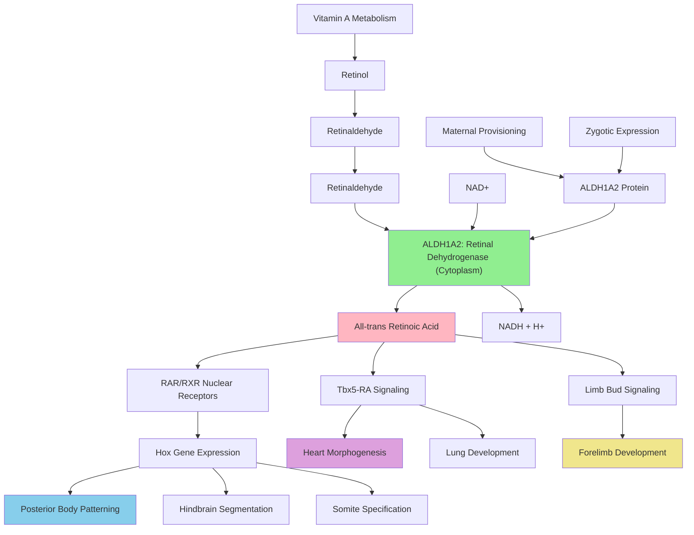

# Pathway Summary for aldh1a2

## Overview
ALDH1A2 (retinaldehyde dehydrogenase 2, RALDH2) is the key enzyme catalyzing the NAD-dependent oxidation of retinaldehyde to all-trans retinoic acid (RA), the bioactive vitamin A metabolite [file:XENTR/aldh1a2/aldh1a2-deep-research.md]. This cytosolic enzyme controls spatiotemporal RA production during embryonic development and is essential for posterior body axis patterning, heart morphogenesis, limb bud initiation, and multiple organogenesis processes [GO_REF:0000003, file:XENTR/aldh1a2/aldh1a2-deep-research.md].

## Retinoic Acid Biosynthetic Pathway
ALDH1A2 catalyzes the rate-limiting step in the retinoic acid biosynthetic cascade, converting retinaldehyde (retinal) to all-trans retinoic acid using NAD+ as a cofactor [file:XENTR/aldh1a2/aldh1a2-deep-research.md]. This enzymatic reaction represents the terminal step in vitamin A metabolism that produces the biologically active signaling molecule. The enzyme exhibits high substrate specificity for retinaldehyde and functions within a tightly regulated network that controls RA availability in specific embryonic domains [GO_REF:0000003].

## Anterior-Posterior Body Axis Patterning
ALDH1A2-derived retinoic acid serves as a crucial morphogen for establishing posterior body axis identity through regulation of Hox gene expression [file:XENTR/aldh1a2/aldh1a2-deep-research.md]. The enzyme is expressed in the Xenopus Spemann organizer during gastrulation and later shifts to trunk mesoderm, providing posteriorizing signals that specify caudal structures [file:XENTR/aldh1a2/aldh1a2-deep-research.md]. Loss of ALDH1A2 function results in truncated posterior structures and severely disrupted Hox gene expression patterns, demonstrating its essential role in axial patterning [PMID:11688558].

## Heart and Cardiac Development Pathway
ALDH1A2 is essential for heart morphogenesis, functioning downstream of Tbx5 in cardiac development programs [PMC:PMC8555986]. The enzyme is expressed in heart-forming lateral plate mesoderm where it produces RA required for cardiac chamber formation and outflow tract development [file:XENTR/aldh1a2/aldh1a2-deep-research.md]. Tbx5 directly regulates aldh1a2 expression through intronic enhancer binding, establishing a regulatory network that coordinates cardiac patterning with retinoic acid signaling [file:XENTR/aldh1a2/aldh1a2-deep-research.md].

## Hindbrain Development and Neuronal Patterning
ALDH1A2-generated RA patterns the hindbrain by regulating posterior Hox gene expression and establishing rhombomere identity [PMID:11688558]. The enzyme provides essential posteriorizing signals that specify hindbrain segmentation patterns and neuronal differentiation programs [file:XENTR/aldh1a2/aldh1a2-deep-research.md]. Mutants show severely disrupted hindbrain architecture and loss of proper rhombomere boundaries, indicating the critical role of spatially controlled RA production in neural development [file:XENTR/aldh1a2/aldh1a2-deep-research.md].

## Pathway Diagram

## Limb Development and Appendage Formation
ALDH1A2-derived RA is absolutely required for limb bud initiation and appendage development [PMID:11688558]. The enzyme is expressed in trunk mesoderm where it produces RA signals necessary to induce forelimb bud development [file:XENTR/aldh1a2/aldh1a2-deep-research.md]. Zebrafish aldh1a2 mutants completely lack pectoral fins, a phenotype that can be rescued by exogenous RA treatment, demonstrating the specific requirement for ALDH1A2-derived RA in appendage formation [PMID:16774994].

## Somite Specification and Mesodermal Patterning
ALDH1A2 expression in paraxial mesoderm provides essential RA signals for proper somite formation and anteroposterior patterning along the embryonic axis [file:XENTR/aldh1a2/aldh1a2-deep-research.md]. The enzyme is strongly expressed around developing somites where it produces local RA gradients that influence mesodermal cell fate decisions and segmentation patterns [file:XENTR/aldh1a2/aldh1a2-deep-research.md]. This spatially restricted expression ensures precise control of RA signaling during axial skeleton development.

## Pulmonary Development and Respiratory System
ALDH1A2 contributes to lung development through its role in the Tbx5-dependent cardiopulmonary morphogenesis program [PMC:PMC8555986]. The enzyme produces RA signals that coordinate respiratory system development with cardiac morphogenesis, ensuring proper formation of cardiopulmonary structures [file:XENTR/aldh1a2/aldh1a2-deep-research.md]. This integration reflects the evolutionary relationship between heart and lung development in vertebrates.

## Temporal and Spatial Regulation of RA Signaling
ALDH1A2 expression is both maternally provisioned and zygotically expressed in strategic embryonic domains, providing temporal control over RA availability during development [file:XENTR/aldh1a2/aldh1a2-deep-research.md]. The enzyme's expression pattern shifts from the Spemann organizer during gastrulation to specific mesodermal territories during organogenesis, ensuring that RA signals are delivered to appropriate target tissues at the correct developmental stages [file:XENTR/aldh1a2/aldh1a2-deep-research.md].

## Adult Tissue Homeostasis and Immune Function
Beyond its critical developmental roles, ALDH1A2 continues to function in adult tissues where it contributes to immune regulation and tissue homeostasis through controlled RA production [file:XENTR/aldh1a2/aldh1a2-deep-research.md]. The enzyme maintains appropriate RA levels for ongoing physiological processes including immune cell differentiation and tissue maintenance programs.

## Evolutionary Conservation and Significance
ALDH1A2 represents a highly conserved mechanism for vitamin A utilization in vertebrate development, with similar functions documented across fish, amphibians, and mammals. The enzyme's central role in multiple developmental processes highlights the fundamental importance of retinoic acid signaling in vertebrate body plan establishment and organogenesis. Understanding ALDH1A2 function provides insights into both normal development and developmental disorders associated with vitamin A deficiency or excess.