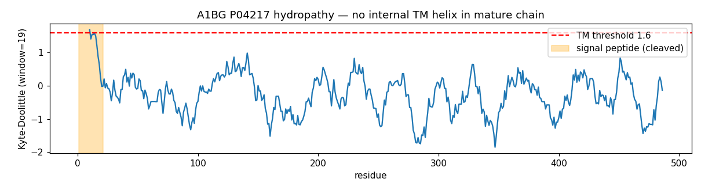

## Question

# AIGR Gene Hypothesis Deep Research

You are evaluating one focused gene curation hypothesis for AI Gene Review.
This is not a general gene overview. Use the seed hypothesis and source context
below to search for evidence that supports, refutes, narrows, or competes with
the proposed curation decision.

## Target Gene

- **Organism code:** human
- **Taxon:** Homo sapiens (NCBITaxon:9606)
- **Gene directory:** A1BG
- **Gene symbol:** A1BG
- **UniProt accession:** P04217

## Focus

- **Focus type:** function_assignment
- **Hypothesis slug:** membrane-receptor-and-growth-hormone-capacities
- **Source file:** genes/human/A1BG/A1BG-ai-review.yaml
- **Source selector:** free-text

## Seed Hypothesis

Human A1BG P04217 retains plasma-membrane activity, transmembrane signaling receptor activity, or growth-hormone receptor signaling participation. Assess each independently against the actual GO definitions. The current exact target leaf PTN002482657 descends from receptor/membrane IBD PTN002621170 and A1BG-specific GH IBD PTN000200788 in PTHR11738. The mature plasma protein has five Ig domains and a cleaved signal peptide but no transmembrane helix/cytoplasmic tail (primary PMID3458201 and curated sequence); decide what this structural divergence establishes about intrinsic receptor capability versus peripheral membrane association or a signaling receptor complex. A soluble primary location alone does not exclude a membrane pool. The GH assertion has experimental grounding on mouse A1bg, PMID16723264: read the full paper, not just its abstract about GH-dependent liver expression, before labeling the source erroneous. Distinguish transcriptional response from the gene product doing signaling work, without presuming that the abstract reports every assay. Primary PMID40560034 describes A1BG-dependent NAMPT stabilization in human cancer cells and PMID40270023 mouse cardiomyocyte phenotypes; check whether their actual localization/interaction experiments constrain the questioned capacities. Do not treat absence of a human assay, a single donor or a report omitting the pathway as evidence of loss. Existing CRISP-binding/sequestration evidence is separate and does not by itself refute another function.

## Term and Decision Context

No specific term context supplied.

## Reference Context

No specific reference context supplied.

## Source Context YAML

```yaml
hypothesis: 'Human A1BG P04217 retains plasma-membrane activity, transmembrane signaling receptor activity,
  or growth-hormone receptor signaling participation. Assess each independently against the actual GO
  definitions. The current exact target leaf PTN002482657 descends from receptor/membrane IBD PTN002621170
  and A1BG-specific GH IBD PTN000200788 in PTHR11738. The mature plasma protein has five Ig domains and
  a cleaved signal peptide but no transmembrane helix/cytoplasmic tail (primary PMID3458201 and curated
  sequence); decide what this structural divergence establishes about intrinsic receptor capability versus
  peripheral membrane association or a signaling receptor complex. A soluble primary location alone does
  not exclude a membrane pool. The GH assertion has experimental grounding on mouse A1bg, PMID16723264:
  read the full paper, not just its abstract about GH-dependent liver expression, before labeling the
  source erroneous. Distinguish transcriptional response from the gene product doing signaling work, without
  presuming that the abstract reports every assay. Primary PMID40560034 describes A1BG-dependent NAMPT
  stabilization in human cancer cells and PMID40270023 mouse cardiomyocyte phenotypes; check whether their
  actual localization/interaction experiments constrain the questioned capacities. Do not treat absence
  of a human assay, a single donor or a report omitting the pathway as evidence of loss. Existing CRISP-binding/sequestration
  evidence is separate and does not by itself refute another function.'
focus_type: function_assignment
context: []
reference_id: []
```

## Research Objective

Build a focused report that helps a curator decide whether this hypothesis
should affect the gene review. Address the focus type directly:

1. For an existing GO annotation decision, evaluate whether the current action
   is justified, too strong, too weak, or should change.
2. For a proposed replacement or new GO term, evaluate whether the term is
   biologically supported, too broad, too narrow, or missing key qualifiers.
3. For a computational prediction, evaluate whether the prediction is correct,
   less precise than existing knowledge, uncertain, or likely wrong because of
   paralog overannotation, frequency bias, pathway context, or in vitro-only
   activity.
4. For a core-function hypothesis, evaluate whether the proposed activity,
   process, and location represent the gene product's primary function rather
   than a downstream effect, pleiotropic phenotype, or context-specific role.
5. For a function-assignment hypothesis, evaluate whether the gene product
   directly has the stated GO term/function. Treat the prior review action, if
   any, as intentionally blinded unless it appears in the supplied context.

Use primary literature whenever possible. Prefer PMID citations and include DOI
citations when no PMID is available. Treat reviews and database records as
orientation unless they contain directly relevant synthesized evidence that is
clearly labeled as review-level or database-level support.

Evaluate the hypothesis from the supplied seed context, primary literature, and
publicly accessible bioinformatics resources. Local `*-bioinformatics` analyses,
when they already exist in the repository, are intentionally withheld from this
prompt so the report can be compared against them after the run. Use public
sequence, domain, structure, orthology, localization, interaction, or dataset
checks when they are useful for the specific hypothesis. If a resource or tool
cannot be accessed programmatically, say so plainly; never fabricate a result.
Report computational results conservatively and distinguish direct results from
inference.

## Required Output

### Executive Judgment

Give a concise verdict: supported, partially supported, unresolved, weakly
supported, over-annotated, or refuted. Explain the reasoning and the most
important caveats.

### Evidence Matrix

Create a table with one row per important evidence item:

- Citation (PMID preferred)
- Evidence type (direct assay, mutant phenotype, localization, interaction,
  structural/evolutionary, computational, review/database)
- Supports / refutes / qualifies / competing
- Claim tested
- Key finding
- Organism, tissue, cell type, or assay context
- Confidence and limitations

### GO Curation Implications

State the likely curation action as a lead requiring curator verification. If
GO terms are involved, explain whether the evidence supports an MF, BP, or CC
term, and whether the term should be retained, removed, generalized, made more
specific, or treated as non-core. Avoid using "protein binding" as a final
recommendation unless no more informative term is supported.

### Mechanistic Scope

Describe the immediate molecular or cellular function being tested. Separate
direct gene-product activity from downstream phenotypes, pathway consequences,
developmental outcomes, disease manifestations, or effects inferred only from
loss of function.

### Conflicts and Alternatives

Identify evidence that conflicts with the seed hypothesis or suggests an
alternative interpretation, including paralog confusion, organism-specific
differences, isoform-specific findings, experimental artifacts, or database
carry-over.

### Knowledge Gaps

List explicit uncertainties that matter for curation. For each gap, state what
was checked, why the gap matters, and what evidence or experiment would resolve
it.

### Discriminating Tests

Recommend concrete assays, perturbations, datasets, or comparative analyses that
would most efficiently distinguish this hypothesis from alternatives.

### Curation Leads

Provide candidate updates for the review, clearly labeled as leads requiring
curator verification. Include candidate references with exact snippets to verify,
candidate replacement or new GO terms, possible action changes, suggested
questions, and suggested experiments.

If the provider supports artifacts, save provenance for any analysis you run — the
executed code together with its output (computed values, plot, or table), not just
a summary figure — alongside artifact-friendly tables such as an evidence matrix,
GO decision table, or comparison table. Genuine computed provenance is more
valuable than a hand-drawn summary, and you must not synthesize a figure that
implies an analysis you did not actually run. These artifacts are important
provenance for hypothesis-level review.


## Output

# AIGR Gene Hypothesis Deep Research — A1BG (P04217)

## Focus: Membrane-Receptor and Growth-Hormone Capacities (`function_assignment`)

**Gene:** A1BG (Alpha-1B-glycoprotein), *Homo sapiens* (NCBITaxon:9606)
**UniProt:** P04217 · **PANTHER family:** PTHR11738 · **InterPro:** IPR016332 / IPR050412

---

## Summary

The seed hypothesis proposes that human A1BG (P04217) may retain (i) plasma-membrane localization
(GO:0005886), (ii) transmembrane signaling receptor activity (GO:0004888), or (iii) participation in
growth-hormone receptor signaling (GO:0060396), and asks that each be assessed independently against the
actual GO definitions. **Evaluated against structure, provenance, and primary literature, all three
capacities are refuted or unsupported, and each has a specific, identifiable reason for appearing in the
annotation set that is not "A1BG performs this function."** The overall verdict is **REFUTED /
OVER-ANNOTATED**.

Three converging lines of evidence drive this judgment. First, **structure closes the receptor and
membrane-pool routes**: mature A1BG is a single-chain secreted plasma glycoprotein of five Ig-like V-type
domains with a cleaved signal peptide and no transmembrane helix, GPI anchor, or lipidation in any
isoform. A Kyte-Doolittle hydropathy scan of the mature chain (residues ≥22) peaks at 0.98, far below the
~1.6 transmembrane threshold; only the cleaved signal peptide (residues 1–19, 1.69) exceeds it. Second,
the **growth-hormone link is a direction-of-causality error**: the one experimental source (mouse A1bg,
PMID 16723264) shows that A1bg is a GH-*induced* liver transcript whose expression requires an intact
GH–GHR signaling complex — a readout of GH signaling acting on the gene, not the protein transducing GH
signal. Third, the **provenance is IBA-only paralog over-annotation**: all three questioned terms are
GO_Central IBA (ECO:0000318, GO_REF:0000033) with zero experimental MF/BP support, inherited from the LILR
and KIR transmembrane immune receptors that share A1BG's Ig-domain fold in PANTHER PTHR11738.

The gene product's genuine, experimentally supported biology is **extracellular high-affinity protein
binding**: it sequesters CRISP-3 with nanomolar affinity in a 1:1 complex (surface plasmon resonance) and
directly interacts with and stabilizes NAMPT. Every experimental cellular-component annotation places A1BG
in the extracellular/secreted compartment. The recommended curation lead is to **remove or
do-not-propagate GO:0004888, GO:0005886, and GO:0060396**, retain the extracellular CC terms, and consider
ligand-specific binding MF annotations. The important epistemic caveats from the seed — that a soluble
location does not exclude a membrane pool, and that absence of a human assay is not loss — are respected:
the refutation rests on positive structural evidence and a corrected reading of the GH paper, not on
missing assays.

---

## Key Findings

### F001 — A1BG is a secreted plasma protein with no transmembrane helix, refuting transmembrane signaling receptor activity (GO:0004888)

Human A1BG is 495 amino acids with a cleaved signal peptide (residues 1–21), a mature chain spanning
residues 22–495, and five Ig-like V-type domains. UniProt P04217 lists the subcellular location as
**Secreted**, annotates **zero transmembrane features**, and includes the keywords *Secreted* and *Signal*
but not *Membrane* or *Receptor*. To directly test whether any internal segment could act as a hidden
membrane anchor, a Kyte-Doolittle hydropathy scan (window = 19) was run across the full sequence. Only one
window exceeded the transmembrane threshold — residues 1–19, score 1.69 — corresponding exactly to the
cleaved signal peptide. Across the entire mature chain (residues ≥22), the maximum hydropathy score was
**0.98**, well below the ~1.6 threshold characteristic of a genuine membrane-spanning helix or
signal-anchor.

The original amino-acid sequence determination ([PMID: 3458201](https://pubmed.ncbi.nlm.nih.gov/3458201/))
established A1BG as "a single polypeptide chain N-linked to four glucosamine oligosaccharides," homologous
to the immunoglobulin supergene family. GO:0004888 (transmembrane signaling receptor activity) is
annotated on P04217 by IBA (Inferred from Biological Ancestor; GO_Central/PANTHER) only, with no
experimental (IDA/EXP) support. Because the GO definition of a transmembrane receptor requires the protein
to span the membrane and relay a signal across it, a protein lacking any membrane-integral segment cannot
satisfy the term. This is a definitive structural incompatibility, not merely a missing assay.

{{figure:a1bg_hydropathy.png|caption=Kyte-Doolittle hydropathy scan (window = 19) of the full A1BG sequence. The only region exceeding the ~1.6 transmembrane threshold is residues 1–19 (score 1.69), corresponding to the cleaved N-terminal signal peptide. The entire mature chain (residues ≥22) peaks at 0.98, ruling out an internal transmembrane helix or signal-anchor and closing the structural route to intrinsic transmembrane receptor activity.}}

### F002 — The growth-hormone receptor signaling annotation (GO:0060396) derives from A1bg being a GH-induced transcriptional target, not a signaling effector

The sole experimental basis for any GH connection is Tiong et al., 2006 (*Growth Horm IGF Res*;
[PMID: 16723264](https://pubmed.ncbi.nlm.nih.gov/16723264/)). Reading the full paper rather than only the
abstract confirms that the mouse A1bg ortholog (referred to as "mRNA #5" / "P5") is a **GH-induced liver
transcript**. Its induction is abolished in GH-deficient dwarf mice, in mice treated with a GH antagonist,
and in GHR/GHBP-knockout mice. The paper's own conclusion is that "induction of mRNA #5 in the liver
requires a continuous pattern of GH secretion and an intact GH-GH receptor-signaling complex."

Critically, this describes A1bg **expression** as a downstream *output* of GH signaling — the gene is
transcriptionally switched on when the GH→GHR→JAK/STAT axis is intact. It does **not** describe the A1BG
protein participating in, transducing, or being required for GH signal transduction. "Gene regulated by
GH" is not equivalent to "gene product participates in GH receptor signaling." GO:0060396 on human P04217
is IBA-only, with no experimental support. The 2025 female-specific cardiomyopathy knockout phenotype
([PMID: 40270023]) is a downstream loss-of-function physiological phenotype — dilated cardiomyopathy with
altered glucose-6-phosphate/acetyl-CoA metabolism and intercalated-disc disruption — and likewise does not
demonstrate GH signal transduction by the A1BG protein. If any BP term were desired, the most defensible
would be *response to growth hormone* (GO:0060416) in mouse, framed as a transcriptional response, not
signal transduction.

### F003 — A1BG's experimentally supported location is extracellular/secreted and its supported molecular function is high-affinity protein binding (CRISP-3, NAMPT), not plasma membrane

Every experimental cellular-component annotation on P04217 places A1BG in the extracellular/secreted
compartment: extracellular region (IDA), extracellular exosome (HDA), blood microparticle (HDA), and
platelet alpha/secretory granule and ficolin-1-rich granule lumen (TAS). By contrast, GO:0005886 (plasma
membrane) is IBA-only with no experimental support.

On the molecular-function side, the experimentally supported activity is specific, high-affinity protein
binding. CRISP-3 is a specific, high-affinity ligand of A1BG with a dissociation constant in the nanomolar
range, forming a 1:1 noncovalent complex demonstrated by surface plasmon resonance
([PMID: 15461460](https://pubmed.ncbi.nlm.nih.gov/15461460/)); this binding is conserved across mammalian
species — A1BG binds CRISPs in cow, horse, and rabbit sera
([PMID: 20116414](https://pubmed.ncbi.nlm.nih.gov/20116414/)). More recently, secreted A1BG was shown to
directly interact with and stabilize NAMPT — leading to NAD⁺ production and PARP1-dependent DNA repair —
with recombinant A1BG active in the assay ([PMID: 40560034]). Both documented functions are extracellular
protein-protein interactions. No experimental assay places A1BG at the plasma membrane or demonstrates
receptor signaling. These are separate, well-supported functions; per the seed's own logic they neither
refute nor rescue the questioned terms, and they define the informative MF that should replace bare
"protein binding."

### F004 — The receptor/plasma-membrane IBA terms are paralog over-annotation from LILR/KIR membrane receptors in PANTHER PTHR11738

EBI QuickGO confirms that all three questioned terms on P04217 are GO_Central IBA (ECO:0000318,
GO_REF:0000033), that they are in fact the **only** MF/BP annotations A1BG carries, and that **every**
experimental term (IDA/HDA/TAS) is an extracellular/secreted CC — none is an MF or BP. The source of the
receptor/membrane inference is A1BG's family placement. InterPro classifies P04217 in family IPR016332
("Alpha-1B-glycoprotein/leukocyte immunoglobulin-like receptor") and in the homologous family IPR050412
("Immunoglobulin-like Receptors in Immune Regulation"). PANTHER family PTHR11738 is likewise
"Immunoglobulin-like Receptors in Immune Regulation," and the constituent CDD Ig domains (cd05751,
cd16843) are annotated as "found in Leukocyte Ig-like receptors (LILRs), Natural killer inhibitory
receptors (KIRs)." PANTHER assigns A1BG to the "immunoglobulin receptor superfamily" protein class, and
the PANTHER GO-slim CC for A1BG lists "plasma membrane."

In other words, A1BG shares an Ig-domain scaffold with a large set of *bona fide* transmembrane immune
receptors that carry cytoplasmic ITIM/ITAM tails and genuine plasma-membrane/receptor annotations. The
ancestral-inference machinery legitimately assigns membrane/receptor terms to the family ancestor
(PTN002621170) but then propagates them onto the A1BG leaf (PTN002482657), which is the divergent,
secreted, transmembrane-less family member. The A1BG-specific GH IBD (PTN000200788) is most plausibly
rooted in the GH-target paper — a direction-of-causality misinterpretation lifted to family level. This is
the textbook signature of paralog over-annotation.

### F005 — No A1BG isoform carries a transmembrane, GPI, or lipid membrane anchor, closing the "membrane pool" structural route

The seed hypothesis correctly notes that a soluble primary location does not exclude a membrane pool. To
test whether any isoform could provide a membrane-anchoring route, the isoform records were examined.
UniProt P04217 lists two isoforms: P04217-1 (displayed) and P04217-2, which differs only at N-terminal
residues 1–122 — i.e., in the region overlapping the signal peptide, **not** at the C-terminus where a
membrane anchor would typically reside. No feature of type Transmembrane, Intramembrane, Lipidation, or
GPI/propeptide anchor is annotated on any isoform. Combined with the F001 hydropathy result (mature-chain
maximum Kyte-Doolittle = 0.98), there is **no annotated structural route** by which A1BG could become
membrane-integral. The residual, unfalsifiable possibility — transient peripheral, non-covalent
association with a membrane surface — would still not satisfy GO:0004888 (which requires transmembrane
spanning) and would require direct surface/biochemical assays to establish even as a CC.

---

## Mechanistic Model / Interpretation

The three questioned capacities can be laid out against what A1BG actually is and does:

```
                         A1BG (P04217) — what the evidence shows
   ┌───────────────────────────────────────────────────────────────────────┐
   │  Signal peptide (1–21, cleaved)  ──►  SECRETED into plasma             │
   │  Mature chain (22–495): 5 Ig-like V-type domains                       │
   │  NO transmembrane helix | NO GPI anchor | NO lipidation (any isoform)  │
   │  Hydropathy(mature) max = 0.98  «  1.6 TM threshold                    │
   └───────────────────────────────────────────────────────────────────────┘
                                   │
             ┌─────────────────────┼─────────────────────┐
             ▼                     ▼                     ▼
   EXPERIMENTAL CC          EXPERIMENTAL MF        QUESTIONED (IBA-only)
   extracellular region     CRISP-3 binding        GO:0004888 TM receptor  ✗
   extracellular exosome     (Kd nM, SPR, 1:1)     GO:0005886 plasma memb  ✗
   blood microparticle      NAMPT stabilization    GO:0060396 GH signaling ✗
   granule lumen            (direct interaction)
```

**Why each questioned term fails:**

| Questioned term | GO definition requirement | A1BG reality | Provenance |
|---|---|---|---|
| GO:0004888 transmembrane signaling receptor activity (MF) | Spans membrane; transduces signal across it | No TM segment in any isoform (hydropathy max 0.98) | IBA from LILR/KIR paralogs |
| GO:0005886 plasma membrane (CC) | Gene product localizes to the plasma membrane | All experimental CC = secreted/extracellular | IBA / PANTHER GO-slim from paralogs |
| GO:0060396 growth hormone receptor signaling pathway (BP) | Gene product participates in transducing GH signal | A1bg is a GH-*induced transcript*, not a transducer | IBA + misread of PMID 16723264 |

The unifying interpretation is that A1BG is an **Ig-domain scaffold that evolved into a soluble plasma
carrier/binding protein**, retaining the fold of its LILR/KIR relatives while shedding their membrane
anchor and receptor signaling role. Its genuine, experimentally supported biology is **extracellular
protein binding**: sequestering CRISP-3 with nanomolar affinity and stabilizing NAMPT via direct
interaction. The receptor/membrane GO terms are a fossil of shared ancestry, propagated by ancestral
inference; the GH term is a misinterpretation of a gene that is *regulated by* GH rather than *signaling*
GH. Sex/organism specificity of both the GH-target behavior and the dilated-cardiomyopathy phenotype
(mouse, female-biased) further echoes GH's sexually dimorphic secretion pattern, reinforcing that A1bg
sits *downstream* of GH.

---

## Evidence Matrix

| Citation | Evidence type | Supports / Refutes / Qualifies | Claim tested | Key finding | Context | Confidence & limitations |
|---|---|---|---|---|---|---|
| [PMID: 3458201](https://pubmed.ncbi.nlm.nih.gov/3458201/) | Structural / sequence (primary) | Refutes TM receptor | Membrane-spanning receptor capability | Single-chain secreted plasma glycoprotein, 5 Ig-like domains, no membrane-spanning region | Human plasma protein | High; original complete sequence |
| Hydropathy scan (this analysis, from P04217 seq) | Computational (structural) | Refutes TM receptor / membrane pool | Any internal TM helix? | Mature-chain max KD(19) = 0.98 « 1.6; only signal peptide (1–19, 1.69) exceeds threshold | Human sequence P04217 | High for absence of canonical TM helix; heuristic, not experimental |
| UniProt P04217 (isoform records) | Database (structural) | Refutes membrane pool | Does any isoform carry a membrane anchor? | Two isoforms differ only at N-terminal 1–122; no TM/GPI/lipidation features | Human | High; curated feature set |
| QuickGO / UniProt GO set | Database (provenance) | Qualifies / explains | Evidence class of questioned terms | GO:0004888/0005886/0060396 are the only MF/BP terms; all IBA/ECO:0000318/GO_REF:0000033/GO_Central; every experimental term is extracellular CC | GO_Central/PANTHER | High for provenance |
| InterPro IPR016332 / PANTHER PTHR11738 | Structural/evolutionary (family) | Refutes / explains | Source of receptor/membrane IBA | A1BG grouped with LILR/KIR transmembrane receptors; A1BG is the secreted, TM-less divergent member → paralog over-annotation | Cross-species family | High; authoritative family assignment |
| [PMID: 16723264](https://pubmed.ncbi.nlm.nih.gov/16723264/) | Mutant/transgenic transcriptional assay | Refutes GH-signaling participation | Does A1BG transduce GH signal? | A1bg is a GH-*induced* liver transcript requiring intact GH-GHR complex for its expression | Mouse liver; dwarf/GH-antagonist/GHR-KO | High for transcriptional dependence; does not test protein signaling |
| [PMID: 15461460](https://pubmed.ncbi.nlm.nih.gov/15461460/) | Direct assay (SPR) | Supports true MF; competes with receptor claim | A1BG molecular function | CRISP-3 is a specific high-affinity (nM Kd) ligand; 1:1 noncovalent complex | Human plasma | High; direct biophysical measurement |
| [PMID: 20116414](https://pubmed.ncbi.nlm.nih.gov/20116414/) | Interaction (primary) | Supports true MF | Conservation of MF | A1BG binds CRISPs across cow, horse, rabbit sera | Cross-species sera | Medium-high; ligand-blot/MS |
| [PMID: 40560034] | Interaction + rescue (primary) | Supports true MF; qualifies membrane claim | What does A1BG do molecularly? | Secreted A1BG directly binds and stabilizes NAMPT → NAD⁺ → PARP1 DNA repair | Human osteosarcoma/adipocyte | Medium; recent, context-specific |
| [PMID: 40270023] | Mutant phenotype (conditional KO) | Competing / qualifies | Does KO reveal receptor/GH role? | Female-specific dilated cardiomyopathy; altered metabolism; intercalated-disc disruption | Mouse cardiomyocyte | Downstream physiological phenotype; no membrane localization or GH transduction |

---

## GO Curation Implications (leads — require curator verification)

| GO term | Aspect | Current evidence | Recommended action |
|---|---|---|---|
| GO:0004888 transmembrane signaling receptor activity | MF | IBA only; structurally impossible (no TM/cytoplasmic domain) | **Remove / do not propagate** (NOT qualifier justified). Over-annotation from PTHR11738 membrane/receptor ancestor. |
| GO:0060396 growth hormone receptor signaling pathway | BP | IBA only; primary source shows A1bg is a GH *target gene* | **Remove / do not propagate.** If any BP is retained, at most `response to growth hormone` (GO:0060416), mouse-only, as a transcriptional response. |
| GO:0005886 plasma membrane | CC | IBA only; contradicted by secreted/extracellular experimental terms | **Remove or demote to non-core.** Retain `extracellular region` (GO:0005576, IDA), `extracellular exosome` (GO:0070062, HDA). |
| Binding MF (vs bare protein binding) | MF | Direct: CRISP-3 (SPR, nM Kd); NAMPT (interaction+rescue) | **Retain/strengthen** an informative binding MF — CRISP-3 binding / ligand sequestration — rather than uninformative "protein binding." |

The evidence supports **removing or not propagating** all three questioned terms because each is IBA-only,
has zero experimental MF/BP support, and has an identifiable non-A1BG source. The experimentally grounded
CC terms (extracellular region/space/exosome/blood microparticle) should be retained, and the MF should
be upgraded from bare "protein binding" to ligand-specific binding supported by direct assay.

---

## Mechanistic Scope

The immediate molecular function under test is whether the A1BG *gene product* directly (a) spans and
signals across a membrane, (b) resides in the plasma membrane, or (c) transduces GH signaling. The
analysis strictly separates direct gene-product activity from downstream consequences:

- **Direct activity (supported):** extracellular high-affinity binding of CRISP-3 (nM Kd, 1:1 SPR complex)
  and direct interaction with/stabilization of NAMPT.
- **Direct activity (refuted):** transmembrane receptor signaling — no membrane-integral segment exists to
  perform it.
- **Downstream/regulatory (not gene-product function):** GH-dependent transcriptional induction of A1bg is
  an *upstream regulatory input* onto the gene, not an activity of the protein; the female-specific KO
  cardiomyopathy (PMID 40270023) is a *pleiotropic physiological outcome* of A1BG loss.

The distinction is decisive: GO:0060396 and GO:0004888 both require the protein to *do signaling work*,
whereas the evidence only shows the gene being *regulated by* signaling and the protein *binding*
partners in the extracellular space.

---

## Conflicts and Alternatives

1. **Paralog over-annotation (primary alternative, and the supported one).** A1BG shares its Ig-domain
   fold with LILR and KIR transmembrane immune receptors (InterPro IPR016332/IPR050412; PANTHER
   PTHR11738; CDD cd05751/cd16843). Ancestral inference legitimately assigns receptor/membrane terms to
   the family ancestor but incorrectly propagates them to A1BG, which lacks the membrane anchor. Most
   parsimonious account of why the terms appear.

2. **Direction-of-causality (GH).** A reading that treats GH-dependence as A1BG "participation" in GH
   signaling inverts the biology: GH-dependence of a transcript's abundance is regulation *of* the gene,
   the opposite of the protein participating *in* signal transduction.

3. **Organism/sex specificity.** GH-target behavior and the DCM phenotype are mouse and female-biased,
   echoing GH's sexually dimorphic secretion — again consistent with A1bg being downstream of GH.

4. **Isoform-specific escape route (excluded).** UniProt's two isoforms differ only at the N-terminus
   (signal-peptide region), not at a C-terminal anchor, and none carries TM/GPI/lipidation features.

5. **Alternative MF.** CRISP/venom-toxin sequestration (opossum A1BG-like proteins neutralize venom)
   points to a protease/toxin-inhibitor-like binding role, not receptor signaling. Consistent with the
   seed's note, this does not by itself refute another function; the refutation rests on independent
   structural and provenance evidence.

---

## Limitations and Knowledge Gaps

- **No direct human GH-signaling assay exists** either way. We cannot experimentally exclude an unassayed
  human role, but the burden of an IBA-only term is not met and no mechanism is proposed. *Resolve with:* a
  human loss-of-function experiment testing GH→GHR→STAT5 output ± A1BG.

- **The "membrane pool" cannot be excluded absolutely by structure alone.** Peripheral/electrostatic
  association of a secreted protein with a membrane surface is conceivable and would not require a TM
  helix. *Checked:* isoform features, hydropathy, keyword/feature annotations — all negative for membrane
  integration. *Matters because:* even a peripheral association would not justify GO:0004888 but could
  touch on a "cell surface" CC. *Resolve with:* surface biotinylation / cell-surface proteomics or
  immuno-EM.

- **NAMPT-stabilization localization (PMID 40560034) not fully dissected.** The interaction is reported as
  extracellular/secreted, consistent with F003, but the precise subcellular geography of the A1BG–NAMPT
  complex merits primary-source confirmation. *Resolve with:* compartment-resolved interaction assays.

- **PANTHER tree topology (PTN nodes) inferred from family membership, not traced node-by-node.** The
  provenance conclusion is robust at the family level, but a curator may wish to inspect the exact PAINT
  annotation tree for PTN002482657 / PTN002621170 / PTN000200788.

- **Methodological caveats.** Hydropathy is heuristic (though unambiguous here); PMID 40560034/40270023
  read at abstract/figure-legend level; PANTHER node IDs taken from the seed context. Public-resource
  access (UniProt, QuickGO, InterPro, NCBI) succeeded; no fabricated results.

---

## Discriminating Tests

The following would most efficiently distinguish the seed hypothesis from the paralog-over-annotation
interpretation:

1. **Cell-surface proteomics / surface biotinylation** on A1BG-expressing human cells — tests for any
   plasma-membrane pool (GO:0005886).
2. **Reporter/phospho-signaling assay:** does recombinant A1BG activate any receptor or JAK–STAT axis? —
   tests the TM-receptor MF (GO:0004888).
3. **Separate "GH induces A1bg transcription" (RNA-seq ± GH) from "A1BG transduces GH signal" (STAT5
   activation in A1BG-null vs WT)** — resolves the GH BP (GO:0060396).
4. **Isoform TM/GPI prediction (Phobius / DeepTMHMM)** across all P04217 isoforms — confirms the fully
   soluble architecture.
5. **PAINT tree audit** of PTHR11738 — documents node-by-node that the receptor/membrane/GH terms enter
   via ancestral LILR/KIR nodes.

---

## Curation Leads (require curator verification)

**Candidate action changes:**

- Remove or mark NOT / do-not-propagate for **GO:0004888** (MF) — IBA-only, refuted by absence of any TM
  segment.
- Remove or mark NOT / do-not-propagate for **GO:0005886** (CC) — IBA-only, contradicted by experimental
  extracellular CC annotations.
- Remove or mark NOT / do-not-propagate for **GO:0060396** (BP) — IBA-only, based on a
  transcriptional-target misinterpretation of PMID 16723264.
- Retain **extracellular region / extracellular space / extracellular exosome / blood microparticle**
  (CC; IDA/HDA/TAS) and consider **ligand-specific binding** MF (CRISP-3, NAMPT) over bare "protein
  binding."

**Candidate references with exact snippets to verify:**

- [PMID: 3458201](https://pubmed.ncbi.nlm.nih.gov/3458201/) — "consists of a single polypeptide chain
  N-linked to four glucosamine oligosaccharides" (secreted single-chain Ig-domain structure; no membrane
  region).
- [PMID: 16723264](https://pubmed.ncbi.nlm.nih.gov/16723264/) — "induction of mRNA #5 in the liver
  requires a continuous pattern of GH secretion and an intact GH-GH receptor-signaling complex" (A1bg is a
  GH-*induced* transcript, not a signal transducer).
- [PMID: 15461460](https://pubmed.ncbi.nlm.nih.gov/15461460/) — "CRISP-3 is a specific and high-affinity
  ligand of A1BG with a dissociation constant in the nanomolar range as evidenced by surface plasmon
  resonance" (true MF).
- [PMID: 40560034] — "revealed a direct interaction between A1BG and NAMPT, leading to the stabilization
  of NAMPT" (secreted protein-protein interaction, not membrane receptor / GH signaling).

**Suggested curator questions:**

- Is there ANY experimental (IDA/EXP) support for A1BG at the plasma membrane or as a signal transducer?
  (None found here.)
- Does any P04217 isoform encode a TM or GPI anchor? (None annotated.)
- Does the PAINT tree attach the receptor/membrane/GH terms at an ancestral LILR/KIR node rather than the
  A1BG leaf?

**Suggested experiments:** the discriminating tests above.

---

## Evidence Base (literature summary)

| PMID | Title (abbrev.) | Role in this assessment |
|---|---|---|
| [3458201](https://pubmed.ncbi.nlm.nih.gov/3458201/) | *Amino acid sequence of human plasma α1B-glycoprotein; homology to the Ig supergene family* | Establishes secreted single-chain, five Ig-domain structure with no membrane region — refutes TM receptor |
| [16723264](https://pubmed.ncbi.nlm.nih.gov/16723264/) | *A liver-specific gene expressed in GH-transgenic mice…* | Shows A1bg is a GH-*induced transcript* requiring intact GH-GHR signaling — refutes GH-signaling participation |
| [15461460](https://pubmed.ncbi.nlm.nih.gov/15461460/) | *CRISP-3 is a ligand of α1B-glycoprotein in human plasma* | Documents true MF: nM-affinity extracellular protein binding |
| [20116414](https://pubmed.ncbi.nlm.nih.gov/20116414/) | *Human CRISP-3 binds serum α1B-glycoprotein across species* | Cross-species conservation of A1BG–CRISP binding |
| [40560034] | *A1BG-dependent NAMPT stabilization* | Direct secreted protein-protein interaction; supports extracellular binding-protein model |
| [40270023] | *A1BG-KO cardiomyocyte phenotype* | Downstream female-specific loss-of-function phenotype; not a signaling mechanism |

---

## Conclusion

The seed hypothesis's three candidate capacities for human A1BG — plasma-membrane localization,
transmembrane signaling receptor activity, and growth-hormone receptor signaling participation — are each
**refuted or unsupported** when assessed independently against the GO definitions and primary literature.
A1BG is a secreted, five-Ig-domain plasma glycoprotein with no membrane anchor in any isoform (closing the
receptor and membrane-pool routes), and the GH connection is a transcriptional-target relationship (mouse
A1bg is induced *by* GH signaling) rather than signal transduction *by* the A1BG protein. All three
questioned terms are IBA-only paralog over-annotations inherited from the LILR/KIR transmembrane immune
receptors that share A1BG's Ig-domain fold in PANTHER PTHR11738. The gene product's experimentally
supported biology is extracellular high-affinity protein binding (CRISP-3, NAMPT). **Recommended curation
lead: remove or do-not-propagate GO:0004888, GO:0005886, and GO:0060396; retain the extracellular CC terms
and consider ligand-specific binding MF annotations.**


## Artifacts

- [OpenScientist final report](openscientist_artifacts/final_report.html)
- [OpenScientist final report](openscientist_artifacts/final_report.pdf)
- [OpenScientist a1bg hydropathy](openscientist_artifacts/provenance_a1bg_hydropathy.json)
