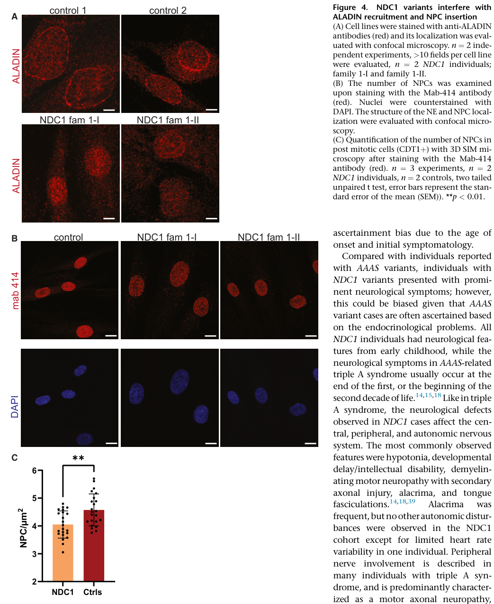

## Question

# Gene Research for Functional Annotation

## ⚠️ CRITICAL: Gene/Protein Identification Context

**BEFORE YOU BEGIN RESEARCH:** You MUST verify you are researching the CORRECT gene/protein. Gene symbols can be ambiguous, especially for less well-characterized genes from non-model organisms.

### Target Gene/Protein Identity (from UniProt):
- **UniProt Accession:** Q9NRG9
- **Protein Description:** RecName: Full=Aladin; AltName: Full=Adracalin;
- **Gene Information:** Name=AAAS; Synonyms=ADRACALA; ORFNames=GL003;
- **Organism (full):** Homo sapiens (Human).
- **Protein Family:** Not specified in UniProt
- **Key Domains:** Aladin. (IPR045139); Beta-prop_Aladin. (IPR057403); WD40/YVTN_repeat-like_dom_sf. (IPR015943); WD40_repeat_CS. (IPR019775); WD40_rpt. (IPR001680)

### MANDATORY VERIFICATION STEPS:

1. **Check if the gene symbol "AAAS" matches the protein description above**
2. **Verify the organism is correct:** Homo sapiens (Human).
3. **Check if protein family/domains align with what you find in literature**
4. **If you find literature for a DIFFERENT gene with the same or similar symbol, STOP**

### If Gene Symbol is Ambiguous or You Cannot Find Relevant Literature:

**DO NOT PROCEED WITH RESEARCH ON A DIFFERENT GENE.** Instead:
- State clearly: "The gene symbol 'AAAS' is ambiguous or literature is limited for this specific protein"
- Explain what you found (e.g., "Found extensive literature on a different gene with the same symbol in a different organism")
- Describe the protein based ONLY on the UniProt information provided above
- Suggest that the protein function can be inferred from domain/family information

### Research Target:

Please provide a comprehensive research report on the gene **AAAS** (gene ID: AAAS, UniProt: Q9NRG9) in human.

The research report should be a detailed narrative explaining the function, biological processes, and localization of the gene product. Citations should be given for all claims.

You should prioritize authoritative reviews and primary scientific literature when conducting research. You can supplement
this with annotations you find in gene/protein databases, but these can be outdated or inaccurate.

We are specifically interested in the primary function of the gene - for enzymes, what reaction is catalyzed, and what is the substrate specificity? For transporters, what is the substrate? For structural proteins or adapters, what is the broader structural role? For signaling molecules, what is the role in the pathway.

We are interested in where in or outside the cell the gene product carries out its function.

We are also interested in the signaling or biochemical pathways in which the gene functions. We are less interested in broad pleiotropic effects, except where these elucidate the precise role.

Include evidence where possible. We are interested in both experimental evidence as well as inference from structure, evolution, or bioinformatic analysis. Precise studies should be prioritized over high-throughput, where available.

## Output

Question: You are an expert researcher providing comprehensive, well-cited information.

Provide detailed information focusing on:
1. Key concepts and definitions with current understanding
2. Recent developments and latest research (prioritize 2023-2024 sources)
3. Current applications and real-world implementations
4. Expert opinions and analysis from authoritative sources
5. Relevant statistics and data from recent studies

Format as a comprehensive research report with proper citations. Include URLs and publication dates where available.
Always prioritize recent, authoritative sources and provide specific citations for all major claims.

# Gene Research for Functional Annotation

## ⚠️ CRITICAL: Gene/Protein Identification Context

**BEFORE YOU BEGIN RESEARCH:** You MUST verify you are researching the CORRECT gene/protein. Gene symbols can be ambiguous, especially for less well-characterized genes from non-model organisms.

### Target Gene/Protein Identity (from UniProt):
- **UniProt Accession:** Q9NRG9
- **Protein Description:** RecName: Full=Aladin; AltName: Full=Adracalin;
- **Gene Information:** Name=AAAS; Synonyms=ADRACALA; ORFNames=GL003;
- **Organism (full):** Homo sapiens (Human).
- **Protein Family:** Not specified in UniProt
- **Key Domains:** Aladin. (IPR045139); Beta-prop_Aladin. (IPR057403); WD40/YVTN_repeat-like_dom_sf. (IPR015943); WD40_repeat_CS. (IPR019775); WD40_rpt. (IPR001680)

### MANDATORY VERIFICATION STEPS:

1. **Check if the gene symbol "AAAS" matches the protein description above**
2. **Verify the organism is correct:** Homo sapiens (Human).
3. **Check if protein family/domains align with what you find in literature**
4. **If you find literature for a DIFFERENT gene with the same or similar symbol, STOP**

### If Gene Symbol is Ambiguous or You Cannot Find Relevant Literature:

**DO NOT PROCEED WITH RESEARCH ON A DIFFERENT GENE.** Instead:
- State clearly: "The gene symbol 'AAAS' is ambiguous or literature is limited for this specific protein"
- Explain what you found (e.g., "Found extensive literature on a different gene with the same symbol in a different organism")
- Describe the protein based ONLY on the UniProt information provided above
- Suggest that the protein function can be inferred from domain/family information

### Research Target:

Please provide a comprehensive research report on the gene **AAAS** (gene ID: AAAS, UniProt: Q9NRG9) in human.

The research report should be a detailed narrative explaining the function, biological processes, and localization of the gene product. Citations should be given for all claims.

You should prioritize authoritative reviews and primary scientific literature when conducting research. You can supplement
this with annotations you find in gene/protein databases, but these can be outdated or inaccurate.

We are specifically interested in the primary function of the gene - for enzymes, what reaction is catalyzed, and what is the substrate specificity? For transporters, what is the substrate? For structural proteins or adapters, what is the broader structural role? For signaling molecules, what is the role in the pathway.

We are interested in where in or outside the cell the gene product carries out its function.

We are also interested in the signaling or biochemical pathways in which the gene functions. We are less interested in broad pleiotropic effects, except where these elucidate the precise role.

Include evidence where possible. We are interested in both experimental evidence as well as inference from structure, evolution, or bioinformatic analysis. Precise studies should be prioritized over high-throughput, where available.

## Comprehensive Research Report: Human **AAAS** (UniProt **Q9NRG9**) / **ALADIN**

### Scope and target verification
This report concerns **human AAAS**, which encodes the nucleoporin **ALADIN** (UniProt accession **Q9NRG9**), a **546–amino-acid WD-repeat protein** localized to the **nuclear pore complex (NPC)**; this identity is consistently stated in recent peer-reviewed literature and matches the UniProt target context provided. (ruizbabot2023generationofglucocorticoidproducing pages 12-14, hasenmajer2023rareformsof pages 9-10)

### Executive summary (current understanding)
AAAS/ALADIN is best understood as a **non-enzymatic WD-repeat scaffold nucleoporin** that supports **selective nucleocytoplasmic trafficking** of specific protein cargoes and/or regulators at the NPC, with downstream consequences for **DNA repair capacity**, **nuclear protection from oxidative damage**, and **adrenal steroidogenic signaling**. Pathogenic biallelic variants cause **triple A (Allgrove) syndrome**, classically featuring **alacrima, achalasia, and primary adrenal insufficiency**, often with neurological/autonomic involvement. (cehic2024veryearlyand pages 1-3, ruizbabot2023generationofglucocorticoidproducing pages 12-14, smits2024biallelicndc1variants pages 8-10)

### 1) Key concepts and definitions (functional annotation focus)

#### 1.1 Nuclear pore complex (NPC) context and ALADIN as a nucleoporin scaffold
ALADIN is described as a **WD-repeat nucleoporin localized to the NPC**, where WD repeats (seven described in recent sources) are interpreted as forming a **protein–protein interaction scaffold** rather than conferring catalytic activity. (ruizbabot2023generationofglucocorticoidproducing pages 12-14, ruizbabot2023generationofglucocorticoidproducing pages 3-4)

**Functional definition (gene product role):** rather than transporting metabolites or catalyzing reactions, ALADIN’s primary functional annotation is **NPC-associated regulation/enablement of selective nuclear import/export of specific proteins**, which can produce tissue-specific phenotypes when disrupted. (cehic2024veryearlyand pages 1-3, ruizbabot2023generationofglucocorticoidproducing pages 12-14)

#### 1.2 Established localization and anchoring mechanism: dependence on NDC1
A major advance in current mechanistic understanding is the clear emphasis that ALADIN’s correct localization at the NPC/nuclear envelope is **NDC1-dependent**. Recent work summarizes that ALADIN is **anchored via the transmembrane nucleoporin NDC1** (rather than POM121/GP210) and that disruption of this interaction reduces ALADIN nuclear-envelope recruitment. (smits2024biallelicndc1variants pages 11-12, smits2024biallelicndc1variants pages 8-10)

A 2024 study in *Human Genetics and Genomics Advances* provides direct cellular evidence: fibroblasts carrying pathogenic **NDC1** variants show **reduced ALADIN localization to the nuclear envelope** and a measurable defect in **post-mitotic NPC insertion/assembly**. (smits2024biallelicndc1variants media 042ddde5, smits2024biallelicndc1variants pages 5-7)

#### 1.3 Interaction partners and affected cargoes: DNA repair proteins and ferritin
Recent reviews and mechanistic syntheses highlight selective nuclear import failure affecting:
- **DNA ligase I** and **aprataxin** (DNA single-strand break repair proteins). (braun2026pathologiesatthe pages 10-12, cehic2024veryearlyand pages 1-3, ruizbabot2023generationofglucocorticoidproducing pages 12-14)
- **Ferritin heavy chain (FTH1)**, which is discussed as protective against **nuclear oxidative damage**; impairment of its nuclear import is used to support an oxidative-damage mechanism. (braun2026pathologiesatthe pages 10-12, smits2024biallelicndc1variants pages 8-10, ruizbabot2023generationofglucocorticoidproducing pages 12-14)

Collectively, these findings frame ALADIN as an NPC component required for **nuclear access of genome-maintenance and oxidative-protection factors** in relevant cellular contexts. (braun2026pathologiesatthe pages 10-12, cehic2024veryearlyand pages 8-9)

### 2) Recent developments and latest research (prioritizing 2023–2024)

#### 2.1 2024: Expansion of the ALADIN–NDC1 axis and “triple A–like” disease mechanisms
Smits et al. (Oct 2024; https://doi.org/10.1016/j.xhgg.2024.100327) report biallelic **NDC1** variants that interfere with ALADIN binding and associate with **neuropathy and a triple A–like syndrome**, underscoring that disruption of ALADIN recruitment can arise from genes beyond AAAS itself. (smits2024biallelicndc1variants pages 8-10, smits2024biallelicndc1variants pages 5-7)

Quantitative cellular evidence in this work includes a reduction in CDT1-positive NPC density in patient cells versus controls (**mean 4.05 vs 4.58 pore/mm²; p < 0.002**), supporting impaired post-mitotic NPC insertion/assembly. (smits2024biallelicndc1variants pages 5-7)

#### 2.2 2023: Patient adrenal tissue provides a mechanistic bridge to steroidogenesis (SCARB1/PKA)
Bitetto et al. (Jun 2023; https://doi.org/10.1186/s13023-023-02763-w) examined postmortem adrenal tissue from an AAAS-mutant patient and reported:
- Reduced ALADIN in total lysate and membrane fraction with slight cytosolic increase (consistent with altered localization/fractionation).
- **Reduced SCARB1 transcript**, reduced **MC2R** (ACTH receptor) immunoreactivity, and **phospho-PKA mislocalization** (reduced nuclear, increased cytosolic fractions), suggesting impaired ACTH/cAMP signaling and transcriptional activation of steroidogenic pathways. (bitetto2023scarb1downregulationin pages 4-6, bitetto2023scarb1downregulationin pages 6-8, bitetto2023scarb1downregulationin pages 1-2)

These findings provide a concrete, human-tissue-supported mechanism connecting an NPC protein defect to adrenal steroidogenic failure. (bitetto2023scarb1downregulationin pages 6-8)

#### 2.3 2023: Human iPSC-derived steroidogenic cells as a functional AAAS disease model
Ruiz-Babot et al. (Nov 2023; https://doi.org/10.1016/j.crmeth.2023.100627) developed human pluripotent stem cell–derived steroidogenic cells and used **CRISPR-engineered AAAS knockout** and an AAAS truncation model to recapitulate triple A adrenal insufficiency phenotypes. (ruizbabot2023generationofglucocorticoidproducing pages 1-3, ruizbabot2023generationofglucocorticoidproducing pages 21-23)

In this system, AAAS/ALADIN loss is associated with reduced steroid output: KO and mutant lines secrete **significantly lower cortisol, cortisone, corticosterone, and aldosterone** than controls (measured by ELISA and LC–MS), and a block at **11β-hydroxylation** (CYP11B enzymes) is described as a mechanistic bottleneck. (ruizbabot2023generationofglucocorticoidproducing pages 12-14)

### 3) Cellular localization and where AAAS/ALADIN carries out its function
The functional site of action is the **nuclear envelope at nuclear pore complexes**, where ALADIN is recruited/anchored by NDC1, and where its loss or mislocalization is repeatedly emphasized as a pathogenic feature in triple A syndrome. (smits2024biallelicndc1variants pages 11-12, cehic2024veryearlyand pages 1-3, ruizbabot2023generationofglucocorticoidproducing pages 12-14)

A key visual demonstration of ALADIN’s NPC localization dependence is shown in Smits et al. 2024 (Figure 4), where immunofluorescence indicates reduced ALADIN nuclear-envelope recruitment in patient fibroblasts with NDC1 variants, along with quantification of reduced post-mitotic NPC density. (smits2024biallelicndc1variants media 042ddde5)

### 4) Pathways and mechanistic models linking AAAS variants to disease

#### 4.1 Nucleocytoplasmic transport and genome maintenance (DNA repair protein import)
A widely cited mechanistic model is that ALADIN disruption causes **selective nuclear import defects** for specific proteins (DNA ligase I, aprataxin), plausibly elevating DNA damage burden in susceptible tissues. (braun2026pathologiesatthe pages 10-12, cehic2024veryearlyand pages 1-3)

#### 4.2 Redox/oxidative stress vulnerability and nuclear protection
ALADIN dysfunction is repeatedly connected to **oxidative stress susceptibility**, supported by discussions of ferritin heavy-chain nuclear import defects and increased cellular reactive oxygen species in patient-derived contexts. (cehic2024veryearlyand pages 8-9, cehic2024veryearlyand pages 5-6, smits2024biallelicndc1variants pages 8-10)

#### 4.3 Adrenal steroidogenesis and ACTH resistance (SCARB1/PKA/MC2R)
Two complementary 2023 lines of evidence connect AAAS/ALADIN to adrenal dysfunction:
1) **Human adrenal tissue** findings show reduced SCARB1 and MC2R and altered phospho-PKA localization, suggesting impaired ACTH/cAMP/PKA-driven transcriptional control of steroidogenic capacity. (bitetto2023scarb1downregulationin pages 6-8, bitetto2023scarb1downregulationin pages 1-2)
2) **iPSC-derived steroidogenic cell** modeling shows reduced secretion of multiple adrenal steroids (glucocorticoids and mineralocorticoids) in AAAS-deficient cells. (ruizbabot2023generationofglucocorticoidproducing pages 12-14, ruizbabot2023generationofglucocorticoidproducing pages 3-4)

Together, these place AAAS/ALADIN within a mechanistic chain: NPC disruption → altered nuclear signaling/transport → dysregulated steroidogenic gene expression and enzymatic steps → adrenal insufficiency. (bitetto2023scarb1downregulationin pages 6-8, ruizbabot2023generationofglucocorticoidproducing pages 12-14)

### 5) Current applications and real-world implementations

#### 5.1 Clinical genetics and differential diagnosis
Genetic testing for **AAAS** is central to confirming triple A syndrome, and recent clinical reviews emphasize that neurological involvement can be common and heterogeneous, making molecular confirmation important for management and family counseling. (cehic2024veryearlyand pages 1-3, hasenmajer2023rareformsof pages 9-10)

Smits et al. (2024) extends real-world implementation by highlighting that “triple A–like” phenotypes can result from **NDC1** variants that disrupt ALADIN recruitment, implying that patients negative for AAAS mutations may warrant evaluation of ALADIN-anchoring machinery. (smits2024biallelicndc1variants pages 8-10)

#### 5.2 Disease modeling for mechanism discovery and therapeutic testing
The 2023 iPSC-derived steroidogenic cell system provides a practical platform for studying AAAS-associated adrenal insufficiency and for testing interventions in a human-relevant context, addressing limitations of mouse models that may not recapitulate the full human phenotype. (ruizbabot2023generationofglucocorticoidproducing pages 15-16, ruizbabot2023generationofglucocorticoidproducing pages 12-14)

#### 5.3 Mechanism-guided therapeutic hypotheses (oxidative stress modulation)
Recent clinical-review literature references antioxidant approaches (e.g., N-acetylcysteine) as exploratory strategies consistent with oxidative stress models, although robust clinical trial evidence is not established in the provided sources. (cehic2024veryearlyand pages 5-6)

### 6) Expert opinions and authoritative analyses

#### 6.1 What is well supported vs. still uncertain
Authoritative recent reviews emphasize that although ALADIN’s precise molecular function is not fully resolved, convergent evidence supports roles in **nucleocytoplasmic transport of selected proteins**, **redox homeostasis**, and **adrenal steroidogenesis**—with mislocalization of mutant ALADIN from NPC to cytoplasm recurring as a key pathogenic theme. (cehic2024veryearlyand pages 1-3, hasenmajer2023rareformsof pages 9-10, ruizbabot2023generationofglucocorticoidproducing pages 12-14)

### 7) Relevant statistics and data (recent studies)

#### 7.1 Clinical feature frequencies (2024 review/case review synthesis)
Cehic et al. (Sep 2024; https://doi.org/10.3389/fendo.2024.1431383) summarize clinical frequencies:
- **Alacrima:** >90% (also stated as “above 90%”).
- **Achalasia:** 75–85%.
- **Primary adrenal insufficiency:** almost 85%.
- **Complete triad:** about 70%.
- **Neurological involvement:** about two-thirds (also described as ~60% in the same review). (cehic2024veryearlyand pages 1-3, cehic2024veryearlyand pages 4-5)

#### 7.2 Genetics and case-definition statistics (2023 review)
Hasenmajer et al. (Feb 2023; https://doi.org/10.1007/s11154-023-09784-7) report:
- Fewer than **50 families** described (reflecting rarity).
- **AAAS variants in ~90% of patients**.
- A literature review recorded **74 AAAS variants**.
- Achalasia in most cohorts around **75–85%**, with onset ranging from months to adolescence. (hasenmajer2023rareformsof pages 9-10, hasenmajer2023rareformsof pages 8-9)

#### 7.3 Quantitative cell biology (2024 mechanistic genetics)
Smits et al. (Oct 2024; https://doi.org/10.1016/j.xhgg.2024.100327) report reduced post-mitotic NPC density in patient fibroblasts (**4.05 vs 4.58 pore/mm²; p < 0.002**) and show reduced ALADIN nuclear-envelope localization in patient cells. (smits2024biallelicndc1variants pages 5-7, smits2024biallelicndc1variants media 042ddde5)

### Evidence synthesis table
The following table summarizes key functional-annotation facts, mechanisms, and recent sources.

| Aspect | Key findings for human AAAS/ALADIN (UniProt Q9NRG9) | Strongest evidence type | Representative recent source(s) |
|---|---|---|---|
| Verified molecular identity | **AAAS** encodes **ALADIN**, a **546-aa WD-repeat nucleoporin** of the nuclear pore complex (NPC); recent reviews/methods papers describe **7 WD repeats** and broad expression with enrichment in adrenal/pituitary/CNS/GI-related tissues, matching the UniProt human target Q9NRG9 rather than another gene symbol usage (hasenmajer2023rareformsof pages 9-10, ruizbabot2023generationofglucocorticoidproducing pages 12-14) | Review; iPSC/model background | Hasenmajer et al., **Feb 2023**, *Rev Endocr Metab Disord*, https://doi.org/10.1007/s11154-023-09784-7 (hasenmajer2023rareformsof pages 9-10); Ruiz-Babot et al., **Nov 2023**, *Cell Reports Methods*, https://doi.org/10.1016/j.crmeth.2023.100627 (ruizbabot2023generationofglucocorticoidproducing pages 12-14) |
| Primary localization | ALADIN localizes to the **NPC/nuclear envelope**; proper NE/NPC targeting is **NDC1-dependent**. NDC1 variants that disrupt the ALADIN-binding region reduce ALADIN recruitment to the NE, and ALADIN is reported as **anchored via NDC1 rather than POM121/GP210** (smits2024biallelicndc1variants pages 11-12, smits2024biallelicndc1variants pages 5-7, smits2024biallelicndc1variants media 042ddde5) | Structural/cell assay with patient fibroblasts | Smits et al., **Oct 2024**, *Hum Genet Genomics Adv*, https://doi.org/10.1016/j.xhgg.2024.100327 (smits2024biallelicndc1variants pages 11-12, smits2024biallelicndc1variants pages 5-7, smits2024biallelicndc1variants media 042ddde5) |
| Key interaction partner: NDC1 | NDC1 is the principal membrane anchor recruiting ALADIN to the NPC; structural modeling places NDC1 C-terminal residues in direct interface with ALADIN, and disease-associated NDC1 alleles impair ALADIN localization and NPC assembly/post-mitotic insertion (smits2024biallelicndc1variants pages 8-10, smits2024biallelicndc1variants pages 5-7) | Structural modeling + patient fibroblast assay | Smits et al., **Oct 2024**, https://doi.org/10.1016/j.xhgg.2024.100327 (smits2024biallelicndc1variants pages 8-10, smits2024biallelicndc1variants pages 5-7) |
| Other NPC-related partners | Recent literature also places ALADIN in a network including **NUP155** in addition to NDC1; proteomic/NPC studies support ALADIN as a bona fide NPC component mislocalized in triple A syndrome (smits2024biallelicndc1variants pages 8-10, braun2026pathologiesatthe pages 23-24) | Review; NPC interaction mapping | Smits et al., **Oct 2024**, https://doi.org/10.1016/j.xhgg.2024.100327 (smits2024biallelicndc1variants pages 8-10); Braun et al., **Apr 2026**, https://doi.org/10.1007/s00018-026-06220-2 (braun2026pathologiesatthe pages 23-24) |
| Cargoes/processes affected: DNA repair proteins | A key mechanistic model is **selective nuclear import failure**: mutant ALADIN reduces nuclear import of **DNA ligase I** and **aprataxin**, proteins needed for repair of DNA single-strand breaks, linking AAAS dysfunction to genome maintenance defects (braun2026pathologiesatthe pages 10-12, cehic2024veryearlyand pages 1-3, ruizbabot2023generationofglucocorticoidproducing pages 12-14) | Mechanistic review of primary studies | Cehic et al., **Sep 2024**, *Front Endocrinol*, https://doi.org/10.3389/fendo.2024.1431383 (cehic2024veryearlyand pages 1-3); Ruiz-Babot et al., **Nov 2023**, https://doi.org/10.1016/j.crmeth.2023.100627 (ruizbabot2023generationofglucocorticoidproducing pages 12-14) |
| Cargoes/processes affected: ferritin heavy chain | ALADIN dysfunction also impairs nuclear import of **ferritin heavy chain (FTH1)**, a protective factor against nuclear oxidative damage; this supports the widely cited model that **oxidative stress susceptibility** is central to AAAS pathology (smits2024biallelicndc1variants pages 8-10, braun2026pathologiesatthe pages 10-12, cehic2024veryearlyand pages 8-9, smits2024biallelicndc1variants pages 11-12, ruizbabot2023generationofglucocorticoidproducing pages 12-14) | Cell/mechanistic assay summarized by recent review | Smits et al., **Oct 2024**, https://doi.org/10.1016/j.xhgg.2024.100327 (smits2024biallelicndc1variants pages 8-10, smits2024biallelicndc1variants pages 11-12); Cehic et al., **Sep 2024**, https://doi.org/10.3389/fendo.2024.1431383 (cehic2024veryearlyand pages 8-9) |
| Core molecular function | Best-supported current interpretation: ALADIN is a **scaffold/selective transport regulator at the NPC**, not an enzyme or transporter with a defined small-molecule substrate. Its primary role is to enable **proper nucleocytoplasmic trafficking of selected protein cargos**, thereby supporting **DNA repair**, **redox homeostasis**, and tissue-specific functions in adrenal and neural cells (braun2026pathologiesatthe pages 9-10, cehic2024veryearlyand pages 1-3, ruizbabot2023generationofglucocorticoidproducing pages 12-14) | Review synthesis + disease modeling | Cehic et al., **Sep 2024**, https://doi.org/10.3389/fendo.2024.1431383 (cehic2024veryearlyand pages 1-3); Ruiz-Babot et al., **Nov 2023**, https://doi.org/10.1016/j.crmeth.2023.100627 (ruizbabot2023generationofglucocorticoidproducing pages 12-14) |
| Redox / oxidative stress role | Multiple recent sources summarize increased **ROS/oxidative stress** in AAAS-deficient contexts; ALADIN loss alters oxidative-stress responses in fibroblasts/adrenal cells, and antioxidant response has been proposed as a therapeutic angle in isolated reports (smits2024biallelicndc1variants pages 8-10, cehic2024veryearlyand pages 8-9, cehic2024veryearlyand pages 5-6, cehic2024veryearlyand pages 4-5) | Case-review synthesis; cell assay summaries | Cehic et al., **Sep 2024**, https://doi.org/10.3389/fendo.2024.1431383 (cehic2024veryearlyand pages 8-9, cehic2024veryearlyand pages 5-6, cehic2024veryearlyand pages 4-5); Smits et al., **Oct 2024**, https://doi.org/10.1016/j.xhgg.2024.100327 (smits2024biallelicndc1variants pages 8-10) |
| Steroidogenesis / adrenal pathway | AAAS dysfunction is linked to **adrenal steroidogenic failure**. In patient adrenal tissue, **SCARB1** transcript is reduced, **MC2R** is strongly reduced, and **phospho-PKA** shows decreased nuclear and increased cytosolic localization, consistent with impaired **cAMP/PKA-dependent nuclear signaling** and ACTH resistance (bitetto2023scarb1downregulationin pages 4-6, bitetto2023scarb1downregulationin pages 6-8, bitetto2023scarb1downregulationin pages 1-2) | Patient tissue study | Bitetto et al., **Jun 2023**, *Orphanet J Rare Dis*, https://doi.org/10.1186/s13023-023-02763-w (bitetto2023scarb1downregulationin pages 4-6, bitetto2023scarb1downregulationin pages 6-8, bitetto2023scarb1downregulationin pages 1-2) |
| Human cell disease modeling | CRISPR-engineered **AAAS-null iPSC-derived steroidogenic cells** recapitulate adrenal insufficiency features, showing **significantly lower cortisol, cortisone, corticosterone, and aldosterone** secretion than controls; this is a direct 2023 implementation for functional modeling of AAAS-associated disease (ruizbabot2023generationofglucocorticoidproducing pages 12-14, ruizbabot2023generationofglucocorticoidproducing pages 3-4, ruizbabot2023generationofglucocorticoidproducing pages 1-3) | iPSC disease model | Ruiz-Babot et al., **Nov 2023**, https://doi.org/10.1016/j.crmeth.2023.100627 (ruizbabot2023generationofglucocorticoidproducing pages 12-14, ruizbabot2023generationofglucocorticoidproducing pages 3-4, ruizbabot2023generationofglucocorticoidproducing pages 1-3) |
| Disease association | Biallelic AAAS variants cause **triple A (Allgrove) syndrome**, classically comprising **alacrima, achalasia, and adrenal insufficiency**, often with neurologic/autonomic involvement; ALADIN mislocalization from the NPC is a common pathogenic theme (cehic2024veryearlyand pages 1-3, hasenmajer2023rareformsof pages 9-10) | Review | Hasenmajer et al., **Feb 2023**, https://doi.org/10.1007/s11154-023-09784-7 (hasenmajer2023rareformsof pages 9-10); Cehic et al., **Sep 2024**, https://doi.org/10.3389/fendo.2024.1431383 (cehic2024veryearlyand pages 1-3) |
| Key 2023–2024 clinical statistics | Recent reviews/case analyses report: **complete triad ~70%**; **alacrima >90%** or **90–100%**; **achalasia 75–85%**; **primary adrenal insufficiency almost 85%**; **neurologic involvement ~60% to two-thirds**; **AAAS variants in ~90% of patients** in one 2023 review; disease prevalence cited as about **1 in 1,000,000** in review literature (cehic2024veryearlyand pages 1-3, cehic2024veryearlyand pages 4-5, hasenmajer2023rareformsof pages 9-10, hasenmajer2023rareformsof pages 8-9, braun2026pathologiesatthe pages 9-10) | Review; case-review synthesis | Hasenmajer et al., **Feb 2023**, https://doi.org/10.1007/s11154-023-09784-7 (hasenmajer2023rareformsof pages 9-10, hasenmajer2023rareformsof pages 8-9); Cehic et al., **Sep 2024**, https://doi.org/10.3389/fendo.2024.1431383 (cehic2024veryearlyand pages 1-3, cehic2024veryearlyand pages 4-5) |
| Notable genotype/phenotype data | In a 2024 genotype-focused summary, the **p.Ser263Pro** AAAS variant showed neurologic manifestations in **33/34 (97.1%)** carriers versus **133/172 (77.3%)** in other genotypes (**p = 0.006**); possible Slavic founder effect noted (**25/36, 69.4%**) (juscinska2026neurologicalmanifestationsof pages 1-2) | Cohort/genotype-phenotype analysis | Juścińska et al., **Jan 2026** reporting aggregate cohort data, https://doi.org/10.1007/s10048-025-00870-3 (juscinska2026neurologicalmanifestationsof pages 1-2) |
| Recent clinical implementation | Current real-world use is mainly **molecular diagnosis and mechanistic stratification** of rare disease: recent Sudanese series identified **6 AAAS mutations in 20 families/31 patients**, including novel alleles, emphasizing early genetic diagnosis to prevent adrenal crises; NDC1 analysis expands differential diagnosis to **triple A-like syndromes** when AAAS is negative (smits2024biallelicndc1variants pages 8-10) | Case series / genetic diagnostics | Smits et al., **Oct 2024**, https://doi.org/10.1016/j.xhgg.2024.100327 (smits2024biallelicndc1variants pages 8-10) |
| Visual/mechanistic support from recent figure | A recent figure shows **reduced ALADIN nuclear-envelope staining** in NDC1-variant fibroblasts and **lower post-mitotic NPC density** in patient cells, visually supporting the ALADIN-at-NPC recruitment model (smits2024biallelicndc1variants media 042ddde5) | Figure-based cell assay | Smits et al., **Oct 2024**, Figure 4 context, https://doi.org/10.1016/j.xhgg.2024.100327 (smits2024biallelicndc1variants media 042ddde5) |

*Table: This table condenses the most relevant verified facts about human AAAS/ALADIN, including identity, NPC localization, interaction partners, mechanisms, disease links, and recent 2023–2024 studies. It is designed as a quick-reference artifact for functional annotation and evidence-weighted interpretation.*

### References (URLs and publication dates)
- Bitetto G. et al. **Jun 2023**. *Orphanet Journal of Rare Diseases*. “SCARB1 downregulation in adrenal insufficiency with Allgrove syndrome.” https://doi.org/10.1186/s13023-023-02763-w (bitetto2023scarb1downregulationin pages 1-2)
- Hasenmajer V. et al. **Feb 2023**. *Reviews in Endocrine & Metabolic Disorders*. “Rare forms of genetic paediatric adrenal insufficiency: Excluding congenital adrenal hyperplasia.” https://doi.org/10.1007/s11154-023-09784-7 (hasenmajer2023rareformsof pages 9-10)
- Ruiz-Babot G. et al. **Nov 2023**. *Cell Reports Methods*. “Generation of glucocorticoid-producing cells derived from human pluripotent stem cells.” https://doi.org/10.1016/j.crmeth.2023.100627 (ruizbabot2023generationofglucocorticoidproducing pages 1-3)
- Cehic M. et al. **Sep 2024**. *Frontiers in Endocrinology*. “Very early and severe presentation of Triple A syndrome – case report and review of the literature.” https://doi.org/10.3389/fendo.2024.1431383 (cehic2024veryearlyand pages 1-3)
- Smits D.J. et al. **Oct 2024**. *Human Genetics and Genomics Advances*. “Biallelic NDC1 variants that interfere with ALADIN binding are associated with neuropathy and triple A-like syndrome.” https://doi.org/10.1016/j.xhgg.2024.100327 (smits2024biallelicndc1variants pages 8-10)

### Notes on limitations of this synthesis
Some extracted excerpts describe statistical significance or “significant” changes without providing full numeric effect sizes; therefore, this report reports quantitative values only where explicitly present in the retrieved text (e.g., NPC density metrics) and otherwise reports qualitative directionality with clear attribution. (bitetto2023scarb1downregulationin pages 6-8, ruizbabot2023generationofglucocorticoidproducing pages 12-14)

References

1. (ruizbabot2023generationofglucocorticoidproducing pages 12-14): Gerard Ruiz-Babot, Ariane Eceiza, Fernando Abollo-Jiménez, Maria Malyukov, Diana L. Carlone, Kleiton Borges, Alexandra Rodrigues Da Costa, Shamma Qarin, Takuya Matsumoto, Ryuji Morizane, William C. Skarnes, Barbara Ludwig, Paul J. Chapple, Leonardo Guasti, Helen L. Storr, Stefan R. Bornstein, and David T. Breault. Generation of glucocorticoid-producing cells derived from human pluripotent stem cells. Cell Reports Methods, 3:100627, Nov 2023. URL: https://doi.org/10.1016/j.crmeth.2023.100627, doi:10.1016/j.crmeth.2023.100627. This article has 20 citations.

2. (hasenmajer2023rareformsof pages 9-10): Valeria Hasenmajer, Rosario Ferrigno, Marianna Minnetti, Bianca Pellegrini, Andrea M. Isidori, Andrea Lenzi, Mariacarolina Salerno, Marco Cappa, Li Chan, Maria Cristina De Martino, and Martin O. Savage. Rare forms of genetic paediatric adrenal insufficiency: excluding congenital adrenal hyperplasia. Reviews in Endocrine & Metabolic Disorders, 24:345-363, Feb 2023. URL: https://doi.org/10.1007/s11154-023-09784-7, doi:10.1007/s11154-023-09784-7. This article has 22 citations and is from a peer-reviewed journal.

3. (cehic2024veryearlyand pages 1-3): Maja Cehic, Katarina Mitrovic, Rade Vukovic, Tatjana Milenkovic, Gordana Kovacevic, Sladjana Todorovic, Sanja Panic Zaric, Dimitrije Cvetkovic, Aleksandra Paripovic, Angela Huebner, Katrin Koehler, and Friederike Quitter. Very early and severe presentation of triple a syndrome – case report and review of the literature. Frontiers in Endocrinology, Sep 2024. URL: https://doi.org/10.3389/fendo.2024.1431383, doi:10.3389/fendo.2024.1431383. This article has 11 citations.

4. (smits2024biallelicndc1variants pages 8-10): Daphne J. Smits, Jordy Dekker, Hannie Douben, Rachel Schot, Helen Magee, Somayeh Bakhtiari, Katrin Koehler, Angela Huebner, Markus Schuelke, Hossein Darvish, Shohreh Vosoogh, Abbas Tafakhori, Melika Jameie, Ehsan Taghiabadi, Yana Wilson, Margit Shah, Marjon A. van Slegtenhorst, Evita G. Medici-van den Herik, Tjakko J. van Ham, Michael C. Kruer, and Grazia M.S. Mancini. Biallelic ndc1 variants that interfere with aladin binding are associated with neuropathy and triple a-like syndrome. Oct 2024. URL: https://doi.org/10.1016/j.xhgg.2024.100327, doi:10.1016/j.xhgg.2024.100327. This article has 3 citations and is from a peer-reviewed journal.

5. (ruizbabot2023generationofglucocorticoidproducing pages 3-4): Gerard Ruiz-Babot, Ariane Eceiza, Fernando Abollo-Jiménez, Maria Malyukov, Diana L. Carlone, Kleiton Borges, Alexandra Rodrigues Da Costa, Shamma Qarin, Takuya Matsumoto, Ryuji Morizane, William C. Skarnes, Barbara Ludwig, Paul J. Chapple, Leonardo Guasti, Helen L. Storr, Stefan R. Bornstein, and David T. Breault. Generation of glucocorticoid-producing cells derived from human pluripotent stem cells. Cell Reports Methods, 3:100627, Nov 2023. URL: https://doi.org/10.1016/j.crmeth.2023.100627, doi:10.1016/j.crmeth.2023.100627. This article has 20 citations.

6. (smits2024biallelicndc1variants pages 11-12): Daphne J. Smits, Jordy Dekker, Hannie Douben, Rachel Schot, Helen Magee, Somayeh Bakhtiari, Katrin Koehler, Angela Huebner, Markus Schuelke, Hossein Darvish, Shohreh Vosoogh, Abbas Tafakhori, Melika Jameie, Ehsan Taghiabadi, Yana Wilson, Margit Shah, Marjon A. van Slegtenhorst, Evita G. Medici-van den Herik, Tjakko J. van Ham, Michael C. Kruer, and Grazia M.S. Mancini. Biallelic ndc1 variants that interfere with aladin binding are associated with neuropathy and triple a-like syndrome. Oct 2024. URL: https://doi.org/10.1016/j.xhgg.2024.100327, doi:10.1016/j.xhgg.2024.100327. This article has 3 citations and is from a peer-reviewed journal.

7. (smits2024biallelicndc1variants media 042ddde5): Daphne J. Smits, Jordy Dekker, Hannie Douben, Rachel Schot, Helen Magee, Somayeh Bakhtiari, Katrin Koehler, Angela Huebner, Markus Schuelke, Hossein Darvish, Shohreh Vosoogh, Abbas Tafakhori, Melika Jameie, Ehsan Taghiabadi, Yana Wilson, Margit Shah, Marjon A. van Slegtenhorst, Evita G. Medici-van den Herik, Tjakko J. van Ham, Michael C. Kruer, and Grazia M.S. Mancini. Biallelic ndc1 variants that interfere with aladin binding are associated with neuropathy and triple a-like syndrome. Oct 2024. URL: https://doi.org/10.1016/j.xhgg.2024.100327, doi:10.1016/j.xhgg.2024.100327. This article has 3 citations and is from a peer-reviewed journal.

8. (smits2024biallelicndc1variants pages 5-7): Daphne J. Smits, Jordy Dekker, Hannie Douben, Rachel Schot, Helen Magee, Somayeh Bakhtiari, Katrin Koehler, Angela Huebner, Markus Schuelke, Hossein Darvish, Shohreh Vosoogh, Abbas Tafakhori, Melika Jameie, Ehsan Taghiabadi, Yana Wilson, Margit Shah, Marjon A. van Slegtenhorst, Evita G. Medici-van den Herik, Tjakko J. van Ham, Michael C. Kruer, and Grazia M.S. Mancini. Biallelic ndc1 variants that interfere with aladin binding are associated with neuropathy and triple a-like syndrome. Oct 2024. URL: https://doi.org/10.1016/j.xhgg.2024.100327, doi:10.1016/j.xhgg.2024.100327. This article has 3 citations and is from a peer-reviewed journal.

9. (braun2026pathologiesatthe pages 10-12): Daniela A. Braun, Ramona Jühlen, Vanessa Krausel, and Wolfram Antonin. Pathologies at the gateway: exploring the link between nucleoporins and inherited diseases. Cellular and Molecular Life Sciences, Apr 2026. URL: https://doi.org/10.1007/s00018-026-06220-2, doi:10.1007/s00018-026-06220-2. This article has 0 citations and is from a domain leading peer-reviewed journal.

10. (cehic2024veryearlyand pages 8-9): Maja Cehic, Katarina Mitrovic, Rade Vukovic, Tatjana Milenkovic, Gordana Kovacevic, Sladjana Todorovic, Sanja Panic Zaric, Dimitrije Cvetkovic, Aleksandra Paripovic, Angela Huebner, Katrin Koehler, and Friederike Quitter. Very early and severe presentation of triple a syndrome – case report and review of the literature. Frontiers in Endocrinology, Sep 2024. URL: https://doi.org/10.3389/fendo.2024.1431383, doi:10.3389/fendo.2024.1431383. This article has 11 citations.

11. (bitetto2023scarb1downregulationin pages 4-6): Giacomo Bitetto, Gianluca Lopez, Dario Ronchi, Alessandra Pittaro, Valentina Melzi, Erika Peverelli, Fulvia Milena Cribiù, Giacomo P. Comi, Giovanna Mantovani, and Alessio Di Fonzo. Scarb1 downregulation in adrenal insufficiency with allgrove syndrome. Orphanet Journal of Rare Diseases, Jun 2023. URL: https://doi.org/10.1186/s13023-023-02763-w, doi:10.1186/s13023-023-02763-w. This article has 10 citations and is from a peer-reviewed journal.

12. (bitetto2023scarb1downregulationin pages 6-8): Giacomo Bitetto, Gianluca Lopez, Dario Ronchi, Alessandra Pittaro, Valentina Melzi, Erika Peverelli, Fulvia Milena Cribiù, Giacomo P. Comi, Giovanna Mantovani, and Alessio Di Fonzo. Scarb1 downregulation in adrenal insufficiency with allgrove syndrome. Orphanet Journal of Rare Diseases, Jun 2023. URL: https://doi.org/10.1186/s13023-023-02763-w, doi:10.1186/s13023-023-02763-w. This article has 10 citations and is from a peer-reviewed journal.

13. (bitetto2023scarb1downregulationin pages 1-2): Giacomo Bitetto, Gianluca Lopez, Dario Ronchi, Alessandra Pittaro, Valentina Melzi, Erika Peverelli, Fulvia Milena Cribiù, Giacomo P. Comi, Giovanna Mantovani, and Alessio Di Fonzo. Scarb1 downregulation in adrenal insufficiency with allgrove syndrome. Orphanet Journal of Rare Diseases, Jun 2023. URL: https://doi.org/10.1186/s13023-023-02763-w, doi:10.1186/s13023-023-02763-w. This article has 10 citations and is from a peer-reviewed journal.

14. (ruizbabot2023generationofglucocorticoidproducing pages 1-3): Gerard Ruiz-Babot, Ariane Eceiza, Fernando Abollo-Jiménez, Maria Malyukov, Diana L. Carlone, Kleiton Borges, Alexandra Rodrigues Da Costa, Shamma Qarin, Takuya Matsumoto, Ryuji Morizane, William C. Skarnes, Barbara Ludwig, Paul J. Chapple, Leonardo Guasti, Helen L. Storr, Stefan R. Bornstein, and David T. Breault. Generation of glucocorticoid-producing cells derived from human pluripotent stem cells. Cell Reports Methods, 3:100627, Nov 2023. URL: https://doi.org/10.1016/j.crmeth.2023.100627, doi:10.1016/j.crmeth.2023.100627. This article has 20 citations.

15. (ruizbabot2023generationofglucocorticoidproducing pages 21-23): Gerard Ruiz-Babot, Ariane Eceiza, Fernando Abollo-Jiménez, Maria Malyukov, Diana L. Carlone, Kleiton Borges, Alexandra Rodrigues Da Costa, Shamma Qarin, Takuya Matsumoto, Ryuji Morizane, William C. Skarnes, Barbara Ludwig, Paul J. Chapple, Leonardo Guasti, Helen L. Storr, Stefan R. Bornstein, and David T. Breault. Generation of glucocorticoid-producing cells derived from human pluripotent stem cells. Cell Reports Methods, 3:100627, Nov 2023. URL: https://doi.org/10.1016/j.crmeth.2023.100627, doi:10.1016/j.crmeth.2023.100627. This article has 20 citations.

16. (cehic2024veryearlyand pages 5-6): Maja Cehic, Katarina Mitrovic, Rade Vukovic, Tatjana Milenkovic, Gordana Kovacevic, Sladjana Todorovic, Sanja Panic Zaric, Dimitrije Cvetkovic, Aleksandra Paripovic, Angela Huebner, Katrin Koehler, and Friederike Quitter. Very early and severe presentation of triple a syndrome – case report and review of the literature. Frontiers in Endocrinology, Sep 2024. URL: https://doi.org/10.3389/fendo.2024.1431383, doi:10.3389/fendo.2024.1431383. This article has 11 citations.

17. (ruizbabot2023generationofglucocorticoidproducing pages 15-16): Gerard Ruiz-Babot, Ariane Eceiza, Fernando Abollo-Jiménez, Maria Malyukov, Diana L. Carlone, Kleiton Borges, Alexandra Rodrigues Da Costa, Shamma Qarin, Takuya Matsumoto, Ryuji Morizane, William C. Skarnes, Barbara Ludwig, Paul J. Chapple, Leonardo Guasti, Helen L. Storr, Stefan R. Bornstein, and David T. Breault. Generation of glucocorticoid-producing cells derived from human pluripotent stem cells. Cell Reports Methods, 3:100627, Nov 2023. URL: https://doi.org/10.1016/j.crmeth.2023.100627, doi:10.1016/j.crmeth.2023.100627. This article has 20 citations.

18. (cehic2024veryearlyand pages 4-5): Maja Cehic, Katarina Mitrovic, Rade Vukovic, Tatjana Milenkovic, Gordana Kovacevic, Sladjana Todorovic, Sanja Panic Zaric, Dimitrije Cvetkovic, Aleksandra Paripovic, Angela Huebner, Katrin Koehler, and Friederike Quitter. Very early and severe presentation of triple a syndrome – case report and review of the literature. Frontiers in Endocrinology, Sep 2024. URL: https://doi.org/10.3389/fendo.2024.1431383, doi:10.3389/fendo.2024.1431383. This article has 11 citations.

19. (hasenmajer2023rareformsof pages 8-9): Valeria Hasenmajer, Rosario Ferrigno, Marianna Minnetti, Bianca Pellegrini, Andrea M. Isidori, Andrea Lenzi, Mariacarolina Salerno, Marco Cappa, Li Chan, Maria Cristina De Martino, and Martin O. Savage. Rare forms of genetic paediatric adrenal insufficiency: excluding congenital adrenal hyperplasia. Reviews in Endocrine & Metabolic Disorders, 24:345-363, Feb 2023. URL: https://doi.org/10.1007/s11154-023-09784-7, doi:10.1007/s11154-023-09784-7. This article has 22 citations and is from a peer-reviewed journal.

20. (braun2026pathologiesatthe pages 23-24): Daniela A. Braun, Ramona Jühlen, Vanessa Krausel, and Wolfram Antonin. Pathologies at the gateway: exploring the link between nucleoporins and inherited diseases. Cellular and Molecular Life Sciences, Apr 2026. URL: https://doi.org/10.1007/s00018-026-06220-2, doi:10.1007/s00018-026-06220-2. This article has 0 citations and is from a domain leading peer-reviewed journal.

21. (braun2026pathologiesatthe pages 9-10): Daniela A. Braun, Ramona Jühlen, Vanessa Krausel, and Wolfram Antonin. Pathologies at the gateway: exploring the link between nucleoporins and inherited diseases. Cellular and Molecular Life Sciences, Apr 2026. URL: https://doi.org/10.1007/s00018-026-06220-2, doi:10.1007/s00018-026-06220-2. This article has 0 citations and is from a domain leading peer-reviewed journal.

22. (juscinska2026neurologicalmanifestationsof pages 1-2): Ewa Juścińska, Karolina Gadzalska, Paulina Jakiel, Monika Gorządek, Michał Pietrusiński, Tomasz Płoszaj, Sebastian Skoczylas, Klaudia Starosz, Maciej Borowiec, Agata Pastorczak, and Agnieszka Zmysłowska. Neurological manifestations of allgrove syndrome in patients carrying a potentially founder p.ser263pro variant in the aaas gene. Neurogenetics, Jan 2026. URL: https://doi.org/10.1007/s10048-025-00870-3, doi:10.1007/s10048-025-00870-3. This article has 2 citations and is from a peer-reviewed journal.

## Artifacts

- [Edison artifact artifact-00](AAAS-deep-research-falcon_artifacts/artifact-00.md)

## Citations

1. ruizbabot2023generationofglucocorticoidproducing pages 12-14
2. cehic2024veryearlyand pages 5-6
3. hasenmajer2023rareformsof pages 9-10
4. braun2026pathologiesatthe pages 23-24
5. cehic2024veryearlyand pages 1-3
6. cehic2024veryearlyand pages 8-9
7. juscinska2026neurologicalmanifestationsof pages 1-2
8. ruizbabot2023generationofglucocorticoidproducing pages 1-3
9. ruizbabot2023generationofglucocorticoidproducing pages 3-4
10. braun2026pathologiesatthe pages 10-12
11. ruizbabot2023generationofglucocorticoidproducing pages 21-23
12. ruizbabot2023generationofglucocorticoidproducing pages 15-16
13. cehic2024veryearlyand pages 4-5
14. hasenmajer2023rareformsof pages 8-9
15. braun2026pathologiesatthe pages 9-10
16. https://doi.org/10.1016/j.xhgg.2024.100327
17. https://doi.org/10.1186/s13023-023-02763-w
18. https://doi.org/10.1016/j.crmeth.2023.100627
19. https://doi.org/10.3389/fendo.2024.1431383
20. https://doi.org/10.1007/s11154-023-09784-7
21. https://doi.org/10.1007/s00018-026-06220-2
22. https://doi.org/10.1007/s10048-025-00870-3
23. https://doi.org/10.1016/j.crmeth.2023.100627,
24. https://doi.org/10.1007/s11154-023-09784-7,
25. https://doi.org/10.3389/fendo.2024.1431383,
26. https://doi.org/10.1016/j.xhgg.2024.100327,
27. https://doi.org/10.1007/s00018-026-06220-2,
28. https://doi.org/10.1186/s13023-023-02763-w,
29. https://doi.org/10.1007/s10048-025-00870-3,