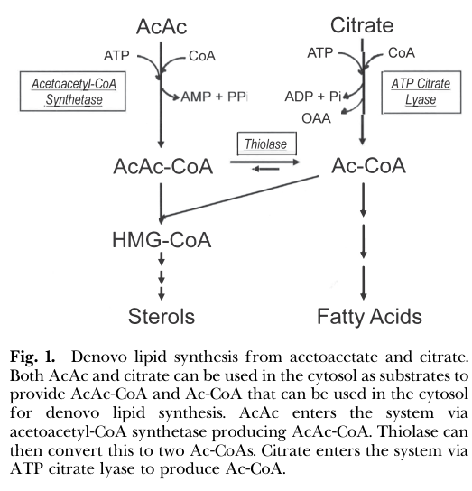

## Question

# Gene Research for Functional Annotation

## ⚠️ CRITICAL: Gene/Protein Identification Context

**BEFORE YOU BEGIN RESEARCH:** You MUST verify you are researching the CORRECT gene/protein. Gene symbols can be ambiguous, especially for less well-characterized genes from non-model organisms.

### Target Gene/Protein Identity (from UniProt):
- **UniProt Accession:** Q86V21
- **Protein Description:** RecName: Full=Acetoacetyl-CoA synthetase; EC=6.2.1.16 {ECO:0000250|UniProtKB:Q9JMI1}; AltName: Full=Acyl-CoA synthetase family member 1; AltName: Full=Protein sur-5 homolog;
- **Gene Information:** Name=AACS; Synonyms=ACSF1;
- **Organism (full):** Homo sapiens (Human).
- **Protein Family:** Belongs to the ATP-dependent AMP-binding enzyme family.
- **Key Domains:** Acac_CoA_synth. (IPR005914); ACAS_N. (IPR032387); AMP-bd_C_sf. (IPR045851); AMP-binding_CS. (IPR020845); AMP-dep_synth/lig_dom. (IPR000873)

### MANDATORY VERIFICATION STEPS:

1. **Check if the gene symbol "AACS" matches the protein description above**
2. **Verify the organism is correct:** Homo sapiens (Human).
3. **Check if protein family/domains align with what you find in literature**
4. **If you find literature for a DIFFERENT gene with the same or similar symbol, STOP**

### If Gene Symbol is Ambiguous or You Cannot Find Relevant Literature:

**DO NOT PROCEED WITH RESEARCH ON A DIFFERENT GENE.** Instead:
- State clearly: "The gene symbol 'AACS' is ambiguous or literature is limited for this specific protein"
- Explain what you found (e.g., "Found extensive literature on a different gene with the same symbol in a different organism")
- Describe the protein based ONLY on the UniProt information provided above
- Suggest that the protein function can be inferred from domain/family information

### Research Target:

Please provide a comprehensive research report on the gene **AACS** (gene ID: Q86V21, UniProt: Q86V21) in human.

The research report should be a detailed narrative explaining the function, biological processes, and localization of the gene product. Citations should be given for all claims.

You should prioritize authoritative reviews and primary scientific literature when conducting research. You can supplement
this with annotations you find in gene/protein databases, but these can be outdated or inaccurate.

We are specifically interested in the primary function of the gene - for enzymes, what reaction is catalyzed, and what is the substrate specificity? For transporters, what is the substrate? For structural proteins or adapters, what is the broader structural role? For signaling molecules, what is the role in the pathway.

We are interested in where in or outside the cell the gene product carries out its function.

We are also interested in the signaling or biochemical pathways in which the gene functions. We are less interested in broad pleiotropic effects, except where these elucidate the precise role.

Include evidence where possible. We are interested in both experimental evidence as well as inference from structure, evolution, or bioinformatic analysis. Precise studies should be prioritized over high-throughput, where available.

## Output

Question: You are an expert researcher providing comprehensive, well-cited information.

Provide detailed information focusing on:
1. Key concepts and definitions with current understanding
2. Recent developments and latest research (prioritize 2023-2024 sources)
3. Current applications and real-world implementations
4. Expert opinions and analysis from authoritative sources
5. Relevant statistics and data from recent studies

Format as a comprehensive research report with proper citations. Include URLs and publication dates where available.
Always prioritize recent, authoritative sources and provide specific citations for all major claims.

# Gene Research for Functional Annotation

## ⚠️ CRITICAL: Gene/Protein Identification Context

**BEFORE YOU BEGIN RESEARCH:** You MUST verify you are researching the CORRECT gene/protein. Gene symbols can be ambiguous, especially for less well-characterized genes from non-model organisms.

### Target Gene/Protein Identity (from UniProt):
- **UniProt Accession:** Q86V21
- **Protein Description:** RecName: Full=Acetoacetyl-CoA synthetase; EC=6.2.1.16 {ECO:0000250|UniProtKB:Q9JMI1}; AltName: Full=Acyl-CoA synthetase family member 1; AltName: Full=Protein sur-5 homolog;
- **Gene Information:** Name=AACS; Synonyms=ACSF1;
- **Organism (full):** Homo sapiens (Human).
- **Protein Family:** Belongs to the ATP-dependent AMP-binding enzyme family.
- **Key Domains:** Acac_CoA_synth. (IPR005914); ACAS_N. (IPR032387); AMP-bd_C_sf. (IPR045851); AMP-binding_CS. (IPR020845); AMP-dep_synth/lig_dom. (IPR000873)

### MANDATORY VERIFICATION STEPS:

1. **Check if the gene symbol "AACS" matches the protein description above**
2. **Verify the organism is correct:** Homo sapiens (Human).
3. **Check if protein family/domains align with what you find in literature**
4. **If you find literature for a DIFFERENT gene with the same or similar symbol, STOP**

### If Gene Symbol is Ambiguous or You Cannot Find Relevant Literature:

**DO NOT PROCEED WITH RESEARCH ON A DIFFERENT GENE.** Instead:
- State clearly: "The gene symbol 'AACS' is ambiguous or literature is limited for this specific protein"
- Explain what you found (e.g., "Found extensive literature on a different gene with the same symbol in a different organism")
- Describe the protein based ONLY on the UniProt information provided above
- Suggest that the protein function can be inferred from domain/family information

### Research Target:

Please provide a comprehensive research report on the gene **AACS** (gene ID: Q86V21, UniProt: Q86V21) in human.

The research report should be a detailed narrative explaining the function, biological processes, and localization of the gene product. Citations should be given for all claims.

You should prioritize authoritative reviews and primary scientific literature when conducting research. You can supplement
this with annotations you find in gene/protein databases, but these can be outdated or inaccurate.

We are specifically interested in the primary function of the gene - for enzymes, what reaction is catalyzed, and what is the substrate specificity? For transporters, what is the substrate? For structural proteins or adapters, what is the broader structural role? For signaling molecules, what is the role in the pathway.

We are interested in where in or outside the cell the gene product carries out its function.

We are also interested in the signaling or biochemical pathways in which the gene functions. We are less interested in broad pleiotropic effects, except where these elucidate the precise role.

Include evidence where possible. We are interested in both experimental evidence as well as inference from structure, evolution, or bioinformatic analysis. Precise studies should be prioritized over high-throughput, where available.

# Human AACS (Q86V21): functional-annotation research report

## Executive conclusion

Human **AACS** encodes **acetoacetyl-CoA synthetase** (also called **ACSF1**), a **cytosolic, ATP-dependent, AMP-forming acyl-CoA ligase**. Its principal function is to activate the ketone body acetoacetate for anabolic metabolism:

**acetoacetate + CoA + ATP → acetoacetyl-CoA + AMP + pyrophosphate (PPi).**

The resulting cytosolic acetoacetyl-CoA can enter cholesterol synthesis directly through cytosolic HMG-CoA synthase or be cleaved by cytosolic thiolase to acetyl-CoA for fatty-acid synthesis, elongation, and other lipid synthesis. Thus, AACS is not primarily a mitochondrial ketone-oxidation enzyme; it is an **anabolic ketone-body-utilization enzyme** that provides a cytosolic route into lipogenesis while bypassing citrate and ATP-citrate lyase (ACLY) (bergstrom2023thelipogenicenzyme pages 1-2, bergstrom2023thelipogenicenzyme media 16de3062).

The strongest direct human evidence comprises recombinant-enzyme kinetics and metabolic-flux studies in human fibroblasts. Much of the developmental, nutritional, and regulatory physiology comes from rodents and should not be treated as proven human physiology. The most important recent synthesis is Bergstrom’s peer-reviewed *Journal of Lipid Research* review, published August 2023, while a 2024-origin preprint proposes an additional role in supplying acetoacetyl-CoA for lysine acetoacetylation (bergstrom2023thelipogenicenzyme pages 2-3, fu2025identificationofthe pages 12-14).

## 1. Mandatory identity verification

The requested target is internally consistent:

- **Gene:** AACS
- **Approved protein name:** acetoacetyl-CoA synthetase
- **Alias:** ACSF1, or acyl-CoA synthetase family member 1
- **Species:** *Homo sapiens*
- **UniProt accession supplied:** Q86V21
- **Ensembl target:** ENSG00000081760
- **Enzyme:** EC 6.2.1.16

Open Targets independently maps human **AACS/ENSG00000081760** to the approved name “acetoacetyl-CoA synthetase,” agreeing with the supplied UniProt identity (OpenTargets Search: -AACS). No evidence retrieved indicated that the human symbol referred to a different protein.

The supplied domains—Acac_CoA_synth, ACAS_N, AMP-binding catalytic-signature, and AMP-dependent synthetase/ligase domains—are consistent with the experimentally established ATP-to-AMP ligase reaction. AACS belongs to the adenylate-forming/AMP-binding enzyme superfamily rather than to the mitochondrial thiolases or succinyl-CoA:3-oxoacid CoA transferase used in oxidative ketolysis. However, the retrieved literature did not provide a modern experimentally determined human AACS structure, so precise residue-level catalytic assignments remain predominantly domain-based inference.

## 2. Primary biochemical function

### Reaction and catalytic logic

AACS couples acetoacetate to free CoA while converting ATP to AMP and PPi. This ATP-to-AMP stoichiometry is characteristic of adenylate-forming acyl-CoA ligases and is directly compatible with the AMP-binding domains annotated in Q86V21 (bergstrom2023thelipogenicenzyme pages 1-2).

The likely family-level mechanism is a two-stage adenylation process: acetoacetate is first activated as an acetoacetyl-adenylate, followed by CoA attack to form the thioester acetoacetyl-CoA. That mechanistic sequence is strongly inferred from the enzyme family and reaction products, but the retrieved evidence did not include direct transient-intermediate or human structural analysis; it should therefore be distinguished from the experimentally established net reaction.

### Substrate specificity and kinetics

For expressed and purified **human AACS**, the reported Michaelis constants are:

- **Km for acetoacetate: 37.6 µM**
- **Km for CoASH: 2.3 µM**
- **CoASH substrate inhibition:** detectable above approximately **15 µM** in the cited recombinant-human assay (bergstrom2023thelipogenicenzyme pages 2-3).

These values identify AACS as a high-affinity acetoacetate-utilizing enzyme. The 2023 expert review notes that circulating acetoacetate is normally sufficient to support this pathway even outside overt ketosis; accordingly, pathway flux is expected to depend substantially on enzyme abundance and regulation, rather than simply on substrate availability (bergstrom2023thelipogenicenzyme pages 12-13, bergstrom2023thelipogenicenzyme pages 2-3).

Acetoacetate is the preferred substrate. L-(+)-3-hydroxybutyrate was reported to support approximately **20–50%** of the activity measured with acetoacetate, but this estimate was synthesized from older mixed rat/human studies and is less secure as a specifically human kinetic annotation (bergstrom2023thelipogenicenzyme pages 2-3). AACS should therefore be annotated primarily as an **acetoacetate:CoA ligase**, not as a broad fatty-acid activating enzyme or a general β-hydroxybutyrate ligase.

## 3. Cellular localization

The consensus localization is the **cytosol**. This placement is functionally essential: AACS makes cytosolic acetoacetyl-CoA available directly to anabolic lipid pathways. It is therefore spatially and metabolically distinct from mitochondrial ketone-body oxidation through OXCT1/SCOT and mitochondrial thiolase (bergstrom2023thelipogenicenzyme pages 1-2).

The pathway comparison in the 2023 review shows two cytosolic entry routes into lipogenesis: AACS converts acetoacetate to acetoacetyl-CoA, whereas ACLY converts citrate to acetyl-CoA. AACS-derived acetoacetyl-CoA can either enter the sterol branch or interconvert with acetyl-CoA through thiolase (bergstrom2023thelipogenicenzyme media 16de3062).

## 4. Pathways and biological processes

### Cholesterol and isoprenoid synthesis

AACS-derived acetoacetyl-CoA can condense with acetyl-CoA through **cytosolic HMG-CoA synthase**, producing HMG-CoA for the mevalonate/cholesterol pathway. Isotope studies summarized in the recent review indicate that acetoacetate can enter HMG-CoA as an intact four-carbon unit. This is kinetically plausible because cytosolic HMG-CoA synthase has high affinity for acetoacetyl-CoA—reported Km below 2 µM—whereas cytosolic thiolase has a lower affinity, approximately 50 µM, favoring direct channeling toward sterols under some conditions (bergstrom2023thelipogenicenzyme pages 11-12).

### Fatty-acid and complex-lipid synthesis

Alternatively, cytosolic thiolase cleaves acetoacetyl-CoA into two acetyl-CoA molecules. These can support fatty-acid synthesis, fatty-acid elongation, and synthesis of other cellular lipids. This route allows ketone-body carbon to enter lipogenesis without first passing through mitochondrial citrate export and ACLY (bergstrom2023thelipogenicenzyme pages 1-2, bergstrom2023thelipogenicenzyme media 16de3062).

### Direct human-cell evidence

Cultured human diploid fibroblasts provide the clearest human-cell flux evidence. Acetoacetate supplied lipid synthesis **2–8 times more effectively** than glucose, glutamine, lactate, or pyruvate. For sterol synthesis specifically, acetoacetate was **7.7-fold** more effective than glucose. Apparent Km values for acetoacetate incorporation were approximately **30 µM for sterols** and **185 µM for fatty acids** (bergstrom2023thelipogenicenzyme pages 8-9, bergstrom2023thelipogenicenzyme pages 9-11).

Hydroxycitrate, an ACLY-pathway inhibitor, blocked pyruvate-derived lipid labeling by approximately 99% but did not block acetoacetate-derived labeling. This supports an extra-mitochondrial, ACLY-independent pathway consistent with AACS activity, although those older experiments did not use contemporary AACS knockout/rescue designs (bergstrom2023thelipogenicenzyme pages 8-9).

## 5. Tissue and physiological context

Human-brain expression was reported in the literature, and a 2023 acyl-CoA synthetase review describes relatively high AACS expression in kidney, heart, and brain. The primary human-brain paper was not available in full in the retrieved corpus, so exact cell-type and protein-localization claims should be regarded as moderate-confidence rather than definitive (OpenTargets Search: -AACS).

Rodent work places AACS most prominently in lipogenic settings: developing brain, adult liver, adipose tissue, and lactating mammary gland. Activity follows developmental or physiological demand for lipid synthesis—for example, high activity during brain myelination and lactation (bergstrom2023thelipogenicenzyme pages 1-2). These observations provide compelling conserved-function hypotheses, but quantitative tissue rankings from rodents should not be copied directly into a human annotation.

In suckling-rat brain homogenates, acetoacetate supported lipid synthesis at rates **7–11 times** those observed with glucose. In mixed oligodendrocyte/astrocyte cultures, acetoacetate was approximately **5–10 times** better than glucose as a lipogenic precursor. Regional incorporation tracked active myelination, and neuronal-development experiments concluded that AACS was required for normal neuronal differentiation/development (bergstrom2023thelipogenicenzyme pages 5-6, bergstrom2023thelipogenicenzyme pages 7-8). These data support a mechanistic model in which AACS supplies sterol and fatty-acid precursors for developing neural membranes and myelin, but direct confirmation in human neural development remains limited.

## 6. Regulation

AACS appears to be regulated principally at the level of expression and enzyme activity.

**Cholesterol-responsive regulation.** Mouse studies identify SREBP-2 interaction with the Aacs promoter and coordinated regulation with cholesterol-synthesis enzymes. Mouse Aacs knockdown reduced total serum cholesterol by **28%**, supporting a causal contribution to cholesterol homeostasis (bergstrom2023thelipogenicenzyme pages 3-5).

**Large nutritional responses.** In rat liver, dietary cholesterol suppressed AACS activity by approximately **85%**. Cholestyramine, lovastatin, or their combination increased activity, with a **44-fold** difference between cholesterol-fed animals and animals receiving cholestyramine plus lovastatin. AACS also displayed approximately **10-fold diurnal variation** in rat liver (bergstrom2023thelipogenicenzyme pages 2-3). These are substantial effects, but they are rodent data rather than established human regulatory amplitudes.

**Adipogenesis.** Rodent/3T3-L1 studies implicate C/EBPα and PPARγ-responsive promoter elements and show that Aacs expression rises during adipocyte differentiation. Knockdown impaired differentiation and lipogenesis, placing the enzyme in an adipogenic lipid-supply program (bergstrom2023thelipogenicenzyme pages 3-5).

**Acyl-CoA feedback.** Purified rat-liver AACS is noncompetitively inhibited by fatty acyl-CoAs: reported Ki values include **9.8 µM for palmitoyl-CoA**, **17 µM for octanoyl-CoA**, **30 µM for hexanoyl-CoA**, and approximately **190 µM for butyryl-CoA**. This suggests feedback by cellular acyl-CoA status, but equivalent inhibition constants have not been established for recombinant human Q86V21 (bergstrom2023thelipogenicenzyme pages 3-5).

## 7. Recent developments, 2023–2024

The most authoritative recent analysis is Bergstrom’s August 2023 *Journal of Lipid Research* review, “The lipogenic enzyme acetoacetyl-CoA synthetase and ketone body utilization for de novo lipid synthesis” (DOI: https://doi.org/10.1016/j.jlr.2023.100407). Its central expert interpretation is that AACS is a high-affinity, highly regulated cytosolic lipogenic enzyme and that ketone bodies should be considered anabolic carbon substrates—not solely oxidative fuels. The author further proposes “lipid interconversion”: hepatic fatty-acid carbon is converted to circulating ketone bodies and subsequently reused through AACS to synthesize cholesterol and other lipids in liver or peripheral tissues (bergstrom2023thelipogenicenzyme pages 12-13, bergstrom2023thelipogenicenzyme pages 1-2).

A bioRxiv study first posted from work dated October 2024 proposes a new regulatory role: AACS supplies acetoacetyl-CoA for **lysine acetoacetylation**, including histone modification. AACS overexpression increased histone acetoacetylation in HEK293T cells, but not significantly in HepG2 cells, indicating strong cell-context dependence. The broader proteomics analysis identified **139 acetoacetylated sites on 85 human proteins**. This is potentially important because it links ketone metabolism to chromatin and protein regulation, but it remains emerging, non-peer-reviewed evidence and should not yet replace the canonical lipogenic annotation (fu2025identificationofthe pages 12-14).

## 8. Current applications and translational status

AACS presently has **no established clinical diagnostic, approved drug-target, or therapeutic implementation**. The clinical-trial search retrieved no relevant AACS-targeted interventional studies. Open Targets lists low-to-moderate computational or genetic associations with traits including alcohol drinking, hearing-loss disorders, skin disorders, allergic rhinitis, and neurodegenerative disease, but these associations do not demonstrate that AACS is causal, druggable, or clinically actionable (OpenTargets Search: -AACS).

The most plausible research applications are:

1. **Metabolic-flux modeling:** quantifying the ACLY-independent contribution of ketone-body carbon to sterol and fatty-acid synthesis.
2. **Neurodevelopment and myelination research:** testing whether human neural cells use AACS as rodent oligodendrocytes do.
3. **Cholesterol biology:** determining when AACS-derived acetoacetyl-CoA materially supplements the conventional citrate–ACLY route.
4. **Cancer metabolism:** evaluating whether tumors exploit AACS when ACLY is inhibited; current evidence is predominantly from older rodent tumor-cell systems.
5. **Metabolism–epigenetics studies:** validating the proposed AACS–acetoacetyl-CoA–lysine-acetoacetylation axis.

The 2023 review specifically cautions that AACS may provide an alternative source of lipogenic carbon when ACLY is pharmacologically inhibited. That possibility is mechanistically credible but has not yet been established as clinical resistance to ACLY inhibitors (bergstrom2023thelipogenicenzyme pages 1-2, bergstrom2023thelipogenicenzyme pages 2-3).

## 9. Evidence-graded annotation summary

| feature | best-supported annotation | evidence/species | confidence |
|---|---|---|---|
| Identity and aliases | Human **AACS** corresponds to **acetoacetyl-CoA synthetase**; approved target name in Open Targets is acetoacetyl-CoA synthetase; literature and user-supplied UniProt context align with alias **ACSF1** and enzyme class **EC 6.2.1.16** (OpenTargets Search: -AACS, bergstrom2023thelipogenicenzyme pages 1-2) | Direct human target identity from Open Targets; enzyme naming and function supported by review synthesizing primary AACS literature; family placement as AMP-forming ACS also supported by ACS-family review (human-focused family overview) (OpenTargets Search: -AACS, bergstrom2023thelipogenicenzyme pages 1-2) | High |
| Primary reaction | **AcAc + CoA + ATP → acetoacetyl-CoA + AMP + PPi**; AACS activates acetoacetate for anabolic lipid synthesis (bergstrom2023thelipogenicenzyme pages 1-2) | Review of AACS primary biochemistry, based on prior purification/expression work; applies to human ortholog and directly matches UniProt annotation (bergstrom2023thelipogenicenzyme pages 1-2) | High |
| Subcellular localization | Best-supported localization is **cytosolic**; AACS provides **cytosolic acetoacetyl-CoA** for lipid synthesis, bypassing citrate/ACLY entry into lipogenesis (bergstrom2023thelipogenicenzyme pages 1-2, bergstrom2023thelipogenicenzyme media 16de3062) | Strong literature consensus; pathway figure explicitly contrasts cytosolic AACS branch with ACLY branch; largely from rodent and general mammalian studies, but used to interpret human ortholog function (bergstrom2023thelipogenicenzyme pages 1-2, bergstrom2023thelipogenicenzyme media 16de3062) | High |
| Enzyme family / catalytic type | ATP-dependent **AMP-forming acyl-CoA ligase** within the ACS/AMP-binding enzyme superfamily; functionally distinct in using **acetoacetate** rather than long-chain fatty acids (OpenTargets Search: -AACS, bergstrom2023thelipogenicenzyme pages 1-2) | Family-level evidence from ACS reviews and AACS biochemistry; domain-level match is consistent with supplied UniProt record but not directly resolved from retrieved primary structural paper text (OpenTargets Search: -AACS, bergstrom2023thelipogenicenzyme pages 1-2) | Moderate |
| Human recombinant kinetics | Recombinant **human AACS**: **Km(AcAc) = 37.6 µM**; **Km(CoASH) = 2.3 µM**; **CoASH substrate inhibition above 15 µM** (bergstrom2023thelipogenicenzyme pages 2-3) | Direct human biochemical evidence summarized from expressed/purified human enzyme in 2023 review; contrasted there with rat values (bergstrom2023thelipogenicenzyme pages 2-3) | High |
| Alternate substrate activity | **L(+)-3-hydroxybutyrate** can serve as substrate at about **20–50%** of the AcAc rate; evidence summarized in review from rat and human enzyme studies, but substrate preference remains clearly highest for acetoacetate (bergstrom2023thelipogenicenzyme pages 2-3) | Mixed-species biochemical evidence summarized in review; not as direct or as well quantified for human as AcAc kinetics (bergstrom2023thelipogenicenzyme pages 2-3) | Moderate |
| Immediate metabolic product fate | Cytosolic **acetoacetyl-CoA** can be used directly by **cytosolic HMG-CoA synthase** to support **cholesterol synthesis**, or cleaved by **cytosolic acetoacetyl-CoA thiolase** to yield acetyl-CoA for **fatty-acid synthesis**, elongation, and other lipid synthesis (bergstrom2023thelipogenicenzyme pages 1-2, bergstrom2023thelipogenicenzyme pages 11-12, bergstrom2023thelipogenicenzyme media 16de3062) | Strong pathway-level support from review and figure; direct channeling evidence comes mainly from rodent/cell studies, but pathway logic is broadly conserved (bergstrom2023thelipogenicenzyme pages 1-2, bergstrom2023thelipogenicenzyme pages 11-12, bergstrom2023thelipogenicenzyme media 16de3062) | High |
| Human cell evidence for anabolic function | In **human diploid fibroblasts**, **AcAc** was a better substrate for lipid synthesis than glucose, glutamine, lactate, or pyruvate by **2- to 8-fold**; for sterol synthesis, AcAc was **7.7-fold** better than glucose; apparent **Km** for AcAc incorporation was **30 µM** for sterols and **185 µM** for fatty acids; hydroxycitrate blocked pyruvate-to-lipid but not AcAc-to-lipid flux, supporting an AACS-mediated extra-mitochondrial route (bergstrom2023thelipogenicenzyme pages 8-9, bergstrom2023thelipogenicenzyme pages 9-11) | Direct human cell metabolic evidence, though from fibroblasts rather than purified AACS-specific perturbation in modern systems (bergstrom2023thelipogenicenzyme pages 8-9, bergstrom2023thelipogenicenzyme pages 9-11) | High |
| Human tissue expression/local context | Literature cited in later reviews reports **human brain** expression of AACS; 2023 ACS-family review states relatively high expression in **kidney, heart, and brain** (OpenTargets Search: -AACS) | Human expression claim is secondary-review level in retrieved evidence; original 2003 human brain primary paper was referenced but not directly retrieved in full text here (OpenTargets Search: -AACS) | Moderate |
| Developmental role | AACS is reported as **essential for normal neuronal development**; broader developmental literature places high AACS activity during myelination and links ketone-body-derived lipids to neural development (bergstrom2023thelipogenicenzyme pages 1-2) | Strong biological implication from cited primary study, but retrieved direct text was limited; much mechanistic support is rodent developmental evidence (bergstrom2023thelipogenicenzyme pages 1-2) | Moderate |
| Rodent developmental physiology | In suckling rodents, ketone bodies are major lipogenic substrates in **brain, spinal cord, skin, and lung**; AcAc often exceeds glucose for lipid synthesis by **5–11-fold** depending on model, and AACS activity tracks periods of active myelination/lipogenesis (bergstrom2023thelipogenicenzyme pages 5-6, bergstrom2023thelipogenicenzyme pages 7-8) | Rodent-only inference for developmental context; highly relevant to conserved function but not direct human proof (bergstrom2023thelipogenicenzyme pages 5-6, bergstrom2023thelipogenicenzyme pages 7-8) | Moderate |
| Cholesterol-homeostasis regulation | In liver-related models, AACS is regulated alongside cholesterol-synthesis genes; promoter interaction with **SREBP-2** is reported, and mouse Aacs knockdown lowered total serum cholesterol by **28%**; dietary/statin/cholestyramine manipulations altered hepatic AACS activity over a wide dynamic range (up to **44-fold** across conditions in rats) (bergstrom2023thelipogenicenzyme pages 3-5, bergstrom2023thelipogenicenzyme pages 2-3) | Mostly rodent and mouse evidence; useful for pathway placement and regulatory inference, but not direct human causal evidence (bergstrom2023thelipogenicenzyme pages 3-5, bergstrom2023thelipogenicenzyme pages 2-3) | Moderate |
| Feedback / metabolic regulation | Long-chain acyl-CoAs can inhibit AACS noncompetitively in rat liver (e.g., **palmitoyl-CoA Ki 9.8 µM**, **octanoyl-CoA Ki 17 µM**), suggesting feedback control by acyl-CoA status (bergstrom2023thelipogenicenzyme pages 3-5) | Rodent enzyme evidence only; mechanism likely relevant but not directly demonstrated for human AACS in retrieved texts (bergstrom2023thelipogenicenzyme pages 3-5) | Moderate |
| 2023 expert synthesis | 2023 JLR review concludes AACS is a **high-affinity, highly regulated, cytosolic lipogenic enzyme** that enables ketone bodies to feed de novo lipid synthesis even in the **fed state**, because circulating AcAc concentrations are generally above the enzyme Km (bergstrom2023thelipogenicenzyme pages 2-3, bergstrom2023thelipogenicenzyme pages 12-13) | Authoritative recent expert review integrating decades of primary work; interpretation is broad but well grounded (bergstrom2023thelipogenicenzyme pages 2-3, bergstrom2023thelipogenicenzyme pages 12-13) | High |
| 2024 mechanistic development | A 2024 preprint implicates AACS as a key supplier of **acetoacetyl-CoA** for **histone lysine acetoacetylation (Kacac)**; AACS overexpression increased histone Kacac in **HEK293T** cells, with cell-type dependence noted versus **HepG2** (fu2025identificationofthe pages 12-14) | Recent and potentially important, but **preprint/non-peer-reviewed** and not yet a validated canonical annotation; should be treated as emerging evidence (fu2025identificationofthe pages 12-14) | Low-Moderate |
| Disease/clinical application status | No **validated clinical application**, biomarker role, or therapeutic targeting of AACS is established in the retrieved evidence; no relevant interventional clinical trials were found here, and disease associations in Open Targets appear limited/indirect rather than functionally resolved (OpenTargets Search: -AACS, bergstrom2023thelipogenicenzyme pages 2-3) | Negative/absence-of-evidence conclusion from available searches; appropriate for translational status summary (OpenTargets Search: -AACS, bergstrom2023thelipogenicenzyme pages 2-3) | High |

*Table: This table summarizes the strongest currently retrievable evidence for functional annotation of human AACS/Q86V21, separating direct human data from rodent inference and emerging preprint findings. It is useful for quickly identifying which claims are firmly supported, which are extrapolated, and where evidence gaps remain.*

## 10. Recommended functional annotation

**Core annotation—high confidence:** Human AACS/Q86V21 is a cytosolic acetoacetate:CoA ligase of the ATP-dependent AMP-binding enzyme family. It activates acetoacetate to acetoacetyl-CoA using ATP and CoA, producing AMP and PPi. Its immediate biochemical role is anabolic utilization of ketone-body carbon for cytosolic cholesterol and fatty-acid synthesis (bergstrom2023thelipogenicenzyme pages 1-2, bergstrom2023thelipogenicenzyme media 16de3062).

**Substrate statement:** Acetoacetate is the principal physiological substrate. Recombinant human AACS has Km values of 37.6 µM for acetoacetate and 2.3 µM for CoASH; evidence for L-(+)-3-hydroxybutyrate as a lower-efficiency substrate is supportive but less definitive for human physiology (bergstrom2023thelipogenicenzyme pages 2-3).

**Localization statement:** Cytosolic, where it supplies acetoacetyl-CoA directly to cytosolic HMG-CoA/cholesterol synthesis or indirectly to fatty-acid synthesis after thiolase-dependent production of acetyl-CoA (bergstrom2023thelipogenicenzyme pages 1-2, bergstrom2023thelipogenicenzyme media 16de3062).

**Physiological statement—moderate confidence:** AACS likely has greatest importance in cells with active lipid synthesis or substantial demand for locally synthesized cholesterol. Developmental neural/myelination, adipose, and hepatic roles are well supported in rodents, while direct human tissue-specific functional evidence remains comparatively sparse.

**Emerging annotation—low-to-moderate confidence:** AACS may also regulate the acetoacetyl-CoA pool used for histone and protein lysine acetoacetylation, but this requires independent peer-reviewed confirmation (fu2025identificationofthe pages 12-14).

Overall, the literature supports a precise primary function: **AACS is the cytosolic gateway that converts acetoacetate into an activated four-carbon CoA thioester for anabolic lipid metabolism.** Its enzymology is well established; its quantitative contribution in individual human tissues, structural mechanism, disease causality, and therapeutic relevance remain important unresolved questions.

References

1. (bergstrom2023thelipogenicenzyme pages 1-2): James D. Bergstrom. The lipogenic enzyme acetoacetyl-coa synthetase and ketone body utilization for denovo lipid synthesis, a review. Journal of Lipid Research, 64:100407, Aug 2023. URL: https://doi.org/10.1016/j.jlr.2023.100407, doi:10.1016/j.jlr.2023.100407. This article has 45 citations and is from a peer-reviewed journal.

2. (bergstrom2023thelipogenicenzyme media 16de3062): James D. Bergstrom. The lipogenic enzyme acetoacetyl-coa synthetase and ketone body utilization for denovo lipid synthesis, a review. Journal of Lipid Research, 64:100407, Aug 2023. URL: https://doi.org/10.1016/j.jlr.2023.100407, doi:10.1016/j.jlr.2023.100407. This article has 45 citations and is from a peer-reviewed journal.

3. (bergstrom2023thelipogenicenzyme pages 2-3): James D. Bergstrom. The lipogenic enzyme acetoacetyl-coa synthetase and ketone body utilization for denovo lipid synthesis, a review. Journal of Lipid Research, 64:100407, Aug 2023. URL: https://doi.org/10.1016/j.jlr.2023.100407, doi:10.1016/j.jlr.2023.100407. This article has 45 citations and is from a peer-reviewed journal.

4. (fu2025identificationofthe pages 12-14): Qianyun Fu, Terry Nguyen, Bhoj Kumar, Parastoo Azadi, and Y. George Zheng. Identification of the regulatory elements and protein substrates of lysine acetoacetylation. bioRxiv, Oct 2026. URL: https://doi.org/10.1101/2024.10.31.621296, doi:10.1101/2024.10.31.621296. This article has 1 citations.

5. (OpenTargets Search: -AACS): Open Targets Query (-AACS, 5 results). Buniello, A. et al. (2025). Open Targets Platform: facilitating therapeutic hypotheses building in drug discovery. Nucleic Acids Research.

6. (bergstrom2023thelipogenicenzyme pages 12-13): James D. Bergstrom. The lipogenic enzyme acetoacetyl-coa synthetase and ketone body utilization for denovo lipid synthesis, a review. Journal of Lipid Research, 64:100407, Aug 2023. URL: https://doi.org/10.1016/j.jlr.2023.100407, doi:10.1016/j.jlr.2023.100407. This article has 45 citations and is from a peer-reviewed journal.

7. (bergstrom2023thelipogenicenzyme pages 11-12): James D. Bergstrom. The lipogenic enzyme acetoacetyl-coa synthetase and ketone body utilization for denovo lipid synthesis, a review. Journal of Lipid Research, 64:100407, Aug 2023. URL: https://doi.org/10.1016/j.jlr.2023.100407, doi:10.1016/j.jlr.2023.100407. This article has 45 citations and is from a peer-reviewed journal.

8. (bergstrom2023thelipogenicenzyme pages 8-9): James D. Bergstrom. The lipogenic enzyme acetoacetyl-coa synthetase and ketone body utilization for denovo lipid synthesis, a review. Journal of Lipid Research, 64:100407, Aug 2023. URL: https://doi.org/10.1016/j.jlr.2023.100407, doi:10.1016/j.jlr.2023.100407. This article has 45 citations and is from a peer-reviewed journal.

9. (bergstrom2023thelipogenicenzyme pages 9-11): James D. Bergstrom. The lipogenic enzyme acetoacetyl-coa synthetase and ketone body utilization for denovo lipid synthesis, a review. Journal of Lipid Research, 64:100407, Aug 2023. URL: https://doi.org/10.1016/j.jlr.2023.100407, doi:10.1016/j.jlr.2023.100407. This article has 45 citations and is from a peer-reviewed journal.

10. (bergstrom2023thelipogenicenzyme pages 5-6): James D. Bergstrom. The lipogenic enzyme acetoacetyl-coa synthetase and ketone body utilization for denovo lipid synthesis, a review. Journal of Lipid Research, 64:100407, Aug 2023. URL: https://doi.org/10.1016/j.jlr.2023.100407, doi:10.1016/j.jlr.2023.100407. This article has 45 citations and is from a peer-reviewed journal.

11. (bergstrom2023thelipogenicenzyme pages 7-8): James D. Bergstrom. The lipogenic enzyme acetoacetyl-coa synthetase and ketone body utilization for denovo lipid synthesis, a review. Journal of Lipid Research, 64:100407, Aug 2023. URL: https://doi.org/10.1016/j.jlr.2023.100407, doi:10.1016/j.jlr.2023.100407. This article has 45 citations and is from a peer-reviewed journal.

12. (bergstrom2023thelipogenicenzyme pages 3-5): James D. Bergstrom. The lipogenic enzyme acetoacetyl-coa synthetase and ketone body utilization for denovo lipid synthesis, a review. Journal of Lipid Research, 64:100407, Aug 2023. URL: https://doi.org/10.1016/j.jlr.2023.100407, doi:10.1016/j.jlr.2023.100407. This article has 45 citations and is from a peer-reviewed journal.

## Artifacts

- [Edison artifact artifact-00](AACS-deep-research-falcon_artifacts/artifact-00.md)

## Citations

1. bergstrom2023thelipogenicenzyme pages 1-2
2. bergstrom2023thelipogenicenzyme pages 2-3
3. bergstrom2023thelipogenicenzyme pages 11-12
4. bergstrom2023thelipogenicenzyme pages 8-9
5. bergstrom2023thelipogenicenzyme pages 3-5
6. fu2025identificationofthe pages 12-14
7. bergstrom2023thelipogenicenzyme pages 12-13
8. bergstrom2023thelipogenicenzyme pages 9-11
9. bergstrom2023thelipogenicenzyme pages 5-6
10. bergstrom2023thelipogenicenzyme pages 7-8
11. https://doi.org/10.1016/j.jlr.2023.100407
12. https://doi.org/10.1016/j.jlr.2023.100407,
13. https://doi.org/10.1101/2024.10.31.621296,