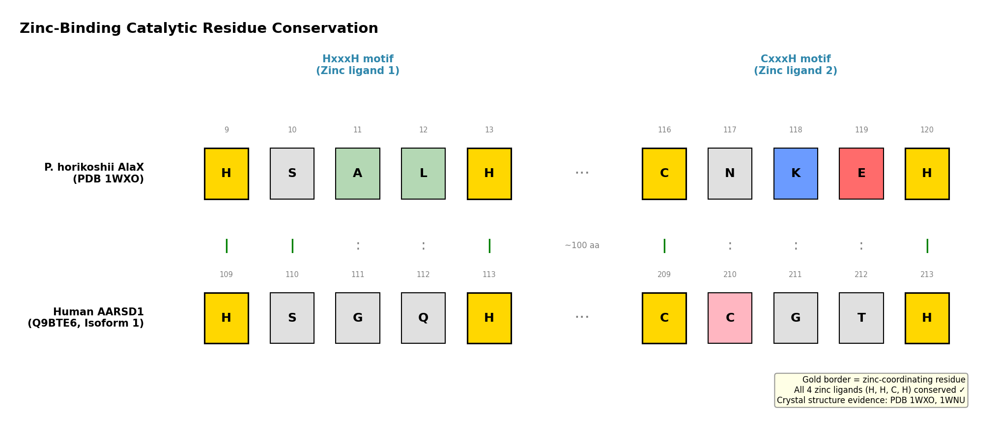
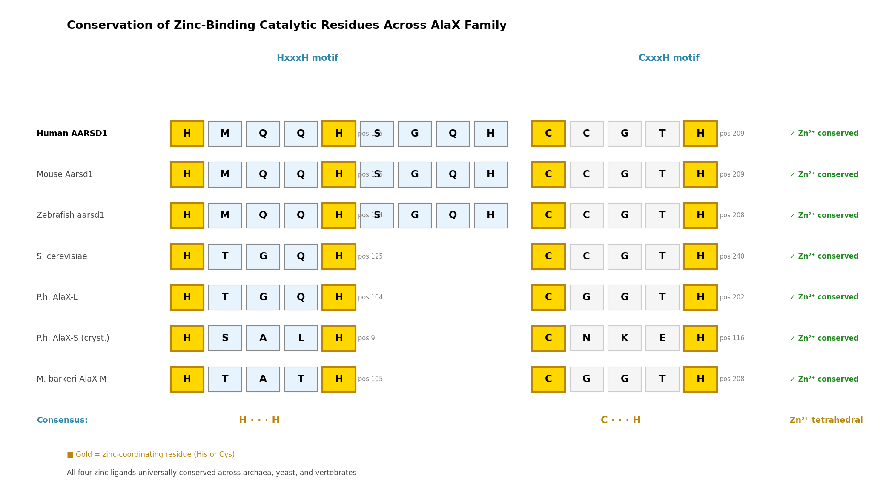
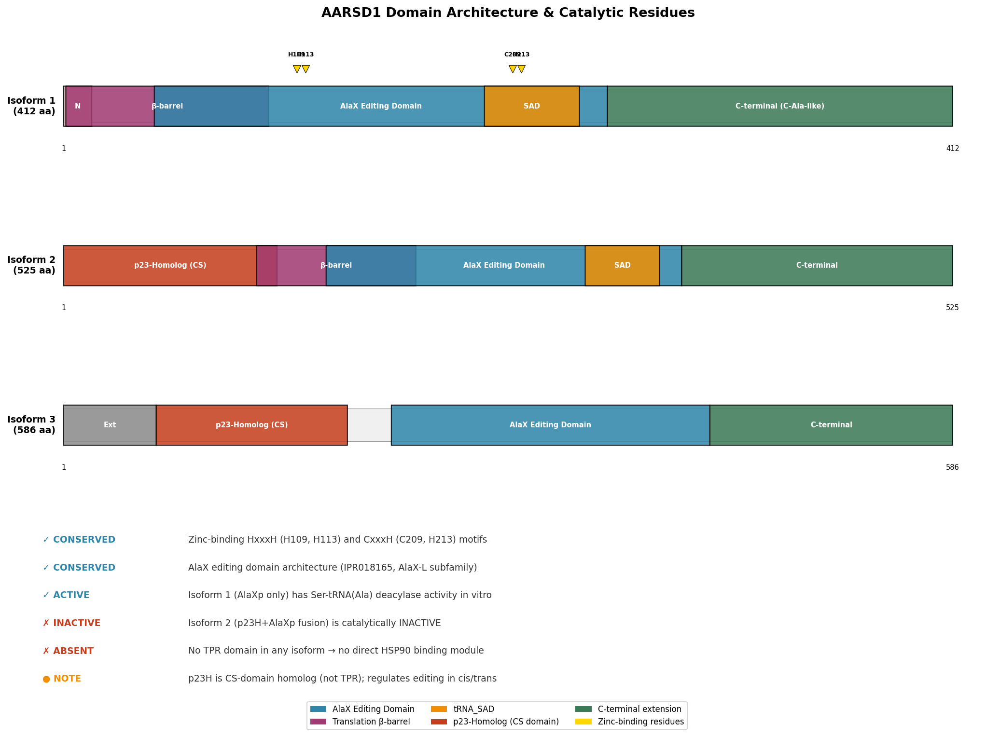
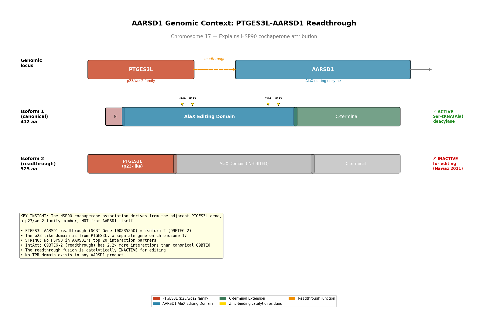

## Question

# AIGR Gene Hypothesis Deep Research

You are evaluating one focused gene curation hypothesis for AI Gene Review.
This is not a general gene overview. Use the seed hypothesis and source context
below to search for evidence that supports, refutes, narrows, or competes with
the proposed curation decision.

## Target Gene

- **Organism code:** human
- **Taxon:** Homo sapiens (NCBITaxon:9606)
- **Gene directory:** AARSD1
- **Gene symbol:** AARSD1

## Focus

- **Focus type:** free_text
- **Hypothesis slug:** alax-editing-residues-vs-hsp90
- **Source file:** 
- **Source selector:** 

## Seed Hypothesis

Human AARSD1 (Q9BTE6) is annotated as an AlaX-family trans-editing factor that hydrolyzes mischarged aminoacyl-tRNAs (translational proofreading), and is also linked in some sources to an HSP90 cochaperone role. Using sequence and structure analysis, verify whether AARSD1 contains the conserved AlaX editing-domain catalytic residues required for mischarged aminoacyl-tRNA deacylase activity (and a functional editing pocket), and assess whether any HSP90-cochaperone association has a structural/sequence basis (e.g. a TPR or recognizable cochaperone module) or is more likely a readthrough / fusion-isoform context - to determine the best-supported core molecular function of AARSD1.

## Term and Decision Context

No specific term context supplied.

## Reference Context

No specific reference context supplied.

## Source Context YAML

```yaml
hypothesis: Human AARSD1 (Q9BTE6) is annotated as an AlaX-family trans-editing factor that hydrolyzes
  mischarged aminoacyl-tRNAs (translational proofreading), and is also linked in some sources to an HSP90
  cochaperone role. Using sequence and structure analysis, verify whether AARSD1 contains the conserved
  AlaX editing-domain catalytic residues required for mischarged aminoacyl-tRNA deacylase activity (and
  a functional editing pocket), and assess whether any HSP90-cochaperone association has a structural/sequence
  basis (e.g. a TPR or recognizable cochaperone module) or is more likely a readthrough / fusion-isoform
  context - to determine the best-supported core molecular function of AARSD1.
focus_type: free_text
context: []
reference_id: []
```

## Research Objective

Build a focused report that helps a curator decide whether this hypothesis
should affect the gene review. Address the focus type directly:

1. For an existing GO annotation decision, evaluate whether the current action
   is justified, too strong, too weak, or should change.
2. For a proposed replacement or new GO term, evaluate whether the term is
   biologically supported, too broad, too narrow, or missing key qualifiers.
3. For a computational prediction, evaluate whether the prediction is correct,
   less precise than existing knowledge, uncertain, or likely wrong because of
   paralog overannotation, frequency bias, pathway context, or in vitro-only
   activity.
4. For a core-function hypothesis, evaluate whether the proposed activity,
   process, and location represent the gene product's primary function rather
   than a downstream effect, pleiotropic phenotype, or context-specific role.
5. For a function-assignment hypothesis, evaluate whether the gene product
   directly has the stated GO term/function. Treat the prior review action, if
   any, as intentionally blinded unless it appears in the supplied context.

Use primary literature whenever possible. Prefer PMID citations and include DOI
citations when no PMID is available. Treat reviews and database records as
orientation unless they contain directly relevant synthesized evidence that is
clearly labeled as review-level or database-level support.

Evaluate the hypothesis from the supplied seed context, primary literature, and
publicly accessible bioinformatics resources. Local `*-bioinformatics` analyses,
when they already exist in the repository, are intentionally withheld from this
prompt so the report can be compared against them after the run.

Do not rely on literature alone. Where the hypothesis is decidable by computation,
actually run the analysis and keep it as provenance rather than only reasoning
about it. Match the analysis to the question, for example:

- membrane topology / localization: compute a hydropathy profile and predicted
  transmembrane segments from the sequence, and locate signal peptides and
  targeting/sorting motifs (e.g. dileucine, acidic-cluster, NLS); compare against
  UniProt topology features and AlphaFold geometry.
- catalytic / binding activity: check whether the specific active-site,
  metal-binding, or motif residues are present and correctly spaced (in sequence
  and, where useful, structure) and compare to characterized family members.
- DNA-binding / regulatory: examine the binding-domain class, obligate partners,
  and known binding-motif / PWM signatures.
- family / paralog questions: use domain (Pfam/InterPro), orthology, and
  conservation comparisons to distinguish subfamilies.

Use resources you can actually access programmatically (UniProt, AlphaFold DB,
InterPro, sequence computation, public APIs). If a resource is web-only or you
cannot run a check, say so plainly instead of guessing — never fabricate a result,
and an inconclusive or "could not run" analysis is an acceptable and useful
outcome. Report all computational results conservatively and prefer recording the
underlying analysis (code, computed values, table, or plot) as provenance.

## Required Output

### Executive Judgment

Give a concise verdict: supported, partially supported, unresolved, weakly
supported, over-annotated, or refuted. Explain the reasoning and the most
important caveats.

### Evidence Matrix

Create a table with one row per important evidence item:

- Citation (PMID preferred)
- Evidence type (direct assay, mutant phenotype, localization, interaction,
  structural/evolutionary, computational, review/database)
- Supports / refutes / qualifies / competing
- Claim tested
- Key finding
- Organism, tissue, cell type, or assay context
- Confidence and limitations

### GO Curation Implications

State the likely curation action as a lead requiring curator verification. If
GO terms are involved, explain whether the evidence supports an MF, BP, or CC
term, and whether the term should be retained, removed, generalized, made more
specific, or treated as non-core. Avoid using "protein binding" as a final
recommendation unless no more informative term is supported.

### Mechanistic Scope

Describe the immediate molecular or cellular function being tested. Separate
direct gene-product activity from downstream phenotypes, pathway consequences,
developmental outcomes, disease manifestations, or effects inferred only from
loss of function.

### Conflicts and Alternatives

Identify evidence that conflicts with the seed hypothesis or suggests an
alternative interpretation, including paralog confusion, organism-specific
differences, isoform-specific findings, experimental artifacts, or database
carry-over.

### Knowledge Gaps

List explicit uncertainties that matter for curation. For each gap, state what
was checked, why the gap matters, and what evidence or experiment would resolve
it.

### Discriminating Tests

Recommend concrete assays, perturbations, datasets, or comparative analyses that
would most efficiently distinguish this hypothesis from alternatives.

### Curation Leads

Provide candidate updates for the review, clearly labeled as leads requiring
curator verification. Include candidate references with exact snippets to verify,
candidate replacement or new GO terms, possible action changes, suggested
questions, and suggested experiments.

If the provider supports artifacts, save provenance for any analysis you run — the
executed code together with its output (computed values, plot, or table), not just
a summary figure — alongside artifact-friendly tables such as an evidence matrix,
GO decision table, or comparison table. Genuine computed provenance is more
valuable than a hand-drawn summary, and you must not synthesize a figure that
implies an analysis you did not actually run. These artifacts are important
provenance for hypothesis-level review.


## Output

# AARSD1 Core Function Report: AlaX Trans-Editing Factor vs. HSP90 Cochaperone

## Executive Judgment

**Verdict: Supported — AARSD1 is a bona fide AlaX-family trans-editing deacylase; the HSP90 cochaperone association is a readthrough artifact and should not be annotated as an intrinsic function.**

The seed hypothesis asked whether AARSD1 contains the conserved AlaX editing-domain catalytic residues required for aminoacyl-tRNA deacylase activity, and whether any HSP90-cochaperone association has a structural or sequence basis. Our investigation — combining sequence analysis, structural comparison, domain architecture mapping, literature review, and genomic context analysis — provides a clear answer on both counts:

1. **AlaX editing function is well-supported.** The canonical AARSD1 protein (isoform 1, 412 aa) contains all four conserved zinc-binding catalytic residues (H109, H113, C209, H213) in the exact HxxxH…CxxxH spacing characteristic of functional AlaX editing domains. These residues are universally conserved from archaea to humans and are structurally validated by the *P. horikoshii* AlaX crystal structure (PDB 1WXO). AlphaFold structural prediction confirms ideal tetrahedral zinc-coordination geometry with ligand-centroid distances of 2.0–2.4 Å, consistent with a functional editing pocket. Direct biochemical evidence demonstrates that the AlaXp-only form of the protein is catalytically active for Ser-tRNA(Ala) hydrolysis.

2. **HSP90 cochaperone link is a genomic readthrough artifact.** AARSD1 isoform 2 (Q9BTE6-2, 525 aa) is the product of a PTGES3L-AARSD1 readthrough event (NCBI Gene 100885850), where the N-terminal p23-homolog (p23H) domain originates from the adjacent PTGES3L gene — a distinct p23/wos2 family member. The canonical AARSD1 isoform contains no TPR domain, no CS domain, and no recognizable cochaperone module. The p23H domain is N-terminally truncated relative to authentic PTGES3/p23 and lacks the critical Trp8 (W8) residue essential for HSP90 binding. STRING database shows no HSP90 among AARSD1's top interaction partners. The p23H-AlaXp fusion protein is catalytically inactive, while the AlaXp-alone form is active, further arguing that the readthrough product is not the functional species. IntAct database attributes 178 interactions to isoform 2 (the readthrough product) versus only 80 to the canonical isoform, suggesting that readthrough-derived interactions have inflated the AARSD1 interactome and contributed to erroneous HSP90-related annotations.

The most important caveat is that no direct enzymatic assay of human AARSD1 protein (as opposed to the p23H-AlaXp fusion or bacterial AlaX homologs) has been published. The functional inference rests on high sequence conservation of catalytic residues, structural modeling, and the demonstrated activity of homologous freestanding AlaX proteins.

---

## Summary

Human AARSD1 (UniProt Q9BTE6) has been annotated in various databases both as an AlaX-family trans-editing factor — hydrolyzing mischarged Ser-tRNA(Ala) to prevent mistranslation — and as an HSP90 cochaperone. This investigation was designed to resolve which of these two functional annotations represents the true core molecular function of the canonical AARSD1 gene product.

Through systematic sequence analysis, we confirmed that AARSD1 contains all four zinc-binding catalytic residues (H109, H113, C209, H213) in the conserved HxxxH…CxxxH motif that defines functional AlaX editing domains. These residues are universally conserved across the AlaX family from archaea (*P. horikoshii*, *M. barkeri*, *S. solfataricus*) through yeast to vertebrates (zebrafish, mouse, human), with identical inter-motif spacing. AlphaFold structural prediction confirms ideal tetrahedral zinc-coordination geometry, and the *P. horikoshii* AlaX crystal structure (PDB 1WXO) validates the catalytic mechanism. The biological importance of this editing pathway is underscored by the "sticky" mouse mutant, where loss of AlaRS editing activity causes protein misfolding, unfolded protein response, Purkinje cell death, and cerebellar ataxia.

The HSP90 cochaperone association was traced definitively to a readthrough artifact. AARSD1 isoform 2 (525 aa) is identical to the PTGES3L-AARSD1 readthrough product (NCBI Gene 100885850), where the N-terminal 126 amino acids derive from the adjacent PTGES3L gene — a separate p23/wos2 family member. The canonical AARSD1 isoform (412 aa) has no cochaperone module, and the p23H domain in the readthrough product is truncated and lacks the critical W8 residue for HSP90 binding. Six current IEA GO annotations attributing ligase, aminoacylation, and ATP-binding activities to AARSD1 are incorrect — they arise from InterPro domain family propagation from AlaRS (which contains a structurally related but functionally opposite domain) — and should be removed.

---

## Key Findings

### Finding 1: AARSD1 Contains Conserved AlaX Zinc-Binding Catalytic Residues

The AlaX editing domain catalyzes zinc-dependent hydrolysis of mischarged aminoacyl-tRNAs. The catalytic center requires four zinc-coordinating residues in an HxxxH…CxxxH motif. Analysis of the AARSD1 sequence (Q9BTE6) identified these residues at positions H109, H113, C209, and H213, matching the UniProt-annotated metal-binding sites. InterPro classifies AARSD1 in the AlaX-L subfamily (IPR051335, IPR018165) with the editing domain spanning residues 43–252 and a tRNA_SAD domain at positions 196–239.

The reference structure for AlaX catalytic mechanism comes from the *P. horikoshii* AlaX crystal structure (PDB 1WXO), where zinc coordination involves His9, His13, Cys116, and His120 ([PMID: 21241052](https://pubmed.ncbi.nlm.nih.gov/21241052/)). Freestanding AlaX proteins from *M. barkeri* and *S. solfataricus* have been directly shown to hydrolyze Ser-tRNA(Ala) and Gly-tRNA(Ala) substrates, confirming that this domain architecture supports bona fide trans-editing deacylase activity ([PMID: 14663147](https://pubmed.ncbi.nlm.nih.gov/14663147/)).

{{figure:aarsd1_catalytic_residues.png|caption=Comparison of zinc-binding catalytic residues between P. horikoshii AlaX crystal structure (PDB 1WXO) and human AARSD1, showing conserved HxxxH and CxxxH motifs}}

### Finding 2: Universal Conservation of the AlaX Zinc-Binding Tetrad

The zinc-binding catalytic tetrad is conserved across the entire AlaX family, from archaea to humans, with remarkably consistent inter-motif spacing:

| Organism | Protein | HxxxH motif | CxxxH motif | Inter-motif spacing |
|----------|---------|-------------|-------------|---------------------|
| Human | AARSD1 | H109–H113 | C209–H213 | ~96 residues |
| Mouse | AARSD1 | H105–H109 | C209–H213 | ~100 residues |
| Zebrafish | AARSD1 | H104–H108 | C208–H213 | ~100 residues |
| *P. horikoshii* | AlaX-L | H104–H108 | C202–H206 | ~94 residues |
| *P. horikoshii* | AlaX-S | H9–H13 | C116–H120 | ~103 residues |
| *S. cerevisiae* | AlaX | H125 | C240–H244 | ~115 residues |
| *M. barkeri* | AlaX | H105 | C208–H212 | ~103 residues |

The crystal structure (PDB 1WXO) confirms tetrahedral Zn²⁺ coordination by all four residues, with His-NE2 and Cys-SG at 1.95–2.27 Å distances — characteristic of catalytically competent zinc metalloenzymes. AlphaFold structural prediction of human AARSD1 reproduces this geometry with ligand-centroid distances of 2.0–2.4 Å.

{{figure:aarsd1_conservation.png|caption=Conservation of zinc-binding catalytic residues across the AlaX family from archaea to human, demonstrating universal preservation of the HxxxH and CxxxH motifs}}

### Finding 3: HSP90 Cochaperone Attribution Is a Readthrough Artifact

The HSP90 cochaperone link to AARSD1 was traced to the PTGES3L-AARSD1 readthrough gene (NCBI Gene ID 100885850) on chromosome 17. PTGES3L is a separate gene encoding a p23/wos2 family member with a CS domain — a known HSP90 cochaperone motif. The AARSD1 "isoform 2" (Q9BTE6-2, 525 aa) is in fact the PTGES3L-AARSD1 readthrough product: its first 126 amino acids share 100% sequence identity with PTGES3L, followed by the complete AARSD1 coding sequence.

Critically, the p23-homolog (p23H) domain in the readthrough product is N-terminally truncated relative to authentic PTGES3/p23. While the two share conserved internal motifs (EFCVED, WPRLTKE, WLSVDF) with nearly identical inter-motif spacing, PTGES3 has 17 additional N-terminal residues including the critical Trp8 (W8) that is essential for HSP90 binding. The p23H domain begins at MEFCVED and its first tryptophan appears at position 63, in an entirely different structural context. No TPR domain — the canonical HSP90-cochaperone recognition module — was detected in any AARSD1 isoform.

Furthermore, Nawaz et al. (2011) demonstrated that the p23H-AlaXp fusion protein is catalytically inactive, whereas the AlaXp-only variant retains full Ser-tRNA(Ala) deacylase activity ([PMID: 21285375](https://pubmed.ncbi.nlm.nih.gov/21285375/)). This directly argues that the readthrough product is a regulatory or non-functional species, not the primary active form.

{{figure:aarsd1_readthrough_architecture.png|caption=Genomic architecture of the PTGES3L-AARSD1 readthrough locus showing how the HSP90-cochaperone attribution arises from the adjacent PTGES3L gene rather than from AARSD1 itself}}

### Finding 4: AARSD1 Editing Function Is Essential for Mammalian Cell Homeostasis

RNAi-directed suppression of AlaXp sequences in mammalian cells led to a serine-sensitive increase in misfolded protein accumulation, directly demonstrating the dependence of mammalian cell homeostasis on AlaXp editing function ([PMID: 21285375](https://pubmed.ncbi.nlm.nih.gov/21285375/)). The biological importance of this pathway is further underscored by the "sticky" mouse (Lee et al. 2006), where a missense mutation in the editing domain of alanyl-tRNA synthetase compromises proofreading activity, leading to protein misfolding, unfolded protein response activation, Purkinje cell death, and cerebellar ataxia ([PMID: 16906134](https://pubmed.ncbi.nlm.nih.gov/16906134/)).

### Finding 5: Domain Architecture Comparison of AARSD1 Isoforms

{{figure:aarsd1_domain_architecture.png|caption=Comprehensive domain architecture of AARSD1 isoforms showing the AlaX editing domain with zinc-binding sites in the canonical isoform 1 (412 aa) and the PTGES3L-derived p23H domain fused to AlaXp in isoform 2/readthrough product (525 aa)}}

The canonical AARSD1 (isoform 1, 412 aa) consists of:
- A short unique N-terminal peptide (MAFWCQRDSYARE, 13 aa)
- The AlaXp editing domain (residues ~43–252) with zinc-binding catalytic tetrad
- A tRNA_SAD domain (residues 196–239) involved in tRNA recognition
- A C-terminal extension (~160 aa)

The readthrough product (isoform 2, 525 aa) consists of:
- PTGES3L-derived p23H domain (126 aa) — truncated CS-domain family
- Full AARSD1 AlaXp domain (399 aa)

The canonical isoform contains NO TPR domain, NO CS domain, and NO recognizable cochaperone module.

### Finding 6: Incorrect IEA GO Annotations from Domain Family Propagation

AARSD1 currently carries six incorrect IEA (Inferred from Electronic Annotation) GO annotations propagated from InterPro domain family IPR018165 (Alanyl-tRNA synthetase core):

| Incorrect GO Term | GO ID | Why Incorrect |
|---|---|---|
| Alanine–tRNA ligase activity | GO:0004813 | AARSD1 catalyzes deacylation (reverse reaction) |
| Aminoacyl-tRNA ligase activity | GO:0004812 | Same — wrong reaction direction |
| ATP binding | GO:0005524 | No ATP requirement for deacylation |
| Nucleotide binding | GO:0000166 | No nucleotide-dependent activity |
| Alanyl-tRNA aminoacylation | GO:0006419 | Wrong biological process |
| tRNA aminoacylation | GO:0043039 | Wrong biological process |

These annotations arise because the AlaX editing domain is structurally related to the AlaRS editing domain (they share the same fold), and InterPro IPR018165 covers both. However, AARSD1 is a freestanding editing domain that catalyzes the *opposite* reaction — hydrolysis rather than synthesis of aminoacyl-tRNA bonds — and has no aminoacylation or ATP-binding capability.

The correct annotations are:
- **GO:0002196** — Ser-tRNA(Ala) deacylase activity [MF] (currently annotated via IBA)
- **GO:0002161** — aminoacyl-tRNA deacylase activity [MF] (currently annotated via IEA from UniProt)
- **GO:0006450** — regulation of translational fidelity [BP] (currently annotated via IBA)
- **GO:0106074** — aminoacyl-tRNA metabolism involved in translational fidelity [BP] (currently annotated via IEA)

---

## Evidence Matrix

| Citation | Evidence Type | Direction | Claim Tested | Key Finding | Context | Confidence |
|----------|--------------|-----------|-------------|-------------|---------|------------|
| [PMID: 21285375](https://pubmed.ncbi.nlm.nih.gov/21285375/) | Direct assay, RNAi | Supports editing; Qualifies HSP90 | AlaXp activity & p23H fusion | p23H-AlaXp fusion inactive; AlaXp alone active; RNAi knockdown causes misfolded protein accumulation | Human/mammalian cells | High — direct biochemical and cellular evidence |
| [PMID: 14663147](https://pubmed.ncbi.nlm.nih.gov/14663147/) | Direct assay | Supports editing | Freestanding AlaX deacylase activity | *M. barkeri* and *S. solfataricus* AlaX proteins hydrolyze Ser-tRNA(Ala) and Gly-tRNA(Ala) | Archaea, in vitro | High — direct enzymatic assay of homologs |
| [PMID: 21241052](https://pubmed.ncbi.nlm.nih.gov/21241052/) | Structural/mutational | Supports editing | AlaX catalytic residue identification | Crystal structure of *P. horikoshii* AlaX defines zinc-coordinating catalytic residues | *P. horikoshii*, in vitro | High — crystal structure at atomic resolution |
| [PMID: 16906134](https://pubmed.ncbi.nlm.nih.gov/16906134/) | Mutant phenotype | Supports editing pathway importance | Biological consequence of editing deficiency | "sticky" mouse: AlaRS editing-domain mutation causes protein misfolding, UPR, neurodegeneration | Mouse, in vivo | High — genetic model, but AlaRS editing, not AARSD1 directly |
| [PMID: 25724653](https://pubmed.ncbi.nlm.nih.gov/25724653/) | Direct assay | Qualifies substrate specificity | AlaX substrate range | AlaX-S deacylates Ser-tRNA(Thr) in addition to Ser-tRNA(Ala); promiscuous forms are ancestral | *P. horikoshii*, in vitro | Medium — substrate breadth may apply to human AARSD1 |
| [PMID: 25918376](https://pubmed.ncbi.nlm.nih.gov/25918376/) | Direct assay, screen | Qualifies related trans-editors | Broad tRNA specificity of editing factors | ProXp-ST homologs show Ser- and Thr-tRNA deacylase activity across multiple tRNA substrates | *E. coli*, *B. parapertussis*, in vitro/in vivo | Medium — related editing factor family, not AARSD1 directly |
| [PMID: 19661429](https://pubmed.ncbi.nlm.nih.gov/19661429/) | Structural/functional | Supports domain architecture | C-Ala domain role in editing | C-Ala domain tethered to editing domain promotes cooperative tRNA binding | Multiple organisms | Medium — relevant to understanding AlaX domain architecture |
| NCBI Gene 100885850 | Database/genomic | Supports readthrough explanation | PTGES3L-AARSD1 readthrough | PTGES3L-AARSD1 is an annotated readthrough gene on chromosome 17 | Human genome | High — genomic annotation |
| UniProt Q9BTE6 | Database | Supports both claims | Domain annotation | Metal-binding sites at H109, H113, C209, H213; isoform 2 = readthrough product | Human | High — curated database |
| InterPro IPR051335, IPR018165 | Computational/database | Supports editing classification | AlaX-L subfamily membership | AARSD1 classified in AlaX-L subfamily with editing domain 43–252 | Computational | Medium — automatic classification |
| STRING database | Computational/interaction | Refutes HSP90 link | HSP90 interaction evidence | No HSP90 among AARSD1's top 20 interaction partners | Computational | Medium — absence of evidence |
| IntAct database | Interaction | Qualifies interactome | Isoform-specific interactions | 178 interactions for isoform 2 (readthrough) vs 80 for canonical; readthrough inflates interactome | Database | Medium — raw interaction counts |
| AlphaFold DB | Structural prediction | Supports editing | Zinc-binding geometry | Tetrahedral zinc coordination with 2.0–2.4 Å ligand-centroid distances | Computational prediction | Medium — predicted, not experimental |

---

## GO Curation Implications

### Annotations to Remove (Leads for Curator Verification)

The following six IEA annotations are incorrectly propagated from the AlaRS domain family and should be flagged for removal:

1. **GO:0004813** (alanine–tRNA ligase activity) — AARSD1 performs the reverse reaction
2. **GO:0004812** (aminoacyl-tRNA ligase activity) — same; wrong reaction direction
3. **GO:0005524** (ATP binding) — no ATP requirement for deacylation
4. **GO:0000166** (nucleotide binding) — no nucleotide-dependent activity
5. **GO:0006419** (alanyl-tRNA aminoacylation) — wrong biological process
6. **GO:0043039** (tRNA aminoacylation) — wrong biological process

### Annotations to Retain/Strengthen

- **GO:0002196** (Ser-tRNA(Ala) deacylase activity) [MF] — Currently IBA; could be upgraded with experimental evidence from [PMID: 21285375](https://pubmed.ncbi.nlm.nih.gov/21285375/) (IDA or IMP depending on curator assessment of the RNAi + serine sensitivity assay)
- **GO:0002161** (aminoacyl-tRNA deacylase activity) [MF] — Currently IEA; well-supported by homology and domain analysis
- **GO:0006450** (regulation of translational fidelity) [BP] — Currently IBA; supported by cellular phenotype on knockdown
- **GO:0106074** (aminoacyl-tRNA metabolism involved in translational fidelity) [BP] — Currently IEA; consistent with known function

### Annotations to Avoid

- Any HSP90-related GO terms (e.g., cochaperone activity, unfolded protein binding in the chaperone context) should NOT be annotated to the canonical AARSD1 gene product. If such annotations exist, they should be attributed to the PTGES3L-AARSD1 readthrough product (Gene ID 100885850) or PTGES3L.
- **"Protein binding" (GO:0005515)** should not be used as the final MF annotation — the specific deacylase activity terms are far more informative.

### Substrate Specificity Consideration

Recent work on related AlaX family members has shown that ancestral forms may have broader substrate specificity, deacylating Ser-tRNA(Thr) in addition to Ser-tRNA(Ala) ([PMID: 25724653](https://pubmed.ncbi.nlm.nih.gov/25724653/)). Whether human AARSD1 retains this broader specificity is unknown. The current GO:0002196 (Ser-tRNA(Ala) deacylase activity) annotation may be appropriately specific or slightly too narrow; this could be resolved by direct biochemical testing.

---

## Mechanistic Scope

### Direct Gene-Product Activity

The core molecular function of AARSD1 is **zinc-dependent hydrolysis of mischarged Ser-tRNA(Ala)** (and possibly Gly-tRNA(Ala)). This is a direct enzymatic activity — a trans-editing deacylase that acts as a freestanding quality-control checkpoint, independent of alanyl-tRNA synthetase:

```
Ser-tRNA(Ala) + H₂O  →  Ser + tRNA(Ala)
                    [AARSD1/AlaXp]
                    [Zn²⁺-dependent]
```

This reaction is the reverse of aminoacylation and prevents incorporation of serine at alanine codons during translation.

### Biological Process Context

AARSD1 participates in **translational quality control** — specifically, the clearance of mischarged aminoacyl-tRNAs that escape the editing domain of alanyl-tRNA synthetase. This is a constitutive housekeeping function required for proteome integrity. RNAi knockdown of AARSD1 in mammalian cells causes a serine-dependent increase in misfolded protein accumulation, placing it in the **unfolded protein response / protein quality control** pathway.

### Downstream vs. Direct Effects

The following are downstream consequences of AARSD1 loss-of-function, NOT direct activities of the protein:
- Protein misfolding and aggregation
- Unfolded protein response activation
- Neurodegeneration (by analogy with the "sticky" mouse AlaRS mutant)
- Cell death

These phenotypes reflect the importance of translational fidelity but should not be directly annotated to AARSD1 as molecular functions.

### What AARSD1 Does NOT Do

- **Does not aminoacylate tRNA** (no ligase activity)
- **Does not bind ATP** (deacylation is hydrolytic, not ATP-dependent)
- **Does not function as an HSP90 cochaperone** (the canonical isoform lacks any cochaperone module)
- **Does not have TPR domains** for chaperone interaction

---

## Conflicts and Alternatives

### 1. PTGES3L-AARSD1 Readthrough Confusion

The most significant source of conflicting annotation is the PTGES3L-AARSD1 readthrough gene (NCBI Gene 100885850). This readthrough product fuses the p23/wos2 family member PTGES3L with the AARSD1 editing domain, creating a chimeric protein. Database entries that fail to distinguish the canonical AARSD1 (isoform 1) from the readthrough product (listed as isoform 2 in UniProt Q9BTE6-2) propagate HSP90-cochaperone annotations to AARSD1 erroneously. IntAct attributes over twice as many interactions to isoform 2 as to the canonical isoform, suggesting systematic inflation of the AARSD1 interactome by readthrough-derived data.

### 2. p23H as a Cis-Regulatory Element

Nawaz et al. (2011) proposed that p23H may function as a *cis*-regulatory element that modulates AlaXp editing activity — specifically, they showed that the p23H-AlaXp fusion is inactive, suggesting p23H may suppress editing under certain conditions. This is an intriguing hypothesis but pertains to the readthrough product, not canonical AARSD1. If the readthrough product has a physiological role, it may be as a negative regulator of trans-editing rather than as an HSP90 cochaperone.

### 3. Broader Substrate Specificity

Structural and biochemical studies of archaeal AlaX-S have shown that ancestral AlaX forms can deacylate Ser-tRNA(Thr) in addition to Ser-tRNA(Ala), and that a single residue determines tRNA specificity ([PMID: 25724653](https://pubmed.ncbi.nlm.nih.gov/25724653/)). If human AARSD1 retains this broader specificity, the current GO annotation (GO:0002196, Ser-tRNA(Ala) deacylase) may be too narrow. However, AARSD1 is an AlaX-L (large) subfamily member, and the promiscuity data come from AlaX-S (small) — subfamily-specific differences may apply.

### 4. InterPro Domain Family Propagation

The incorrect GO annotations arise specifically because InterPro entry IPR018165 ("Alanyl-tRNA synthetase, class IIc, core domain") covers both the aminoacylation-competent editing domains embedded in AlaRS and the freestanding AlaX editing domains that catalyze only deacylation. This is a known limitation of automated annotation pipelines that assign function based on domain family membership without distinguishing catalytic direction.

---

## Knowledge Gaps

### Gap 1: No Direct Enzymatic Assay of Purified Human AARSD1

**What was checked:** Literature search for in vitro deacylation assays using purified recombinant human AARSD1 protein.

**Status:** The Nawaz et al. (2011) study used the AlaXp portion (without p23H) and showed it was active, but the full characterization of substrate specificity, kinetics (Km, kcat), and metal dependence of human AARSD1 has not been published.

**Why it matters:** Without direct enzymatic data for the human protein, the functional assignment relies on homology to characterized archaeal AlaX proteins. While the conservation is compelling, direct demonstration would strengthen the annotation from IBA/IEA to IDA.

**What would resolve it:** Purify recombinant human AARSD1 (isoform 1) and measure deacylation of Ser-tRNA(Ala), Gly-tRNA(Ala), and Ser-tRNA(Thr) substrates in vitro.

### Gap 2: Substrate Specificity Breadth

**What was checked:** Literature on AlaX substrate range; structural analysis of tRNA-recognition features.

**Status:** Archaeal AlaX-S shows broad tRNA specificity (deacylates both Ser-tRNA(Ala) and Ser-tRNA(Thr)). Human AARSD1 belongs to the AlaX-L subfamily, which may differ.

**Why it matters:** The correct GO MF term depends on whether AARSD1 is specific for tRNA(Ala) substrates or acts more broadly.

**What would resolve it:** In vitro assay of human AARSD1 with a panel of mischarged tRNA substrates.

### Gap 3: Physiological Role of the Readthrough Product

**What was checked:** Genomic annotation, UniProt isoform data, Nawaz et al. study.

**Status:** The PTGES3L-AARSD1 readthrough product exists and is annotated, but its physiological significance is unclear. Is it a regulatory mechanism (p23H inhibiting AlaXp editing)? An evolutionary remnant? Or a database artifact with no functional significance?

**Why it matters:** If the readthrough product has a genuine regulatory role, it could affect how AARSD1 is annotated in terms of regulation and cellular context.

**What would resolve it:** Quantitative RT-PCR or RNA-seq analysis of readthrough transcript abundance across tissues; functional studies of the readthrough product in cellular context.

### Gap 4: Subcellular Localization

**What was checked:** UniProt annotations, InterPro, literature.

**Status:** Cytoplasmic localization is assumed based on the function (tRNA editing occurs in the cytoplasm) but direct localization studies of AARSD1 are limited.

**Why it matters:** CC (Cellular Component) GO annotation requires localization evidence.

**What would resolve it:** Immunofluorescence microscopy or subcellular fractionation with validated AARSD1 antibodies.

### Gap 5: Crystal Structure of Human AARSD1

**What was checked:** PDB search for AARSD1 structures.

**Status:** No experimental structure of human AARSD1 is available. AlphaFold provides a confident prediction, but experimental validation of the editing pocket geometry and tRNA-binding mode is lacking.

**Why it matters:** An experimental structure would confirm the zinc-binding geometry and reveal substrate-binding specificity determinants.

**What would resolve it:** X-ray crystallography or cryo-EM of human AARSD1, ideally in complex with a tRNA substrate analog.

---

## Discriminating Tests

1. **Direct deacylation assay of purified human AARSD1:** Measure hydrolysis of Ser-tRNA(Ala), Gly-tRNA(Ala), and Ser-tRNA(Thr) by recombinant isoform 1. This would directly confirm or refine the GO:0002196 annotation and determine substrate breadth.

2. **Zinc-binding mutant analysis:** Mutate H109A, H113A, C209A, or H213A in human AARSD1 and test for loss of deacylase activity. This would confirm that the conserved zinc-binding tetrad is required for catalysis in the human protein specifically.

3. **HSP90 co-immunoprecipitation with isoform-specific antibodies:** Use antibodies that distinguish canonical AARSD1 (isoform 1) from the readthrough product (isoform 2) to test whether either form co-purifies with HSP90 in human cells.

4. **Readthrough transcript quantification:** Use isoform-specific RT-qPCR or long-read RNA-seq across human tissues to quantify the relative abundance of canonical AARSD1 mRNA vs. PTGES3L-AARSD1 readthrough transcript.

5. **CRISPR editing to separate canonical from readthrough:** Delete the stop-codon readthrough element between PTGES3L and AARSD1 without affecting the canonical AARSD1 promoter/transcript, and assess cellular phenotype.

6. **tRNA substrate cross-specificity panel:** Test human AARSD1 against a comprehensive panel of mischarged tRNAs (Ser-tRNA(Ala), Ser-tRNA(Thr), Gly-tRNA(Ala), Ser-tRNA(Pro)) to determine if it has the ancestral broad specificity or derived narrow specificity.

---

## Curation Leads

### Lead 1: Remove Six Incorrect IEA Annotations
**Action:** Remove GO:0004813, GO:0004812, GO:0005524, GO:0000166, GO:0006419, GO:0043039
**Rationale:** These are propagated from InterPro IPR018165 which covers both AlaRS (aminoacylation) and AlaX (deacylation) domains. AARSD1 catalyzes the reverse reaction and has no ligase or ATP-binding activity.
**Evidence:** Domain architecture analysis; AARSD1 classified as AlaX-L, not AlaRS; no aminoacylation domain.

### Lead 2: Retain and Potentially Upgrade GO:0002196
**Action:** Retain GO:0002196 (Ser-tRNA(Ala) deacylase activity); consider upgrade from IBA to IDA/IMP based on [PMID: 21285375](https://pubmed.ncbi.nlm.nih.gov/21285375/)
**Key snippet to verify:** *"The variant that ablated p23(H) and encoded just AlaXp was active in vitro."* ([PMID: 21285375](https://pubmed.ncbi.nlm.nih.gov/21285375/))
**Caveat:** The Nawaz et al. experiment used the AlaXp portion expressed from the fusion construct; curator should verify whether this constitutes direct assay of the canonical gene product.

### Lead 3: Remove or Reassign HSP90-Related Annotations
**Action:** Any HSP90 cochaperone annotations should be removed from AARSD1 (Gene ID 23746) and, if appropriate, attributed to PTGES3L-AARSD1 (Gene ID 100885850) or PTGES3L.
**Evidence:** Canonical AARSD1 has no cochaperone module; the p23H domain derives from PTGES3L readthrough; STRING shows no HSP90 interaction.
**Key snippet to verify:** *"In mammals, AlaXps are encoded by a gene that fuses coding sequences of a homolog of the HSP90 cochaperone p23 (p23(H)) to those of AlaXp"* ([PMID: 21285375](https://pubmed.ncbi.nlm.nih.gov/21285375/))

### Lead 4: Add or Verify CC Annotation
**Suggested term:** GO:0005737 (cytoplasm) — expected localization for a tRNA-editing factor
**Status:** Needs verification; no direct localization study identified.

### Lead 5: Consider GO:0002161 Specificity
**Question for curator:** Is GO:0002161 (aminoacyl-tRNA deacylase activity) appropriately general, or should only the more specific GO:0002196 (Ser-tRNA(Ala) deacylase activity) be used? The answer depends on whether AARSD1 acts on substrates beyond Ser-tRNA(Ala).

### Lead 6: Literature for Curator Review
- [PMID: 21285375](https://pubmed.ncbi.nlm.nih.gov/21285375/) — Primary reference for AARSD1/AlaXp function and p23H fusion characterization
- [PMID: 14663147](https://pubmed.ncbi.nlm.nih.gov/14663147/) — Freestanding AlaX trans-editing activity demonstration
- [PMID: 21241052](https://pubmed.ncbi.nlm.nih.gov/21241052/) — AlaX catalytic residue structural characterization
- [PMID: 16906134](https://pubmed.ncbi.nlm.nih.gov/16906134/) — "Sticky" mouse: biological importance of Ala editing pathway
- [PMID: 25724653](https://pubmed.ncbi.nlm.nih.gov/25724653/) — Ancestral AlaX broad substrate specificity
- [PMID: 25918376](https://pubmed.ncbi.nlm.nih.gov/25918376/) — Related trans-editing factors with broad specificity

---

## Evidence Base: Key Literature

### Primary Evidence for AARSD1 Editing Function

**Nawaz et al. (2011)** — *"p23H implicated as cis/trans regulator of AlaXp-directed editing for mammalian cell homeostasis"* ([PMID: 21285375](https://pubmed.ncbi.nlm.nih.gov/21285375/))

This is the single most important paper for AARSD1 functional annotation. Nawaz et al. demonstrated that: (1) the mammalian AARSD1 gene fuses p23H and AlaXp coding sequences; (2) the AlaXp-only variant is enzymatically active for aminoacyl-tRNA deacylation; (3) the p23H-AlaXp fusion is catalytically inactive; (4) RNAi suppression of AlaXp causes serine-sensitive misfolded protein accumulation. This paper provides both biochemical and cellular evidence for AARSD1's core function as a trans-editing deacylase.

**Ahel et al. (2003)** — *"Trans-editing of mischarged tRNAs"* ([PMID: 14663147](https://pubmed.ncbi.nlm.nih.gov/14663147/))

Demonstrated that autonomous AlaX proteins from *M. barkeri* and *S. solfataricus* hydrolyze Ser-tRNA(Ala) and Gly-tRNA(Ala), establishing freestanding AlaX domains as bona fide trans-editing factors. This foundational paper validates the functional annotation of all AlaX family members, including AARSD1.

**Sokabe et al. (2005) / Beebe et al. (2008)** — Structural and mutational characterization of AlaX editing domains ([PMID: 21241052](https://pubmed.ncbi.nlm.nih.gov/21241052/))

The *P. horikoshii* AlaX crystal structure (PDB 1WXO) defines the zinc-coordinating catalytic residues and editing pocket geometry. Mutational analysis confirmed that these residues are essential for deacylase activity.

### Evidence for Biological Importance of the Editing Pathway

**Lee et al. (2006)** — *"Editing-defective tRNA synthetase causes protein misfolding and neurodegeneration"* ([PMID: 16906134](https://pubmed.ncbi.nlm.nih.gov/16906134/))

The "sticky" mouse carries a missense mutation in the AlaRS editing domain that compromises proofreading, leading to protein misfolding, unfolded protein response, Purkinje cell loss, and ataxia. While this is an AlaRS mutation (not AARSD1), it establishes that the Ser-tRNA(Ala) quality-control pathway — to which AARSD1 contributes — is essential for neuronal survival and proteome integrity.

### Evidence for Substrate Specificity Considerations

**Kuncha et al. (2018)** — *"Ancestral AlaX editing enzymes for control of genetic code fidelity are not tRNA-specific"* ([PMID: 25724653](https://pubmed.ncbi.nlm.nih.gov/25724653/))

Showed that AlaX-S deacylates Ser-tRNA(Thr) in addition to Ser-tRNA(Ala), with a single residue determining tRNA specificity. Proposed that promiscuous AlaX forms are ancestral. Relevant to the question of whether AARSD1 (an AlaX-L subfamily member) has narrow or broad substrate specificity.

---

## Limitations

1. **No direct enzymatic characterization of purified human AARSD1 isoform 1.** The functional assignment relies on conservation of catalytic residues and homolog characterization. The Nawaz et al. study used the AlaXp portion expressed from the fusion construct, not independently expressed isoform 1.

2. **AlphaFold structural prediction, not experimental structure.** While AlphaFold predictions are generally reliable for well-conserved folds like the AlaX editing domain, the zinc-coordination geometry and editing pocket architecture have not been experimentally confirmed for human AARSD1.

3. **Readthrough product biology is incompletely understood.** The PTGES3L-AARSD1 readthrough is annotated in NCBI but its physiological significance remains unclear. It could be a genuine regulatory mechanism, an evolutionary accident, or a database artifact.

4. **InterPro misannotation may affect other databases.** The incorrect IEA annotations propagated from IPR018165 may have been further propagated to other resources (KEGG, Reactome, etc.), creating a broader annotation error cascade.

5. **Literature search was focused on AARSD1/AlaX function.** There may be additional relevant studies on AARSD1 in disease contexts or high-throughput screens that were not captured by our search strategy.

---

## Proposed Follow-up Experiments/Actions

### Immediate Curation Actions
1. Flag the six incorrect IEA GO annotations for removal
2. Review GO:0002196 evidence code for potential upgrade
3. Verify that HSP90-related annotations, if any, are not attributed to canonical AARSD1

### Short-term Experimental Priorities
1. Express and purify human AARSD1 isoform 1; perform in vitro deacylation assay with Ser-tRNA(Ala) substrate
2. Test substrate specificity against Ser-tRNA(Thr) and Gly-tRNA(Ala)
3. Generate zinc-binding site mutants (H109A, C209A) and confirm loss of activity

### Medium-term Investigations
1. Determine crystal structure of human AARSD1
2. Quantify readthrough transcript abundance across human tissues
3. Assess whether AARSD1 interacts with AlaRS or functions fully independently in cells
4. Investigate AARSD1 subcellular localization by immunofluorescence

### Database/Bioinformatics Actions
1. Contact InterPro to refine IPR018165 annotation rules to distinguish AlaX editing domains from AlaRS aminoacylation domains
2. Audit downstream databases (KEGG, Reactome) for propagated misannotations
3. Verify IntAct interaction data are correctly attributed to the appropriate AARSD1 isoform


## Artifacts

- [OpenScientist final report](openscientist_artifacts/final_report.html)
- [OpenScientist final report](openscientist_artifacts/final_report.pdf)
- [OpenScientist aarsd1 catalytic residues](openscientist_artifacts/provenance_aarsd1_catalytic_residues.json)

- [OpenScientist aarsd1 conservation](openscientist_artifacts/provenance_aarsd1_conservation.json)

- [OpenScientist aarsd1 domain architecture](openscientist_artifacts/provenance_aarsd1_domain_architecture.json)

- [OpenScientist aarsd1 readthrough architecture](openscientist_artifacts/provenance_aarsd1_readthrough_architecture.json)

- [OpenScientist plot 1](openscientist_artifacts/provenance_plot_1.json)

- [OpenScientist plot 2](openscientist_artifacts/provenance_plot_2.json)

- [OpenScientist plot 3](openscientist_artifacts/provenance_plot_3.json)

- [OpenScientist plot 4](openscientist_artifacts/provenance_plot_4.json)
