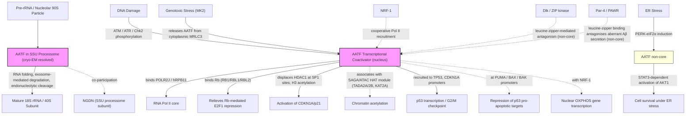

# Pathway Summary for AATF

## Overview
AATF (Apoptosis-Antagonizing Transcription Factor, also known as Che-1) is a nuclear/nucleolar protein with two distinct conserved core functions: (1) a structural component of the 4.5-MDa nucleolar small-subunit (SSU) processome that mediates early maturation of the small ribosomal subunit [PMID:34516797], and (2) an RNA polymerase II transcriptional coactivator that binds the Pol II subunit POLR2J and cooperates with sequence-specific transcription factors (SP1, Rb/E2F, p53, NRF-1) to drive target-gene expression [PMID:10783144, PMID:12847090, PMID:17157788]. The same protein is also redeployed in stress-context outputs — notably ER-stress / PERK-eIF2α-induced antiapoptotic transcription of AKT1 via STAT3 in pancreatic β-cells [PMID:19911006], MK2-dependent release from cytoplasmic MRLC3 followed by nuclear repression of p53 pro-apoptotic targets (PUMA, BAX, BAK) [PMID:22909821], and leucine-zipper-mediated antagonism of Dlk/ZIP-kinase and Par-4/PAWR pro-apoptotic activities [PMID:10580117, PMID:14627703]. These stress roles depend on the same transcription-coactivator and chromatin-modulating activities that define core function 2, applied at different promoters.

## Core Pathways

### SSU Processome / 40S Ribosomal Subunit Biogenesis
AATF is a bona fide structural component of the human SSU processome, directly resolved at 2.7–3.9 Å resolution in cryo-EM particles of the maturing 90S pre-ribosome [PMID:34516797]. Within this 4.5-MDa nucleolar ribonucleoprotein assembly, AATF binds pre-rRNA and contributes to the coordinated RNA folding, modification, rearrangement, exosome-mediated degradation, and site-specific endonucleolytic cleavage steps that generate mature 18S rRNA [PMID:34516797]. AATF associates with the SSU processome subunit NGDN — an interaction independently reproduced across four high-throughput interactome studies [PMID:25416956, PMID:30021884, PMID:33961781, PMID:35271311] — consistent with their co-participation in the processome. RNA-binding activity of AATF is corroborated by two independent mRNA-interactome capture studies (HeLa, HEK293) [PMID:22658674, PMID:22681889].

### RNA Polymerase II Transcriptional Coactivator
AATF/Che-1 was originally identified as a binding partner of the Pol II core subunit hRPB11 / POLR2J, and it co-purifies with Rb to repress Rb-mediated inhibition of E2F1 transactivation [PMID:10783144]. AATF activates the CDKN1A/p21 promoter by displacing HDAC1 from SP1 binding sites, leading to histone H3 acetylation and growth arrest [PMID:12847090]. After DNA damage, ATM/ATR- and Chk2-dependent phosphorylation recruits Che-1 to TP53 and CDKN1A promoters and sustains basal p53 expression that is preserved through the damage response [PMID:17157788]; AATF also contributes to maintenance of the G2/M checkpoint [PMID:17157788]. AATF associates with SAGA/ATAC HAT-module subunits (TADA2A, TADA2B, KAT2A/GCN5) in nucleoplasm and nucleolus, providing a chromatin-modifying link to the coactivator function [PMID:29232376]. AATF also cooperates with NRF-1 to drive nuclear-encoded OXPHOS gene transcription via Pol II recruitment [file:human/AATF/AATF-deep-research-falcon.md].

## Pathway Diagram

## Molecular Architecture
- **N-terminal acidic domain and putative leucine zipper** characteristic of transcription factors; the leucine zipper mediates direct, selective interactions with Dlk/ZIP kinase and Par-4/PAWR [PMID:10580117, PMID:14627703]
- **Two C-terminal nuclear localization signals** drive nuclear/nucleolar accumulation; phosphorylation events regulate nucleocytoplasmic distribution [PMID:22909821]
- **RNA-binding activity** captured in two independent mRNA-interactome studies and consistent with structural placement of AATF within the SSU processome [PMID:22658674, PMID:22681889, PMID:34516797]
- **Phosphorylation sites for ATM/ATR, Chk2, and MK2** allow the DNA damage and stress kinases to license recruitment of AATF to specific promoter sets [PMID:17157788, PMID:22909821]

## Upstream Inputs
- **Pre-rRNA and the 90S nucleolar pre-ribosome** — substrate context for the SSU processome core function [PMID:34516797]
- **POLR2J / hRPB11 (Pol II core)** — direct binding partner that defines AATF as a Pol II coactivator [PMID:10783144]
- **Rb family members (RB1, RBL1, RBL2)** — physical partners whose AATF binding relieves Rb-mediated E2F1 repression [PMID:10783144, PMID:12450794]
- **SP1 at the CDKN1A/p21 promoter** — sequence-specific tethering site at which AATF displaces HDAC1 [PMID:12847090]
- **ATM/ATR and Chk2 (DNA damage kinases)** — phosphorylate and stabilize Che-1 for recruitment to TP53/CDKN1A promoters after DNA damage [PMID:17157788]
- **MK2 (p38-MK2 axis, genotoxic stress)** — phosphorylates cytoplasmic AATF, releasing it from MRLC3 for nuclear translocation [PMID:22909821]
- **PERK-eIF2α (ER stress)** — induces AATF expression to enable the non-core antiapoptotic UPR output [PMID:19911006]
- **NRF-1** — sequence-specific transcription factor with which AATF cooperates to drive OXPHOS gene transcription [file:human/AATF/AATF-deep-research-falcon.md]

## Downstream Effects
- **40S small ribosomal subunit production** through SSU processome-mediated maturation of 18S rRNA, sustaining cytosolic translation capacity [PMID:34516797]
- **Activation of CDKN1A/p21 transcription** with downstream cell-cycle arrest in colon carcinoma cells, via HDAC1 displacement at SP1 sites [PMID:12847090]
- **Relief of Rb-mediated repression of E2F1 transactivation**, modulating E2F-target gene programs [PMID:10783144]
- **p53-dependent transcriptional programs after DNA damage**, including activation of TP53 and CDKN1A promoters, and maintenance of the G2/M checkpoint [PMID:17157788]
- **Context-dependent repression of p53 pro-apoptotic targets (PUMA, BAX, BAK)** in the genotoxic-stress response, shifting p53 output from apoptosis toward cell-cycle arrest [PMID:22909821]
- **AKT1 transcriptional activation via STAT3** in the ER-stress / PERK-eIF2α antiapoptotic UPR arm (non-core but well-supported in β-cell biology) [PMID:19911006]
- **Antagonism of Dlk/ZIP-kinase- and Par-4/PAWR-driven apoptosis** via leucine-zipper-mediated direct binding to those partners [PMID:10580117, PMID:14627703]

## Non-Core Contexts
- **ER stress / PERK-eIF2α antiapoptotic UPR axis**: AATF is induced by ER stress through PERK-eIF2α, then transcriptionally activates AKT1 via STAT3 in pancreatic β-cells; an AATF–WFS1 positive-feedback loop sustains this antiapoptotic response. This is mechanistically a deployment of the core transcription coactivator activity at the AKT1 promoter rather than a separate molecular function [PMID:19911006].
- **p38-MK2-AATF p53 attenuation module**: After genotoxic stress, MK2 phosphorylates AATF, releasing it from cytoplasmic MRLC3 sequestration; nuclear AATF then represses PUMA/BAX/BAK promoters, attenuating p53-driven apoptosis. Phospho-mimicking AATF confers adriamycin resistance in xenografts, and AATF depletion sensitizes tumors to genotoxic chemotherapy [PMID:22909821].
- **Neural Par-4/PAWR interaction and Aβ protection**: In cortical neurons and PC12 cells, AATF binds Par-4 via the leucine zipper and blocks aberrant Aβ-42 secretion; AATF also suppresses Aβ-induced ROS and lipid peroxidation, acting as a neuroprotective antagonist of Par-4 [PMID:14627703, PMID:15207272].
- **Dlk / ZIP-kinase antagonism**: AATF was originally identified as an interaction partner of Dlk/ZIP-kinase and interferes with Dlk-induced apoptosis, the basis for its name [PMID:10580117].
- **High-throughput interactome rows** (NGDN, MNS1, APP, PIK3R1, RAC1) accumulate generic `protein binding` annotations on AATF. The NGDN interaction (four independent screens) is biologically meaningful as a co-processome partner; the others largely reflect screen-context associations and are correctly held as non-core in the merged review [PMID:25416956, PMID:30021884, PMID:32296183, PMID:32814053, PMID:33961781, PMID:35271311].

## Functional Integration
AATF integrates two core layers of nuclear function:
1. **Nucleolar ribosome biogenesis**, as a structural / RNA-binding component of the SSU processome that helps generate the 40S subunit [PMID:34516797]
2. **Nucleoplasmic Pol II coactivation**, as a POLR2J-binding adaptor that cooperates with SP1, Rb/E2F, p53, NRF-1, and SAGA/ATAC HAT subunits to set context-dependent transcriptional output [PMID:10783144, PMID:12847090, PMID:17157788, PMID:29232376]

These two layers are mechanistically distinct (one is a structural pre-rRNA-processing role, the other is promoter-tethered transcriptional regulation) but share AATF's RNA- and protein-binding modules and its nuclear/nucleolar localization. The stress-context roles (ER-stress / PERK-AKT1, MK2-licensed p53 attenuation, Par-4/Dlk anti-apoptotic antagonism) are deployments of the core transcription-coactivator function (or, for Par-4/Dlk, of the leucine-zipper interface), not independent molecular pathways. This framing is consistent with the merged AATF review, which keeps the SSU processome and transcription-coactivator activities as the two core functions and tags the UPR and apoptosis-antagonism annotations as KEEP_AS_NON_CORE.
