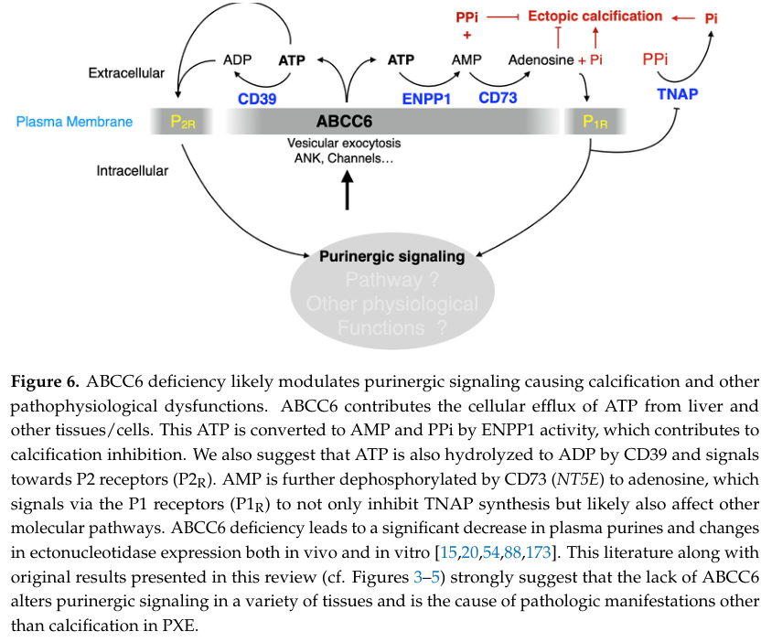

## Question

# Gene Research for Functional Annotation

## ⚠️ CRITICAL: Gene/Protein Identification Context

**BEFORE YOU BEGIN RESEARCH:** You MUST verify you are researching the CORRECT gene/protein. Gene symbols can be ambiguous, especially for less well-characterized genes from non-model organisms.

### Target Gene/Protein Identity (from UniProt):
- **UniProt Accession:** O95255
- **Protein Description:** RecName: Full=ATP-binding cassette sub-family C member 6; EC=7.6.2.- {ECO:0000250|UniProtKB:O88269}; EC=7.6.2.3 {ECO:0000269|PubMed:11880368, ECO:0000269|PubMed:12414644}; AltName: Full=Anthracycline resistance-associated protein; AltName: Full=Multi-specific organic anion transporter E; Short=MOAT-E; AltName: Full=Multidrug resistance-associated protein 6;
- **Gene Information:** Name=ABCC6; Synonyms=ARA, MRP6;
- **Organism (full):** Homo sapiens (Human).
- **Protein Family:** Belongs to the ABC transporter superfamily. ABCC family.
- **Key Domains:** AAA+_ATPase. (IPR003593); ABC1_TM_dom. (IPR011527); ABC1_TM_sf. (IPR036640); ABC_transporter-like_ATP-bd. (IPR003439); ABC_transporter-like_CS. (IPR017871)

### MANDATORY VERIFICATION STEPS:

1. **Check if the gene symbol "ABCC6" matches the protein description above**
2. **Verify the organism is correct:** Homo sapiens (Human).
3. **Check if protein family/domains align with what you find in literature**
4. **If you find literature for a DIFFERENT gene with the same or similar symbol, STOP**

### If Gene Symbol is Ambiguous or You Cannot Find Relevant Literature:

**DO NOT PROCEED WITH RESEARCH ON A DIFFERENT GENE.** Instead:
- State clearly: "The gene symbol 'ABCC6' is ambiguous or literature is limited for this specific protein"
- Explain what you found (e.g., "Found extensive literature on a different gene with the same symbol in a different organism")
- Describe the protein based ONLY on the UniProt information provided above
- Suggest that the protein function can be inferred from domain/family information

### Research Target:

Please provide a comprehensive research report on the gene **ABCC6** (gene ID: ABCC6, UniProt: O95255) in human.

The research report should be a detailed narrative explaining the function, biological processes, and localization of the gene product. Citations should be given for all claims.

You should prioritize authoritative reviews and primary scientific literature when conducting research. You can supplement
this with annotations you find in gene/protein databases, but these can be outdated or inaccurate.

We are specifically interested in the primary function of the gene - for enzymes, what reaction is catalyzed, and what is the substrate specificity? For transporters, what is the substrate? For structural proteins or adapters, what is the broader structural role? For signaling molecules, what is the role in the pathway.

We are interested in where in or outside the cell the gene product carries out its function.

We are also interested in the signaling or biochemical pathways in which the gene functions. We are less interested in broad pleiotropic effects, except where these elucidate the precise role.

Include evidence where possible. We are interested in both experimental evidence as well as inference from structure, evolution, or bioinformatic analysis. Precise studies should be prioritized over high-throughput, where available.

## Output

Question: You are an expert researcher providing comprehensive, well-cited information.

Provide detailed information focusing on:
1. Key concepts and definitions with current understanding
2. Recent developments and latest research (prioritize 2023-2024 sources)
3. Current applications and real-world implementations
4. Expert opinions and analysis from authoritative sources
5. Relevant statistics and data from recent studies

Format as a comprehensive research report with proper citations. Include URLs and publication dates where available.
Always prioritize recent, authoritative sources and provide specific citations for all major claims.

# Gene Research for Functional Annotation

## ⚠️ CRITICAL: Gene/Protein Identification Context

**BEFORE YOU BEGIN RESEARCH:** You MUST verify you are researching the CORRECT gene/protein. Gene symbols can be ambiguous, especially for less well-characterized genes from non-model organisms.

### Target Gene/Protein Identity (from UniProt):
- **UniProt Accession:** O95255
- **Protein Description:** RecName: Full=ATP-binding cassette sub-family C member 6; EC=7.6.2.- {ECO:0000250|UniProtKB:O88269}; EC=7.6.2.3 {ECO:0000269|PubMed:11880368, ECO:0000269|PubMed:12414644}; AltName: Full=Anthracycline resistance-associated protein; AltName: Full=Multi-specific organic anion transporter E; Short=MOAT-E; AltName: Full=Multidrug resistance-associated protein 6;
- **Gene Information:** Name=ABCC6; Synonyms=ARA, MRP6;
- **Organism (full):** Homo sapiens (Human).
- **Protein Family:** Belongs to the ABC transporter superfamily. ABCC family.
- **Key Domains:** AAA+_ATPase. (IPR003593); ABC1_TM_dom. (IPR011527); ABC1_TM_sf. (IPR036640); ABC_transporter-like_ATP-bd. (IPR003439); ABC_transporter-like_CS. (IPR017871)

### MANDATORY VERIFICATION STEPS:

1. **Check if the gene symbol "ABCC6" matches the protein description above**
2. **Verify the organism is correct:** Homo sapiens (Human).
3. **Check if protein family/domains align with what you find in literature**
4. **If you find literature for a DIFFERENT gene with the same or similar symbol, STOP**

### If Gene Symbol is Ambiguous or You Cannot Find Relevant Literature:

**DO NOT PROCEED WITH RESEARCH ON A DIFFERENT GENE.** Instead:
- State clearly: "The gene symbol 'ABCC6' is ambiguous or literature is limited for this specific protein"
- Explain what you found (e.g., "Found extensive literature on a different gene with the same symbol in a different organism")
- Describe the protein based ONLY on the UniProt information provided above
- Suggest that the protein function can be inferred from domain/family information

### Research Target:

Please provide a comprehensive research report on the gene **ABCC6** (gene ID: ABCC6, UniProt: O95255) in human.

The research report should be a detailed narrative explaining the function, biological processes, and localization of the gene product. Citations should be given for all claims.

You should prioritize authoritative reviews and primary scientific literature when conducting research. You can supplement
this with annotations you find in gene/protein databases, but these can be outdated or inaccurate.

We are specifically interested in the primary function of the gene - for enzymes, what reaction is catalyzed, and what is the substrate specificity? For transporters, what is the substrate? For structural proteins or adapters, what is the broader structural role? For signaling molecules, what is the role in the pathway.

We are interested in where in or outside the cell the gene product carries out its function.

We are also interested in the signaling or biochemical pathways in which the gene functions. We are less interested in broad pleiotropic effects, except where these elucidate the precise role.

Include evidence where possible. We are interested in both experimental evidence as well as inference from structure, evolution, or bioinformatic analysis. Precise studies should be prioritized over high-throughput, where available.

# Human ABCC6 (UniProt O95255): Functional Annotation Research Report

## Executive conclusion

The requested target is unambiguous: **human ABCC6**, UniProt **O95255**, also called **MRP6**, MOAT-E, or anthracycline resistance-associated protein. It is a full-length ATP-binding cassette subfamily-C exporter, not the similarly named mitochondrial/lysosomal transporter ABCB6. Its experimentally best-supported physiological role is to **facilitate ATP efflux from hepatocytes into the extracellular/systemic compartment**, thereby supplying substrate for extracellular inorganic pyrophosphate (PPi) production. However, direct passage of ATP through ABCC6 has not been demonstrated; the endogenous molecule physically transported by ABCC6 remains unresolved.

ABCC6 therefore functions primarily as an upstream regulator of the **ABCC6–ENPP1–CD73–TNAP extracellular nucleotide/PPi pathway**. Loss of this activity lowers circulating PPi and perturbs purinergic signaling, weakening systemic inhibition of calcium-phosphate crystal growth. This mechanistically explains why a protein expressed mainly in liver and kidney causes mineralization at distant sites in skin, arteries, and Bruch’s membrane.

## 1. Mandatory identity verification

### 1.1 Gene, protein, and organism

The symbol **ABCC6** matches ATP-binding cassette subfamily C member 6 in *Homo sapiens*. The literature consistently identifies the same 1,503-amino-acid protein as ABCC6/MRP6 and reports predominant expression in human liver and kidney. No evidence of symbol ambiguity was encountered. The target therefore agrees with UniProt O95255 and the supplied aliases, organism, and description. (bisaccia2021structuralandfunctional pages 1-3, verschuere2020frommembraneto pages 1-5)

### 1.2 Family and domain agreement

ABCC6 is a full ABCC-family ABC exporter of approximately 170 kDa after glycosylation. Its architecture comprises an N-terminal accessory **TMD0**, an intracellular **L0** region, two canonical transmembrane domains (**TMD1/TMD2**), and two cytosolic nucleotide-binding domains (**NBD1/NBD2**). The NBDs contain the expected Walker A/B, ABC signature/LSGGQ, Q-loop, and H-loop features. This agrees with the supplied AAA+-ATPase/ABC-transporter ATP-binding and transmembrane-domain annotations. (verschuere2020frommembraneto pages 5-8, bisaccia2021structuralandfunctional pages 1-3)

| Annotation aspect | Best-supported conclusion | Evidence type and strength | Key caveat |
|---|---|---|---|
| Identity and aliases | Human **ABCC6**, UniProt **O95255**, is ATP-binding cassette subfamily C member 6, also known as **MRP6**, MOAT-E, and anthracycline resistance-associated protein. | Curated identity and independent literature concordance. **High confidence.** (bisaccia2021structuralandfunctional pages 1-3, verschuere2020frommembraneto pages 1-5) | Evidence from mouse *Abcc6* or heterologous systems must be distinguished from direct human in-vivo evidence. |
| Family and topology | A 1,503-amino-acid, approximately 170-kDa glycoprotein with auxiliary **TMD0-L0**, canonical **TMD1 and TMD2**, and cytosolic **NBD1 and NBD2** containing conserved ABC ATPase motifs. | Sequence analysis, biochemical characterization, and homology modeling. **High confidence for architecture; moderate for detailed conformational mechanism.** (verschuere2020frommembraneto pages 5-8, bisaccia2021structuralandfunctional pages 1-3) | No experimentally determined high-resolution human ABCC6 structure was identified; detailed structural models rely substantially on homologous ABC exporters. |
| Tissue localization | Expression is strongly enriched in **liver hepatocytes**, with lower expression in **renal proximal tubules** and little expression in many peripheral tissues that calcify. | Human and animal expression and histological studies. **High confidence.** (favre2017theabcc6transporter pages 5-7, bisaccia2021structuralandfunctional pages 1-3, verschuere2020frommembraneto pages 1-5) | Low extrahepatic expression may still contribute to local pyrophosphate or purinergic homeostasis. |
| Subcellular localization | Functional ABCC6 is primarily located at the **basolateral plasma membrane** of hepatocytes and proximal-tubule epithelial cells, supporting efflux toward blood or interstitium. | Polarized-cell, liver-localization, and membrane-targeting experiments. **High confidence.** (verschuere2020frommembraneto pages 5-8, bisaccia2021structuralandfunctional pages 1-3, verschuere2020frommembraneto pages 26-29) | Some pathogenic variants retain transport activity in vitro but are trapped intracellularly by folding or trafficking defects. |
| Energy mechanism | Cytosolic nucleotide-binding domains bind MgATP and hydrolyze ATP to power conformational changes and substrate export; the two domains may be functionally asymmetric. | Direct ATP-binding, hydrolysis, and transport assays plus inference from related ABC exporters. **High confidence for ATP dependence; moderate for ABCC6-specific details.** (verschuere2020frommembraneto pages 5-8, vittorio2022theroleof pages 22-26) | ATP hydrolysis as an energy source is distinct from extracellular ATP used to generate pyrophosphate. |
| In-vitro transported organic anions | Vesicle and heterologous assays demonstrate transport of **leukotriene C4**, **N-ethylmaleimide-glutathione**, other glutathione conjugates, and **BQ-123**; disease variants can abolish this activity. | Direct biochemical transport assays. **High confidence for assay substrates; low-to-moderate physiological relevance.** (favre2017theabcc6transporter pages 5-7, verschuere2020frommembraneto pages 5-8, vittorio2022theroleof pages 22-26, kauffenstein2024thepurinergicnature pages 7-8) | These results do not establish any tested compound as the principal endogenous substrate. |
| Physiological substrate | The endogenous molecule directly translocated by ABCC6 remains **unresolved**; vitamin K and adenosine are not supported as major substrates. | Negative transport or supplementation evidence and expert reviews. **High confidence that substrate assignment remains open.** (favre2017theabcc6transporter pages 5-7, verschuere2020frommembraneto pages 21-24, kauffenstein2024thepurinergicnature pages 7-8) | ABCC6 should not be annotated categorically as a direct ATP or pyrophosphate transporter. |
| ATP efflux | ABCC6 function **facilitates cellular ATP efflux**, particularly from hepatocytes; inhibition, knockdown, or deficiency reduces extracellular or plasma ATP. | Cell models, knockout animals, hepatic experiments, and convergent expert synthesis. **Strong pathway-level evidence.** (bisaccia2021structuralandfunctional pages 7-9, kauffenstein2024thepurinergicnature pages 1-2, kauffenstein2024thepurinergicnature pages 20-23, kauffenstein2024thepurinergicnature pages 10-11) | **Direct ATP passage through ABCC6 remains unproven**; ABCC6 may export another molecule or regulate a separate ATP-release mechanism. |
| ENPP1-CD73-TNAP pathway | Extracellular ATP is converted by **ENPP1** to AMP and pyrophosphate. Pyrophosphate inhibits hydroxyapatite formation; **CD73** converts AMP to adenosine, whose signaling can suppress **TNAP**; TNAP degrades pyrophosphate to phosphate. | Human genetics, biochemical studies, cell and knockout experiments, and a 2024 expert review. **High confidence for the pathway; moderate for tissue-specific regulation.** (kauffenstein2024thepurinergicnature pages 1-2, kauffenstein2024thepurinergicnature pages 10-11, kauffenstein2024thepurinergicnature pages 7-8, kauffenstein2024thepurinergicnature media 174c12bb) | Adenosine and ectonucleotidase changes vary by tissue, and plasma pyrophosphate alone does not explain clinical variability. |
| Disease mechanism | Biallelic loss-of-function variants cause **pseudoxanthoma elasticum** and can cause **generalized arterial calcification of infancy type 2**. Reduced hepatic ATP efflux lowers systemic pyrophosphate and weakens inhibition of peripheral calcium-phosphate deposition. | Human genetics, knockout models, parabiosis or transplantation, and biochemical evidence. **Very strong causal evidence.** (vittorio2022theroleof pages 26-30, verschuere2020frommembraneto pages 1-5, kauffenstein2024thepurinergicnature pages 1-2) | Phenotype severity is modified by local pyrophosphate production, other genes, environmental factors, and tissue responses. |
| Quantitative pyrophosphate data | Patients and *Abcc6*-null mice show approximately a **2.5-fold plasma pyrophosphate reduction**; about **60 percent of systemic pyrophosphate production** has been attributed to an ABCC6-dependent hepatic pathway. A trial protocol describes a typical human deficit of about **50 percent**. | Human biomarker studies, knockout experiments, and review or protocol synthesis. **Moderate-to-strong evidence.** (favre2017theabcc6transporter pages 5-7, kauffenstein2024thepurinergicnature pages 10-11, clotaire2025theprophecitrial pages 1-2) | Measurements are sensitive to specimen handling and assay method, and concentration does not consistently correlate with genotype or disease severity. |
| 2023-2024 translation | A 2024 observational cohort of **73 patients** reported yearly arterial-calcification progression of **388 microliters with cyclical etidronate versus 761 microliters without it**, with adjusted relative progression of **5.3 percent versus 11.7 percent**. Oral pyrophosphate attenuated vascular calcification in an *Abcc6*-null mouse model. **TEMP-PREVENT**, NCT05832580, is a randomized phase 3 trial with planned enrollment of 76 testing cyclical etidronate for 24 months. | Human longitudinal evidence, animal efficacy data, and an active trial registry. **Promising but not definitive.** (NCT05832580 chunk 1, NCT05832580 chunk 2, bouderlique2024oralpyrophosphateprotects pages 1-5, kauffenstein2024thepurinergicnature media 174c12bb) | The cohort was observational, animal efficacy may not translate to humans, and etidronate, oral pyrophosphate, recombinant ENPP1, and TNAP-directed approaches are not established ABCC6-replacement therapies. |

*Table: Evidence-graded annotation of human ABCC6 that distinguishes accepted facilitation of ATP efflux from unproven direct ATP transport. It also summarizes localization, pathway function, quantitative pyrophosphate findings, and cautiously framed translational evidence.*

## 2. Molecular function and catalytic mechanism

### 2.1 Primary-active exporter

ABCC6 is a **primary active membrane transporter**. Its cytosolic NBDs bind MgATP and hydrolyze ATP, coupling nucleotide-driven NBD association and separation to conformational changes in the transmembrane core. In the conventional alternating-access model, substrate binds from the cytosolic or inner-leaflet side and is expelled toward the extracellular side. ATP hydrolysis is thus the energy source; it should not be confused with extracellular ATP that becomes the precursor of PPi. The broad ATP-switch model is strongly supported across ABC exporters, although ABCC6-specific conformational details are substantially inferred from homologs rather than an experimentally solved high-resolution ABCC6 structure. (verschuere2020frommembraneto pages 5-8, vittorio2022theroleof pages 22-26)

### 2.2 What substrate does ABCC6 transport?

This requires a distinction between **assay substrates** and the **physiological substrate**.

In inverted-vesicle and heterologous-expression assays, ABCC6 directly transports organic anions including leukotriene C4, N-ethylmaleimide–glutathione and other glutathione conjugates, and the endothelin-receptor antagonist BQ-123. Organic-anion inhibitors such as probenecid inhibit this activity, and PXE-associated missense variants can abolish ATP-dependent transport while retaining ATP binding. These experiments establish that ABCC6 is a functional ATP-powered exporter with restricted organic-anion transport capacity. (favre2017theabcc6transporter pages 5-7, verschuere2020frommembraneto pages 5-8, vittorio2022theroleof pages 22-26)

None of these compounds has been established as its principal endogenous substrate. Vitamin K and adenosine have not been supported as major physiological substrates. The most accurate current annotation is therefore:

> **ABCC6 is an ATP-dependent organic-anion exporter whose activity is required for extracellular ATP release, but its endogenous directly translocated substrate remains unknown.**

It would be premature to annotate ABCC6 as a proven direct ATP transporter or as a PPi transporter. Current expert synthesis calls ATP efflux the accepted molecular function while explicitly retaining uncertainty over whether ATP crosses ABCC6 itself or is released through vesicular exocytosis, ANKH, or another channel controlled by ABCC6. (kauffenstein2024thepurinergicnature pages 20-23, kauffenstein2024thepurinergicnature pages 7-8, kauffenstein2024thepurinergicnature media 174c12bb)

### 2.3 Evidence for ATP-efflux regulation

ABCC6 expression increases extracellular ATP/nucleotide levels in cell systems; conversely, ABCC6 knockdown, pharmacological inhibition, or genetic deficiency reduces extracellular or plasma ATP. In HepG2 cells, knockdown or 250 µM probenecid for 48 hours reduced extracellular ATP and altered CD73, TNAP, cytoskeletal organization, and migration. Supplementation with 500 µM ATP or 100 µM adenosine partly restored cellular phenotypes, connecting ABCC6 activity to extracellular purinergic metabolism rather than merely xenobiotic resistance. (bisaccia2021structuralandfunctional pages 7-9)

The mechanistic qualification is important: these data establish **ABCC6-dependent ATP efflux**, but not ATP binding within and translocation through the ABCC6 substrate cavity.

## 3. Tissue and subcellular localization

ABCC6 is expressed most strongly in **hepatocytes**, with lower but meaningful expression in **renal proximal-tubule epithelial cells**. Functional protein is primarily located at the **basolateral plasma membrane**, positioning it to release substrate or regulate ATP release toward sinusoidal blood/interstitial fluid rather than bile or tubular lumen. This polarity is central to the systemic model of ABCC6 action. (verschuere2020frommembraneto pages 5-8, bisaccia2021structuralandfunctional pages 1-3, verschuere2020frommembraneto pages 26-29)

Expression is low or absent in many tissues that undergo severe calcification in ABCC6 deficiency. This apparent mismatch—hepatic transporter, peripheral phenotype—was resolved by parabiosis, serum, transplantation, and knockout experiments supporting loss of a circulating anti-mineralization factor. Approximately 60% of systemic PPi production has been attributed to an ABCC6-dependent hepatic pathway. (favre2017theabcc6transporter pages 5-7, vittorio2022theroleof pages 26-30)

The N-terminal L0 region and C-terminal targeting/stability determinants contribute to polarized membrane localization. Some pathogenic variants preserve measurable transport in vitro but misfold or remain intracellular, demonstrating that loss of plasma-membrane trafficking is itself a disease mechanism. (verschuere2020frommembraneto pages 5-8, vittorio2022theroleof pages 22-26)

## 4. Biochemical and signaling pathway

### 4.1 PPi-producing arm

The central pathway is:

1. **ABCC6 facilitates ATP efflux**, principally from liver.
2. Extracellular **ENPP1** hydrolyzes ATP to **AMP + PPi**.
3. PPi binds nascent calcium-phosphate/hydroxyapatite surfaces and inhibits crystal nucleation and growth.
4. **TNAP/ALPL** hydrolyzes PPi to inorganic phosphate (Pi), decreasing inhibition and increasing the pro-mineralizing Pi/PPi ratio. (kauffenstein2024thepurinergicnature pages 1-2, bouderlique2024oralpyrophosphateprotects pages 1-5, kauffenstein2024thepurinergicnature media 174c12bb)

Thus, ABCC6 does not synthesize PPi enzymatically. It supplies or enables release of the upstream extracellular ATP pool from which ENPP1 generates PPi.

### 4.2 Adenosine/purinergic arm

ENPP1-derived AMP is converted by **CD73/NT5E** to adenosine. Adenosine signals through P1 receptors and can repress TNAP expression; extracellular ATP/ADP also signal through P2 receptors and can be processed by CD39-family enzymes. ABCC6 deficiency therefore affects both mineralization chemistry and broader purinergic signaling. A 2024 expert review consequently characterized PXE, GACI, and CD73-deficiency calcification as a continuum of “purinergic diseases.” (kauffenstein2024thepurinergicnature pages 14-15, kauffenstein2024thepurinergicnature pages 1-2, kauffenstein2024thepurinergicnature pages 7-8)

The pathway is not spatially uniform. ENPP1, CD73, TNAP, ANKH, and receptor expression change differently across liver, vasculature, kidney, immune cells, and fibroblasts. Plasma adenosine may remain normal even when ATP and PPi are reduced. Accordingly, circulating PPi is mechanistically important but does not fully explain tissue selectivity or clinical severity. (kauffenstein2024thepurinergicnature pages 11-14, kauffenstein2024thepurinergicnature pages 10-11)

The inspected 2024 pathway figure explicitly depicts ABCC6-dependent ATP efflux, ENPP1 formation of AMP and PPi, CD73 formation of adenosine, and TNAP conversion of PPi to Pi, while also showing possible parallel ATP-release routes. (kauffenstein2024thepurinergicnature media 174c12bb)

## 5. Physiological and pathological consequences

Biallelic loss-of-function variants in ABCC6 cause **pseudoxanthoma elasticum (PXE)** and can cause **generalized arterial calcification of infancy type 2**. PXE is an autosomal-recessive systemic disorder involving progressive mineralization and fragmentation of elastic-rich tissues, especially skin, arterial media, and ocular Bruch’s membrane. The causality is supported by human genetics, loss of transport or trafficking in disease variants, animal knockouts, and restoration/circulating-factor experiments. (vittorio2022theroleof pages 26-30, verschuere2020frommembraneto pages 1-5)

PXE patients and *Abcc6*-null mice show an approximately **2.5-fold reduction in plasma PPi** in studies summarized by authoritative reviews; a recent clinical-trial protocol describes the typical human deficit as approximately 50%. Plasma ATP and ADP have also been reported to decline about two-fold. Nevertheless, PPi concentration does not reliably correlate with ABCC6 genotype, phenotype, or severity, limiting its use as a stand-alone prognostic biomarker. (favre2017theabcc6transporter pages 5-7, kauffenstein2024thepurinergicnature pages 10-11, clotaire2025theprophecitrial pages 1-2)

The model is therefore systemic but not exclusively systemic: reduced hepatic PPi supply creates susceptibility, while local PPi production, TNAP activity, cell death, inflammation, extracellular matrix composition, modifier genes, and environmental factors determine where and how rapidly crystals accumulate.

## 6. Recent developments, 2023–2024

### 6.1 Updated expert interpretation

The January 26, 2024 review *The Purinergic Nature of Pseudoxanthoma Elasticum* concluded that ATP efflux is the accepted ABCC6 molecular function but that its molecular mechanism remains unresolved. It expanded the field’s interpretation beyond simple PPi deficiency to tissue-specific extracellular nucleotide metabolism, receptor signaling, inflammation, and regulation of ENPP1, CD73, and TNAP. DOI: [10.3390/biology13020074](https://doi.org/10.3390/biology13020074). (kauffenstein2024thepurinergicnature pages 11-14, kauffenstein2024thepurinergicnature pages 1-2, kauffenstein2024thepurinergicnature pages 20-23)

### 6.2 PPi replacement in animal models

A 2024 study used 72 female mice, including *Abcc6* knockouts, in a chronic-kidney-disease model. Six months of oral PPi attenuated CKD-accelerated vascular calcification, supporting the feasibility of replacing a downstream product of the ABCC6 pathway. The study remains preclinical and does not establish effective human dosing, long-term skeletal safety, or disease reversal. Published August 2024, DOI: [10.1007/s00109-024-02468-y](https://doi.org/10.1007/s00109-024-02468-y). (bouderlique2024oralpyrophosphateprotects pages 1-5)

### 6.3 Etidronate as a stable PPi analog

A 2024 prospective observational study followed **73 PXE patients** for a median of 3.6 years without etidronate and 2.8 years with cyclical therapy, using each patient as their own control. Median yearly arterial-calcification progression was **388 µL** during treatment versus **761 µL** without treatment (*p*<0.001). Adjusted relative progression was **5.3% per year** with treatment versus **11.7%** without it. These findings are clinically encouraging but observational; etidronate inhibits hydroxyapatite growth downstream and does not restore ABCC6. Published August 2024, DOI: [10.3390/jcm13164612](https://doi.org/10.3390/jcm13164612).

### 6.4 Ongoing implementation: TEMP-PREVENT

The recruiting **TEMP-PREVENT** study, [NCT05832580](https://clinicaltrials.gov/study/NCT05832580), is a randomized, quadruple-masked, placebo-controlled phase-3 trial at UMC Utrecht with planned enrollment of **76 adults aged 18–50 years**. It tests oral etidronate at **20 mg/kg/day for two weeks followed by ten weeks off**, repeated for 24 months. Its primary outcome is change in leg and carotid-siphon arterial calcification volume by low-dose CT; secondary outcomes include ocular, cutaneous, vascular, PPi, safety, and quality-of-life measures. The registry lists an estimated completion in April 2027, so no efficacy conclusion should yet be drawn. (NCT05832580 chunk 1, NCT05832580 chunk 2)

### 6.5 Therapeutic pipeline

Mechanism-based strategies include oral or parenteral PPi, bisphosphonate PPi analogs, recombinant ENPP1 to generate PPi from extracellular ATP, TNAP inhibition to reduce PPi degradation, approaches to correct variant trafficking, and hepatic gene replacement. The 2024 review’s therapy table lists PPi trial NCT04868578, etidronate NCT05832580, recombinant ENPP1 programs, and TNAP-directed approaches. Most remain investigational, and none constitutes an established restoration of native ABCC6 function. (kauffenstein2024thepurinergicnature media a40f8eae, kauffenstein2024thepurinergicnature media b4b2f84a)

## 7. Current applications and real-world relevance

Current clinical application is principally **genetic diagnosis and mechanism-informed management** of PXE/ABCC6 deficiency. Molecular testing confirms biallelic ABCC6 variants, while ophthalmic imaging, vascular imaging, skin examination/biopsy, and cardiovascular-risk management monitor downstream disease. Anti-VEGF therapy treats choroidal neovascular complications, but it does not address ABCC6 or PPi deficiency. Etidronate is being used and studied in specialist settings, yet a registered disease-modifying ABCC6 therapy has not been established.

Research applications include plasma PPi measurement, functional testing of variants for ATPase/transport or trafficking defects, *Abcc6*-knockout mouse and zebrafish models, hepatocyte systems, and patient-derived cellular models. Because pre-analytical handling strongly affects PPi and levels correlate incompletely with clinical severity, PPi is best viewed as a pathway biomarker rather than a definitive severity marker. (verschuere2020frommembraneto pages 21-24, kauffenstein2024thepurinergicnature pages 10-11)

## 8. Evidence-weighted annotation and unresolved questions

**High-confidence conclusions** are that ABCC6 is the requested human O95255/MRP6 protein; it is a full-length MgATP-powered ABCC exporter; it localizes mainly to the basolateral hepatocyte membrane and, less abundantly, renal proximal tubules; its activity facilitates extracellular ATP release; and its loss lowers systemic PPi and causes ectopic-mineralization disease.

**Moderate-confidence mechanistic inference** concerns the exact ATP-release apparatus, NBD asymmetry, detailed transport cycle, contribution of low-level extrahepatic expression, and the relative contribution of adenosine signaling versus PPi chemistry in each tissue.

**Still unresolved** is the principal endogenous substrate directly crossing ABCC6. This is the key annotation gap. The strongest formulation is not “ABCC6 transports ATP,” but rather “ABCC6 is required for efficient ATP efflux and systemic PPi production by an incompletely defined mechanism.”

## Selected authoritative sources

- Kauffenstein G, Martin L, Le Saux O. *The Purinergic Nature of Pseudoxanthoma Elasticum*. **Biology**, published January 26, 2024. [https://doi.org/10.3390/biology13020074](https://doi.org/10.3390/biology13020074). (kauffenstein2024thepurinergicnature pages 1-2)
- Verschuere S et al. *From membrane to mineralization: the curious case of the ABCC6 transporter*. **FEBS Letters**, November 2020. [https://doi.org/10.1002/1873-3468.13981](https://doi.org/10.1002/1873-3468.13981). (verschuere2020frommembraneto pages 5-8)
- Bisaccia F et al. *Structural and Functional Characterization of the ABCC6 Transporter in Hepatic Cells*. **International Journal of Molecular Sciences**, March 2021. [https://doi.org/10.3390/ijms22062858](https://doi.org/10.3390/ijms22062858). (bisaccia2021structuralandfunctional pages 1-3)
- Favre G et al. *The ABCC6 Transporter: A New Player in Biomineralization*. **International Journal of Molecular Sciences**, September 2017. [https://doi.org/10.3390/ijms18091941](https://doi.org/10.3390/ijms18091941). (favre2017theabcc6transporter pages 5-7)
- Bouderlique E et al. *Oral pyrophosphate protects Abcc6−/− mice against vascular calcification induced by chronic kidney disease*. **Journal of Molecular Medicine**, August 2024. [https://doi.org/10.1007/s00109-024-02468-y](https://doi.org/10.1007/s00109-024-02468-y). (bouderlique2024oralpyrophosphateprotects pages 1-5)

References

1. (bisaccia2021structuralandfunctional pages 1-3): Faustino Bisaccia, Prashant Koshal, Vittorio Abruzzese, Maria Antonietta Castiglione Morelli, and Angela Ostuni. Structural and functional characterization of the abcc6 transporter in hepatic cells: role on pxe, cancer therapy and drug resistance. International Journal of Molecular Sciences, 22:2858, Mar 2021. URL: https://doi.org/10.3390/ijms22062858, doi:10.3390/ijms22062858. This article has 22 citations.

2. (verschuere2020frommembraneto pages 1-5): Shana Verschuere, Matthias Van Gils, Lukas Nollet, and Olivier M. Vanakker. From membrane to mineralization: the curious case of the abcc6 transporter. FEBS Letters, 594:4109-4133, Nov 2020. URL: https://doi.org/10.1002/1873-3468.13981, doi:10.1002/1873-3468.13981. This article has 22 citations and is from a peer-reviewed journal.

3. (verschuere2020frommembraneto pages 5-8): Shana Verschuere, Matthias Van Gils, Lukas Nollet, and Olivier M. Vanakker. From membrane to mineralization: the curious case of the abcc6 transporter. FEBS Letters, 594:4109-4133, Nov 2020. URL: https://doi.org/10.1002/1873-3468.13981, doi:10.1002/1873-3468.13981. This article has 22 citations and is from a peer-reviewed journal.

4. (favre2017theabcc6transporter pages 5-7): Guillaume Favre, Audrey Laurain, Tamas Aranyi, Flora Szeri, Krisztina Fulop, Olivier Le Saux, Christophe Duranton, Gilles Kauffenstein, Ludovic Martin, and Georges Lefthériotis. The abcc6 transporter: a new player in biomineralization. International Journal of Molecular Sciences, 18:1941, Sep 2017. URL: https://doi.org/10.3390/ijms18091941, doi:10.3390/ijms18091941. This article has 59 citations.

5. (verschuere2020frommembraneto pages 26-29): Shana Verschuere, Matthias Van Gils, Lukas Nollet, and Olivier M. Vanakker. From membrane to mineralization: the curious case of the abcc6 transporter. FEBS Letters, 594:4109-4133, Nov 2020. URL: https://doi.org/10.1002/1873-3468.13981, doi:10.1002/1873-3468.13981. This article has 22 citations and is from a peer-reviewed journal.

6. (vittorio2022theroleof pages 22-26): A Vittorio. The role of abcc6 transporter in the purinergic system: from oncology to regenerative medicine. Unknown journal, 2022.

7. (kauffenstein2024thepurinergicnature pages 7-8): Gilles Kauffenstein, Ludovic Martin, and Olivier Le Saux. The purinergic nature of pseudoxanthoma elasticum. Biology, Jan 2024. URL: https://doi.org/10.3390/biology13020074, doi:10.3390/biology13020074. This article has 11 citations.

8. (verschuere2020frommembraneto pages 21-24): Shana Verschuere, Matthias Van Gils, Lukas Nollet, and Olivier M. Vanakker. From membrane to mineralization: the curious case of the abcc6 transporter. FEBS Letters, 594:4109-4133, Nov 2020. URL: https://doi.org/10.1002/1873-3468.13981, doi:10.1002/1873-3468.13981. This article has 22 citations and is from a peer-reviewed journal.

9. (bisaccia2021structuralandfunctional pages 7-9): Faustino Bisaccia, Prashant Koshal, Vittorio Abruzzese, Maria Antonietta Castiglione Morelli, and Angela Ostuni. Structural and functional characterization of the abcc6 transporter in hepatic cells: role on pxe, cancer therapy and drug resistance. International Journal of Molecular Sciences, 22:2858, Mar 2021. URL: https://doi.org/10.3390/ijms22062858, doi:10.3390/ijms22062858. This article has 22 citations.

10. (kauffenstein2024thepurinergicnature pages 1-2): Gilles Kauffenstein, Ludovic Martin, and Olivier Le Saux. The purinergic nature of pseudoxanthoma elasticum. Biology, Jan 2024. URL: https://doi.org/10.3390/biology13020074, doi:10.3390/biology13020074. This article has 11 citations.

11. (kauffenstein2024thepurinergicnature pages 20-23): Gilles Kauffenstein, Ludovic Martin, and Olivier Le Saux. The purinergic nature of pseudoxanthoma elasticum. Biology, Jan 2024. URL: https://doi.org/10.3390/biology13020074, doi:10.3390/biology13020074. This article has 11 citations.

12. (kauffenstein2024thepurinergicnature pages 10-11): Gilles Kauffenstein, Ludovic Martin, and Olivier Le Saux. The purinergic nature of pseudoxanthoma elasticum. Biology, Jan 2024. URL: https://doi.org/10.3390/biology13020074, doi:10.3390/biology13020074. This article has 11 citations.

13. (kauffenstein2024thepurinergicnature media 174c12bb): Gilles Kauffenstein, Ludovic Martin, and Olivier Le Saux. The purinergic nature of pseudoxanthoma elasticum. Biology, Jan 2024. URL: https://doi.org/10.3390/biology13020074, doi:10.3390/biology13020074. This article has 11 citations.

14. (vittorio2022theroleof pages 26-30): A Vittorio. The role of abcc6 transporter in the purinergic system: from oncology to regenerative medicine. Unknown journal, 2022.

15. (clotaire2025theprophecitrial pages 1-2): Laetitia Clotaire, Isabelle Rubera, Christophe Duranton, Jocelyn Gal, Emmanuel Chamorey, Hélène Humeau, Samir Yamani, Christine Chiaverini, Serge Willoteaux, Bernard Padovani, Laurie Mourozeau, Adam Mainguy, Stéphanie Baillif, Ludovic Martin, and Georges Leftheriotis. The propheci trial: a phase ii, double-blind, placebo-controlled, randomized clinical trial for the treatment of pseudoxanthoma elasticum with oral pyrophosphate. Trials, Jan 2025. URL: https://doi.org/10.1186/s13063-024-08666-w, doi:10.1186/s13063-024-08666-w. This article has 16 citations and is from a peer-reviewed journal.

16. (NCT05832580 chunk 1): Wilko Spiering. The Prevention of Systemic Ectopic Mineralization in Pseudoxanthoma Elasticum. UMC Utrecht. 2023. ClinicalTrials.gov Identifier: NCT05832580

17. (NCT05832580 chunk 2): Wilko Spiering. The Prevention of Systemic Ectopic Mineralization in Pseudoxanthoma Elasticum. UMC Utrecht. 2023. ClinicalTrials.gov Identifier: NCT05832580

18. (bouderlique2024oralpyrophosphateprotects pages 1-5): Elise Bouderlique, Jennifer Kervadec, Ellie Tang, Jeremy Zaworski, Amélie Coudert, Isabelle Rubera, Christophe Duranton, Edmat Khan, Jean-Philippe Haymann, Georges Leftheriotis, Michel Daudon, and Emmanuel Letavernier. Oral pyrophosphate protects abcc6-/- mice against vascular calcification induced by chronic kidney disease. Journal of molecular medicine, 102:1217-1227, Aug 2024. URL: https://doi.org/10.1007/s00109-024-02468-y, doi:10.1007/s00109-024-02468-y. This article has 8 citations.

19. (kauffenstein2024thepurinergicnature pages 14-15): Gilles Kauffenstein, Ludovic Martin, and Olivier Le Saux. The purinergic nature of pseudoxanthoma elasticum. Biology, Jan 2024. URL: https://doi.org/10.3390/biology13020074, doi:10.3390/biology13020074. This article has 11 citations.

20. (kauffenstein2024thepurinergicnature pages 11-14): Gilles Kauffenstein, Ludovic Martin, and Olivier Le Saux. The purinergic nature of pseudoxanthoma elasticum. Biology, Jan 2024. URL: https://doi.org/10.3390/biology13020074, doi:10.3390/biology13020074. This article has 11 citations.

21. (kauffenstein2024thepurinergicnature media a40f8eae): Gilles Kauffenstein, Ludovic Martin, and Olivier Le Saux. The purinergic nature of pseudoxanthoma elasticum. Biology, Jan 2024. URL: https://doi.org/10.3390/biology13020074, doi:10.3390/biology13020074. This article has 11 citations.

22. (kauffenstein2024thepurinergicnature media b4b2f84a): Gilles Kauffenstein, Ludovic Martin, and Olivier Le Saux. The purinergic nature of pseudoxanthoma elasticum. Biology, Jan 2024. URL: https://doi.org/10.3390/biology13020074, doi:10.3390/biology13020074. This article has 11 citations.

## Artifacts

- [Edison artifact artifact-00](ABCC6-deep-research-falcon_artifacts/artifact-00.md)

## Citations

1. bisaccia2021structuralandfunctional pages 7-9
2. bouderlique2024oralpyrophosphateprotects pages 1-5
3. kauffenstein2024thepurinergicnature pages 1-2
4. verschuere2020frommembraneto pages 5-8
5. bisaccia2021structuralandfunctional pages 1-3
6. verschuere2020frommembraneto pages 1-5
7. verschuere2020frommembraneto pages 26-29
8. vittorio2022theroleof pages 22-26
9. kauffenstein2024thepurinergicnature pages 7-8
10. verschuere2020frommembraneto pages 21-24
11. kauffenstein2024thepurinergicnature pages 20-23
12. kauffenstein2024thepurinergicnature pages 10-11
13. vittorio2022theroleof pages 26-30
14. clotaire2025theprophecitrial pages 1-2
15. kauffenstein2024thepurinergicnature pages 14-15
16. kauffenstein2024thepurinergicnature pages 11-14
17. 10.3390/biology13020074
18. 10.1007/s00109-024-02468-y
19. 10.3390/jcm13164612
20. NCT05832580
21. https://doi.org/10.3390/biology13020074
22. https://doi.org/10.1002/1873-3468.13981
23. https://doi.org/10.3390/ijms22062858
24. https://doi.org/10.3390/ijms18091941
25. https://doi.org/10.1007/s00109-024-02468-y
26. https://doi.org/10.3390/jcm13164612
27. https://clinicaltrials.gov/study/NCT05832580
28. https://doi.org/10.3390/biology13020074](https://doi.org/10.3390/biology13020074
29. https://doi.org/10.1002/1873-3468.13981](https://doi.org/10.1002/1873-3468.13981
30. https://doi.org/10.3390/ijms22062858](https://doi.org/10.3390/ijms22062858
31. https://doi.org/10.3390/ijms18091941](https://doi.org/10.3390/ijms18091941
32. https://doi.org/10.1007/s00109-024-02468-y](https://doi.org/10.1007/s00109-024-02468-y
33. https://doi.org/10.3390/ijms22062858,
34. https://doi.org/10.1002/1873-3468.13981,
35. https://doi.org/10.3390/ijms18091941,
36. https://doi.org/10.3390/biology13020074,
37. https://doi.org/10.1186/s13063-024-08666-w,
38. https://doi.org/10.1007/s00109-024-02468-y,