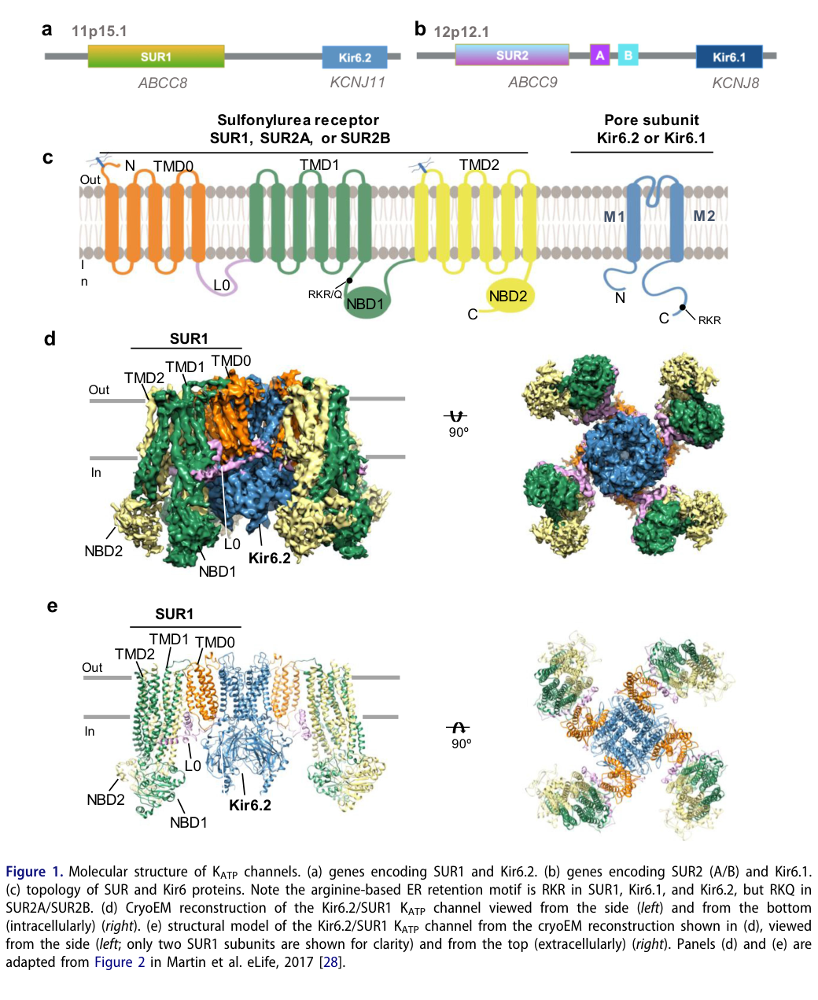

## Question

# Gene Research for Functional Annotation

## ⚠️ CRITICAL: Gene/Protein Identification Context

**BEFORE YOU BEGIN RESEARCH:** You MUST verify you are researching the CORRECT gene/protein. Gene symbols can be ambiguous, especially for less well-characterized genes from non-model organisms.

### Target Gene/Protein Identity (from UniProt):
- **UniProt Accession:** Q09428
- **Protein Description:** RecName: Full=ATP-binding cassette sub-family C member 8; AltName: Full=Sulfonylurea receptor 1;
- **Gene Information:** Name=ABCC8; Synonyms=HRINS, SUR, SUR1;
- **Organism (full):** Homo sapiens (Human).
- **Protein Family:** Belongs to the ABC transporter superfamily. ABCC family.
- **Key Domains:** AAA+_ATPase. (IPR003593); ABC1_TM_dom. (IPR011527); ABC1_TM_sf. (IPR036640); ABC_transporter-like_ATP-bd. (IPR003439); ABC_transporter-like_CS. (IPR017871)

### MANDATORY VERIFICATION STEPS:

1. **Check if the gene symbol "ABCC8" matches the protein description above**
2. **Verify the organism is correct:** Homo sapiens (Human).
3. **Check if protein family/domains align with what you find in literature**
4. **If you find literature for a DIFFERENT gene with the same or similar symbol, STOP**

### If Gene Symbol is Ambiguous or You Cannot Find Relevant Literature:

**DO NOT PROCEED WITH RESEARCH ON A DIFFERENT GENE.** Instead:
- State clearly: "The gene symbol 'ABCC8' is ambiguous or literature is limited for this specific protein"
- Explain what you found (e.g., "Found extensive literature on a different gene with the same symbol in a different organism")
- Describe the protein based ONLY on the UniProt information provided above
- Suggest that the protein function can be inferred from domain/family information

### Research Target:

Please provide a comprehensive research report on the gene **ABCC8** (gene ID: ABCC8, UniProt: Q09428) in human.

The research report should be a detailed narrative explaining the function, biological processes, and localization of the gene product. Citations should be given for all claims.

You should prioritize authoritative reviews and primary scientific literature when conducting research. You can supplement
this with annotations you find in gene/protein databases, but these can be outdated or inaccurate.

We are specifically interested in the primary function of the gene - for enzymes, what reaction is catalyzed, and what is the substrate specificity? For transporters, what is the substrate? For structural proteins or adapters, what is the broader structural role? For signaling molecules, what is the role in the pathway.

We are interested in where in or outside the cell the gene product carries out its function.

We are also interested in the signaling or biochemical pathways in which the gene functions. We are less interested in broad pleiotropic effects, except where these elucidate the precise role.

Include evidence where possible. We are interested in both experimental evidence as well as inference from structure, evolution, or bioinformatic analysis. Precise studies should be prioritized over high-throughput, where available.

## Output

Question: You are an expert researcher providing comprehensive, well-cited information.

Provide detailed information focusing on:
1. Key concepts and definitions with current understanding
2. Recent developments and latest research (prioritize 2023-2024 sources)
3. Current applications and real-world implementations
4. Expert opinions and analysis from authoritative sources
5. Relevant statistics and data from recent studies

Format as a comprehensive research report with proper citations. Include URLs and publication dates where available.
Always prioritize recent, authoritative sources and provide specific citations for all major claims.

# Gene Research for Functional Annotation

## ⚠️ CRITICAL: Gene/Protein Identification Context

**BEFORE YOU BEGIN RESEARCH:** You MUST verify you are researching the CORRECT gene/protein. Gene symbols can be ambiguous, especially for less well-characterized genes from non-model organisms.

### Target Gene/Protein Identity (from UniProt):
- **UniProt Accession:** Q09428
- **Protein Description:** RecName: Full=ATP-binding cassette sub-family C member 8; AltName: Full=Sulfonylurea receptor 1;
- **Gene Information:** Name=ABCC8; Synonyms=HRINS, SUR, SUR1;
- **Organism (full):** Homo sapiens (Human).
- **Protein Family:** Belongs to the ABC transporter superfamily. ABCC family.
- **Key Domains:** AAA+_ATPase. (IPR003593); ABC1_TM_dom. (IPR011527); ABC1_TM_sf. (IPR036640); ABC_transporter-like_ATP-bd. (IPR003439); ABC_transporter-like_CS. (IPR017871)

### MANDATORY VERIFICATION STEPS:

1. **Check if the gene symbol "ABCC8" matches the protein description above**
2. **Verify the organism is correct:** Homo sapiens (Human).
3. **Check if protein family/domains align with what you find in literature**
4. **If you find literature for a DIFFERENT gene with the same or similar symbol, STOP**

### If Gene Symbol is Ambiguous or You Cannot Find Relevant Literature:

**DO NOT PROCEED WITH RESEARCH ON A DIFFERENT GENE.** Instead:
- State clearly: "The gene symbol 'ABCC8' is ambiguous or literature is limited for this specific protein"
- Explain what you found (e.g., "Found extensive literature on a different gene with the same symbol in a different organism")
- Describe the protein based ONLY on the UniProt information provided above
- Suggest that the protein function can be inferred from domain/family information

### Research Target:

Please provide a comprehensive research report on the gene **ABCC8** (gene ID: ABCC8, UniProt: Q09428) in human.

The research report should be a detailed narrative explaining the function, biological processes, and localization of the gene product. Citations should be given for all claims.

You should prioritize authoritative reviews and primary scientific literature when conducting research. You can supplement
this with annotations you find in gene/protein databases, but these can be outdated or inaccurate.

We are specifically interested in the primary function of the gene - for enzymes, what reaction is catalyzed, and what is the substrate specificity? For transporters, what is the substrate? For structural proteins or adapters, what is the broader structural role? For signaling molecules, what is the role in the pathway.

We are interested in where in or outside the cell the gene product carries out its function.

We are also interested in the signaling or biochemical pathways in which the gene functions. We are less interested in broad pleiotropic effects, except where these elucidate the precise role.

Include evidence where possible. We are interested in both experimental evidence as well as inference from structure, evolution, or bioinformatic analysis. Precise studies should be prioritized over high-throughput, where available.

# ABCC8 (SUR1; UniProt Q09428): functional-annotation research report

## Executive conclusion

The requested target is unambiguous: **human ABCC8**, located at **11p15.1**, encodes **ATP-binding cassette subfamily C member 8**, better known as **sulfonylurea receptor 1 (SUR1; UniProt Q09428; aliases SUR, SUR1, HRINS)**. It is not ABCC9/SUR2. The supplied family and domain annotations agree with the literature: SUR1 is a 17-pass ABCC-family membrane protein containing an accessory TMD0/L0 region and a canonical ABC core with two transmembrane domains and two intracellular nucleotide-binding domains. ABCC8 and KCNJ11 are neighboring genes encoding the two components of the predominant pancreatic/neuroendocrine KATP channel. (nichols2023personalizedtherapeuticsfor pages 1-3, patton2024dynamicduokir6 pages 1-3, patton2024dynamicduokir6 media 3e9ab68b)

**The most important functional-annotation point is that SUR1 is not itself the potassium pore and is not known to transport a solute.** It is a regulatory ABC-protein or “pseudotransporter-like” subunit. Four SUR1 molecules assemble around four Kir6.2/KCNJ11 pore subunits to form a plasma-membrane ATP-sensitive K+ channel. SUR1 controls assembly, surface trafficking, Mg-nucleotide gating and drug sensitivity; Kir6.2 conducts K+. (patton2024dynamicduokir6 pages 1-3, martin2019mechanismofpharmacochaperoning pages 1-2, puljung2018cryoelectronmicroscopystructures pages 9-11)

| Category | Evidence-based annotation | Functional significance |
|---|---|---|
| Verified identity | Human **ABCC8** at **11p15.1** encodes ATP-binding cassette subfamily C member 8, **sulfonylurea receptor 1 (SUR1; UniProt Q09428)**; aliases include **SUR, SUR1, HRINS**. It is distinct from **ABCC9/SUR2**. (nichols2023personalizedtherapeuticsfor pages 1-3, patton2024dynamicduokir6 pages 1-3) | Confirms that the target is human SUR1 rather than related SUR2 or a similarly named nonhuman gene. |
| Protein class | SUR1 is an **ABCC-family regulatory ABC protein** whose nucleotide-driven conformational changes control an associated ion pore. Unlike conventional ABCC exporters, **no transported solute is established**; evidence supports a regulatory pseudotransporter-like role. (patton2024dynamicduokir6 pages 1-3, martin2019mechanismofpharmacochaperoning pages 1-2, puljung2018cryoelectronmicroscopystructures pages 9-11) | ABCC8 is not the K⁺-conducting pore and should not be annotated as a solute pump. |
| Architecture | Large membrane protein with **17 transmembrane helices**: accessory **TMD0**, cytoplasmic **L0**, and an ABC core arranged as **TMD1–NBD1–TMD2–NBD2**. (nichols2023personalizedtherapeuticsfor pages 1-3, martin2017cryoemstructureof pages 11-12, patton2024dynamicduokir6 media 3e9ab68b) | TMD0/L0 couples SUR1 to Kir6.2; the nucleotide-binding domains sense Mg-nucleotides and drive regulatory conformational changes. |
| Canonical complex | Pancreatic and neuroendocrine KATP channels are hetero-octamers containing **four SUR1 plus four pore-forming Kir6.2 subunits encoded by KCNJ11**. (patton2024dynamicduokir6 pages 1-3, martin2019mechanismofpharmacochaperoning pages 1-2, martin2019mechanismofpharmacochaperoning pages 12-14, patton2024dynamicduokir6 media 3e9ab68b) | Kir6.2 provides K⁺ selectivity and conduction; SUR1 controls trafficking, nucleotide sensitivity, gating, and pharmacology. |
| Primary localization | Mature SUR1–Kir6.2 complexes function mainly at the **plasma membrane**, prominently in pancreatic endocrine cells—especially β cells—and neurons. Assembly defects can retain mutant complexes in the endoplasmic reticulum. (patton2024dynamicduokir6 pages 1-3, martin2020pharmacologicalchaperonesof pages 1-2, martin2019mechanismofpharmacochaperoning pages 12-14) | Plasma-membrane localization enables metabolism to regulate membrane voltage and secretion. |
| Ligands and regulation | **ATP binding to Kir6.2 inhibits** the pore; **MgATP/MgADP acting at SUR1 NBDs generally promotes activation**, although exact coupling and hydrolysis requirements remain model-dependent. **Sulfonylureas** inhibit the channel, whereas **diazoxide** promotes opening. (nichols2023personalizedtherapeuticsfor pages 1-3, martin2017cryoemstructureof pages 11-12, nichols2023personalizedtherapeuticsfor pages 25-28, martin2020pharmacologicalchaperonesof pages 22-24) | Opposing nucleotide signals make the complex an energy sensor; SUR1 also supplies clinically actionable drug-binding sites. |
| β-cell pathway | Rising glucose metabolism shifts adenine-nucleotide signaling toward KATP closure, causing β-cell depolarization, voltage-gated Ca²⁺ entry, and insulin-granule exocytosis. At low glucose, channel opening hyperpolarizes the cell and restrains secretion. (martin2020pharmacologicalchaperonesof pages 1-2) | This is ABCC8’s principal established physiological pathway and explains its bidirectional hypoglycemia/diabetes phenotypes. |
| Loss of function | Biallelic or dominant **loss-of-function ABCC8 variants** can impair folding, assembly, surface trafficking, or Mg-nucleotide activation, causing inappropriate KATP closure and **congenital hyperinsulinism**. (martin2019mechanismofpharmacochaperoning pages 1-2, martin2020pharmacologicalchaperonesof pages 1-2) | Persistent depolarization drives insulin secretion despite hypoglycemia; severe disease may be diazoxide-unresponsive. |
| Gain of function | **Gain-of-function ABCC8 variants** reduce ATP-dependent closure or enhance Mg-nucleotide activation, maintaining β-cell hyperpolarization and causing transient or permanent **neonatal diabetes**, sometimes with neurological manifestations. (martin2019mechanismofpharmacochaperoning pages 1-2, martin2020pharmacologicalchaperonesof pages 1-2) | Persistently open channels suppress Ca²⁺ entry and insulin release despite hyperglycemia. |
| Genotype-guided implementation | Diazoxide opens residual KATP channels in hyperinsulinism; sulfonylureas close overactive channels and may replace insulin in responsive ABCC8 neonatal diabetes. Genetic diagnosis can direct **¹⁸F-DOPA PET** and lesion-limited surgery for focal disease. A 2024 Chinese cohort found KATP variants in **79/121 (65.3%)** monogenic cases and nonsurgical treatment effective in **65.9%** of that subgroup. (cheng2024nonsurgicaltreatmentmay pages 1-2, shen2024transientdiabetesmellitus pages 6-8, shen2024transientdiabetesmellitus pages 4-6) | ABCC8 is an established precision-medicine target, but response depends on effects on gating, drug sensitivity, trafficking, and pancreatic histology. |
| SUR1–TRPM4 caveat | Injury literature also describes SUR1 associated with **TRPM4**, a nonselective monovalent-cation channel. This context-dependent complex is distinct from the constitutive SUR1–Kir6.2 KATP channel and should not redefine ABCC8’s canonical pore partner or β-cell function. (patton2024dynamicduokir6 pages 1-3, martin2019mechanismofpharmacochaperoning pages 12-14, patton2024dynamicduokir6 media 3e9ab68b) | Prevents conflation of injury-associated CNS signaling with the structurally established KATP-channel annotation; SUR1–TRPM4 claims require context-specific validation. |

*Table: Concise evidence-based annotation of human ABCC8/Q09428, covering molecular identity, architecture, canonical KATP-channel function, disease mechanisms, and genotype-guided clinical use. It also distinguishes established SUR1–Kir6.2 biology from context-dependent SUR1–TRPM4 reports.*

## 1. Identity verification and exclusion of related targets

The 2024 structural review by Patton and colleagues maps **ABCC8/SUR1 and KCNJ11/Kir6.2 to 11p15.1** and contrasts them with **ABCC9/SUR2 and KCNJ8/Kir6.1 on chromosome 12**. ABCC9 is alternatively spliced into SUR2A and SUR2B; it is not the requested protein. SUR1/Kir6.2 predominates in pancreatic β cells and is also important in neurons, whereas SUR2A-containing channels predominate in ventricular muscle and SUR2B/Kir6.1 channels in smooth muscle. This concordance verifies the user-supplied human target, protein description and ABC-domain assignment. (nichols2023personalizedtherapeuticsfor pages 1-3, patton2024dynamicduokir6 pages 1-3, martin2020pharmacologicalchaperonesof pages 1-2)

The reviewed structural figure directly depicts the ABCC8–KCNJ11 locus, SUR1 topology, and four-SUR1/four-Kir6.2 architecture. It also identifies an arginine-based **RKR endoplasmic-reticulum retention signal**, relevant to quality control and coordinated channel assembly. (patton2024dynamicduokir6 media 3e9ab68b)

## 2. Protein architecture and biochemical role

SUR1 has an N-terminal five-helix **TMD0**, followed by the cytoplasmic **L0** linker and a canonical 12-helix ABC core organized as **TMD1–NBD1–TMD2–NBD2**, for 17 transmembrane helices overall. TMD0 and L0 form major interfaces with Kir6.2 and transmit conformational changes from the ABC core to the pore. The two nucleotide-binding domains correspond well to the supplied AAA+/ABC ATPase-related annotations. (nichols2023personalizedtherapeuticsfor pages 1-3, martin2017cryoemstructureof pages 11-12, patton2024dynamicduokir6 media 3e9ab68b)

The mature channel is a hetero-octamer: a central tetramer of K+-selective inward-rectifier **Kir6.2** subunits is surrounded by four regulatory SUR1 molecules. Cryo-EM shows TMD0 anchoring each SUR1 to Kir6.2, while the Kir6.2 N terminus can occupy SUR1’s central ABC-core cavity. That interaction helps couple assembly and gating and explains why mutations distant from the pore can alter channel biogenesis or activity. (martin2019mechanismofpharmacochaperoning pages 1-2, martin2017cryoemstructureof pages 11-12, martin2019mechanismofpharmacochaperoning pages 12-14)

Unlike ordinary ABCC exporters, SUR1 has no established transported substrate. Structural comparisons indicate that nucleotide-dependent SUR1 conformations do not create the conventional outward-open pathway required for substrate release. An unknown transport function cannot be excluded absolutely, but current expert interpretation is that SUR1’s ABC cycle has been repurposed to regulate an adjacent ion channel. Consequently, “ATP-binding regulatory subunit of a KATP channel” is more accurate than “ATP-driven transporter.” (patton2024dynamicduokir6 pages 1-3, puljung2018cryoelectronmicroscopystructures pages 9-11)

## 3. Nucleotide sensing and channel gating

KATP gating integrates opposing nucleotide signals at different proteins:

* **ATP at Kir6.2 inhibits the pore.** ATP binds without Mg2+ at cytoplasmic interfaces of Kir6.2 and stabilizes closure.
* **MgATP and MgADP at SUR1 generally promote opening.** Nucleotide occupancy and NBD association move the SUR1 ABC core and communicate through L0/TMD0 and the Kir6.2 N terminus.
* **PIP2 favors Kir6.2 opening** and functionally opposes ATP inhibition.
* The resulting channel activity reflects nucleotide concentration, Mg2+, phospholipids and cellular metabolic compartmentation—not merely a simple ATP/ADP ratio. (nichols2023personalizedtherapeuticsfor pages 1-3, martin2017cryoemstructureof pages 11-12, nichols2023personalizedtherapeuticsfor pages 25-28)

The detailed SUR1 mechanism remains an area of active analysis. Earlier models emphasized MgATP hydrolysis at SUR1, whereas functional experiments showed that ATP binding without hydrolysis can bias SUR1 toward activating, outward-facing-like conformations under appropriate conditions. Cryo-EM has captured inward-facing, propeller and quatrefoil arrangements, including NBD-dimerized states, but several nucleotide-bound structures still have a closed Kir6.2 pore. Thus, NBD dimerization is strongly linked to activation but cannot yet be equated simplistically with an open pore in every structure. (martin2017cryoemstructureof pages 11-12, sikimic2019atpbindingwithout pages 14-15, martin2020pharmacologicalchaperonesof pages 22-24)

## 4. Cellular localization and primary pathway

Functionally mature SUR1–Kir6.2 complexes reside principally in the **plasma membrane** of pancreatic endocrine cells and neurons. Assembly occurs through the secretory pathway; unassembled or misfolded subunits can be retained in the ER and degraded. TMD0 mutations are particularly important causes of defective assembly and surface delivery. (martin2020pharmacologicalchaperonesof pages 1-2, martin2019mechanismofpharmacochaperoning pages 12-14, patton2024dynamicduokir6 media 3e9ab68b)

In pancreatic β cells, the pathway is:

1. At low glucose, KATP channels are relatively active, allowing outward K+ current and maintaining a hyperpolarized membrane.
2. Increased glucose metabolism changes cytoplasmic adenine-nucleotide signaling and closes KATP channels.
3. Reduced K+ conductance depolarizes the β-cell membrane.
4. Voltage-gated Ca2+ channels open.
5. Ca2+ influx triggers insulin-granule exocytosis.

SUR1 is therefore a **metabolism-to-excitability transducer** rather than an insulin-synthesis protein. Its precise role is to interpret Mg-nucleotide and pharmacological signals and regulate Kir6.2 gating, channel assembly and surface abundance. (martin2020pharmacologicalchaperonesof pages 1-2)

SUR1/Kir6.2 channels also regulate electrical activity and secretion in neurons and other neuroendocrine cells. Reports of additional tissue combinations should be interpreted carefully because Kir6 and SUR isoforms may coexist, and recombinant compatibility does not by itself establish the native stoichiometry of every tissue. (nichols2023personalizedtherapeuticsfor pages 1-3, patton2024dynamicduokir6 pages 1-3)

## 5. Pharmacology and real-world implementation

**Sulfonylureas** such as glibenclamide/glyburide bind a pocket in the SUR1 ABC-core transmembrane bundle and inhibit KATP current. In β cells this depolarizes the membrane and stimulates insulin secretion. Structural mutagenesis and cryo-EM localize the pocket near the inner membrane leaflet, above NBD1. Repaglinide and carbamazepine can occupy an overlapping pocket. (martin2019mechanismofpharmacochaperoning pages 1-2, martin2017cryoemstructureof pages 11-12)

**Diazoxide** is a KATP opener acting through SUR1. It hyperpolarizes β cells and restrains insulin secretion, making it first-line mechanism-based therapy for congenital hyperinsulinism when functional channels remain at the surface. Drug response is variant-dependent: a channel absent from the membrane or unable to open cannot reliably respond to diazoxide. (patton2024dynamicduokir6 pages 1-3, nichols2023personalizedtherapeuticsfor pages 25-28)

A second pharmacological principle is **pharmacochaperoning**. Glibenclamide, repaglinide and carbamazepine can stabilize the Kir6.2 N terminus in SUR1’s central cavity and rescue surface expression of selected trafficking-defective mutant complexes experimentally. However, the same compounds inhibit channel function, so separating rescue from blockade remains a translational challenge. (martin2019mechanismofpharmacochaperoning pages 1-2, martin2019mechanismofpharmacochaperoning pages 12-14)

## 6. Disease mechanism as functional evidence

### Congenital hyperinsulinism

ABCC8 loss-of-function can reduce channel activity through defective folding, assembly or plasma-membrane trafficking; impaired Mg-nucleotide activation; or altered pore coupling. Too little KATP current leaves β cells depolarized and causes inappropriate insulin release despite hypoglycemia. ABCC8/KCNJ11 defects are the most common molecular class of KATP-dependent congenital hyperinsulinism. (martin2019mechanismofpharmacochaperoning pages 1-2, martin2020pharmacologicalchaperonesof pages 1-2)

Histology may be diffuse or focal. Focal disease commonly involves a paternally inherited ABCC8/KCNJ11 variant plus somatic loss of the normal maternal 11p15 region in a pancreatic clone. Genetic findings can therefore guide **18F-DOPA PET/CT** and lesion-limited resection, potentially avoiding near-total pancreatectomy. A 2024 two-patient report illustrated the contrast between a homozygous deletion associated with diffuse disease and a paternal truncating variant suggesting focal disease, although imaging and surgical confirmation were unavailable in the latter case. (butnariu2024congenitalhyperinsulinismcaused pages 6-7, butnariu2024congenitalhyperinsulinismcaused pages 10-11)

### Neonatal and monogenic diabetes

ABCC8 gain-of-function keeps KATP channels open despite glucose metabolism. Persistent β-cell hyperpolarization prevents Ca2+ entry and suppresses insulin secretion, causing transient or permanent neonatal diabetes; neurological manifestations can occur because SUR1/Kir6.2 also functions in neurons. Many responsive patients can switch from injected insulin to an oral sulfonylurea, which closes the overactive channel downstream of the nucleotide-sensing defect. (martin2019mechanismofpharmacochaperoning pages 1-2, martin2020pharmacologicalchaperonesof pages 1-2, nichols2023personalizedtherapeuticsfor pages 25-28)

ABCC8-related MODY has also been proposed, but contemporary reviews emphasize variable expressivity, incomplete genotype–phenotype correlation and the need for cautious interpretation of variants of uncertain significance. Thus, a rare ABCC8 variant plus diabetes is not sufficient to establish causality without segregation, population, functional and phenotype evidence.

Open Targets independently records strong ABCC8 associations with familial hyperinsulinemic hypoglycemia and transient and permanent neonatal diabetes, together with approved-drug and clinical evidence. This database aggregation supports—but does not replace—the variant-level mechanistic literature. (OpenTargets Search: -ABCC8)

## 7. Recent evidence and quantitative findings, 2023–2024

* **Structural synthesis (March 2024):** Patton et al. integrated recent cryo-EM structures with four decades of electrophysiology and emphasized that SUR1 is an ABC-family homolog lacking solute-transport activity, while providing metabolic control, trafficking and pharmacology to the Kir6 pore. URL: https://doi.org/10.1080/19336950.2024.2327708. (patton2024dynamicduokir6 pages 1-3)
* **Precision pharmacology review (January 2023):** Nichols emphasized that the same channel is actionable in opposite directions—openers for loss-of-function hyperinsulinism and inhibitors for gain-of-function diabetes—but cross-reactivity across Kir6/SUR isoforms creates adverse-effect and selectivity problems. URL: https://doi.org/10.1146/annurev-pharmtox-051921-123023. (nichols2023personalizedtherapeuticsfor pages 1-3, nichols2023personalizedtherapeuticsfor pages 25-28)
* **Chinese monogenic-CHI cohort (January 2024):** among 121 children, 79 (65.3%) carried KATP-gene variants; nonsurgical treatment was effective in 65.9% of the KATP subgroup. Neonatal-onset KATP cases underwent surgery more often than later-onset cases (24.5% versus 3.8%). These are retrospective, single-center data and combine ABCC8 and KCNJ11 rather than estimating ABCC8-only efficacy. URL: https://doi.org/10.1155/2024/3961900. (cheng2024nonsurgicaltreatmentmay pages 1-2)
* **Italian neonatal-diabetes survey (February 2024):** across 2003–2022, ABCC8 variants accounted for 13 transient and one permanent neonatal-diabetes cases in the reported dataset. The complete cohort contained 45 permanent and 51 transient cases. These national observational data demonstrate real-world genetic diagnosis but do not constitute an ABCC8 treatment trial. URL: https://doi.org/10.1210/clinem/dgae095. (rapini2024thechanginglandscape pages 6-6)
* **ABCC8 transient-neonatal-diabetes cases (August 2024):** two infants with a de novo heterozygous ABCC8 variant were transitioned from insulin to glyburide at 0.1–0.2 mg/kg/day; insulin was withdrawn, and glyburide was later stopped after one month and one year, respectively, without major reported adverse effects. This is compelling precision-treatment evidence but only a two-case report with limited follow-up. URL: https://doi.org/10.4239/wjd.v15.i8.1811. (shen2024transientdiabetesmellitus pages 6-8, shen2024transientdiabetesmellitus pages 4-6)
* In the same 2024 review, a cited French cohort contained 31 ABCC8-related neonatal-diabetes cases: 24 (78%) were transient and five (16%) permanent at follow-up. Classification can evolve, and the figures derive from a cited cohort rather than the two new cases. (shen2024transientdiabetesmellitus pages 4-6)

## 8. SUR1–TRPM4: important but separate annotation

In CNS injury literature, induced SUR1 has been proposed to associate with TRPM4, producing a nonselective monovalent-cation conductance associated with depolarization and cellular swelling. This must not be conflated with the canonical SUR1/Kir6.2 KATP channel: TRPM4 is not K+-selective, the complex is reported mainly in injury-induced contexts, and it does not change the established β-cell annotation of ABCC8. Evidence for composition, stoichiometry and context should be evaluated separately from the extensive structural evidence for SUR1/Kir6.2.

Accordingly, SUR1–TRPM4 is best treated as a context-dependent secondary interaction rather than ABCC8’s defining molecular function. The authoritative 2024 KATP structural synthesis and direct cryo-EM architecture support SUR1/Kir6.2 as the primary annotation. (patton2024dynamicduokir6 pages 1-3, patton2024dynamicduokir6 media 3e9ab68b)

## 9. Evidence assessment and expert interpretation

The strongest functional evidence consists of convergent electrophysiology, targeted mutagenesis, human genetics, pharmacology and near-atomic cryo-EM. These establish beyond reasonable doubt that ABCC8/SUR1 is a regulatory nucleotide-binding subunit of KATP channels rather than the conducting pore or a conventional solute pump. Human loss- and gain-of-function phenotypes provide bidirectional causal validation: insufficient current causes hyperinsulinemic hypoglycemia, while excessive current causes diabetes. (martin2019mechanismofpharmacochaperoning pages 1-2, martin2017cryoemstructureof pages 11-12, martin2020pharmacologicalchaperonesof pages 1-2)

Remaining uncertainties concern the exact sequence of nucleotide binding, hydrolysis, NBD dimerization, Kir6.2 N-terminal movement and pore opening; native subunit combinations outside well-studied tissues; the clinical feasibility of pharmacochaperones; and the molecular status of injury-associated SUR1–TRPM4. Structural snapshots should therefore not be interpreted as a complete kinetic cycle. (martin2017cryoemstructureof pages 11-12, puljung2018cryoelectronmicroscopystructures pages 9-11, martin2020pharmacologicalchaperonesof pages 22-24)

## Final functional annotation

**ABCC8/Q09428 encodes human SUR1, a plasma-membrane regulatory ABCC protein that assembles primarily with Kir6.2 as a 4:4 ATP-sensitive K+ channel. SUR1 does not provide the K+ pore and has no established transported substrate. Through its two nucleotide-binding domains, TMD0/L0 coupling interface and drug-binding cavity, it controls channel assembly, trafficking and opening in response to MgATP/MgADP. In pancreatic β cells this couples glucose metabolism to membrane potential, Ca2+ entry and insulin exocytosis. Loss of function causes congenital hyperinsulinism; gain of function causes neonatal/monogenic diabetes. Diazoxide and sulfonylureas exploit these opposing mechanisms in genotype-guided clinical care.**

References

1. (nichols2023personalizedtherapeuticsfor pages 1-3): Colin G. Nichols. Personalized therapeutics for katp-dependent pathologies. Jan 2023. URL: https://doi.org/10.1146/annurev-pharmtox-051921-123023, doi:10.1146/annurev-pharmtox-051921-123023. This article has 32 citations and is from a highest quality peer-reviewed journal.

2. (patton2024dynamicduokir6 pages 1-3): Bruce L. Patton, Phillip Zhu, Assmaa ElSheikh, Camden M. Driggers, and Show-Ling Shyng. Dynamic duo: kir6 and sur in katp channel structure and function. Channels, Mar 2024. URL: https://doi.org/10.1080/19336950.2024.2327708, doi:10.1080/19336950.2024.2327708. This article has 21 citations and is from a peer-reviewed journal.

3. (patton2024dynamicduokir6 media 3e9ab68b): Bruce L. Patton, Phillip Zhu, Assmaa ElSheikh, Camden M. Driggers, and Show-Ling Shyng. Dynamic duo: kir6 and sur in katp channel structure and function. Channels, Mar 2024. URL: https://doi.org/10.1080/19336950.2024.2327708, doi:10.1080/19336950.2024.2327708. This article has 21 citations and is from a peer-reviewed journal.

4. (martin2019mechanismofpharmacochaperoning pages 1-2): Gregory M Martin, Min Woo Sung, Zhongying Yang, Laura M Innes, Balamurugan Kandasamy, Larry L David, Craig Yoshioka, and Show-Ling Shyng. Mechanism of pharmacochaperoning in a mammalian katp channel revealed by cryo-em. eLife, Jul 2019. URL: https://doi.org/10.7554/elife.46417, doi:10.7554/elife.46417. This article has 97 citations and is from a domain leading peer-reviewed journal.

5. (puljung2018cryoelectronmicroscopystructures pages 9-11): Michael C. Puljung. Cryo-electron microscopy structures and progress toward a dynamic understanding of katp channels. The Journal of General Physiology, 150:653-669, May 2018. URL: https://doi.org/10.1085/jgp.201711978, doi:10.1085/jgp.201711978. This article has 56 citations.

6. (martin2017cryoemstructureof pages 11-12): Gregory M Martin, Craig Yoshioka, Emily A Rex, Jonathan F Fay, Qing Xie, Matthew R Whorton, James Z Chen, and Show-Ling Shyng. Cryo-em structure of the atp-sensitive potassium channel illuminates mechanisms of assembly and gating. Jan 2017. URL: https://doi.org/10.7554/elife.24149, doi:10.7554/elife.24149. This article has 217 citations and is from a domain leading peer-reviewed journal.

7. (martin2019mechanismofpharmacochaperoning pages 12-14): Gregory M Martin, Min Woo Sung, Zhongying Yang, Laura M Innes, Balamurugan Kandasamy, Larry L David, Craig Yoshioka, and Show-Ling Shyng. Mechanism of pharmacochaperoning in a mammalian katp channel revealed by cryo-em. eLife, Jul 2019. URL: https://doi.org/10.7554/elife.46417, doi:10.7554/elife.46417. This article has 97 citations and is from a domain leading peer-reviewed journal.

8. (martin2020pharmacologicalchaperonesof pages 1-2): Gregory M. Martin, Min Woo Sung, and Show-Ling Shyng. Pharmacological chaperones of atp-sensitive potassium channels: mechanistic insight from cryoem structures. Feb 2020. URL: https://doi.org/10.1016/j.mce.2019.110667, doi:10.1016/j.mce.2019.110667. This article has 35 citations and is from a peer-reviewed journal.

9. (nichols2023personalizedtherapeuticsfor pages 25-28): Colin G. Nichols. Personalized therapeutics for katp-dependent pathologies. Jan 2023. URL: https://doi.org/10.1146/annurev-pharmtox-051921-123023, doi:10.1146/annurev-pharmtox-051921-123023. This article has 32 citations and is from a highest quality peer-reviewed journal.

10. (martin2020pharmacologicalchaperonesof pages 22-24): Gregory M. Martin, Min Woo Sung, and Show-Ling Shyng. Pharmacological chaperones of atp-sensitive potassium channels: mechanistic insight from cryoem structures. Feb 2020. URL: https://doi.org/10.1016/j.mce.2019.110667, doi:10.1016/j.mce.2019.110667. This article has 35 citations and is from a peer-reviewed journal.

11. (cheng2024nonsurgicaltreatmentmay pages 1-2): Ming Cheng, Chang Su, Dongmei Wang, Yanning Song, Yang Li, He Zeng, Zheng Yuan, Xiaoqiao Li, Xi Meng, Yuan Ding, Bingyan Cao, and Chunxiu Gong. Non-surgical treatment may be appropriate for most chinese children with monogenic congenital hyperinsulinism based on a retrospective study of 121 patients. Pediatric Diabetes, Jan 2024. URL: https://doi.org/10.1155/2024/3961900, doi:10.1155/2024/3961900. This article has 1 citations and is from a domain leading peer-reviewed journal.

12. (shen2024transientdiabetesmellitus pages 6-8): Ling-Hua Shen, Yan Cui, Dong-Xia Fu, Wei Yang, Sheng-Nan Wu, Hui-Zhen Wang, Hai-Hua Yang, Yong-Xing Chen, and Hai-Yan Wei. Transient diabetes mellitus with abcc8 variant successfully treated with sulfonylurea: two case reports and review of literature. World Journal of Diabetes, 15:1811-1819, Aug 2024. URL: https://doi.org/10.4239/wjd.v15.i8.1811, doi:10.4239/wjd.v15.i8.1811. This article has 1 citations and is from a peer-reviewed journal.

13. (shen2024transientdiabetesmellitus pages 4-6): Ling-Hua Shen, Yan Cui, Dong-Xia Fu, Wei Yang, Sheng-Nan Wu, Hui-Zhen Wang, Hai-Hua Yang, Yong-Xing Chen, and Hai-Yan Wei. Transient diabetes mellitus with abcc8 variant successfully treated with sulfonylurea: two case reports and review of literature. World Journal of Diabetes, 15:1811-1819, Aug 2024. URL: https://doi.org/10.4239/wjd.v15.i8.1811, doi:10.4239/wjd.v15.i8.1811. This article has 1 citations and is from a peer-reviewed journal.

14. (sikimic2019atpbindingwithout pages 14-15): Jelena Sikimic, Timothy S. McMillen, Cita Bleile, Frank Dastvan, Ulrich Quast, Peter Krippeit-Drews, Gisela Drews, and Joseph Bryan. Atp binding without hydrolysis switches sulfonylurea receptor 1 (sur1) to outward-facing conformations that activate katp channels. Mar 2019. URL: https://doi.org/10.1074/jbc.ra118.005236, doi:10.1074/jbc.ra118.005236. This article has 23 citations and is from a domain leading peer-reviewed journal.

15. (butnariu2024congenitalhyperinsulinismcaused pages 6-7): Lăcrămioara Ionela Butnariu, Delia Andreia Bizim, Gabriela Păduraru, Luminița Păduraru, Ștefana Maria Moisă, Setalia Popa, Nicoleta Gimiga, Gabriela Ghiga, Minerva Codruța Bădescu, Ancuta Lupu, Ioana Vasiliu, and Laura Mihaela Trandafir. Congenital hyperinsulinism caused by mutations in abcc8 gene associated with early-onset neonatal hypoglycemia: genetic heterogeneity correlated with phenotypic variability. International Journal of Molecular Sciences, 25(10):5533, May 2024. URL: https://doi.org/10.3390/ijms25105533, doi:10.3390/ijms25105533. This article has 13 citations.

16. (butnariu2024congenitalhyperinsulinismcaused pages 10-11): Lăcrămioara Ionela Butnariu, Delia Andreia Bizim, Gabriela Păduraru, Luminița Păduraru, Ștefana Maria Moisă, Setalia Popa, Nicoleta Gimiga, Gabriela Ghiga, Minerva Codruța Bădescu, Ancuta Lupu, Ioana Vasiliu, and Laura Mihaela Trandafir. Congenital hyperinsulinism caused by mutations in abcc8 gene associated with early-onset neonatal hypoglycemia: genetic heterogeneity correlated with phenotypic variability. International Journal of Molecular Sciences, 25(10):5533, May 2024. URL: https://doi.org/10.3390/ijms25105533, doi:10.3390/ijms25105533. This article has 13 citations.

17. (OpenTargets Search: -ABCC8): Open Targets Query (-ABCC8, 8 results). Buniello, A. et al. (2025). Open Targets Platform: facilitating therapeutic hypotheses building in drug discovery. Nucleic Acids Research.

18. (rapini2024thechanginglandscape pages 6-6): Novella Rapini, Maurizio Delvecchio, Mafalda Mucciolo, Rosario Ruta, Ivana Rabbone, Valentino Cherubini, Stefano Zucchini, Stefano Cianfarani, Elena Prandi, Riccardo Schiaffini, Carla Bizzarri, Barbara Piccini, Giulio Maltoni, Barbara Predieri, Nicola Minuto, Rossella Di Paola, Mara Giordano, Nadia Tinto, Valeria Grasso, Lucia Russo, Valentina Tiberi, Andrea Scaramuzza, Giulio Frontino, Maria Cristina Maggio, Gianluca Musolino, Elvira Piccinno, Davide Tinti, Paola Carrera, Enza Mozzillo, Marco Cappa, Dario Iafusco, Riccardo Bonfanti, Antonio Novelli, Fabrizio Barbetti, Luciano Beccaria, Francesco Candia, Vittoria Cauvin, Roberta Cardani, Francesca Cardella, Anna Favia, Francesco Gallo, Patrizia Garzia, Paolo Ghirri, Stefania Innaurato, Lorenzo Iughetti, Nicola Laforgia, Donatella Lo Presti, Alberto Marsciani, Franco Meschi, Rossana Panzeca, Bruno Pasquino, Roberta Pesavento, Giulia Pezzino, Petra Reinstadler, Carlo Ripoli, Silvia Savastio, Tiziana Timpanaro, Stefano Tumini, and Gianni Vento. The changing landscape of neonatal diabetes mellitus in italy between 2003 and 2022. The Journal of Clinical Endocrinology and Metabolism, 109:2349-2357, Feb 2024. URL: https://doi.org/10.1210/clinem/dgae095, doi:10.1210/clinem/dgae095. This article has 21 citations.

## Artifacts

- [Edison artifact artifact-00](ABCC8-deep-research-falcon_artifacts/artifact-00.md)

## Citations

1. martin2020pharmacologicalchaperonesof pages 1-2
2. cheng2024nonsurgicaltreatmentmay pages 1-2
3. rapini2024thechanginglandscape pages 6-6
4. shen2024transientdiabetesmellitus pages 4-6
5. nichols2023personalizedtherapeuticsfor pages 1-3
6. martin2019mechanismofpharmacochaperoning pages 1-2
7. puljung2018cryoelectronmicroscopystructures pages 9-11
8. martin2017cryoemstructureof pages 11-12
9. martin2019mechanismofpharmacochaperoning pages 12-14
10. nichols2023personalizedtherapeuticsfor pages 25-28
11. martin2020pharmacologicalchaperonesof pages 22-24
12. shen2024transientdiabetesmellitus pages 6-8
13. sikimic2019atpbindingwithout pages 14-15
14. butnariu2024congenitalhyperinsulinismcaused pages 6-7
15. butnariu2024congenitalhyperinsulinismcaused pages 10-11
16. https://doi.org/10.1080/19336950.2024.2327708.
17. https://doi.org/10.1146/annurev-pharmtox-051921-123023.
18. https://doi.org/10.1155/2024/3961900.
19. https://doi.org/10.1210/clinem/dgae095.
20. https://doi.org/10.4239/wjd.v15.i8.1811.
21. https://doi.org/10.1146/annurev-pharmtox-051921-123023,
22. https://doi.org/10.1080/19336950.2024.2327708,
23. https://doi.org/10.7554/elife.46417,
24. https://doi.org/10.1085/jgp.201711978,
25. https://doi.org/10.7554/elife.24149,
26. https://doi.org/10.1016/j.mce.2019.110667,
27. https://doi.org/10.1155/2024/3961900,
28. https://doi.org/10.4239/wjd.v15.i8.1811,
29. https://doi.org/10.1074/jbc.ra118.005236,
30. https://doi.org/10.3390/ijms25105533,
31. https://doi.org/10.1210/clinem/dgae095,