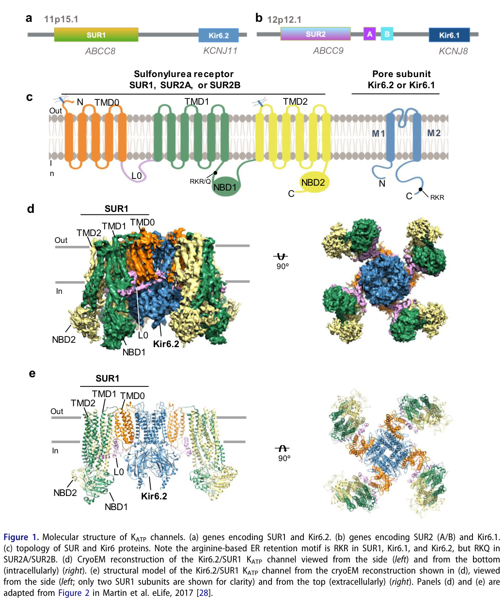

## Question

# Gene Research for Functional Annotation

## ⚠️ CRITICAL: Gene/Protein Identification Context

**BEFORE YOU BEGIN RESEARCH:** You MUST verify you are researching the CORRECT gene/protein. Gene symbols can be ambiguous, especially for less well-characterized genes from non-model organisms.

### Target Gene/Protein Identity (from UniProt):
- **UniProt Accession:** O60706
- **Protein Description:** RecName: Full=ATP-binding cassette sub-family C member 9; AltName: Full=Sulfonylurea receptor 2;
- **Gene Information:** Name=ABCC9; Synonyms=SUR2 {ECO:0000303|PubMed:31575858};
- **Organism (full):** Homo sapiens (Human).
- **Protein Family:** Belongs to the ABC transporter superfamily. ABCC family.
- **Key Domains:** AAA+_ATPase. (IPR003593); ABC1_TM_dom. (IPR011527); ABC1_TM_sf. (IPR036640); ABC_transporter-like_ATP-bd. (IPR003439); ABC_transporter-like_CS. (IPR017871)

### MANDATORY VERIFICATION STEPS:

1. **Check if the gene symbol "ABCC9" matches the protein description above**
2. **Verify the organism is correct:** Homo sapiens (Human).
3. **Check if protein family/domains align with what you find in literature**
4. **If you find literature for a DIFFERENT gene with the same or similar symbol, STOP**

### If Gene Symbol is Ambiguous or You Cannot Find Relevant Literature:

**DO NOT PROCEED WITH RESEARCH ON A DIFFERENT GENE.** Instead:
- State clearly: "The gene symbol 'ABCC9' is ambiguous or literature is limited for this specific protein"
- Explain what you found (e.g., "Found extensive literature on a different gene with the same symbol in a different organism")
- Describe the protein based ONLY on the UniProt information provided above
- Suggest that the protein function can be inferred from domain/family information

### Research Target:

Please provide a comprehensive research report on the gene **ABCC9** (gene ID: ABCC9, UniProt: O60706) in human.

The research report should be a detailed narrative explaining the function, biological processes, and localization of the gene product. Citations should be given for all claims.

You should prioritize authoritative reviews and primary scientific literature when conducting research. You can supplement
this with annotations you find in gene/protein databases, but these can be outdated or inaccurate.

We are specifically interested in the primary function of the gene - for enzymes, what reaction is catalyzed, and what is the substrate specificity? For transporters, what is the substrate? For structural proteins or adapters, what is the broader structural role? For signaling molecules, what is the role in the pathway.

We are interested in where in or outside the cell the gene product carries out its function.

We are also interested in the signaling or biochemical pathways in which the gene functions. We are less interested in broad pleiotropic effects, except where these elucidate the precise role.

Include evidence where possible. We are interested in both experimental evidence as well as inference from structure, evolution, or bioinformatic analysis. Precise studies should be prioritized over high-throughput, where available.

## Output

Question: You are an expert researcher providing comprehensive, well-cited information.

Provide detailed information focusing on:
1. Key concepts and definitions with current understanding
2. Recent developments and latest research (prioritize 2023-2024 sources)
3. Current applications and real-world implementations
4. Expert opinions and analysis from authoritative sources
5. Relevant statistics and data from recent studies

Format as a comprehensive research report with proper citations. Include URLs and publication dates where available.
Always prioritize recent, authoritative sources and provide specific citations for all major claims.

# Gene Research for Functional Annotation

## ⚠️ CRITICAL: Gene/Protein Identification Context

**BEFORE YOU BEGIN RESEARCH:** You MUST verify you are researching the CORRECT gene/protein. Gene symbols can be ambiguous, especially for less well-characterized genes from non-model organisms.

### Target Gene/Protein Identity (from UniProt):
- **UniProt Accession:** O60706
- **Protein Description:** RecName: Full=ATP-binding cassette sub-family C member 9; AltName: Full=Sulfonylurea receptor 2;
- **Gene Information:** Name=ABCC9; Synonyms=SUR2 {ECO:0000303|PubMed:31575858};
- **Organism (full):** Homo sapiens (Human).
- **Protein Family:** Belongs to the ABC transporter superfamily. ABCC family.
- **Key Domains:** AAA+_ATPase. (IPR003593); ABC1_TM_dom. (IPR011527); ABC1_TM_sf. (IPR036640); ABC_transporter-like_ATP-bd. (IPR003439); ABC_transporter-like_CS. (IPR017871)

### MANDATORY VERIFICATION STEPS:

1. **Check if the gene symbol "ABCC9" matches the protein description above**
2. **Verify the organism is correct:** Homo sapiens (Human).
3. **Check if protein family/domains align with what you find in literature**
4. **If you find literature for a DIFFERENT gene with the same or similar symbol, STOP**

### If Gene Symbol is Ambiguous or You Cannot Find Relevant Literature:

**DO NOT PROCEED WITH RESEARCH ON A DIFFERENT GENE.** Instead:
- State clearly: "The gene symbol 'ABCC9' is ambiguous or literature is limited for this specific protein"
- Explain what you found (e.g., "Found extensive literature on a different gene with the same symbol in a different organism")
- Describe the protein based ONLY on the UniProt information provided above
- Suggest that the protein function can be inferred from domain/family information

### Research Target:

Please provide a comprehensive research report on the gene **ABCC9** (gene ID: ABCC9, UniProt: O60706) in human.

The research report should be a detailed narrative explaining the function, biological processes, and localization of the gene product. Citations should be given for all claims.

You should prioritize authoritative reviews and primary scientific literature when conducting research. You can supplement
this with annotations you find in gene/protein databases, but these can be outdated or inaccurate.

We are specifically interested in the primary function of the gene - for enzymes, what reaction is catalyzed, and what is the substrate specificity? For transporters, what is the substrate? For structural proteins or adapters, what is the broader structural role? For signaling molecules, what is the role in the pathway.

We are interested in where in or outside the cell the gene product carries out its function.

We are also interested in the signaling or biochemical pathways in which the gene functions. We are less interested in broad pleiotropic effects, except where these elucidate the precise role.

Include evidence where possible. We are interested in both experimental evidence as well as inference from structure, evolution, or bioinformatic analysis. Precise studies should be prioritized over high-throughput, where available.

# ABCC9 / SUR2 Functional Annotation Report

## Executive conclusion

The requested target is correctly identified. **Human ABCC9** (*ATP-binding cassette subfamily C member 9*; chromosome 12p12.1) encodes **sulfonylurea receptor 2 (SUR2)**, matching the supplied **UniProt accession O60706**. The literature consistently uses ABCC9/SUR2 for this protein and distinguishes it from ABCC8/SUR1; no conflicting gene or nonhuman orthologue was used in this report. ABCC9 belongs structurally to the ABCC branch of the ABC superfamily, but SUR2 is **not a conventional membrane transporter**. It is the regulatory and trafficking subunit of plasma-membrane ATP-sensitive potassium (KATP) channels. The transported species is **K⁺ through the associated Kir6 pore**, not through SUR2 itself. (patton2024dynamicduokir6 pages 1-3, bryan2007abcc8andabcc9 pages 1-2)

## 1. Identity, family and structural organization

ABCC9 encodes two major carboxyl-terminal splice products, **SUR2A and SUR2B**. ABCC9 lies near **KCNJ8**, which encodes Kir6.1, at chromosome 12p12.1. SUR2A and SUR2B share the characteristic sulfonylurea-receptor architecture: an amino-terminal five-helix transmembrane domain (**TMD0**), cytosolic **L0** linker, and an ABC core consisting of two six-helix transmembrane domains (**TMD1 and TMD2**) and two cytosolic nucleotide-binding domains (**NBD1 and NBD2**). This architecture agrees with the supplied ABC-transporter-like ATPase and transmembrane-domain annotations. (bryan2007abcc8andabcc9 pages 1-2, patton2024dynamicduokir6 pages 1-3, patton2024dynamicduokir6 pages 3-4)

The 2024 structural review’s topology and cryo-EM figure directly shows the ABCC9–KCNJ8 genomic pairing, SUR topology, and a central Kir6 tetramer surrounded by SUR subunits. The illustrated atomic channel is SUR1/Kir6.2, but a vascular SUR2B/Kir6.1 cryo-EM structure confirms the shared overall organization. As of that review, a complete SUR2A/Kir6.2 structure had not been reported. (patton2024dynamicduokir6 pages 3-4, patton2024dynamicduokir6 media 19e8f340)

## 2. Primary molecular function

### Channel assembly and membrane trafficking

A functional KATP channel is an **eight-subunit complex containing four Kir6 pore-forming subunits and four SUR regulatory subunits**. SUR2 supports assembly, masks retention/export signals that otherwise retain incomplete complexes in the endoplasmic reticulum, promotes plasma-membrane expression, and allosterically regulates pore opening. Unassembled subunits carry arginine-based retention motifs; SUR2A/B has an RKQ motif rather than the RKR motif of SUR1 and Kir6 proteins. (burke2008thesulfonylureareceptor pages 3-4, patton2024dynamicduokir6 pages 1-3, patton2024dynamicduokir6 pages 3-4)

SUR2 is therefore best annotated as a **ligand-binding regulatory ABC protein for KATP channels**, not as a pump. Its central cavity can bind the Kir6 amino-terminal peptide rather than transporting conventional ABC cargo. Kir6 forms the ion-conduction pathway, and opening causes K⁺ efflux at physiological membrane potentials. (patton2024dynamicduokir6 pages 1-3)

### Nucleotide sensing and gating

KATP channels couple energy metabolism to electrical activity through antagonistic nucleotide control:

* ATP binds an inhibitory site principally on Kir6 and stabilizes channel closure.
* Mg²⁺-complexed ADP, acting through the SUR2 NBDs—particularly NBD2—promotes NBD interaction/dimerization and channel activation, opposing ATP inhibition.
* When the intracellular ATP/ADP ratio is high, closure predominates. During metabolic stress, ATP falls relative to ADP and SUR-dependent activation favors opening.
* Membrane phosphatidylinositol-4,5-bisphosphate, PIP₂, promotes Kir6 opening and antagonizes ATP inhibition. (mcclenaghan2018cantusyndrome–associatedsur2 pages 1-2, bryan2007abcc8andabcc9 pages 1-2, patton2024dynamicduokir6 pages 3-4)

Thus, ABCC9 does not catalyze a conventional substrate-conversion reaction. Its ATPase-like NBD cycle is coupled allosterically to Kir6 gating. The physiological output is regulated **K⁺ conductance**, membrane hyperpolarization, reduced electrical excitability, and altered voltage-dependent Ca²⁺ entry.

## 3. Cellular localization and isoform-specific physiology

The established functional location is the **plasma membrane**, where SUR2-containing KATP channels operate in excitable and contractile cells. Reports of “mitochondrial KATP” should not automatically be annotated as ABCC9/SUR2: the molecular identity of mitochondrial channels remains more contentious than that of surface KATP channels.

### SUR2A: cardiac and skeletal muscle

SUR2A most commonly associates with Kir6.2 in ventricular cardiomyocytes and skeletal muscle. In cardiac muscle, channels are relatively quiet under ordinary energetic conditions but open during ischemia, hypoxia or sustained workload. K⁺ efflux shortens the action potential, limits excitation and contraction, and can reduce Ca²⁺ loading and energy consumption. This supplies a mechanistic basis for stress adaptation and cardioprotection, although excessive opening can abbreviate repolarization and favor arrhythmia. (taskin2024katpchannelsand pages 4-6, patton2024dynamicduokir6 pages 1-3)

Human evidence supports SUR2 as a major cardiac KATP component. Human right-atrial channels were reported to have approximately **75-pS unitary conductance** and intracellular ATP inhibition with **IC₅₀ ≈39 μM**. In RNA-seq from ten human cardiac samples/patients, SUR2 was the dominant SUR transcript and was more abundant in ventricles than other cardiac regions. Kir6.1 transcript abundance was three- to sixfold greater than Kir6.2 in human ventricles, however, indicating that native human channels may be more heterogeneous than the simple Kir6.2/SUR2A textbook model. (taskin2024katpchannelsand pages 4-6)

### SUR2B: vascular and nonvascular smooth muscle

SUR2B predominantly combines with Kir6.1 in vascular and nonvascular smooth muscle. Opening hyperpolarizes the membrane, decreases voltage-gated Ca²⁺ entry and promotes relaxation. These channels consequently regulate **vascular resistance, blood pressure, tissue perfusion, lymphatic propulsion and gastrointestinal contraction**. β-Adrenergic and adenosine/PKA pathways can activate vascular KATP channels, whereas angiotensin-II/PKC signaling can inhibit them. (patton2024dynamicduokir6 pages 1-3, burke2008thesulfonylureareceptor pages 9-10, efthymiou2024novellossoffunctionvariants pages 1-2)

SUR2 expression and KATP currents have also been detected in vascular endothelium, where membrane voltage influences Ca²⁺ influx and nitric-oxide signaling. Proposed functions in brain, bone, hair follicles and fibroblasts are supported by genetic phenotypes and expression evidence but are less precisely resolved than the cardiovascular and muscle roles. (efthymiou2024novellossoffunctionvariants pages 1-2, metwally2024mitochondrialca2+coupledgeneration pages 1-2)

## 4. Pharmacology and current applications

SUR confers sensitivity to both KATP inhibitors and openers. **Sulfonylureas**, including glibenclamide, inhibit KATP channels; drugs in this class are used clinically to inhibit pancreatic Kir6.2/SUR1 and stimulate insulin secretion. **Pinacidil, cromakalim, minoxidil and diazoxide** are channel openers or activators with isoform-dependent actions. Pinacidil was previously used for severe hypertension, but adverse effects such as headache and edema limited its use. Existing inhibitors generally lack sufficient SUR2-over-SUR1 selectivity, creating a hypoglycaemia risk if used to suppress vascular KATP channels. (patton2024dynamicduokir6 pages 1-3, li2024characterizationoffour pages 1-2)

Consequently, current real-world use is primarily **class-level KATP pharmacology**, not precision ABCC9 therapy. Genetic testing for ABCC9 is clinically relevant in suspected Cantú syndrome and recessive AIMS, but no ABCC9-selective medicine is established as standard care.

## 5. Disease mechanisms

### Cantú syndrome: gain of function

Heterozygous gain-of-function variants in ABCC9 cause **Cantú syndrome**, a multisystem disorder characterized by hypertrichosis, coarse facial features, skeletal abnormalities, edema and prominent cardiovascular abnormalities. Mechanistically, variants can stabilize the open state, increase Mg-nucleotide activation or decrease relative ATP inhibition. D207E stabilizes opening, whereas variants around Y981/G985/M1056 and R1150 in experimental SUR2A numbering enhance Mg-nucleotide activation. Some Arg-1150 substitutions also reduce glibenclamide potency, showing that therapeutic response may be genotype dependent. (mcclenaghan2018cantusyndrome–associatedsur2 pages 1-2)

In vascular smooth muscle, excessive Kir6.1/SUR2B opening produces hyperpolarization, reduced Ca²⁺ entry, vasodilation and lower systemic vascular resistance. Cardiac hypertrophy can be secondary to the resulting high-output state rather than solely a cardiomyocyte-autonomous effect. OpenTargets lists ABCC9 associations with Cantú syndrome, dilated cardiomyopathy, familial atrial fibrillation and intellectual-disability/myopathy syndrome, although association databases should be interpreted alongside variant-level functional evidence. (OpenTargets Search: -ABCC9, mcclenaghan2018cantusyndrome–associatedsur2 pages 1-2)

A September 10, 2024 primary study added an endothelial mechanism. In mice carrying endogenous Cantú-associated **Kcnj8 or Abcc9** variants, small mesenteric arteries had severely impaired endothelium-dependent dilation. Excessive KATP activity increased endothelial Ca²⁺ events and mitochondrial Ca²⁺, driving reactive oxygen species and peroxynitrite formation and reducing nitric-oxide bioavailability. Cytosolic or mitochondrial ROS scavenging restored dilation. This is strong mechanistic animal evidence, but it is not yet proof that antioxidant treatment will correct human Cantú vasculopathy. URL: https://doi.org/10.1172/jci.insight.176212. (metwally2024mitochondrialca2+coupledgeneration pages 1-2)

### AIMS: recessive loss of function

Biallelic ABCC9 loss of function causes **ABCC9-related intellectual disability and myopathy syndrome (AIMS; OMIM 619719)**. The founding study identified six affected individuals from two families homozygous for c.1320+1G>A. Exon-8 deletion markedly reduced SUR2 expression, and mutant SUR2A generated neither significant rubidium efflux nor patch-clamp current. Co-expression with wild-type protein did not produce a strong dominant-negative effect, consistent with recessive inheritance. (smeland2019abcc9relatedintellectualdisability pages 5-6)

A *Brain* study published online **January 13, 2024** added **nine subjects from seven unrelated families** with different homozygous truncating or in-frame deletion variants that generated nonfunctional SUR2-dependent channels. Features included psychomotor delay or intellectual disability, microcephaly, corpus-callosum and white-matter abnormalities, seizures, spasticity, short stature, fatigability and weakness. Zebrafish loss of abcc9 increased the motor response to pentylenetetrazole, supporting seizure susceptibility. Heterozygous parents had no conserved phenotype, although multiple intrauterine fetal losses were reported across several families. URL: https://doi.org/10.1093/brain/awae010. (efthymiou2024novellossoffunctionvariants pages 1-2)

Reported associations between individual ABCC9 variants and dilated cardiomyopathy, Brugada syndrome, atrial fibrillation or sudden death require caution. Some are supported by functional assays or animal evidence, but penetrance and variant classification are less secure than the well-established Cantú and AIMS relationships. A historical Val734Ile association with myocardial infarction before age 60 reported a **6.4-fold risk increase**, but such candidate-variant statistics should not be treated as equivalent to modern causal genetic evidence. (subbotina2019functionalcharacterizationof pages 3-4, burke2008thesulfonylureareceptor pages 9-10)

## 6. Major 2024 translational developments

A March 2024 study screened **47,872 compounds** and identified **VU0542270**, an N-aryl-N′-benzyl urea inhibitor of Kir6.1/SUR2B with **IC₅₀ ≈100 nM**. It showed no apparent activity against Kir6.2/SUR1 or several other Kir channels up to 30 μM, corresponding to **greater than 300-fold selectivity**. Subunit swapping localized its action to SUR2. It contracted isolated mouse ductus arteriosus with potency comparable to glibenclamide, providing proof of principle for vascular-selective KATP inhibition. Its short in-vivo half-life and extensive metabolism currently limit direct therapeutic use. URL: https://doi.org/10.1124/molpharm.123.000783. (li2024discoveryandcharacterization pages 1-2)

A subsequent 2024 study described four unrelated inhibitors—VU0212387, VU0543336, VU0605768 and VU0544086—with Kir6.1/SUR2B IC₅₀ values of approximately **0.1–1 μM** and no apparent inhibition of Kir6.2/SUR1 in the primary assays. All acted through SUR2. VU0543336 and VU0212387 paradoxically stimulated Kir6.2/SUR1 at higher concentrations, emphasizing the need for broader concentration- and tissue-level safety testing. Potential applications include chemical probes and leads for Cantú syndrome, patent ductus arteriosus, migraine and sepsis, but these compounds remain preclinical. URL: https://doi.org/10.1080/19336950.2024.2398565. (li2024characterizationoffour pages 1-2)

The following table summarizes the evidence and important caveats.

| Topic | Consensus/current understanding | Best evidence/type | Key quantitative or mechanistic detail | Caveat |
|---|---|---|---|---|
| Identity and family | Human **ABCC9** encodes sulfonylurea receptor 2 (**SUR2**), an atypical ABCC-family ABC protein corresponding to UniProt **O60706**. SUR2 regulates ATP-sensitive potassium channels rather than functioning as a conventional transporter. | 2024 structure–function review; human genetic and functional studies | ABCC9 is paired with KCNJ8 at chromosome **12p12.1** and produces the major splice products SUR2A and SUR2B. | Retrieved literature verifies ABCC9/SUR2 but generally does not state the UniProt accession explicitly; O60706 comes from the supplied target record. |
| Topology and domains | SUR2 contains an N-terminal five-helix **TMD0**, cytosolic **L0** linker, two six-helix ABC-core transmembrane domains (**TMD1/TMD2**), and two cytosolic nucleotide-binding domains (**NBD1/NBD2**). | Cryo-EM-informed review and topology figure | The architecture totals approximately **17 transmembrane helices**; TMD0/L0 interfaces with Kir6, while paired NBDs sense Mg-nucleotides. | Most atomic mechanistic knowledge derives from SUR1/Kir6.2 structures, although SUR2B/Kir6.1 structures support the shared architecture; a complete SUR2A/Kir6.2 structure was not yet reported in the 2024 review. |
| Channel composition and actual transported ion | Functional KATP channels are plasma-membrane **hetero-octamers**: four central Kir6 pore subunits plus four surrounding SUR regulatory subunits. **K⁺**, not an organic ABC-transporter substrate, passes through Kir6; SUR2 has no recognized membrane-transport activity. | Biochemistry, electrophysiology and cryo-EM | Stoichiometry is **4 Kir6:4 SUR**. K⁺ efflux hyperpolarizes the membrane and reduces excitability. SUR also enables assembly, trafficking and gating. | Calling ABCC9 a “transporter” can be misleading: its ABC fold is regulatory, whereas ion permeation occurs through Kir6. |
| Nucleotide gating | The complex converts cellular energy state into membrane conductance. ATP binding at Kir6 inhibits opening; MgADP—and under some conditions MgATP—acting through SUR2 NBDs favors activation and opposes ATP inhibition. | Patch-clamp electrophysiology, mutagenesis and structural analysis | A high ATP/ADP ratio favors closure; a falling ratio during metabolic stress favors opening. MgADP binding, especially at NBD2, promotes NBD interaction or dimerization and allosteric activation. | Exact nucleotide sensitivities depend on Kir6/SUR isoform, tissue environment and assay conditions; SUR is not the principal inhibitory ATP-binding site. |
| SUR2A localization and function | SUR2A is the principal ABCC9 splice form associated with cardiac and skeletal muscle; cardiac ventricular channels are conventionally modeled as Kir6.2/SUR2A. They shorten action potentials during metabolic stress and support adaptation to ischemia or hypoxia. | Human myocyte electrophysiology, heterologous reconstitution and 2024 cardioprotection review | Human right-atrial channels were reported at approximately **75 pS**, with ATP inhibition **IC₅₀ ≈39 μM**. Human cardiac RNA-seq found SUR2 to be the most abundant KATP SUR transcript and higher in ventricles than other regions. | Human ventricular transcript data show more Kir6.1 than expected under the simple Kir6.2/SUR2A model, indicating greater native-channel heterogeneity. |
| SUR2B localization and function | SUR2B predominantly partners with Kir6.1 in vascular and nonvascular smooth muscle, regulating vascular tone, blood pressure, lymph propulsion and intestinal contraction. Endothelial expression has also been reported. | Electrophysiology, expression studies, genetic models and pharmacology | Channel opening hyperpolarizes smooth muscle, decreases voltage-dependent Ca²⁺ entry and promotes relaxation or vasodilation. SUR2A and SUR2B differ at their distal **42 amino acids**. | Subunit combinations vary among vascular beds and species; some tissues may contain mixed Kir6/SUR assemblies. |
| Cantú syndrome gain of function | Heterozygous activating ABCC9 variants cause Cantú syndrome by increasing SUR2-containing KATP activity, producing systemic vascular and multisystem abnormalities. | Human genetics, recombinant electrophysiology and CRISPR knock-in models | Variants can stabilize channel opening, enhance Mg-nucleotide activation or reduce ATP inhibition. R1154Q/R1154W together account for about **30%** of reported patients in one study; some substitutions reduce glibenclamide potency. | Clinical severity and drug response are variant dependent; broad sulfonylureas can inhibit pancreatic SUR1 channels and cause hypoglycaemia. |
| AIMS loss of function | Biallelic ABCC9 loss-of-function variants cause autosomal-recessive ABCC9-related intellectual disability and myopathy syndrome (**AIMS**), with neurodevelopmental, muscular and sometimes cardiac involvement. | Human sequencing, recombinant-channel assays and animal models | The founding report described **6 patients from 2 families** with c.1320+1G>A and nonfunctional SUR2Δ8 channels. A 2024 study added **9 subjects from 7 unrelated families** with homozygous truncating or in-frame deletion variants; complete functional loss was demonstrated. | AIMS remains rare, so penetrance and phenotype frequencies are imprecise. Heterozygous relatives generally lacked a consistent phenotype, although fetal losses were reported in several families. |
| 2024 selective inhibitor development | VU0542270 and four additional chemotypes established that potent inhibition selective for SUR2-containing vascular KATP channels is feasible, creating leads for Cantú syndrome, patent ductus arteriosus, migraine or sepsis research. | High-throughput screening, thallium-flux assays, subunit swapping and vessel myography | Screening **47,872 compounds** identified VU0542270, with Kir6.1/SUR2B **IC₅₀ ≈100 nM**, no apparent Kir6.2/SUR1 activity up to **30 μM**, and **>300-fold selectivity**. Four later inhibitors had IC₅₀ values of approximately **100 nM–1 μM** and acted through SUR2. | These are preclinical chemical probes, not approved ABCC9 therapies. VU0542270 has a short in-vivo half-life, and some later compounds paradoxically stimulated Kir6.2/SUR1 at high concentrations. |
| 2024 endothelial mechanism | In Cantú mouse models, chronic KATP gain of function impaired endothelium-dependent dilation through excessive Ca²⁺ signaling, mitochondrial Ca²⁺ loading, reactive oxygen species and peroxynitrite formation, reducing nitric-oxide bioavailability. | Primary study using endogenous Kcnj8 and Abcc9 knock-in mice, arterial physiology and redox interventions | Small mesenteric-artery vasodilation was markedly impaired; intracellular or mitochondrial ROS scavenging restored endothelium-dependent dilation. Acute pinacidil reproduced enhanced endothelial Ca²⁺ events. | Evidence is mechanistically strong but preclinical; whether the same pathway dominates human Cantú vasculopathy and can be treated safely remains unresolved. |

*Table: Concise synthesis of molecular, physiological, disease and 2024 translational evidence for human ABCC9/O60706 (SUR2). Sources include structural and cardioprotection reviews, primary pharmacology, human AIMS genetics and a Cantú endothelial study. (taskin2024katpchannelsand pages 4-6, mcclenaghan2018cantusyndrome–associatedsur2 pages 1-2, smeland2019abcc9relatedintellectualdisability pages 5-6, efthymiou2024novellossoffunctionvariants pages 1-2, li2024characterizationoffour pages 1-2, metwally2024mitochondrialca2+coupledgeneration pages 1-2, patton2024dynamicduokir6 pages 1-3, patton2024dynamicduokir6 pages 3-4, li2024discoveryandcharacterization pages 1-2, patton2024dynamicduokir6 media 19e8f340)*

## 7. Expert assessment and annotation recommendation

The most defensible functional annotation is:

> **SUR2 is an atypical ABCC-family, Mg-nucleotide-sensing regulatory subunit required for assembly, surface expression, pharmacology and metabolic gating of plasma-membrane KATP channels. It does not itself provide conventional ABC transport. In complex with Kir6.1 or Kir6.2, it couples intracellular ATP/ADP status to K⁺ efflux, membrane potential, Ca²⁺ entry and cellular excitability.**

For localization, annotate the **plasma membrane/KATP-channel complex** as established. Assign SUR2A primarily to cardiac and skeletal muscle and SUR2B primarily to vascular and nonvascular smooth muscle, while noting mixed subunit composition and endothelial expression. Avoid assigning ABCC9 as the molecular substrate-translocating component of mitochondrial KATP without qualification.

For disease annotation, prioritize **dominant gain-of-function Cantú syndrome** and **recessive loss-of-function AIMS**. Cardiomyopathy and arrhythmia associations are biologically plausible and supported in selected cases, but variant-level evidence should be reviewed rather than generalized to every rare ABCC9 allele. The major recent translational advance is not an approved therapy but proof that potent, SUR2-selective inhibition is chemically achievable. (efthymiou2024novellossoffunctionvariants pages 1-2, li2024characterizationoffour pages 1-2, metwally2024mitochondrialca2+coupledgeneration pages 1-2, li2024discoveryandcharacterization pages 1-2)

References

1. (patton2024dynamicduokir6 pages 1-3): Bruce L. Patton, Phillip Zhu, Assmaa ElSheikh, Camden M. Driggers, and Show-Ling Shyng. Dynamic duo: kir6 and sur in katp channel structure and function. Channels, Mar 2024. URL: https://doi.org/10.1080/19336950.2024.2327708, doi:10.1080/19336950.2024.2327708. This article has 21 citations and is from a peer-reviewed journal.

2. (bryan2007abcc8andabcc9 pages 1-2): Joseph Bryan, Alvaro Muñoz, Xinna Zhang, Martina Düfer, Gisela Drews, Peter Krippeit-Drews, and Lydia Aguilar-Bryan. Abcc8 and abcc9: abc transporters that regulate k+ channels. Pflügers Archiv - European Journal of Physiology, 453:703-718, Feb 2007. URL: https://doi.org/10.1007/s00424-006-0116-z, doi:10.1007/s00424-006-0116-z. This article has 212 citations.

3. (patton2024dynamicduokir6 pages 3-4): Bruce L. Patton, Phillip Zhu, Assmaa ElSheikh, Camden M. Driggers, and Show-Ling Shyng. Dynamic duo: kir6 and sur in katp channel structure and function. Channels, Mar 2024. URL: https://doi.org/10.1080/19336950.2024.2327708, doi:10.1080/19336950.2024.2327708. This article has 21 citations and is from a peer-reviewed journal.

4. (patton2024dynamicduokir6 media 19e8f340): Bruce L. Patton, Phillip Zhu, Assmaa ElSheikh, Camden M. Driggers, and Show-Ling Shyng. Dynamic duo: kir6 and sur in katp channel structure and function. Channels, Mar 2024. URL: https://doi.org/10.1080/19336950.2024.2327708, doi:10.1080/19336950.2024.2327708. This article has 21 citations and is from a peer-reviewed journal.

5. (burke2008thesulfonylureareceptor pages 3-4): Michael A. Burke, R. Kannan Mutharasan, and Hossein Ardehali. The sulfonylurea receptor, an atypical atp-binding cassette protein, and its regulation of the katp channel. Circulation Research, 102:164-176, Feb 2008. URL: https://doi.org/10.1161/circresaha.107.165324, doi:10.1161/circresaha.107.165324. This article has 202 citations and is from a highest quality peer-reviewed journal.

6. (mcclenaghan2018cantusyndrome–associatedsur2 pages 1-2): Conor McClenaghan, Alex Hanson, Monica Sala-Rabanal, Helen I. Roessler, Dragana Josifova, Dorothy K. Grange, Gijs van Haaften, and Colin G. Nichols. Cantu syndrome–associated sur2 (abcc9) mutations in distinct structural domains result in katp channel gain-of-function by differential mechanisms. Journal of Biological Chemistry, 293:2041-2052, Feb 2018. URL: https://doi.org/10.1074/jbc.ra117.000351, doi:10.1074/jbc.ra117.000351. This article has 49 citations and is from a domain leading peer-reviewed journal.

7. (taskin2024katpchannelsand pages 4-6): Eylem Taskin, Natalie Samper, Hua-Qian Yang, Tomoe Y. Nakamura, Ravichandran Ramasamy, and William A. Coetzee. Katp channels and cardioprotection. Arhiv za farmaciju, 74 5:625-657, Jan 2024. URL: https://doi.org/10.5937/arhfarm74-51604, doi:10.5937/arhfarm74-51604. This article has 5 citations.

8. (burke2008thesulfonylureareceptor pages 9-10): Michael A. Burke, R. Kannan Mutharasan, and Hossein Ardehali. The sulfonylurea receptor, an atypical atp-binding cassette protein, and its regulation of the katp channel. Circulation Research, 102:164-176, Feb 2008. URL: https://doi.org/10.1161/circresaha.107.165324, doi:10.1161/circresaha.107.165324. This article has 202 citations and is from a highest quality peer-reviewed journal.

9. (efthymiou2024novellossoffunctionvariants pages 1-2): Stephanie Efthymiou, Marcello Scala, Vini Nagaraj, Katarzyna Ochenkowska, Fenne L Komdeur, Robin A Liang, Mohamed S Abdel-Hamid, Tipu Sultan, Tuva Barøy, Marijke Van Ghelue, Barbara Vona, Reza Maroofian, Faisal Zafar, Fowzan S Alkuraya, Maha S Zaki, Mariasavina Severino, Kingsley C Duru, Robert C Tryon, Lin Vigdis Brauteset, Morad Ansari, Mark Hamilton, Mieke M van Haelst, Gijs van Haaften, Federico Zara, Henry Houlden, Éric Samarut, Colin G Nichols, Marie F Smeland, and Conor McClenaghan. Novel loss-of-function variants expand abcc9-related intellectual disability and myopathy syndrome. Brain, 147:1822-1836, Jan 2024. URL: https://doi.org/10.1093/brain/awae010, doi:10.1093/brain/awae010. This article has 19 citations and is from a highest quality peer-reviewed journal.

10. (metwally2024mitochondrialca2+coupledgeneration pages 1-2): Elsayed Metwally, Alfredo Sanchez Solano, Boris Lavanderos, Evan Yamasaki, Pratish Thakore, Conor McClenaghan, Natalia Rios, Rafael Radi, Yumei Feng Earley, Colin G. Nichols, and Scott Earley. Mitochondrial ca2+-coupled generation of reactive oxygen species, peroxynitrite formation, and endothelial dysfunction in cantú syndrome. Aug 2024. URL: https://doi.org/10.1172/jci.insight.176212, doi:10.1172/jci.insight.176212. This article has 17 citations and is from a domain leading peer-reviewed journal.

11. (li2024characterizationoffour pages 1-2): Kangjun Li, Vaishali Satpute Janve, and Jerod Denton. Characterization of four structurally diverse inhibitors of sur2-containing katp channels. Channels, Sep 2024. URL: https://doi.org/10.1080/19336950.2024.2398565, doi:10.1080/19336950.2024.2398565. This article has 5 citations and is from a peer-reviewed journal.

12. (OpenTargets Search: -ABCC9): Open Targets Query (-ABCC9, 5 results). Buniello, A. et al. (2025). Open Targets Platform: facilitating therapeutic hypotheses building in drug discovery. Nucleic Acids Research.

13. (smeland2019abcc9relatedintellectualdisability pages 5-6): Marie F. Smeland, Conor McClenaghan, Helen I. Roessler, Sanne Savelberg, Geir Åsmund Myge Hansen, Helene Hjellnes, Kjell Arne Arntzen, Kai Ivar Müller, Andreas Rosenberger Dybesland, Theresa Harter, Monica Sala-Rabanal, Chris H. Emfinger, Yan Huang, Soma S. Singareddy, Jamie Gunn, David F. Wozniak, Attila Kovacs, Maarten Massink, Federico Tessadori, Sarah M. Kamel, Jeroen Bakkers, Maria S. Remedi, Marijke Van Ghelue, Colin G. Nichols, and Gijs van Haaften. Abcc9-related intellectual disability myopathy syndrome is a katp channelopathy with loss-of-function mutations in abcc9. Nature Communications, Oct 2019. URL: https://doi.org/10.1038/s41467-019-12428-7, doi:10.1038/s41467-019-12428-7. This article has 56 citations and is from a highest quality peer-reviewed journal.

14. (subbotina2019functionalcharacterizationof pages 3-4): Ekaterina Subbotina, Hua-Qian Yang, Ivan Gando, Nori Williams, Barbara A. Sampson, Yingying Tang, and William A. Coetzee. Functional characterization of abcc9 variants identified in sudden unexpected natural death. May 2019. URL: https://doi.org/10.1016/j.forsciint.2019.02.035, doi:10.1016/j.forsciint.2019.02.035. This article has 7 citations and is from a domain leading peer-reviewed journal.

15. (li2024discoveryandcharacterization pages 1-2): Kangjun Li, Samantha J. McClenahan, Changho Han, Joseph D. Bungard, Upendra Rathnayake, Olivier Boutaud, Joshua A. Bauer, Emily L. Days, Craig W. Lindsley, Elaine L. Shelton, and Jerod S. Denton. Discovery and characterization of vu0542270, the first selective inhibitor of vascular kir6.1/sur2b katp channels. Molecular Pharmacology, 105:202-212, Mar 2024. URL: https://doi.org/10.1124/molpharm.123.000783, doi:10.1124/molpharm.123.000783. This article has 10 citations and is from a domain leading peer-reviewed journal.

## Artifacts

- [Edison artifact artifact-00](ABCC9-deep-research-falcon_artifacts/artifact-00.md)

## Citations

1. taskin2024katpchannelsand pages 4-6
2. efthymiou2024novellossoffunctionvariants pages 1-2
3. li2024discoveryandcharacterization pages 1-2
4. li2024characterizationoffour pages 1-2
5. burke2008thesulfonylureareceptor pages 3-4
6. burke2008thesulfonylureareceptor pages 9-10
7. subbotina2019functionalcharacterizationof pages 3-4
8. https://doi.org/10.1172/jci.insight.176212.
9. https://doi.org/10.1093/brain/awae010.
10. https://doi.org/10.1124/molpharm.123.000783.
11. https://doi.org/10.1080/19336950.2024.2398565.
12. https://doi.org/10.1080/19336950.2024.2327708,
13. https://doi.org/10.1007/s00424-006-0116-z,
14. https://doi.org/10.1161/circresaha.107.165324,
15. https://doi.org/10.1074/jbc.ra117.000351,
16. https://doi.org/10.5937/arhfarm74-51604,
17. https://doi.org/10.1093/brain/awae010,
18. https://doi.org/10.1172/jci.insight.176212,
19. https://doi.org/10.1080/19336950.2024.2398565,
20. https://doi.org/10.1038/s41467-019-12428-7,
21. https://doi.org/10.1016/j.forsciint.2019.02.035,
22. https://doi.org/10.1124/molpharm.123.000783,