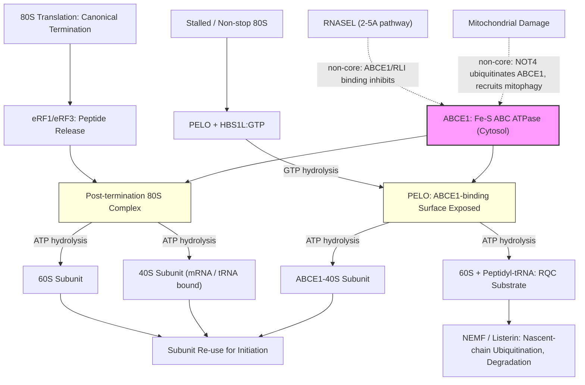

# Pathway Summary for ABCE1

## Overview
ABCE1 is an essential, highly conserved cytosolic Fe-S ABC-family ATPase that functions as the principal eukaryotic ribosome recycling factor [PMID:20122402]. After canonical translation termination, or after PELO/HBS1L recognition of stalled or vacant 80S ribosomes, ABCE1 uses ATP hydrolysis through its tandem ABC nucleotide-binding domains to dissociate post-termination 80S complexes into free 60S subunits and mRNA- and tRNA-bound 40S subunits, coupling translation termination, ribosome-associated quality control (RQC), and re-use of ribosomal subunits for new rounds of initiation [PMID:20122402, PMID:21448132]. Although originally identified as RNase L inhibitor (RLI) of the 2-5A/interferon antiviral pathway [PMID:7539425], ribosome recycling is the conserved core function of ABCE1.

## Core Pathways

### Canonical Post-Termination Ribosome Recycling
After eRF1/eRF3-mediated peptide release, ABCE1 binds ATP and engages the post-termination 80S complex on the 40S side. ATP hydrolysis drives subunit dissociation, releasing the 60S subunit and an mRNA- and deacylated-tRNA-bound 40S subunit that can be re-used for subsequent initiation [PMID:20122402]. Reconstituted eukaryotic systems show that NTP hydrolysis by ABCE1 is stimulated by post-termination complexes and is strictly required for recycling activity [PMID:20122402].

### Rescue of Stalled and Vacant Cytosolic Ribosomes (RQC)
On stalled or non-stop 80S ribosomes, the PELO/HBS1L surveillance complex recognizes the empty A site. After HBS1L hydrolyzes GTP and dissociates, an exposed surface on PELO recruits ABCE1:ATP, and ABCE1 hydrolyzes ATP near the P site to split the 80S ribosome into a free 60S subunit (still bearing peptidyl-tRNA, which is delivered to the downstream RQC pathway) and an ABCE1-bound 40S subunit [Reactome:R-HSA-9954919, Reactome:R-HSA-9955731]. Mammalian biochemistry confirms that PELO and ABCE1 are essential for stalled-elongation-complex dissociation, with HBS1L stimulatory; the same machinery also recycles vacant 80S ribosomes [PMID:21448132].

## Pathway Diagram

## Molecular Architecture
- **N-terminal Fe-S domain**: ferredoxin-like region harboring two [4Fe-4S] clusters that is structurally related to bacterial-type ferredoxins [PMID:20122402]
- **Two ABC nucleotide-binding domains (NBDs)**: arranged by a hinge domain; together they form the composite ATPase that powers ribosome splitting [PMID:20122402]
- **Broad NTPase tolerance in vitro**: ABCE1 hydrolyzes ATP, GTP, UTP, and CTP in reconstituted assays, but ATP hydrolysis is the physiologically relevant cycle for ribosome recycling [PMID:20122402]

## Upstream Inputs
- **Post-termination 80S complexes** (eRF1/eRF3-bound) — substrate for canonical recycling [PMID:20122402]
- **PELO/HBS1L-bound stalled or vacant 80S ribosomes** — substrate for RQC-coupled splitting [PMID:21448132, Reactome:R-HSA-9948299]
- **ATP** — hydrolysis is required for productive splitting [PMID:20122402]

## Downstream Effects
- **Free 40S and 60S subunits available for new rounds of initiation**, sustaining cellular translation capacity [PMID:20122402]
- **Delivery of peptidyl-tRNA-bearing 60S to NEMF/Listerin** for nascent-chain ubiquitination and degradation in the RQC pathway [Reactome:R-HSA-9948299]
- **Quality control of cytosolic translation**, preventing accumulation of stalled or non-stop ribosomes that would otherwise sequester ribosomal subunits and produce aberrant proteins [PMID:21448132]

## Non-Core Contexts
- **2-5A / RNase L antiviral pathway**: ABCE1 (originally cloned as RLI) directly binds RNASEL and inhibits its endoribonuclease activity, antagonizing the interferon-induced 2-5A pathway [PMID:7539425, Reactome:R-HSA-5223305]. This is a specific molecular activity but is secondary to the conserved ribosome-recycling function.
- **Mitochondrial-damage co-translational quality control**: A fraction of ABCE1 localizes to mitochondria [PMID:11585831], and on mitochondrial damage ABCE1 is recruited with PELO and NOT4 to ribosome/mRNP complexes on the mitochondrial outer membrane; NOT4-mediated ubiquitination of ABCE1 generates poly-ubiquitin signals that recruit autophagy receptors and contribute to PINK1-directed mitophagy [PMID:29861391].

## Functional Integration
ABCE1 sits at the integration point between three layers of cytosolic translation control:
1. **Termination → recycling**: turning over post-termination 80S complexes so subunits can re-initiate [PMID:20122402]
2. **Surveillance → splitting**: coupling PELO/HBS1L recognition of aberrant ribosomes to ribosome disassembly that feeds the RQC degradation machinery [PMID:21448132, Reactome:R-HSA-9955731]
3. **Stress signaling**: providing accessory regulatory contacts to RNase L (antiviral) and to damage-associated mitophagy, illustrating how a core housekeeping ATPase can be co-opted for stress-specific responses [PMID:7539425, PMID:29861391]
