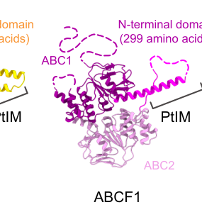

## Question

# Gene Research for Functional Annotation

## ⚠️ CRITICAL: Gene/Protein Identification Context

**BEFORE YOU BEGIN RESEARCH:** You MUST verify you are researching the CORRECT gene/protein. Gene symbols can be ambiguous, especially for less well-characterized genes from non-model organisms.

### Target Gene/Protein Identity (from UniProt):
- **UniProt Accession:** Q9UG63
- **Protein Description:** RecName: Full=ATP-binding cassette sub-family F member 2; AltName: Full=Iron-inhibited ABC transporter 2;
- **Gene Information:** Name=ABCF2; ORFNames=HUSSY-18;
- **Organism (full):** Homo sapiens (Human).
- **Protein Family:** Belongs to the ABC transporter superfamily. ABCF family.
- **Key Domains:** AAA+_ATPase. (IPR003593); ABC_tran_Xtn. (IPR032781); ABC_transporter-like_ATP-bd. (IPR003439); ABC_transporter-like_CS. (IPR017871); ABCF. (IPR050611)

### MANDATORY VERIFICATION STEPS:

1. **Check if the gene symbol "ABCF2" matches the protein description above**
2. **Verify the organism is correct:** Homo sapiens (Human).
3. **Check if protein family/domains align with what you find in literature**
4. **If you find literature for a DIFFERENT gene with the same or similar symbol, STOP**

### If Gene Symbol is Ambiguous or You Cannot Find Relevant Literature:

**DO NOT PROCEED WITH RESEARCH ON A DIFFERENT GENE.** Instead:
- State clearly: "The gene symbol 'ABCF2' is ambiguous or literature is limited for this specific protein"
- Explain what you found (e.g., "Found extensive literature on a different gene with the same symbol in a different organism")
- Describe the protein based ONLY on the UniProt information provided above
- Suggest that the protein function can be inferred from domain/family information

### Research Target:

Please provide a comprehensive research report on the gene **ABCF2** (gene ID: ABCF2, UniProt: Q9UG63) in human.

The research report should be a detailed narrative explaining the function, biological processes, and localization of the gene product. Citations should be given for all claims.

You should prioritize authoritative reviews and primary scientific literature when conducting research. You can supplement
this with annotations you find in gene/protein databases, but these can be outdated or inaccurate.

We are specifically interested in the primary function of the gene - for enzymes, what reaction is catalyzed, and what is the substrate specificity? For transporters, what is the substrate? For structural proteins or adapters, what is the broader structural role? For signaling molecules, what is the role in the pathway.

We are interested in where in or outside the cell the gene product carries out its function.

We are also interested in the signaling or biochemical pathways in which the gene functions. We are less interested in broad pleiotropic effects, except where these elucidate the precise role.

Include evidence where possible. We are interested in both experimental evidence as well as inference from structure, evolution, or bioinformatic analysis. Precise studies should be prioritized over high-throughput, where available.

## Output

Question: You are an expert researcher providing comprehensive, well-cited information.

Provide detailed information focusing on:
1. Key concepts and definitions with current understanding
2. Recent developments and latest research (prioritize 2023-2024 sources)
3. Current applications and real-world implementations
4. Expert opinions and analysis from authoritative sources
5. Relevant statistics and data from recent studies

Format as a comprehensive research report with proper citations. Include URLs and publication dates where available.
Always prioritize recent, authoritative sources and provide specific citations for all major claims.

# Gene Research for Functional Annotation

## ⚠️ CRITICAL: Gene/Protein Identification Context

**BEFORE YOU BEGIN RESEARCH:** You MUST verify you are researching the CORRECT gene/protein. Gene symbols can be ambiguous, especially for less well-characterized genes from non-model organisms.

### Target Gene/Protein Identity (from UniProt):
- **UniProt Accession:** Q9UG63
- **Protein Description:** RecName: Full=ATP-binding cassette sub-family F member 2; AltName: Full=Iron-inhibited ABC transporter 2;
- **Gene Information:** Name=ABCF2; ORFNames=HUSSY-18;
- **Organism (full):** Homo sapiens (Human).
- **Protein Family:** Belongs to the ABC transporter superfamily. ABCF family.
- **Key Domains:** AAA+_ATPase. (IPR003593); ABC_tran_Xtn. (IPR032781); ABC_transporter-like_ATP-bd. (IPR003439); ABC_transporter-like_CS. (IPR017871); ABCF. (IPR050611)

### MANDATORY VERIFICATION STEPS:

1. **Check if the gene symbol "ABCF2" matches the protein description above**
2. **Verify the organism is correct:** Homo sapiens (Human).
3. **Check if protein family/domains align with what you find in literature**
4. **If you find literature for a DIFFERENT gene with the same or similar symbol, STOP**

### If Gene Symbol is Ambiguous or You Cannot Find Relevant Literature:

**DO NOT PROCEED WITH RESEARCH ON A DIFFERENT GENE.** Instead:
- State clearly: "The gene symbol 'ABCF2' is ambiguous or literature is limited for this specific protein"
- Explain what you found (e.g., "Found extensive literature on a different gene with the same symbol in a different organism")
- Describe the protein based ONLY on the UniProt information provided above
- Suggest that the protein function can be inferred from domain/family information

### Research Target:

Please provide a comprehensive research report on the gene **ABCF2** (gene ID: ABCF2, UniProt: Q9UG63) in human.

The research report should be a detailed narrative explaining the function, biological processes, and localization of the gene product. Citations should be given for all claims.

You should prioritize authoritative reviews and primary scientific literature when conducting research. You can supplement
this with annotations you find in gene/protein databases, but these can be outdated or inaccurate.

We are specifically interested in the primary function of the gene - for enzymes, what reaction is catalyzed, and what is the substrate specificity? For transporters, what is the substrate? For structural proteins or adapters, what is the broader structural role? For signaling molecules, what is the role in the pathway.

We are interested in where in or outside the cell the gene product carries out its function.

We are also interested in the signaling or biochemical pathways in which the gene functions. We are less interested in broad pleiotropic effects, except where these elucidate the precise role.

Include evidence where possible. We are interested in both experimental evidence as well as inference from structure, evolution, or bioinformatic analysis. Precise studies should be prioritized over high-throughput, where available.

## Comprehensive research report: human **ABCF2** (UniProt **Q9UG63**) — functional annotation and evidence synthesis

### 1) Key concepts and definitions (current understanding)

#### 1.1. Target verification and nomenclature
ABCF2 (UniProt Q9UG63; gene symbol **ABCF2**; Homo sapiens) is an ATP-binding cassette (ABC) superfamily protein in the **ABCF** subfamily. Unlike canonical ABC **transporters** that couple ATP hydrolysis to substrate translocation across membranes, ABCF proteins are primarily **soluble/cytosolic ABC ATPases** that act on **ribosomes/translation**, rather than as transmembrane pumps. This distinction is emphasized in ABCF-focused reviews that note the ABC_tran_Xtn/PtIM linker has not been associated with transmembrane transport and that ABCF proteins operate as translation factors binding the ribosome (fostier2021abc‐ftranslationfactors pages 4-6, fostier2021abc‐ftranslationfactors pages 1-4).

#### 1.2. ABCF family architecture and mechanistic model
ABCF proteins are described as soluble proteins built around **two tandem ABC nucleotide-binding domains (NBDs)** (ATPase cassettes) connected by a conserved **PtIM (P-site tRNA interaction motif)**-containing linker (also termed ABC_tran_Xtn). Across structurally characterized ABCF proteins, the PtIM forms an α-helical hairpin that can contact peptidyl-tRNA and the peptidyl transferase center (PTC) when the ABCF protein binds the ribosome near the **E site**. The prevailing family-level model is that ATP binding/hydrolysis drives conformational cycling that **modulates translation** (initiation/elongation/termination, rescue of stalled ribosomes, or protection of the PTC from inhibitors) (fostier2021abc‐ftranslationfactors pages 4-6, fostier2021abc‐ftranslationfactors pages 1-4, saha2023decipheringthestructural pages 2-3).

**Important evidence gap for ABCF2 specifically:** while family-level evidence strongly supports that ABCF paralogs are ATP-driven translation factors, the retrieved literature did not include a direct biochemical demonstration (e.g., ribosome-binding assay, ATPase kinetics on ribosome, cryo-EM structure) for **human ABCF2 itself**. Therefore, translation-factor function for ABCF2 should currently be stated as **family-informed inference**, unless additional ABCF2-specific ribosome studies are identified (fostier2021abc‐ftranslationfactors pages 28-30, ousalem2019abcfproteinsin pages 6-10).

#### 1.3. Visual domain/function context for human ABCF proteins
A review figure set provides a schematic of human ABCF protein architectures and E-site ribosome-binding geometry, and summarizes known/proposed roles across ABCF1/2/3 (fostier2021abc‐ftranslationfactors media dd376791, fostier2021abc‐ftranslationfactors media 33fe9305). These visuals support the interpretation that ABCF2 is best conceptualized within the ABCF “translation factor” framework rather than as a membrane transporter.

### 2) Primary function, pathways, and localization for ABCF2 (evidence-weighted)

#### 2.1. Best-supported ABCF2-specific function: modulation of intrinsic (mitochondrial) apoptosis during bacterial infection
The strongest direct functional evidence for human ABCF2 comes from enteropathogenic *E. coli* (EPEC) infection studies showing ABCF2 is a host factor that counteracts mitochondrial apoptosis and is antagonized by a bacterial effector.

**Physical interaction partner (direct): EPEC effector EspF**
Nougayrède et al. (Cellular Microbiology, 2007-03; https://doi.org/10.1111/j.1462-5822.2006.00820.x) identified human ABCF2 as an EspF-binding protein by affinity purification/mass spectrometry and confirmed interaction by yeast two-hybrid and co-immunoprecipitation from infected cells (nougayrede2007enteropathogenicescherichiacoli pages 1-2, nougayrede2007enteropathogenicescherichiacoli pages 2-4).

**Functional consequence:** EspF delivery reduces host ABCF2 levels and promotes caspase activation
Infection reduced cellular ABCF2 levels in an EspF dose-dependent manner, and ABCF2 depletion sensitized cells to caspase activation during infection—consistent with an **anti-apoptotic** role for ABCF2 that EspF counteracts (nougayrede2007enteropathogenicescherichiacoli pages 10-11, nougayrede2007enteropathogenicescherichiacoli pages 7-8).

**Quantitative phenotype (key statistics):**
In HeLa cells, ABCF2 knockdown increased cleaved caspase-9 levels by ~**4-fold** upon infection; ABCF2 knockdown also produced ~**50% more** cleaved caspase-3 after staurosporine treatment. Infection conditions included **MOI 100:1 for 3 h** (nougayrede2007enteropathogenicescherichiacoli pages 7-8).

**Localization in this context:**
The same work describes ABCF2 as primarily **cytoplasmic** with **partial mitochondrial** localization, while EspF is injected into the cytoplasm and sorted to mitochondria—supporting a model in which ABCF2 impacts mitochondrial/intrinsic apoptosis signaling (nougayrede2007enteropathogenicescherichiacoli pages 8-10).

**Mechanistic interpretation (authoritative):**
The EspF–ABCF2 binding event was proposed to inhibit ABCF2’s protective function; the route by which EspF reduces ABCF2 levels (e.g., ubiquitination-mediated degradation) was not resolved in the excerpted evidence (nougayrede2007enteropathogenicescherichiacoli pages 10-11, fostier2021abc‐ftranslationfactors pages 28-30).

#### 2.2. ABCF2 and translation/ribosome pathways: inference from ABCF family biology
ABCF family members are experimentally established ribosome-binding translation factors that bind in similar geometry (E-site) and alter the PTC/tRNA configuration. Reviews highlight that “all biochemically characterized” ABCF proteins participate in protein synthesis and directly interact with ribosomes, with cryo-EM showing conserved binding at the E site and PtIM engagement of P-site tRNA/PTC (fostier2021abc‐ftranslationfactors pages 4-6, fostier2021abc‐ftranslationfactors pages 1-4).

However, for **ABCF2 specifically**, the reviewed texts note links to infection/cancer but state its role is unclear and do not supply ABCF2-specific ribosome-binding experiments (ousalem2019abcfproteinsin pages 6-10). Consequently, the most defensible statement is:
- **ABCF2 is a soluble ABC ATPase with domain architecture characteristic of ribosome-binding translation-factor ABCFs; direct ABCF2 ribosome-binding evidence remains limited in the retrieved set.** (fostier2021abc‐ftranslationfactors pages 28-30, ousalem2019abcfproteinsin pages 6-10)

### 3) Recent developments and latest research (prioritizing 2023–2024)

#### 3.1. 2024: ABCF2 proposed as a host factor for *Pasteurella multocida* adhesion/invasion (preprint)
Wang et al. (bioRxiv, 2024-12; https://doi.org/10.1101/2024.12.03.626657) reported a TurboID proximity-labeling screen that nominated ABCF2 as a host interactor for three *P. multocida* adhesins (PlpE, PtfA, Hsf-2), with validation by co-immunoprecipitation and bio-layer interferometry (wang2024turboidbasedproximitylabeling pages 5-10, wang2024turboidbasedproximitylabeling pages 19-24).

**Functional perturbation:** ABCF2 gain/loss of function altered adhesion/invasion
ABCF2 knockdown/knockout reduced *P. multocida* adherence/invasion, whereas ABCF2 overexpression increased these outcomes (wang2024turboidbasedproximitylabeling pages 1-5).

**Mechanistic signaling:** p38 MAPK and NF-κB regulation; p53-dependent apoptosis
The preprint linked infection-induced ABCF2 upregulation to **p38 MAPK** and **NF-κB** signaling and connected ABCF2 to a **p53-dependent apoptotic pathway** during infection (wang2024turboidbasedproximitylabeling pages 5-10, wang2024turboidbasedproximitylabeling pages 10-14).

**Key quantitative experimental parameters (methods/data context):**
The study reports infection conditions commonly at **MOI = 200**, NF-κB inhibitor **BAY11-7082 (5 μM)**, p38 inhibitor **BIRB796 (40 μM)**, and p53 inhibitor **pifithrin-α (40 μM)**; NF-κB and p38 activation were profiled over multi-hour time courses (wang2024turboidbasedproximitylabeling pages 19-24).

**Cautionary note (expert analysis):** Because this is a preprint and proposes an atypical role (“surface adhesion receptor”) for a protein generally described as cytosolic/soluble in ABCF family literature, this claim should be treated as provisional pending peer review and independent replication (fostier2021abc‐ftranslationfactors pages 4-6, fostier2021abc‐ftranslationfactors pages 1-4, wang2024turboidbasedproximitylabeling pages 5-10).

#### 3.2. 2024: ABCF2 in amino-acid starvation/GCN2 pathway context (negative/indirect evidence)
Tatara et al. (IJMS, 2024-03; https://doi.org/10.3390/ijms25052998) reviewed GCN1/GCN2 biology and discussed ABCF paralogs as candidate orthologs of yeast GCN20. The review states ABCF3 is more similar to GCN20 than ABCF1/ABCF2 and that ABCF3 (not ABCF2) is required as the GCN20 ortholog for amino-acid-starvation–induced GCN2 activation (tatara2024emergingroleof pages 2-4). This weighs against assigning ABCF2 a primary GCN20-like role in the integrated stress response.

### 4) Current applications and real-world implementations

#### 4.1. Host–pathogen interaction research
ABCF2 is used as a host factor in mechanistic studies of bacterial effectors and infection-triggered apoptosis. The EPEC EspF–ABCF2 axis provides a concrete example of how pathogens subvert host apoptotic thresholds by targeting a protective host protein (nougayrede2007enteropathogenicescherichiacoli pages 1-2, nougayrede2007enteropathogenicescherichiacoli pages 7-8).

The 2024 *P. multocida* preprint extends ABCF2 use into adhesion/invasion receptor discovery pipelines using proximity labeling and multi-assay validation (wang2024turboidbasedproximitylabeling pages 5-10, wang2024turboidbasedproximitylabeling pages 19-24).

#### 4.2. Biomarker/discovery context (cancer and complex traits)
While ABCF2 has been discussed in cancer-associated contexts in reviews, the strongest retrieved evidence for ABCF2 concerns infection-apoptosis mechanisms rather than a validated cancer-driver mechanism. Database aggregations (Open Targets) connect ABCF2 to multiple diseases/traits with modest association scores, supporting exploratory biomarker hypothesis generation rather than definitive clinical implementation (OpenTargets Search: -ABCF2).

### 5) Expert opinions and analysis from authoritative sources

#### 5.1. Authoritative consensus on ABCF proteins: translation factors, not transporters
Multiple authoritative reviews converge on the view that ABCF proteins are **ribosome-interacting translation factors** that reshape PTC/tRNA geometry and can perform translation regulation/rescue/protection functions; critically, these reviews distinguish ABCF proteins from membrane ABC exporters and do not treat ABCF proteins as substrate pumps (fostier2021abc‐ftranslationfactors pages 4-6, fostier2021abc‐ftranslationfactors pages 1-4, fostier2021abc‐ftranslationfactors pages 30-33).

#### 5.2. ABCF2-specific annotation confidence
- **High confidence:** ABCF2 can act as an anti-apoptotic host factor in epithelial cells and is directly targeted by EPEC EspF, with quantitative caspase phenotypes (nougayrede2007enteropathogenicescherichiacoli pages 7-8).
- **Moderate confidence:** ABCF2 belongs to a protein family whose members are ATP-driven ribosome/translation factors; thus ABCF2 likely shares aspects of this biology, but ABCF2-specific translation assays were not retrieved here (fostier2021abc‐ftranslationfactors pages 28-30, ousalem2019abcfproteinsin pages 6-10).
- **Low-to-provisional confidence:** ABCF2 acting as a cell-surface adhesion receptor for *P. multocida* is supported by multiple assays in a 2024 preprint but is conceptually in tension with canonical ABCF family localization; this requires independent confirmation (wang2024turboidbasedproximitylabeling pages 5-10).

### 6) Relevant statistics and recent data

Key quantitative/statistical points extracted from primary studies and databases:
- **ABCF2 knockdown** increased infection-associated cleaved **caspase-9 ~4-fold** in HeLa cells (EPEC infection), and increased staurosporine-induced cleaved **caspase-3 ~50%**; infection MOI **100:1 (3 h)** (Nougayrède et al., 2007-03; https://doi.org/10.1111/j.1462-5822.2006.00820.x) (nougayrede2007enteropathogenicescherichiacoli pages 7-8).
- In *P. multocida* infection experiments (preprint), typical infection conditions included **MOI 200**, with pathway inhibitors BAY11-7082 **5 μM** (NF-κB), BIRB796 **40 μM** (p38), and pifithrin-α **40 μM** (p53), alongside time-course profiling of NF-κB and p38 activation (Wang et al., 2024-12; https://doi.org/10.1101/2024.12.03.626657) (wang2024turboidbasedproximitylabeling pages 19-24).
- **Open Targets** lists ABCF2 associations with modest scores (e.g., renal cell carcinoma score ~0.0647; neurodegenerative disease score ~0.1584; abnormality of skeletal system score ~0.2105), with **evidence_size = 3** for each listed disease in the retrieved output (OpenTargets Platform; target ENSG00000033050) (OpenTargets Search: -ABCF2).

### Evidence summary table

| Topic | Key finding | Evidence type | System | Quantitative/statistical details (if any) | Primary citation (DOI URL + year) | PaperQA context citation ID |
|---|---|---|---|---|---|---|
| Function / family context | ABCF2 belongs to the ABC-F family, whose members are soluble ABC ATPases rather than membrane transporters. Family-level reviews state ABC-F proteins lack transmembrane domains, bind the ribosomal E site, and act as translation factors that modulate the peptidyl-transferase center and/or stalled-ribosome states; this supports annotation of human ABCF2 as a non-TMD ATPase with likely translation-related function, but not as a classical transporter. | Review | Cross-species ABC-F family; includes human ABCF paralogs | No ABCF2-specific activity constant reported; qualitative consensus that ABC-F proteins are cytosolic/non-membrane and ribosome-associated | Fostier et al., 2021, https://doi.org/10.1002/1873-3468.13984; Ousalem et al., 2019, https://doi.org/10.1016/j.resmic.2019.09.005; Saha et al., 2023, https://doi.org/10.29011/2577-1515.100225 | (fostier2021abc‐ftranslationfactors pages 4-6, fostier2021abc‐ftranslationfactors pages 1-4, ousalem2019abcfproteinsin pages 6-10, saha2023decipheringthestructural pages 2-3, fostier2021abc‐ftranslationfactors pages 30-33, saha2023decipheringthestructural pages 3-5) |
| Localization / structural inference | Family-level structural summaries indicate ABC-F proteins are cytosolic and bind ribosomes in E-site geometry via tandem ABC domains plus the PtIM/ABC_tran_Xtn linker. For ABCF2 specifically, direct ribosome-binding evidence was not retrieved here, so subcellular localization is best described as inferred cytoplasmic/ribosome-associated rather than definitively proven in the available primary ABCF2 literature. | Review / inference | ABC-F proteins broadly; human ABCF2 by family inference | Qualitative only; no direct ABCF2 localization percentages reported in these family reviews | Fostier et al., 2021, https://doi.org/10.1002/1873-3468.13984; Saha et al., 2023, https://doi.org/10.29011/2577-1515.100225 | (fostier2021abc‐ftranslationfactors pages 4-6, fostier2021abc‐ftranslationfactors pages 1-4, saha2023decipheringthestructural pages 2-3, saha2023decipheringthestructural pages 3-5, fostier2021abc‐ftranslationfactors media dd376791) |
| Pathway / apoptosis / bacterial infection | The strongest direct functional evidence for human ABCF2 is from EPEC infection studies: EspF physically binds ABCF2, lowers host ABCF2 levels, and ABCF2 depletion sensitizes cells to mitochondrial apoptosis. These data support ABCF2 as an anti-apoptotic host factor whose inhibition promotes caspase-9/-3 activation during infection. | Primary research | Human HeLa and Caco-2 cells infected with enteropathogenic E. coli | ABCF2 peptides identified in EspF pull-down (~12.4% coverage); infection experiments used MOI 100:1 for 3 h; ABCF2 siRNA increased cleaved caspase-9 ~4-fold and increased staurosporine-induced cleaved caspase-3 by ~50% versus control | Nougayrède et al., 2007, https://doi.org/10.1111/j.1462-5822.2006.00820.x | (nougayrede2007enteropathogenicescherichiacoli pages 1-2, nougayrede2007enteropathogenicescherichiacoli pages 10-11, nougayrede2007enteropathogenicescherichiacoli pages 8-10, nougayrede2007enteropathogenicescherichiacoli pages 7-8, nougayrede2007enteropathogenicescherichiacoli pages 2-4) |
| Localization in infection context | In the EspF study, ABCF2 was described as primarily cytoplasmic with partial mitochondrial localization, while EspF is type-III-secreted into host cells and traffics to mitochondria. This supports a model in which ABCF2 can influence intrinsic/mitochondrial apoptosis during bacterial pathogenesis. | Primary research | Human epithelial cells during EPEC infection | Qualitative localization; no compartment percentages given in retrieved text | Nougayrède et al., 2007, https://doi.org/10.1111/j.1462-5822.2006.00820.x | (nougayrede2007enteropathogenicescherichiacoli pages 8-10) |
| Disease / pathogen-host interaction | A 2024 preprint proposed ABCF2 as a host adhesion receptor/factor for Pasteurella multocida. TurboID proximity labeling, co-IP, BLI, overexpression, knockdown, and knockout experiments all supported a role for ABCF2 in bacterial adhesion/invasion, extending ABCF2 biology beyond apoptosis to host–pathogen interface functions. | Preprint | Human A549, HEK293T and porcine NPTr cells; mouse infection model | TurboID labeling with 50 μM biotin for 15 min; infections commonly at MOI 200; gentamicin protection 100 μg/mL for 1 h; three replicates; BLI used ABCF2 at 18.75–600 nM | Wang et al., 2024, https://doi.org/10.1101/2024.12.03.626657 | (wang2024turboidbasedproximitylabeling pages 5-10, wang2024turboidbasedproximitylabeling pages 14-19, wang2024turboidbasedproximitylabeling pages 1-5, wang2024turboidbasedproximitylabeling pages 19-24, wang2024turboidbasedproximitylabeling pages 10-14) |
| Pathway / signaling | In the same P. multocida preprint, infection-induced ABCF2 upregulation was linked to p38 MAPK and NF-κB signaling, and ABCF2 was connected to p53-dependent apoptosis. Thus, ABCF2 was placed downstream of infection-triggered stress/inflammatory signaling and upstream of apoptosis-related outputs. | Preprint | Cell culture infection models | P-P65 increased at 6 hpi; BAY11-7082 used at 5 μM; BIRB796 at 40 μM; pifithrin-α at 40 μM; p38 assayed over 0–20 h and NF-κB over 1–12 h | Wang et al., 2024, https://doi.org/10.1101/2024.12.03.626657 | (wang2024turboidbasedproximitylabeling pages 5-10, wang2024turboidbasedproximitylabeling pages 19-24, wang2024turboidbasedproximitylabeling pages 35-37, wang2024turboidbasedproximitylabeling pages 10-14, wang2024turboidbasedproximitylabeling pages 37-38, wang2024turboidbasedproximitylabeling pages 44-45) |
| GCN1/GCN2 / integrated stress response context | Recent review evidence does not support a direct ABCF2 role as the mammalian GCN20-like factor in amino-acid-starvation signaling. Instead, ABCF3 was described as more similar to yeast GCN20, whereas ABCF2 was explicitly noted as less similar and not assigned the GCN20-ortholog function. | Review | Mammalian/yeast comparative signaling context | Qualitative statement only; no effect size reported for ABCF2 | Tatara et al., 2024, https://doi.org/10.3390/ijms25052998 | (tatara2024emergingroleof pages 2-4) |
| Disease associations / database summary | Open Targets links ABCF2 to several diseases/traits, but the scores are modest and do not establish mechanism. Reported associations include renal cell carcinoma, multiple myeloma, smoking initiation, neurodegenerative disease, and abnormality of the skeletal system; each listed disease had evidence_size = 3 in the retrieved output. | Database | Human genetic/biomedical evidence aggregation | Scores: renal cell carcinoma 0.0647; multiple myeloma 0.0602; smoking initiation 0.1037; neurodegenerative disease 0.1584; abnormality of the skeletal system 0.2105; evidence_size = 3 for each listed disease | Open Targets Platform search result for ABCF2 (retrieved in this session), https://platform.opentargets.org/target/ENSG00000033050 | (OpenTargets Search: -ABCF2) |
| Evidence gap / annotation confidence | Despite strong family-level support for an ATPase/ribosome-related role, direct mechanistic evidence for human ABCF2 itself in canonical translation control remains limited in the retrieved literature. The best-supported ABCF2-specific functions currently concern anti-apoptotic activity and bacterial pathogenesis, so any annotation as a ribosome-associated translation factor should be presented as family-informed rather than conclusively ABCF2-specific. | Synthesis across sources | Human ABCF2 | Evidence gap is qualitative but important for functional annotation confidence | Fostier et al., 2021, https://doi.org/10.1002/1873-3468.13984; Ousalem et al., 2019, https://doi.org/10.1016/j.resmic.2019.09.005; Nougayrède et al., 2007, https://doi.org/10.1111/j.1462-5822.2006.00820.x | (fostier2021abc‐ftranslationfactors pages 28-30, ousalem2019abcfproteinsin pages 6-10, nougayrede2007enteropathogenicescherichiacoli pages 1-2) |

*Table: This table summarizes the strongest family-level and ABCF2-specific evidence relevant to functional annotation of human ABCF2 (UniProt Q9UG63). It separates well-supported primary findings from family-based inferences and highlights where recent preprint and database evidence should be interpreted cautiously.*

### 7) Conclusions for functional annotation

1. **Molecular function (most defensible):** ABCF2 is a soluble ABC ATPase-family protein whose family members act as ATP-dependent ribosome/translation factors; ABCF2 itself is best supported experimentally as an **anti-apoptotic host factor** targeted by bacterial effectors, rather than as a membrane transporter with a defined transported substrate (fostier2021abc‐ftranslationfactors pages 4-6, nougayrede2007enteropathogenicescherichiacoli pages 7-8).
2. **Localization:** ABCF2 is described experimentally as primarily **cytoplasmic** with **partial mitochondrial localization** in the EPEC EspF study, consistent with an influence on intrinsic apoptosis (nougayrede2007enteropathogenicescherichiacoli pages 8-10).
3. **Pathways:** The most direct pathway linkage is to **intrinsic (mitochondrial) apoptosis** via caspase-9/caspase-3 modulation during infection; more recent work proposes regulation by **p38 MAPK/NF-κB** and involvement in **p53-dependent apoptosis** in *P. multocida* infection (nougayrede2007enteropathogenicescherichiacoli pages 7-8, wang2024turboidbasedproximitylabeling pages 19-24).
4. **Recent research (2023–2024):** The most ABCF2-relevant updates are a 2024 review clarifying ABCF2 is unlikely to be the mammalian GCN20-like activator of GCN2 (ABCF3 is favored), and a 2024 preprint proposing an adhesion/invasion role in *P. multocida* infection (tatara2024emergingroleof pages 2-4, wang2024turboidbasedproximitylabeling pages 5-10).

### URLs and publication dates (where available)
- Nougayrède et al., Cellular Microbiology — 2007-03 — https://doi.org/10.1111/j.1462-5822.2006.00820.x (nougayrede2007enteropathogenicescherichiacoli pages 1-2)
- Fostier et al., FEBS Letters (review) — 2021-12 — https://doi.org/10.1002/1873-3468.13984 (fostier2021abc‐ftranslationfactors pages 4-6)
- Ousalem et al., Research in Microbiology (review) — 2019-11 — https://doi.org/10.1016/j.resmic.2019.09.005 (ousalem2019abcfproteinsin pages 6-10)
- Tatara et al., International Journal of Molecular Sciences (review) — 2024-03 — https://doi.org/10.3390/ijms25052998 (tatara2024emergingroleof pages 2-4)
- Wang et al., bioRxiv (preprint) — 2024-12 — https://doi.org/10.1101/2024.12.03.626657 (wang2024turboidbasedproximitylabeling pages 1-5)
- Open Targets Platform (target ENSG00000033050 / ABCF2) — URL: https://platform.opentargets.org/target/ENSG00000033050 (retrieved during this session) (OpenTargets Search: -ABCF2)

References

1. (fostier2021abc‐ftranslationfactors pages 4-6): Corentin R. Fostier, Laura Monlezun, Farès Ousalem, Shikha Singh, John F. Hunt, and Grégory Boël. Abc‐f translation factors: from antibiotic resistance to immune response. Dec 2021. URL: https://doi.org/10.1002/1873-3468.13984, doi:10.1002/1873-3468.13984. This article has 50 citations and is from a peer-reviewed journal.

2. (fostier2021abc‐ftranslationfactors pages 1-4): Corentin R. Fostier, Laura Monlezun, Farès Ousalem, Shikha Singh, John F. Hunt, and Grégory Boël. Abc‐f translation factors: from antibiotic resistance to immune response. Dec 2021. URL: https://doi.org/10.1002/1873-3468.13984, doi:10.1002/1873-3468.13984. This article has 50 citations and is from a peer-reviewed journal.

3. (saha2023decipheringthestructural pages 2-3): Chiranjeet Saha, Sujata Saha, Asmita Chakraborty, A. Dirisala, A. Maity, P. Bhowmik, Kunal Sikder, Soumyananda Chakraborti, and A. Basu. Deciphering the structural and functional properties of abc-f atpases. Infectious Diseases Diagnosis &amp; Treatment, Jul 2023. URL: https://doi.org/10.29011/2577-1515.100225, doi:10.29011/2577-1515.100225. This article has 1 citations.

4. (fostier2021abc‐ftranslationfactors pages 28-30): Corentin R. Fostier, Laura Monlezun, Farès Ousalem, Shikha Singh, John F. Hunt, and Grégory Boël. Abc‐f translation factors: from antibiotic resistance to immune response. Dec 2021. URL: https://doi.org/10.1002/1873-3468.13984, doi:10.1002/1873-3468.13984. This article has 50 citations and is from a peer-reviewed journal.

5. (ousalem2019abcfproteinsin pages 6-10): Farès Ousalem, Shikha Singh, Olivier Chesneau, John F. Hunt, and Grégory Boël. Abc-f proteins in mrna translation and antibiotic resistance. Research in Microbiology, 170:435-447, Nov 2019. URL: https://doi.org/10.1016/j.resmic.2019.09.005, doi:10.1016/j.resmic.2019.09.005. This article has 42 citations and is from a peer-reviewed journal.

6. (fostier2021abc‐ftranslationfactors media dd376791): Corentin R. Fostier, Laura Monlezun, Farès Ousalem, Shikha Singh, John F. Hunt, and Grégory Boël. Abc‐f translation factors: from antibiotic resistance to immune response. Dec 2021. URL: https://doi.org/10.1002/1873-3468.13984, doi:10.1002/1873-3468.13984. This article has 50 citations and is from a peer-reviewed journal.

7. (fostier2021abc‐ftranslationfactors media 33fe9305): Corentin R. Fostier, Laura Monlezun, Farès Ousalem, Shikha Singh, John F. Hunt, and Grégory Boël. Abc‐f translation factors: from antibiotic resistance to immune response. Dec 2021. URL: https://doi.org/10.1002/1873-3468.13984, doi:10.1002/1873-3468.13984. This article has 50 citations and is from a peer-reviewed journal.

8. (nougayrede2007enteropathogenicescherichiacoli pages 1-2): Jean-Philippe Nougayrède, Gregory H. Foster, and Michael S. Donnenberg. Enteropathogenic escherichia coli effector espf interacts with host protein abcf2. Cellular Microbiology, 9:680-693, Mar 2007. URL: https://doi.org/10.1111/j.1462-5822.2006.00820.x, doi:10.1111/j.1462-5822.2006.00820.x. This article has 91 citations and is from a peer-reviewed journal.

9. (nougayrede2007enteropathogenicescherichiacoli pages 2-4): Jean-Philippe Nougayrède, Gregory H. Foster, and Michael S. Donnenberg. Enteropathogenic escherichia coli effector espf interacts with host protein abcf2. Cellular Microbiology, 9:680-693, Mar 2007. URL: https://doi.org/10.1111/j.1462-5822.2006.00820.x, doi:10.1111/j.1462-5822.2006.00820.x. This article has 91 citations and is from a peer-reviewed journal.

10. (nougayrede2007enteropathogenicescherichiacoli pages 10-11): Jean-Philippe Nougayrède, Gregory H. Foster, and Michael S. Donnenberg. Enteropathogenic escherichia coli effector espf interacts with host protein abcf2. Cellular Microbiology, 9:680-693, Mar 2007. URL: https://doi.org/10.1111/j.1462-5822.2006.00820.x, doi:10.1111/j.1462-5822.2006.00820.x. This article has 91 citations and is from a peer-reviewed journal.

11. (nougayrede2007enteropathogenicescherichiacoli pages 7-8): Jean-Philippe Nougayrède, Gregory H. Foster, and Michael S. Donnenberg. Enteropathogenic escherichia coli effector espf interacts with host protein abcf2. Cellular Microbiology, 9:680-693, Mar 2007. URL: https://doi.org/10.1111/j.1462-5822.2006.00820.x, doi:10.1111/j.1462-5822.2006.00820.x. This article has 91 citations and is from a peer-reviewed journal.

12. (nougayrede2007enteropathogenicescherichiacoli pages 8-10): Jean-Philippe Nougayrède, Gregory H. Foster, and Michael S. Donnenberg. Enteropathogenic escherichia coli effector espf interacts with host protein abcf2. Cellular Microbiology, 9:680-693, Mar 2007. URL: https://doi.org/10.1111/j.1462-5822.2006.00820.x, doi:10.1111/j.1462-5822.2006.00820.x. This article has 91 citations and is from a peer-reviewed journal.

13. (wang2024turboidbasedproximitylabeling pages 5-10): Fei Wang, Yuyao Shang, Menghan Chen, Zhihao Wang, Hanyuan Liu, Lin Hua, Wentao Li, Huanchun Chen, Qigai He, Bin Wu, and Zhong Peng. Turboid-based proximity labeling discovers abcf2 as an adhesion receptor for the zoonotic pathogen pasteurella multocida. bioRxiv, Dec 2024. URL: https://doi.org/10.1101/2024.12.03.626657, doi:10.1101/2024.12.03.626657. This article has 0 citations.

14. (wang2024turboidbasedproximitylabeling pages 19-24): Fei Wang, Yuyao Shang, Menghan Chen, Zhihao Wang, Hanyuan Liu, Lin Hua, Wentao Li, Huanchun Chen, Qigai He, Bin Wu, and Zhong Peng. Turboid-based proximity labeling discovers abcf2 as an adhesion receptor for the zoonotic pathogen pasteurella multocida. bioRxiv, Dec 2024. URL: https://doi.org/10.1101/2024.12.03.626657, doi:10.1101/2024.12.03.626657. This article has 0 citations.

15. (wang2024turboidbasedproximitylabeling pages 1-5): Fei Wang, Yuyao Shang, Menghan Chen, Zhihao Wang, Hanyuan Liu, Lin Hua, Wentao Li, Huanchun Chen, Qigai He, Bin Wu, and Zhong Peng. Turboid-based proximity labeling discovers abcf2 as an adhesion receptor for the zoonotic pathogen pasteurella multocida. bioRxiv, Dec 2024. URL: https://doi.org/10.1101/2024.12.03.626657, doi:10.1101/2024.12.03.626657. This article has 0 citations.

16. (wang2024turboidbasedproximitylabeling pages 10-14): Fei Wang, Yuyao Shang, Menghan Chen, Zhihao Wang, Hanyuan Liu, Lin Hua, Wentao Li, Huanchun Chen, Qigai He, Bin Wu, and Zhong Peng. Turboid-based proximity labeling discovers abcf2 as an adhesion receptor for the zoonotic pathogen pasteurella multocida. bioRxiv, Dec 2024. URL: https://doi.org/10.1101/2024.12.03.626657, doi:10.1101/2024.12.03.626657. This article has 0 citations.

17. (tatara2024emergingroleof pages 2-4): Yota Tatara, Shuya Kasai, Daichi Kokubu, Tadayuki Tsujita, Junsei Mimura, and Ken Itoh. Emerging role of gcn1 in disease and homeostasis. International Journal of Molecular Sciences, 25:2998, Mar 2024. URL: https://doi.org/10.3390/ijms25052998, doi:10.3390/ijms25052998. This article has 12 citations.

18. (OpenTargets Search: -ABCF2): Open Targets Query (-ABCF2, 5 results). Buniello, A. et al. (2025). Open Targets Platform: facilitating therapeutic hypotheses building in drug discovery. Nucleic Acids Research.

19. (fostier2021abc‐ftranslationfactors pages 30-33): Corentin R. Fostier, Laura Monlezun, Farès Ousalem, Shikha Singh, John F. Hunt, and Grégory Boël. Abc‐f translation factors: from antibiotic resistance to immune response. Dec 2021. URL: https://doi.org/10.1002/1873-3468.13984, doi:10.1002/1873-3468.13984. This article has 50 citations and is from a peer-reviewed journal.

20. (saha2023decipheringthestructural pages 3-5): Chiranjeet Saha, Sujata Saha, Asmita Chakraborty, A. Dirisala, A. Maity, P. Bhowmik, Kunal Sikder, Soumyananda Chakraborti, and A. Basu. Deciphering the structural and functional properties of abc-f atpases. Infectious Diseases Diagnosis &amp; Treatment, Jul 2023. URL: https://doi.org/10.29011/2577-1515.100225, doi:10.29011/2577-1515.100225. This article has 1 citations.

21. (wang2024turboidbasedproximitylabeling pages 14-19): Fei Wang, Yuyao Shang, Menghan Chen, Zhihao Wang, Hanyuan Liu, Lin Hua, Wentao Li, Huanchun Chen, Qigai He, Bin Wu, and Zhong Peng. Turboid-based proximity labeling discovers abcf2 as an adhesion receptor for the zoonotic pathogen pasteurella multocida. bioRxiv, Dec 2024. URL: https://doi.org/10.1101/2024.12.03.626657, doi:10.1101/2024.12.03.626657. This article has 0 citations.

22. (wang2024turboidbasedproximitylabeling pages 35-37): Fei Wang, Yuyao Shang, Menghan Chen, Zhihao Wang, Hanyuan Liu, Lin Hua, Wentao Li, Huanchun Chen, Qigai He, Bin Wu, and Zhong Peng. Turboid-based proximity labeling discovers abcf2 as an adhesion receptor for the zoonotic pathogen pasteurella multocida. bioRxiv, Dec 2024. URL: https://doi.org/10.1101/2024.12.03.626657, doi:10.1101/2024.12.03.626657. This article has 0 citations.

23. (wang2024turboidbasedproximitylabeling pages 37-38): Fei Wang, Yuyao Shang, Menghan Chen, Zhihao Wang, Hanyuan Liu, Lin Hua, Wentao Li, Huanchun Chen, Qigai He, Bin Wu, and Zhong Peng. Turboid-based proximity labeling discovers abcf2 as an adhesion receptor for the zoonotic pathogen pasteurella multocida. bioRxiv, Dec 2024. URL: https://doi.org/10.1101/2024.12.03.626657, doi:10.1101/2024.12.03.626657. This article has 0 citations.

24. (wang2024turboidbasedproximitylabeling pages 44-45): Fei Wang, Yuyao Shang, Menghan Chen, Zhihao Wang, Hanyuan Liu, Lin Hua, Wentao Li, Huanchun Chen, Qigai He, Bin Wu, and Zhong Peng. Turboid-based proximity labeling discovers abcf2 as an adhesion receptor for the zoonotic pathogen pasteurella multocida. bioRxiv, Dec 2024. URL: https://doi.org/10.1101/2024.12.03.626657, doi:10.1101/2024.12.03.626657. This article has 0 citations.

## Artifacts

- [Edison artifact artifact-00](ABCF2-deep-research-falcon_artifacts/artifact-00.md)

## Citations

1. nougayrede2007enteropathogenicescherichiacoli pages 7-8
2. nougayrede2007enteropathogenicescherichiacoli pages 8-10
3. ousalem2019abcfproteinsin pages 6-10
4. wang2024turboidbasedproximitylabeling pages 1-5
5. wang2024turboidbasedproximitylabeling pages 19-24
6. tatara2024emergingroleof pages 2-4
7. wang2024turboidbasedproximitylabeling pages 5-10
8. nougayrede2007enteropathogenicescherichiacoli pages 1-2
9. saha2023decipheringthestructural pages 2-3
10. nougayrede2007enteropathogenicescherichiacoli pages 2-4
11. nougayrede2007enteropathogenicescherichiacoli pages 10-11
12. wang2024turboidbasedproximitylabeling pages 10-14
13. saha2023decipheringthestructural pages 3-5
14. wang2024turboidbasedproximitylabeling pages 14-19
15. wang2024turboidbasedproximitylabeling pages 35-37
16. wang2024turboidbasedproximitylabeling pages 37-38
17. wang2024turboidbasedproximitylabeling pages 44-45
18. https://doi.org/10.1111/j.1462-5822.2006.00820.x
19. https://doi.org/10.1101/2024.12.03.626657
20. https://doi.org/10.3390/ijms25052998
21. https://doi.org/10.1002/1873-3468.13984;
22. https://doi.org/10.1016/j.resmic.2019.09.005;
23. https://doi.org/10.29011/2577-1515.100225
24. https://platform.opentargets.org/target/ENSG00000033050
25. https://doi.org/10.1002/1873-3468.13984
26. https://doi.org/10.1016/j.resmic.2019.09.005
27. https://doi.org/10.1002/1873-3468.13984,
28. https://doi.org/10.29011/2577-1515.100225,
29. https://doi.org/10.1016/j.resmic.2019.09.005,
30. https://doi.org/10.1111/j.1462-5822.2006.00820.x,
31. https://doi.org/10.1101/2024.12.03.626657,
32. https://doi.org/10.3390/ijms25052998,