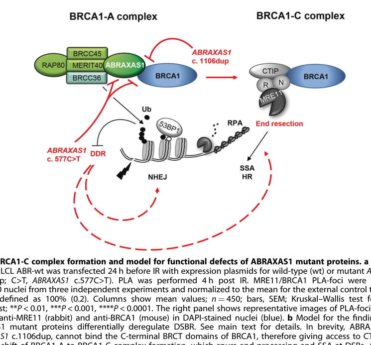

## Question

# Gene Research for Functional Annotation

## ⚠️ CRITICAL: Gene/Protein Identification Context

**BEFORE YOU BEGIN RESEARCH:** You MUST verify you are researching the CORRECT gene/protein. Gene symbols can be ambiguous, especially for less well-characterized genes from non-model organisms.

### Target Gene/Protein Identity (from UniProt):
- **UniProt Accession:** Q6UWZ7
- **Protein Description:** RecName: Full=BRCA1-A complex subunit Abraxas 1 {ECO:0000312|HGNC:HGNC:25829}; AltName: Full=Coiled-coil domain-containing protein 98; AltName: Full=Protein FAM175A;
- **Gene Information:** Name=ABRAXAS1 {ECO:0000312|HGNC:HGNC:25829}; Synonyms=ABRA1 {ECO:0000312|HGNC:HGNC:25829}, CCDC98, FAM175A {ECO:0000312|HGNC:HGNC:25829}; ORFNames=UNQ496/PRO1013;
- **Organism (full):** Homo sapiens (Human).
- **Protein Family:** Belongs to the FAM175 family. Abraxas subfamily.
- **Key Domains:** BRISC_Abraxas1. (IPR023239); FAM175. (IPR023238); MPN. (IPR037518); MPN_2A_DUB_like (PF21125)

### MANDATORY VERIFICATION STEPS:

1. **Check if the gene symbol "ABRAXAS1" matches the protein description above**
2. **Verify the organism is correct:** Homo sapiens (Human).
3. **Check if protein family/domains align with what you find in literature**
4. **If you find literature for a DIFFERENT gene with the same or similar symbol, STOP**

### If Gene Symbol is Ambiguous or You Cannot Find Relevant Literature:

**DO NOT PROCEED WITH RESEARCH ON A DIFFERENT GENE.** Instead:
- State clearly: "The gene symbol 'ABRAXAS1' is ambiguous or literature is limited for this specific protein"
- Explain what you found (e.g., "Found extensive literature on a different gene with the same symbol in a different organism")
- Describe the protein based ONLY on the UniProt information provided above
- Suggest that the protein function can be inferred from domain/family information

### Research Target:

Please provide a comprehensive research report on the gene **ABRAXAS1** (gene ID: ABRAXAS1, UniProt: Q6UWZ7) in human.

The research report should be a detailed narrative explaining the function, biological processes, and localization of the gene product. Citations should be given for all claims.

You should prioritize authoritative reviews and primary scientific literature when conducting research. You can supplement
this with annotations you find in gene/protein databases, but these can be outdated or inaccurate.

We are specifically interested in the primary function of the gene - for enzymes, what reaction is catalyzed, and what is the substrate specificity? For transporters, what is the substrate? For structural proteins or adapters, what is the broader structural role? For signaling molecules, what is the role in the pathway.

We are interested in where in or outside the cell the gene product carries out its function.

We are also interested in the signaling or biochemical pathways in which the gene functions. We are less interested in broad pleiotropic effects, except where these elucidate the precise role.

Include evidence where possible. We are interested in both experimental evidence as well as inference from structure, evolution, or bioinformatic analysis. Precise studies should be prioritized over high-throughput, where available.

## Output

Question: You are an expert researcher providing comprehensive, well-cited information.

Provide detailed information focusing on:
1. Key concepts and definitions with current understanding
2. Recent developments and latest research (prioritize 2023-2024 sources)
3. Current applications and real-world implementations
4. Expert opinions and analysis from authoritative sources
5. Relevant statistics and data from recent studies

Format as a comprehensive research report with proper citations. Include URLs and publication dates where available.
Always prioritize recent, authoritative sources and provide specific citations for all major claims.

# Gene Research for Functional Annotation

## ⚠️ CRITICAL: Gene/Protein Identification Context

**BEFORE YOU BEGIN RESEARCH:** You MUST verify you are researching the CORRECT gene/protein. Gene symbols can be ambiguous, especially for less well-characterized genes from non-model organisms.

### Target Gene/Protein Identity (from UniProt):
- **UniProt Accession:** Q6UWZ7
- **Protein Description:** RecName: Full=BRCA1-A complex subunit Abraxas 1 {ECO:0000312|HGNC:HGNC:25829}; AltName: Full=Coiled-coil domain-containing protein 98; AltName: Full=Protein FAM175A;
- **Gene Information:** Name=ABRAXAS1 {ECO:0000312|HGNC:HGNC:25829}; Synonyms=ABRA1 {ECO:0000312|HGNC:HGNC:25829}, CCDC98, FAM175A {ECO:0000312|HGNC:HGNC:25829}; ORFNames=UNQ496/PRO1013;
- **Organism (full):** Homo sapiens (Human).
- **Protein Family:** Belongs to the FAM175 family. Abraxas subfamily.
- **Key Domains:** BRISC_Abraxas1. (IPR023239); FAM175. (IPR023238); MPN. (IPR037518); MPN_2A_DUB_like (PF21125)

### MANDATORY VERIFICATION STEPS:

1. **Check if the gene symbol "ABRAXAS1" matches the protein description above**
2. **Verify the organism is correct:** Homo sapiens (Human).
3. **Check if protein family/domains align with what you find in literature**
4. **If you find literature for a DIFFERENT gene with the same or similar symbol, STOP**

### If Gene Symbol is Ambiguous or You Cannot Find Relevant Literature:

**DO NOT PROCEED WITH RESEARCH ON A DIFFERENT GENE.** Instead:
- State clearly: "The gene symbol 'ABRAXAS1' is ambiguous or literature is limited for this specific protein"
- Explain what you found (e.g., "Found extensive literature on a different gene with the same symbol in a different organism")
- Describe the protein based ONLY on the UniProt information provided above
- Suggest that the protein function can be inferred from domain/family information

### Research Target:

Please provide a comprehensive research report on the gene **ABRAXAS1** (gene ID: ABRAXAS1, UniProt: Q6UWZ7) in human.

The research report should be a detailed narrative explaining the function, biological processes, and localization of the gene product. Citations should be given for all claims.

You should prioritize authoritative reviews and primary scientific literature when conducting research. You can supplement
this with annotations you find in gene/protein databases, but these can be outdated or inaccurate.

We are specifically interested in the primary function of the gene - for enzymes, what reaction is catalyzed, and what is the substrate specificity? For transporters, what is the substrate? For structural proteins or adapters, what is the broader structural role? For signaling molecules, what is the role in the pathway.

We are interested in where in or outside the cell the gene product carries out its function.

We are also interested in the signaling or biochemical pathways in which the gene functions. We are less interested in broad pleiotropic effects, except where these elucidate the precise role.

Include evidence where possible. We are interested in both experimental evidence as well as inference from structure, evolution, or bioinformatic analysis. Precise studies should be prioritized over high-throughput, where available.

## Comprehensive research report: ABRAXAS1 (UniProt Q6UWZ7; human)

### 0) Gene/protein identity verification (mandatory)
ABRAXAS1 (UniProt Q6UWZ7) is the human protein also known as ABRA1/CCDC98/FAM175A and is the BRCA1-A complex subunit Abraxas 1. Multiple independent sources explicitly match these synonyms and the expected size (~409 aa) and functional motifs/domains (MPN-like N-terminus, NLS around residues 358–361, and C-terminal phospho-SPxF/“SPTF” BRCT-binding motif), confirming the correct target and distinguishing it from its paralog ABRO1/Abraxas2 (which specifies BRISC rather than BRCA1-A). (julius2020brca1aandbrisc pages 1-3, bose2019brca1mislocalizationleads pages 1-3, julius2020brca1aandbrisc pages 3-6)

| Feature | Molecular detail (residues/motif where available) | Functional consequence | Key sources (citation IDs) | URL (if available) |
|---|---|---|---|---|
| Verified identity | Human ABRAXAS1 / ABRA1 / CCDC98 / FAM175A; UniProt Q6UWZ7; ~409 aa scaffold/adaptor | Confirms the target is the BRCA1-A complex subunit Abraxas 1, not the paralog ABRO1/Abraxas2 | (julius2020brca1aandbrisc pages 1-3, bose2019brca1mislocalizationleads pages 1-3) | https://doi.org/10.3390/biom10111503; https://doi.org/10.1093/hmg/ddz252 |
| N-terminal MPN-like domain | JAMM/MPN− domain; aa ~11–121; catalytically inactive due to loss of Zn-binding catalytic configuration | Binds and activates the catalytic MPN+ DUB BRCC36; scaffold role rather than protease activity | (julius2020brca1aandbrisc pages 3-6, kyrieleis2016threedimensionalarchitectureof pages 3-4) | https://doi.org/10.3390/biom10111503; https://doi.org/10.1016/j.celrep.2016.11.063 |
| Coiled-coil region | aa ~206–260 | Supports higher-order assembly/dimerization and contributes to interactions within BRCA1-A; loss with deeper truncation derepresses mutagenic DSBR pathways | (julius2020brca1aandbrisc pages 3-6, sachsenweger2023abraxas1orchestratesbrca1 pages 1-2, sachsenweger2023abraxas1orchestratesbrca1 pages 8-9) | https://doi.org/10.3390/biom10111503; https://doi.org/10.1038/s41419-023-05845-6 |
| Nuclear localization signal (NLS) | aa ~358–361; includes Arg361 | Required for nuclear import of ABRAXAS1/BRCA1-A; R361Q impairs nuclear localization and BRCA1 focus formation | (julius2020brca1aandbrisc pages 3-6, bose2019brca1mislocalizationleads pages 1-3, kliche2024proteomescalecharacterisationof pages 11-13) | https://doi.org/10.3390/biom10111503; https://doi.org/10.1093/hmg/ddz252; https://doi.org/10.1038/s44320-024-00055-4 |
| C-terminal BRCA1-binding motif | pSPxF / SPTF motif at aa ~406–409; S404 damage-inducible, S406 constitutive, terminal F409 critical | Phospho-dependent binding to BRCA1 BRCT domains; drives BRCA1 recruitment/sequestration in BRCA1-A | (julius2020brca1aandbrisc pages 11-13, bose2019brca1mislocalizationleads pages 1-3, sachsenweger2023abraxas1orchestratesbrca1 pages 12-13) | https://doi.org/10.3390/biom10111503; https://doi.org/10.1093/hmg/ddz252; https://doi.org/10.1038/s41419-023-05845-6 |
| BRCC36 interaction | N-terminal scaffold interaction via MPN dimer with BRCC36 | Activates the K63-specific BRCC36 deubiquitinase and organizes the DUB core | (julius2020brca1aandbrisc pages 3-6, julius2020brca1aandbrisc pages 8-11, kyrieleis2016threedimensionalarchitectureof pages 1-3) | https://doi.org/10.3390/biom10111503; https://doi.org/10.1016/j.celrep.2016.11.063 |
| RAP80 integration | ABRAXAS1 C-terminal/unstructured region binds on top of RAP80; RAP80 is constitutive BRCA1-A subunit | Couples BRCA1-A to K63-Ub and SUMO-ubiquitin damage marks at DSB-flanking chromatin | (julius2020brca1aandbrisc pages 3-6, julius2019structuralbasisof pages 10-12) | https://doi.org/10.3390/biom10111503; https://doi.org/10.1016/j.molcel.2019.06.002 |
| BRCA1-A complex membership | Core complex: ABRAXAS1, BRCC36, BRE/BRCC45, MERIT40, RAP80; BRCA1 binds via ABRAXAS1 phospho-tail | Recruits/positions BRCA1-A at DNA damage foci, edits K63-Ub chromatin signals, limits end resection and suppresses excessive HR/SSA | (julius2020brca1aandbrisc pages 1-3, julius2019structuralbasisof pages 10-12, sachsenweger2023abraxas1orchestratesbrca1 pages 1-2) | https://doi.org/10.3390/biom10111503; https://doi.org/10.1016/j.molcel.2019.06.002; https://doi.org/10.1038/s41419-023-05845-6 |
| BRISC distinction | ABRAXAS1 is not the BRISC-specific adaptor; ABRO1/Abraxas2 replaces ABRAXAS1 in BRISC | Explains why ABRAXAS1 is primarily linked to nuclear DNA-damage signaling, whereas BRISC has mostly non-nuclear/immune roles | (julius2020brca1aandbrisc pages 1-3, julius2019structuralbasisof pages 1-3) | https://doi.org/10.3390/biom10111503; https://doi.org/10.1016/j.molcel.2019.06.002 |
| Cellular localization | Predominantly nuclear; nuclear import depends on ABRAXAS1 NLS; BRCA1-A accumulates at DNA repair foci | Ensures BRCA1-A function at chromatin near DSBs; defective localization perturbs DDR and checkpoint control | (julius2020brca1aandbrisc pages 3-6, julius2019structuralbasisof pages 1-3, bose2019brca1mislocalizationleads pages 1-3) | https://doi.org/10.3390/biom10111503; https://doi.org/10.1016/j.molcel.2019.06.002; https://doi.org/10.1093/hmg/ddz252 |
| Structural architecture | BRCA1-A core forms a V-shaped superdimer/dimer-of-heterotetramers with ABRAXAS1-BRCC36 at the base and BRCC45/MERIT40 in the arms | Supports stable assembly, substrate engagement, and efficient K63-linked ubiquitin-chain processing | (kyrieleis2016threedimensionalarchitectureof pages 5-6, kyrieleis2016threedimensionalarchitectureof pages 1-3) | https://doi.org/10.1016/j.celrep.2016.11.063 |
| DUB pathway function | BRCC36 active site is K63-linkage specific; ABRAXAS1 acts as DEUBAD-like adaptor and targeting subunit | Places K63-specific deubiquitination on chromatin at DNA breaks; helps delimit ubiquitin signaling domains around lesions | (julius2020brca1aandbrisc pages 3-6, julius2020brca1aandbrisc pages 8-11, julius2020brca1aandbrisc pages 1-3) | https://doi.org/10.3390/biom10111503 |
| Patient-relevant truncation variants | c.1106dup (p.Ser370Ilefs*2) loses C-terminal BRCA1-binding motif; c.577C>T (p.Arg193*) also lacks BRCC36-interaction region | Shift BRCA1 partitioning from BRCA1-A toward BRCA1-C, increase SSA/MMEJ/NHEJ-associated phenotypes, and destabilize genome maintenance | (sachsenweger2023abraxas1orchestratesbrca1 pages 3-6, sachsenweger2023abraxas1orchestratesbrca1 pages 8-9, sachsenweger2023abraxas1orchestratesbrca1 media db056916) | https://doi.org/10.1038/s41419-023-05845-6 |
| RNA-dependent / RNA-binding evidence | Identified as RNA-dependent protein in A549 cells; direct RNA interaction validated by iCLIP2 | Suggests an additional context-dependent RNA-associated behavior beyond canonical BRCA1-A scaffolding | (rajagopal2022proteomewideidentificationof pages 1-2, rajagopal2022proteomewideidentificationof pages 5-7) | https://doi.org/10.3390/cancers14246109 |

*Table: This table compacts the key domain architecture, binding partners, complex membership, and localization features of human ABRAXAS1 (Q6UWZ7). It is useful as a quick-reference map linking specific motifs and residues to experimentally supported functions and recent disease-relevant findings.*

### 1) Key concepts, definitions, and current understanding

#### 1.1 ABRAXAS1 as a BRCA1-A scaffold/adaptor (not an enzyme)
ABRAXAS1 is best understood as a non-catalytic scaffold/adaptor subunit that organizes and targets the BRCA1-A deubiquitinase (DUB) complex to DNA damage–marked chromatin. In BRCA1-A, ABRAXAS1 assembles with BRCC36 (also called BRCC3), BRE/BRCC45, MERIT40, and RAP80, and then binds BRCA1 via a phospho-dependent interaction between the ABRAXAS1 C-terminus and the BRCA1 BRCT domains. (julius2020brca1aandbrisc pages 1-3, julius2019structuralbasisof pages 10-12, sachsenweger2023abraxas1orchestratesbrca1 pages 1-2)

ABRAXAS1 contains an N-terminal JAMM/MPN-like domain that is catalytically inactive (“MPN−”) and functions as an activator/scaffold for the catalytically active JAMM/MPN+ metalloprotease BRCC36. This is a central definitional point: ABRAXAS1 itself does not catalyze deubiquitination; instead it allosterically activates and positions BRCC36 within a multi-protein machine. (julius2020brca1aandbrisc pages 3-6, kyrieleis2016threedimensionalarchitectureof pages 3-4)

#### 1.2 BRCA1-A vs BRISC: paralog-driven specialization
A key organizing concept in the field is that BRCC36 forms the enzymatic core of two distinct assemblies: (i) BRCA1-A (nuclear, DNA damage–associated) and (ii) BRISC (largely non-nuclear, immune/other signaling contexts). ABRAXAS1 and its paralog ABRO1 partition the shared BRCC36/BRE/MERIT40 core into BRCA1-A versus BRISC, respectively, thus providing targeting and regulatory specialization without changing the catalytic subunit. (julius2020brca1aandbrisc pages 1-3, julius2019structuralbasisof pages 1-3)

#### 1.3 DNA damage recruitment logic and the role of ABRAXAS1 motifs
At DNA double-strand breaks (DSBs), upstream signaling generates K63-linked ubiquitin chains on chromatin (e.g., via RNF8/RNF168 pathway), which are recognized by RAP80 and thereby recruit BRCA1-A to DNA damage foci. ABRAXAS1 is central in this architecture because it integrates RAP80 into BRCA1-A and provides the phosphorylated BRCA1-binding tail. (bose2019brca1mislocalizationleads pages 1-3, julius2019structuralbasisof pages 10-12)

Mechanistically, ABRAXAS1 has:
- A nuclear localization signal (NLS; ~aa 358–361) required for nuclear localization of the BRCA1-A–BRCA1 assembly. (julius2020brca1aandbrisc pages 3-6, bose2019brca1mislocalizationleads pages 1-3)
- A C-terminal phospho-motif (commonly described as pSPxF/SPTF; ~aa 406–409) with phosphorylation sites including S404 (damage-inducible) and S406 (constitutive) that is recognized by BRCA1 BRCT domains, enabling phospho-dependent recruitment/sequestration. (julius2020brca1aandbrisc pages 11-13, bose2019brca1mislocalizationleads pages 1-3)

#### 1.4 BRCA1 sequestration and pathway choice (conceptual model)
Structural and mechanistic work emphasizes that BRCA1-A can sequester BRCA1 in a high-affinity complex via ABRAXAS1’s BRCT-binding phospho-tail, and that BRCA1-A localization to DSB-flanking regions can limit end resection and thereby suppress homologous recombination (HR) under some contexts—conceptually positioning BRCA1-A as a “fine-tuner” of BRCA1 activities and repair pathway choice rather than a simple HR-promoting factor. (julius2020brca1aandbrisc pages 1-3, julius2019structuralbasisof pages 10-12)

### 2) Molecular function and mechanism: structural/biochemical evidence

#### 2.1 Architecture of the BRCA1-A DUB core and ABRAXAS1’s role
Negative-stain EM of a reconstituted human BRCA1-A core complex (Abraxas/BRCC36/BRCC45/MERIT40) supports a V-shaped “superdimer” (dimer of heterotetramers) architecture, with ABRAXAS1/BRCC36 at the base and BRCC45/MERIT40 in the arms. This architecture explains how a scaffold like ABRAXAS1 contributes to stable assembly and productive substrate engagement. (kyrieleis2016threedimensionalarchitectureof pages 1-3, kyrieleis2016threedimensionalarchitectureof pages 5-6)

#### 2.2 Activation and specificity of BRCC36: ABRAXAS1 as a DEUBAD-like adaptor
BRCC36 is a Zn2+-dependent JAMM/MPN metalloprotease and exhibits strict K63-linkage specificity, while ABRAXAS1 (MPN−) acts as a DEUBAD-like adaptor to activate BRCC36 upon assembly. A mechanistic model described in the BRCA1-A/BRISC review proposes that BRCC36 is inactive in isolation (E-loop disorder) and is activated by dimerization with ABRAXAS1 (or ABRO1 in BRISC), which helps position catalytic elements and enables substrate processing. (julius2020brca1aandbrisc pages 8-11, julius2020brca1aandbrisc pages 3-6)

The same review describes additional selectivity features: assembled complexes can show preference for longer K63 chains (≥4 ubiquitins), potentially via accessory ubiquitin-recognition subunits (e.g., BRE and MERIT40), and RAP80 can enhance targeting to mixed SUMO–K63 chains at DNA breaks—helping rationalize context-dependent substrate selection. (julius2020brca1aandbrisc pages 8-11)

#### 2.3 BRCA1 binding avidity and incompatibility with other BRCT partners
Structural work further emphasizes that BRCA1 BRCT binding to an ABRAXAS1 phospho-peptide is mutually incompatible with BRCT interactions with other partners (e.g., CtIP, BACH1), and that the assembled BRCA1-A architecture produces high avidity (nanomolar-range) BRCA1 association. This provides a mechanistic basis for how ABRAXAS1-containing BRCA1-A can restrain BRCA1’s pro-resection activities at breaks. (julius2019structuralbasisof pages 10-12, julius2020brca1aandbrisc pages 11-13)

### 3) Cellular localization
BRCA1-A is described as predominantly nuclear, with ABRAXAS1 providing a nuclear import signal required for nuclear localization of the BRCA1-A–BRCA1 assembly. Disruption of this localization (e.g., NLS variants) leads to reduced BRCA1 nuclear localization and foci formation in patient-derived cells. (julius2020brca1aandbrisc pages 3-6, julius2019structuralbasisof pages 1-3, bose2019brca1mislocalizationleads pages 1-3)

### 4) Recent developments (prioritizing 2023–2024)

#### 4.1 2023: patient-derived mechanistic genetics—truncations rewire BRCA1 complexes and DSBR pathway balance
A 2023 Cell Death & Disease study identified and functionally dissected two truncating germline ABRAXAS1 variants from early-onset breast cancer patients: c.1106dup (p.Ser370Ilefs*2) removing the C-terminal BRCA1-binding SPTF motif, and c.577C>T (p.Arg193*) additionally lacking the BRCC36-interaction region while retaining interaction sites for RAP80/MERIT40/BRCC45. (sachsenweger2023abraxas1orchestratesbrca1 pages 3-6, sachsenweger2023abraxas1orchestratesbrca1 pages 8-9)

Key quantitative findings included:
- Mono-allelic ABRAXAS1 mutation did not impair HR proficiency but de-repressed mutagenic pathways such as single-strand annealing (SSA). (sachsenweger2023abraxas1orchestratesbrca1 pages 3-6, sachsenweger2023abraxas1orchestratesbrca1 pages 8-9)
- Baseline DSBR reporter frequencies were reported (HR 3.7×10−4; NHEJ 3.9×10−3; MMEJ 5.3×10−4; SSA 2.5×10−3), enabling quantitative context for pathway shifts. (sachsenweger2023abraxas1orchestratesbrca1 pages 3-6)
- The c.577C>T variant produced strong constitutive DDR phenotypes: 53BP1 up to 12-fold higher versus one comparator, γH2AX ≥6-fold higher untreated and ≥2-fold post-IR, MRE11 increased ~threefold post-IR (basal ~twofold), and RPA increased ≥twofold post-IR (basal ≥fivefold), alongside increased pRPA32 (~twofold by western). (sachsenweger2023abraxas1orchestratesbrca1 pages 3-6)

Mechanistically, the authors interpret these variants as causing dominant effects on BRCA1 complex partitioning (BRCA1-A vs BRCA1-C) and shifting repair pathway usage toward lower-fidelity repair. (sachsenweger2023abraxas1orchestratesbrca1 pages 1-2, sachsenweger2023abraxas1orchestratesbrca1 pages 8-9)

Two key model figures from this study visually summarize (i) which ABRAXAS1 interaction regions are lost in each truncation and (ii) the proposed pathway-rewiring model for DSB repair choice. (sachsenweger2023abraxas1orchestratesbrca1 media db056916, sachsenweger2023abraxas1orchestratesbrca1 media 2aec6fc2)

#### 4.2 2024: motif-based interactome rewiring—quantitative impact of the R361Q NLS mutation
A 2024 Molecular Systems Biology study used a proteome-scale motif-based interaction approach (GenVar_HD2) and validated that ABRAXAS1 contains a functional NLS disrupted by the R361Q mutation. Quantitatively, the importin/karyopherin interaction affinity weakened about tenfold (wild-type KD = 7.5 μM vs R361Q KD = 75 μM), and the mutant showed more cytoplasmic localization, providing an experimentally tractable molecular explanation consistent with earlier founder-variant cellular phenotypes. (kliche2024proteomescalecharacterisationof pages 11-13)

#### 4.3 2024: chromatin-context dependency screens—BRCA1-A components show euchromatin-associated patterns; ABRAXAS1 trends similarly
A multiplexed chromatin-context dependency study of DSB repair proteins reported that BRCA1-A subunits BRCC36 (BRCC3), RAP80 (UIMC1), and BRE (BABAM2) exhibit N-synergies with euchromatic features, and ABRAXAS1 “shows similar patterns but did not pass the significance threshold.” This suggests ABRAXAS1’s influence on pathway balance may be chromatin-context-dependent and is detectable in large-scale functional screens, even if weaker than other BRCA1-A components. (vergara2024widespreadchromatincontextdependencies pages 7-9)

#### 4.4 2022 (supporting recent directions): RNA-dependent and RNA-binding behavior of ABRAXAS1
A proteome-wide screen for RNA-dependent proteins in A549 lung cancer cells (R-DeeP) identified 1189 RNA-dependent proteins, including ABRAXAS1, and validated ABRAXAS1 RNA dependence by western blot; importantly, the study reports that direct RNA interaction was verified by iCLIP2 for “the mitosis-related protein ABRAXAS1.” This suggests ABRAXAS1 may participate in RNA-associated complexes or RNA-dependent assemblies in some cell contexts, a direction that could broaden functional annotation beyond canonical BRCA1-A scaffolding. (rajagopal2022proteomewideidentificationof pages 1-2, rajagopal2022proteomewideidentificationof pages 5-7)

### 5) Current applications and real-world implementations

#### 5.1 Hereditary cancer genetics and variant interpretation
ABRAXAS1 has clear relevance to hereditary breast cancer genetics through multiple lines of evidence:
- A Finnish founder germline variant c.1082G>A (p.Arg361Gln; R361Q) lies in the ABRAXAS1 NLS and has functional cellular evidence of impaired nuclear localization and reduced BRCA1 and CtIP nuclear foci formation, supporting pathogenic interpretation in a hereditary cancer context. (bose2019brca1mislocalizationleads pages 1-1, bose2019brca1mislocalizationleads pages 1-3)
- A mechanistic summary of this founder variant reports a mean breast cancer onset age of 46 years (range 35–53) in carriers, comparable to reported Finnish BRCA1/BRCA2 carrier onset ages in that source, providing a clinically interpretable statistic linked to ABRAXAS1. (bose2019molecularandfunctional pages 56-59)
- The 2023 truncation study provides functional evidence that heterozygous truncations can exert dominant-negative effects via complex rewiring and increased low-fidelity DSBR pathway usage, implying that ABRAXAS1 variant interpretation should consider pathway balance (SSA/MMEJ/NHEJ derepression) rather than only classic HR loss. (sachsenweger2023abraxas1orchestratesbrca1 pages 1-2, sachsenweger2023abraxas1orchestratesbrca1 pages 3-6)

#### 5.2 Therapeutic interpretation (current limits)
A clinically important negative result from the 2023 truncation study is that heterozygous ABRAXAS1 mutation carriers did not show haploinsufficiency for HR proficiency by several assays and did not show altered PARP-inhibitor sensitivity, despite evidence of mutagenic pathway derepression and DDR abnormalities. This suggests ABRAXAS1 variants may not automatically confer a “BRCA-like” homologous recombination deficiency phenotype in the heterozygous state, limiting immediate extrapolation to PARP inhibitor eligibility based solely on ABRAXAS1 carrier status. (sachsenweger2023abraxas1orchestratesbrca1 pages 1-2, sachsenweger2023abraxas1orchestratesbrca1 pages 8-9)

### 6) Disease associations (database-level summary)
Open Targets reports disease associations for ABRAXAS1 including breast carcinoma/breast cancer, ovarian dysfunction, and inherited cancer-predisposing syndromes, with evidence entries linked to literature and variant records. This supports its placement among cancer predisposition/DDR-associated genes in biomedical databases. (OpenTargets Search: -ABRAXAS1,FAM175A,CCDC98)

### 7) Expert opinions and synthesis (authoritative interpretations)

#### 7.1 ABRAXAS1 as a “functionalizer” of a shared DUB core
A consistent interpretation across high-quality structural work and reviews is that ABRAXAS1 (BRCA1-A) and ABRO1 (BRISC) are subcomplex-specific “functionalizers” of the same BRCC36 DUB core: they determine compartmentalization, recruitment to specific ubiquitin/SUMO marks, and regulatory constraints, while BRCC36 supplies the K63-specific catalytic activity. This adaptor-driven specialization model is central for functional annotation and for reasoning about phenotypes of ABRAXAS1 variants. (julius2020brca1aandbrisc pages 1-3, julius2019structuralbasisof pages 10-12)

#### 7.2 ABRAXAS1 variants: dominant-negative and network-rewiring mechanisms
The recent 2023 patient-derived work emphasizes that truncations lacking the BRCA1-binding C-terminus can retain interaction capacity for other BRCA1-A partners (e.g., RAP80), plausibly allowing dominant complex perturbation rather than simple loss-of-function. This “rewiring” concept helps explain why some heterozygous ABRAXAS1 variants alter pathway choice without producing strong HRD signatures and why functional studies are needed for variant classification. (sachsenweger2023abraxas1orchestratesbrca1 pages 1-2)

### 8) Summary of key functional annotation statements (evidence-weighted)
1. **Primary function:** ABRAXAS1 is a non-enzymatic scaffold/adaptor that assembles and targets the nuclear BRCA1-A complex; it activates and positions the BRCC36 K63-specific deubiquitinase and mediates phospho-dependent binding to BRCA1 BRCT domains. (julius2020brca1aandbrisc pages 3-6, julius2019structuralbasisof pages 10-12)
2. **Primary biological process:** DNA damage response at DSBs, including editing of K63-ubiquitin chromatin signals and modulation of end resection/repair pathway balance through BRCA1 sequestration. (julius2020brca1aandbrisc pages 1-3, julius2019structuralbasisof pages 10-12)
3. **Cellular localization:** Predominantly nuclear (BRCA1-A), dependent on an ABRAXAS1 NLS; NLS variants (R361Q) impair nuclear localization and BRCA1 foci. (julius2020brca1aandbrisc pages 3-6, bose2019brca1mislocalizationleads pages 1-3, kliche2024proteomescalecharacterisationof pages 11-13)
4. **Recent expansions of function:** ABRAXAS1 shows RNA-dependent behavior and direct RNA interaction in iCLIP2 in a cancer cell context, suggesting additional RNA-associated roles or assemblies beyond canonical BRCA1-A. (rajagopal2022proteomewideidentificationof pages 1-2, rajagopal2022proteomewideidentificationof pages 5-7)
5. **Clinical relevance:** Germline variants (founder missense R361Q; truncations) have functional evidence consistent with hereditary breast cancer predisposition mechanisms, though heterozygous truncations may not yield classic HRD/PARP sensitivity phenotypes. (bose2019molecularandfunctional pages 56-59, sachsenweger2023abraxas1orchestratesbrca1 pages 1-2)

### References (URLs and publication dates)
- Kyrieleis OJP et al. *Cell Reports* (Dec 2016). “Three-Dimensional Architecture of the Human BRCA1-A Histone Deubiquitinase Core Complex.” https://doi.org/10.1016/j.celrep.2016.11.063 (kyrieleis2016threedimensionalarchitectureof pages 1-3)
- Rabl J et al. *Molecular Cell* (Aug 2019). “Structural Basis of BRCC36 Function in DNA Repair and Immune Regulation.” https://doi.org/10.1016/j.molcel.2019.06.002 (julius2019structuralbasisof pages 1-3)
- Bose M et al. *Human Molecular Genetics* (Dec 2019). “BRCA1 mislocalization leads to aberrant DNA damage response in heterozygous ABRAXAS1 mutation carrier cells.” https://doi.org/10.1093/hmg/ddz252 (bose2019brca1mislocalizationleads pages 1-3)
- Rabl J. *Biomolecules* (Oct 2020). “BRCA1-A and BRISC: Multifunctional Molecular Machines for Ubiquitin Signaling.” https://doi.org/10.3390/biom10111503 (julius2020brca1aandbrisc pages 1-3)
- Rajagopal V et al. *Cancers (Basel)* (Dec 12, 2022). “Proteome-Wide Identification of RNA-Dependent Proteins in Lung Cancer Cells.” https://doi.org/10.3390/cancers14246109 (rajagopal2022proteomewideidentificationof pages 1-2)
- Sachsenweger J et al. *Cell Death & Disease* (May 2023). “ABRAXAS1 orchestrates BRCA1 activities to counter genome destabilizing repair pathways—lessons from breast cancer patients.” https://doi.org/10.1038/s41419-023-05845-6 (sachsenweger2023abraxas1orchestratesbrca1 pages 8-9)
- Kliche J et al. *Molecular Systems Biology* (Published online Jul 15, 2024). “Proteome-scale characterisation of motif-based interactome rewiring by disease mutations.” https://doi.org/10.1038/s44320-024-00055-4 (kliche2024proteomescalecharacterisationof pages 1-2)
- Vergara X et al. *Nature Communications* (version cited includes bioRxiv DOI; posted Oct 7, 2022; Nat Commun publication listed 2024). “Widespread chromatin context-dependencies of DNA double-strand break repair proteins.” https://doi.org/10.1101/2022.10.07.511243 (vergara2024widespreadchromatincontextdependencies pages 7-9)
- Open Targets Platform (accessed via tool): ABRAXAS1 disease associations. (OpenTargets Search: -ABRAXAS1,FAM175A,CCDC98)

References

1. (julius2020brca1aandbrisc pages 1-3): Julius Rabl. Brca1-a and brisc: multifunctional molecular machines for ubiquitin signaling. Biomolecules, Oct 2020. URL: https://doi.org/10.3390/biom10111503, doi:10.3390/biom10111503. This article has 33 citations.

2. (bose2019brca1mislocalizationleads pages 1-3): Muthiah Bose, Juliane Sachsenweger, Niina Laurila, Ann Christin Parplys, Jonas Willmann, Johannes Jungwirth, Marco Groth, Katrin Rapakko, Pentti Nieminen, Thomas W P Friedl, Lisa Heiserich, Felix Meyer, Hanna Tuppurainen, Hellevi Peltoketo, Heli Nevanlinna, Katri Pylkäs, Kerstin Borgmann, Lisa Wiesmüller, Robert Winqvist, and Helmut Pospiech. Brca1 mislocalization leads to aberrant dna damage response in heterozygous abraxas1 mutation carrier cells. Human molecular genetics, Dec 2019. URL: https://doi.org/10.1093/hmg/ddz252, doi:10.1093/hmg/ddz252. This article has 11 citations and is from a domain leading peer-reviewed journal.

3. (julius2020brca1aandbrisc pages 3-6): Julius Rabl. Brca1-a and brisc: multifunctional molecular machines for ubiquitin signaling. Biomolecules, Oct 2020. URL: https://doi.org/10.3390/biom10111503, doi:10.3390/biom10111503. This article has 33 citations.

4. (kyrieleis2016threedimensionalarchitectureof pages 3-4): Otto J.P. Kyrieleis, Pauline B. McIntosh, Sarah R. Webb, Lesley J. Calder, Janette Lloyd, Nisha A. Patel, Stephen R. Martin, Carol V. Robinson, Peter B. Rosenthal, and Stephen J. Smerdon. Three-dimensional architecture of the human brca1-a histone deubiquitinase core complex. Cell Reports, 17:3099-3106, Dec 2016. URL: https://doi.org/10.1016/j.celrep.2016.11.063, doi:10.1016/j.celrep.2016.11.063. This article has 28 citations and is from a highest quality peer-reviewed journal.

5. (sachsenweger2023abraxas1orchestratesbrca1 pages 1-2): Juliane Sachsenweger, Rebecca Jansche, Tatjana Merk, Benedikt Heitmeir, Miriam Deniz, Ulrike Faust, Cristiana Roggia, Andreas Tzschach, Christopher Schroeder, Angelika Riess, Helmut Pospiech, Hellevi Peltoketo, Katri Pylkäs, Robert Winqvist, and Lisa Wiesmüller. Abraxas1 orchestrates brca1 activities to counter genome destabilizing repair pathways—lessons from breast cancer patients. Cell Death &amp; Disease, May 2023. URL: https://doi.org/10.1038/s41419-023-05845-6, doi:10.1038/s41419-023-05845-6. This article has 10 citations and is from a peer-reviewed journal.

6. (sachsenweger2023abraxas1orchestratesbrca1 pages 8-9): Juliane Sachsenweger, Rebecca Jansche, Tatjana Merk, Benedikt Heitmeir, Miriam Deniz, Ulrike Faust, Cristiana Roggia, Andreas Tzschach, Christopher Schroeder, Angelika Riess, Helmut Pospiech, Hellevi Peltoketo, Katri Pylkäs, Robert Winqvist, and Lisa Wiesmüller. Abraxas1 orchestrates brca1 activities to counter genome destabilizing repair pathways—lessons from breast cancer patients. Cell Death &amp; Disease, May 2023. URL: https://doi.org/10.1038/s41419-023-05845-6, doi:10.1038/s41419-023-05845-6. This article has 10 citations and is from a peer-reviewed journal.

7. (kliche2024proteomescalecharacterisationof pages 11-13): Johanna Kliche, Leandro Simonetti, Izabella Krystkowiak, Hanna Kuss, Marcel Diallo, Emma Rask, Jakob Nilsson, Norman E Davey, and Ylva Ivarsson. Proteome-scale characterisation of motif-based interactome rewiring by disease mutations. Molecular Systems Biology, 20:1025-1048, Jul 2024. URL: https://doi.org/10.1038/s44320-024-00055-4, doi:10.1038/s44320-024-00055-4. This article has 23 citations and is from a highest quality peer-reviewed journal.

8. (julius2020brca1aandbrisc pages 11-13): Julius Rabl. Brca1-a and brisc: multifunctional molecular machines for ubiquitin signaling. Biomolecules, Oct 2020. URL: https://doi.org/10.3390/biom10111503, doi:10.3390/biom10111503. This article has 33 citations.

9. (sachsenweger2023abraxas1orchestratesbrca1 pages 12-13): Juliane Sachsenweger, Rebecca Jansche, Tatjana Merk, Benedikt Heitmeir, Miriam Deniz, Ulrike Faust, Cristiana Roggia, Andreas Tzschach, Christopher Schroeder, Angelika Riess, Helmut Pospiech, Hellevi Peltoketo, Katri Pylkäs, Robert Winqvist, and Lisa Wiesmüller. Abraxas1 orchestrates brca1 activities to counter genome destabilizing repair pathways—lessons from breast cancer patients. Cell Death &amp; Disease, May 2023. URL: https://doi.org/10.1038/s41419-023-05845-6, doi:10.1038/s41419-023-05845-6. This article has 10 citations and is from a peer-reviewed journal.

10. (julius2020brca1aandbrisc pages 8-11): Julius Rabl. Brca1-a and brisc: multifunctional molecular machines for ubiquitin signaling. Biomolecules, Oct 2020. URL: https://doi.org/10.3390/biom10111503, doi:10.3390/biom10111503. This article has 33 citations.

11. (kyrieleis2016threedimensionalarchitectureof pages 1-3): Otto J.P. Kyrieleis, Pauline B. McIntosh, Sarah R. Webb, Lesley J. Calder, Janette Lloyd, Nisha A. Patel, Stephen R. Martin, Carol V. Robinson, Peter B. Rosenthal, and Stephen J. Smerdon. Three-dimensional architecture of the human brca1-a histone deubiquitinase core complex. Cell Reports, 17:3099-3106, Dec 2016. URL: https://doi.org/10.1016/j.celrep.2016.11.063, doi:10.1016/j.celrep.2016.11.063. This article has 28 citations and is from a highest quality peer-reviewed journal.

12. (julius2019structuralbasisof pages 10-12): Julius Rabl, Richard D. Bunker, Andreas D. Schenk, Simone Cavadini, Mark E. Gill, Wassim Abdulrahman, Amparo Andrés-Pons, Martijn S. Luijsterburg, Adel F. M. Ibrahim, Emma Branigan, Jacob D. Aguirre, Aimee H. Marceau, Claire Guérillon, Tewis Bouwmeester, Ulrich Hassiepen, Antoine H.F.M. Peters, Martin Renatus, Laurent Gelman, Seth M. Rubin, Niels Mailand, Haico van Attikum, Ronald T. Hay, and Nicolas H. Thomä. Structural basis of brcc36 function in dna repair and immune regulation. Molecular Cell, 75:483-497.e9, Aug 2019. URL: https://doi.org/10.1016/j.molcel.2019.06.002, doi:10.1016/j.molcel.2019.06.002. This article has 86 citations and is from a highest quality peer-reviewed journal.

13. (julius2019structuralbasisof pages 1-3): Julius Rabl, Richard D. Bunker, Andreas D. Schenk, Simone Cavadini, Mark E. Gill, Wassim Abdulrahman, Amparo Andrés-Pons, Martijn S. Luijsterburg, Adel F. M. Ibrahim, Emma Branigan, Jacob D. Aguirre, Aimee H. Marceau, Claire Guérillon, Tewis Bouwmeester, Ulrich Hassiepen, Antoine H.F.M. Peters, Martin Renatus, Laurent Gelman, Seth M. Rubin, Niels Mailand, Haico van Attikum, Ronald T. Hay, and Nicolas H. Thomä. Structural basis of brcc36 function in dna repair and immune regulation. Molecular Cell, 75:483-497.e9, Aug 2019. URL: https://doi.org/10.1016/j.molcel.2019.06.002, doi:10.1016/j.molcel.2019.06.002. This article has 86 citations and is from a highest quality peer-reviewed journal.

14. (kyrieleis2016threedimensionalarchitectureof pages 5-6): Otto J.P. Kyrieleis, Pauline B. McIntosh, Sarah R. Webb, Lesley J. Calder, Janette Lloyd, Nisha A. Patel, Stephen R. Martin, Carol V. Robinson, Peter B. Rosenthal, and Stephen J. Smerdon. Three-dimensional architecture of the human brca1-a histone deubiquitinase core complex. Cell Reports, 17:3099-3106, Dec 2016. URL: https://doi.org/10.1016/j.celrep.2016.11.063, doi:10.1016/j.celrep.2016.11.063. This article has 28 citations and is from a highest quality peer-reviewed journal.

15. (sachsenweger2023abraxas1orchestratesbrca1 pages 3-6): Juliane Sachsenweger, Rebecca Jansche, Tatjana Merk, Benedikt Heitmeir, Miriam Deniz, Ulrike Faust, Cristiana Roggia, Andreas Tzschach, Christopher Schroeder, Angelika Riess, Helmut Pospiech, Hellevi Peltoketo, Katri Pylkäs, Robert Winqvist, and Lisa Wiesmüller. Abraxas1 orchestrates brca1 activities to counter genome destabilizing repair pathways—lessons from breast cancer patients. Cell Death &amp; Disease, May 2023. URL: https://doi.org/10.1038/s41419-023-05845-6, doi:10.1038/s41419-023-05845-6. This article has 10 citations and is from a peer-reviewed journal.

16. (sachsenweger2023abraxas1orchestratesbrca1 media db056916): Juliane Sachsenweger, Rebecca Jansche, Tatjana Merk, Benedikt Heitmeir, Miriam Deniz, Ulrike Faust, Cristiana Roggia, Andreas Tzschach, Christopher Schroeder, Angelika Riess, Helmut Pospiech, Hellevi Peltoketo, Katri Pylkäs, Robert Winqvist, and Lisa Wiesmüller. Abraxas1 orchestrates brca1 activities to counter genome destabilizing repair pathways—lessons from breast cancer patients. Cell Death &amp; Disease, May 2023. URL: https://doi.org/10.1038/s41419-023-05845-6, doi:10.1038/s41419-023-05845-6. This article has 10 citations and is from a peer-reviewed journal.

17. (rajagopal2022proteomewideidentificationof pages 1-2): Varshni Rajagopal, Astrid-Solveig Loubal, Niklas Engel, Elsa Wassmer, Jeanette Seiler, Oliver Schilling, Maiwen Caudron-Herger, and Sven Diederichs. Proteome-wide identification of rna-dependent proteins in lung cancer cells. Cancers, 14:6109, Dec 2022. URL: https://doi.org/10.3390/cancers14246109, doi:10.3390/cancers14246109. This article has 8 citations.

18. (rajagopal2022proteomewideidentificationof pages 5-7): Varshni Rajagopal, Astrid-Solveig Loubal, Niklas Engel, Elsa Wassmer, Jeanette Seiler, Oliver Schilling, Maiwen Caudron-Herger, and Sven Diederichs. Proteome-wide identification of rna-dependent proteins in lung cancer cells. Cancers, 14:6109, Dec 2022. URL: https://doi.org/10.3390/cancers14246109, doi:10.3390/cancers14246109. This article has 8 citations.

19. (sachsenweger2023abraxas1orchestratesbrca1 media 2aec6fc2): Juliane Sachsenweger, Rebecca Jansche, Tatjana Merk, Benedikt Heitmeir, Miriam Deniz, Ulrike Faust, Cristiana Roggia, Andreas Tzschach, Christopher Schroeder, Angelika Riess, Helmut Pospiech, Hellevi Peltoketo, Katri Pylkäs, Robert Winqvist, and Lisa Wiesmüller. Abraxas1 orchestrates brca1 activities to counter genome destabilizing repair pathways—lessons from breast cancer patients. Cell Death &amp; Disease, May 2023. URL: https://doi.org/10.1038/s41419-023-05845-6, doi:10.1038/s41419-023-05845-6. This article has 10 citations and is from a peer-reviewed journal.

20. (vergara2024widespreadchromatincontextdependencies pages 7-9): Xabier Vergara, Anna G. Manjón, Ben Morris, Ruben Schep, Christ Leemans, Mathijs A. Sanders, Roderick L. Beijersbergen, René H. Medema, and Bas van Steensel. Widespread chromatin context-dependencies of dna double-strand break repair proteins. Nature Communications, Oct 2024. URL: https://doi.org/10.1101/2022.10.07.511243, doi:10.1101/2022.10.07.511243. This article has 25 citations and is from a highest quality peer-reviewed journal.

21. (bose2019brca1mislocalizationleads pages 1-1): Muthiah Bose, Juliane Sachsenweger, Niina Laurila, Ann Christin Parplys, Jonas Willmann, Johannes Jungwirth, Marco Groth, Katrin Rapakko, Pentti Nieminen, Thomas W P Friedl, Lisa Heiserich, Felix Meyer, Hanna Tuppurainen, Hellevi Peltoketo, Heli Nevanlinna, Katri Pylkäs, Kerstin Borgmann, Lisa Wiesmüller, Robert Winqvist, and Helmut Pospiech. Brca1 mislocalization leads to aberrant dna damage response in heterozygous abraxas1 mutation carrier cells. Human molecular genetics, Dec 2019. URL: https://doi.org/10.1093/hmg/ddz252, doi:10.1093/hmg/ddz252. This article has 11 citations and is from a domain leading peer-reviewed journal.

22. (bose2019molecularandfunctional pages 56-59): M Bose. Molecular and functional characterization of abraxas and palb2 genes in hereditary breast cancer predisposition. Unknown journal, 2019.

23. (OpenTargets Search: -ABRAXAS1,FAM175A,CCDC98): Open Targets Query (-ABRAXAS1,FAM175A,CCDC98, 5 results). Buniello, A. et al. (2025). Open Targets Platform: facilitating therapeutic hypotheses building in drug discovery. Nucleic Acids Research.

24. (kliche2024proteomescalecharacterisationof pages 1-2): Johanna Kliche, Leandro Simonetti, Izabella Krystkowiak, Hanna Kuss, Marcel Diallo, Emma Rask, Jakob Nilsson, Norman E Davey, and Ylva Ivarsson. Proteome-scale characterisation of motif-based interactome rewiring by disease mutations. Molecular Systems Biology, 20:1025-1048, Jul 2024. URL: https://doi.org/10.1038/s44320-024-00055-4, doi:10.1038/s44320-024-00055-4. This article has 23 citations and is from a highest quality peer-reviewed journal.

## Artifacts

- [Edison artifact artifact-00](ABRAXAS1-deep-research-falcon_artifacts/artifact-00.md)

## Citations

1. kliche2024proteomescalecharacterisationof pages 11-13
2. vergara2024widespreadchromatincontextdependencies pages 7-9
3. bose2019molecularandfunctional pages 56-59
4. kyrieleis2016threedimensionalarchitectureof pages 1-3
5. julius2019structuralbasisof pages 1-3
6. rajagopal2022proteomewideidentificationof pages 1-2
7. kliche2024proteomescalecharacterisationof pages 1-2
8. kyrieleis2016threedimensionalarchitectureof pages 3-4
9. julius2019structuralbasisof pages 10-12
10. kyrieleis2016threedimensionalarchitectureof pages 5-6
11. rajagopal2022proteomewideidentificationof pages 5-7
12. https://doi.org/10.3390/biom10111503;
13. https://doi.org/10.1093/hmg/ddz252
14. https://doi.org/10.1016/j.celrep.2016.11.063
15. https://doi.org/10.1038/s41419-023-05845-6
16. https://doi.org/10.1093/hmg/ddz252;
17. https://doi.org/10.1038/s44320-024-00055-4
18. https://doi.org/10.1016/j.molcel.2019.06.002
19. https://doi.org/10.1016/j.molcel.2019.06.002;
20. https://doi.org/10.3390/biom10111503
21. https://doi.org/10.3390/cancers14246109
22. https://doi.org/10.1101/2022.10.07.511243
23. https://doi.org/10.3390/biom10111503,
24. https://doi.org/10.1093/hmg/ddz252,
25. https://doi.org/10.1016/j.celrep.2016.11.063,
26. https://doi.org/10.1038/s41419-023-05845-6,
27. https://doi.org/10.1038/s44320-024-00055-4,
28. https://doi.org/10.1016/j.molcel.2019.06.002,
29. https://doi.org/10.3390/cancers14246109,
30. https://doi.org/10.1101/2022.10.07.511243,