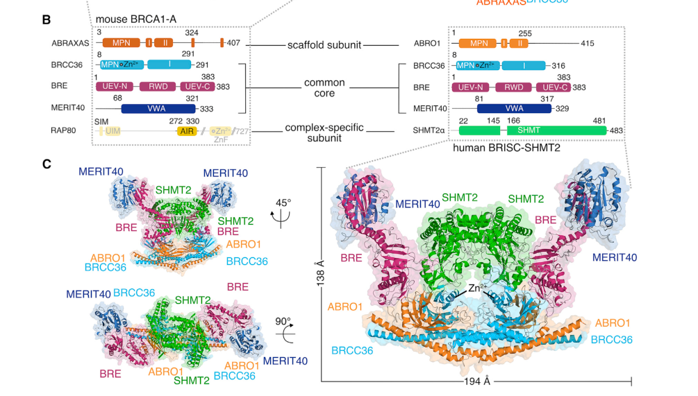

## Question

# Gene Research for Functional Annotation

## ⚠️ CRITICAL: Gene/Protein Identification Context

**BEFORE YOU BEGIN RESEARCH:** You MUST verify you are researching the CORRECT gene/protein. Gene symbols can be ambiguous, especially for less well-characterized genes from non-model organisms.

### Target Gene/Protein Identity (from UniProt):
- **UniProt Accession:** Q15018
- **Protein Description:** RecName: Full=BRISC complex subunit Abraxas 2 {ECO:0000312|HGNC:HGNC:28975}; AltName: Full=Abraxas brother protein 1 {ECO:0000303|PubMed:22974638}; AltName: Full=Protein FAM175B;
- **Gene Information:** Name=ABRAXAS2 {ECO:0000312|HGNC:HGNC:28975}; Synonyms=ABRO1 {ECO:0000303|PubMed:21195082}, FAM175B {ECO:0000312|HGNC:HGNC:28975}, KIAA0157 {ECO:0000303|PubMed:8590280};
- **Organism (full):** Homo sapiens (Human).
- **Protein Family:** Belongs to the FAM175 family. Abro1 subfamily.
- **Key Domains:** BRISC_Abraxas2. (IPR023240); FAM175. (IPR023238); MPN. (IPR037518); MPN_2A_DUB_like (PF21125)

### MANDATORY VERIFICATION STEPS:

1. **Check if the gene symbol "ABRAXAS2" matches the protein description above**
2. **Verify the organism is correct:** Homo sapiens (Human).
3. **Check if protein family/domains align with what you find in literature**
4. **If you find literature for a DIFFERENT gene with the same or similar symbol, STOP**

### If Gene Symbol is Ambiguous or You Cannot Find Relevant Literature:

**DO NOT PROCEED WITH RESEARCH ON A DIFFERENT GENE.** Instead:
- State clearly: "The gene symbol 'ABRAXAS2' is ambiguous or literature is limited for this specific protein"
- Explain what you found (e.g., "Found extensive literature on a different gene with the same symbol in a different organism")
- Describe the protein based ONLY on the UniProt information provided above
- Suggest that the protein function can be inferred from domain/family information

### Research Target:

Please provide a comprehensive research report on the gene **ABRAXAS2** (gene ID: ABRAXAS2, UniProt: Q15018) in human.

The research report should be a detailed narrative explaining the function, biological processes, and localization of the gene product. Citations should be given for all claims.

You should prioritize authoritative reviews and primary scientific literature when conducting research. You can supplement
this with annotations you find in gene/protein databases, but these can be outdated or inaccurate.

We are specifically interested in the primary function of the gene - for enzymes, what reaction is catalyzed, and what is the substrate specificity? For transporters, what is the substrate? For structural proteins or adapters, what is the broader structural role? For signaling molecules, what is the role in the pathway.

We are interested in where in or outside the cell the gene product carries out its function.

We are also interested in the signaling or biochemical pathways in which the gene functions. We are less interested in broad pleiotropic effects, except where these elucidate the precise role.

Include evidence where possible. We are interested in both experimental evidence as well as inference from structure, evolution, or bioinformatic analysis. Precise studies should be prioritized over high-throughput, where available.

## Output

Question: You are an expert researcher providing comprehensive, well-cited information.

Provide detailed information focusing on:
1. Key concepts and definitions with current understanding
2. Recent developments and latest research (prioritize 2023-2024 sources)
3. Current applications and real-world implementations
4. Expert opinions and analysis from authoritative sources
5. Relevant statistics and data from recent studies

Format as a comprehensive research report with proper citations. Include URLs and publication dates where available.
Always prioritize recent, authoritative sources and provide specific citations for all major claims.

# Gene Research for Functional Annotation

## ⚠️ CRITICAL: Gene/Protein Identification Context

**BEFORE YOU BEGIN RESEARCH:** You MUST verify you are researching the CORRECT gene/protein. Gene symbols can be ambiguous, especially for less well-characterized genes from non-model organisms.

### Target Gene/Protein Identity (from UniProt):
- **UniProt Accession:** Q15018
- **Protein Description:** RecName: Full=BRISC complex subunit Abraxas 2 {ECO:0000312|HGNC:HGNC:28975}; AltName: Full=Abraxas brother protein 1 {ECO:0000303|PubMed:22974638}; AltName: Full=Protein FAM175B;
- **Gene Information:** Name=ABRAXAS2 {ECO:0000312|HGNC:HGNC:28975}; Synonyms=ABRO1 {ECO:0000303|PubMed:21195082}, FAM175B {ECO:0000312|HGNC:HGNC:28975}, KIAA0157 {ECO:0000303|PubMed:8590280};
- **Organism (full):** Homo sapiens (Human).
- **Protein Family:** Belongs to the FAM175 family. Abro1 subfamily.
- **Key Domains:** BRISC_Abraxas2. (IPR023240); FAM175. (IPR023238); MPN. (IPR037518); MPN_2A_DUB_like (PF21125)

### MANDATORY VERIFICATION STEPS:

1. **Check if the gene symbol "ABRAXAS2" matches the protein description above**
2. **Verify the organism is correct:** Homo sapiens (Human).
3. **Check if protein family/domains align with what you find in literature**
4. **If you find literature for a DIFFERENT gene with the same or similar symbol, STOP**

### If Gene Symbol is Ambiguous or You Cannot Find Relevant Literature:

**DO NOT PROCEED WITH RESEARCH ON A DIFFERENT GENE.** Instead:
- State clearly: "The gene symbol 'ABRAXAS2' is ambiguous or literature is limited for this specific protein"
- Explain what you found (e.g., "Found extensive literature on a different gene with the same symbol in a different organism")
- Describe the protein based ONLY on the UniProt information provided above
- Suggest that the protein function can be inferred from domain/family information

### Research Target:

Please provide a comprehensive research report on the gene **ABRAXAS2** (gene ID: ABRAXAS2, UniProt: Q15018) in human.

The research report should be a detailed narrative explaining the function, biological processes, and localization of the gene product. Citations should be given for all claims.

You should prioritize authoritative reviews and primary scientific literature when conducting research. You can supplement
this with annotations you find in gene/protein databases, but these can be outdated or inaccurate.

We are specifically interested in the primary function of the gene - for enzymes, what reaction is catalyzed, and what is the substrate specificity? For transporters, what is the substrate? For structural proteins or adapters, what is the broader structural role? For signaling molecules, what is the role in the pathway.

We are interested in where in or outside the cell the gene product carries out its function.

We are also interested in the signaling or biochemical pathways in which the gene functions. We are less interested in broad pleiotropic effects, except where these elucidate the precise role.

Include evidence where possible. We are interested in both experimental evidence as well as inference from structure, evolution, or bioinformatic analysis. Precise studies should be prioritized over high-throughput, where available.

## Comprehensive research report: Human **ABRAXAS2** (ABRO1/FAM175B; UniProt Q15018)

### 0) Identity verification (critical disambiguation)
ABRAXAS2 (also widely referred to as **ABRO1**, **FAM175B**, and **KIAA0157**) encodes the **BRISC complex subunit Abraxas 2** in **Homo sapiens** and belongs to the FAM175 (Abro1) family. In the ubiquitin-signaling literature, **ABRAXAS2/ABRO1** is explicitly distinguished from its paralog **ABRAXAS/FAM175A**, which is the scaffold that defines the nuclear **BRCA1-A** complex; in contrast, ABRAXAS2/ABRO1 defines **BRISC** and mediates BRISC-specific interactions such as binding to SHMT2α. This distinction is consistently made in structural and review sources and is essential to avoid misannotation (https://doi.org/10.1016/j.molcel.2019.06.002, 2019-08; https://doi.org/10.3390/biom10111503, 2020-10) (julius2019structuralbasisof pages 10-12, julius2019structuralbasisof pages 1-3, julius2020brca1aandbrisc pages 1-3).

### 1) Key concepts and definitions (current understanding)

#### 1.1 BRISC vs BRCA1-A: two BRCC36-containing JAMM DUB assemblies
The catalytically active deubiquitinase in both BRISC and BRCA1-A is **BRCC36** (also termed **BRCC3** in some literature), a JAMM/MPN+ metalloprotease-type DUB. Both assemblies share core subunits (BRCC36/BRCC3, BRE, MERIT40) but differ in their defining scaffold: **BRISC uses ABRAXAS2/ABRO1**, whereas **BRCA1-A uses ABRAXAS (FAM175A) and includes RAP80**, enabling BRCA1-A’s DNA damage response functions (https://doi.org/10.1016/j.molcel.2019.06.002, 2019-08; https://doi.org/10.3390/biom10111503, 2020-10) (julius2019structuralbasisof pages 1-3, julius2020brca1aandbrisc pages 11-13).

#### 1.2 What ABRAXAS2 does (molecular role)
ABRAXAS2/ABRO1 is **noncatalytic** and functions as an **MPN− scaffold/activator** subunit. It is required for **assembly-dependent activation** of the catalytic subunit BRCC36: ABRO1 contributes a key scaffold residue (**Asn164**) that helps structure/position BRCC36’s catalytic elements (including the E-loop), enabling robust enzymatic activity in the assembled complex (https://doi.org/10.3390/biom10111503, 2020-10; https://doi.org/10.1016/j.molcel.2019.06.002, 2019-08) (julius2020brca1aandbrisc pages 8-11, julius2019structuralbasisof pages 3-4).

#### 1.3 Enzymatic activity and substrate linkage specificity (what reaction is catalyzed)
ABRAXAS2 is not itself an enzyme; rather, it specifies and activates BRISC’s DUB activity. **BRCC36/BRISC is described as strictly specific for Lys63-linked (K63) ubiquitin chains**, i.e., it catalyzes the hydrolysis of isopeptide bonds in K63-linked polyubiquitin, preferentially cleaving **longer chains (e.g., (Ub)4 and longer)** in biochemical assays (https://doi.org/10.3390/biom10111503, 2020-10; https://doi.org/10.1016/j.molcel.2019.06.002, 2019-08) (julius2020brca1aandbrisc pages 8-11, julius2019structuralbasisof pages 3-4).

### 2) Complex membership, interactors, and structural/biochemical mechanism

#### 2.1 Core complex composition
A structural study reports BRISC as an assembly that can include **two copies each of BRCC36, ABRO1 (ABRAXAS2), BRE, MERIT40, and SHMT2α**, providing direct experimental evidence of ABRAXAS2’s role as a BRISC core subunit and of BRISC–SHMT2 association (https://doi.org/10.1016/j.molcel.2019.06.002, 2019-08) (julius2019structuralbasisof pages 3-4). This architecture is visualized in the BRISC structure figure panels showing the domain organization and assembled complex (julius2019structuralbasisof media c51f4bbd, julius2019structuralbasisof media caaada58).

#### 2.2 ABRAXAS2–SHMT2 interaction and metabolic regulation of BRISC
ABRAXAS2/ABRO1 confers a **specific, high-affinity interaction** between BRISC and the metabolic enzyme **SHMT2α**, which acts as a **protein inhibitor** of BRISC by sterically blocking the BRCC36 active site. The 2020 review summarizes that purified BRISC binds apo-SHMT2α with **low-nanomolar affinity**, and that **PLP binding** (favoring tetrameric SHMT2) can shift the equilibrium and relieve inhibition of BRISC DUB activity (https://doi.org/10.3390/biom10111503, 2020-10; https://doi.org/10.1016/j.molcel.2019.06.002, 2019-08) (julius2020brca1aandbrisc pages 8-11, julius2019structuralbasisof pages 10-12). The BRISC–SHMT2 interaction interface and inhibition mechanism is illustrated in figures focused on SHMT2 binding (julius2019structuralbasisof media c51f4bbd, julius2019structuralbasisof media caaada58).

#### 2.3 Additional reported partners/substrate contexts
The review literature links BRISC (and thus ABRAXAS2) to deubiquitination contexts including **IFNAR1** (type I interferon receptor chain 1), **HIV-1 Tat**, and **JAK2** signaling, where ABRO1’s C-terminal tail contains a phosphotyrosine site (**Y377**) bound by the SH2 domain of **LNK** (https://doi.org/10.3390/biom10111503, 2020-10) (julius2020brca1aandbrisc pages 8-11, julius2020brca1aandbrisc pages 3-6).

### 3) Subcellular localization (where ABRAXAS2 functions)
BRISC is described as present in **both nucleus and cytoplasm**, whereas BRCA1-A is predominantly nuclear and functions at DNA damage sites (https://doi.org/10.1016/j.molcel.2019.06.002, 2019-08) (julius2019structuralbasisof pages 3-4, julius2019structuralbasisof pages 1-3). Quantitative immunofluorescence imaging in the 2019 structural study explicitly assessed endogenous **ABRO1 (ABRAXAS2) and SHMT2** across **nuclear, cytosolic, and mitochondria-associated pools**, supporting multi-compartment localization relevant to SHMT2 biology (julius2019structuralbasisof media c51f4bbd).

### 4) Pathways and biological processes (functional annotation)

#### 4.1 Innate immune signaling and receptor trafficking
A well-supported mechanistic substrate context summarized in the review is that BRISC deubiquitinates **IFNAR1**, which is described as limiting receptor endocytosis/internalization, thereby modulating type I interferon signaling outputs (https://doi.org/10.3390/biom10111503, 2020-10) (julius2020brca1aandbrisc pages 8-11).

#### 4.2 Recent developments (prioritized 2023): NF-κB activation in Kupffer cells and acute liver injury
A 2023 study in *Cell Death & Disease* reports that ABRO1 (ABRAXAS2) is required for optimal activation of **canonical NF-κB signaling** in **LPS-stimulated Kupffer cells (KCs)** and that loss of ABRO1 or BRCC3/BRCC36 protects mice from D-GalN/LPS-induced acute liver injury (https://doi.org/10.1038/s41419-023-06268-z, 2023-11) (zhang2023briscisrequired pages 7-10, zhang2023briscisrequired pages 2-3).

Key mechanistic findings reported include:
- In Abro1−/− KCs, canonical NF-κB readouts are impaired (reduced IκBα phosphorylation/degradation and reduced p65 phosphorylation), while MAPK signaling (JNK/ERK1/2/p38) is not substantially affected (zhang2023briscisrequired pages 7-10).
- Abro1−/− KCs show reduced NF-κB functional outputs including NF-κB reporter activity, p65 nuclear translocation, and NF-κB DNA binding (zhang2023briscisrequired pages 7-10).

Quantitative in vivo inflammatory outputs include:
- At **1 hour** after D-GalN/LPS challenge, **serum TNF-α** and **hepatic TNF-α** are decreased by **48.5%** and **45.5%**, respectively, in Abro1−/− mice (zhang2023briscisrequired pages 3-6).
- A lethal D-GalN/LPS dose caused **100% mortality in WT within 8 h**, while **>70%** of Abro1−/− (and Brcc3−/−) mice survived long-term (zhang2023briscisrequired pages 2-3).

The study further reports reduced KC proinflammatory cytokine/chemokine production (including TNF-α, IL-6, IL-1β, MCP-1, and others) and identifies KCs as key effector cells via bone marrow chimera and cell-specific deletion approaches (zhang2023briscisrequired pages 6-7, zhang2023briscisrequired pages 3-6).

#### 4.3 Inflammasome (NLRP3) context
The 2023 paper also notes BRISC involvement in **IFNAR1** and **NLRP3 inflammasome** activation in hepatic macrophages, consistent with prior literature placing BRISC in innate immune regulation; in this context ABRO1 is described as recruiting BRISC to NLRP3 for deubiquitination to promote inflammasome activation (zhang2023briscisrequired pages 7-10, zhang2023briscisrequired pages 2-3).

### 5) Current applications and real-world implementations

#### 5.1 Preclinical pharmacologic targeting of BRISC (proof-of-concept)
Zhang et al. (2023) report that **thiolutin**, described as a potent BRISC inhibitor in the study, markedly alleviated D-GalN/LPS-induced acute liver injury and improved survival; mechanistically, exogenous TNF-α (**15 μg/kg**) abolished thiolutin’s protective effect, supporting TNF-α suppression as a key component of the observed benefit (https://doi.org/10.1038/s41419-023-06268-z, 2023-11) (zhang2023briscisrequired pages 6-7).

This constitutes a concrete *in vivo* preclinical implementation of targeting the ABRAXAS2-containing BRISC axis to modulate macrophage-driven inflammation (zhang2023briscisrequired pages 6-7).

#### 5.2 Disease association signals (genetics/omics aggregation)
Open Targets lists statistical associations between **ABRAXAS2** and multiple disease terms (e.g., knee osteoarthritis and Alzheimer disease), with example overall association scores around **0.27–0.32** for the displayed diseases and linked literature evidence (PubMed IDs **39998322** and **40205036**) (OpenTargets Search: -ABRAXAS2). These associations are hypothesis-generating and should be interpreted in the context of underlying evidence type and causality.

### 6) Expert synthesis and authoritative interpretations
An authoritative review frames BRCA1-A and BRISC as “multifunctional molecular machines” in ubiquitin signaling and emphasizes that their distinct biological roles arise largely from exchanging the MPN− scaffold subunit (**ABRAXAS vs ABRO1/ABRAXAS2**) while sharing the same catalytic core (**BRCC36**) and K63 chain specificity (https://doi.org/10.3390/biom10111503, 2020-10) (julius2020brca1aandbrisc pages 1-3). The structural primary study provides mechanistic support for this view by showing assembly-dependent activation and the ABRO1-conferred SHMT2 inhibitory module (https://doi.org/10.1016/j.molcel.2019.06.002, 2019-08) (julius2019structuralbasisof pages 3-4).

### 7) Recent developments (2023–2024) and evidence gaps
Within the documents retrievable via the current tool workflow, the major post-2022 mechanistic advance specific to ABRAXAS2/ABRO1 is the **2023** Kupffer-cell NF-κB / acute liver injury study (https://doi.org/10.1038/s41419-023-06268-z, 2023-11) (zhang2023briscisrequired pages 7-10, zhang2023briscisrequired pages 3-6). No ABRAXAS2-focused primary studies from **2024** were successfully retrieved by the available searches in this run; therefore, the 2024 portion of “latest research” could not be comprehensively covered here, and additional targeted retrieval (e.g., by PubMed IDs from Open Targets or by searching ABRO1-specific keywords in other indices) would likely be needed for full 2024 coverage.

### 8) Summary table of functional annotation
The following table consolidates key points (identity, complex membership, mechanism, localization, pathways, quantitative data, and translational angles) with publication years and DOI URLs.

| Aspect | ABRAXAS2-specific summary | Evidence type | Key quantitative data | Year | DOI / URL |
|---|---|---|---|---|---|
| Verified protein identity | Human **ABRAXAS2** encodes **BRISC complex subunit Abraxas 2**; common synonyms include **ABRO1**, **FAM175B**, and **KIAA0157**. It is the **ABRAXAS paralog that defines BRISC**, not BRCA1-A. Literature distinguishes ABRO1/ABRAXAS2 from **ABRAXAS/FAM175A**, the BRCA1-A scaffold subunit (julius2020brca1aandbrisc pages 8-11, julius2020brca1aandbrisc pages 3-6, julius2019structuralbasisof pages 1-3, julius2020brca1aandbrisc pages 1-3). | Structural, review synthesis | Protein length reported in review: **415 aa** (julius2020brca1aandbrisc pages 3-6) | 2019, 2020 | https://doi.org/10.1016/j.molcel.2019.06.002 ; https://doi.org/10.3390/biom10111503 |
| Complex membership | **ABRAXAS2/ABRO1 is a core scaffold subunit of BRISC** together with **BRCC36/BRCC3, BRE, and MERIT40**; BRISC can assemble with **SHMT2α**. By contrast, **BRCA1-A** contains **ABRAXAS (FAM175A)** plus **RAP80** and binds BRCA1, whereas BRISC contains **ABRO1** and does not recruit BRCA1 in the same way (julius2020brca1aandbrisc pages 8-11, julius2019structuralbasisof pages 3-4, julius2019structuralbasisof pages 1-3, julius2020brca1aandbrisc pages 11-13, julius2020brca1aandbrisc pages 1-3). | Structural, biochemical | BRISC structure reported with **two copies each of BRCC36, ABRO1, BRE, MERIT40, and SHMT2α** (julius2019structuralbasisof pages 3-4) | 2019, 2020 | https://doi.org/10.1016/j.molcel.2019.06.002 ; https://doi.org/10.3390/biom10111503 |
| Core interactors | Key ABRAXAS2-associated proteins are **BRCC36/BRCC3** (catalytic JAMM DUB), **BRE**, **MERIT40**, **SHMT2α**, and **LNK**; ABRO1 confers **specific high-affinity SHMT2α binding** to BRISC, while its C-terminal **pY377** recruits **LNK SH2** in JAK2 signaling contexts (julius2020brca1aandbrisc pages 8-11, julius2019structuralbasisof pages 10-12, julius2020brca1aandbrisc pages 3-6, julius2019structuralbasisof pages 23-25). | Structural, biochemical | SHMT2α binding described as **low-nanomolar affinity** (julius2020brca1aandbrisc pages 8-11) | 2019, 2020 | https://doi.org/10.1016/j.molcel.2019.06.002 ; https://doi.org/10.3390/biom10111503 |
| Molecular function | ABRAXAS2 is a **noncatalytic MPN− scaffold/activator** that enables assembly-dependent activation of the **BRCC36** deubiquitinase. ABRO1 contributes **Asn164** to position the BRCC36 catalytic machinery/E-loop, allowing BRCC36 activity within BRISC. BRCC36 is the catalytic enzyme; ABRAXAS2 functions as its structural activator/specifier (julius2020brca1aandbrisc pages 8-11, julius2020brca1aandbrisc pages 3-6, julius2019structuralbasisof pages 3-4). | Structural, biochemical | Assembly-dependent activation involves **ABRO1 N164**; BRCC36 is inactive alone and active in assembled complex (julius2020brca1aandbrisc pages 8-11, julius2019structuralbasisof pages 3-4) | 2019, 2020 | https://doi.org/10.1016/j.molcel.2019.06.002 ; https://doi.org/10.3390/biom10111503 |
| Ubiquitin-chain specificity | Through BRCC36, BRISC is **strictly K63-linkage specific**. ABRAXAS2 therefore functions in a complex that edits **K63-linked polyubiquitin** rather than catalyzing chemistry directly itself (julius2020brca1aandbrisc pages 8-11, julius2019structuralbasisof pages 1-3, julius2020brca1aandbrisc pages 1-3). | Biochemical, structural | BRCC36/BRISC described as **strictly specific for K63-linked ubiquitin chains** (julius2020brca1aandbrisc pages 8-11) | 2019, 2020 | https://doi.org/10.1016/j.molcel.2019.06.002 ; https://doi.org/10.3390/biom10111503 |
| Chain-length preference | Assembled BRISC shows **preferential cleavage of longer K63 polyubiquitin chains**, especially **tetraubiquitin and above**, consistent with avidity created by the arc-shaped multiprotein scaffold (julius2020brca1aandbrisc pages 8-11, julius2019structuralbasisof pages 3-4). | Biochemical, structural | Preferential cleavage of **(Ub)4** and longer chains reported (julius2019structuralbasisof pages 3-4) | 2019, 2020 | https://doi.org/10.1016/j.molcel.2019.06.002 ; https://doi.org/10.3390/biom10111503 |
| Regulation by SHMT2 and PLP | **ABRO1 mediates SHMT2α docking to BRISC**, and bound **apo-SHMT2α** sterically blocks the BRCC36 active site, functioning as a **protein inhibitor** of BRISC. **PLP** promotes SHMT2 tetramerization, weakens BRISC association, and can release active BRISC (julius2020brca1aandbrisc pages 8-11, julius2019structuralbasisof pages 10-12). | Structural, biochemical | SHMT2α acts as a **high-affinity/low-nanomolar** BRISC inhibitor; **PLP** shifts SHMT2 equilibrium and regulates BRISC DUB activity (julius2020brca1aandbrisc pages 8-11) | 2019, 2020 | https://doi.org/10.1038/s41586-019-1232-1 ; https://doi.org/10.1016/j.molcel.2019.06.002 ; https://doi.org/10.3390/biom10111503 |
| Subcellular localization | BRISC containing ABRAXAS2 is reported in **both nucleus and cytoplasm**, unlike BRCA1-A which is predominantly nuclear. Quantitative imaging also examined **mitochondrial association/colocalization** of endogenous **ABRO1 and SHMT2**, supporting distribution across **nucleus, cytosol, and mitochondria-associated pools** (julius2019structuralbasisof pages 3-4, julius2019structuralbasisof pages 23-25, julius2019structuralbasisof media c51f4bbd). | Structural, imaging | Figure evidence indicates localization in **nucleus, cytosol, and mitochondria** (julius2019structuralbasisof media c51f4bbd) | 2019 | https://doi.org/10.1016/j.molcel.2019.06.002 |
| Distinction from BRCA1-A | ABRAXAS2 should not be confused with **ABRAXAS/FAM175A**. BRCA1-A uses ABRAXAS, recruits **RAP80**, and binds BRCA1 BRCT repeats; ABRAXAS2 instead functionalizes BRISC, especially via SHMT2 and immune/endosomal signaling. This distinction is central for correct annotation (julius2019structuralbasisof pages 10-12, julius2019structuralbasisof pages 1-3, julius2020brca1aandbrisc pages 11-13). | Structural, biochemical | In BRCA1-A, assembled complex binds BRCA1 BRCT with **Kd ~80 nM** via ABRAXAS phospho-tail, illustrating a paralog-specific property not attributed to ABRAXAS2 (julius2020brca1aandbrisc pages 11-13) | 2019, 2020 | https://doi.org/10.1016/j.molcel.2019.06.002 ; https://doi.org/10.3390/biom10111503 |
| IFN signaling / receptor trafficking | ABRAXAS2-containing BRISC promotes **deubiquitination of IFNAR1**, limiting receptor internalization/endocytosis and stabilizing type I interferon receptor signaling outputs. This is one of the clearest physiological substrate contexts for BRISC (julius2020brca1aandbrisc pages 8-11, zhang2023briscisrequired pages 2-3). | Biochemical, cellular, genetic | Qualitative mechanism: BRISC deubiquitinates **IFNAR1 K63-Ub**, limiting endocytosis (julius2020brca1aandbrisc pages 8-11) | 2020, 2023 | https://doi.org/10.3390/biom10111503 ; https://doi.org/10.1038/s41419-023-06268-z |
| Inflammasome / NLRP3 biology | ABRAXAS2 has been implicated in recruiting BRISC to **NLRP3**, enabling **deubiquitination of NLRP3** and promoting inflammasome activation. This places ABRAXAS2 in innate immune signaling beyond IFNAR1 regulation (zhang2023briscisrequired pages 7-10, zhang2023briscisrequired pages 2-3). | Genetic, cellular, pathway analysis | Reported qualitatively as promoting **NLRP3-dependent IL-1β and IL-18** responses; no exact numeric effect size captured in available excerpts (zhang2023briscisrequired pages 2-3) | 2023 | https://doi.org/10.1038/s41419-023-06268-z |
| NF-κB in Kupffer cells / acute liver injury | 2023 work shows ABRO1/ABRAXAS2 is required for **optimal canonical NF-κB activation** in **LPS-stimulated Kupffer cells**. Loss of ABRO1 impairs **IκBα phosphorylation/degradation**, **p65 phosphorylation**, **p65 nuclear translocation**, NF-κB reporter activity, and cytokine production, while MAPKs are largely unaffected (zhang2023briscisrequired pages 7-10, zhang2023briscisrequired pages 1-2, zhang2023briscisrequired pages 6-7, zhang2023briscisrequired pages 3-6, zhang2023briscisrequired pages 2-3). | Genetic, cellular, in vivo mouse model | **Serum TNF-α reduced by 48.5%** and **hepatic TNF-α by 45.5% at 1 h** post D-GalN/LPS in **Abro1−/−** mice; lethal challenge caused **100% WT mortality within 8 h** versus **>70% survival** in **Abro1−/−** and **Brcc3−/−** mice (zhang2023briscisrequired pages 3-6, zhang2023briscisrequired pages 2-3) | 2023 | https://doi.org/10.1038/s41419-023-06268-z |
| Cytokine/chemokine outputs | In ABRO1-deficient settings, **TNF-α, IL-6, IL-1β, MCP-1, MIP-1α, and MIP-1β** are reduced in serum, liver, or isolated Kupffer cells after inflammatory challenge, indicating ABRAXAS2 promotes early inflammatory cytokine amplification in liver macrophages (zhang2023briscisrequired pages 1-2, zhang2023briscisrequired pages 6-7, zhang2023briscisrequired pages 3-6). | Genetic, flow cytometry, ELISA/CBA, RT-PCR | LPS-induced cytokine reductions seen across **0.1 ng/mL to 1 μg/mL** LPS in KCs; early cytokine defects evident **1 h** after challenge (zhang2023briscisrequired pages 6-7, zhang2023briscisrequired pages 3-6) | 2023 | https://doi.org/10.1038/s41419-023-06268-z |
| Mitosis and other roles | Reviews summarize ABRAXAS2/BRISC functions in **mitosis** (including **NuMA ubiquitination**), **telomere-associated tankyrase regulation**, **hematopoiesis**, and **JAK2** signaling through **LNK**, extending its annotation beyond innate immunity (julius2020brca1aandbrisc pages 8-11, julius2020brca1aandbrisc pages 1-3). | Review synthesis from primary studies | Quantitative values not captured in available excerpts; roles supported by curated review of primary literature (julius2020brca1aandbrisc pages 8-11, julius2020brca1aandbrisc pages 1-3) | 2020 | https://doi.org/10.3390/biom10111503 |
| Therapeutic relevance | Pharmacologic **BRISC inhibition** is proposed as therapeutically useful in inflammatory disease. In the 2023 liver study, **thiolutin (THL)** markedly alleviated D-GalN/LPS-induced injury, and NF-κB activators rescued cytokine production in ABRO1-deficient Kupffer cells, functionally tying BRISC to this pathway (zhang2023briscisrequired pages 1-2, zhang2023briscisrequired pages 6-7). | Pharmacologic, genetic | THL increased survival, reduced **ALT/AST**, serum **TNF-α/MCP-1**, necrosis, and ex vivo KC cytokine release; exogenous **TNF-α 15 μg/kg** abolished THL protection (zhang2023briscisrequired pages 6-7) | 2023 | https://doi.org/10.1038/s41419-023-06268-z |

*Table: This table summarizes verified identity, complex membership, molecular mechanism, localization, signaling roles, and therapeutic relevance of human ABRAXAS2/ABRO1/FAM175B. It is useful for distinguishing ABRAXAS2 from the related BRCA1-A scaffold ABRAXAS and for tracing the strongest structural, biochemical, and genetic evidence.*

### 9) Key references (URLs and publication dates)
- Rabl J. *BRCA1-A and BRISC: Multifunctional Molecular Machines for Ubiquitin Signaling.* **Biomolecules**. **2020-10**. https://doi.org/10.3390/biom10111503 (julius2020brca1aandbrisc pages 8-11, julius2020brca1aandbrisc pages 1-3)
- Rabl J, et al. *Structural Basis of BRCC36 Function in DNA Repair and Immune Regulation.* **Molecular Cell**. **2019-08**. https://doi.org/10.1016/j.molcel.2019.06.002 (julius2019structuralbasisof pages 3-4, julius2019structuralbasisof media c51f4bbd)
- Zhang W, et al. *BRISC is required for optimal activation of NF-κB in Kupffer cells induced by LPS and contributes to acute liver injury.* **Cell Death & Disease**. **2023-11**. https://doi.org/10.1038/s41419-023-06268-z (zhang2023briscisrequired pages 7-10, zhang2023briscisrequired pages 3-6)
- Open Targets Platform: ABRAXAS2 disease associations (evidence-linked). Accessed via tool output. (OpenTargets Search: -ABRAXAS2)

References

1. (julius2019structuralbasisof pages 10-12): Julius Rabl, Richard D. Bunker, Andreas D. Schenk, Simone Cavadini, Mark E. Gill, Wassim Abdulrahman, Amparo Andrés-Pons, Martijn S. Luijsterburg, Adel F. M. Ibrahim, Emma Branigan, Jacob D. Aguirre, Aimee H. Marceau, Claire Guérillon, Tewis Bouwmeester, Ulrich Hassiepen, Antoine H.F.M. Peters, Martin Renatus, Laurent Gelman, Seth M. Rubin, Niels Mailand, Haico van Attikum, Ronald T. Hay, and Nicolas H. Thomä. Structural basis of brcc36 function in dna repair and immune regulation. Molecular Cell, 75:483-497.e9, Aug 2019. URL: https://doi.org/10.1016/j.molcel.2019.06.002, doi:10.1016/j.molcel.2019.06.002. This article has 86 citations and is from a highest quality peer-reviewed journal.

2. (julius2019structuralbasisof pages 1-3): Julius Rabl, Richard D. Bunker, Andreas D. Schenk, Simone Cavadini, Mark E. Gill, Wassim Abdulrahman, Amparo Andrés-Pons, Martijn S. Luijsterburg, Adel F. M. Ibrahim, Emma Branigan, Jacob D. Aguirre, Aimee H. Marceau, Claire Guérillon, Tewis Bouwmeester, Ulrich Hassiepen, Antoine H.F.M. Peters, Martin Renatus, Laurent Gelman, Seth M. Rubin, Niels Mailand, Haico van Attikum, Ronald T. Hay, and Nicolas H. Thomä. Structural basis of brcc36 function in dna repair and immune regulation. Molecular Cell, 75:483-497.e9, Aug 2019. URL: https://doi.org/10.1016/j.molcel.2019.06.002, doi:10.1016/j.molcel.2019.06.002. This article has 86 citations and is from a highest quality peer-reviewed journal.

3. (julius2020brca1aandbrisc pages 1-3): Julius Rabl. Brca1-a and brisc: multifunctional molecular machines for ubiquitin signaling. Biomolecules, Oct 2020. URL: https://doi.org/10.3390/biom10111503, doi:10.3390/biom10111503. This article has 33 citations.

4. (julius2020brca1aandbrisc pages 11-13): Julius Rabl. Brca1-a and brisc: multifunctional molecular machines for ubiquitin signaling. Biomolecules, Oct 2020. URL: https://doi.org/10.3390/biom10111503, doi:10.3390/biom10111503. This article has 33 citations.

5. (julius2020brca1aandbrisc pages 8-11): Julius Rabl. Brca1-a and brisc: multifunctional molecular machines for ubiquitin signaling. Biomolecules, Oct 2020. URL: https://doi.org/10.3390/biom10111503, doi:10.3390/biom10111503. This article has 33 citations.

6. (julius2019structuralbasisof pages 3-4): Julius Rabl, Richard D. Bunker, Andreas D. Schenk, Simone Cavadini, Mark E. Gill, Wassim Abdulrahman, Amparo Andrés-Pons, Martijn S. Luijsterburg, Adel F. M. Ibrahim, Emma Branigan, Jacob D. Aguirre, Aimee H. Marceau, Claire Guérillon, Tewis Bouwmeester, Ulrich Hassiepen, Antoine H.F.M. Peters, Martin Renatus, Laurent Gelman, Seth M. Rubin, Niels Mailand, Haico van Attikum, Ronald T. Hay, and Nicolas H. Thomä. Structural basis of brcc36 function in dna repair and immune regulation. Molecular Cell, 75:483-497.e9, Aug 2019. URL: https://doi.org/10.1016/j.molcel.2019.06.002, doi:10.1016/j.molcel.2019.06.002. This article has 86 citations and is from a highest quality peer-reviewed journal.

7. (julius2019structuralbasisof media c51f4bbd): Julius Rabl, Richard D. Bunker, Andreas D. Schenk, Simone Cavadini, Mark E. Gill, Wassim Abdulrahman, Amparo Andrés-Pons, Martijn S. Luijsterburg, Adel F. M. Ibrahim, Emma Branigan, Jacob D. Aguirre, Aimee H. Marceau, Claire Guérillon, Tewis Bouwmeester, Ulrich Hassiepen, Antoine H.F.M. Peters, Martin Renatus, Laurent Gelman, Seth M. Rubin, Niels Mailand, Haico van Attikum, Ronald T. Hay, and Nicolas H. Thomä. Structural basis of brcc36 function in dna repair and immune regulation. Molecular Cell, 75:483-497.e9, Aug 2019. URL: https://doi.org/10.1016/j.molcel.2019.06.002, doi:10.1016/j.molcel.2019.06.002. This article has 86 citations and is from a highest quality peer-reviewed journal.

8. (julius2019structuralbasisof media caaada58): Julius Rabl, Richard D. Bunker, Andreas D. Schenk, Simone Cavadini, Mark E. Gill, Wassim Abdulrahman, Amparo Andrés-Pons, Martijn S. Luijsterburg, Adel F. M. Ibrahim, Emma Branigan, Jacob D. Aguirre, Aimee H. Marceau, Claire Guérillon, Tewis Bouwmeester, Ulrich Hassiepen, Antoine H.F.M. Peters, Martin Renatus, Laurent Gelman, Seth M. Rubin, Niels Mailand, Haico van Attikum, Ronald T. Hay, and Nicolas H. Thomä. Structural basis of brcc36 function in dna repair and immune regulation. Molecular Cell, 75:483-497.e9, Aug 2019. URL: https://doi.org/10.1016/j.molcel.2019.06.002, doi:10.1016/j.molcel.2019.06.002. This article has 86 citations and is from a highest quality peer-reviewed journal.

9. (julius2020brca1aandbrisc pages 3-6): Julius Rabl. Brca1-a and brisc: multifunctional molecular machines for ubiquitin signaling. Biomolecules, Oct 2020. URL: https://doi.org/10.3390/biom10111503, doi:10.3390/biom10111503. This article has 33 citations.

10. (zhang2023briscisrequired pages 7-10): Wen Zhang, Kai Liu, Guang-Ming Ren, Yu Wang, Ting Wang, Xian Liu, Dong-Xu Li, Yang Xiao, Xu Chen, Ya-Ting Li, Yi-Qun Zhan, Shen-Si Xiang, Hui Chen, Hui-Ying Gao, Ke Zhao, Miao Yu, Chang-Hui Ge, Chang-Yan Li, Zhi-Qiang Ge, Xiao-Ming Yang, and Rong-Hua Yin. Brisc is required for optimal activation of nf-κb in kupffer cells induced by lps and contributes to acute liver injury. Cell Death &amp; Disease, Nov 2023. URL: https://doi.org/10.1038/s41419-023-06268-z, doi:10.1038/s41419-023-06268-z. This article has 40 citations and is from a peer-reviewed journal.

11. (zhang2023briscisrequired pages 2-3): Wen Zhang, Kai Liu, Guang-Ming Ren, Yu Wang, Ting Wang, Xian Liu, Dong-Xu Li, Yang Xiao, Xu Chen, Ya-Ting Li, Yi-Qun Zhan, Shen-Si Xiang, Hui Chen, Hui-Ying Gao, Ke Zhao, Miao Yu, Chang-Hui Ge, Chang-Yan Li, Zhi-Qiang Ge, Xiao-Ming Yang, and Rong-Hua Yin. Brisc is required for optimal activation of nf-κb in kupffer cells induced by lps and contributes to acute liver injury. Cell Death &amp; Disease, Nov 2023. URL: https://doi.org/10.1038/s41419-023-06268-z, doi:10.1038/s41419-023-06268-z. This article has 40 citations and is from a peer-reviewed journal.

12. (zhang2023briscisrequired pages 3-6): Wen Zhang, Kai Liu, Guang-Ming Ren, Yu Wang, Ting Wang, Xian Liu, Dong-Xu Li, Yang Xiao, Xu Chen, Ya-Ting Li, Yi-Qun Zhan, Shen-Si Xiang, Hui Chen, Hui-Ying Gao, Ke Zhao, Miao Yu, Chang-Hui Ge, Chang-Yan Li, Zhi-Qiang Ge, Xiao-Ming Yang, and Rong-Hua Yin. Brisc is required for optimal activation of nf-κb in kupffer cells induced by lps and contributes to acute liver injury. Cell Death &amp; Disease, Nov 2023. URL: https://doi.org/10.1038/s41419-023-06268-z, doi:10.1038/s41419-023-06268-z. This article has 40 citations and is from a peer-reviewed journal.

13. (zhang2023briscisrequired pages 6-7): Wen Zhang, Kai Liu, Guang-Ming Ren, Yu Wang, Ting Wang, Xian Liu, Dong-Xu Li, Yang Xiao, Xu Chen, Ya-Ting Li, Yi-Qun Zhan, Shen-Si Xiang, Hui Chen, Hui-Ying Gao, Ke Zhao, Miao Yu, Chang-Hui Ge, Chang-Yan Li, Zhi-Qiang Ge, Xiao-Ming Yang, and Rong-Hua Yin. Brisc is required for optimal activation of nf-κb in kupffer cells induced by lps and contributes to acute liver injury. Cell Death &amp; Disease, Nov 2023. URL: https://doi.org/10.1038/s41419-023-06268-z, doi:10.1038/s41419-023-06268-z. This article has 40 citations and is from a peer-reviewed journal.

14. (OpenTargets Search: -ABRAXAS2): Open Targets Query (-ABRAXAS2, 5 results). Buniello, A. et al. (2025). Open Targets Platform: facilitating therapeutic hypotheses building in drug discovery. Nucleic Acids Research.

15. (julius2019structuralbasisof pages 23-25): Julius Rabl, Richard D. Bunker, Andreas D. Schenk, Simone Cavadini, Mark E. Gill, Wassim Abdulrahman, Amparo Andrés-Pons, Martijn S. Luijsterburg, Adel F. M. Ibrahim, Emma Branigan, Jacob D. Aguirre, Aimee H. Marceau, Claire Guérillon, Tewis Bouwmeester, Ulrich Hassiepen, Antoine H.F.M. Peters, Martin Renatus, Laurent Gelman, Seth M. Rubin, Niels Mailand, Haico van Attikum, Ronald T. Hay, and Nicolas H. Thomä. Structural basis of brcc36 function in dna repair and immune regulation. Molecular Cell, 75:483-497.e9, Aug 2019. URL: https://doi.org/10.1016/j.molcel.2019.06.002, doi:10.1016/j.molcel.2019.06.002. This article has 86 citations and is from a highest quality peer-reviewed journal.

16. (zhang2023briscisrequired pages 1-2): Wen Zhang, Kai Liu, Guang-Ming Ren, Yu Wang, Ting Wang, Xian Liu, Dong-Xu Li, Yang Xiao, Xu Chen, Ya-Ting Li, Yi-Qun Zhan, Shen-Si Xiang, Hui Chen, Hui-Ying Gao, Ke Zhao, Miao Yu, Chang-Hui Ge, Chang-Yan Li, Zhi-Qiang Ge, Xiao-Ming Yang, and Rong-Hua Yin. Brisc is required for optimal activation of nf-κb in kupffer cells induced by lps and contributes to acute liver injury. Cell Death &amp; Disease, Nov 2023. URL: https://doi.org/10.1038/s41419-023-06268-z, doi:10.1038/s41419-023-06268-z. This article has 40 citations and is from a peer-reviewed journal.

## Artifacts

- [Edison artifact artifact-00](ABRAXAS2-deep-research-falcon_artifacts/artifact-00.md)

## Citations

1. julius2019structuralbasisof pages 3-4
2. zhang2023briscisrequired pages 7-10
3. zhang2023briscisrequired pages 3-6
4. zhang2023briscisrequired pages 2-3
5. zhang2023briscisrequired pages 6-7
6. julius2019structuralbasisof pages 10-12
7. julius2019structuralbasisof pages 1-3
8. julius2019structuralbasisof pages 23-25
9. zhang2023briscisrequired pages 1-2
10. https://doi.org/10.1016/j.molcel.2019.06.002,
11. https://doi.org/10.3390/biom10111503,
12. https://doi.org/10.1038/s41419-023-06268-z,
13. https://doi.org/10.1016/j.molcel.2019.06.002
14. https://doi.org/10.3390/biom10111503
15. https://doi.org/10.1038/s41586-019-1232-1
16. https://doi.org/10.1038/s41419-023-06268-z