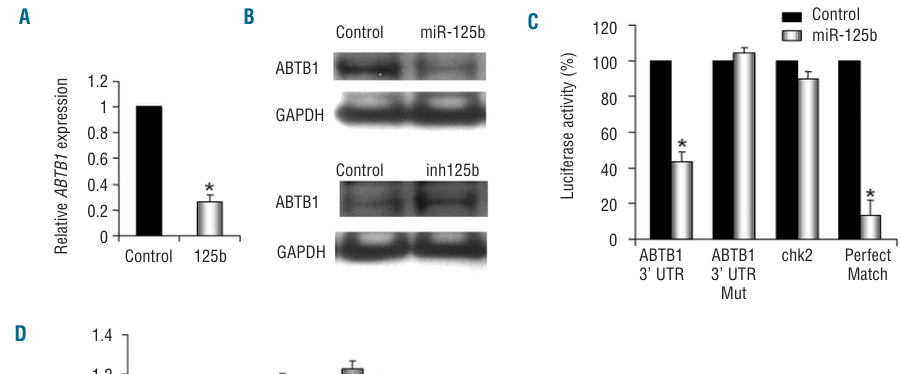
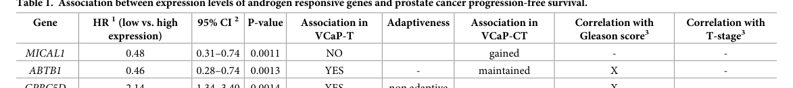

## Question

# Gene Research for Functional Annotation

## ⚠️ CRITICAL: Gene/Protein Identification Context

**BEFORE YOU BEGIN RESEARCH:** You MUST verify you are researching the CORRECT gene/protein. Gene symbols can be ambiguous, especially for less well-characterized genes from non-model organisms.

### Target Gene/Protein Identity (from UniProt):
- **UniProt Accession:** Q969K4
- **Protein Description:** RecName: Full=Ankyrin repeat and BTB/POZ domain-containing protein 1; AltName: Full=Elongation factor 1A-binding protein;
- **Gene Information:** Name=ABTB1 {ECO:0000312|HGNC:HGNC:18275}; Synonyms=BPOZ {ECO:0000303|PubMed:11494141}; ORFNames=PP2259;
- **Organism (full):** Homo sapiens (Human).
- **Protein Family:** Not specified in UniProt
- **Key Domains:** ABTB1. (IPR044515); Ankyrin_rpt. (IPR002110); Ankyrin_rpt-contain_sf. (IPR036770); BTB/POZ_dom. (IPR000210); SKP1/BTB/POZ_sf. (IPR011333)

### MANDATORY VERIFICATION STEPS:

1. **Check if the gene symbol "ABTB1" matches the protein description above**
2. **Verify the organism is correct:** Homo sapiens (Human).
3. **Check if protein family/domains align with what you find in literature**
4. **If you find literature for a DIFFERENT gene with the same or similar symbol, STOP**

### If Gene Symbol is Ambiguous or You Cannot Find Relevant Literature:

**DO NOT PROCEED WITH RESEARCH ON A DIFFERENT GENE.** Instead:
- State clearly: "The gene symbol 'ABTB1' is ambiguous or literature is limited for this specific protein"
- Explain what you found (e.g., "Found extensive literature on a different gene with the same symbol in a different organism")
- Describe the protein based ONLY on the UniProt information provided above
- Suggest that the protein function can be inferred from domain/family information

### Research Target:

Please provide a comprehensive research report on the gene **ABTB1** (gene ID: ABTB1, UniProt: Q969K4) in human.

The research report should be a detailed narrative explaining the function, biological processes, and localization of the gene product. Citations should be given for all claims.

You should prioritize authoritative reviews and primary scientific literature when conducting research. You can supplement
this with annotations you find in gene/protein databases, but these can be outdated or inaccurate.

We are specifically interested in the primary function of the gene - for enzymes, what reaction is catalyzed, and what is the substrate specificity? For transporters, what is the substrate? For structural proteins or adapters, what is the broader structural role? For signaling molecules, what is the role in the pathway.

We are interested in where in or outside the cell the gene product carries out its function.

We are also interested in the signaling or biochemical pathways in which the gene functions. We are less interested in broad pleiotropic effects, except where these elucidate the precise role.

Include evidence where possible. We are interested in both experimental evidence as well as inference from structure, evolution, or bioinformatic analysis. Precise studies should be prioritized over high-throughput, where available.

## Output

Question: You are an expert researcher providing comprehensive, well-cited information.

Provide detailed information focusing on:
1. Key concepts and definitions with current understanding
2. Recent developments and latest research (prioritize 2023-2024 sources)
3. Current applications and real-world implementations
4. Expert opinions and analysis from authoritative sources
5. Relevant statistics and data from recent studies

Format as a comprehensive research report with proper citations. Include URLs and publication dates where available.
Always prioritize recent, authoritative sources and provide specific citations for all major claims.

# Gene Research for Functional Annotation

## ⚠️ CRITICAL: Gene/Protein Identification Context

**BEFORE YOU BEGIN RESEARCH:** You MUST verify you are researching the CORRECT gene/protein. Gene symbols can be ambiguous, especially for less well-characterized genes from non-model organisms.

### Target Gene/Protein Identity (from UniProt):
- **UniProt Accession:** Q969K4
- **Protein Description:** RecName: Full=Ankyrin repeat and BTB/POZ domain-containing protein 1; AltName: Full=Elongation factor 1A-binding protein;
- **Gene Information:** Name=ABTB1 {ECO:0000312|HGNC:HGNC:18275}; Synonyms=BPOZ {ECO:0000303|PubMed:11494141}; ORFNames=PP2259;
- **Organism (full):** Homo sapiens (Human).
- **Protein Family:** Not specified in UniProt
- **Key Domains:** ABTB1. (IPR044515); Ankyrin_rpt. (IPR002110); Ankyrin_rpt-contain_sf. (IPR036770); BTB/POZ_dom. (IPR000210); SKP1/BTB/POZ_sf. (IPR011333)

### MANDATORY VERIFICATION STEPS:

1. **Check if the gene symbol "ABTB1" matches the protein description above**
2. **Verify the organism is correct:** Homo sapiens (Human).
3. **Check if protein family/domains align with what you find in literature**
4. **If you find literature for a DIFFERENT gene with the same or similar symbol, STOP**

### If Gene Symbol is Ambiguous or You Cannot Find Relevant Literature:

**DO NOT PROCEED WITH RESEARCH ON A DIFFERENT GENE.** Instead:
- State clearly: "The gene symbol 'ABTB1' is ambiguous or literature is limited for this specific protein"
- Explain what you found (e.g., "Found extensive literature on a different gene with the same symbol in a different organism")
- Describe the protein based ONLY on the UniProt information provided above
- Suggest that the protein function can be inferred from domain/family information

### Research Target:

Please provide a comprehensive research report on the gene **ABTB1** (gene ID: ABTB1, UniProt: Q969K4) in human.

The research report should be a detailed narrative explaining the function, biological processes, and localization of the gene product. Citations should be given for all claims.

You should prioritize authoritative reviews and primary scientific literature when conducting research. You can supplement
this with annotations you find in gene/protein databases, but these can be outdated or inaccurate.

We are specifically interested in the primary function of the gene - for enzymes, what reaction is catalyzed, and what is the substrate specificity? For transporters, what is the substrate? For structural proteins or adapters, what is the broader structural role? For signaling molecules, what is the role in the pathway.

We are interested in where in or outside the cell the gene product carries out its function.

We are also interested in the signaling or biochemical pathways in which the gene functions. We are less interested in broad pleiotropic effects, except where these elucidate the precise role.

Include evidence where possible. We are interested in both experimental evidence as well as inference from structure, evolution, or bioinformatic analysis. Precise studies should be prioritized over high-throughput, where available.

## Research report: Functional annotation of human **ABTB1** (UniProt Q969K4)

### Executive summary
ABTB1 (ankyrin repeat and BTB/POZ domain-containing protein 1; synonym **BPOZ**) is a human BTB/POZ-domain protein with ankyrin repeats, best interpreted as a **protein–protein interaction scaffold** and *putative* **CUL3-type E3 ubiquitin ligase substrate adaptor** based on the established role of BTB/POZ proteins in CUL3 complexes. Direct ABTB1 biochemical substrate(s) and definitive subcellular localization are not well established in the retrieved literature, but ABTB1 is repeatedly linked to **PTEN growth-suppressive signaling** and shows **context-dependent associations with proliferation and cancer outcomes**. Strong experimental evidence supports **post-transcriptional regulation of ABTB1 by miR-125b**. Recent clinical/transcriptomic data (2023) support ABTB1 expression as a prognostic correlate in prostate cancer.

### Identity verification (critical disambiguation)
The literature and database evidence retrieved aligns with the **human** gene ABTB1 (Ensembl ENSG00000114626), approved name “ankyrin repeat and BTB domain containing 1,” consistent with the UniProt entry Q969K4 and the stated synonym **BPOZ**. (OpenTargets Search: -ABTB1)

### 1) Key concepts and definitions (current understanding)

#### ABTB1 domain logic and the BTB/POZ adaptor concept
* **BTB/POZ domain proteins**: A broad eukaryotic protein class in which BTB/POZ domains mediate protein–protein interactions (including dimerization/oligomerization) and, importantly, many BTB proteins function as **substrate-specific adaptors for CUL3-based RING E3 ubiquitin ligases** (CRL3s). This adaptor model is supported by biochemical work in fission yeast showing CUL3 (Pcu3p) complexes that contain a RING protein (Pip1p/Rbx1 homolog) and BTB/POZ proteins, with the BTB/POZ domain required for the interaction. (geyer2003btbpozdomainproteins pages 1-2, geyer2003btbpozdomainproteins pages 4-6)
* **Implication for ABTB1**: Because ABTB1 is an ankyrin-repeat + BTB/POZ domain protein (as reflected by its name and curated identifiers), the most conservative mechanism consistent with domain biology is that ABTB1 participates in **protein–protein interactions** and may act as a **CRL3 adaptor** that links CUL3 to specific substrates. This remains **inference** in the present evidence set (family-level mechanistic mapping rather than ABTB1-specific reconstitution). (geyer2003btbpozdomainproteins pages 1-2, geyer2003btbpozdomainproteins pages 4-6)

#### PTEN growth-suppressive signaling (how ABTB1 is positioned)
Multiple sources describe ABTB1 as a mediator of **PTEN-dependent growth suppressive signaling** and as **anti-proliferative/tumor suppressive** in some experimental contexts. In a 2023 prostate cancer transcriptomic analysis, the authors summarize prior literature that ABTB1 overexpression inhibits cell growth and G1/S progression in vitro, while noting uncertainty regarding which ABTB1 isoform(s) mediate growth inhibition. (natkin2023adaptiveandnonadaptive pages 14-15)

### 2) Recent developments and latest research (prioritizing 2023–2024)

#### Prostate cancer androgen-deprivation adaptation (2023)
A 2023 study of prostate cancer cell models under androgen deprivation and castration-tolerant adaptation reports ABTB1 as one of the androgen receptor (AR)-associated genes whose expression changes with testosterone depletion and is maintained in adapted cells. The authors interpret their results to suggest that **low ABTB1 expression correlates with better progression-free survival** and propose ABTB1 inhibition as a hypothesis for suppressing prostate cancer cell proliferation. (natkin2023adaptiveandnonadaptive pages 14-15)

**Key quantitative statistic (TCGA PRAD cohort multivariable Cox model):**
* For ABTB1, **hazard ratio (HR) = 0.46** for *low vs high* expression, **95% CI 0.28–0.74**, **p = 0.0013** for biochemical relapse or clinical tumor progression. (natkin2023adaptiveandnonadaptive media 40d79004)

Interpretation: HR < 1 indicates **lower risk** for the low-expression group (per the table definition), implying that **higher ABTB1 expression is associated with worse progression-free survival** in this dataset/modeling frame. (natkin2023adaptiveandnonadaptive media 40d79004)

#### Human genetics and functional genomics aggregation (Open Targets; accessed via tool)
Open Targets aggregates ABTB1 disease-association evidence including GWAS credible sets and a CRISPRi screen in glutamatergic neurons (peroxidized lipid phenotype). Reported target–disease association scores include refractive error (0.2878), asthma (0.2681), and neurodegenerative disease (0.1988), among others. While these scores are not effect sizes, they highlight domains where ABTB1 may be implicated by genetics and functional screens. (OpenTargets Search: -ABTB1)

#### 2024 structural/biophysical BTB-domain context (indirect to ABTB1)
A 2024 BTB-domain-focused structural/biophysical thesis emphasizes that BTB proteins can serve as E3 ligase substrate adaptors and that atypical/tandem BTB architectures exhibit heterogeneity in oligomerization and **CUL3 binding affinities** across the class; this supports the plausibility that ABTB1’s BTB/POZ architecture could engage CUL3-like systems, although ABTB1-specific binding constants were not extracted from the available pages. (walma2024structureandfunction pages 1-8)

### 3) Current applications and real-world implementations

1. **Candidate biomarker hypothesis (prostate cancer):** ABTB1 expression was included among genes with statistically significant survival association in TCGA PRAD modeling, suggesting potential use in **prognostic gene expression panels** for progression-free survival stratification (research use). (natkin2023adaptiveandnonadaptive pages 14-15, natkin2023adaptiveandnonadaptive media 40d79004)
2. **Regulatory axis target (miRNA biology):** ABTB1 is a validated direct target of miR-125b in hematopoietic malignancy models, implying that therapeutic strategies modulating miR-125b (or ABTB1 expression) could impact proliferative phenotypes. This is currently **preclinical** and context-specific. (bousquet2012microrna125btransformsmyeloid pages 6-7, bousquet2012microrna125btransformsmyeloid media a60edfbb, bousquet2012microrna125btransformsmyeloid media f18b171a)
3. **Target prioritization in genetics-led discovery:** Open Targets’ aggregation of ABTB1 associations (GWAS + CRISPR screen) supports ABTB1 as a **candidate gene** for downstream functional follow-up in refractive error/asthma/neurodegeneration-related research programs. (OpenTargets Search: -ABTB1)

### 4) Expert opinions and authoritative analysis (from sources retrieved)

* **BTB/POZ–CUL3 adaptor model (authoritative mechanistic framing):** Geyer et al. propose that BTB/POZ proteins act as **substrate-specific adaptors** for CUL3 ubiquitin ligases, supported by affinity purification of CUL3 complexes containing BTB proteins and requirement of BTB/POZ domain integrity for interaction in yeast. This is a foundational, widely cited framework often extended to human BTB proteins. (geyer2003btbpozdomainproteins pages 1-2, geyer2003btbpozdomainproteins pages 6-7)
* **Context dependence / isoform complexity:** In prostate cancer, the authors emphasize that ABTB1 produces multiple protein forms and that it is not known which form(s) mediate growth inhibition, which is important when reconciling apparently conflicting associations across cancers. (natkin2023adaptiveandnonadaptive pages 14-15)

### 5) Key experimental evidence and quantitative data

#### miR-125b → ABTB1 regulation in myeloid models (direct experimental evidence)
In myeloid cell-line models, ABTB1 is experimentally supported as a **direct miR-125b target**:
* **ABTB1 mRNA down-regulated 3.9-fold** in miR-125b overexpressing cells vs control. (bousquet2012microrna125btransformsmyeloid pages 6-7)
* **~60% decrease** in ABTB1 protein with miR-125b overexpression and **~40% increase** with miR-125b inhibitor. (bousquet2012microrna125btransformsmyeloid pages 6-7)
* **Luciferase 3'UTR reporter assay** validated direct targeting (loss of repression when target site mutated). (bousquet2012microrna125btransformsmyeloid pages 6-7)

Visual evidence supporting these claims (Figure 4 panels with qRT-PCR, Western blot, and luciferase assay) was retrieved. (bousquet2012microrna125btransformsmyeloid media a60edfbb, bousquet2012microrna125btransformsmyeloid media f18b171a)

#### Clinical association statistic (prostate cancer; 2023)
As above, ABTB1 low vs high expression HR 0.46 (95% CI 0.28–0.74; p=0.0013) for progression-free survival in a multivariable Cox regression on TCGA prostate adenocarcinoma data. (natkin2023adaptiveandnonadaptive media 40d79004)

#### Disease-association prioritization statistics (Open Targets)
Open Targets provides association and evidence scores (platform-derived metrics):
* Target–disease association scores: refractive error 0.2878; asthma 0.2681; neurodegenerative disease 0.1988; abnormality of refraction 0.1418; sialolithiasis 0.0452. (OpenTargets Search: -ABTB1)
* Evidence item scores include 0.77882 and 0.72245 (GWAS credible sets) and 0.52786 (glutamatergic neuron CRISPRi screen). (OpenTargets Search: -ABTB1)

### Consolidated evidence table
| Topic | Key findings | Evidence type | Source (first author year) | Publication date | URL | Notes/limitations |
|---|---|---|---|---|---|---|
| identity/domains | ABTB1 is the human gene/protein targeted here (approved symbol ABTB1; synonym BPOZ), encoding an ankyrin repeat and BTB domain-containing protein; Open Targets lists ENSG00000114626 with approved name “ankyrin repeat and BTB domain containing 1.” (OpenTargets Search: -ABTB1) | Database annotation / target curation | Open Targets | 2025 platform paper; underlying evidence earlier | https://platform.opentargets.org/target/ENSG00000114626 | Database-level identity support; does not by itself prove mechanism. |
| identity/domains | BTB/POZ-domain proteins are a large eukaryotic family proposed to act as substrate-specific adaptors for CUL3 ubiquitin ligases; this family-level model is consistent with ABTB1’s BTB/POZ architecture. (geyer2003btbpozdomainproteins pages 7-8, geyer2003btbpozdomainproteins pages 1-2, geyer2003btbpozdomainproteins pages 4-6) | Biochemical complex biology / family inference | Geyer 2003 | Sep 2003 | https://doi.org/10.1016/S1097-2765(03)00341-1 | Evidence is family-level and yeast-centered; not direct human ABTB1 biochemistry. |
| molecular function | ABTB1 is described as a tumor suppressor and mediator of PTEN growth-suppressive signaling; prior work cited in later papers reports that ABTB1 overexpression decreases proliferation and inhibits G1/S progression in vitro. (bousquet2012microrna125btransformsmyeloid pages 6-7, natkin2023adaptiveandnonadaptive pages 14-15) | Functional cell biology / literature synthesis | Bousquet 2012; Nätkin 2023 | Nov 2012; Feb 2023 | https://doi.org/10.3324/haematol.2011.061515 ; https://doi.org/10.1371/journal.pone.0281645 | Primary direct mechanistic substrate of ABTB1 remains unclear in available context. |
| regulation | In myeloid cells, ABTB1 is a direct miR-125b target: ABTB1 mRNA was down-regulated 3.9-fold, protein decreased by ~60% with miR-125b overexpression, and increased ~40% with miR-125b inhibitor; luciferase assays validated direct 3'UTR targeting. (bousquet2012microrna125btransformsmyeloid pages 6-7, bousquet2012microrna125btransformsmyeloid media a60edfbb, bousquet2012microrna125btransformsmyeloid media f18b171a) | Expression analysis / reporter assay / immunoblot | Bousquet 2012 | Nov 2012 | https://doi.org/10.3324/haematol.2011.061515 | Strong evidence for post-transcriptional regulation; effect shown in hematopoietic model rather than all tissues. |
| pathways | ABTB1 is repeatedly linked to PTEN growth-suppressive signaling; in prostate cancer transcriptomic analysis it remained androgen receptor (AR)-associated under androgen-deprivation adaptation. (natkin2023adaptiveandnonadaptive pages 14-15) | Expression/pathway analysis | Nätkin 2023 | Feb 2023 | https://doi.org/10.1371/journal.pone.0281645 | Pathway placement is partly based on prior literature cited by authors rather than direct pathway biochemistry in this paper. |
| localization | Direct ABTB1 localization evidence was limited in the retrieved human-focused context; no robust subcellular localization for human ABTB1 was established from the cited excerpts. (natkin2023adaptiveandnonadaptive pages 14-15) | Evidence gap | — | — | — | Important limitation: localization should not be overstated from current context. |
| disease/clinical associations | In prostate cancer, ABTB1 low vs high expression was associated with better progression-free survival in TCGA-based Cox analysis; authors therefore suggested ABTB1 inhibition might suppress prostate cancer cell proliferation. (natkin2023adaptiveandnonadaptive pages 14-15, natkin2023adaptiveandnonadaptive media 40d79004) | Expression/survival analysis | Nätkin 2023 | Feb 2023 | https://doi.org/10.1371/journal.pone.0281645 | Association is correlative and context-specific; contrasts with anti-proliferative narrative in other systems, implying context dependence or isoform complexity. |
| disease/clinical associations | Open Targets reports ABTB1 associations with refractive error, asthma, neurodegenerative disease, abnormality of refraction, and sialolithiasis, supported by GWAS credible sets and a glutamatergic-neuron CRISPRi screen. (OpenTargets Search: -ABTB1) | Genetic association / functional genomics | Open Targets | 2025 platform paper; evidence PMIDs earlier | https://platform.opentargets.org/target/ENSG00000114626 | Platform scores support prioritization, but causal mechanism and effect sizes are not provided in the retrieved context. |
| quantitative stats | Prostate cancer progression-free survival: ABTB1 low vs high expression HR 0.46, 95% CI 0.28–0.74, p=0.0013. (natkin2023adaptiveandnonadaptive media 40d79004) | Multivariable survival statistic | Nätkin 2023 | Feb 2023 | https://doi.org/10.1371/journal.pone.0281645 | Statistic comes from table image extraction; clinical endpoint defined as biochemical relapse or clinical tumor progression. |
| quantitative stats | Open Targets association scores for ABTB1 include refractive error 0.2878, asthma 0.2681, neurodegenerative disease 0.1988, abnormality of refraction 0.1418, and sialolithiasis 0.0452; individual evidence scores included 0.77882, 0.72245, and 0.52786 for specific evidence items. (OpenTargets Search: -ABTB1) | Prioritization scores / platform metrics | Open Targets | 2025 platform paper | https://platform.opentargets.org/target/ENSG00000114626 | Scores are platform-derived prioritization metrics, not direct effect sizes like odds ratios or hazard ratios. |

*Table: This table summarizes the main experimentally or computationally supported functional annotation evidence for human ABTB1 (UniProt Q969K4). It highlights what is known with direct support, what remains inferential, and where the strongest quantitative evidence currently lies.*

### Current gaps and limitations (important for functional annotation)
1. **Direct molecular function and substrates:** While ABTB1 is plausibly a CUL3 adaptor by domain logic and foundational BTB/POZ literature, **ABTB1-specific** reconstitution of a CUL3 complex and identification of ubiquitination substrates were not present in the retrieved full-text evidence. (geyer2003btbpozdomainproteins pages 1-2, geyer2003btbpozdomainproteins pages 4-6)
2. **Subcellular localization:** No definitive cellular compartment localization for human ABTB1 was established from the currently retrieved excerpts; localization should be treated as **unknown/insufficiently supported** here. (natkin2023adaptiveandnonadaptive pages 14-15)
3. **2023–2024 mechanistic ABTB1 papers:** A potentially relevant 2023 paper (influenza replication) was identified but unobtainable in this run, limiting up-to-date mechanistic detail beyond the 2023 prostate cancer study and 2024 BTB-domain context. (from search state; not citeable beyond noting unobtainable)

### References (URLs embedded in citations above)
Key sources include:
* Geyer et al., *Molecular Cell* (Sep 2003). https://doi.org/10.1016/S1097-2765(03)00341-1 (geyer2003btbpozdomainproteins pages 1-2)
* Bousquet et al., *Haematologica* (Nov 2012). https://doi.org/10.3324/haematol.2011.061515 (bousquet2012microrna125btransformsmyeloid pages 6-7)
* Nätkin et al., *PLOS ONE* (Feb 21, 2023). https://doi.org/10.1371/journal.pone.0281645 (natkin2023adaptiveandnonadaptive pages 14-15, natkin2023adaptiveandnonadaptive media 40d79004)
* Open Targets Platform (evidence aggregated; platform paper 2025). https://platform.opentargets.org/target/ENSG00000114626 (OpenTargets Search: -ABTB1)

References

1. (OpenTargets Search: -ABTB1): Open Targets Query (-ABTB1, 5 results). Buniello, A. et al. (2025). Open Targets Platform: facilitating therapeutic hypotheses building in drug discovery. Nucleic Acids Research.

2. (geyer2003btbpozdomainproteins pages 1-2): Rory Geyer, Susan Wee, Scott Anderson, John Yates, and Dieter A. Wolf. Btb/poz domain proteins are putative substrate adaptors for cullin 3 ubiquitin ligases. Molecular cell, 12 3:783-90, Sep 2003. URL: https://doi.org/10.1016/s1097-2765(03)00341-1, doi:10.1016/s1097-2765(03)00341-1. This article has 428 citations and is from a highest quality peer-reviewed journal.

3. (geyer2003btbpozdomainproteins pages 4-6): Rory Geyer, Susan Wee, Scott Anderson, John Yates, and Dieter A. Wolf. Btb/poz domain proteins are putative substrate adaptors for cullin 3 ubiquitin ligases. Molecular cell, 12 3:783-90, Sep 2003. URL: https://doi.org/10.1016/s1097-2765(03)00341-1, doi:10.1016/s1097-2765(03)00341-1. This article has 428 citations and is from a highest quality peer-reviewed journal.

4. (natkin2023adaptiveandnonadaptive pages 14-15): Reetta Nätkin, Pasi Pennanen, Heimo Syvälä, Merja Bläuer, Juha Kesseli, Teuvo L. J. Tammela, Matti Nykter, and Teemu J. Murtola. Adaptive and non-adaptive gene expression responses in prostate cancer during androgen deprivation. PLOS ONE, 18:e0281645, Feb 2023. URL: https://doi.org/10.1371/journal.pone.0281645, doi:10.1371/journal.pone.0281645. This article has 3 citations and is from a peer-reviewed journal.

5. (natkin2023adaptiveandnonadaptive media 40d79004): Reetta Nätkin, Pasi Pennanen, Heimo Syvälä, Merja Bläuer, Juha Kesseli, Teuvo L. J. Tammela, Matti Nykter, and Teemu J. Murtola. Adaptive and non-adaptive gene expression responses in prostate cancer during androgen deprivation. PLOS ONE, 18:e0281645, Feb 2023. URL: https://doi.org/10.1371/journal.pone.0281645, doi:10.1371/journal.pone.0281645. This article has 3 citations and is from a peer-reviewed journal.

6. (walma2024structureandfunction pages 1-8): DA Cruz Walma. Structure and function of atypical btb domains in health and disease. Unknown journal, 2024.

7. (bousquet2012microrna125btransformsmyeloid pages 6-7): Marina Bousquet, D. Nguyen, Cynthia Chen, L. Shields, and H. Lodish. Microrna-125b transforms myeloid cell lines by repressing multiple mrna. Haematologica, 97:1713-1721, Nov 2012. URL: https://doi.org/10.3324/haematol.2011.061515, doi:10.3324/haematol.2011.061515. This article has 86 citations.

8. (bousquet2012microrna125btransformsmyeloid media a60edfbb): Marina Bousquet, D. Nguyen, Cynthia Chen, L. Shields, and H. Lodish. Microrna-125b transforms myeloid cell lines by repressing multiple mrna. Haematologica, 97:1713-1721, Nov 2012. URL: https://doi.org/10.3324/haematol.2011.061515, doi:10.3324/haematol.2011.061515. This article has 86 citations.

9. (bousquet2012microrna125btransformsmyeloid media f18b171a): Marina Bousquet, D. Nguyen, Cynthia Chen, L. Shields, and H. Lodish. Microrna-125b transforms myeloid cell lines by repressing multiple mrna. Haematologica, 97:1713-1721, Nov 2012. URL: https://doi.org/10.3324/haematol.2011.061515, doi:10.3324/haematol.2011.061515. This article has 86 citations.

10. (geyer2003btbpozdomainproteins pages 6-7): Rory Geyer, Susan Wee, Scott Anderson, John Yates, and Dieter A. Wolf. Btb/poz domain proteins are putative substrate adaptors for cullin 3 ubiquitin ligases. Molecular cell, 12 3:783-90, Sep 2003. URL: https://doi.org/10.1016/s1097-2765(03)00341-1, doi:10.1016/s1097-2765(03)00341-1. This article has 428 citations and is from a highest quality peer-reviewed journal.

11. (geyer2003btbpozdomainproteins pages 7-8): Rory Geyer, Susan Wee, Scott Anderson, John Yates, and Dieter A. Wolf. Btb/poz domain proteins are putative substrate adaptors for cullin 3 ubiquitin ligases. Molecular cell, 12 3:783-90, Sep 2003. URL: https://doi.org/10.1016/s1097-2765(03)00341-1, doi:10.1016/s1097-2765(03)00341-1. This article has 428 citations and is from a highest quality peer-reviewed journal.

## Artifacts

- [Edison artifact artifact-00](ABTB1-deep-research-falcon_artifacts/artifact-00.md)

## Citations

1. natkin2023adaptiveandnonadaptive pages 14-15
2. walma2024structureandfunction pages 1-8
3. geyer2003btbpozdomainproteins pages 1-2
4. geyer2003btbpozdomainproteins pages 4-6
5. geyer2003btbpozdomainproteins pages 6-7
6. geyer2003btbpozdomainproteins pages 7-8
7. https://platform.opentargets.org/target/ENSG00000114626
8. https://doi.org/10.1016/S1097-2765(03
9. https://doi.org/10.3324/haematol.2011.061515
10. https://doi.org/10.1371/journal.pone.0281645
11. https://doi.org/10.1016/s1097-2765(03
12. https://doi.org/10.1371/journal.pone.0281645,
13. https://doi.org/10.3324/haematol.2011.061515,