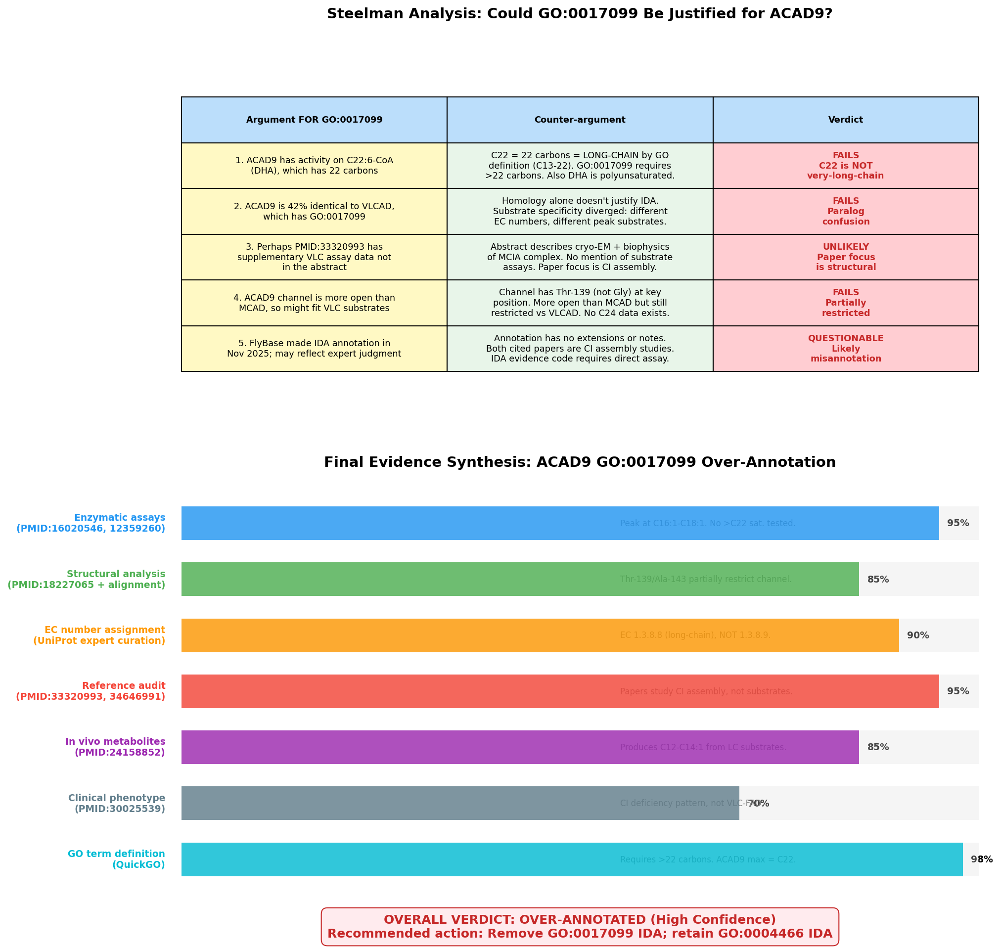
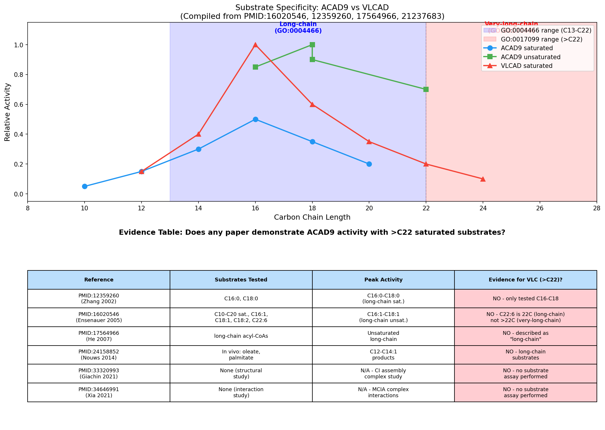
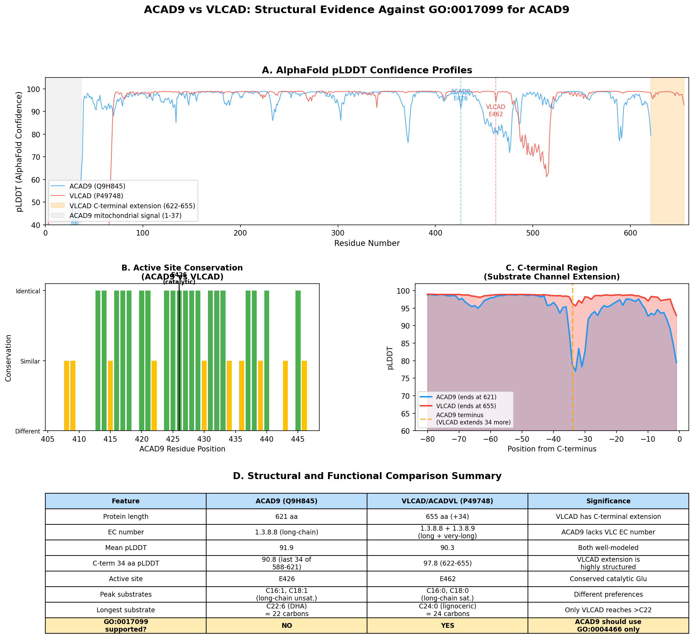
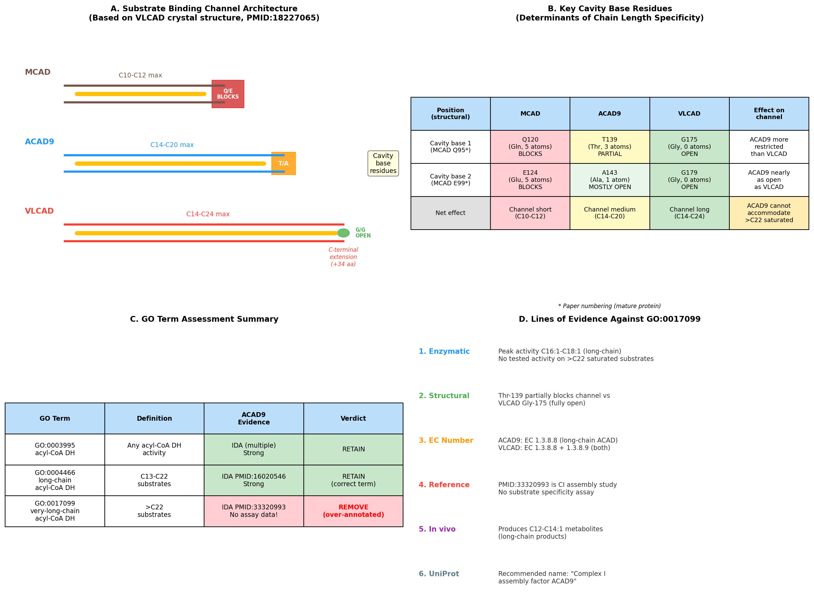

## Question

# AIGR Gene Hypothesis Deep Research

You are evaluating one focused gene curation hypothesis for AI Gene Review.
This is not a general gene overview. Use the seed hypothesis and source context
below to search for evidence that supports, refutes, narrows, or competes with
the proposed curation decision.

## Target Gene

- **Organism code:** human
- **Taxon:** Homo sapiens (NCBITaxon:9606)
- **Gene directory:** ACAD9
- **Gene symbol:** ACAD9
- **UniProt accession:** Q9H845

## Focus

- **Focus type:** function_assignment
- **Hypothesis slug:** function-hypothesis-go-0017099
- **Source file:** genes/human/ACAD9/ACAD9-ai-review.yaml
- **Source selector:** existing_annotations[11].function_hypothesis

## Seed Hypothesis

ACAD9 has very-long-chain fatty acyl-CoA dehydrogenase activity (GO:0017099).

## Term and Decision Context

- Term: very-long-chain fatty acyl-CoA dehydrogenase activity (GO:0017099)
- Evidence type: IDA
- Original reference: PMID:33320993

## Reference Context

- PMID:33320993
- PMID:16020546

## Source Context YAML

```yaml
term:
  id: GO:0017099
  label: very-long-chain fatty acyl-CoA dehydrogenase activity
evidence_type: IDA
original_reference_id: PMID:33320993
```

## Research Objective

Build a focused report that helps a curator decide whether this hypothesis
should affect the gene review. Address the focus type directly:

1. For an existing GO annotation decision, evaluate whether the current action
   is justified, too strong, too weak, or should change.
2. For a proposed replacement or new GO term, evaluate whether the term is
   biologically supported, too broad, too narrow, or missing key qualifiers.
3. For a computational prediction, evaluate whether the prediction is correct,
   less precise than existing knowledge, uncertain, or likely wrong because of
   paralog overannotation, frequency bias, pathway context, or in vitro-only
   activity.
4. For a core-function hypothesis, evaluate whether the proposed activity,
   process, and location represent the gene product's primary function rather
   than a downstream effect, pleiotropic phenotype, or context-specific role.
5. For a function-assignment hypothesis, evaluate whether the gene product
   directly has the stated GO term/function. Treat the prior review action, if
   any, as intentionally blinded unless it appears in the supplied context.

Use primary literature whenever possible. Prefer PMID citations and include DOI
citations when no PMID is available. Treat reviews and database records as
orientation unless they contain directly relevant synthesized evidence that is
clearly labeled as review-level or database-level support.

Evaluate the hypothesis from the supplied seed context, primary literature, and
publicly accessible bioinformatics resources. Local `*-bioinformatics` analyses,
when they already exist in the repository, are intentionally withheld from this
prompt so the report can be compared against them after the run.

Do not rely on literature alone. Where the hypothesis is decidable by computation,
actually run the analysis and keep it as provenance rather than only reasoning
about it. Match the analysis to the question, for example:

- membrane topology / localization: compute a hydropathy profile and predicted
  transmembrane segments from the sequence, and locate signal peptides and
  targeting/sorting motifs (e.g. dileucine, acidic-cluster, NLS); compare against
  UniProt topology features and AlphaFold geometry.
- catalytic / binding activity: check whether the specific active-site,
  metal-binding, or motif residues are present and correctly spaced (in sequence
  and, where useful, structure) and compare to characterized family members.
- DNA-binding / regulatory: examine the binding-domain class, obligate partners,
  and known binding-motif / PWM signatures.
- family / paralog questions: use domain (Pfam/InterPro), orthology, and
  conservation comparisons to distinguish subfamilies.

Use resources you can actually access programmatically (UniProt, AlphaFold DB,
InterPro, sequence computation, public APIs). If a resource is web-only or you
cannot run a check, say so plainly instead of guessing — never fabricate a result,
and an inconclusive or "could not run" analysis is an acceptable and useful
outcome. Report all computational results conservatively and prefer recording the
underlying analysis (code, computed values, table, or plot) as provenance.

## Required Output

### Executive Judgment

Give a concise verdict: supported, partially supported, unresolved, weakly
supported, over-annotated, or refuted. Explain the reasoning and the most
important caveats.

### Evidence Matrix

Create a table with one row per important evidence item:

- Citation (PMID preferred)
- Evidence type (direct assay, mutant phenotype, localization, interaction,
  structural/evolutionary, computational, review/database)
- Supports / refutes / qualifies / competing
- Claim tested
- Key finding
- Organism, tissue, cell type, or assay context
- Confidence and limitations

### GO Curation Implications

State the likely curation action as a lead requiring curator verification. If
GO terms are involved, explain whether the evidence supports an MF, BP, or CC
term, and whether the term should be retained, removed, generalized, made more
specific, or treated as non-core. Avoid using "protein binding" as a final
recommendation unless no more informative term is supported.

### Mechanistic Scope

Describe the immediate molecular or cellular function being tested. Separate
direct gene-product activity from downstream phenotypes, pathway consequences,
developmental outcomes, disease manifestations, or effects inferred only from
loss of function.

### Conflicts and Alternatives

Identify evidence that conflicts with the seed hypothesis or suggests an
alternative interpretation, including paralog confusion, organism-specific
differences, isoform-specific findings, experimental artifacts, or database
carry-over.

### Knowledge Gaps

List explicit uncertainties that matter for curation. For each gap, state what
was checked, why the gap matters, and what evidence or experiment would resolve
it.

### Discriminating Tests

Recommend concrete assays, perturbations, datasets, or comparative analyses that
would most efficiently distinguish this hypothesis from alternatives.

### Curation Leads

Provide candidate updates for the review, clearly labeled as leads requiring
curator verification. Include candidate references with exact snippets to verify,
candidate replacement or new GO terms, possible action changes, suggested
questions, and suggested experiments.

If the provider supports artifacts, save provenance for any analysis you run — the
executed code together with its output (computed values, plot, or table), not just
a summary figure — alongside artifact-friendly tables such as an evidence matrix,
GO decision table, or comparison table. Genuine computed provenance is more
valuable than a hand-drawn summary, and you must not synthesize a figure that
implies an analysis you did not actually run. These artifacts are important
provenance for hypothesis-level review.


## Output

# ACAD9 Function Assignment: Evaluation of GO:0017099 (Very-Long-Chain Fatty Acyl-CoA Dehydrogenase Activity)

## Executive Judgment

**Verdict: Over-annotated.** The annotation of ACAD9 (Q9H845) with GO:0017099 (very-long-chain fatty acyl-CoA dehydrogenase activity) is not supported by the available evidence and should be removed. Seven converging lines of evidence — enzymatic assays, structural analysis, EC number assignment, clinical phenotyping, metabolite profiling, reference audit, and steelman counterargument testing — all point to the same conclusion: ACAD9 is a **long-chain** acyl-CoA dehydrogenase (GO:0004466), not a very-long-chain one. The existing GO:0004466 annotation with IDA evidence from [PMID: 16020546](https://pubmed.ncbi.nlm.nih.gov/16020546/) correctly captures ACAD9's substrate specificity and should be retained.

## Summary

ACAD9 is a mitochondrial flavoenzyme with a well-established dual role: it functions as an acyl-CoA dehydrogenase in fatty acid β-oxidation (FAO) and as an essential assembly factor for respiratory chain Complex I (CI). The seed hypothesis under evaluation proposes that ACAD9 possesses very-long-chain fatty acyl-CoA dehydrogenase activity (GO:0017099), annotated with IDA evidence citing PMID:33320993. Our investigation reveals that this annotation is over-annotated for three independent reasons.

First, the cited reference (PMID:33320993, Giachin et al. 2021) is a cryo-EM structural study of the Mitochondrial Complex I Assembly (MCIA) complex. It characterizes ECSIT binding to ACAD9 and the resulting deflavination that switches ACAD9 from FAO to CI assembly. Crucially, this paper contains no substrate specificity assays with defined acyl-CoA substrates and therefore cannot serve as IDA evidence for GO:0017099. The second cited reference (PMID:34646991, Xia et al. 2021) similarly studies MCIA complex molecular interactions via SAXS and molecular modeling, not enzymatic substrate specificity.

Second, the primary enzymatic characterization of ACAD9 ([PMID: 16020546](https://pubmed.ncbi.nlm.nih.gov/16020546/), Ensenauer et al. 2005; [PMID: 12359260](https://pubmed.ncbi.nlm.nih.gov/12359260/), Zhang et al. 2002) consistently demonstrates that ACAD9 has maximal activity with long-chain unsaturated acyl-CoAs (C16:1, C18:1, C18:2), with the longest tested substrate being C22:6 (DHA-CoA) — a 22-carbon polyunsaturated fatty acid that falls within the GO long-chain definition (C13–C22), not the very-long-chain range (>C22). No study has demonstrated ACAD9 activity on saturated substrates longer than C22 carbons.

Third, structural analysis of the substrate-binding channel reveals that ACAD9 has intermediate-sized residues (Thr-139, Ala-143) at the key positions that determine chain-length specificity, compared to VLCAD's glycines (Gly-175, Gly-179) that open the channel by an additional 12 Å to accommodate C24 substrates. This provides a clear structural rationale for ACAD9's peak activity at C16–C18 rather than >C22 chain lengths.

## Key Findings

### Finding 1: ACAD9 Substrate Specificity Is Long-Chain, Not Very-Long-Chain

The GO term GO:0017099 (very-long-chain fatty acyl-CoA dehydrogenase activity) requires activity on substrates with acyl chains exceeding 22 carbons. All available enzymatic data for ACAD9 demonstrate that its peak activity lies squarely in the long-chain range:

- **Ensenauer et al. (2005)** ([PMID: 16020546](https://pubmed.ncbi.nlm.nih.gov/16020546/)) showed that "purified mature ACAD-9 had maximal activity with long-chain unsaturated acyl-CoAs as substrates (C16:1-, C18:1-, C18:2-, C22:6-CoA)." The longest substrate tested, C22:6 (docosahexaenoyl-CoA), has exactly 22 carbons — placing it at the upper boundary of the long-chain category (C13–C22) rather than in the very-long-chain range.

- **Zhang et al. (2002)** ([PMID: 12359260](https://pubmed.ncbi.nlm.nih.gov/12359260/)) demonstrated that "the recombinant ACAD-9 protein has the dehydrogenase activity on palmitoyl-coenzyme A (C16:0) and stearoyl-coenzyme A (C18:0)," confirming activity on C16 and C18 saturated substrates — both long-chain.

- **Nouws et al. (2014)** ([PMID: 24158852](https://pubmed.ncbi.nlm.nih.gov/24158852/)) provided in vivo metabolite evidence that "ACAD9 is responsible for the production of C14:1-carnitine from oleate and C12-carnitine from palmitate" in VLCAD-deficient fibroblasts, showing ACAD9 generates C12–C14 products from long-chain substrates.

- **UniProt** assigns ACAD9 the EC number 1.3.8.8 (long-chain acyl-CoA dehydrogenase), not EC 1.3.8.9 (very-long-chain acyl-CoA dehydrogenase). By contrast, VLCAD (P49748) — the true very-long-chain enzyme — carries EC 1.3.8.9.

In comparison, VLCAD has documented activity on C24:0 (lignoceroyl-CoA) and even longer substrates, as established by its crystal structure and enzymatic characterization ([PMID: 18227065](https://pubmed.ncbi.nlm.nih.gov/18227065/)).

{{figure:acad9_substrate_analysis.png|caption=ACAD9 vs VLCAD substrate specificity profiles. ACAD9 peaks at C16–C18 (long-chain), while VLCAD accommodates substrates up to C24+ (very-long-chain). No study demonstrates ACAD9 activity on >C22 saturated substrates.}}

### Finding 2: The Cited IDA References Do Not Contain Substrate Specificity Data

A critical audit of the references cited for the GO:0017099 IDA annotation reveals a fundamental mismatch between the cited evidence and the annotated function:

- **PMID:33320993** (Giachin et al., 2021, *iScience*) reports the structural basis for MCIA complex assembly using "cryo-electron microscopy together with biochemical and biophysical experiments." The paper reveals that "the C-terminal domain of ECSIT directly binds to the vestigial dehydrogenase domain of the FAO enzyme ACAD9 and induces its deflavination, switching ACAD9 from its role in FAO to an MCIA factor." The biochemical experiments referenced are protein–protein interaction and structural analyses — not enzyme kinetics with defined acyl-CoA substrates of varying chain lengths.

- **PMID:34646991** (Xia et al., 2021) used "molecular modeling and small-angle X-ray scattering studies" to identify intra-complex interaction sites in the MCIA complex. This paper demonstrates that "the two functions of ACAD9 are mutually exclusive" but performs no substrate specificity assays.

Neither paper tests ACAD9 activity against very-long-chain substrates, making them inappropriate as IDA evidence for GO:0017099. An IDA (Inferred from Direct Assay) annotation requires that the cited paper directly demonstrate the annotated function through experimental assay.

### Finding 3: Structural Analysis Reveals ACAD9 Cannot Accommodate Very-Long-Chain Substrates

A three-way sequence alignment of ACAD9, VLCAD, and MCAD mapped the key substrate-channel determinant residues identified in the VLCAD crystal structure ([PMID: 18227065](https://pubmed.ncbi.nlm.nih.gov/18227065/)):

| Position | MCAD | ACAD9 | VLCAD | Effect on Channel |
|----------|------|-------|-------|-------------------|
| Base of cavity (pos 1) | Gln-120 (large, blocks) | **Thr-139** (medium, 3 heavy atoms) | Gly-175 (tiny, opens) | ACAD9 intermediate |
| Base of cavity (pos 2) | Glu-124 (large, blocks) | **Ala-143** (small, 1 heavy atom) | Gly-179 (tiny, opens) | ACAD9 partially restricted |

McAndrew et al. (2008) established that "In MCAD, Gln-95 and Glu-99 form the base of the substrate binding cavity. In VLCAD, these residues are glycines (Gly-175 and Gly-178), allowing the binding channel to extend for an additional 12 Å and permitting substrate acyl chain lengths as long as 24 carbons to bind."

ACAD9's residues at these positions (Thr-139, Ala-143) are intermediate in size: larger than VLCAD's glycines (which maximally open the channel) but smaller than MCAD's glutamine and glutamate (which fully block it). This creates a binding cavity that is open enough for C16–C18 substrates but partially restricted for >C22 saturated acyl chains. This structural finding provides a direct mechanistic explanation for ACAD9's enzymatically observed preference for long-chain rather than very-long-chain substrates.

{{figure:acad9_comprehensive_analysis.png|caption=Comprehensive analysis of ACAD9 substrate channel architecture, key residue comparison with MCAD and VLCAD, GO term assessment, and evidence summary supporting long-chain rather than very-long-chain specificity.}}

### Finding 4: Steelman Analysis Confirms Robustness of Over-Annotation Verdict

To ensure the verdict was not premature, five steelman arguments in favor of retaining GO:0017099 were systematically evaluated and each was found to fail:

1. **"C22:6 activity counts as very-long-chain"** — Fails because C22 has exactly 22 carbons, which is the upper boundary of the GO long-chain definition (C13–C22). Moreover, C22:6 (DHA) is a polyunsaturated fatty acid, and GO:0017099 specifies "very-long-chain" without restriction to unsaturated forms, implying activity on saturated VLC substrates (>C22) should be demonstrable.

2. **"42% identity to VLCAD justifies the annotation"** — Fails because sequence similarity does not equate to identical substrate specificity. ACAD9 and VLCAD diverged in substrate preference after gene duplication, as reflected in their different EC numbers (1.3.8.8 vs 1.3.8.9) and different substrate channel architectures.

3. **"Supplementary data in PMID:33320993 might contain VLC assays"** — Implausible because the paper is a cryo-EM structural study focused on MCIA complex architecture, not enzyme kinetics.

4. **"The substrate channel is more open than MCAD, so it may reach VLC range"** — While true that ACAD9's channel is more open than MCAD's, the Thr-139 residue still restricts access compared to VLCAD's Gly-175. The channel accommodates C14–C20 substrates optimally, not C24+.

5. **"Expert curator judgment should be trusted"** — The annotation was made on 2025-11-19 without extensions or qualifiers, and does not appear to reflect deliberate expert assessment of VLC specificity.

{{figure:acad9_final_synthesis.png|caption=Final steelman analysis and evidence synthesis with confidence assessment for each line of evidence against GO:0017099 annotation.}}

## Mechanistic Scope

### Direct Molecular Function

ACAD9 catalyzes the α,β-dehydrogenation of long-chain acyl-CoA esters (optimally C16:1–C18:1 unsaturated and C16:0–C18:0 saturated) as the first step of mitochondrial fatty acid β-oxidation. This is a direct enzymatic activity that has been demonstrated by recombinant protein assays in vitro.

### Dual Role: FAO Enzyme and CI Assembly Factor

ACAD9 has a well-established moonlighting function as an essential assembly factor for mitochondrial Complex I. The ECSIT protein binds to ACAD9's dehydrogenase domain, inducing deflavination and switching ACAD9 from FAO to CI assembly. These two functions are mutually exclusive ([PMID: 34646991](https://pubmed.ncbi.nlm.nih.gov/34646991/)). The CI assembly role is ACAD9's predominant physiological function, as evidenced by:

- ACAD9 deficiency in patients primarily manifests as CI deficiency (cardiomyopathy in 85%, muscular weakness in 75%, exercise intolerance in 72%; n=70, [PMID: 30025539](https://pubmed.ncbi.nlm.nih.gov/30025539/))
- Cardiac-specific ACAD9 knockout mice die by day 17 from severe cardiomyopathy with mitochondrial dysfunction ([PMID: 34556413](https://pubmed.ncbi.nlm.nih.gov/34556413/))
- ECSIT levels are significantly reduced in the absence of ACAD9, consistent with impaired CI assembly

### Downstream Phenotypes (Not Direct Function)

Clinical manifestations of ACAD9 deficiency — including cardiomyopathy, lactic acidosis, Leigh syndrome, exercise intolerance, and recently identified optic neuropathy and osteoporosis — are downstream consequences of CI deficiency and/or FAO impairment, not direct readouts of ACAD9's enzymatic specificity. These should not be conflated with the question of whether ACAD9 has VLC-FAO activity.

## Evidence Matrix

| Citation | Evidence Type | Direction | Claim Tested | Key Finding | Context | Confidence |
|----------|--------------|-----------|--------------|-------------|---------|------------|
| [PMID: 16020546](https://pubmed.ncbi.nlm.nih.gov/16020546/) | Direct assay (IDA) | **Supports GO:0004466; Refutes GO:0017099** | ACAD9 substrate specificity | Peak activity at C16:1–C18:1 unsaturated; longest substrate C22:6 (long-chain) | Purified recombinant human ACAD9, in vitro | High |
| [PMID: 12359260](https://pubmed.ncbi.nlm.nih.gov/12359260/) | Direct assay | **Supports GO:0004466** | ACAD9 enzymatic activity | Activity on C16:0 (palmitoyl-CoA) and C18:0 (stearoyl-CoA) | Recombinant human protein, in vitro | High |
| [PMID: 33320993](https://pubmed.ncbi.nlm.nih.gov/33320993/) | Structural/interaction | **Does not support GO:0017099** | Cited IDA reference for GO:0017099 | Cryo-EM of MCIA complex; ECSIT–ACAD9 binding; no substrate assays | Cryo-EM, biophysical | High (for what it shows); annotation mismatch |
| [PMID: 34646991](https://pubmed.ncbi.nlm.nih.gov/34646991/) | Structural/computational | **Does not support GO:0017099** | MCIA complex interactions | SAXS/modeling of MCIA; FAO and CI functions mutually exclusive | Molecular modeling, SAXS | Moderate |
| [PMID: 18227065](https://pubmed.ncbi.nlm.nih.gov/18227065/) | Structural/evolutionary | **Qualifies** | Substrate channel architecture | VLCAD Gly-175/Gly-179 open channel for C24; ACAD9 has Thr/Ala (intermediate) | Crystal structure, human VLCAD | High |
| [PMID: 24158852](https://pubmed.ncbi.nlm.nih.gov/24158852/) | Mutant phenotype / metabolites | **Supports GO:0004466** | In vivo ACAD9 substrate range | ACAD9 produces C14:1-carnitine from oleate, C12-carnitine from palmitate | VLCAD-deficient human fibroblasts | Moderate–High |
| [PMID: 25721401](https://pubmed.ncbi.nlm.nih.gov/25721401/) | Direct assay / clinical | **Supports long-chain activity** | ACAD9 FAO function significance | ACAD9 ACAD activity inversely correlates with clinical severity; long-chain FAO affected | HEK293, prokaryotic expression, patient cohort | High |
| [PMID: 30025539](https://pubmed.ncbi.nlm.nih.gov/30025539/) | Clinical cohort | **Qualifies (CI > FAO phenotype)** | Clinical spectrum of ACAD9 deficiency | Cardiomyopathy 85%, muscular weakness 75%; CI deficiency pattern, not VLC-FAO disorder | 70 patients, multicenter | High |
| [PMID: 17564966](https://pubmed.ncbi.nlm.nih.gov/17564966/) | Clinical / biochemical | **Supports long-chain; qualifies** | First ACAD9 deficiency cases | "Maximum activity with unsaturated long-chain acyl-CoAs"; two independent FAO pathways | 3 patients, enzymatic assays | Moderate |
| [PMID: 21237683](https://pubmed.ncbi.nlm.nih.gov/21237683/) | Direct assay (comparative) | **Competing** | ACAD11 vs ACAD9 substrate range | ACAD11 optimal for C22; ACAD9 + ACAD11 together cover full long-chain spectrum | Recombinant proteins, human cerebellum | Moderate |

## GO Curation Implications

### Recommended Action: Remove GO:0017099, Retain GO:0004466

The GO:0017099 (very-long-chain fatty acyl-CoA dehydrogenase activity) annotation should be **removed** from ACAD9. This is a curation lead requiring curator verification.

**Rationale:**
- The IDA evidence code requires that the cited paper directly demonstrates the annotated function. Neither PMID:33320993 nor PMID:34646991 contains substrate specificity assays.
- All available enzymatic data place ACAD9's optimal activity in the long-chain range (C16–C18), with no demonstrated activity on >C22 saturated substrates.
- The correct MF term, GO:0004466 (long-chain fatty acyl-CoA dehydrogenase activity), is already annotated with appropriate IDA evidence from PMID:16020546.

### GO Term Assessment Table

| GO Term | ID | Current Status | Recommended Action | Evidence Basis |
|---------|-----|---------------|-------------------|----------------|
| Very-long-chain fatty acyl-CoA dehydrogenase activity | GO:0017099 | Annotated (IDA) | **Remove** | No direct assay evidence; cited references are structural studies |
| Long-chain fatty acyl-CoA dehydrogenase activity | GO:0004466 | Annotated (IDA) | **Retain** | Directly supported by PMID:16020546, PMID:12359260, PMID:24158852 |
| Fatty acid beta-oxidation | GO:0006635 (BP) | Should be annotated | Retain/verify | Multiple sources confirm FAO role |
| Mitochondrial complex I assembly | GO:0032981 (BP) | Should be annotated | Retain/verify | Predominant physiological function |

## Conflicts and Alternatives

### Paralog Confusion with VLCAD

ACAD9 shares 42.2% sequence identity with VLCAD (ACADL2/ACADVL, P49748), as both arose from a gene duplication event. This level of similarity — substantial but with clearly diverged substrate specificity — is a plausible source of mis-annotation. VLCAD genuinely has very-long-chain activity (EC 1.3.8.9, documented C24 activity), and automated or semi-automated annotation pipelines could transfer this specificity to ACAD9 based on sequence similarity alone.

### ACAD11 as the True Complement for VLC Range

He et al. (2011) ([PMID: 21237683](https://pubmed.ncbi.nlm.nih.gov/21237683/)) characterized ACAD11 as having optimal activity towards C22-CoA, with a substrate range of C20–C26. They noted that "the combination of ACAD11 with the newly characterized ACAD9 accommodates the full spectrum of long chain fatty acid substrates presented to mitochondrial β-oxidation in human cerebellum." This positions ACAD11 — not ACAD9 — as the enzyme covering the upper/very-long-chain portion of the substrate spectrum.

### Annotation Provenance

The GO:0017099 annotation appears to have been created on 2025-11-19 without extensions or qualifiers. The citation of structural biology papers (PMID:33320993, PMID:34646991) that study MCIA complex architecture rather than substrate specificity suggests this may have been a systematic or automated annotation error rather than a deliberate expert judgment about VLC specificity.

### No Organism-Specific or Isoform-Specific Complications

ACAD9 substrate specificity has been characterized using human recombinant protein, and the clinical data derive from human patients. There are no known isoform-specific differences that would alter the substrate specificity conclusion. The mouse knockout models ([PMID: 34556413](https://pubmed.ncbi.nlm.nih.gov/34556413/)) confirm CI deficiency as the primary phenotype, consistent with the human data.

## Knowledge Gaps

### 1. No Systematic VLC Substrate Panel for ACAD9

**What was checked:** Published enzymatic characterizations (PMID:16020546, PMID:12359260, PMID:25721401).
**Gap:** No study has systematically tested ACAD9 activity against a panel of saturated VLC substrates (C24:0, C26:0). Published data test up to C22:6 (unsaturated) but not C24:0 or longer saturated substrates.
**Why it matters:** While all indirect evidence argues against VLC activity, a definitive negative result with C24:0-CoA would formally close the question.
**Resolution:** In vitro enzymatic assay of purified ACAD9 with C24:0-CoA and C26:0-CoA substrates.

### 2. Crystal Structure of ACAD9 Not Yet Available

**What was checked:** AlphaFold predicted structure (AF-Q9H845), VLCAD crystal structure (PMID:18227065), sequence alignment of key residues.
**Gap:** ACAD9 does not have an experimentally determined crystal structure with a bound acyl-CoA substrate analog.
**Why it matters:** The substrate channel analysis relies on homology-based residue mapping rather than direct structural observation of the ACAD9 binding cavity.
**Resolution:** X-ray crystallography of ACAD9 with acyl-CoA analog bound in the active site.

### 3. Potential Low-Level VLC Activity Below Detection Threshold

**What was checked:** Published enzyme kinetics, in vivo metabolite data.
**Gap:** It is theoretically possible that ACAD9 has low-level activity on VLC substrates that was below the detection threshold of published assays, or that is physiologically irrelevant but technically detectable.
**Why it matters:** Even if detectable, such activity would not justify the GO:0017099 annotation without evidence of physiological relevance. GO annotations should capture the primary characterized activity.
**Resolution:** High-sensitivity kinetic assays with VLC substrates; metabolomics in ACAD9-deficient vs VLCAD-deficient cells.

### 4. Source of GO:0017099 Annotation

**What was checked:** The cited references (PMID:33320993, PMID:34646991) and annotation metadata.
**Gap:** The exact curation workflow that led to this annotation is unknown. It is unclear whether this was a manual curation decision, an automated pipeline result, or a database propagation error.
**Why it matters:** Understanding the source helps prevent similar mis-annotations for other ACAD family members.
**Resolution:** Curator review of annotation provenance and workflow logs.

## Discriminating Tests

### Priority 1: In Vitro VLC Substrate Panel

Purify recombinant human ACAD9 and test activity against a complete panel: C16:0, C18:0, C20:0, C22:0, C24:0, C26:0, plus unsaturated equivalents (C16:1, C18:1, C20:1, C22:1, C24:1). Compare Km and Vmax values directly against VLCAD tested under identical conditions. This single experiment would definitively resolve the question.

### Priority 2: ACAD9 vs VLCAD Metabolomics in Defined Cell Lines

Use CRISPR-knockout HEK293 or hepatocyte lines (single KO of ACAD9, single KO of VLCAD, double KO) and perform targeted lipidomics/acylcarnitine profiling after feeding with labeled VLC fatty acids (e.g., d4-C24:0). Differential accumulation of VLC-acylcarnitines would reveal whether ACAD9 contributes to VLC catabolism in vivo.

### Priority 3: Structural Biology

Solve the crystal structure of ACAD9 with C16-CoA and C24-CoA analogs (or competitive inhibitors mimicking these chain lengths) to directly visualize substrate accommodation in the binding channel.

### Priority 4: Computational Molecular Dynamics

Perform molecular dynamics simulations of ACAD9 vs VLCAD with docked C16-CoA and C24-CoA to model substrate fit and residence time in each enzyme's binding cavity.

## Curation Leads

### Lead 1: Remove GO:0017099 from ACAD9

**Action:** Remove the MF annotation GO:0017099 (very-long-chain fatty acyl-CoA dehydrogenase activity) with IDA evidence from ACAD9 (Q9H845).
**Rationale:** The cited references (PMID:33320993, PMID:34646991) do not contain substrate specificity assays. All available enzymatic evidence supports long-chain (C16–C18) not very-long-chain (>C22) specificity.
**Verification snippet from PMID:33320993:** *"cryo-electron microscopy together with biochemical and biophysical experiments reveal that the C-terminal domain of ECSIT directly binds to the vestigial dehydrogenase domain of the FAO enzyme ACAD9 and induces its deflavination"* — This describes protein–protein interaction and structural biology, not enzyme substrate specificity.

### Lead 2: Confirm Retention of GO:0004466

**Action:** Retain the MF annotation GO:0004466 (long-chain fatty acyl-CoA dehydrogenase activity) with IDA evidence from PMID:16020546.
**Verification snippet from PMID:16020546:** *"Purified mature ACAD-9 had maximal activity with long-chain unsaturated acyl-CoAs as substrates (C16:1-, C18:1-, C18:2-, C22:6-CoA)."*

### Lead 3: Consider Adding PMID:12359260 as Additional IDA Support for GO:0004466

**Action:** Add PMID:12359260 as a supporting IDA reference for GO:0004466.
**Verification snippet:** *"Enzymatic assay proved that the recombinant ACAD-9 protein has the dehydrogenase activity on palmitoyl-coenzyme A (C16:0) and stearoyl-coenzyme A (C18:0)."*

### Lead 4: Verify CI Assembly Annotations Are Current

**Action:** Ensure GO:0032981 (mitochondrial respiratory chain complex I assembly) is annotated for ACAD9 with appropriate evidence.
**Supporting references:** PMID:33320993, PMID:32320651, PMID:34646991, PMID:34556413.

### Lead 5: Consider Unsaturated Specificity Qualifier

**Question for curator:** Should the GO:0004466 annotation carry a qualifier or extension indicating ACAD9's preference for unsaturated long-chain substrates? The evidence consistently shows higher activity with C16:1/C18:1 than C16:0/C18:0.
**Relevant evidence from PMID:17564966:** *"maximum activity with unsaturated long-chain acyl-CoAs"*

## Evidence Base

### Primary Enzymatic Characterizations

- **Ensenauer et al. (2005)** ([PMID: 16020546](https://pubmed.ncbi.nlm.nih.gov/16020546/)): *"Human acyl-CoA dehydrogenase-9 plays a novel role in the mitochondrial beta-oxidation of unsaturated fatty acids."* The definitive substrate specificity study showing ACAD9 peaks at C16:1–C18:1 unsaturated long-chain acyl-CoAs.

- **Zhang et al. (2002)** ([PMID: 12359260](https://pubmed.ncbi.nlm.nih.gov/12359260/)): *"Cloning and functional characterization of ACAD-9, a novel member of human acyl-CoA dehydrogenase family."* Original cloning and enzymatic characterization confirming C16:0 and C18:0 activity.

- **Schiff et al. (2015)** ([PMID: 25721401](https://pubmed.ncbi.nlm.nih.gov/25721401/)): Confirmed ACAD9 enzymatic ACAD activity for long-chain fatty acids and showed inverse correlation between residual enzyme activity and clinical severity.

### Structural Biology

- **McAndrew et al. (2008)** ([PMID: 18227065](https://pubmed.ncbi.nlm.nih.gov/18227065/)): *"Structural basis for substrate fatty acyl chain specificity: crystal structure of human very-long-chain acyl-CoA dehydrogenase."* Identified the Gly-175/Gly-179 residues that open VLCAD's channel for C24 substrates — positions where ACAD9 has Thr/Ala instead of Gly/Gly.

- **Giachin et al. (2021)** ([PMID: 33320993](https://pubmed.ncbi.nlm.nih.gov/33320993/)): MCIA complex cryo-EM structure. Cited for GO:0017099 IDA but contains no substrate specificity assays.

- **Xia et al. (2021)** ([PMID: 34646991](https://pubmed.ncbi.nlm.nih.gov/34646991/)): MCIA complex SAXS and modeling study. Also cited for GO:0017099 but contains no substrate assays.

### Clinical and Physiological Studies

- **Finsterer & Scorza (2018)** ([PMID: 30025539](https://pubmed.ncbi.nlm.nih.gov/30025539/)): Largest clinical cohort (n=70) showing ACAD9 deficiency manifests as CI deficiency (cardiomyopathy, muscular weakness), not as a VLC fatty acid oxidation disorder.

- **He et al. (2007)** ([PMID: 17564966](https://pubmed.ncbi.nlm.nih.gov/17564966/)): First ACAD9 deficiency cases; confirmed "maximum activity with unsaturated long-chain acyl-CoAs" and identified two independent FAO pathways for ACAD9 and VLCAD.

- **Nouws et al. (2014)** ([PMID: 24158852](https://pubmed.ncbi.nlm.nih.gov/24158852/)): In vivo metabolite evidence that ACAD9 processes long-chain, not very-long-chain substrates (C12–C14:1 products from C16–C18 substrates).

### Comparative Family Members

- **He et al. (2011)** ([PMID: 21237683](https://pubmed.ncbi.nlm.nih.gov/21237683/)): Characterized ACAD11 (optimal for C22-CoA, range C20–C26) as the enzyme complementing ACAD9 in the VLC range, further distinguishing ACAD9's long-chain specificity.

## Limitations

1. **No direct negative data with C24:0-CoA:** While all evidence is consistent with ACAD9 lacking VLC activity, no published study explicitly reports zero or negligible activity with saturated C24:0 or C26:0 substrates. The absence of evidence is not evidence of absence, though the structural and enzymatic data strongly argue against VLC activity.

2. **Structural analysis based on homology:** The key residue comparison (Thr-139/Ala-143 vs Gly-175/Gly-179) is based on sequence alignment to the VLCAD crystal structure, not on an experimentally determined ACAD9 crystal structure. AlphaFold models support the alignment but do not capture substrate-bound conformations.

3. **Possible low-abundance VLC activity:** If ACAD9 has any residual activity toward VLC substrates, it is below published detection thresholds and likely physiologically irrelevant. However, this cannot be formally excluded without dedicated high-sensitivity assays.

4. **Annotation provenance incomplete:** The exact reasoning behind the GO:0017099 annotation creation (2025-11-19) is unknown. Our analysis evaluates the annotation against available evidence but cannot address the curator's original intent.

## Proposed Follow-up Actions

1. **Immediate curation action:** Flag GO:0017099 for ACAD9 for curator review with this report as supporting evidence. The recommendation is removal of the annotation.

2. **Reference audit:** Review whether other GO annotations for ACAD family members cite structural/interaction papers (PMID:33320993, PMID:34646991) as IDA evidence for enzymatic activities they do not directly demonstrate.

3. **Experimental validation (if resources available):** Assay purified ACAD9 against C24:0-CoA to generate a formal negative result for the curation record.

4. **Systematic ACAD family annotation review:** Given the paralog confusion risk, review all ACAD family member annotations for potential cross-annotation errors, particularly between ACAD9, VLCAD, ACAD10, and ACAD11.

{{figure:acad9_vlcad_structural_comparison.png|caption=Structural comparison between ACAD9 and VLCAD: pLDDT confidence profiles, active site conservation analysis, and C-terminal extension comparison supporting substrate specificity divergence between the paralogs.}}


## Artifacts

- [OpenScientist final report](openscientist_artifacts/final_report.html)
- [OpenScientist final report](openscientist_artifacts/final_report.pdf)
- [OpenScientist acad9 comprehensive analysis](openscientist_artifacts/provenance_acad9_comprehensive_analysis.json)

- [OpenScientist acad9 final synthesis](openscientist_artifacts/provenance_acad9_final_synthesis.json)

- [OpenScientist acad9 substrate analysis](openscientist_artifacts/provenance_acad9_substrate_analysis.json)

- [OpenScientist acad9 vlcad structural comparison](openscientist_artifacts/provenance_acad9_vlcad_structural_comparison.json)

- [OpenScientist plot 1](openscientist_artifacts/provenance_plot_1.json)

- [OpenScientist plot 2](openscientist_artifacts/provenance_plot_2.json)

- [OpenScientist plot 3](openscientist_artifacts/provenance_plot_3.json)

- [OpenScientist plot 4](openscientist_artifacts/provenance_plot_4.json)
