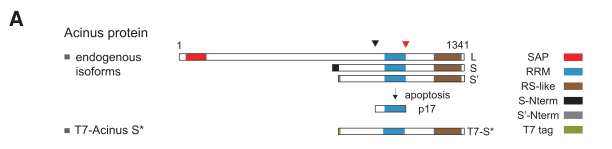

## Question

# Gene Research for Functional Annotation

## ⚠️ CRITICAL: Gene/Protein Identification Context

**BEFORE YOU BEGIN RESEARCH:** You MUST verify you are researching the CORRECT gene/protein. Gene symbols can be ambiguous, especially for less well-characterized genes from non-model organisms.

### Target Gene/Protein Identity (from UniProt):
- **UniProt Accession:** Q9UKV3
- **Protein Description:** RecName: Full=Apoptotic chromatin condensation inducer in the nucleus; Short=Acinus;
- **Gene Information:** Name=ACIN1; Synonyms=ACINUS, KIAA0670;
- **Organism (full):** Homo sapiens (Human).
- **Protein Family:** Not specified in UniProt
- **Key Domains:** Acinus_RRM. (IPR034257); EJC-associated_protein. (IPR052793); Nucleotide-bd_a/b_plait_sf. (IPR012677); RBD_domain_sf. (IPR035979); RSB_motif. (IPR032552)

### MANDATORY VERIFICATION STEPS:

1. **Check if the gene symbol "ACIN1" matches the protein description above**
2. **Verify the organism is correct:** Homo sapiens (Human).
3. **Check if protein family/domains align with what you find in literature**
4. **If you find literature for a DIFFERENT gene with the same or similar symbol, STOP**

### If Gene Symbol is Ambiguous or You Cannot Find Relevant Literature:

**DO NOT PROCEED WITH RESEARCH ON A DIFFERENT GENE.** Instead:
- State clearly: "The gene symbol 'ACIN1' is ambiguous or literature is limited for this specific protein"
- Explain what you found (e.g., "Found extensive literature on a different gene with the same symbol in a different organism")
- Describe the protein based ONLY on the UniProt information provided above
- Suggest that the protein function can be inferred from domain/family information

### Research Target:

Please provide a comprehensive research report on the gene **ACIN1** (gene ID: ACIN1, UniProt: Q9UKV3) in human.

The research report should be a detailed narrative explaining the function, biological processes, and localization of the gene product. Citations should be given for all claims.

You should prioritize authoritative reviews and primary scientific literature when conducting research. You can supplement
this with annotations you find in gene/protein databases, but these can be outdated or inaccurate.

We are specifically interested in the primary function of the gene - for enzymes, what reaction is catalyzed, and what is the substrate specificity? For transporters, what is the substrate? For structural proteins or adapters, what is the broader structural role? For signaling molecules, what is the role in the pathway.

We are interested in where in or outside the cell the gene product carries out its function.

We are also interested in the signaling or biochemical pathways in which the gene functions. We are less interested in broad pleiotropic effects, except where these elucidate the precise role.

Include evidence where possible. We are interested in both experimental evidence as well as inference from structure, evolution, or bioinformatic analysis. Precise studies should be prioritized over high-throughput, where available.

## Output

Question: You are an expert researcher providing comprehensive, well-cited information.

Provide detailed information focusing on:
1. Key concepts and definitions with current understanding
2. Recent developments and latest research (prioritize 2023-2024 sources)
3. Current applications and real-world implementations
4. Expert opinions and analysis from authoritative sources
5. Relevant statistics and data from recent studies

Format as a comprehensive research report with proper citations. Include URLs and publication dates where available.
Always prioritize recent, authoritative sources and provide specific citations for all major claims.

# Gene Research for Functional Annotation

## ⚠️ CRITICAL: Gene/Protein Identification Context

**BEFORE YOU BEGIN RESEARCH:** You MUST verify you are researching the CORRECT gene/protein. Gene symbols can be ambiguous, especially for less well-characterized genes from non-model organisms.

### Target Gene/Protein Identity (from UniProt):
- **UniProt Accession:** Q9UKV3
- **Protein Description:** RecName: Full=Apoptotic chromatin condensation inducer in the nucleus; Short=Acinus;
- **Gene Information:** Name=ACIN1; Synonyms=ACINUS, KIAA0670;
- **Organism (full):** Homo sapiens (Human).
- **Protein Family:** Not specified in UniProt
- **Key Domains:** Acinus_RRM. (IPR034257); EJC-associated_protein. (IPR052793); Nucleotide-bd_a/b_plait_sf. (IPR012677); RBD_domain_sf. (IPR035979); RSB_motif. (IPR032552)

### MANDATORY VERIFICATION STEPS:

1. **Check if the gene symbol "ACIN1" matches the protein description above**
2. **Verify the organism is correct:** Homo sapiens (Human).
3. **Check if protein family/domains align with what you find in literature**
4. **If you find literature for a DIFFERENT gene with the same or similar symbol, STOP**

### If Gene Symbol is Ambiguous or You Cannot Find Relevant Literature:

**DO NOT PROCEED WITH RESEARCH ON A DIFFERENT GENE.** Instead:
- State clearly: "The gene symbol 'ACIN1' is ambiguous or literature is limited for this specific protein"
- Explain what you found (e.g., "Found extensive literature on a different gene with the same symbol in a different organism")
- Describe the protein based ONLY on the UniProt information provided above
- Suggest that the protein function can be inferred from domain/family information

### Research Target:

Please provide a comprehensive research report on the gene **ACIN1** (gene ID: ACIN1, UniProt: Q9UKV3) in human.

The research report should be a detailed narrative explaining the function, biological processes, and localization of the gene product. Citations should be given for all claims.

You should prioritize authoritative reviews and primary scientific literature when conducting research. You can supplement
this with annotations you find in gene/protein databases, but these can be outdated or inaccurate.

We are specifically interested in the primary function of the gene - for enzymes, what reaction is catalyzed, and what is the substrate specificity? For transporters, what is the substrate? For structural proteins or adapters, what is the broader structural role? For signaling molecules, what is the role in the pathway.

We are interested in where in or outside the cell the gene product carries out its function.

We are also interested in the signaling or biochemical pathways in which the gene functions. We are less interested in broad pleiotropic effects, except where these elucidate the precise role.

Include evidence where possible. We are interested in both experimental evidence as well as inference from structure, evolution, or bioinformatic analysis. Precise studies should be prioritized over high-throughput, where available.

## Research report: Human **ACIN1** (Acinus) functional annotation (UniProt Q9UKV3)

### 0) Gene/protein identity verification (mandatory)
The UniProt accession **Q9UKV3** corresponds to human **ACIN1**, encoding **Acinus** ("Apoptotic chromatin condensation inducer in the nucleus"), an RNA-binding protein originally described in apoptosis and later linked to pre-mRNA processing. Peer-reviewed sources consistently use **ACIN1/Acinus** and describe it as a **nuclear** RNA-binding factor with **three major isoforms** (Acinus-L, Acinus-S′, Acinus-S) that share an **RNA recognition motif (RRM)** and a **C-terminal RS-like domain**; Acinus-L additionally contains an **N-terminal SAP domain** (rodor2016thernabindingprofile pages 1-2, rodor2016thernabindingprofile pages 2-3, deka2017multifacetedregulationof pages 2-3). A figure schematic of the isoforms and domain organization is shown in Rodor et al. (2016) (rodor2016thernabindingprofile media 9db37663).

### 1) Key concepts and definitions (current understanding)

#### 1.1 ACIN1 is a non-enzymatic RNA-binding scaffold/regulator
ACIN1 is not described as an enzyme or transporter; the core functional concept is that Acinus is an **RNA-binding protein (RBP)** that helps organize **post-transcriptional gene regulation**, particularly **pre-mRNA splicing** and exon-junction complex (EJC)-associated processes (rodor2016thernabindingprofile pages 1-2, rodor2016thernabindingprofile pages 9-10).

#### 1.2 ACIN1 in ASAP/PSAP and its relationship to the EJC
A central definition in the ACIN1 literature is that Acinus is a core component of the **ASAP (apoptosis- and splicing-associated protein) complex** together with **RNPS1** and **SAP18** (deka2017multifacetedregulationof pages 2-3, deka2017multifacetedregulationof pages 1-2). ASAP has been proposed to interface with the **EJC**, a multiprotein complex deposited ~20–24 nt upstream of exon–exon junctions after splicing; EJC core factors include **eIF4A3, Y14, MAGOH, and MLN51/CASC3** (rodor2016thernabindingprofile pages 1-2, deka2017multifacetedregulationof pages 1-2). In genome-wide RNA-binding data, Acinus shows binding patterns that can align with canonical EJC positions, and it can associate with eIF4A3 at canonical sites (deka2017multifacetedregulationof pages 2-3, rodor2016thernabindingprofile pages 9-10, rodor2016thernabindingprofile media b990c3b2).

#### 1.3 Apoptotic chromatin condensation and caspase cleavage
The apoptosis-linked definition of Acinus is tied to its **caspase-3 cleavage**, which yields a truncated **p17** fragment that retains the RRM and is associated with induction of **chromatin condensation** (and reported links to DNA fragmentation pathways) (rodor2016thernabindingprofile pages 1-2, abbas2024apoptosisinhibitor5 pages 4-6). Reviews also describe Acinus as a nuclear caspase-3-activated factor that participates in apoptotic chromatin changes (deka2017multifacetedregulationof pages 1-2).

### 2) Molecular functions and biological processes (mechanistic detail)

#### 2.1 Direct RNA binding and splicing regulation (primary mechanistic function)
The best-supported mechanistic function for ACIN1 is regulation of **pre-mRNA splicing** through direct RNA binding.

* **RNA-binding specificity and binding distribution:** In HeLa cells, iCLIP mapping shows Acinus binds both **pre-mRNAs and spliced mRNAs**, with binding enriched in exons and also present in introns with enrichment near splice sites and a preference for certain “suboptimal” introns (rodor2016thernabindingprofile pages 1-2, rodor2016thernabindingprofile pages 9-10, rodor2016thernabindingprofile media 84ab139e).
* **Functional outcomes of ACIN1 depletion:** RNA-seq after siRNA-mediated depletion of Acinus shows it is required for inclusion of specific **alternative cassette exons** and for **faithful splicing** of subsets of introns (rodor2016thernabindingprofile pages 1-2).
* **A mechanistically informative target—DFFA/ICAD:** Rodor et al. report that Acinus regulates splicing of the **DFFA/ICAD** transcript, a key regulator of apoptotic DNA fragmentation (rodor2016thernabindingprofile pages 1-2). A review synthesizes the mechanistic link: Acinus depletion can drive intron retention in ICAD leading to a shorter nonfunctional ICAD isoform, thereby impairing CAD-mediated DNA fragmentation upon apoptotic stimuli (deka2017multifacetedregulationof pages 12-13).

Interpretation: Collectively, these data support a model where ACIN1 contributes to splice-site choice and exon/intron definition in a **targeted**, transcript-specific way, rather than acting as a general core spliceosome component.

#### 2.2 ACIN1 as a structural node in ASAP/PSAP assemblies
Biochemical and structural work summarized in a review describes ASAP as a heterotrimer of **RNPS1 (~50 kDa), Acinus-L (~220 kDa), and SAP18 (~18 kDa)**, identified by mass spectrometry and characterized structurally (deka2017multifacetedregulationof pages 2-3). The key interaction platform is formed by the **RNPS1 RRM**, **SAP18 UBL fold**, and the **Acinus RSB motif**, whose helices contact SAP18 and RNPS1 (deka2017multifacetedregulationof pages 2-3). The same review notes that RNPS1 and SAP18 can also interact with **Pinin (PNN)**, forming an alternative **PSAP** complex (deka2017multifacetedregulationof pages 2-3). 

Interpretation: This architecture is consistent with ACIN1 being a scaffold that couples RNA binding (via RRM and complex-mediated RNA association) to larger mRNP assemblies.

#### 2.3 Apoptosis-related chromatin effects
Acinus’s apoptosis role is strongly linked to caspase processing and nuclear chromatin changes. Acinus is a **caspase-3 target**, and caspase-3 cleavage generates an active p17 fragment that can induce chromatin condensation (rodor2016thernabindingprofile pages 1-2, abbas2024apoptosisinhibitor5 pages 4-6). A review also describes that cleavage of the SAP motif in Acinus-L can compromise chromatin scaffold binding and potentially disrupt chromatin organization during apoptosis (deka2017multifacetedregulationof pages 10-12).

### 3) Subcellular localization and where ACIN1 acts
Across mechanistic studies and reviews, ACIN1 is treated as a predominantly **nuclear** protein, acting in nuclear mRNP/splicing contexts and described as “in the nucleus” in its nomenclature and functional characterization (rodor2016thernabindingprofile pages 1-2, deka2017multifacetedregulationof pages 1-2). In translational network analyses of HCC, ACIN1-associated genes are enriched in **nuclear speck/nucleoplasm/spliceosomal complex/EJC** terms, reinforcing a nucleus-centered role (tang2024analysisofthe pages 4-7).

A key localization concept is that the **SAP motif** in Acinus-L supports chromatin targeting via AT-rich scaffold/matrix attachment regions (SARS/MARS) and links the complex to chromatin-regulatory machinery via SAP18’s connection to Sin3/HDAC systems (deka2017multifacetedregulationof pages 2-3, deka2017multifacetedregulationof pages 1-2).

### 4) Recent developments and latest research (prioritizing 2023–2024)

#### 4.1 2024: Anti-apoptotic regulation of ACIN1 cleavage by API5
A 2024 review of API5 highlights an experimentally supported interaction in which **API5 binds Acinus**, protects it from **caspase-3 cleavage**, and thereby prevents Acinus-mediated apoptotic DNA fragmentation/p17 generation (abbas2024apoptosisinhibitor5 pages 4-6). This is a concrete mechanistic node connecting ACIN1 to apoptosis regulation and cancer cell survival signaling.

#### 4.2 2024: HCC expression upregulation and regulatory network inference
Tang et al. (April 2024) report **significant upregulation of Acin1 in hepatocellular carcinoma** in a mouse HCC model by whole-transcriptome sequencing and RT-qPCR validation (**P < 0.001**), with DE thresholds |log2(FPKM ratio)| > 1 and Q < 0.05 (tang2024analysisofthe pages 4-7, tang2024analysisofthe pages 2-4). They identify a PPI neighborhood (37 proteins; top-10 list includes **Eif4a3, Rnps1, Sap18b, Srrm2, Hnrnpu, Akt1** among others) and functional enrichment for spliceosome/EJC and mRNA surveillance pathways (tang2024analysisofthe pages 4-7). They also propose a ceRNA/miRNA regulatory layer: a ceRNA network (2 lncRNAs, 50 miRNAs, 49 mRNAs) and miRNAs negatively correlated with Acin1 (miR-6395, miR-674-5p, miR-7067-5p), with **miR-674-5p** predicted to target Acin1 by multiple databases (tang2024analysisofthe pages 4-7).

Interpretation: This work is association- and network-heavy; it strengthens the view that ACIN1 sits in nuclear RNA-processing neighborhoods in cancer, but it does not by itself demonstrate causal mechanism in HCC (tang2024analysisofthe pages 4-7).

#### 4.3 2024: Proteomics-driven apoptosis context in lung adenocarcinoma cells
A 2024 study in A549 cells (lung adenocarcinoma) using quantitative proteomics reports that activation of TRAIL-DR5 signaling and caspase cascades is associated with increased ACIN1, positioning ACIN1 as part of a caspase-linked apoptotic program in this context (treatment: strophanthidin) (tian2024; from paper metadata and abstract snippet) (tang2024analysisofthe pages 4-7).

Limitations of 2023–2024 coverage: In the retrieved corpus, 2024 sources were available and informative, but 2023 ACIN1-specific mechanistic papers were not retrieved by the search calls used here.

### 5) Pathways and networks involving ACIN1 (integrated view)

#### 5.1 Splicing/EJC-centered post-transcriptional regulation
ACIN1 connects to the EJC via peripheral association and colocalization with canonical EJC sites and eIF4A3 in iCLIP studies (rodor2016thernabindingprofile pages 9-10, rodor2016thernabindingprofile media b990c3b2). The ASAP complex provides a mechanistic bridge between classical splicing regulators (e.g., RNPS1) and chromatin-associated modules (via SAP18 and the Acinus SAP motif), potentially enabling coordinated regulation across transcription/splicing/mRNP maturation (deka2017multifacetedregulationof pages 2-3, deka2017multifacetedregulationof pages 1-2).

#### 5.2 Apoptosis execution and chromatin remodeling
ACIN1 can be proteolytically switched by caspase-3 to a p17 fragment that promotes chromatin condensation, and this switch is modulated by interacting proteins such as API5 (abbas2024apoptosisinhibitor5 pages 4-6). Splicing regulation of ICAD/DFFA by ACIN1 provides a second, indirect route to influence DNA fragmentation downstream of apoptotic stimuli by controlling availability of functional ICAD/CAD machinery (deka2017multifacetedregulationof pages 12-13).

### 6) Current applications and real-world implementations

#### 6.1 ACIN1 as a candidate biomarker/association signal in cancer
Recent work supports ACIN1 as a **biomarker candidate** (expression association) rather than a validated drug target.

* **Hepatocellular carcinoma (2024):** ACIN1 overexpression in tumor vs control tissues (P < 0.001) and network position among RNA-processing factors provide a rationale for follow-up validation as a biomarker or mechanistic node (tang2024analysisofthe pages 4-7, tang2024analysisofthe pages 2-4).
* **Cervical cancer (2022):** ACIN1 is positioned downstream of **METTL3/IGF2BP3**, with evidence that METTL3 affects ACIN1 m6A enrichment and mRNA stability and that ACIN1 overexpression rescues phenotypes caused by METTL3 depletion (su2022methyltransferaselike3induces pages 4-8). (METTL3 itself shows strong diagnostic performance in that study with AUC 0.9681, P < 0.0001; ACIN1 is part of the proposed axis.) (su2022methyltransferaselike3induces pages 4-8)

#### 6.2 Clinical trials and therapeutic targeting status
A registry search using ACIN1/Acinus terms returned studies that were not ACIN1-targeted interventional trials (nonspecific keyword matches); thus, there is no evidence here of ACIN1 being directly targeted clinically as of the retrieved trial records (clinical_trials_search results; no citeable ACIN1-specific trial evidence in retrieved chunks).

### 7) Expert opinion and authoritative synthesis
Two sources in the retrieved set provide higher-level synthesis:

* A dedicated review of the ASAP complex positions ACIN1 as a **multi-functional regulator linking RNA processing and apoptosis**, emphasizing ASAP’s interactions with EJC-related pathways and chromatin regulatory linkages via SAP18/HDAC, while noting unresolved aspects of how directly ASAP associates with EJC in all contexts (deka2017multifacetedregulationof pages 1-2, deka2017multifacetedregulationof pages 10-12).
* A 2024 review focused on API5 highlights ACIN1 as a mechanistically tractable effector whose caspase-3 processing can be blocked by API5 binding, underscoring ACIN1’s relevance in cell-fate control and cancer-associated apoptosis resistance paradigms (abbas2024apoptosisinhibitor5 pages 4-6).

### 8) Relevant statistics and recent data points (selected)
* **HCC (Apr 2024):** ACIN1 significantly upregulated in tumor vs controls (**P < 0.001**); DE criteria |log2(FPKM ratio)| > 1 and Q < 0.05; ceRNA network size 2 lncRNAs, 50 miRNAs, 49 mRNAs; negatively correlated miRNAs include miR-6395, miR-674-5p, miR-7067-5p (tang2024analysisofthe pages 4-7, tang2024analysisofthe pages 2-4).
* **Cervical cancer (Mar 2022):** METTL3 diagnostic statistic AUC = 0.9681 (P < 0.0001) in a study proposing METTL3→IGF2BP3→ACIN1 mRNA stability regulation (su2022methyltransferaselike3induces pages 4-8).
* **Open Targets (platform evidence):** ACIN1 shows disease associations (e.g., hepatocellular carcinoma, neurodegenerative disease) with modest scores in the retrieved snapshot (OpenTargets Search: -ACIN1).

### 9) Evidence map (summary table)
The following table consolidates identity, domains, complexes, functions, localization, regulation, recent (2024) developments, and translational statistics with URLs and citations.

| Category | Key points | Key evidence/citations | Publication (first author year) | URL |
|---|---|---|---|---|
| Identity/isoforms/domains | Verified target is human ACIN1 or Acinus (UniProt Q9UKV3), a nuclear RNA-binding protein. Three main isoforms are described: Acinus-L, Acinus-S′, and Acinus-S. All share an RRM and C-terminal RS-like domain; Acinus-L additionally contains an N-terminal SAP domain. ASAP structural work identifies an RSB motif in Acinus that binds RNPS1 and SAP18. | Isoforms and domain architecture are explicitly described in peer-reviewed sources; figure evidence shows SAP, RRM, and RS-like organization (deka2017multifacetedregulationof pages 2-3, rodor2016thernabindingprofile pages 1-2, rodor2016thernabindingprofile pages 2-3, rodor2016thernabindingprofile media 9db37663) | Deka 2017; Rodor 2016 | https://doi.org/10.7150/ijbs.18649 ; https://doi.org/10.1261/rna.057158.116 |
| Complexes/partners | ACIN1 is a core component of the ASAP complex with RNPS1 and SAP18; related work indicates an alternative PSAP complex with PNN. ACIN1 is a peripheral or auxiliary EJC component associated with core EJC proteins including eIF4A3, Y14, MAGOH, and MLN51 or CASC3. An additional experimentally supported partner is API5, which binds ACIN1 and modulates apoptotic cleavage. | Mass spectrometry, structural, iCLIP, and yeast-two-hybrid evidence support ASAP, PSAP, and EJC associations and API5 binding (rodor2016thernabindingprofile pages 1-2, deka2017multifacetedregulationof pages 10-12, deka2017multifacetedregulationof pages 2-3, abbas2024apoptosisinhibitor5 pages 4-6, deka2017multifacetedregulationof pages 1-2, rodor2016thernabindingprofile pages 9-10) | Rodor 2016; Deka 2017; Abbas 2024 | https://doi.org/10.1261/rna.057158.116 ; https://doi.org/10.7150/ijbs.18649 ; https://doi.org/10.3390/biom14010136 |
| Molecular functions | ACIN1 is not an enzyme or transporter; its primary function is as a nuclear RNA-binding scaffold or regulator that helps coordinate pre-mRNA splicing, exon and intron definition, and EJC-linked post-transcriptional regulation. It binds pre-mRNAs and spliced mRNAs, especially suboptimal introns, promotes inclusion of selected cassette exons, and supports faithful splicing of certain introns, including DFFA or ICAD. In apoptosis, caspase-processed ACIN1 promotes chromatin condensation and contributes to DNA fragmentation pathways. | iCLIP, RNA-seq, siRNA depletion, and apoptosis studies support splicing and apoptotic functions (rodor2016thernabindingprofile pages 1-2, deka2017multifacetedregulationof pages 12-13, rodor2016thernabindingprofile pages 9-10) | Rodor 2016; Deka 2017 | https://doi.org/10.1261/rna.057158.116 ; https://doi.org/10.7150/ijbs.18649 |
| Cellular localization | ACIN1 acts mainly in the nucleus, including nuclear speck, nucleoplasm, and chromatin-associated contexts. The SAP motif contributes to chromatin targeting via binding to AT-rich SARs or MARs and influences isoform-specific subcellular localization. ACIN1 also shows EJC-related RNA association and has been discussed in mRNP or export contexts, but its principal annotated site of action is nuclear. | Nuclear localization and chromatin targeting are described across ASAP and EJC studies and reviews; HCC enrichment also places ACIN1-associated genes in nuclear speck and spliceosomal compartments (deka2017multifacetedregulationof pages 2-3, rodor2016thernabindingprofile pages 1-2, deka2017multifacetedregulationof pages 1-2, tang2024analysisofthe pages 4-7) | Deka 2017; Rodor 2016; Tang 2024 | https://doi.org/10.7150/ijbs.18649 ; https://doi.org/10.1261/rna.057158.116 ; https://doi.org/10.5152/tjg.2024.23454 |
| Regulation/PTMs | A key regulatory event is caspase-3 cleavage of ACIN1, generating the active p17 fragment that promotes apoptotic chromatin condensation. API5 binding protects ACIN1 from caspase-3 cleavage and blocks ACIN1-mediated DNA fragmentation. Prior work summarized in reviews also notes Akt phosphorylation can inhibit ACIN1 proteolysis and chromatin condensation, and SRPK2 phosphorylation links ACIN1 to growth-related splicing regulation. | Cleavage and protection by API5 are summarized in a 2024 review; phosphorylation and PTM links are summarized in review literature (abbas2024apoptosisinhibitor5 pages 4-6, teixeira2025acinusaputative pages 11-12, deka2017multifacetedregulationof pages 12-13) | Abbas 2024; Deka 2017 | https://doi.org/10.3390/biom14010136 ; https://doi.org/10.7150/ijbs.18649 |
| Recent 2024 developments | 2024 literature adds translational and systems-level context. In HCC, ACIN1 is reported as upregulated and embedded in a network enriched for EJC, spliceosome, and nuclear speck biology, with predicted regulation by miR-674-5p and related ceRNA components. A 2024 review highlights API5 and ACIN1 as a direct anti-apoptotic mechanism. A 2024 proteomics and apoptosis study in A549 lung adenocarcinoma identifies increased ACIN1 in the context of TRAIL-DR5 and caspase activation. | Recent developments come from 2024 primary and review papers (tang2024analysisofthe pages 7-9, tang2024analysisofthe pages 4-7, abbas2024apoptosisinhibitor5 pages 4-6) | Tang 2024; Abbas 2024; Tian 2024 | https://doi.org/10.5152/tjg.2024.23454 ; https://doi.org/10.3390/biom14010136 ; https://doi.org/10.3390/molecules29040877 |
| Disease/translational evidence | ACIN1 has emerging biomarker or association value rather than established direct therapeutic targeting. Evidence links ACIN1 to hepatocellular carcinoma overexpression and ceRNA or miRNA regulation, cervical cancer through METTL3 and IGF2BP3-mediated mRNA stabilization, and prior reports of elevated platelet ACIN1 mRNA in lung cancer. Open Targets shows disease associations including HCC, acute lymphoblastic leukemia, and neurodegenerative disease, but evidence strength is currently modest for most indications. No direct ACIN1-targeted clinical trials were identified in the registry search. | Translational associations are from HCC, cervical cancer, and Open Targets evidence synthesis (tang2024analysisofthe pages 4-7, tang2024analysisofthe pages 1-2, OpenTargets Search: -ACIN1, su2022methyltransferaselike3induces pages 4-8) | Tang 2024; Su 2022; Open Targets 2025 platform query | https://doi.org/10.5152/tjg.2024.23454 ; https://doi.org/10.1080/21655979.2022.2044261 |
| Quantitative stats | HCC data show ACIN1 significantly upregulated in tumor versus paracancerous and healthy tissue with P less than .001; differential-expression thresholds were absolute log2 FPKM ratio greater than 1 and Q less than .05. PPI analysis identified 37 closely related proteins; the top 10 were Slc3a2, Wiz, Srrm2, Akt1, Hnrnpu, Sap18b, Pabpn1, Ddx39b, Eif4a3, and Rnps1. The ceRNA network size was 2 lncRNAs, 50 miRNAs, and 49 mRNAs; negatively correlated miRNAs included miR-6395, miR-674-5p, and miR-7067-5p. In cervical cancer, METTL3 showed AUC 0.9681 and P less than 0.0001 in the study that positioned ACIN1 downstream of METTL3 and IGF2BP3. Open Targets disease-target scores in the retrieved query were about 0.062 for HCC and 0.549 for neurodegenerative disease. | Quantitative values extracted directly from gathered evidence (tang2024analysisofthe pages 4-7, tang2024analysisofthe pages 2-4, OpenTargets Search: -ACIN1, su2022methyltransferaselike3induces pages 4-8) | Tang 2024; Su 2022; Open Targets 2025 platform query | https://doi.org/10.5152/tjg.2024.23454 ; https://doi.org/10.1080/21655979.2022.2044261 |

*Table: This table summarizes verified identity, domains, complexes, molecular functions, localization, regulation, recent 2024 developments, and translational evidence for human ACIN1 or Acinus (UniProt Q9UKV3). It provides a compact evidence map linking functional annotation to specific cited sources and quantitative findings.*

### 10) Key takeaways (functional annotation)
1. **Primary molecular role:** ACIN1 (Acinus) functions primarily as a **nuclear RNA-binding splicing regulator/scaffold**, acting through direct RNA binding and through assembly into **ASAP/PSAP** complexes that interface with EJC-associated mRNP biology (rodor2016thernabindingprofile pages 1-2, deka2017multifacetedregulationof pages 2-3, rodor2016thernabindingprofile pages 9-10).
2. **Pathway placement:** ACIN1 links **pre-mRNA splicing** to **apoptosis**, both by regulating splicing of apoptosis-related transcripts (e.g., DFFA/ICAD) and by being a caspase-3 substrate that yields a chromatin-condensation-promoting fragment (deka2017multifacetedregulationof pages 12-13, abbas2024apoptosisinhibitor5 pages 4-6).
3. **Where it acts:** Predominantly **nuclear** (nuclear speck/nucleoplasm/chromatin-associated contexts), consistent with its roles in splicing and chromatin condensation (deka2017multifacetedregulationof pages 1-2, tang2024analysisofthe pages 4-7).
4. **Recent 2024 direction:** Emphasis has shifted toward (i) **cancer-relevant regulation** (expression upregulation and miRNA/ceRNA hypotheses in HCC) and (ii) **protein-interaction checkpoints** controlling apoptotic cleavage (API5–Acinus) (tang2024analysisofthe pages 4-7, abbas2024apoptosisinhibitor5 pages 4-6).

### URLs and publication dates for key sources used
* Rodor et al. **2016-06**. RNA. “The RNA-binding profile of Acinus…” https://doi.org/10.1261/rna.057158.116 (rodor2016thernabindingprofile pages 1-2)
* Deka & Singh **2017-04**. Int J Biol Sci. “Multifaceted Regulation…” https://doi.org/10.7150/ijbs.18649 (deka2017multifacetedregulationof pages 1-2)
* Abbas et al. **2024-01**. Biomolecules. “Apoptosis Inhibitor 5…” https://doi.org/10.3390/biom14010136 (abbas2024apoptosisinhibitor5 pages 4-6)
* Tang et al. **2024-04**. Turk J Gastroenterol. “Analysis of the Upregulated Expression Mechanism…” https://doi.org/10.5152/tjg.2024.23454 (tang2024analysisofthe pages 4-7)
* Su et al. **2022-03**. Bioengineered. “METTL3 induces cervical cancer…” https://doi.org/10.1080/21655979.2022.2044261 (su2022methyltransferaselike3induces pages 4-8)

References

1. (rodor2016thernabindingprofile pages 1-2): Julie Rodor, Qun Pan, Benjamin J. Blencowe, Eduardo Eyras, and Javier F. Cáceres. The rna-binding profile of acinus, a peripheral component of the exon junction complex, reveals its role in splicing regulation. RNA, 22:1411-1426, Jun 2016. URL: https://doi.org/10.1261/rna.057158.116, doi:10.1261/rna.057158.116. This article has 52 citations and is from a domain leading peer-reviewed journal.

2. (rodor2016thernabindingprofile pages 2-3): Julie Rodor, Qun Pan, Benjamin J. Blencowe, Eduardo Eyras, and Javier F. Cáceres. The rna-binding profile of acinus, a peripheral component of the exon junction complex, reveals its role in splicing regulation. RNA, 22:1411-1426, Jun 2016. URL: https://doi.org/10.1261/rna.057158.116, doi:10.1261/rna.057158.116. This article has 52 citations and is from a domain leading peer-reviewed journal.

3. (deka2017multifacetedregulationof pages 2-3): Bhagyashree Deka and Kusum Kumari Singh. Multifaceted regulation of gene expression by the apoptosis- and splicing-associated protein complex and its components. International Journal of Biological Sciences, 13:545-560, Apr 2017. URL: https://doi.org/10.7150/ijbs.18649, doi:10.7150/ijbs.18649. This article has 31 citations and is from a peer-reviewed journal.

4. (rodor2016thernabindingprofile media 9db37663): Julie Rodor, Qun Pan, Benjamin J. Blencowe, Eduardo Eyras, and Javier F. Cáceres. The rna-binding profile of acinus, a peripheral component of the exon junction complex, reveals its role in splicing regulation. RNA, 22:1411-1426, Jun 2016. URL: https://doi.org/10.1261/rna.057158.116, doi:10.1261/rna.057158.116. This article has 52 citations and is from a domain leading peer-reviewed journal.

5. (rodor2016thernabindingprofile pages 9-10): Julie Rodor, Qun Pan, Benjamin J. Blencowe, Eduardo Eyras, and Javier F. Cáceres. The rna-binding profile of acinus, a peripheral component of the exon junction complex, reveals its role in splicing regulation. RNA, 22:1411-1426, Jun 2016. URL: https://doi.org/10.1261/rna.057158.116, doi:10.1261/rna.057158.116. This article has 52 citations and is from a domain leading peer-reviewed journal.

6. (deka2017multifacetedregulationof pages 1-2): Bhagyashree Deka and Kusum Kumari Singh. Multifaceted regulation of gene expression by the apoptosis- and splicing-associated protein complex and its components. International Journal of Biological Sciences, 13:545-560, Apr 2017. URL: https://doi.org/10.7150/ijbs.18649, doi:10.7150/ijbs.18649. This article has 31 citations and is from a peer-reviewed journal.

7. (rodor2016thernabindingprofile media b990c3b2): Julie Rodor, Qun Pan, Benjamin J. Blencowe, Eduardo Eyras, and Javier F. Cáceres. The rna-binding profile of acinus, a peripheral component of the exon junction complex, reveals its role in splicing regulation. RNA, 22:1411-1426, Jun 2016. URL: https://doi.org/10.1261/rna.057158.116, doi:10.1261/rna.057158.116. This article has 52 citations and is from a domain leading peer-reviewed journal.

8. (abbas2024apoptosisinhibitor5 pages 4-6): Hafsia Abbas, Dalia Kheira Derkaoui, Louise Jeammet, Emilie Adicéam, Jérôme Tiollier, Hélène Sicard, Thorsten Braun, and Jean-Luc Poyet. Apoptosis inhibitor 5: a multifaceted regulator of cell fate. Biomolecules, 14:136, Jan 2024. URL: https://doi.org/10.3390/biom14010136, doi:10.3390/biom14010136. This article has 15 citations.

9. (rodor2016thernabindingprofile media 84ab139e): Julie Rodor, Qun Pan, Benjamin J. Blencowe, Eduardo Eyras, and Javier F. Cáceres. The rna-binding profile of acinus, a peripheral component of the exon junction complex, reveals its role in splicing regulation. RNA, 22:1411-1426, Jun 2016. URL: https://doi.org/10.1261/rna.057158.116, doi:10.1261/rna.057158.116. This article has 52 citations and is from a domain leading peer-reviewed journal.

10. (deka2017multifacetedregulationof pages 12-13): Bhagyashree Deka and Kusum Kumari Singh. Multifaceted regulation of gene expression by the apoptosis- and splicing-associated protein complex and its components. International Journal of Biological Sciences, 13:545-560, Apr 2017. URL: https://doi.org/10.7150/ijbs.18649, doi:10.7150/ijbs.18649. This article has 31 citations and is from a peer-reviewed journal.

11. (deka2017multifacetedregulationof pages 10-12): Bhagyashree Deka and Kusum Kumari Singh. Multifaceted regulation of gene expression by the apoptosis- and splicing-associated protein complex and its components. International Journal of Biological Sciences, 13:545-560, Apr 2017. URL: https://doi.org/10.7150/ijbs.18649, doi:10.7150/ijbs.18649. This article has 31 citations and is from a peer-reviewed journal.

12. (tang2024analysisofthe pages 4-7): Yuliang Tang, Anni Ni, Lishuang Sun, Shu Li, and Genliang Li. Analysis of the upregulated expression mechanism of apoptotic chromatin condensation inducer 1 in hepatocellular carcinoma based on bioinformatics. The Turkish Journal of Gastroenterology, 35:307-315, Apr 2024. URL: https://doi.org/10.5152/tjg.2024.23454, doi:10.5152/tjg.2024.23454. This article has 3 citations.

13. (tang2024analysisofthe pages 2-4): Yuliang Tang, Anni Ni, Lishuang Sun, Shu Li, and Genliang Li. Analysis of the upregulated expression mechanism of apoptotic chromatin condensation inducer 1 in hepatocellular carcinoma based on bioinformatics. The Turkish Journal of Gastroenterology, 35:307-315, Apr 2024. URL: https://doi.org/10.5152/tjg.2024.23454, doi:10.5152/tjg.2024.23454. This article has 3 citations.

14. (su2022methyltransferaselike3induces pages 4-8): Cui-hong Su, Yan Zhang, Ping Chen, Wei-Kang Yang, Jiaqi Du, and Danfeng Zhang. Methyltransferase-like 3 induces the development of cervical cancer by enhancing insulin-like growth factor 2 mrna-binding proteins 3-mediated apoptotic chromatin condensation inducer 1 mrna stability. Bioengineered, 13:7034-7048, Mar 2022. URL: https://doi.org/10.1080/21655979.2022.2044261, doi:10.1080/21655979.2022.2044261. This article has 18 citations.

15. (OpenTargets Search: -ACIN1): Open Targets Query (-ACIN1, 5 results). Buniello, A. et al. (2025). Open Targets Platform: facilitating therapeutic hypotheses building in drug discovery. Nucleic Acids Research.

16. (teixeira2025acinusaputative pages 11-12): Felipe Castro Teixeira, Victor Breno Faustino Bezerra, Jochuan Israel Bezerra do Nascimento, João Victor Dourado Alves Brito, Gabriela Oliveira Matos, Lorenna Maria Neves Freitas, and Murilo Siqueira Alves. Acinus: a putative integrant of programmed cell death in plants. Discover Plants, Nov 2025. URL: https://doi.org/10.1007/s44372-025-00406-x, doi:10.1007/s44372-025-00406-x. This article has 0 citations.

17. (tang2024analysisofthe pages 7-9): Yuliang Tang, Anni Ni, Lishuang Sun, Shu Li, and Genliang Li. Analysis of the upregulated expression mechanism of apoptotic chromatin condensation inducer 1 in hepatocellular carcinoma based on bioinformatics. The Turkish Journal of Gastroenterology, 35:307-315, Apr 2024. URL: https://doi.org/10.5152/tjg.2024.23454, doi:10.5152/tjg.2024.23454. This article has 3 citations.

18. (tang2024analysisofthe pages 1-2): Yuliang Tang, Anni Ni, Lishuang Sun, Shu Li, and Genliang Li. Analysis of the upregulated expression mechanism of apoptotic chromatin condensation inducer 1 in hepatocellular carcinoma based on bioinformatics. The Turkish Journal of Gastroenterology, 35:307-315, Apr 2024. URL: https://doi.org/10.5152/tjg.2024.23454, doi:10.5152/tjg.2024.23454. This article has 3 citations.

## Artifacts

- [Edison artifact artifact-00](ACIN1-deep-research-falcon_artifacts/artifact-00.md)

## Citations

1. deka2017multifacetedregulationof pages 1-2
2. rodor2016thernabindingprofile pages 1-2
3. deka2017multifacetedregulationof pages 12-13
4. deka2017multifacetedregulationof pages 2-3
5. deka2017multifacetedregulationof pages 10-12
6. tang2024analysisofthe pages 4-7
7. rodor2016thernabindingprofile pages 2-3
8. rodor2016thernabindingprofile pages 9-10
9. tang2024analysisofthe pages 2-4
10. teixeira2025acinusaputative pages 11-12
11. tang2024analysisofthe pages 7-9
12. tang2024analysisofthe pages 1-2
13. https://doi.org/10.7150/ijbs.18649
14. https://doi.org/10.1261/rna.057158.116
15. https://doi.org/10.3390/biom14010136
16. https://doi.org/10.5152/tjg.2024.23454
17. https://doi.org/10.3390/molecules29040877
18. https://doi.org/10.1080/21655979.2022.2044261
19. https://doi.org/10.1261/rna.057158.116,
20. https://doi.org/10.7150/ijbs.18649,
21. https://doi.org/10.3390/biom14010136,
22. https://doi.org/10.5152/tjg.2024.23454,
23. https://doi.org/10.1080/21655979.2022.2044261,
24. https://doi.org/10.1007/s44372-025-00406-x,