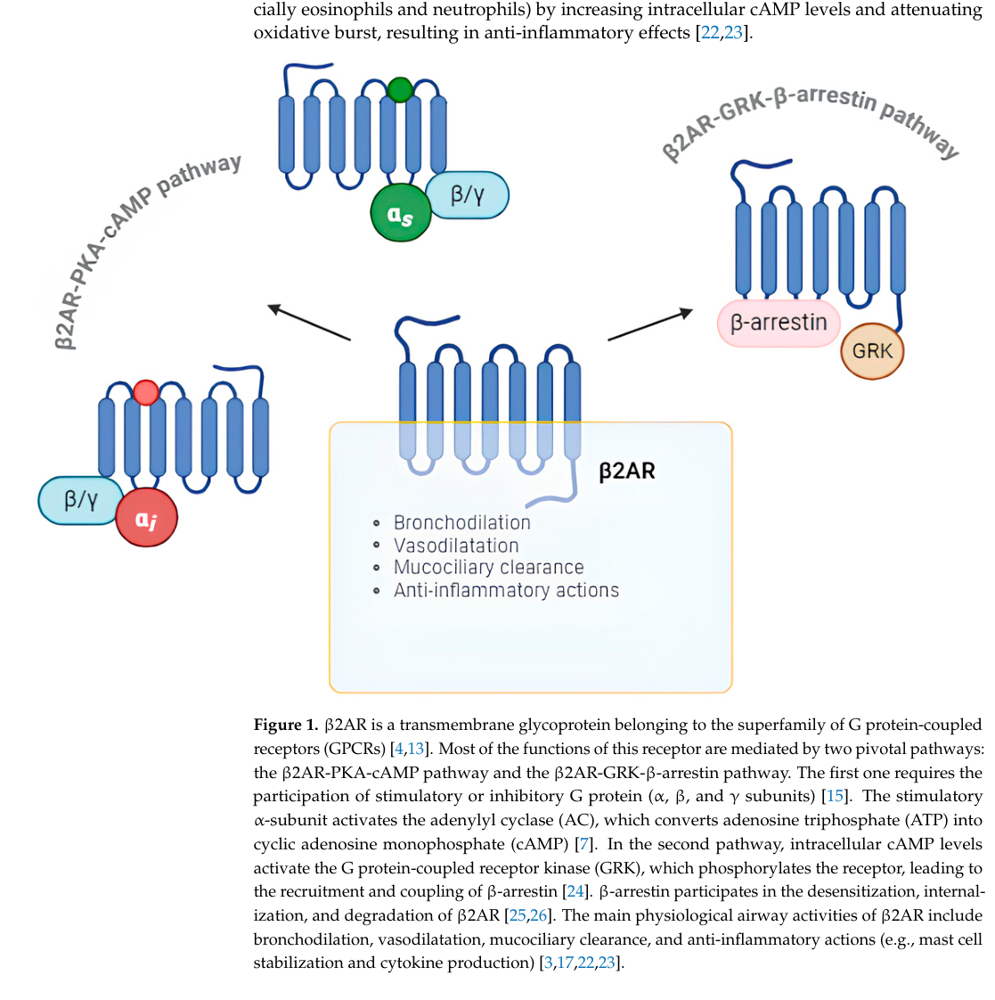

## Question

# Gene Research for Functional Annotation

## ⚠️ CRITICAL: Gene/Protein Identification Context

**BEFORE YOU BEGIN RESEARCH:** You MUST verify you are researching the CORRECT gene/protein. Gene symbols can be ambiguous, especially for less well-characterized genes from non-model organisms.

### Target Gene/Protein Identity (from UniProt):
- **UniProt Accession:** P07550
- **Protein Description:** RecName: Full=Beta-2 adrenergic receptor {ECO:0000303|PubMed:3034889}; AltName: Full=Beta-2 adrenoreceptor; Short=Beta-2 adrenoceptor;
- **Gene Information:** Name=ADRB2 {ECO:0000312|HGNC:HGNC:286}; Synonyms=ADRB2R, B2AR;
- **Organism (full):** Homo sapiens (Human).
- **Protein Family:** Belongs to the G-protein coupled receptor 1 family.
- **Key Domains:** ADR_fam. (IPR002233); ADRB2_rcpt. (IPR000332); GPCR_Rhodpsn. (IPR000276); GPCR_Rhodpsn_7TM. (IPR017452); 7tm_1 (PF00001)

### MANDATORY VERIFICATION STEPS:

1. **Check if the gene symbol "ADRB2" matches the protein description above**
2. **Verify the organism is correct:** Homo sapiens (Human).
3. **Check if protein family/domains align with what you find in literature**
4. **If you find literature for a DIFFERENT gene with the same or similar symbol, STOP**

### If Gene Symbol is Ambiguous or You Cannot Find Relevant Literature:

**DO NOT PROCEED WITH RESEARCH ON A DIFFERENT GENE.** Instead:
- State clearly: "The gene symbol 'ADRB2' is ambiguous or literature is limited for this specific protein"
- Explain what you found (e.g., "Found extensive literature on a different gene with the same symbol in a different organism")
- Describe the protein based ONLY on the UniProt information provided above
- Suggest that the protein function can be inferred from domain/family information

### Research Target:

Please provide a comprehensive research report on the gene **ADRB2** (gene ID: ADRB2, UniProt: P07550) in human.

The research report should be a detailed narrative explaining the function, biological processes, and localization of the gene product. Citations should be given for all claims.

You should prioritize authoritative reviews and primary scientific literature when conducting research. You can supplement
this with annotations you find in gene/protein databases, but these can be outdated or inaccurate.

We are specifically interested in the primary function of the gene - for enzymes, what reaction is catalyzed, and what is the substrate specificity? For transporters, what is the substrate? For structural proteins or adapters, what is the broader structural role? For signaling molecules, what is the role in the pathway.

We are interested in where in or outside the cell the gene product carries out its function.

We are also interested in the signaling or biochemical pathways in which the gene functions. We are less interested in broad pleiotropic effects, except where these elucidate the precise role.

Include evidence where possible. We are interested in both experimental evidence as well as inference from structure, evolution, or bioinformatic analysis. Precise studies should be prioritized over high-throughput, where available.

## Output

Question: You are an expert researcher providing comprehensive, well-cited information.

Provide detailed information focusing on:
1. Key concepts and definitions with current understanding
2. Recent developments and latest research (prioritize 2023-2024 sources)
3. Current applications and real-world implementations
4. Expert opinions and analysis from authoritative sources
5. Relevant statistics and data from recent studies

Format as a comprehensive research report with proper citations. Include URLs and publication dates where available.
Always prioritize recent, authoritative sources and provide specific citations for all major claims.

# Gene Research for Functional Annotation

## ⚠️ CRITICAL: Gene/Protein Identification Context

**BEFORE YOU BEGIN RESEARCH:** You MUST verify you are researching the CORRECT gene/protein. Gene symbols can be ambiguous, especially for less well-characterized genes from non-model organisms.

### Target Gene/Protein Identity (from UniProt):
- **UniProt Accession:** P07550
- **Protein Description:** RecName: Full=Beta-2 adrenergic receptor {ECO:0000303|PubMed:3034889}; AltName: Full=Beta-2 adrenoreceptor; Short=Beta-2 adrenoceptor;
- **Gene Information:** Name=ADRB2 {ECO:0000312|HGNC:HGNC:286}; Synonyms=ADRB2R, B2AR;
- **Organism (full):** Homo sapiens (Human).
- **Protein Family:** Belongs to the G-protein coupled receptor 1 family.
- **Key Domains:** ADR_fam. (IPR002233); ADRB2_rcpt. (IPR000332); GPCR_Rhodpsn. (IPR000276); GPCR_Rhodpsn_7TM. (IPR017452); 7tm_1 (PF00001)

### MANDATORY VERIFICATION STEPS:

1. **Check if the gene symbol "ADRB2" matches the protein description above**
2. **Verify the organism is correct:** Homo sapiens (Human).
3. **Check if protein family/domains align with what you find in literature**
4. **If you find literature for a DIFFERENT gene with the same or similar symbol, STOP**

### If Gene Symbol is Ambiguous or You Cannot Find Relevant Literature:

**DO NOT PROCEED WITH RESEARCH ON A DIFFERENT GENE.** Instead:
- State clearly: "The gene symbol 'ADRB2' is ambiguous or literature is limited for this specific protein"
- Explain what you found (e.g., "Found extensive literature on a different gene with the same symbol in a different organism")
- Describe the protein based ONLY on the UniProt information provided above
- Suggest that the protein function can be inferred from domain/family information

### Research Target:

Please provide a comprehensive research report on the gene **ADRB2** (gene ID: ADRB2, UniProt: P07550) in human.

The research report should be a detailed narrative explaining the function, biological processes, and localization of the gene product. Citations should be given for all claims.

You should prioritize authoritative reviews and primary scientific literature when conducting research. You can supplement
this with annotations you find in gene/protein databases, but these can be outdated or inaccurate.

We are specifically interested in the primary function of the gene - for enzymes, what reaction is catalyzed, and what is the substrate specificity? For transporters, what is the substrate? For structural proteins or adapters, what is the broader structural role? For signaling molecules, what is the role in the pathway.

We are interested in where in or outside the cell the gene product carries out its function.

We are also interested in the signaling or biochemical pathways in which the gene functions. We are less interested in broad pleiotropic effects, except where these elucidate the precise role.

Include evidence where possible. We are interested in both experimental evidence as well as inference from structure, evolution, or bioinformatic analysis. Precise studies should be prioritized over high-throughput, where available.

## Comprehensive Research Report: Human **ADRB2** (β2-Adrenergic Receptor; UniProt **P07550**)

### 0) Target verification (mandatory)
The symbol **ADRB2** in *Homo sapiens* corresponds to the **β2-adrenergic receptor (β2AR)**, a **seven-transmembrane (7TM) G protein-coupled receptor (GPCR)** activated by catecholamines and signaling primarily through **Gs → adenylyl cyclase → cAMP → PKA**, matching the UniProt P07550 identity and the rhodopsin-like GPCR family expectation. (manti2024updateonthe pages 2-4, grogan2023pathophysiologyandpharmacology pages 1-3)

---

### 1) Key concepts and definitions (current understanding)

#### 1.1 What ADRB2 encodes
**ADRB2 encodes β2AR**, a prototypical 7TM GPCR that detects extracellular **catecholamines** and transduces signals via heterotrimeric G proteins and β-arrestins. (manti2024updateonthe pages 2-4, grogan2023pathophysiologyandpharmacology pages 1-3)

#### 1.2 Canonical (primary) signaling pathway
In respiratory physiology, β2AR activation (e.g., by epinephrine or β2-agonists) classically couples to **Gs**, whose α-subunit activates **adenylyl cyclase (AC)** to convert ATP to **cAMP**, activating **protein kinase A (PKA)**; downstream effects include reduced intracellular Ca2+ and **airway smooth muscle relaxation (bronchodilation)**, with additional cAMP-dependent modulation of Ca2+ homeostasis and BKCa channels. (manti2024updateonthe pages 2-4, manti2024updateonthe media ac66d585)

#### 1.3 Regulation: desensitization and trafficking
A major regulatory axis is **GRK-mediated receptor phosphorylation** (notably at the C-terminus), recruitment of **β-arrestins**, and subsequent **desensitization** (steric uncoupling from G proteins) plus **clathrin/AP2-mediated internalization** to endosomes and sorting for recycling or degradation. (manti2024updateonthe pages 2-4, dodgekafka2026βadrenergicreceptorsnot pages 3-4, floresespinoza2024beneaththesurface pages 1-3)

#### 1.4 β-arrestin signaling and “noncanonical” pathways
β-arrestins are not only terminators of G protein signaling; they can scaffold signaling modules (e.g., ERK/MAPK, Src, PI3K) and thereby support qualitatively distinct pathway outputs from β2AR activation (including inflammatory transcriptional programs in airway contexts). (manti2024updateonthe pages 2-4, grogan2023pathophysiologyandpharmacology pages 3-3)

---

### 2) Recent developments and latest research (prioritizing 2023–2024)

#### 2.1 Endosomal GPCR signaling and “megaplex” concept (2024)
A 2024 *Trends in Biochemical Sciences* review synthesized evidence that GPCRs can sustain signaling after internalization from **endosomes**, and that receptor complexes can exist in which a single receptor engages **G protein through the transmembrane core** while simultaneously binding **β-arrestin via a phosphorylated tail** (a “**megaplex**”). This provides a mechanistic framework for understanding how receptors like β2AR can (in principle) produce temporally and spatially distinct signaling outcomes rather than a simple “on at plasma membrane/off after internalization” model. (floresespinoza2024beneaththesurface pages 6-7, floresespinoza2024beneaththesurface pages 1-3)

#### 2.2 Updated respiratory-disease mechanism synthesis (2024)
A 2024 review focused on β2AR in respiratory disease highlighted two major signaling branches:
- **Gs/cAMP/PKA** signaling driving bronchodilation and airway functional effects.
- **GRK/β-arrestin** signaling producing desensitization/internalization and also linking to inflammatory kinase/transcription pathways including **ERK**, **p38 MAPK**, and **NF-κB**, with consequences such as mucus-gene transcription (e.g., MUC5AC) and airway smooth muscle proliferation/mitosis. (manti2024updateonthe pages 2-4, manti2024updateonthe media ac66d585)

#### 2.3 Biased agonism and immune-cell signaling (2024)
A 2024 *Frontiers in Immunology* study examined β2AR signaling in human T cells using **CRISPR/Cas9 ADRB2 knockout** and showed that **nebivolol** (described as a β2-adrenergic biased agonist in that work) modulated cytokine outputs in an ADRB2-dependent manner, including suppression of IL-17A; mechanistically, it inhibited phosphorylation of **NF-κB p65** without changing CREB phosphorylation, implying pathway-selective signaling outputs downstream of ADRB2. (hajiaghayi2024theβ2adrenergicbiased pages 1-2)

#### 2.4 Cardiac compartmentalization and pathway branching (2023)
A 2023 *Cardiovascular Research* review emphasized β2AR compartmentalization in cardiomyocytes (T-tubular enrichment) and pathway branching, including coupling to **Gαs and Gαi** and β-arrestin-dependent scaffolding that can recruit phosphodiesterases (PDEs) and diacylglycerol kinases (DGKs) to modulate second messengers (cAMP/DAG) and link to ERK activation and EGFR transactivation. (grogan2023pathophysiologyandpharmacology pages 3-3, grogan2023pathophysiologyandpharmacology pages 1-3)

---

### 3) Functional annotation: biological processes, pathways, and cellular localization

#### 3.1 Cellular localization and trafficking
**Primary site of action:** plasma membrane 7TM receptor engaged by extracellular ligands. (manti2024updateonthe pages 2-4, grogan2023pathophysiologyandpharmacology pages 1-3)

**Post-activation trafficking:** phosphorylation-dependent β-arrestin recruitment promotes internalization to early endosomes; receptors can recycle back to the membrane or be targeted for degradation, and signaling may persist from endosomes (conceptually supported by endosomal GPCR signaling frameworks and β-arrestin scaffolding). (manti2024updateonthe pages 2-4, dodgekafka2026βadrenergicreceptorsnot pages 3-4, floresespinoza2024beneaththesurface pages 1-3)

**Tissue/cellular compartment example:** in cardiomyocytes, β2AR is described as confined to the **T-tubular network**, supporting spatially constrained signaling. (grogan2023pathophysiologyandpharmacology pages 1-3)

#### 3.2 Core pathway map (high-confidence)
- **Ligands:** epinephrine/norepinephrine activate β2AR; clinically relevant synthetic agonists include salbutamol and formoterol. (cho2025gproteincoupledreceptor(gpcr) pages 14-15, manti2024updateonthe pages 2-4)
- **Primary transduction:** β2AR → **Gs** → **AC** → **cAMP** → **PKA**. (manti2024updateonthe pages 2-4, grogan2023pathophysiologyandpharmacology pages 1-3)
- **Desensitization/alternate signaling:** activated receptor → **GRK phosphorylation** → **β-arrestin** recruitment → desensitization/internalization; β-arrestin scaffolds can activate ERK/p38/NF-κB-related signaling programs in airway disease contexts. (manti2024updateonthe pages 2-4, grogan2023pathophysiologyandpharmacology pages 3-3)

---

### 4) Current applications and real-world implementations

#### 4.1 Respiratory medicine: β2-agonists
β2AR is a central drug target for bronchodilator therapy in **asthma and COPD**, including **short-acting β2-agonists (SABA)** such as **salbutamol/albuterol** and **long-acting β2-agonists (LABA)** such as **formoterol**. (cho2025gproteincoupledreceptor(gpcr) pages 14-15, manti2024updateonthe pages 2-4)

A quantitative pharmacology example reported for β2AR agonism in a cell system (U937) includes **formoterol pEC50 = 9.61 ± 0.12** and **isoproterenol pEC50 = 8.58 ± 0.10**, illustrating potency differences among agonists used clinically or experimentally. (cho2025gproteincoupledreceptor(gpcr) pages 14-15)

#### 4.2 Trial-level implementation examples (ClinicalTrials.gov)
ClinicalTrials.gov entries include multiple completed or ongoing studies explicitly focused on **β2-agonist response** and/or **ADRB2 pharmacogenetics**, such as:
- **NCT00708227** (“Pharmacogenetics of b2-Agonists in Asthma”; completed). (OpenTargets Search: -ADRB2)
- **NCT01786616** (“Polymorphism of beta2-adrenoceptor and Regular Use of Formoterol in Asthma”; completed). (OpenTargets Search: -ADRB2)
- **NCT06093152** (“Video Assisted Study of Salbutamol Response in Viral Wheezing”; recruiting). (OpenTargets Search: -ADRB2)

#### 4.3 Disease/target associations in translational resources
Open Targets lists ADRB2 associations with asthma and COPD among other diseases, with evidence including approved/late-stage clinical contexts. (OpenTargets Search: -ADRB2)

---

### 5) Expert opinions and analysis (authoritative synthesis)

#### 5.1 Desensitization and inflammation as an integrated mechanistic theme
The 2024 respiratory review frames β2AR as both a bronchodilatory receptor (via cAMP/PKA) and a receptor whose **regulatory machinery (GRK/β-arrestin)** can promote **desensitization** and connect to **pro-inflammatory signaling modules** (ERK/p38/NF-κB) that influence mucus gene transcription and airway remodeling. This emphasizes that “loss of bronchodilator efficacy” and “airway inflammatory remodeling” can be mechanistically linked through receptor regulation and pathway bias. (manti2024updateonthe pages 2-4)

#### 5.2 Signaling specificity via spatial encoding
Recent review synthesis in endosomal GPCR signaling (2024) and cardiac GPCR biology (2023) supports an updated model in which β2AR outputs are shaped by **subcellular localization** (e.g., plasma membrane vs endosome; T-tubules in cardiomyocytes) and by scaffolded complexes that couple receptor activation to distinct effectors. This supports pathway- and location-specific functional annotation rather than a single linear cascade. (grogan2023pathophysiologyandpharmacology pages 3-3, floresespinoza2024beneaththesurface pages 6-7, grogan2023pathophysiologyandpharmacology pages 1-3)

#### 5.3 Pharmacogenomics: consensus on inconsistent clinical actionability
Recent synthesis of asthma/COPD pharmacogenetics emphasizes that while ADRB2 variants (notably **Arg16Gly rs1042713** and **Gln27Glu rs1042714**) were among the earliest candidates for bronchodilator-response stratification, the broader literature remains inconsistent and insufficient for routine implementation as a single-gene clinical decision tool in many settings. (ntenti2025pharmacogeneticfactorsshaping pages 8-10, buddhadev2026translatingasthmapharmacogenomics pages 2-3)

---

### 6) Relevant statistics and data from recent studies (2023–2024 prioritized)

#### 6.1 Lung function and bronchodilator response association (2024; rs1042714)
A 2024 study reported significant associations between **ADRB2 rs1042714 (Glu27Gln; c.79G>C)** and lung-function/bronchodilator metrics in female asthma patients, including **ΔFEV1 (p=0.023)**, **FVC (p=0.012)**, **% reversibility (p=0.012)**, and **bronchodilator response (p=0.040)**. The **CC genotype** showed lower mean responses (e.g., **ΔFEV1 4.9 ± 4.8**, **ΔFVC 2.6 ± 4.8**, **% reversibility 8.3 ± 9.2**) and a reported **38.7% negative bronchodilator response** (N=84, as presented in the excerpt). (sousa2024lungfunctionand pages 1-3)

#### 6.2 Hypertension genetic association meta-analysis (2024)
A 2024 meta-analysis on hypertension reported that **ADRB2 rs1042713 (Arg16Gly) G allele** was significantly associated with essential hypertension in **East Asians** (allele model **OR 1.26**, 95% CI **1.05–1.51**, p=0.01; recessive model **OR 1.36**, 95% CI **1.01–1.83**, p=0.04). (ntenti2025pharmacogeneticfactorsshaping pages 8-10)

#### 6.3 Mendelian randomization estimate for heart failure risk (2023)
A 2023 Mendelian randomization study using cis variants near adrenergic receptor genes reported **no evidence** that genetically lower β2 receptor activity affects heart failure risk (reported **OR 0.99**, 95% CI **0.92–1.07**, p=0.95), in contrast to evidence for other adrenergic receptor targets. (OpenTargets Search: -ADRB2)

---

### 7) Visual summary of ADRB2 signaling (respiratory context)
The following figure summarizes β2AR’s canonical and β-arrestin-associated branches (bronchodilation vs desensitization/internalization and kinase/NF-κB pathways). (manti2024updateonthe media ac66d585)

---

### 8) Structured functional-annotation summary table
| Category | Key points | Key sources |
|---|---|---|
| Identity/family | ADRB2 encodes the human β2-adrenergic receptor (β2AR), a class A/rhodopsin-like 7-transmembrane G protein-coupled receptor activated by catecholamines; it is one of three β-adrenergic receptor isoforms and is widely expressed across tissues. | (manti2024updateonthe pages 2-4, cho2025gproteincoupledreceptor(gpcr) pages 11-12, grogan2023pathophysiologyandpharmacology pages 1-3) |
| Localization | β2AR functions primarily at the plasma membrane; in cardiomyocytes it is enriched in the T-tubular network. After activation it internalizes to early endosomes, where signaling can continue, and adrenergic receptors can also signal from intracellular compartments in some contexts. | (grogan2023pathophysiologyandpharmacology pages 3-3, dodgekafka2026βadrenergicreceptorsnot pages 3-4, floresespinoza2024beneaththesurface pages 1-3) |
| Endogenous ligands | The principal endogenous agonists are epinephrine and norepinephrine/catecholamines. Synthetic agonists used experimentally or clinically include isoproterenol, salbutamol, fenoterol, and formoterol. | (cho2025gproteincoupledreceptor(gpcr) pages 14-15, hajiaghayi2024theβ2adrenergicbiased pages 1-2, dodgekafka2026βadrenergicreceptorsnot pages 1-3) |
| Canonical signaling | Canonically, β2AR couples to Gs, activating adenylyl cyclase, increasing cAMP, and activating PKA. In airway smooth muscle this lowers intracellular Ca2+ and promotes bronchodilation; cAMP also supports mucociliary clearance and related airway functions. | (manti2024updateonthe pages 2-4, grogan2023pathophysiologyandpharmacology pages 1-3, manti2024updateonthe media ac66d585) |
| Noncanonical/endosomal signaling | β2AR can also signal through β-arrestin-dependent pathways and, in some contexts, switch from Gs to Gi after phosphorylation. Endosomal GPCR signaling models show receptors can sustain G-protein signaling after internalization, including via receptor-G protein-β-arrestin “megaplex” assemblies. | (cho2025gproteincoupledreceptor(gpcr) pages 12-14, grogan2023pathophysiologyandpharmacology pages 3-3, floresespinoza2024beneaththesurface pages 6-7, floresespinoza2024beneaththesurface pages 1-3) |
| Regulation/desensitization | Activated β2AR is phosphorylated by GRKs and PKA, recruiting β-arrestins that sterically uncouple G proteins, drive clathrin-mediated internalization, and sort receptors for recycling or degradation. β-arrestin scaffolds also link β2AR to ERK, p38 MAPK, NF-κB, Src, PI3K, and EGFR-transactivation pathways. | (manti2024updateonthe pages 2-4, cho2025gproteincoupledreceptor(gpcr) pages 12-14, grogan2023pathophysiologyandpharmacology pages 3-3, dodgekafka2026βadrenergicreceptorsnot pages 3-4, manti2024updateonthe media ac66d585) |
| Key physiological roles | Established functions include bronchodilation, regulation of airway tone, mucociliary clearance, and anti-inflammatory effects in respiratory tissues. Additional roles include metabolic regulation (lipolysis, thermogenesis, glucose uptake) and cardioprotective/survival signaling via Gi/PI3K/AKT in some settings. | (cho2025gproteincoupledreceptor(gpcr) pages 14-15, manti2024updateonthe pages 2-4, hajiaghayi2024theβ2adrenergicbiased pages 1-2, dodgekafka2026βadrenergicreceptorsnot pages 3-4) |
| Clinical drug classes & examples | ADRB2 is the target of short- and long-acting β2-agonists used for asthma and COPD; examples include salbutamol/albuterol and formoterol. β-blockade of β2AR also contributes to nonselective β-blocker pharmacology in cardiovascular and portal-hypertension settings. | (cho2025gproteincoupledreceptor(gpcr) pages 14-15, ntenti2025pharmacogeneticfactorsshaping pages 8-10, manti2024updateonthe media ac66d585, OpenTargets Search: -ADRB2) |
| Pharmacogenomic variants & recent associations/statistics | Common coding variants include rs1042713 (Arg16Gly) and rs1042714 (Gln27Glu), with Thr164Ile as a rarer functional variant discussed in recent literature. A 2024 asthma study found rs1042714 associated with ΔFEV1 (p=0.023), FVC (p=0.012), % reversibility (p=0.012), and bronchodilator response (p=0.040); CC genotype showed lower ΔFEV1 4.9±4.8, ΔFVC 2.6±4.8, % reversibility 8.3±9.2, and 38.7% negative BDR. A 2025 COPD pharmacogenetics review concluded evidence for Arg16Gly/Gln27Glu effects on LABA response is mixed and not yet clinically actionable. | (sousa2024lungfunctionand pages 1-3, ntenti2025pharmacogeneticfactorsshaping pages 8-10, buddhadev2026translatingasthmapharmacogenomics pages 2-3) |

*Table: This table summarizes the core functional annotation of human ADRB2/β2AR, covering identity, localization, signaling, regulation, physiological roles, therapeutics, and key pharmacogenomic findings. It is useful as a compact evidence map for gene/protein function grounded in the cited context sources.*

---

## Key references (URLs + publication dates)
- Grogan A, et al. *Cardiovascular Research* (Nov **2023**). “Pathophysiology and pharmacology of GPCRs in the heart.” https://doi.org/10.1093/cvr/cvac171 (grogan2023pathophysiologyandpharmacology pages 1-3)
- Manti S, et al. *International Journal of Molecular Sciences* (Sep **2024**). “Update on the role of β2AR and TRPV1 in respiratory diseases.” https://doi.org/10.3390/ijms251910234 (manti2024updateonthe pages 2-4)
- Flores-Espinoza E, Thomsen ARB. *Trends in Biochemical Sciences* (Jun **2024**). “Beneath the surface: endosomal GPCR signaling.” https://doi.org/10.1016/j.tibs.2024.03.006 (floresespinoza2024beneaththesurface pages 1-3)
- Hajiaghayi M, et al. *Frontiers in Immunology* (Oct **2024**). “β2-adrenergic biased agonist nebivolol… NF-κB-dependent manner.” https://doi.org/10.3389/fimmu.2024.1446424 (hajiaghayi2024theβ2adrenergicbiased pages 1-2)
- de Sousa VP, et al. *Genetics and Molecular Research* (Jan **2024**). “Lung function and bronchodilator response… rs1042714.” https://doi.org/10.4238/gmr2311 (sousa2024lungfunctionand pages 1-3)

## Notes on scope and evidence quality
This report emphasizes 2023–2024 peer-reviewed review synthesis (mechanisms) plus selected 2024 primary and quantitative genetics/pharmacology results available in the retrieved context. Clinical pharmacogenomic actionability is presented as “mixed/inconsistent” where review sources explicitly indicate the evidence is not uniform across cohorts and endpoints. (ntenti2025pharmacogeneticfactorsshaping pages 8-10, buddhadev2026translatingasthmapharmacogenomics pages 2-3)

References

1. (manti2024updateonthe pages 2-4): Sara Manti, Antonella Gambadauro, Francesca Galletta, Paolo Ruggeri, and Giovanni Piedimonte. Update on the role of β2ar and trpv1 in respiratory diseases. International Journal of Molecular Sciences, 25:10234, Sep 2024. URL: https://doi.org/10.3390/ijms251910234, doi:10.3390/ijms251910234. This article has 14 citations.

2. (grogan2023pathophysiologyandpharmacology pages 1-3): Alyssa Grogan, Emilio Y Lucero, Haoran Jiang, and Howard A Rockman. Pathophysiology and pharmacology of g protein-coupled receptors in the heart. Cardiovascular research, 119:1117-1129, Nov 2023. URL: https://doi.org/10.1093/cvr/cvac171, doi:10.1093/cvr/cvac171. This article has 43 citations and is from a domain leading peer-reviewed journal.

3. (manti2024updateonthe media ac66d585): Sara Manti, Antonella Gambadauro, Francesca Galletta, Paolo Ruggeri, and Giovanni Piedimonte. Update on the role of β2ar and trpv1 in respiratory diseases. International Journal of Molecular Sciences, 25:10234, Sep 2024. URL: https://doi.org/10.3390/ijms251910234, doi:10.3390/ijms251910234. This article has 14 citations.

4. (dodgekafka2026βadrenergicreceptorsnot pages 3-4): Kimberly L. Dodge-Kafka, Moriah Gildart Turcotte, Sofia M. Possidento, and Michael S. Kapiloff. Β-adrenergic receptors: not always outside-in. Physiology, 41(2):122-134, Mar 2026. URL: https://doi.org/10.1152/physiol.00019.2025, doi:10.1152/physiol.00019.2025. This article has 3 citations and is from a peer-reviewed journal.

5. (floresespinoza2024beneaththesurface pages 1-3): Emmanuel Flores-Espinoza and Alex R.B. Thomsen. Beneath the surface: endosomal gpcr signaling. Trends in Biochemical Sciences, 49:520-531, Jun 2024. URL: https://doi.org/10.1016/j.tibs.2024.03.006, doi:10.1016/j.tibs.2024.03.006. This article has 39 citations and is from a domain leading peer-reviewed journal.

6. (grogan2023pathophysiologyandpharmacology pages 3-3): Alyssa Grogan, Emilio Y Lucero, Haoran Jiang, and Howard A Rockman. Pathophysiology and pharmacology of g protein-coupled receptors in the heart. Cardiovascular research, 119:1117-1129, Nov 2023. URL: https://doi.org/10.1093/cvr/cvac171, doi:10.1093/cvr/cvac171. This article has 43 citations and is from a domain leading peer-reviewed journal.

7. (floresespinoza2024beneaththesurface pages 6-7): Emmanuel Flores-Espinoza and Alex R.B. Thomsen. Beneath the surface: endosomal gpcr signaling. Trends in Biochemical Sciences, 49:520-531, Jun 2024. URL: https://doi.org/10.1016/j.tibs.2024.03.006, doi:10.1016/j.tibs.2024.03.006. This article has 39 citations and is from a domain leading peer-reviewed journal.

8. (hajiaghayi2024theβ2adrenergicbiased pages 1-2): Mehri Hajiaghayi, Fatemeh Gholizadeh, Eric Han, Samuel R. Little, Niloufar Rahbari, Isabella Ardila, Carolina Lopez Naranjo, Kasra Tehranimeh, Steve C. C. Shih, and Peter J. Darlington. The β2-adrenergic biased agonist nebivolol inhibits the development of th17 and the response of memory th17 cells in an nf-κb-dependent manner. Frontiers in Immunology, Oct 2024. URL: https://doi.org/10.3389/fimmu.2024.1446424, doi:10.3389/fimmu.2024.1446424. This article has 5 citations and is from a peer-reviewed journal.

9. (cho2025gproteincoupledreceptor(gpcr) pages 14-15): Yun Yeong Cho, Soyeon Kim, Pankyung Kim, Min Jeong Jo, Song-E Park, Yiju Choi, Su Myung Jung, and Hye Jin Kang. G-protein-coupled receptor (gpcr) signaling and pharmacology in metabolism: physiology, mechanisms, and therapeutic potential. Feb 2025. URL: https://doi.org/10.3390/biom15020291, doi:10.3390/biom15020291. This article has 33 citations.

10. (OpenTargets Search: -ADRB2): Open Targets Query (-ADRB2, 8 results). Buniello, A. et al. (2025). Open Targets Platform: facilitating therapeutic hypotheses building in drug discovery. Nucleic Acids Research.

11. (ntenti2025pharmacogeneticfactorsshaping pages 8-10): Charikleia Ntenti, Thomas Nikos Misirlis, and Antonis Goulas. Pharmacogenetic factors shaping treatment outcomes in chronic obstructive pulmonary disease. Genes, 16:314, Mar 2025. URL: https://doi.org/10.3390/genes16030314, doi:10.3390/genes16030314. This article has 4 citations.

12. (buddhadev2026translatingasthmapharmacogenomics pages 2-3): Sheetal S. Buddhadev, Bhupendra Prajapati, Sarah Gadavala, Denis Kayambo, and Pratik Vediya. Translating asthma pharmacogenomics into practice: evidence synthesis, clinical implementation, and future directions. Asthma Allergy Immunology, 24:13-25, Apr 2026. URL: https://doi.org/10.21911/aai.2026.1162, doi:10.21911/aai.2026.1162. This article has 0 citations.

13. (sousa2024lungfunctionand pages 1-3): V.P. de Sousa, B.G. Marcarini, B. dos A. Bortolini, F.N. Barcellos Filho, F.S. Serpa, F. de Paula, J.G. Mill, and F.I.V. Errera. Lung function and bronchodilator response are associated with the snp rs1042714 in adrb2 gene. Genetics and Molecular Research, Jan 2024. URL: https://doi.org/10.4238/gmr2311, doi:10.4238/gmr2311. This article has 1 citations.

14. (cho2025gproteincoupledreceptor(gpcr) pages 11-12): Yun Yeong Cho, Soyeon Kim, Pankyung Kim, Min Jeong Jo, Song-E Park, Yiju Choi, Su Myung Jung, and Hye Jin Kang. G-protein-coupled receptor (gpcr) signaling and pharmacology in metabolism: physiology, mechanisms, and therapeutic potential. Feb 2025. URL: https://doi.org/10.3390/biom15020291, doi:10.3390/biom15020291. This article has 33 citations.

15. (dodgekafka2026βadrenergicreceptorsnot pages 1-3): Kimberly L. Dodge-Kafka, Moriah Gildart Turcotte, Sofia M. Possidento, and Michael S. Kapiloff. Β-adrenergic receptors: not always outside-in. Physiology, 41(2):122-134, Mar 2026. URL: https://doi.org/10.1152/physiol.00019.2025, doi:10.1152/physiol.00019.2025. This article has 3 citations and is from a peer-reviewed journal.

16. (cho2025gproteincoupledreceptor(gpcr) pages 12-14): Yun Yeong Cho, Soyeon Kim, Pankyung Kim, Min Jeong Jo, Song-E Park, Yiju Choi, Su Myung Jung, and Hye Jin Kang. G-protein-coupled receptor (gpcr) signaling and pharmacology in metabolism: physiology, mechanisms, and therapeutic potential. Feb 2025. URL: https://doi.org/10.3390/biom15020291, doi:10.3390/biom15020291. This article has 33 citations.

## Artifacts

- [Edison artifact artifact-00](ADRB2-deep-research-falcon_artifacts/artifact-00.md)

## Citations

1. grogan2023pathophysiologyandpharmacology pages 1-3
2. manti2024updateonthe pages 2-4
3. sousa2024lungfunctionand pages 1-3
4. ntenti2025pharmacogeneticfactorsshaping pages 8-10
5. floresespinoza2024beneaththesurface pages 1-3
6. grogan2023pathophysiologyandpharmacology pages 3-3
7. floresespinoza2024beneaththesurface pages 6-7
8. buddhadev2026translatingasthmapharmacogenomics pages 2-3
9. https://doi.org/10.1093/cvr/cvac171
10. https://doi.org/10.3390/ijms251910234
11. https://doi.org/10.1016/j.tibs.2024.03.006
12. https://doi.org/10.3389/fimmu.2024.1446424
13. https://doi.org/10.4238/gmr2311
14. https://doi.org/10.3390/ijms251910234,
15. https://doi.org/10.1093/cvr/cvac171,
16. https://doi.org/10.1152/physiol.00019.2025,
17. https://doi.org/10.1016/j.tibs.2024.03.006,
18. https://doi.org/10.3389/fimmu.2024.1446424,
19. https://doi.org/10.3390/biom15020291,
20. https://doi.org/10.3390/genes16030314,
21. https://doi.org/10.21911/aai.2026.1162,
22. https://doi.org/10.4238/gmr2311,