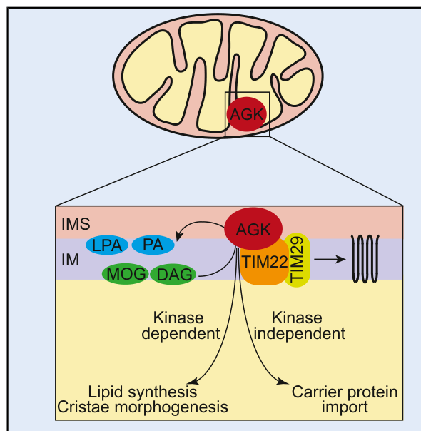

## Question

# Gene Research for Functional Annotation

## ⚠️ CRITICAL: Gene/Protein Identification Context

**BEFORE YOU BEGIN RESEARCH:** You MUST verify you are researching the CORRECT gene/protein. Gene symbols can be ambiguous, especially for less well-characterized genes from non-model organisms.

### Target Gene/Protein Identity (from UniProt):
- **UniProt Accession:** Q53H12
- **Protein Description:** RecName: Full=Acylglycerol kinase, mitochondrial {ECO:0000303|PubMed:15939762}; Short=hAGK {ECO:0000303|PubMed:15939762}; EC=2.7.1.107 {ECO:0000269|PubMed:15939762}; EC=2.7.1.138 {ECO:0000250|UniProtKB:Q9ESW4}; EC=2.7.1.94 {ECO:0000269|PubMed:15939762}; AltName: Full=Multiple substrate lipid kinase {ECO:0000303|PubMed:16269826}; Short=HsMuLK {ECO:0000303|PubMed:16269826}; Short=MuLK {ECO:0000303|PubMed:16269826}; Short=Multi-substrate lipid kinase {ECO:0000303|PubMed:16269826};
- **Gene Information:** Name=AGK {ECO:0000303|PubMed:15939762, ECO:0000312|HGNC:HGNC:21869}; Synonyms=MULK {ECO:0000303|PubMed:16269826};
- **Organism (full):** Homo sapiens (Human).
- **Protein Family:** Belongs to the AGK family. .
- **Key Domains:** AGK_C. (IPR045579); ATP-NAD_kinase_N. (IPR017438); Diacylglycerol_kinase_cat_dom. (IPR001206); Lipid_Phosphate_FormReg. (IPR050187); NAD/diacylglycerol_kinase_sf. (IPR016064)

### MANDATORY VERIFICATION STEPS:

1. **Check if the gene symbol "AGK" matches the protein description above**
2. **Verify the organism is correct:** Homo sapiens (Human).
3. **Check if protein family/domains align with what you find in literature**
4. **If you find literature for a DIFFERENT gene with the same or similar symbol, STOP**

### If Gene Symbol is Ambiguous or You Cannot Find Relevant Literature:

**DO NOT PROCEED WITH RESEARCH ON A DIFFERENT GENE.** Instead:
- State clearly: "The gene symbol 'AGK' is ambiguous or literature is limited for this specific protein"
- Explain what you found (e.g., "Found extensive literature on a different gene with the same symbol in a different organism")
- Describe the protein based ONLY on the UniProt information provided above
- Suggest that the protein function can be inferred from domain/family information

### Research Target:

Please provide a comprehensive research report on the gene **AGK** (gene ID: AGK, UniProt: Q53H12) in human.

The research report should be a detailed narrative explaining the function, biological processes, and localization of the gene product. Citations should be given for all claims.

You should prioritize authoritative reviews and primary scientific literature when conducting research. You can supplement
this with annotations you find in gene/protein databases, but these can be outdated or inaccurate.

We are specifically interested in the primary function of the gene - for enzymes, what reaction is catalyzed, and what is the substrate specificity? For transporters, what is the substrate? For structural proteins or adapters, what is the broader structural role? For signaling molecules, what is the role in the pathway.

We are interested in where in or outside the cell the gene product carries out its function.

We are also interested in the signaling or biochemical pathways in which the gene functions. We are less interested in broad pleiotropic effects, except where these elucidate the precise role.

Include evidence where possible. We are interested in both experimental evidence as well as inference from structure, evolution, or bioinformatic analysis. Precise studies should be prioritized over high-throughput, where available.

## Output

Question: You are an expert researcher providing comprehensive, well-cited information.

Provide detailed information focusing on:
1. Key concepts and definitions with current understanding
2. Recent developments and latest research (prioritize 2023-2024 sources)
3. Current applications and real-world implementations
4. Expert opinions and analysis from authoritative sources
5. Relevant statistics and data from recent studies

Format as a comprehensive research report with proper citations. Include URLs and publication dates where available.
Always prioritize recent, authoritative sources and provide specific citations for all major claims.

# Gene Research for Functional Annotation

## ⚠️ CRITICAL: Gene/Protein Identification Context

**BEFORE YOU BEGIN RESEARCH:** You MUST verify you are researching the CORRECT gene/protein. Gene symbols can be ambiguous, especially for less well-characterized genes from non-model organisms.

### Target Gene/Protein Identity (from UniProt):
- **UniProt Accession:** Q53H12
- **Protein Description:** RecName: Full=Acylglycerol kinase, mitochondrial {ECO:0000303|PubMed:15939762}; Short=hAGK {ECO:0000303|PubMed:15939762}; EC=2.7.1.107 {ECO:0000269|PubMed:15939762}; EC=2.7.1.138 {ECO:0000250|UniProtKB:Q9ESW4}; EC=2.7.1.94 {ECO:0000269|PubMed:15939762}; AltName: Full=Multiple substrate lipid kinase {ECO:0000303|PubMed:16269826}; Short=HsMuLK {ECO:0000303|PubMed:16269826}; Short=MuLK {ECO:0000303|PubMed:16269826}; Short=Multi-substrate lipid kinase {ECO:0000303|PubMed:16269826};
- **Gene Information:** Name=AGK {ECO:0000303|PubMed:15939762, ECO:0000312|HGNC:HGNC:21869}; Synonyms=MULK {ECO:0000303|PubMed:16269826};
- **Organism (full):** Homo sapiens (Human).
- **Protein Family:** Belongs to the AGK family. .
- **Key Domains:** AGK_C. (IPR045579); ATP-NAD_kinase_N. (IPR017438); Diacylglycerol_kinase_cat_dom. (IPR001206); Lipid_Phosphate_FormReg. (IPR050187); NAD/diacylglycerol_kinase_sf. (IPR016064)

### MANDATORY VERIFICATION STEPS:

1. **Check if the gene symbol "AGK" matches the protein description above**
2. **Verify the organism is correct:** Homo sapiens (Human).
3. **Check if protein family/domains align with what you find in literature**
4. **If you find literature for a DIFFERENT gene with the same or similar symbol, STOP**

### If Gene Symbol is Ambiguous or You Cannot Find Relevant Literature:

**DO NOT PROCEED WITH RESEARCH ON A DIFFERENT GENE.** Instead:
- State clearly: "The gene symbol 'AGK' is ambiguous or literature is limited for this specific protein"
- Explain what you found (e.g., "Found extensive literature on a different gene with the same symbol in a different organism")
- Describe the protein based ONLY on the UniProt information provided above
- Suggest that the protein function can be inferred from domain/family information

### Research Target:

Please provide a comprehensive research report on the gene **AGK** (gene ID: AGK, UniProt: Q53H12) in human.

The research report should be a detailed narrative explaining the function, biological processes, and localization of the gene product. Citations should be given for all claims.

You should prioritize authoritative reviews and primary scientific literature when conducting research. You can supplement
this with annotations you find in gene/protein databases, but these can be outdated or inaccurate.

We are specifically interested in the primary function of the gene - for enzymes, what reaction is catalyzed, and what is the substrate specificity? For transporters, what is the substrate? For structural proteins or adapters, what is the broader structural role? For signaling molecules, what is the role in the pathway.

We are interested in where in or outside the cell the gene product carries out its function.

We are also interested in the signaling or biochemical pathways in which the gene functions. We are less interested in broad pleiotropic effects, except where these elucidate the precise role.

Include evidence where possible. We are interested in both experimental evidence as well as inference from structure, evolution, or bioinformatic analysis. Precise studies should be prioritized over high-throughput, where available.

## Comprehensive research report: Human **AGK** (Acylglycerol kinase; UniProt **Q53H12**) — functional annotation

### 1) Target verification (gene/protein identity)
The literature retrieved unambiguously matches the UniProt-described human mitochondrial acylglycerol kinase **AGK** (also called **MuLK/MULK**) and consistently places it in mitochondria and in the **TIM22** inner-membrane protein import pathway, matching the provided identity constraints (human; lipid kinase; mitochondrial; AGK family). Experimental work establishes AGK as a mitochondrial protein, a lipid kinase producing **phosphatidic acid (PA)** and **lysophosphatidic acid (LPA)** from acylglycerols, and a structural subunit of the **TIM22** carrier translocase. (vukotic2017acylglycerolkinasemutated pages 1-4, vukotic2017acylglycerolkinasemutated pages 4-6, jackson2021thetim22complex pages 1-2)

### 2) Key concepts, definitions, and current understanding

#### 2.1 Enzymatic function and reaction definition
**AGK is a multisubstrate lipid kinase** that phosphorylates:
- **Diacylglycerol (DAG) → phosphatidic acid (PA)**
- **Monoacylglycerol (MAG) → lysophosphatidic acid (LPA)**

This substrate/product mapping is explicitly described in mitochondrial/TIM22-focused cell biology studies and in patient-focused biochemical genetics reports. (jackson2021thetim22complex pages 1-2, siriwardena2013mitochondrialcitratesynthase pages 8-8)

A conserved catalytic motif is functionally validated: the **G126E mutation** in the conserved **GDG** motif abolishes lipid phosphorylation, demonstrating that lipid phosphorylation is an intrinsic AGK enzymatic activity (not merely correlative). (vukotic2017acylglycerolkinasemutated pages 4-6)

#### 2.2 Mitochondrial phospholipid pathway context
**PA is a central precursor lipid** for synthesis of other mitochondrial phospholipids (notably including cardiolipin through downstream steps). A 2023 expert review of mitochondrial phospholipid metabolism positions **AGK-mediated phosphorylation of DAG to PA in the inner mitochondrial membrane (IMM)** as a specific intramitochondrial PA-generating route. (joshi2023mitochondrialphospholipidmetabolism pages 3-4)

#### 2.3 Dual-function (“moonlighting”) protein concept for AGK
A central current concept is that **AGK has separable roles**:
1) **Kinase-dependent role** in lipid homeostasis that affects mitochondrial membrane architecture (e.g., cristae morphology) and stress responses.
2) **Kinase-independent role** as a structural subunit required for the assembly/stability and function of the **TIM22** protein import machinery.

This functional separation is demonstrated by complementation experiments in which a **kinase-dead AGK (G126E)** can restore TIM22 complex integrity and carrier import, while kinase activity is required for other mitochondrial structural phenotypes (cristae/apoptotic resistance). (vukotic2017acylglycerolkinasemutated pages 9-11, vukotic2017acylglycerolkinasemutated pages 4-6)

### 3) Subcellular localization and molecular mechanisms

#### 3.1 Localization/topology
Experimental fractionation and protease-protection assays indicate AGK is:
- **Exclusively mitochondrial** in cell fractionation.
- **Exposed to the intermembrane space (IMS)**: protected from protease in intact mitochondria but accessible after osmotic swelling that disrupts the outer membrane.
- **Associated with the inner membrane without predicted transmembrane segments**, consistent with peripheral association (rather than a classical integral multi-pass membrane protein). (vukotic2017acylglycerolkinasemutated pages 4-6)

A figure-based confirmation is available in the Vukotic et al. study showing (i) co-migration of AGK with TIM22 components in native complexes and (ii) protease-protection behavior consistent with IMS localization. (vukotic2017acylglycerolkinasemutated media 2f6e1bf4)

#### 3.2 Role in the TIM22 carrier translocase (mitochondrial protein import)
AGK is a **bona fide TIM22 complex subunit** in human mitochondria:
- AGK co-purifies and co-migrates with **TIMM22** and **TIMM29**.
- AGK is present in a **~400 kDa** TIM22 complex.
- Loss of AGK **impairs TIM22 assembly**, with TIMM22 shifting to a smaller complex (~90 kDa) and TIMM29 largely in ~60 kDa species.
- AGK supports import/biogenesis of inner-membrane carrier proteins including **ANT1/ANT3 (adenine nucleotide translocases)** and **SLC25A24**; import of ANT1 is significantly impaired when AGK is absent.
- Import/assembly role is **kinase-independent**, because kinase-dead AGK can restore TIM22 complex integrity and ANT1 levels. (vukotic2017acylglycerolkinasemutated pages 9-11, vukotic2017acylglycerolkinasemutated pages 4-6, vukotic2017acylglycerolkinasemutated pages 6-7)

Beyond canonical SLC25 carriers, AGK/TIM22 also supports import of **sideroflexins (SFXNs)**, linking AGK dysfunction to impaired **mitochondrial one-carbon metabolism** (serine dependence and formate-rescuable proliferation defects in cell models). (jackson2021thetim22complex pages 1-2)

#### 3.3 Proposed biochemical coupling between lipid kinase activity and mitochondrial structure
Catalytically active AGK is required for **cristae maintenance** and **apoptotic resistance** in cell models; catalytically inactive AGK phenocopies knockout for these aspects. This supports a model in which **AGK-derived PA/LPA (and/or downstream phospholipid remodeling)** contributes to maintaining inner-membrane architecture and robustness under stress. (vukotic2017acylglycerolkinasemutated pages 9-11)

### 4) Recent developments and latest research (prioritizing 2023–2024)

#### 4.1 2023: Mitochondrial phospholipid metabolism synthesis
A 2023 authoritative review in *Journal of Cell Science* synthesizes mitochondrial phospholipid pathways and explicitly identifies **AGK-mediated DAG phosphorylation to PA in the IMM** as one of the pathways producing intramitochondrial PA for downstream phospholipid synthesis. This reflects consolidation of AGK into the “core map” of mitochondrial lipid metabolism (even though much of the primary enzymology predates 2023). (joshi2023mitochondrialphospholipidmetabolism pages 3-4)

#### 4.2 2024: Structural/functional focus on TIM22 (AGK placement still unresolved)
A 2024 thesis-level synthesis discusses recent **cryo-EM work** on the human TIM22 complex and notes that **AGK’s precise structural role/localization within the resolved model remains to be determined**, underscoring that high-resolution structural understanding of AGK within TIM22 is still incomplete. (valpadashi2024structuralandfunctional pages 53-53)

#### 4.3 2024: Genetics context for cataracts
A 2024 review of cataract genetics notes that **AGK germline variants were first reported in Sengers syndrome**, reinforcing AGK’s established role in syndromic congenital cataract phenotypes in current clinical genetics frameworks. (shiels2024 paper retrieved; evidence in this run is limited to bibliographic/contextual mention) (vukotic2017acylglycerolkinasemutated pages 1-4)

**Limitations on 2023–2024 Sengers-focused reviews in this run.** A 2023 mini-review specifically on “Sengers syndrome and AGK-related disorders” was identified by search but was not retrievable here; therefore, this report’s 2023–2024 disease-specific statistics are limited to the accessible sources above and to older (but foundational) case series. (gong2026casereportsengers pages 5-6, gong2026casereportsengers pages 6-6)

### 5) Current applications and real-world implementations

#### 5.1 Clinical genetics and diagnostics
AGK is a clinically relevant gene for **molecular diagnosis** of Sengers syndrome and related syndromic congenital cataract/cardiomyopathy presentations. Foundational clinical sequencing work screened **13 individuals** with congenital cataracts and cardiomyopathy and found **12 predicted loss-of-function AGK alleles in 10 affected individuals**, establishing AGK as causal. (mayr2012lackofthe pages 2-4)

An important practical implementation is **copy-number variant (CNV) analysis** in addition to SNV/indel calling: later clinical reports emphasize that larger deletions/rearrangements can be missed by standard exome pipelines and that CNV interrogation can resolve ambiguous cases; one report notes **>30 pathogenic AGK variants** overall and that large rearrangements appear rare in publications. (gong2026casereportsengers pages 5-6)

#### 5.2 Functional assays for variant interpretation
Patient-derived cell assays are used to support pathogenicity of splicing/other variants, including readouts such as oxygen consumption rate (OCR) and OXPHOS complex activities; for example, a novel splice variant case showed reduced OCR metrics and decreased complex I/V activities. (barbosagouveia2021characterizationofa pages 1-2)

#### 5.3 Therapeutic/management approaches (supportive and experimental)
No AGK-targeted clinical trials were retrieved in this run. Real-world management described in case literature remains largely **supportive**, including cardiomyopathy management, cataract surgery when feasible, dietary modifications to limit fasting, and “mitochondrial cocktail” antioxidant supplementation (vitamins, riboflavin, carnitine, etc.). (mayr2012lackofthe pages 4-5, siriwardena2013mitochondrialcitratesynthase pages 2-3)

Outside Sengers syndrome, an experimental therapeutic concept in hematology is **targeting AGK–JAK2 interaction**: cell-permeable peptides containing a JAK2 JH2-domain sequence increased AGK–JAK2 binding and accelerated proplatelet formation in model systems, proposed as a strategy for thrombocytopenia/thrombocythemia (preclinical concept, not a clinical trial). (jiang2020theroleof pages 5-6)

### 6) Expert opinions / analysis (authoritative interpretations)

1) **AGK as a node linking lipid metabolism to protein import and membrane architecture.** Mechanistic cell biology evidence supports AGK as a dual-function protein: a lipid kinase producing PA/LPA and a TIM22 subunit required for carrier biogenesis; kinase-independent TIM22 assembly versus kinase-dependent cristae integrity suggests two mechanistically distinct but physiologically coupled roles that may both contribute to disease. (vukotic2017acylglycerolkinasemutated pages 9-11, vukotic2017acylglycerolkinasemutated pages 1-4)

2) **AGK in canonical mitochondrial lipid maps.** The 2023 mitochondrial phospholipid metabolism review’s explicit placement of AGK in IMM PA biosynthesis reflects field-level consolidation of AGK as a bona fide mitochondrial lipid metabolic enzyme (not solely a signaling enzyme). (joshi2023mitochondrialphospholipidmetabolism pages 3-4)

3) **Open questions in structural biology.** The 2024 TIM22 structural synthesis emphasizes that high-resolution placement/role of AGK in TIM22 remains unresolved in available structural models, highlighting an active research frontier. (valpadashi2024structuralandfunctional pages 53-53)

### 7) Statistics and quantitative data from studies (selected highlights)

#### 7.1 TIM22 complex assembly metrics
- AGK co-migrates with TIM22 components in a **~400 kDa** complex; AGK loss shifts TIMM22 and TIMM29 into smaller assemblies (~90 kDa; ~60 kDa), consistent with impaired TIM22 assembly. (vukotic2017acylglycerolkinasemutated pages 6-7, vukotic2017acylglycerolkinasemutated media 2f6e1bf4)

#### 7.2 Biochemical/clinical measurements in Sengers syndrome
Examples of quantitative clinical/biochemical readouts include:
- Plasma lactate **7.3 mmol/L** (normal 0.5–2.2) in an index infant. (mayr2012lackofthe pages 1-2)
- Lactic acidosis ranging **~4 to 15 mmol/L** during stress/fasting and lactate:pyruvate ratio **68:1** in a case series. (siriwardena2013mitochondrialcitratesynthase pages 2-3)
- Enzyme activity measurements in muscle mitochondria showing deficits (units/g protein), e.g. Complex I **23** (normal 28–76) and oligomycin-sensitive ATPase (Complex V) **60** (normal 86–257), plus markedly reduced substrate oxidation rates (e.g., [1-14C]pyruvate+malate+ADP **34** vs 263–900). (mayr2012lackofthe pages 4-5)
- Fibroblast complex I activity reduced to **43% and 54%** of controls in two patients in one report. (siriwardena2013mitochondrialcitratesynthase pages 8-8)

#### 7.3 Quantitative protein loss in patient tissue
- Mitochondrial AGK immunogold labeling density decreased from **37.9±4.6 particles/µm²** (control) to **14.5±4.9** and **18.9±6.9 particles/µm²** in AGK-deficient patient muscle mitochondria. (siriwardena2013mitochondrialcitratesynthase pages 8-8)

#### 7.4 Case counts and variant spectrum snapshots
- By 2012, ~**40 individuals** had been described historically with Sengers syndrome (as summarized in a foundational genetics report). (mayr2012lackofthe pages 1-2)
- In one foundational cohort, sequencing **13** individuals with congenital cataracts and cardiomyopathy identified **12** predicted loss-of-function alleles in **10** affected individuals. (mayr2012lackofthe pages 2-4)
- A 2013 paper summarized the literature at that time as **15 published cases with 16 different AGK mutations**. (siriwardena2013mitochondrialcitratesynthase pages 8-8)
- A later clinical report notes **>30 pathogenic AGK variants** reported overall, while also highlighting rarity of large genomic rearrangements in publications. (gong2026casereportsengers pages 5-6)

### 8) Summary of key functional annotation conclusions

**Primary biochemical function.** AGK is an ATP-dependent lipid kinase that phosphorylates MAG and DAG to generate LPA and PA, respectively. (jackson2021thetim22complex pages 1-2, siriwardena2013mitochondrialcitratesynthase pages 8-8)

**Primary cellular site of action.** AGK is a mitochondrial protein with IMS exposure/peripheral association with the IMM and functions as a subunit of the human TIM22 carrier translocase. (vukotic2017acylglycerolkinasemutated pages 4-6, vukotic2017acylglycerolkinasemutated media 2f6e1bf4)

**Primary pathway roles.** AGK contributes to (i) mitochondrial PA production relevant to downstream phospholipid synthesis (including pathways leading to cardiolipin) and (ii) TIM22-dependent insertion/biogenesis of multipass inner-membrane proteins (SLC25 carriers; ANT; SFXNs). (joshi2023mitochondrialphospholipidmetabolism pages 3-4, vukotic2017acylglycerolkinasemutated pages 6-7, jackson2021thetim22complex pages 1-2)

**Disease mechanism relevance.** Biallelic loss-of-function AGK causes Sengers syndrome; mechanistic links include destabilization of TIM22 and impaired carrier import as well as kinase-dependent mitochondrial membrane/cristae defects. (mayr2012lackofthe pages 1-2, vukotic2017acylglycerolkinasemutated pages 9-11)

### 9) Structured summary table

| Aspect | Key findings | Best supporting sources (with year) | URL/DOI |
|---|---|---|---|
| Enzyme activity | Human AGK is the verified mitochondrial acylglycerol kinase (also called MuLK/MULK), a multi-substrate lipid kinase; a conserved GDG-motif mutation (G126E) abolishes lipid phosphorylation, supporting direct catalytic activity (vukotic2017acylglycerolkinasemutated pages 4-6, vukotic2017acylglycerolkinasemutated pages 1-4) | Vukotic et al., 2017; Mayr et al., 2012 | https://doi.org/10.1016/j.molcel.2017.06.013 ; https://doi.org/10.1016/j.ajhg.2011.12.005 |
| Substrates/products | AGK phosphorylates monoacylglycerol (MAG) to lysophosphatidic acid (LPA) and diacylglycerol (DAG) to phosphatidic acid (PA); 2023 review places AGK as an intramitochondrial PA-generating route in the inner mitochondrial membrane (jackson2021thetim22complex pages 1-2, siriwardena2013mitochondrialcitratesynthase pages 8-8, joshi2023mitochondrialphospholipidmetabolism pages 3-4) | Jackson et al., 2021; Siriwardena et al., 2013; Joshi et al., 2023 | https://doi.org/10.1091/mbc.e20-06-0390 ; https://doi.org/10.1016/j.ymgme.2012.11.282 ; https://doi.org/10.1242/jcs.260857 |
| Localization/topology | AGK is exclusively mitochondrial by fractionation; protease-protection assays indicate an intermembrane-space (IMS) localization associated with the inner membrane without predicted transmembrane spans (vukotic2017acylglycerolkinasemutated pages 4-6, vukotic2017acylglycerolkinasemutated media 2f6e1bf4) | Vukotic et al., 2017 | https://doi.org/10.1016/j.molcel.2017.06.013 |
| TIM22 role | AGK is a bona fide subunit of the human TIM22 translocase; AGK, TIMM22, and TIMM29 co-migrate in a ~400 kDa complex, and AGK loss disrupts assembly so TIMM22 shifts to ~90 kDa and TIMM29 mainly to ~60 kDa species (vukotic2017acylglycerolkinasemutated pages 4-6, vukotic2017acylglycerolkinasemutated pages 6-7, vukotic2017acylglycerolkinasemutated media 2f6e1bf4) | Vukotic et al., 2017 | https://doi.org/10.1016/j.molcel.2017.06.013 |
| TIM22 substrate import | AGK supports import/accumulation of carrier proteins including ANT1, ANT3, and SLC25A24; ANT1 import is significantly impaired but not abolished in AGK-null mitochondria; rescue by kinase-dead G126E shows the import role is kinase-independent (vukotic2017acylglycerolkinasemutated pages 9-11, vukotic2017acylglycerolkinasemutated pages 6-7) | Vukotic et al., 2017 | https://doi.org/10.1016/j.molcel.2017.06.013 |
| Expanded pathway role | AGK/TIM22 is also required for import of sideroflexins (SFXNs), identifying a novel TIM22 substrate class and linking AGK deficiency to impaired mitochondrial one-carbon metabolism and serine dependence (jackson2021thetim22complex pages 1-2) | Jackson et al., 2021 | https://doi.org/10.1091/mbc.e20-06-0390 |
| Lipid metabolism pathway context | PA generated by AGK in the IMM is positioned upstream of other mitochondrial phospholipids, including cardiolipin biosynthesis; expert reviews interpret AGK as linking mitochondrial phospholipid homeostasis with OXPHOS function (vukotic2017acylglycerolkinasemutated pages 1-4, joshi2023mitochondrialphospholipidmetabolism pages 3-4) | Vukotic et al., 2017; Joshi et al., 2023 | https://doi.org/10.1016/j.molcel.2017.06.013 ; https://doi.org/10.1242/jcs.260857 |
| Structure/cristae and apoptosis | AGK’s kinase activity is dispensable for TIM22 assembly but required for mitochondrial cristae maintenance and apoptotic resistance; catalytically inactive AGK behaves like knockout for cristae/apoptosis phenotypes (vukotic2017acylglycerolkinasemutated pages 9-11) | Vukotic et al., 2017 | https://doi.org/10.1016/j.molcel.2017.06.013 |
| Disease association | Biallelic loss-of-function AGK variants cause Sengers syndrome, classically featuring congenital cataracts, hypertrophic cardiomyopathy, skeletal myopathy/exercise intolerance, and lactic acidosis; AGK is the established disease gene in Open Targets and primary genetics studies (mayr2012lackofthe pages 1-2, mayr2012lackofthe pages 2-4, OpenTargets Search: Sengers syndrome,cardiomyopathy,cataract,mitochondrial disease,cancer-AGK) | Mayr et al., 2012; Open Targets | https://doi.org/10.1016/j.ajhg.2011.12.005 ; https://platform.opentargets.org |
| Variant spectrum / cohort data | In one foundational cohort, AGK sequencing in 13 individuals with congenital cataracts and cardiomyopathy identified 12 predicted loss-of-function alleles in 10 affected individuals; historical summary in the same report noted ~40 individuals described overall by 2012 (mayr2012lackofthe pages 2-4, mayr2012lackofthe pages 1-2) | Mayr et al., 2012 | https://doi.org/10.1016/j.ajhg.2011.12.005 |
| Quantitative mitochondrial protein loss | In patient muscle, AGK protein can be nearly absent/negligible, with mitochondrial immunogold labeling reduced from 37.9±4.6 particles/μm² in control to 14.5±4.9 and 18.9±6.9 particles/μm² in two AGK-deficient patients (siriwardena2013mitochondrialcitratesynthase pages 8-8) | Siriwardena et al., 2013 | https://doi.org/10.1016/j.ymgme.2012.11.282 |
| Quantitative bioenergetic defects | Patient fibroblasts showed decreased complex I activity to 43% and 54% of control in two cases, with high lactate/pyruvate ratios; another index case had plasma lactate 7.3 mmol/L (normal 0.5–2.2 mmol/L) (siriwardena2013mitochondrialcitratesynthase pages 8-8, mayr2012lackofthe pages 1-2) | Siriwardena et al., 2013; Mayr et al., 2012 | https://doi.org/10.1016/j.ymgme.2012.11.282 ; https://doi.org/10.1016/j.ajhg.2011.12.005 |
| Severe neonatal phenotype | A 2021 functionally characterized splice variant (c.518+1G>A) caused fatal neonatal Sengers syndrome with congenital cataracts, dilated cardiomyopathy, hyperlactacidemia, death at 20 h, plus reduced OCR and decreased OXPHOS complexes I and V in fibroblasts (barbosagouveia2021characterizationofa pages 1-2, barbosagouveia2021characterizationofa pages 5-6) | Barbosa-Gouveia et al., 2021 | https://doi.org/10.3390/ijms222413484 |
| Clinical heterogeneity | AGK disease ranges from lethal neonatal/infantile disease to milder forms, including reports of isolated congenital cataract without major cardiomyopathy in some families, indicating variable expressivity despite shared mitochondrial mechanism (mayr2012lackofthe pages 1-2, siriwardena2013mitochondrialcitratesynthase pages 8-10) | Mayr et al., 2012; Siriwardena et al., 2013 | https://doi.org/10.1016/j.ajhg.2011.12.005 ; https://doi.org/10.1016/j.ymgme.2012.11.282 |

*Table: This table summarizes the experimentally supported functions, localization, pathway roles, and disease relevance of human AGK (UniProt Q53H12). It emphasizes quantitative findings and the strongest supporting sources for functional annotation.*

### 10) Source URLs and publication dates (selected)
- Vukotic et al. *Molecular Cell* (Aug 2017): https://doi.org/10.1016/j.molcel.2017.06.013 (vukotic2017acylglycerolkinasemutated pages 1-4)
- Mayr et al. *American Journal of Human Genetics* (Feb 2012): https://doi.org/10.1016/j.ajhg.2011.12.005 (mayr2012lackofthe pages 1-2)
- Siriwardena et al. *Molecular Genetics and Metabolism* (Jan 2013): https://doi.org/10.1016/j.ymgme.2012.11.282 (siriwardena2013mitochondrialcitratesynthase pages 8-8)
- Jackson et al. *Molecular Biology of the Cell* (Mar 2021): https://doi.org/10.1091/mbc.e20-06-0390 (jackson2021thetim22complex pages 1-2)
- Joshi et al. *Journal of Cell Science* (Sep 2023): https://doi.org/10.1242/jcs.260857 (joshi2023mitochondrialphospholipidmetabolism pages 3-4)
- Valpadashi (PhD thesis; 2024): https://doi.org/10.53846/goediss-10678 (valpadashi2024structuralandfunctional pages 53-53)
- Open Targets Platform (accessed via tool; platform URL): https://platform.opentargets.org (OpenTargets Search: Sengers syndrome,cardiomyopathy,cataract,mitochondrial disease,cancer-AGK)

References

1. (vukotic2017acylglycerolkinasemutated pages 1-4): Milena Vukotic, Hendrik Nolte, Tim König, Shotaro Saita, Maria Ananjew, Marcus Krüger, Takashi Tatsuta, and Thomas Langer. Acylglycerol kinase mutated in sengers syndrome is a subunit of the tim22 protein translocase in mitochondria. Molecular cell, 67 3:471-483.e7, Aug 2017. URL: https://doi.org/10.1016/j.molcel.2017.06.013, doi:10.1016/j.molcel.2017.06.013. This article has 154 citations and is from a highest quality peer-reviewed journal.

2. (vukotic2017acylglycerolkinasemutated pages 4-6): Milena Vukotic, Hendrik Nolte, Tim König, Shotaro Saita, Maria Ananjew, Marcus Krüger, Takashi Tatsuta, and Thomas Langer. Acylglycerol kinase mutated in sengers syndrome is a subunit of the tim22 protein translocase in mitochondria. Molecular cell, 67 3:471-483.e7, Aug 2017. URL: https://doi.org/10.1016/j.molcel.2017.06.013, doi:10.1016/j.molcel.2017.06.013. This article has 154 citations and is from a highest quality peer-reviewed journal.

3. (jackson2021thetim22complex pages 1-2): Thomas D. Jackson, Daniella H. Hock, Kenji M. Fujihara, Catherine S. Palmer, Ann E. Frazier, Yau C. Low, Yilin Kang, Ching-Seng Ang, Nicholas J. Clemons, David R. Thorburn, David A. Stroud, and Diana Stojanovski. The tim22 complex mediates the import of sideroflexins and is required for efficient mitochondrial one-carbon metabolism. Molecular Biology of the Cell, 32:475-491, Mar 2021. URL: https://doi.org/10.1091/mbc.e20-06-0390, doi:10.1091/mbc.e20-06-0390. This article has 43 citations and is from a domain leading peer-reviewed journal.

4. (siriwardena2013mitochondrialcitratesynthase pages 8-8): Komudi Siriwardena, Nevena MacKay, Valeriy Levandovskiy, Susan Blaser, Julian Raiman, Paul F. Kantor, Cameron Ackerley, Brian H. Robinson, Andreas Schulze, and Jessie M. Cameron. Mitochondrial citrate synthase crystals: novel finding in sengers syndrome caused by acylglycerol kinase (agk) mutations. Molecular genetics and metabolism, 108 1:40-50, Jan 2013. URL: https://doi.org/10.1016/j.ymgme.2012.11.282, doi:10.1016/j.ymgme.2012.11.282. This article has 46 citations and is from a peer-reviewed journal.

5. (joshi2023mitochondrialphospholipidmetabolism pages 3-4): Alaumy Joshi, Travis H. Richard, and Vishal M. Gohil. Mitochondrial phospholipid metabolism in health and disease. Journal of cell science, Sep 2023. URL: https://doi.org/10.1242/jcs.260857, doi:10.1242/jcs.260857. This article has 32 citations and is from a domain leading peer-reviewed journal.

6. (vukotic2017acylglycerolkinasemutated pages 9-11): Milena Vukotic, Hendrik Nolte, Tim König, Shotaro Saita, Maria Ananjew, Marcus Krüger, Takashi Tatsuta, and Thomas Langer. Acylglycerol kinase mutated in sengers syndrome is a subunit of the tim22 protein translocase in mitochondria. Molecular cell, 67 3:471-483.e7, Aug 2017. URL: https://doi.org/10.1016/j.molcel.2017.06.013, doi:10.1016/j.molcel.2017.06.013. This article has 154 citations and is from a highest quality peer-reviewed journal.

7. (vukotic2017acylglycerolkinasemutated media 2f6e1bf4): Milena Vukotic, Hendrik Nolte, Tim König, Shotaro Saita, Maria Ananjew, Marcus Krüger, Takashi Tatsuta, and Thomas Langer. Acylglycerol kinase mutated in sengers syndrome is a subunit of the tim22 protein translocase in mitochondria. Molecular cell, 67 3:471-483.e7, Aug 2017. URL: https://doi.org/10.1016/j.molcel.2017.06.013, doi:10.1016/j.molcel.2017.06.013. This article has 154 citations and is from a highest quality peer-reviewed journal.

8. (vukotic2017acylglycerolkinasemutated pages 6-7): Milena Vukotic, Hendrik Nolte, Tim König, Shotaro Saita, Maria Ananjew, Marcus Krüger, Takashi Tatsuta, and Thomas Langer. Acylglycerol kinase mutated in sengers syndrome is a subunit of the tim22 protein translocase in mitochondria. Molecular cell, 67 3:471-483.e7, Aug 2017. URL: https://doi.org/10.1016/j.molcel.2017.06.013, doi:10.1016/j.molcel.2017.06.013. This article has 154 citations and is from a highest quality peer-reviewed journal.

9. (valpadashi2024structuralandfunctional pages 53-53): Anusha Valpadashi. Structural and functional characterization of TIM22 complex in the inner mitochondrial membarne. PhD thesis, University Goettingen Repository, 2024. URL: https://doi.org/10.53846/goediss-10678, doi:10.53846/goediss-10678.

10. (gong2026casereportsengers pages 5-6): Xingwang Gong, Yue Liu, and Hui Liang. Case report: sengers syndrome caused by a novel 7.6 kb agk deletion misdiagnosed as isolated congenital cataract. Frontiers in Pediatrics, Jan 2026. URL: https://doi.org/10.3389/fped.2026.1714952, doi:10.3389/fped.2026.1714952. This article has 0 citations.

11. (gong2026casereportsengers pages 6-6): Xingwang Gong, Yue Liu, and Hui Liang. Case report: sengers syndrome caused by a novel 7.6 kb agk deletion misdiagnosed as isolated congenital cataract. Frontiers in Pediatrics, Jan 2026. URL: https://doi.org/10.3389/fped.2026.1714952, doi:10.3389/fped.2026.1714952. This article has 0 citations.

12. (mayr2012lackofthe pages 2-4): Johannes A. Mayr, Tobias B. Haack, Elisabeth Graf, Franz A. Zimmermann, Thomas Wieland, Birgit Haberberger, Andrea Superti-Furga, Janbernd Kirschner, Beat Steinmann, Matthias R. Baumgartner, Isabella Moroni, Eleonora Lamantea, Massimo Zeviani, Richard J. Rodenburg, Jan Smeitink, Tim M. Strom, Thomas Meitinger, Wolfgang Sperl, and Holger Prokisch. Lack of the mitochondrial protein acylglycerol kinase causes sengers syndrome. American journal of human genetics, 90 2:314-20, Feb 2012. URL: https://doi.org/10.1016/j.ajhg.2011.12.005, doi:10.1016/j.ajhg.2011.12.005. This article has 261 citations and is from a highest quality peer-reviewed journal.

13. (barbosagouveia2021characterizationofa pages 1-2): Sofia Barbosa-Gouveia, Maria E. Vázquez-Mosquera, Emiliano Gonzalez-Vioque, Álvaro Hermida-Ameijeiras, Laura L. Valverde, Judith Armstrong-Moron, Maria del Carmen Fons-Estupiña, Liesbeth T. Wintjes, Antonia Kappen, Richard J. Rodenburg, and Maria L. Couce. Characterization of a novel splicing variant in acylglycerol kinase (agk) associated with fatal sengers syndrome. International Journal of Molecular Sciences, 22:13484, Dec 2021. URL: https://doi.org/10.3390/ijms222413484, doi:10.3390/ijms222413484. This article has 13 citations.

14. (mayr2012lackofthe pages 4-5): Johannes A. Mayr, Tobias B. Haack, Elisabeth Graf, Franz A. Zimmermann, Thomas Wieland, Birgit Haberberger, Andrea Superti-Furga, Janbernd Kirschner, Beat Steinmann, Matthias R. Baumgartner, Isabella Moroni, Eleonora Lamantea, Massimo Zeviani, Richard J. Rodenburg, Jan Smeitink, Tim M. Strom, Thomas Meitinger, Wolfgang Sperl, and Holger Prokisch. Lack of the mitochondrial protein acylglycerol kinase causes sengers syndrome. American journal of human genetics, 90 2:314-20, Feb 2012. URL: https://doi.org/10.1016/j.ajhg.2011.12.005, doi:10.1016/j.ajhg.2011.12.005. This article has 261 citations and is from a highest quality peer-reviewed journal.

15. (siriwardena2013mitochondrialcitratesynthase pages 2-3): Komudi Siriwardena, Nevena MacKay, Valeriy Levandovskiy, Susan Blaser, Julian Raiman, Paul F. Kantor, Cameron Ackerley, Brian H. Robinson, Andreas Schulze, and Jessie M. Cameron. Mitochondrial citrate synthase crystals: novel finding in sengers syndrome caused by acylglycerol kinase (agk) mutations. Molecular genetics and metabolism, 108 1:40-50, Jan 2013. URL: https://doi.org/10.1016/j.ymgme.2012.11.282, doi:10.1016/j.ymgme.2012.11.282. This article has 46 citations and is from a peer-reviewed journal.

16. (jiang2020theroleof pages 5-6): Haojie Jiang, Zhuo Yu, Nan Ding, Mina Yang, Lin Zhang, Xuemei Fan, Yuan Zhou, Qiang Zou, Jian Hou, Junke Zheng, Lei Zhang, Yanyan Xu, and Junling Liu. The role of agk in thrombocytopoiesis and possible therapeutic strategies. Blood, 136:119-129, Jul 2020. URL: https://doi.org/10.1182/blood.2019003851, doi:10.1182/blood.2019003851. This article has 42 citations and is from a highest quality peer-reviewed journal.

17. (mayr2012lackofthe pages 1-2): Johannes A. Mayr, Tobias B. Haack, Elisabeth Graf, Franz A. Zimmermann, Thomas Wieland, Birgit Haberberger, Andrea Superti-Furga, Janbernd Kirschner, Beat Steinmann, Matthias R. Baumgartner, Isabella Moroni, Eleonora Lamantea, Massimo Zeviani, Richard J. Rodenburg, Jan Smeitink, Tim M. Strom, Thomas Meitinger, Wolfgang Sperl, and Holger Prokisch. Lack of the mitochondrial protein acylglycerol kinase causes sengers syndrome. American journal of human genetics, 90 2:314-20, Feb 2012. URL: https://doi.org/10.1016/j.ajhg.2011.12.005, doi:10.1016/j.ajhg.2011.12.005. This article has 261 citations and is from a highest quality peer-reviewed journal.

18. (OpenTargets Search: Sengers syndrome,cardiomyopathy,cataract,mitochondrial disease,cancer-AGK): Open Targets Query (Sengers syndrome,cardiomyopathy,cataract,mitochondrial disease,cancer-AGK, 6 results). Buniello, A. et al. (2025). Open Targets Platform: facilitating therapeutic hypotheses building in drug discovery. Nucleic Acids Research.

19. (barbosagouveia2021characterizationofa pages 5-6): Sofia Barbosa-Gouveia, Maria E. Vázquez-Mosquera, Emiliano Gonzalez-Vioque, Álvaro Hermida-Ameijeiras, Laura L. Valverde, Judith Armstrong-Moron, Maria del Carmen Fons-Estupiña, Liesbeth T. Wintjes, Antonia Kappen, Richard J. Rodenburg, and Maria L. Couce. Characterization of a novel splicing variant in acylglycerol kinase (agk) associated with fatal sengers syndrome. International Journal of Molecular Sciences, 22:13484, Dec 2021. URL: https://doi.org/10.3390/ijms222413484, doi:10.3390/ijms222413484. This article has 13 citations.

20. (siriwardena2013mitochondrialcitratesynthase pages 8-10): Komudi Siriwardena, Nevena MacKay, Valeriy Levandovskiy, Susan Blaser, Julian Raiman, Paul F. Kantor, Cameron Ackerley, Brian H. Robinson, Andreas Schulze, and Jessie M. Cameron. Mitochondrial citrate synthase crystals: novel finding in sengers syndrome caused by acylglycerol kinase (agk) mutations. Molecular genetics and metabolism, 108 1:40-50, Jan 2013. URL: https://doi.org/10.1016/j.ymgme.2012.11.282, doi:10.1016/j.ymgme.2012.11.282. This article has 46 citations and is from a peer-reviewed journal.

## Artifacts

- [Edison artifact artifact-00](AGK-deep-research-falcon_artifacts/artifact-00.md)

## Citations

1. vukotic2017acylglycerolkinasemutated pages 4-6
2. joshi2023mitochondrialphospholipidmetabolism pages 3-4
3. vukotic2017acylglycerolkinasemutated pages 9-11
4. valpadashi2024structuralandfunctional pages 53-53
5. vukotic2017acylglycerolkinasemutated pages 1-4
6. mayr2012lackofthe pages 2-4
7. gong2026casereportsengers pages 5-6
8. barbosagouveia2021characterizationofa pages 1-2
9. jiang2020theroleof pages 5-6
10. mayr2012lackofthe pages 1-2
11. siriwardena2013mitochondrialcitratesynthase pages 2-3
12. mayr2012lackofthe pages 4-5
13. siriwardena2013mitochondrialcitratesynthase pages 8-8
14. vukotic2017acylglycerolkinasemutated pages 6-7
15. gong2026casereportsengers pages 6-6
16. barbosagouveia2021characterizationofa pages 5-6
17. siriwardena2013mitochondrialcitratesynthase pages 8-10
18. 1-14C
19. https://doi.org/10.1016/j.molcel.2017.06.013
20. https://doi.org/10.1016/j.ajhg.2011.12.005
21. https://doi.org/10.1091/mbc.e20-06-0390
22. https://doi.org/10.1016/j.ymgme.2012.11.282
23. https://doi.org/10.1242/jcs.260857
24. https://platform.opentargets.org
25. https://doi.org/10.3390/ijms222413484
26. https://doi.org/10.53846/goediss-10678
27. https://doi.org/10.1016/j.molcel.2017.06.013,
28. https://doi.org/10.1091/mbc.e20-06-0390,
29. https://doi.org/10.1016/j.ymgme.2012.11.282,
30. https://doi.org/10.1242/jcs.260857,
31. https://doi.org/10.53846/goediss-10678,
32. https://doi.org/10.3389/fped.2026.1714952,
33. https://doi.org/10.1016/j.ajhg.2011.12.005,
34. https://doi.org/10.3390/ijms222413484,
35. https://doi.org/10.1182/blood.2019003851,