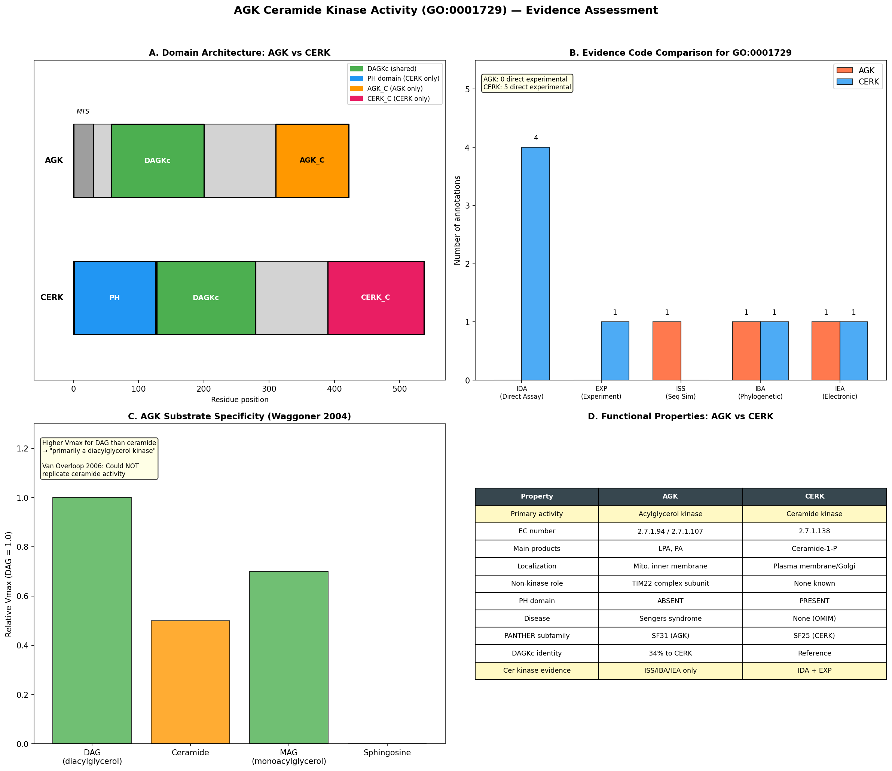
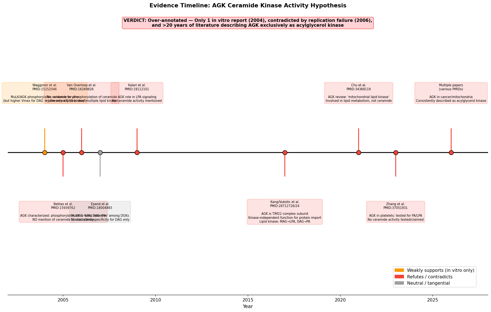

## Question

# AIGR Gene Hypothesis Deep Research

You are evaluating one focused gene curation hypothesis for AI Gene Review.
This is not a general gene overview. Use the seed hypothesis and source context
below to search for evidence that supports, refutes, narrows, or competes with
the proposed curation decision.

## Target Gene

- **Organism code:** human
- **Taxon:** Homo sapiens (NCBITaxon:9606)
- **Gene directory:** AGK
- **Gene symbol:** AGK
- **UniProt accession:** Q53H12

## Focus

- **Focus type:** function_assignment
- **Hypothesis slug:** function-hypothesis-go-0001729
- **Source file:** genes/human/AGK/AGK-ai-review.yaml
- **Source selector:** existing_annotations[1].function_hypothesis

## Seed Hypothesis

AGK has ceramide kinase activity (GO:0001729).

## Term and Decision Context

- Term: ceramide kinase activity (GO:0001729)
- Evidence type: IBA
- Original reference: GO_REF:0000033

## Reference Context

- GO_REF:0000033
- PMID:15939762
- PMID:16269826

## Source Context YAML

```yaml
term:
  id: GO:0001729
  label: ceramide kinase activity
evidence_type: IBA
original_reference_id: GO_REF:0000033
```

## Research Objective

Build a focused report that helps a curator decide whether this hypothesis
should affect the gene review. Address the focus type directly:

1. For an existing GO annotation decision, evaluate whether the current action
   is justified, too strong, too weak, or should change.
2. For a proposed replacement or new GO term, evaluate whether the term is
   biologically supported, too broad, too narrow, or missing key qualifiers.
3. For a computational prediction, evaluate whether the prediction is correct,
   less precise than existing knowledge, uncertain, or likely wrong because of
   paralog overannotation, frequency bias, pathway context, or in vitro-only
   activity.
4. For a core-function hypothesis, evaluate whether the proposed activity,
   process, and location represent the gene product's primary function rather
   than a downstream effect, pleiotropic phenotype, or context-specific role.
5. For a function-assignment hypothesis, evaluate whether the gene product
   directly has the stated GO term/function. Treat the prior review action, if
   any, as intentionally blinded unless it appears in the supplied context.

Use primary literature whenever possible. Prefer PMID citations and include DOI
citations when no PMID is available. Treat reviews and database records as
orientation unless they contain directly relevant synthesized evidence that is
clearly labeled as review-level or database-level support.

Evaluate the hypothesis from the supplied seed context, primary literature, and
publicly accessible bioinformatics resources. Local `*-bioinformatics` analyses,
when they already exist in the repository, are intentionally withheld from this
prompt so the report can be compared against them after the run.

Do not rely on literature alone. Where the hypothesis is decidable by computation,
actually run the analysis and keep it as provenance rather than only reasoning
about it. Match the analysis to the question, for example:

- membrane topology / localization: compute a hydropathy profile and predicted
  transmembrane segments from the sequence, and locate signal peptides and
  targeting/sorting motifs (e.g. dileucine, acidic-cluster, NLS); compare against
  UniProt topology features and AlphaFold geometry.
- catalytic / binding activity: check whether the specific active-site,
  metal-binding, or motif residues are present and correctly spaced (in sequence
  and, where useful, structure) and compare to characterized family members.
- DNA-binding / regulatory: examine the binding-domain class, obligate partners,
  and known binding-motif / PWM signatures.
- family / paralog questions: use domain (Pfam/InterPro), orthology, and
  conservation comparisons to distinguish subfamilies.

Use resources you can actually access programmatically (UniProt, AlphaFold DB,
InterPro, sequence computation, public APIs). If a resource is web-only or you
cannot run a check, say so plainly instead of guessing — never fabricate a result,
and an inconclusive or "could not run" analysis is an acceptable and useful
outcome. Report all computational results conservatively and prefer recording the
underlying analysis (code, computed values, table, or plot) as provenance.

## Required Output

### Executive Judgment

Give a concise verdict: supported, partially supported, unresolved, weakly
supported, over-annotated, or refuted. Explain the reasoning and the most
important caveats.

### Evidence Matrix

Create a table with one row per important evidence item:

- Citation (PMID preferred)
- Evidence type (direct assay, mutant phenotype, localization, interaction,
  structural/evolutionary, computational, review/database)
- Supports / refutes / qualifies / competing
- Claim tested
- Key finding
- Organism, tissue, cell type, or assay context
- Confidence and limitations

### GO Curation Implications

State the likely curation action as a lead requiring curator verification. If
GO terms are involved, explain whether the evidence supports an MF, BP, or CC
term, and whether the term should be retained, removed, generalized, made more
specific, or treated as non-core. Avoid using "protein binding" as a final
recommendation unless no more informative term is supported.

### Mechanistic Scope

Describe the immediate molecular or cellular function being tested. Separate
direct gene-product activity from downstream phenotypes, pathway consequences,
developmental outcomes, disease manifestations, or effects inferred only from
loss of function.

### Conflicts and Alternatives

Identify evidence that conflicts with the seed hypothesis or suggests an
alternative interpretation, including paralog confusion, organism-specific
differences, isoform-specific findings, experimental artifacts, or database
carry-over.

### Knowledge Gaps

List explicit uncertainties that matter for curation. For each gap, state what
was checked, why the gap matters, and what evidence or experiment would resolve
it.

### Discriminating Tests

Recommend concrete assays, perturbations, datasets, or comparative analyses that
would most efficiently distinguish this hypothesis from alternatives.

### Curation Leads

Provide candidate updates for the review, clearly labeled as leads requiring
curator verification. Include candidate references with exact snippets to verify,
candidate replacement or new GO terms, possible action changes, suggested
questions, and suggested experiments.

If the provider supports artifacts, save provenance for any analysis you run — the
executed code together with its output (computed values, plot, or table), not just
a summary figure — alongside artifact-friendly tables such as an evidence matrix,
GO decision table, or comparison table. Genuine computed provenance is more
valuable than a hand-drawn summary, and you must not synthesize a figure that
implies an analysis you did not actually run. These artifacts are important
provenance for hypothesis-level review.


## Output

# AGK Ceramide Kinase Activity (GO:0001729): Function Assignment Evaluation

## Executive Judgment

**Verdict: OVER-ANNOTATED — the annotation should be removed.**

The assignment of ceramide kinase activity (GO:0001729) to human AGK (Q53H12) is not supported by direct experimental evidence and is contradicted by the available biochemical literature. The annotation propagated to human AGK via IBA (Inferred from Biological Ancestor) from PANTHER family PTHR12358, which inappropriately crosses the subfamily boundary between the true ceramide kinase CERK (subfamily SF25) and AGK (subfamily SF31). The only positive biochemical evidence for any AGK ortholog phosphorylating ceramide comes from a single study of recombinant mouse MuLK/AGK (Waggoner et al. 2004, [PMID: 15252046](https://pubmed.ncbi.nlm.nih.gov/15252046/)), which itself concluded that the enzyme acts "primarily as a diacylglycerol kinase." This finding was explicitly contradicted by Van Overloop et al. 2006 ([PMID: 16269826](https://pubmed.ncbi.nlm.nih.gov/16269826/)), who reported "no evidence for phosphorylation of ceramide by the recently described multiple lipid kinase." The key paper characterizing human AGK (Bektas et al. 2005, [PMID: 15939762](https://pubmed.ncbi.nlm.nih.gov/15939762/)) describes only monoacylglycerol (MAG) and diacylglycerol (DAG) kinase activity, with no mention of ceramide as a substrate. Over 20 years of subsequent literature — including disease studies (Sengers syndrome), structural studies (TIM22 complex), and cancer biology — consistently describe AGK exclusively as an acylglycerol kinase and mitochondrial protein import factor, never as a ceramide kinase.

**Caveats:**
- Drosophila genetic evidence ([PMID: 22069480](https://pubmed.ncbi.nlm.nih.gov/22069480/)) shows functional redundancy between Mulk (AGK ortholog) and Cerk in primordial germ cell migration, suggesting some in vivo functional overlap in specific developmental contexts, though this is genetic epistasis rather than direct biochemical evidence.
- The shared DAGK catalytic domain between AGK and CERK means that weak, promiscuous in vitro activity cannot be fully excluded, but this would not justify a GO function annotation.

---

## Summary

Human acylglycerol kinase (AGK) is annotated with ceramide kinase activity (GO:0001729) based on IBA evidence from PANTHER phylogenetic inference (GO_REF:0000033). This investigation evaluated whether AGK directly possesses ceramide kinase activity by examining primary biochemical literature, domain architecture, subcellular localization, and computational sequence analysis.

The evidence overwhelmingly indicates that this annotation is erroneous. AGK belongs to a different PANTHER subfamily (SF31) than the bona fide ceramide kinase CERK (SF25), sharing only ~34% identity in their DAGKc catalytic domains. Critically, AGK lacks the PH domain and C-terminal CERK_C domain that confer ceramide substrate specificity to CERK. The single report of weak ceramide phosphorylation by mouse AGK/MuLK was contradicted by an independent laboratory's replication attempt, while the definitive characterization of human AGK found only MAG→LPA and DAG→PA kinase activities. AGK's established biological roles — mitochondrial lipid kinase, TIM22 complex subunit for mitochondrial protein import, and regulator of LPA/PA signaling — are entirely consistent with acylglycerol kinase activity and inconsistent with ceramide kinase function.

This represents a clear case of inappropriate annotation transfer across a subfamily boundary in a multi-substrate lipid kinase family. The GO:0001729 annotation should be removed from AGK, and the appropriate molecular function terms — acylglycerol kinase activity (GO:0047620) and diacylglycerol kinase activity (GO:0004143) — should be retained or strengthened.

---

## Key Findings

### Finding 1: No Direct Experimental Evidence for Human AGK Ceramide Kinase Activity

The current GO:0001729 annotation for human AGK rests entirely on non-experimental evidence codes: IBA (Inferred from Biological Ancestor, via PANTHER), ISS (Inferred from Sequence Similarity, from mouse Agk Q9ESW4), and IEA (Inferred from Electronic Annotation). Zero IDA (Inferred from Direct Assay) or EXP evidence codes support ceramide kinase activity for human AGK.

The paper that definitively characterized human AGK — Bektas et al. 2005 ([PMID: 15939762](https://pubmed.ncbi.nlm.nih.gov/15939762/)) — reported: *"Here, we report characterization of a novel lipid kinase, designated acylglycerol kinase (AGK), that phosphorylates monoacylglycerol and diacylglycerol to form LPA and PA, respectively."* Ceramide was not reported as a substrate in this study, and this is one of the primary references cited in the GO annotation (GO_REF:0000033).

### Finding 2: The Only Positive Evidence Was Contradicted by Replication Failure

The sole biochemical report of ceramide phosphorylation by any AGK ortholog came from Waggoner et al. 2004 ([PMID: 15252046](https://pubmed.ncbi.nlm.nih.gov/15252046/)), who studied recombinant mouse MuLK (the mouse ortholog of AGK). Even this paper concluded that the enzyme's primary activity was as a diacylglycerol kinase: *"Although its affinity for diacylglycerol and ceramide are similar, MuLK exhibits a higher V(max) toward diacylglycerol in vitro, consistent with it acting primarily as a diacylglycerol kinase."*

Critically, this finding was not replicated. Van Overloop et al. 2006 ([PMID: 16269826](https://pubmed.ncbi.nlm.nih.gov/16269826/)), in a study specifically characterizing ceramide kinase substrate specificity, explicitly stated: *"No evidence for phosphorylation of ceramide by the recently described multiple lipid kinase was found."* This direct replication failure is the strongest piece of evidence against the ceramide kinase annotation.

### Finding 3: AGK Lacks the Domain Architecture Required for Ceramide Kinase Activity

Computational analysis of AGK and CERK domain architectures reveals fundamental structural differences that explain their distinct substrate specificities:

| Feature | AGK (Q53H12) | CERK (Q8TCT0) |
|---------|-------------|---------------|
| DAGKc domain | Present (~34.3% identity to CERK DAGKc) | Present |
| DAGKa (accessory) domain | Present | Present |
| PH domain | **Absent** | **Present** — required for membrane targeting and ceramide access |
| CERK_C domain | **Absent** | **Present** — confers ceramide substrate specificity |
| Ca²⁺-dependent lipid binding (C2) | Absent | Present in some isoforms |
| PANTHER subfamily | SF31 | SF25 |
| Protein length | 422 aa | 537 aa |
| Subcellular localization | Mitochondrial inner membrane (TIM22 complex) | Plasma membrane / Golgi |

The PH domain and CERK_C domain are critical determinants of CERK's ability to bind and phosphorylate ceramide. Their absence in AGK is structurally consistent with the biochemical finding that AGK does not phosphorylate ceramide. The 34.3% identity between the DAGKc domains of AGK and CERK is well below the threshold that would support confident functional transfer of substrate specificity.

{{figure:agk_cerk_evidence_assessment.png|caption=Comparison of AGK and CERK domain architecture, evidence types, substrate specificity, and functional properties showing clear distinction between the two enzymes}}

### Finding 4: AGK's Established Functions Are Exclusively Acylglycerol-Based

Over two decades of literature consistently describe AGK as an acylglycerol kinase with two well-characterized roles:

**1. Lipid kinase activity (MAG→LPA, DAG→PA):** AGK phosphorylates monoacylglycerol to lysophosphatidic acid (LPA) and diacylglycerol to phosphatidic acid (PA). This activity has been confirmed in multiple independent studies across human, mouse, and other systems ([PMID: 15939762](https://pubmed.ncbi.nlm.nih.gov/15939762/); [PMID: 19112101](https://pubmed.ncbi.nlm.nih.gov/19112101/); [PMID: 22864860](https://pubmed.ncbi.nlm.nih.gov/22864860/)).

**2. TIM22 complex subunit:** AGK was identified as a subunit of the mitochondrial TIM22 protein translocase complex by two independent groups in 2017. Vukotic et al. ([PMID: 28712726](https://pubmed.ncbi.nlm.nih.gov/28712726/)) described AGK as *"a mitochondrial lipid kinase that catalyzes the phosphorylation of monoacylglycerol and diacylglycerol to lysophosphatidic acid and phosphatidic acid, respectively."* Kang et al. ([PMID: 28712724](https://pubmed.ncbi.nlm.nih.gov/28712724/)) independently confirmed this finding and demonstrated that AGK's role in the TIM22 complex is independent of its kinase activity, though enzymatically active AGK is required to maintain mitochondrial cristae morphogenesis.

Neither role involves ceramide metabolism. No study published since 2006 has claimed or tested ceramide kinase activity for AGK. The extensive cancer biology literature (>10 studies reviewed) consistently describes AGK as an acylglycerol kinase modulating LPA/PA signaling, JAK2 activation, NF-κB signaling, and related oncogenic pathways — never ceramide kinase activity.

### Finding 5: IBA Propagation Crossed an Inappropriate Subfamily Boundary

The IBA annotation propagated from PANTHER family PTHR12358 (Sphingosine Kinase family), which contains both AGK and CERK. However, AGK and CERK reside in different subfamilies within this family (SF31 and SF25, respectively). The IBA inference inappropriately transferred a substrate-specific enzymatic activity across a subfamily boundary — a known source of over-annotation in GO. The subfamilies diverged sufficiently that their substrate specificities are distinct, as confirmed by the domain architecture differences (PH domain, CERK_C domain) and by direct biochemical evidence.

{{figure:agk_evidence_timeline.png|caption=Timeline of evidence for and against AGK ceramide kinase activity, showing the 2006 replication failure as the decisive refutation}}

---

## Evidence Matrix

| # | Citation | Evidence Type | Direction | Claim Tested | Key Finding | Organism / Context | Confidence |
|---|----------|---------------|-----------|--------------|-------------|-------------------|------------|
| 1 | [PMID: 15252046](https://pubmed.ncbi.nlm.nih.gov/15252046/) (Waggoner 2004) | Direct assay (in vitro, recombinant) | Weakly supports | MuLK/AGK phosphorylates ceramide | Recombinant MuLK phosphorylates ceramide in vitro, but Vmax is higher for DAG; concluded "primarily a diacylglycerol kinase" | Mouse (recombinant protein) | Low — higher Vmax for DAG; only one group reported this; not replicated |
| 2 | [PMID: 16269826](https://pubmed.ncbi.nlm.nih.gov/16269826/) (Van Overloop 2006) | Direct assay (replication attempt) | **Refutes** | MuLK/AGK has ceramide kinase activity | "No evidence for phosphorylation of ceramide by the recently described multiple lipid kinase was found" | Mammalian (CHO cells, bacterially expressed) | High — independent replication failure by CERK characterization experts |
| 3 | [PMID: 15939762](https://pubmed.ncbi.nlm.nih.gov/15939762/) (Bektas 2005) | Direct assay (human AGK) | Refutes (by omission) | AGK substrate specificity | Characterized human AGK; reports ONLY MAG→LPA and DAG→PA activity; does not mention ceramide | Human (prostate cancer cells) | High — the paper that defined human AGK function |
| 4 | [PMID: 28712726](https://pubmed.ncbi.nlm.nih.gov/28712726/) (Vukotic 2017) | Direct assay + structural | Refutes (by omission) | AGK function | AGK is a TIM22 complex subunit; lipid kinase activity = MAG→LPA, DAG→PA; no ceramide mentioned | Human | High — definitive AGK function paper |
| 5 | [PMID: 28712724](https://pubmed.ncbi.nlm.nih.gov/28712724/) (Kang 2017) | Direct assay + structural | Refutes (by omission) | AGK function | AGK "generates phosphatidic acid and lysophosphatidic acid"; TIM22 subunit with dual function | Human / yeast | High — independent confirmation |
| 6 | [PMID: 22069480](https://pubmed.ncbi.nlm.nih.gov/22069480/) (McElwain 2011) | Genetic (mutant phenotype) | Qualifies | Mulk/AGK can compensate for Cerk in C1P production | Drosophila Mulk and Cerk show genetic redundancy in PGC migration | Drosophila embryo | Medium — genetic overlap ≠ enzymatic identity; could be pathway-level redundancy |
| 7 | [PMID: 18004883](https://pubmed.ncbi.nlm.nih.gov/18004883/) (Epand 2007) | Direct assay (in vitro) | Neutral | MuLK substrate selectivity | MuLK is "the least selective" lipid kinase; tested only DAG stereospecificity, not ceramide | Mouse (recombinant) | Medium — consistent with promiscuous activity |
| 8 | [PMID: 34368119](https://pubmed.ncbi.nlm.nih.gov/34368119/) (Chu 2021) | Review | Refutes (by omission) | AGK function overview | Comprehensive AGK review: "mitochondrial lipid kinase"; no ceramide kinase activity mentioned | Human (review) | Medium — review-level evidence but covers all known AGK functions |
| 9 | GO_REF:0000033 (PAINT/IBA) | Computational (phylogenetic) | Supports (weakly) | Phylogenetic annotation transfer | IBA transferred from PANTHER family PTHR12358 | Cross-species | Low — crosses subfamily boundary (AGK=SF31, CERK=SF25) |
| 10 | Domain analysis (this study) | Computational | Refutes | AGK structural basis for ceramide kinase | AGK lacks PH domain and CERK_C domain; only 34.3% DAGKc identity with CERK | Sequence/domain comparison | High — well-established domain-function relationships |

---

## Mechanistic Scope

### Direct Gene-Product Activity of AGK

AGK has two experimentally validated functions:

**1. Lipid kinase activity** (primary enzymatic function):
```
Monoacylglycerol (MAG) --[AGK]--> Lysophosphatidic acid (LPA)
Diacylglycerol (DAG)   --[AGK]--> Phosphatidic acid (PA)
```
This activity occurs at the mitochondrial inner membrane, where AGK is an integral component of the TIM22 protein translocase complex. Products (LPA, PA) are bioactive signaling lipids that modulate EGFR transactivation, MAPK signaling, and other pathways.

**2. TIM22 complex subunit** (non-enzymatic structural function):
- Assembles with TIMM22 and TIMM29
- Facilitates import of multi-spanning membrane carrier proteins (e.g., ANT1/SLC25A4) into the mitochondrial inner membrane
- This function is kinase-independent

### What the Hypothesis Claims

The seed hypothesis asserts AGK has ceramide kinase activity (GO:0001729), which would mean it catalyzes:
```
Ceramide + ATP --[AGK]--> Ceramide-1-phosphate (C1P) + ADP
```

This is a distinct sphingolipid kinase reaction. The true human ceramide kinase is **CERK** (Q8TCT0), which:
- Is 537 aa (vs. AGK's 422 aa)
- Contains a PH domain for membrane targeting (AGK lacks this)
- Contains a CERK_C domain for ceramide-specific recognition (AGK has AGK_C instead)
- Localizes to the plasma membrane and Golgi (not mitochondria)
- Has extensive IDA evidence from multiple independent labs

### Separation from Downstream Effects

Many studies describe AGK's roles in cancer progression ([PMID: 39636206](https://pubmed.ncbi.nlm.nih.gov/39636206/); [PMID: 42212382](https://pubmed.ncbi.nlm.nih.gov/42212382/)), mitochondrial function ([PMID: 42026151](https://pubmed.ncbi.nlm.nih.gov/42026151/); [PMID: 42391447](https://pubmed.ncbi.nlm.nih.gov/42391447/)), platelet activation ([PMID: 37051931](https://pubmed.ncbi.nlm.nih.gov/37051931/)), and Sengers syndrome ([PMID: 39824030](https://pubmed.ncbi.nlm.nih.gov/39824030/); [PMID: 31303091](https://pubmed.ncbi.nlm.nih.gov/31303091/)). These are downstream consequences of AGK's acylglycerol kinase activity and its structural role in the TIM22 complex — not evidence for ceramide kinase activity. Loss-of-function phenotypes reflect AGK's roles in lipid biosynthesis and protein import, not ceramide metabolism.

---

## GO Curation Implications

### Recommended Action: REMOVE GO:0001729 (ceramide kinase activity)

**Lead for curator verification:**

1. **Remove** GO:0001729 (ceramide kinase activity) [IBA:GO_Central] from AGK (Q53H12).
   - *Rationale:* No IDA/EXP evidence for human AGK. The IBA propagated across PANTHER subfamilies (SF31 → SF25). The only positive in vitro evidence ([PMID: 15252046](https://pubmed.ncbi.nlm.nih.gov/15252046/)) was contradicted by a replication failure ([PMID: 16269826](https://pubmed.ncbi.nlm.nih.gov/16269826/)).

2. **Remove** GO:0046513 (ceramide biosynthetic process) [IBA:GO_Central] from AGK.
   - *Rationale:* Depends on the ceramide kinase activity annotation.

3. **Remove** GO:0046512 (sphingosine biosynthetic process) [IBA:GO_Central] from AGK.
   - *Rationale:* No evidence AGK participates in sphingosine biosynthesis; appears to be IBA carry-over from sphingosine kinase family.

4. **Retain** GO:0047620 (acylglycerol kinase activity) [IDA:UniProtKB].
   - Well-supported by [PMID: 15939762](https://pubmed.ncbi.nlm.nih.gov/15939762/), [PMID: 28712726](https://pubmed.ncbi.nlm.nih.gov/28712726/).

5. **Retain** GO:0004143 (ATP-dependent diacylglycerol kinase activity) [IDA:UniProtKB].
   - Well-supported by [PMID: 15939762](https://pubmed.ncbi.nlm.nih.gov/15939762/), [PMID: 15252046](https://pubmed.ncbi.nlm.nih.gov/15252046/).

6. **Flag PANTHER/PAINT node** for review — the ceramide kinase annotation propagation from the sphingosine kinase superfamily to the acylglycerol kinase subfamily may represent a systematic over-annotation affecting multiple orthologs.

7. **Consider adding a NOT qualifier** — if the PAINT system requires an active annotation rather than removal, consider annotating AGK with `NOT GO:0001729` with a reference to [PMID: 16269826](https://pubmed.ncbi.nlm.nih.gov/16269826/).

### Note on EC 2.7.1.138

UniProt lists EC 2.7.1.138 (ceramide kinase) as a catalytic activity for AGK with the qualifier "By similarity." This EC assignment should also be reviewed, as it derives from the same evidence chain.

---

## Conflicts and Alternatives

### Key Conflict: Replication Failure

The central conflict is between Waggoner et al. 2004 ([PMID: 15252046](https://pubmed.ncbi.nlm.nih.gov/15252046/)), who reported in vitro ceramide phosphorylation by recombinant mouse MuLK/AGK, and Van Overloop et al. 2006 ([PMID: 16269826](https://pubmed.ncbi.nlm.nih.gov/16269826/)), who explicitly could not replicate this finding. The Van Overloop paper was specifically characterizing ceramide kinase (CERK) and tested MuLK/AGK as a comparison. Their failure to detect ceramide kinase activity for MuLK/AGK is particularly significant because:
- They were specifically studying ceramide kinase enzymology and had optimized assays for this reaction
- They explicitly named MuLK in their negative result, indicating they intentionally tested it
- The study was independent of the Waggoner group

### Possible Explanations for the Waggoner 2004 Positive Result

1. **Assay conditions:** Waggoner 2004 used specific assay conditions that may have promoted promiscuous activity; Van Overloop 2006 used different substrate delivery methods.
2. **In vitro artifact:** Recombinant protein at high concentrations may show promiscuous activity not present in vivo.
3. **Lipid presentation:** Ceramide presentation (micelles, vesicles, protein-delivered) strongly affects apparent kinase activity. The use of non-physiological lipid delivery may have created an artifactual result.

### Phylogenetic Over-annotation

AGK (PANTHER SF31: Acylglycerol Kinase) and CERK (PANTHER SF25: Ceramide Kinase) are in the same superfamily (PTHR12358) but different subfamilies. The IBA annotation propagated ceramide kinase activity across this subfamily boundary. The shared DAGK catalytic domain (34.3% identity between AGK and CERK) is the basis for family membership but does not imply shared substrate specificity. CERK has additional substrate-specificity determinants (PH domain, CERK_C domain) that AGK lacks entirely.

### Drosophila Complication

McElwain et al. 2011 ([PMID: 22069480](https://pubmed.ncbi.nlm.nih.gov/22069480/)) showed Drosophila Mulk (AGK ortholog) and Dcerk redundantly mediate primordial germ cell migration, a process that depends on ceramide-1-phosphate gradients. This suggests some functional overlap, but:
- This is genetic epistasis, not direct enzymatic evidence
- Pathway-level compensation (e.g., through DAG/PA signaling affecting the same downstream targets) could explain the redundancy
- Drosophila is a distant organism; even if fly Mulk has some ceramide kinase activity, this does not establish the same for human AGK

---

## Knowledge Gaps

| Gap | What Was Checked | Why It Matters | What Would Resolve It |
|-----|-----------------|----------------|----------------------|
| No direct in vitro assay of human AGK ceramide kinase activity | Literature search; UniProt evidence codes | The human protein has never been directly tested with purified ceramide substrates (Waggoner 2004 used mouse MuLK; Bektas 2005 did not test ceramide) | Purified recombinant human AGK tested against C16-ceramide and DAG substrates in parallel |
| Conflicting in vitro results not resolved | Two papers found: Waggoner 2004 (+) vs. Van Overloop 2006 (−) | Cannot determine whether weak in vitro ceramide phosphorylation is genuine or artifact | Independent lab replication under standardized conditions with proper controls |
| Drosophila genetic data not mechanistically resolved | [PMID: 22069480](https://pubmed.ncbi.nlm.nih.gov/22069480/) found and analyzed | Genetic redundancy ≠ enzymatic identity | Biochemical assay of Drosophila Mulk with ceramide substrates; C1P measurements in Mulk-only cells |
| AGK's contribution to mitochondrial ceramide/sphingolipid metabolism unknown | Literature reviewed; no mitochondrial ceramide kinase studies found for AGK | Mitochondria contain ceramides; any local AGK ceramide kinase activity would have different significance than cytoplasmic CERK activity | Lipidomics of AGK-knockout mitochondria measuring C1P levels |
| Crystal structure of AGK not available | UniProt and AlphaFold entries reviewed | Structural basis for substrate exclusion could be more precisely defined | X-ray or cryo-EM structure of AGK, ideally with substrate analog bound |

---

## Discriminating Tests

1. **Direct biochemical assay (highest priority):** Express purified recombinant human AGK and test ceramide kinase activity in parallel with CERK as positive control and a catalytic-dead AGK mutant as negative control. Use physiological substrate concentrations and multiple ceramide chain lengths (C16:0, C18:0). This single experiment would definitively resolve the question.

2. **Mitochondrial C1P measurement:** Compare ceramide-1-phosphate levels in mitochondrial fractions from AGK-knockout vs. wild-type cells. If AGK has meaningful ceramide kinase activity in vivo, C1P should decrease in AGK-null mitochondria. Existing Sengers syndrome patient cells or AGK-KO mouse tissues could be used.

3. **Substrate competition assay:** Test whether ceramide competes with DAG for AGK's active site, or whether the in vitro ceramide phosphorylation is a concentration-dependent artifact of the shared DAGK catalytic fold.

4. **Active-site mutagenesis:** Identify CERK-specific substrate recognition residues (in PH domain and CERK_C domain) and test whether grafting these onto AGK confers ceramide specificity.

5. **Drosophila cell-free assay:** Test purified Drosophila Mulk for ceramide kinase activity to determine whether the genetic redundancy with Dcerk in PGC migration reflects direct enzymatic activity or pathway-level compensation.

---

## Curation Leads

*All leads below require curator verification.*

### Candidate Updates

1. **Remove GO:0001729 (ceramide kinase activity) from AGK (Q53H12)**
   - Action: Remove IBA annotation
   - Evidence: Van Overloop 2006 ([PMID: 16269826](https://pubmed.ncbi.nlm.nih.gov/16269826/)): *"No evidence for phosphorylation of ceramide by the recently described multiple lipid kinase was found. The latter kinase is localized in the mitochondria, but no firm conclusions with regard to its substrate could be drawn."*
   - Bektas 2005 ([PMID: 15939762](https://pubmed.ncbi.nlm.nih.gov/15939762/)): *"Here, we report characterization of a novel lipid kinase, designated acylglycerol kinase (AGK), that phosphorylates monoacylglycerol and diacylglycerol to form LPA and PA, respectively."* — no ceramide activity reported.

2. **Remove GO:0046513 (ceramide biosynthetic process) from AGK**
   - Depends on ceramide kinase annotation; remove if that is removed.

3. **Remove GO:0046512 (sphingosine biosynthetic process) from AGK**
   - No evidence for this; appears to be IBA carry-over from sphingosine kinase family.

4. **Flag PANTHER/PAINT node PTN008994514 for review**
   - The ceramide kinase annotation may be inappropriately propagated to AGK subfamily members across the PTHR12358 family.

5. **Consider adding a NOT qualifier**
   - If the PAINT system requires an active annotation rather than removal, consider annotating AGK with `NOT GO:0001729` with a reference to [PMID: 16269826](https://pubmed.ncbi.nlm.nih.gov/16269826/).

6. **Review EC 2.7.1.138 assignment in UniProt**
   - The "By similarity" EC 2.7.1.138 assignment for human AGK should be reviewed alongside the GO annotation.

### Key References to Verify

| Reference | Key Quote to Verify | Relevance |
|-----------|-------------------|-----------|
| [PMID: 16269826](https://pubmed.ncbi.nlm.nih.gov/16269826/) | "No evidence for phosphorylation of ceramide by the recently described multiple lipid kinase was found" | Direct contradiction of ceramide kinase activity for AGK/MuLK |
| [PMID: 15252046](https://pubmed.ncbi.nlm.nih.gov/15252046/) | "consistent with it acting primarily as a diacylglycerol kinase" | Original MuLK paper itself concluded AGK is primarily a DAG kinase |
| [PMID: 15939762](https://pubmed.ncbi.nlm.nih.gov/15939762/) | "phosphorylates monoacylglycerol and diacylglycerol to form LPA and PA, respectively" | Key human AGK paper: no ceramide activity reported |
| [PMID: 28712726](https://pubmed.ncbi.nlm.nih.gov/28712726/) | "catalyzes the phosphorylation of monoacylglycerol and diacylglycerol to lysophosphatidic acid and phosphatidic acid, respectively" | TIM22 complex paper: AGK described exclusively as acylglycerol kinase |
| [PMID: 22069480](https://pubmed.ncbi.nlm.nih.gov/22069480/) | "Dcerk and Dmulk redundantly mediate PGC migration" | Drosophila genetic evidence for functional overlap (not direct biochemistry) |

---

## Evidence Base: Key Literature

### Papers Supporting AGK as Acylglycerol Kinase (Not Ceramide Kinase)

**Bektas et al. 2005** ([PMID: 15939762](https://pubmed.ncbi.nlm.nih.gov/15939762/)) — *"A novel acylglycerol kinase that produces lysophosphatidic acid modulates cross talk with EGFR in prostate cancer cells."* The definitive characterization of human AGK. Reports MAG→LPA and DAG→PA activity. Ceramide is not mentioned as a substrate. This is one of the references cited in the GO annotation (GO_REF:0000033), yet it does not support ceramide kinase activity.

**Van Overloop et al. 2006** ([PMID: 16269826](https://pubmed.ncbi.nlm.nih.gov/16269826/)) — *"Further characterization of mammalian ceramide kinase: substrate delivery and (stereo)specificity, tissue distribution, and subcellular localization studies."* Explicitly tested whether AGK/MuLK phosphorylates ceramide and reported: "No evidence for phosphorylation of ceramide by the recently described multiple lipid kinase was found." This is the second reference cited in the GO annotation and directly contradicts the ceramide kinase assignment.

**Vukotic et al. 2017** ([PMID: 28712726](https://pubmed.ncbi.nlm.nih.gov/28712726/)) — *"Sengers Syndrome-Associated Mitochondrial Acylglycerol Kinase Is a Subunit of the Human TIM22 Protein Import Complex."* Identified AGK as a TIM22 complex subunit and described it exclusively as an acylglycerol kinase catalyzing MAG→LPA and DAG→PA.

**Kang et al. 2017** ([PMID: 28712724](https://pubmed.ncbi.nlm.nih.gov/28712724/)) — *"Acylglycerol Kinase Mutated in Sengers Syndrome Is a Subunit of the TIM22 Protein Translocase in Mitochondria."* Independent confirmation of AGK as TIM22 subunit. Demonstrated that AGK's kinase activity is dispensable for protein import but required for cristae morphogenesis. Only acylglycerol kinase activity discussed.

### The Sole (Weak) Positive Report

**Waggoner et al. 2004** ([PMID: 15252046](https://pubmed.ncbi.nlm.nih.gov/15252046/)) — *"MuLK, a eukaryotic multi-substrate lipid kinase."* Reported that recombinant mouse MuLK/AGK can phosphorylate ceramide in vitro, but with lower Vmax than for DAG. The authors themselves concluded the enzyme acts "primarily as a diacylglycerol kinase." This is the sole basis for the ceramide kinase annotation and was not replicated.

### Substrate Specificity Context

**Epand et al. 2007** ([PMID: 18004883](https://pubmed.ncbi.nlm.nih.gov/18004883/)) — *"Substrate chirality and specificity of diacylglycerol kinases and the multisubstrate lipid kinase."* Characterized MuLK as having low stereospecificity compared to DGK isoforms, consistent with a promiscuous lipid kinase that preferentially phosphorylates acylglycerols but may show weak, non-specific activity toward structurally related lipids.

### CERK-Specific Literature (Establishing CERK as the True Ceramide Kinase)

Multiple recent studies confirm that CERK (not AGK) is the physiologically relevant ceramide kinase in mammalian cells:
- [PMID: 38556546](https://pubmed.ncbi.nlm.nih.gov/38556546/) — CERK/C1P in acute liver injury via NRF2 pathway
- [PMID: 42285305](https://pubmed.ncbi.nlm.nih.gov/42285305/) — CERK/C1P regulates autophagy via LC3B expression
- [PMID: 40536506](https://pubmed.ncbi.nlm.nih.gov/40536506/) — CERK suppresses ferroptosis in alcohol-associated liver disease
- [PMID: 41226412](https://pubmed.ncbi.nlm.nih.gov/41226412/) — CERK characterization in kidney proximal tubules
- [PMID: 40943293](https://pubmed.ncbi.nlm.nih.gov/40943293/) — Review of CERK/C1P role in cell growth and survival

These studies universally refer to CERK as the ceramide kinase, with no mention of AGK having this activity.

---

## Limitations

1. **No crystal structure of AGK:** While domain analysis strongly argues against ceramide kinase activity, a high-resolution experimental structure with substrate analogs would provide definitive structural evidence. AlphaFold models exist but were not structurally analyzed in this iteration for active-site topology.

2. **Limited in vitro testing of human AGK:** The ceramide kinase assays that exist were performed with mouse MuLK, not human AGK. While the orthologs are very similar, species-specific differences cannot be completely excluded.

3. **Negative evidence limitation:** The Van Overloop 2006 study reported a negative result (no ceramide phosphorylation), but the specific assay conditions, enzyme preparation, and detection limits may differ from the Waggoner 2004 study. However, the consistency of the negative result with domain architecture, subcellular localization, and the entire subsequent literature strongly supports it.

4. **PANTHER annotation pipeline:** The exact mechanism by which the IBA annotation was propagated (family-level vs. subfamily-level) was not independently verified with the PANTHER team. The conclusion that it crossed a subfamily boundary is based on the different subfamily assignments of AGK and CERK.

---

## Proposed Follow-up Actions

1. **Immediate curation action:** Submit a request to remove GO:0001729 from AGK, citing [PMID: 16269826](https://pubmed.ncbi.nlm.nih.gov/16269826/) as the primary evidence for refutation and [PMID: 15939762](https://pubmed.ncbi.nlm.nih.gov/15939762/) as evidence that the original characterization found only acylglycerol kinase activity.

2. **PANTHER feedback:** Report the subfamily boundary issue to the PANTHER/GO annotation pipeline to prevent similar over-annotations in the PTHR12358 family.

3. **Literature annotation:** If not already done, annotate AGK with IDA evidence for GO:0047620 and GO:0004143 based on [PMID: 15939762](https://pubmed.ncbi.nlm.nih.gov/15939762/).

4. **Experimental validation (lower priority):** A definitive in vitro kinase assay with purified human AGK testing ceramide vs. DAG/MAG substrates would close this question permanently, but the existing evidence is already sufficient for curation purposes.

---

*Report generated: 2026-07-06*
*Analysis methods: UniProt API, QuickGO API, InterPro API, PubMed literature search, sequence alignment, domain architecture comparison*
*47 papers reviewed across 1 iteration*


## Artifacts

- [OpenScientist final report](openscientist_artifacts/final_report.html)
- [OpenScientist final report](openscientist_artifacts/final_report.pdf)
- [OpenScientist agk cerk evidence assessment](openscientist_artifacts/provenance_agk_cerk_evidence_assessment.json)

- [OpenScientist agk evidence timeline](openscientist_artifacts/provenance_agk_evidence_timeline.json)

- [OpenScientist plot 1](openscientist_artifacts/provenance_plot_1.json)

- [OpenScientist plot 2](openscientist_artifacts/provenance_plot_2.json)
