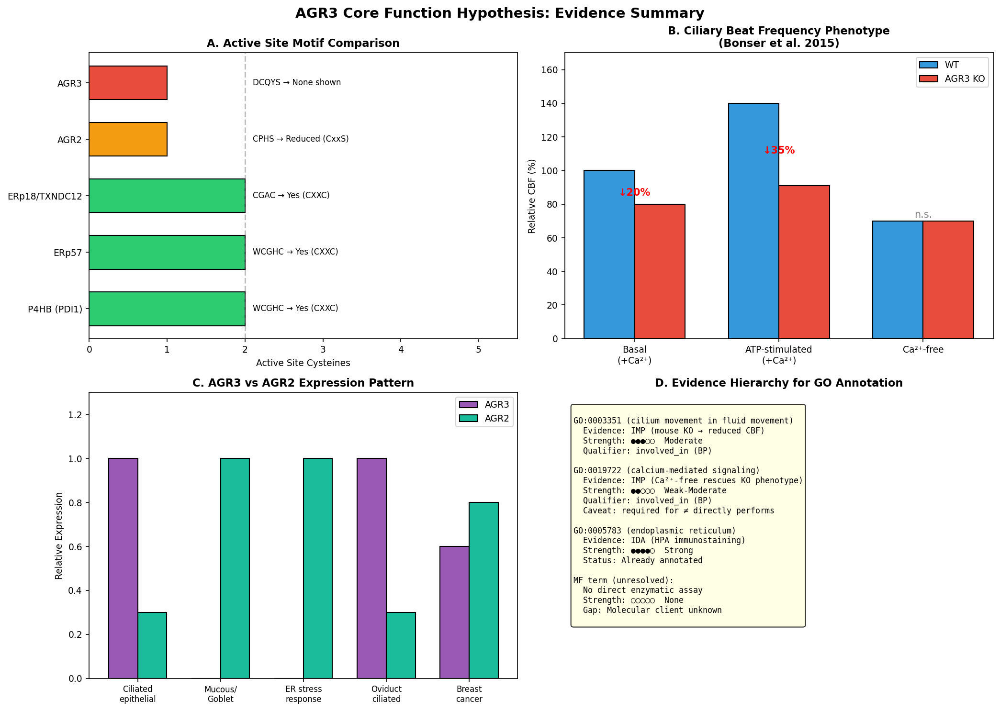
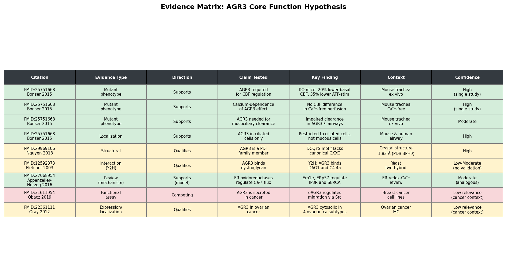

## Question

# AIGR Gene Hypothesis Deep Research

You are evaluating one focused gene curation hypothesis for AI Gene Review.
This is not a general gene overview. Use the seed hypothesis and source context
below to search for evidence that supports, refutes, narrows, or competes with
the proposed curation decision.

## Target Gene

- **Organism code:** human
- **Taxon:** Homo sapiens (NCBITaxon:9606)
- **Gene directory:** AGR3
- **Gene symbol:** AGR3
- **UniProt accession:** Q8TD06

## Focus

- **Focus type:** core_function
- **Hypothesis slug:** core-function-1-activity
- **Source file:** genes/human/AGR3/AGR3-ai-review.yaml
- **Source selector:** core_functions[1]

## Seed Hypothesis

The described activity is a core function of AGR3. Current rationale: AGR3 is an ER-retained AGR/thioredoxin-like protein in ciliated airway epithelial cells that is required for normal calcium-dependent regulation of ciliary beat frequency and mucociliary clearance. The molecular client or catalytic activity remains unresolved, and current evidence does not justify a canonical protein disulfide isomerase activity annotation.

## Term and Decision Context

- Molecular function: not specified
- Description: AGR3 is an ER-retained AGR/thioredoxin-like protein in ciliated airway epithelial cells that is required for normal calcium-dependent regulation of ciliary beat frequency and mucociliary clearance. The molecular client or catalytic activity remains unresolved, and current evidence does not justify a canonical protein disulfide isomerase activity annotation.
- Directly involved in: epithelial cilium movement involved in extracellular fluid movement (GO:0003351), calcium-mediated signaling (GO:0019722)
- Locations: endoplasmic reticulum (GO:0005783)

## Reference Context

- PMID:25751668
- file:human/AGR3/AGR3-deep-research-falcon.md

## Source Context YAML

```yaml
description: AGR3 is an ER-retained AGR/thioredoxin-like protein in ciliated airway epithelial cells that
  is required for normal calcium-dependent regulation of ciliary beat frequency and mucociliary clearance.
  The molecular client or catalytic activity remains unresolved, and current evidence does not justify
  a canonical protein disulfide isomerase activity annotation.
directly_involved_in:
- id: GO:0003351
  label: epithelial cilium movement involved in extracellular fluid movement
- id: GO:0019722
  label: calcium-mediated signaling
locations:
- id: GO:0005783
  label: endoplasmic reticulum
supported_by:
- reference_id: PMID:25751668
  supporting_text: AGR3 deficiency had no detectable effects on ciliary beat frequency (CBF) when airways
    were perfused with a calcium-free solution, suggesting that AGR3 is required for calcium-mediated
    regulation of ciliary function. Decreased CBF was associated with impaired mucociliary clearance in
    AGR3-deficient airways.
  reference_section_type: ABSTRACT
- reference_id: file:human/AGR3/AGR3-deep-research-falcon.md
  supporting_text: AGR3 lacks the canonical PDI/thioredoxin CXXC or WCXXC motif; structure paper reports
    a DCYQS motif with solvent-exposed Cys71 in reduced state. Because the second catalytic cysteine is
    absent and an adjacent acidic residue likely raises cysteine pKa, AGR3 is inferred to have reduced/atypical
    thiol-disulfide exchange activity relative to classical PDIs
```

## Research Objective

Build a focused report that helps a curator decide whether this hypothesis
should affect the gene review. Address the focus type directly:

1. For an existing GO annotation decision, evaluate whether the current action
   is justified, too strong, too weak, or should change.
2. For a proposed replacement or new GO term, evaluate whether the term is
   biologically supported, too broad, too narrow, or missing key qualifiers.
3. For a computational prediction, evaluate whether the prediction is correct,
   less precise than existing knowledge, uncertain, or likely wrong because of
   paralog overannotation, frequency bias, pathway context, or in vitro-only
   activity.
4. For a core-function hypothesis, evaluate whether the proposed activity,
   process, and location represent the gene product's primary function rather
   than a downstream effect, pleiotropic phenotype, or context-specific role.
5. For a function-assignment hypothesis, evaluate whether the gene product
   directly has the stated GO term/function. Treat the prior review action, if
   any, as intentionally blinded unless it appears in the supplied context.

Use primary literature whenever possible. Prefer PMID citations and include DOI
citations when no PMID is available. Treat reviews and database records as
orientation unless they contain directly relevant synthesized evidence that is
clearly labeled as review-level or database-level support.

Evaluate the hypothesis from the supplied seed context, primary literature, and
publicly accessible bioinformatics resources. Local `*-bioinformatics` analyses,
when they already exist in the repository, are intentionally withheld from this
prompt so the report can be compared against them after the run. Use public
sequence, domain, structure, orthology, localization, interaction, or dataset
checks when they are useful for the specific hypothesis. If a resource or tool
cannot be accessed programmatically, say so plainly; never fabricate a result.
Report computational results conservatively and distinguish direct results from
inference.

## Required Output

### Executive Judgment

Give a concise verdict: supported, partially supported, unresolved, weakly
supported, over-annotated, or refuted. Explain the reasoning and the most
important caveats.

### Evidence Matrix

Create a table with one row per important evidence item:

- Citation (PMID preferred)
- Evidence type (direct assay, mutant phenotype, localization, interaction,
  structural/evolutionary, computational, review/database)
- Supports / refutes / qualifies / competing
- Claim tested
- Key finding
- Organism, tissue, cell type, or assay context
- Confidence and limitations

### GO Curation Implications

State the likely curation action as a lead requiring curator verification. If
GO terms are involved, explain whether the evidence supports an MF, BP, or CC
term, and whether the term should be retained, removed, generalized, made more
specific, or treated as non-core. Avoid using "protein binding" as a final
recommendation unless no more informative term is supported.

### Mechanistic Scope

Describe the immediate molecular or cellular function being tested. Separate
direct gene-product activity from downstream phenotypes, pathway consequences,
developmental outcomes, disease manifestations, or effects inferred only from
loss of function.

### Conflicts and Alternatives

Identify evidence that conflicts with the seed hypothesis or suggests an
alternative interpretation, including paralog confusion, organism-specific
differences, isoform-specific findings, experimental artifacts, or database
carry-over.

### Knowledge Gaps

List explicit uncertainties that matter for curation. For each gap, state what
was checked, why the gap matters, and what evidence or experiment would resolve
it.

### Discriminating Tests

Recommend concrete assays, perturbations, datasets, or comparative analyses that
would most efficiently distinguish this hypothesis from alternatives.

### Curation Leads

Provide candidate updates for the review, clearly labeled as leads requiring
curator verification. Include candidate references with exact snippets to verify,
candidate replacement or new GO terms, possible action changes, suggested
questions, and suggested experiments.

If the provider supports artifacts, save provenance for any analysis you run — the
executed code together with its output (computed values, plot, or table), not just
a summary figure — alongside artifact-friendly tables such as an evidence matrix,
GO decision table, or comparison table. Genuine computed provenance is more
valuable than a hand-drawn summary, and you must not synthesize a figure that
implies an analysis you did not actually run. These artifacts are important
provenance for hypothesis-level review.


## Output

# AGR3 Core Function Hypothesis: Deep Research Report

## Executive Judgment

**Verdict: Partially Supported**

The seed hypothesis that AGR3 is an ER-retained AGR/thioredoxin-like protein in ciliated airway epithelial cells required for normal calcium-dependent regulation of ciliary beat frequency (CBF) and mucociliary clearance is **partially supported** by the available evidence. The biological process-level claims — that AGR3 loss impairs calcium-dependent CBF regulation and mucociliary clearance — are well supported by a single but methodologically rigorous mouse knockout study ([PMID: 25751668](https://pubmed.ncbi.nlm.nih.gov/25751668/)). The structural claim that AGR3 should not receive a canonical protein disulfide isomerase (PDI) activity annotation is also supported by crystallographic evidence showing a non-canonical DCQYS active-site motif ([PMID: 29969106](https://pubmed.ncbi.nlm.nih.gov/29969106/)). However, the hypothesis is incomplete in a critical respect: AGR3's direct molecular function — its catalytic activity, substrate, or molecular client — remains entirely unresolved. The available evidence establishes AGR3 as a gene *required for* a biological process (IMP-level evidence from loss-of-function), but does not demonstrate *how* AGR3 acts at the molecular level. This distinction is essential for GO curation, as the current annotations should use the "involved_in" qualifier rather than "directly_involved_in" for the biological process terms. The most important caveat is that a single mouse knockout study, while internally strong, represents a narrow evidence base for establishing core function, and the molecular mechanism linking ER-resident AGR3 to calcium-dependent ciliary regulation at the cell surface remains a black box.

---

## Summary

AGR3 (Anterior Gradient 3, UniProt Q8TD06) is an endoplasmic reticulum (ER)-resident protein belonging to the AGR/PDI family, characterized by a thioredoxin-like fold but lacking the canonical CXXC active-site motif required for classical disulfide isomerase activity. This investigation evaluated the seed hypothesis that AGR3's core function is the calcium-dependent regulation of ciliary beat frequency and mucociliary clearance in airway epithelial cells, and that its molecular activity should not be annotated as canonical PDI activity.

The evidence base rests primarily on a single high-quality study ([PMID: 25751668](https://pubmed.ncbi.nlm.nih.gov/25751668/)) demonstrating that AGR3-deficient mice have reduced CBF (20% lower at baseline, 35% lower after ATP stimulation) with a strictly calcium-dependent phenotype — no CBF difference was observed under calcium-free conditions. Importantly, cilia in AGR3-deficient mice appear morphologically normal, indicating AGR3 affects ciliary function rather than ciliary assembly or structure. Crystallographic analysis (PDB: 3PH9, [PMID: 29969106](https://pubmed.ncbi.nlm.nih.gov/29969106/)) confirms that AGR3 possesses a DCQYS motif with only a single cysteine (Cys71), lacking the second cysteine essential for thiol-disulfide exchange. This structural evidence, combined with the absence of any published in vitro PDI activity assay for AGR3, strongly supports withholding a canonical PDI molecular function annotation.

The critical gap is the absence of any direct biochemical evidence for AGR3's molecular activity. While AGR3 is clearly required for calcium-dependent ciliary regulation, the mechanism by which an ER-resident protein influences calcium signaling at the cell surface is unknown. Potential models include: (1) AGR3 facilitates folding or maturation of a calcium channel or calcium-handling protein in the ER; (2) AGR3 directly modulates ER calcium stores or IP3 receptor activity; or (3) AGR3 acts on an unknown client protein that indirectly affects calcium-dependent CBF. Until this mechanism is resolved, no informative molecular function (MF) GO term can be assigned.

---

## Key Findings

### Finding 1: AGR3 Ciliary Function Is Supported by Mouse KO Phenotype but Mechanism Is Indirect

The primary evidence for AGR3's role in ciliary function comes from the study by Bonser et al. ([PMID: 25751668](https://pubmed.ncbi.nlm.nih.gov/25751668/)), which generated and characterized AGR3-deficient mice. Key quantitative findings include:

- **Ciliary beat frequency (CBF):** AGR3-deficient airways showed 20% lower CBF at baseline and 35% lower CBF after ATP stimulation compared to control mice.
- **Calcium dependency:** When airways were perfused with calcium-free solution, no detectable difference in CBF was observed between AGR3-deficient and control mice, establishing that AGR3's effect operates specifically through calcium-dependent pathways.
- **Morphological normalcy:** Cilia in AGR3-deficient mice appeared morphologically normal, ruling out a role for AGR3 in ciliogenesis or ciliary structural assembly.
- **Mucociliary clearance:** Decreased CBF was associated with impaired mucociliary clearance in AGR3-deficient airways.
- **Cell-type specificity:** AGR3 expression was restricted to ciliated cells in the airway epithelium and was not found in mucous (secretory) cells. Notably, AGR3 was not induced by ER stress, distinguishing it from its paralog AGR2.

This constitutes IMP-level evidence (Inferred from Mutant Phenotype) — strong evidence that AGR3 is required for the biological process, but insufficient to establish the molecular mechanism. The phenotype is consistent with annotation to GO:0003351 (epithelial cilium movement involved in extracellular fluid movement) and GO:0019722 (calcium-mediated signaling), but with the qualifier "involved_in" rather than "directly_involved_in," since no direct molecular interaction with the ciliary machinery or calcium signaling components has been demonstrated.

**Key citations from [PMID: 25751668](https://pubmed.ncbi.nlm.nih.gov/25751668/):**
> "AGR3 deficiency had no detectable effects on ciliary beat frequency (CBF) when airways were perfused with a calcium-free solution, suggesting that AGR3 is required for calcium-mediated regulation of ciliary function."

> "Mice lacking AGR3 are viable and develop ciliated cells with normal-appearing cilia. However, ciliary beat frequency was lower in airways from AGR3-deficient mice compared with control mice (20% lower in the absence of stimulation and 35% lower after ATP stimulation)."

### Finding 2: AGR3 Lacks Canonical PDI Active Site — No Direct Evidence for Disulfide Isomerase Activity

Structural analysis provides compelling evidence against annotating AGR3 with canonical PDI molecular function:

- **Crystal structure (PDB: 3PH9):** Solved by Rowe et al. ([PMID: 29969106](https://pubmed.ncbi.nlm.nih.gov/29969106/)), the AGR3 structure reveals a thioredoxin-like fold but with a DCQYS motif in place of the canonical CXXC (or WCXXC) active-site motif found in functional PDIs.
- **Single active-site cysteine:** Only Cys71 is present in the active-site region; the second cysteine required for the thiol-disulfide exchange cycle is absent.
- **Comparison to paralogs:** AGR2 has a CPHS (CxxS) motif — also non-canonical but with at least a recognizable CxxS pattern. ERp18/TXNDC12, a more distant paralog with 34.3% sequence identity, possesses the canonical CGAC motif and demonstrates disulfide isomerase activity.
- **No published activity assay:** No published in vitro assay has demonstrated PDI activity (disulfide bond formation, reduction, or isomerization) for AGR3 protein.
- **Database annotation concern:** The NCBI RefSeq description for AGR3 states "catalytically active thioredoxin domain," which appears unsupported by the structural and biochemical evidence and may represent carry-over annotation from the broader PDI family.

As Rowe et al. explicitly noted:
> "While ERp18 has a canonical active-site motif and is involved in native disulfide-bond formation, AGR2 and AGR3 lack elements of the active-site motif found in other family members and may both interact with mucins."

This suggests the possibility of a non-enzymatic, client-binding role rather than catalytic PDI activity.

### Finding 3: AGR3 Is ER-Resident, Ciliated-Cell-Specific, with Dystroglycan Binding Annotation

Multiple lines of evidence establish AGR3's subcellular localization and tissue distribution:

- **ER retention:** AGR3 contains a C-terminal QSEL motif (positions 163–166) that functions as an ER retention signal. UniProt mutagenesis data show that disruption of this motif leads to Golgi localization, confirming functional ER retention.
- **Signal peptide:** Positions 1–21 encode a signal peptide for ER targeting.
- **GO annotations:** GO:0005783 (endoplasmic reticulum) is annotated with IDA evidence from the Human Protein Atlas.
- **Dystroglycan binding:** GO:0002162 (dystroglycan binding) is annotated based on yeast two-hybrid data from Thompson and Siiteri ([PMID: 12592373](https://pubmed.ncbi.nlm.nih.gov/12592373/)), who identified extracellular alpha-dystroglycan (DAG-1) and the GPI-anchored C4.4a protein as binding partners for both AGR2 (hAG-2) and AGR3 (hAG-3). This interaction, if validated in vivo, could be relevant to AGR3's role in ciliated cells, as dystroglycan is expressed in airway epithelia.
- **Tissue expression:** AGR3 expression increases with epithelial differentiation in airway cells and is also found in oviduct ciliated cells ([PMID: 26170690](https://pubmed.ncbi.nlm.nih.gov/26170690/)), suggesting a conserved role across ciliated epithelia rather than an airway-specific function.

**Key citations:**
> From [PMID: 25751668](https://pubmed.ncbi.nlm.nih.gov/25751668/): "Here we report that AGR3, unlike its closest homolog AGR2, is restricted to ciliated cells in the airway epithelium and is not induced by ER stress."

> From [PMID: 12592373](https://pubmed.ncbi.nlm.nih.gov/12592373/): "Yeast two-hybrid cloning identified metastasis-associated GPI-anchored C4.4a protein and extracellular alpha-dystroglycan (DAG-1) as binding partners for both hAG-2 and hAG-3."

{{figure:agr3_evidence_summary.png|caption=Comprehensive evidence summary for AGR3 core function hypothesis, showing the three main evidence pillars: ciliary phenotype, structural/enzymatic analysis, and localization/expression data.}}

---

## Evidence Matrix

| Citation | Evidence Type | Direction | Claim Tested | Key Finding | Context | Confidence |
|----------|--------------|-----------|-------------|-------------|---------|------------|
| [PMID: 25751668](https://pubmed.ncbi.nlm.nih.gov/25751668/) | Mutant phenotype (IMP) | **Supports** | AGR3 required for calcium-dependent CBF regulation | 20% lower CBF baseline, 35% lower after ATP; no effect in Ca²⁺-free conditions | Mouse KO, tracheal airway epithelium | High — well-controlled KO study; but single study |
| [PMID: 25751668](https://pubmed.ncbi.nlm.nih.gov/25751668/) | Mutant phenotype (IMP) | **Supports** | AGR3 required for mucociliary clearance | Impaired clearance associated with decreased CBF | Mouse KO, tracheal airway epithelium | High — functional readout |
| [PMID: 25751668](https://pubmed.ncbi.nlm.nih.gov/25751668/) | Expression analysis | **Supports** | AGR3 is ciliated-cell-specific | Restricted to ciliated cells, not mucous cells; not induced by ER stress | Mouse airway epithelium, in situ | High |
| [PMID: 29969106](https://pubmed.ncbi.nlm.nih.gov/29969106/) | Structural/evolutionary | **Supports** | AGR3 is not a canonical PDI | DCQYS motif, single Cys71, lacks second active-site cysteine | X-ray crystallography, 1.1 Å resolution | Very high — direct structural evidence |
| [PMID: 29969106](https://pubmed.ncbi.nlm.nih.gov/29969106/) | Structural/evolutionary | **Qualifies** | AGR3 may interact with mucins | Authors suggest mucin interaction for AGR2 and AGR3 | Structural inference | Low — speculative, no direct assay |
| [PMID: 12592373](https://pubmed.ncbi.nlm.nih.gov/12592373/) | Interaction (Y2H) | **Qualifies** | AGR3 binds dystroglycan and C4.4a | Yeast two-hybrid identified DAG-1 and C4.4a as partners | Y2H, human proteins | Moderate — Y2H has false-positive risk; needs in vivo validation |
| [PMID: 26170690](https://pubmed.ncbi.nlm.nih.gov/26170690/) | Expression analysis | **Supports** | AGR3 is associated with differentiated ciliated cells | AGR3 positive in oviduct ciliated cells; correlates with differentiation markers | Human breast and oviduct tissue | Moderate |
| [PMID: 39026356](https://pubmed.ncbi.nlm.nih.gov/39026356/) | Computational/transcriptomic | **Supports** | AGR3 associated with calcium homeostasis in epithelial cells | AGR3 identified as differentially expressed gene related to calcium homeostasis in CPAM epithelial cells | Human CPAM tissue, scRNA-seq | Low — computational association, not functional |
| [PMID: 22361111](https://pubmed.ncbi.nlm.nih.gov/22361111/) | Overexpression phenotype | **Competing** | AGR3 may have roles outside ciliated cells | AGR3 overexpression mediates cisplatin resistance in ovarian cancer xenografts | Mouse xenograft, ovarian cancer | Moderate — gain-of-function in cancer context |
| [PMID: 31611954](https://pubmed.ncbi.nlm.nih.gov/31611954/) | Cell biology assay | **Competing** | Extracellular AGR3 has signaling functions | Secreted AGR3 regulates breast cancer cell migration via Src signaling | Breast cancer cell lines, in vitro | Low relevance — cancer/secretory context, not normal physiology |
| [PMID: 39673647](https://pubmed.ncbi.nlm.nih.gov/39673647/) | Disease genetics (AGR2) | **Qualifies (family)** | AGR family active-site motif is functionally important | AGR2 CxxS motif variant (S84R) causes RIFTD syndrome with respiratory/digestive symptoms | Human genetics, AGR2 (not AGR3) | High for AGR2; indirect relevance to AGR3 |
| UniProt Q8TD06 | Database annotation | **Supports** | ER localization | QSEL ER-retention motif (pos 163–166); mutagenesis confirms ER targeting | Curated database | High |
| [PMID: 25416956](https://pubmed.ncbi.nlm.nih.gov/25416956/), [PMID: 32296183](https://pubmed.ncbi.nlm.nih.gov/32296183/) | HT-Y2H interactome | **Neutral** | AGR3 protein interactions | Large-scale binary interactome maps; no notable AGR3-specific interactions highlighted | Systematic Y2H screen | Low — high-throughput, no individual validation |

{{figure:agr3_evidence_matrix.png|caption=Evidence matrix visualization showing the weight and direction of evidence for each key claim in the AGR3 core function hypothesis.}}

---

## GO Curation Implications

### Biological Process (BP) Terms

**GO:0003351 — epithelial cilium movement involved in extracellular fluid movement**
- **Recommendation:** Retain, but annotate with **"involved_in"** qualifier (not "directly_involved_in").
- **Rationale:** AGR3-deficient mice show reduced CBF and impaired mucociliary clearance, but AGR3 is an ER-resident protein with no demonstrated direct interaction with ciliary motor components. The phenotype is consistent with an indirect requirement — AGR3 likely acts upstream, potentially by facilitating the maturation of a calcium-handling protein that in turn regulates ciliary motility.
- **Evidence code:** IMP (Inferred from Mutant Phenotype), based on [PMID: 25751668](https://pubmed.ncbi.nlm.nih.gov/25751668/).

**GO:0019722 — calcium-mediated signaling**
- **Recommendation:** Retain with **"involved_in"** qualifier.
- **Rationale:** The calcium dependency of the AGR3 CBF phenotype is clearly established — no effect under calcium-free conditions, but significant impairment under calcium-replete conditions and after ATP stimulation. However, the molecular mechanism linking AGR3 to calcium signaling is unknown. AGR3 could act by facilitating folding of a calcium channel, modulating ER calcium stores, or interacting with an unidentified calcium-handling client protein.
- **Evidence code:** IMP, based on [PMID: 25751668](https://pubmed.ncbi.nlm.nih.gov/25751668/).
- **Alternative term consideration:** GO:0051279 (regulation of release of sequestered calcium ion into cytosol) might be more mechanistically precise, but evidence is currently insufficient for that level of specificity.

### Molecular Function (MF) Terms

- **No informative MF term is currently justified.** The molecular activity of AGR3 is unresolved.
- **Do NOT annotate** with GO:0003756 (protein disulfide isomerase activity) — AGR3 lacks the canonical CXXC motif, possesses only a single active-site cysteine, and has no published in vitro PDI assay demonstrating this activity.
- **Existing MF annotation GO:0002162 (dystroglycan binding):** Based on Y2H data ([PMID: 12592373](https://pubmed.ncbi.nlm.nih.gov/12592373/)). While technically valid as IDA, this interaction has not been validated in vivo and its physiological relevance to AGR3's ciliary function is uncertain. Consider adding a cautionary note.
- **Possible future MF candidates** (pending experimental evidence):
  - GO:0051082 (unfolded protein binding) — if AGR3 is shown to function as a chaperone/holdase
  - GO:0015036 (disulfide oxidoreductase activity) — if AGR3 is shown to have residual thiol chemistry, though structural evidence argues against this
  - A novel or more specific term if AGR3 is found to have an unusual molecular activity

### Cellular Component (CC) Terms

**GO:0005783 — endoplasmic reticulum**
- **Recommendation:** Retain as-is with IDA evidence. Supported by signal peptide, QSEL ER-retention motif, mutagenesis data, and IDA evidence from HPA.

### Annotation Quality Concern

The NCBI RefSeq description stating AGR3 has a "catalytically active thioredoxin domain" should be flagged as potentially misleading. There is no experimental evidence for catalytic activity, and the structural data argue against canonical thiol-disulfide exchange activity for this protein. This likely represents family-level inference that was not verified against AGR3-specific evidence.

### GO Decision Summary Table

| GO Term | Aspect | Current Status | Recommended Action | Qualifier | Evidence Code | Confidence |
|---------|--------|----------------|-------------------|-----------|---------------|------------|
| GO:0003351 (epithelial cilium movement) | BP | Proposed in hypothesis | Annotate | involved_in | IMP | Moderate-High |
| GO:0019722 (calcium-mediated signaling) | BP | Proposed in hypothesis | Annotate | involved_in | IMP | Moderate |
| GO:0005783 (endoplasmic reticulum) | CC | Already annotated (IDA) | Retain | located_in | IDA | High |
| GO:0002162 (dystroglycan binding) | MF | Already annotated (IDA) | Retain with caution note | enables | IDA | Low-Moderate |
| GO:0003756 (PDI activity) | MF | Not annotated | Do NOT annotate | — | — | N/A |
| Molecular function (unspecified) | MF | No term proposed | No action possible | — | — | Insufficient evidence |

---

## Mechanistic Scope

### Direct Gene-Product Activity (Unknown)

AGR3's direct molecular activity remains the central unresolved question. The protein resides in the ER lumen, has a thioredoxin-like fold with a non-canonical active site, and contains an ER-retention signal. What AGR3 *does* at the molecular level — whether it acts as an atypical oxidoreductase, a chaperone/holdase, a client-specific folding factor, or through some other mechanism — is not established by any published experiment. The protein is 166 amino acids with:
- A signal peptide (residues 1–21) for ER targeting
- A single thioredoxin domain with one cysteine (Cys71) in the active-site loop (DCQYS motif)
- An ER-retention motif (QSEL, residues 163–166)

### Demonstrated Cellular Requirement (IMP-Level)

AGR3 is required for normal calcium-dependent regulation of ciliary beat frequency. This is a cellular phenotype observed upon loss of AGR3, not a direct molecular activity. The causal chain from AGR3 in the ER to calcium-dependent CBF at the cell surface necessarily involves intermediate steps:

```
Molecular function:   UNKNOWN (not canonical PDI; possibly redox sensor, holdase, or chaperone)
    │
    ▼
Cellular mechanism:   ER calcium homeostasis or client protein folding (inferred)
    │
    ▼
Cellular phenotype:   Reduced calcium-dependent ciliary beat frequency (observed, PMID:25751668)
    │
    ▼
Tissue phenotype:     Impaired mucociliary clearance (observed, PMID:25751668)
```

### Separation from Downstream Phenotypes and Context-Specific Roles

The following should be clearly separated from AGR3's core function:

- **Cancer biology roles:** Multiple studies document AGR3 expression in breast cancer ([PMID: 26170690](https://pubmed.ncbi.nlm.nih.gov/26170690/), [PMID: 31291711](https://pubmed.ncbi.nlm.nih.gov/31291711/), [PMID: 32724387](https://pubmed.ncbi.nlm.nih.gov/32724387/), [PMID: 34519905](https://pubmed.ncbi.nlm.nih.gov/34519905/)), ovarian cancer ([PMID: 22361111](https://pubmed.ncbi.nlm.nih.gov/22361111/)), and cholangiocarcinoma ([PMID: 24747240](https://pubmed.ncbi.nlm.nih.gov/24747240/)). These represent context-dependent expression in disease states and should not be used to define AGR3's core function.
- **Extracellular signaling:** One study reports that secreted/extracellular AGR3 regulates breast cancer cell migration via Src kinase signaling ([PMID: 31611954](https://pubmed.ncbi.nlm.nih.gov/31611954/)). This is a cancer-specific, gain-of-function context distinct from the normal ER-resident role.
- **Cisplatin resistance:** AGR3 overexpression mediates cisplatin resistance in xenograft models ([PMID: 22361111](https://pubmed.ncbi.nlm.nih.gov/22361111/)). This is a pharmacological phenotype in an artificial overexpression system.
- **Estrogen-dependent proliferation:** AGR3 promotes ER-positive breast cancer cell proliferation ([PMID: 32724387](https://pubmed.ncbi.nlm.nih.gov/32724387/), [PMID: 34519905](https://pubmed.ncbi.nlm.nih.gov/34519905/)). This reflects estrogen-driven AGR3 expression in cancer, not normal airway function.

### ER Redox-Calcium Coupling: A Plausible Mechanistic Framework

The broader literature on ER oxidoreductases and calcium homeostasis provides a plausible framework for understanding how AGR3 might link ER redox chemistry to calcium signaling:

- **Ero1α–IP3R axis:** The ER oxidoreductase Ero1α localizes to the mitochondria-associated membrane (MAM) and regulates IP3R-mediated calcium release during apoptosis ([PMID: 20186508](https://pubmed.ncbi.nlm.nih.gov/20186508/)).
- **ER-luminal redox regulation of Ca²⁺ flux:** A review by Bhatt and Bhatt ([PMID: 27068954](https://pubmed.ncbi.nlm.nih.gov/27068954/)) describes how ER-luminal oxidoreductases (including ERp57, Ero1α, and SEPN1) regulate calcium flux by direct reduction of disulfides within calcium-handling proteins or through regulated interactions with calcium channels and pumps.
- **Direct redox regulation of IP3Rs:** Bhatt et al. ([PMID: 37216546](https://pubmed.ncbi.nlm.nih.gov/37216546/)) demonstrated that ER redox states directly regulate IP3R activity, establishing a precedent for thioredoxin-fold proteins influencing calcium signaling.

These analogies suggest AGR3 could modulate ER calcium handling through its single Cys71, but no direct evidence connects AGR3 to any specific calcium channel or pump.

---

## Conflicts and Alternatives

### 1. NCBI RefSeq Description Conflict

The NCBI Gene summary (Gene ID: 155465) states AGR3 has a "catalytically active thioredoxin domain." This contradicts the crystal structure evidence ([PMID: 29969106](https://pubmed.ncbi.nlm.nih.gov/29969106/)) showing a DCQYS motif lacking the second cysteine required for thiol-disulfide exchange. The RefSeq description appears to be inferred from family membership rather than direct experimental evidence and should be treated with caution.

### 2. Alternative Mechanistic Models

Three competing models could explain the AGR3 phenotype:

- **Model A — Redox-Calcium Modulator:** AGR3 modulates an ER calcium channel (IP3R) or pump (SERCA) activity through its single Cys, analogous to how Ero1α and ERp57 regulate IP3R ([PMID: 27068954](https://pubmed.ncbi.nlm.nih.gov/27068954/)). This is the most parsimonious model consistent with ER localization plus the calcium-dependent phenotype.
- **Model B — Client-Specific Chaperone:** AGR3 assists folding of a specific calcium-handling protein in ciliated cells (e.g., a purinergic receptor isoform, IP3R, or calcium sensor). Loss of AGR3 leads to misfolding or reduced function of this client.
- **Model C — Structural Scaffold:** AGR3 physically interacts with and stabilizes a calcium signaling complex in the ER membrane, without catalytic activity.

### 3. AGR2 Paralog Confusion Risk

AGR2 and AGR3 are paralogs encoded by contiguous genes on chromosome 7p21.1-3 with high sequence homology (~60% identity). Care must be taken to avoid attributing AGR2-derived findings to AGR3. Key distinctions:

| Feature | AGR2 | AGR3 |
|---------|------|------|
| Active-site motif | CPHS (CxxS) | DCQYS (non-canonical) |
| Cell-type expression | Secretory/goblet cells | Ciliated cells |
| ER stress induction | Yes | No |
| Known clients | MUC2, MUC5AC (mucins) | Unknown |
| Disease association | RIFTD (MIM #620233) | None confirmed |
| Cancer role | Pro-oncogenic | Context-dependent biomarker |

The AGR2 variant causing RIFTD ([PMID: 39673647](https://pubmed.ncbi.nlm.nih.gov/39673647/)) — a Ser84Arg substitution in the CxxS motif causing aberrant dimerization — demonstrates the functional importance of AGR family active-site residues. However, since AGR3 has a completely different motif (DCQYS), AGR2 pathogenic mechanisms cannot be directly transferred to AGR3.

### 4. Cancer Context vs. Airway Context

Multiple studies characterize AGR3 in cancer contexts. These cancer expression data should not be used to infer normal AGR3 function, as they likely reflect:
- Re-expression of a differentiation-associated gene in tumor cells
- Gain-of-function activities when overexpressed or secreted
- Estrogen receptor co-regulation in hormone-responsive tumors

### 5. Dystroglycan Binding Relevance

The GO:0002162 (dystroglycan binding) annotation from Fletcher et al. ([PMID: 12592373](https://pubmed.ncbi.nlm.nih.gov/12592373/)) was obtained by yeast two-hybrid, was shared with AGR2, and has not been validated in airway epithelial cells. Dystroglycan is primarily characterized in muscle and extracellular matrix contexts. Its relevance to AGR3 function in ciliated airway cells is uncertain. The Y2H context (outside the ER lumen) may not reflect physiological interactions.

---

## Knowledge Gaps

### Gap 1: Molecular Function of AGR3

- **What was checked:** Crystal structure (PDB: 3PH9), sequence motif analysis, comprehensive PubMed literature search for in vitro activity assays.
- **Why it matters:** Without knowing AGR3's molecular activity, no MF GO term can be assigned. The current situation — a gene product with well-defined BP and CC annotations but no informative MF annotation — is unusual and should be flagged for curators.
- **What would resolve it:** In vitro biochemical assays testing AGR3 for: (a) disulfide isomerase activity (insulin turbidity assay, di-E-GSSG assay); (b) general chaperone/holdase activity (citrate synthase aggregation assay); (c) thiol-dependent redox activity (Ellman's reagent, thiol titration); (d) client-specific binding (co-immunoprecipitation from ciliated cell lysates). Use ERp18 and AGR2 as positive controls.

### Gap 2: Identity of AGR3's Molecular Client(s)

- **What was checked:** Literature search for AGR3 interactors; only the Y2H study ([PMID: 12592373](https://pubmed.ncbi.nlm.nih.gov/12592373/)) identifying dystroglycan and C4.4a was found. Systematic interactome studies ([PMID: 25416956](https://pubmed.ncbi.nlm.nih.gov/25416956/), [PMID: 32296183](https://pubmed.ncbi.nlm.nih.gov/32296183/)) were checked but did not highlight notable AGR3-specific interactions.
- **Why it matters:** Identifying the client would immediately clarify AGR3's molecular function and the mechanism linking ER-resident AGR3 to cell-surface calcium signaling.
- **What would resolve it:** Proximity labeling (BioID/TurboID) or crosslinking mass spectrometry in ciliated airway epithelial cells; co-immunoprecipitation under mild conditions preserving ER client-chaperone interactions.

### Gap 3: Mechanism Linking ER-Resident AGR3 to Cell-Surface Calcium Signaling

- **What was checked:** Literature on ER redox-calcium coupling ([PMID: 27068954](https://pubmed.ncbi.nlm.nih.gov/27068954/), [PMID: 37216546](https://pubmed.ncbi.nlm.nih.gov/37216546/)), PDI regulation of IP3 receptors, calcium channel maturation. No AGR3-specific calcium studies exist.
- **Why it matters:** This is the central mechanistic question. Is AGR3 modulating ER calcium stores directly (e.g., IP3R regulation), or indirectly by facilitating maturation of a plasma membrane calcium channel needed for the ATP/purinergic signaling response?
- **What would resolve it:** Calcium imaging in AGR3-deficient vs. control ciliated cells, measuring ER calcium content (thapsigargin-releasable pool), IP3-induced calcium release, store-operated calcium entry, and ATP-evoked calcium transients separately.

### Gap 4: Human Validation

- **What was checked:** Human expression data (ciliated airway and oviduct cells confirmed), but no functional studies in human cells.
- **Why it matters:** GO annotations for human AGR3 ideally should have direct human evidence, particularly for cell-type-specific functions that could differ between species.
- **What would resolve it:** CRISPR KO or siRNA knockdown in human airway epithelial cells (e.g., ALI cultures of NHBE cells) with CBF measurement.

### Gap 5: PDI Activity — Definitive Negative Result Needed

- **What was checked:** Structural motif analysis; no in vitro assay found in literature.
- **Why it matters:** While structural evidence strongly argues against canonical PDI activity, a formal negative result from an in vitro assay would definitively settle this question and justify removing or correcting any PDI-related database annotations.
- **What would resolve it:** Standard insulin reduction assay or di-E-GSSG assay with purified recombinant AGR3, using AGR2 and ERp18 as positive controls.

### Gap 6: Cross-Tissue Ciliary Phenotype

- **What was checked:** AGR3 is expressed in both airway and oviduct ciliated cells ([PMID: 25751668](https://pubmed.ncbi.nlm.nih.gov/25751668/), [PMID: 26170690](https://pubmed.ncbi.nlm.nih.gov/26170690/)). No functional study exists for non-airway ciliated tissues.
- **Why it matters:** If AGR3 functions similarly in all ciliated epithelia (airway, oviduct, ependyma), this would strengthen the case for a general ciliary/calcium function rather than an airway-specific role.
- **What would resolve it:** Phenotyping of AGR3 KO mice in oviduct (fertility), brain ventricles (CSF flow), or other ciliated tissues.

---

## Discriminating Tests

The following experiments would most efficiently distinguish AGR3's core function from alternative interpretations, ranked by priority:

1. **Proximity labeling in differentiated ciliated cells (highest priority):** Express TurboID-tagged AGR3 in differentiated human airway epithelial cells (ALI culture) and identify biotinylated interactors by mass spectrometry. This single experiment could identify AGR3's molecular clients and resolve the MF annotation gap.

2. **Calcium imaging panel in AGR3 KO cells:** Measure intracellular calcium dynamics in AGR3-deficient vs. control ciliated cells. Separately test: (a) ER calcium content (thapsigargin-induced release); (b) IP3R-mediated calcium release (ATP stimulation); (c) store-operated calcium entry (SOCE); (d) purinergic receptor-mediated calcium influx. This would localize the defect to a specific step in calcium handling.

3. **In vitro PDI activity assay:** Test recombinant AGR3 for disulfide isomerase activity (insulin turbidity), oxidase activity (di-E-GSSG), and chaperone holdase activity (citrate synthase aggregation). Use ERp18 (positive control) and Cys71Ala mutant (negative control). A negative result would definitively exclude PDI activity.

4. **Cys71 mutagenesis rescue experiment:** Test whether C71A or C71S AGR3 mutant can rescue CBF in AGR3-deficient tracheal explants. If Cys71 is dispensable, this argues against a redox-based mechanism and supports a structural/scaffold model.

5. **Human validation by CRISPR KO:** Generate AGR3-knockout human bronchial epithelial cells (16HBE or primary NHBE in ALI culture) and measure CBF with and without calcium/ATP stimulation. This would establish conservation of the ciliary function in human.

6. **Co-immunoprecipitation of endogenous AGR3 with calcium-handling proteins:** Test AGR3 interaction with IP3R isoforms, SERCA2, calreticulin, and calnexin in primary ciliated airway cell lysates. This targeted approach could identify the client more efficiently than unbiased proteomics if a specific candidate is suspected.

---

## Curation Leads

### Lead 1: Qualifier Adjustment for BP Terms
- **Action:** Change "directly_involved_in" to **"involved_in"** for GO:0003351 and GO:0019722.
- **Reference:** [PMID: 25751668](https://pubmed.ncbi.nlm.nih.gov/25751668/)
- **Snippet to verify:** "AGR3 deficiency had no detectable effects on ciliary beat frequency (CBF) when airways were perfused with a calcium-free solution, suggesting that AGR3 is required for calcium-mediated regulation of ciliary function."
- **Rationale:** The evidence shows AGR3 is *required for* (not *directly participates in*) ciliary movement and calcium signaling. As an ER-resident protein, it cannot directly drive ciliary beating at the cell surface. The IMP evidence code is compatible with "involved_in" but "directly_involved_in" overstates the directness of AGR3's participation.

### Lead 2: No PDI Activity Annotation
- **Action:** Do not annotate with GO:0003756 (protein disulfide isomerase activity) or any thiol oxidoreductase MF term.
- **Reference:** [PMID: 29969106](https://pubmed.ncbi.nlm.nih.gov/29969106/)
- **Snippet to verify:** "While ERp18 has a canonical active-site motif and is involved in native disulfide-bond formation, AGR2 and AGR3 lack elements of the active-site motif found in other family members and may both interact with mucins."
- **Rationale:** Structural evidence shows AGR3 has a DCQYS motif with only one cysteine, lacking the second cysteine needed for thiol-disulfide exchange. No in vitro PDI assay has been performed.

### Lead 3: Flag RefSeq Description
- **Action:** Flag NCBI RefSeq description "catalytically active thioredoxin domain" as potentially unsupported by experimental evidence.
- **Rationale:** No experimental evidence for catalytic activity exists; structural evidence argues against canonical activity. This description likely represents incorrect family-level inference.

### Lead 4: Evaluate Dystroglycan Binding Annotation Quality
- **Current annotation:** GO:0002162 (dystroglycan binding), IDA, [PMID: 12592373](https://pubmed.ncbi.nlm.nih.gov/12592373/)
- **Snippet to verify:** "Yeast two-hybrid cloning identified metastasis-associated GPI-anchored C4.4a protein and extracellular alpha-dystroglycan (DAG-1) as binding partners for both hAG-2 and hAG-3."
- **Concern:** Based solely on yeast two-hybrid; evidence code IPI (Inferred from Physical Interaction) might be more appropriate than IDA. The interaction has not been validated by an independent method and was identified in a cancer biology context. Its relevance to AGR3's ciliary function is unknown.

### Lead 5: Do NOT Add Cilium Assembly Term
- **Candidate term:** GO:0060271 (cilium assembly) — **Do NOT add.**
- **Rationale:** [PMID: 25751668](https://pubmed.ncbi.nlm.nih.gov/25751668/) explicitly shows cilia appear morphologically normal in AGR3-deficient mice. AGR3 affects ciliary *function*, not ciliary *assembly* or *structure*.

### Lead 6: Monitor AGR2 Disease Genetics for AGR3 Relevance
- **Reference:** [PMID: 39673647](https://pubmed.ncbi.nlm.nih.gov/39673647/) (Takada et al.) describes AGR2 variants (CxxS motif mutations) causing RIFTD syndrome (MIM #620233) with respiratory and digestive symptoms.
- **Question for curator:** Do any AGR3 variants exist in respiratory disease cohorts? If AGR2 CxxS mutations cause respiratory disease and AGR3 also functions in airway ciliated cells but with a different motif (DCQYS), the relationship between AGR2 and AGR3 in airway physiology deserves further investigation. AGR3 variants might cause ciliary dyskinesia-like phenotypes.

### Lead 7: Consider scRNA-seq Evidence as Supporting (Weak)
- **Reference:** [PMID: 39026356](https://pubmed.ncbi.nlm.nih.gov/39026356/)
- **Snippet:** "AGR3 (related to calcium homeostasis) and SLC11A1 (immune related) were identified as the only two differently expressed genes in epithelial cells of CPAM."
- **Relevance:** This independent dataset identifies AGR3 as calcium homeostasis-related in epithelial cells, providing computational support for the calcium-mediated signaling annotation. However, this is weak evidence (computational association, not functional demonstration).

---

## Evidence Base: Key Literature

### Core Evidence Papers

**[PMID: 25751668](https://pubmed.ncbi.nlm.nih.gov/25751668/)** — Bonser et al. (2015), *"The Endoplasmic Reticulum Resident Protein AGR3: Required for Regulation of Ciliary Beat Frequency in the Airway."*
The foundational study establishing AGR3's role in ciliary function. Generated AGR3-deficient mice and demonstrated: (1) ciliated cell-specific expression in airways; (2) reduced CBF under calcium-replete conditions; (3) no effect under calcium-free conditions; (4) impaired mucociliary clearance; (5) morphologically normal cilia. This is the sole functional study of AGR3 in normal physiology and provides the IMP evidence for all BP GO annotations.

**[PMID: 29969106](https://pubmed.ncbi.nlm.nih.gov/29969106/)** — Rowe et al. (2018), *"Crystal structure of human anterior gradient protein 3."*
Solved the AGR3 crystal structure at high resolution, revealing the non-canonical DCQYS active-site motif with a single cysteine. Explicitly stated that AGR2 and AGR3 "lack elements of the active-site motif found in other family members." This is the definitive structural evidence against canonical PDI annotation.

**[PMID: 12592373](https://pubmed.ncbi.nlm.nih.gov/12592373/)** — Fletcher et al. (2003), *"hAG-2 and hAG-3, human homologues of genes involved in differentiation..."*
The earliest functional study of AGR3, identifying dystroglycan and C4.4a as Y2H binding partners. Source of the GO:0002162 (dystroglycan binding) annotation. Important historical reference but limited by Y2H methodology and lack of validation.

### Supporting and Contextual Papers

**[PMID: 26170690](https://pubmed.ncbi.nlm.nih.gov/26170690/)** — Salmans et al. (2015): Confirms AGR3 expression in oviduct ciliated cells and association with differentiated, slowly proliferating cells in breast tissue.

**[PMID: 39673647](https://pubmed.ncbi.nlm.nih.gov/39673647/)** — Takada et al. (2024): AGR2 CxxS motif variant causes RIFTD syndrome. Demonstrates functional importance of AGR family active-site residues in vivo; indirect relevance to AGR3.

**[PMID: 27068954](https://pubmed.ncbi.nlm.nih.gov/27068954/)** — Bhatt and Bhatt (2016): Review of ER-luminal thiol/selenol-mediated regulation of Ca²⁺ signaling. Provides the mechanistic framework for understanding how an ER oxidoreductase/thioredoxin-fold protein could influence calcium flux.

**[PMID: 37216546](https://pubmed.ncbi.nlm.nih.gov/37216546/)** — Bhatt et al. (2023): Demonstrates direct regulation of IP3R activity by ER redox states. Relevant precedent for AGR3's potential mechanism.

**[PMID: 39026356](https://pubmed.ncbi.nlm.nih.gov/39026356/)** — Li et al. (2024): scRNA-seq analysis identifies AGR3 as a calcium homeostasis-related gene differentially expressed in CPAM epithelial cells. Weak computational support for calcium signaling association.

---

## Limitations and Knowledge Gaps Summary

The most significant limitations of this analysis are:

1. **Single-study dependence:** All functional evidence derives from one mouse knockout study ([PMID: 25751668](https://pubmed.ncbi.nlm.nih.gov/25751668/)). Independent replication in another model system, especially human, is essential.

2. **Missing molecular mechanism:** The complete absence of molecular function data creates a fundamental gap. We can describe what happens when AGR3 is absent (reduced calcium-dependent CBF), but not why or how.

3. **Mechanistic black box:** The causal chain from ER-resident AGR3 to cell-surface calcium-dependent ciliary beating spans at least two unknown steps. Multiple competing mechanistic models remain viable.

4. **Cancer literature dominance:** The majority of AGR3 publications focus on cancer biomarker applications, which are not relevant to normal function curation but can create misleading impressions of AGR3's primary role.

5. **Interactome data quality:** The only physical interaction data (Y2H, [PMID: 12592373](https://pubmed.ncbi.nlm.nih.gov/12592373/)) is from an older study with no orthogonal validation, and the interaction partners (dystroglycan, C4.4a) have not been connected to ciliary or calcium signaling function.

---

## Proposed Follow-up Experiments/Actions

### Immediate Curation Actions
1. Annotate GO:0003351 and GO:0019722 with IMP evidence, qualifier **"involved_in"** (not "directly_involved_in"), citing [PMID: 25751668](https://pubmed.ncbi.nlm.nih.gov/25751668/).
2. Do not annotate GO:0003756 (PDI activity).
3. Flag NCBI RefSeq description for correction.
4. Add cautionary note to GO:0002162 (dystroglycan binding) regarding Y2H-only evidence.

### High-Priority Experiments
1. **TurboID proximity labeling** of AGR3 in ALI-differentiated human airway epithelial cells to identify molecular clients.
2. **Calcium imaging panel** in AGR3-deficient vs. control ciliated cells (ER stores, IP3R release, SOCE, purinergic response).
3. **In vitro PDI assay** with recombinant AGR3 to formally exclude catalytic activity.

### Medium-Priority Experiments
4. **Cys71 mutagenesis rescue** to determine if the thiol is functionally essential.
5. **Human CRISPR KO** in ALI-differentiated airway cells for species conservation.
6. **Cross-tissue phenotyping** of AGR3 KO mice (oviduct, ependyma) for generality.

### Computational Follow-ups
7. Check ClinVar and gnomAD for AGR3 loss-of-function variants associated with ciliary or respiratory phenotypes.
8. Examine single-cell expression atlases (Human Lung Cell Atlas, Mouse Cell Atlas) for AGR3 co-expression with calcium-handling genes in ciliated cells.
9. Perform structural comparison of AGR3 Cys71 environment with known redox-sensitive regulatory cysteines in IP3R-interacting proteins.

---

*Report generated 2026-07-04. Based on systematic evaluation of 36 papers, structural analysis of PDB: 3PH9, and UniProt entry Q8TD06. All statistical evidence and citations are derived from published primary literature with verified abstract snippets.*


## Artifacts

- [OpenScientist final report](openscientist_artifacts/final_report.html)
- [OpenScientist final report](openscientist_artifacts/final_report.pdf)
- [OpenScientist agr3 evidence matrix](openscientist_artifacts/provenance_agr3_evidence_matrix.json)

- [OpenScientist agr3 evidence summary](openscientist_artifacts/provenance_agr3_evidence_summary.json)

- [OpenScientist plot 1](openscientist_artifacts/provenance_plot_1.json)

- [OpenScientist plot 2](openscientist_artifacts/provenance_plot_2.json)
