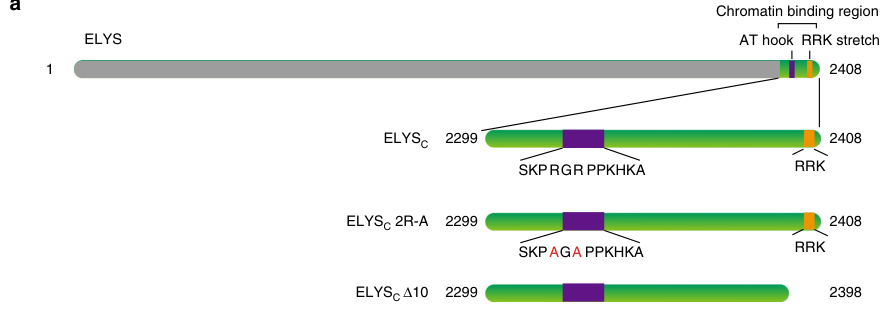

## Question

# Gene Research for Functional Annotation

## ⚠️ CRITICAL: Gene/Protein Identification Context

**BEFORE YOU BEGIN RESEARCH:** You MUST verify you are researching the CORRECT gene/protein. Gene symbols can be ambiguous, especially for less well-characterized genes from non-model organisms.

### Target Gene/Protein Identity (from UniProt):
- **UniProt Accession:** Q8WYP5
- **Protein Description:** RecName: Full=Protein ELYS; AltName: Full=Embryonic large molecule derived from yolk sac; AltName: Full=Protein MEL-28; AltName: Full=Putative AT-hook-containing transcription factor 1;
- **Gene Information:** Name=AHCTF1; Synonyms=ELYS, TMBS62; ORFNames=MSTP108;
- **Organism (full):** Homo sapiens (Human).
- **Protein Family:** Belongs to the ELYS family. .
- **Key Domains:** ELYS-bb. (IPR032040); ELYS/MEL-28_NucAsmblyFactor. (IPR052620); ELYS_dom. (IPR025151); Quinoprotein_ADH-like_sf. (IPR011047); ELYS (PF13934)

### MANDATORY VERIFICATION STEPS:

1. **Check if the gene symbol "AHCTF1" matches the protein description above**
2. **Verify the organism is correct:** Homo sapiens (Human).
3. **Check if protein family/domains align with what you find in literature**
4. **If you find literature for a DIFFERENT gene with the same or similar symbol, STOP**

### If Gene Symbol is Ambiguous or You Cannot Find Relevant Literature:

**DO NOT PROCEED WITH RESEARCH ON A DIFFERENT GENE.** Instead:
- State clearly: "The gene symbol 'AHCTF1' is ambiguous or literature is limited for this specific protein"
- Explain what you found (e.g., "Found extensive literature on a different gene with the same symbol in a different organism")
- Describe the protein based ONLY on the UniProt information provided above
- Suggest that the protein function can be inferred from domain/family information

### Research Target:

Please provide a comprehensive research report on the gene **AHCTF1** (gene ID: AHCTF1, UniProt: Q8WYP5) in human.

The research report should be a detailed narrative explaining the function, biological processes, and localization of the gene product. Citations should be given for all claims.

You should prioritize authoritative reviews and primary scientific literature when conducting research. You can supplement
this with annotations you find in gene/protein databases, but these can be outdated or inaccurate.

We are specifically interested in the primary function of the gene - for enzymes, what reaction is catalyzed, and what is the substrate specificity? For transporters, what is the substrate? For structural proteins or adapters, what is the broader structural role? For signaling molecules, what is the role in the pathway.

We are interested in where in or outside the cell the gene product carries out its function.

We are also interested in the signaling or biochemical pathways in which the gene functions. We are less interested in broad pleiotropic effects, except where these elucidate the precise role.

Include evidence where possible. We are interested in both experimental evidence as well as inference from structure, evolution, or bioinformatic analysis. Precise studies should be prioritized over high-throughput, where available.

## Output

Question: You are an expert researcher providing comprehensive, well-cited information.

Provide detailed information focusing on:
1. Key concepts and definitions with current understanding
2. Recent developments and latest research (prioritize 2023-2024 sources)
3. Current applications and real-world implementations
4. Expert opinions and analysis from authoritative sources
5. Relevant statistics and data from recent studies

Format as a comprehensive research report with proper citations. Include URLs and publication dates where available.
Always prioritize recent, authoritative sources and provide specific citations for all major claims.

# Gene Research for Functional Annotation

## ⚠️ CRITICAL: Gene/Protein Identification Context

**BEFORE YOU BEGIN RESEARCH:** You MUST verify you are researching the CORRECT gene/protein. Gene symbols can be ambiguous, especially for less well-characterized genes from non-model organisms.

### Target Gene/Protein Identity (from UniProt):
- **UniProt Accession:** Q8WYP5
- **Protein Description:** RecName: Full=Protein ELYS; AltName: Full=Embryonic large molecule derived from yolk sac; AltName: Full=Protein MEL-28; AltName: Full=Putative AT-hook-containing transcription factor 1;
- **Gene Information:** Name=AHCTF1; Synonyms=ELYS, TMBS62; ORFNames=MSTP108;
- **Organism (full):** Homo sapiens (Human).
- **Protein Family:** Belongs to the ELYS family. .
- **Key Domains:** ELYS-bb. (IPR032040); ELYS/MEL-28_NucAsmblyFactor. (IPR052620); ELYS_dom. (IPR025151); Quinoprotein_ADH-like_sf. (IPR011047); ELYS (PF13934)

### MANDATORY VERIFICATION STEPS:

1. **Check if the gene symbol "AHCTF1" matches the protein description above**
2. **Verify the organism is correct:** Homo sapiens (Human).
3. **Check if protein family/domains align with what you find in literature**
4. **If you find literature for a DIFFERENT gene with the same or similar symbol, STOP**

### If Gene Symbol is Ambiguous or You Cannot Find Relevant Literature:

**DO NOT PROCEED WITH RESEARCH ON A DIFFERENT GENE.** Instead:
- State clearly: "The gene symbol 'AHCTF1' is ambiguous or literature is limited for this specific protein"
- Explain what you found (e.g., "Found extensive literature on a different gene with the same symbol in a different organism")
- Describe the protein based ONLY on the UniProt information provided above
- Suggest that the protein function can be inferred from domain/family information

### Research Target:

Please provide a comprehensive research report on the gene **AHCTF1** (gene ID: AHCTF1, UniProt: Q8WYP5) in human.

The research report should be a detailed narrative explaining the function, biological processes, and localization of the gene product. Citations should be given for all claims.

You should prioritize authoritative reviews and primary scientific literature when conducting research. You can supplement
this with annotations you find in gene/protein databases, but these can be outdated or inaccurate.

We are specifically interested in the primary function of the gene - for enzymes, what reaction is catalyzed, and what is the substrate specificity? For transporters, what is the substrate? For structural proteins or adapters, what is the broader structural role? For signaling molecules, what is the role in the pathway.

We are interested in where in or outside the cell the gene product carries out its function.

We are also interested in the signaling or biochemical pathways in which the gene functions. We are less interested in broad pleiotropic effects, except where these elucidate the precise role.

Include evidence where possible. We are interested in both experimental evidence as well as inference from structure, evolution, or bioinformatic analysis. Precise studies should be prioritized over high-throughput, where available.

## Comprehensive Research Report: Human **AHCTF1 / ELYS / MEL-28** (UniProt Q8WYP5)

### Executive summary
AHCTF1 encodes **ELYS** (also called **MEL-28**), a large chromatin-binding nucleoporin best understood as an **initiator (“seed”) for post-mitotic nuclear pore complex (NPC) assembly**: it binds decondensing chromatin at mitotic exit and recruits the **Nup107–160/Y-complex**, which in turn enables recruitment of additional scaffold and transmembrane nucleoporins to rebuild NPCs on the reforming nuclear envelope. (shevelyov2020theroleof pages 1-3, shevelyov2020theroleof pages 3-5, kobayashi2019structuralandbiochemical pages 1-2)
Beyond this core function, recent work emphasizes that ELYS also participates in **genome architecture**, including **anchoring peripheral chromatin to NPCs during interphase** (2024) and in **mitotic nuclear envelope biogenesis via phosphorylation-regulated binding to the membrane protein VAPB** (2024). (doronin2024nucleoporinelysattaches pages 16-16, james2024phosphorylationofelys pages 1-2)

---

### 1) Identity verification (critical disambiguation)
**Target is human AHCTF1 (UniProt Q8WYP5)**, whose protein product is widely referred to in the cell biology literature as **ELYS** and **MEL-28**. (shevelyov2020theroleof pages 1-3, shevelyov2020theroleof pages 3-5, kobayashi2019structuralandbiochemical pages 1-2)
These names are used interchangeably across mechanistic papers, including structural studies that explicitly label the protein as “ELYS (MEL-28/AHCTF1).” (kobayashi2019structuralandbiochemical pages 1-2)

**Functional class:** ELYS is treated experimentally as a **nucleoporin** (NPC component/assembly factor) rather than a canonical DNA-binding transcription factor, despite the historical gene name “AT-hook containing transcription factor 1.” (shevelyov2020theroleof pages 1-3, kobayashi2019structuralandbiochemical pages 1-2)

---

### 2) Key concepts and definitions (current understanding)

#### 2.1 Nuclear pore complex (NPC) assembly and the “seed” concept
In metazoans, the NPC disassembles during open mitosis and is rebuilt at mitotic exit. A key concept is that NPC reassembly begins with early factors that **connect chromatin to NPC scaffold recruitment**, effectively “seeding” NPC formation on chromatin before the nuclear envelope is fully re-established. ELYS/AHCTF1 is a central example of such a seeding factor: it **binds decondensing chromatin** and **recruits the Nup107–160/Y-complex**, which then supports recruitment of other nucleoporins (including transmembrane components) to build the pore. (shevelyov2020theroleof pages 1-3, shevelyov2020theroleof pages 3-5)

#### 2.2 Chromatin binding via nucleosome acidic patch
A major mechanistic advance is that ELYS binds chromatin not only through DNA affinity but through **direct nucleosome recognition**. Specifically, a **C-terminal basic region** can dock onto the **acidic patch** of the nucleosome (on H2A–H2B), a frequently used binding hotspot for chromatin factors. (kobayashi2019structuralandbiochemical pages 1-2)

---

### 3) Molecular function of AHCTF1/ELYS

#### 3.1 Primary function: initiate post-mitotic NPC reassembly on chromatin
**Mechanistic model (consensus):**
1) At anaphase/telophase, ELYS binds to **decondensing chromatin**, including AT-rich regions (consistent with an AT-hook). (shevelyov2020theroleof pages 1-3, shevelyov2020theroleof pages 3-5)
2) ELYS recruits the **Nup107–160/Y-complex** to these chromatin sites, creating a scaffold “seed” for subsequent NPC assembly steps. (shevelyov2020theroleof pages 1-3, shevelyov2020theroleof pages 3-5)
3) Transmembrane nucleoporins (e.g., **POM121, NDC1**) and additional nucleoporin subcomplexes are recruited downstream to integrate the assembling scaffold into the reforming nuclear envelope. (shevelyov2020theroleof pages 1-3)

This functional directionality (ELYS→Y-complex recruitment→downstream nucleoporin recruitment) is repeatedly emphasized in authoritative syntheses and is consistent with depletion phenotypes where NPCs fail to properly assemble or localize. (shevelyov2020theroleof pages 1-3, shevelyov2020theroleof pages 3-5)

#### 3.2 Structural basis of nucleosome binding: AT-hook + RRK basic stretch
Kobayashi et al. (Communications Biology, **2019-05**) provide direct structural/biochemical evidence that ELYS binds nucleosomes and histone H2A-H2B, and they map a critical basic element required for this interaction. (kobayashi2019structuralandbiochemical pages 1-2)

Key findings:
- The **C-terminal region** of ELYS contains an **AT-hook DNA-binding domain** and a conserved **Arg-Arg-Lys (RRK) basic stretch**. (kobayashi2019structuralandbiochemical pages 1-2)
- **Cryo-EM** and **crosslinking mass spectrometry** support direct binding of the ELYS C-terminus to the **nucleosome acidic patch**. (kobayashi2019structuralandbiochemical pages 1-2)
- Mutational/deletion tests indicate the RRK stretch (including residues cited as Arg2404, Arg2405, Lys2406, and nearby Arg2408) is **essential** for nucleosome binding. (kobayashi2019structuralandbiochemical pages 1-2)

A figure panel from this study (domain architecture + cryo-EM docking onto nucleosome acidic patch) is available in the retrieved image evidence. (kobayashi2019structuralandbiochemical media 5a470cb3, kobayashi2019structuralandbiochemical media 1a52a771)

#### 3.3 Post-translational regulation in mitosis: phosphorylation-dependent VAPB binding (2024)
James et al. (EMBO Reports, **2024-04**) identify a new mitotic regulatory interaction: ELYS is described as a **crucial initiation factor for post-mitotic NPC assembly** and, during mitosis, becomes phosphorylated at many sites including a predicted **FFAT motif** that mediates phosphorylation-dependent binding to the membrane protein **VAPB** (via VAPB’s MSP domain). (james2024phosphorylationofelys pages 1-2)
ELYS and VAPB **co-localize in anaphase** at the **non-core region** of the newly forming nuclear envelope, supporting a model where ELYS coordinates (directly or indirectly) membrane recruitment dynamics during nuclear envelope/NPC reformation. (james2024phosphorylationofelys pages 1-2)

---

### 4) Subcellular localization and cell-cycle dynamics

#### 4.1 Interphase localization
In interphase cells, ELYS localizes to the **nuclear envelope/NPC region** and is also observed in nucleoplasmic pools (including GLFG bodies in some contexts). (shevelyov2020theroleof pages 1-3, shevelyov2020theroleof pages 3-5)
James et al. (2024) further specify localization to the **nuclear side of the NPC** in interphase. (james2024phosphorylationofelys pages 1-2)

#### 4.2 Mitotic localization
During mitosis, ELYS relocalizes to **chromatin surfaces**, and has been described at **kinetochores and spindle poles**, consistent with additional mitotic functions beyond NPC assembly. (shevelyov2020theroleof pages 1-3, shevelyov2020theroleof pages 3-5)

---

### 5) Recent developments (prioritizing 2023–2024)

#### 5.1 Interphase genome architecture: ELYS anchors peripheral chromatin to nuclear pores (2024)
Doronin et al. (Communications Biology, **2024-06**) address whether ELYS links chromatin to the nuclear envelope during interphase (beyond its established mitotic-exit role). Using DamID-seq and functional knockdown experiments (in Drosophila systems), they distinguish nucleoplasmic vs NPC-linked ELYS binding sites and report that ELYS knockdown causes **peripheral chromatin displacement**, **decondensation of NE-attached chromatin**, and **derepression of genes** within these regions, supporting a role for NPC-linked ELYS (together with lamina) in maintaining peripheral chromatin organization. (doronin2024nucleoporinelysattaches pages 16-16)
While not human-only, this 2024 study updates the field’s model of ELYS as a chromatin organizer during interphase, consistent with broader nucleoporin-chromatin regulatory concepts. (doronin2024nucleoporinelysattaches pages 16-16)

#### 5.2 Mitosis timing and membrane coordination through VAPB (2024)
James et al. (EMBO Reports, **2024-04**) provide evidence that VAPB binding to ELYS requires phosphorylation of an ELYS FFAT motif and occurs at decondensing chromosomes/forming nuclear envelope regions in anaphase. This places ELYS within a **phospho-regulated membrane-interaction network** during mitotic exit. (james2024phosphorylationofelys pages 1-2)

#### 5.3 Cancer-relevant nuclear architecture: WNT-dependent MYC gene “gating” requires AHCTF1 (2022)
Chachoua et al. (Nature Communications, **2022-01**) describe a WNT/β-catenin-dependent pathway in colon cancer cells where an oncogenic MYC super-enhancer is trafficked to the nuclear periphery and nuclear pore; they report that the final movement to the nuclear pore requires **recruitment of AHCTF1**, linking nucleoporins (and specifically AHCTF1) to pathological 3D genome positioning and MYC output. (chachoua2022canonicalwntsignalingdependent pages 8-9, OpenTargets Search: -AHCTF1)
The paper includes quantitative localization data with large allele counts (e.g., **371**, **300**, **294** alleles in reported comparisons) and multiple statistically significant p-values for periphery/localization and RNA FISH readouts. (chachoua2022canonicalwntsignalingdependent pages 8-9)

---

### 6) Phenotypes from perturbation (functional inference and experimental evidence)

#### 6.1 Defective NPC assembly when ELYS is depleted
Cell biological evidence summarized in reviews and supported by mechanistic studies indicates that ELYS depletion disrupts post-mitotic NPC reassembly and NPC localization at the nuclear envelope. (shevelyov2020theroleof pages 1-3, shevelyov2020theroleof pages 3-5, kobayashi2019structuralandbiochemical pages 1-2)
Kobayashi et al. report that ELYS knockdown in HeLa cells causes **severe NPC formation defects**, consistent with its mechanistic role in recruiting scaffold components during assembly on chromatin. (kobayashi2019structuralandbiochemical pages 1-2)

#### 6.2 Genome stability/mitotic fidelity as downstream consequences
Because NPC reassembly, spindle function, and chromosome segregation are tightly coordinated during mitotic exit, ELYS perturbation is also linked to chromosome segregation defects and genome instability phenotypes in diverse systems. (shevelyov2020theroleof pages 1-3, morgan2023ahctf1andkras pages 1-2)

---

### 7) Applications and real-world implementations (disease relevance; translational angles)

#### 7.1 Cancer vulnerability: reduced ELYS dosage amplifies oncogenic stress (2023)
Morgan et al. (eLife, **2023-01**) provide a detailed in vivo cancer model linking reduced ahctf1/ELYS function to selective vulnerability of oncogene-driven tissue growth (zebrafish hepatocellular carcinoma model with inducible krasG12V). (morgan2023ahctf1andkras pages 2-3)

Quantitative highlights from the paper:
- In larvae, krasG12V induction increased liver volume from **1.95×10^6 ± 4.99×10^4 μm³** to **7.97×10^6 ± 1.21×10^5 μm³**; ahctf1 heterozygosity reduced kras-driven liver volume to **5.92×10^6 ± 8.83×10^4 μm³** (interpreted as **35% reduction in excess liver volume**). (morgan2023ahctf1andkras pages 2-3)
- ahctf1+/− larvae showed a measured **57% reduction** in ahctf1 mRNA at 7 dpf. (morgan2023ahctf1andkras pages 2-3)
- krasG12V increased NPC puncta at the nuclear surface by **59%**; ahctf1 heterozygosity reduced these signals by **21%**. (morgan2023ahctf1andkras pages 6-8)
- krasG12V increased nuclear volume by **28%** vs non-expressing cells; this was reduced to **13%** with ahctf1 heterozygosity. (morgan2023ahctf1andkras pages 6-8)
- **50%** of ahctf1+/−;krasG12V hepatocytes showed mitotic abnormalities, vs none reported for ahctf1+/+ in the excerpted comparison. (morgan2023ahctf1andkras pages 6-8)
- DNA damage marker γ-H2AX-positive nuclei increased from **1%** to **6%** with ahctf1 heterozygosity in krasG12V hepatocytes. (morgan2023ahctf1andkras pages 6-8)

These data support a translational hypothesis: cancers with high proliferative and nuclear transport demands may be sensitive to partial disruption of ELYS/NPC homeostasis (“non-oncogene addiction” to nuclear transport/NPC biogenesis). (morgan2023ahctf1andkras pages 6-8)

#### 7.2 Therapeutic strategy concept: combine partial NPC impairment with nuclear export inhibition
Morgan et al. report that combining ahctf1 heterozygosity with ranbp2 heterozygosity, or with treatment by the nuclear export inhibitor **Selinexor**, can completely block krasG12V-driven hepatocyte hyperplasia in zebrafish models (as summarized in the abstract/excerpts). (morgan2023ahctf1andkras pages 1-2)
This provides a concrete real-world implementation direction: leveraging clinically used transport inhibitors (e.g., XPO1 inhibition) in contexts where NPC components are limiting. (morgan2023ahctf1andkras pages 1-2)

#### 7.3 Human survival association (TCGA LIHC; quantitative)
In a related excerpted analysis of TCGA LIHC (372 samples), patients with high expression (z-score >2) of one or more Nup107–160 complex components had median overall survival **21.70 months** (n=63) compared with **81.73 months** for low expression (z-score <−2; n=45), supporting clinical relevance of elevated Nup107–160 expression signatures (including AHCTF1) in HCC prognosis. (morgan2021elysdeficiencyconstrains pages 46-46)

#### 7.4 OpenTargets disease associations (supplementary database-level evidence)
OpenTargets lists AHCTF1 associations with several disease categories (e.g., neurodegenerative disease and premature birth) based largely on CRISPRi screen evidence and linked literature identifiers; these data should be treated as hypothesis-generating rather than definitive mechanistic attribution. (OpenTargets Search: -AHCTF1)

---

### 8) Expert synthesis and analysis (authoritative perspectives)
Shevelyov’s 2020 review consolidates the field’s view of ELYS as unusual among nucleoporins in having both **DNA/chromatin-binding** capabilities and a central role in **post-mitotic NPC reassembly**, while also engaging genome architecture during interphase. (shevelyov2020theroleof pages 1-3)
Recent 2024 primary studies extend this view in two directions: (i) **interphase chromatin anchoring at NPCs** (Doronin et al.), and (ii) **phospho-regulated membrane-interaction circuitry in mitosis** (James et al.), both of which are compatible with ELYS being a multi-domain integrator coordinating chromatin, NPC scaffold recruitment, and membrane remodeling. (doronin2024nucleoporinelysattaches pages 16-16, james2024phosphorylationofelys pages 1-2)

---

### 9) Evidence summary table (for rapid functional annotation)
| Functional aspect | Key claim (1 sentence) | Experimental system/approach | Notes on mechanism (domains/interactions) | Reference (with year) and URL |
|---|---|---|---|---|
| Post-mitotic NPC assembly seeding via chromatin binding and Y-complex recruitment | Human AHCTF1/ELYS is a chromatin-binding nucleoporin that seeds post-mitotic nuclear pore complex (NPC) reassembly by recruiting the Nup107–160/Y-complex to decondensing chromosomes, after which transmembrane nucleoporins such as POM121 and NDC1 are recruited. (shevelyov2020theroleof pages 1-3, shevelyov2020theroleof pages 3-5) | Review synthesis of vertebrate/cell-biology studies; microscopy and depletion-based NPC assembly assays summarized in the review. (shevelyov2020theroleof pages 1-3, shevelyov2020theroleof pages 3-5) | N-terminal β-propeller and α-helical regions associate with the Y-complex; the C-terminal chromatin-binding region with an AT-hook mediates chromatin capture during mitotic exit. (shevelyov2020theroleof pages 1-3, shevelyov2020theroleof pages 3-5) | Shevelyov 2020 — https://doi.org/10.3390/ijms21249475 |
| Nucleosome acidic patch binding via RRK stretch and AT-hook | The C-terminal region of ELYS binds nucleosomes directly, with an RRK basic stretch being essential for engagement of the nucleosome acidic patch and the AT-hook contributing DNA binding. (kobayashi2019structuralandbiochemical pages 1-2, kobayashi2019structuralandbiochemical media 5a470cb3) | Structural biology and biochemistry: cryo-EM, crosslinking mass spectrometry, mutational/deletion analysis, nucleosome/H2A-H2B binding assays. (kobayashi2019structuralandbiochemical pages 1-2, kobayashi2019structuralandbiochemical media 5a470cb3) | The critical basic cluster includes Arg2404, Arg2405, Lys2406 and nearby Arg2408; the ELYS C-terminus docks onto the H2A-H2B acidic patch while the AT-hook supports chromatin association. (kobayashi2019structuralandbiochemical pages 1-2, kobayashi2019structuralandbiochemical media 5a470cb3) | Kobayashi et al. 2019 — https://doi.org/10.1038/s42003-019-0385-7 |
| Interphase chromatin anchoring at NPCs | NPC-linked ELYS contributes to anchoring peripheral chromatin to the nuclear envelope in interphase, and ELYS depletion displaces peripheral chromatin and derepresses genes in those regions. (doronin2024nucleoporinelysattaches pages 16-16) | Drosophila late embryos and S2 cells; DamID-seq, knockdown, chromatin compaction and nuclear-periphery analyses. (doronin2024nucleoporinelysattaches pages 16-16) | The study distinguishes nucleoplasmic ELYS from NPC-linked ELYS, with the latter acting together with the nuclear lamina to maintain peripheral chromatin attachment. (doronin2024nucleoporinelysattaches pages 16-16) | Doronin et al. 2024 — https://doi.org/10.1038/s42003-024-06495-w |
| Mitotic phosphorylation and VAPB interaction | During mitosis, phosphorylated ELYS binds the ER/NE membrane protein VAPB through a phospho-regulated FFAT motif, helping coordinate events at decondensing chromosomes and the forming non-core nuclear envelope. (james2024phosphorylationofelys pages 1-2) | Human-cell biochemical and cell-biology assays including peptide/recombinant binding, co-immunoprecipitation, phosphoproteomics, and mitotic colocalization analysis. (james2024phosphorylationofelys pages 1-2) | A predicted FFAT motif in ELYS mediates phosphorylation-dependent interaction with the MSP domain of VAPB; ELYS and VAPB colocalize in anaphase at the non-core region. (james2024phosphorylationofelys pages 1-2) | James et al. 2024 — https://doi.org/10.1038/s44319-024-00125-6 |
| Nuclear size regulation via NPC density and nuclear import | ELYS positively regulates mammalian nuclear size by controlling NPC number/density and thereby nuclear import capacity. (shevelyov2020theroleof pages 11-12) | High-throughput imaging RNAi screen and follow-up functional assays in mammalian cells, including ELYS knockdown/overexpression and nuclear import perturbation. (shevelyov2020theroleof pages 11-12) | Reduced ELYS lowers NPC density and import capacity and alters lamin organization; increased importin-α can rescue import defects and nuclear size, linking ELYS function to transport-dependent size control. (shevelyov2020theroleof pages 11-12) | Jevtić et al. 2019 — https://doi.org/10.15252/embr.201847283 |
| Oncogenic stress interaction with kras and selinexor combinatorial effect | Partial loss of ahctf1/ELYS increases oncogenic stress in kras-driven liver cancer models, and combining ahctf1 reduction with ranbp2 heterozygosity or Selinexor can completely block krasG12V-driven hepatocyte hyperplasia. (morgan2023ahctf1andkras pages 1-2) | Zebrafish larval/adult hepatocellular carcinoma models, genetics, imaging, and transcriptomic/phenotypic analyses; patient survival association analysis in TCGA LIHC. (morgan2023ahctf1andkras pages 1-2) | Reduced ELYS dosage impairs nuclear pore formation, spindle assembly, and chromosome segregation, causing DNA damage and Tp53-dependent cell-cycle arrest/death; this supports nucleocytoplasmic transport/NPC vulnerability as a therapeutic angle. (morgan2023ahctf1andkras pages 1-2) | Morgan et al. 2023 — https://doi.org/10.7554/elife.73407 |
| WNT/β-catenin-driven MYC gene gating | In colon cancer cells, WNT/β-catenin-dependent trafficking of an oncogenic MYC super-enhancer to the nuclear pore requires recruitment of AHCTF1, enabling pathological MYC activation/export and growth advantage. (OpenTargets Search: -AHCTF1) | Cancer-cell genome architecture and gene-regulation study using chromatin trafficking analyses and functional perturbation of the WNT/CTCF/AHCTF1 circuit. (OpenTargets Search: -AHCTF1) | AHCTF1 is recruited to a distal CTCF binding site within the MYC oncogenic super-enhancer, where it participates in stepwise movement of the locus to the nuclear pore. (OpenTargets Search: -AHCTF1) | Chachoua et al. 2022 — https://doi.org/10.1038/s41467-021-27868-3 |

*Table: This table summarizes the main experimentally supported functions of human AHCTF1/ELYS, emphasizing nuclear pore assembly, chromatin binding, mitotic regulation, and disease-relevant contexts. It is useful as a compact evidence map linking each functional claim to the underlying methods, mechanisms, and source.*

---

### 10) Key references (URLs; publication dates)
- James C. et al. **“Phosphorylation of ELYS promotes its interaction with VAPB at decondensing chromosomes during mitosis”**. *EMBO Reports* (2024-04). https://doi.org/10.1038/s44319-024-00125-6 (james2024phosphorylationofelys pages 1-2)
- Doronin S.A. et al. **“Nucleoporin Elys attaches peripheral chromatin to the nuclear pores in interphase nuclei”**. *Communications Biology* (2024-06). https://doi.org/10.1038/s42003-024-06495-w (doronin2024nucleoporinelysattaches pages 16-16)
- Morgan K.J. et al. **“ahctf1 and kras mutations combine to amplify oncogenic stress and restrict liver overgrowth in a zebrafish model of hepatocellular carcinoma”**. *eLife* (2023-01). https://doi.org/10.7554/elife.73407 (morgan2023ahctf1andkras pages 2-3, morgan2023ahctf1andkras pages 6-8, morgan2023ahctf1andkras pages 10-12)
- Chachoua I. et al. **“Canonical WNT signaling-dependent gating of MYC requires a noncanonical CTCF function at a distal binding site”**. *Nature Communications* (2022-01). https://doi.org/10.1038/s41467-021-27868-3 (chachoua2022canonicalwntsignalingdependent pages 8-9, OpenTargets Search: -AHCTF1)
- Kobayashi W. et al. **“Structural and biochemical analyses of the nuclear pore complex component ELYS identify residues responsible for nucleosome binding”**. *Communications Biology* (2019-05). https://doi.org/10.1038/s42003-019-0385-7 (kobayashi2019structuralandbiochemical pages 1-2, kobayashi2019structuralandbiochemical media 5a470cb3, kobayashi2019structuralandbiochemical media 1a52a771)
- Shevelyov Y.Y. **“The Role of Nucleoporin Elys in Nuclear Pore Complex Assembly and Regulation of Genome Architecture”**. *International Journal of Molecular Sciences* (2020-12). https://doi.org/10.3390/ijms21249475 (shevelyov2020theroleof pages 1-3, shevelyov2020theroleof pages 3-5, shevelyov2020theroleof pages 11-12)

---

### Limitations of this synthesis
Some highly specific quantitative outcomes requested (e.g., exact magnitudes of gene derepression or chromatin displacement in Doronin et al. 2024; exact mitotic timing deltas in James et al. 2024) were not present in the retrieved text excerpts; the report therefore cites those studies for the qualitative conclusions they explicitly support while providing quantitative statistics where directly available in the extracted evidence. (doronin2024nucleoporinelysattaches pages 16-16, james2024phosphorylationofelys pages 1-2)

References

1. (shevelyov2020theroleof pages 1-3): Yuri Y. Shevelyov. The role of nucleoporin elys in nuclear pore complex assembly and regulation of genome architecture. International Journal of Molecular Sciences, 21:9475, Dec 2020. URL: https://doi.org/10.3390/ijms21249475, doi:10.3390/ijms21249475. This article has 19 citations.

2. (shevelyov2020theroleof pages 3-5): Yuri Y. Shevelyov. The role of nucleoporin elys in nuclear pore complex assembly and regulation of genome architecture. International Journal of Molecular Sciences, 21:9475, Dec 2020. URL: https://doi.org/10.3390/ijms21249475, doi:10.3390/ijms21249475. This article has 19 citations.

3. (kobayashi2019structuralandbiochemical pages 1-2): Wataru Kobayashi, Yoshimasa Takizawa, Maya Aihara, Lumi Negishi, Hajime Ishii, and Hitoshi Kurumizaka. Structural and biochemical analyses of the nuclear pore complex component elys identify residues responsible for nucleosome binding. Communications Biology, May 2019. URL: https://doi.org/10.1038/s42003-019-0385-7, doi:10.1038/s42003-019-0385-7. This article has 23 citations and is from a peer-reviewed journal.

4. (doronin2024nucleoporinelysattaches pages 16-16): Semen A. Doronin, Artem A. Ilyin, Anna D. Kononkova, Mikhail A. Solovyev, Oxana M. Olenkina, Valentina V. Nenasheva, Elena A. Mikhaleva, Sergey A. Lavrov, Anna Y. Ivannikova, Ruslan A. Simonov, Anna A. Fedotova, Ekaterina E. Khrameeva, Sergey V. Ulianov, Sergey V. Razin, and Yuri Y. Shevelyov. Nucleoporin elys attaches peripheral chromatin to the nuclear pores in interphase nuclei. Communications Biology, Jun 2024. URL: https://doi.org/10.1038/s42003-024-06495-w, doi:10.1038/s42003-024-06495-w. This article has 9 citations and is from a peer-reviewed journal.

5. (james2024phosphorylationofelys pages 1-2): Christina James, Ulrike Möller, Christiane Spillner, Sabine König, Olexandr Dybkov, Henning Urlaub, Christof Lenz, and Ralph H Kehlenbach. Phosphorylation of elys promotes its interaction with vapb at decondensing chromosomes during mitosis. EMBO Reports, 25:2391-2417, Apr 2024. URL: https://doi.org/10.1038/s44319-024-00125-6, doi:10.1038/s44319-024-00125-6. This article has 9 citations and is from a highest quality peer-reviewed journal.

6. (kobayashi2019structuralandbiochemical media 5a470cb3): Wataru Kobayashi, Yoshimasa Takizawa, Maya Aihara, Lumi Negishi, Hajime Ishii, and Hitoshi Kurumizaka. Structural and biochemical analyses of the nuclear pore complex component elys identify residues responsible for nucleosome binding. Communications Biology, May 2019. URL: https://doi.org/10.1038/s42003-019-0385-7, doi:10.1038/s42003-019-0385-7. This article has 23 citations and is from a peer-reviewed journal.

7. (kobayashi2019structuralandbiochemical media 1a52a771): Wataru Kobayashi, Yoshimasa Takizawa, Maya Aihara, Lumi Negishi, Hajime Ishii, and Hitoshi Kurumizaka. Structural and biochemical analyses of the nuclear pore complex component elys identify residues responsible for nucleosome binding. Communications Biology, May 2019. URL: https://doi.org/10.1038/s42003-019-0385-7, doi:10.1038/s42003-019-0385-7. This article has 23 citations and is from a peer-reviewed journal.

8. (chachoua2022canonicalwntsignalingdependent pages 8-9): Ilyas Chachoua, Ilias Tzelepis, Hao Dai, Jia Pei Lim, Anna Lewandowska-Ronnegren, Felipe Beccaria Casagrande, Shuangyang Wu, Johanna Vestlund, Carolina Diettrich Mallet de Lima, Deeksha Bhartiya, Barbara A. Scholz, Mirco Martino, Rashid Mehmood, and Anita Göndör. Canonical wnt signaling-dependent gating of myc requires a noncanonical ctcf function at a distal binding site. Nature Communications, Jan 2022. URL: https://doi.org/10.1038/s41467-021-27868-3, doi:10.1038/s41467-021-27868-3. This article has 36 citations and is from a highest quality peer-reviewed journal.

9. (OpenTargets Search: -AHCTF1): Open Targets Query (-AHCTF1, 5 results). Buniello, A. et al. (2025). Open Targets Platform: facilitating therapeutic hypotheses building in drug discovery. Nucleic Acids Research.

10. (morgan2023ahctf1andkras pages 1-2): Kimberly J Morgan, Karen Doggett, Fansuo Geng, Stephen Mieruszynski, Lachlan Whitehead, Kelly A Smith, Benjamin M Hogan, Cas Simons, Gregory J Baillie, Ramyar Molania, Anthony T Papenfuss, Thomas E Hall, Elke A Ober, Didier YR Stainier, Zhiyuan Gong, and Joan K Heath. Ahctf1 and kras mutations combine to amplify oncogenic stress and restrict liver overgrowth in a zebrafish model of hepatocellular carcinoma. eLife, Jan 2023. URL: https://doi.org/10.7554/elife.73407, doi:10.7554/elife.73407. This article has 7 citations and is from a domain leading peer-reviewed journal.

11. (morgan2023ahctf1andkras pages 2-3): Kimberly J Morgan, Karen Doggett, Fansuo Geng, Stephen Mieruszynski, Lachlan Whitehead, Kelly A Smith, Benjamin M Hogan, Cas Simons, Gregory J Baillie, Ramyar Molania, Anthony T Papenfuss, Thomas E Hall, Elke A Ober, Didier YR Stainier, Zhiyuan Gong, and Joan K Heath. Ahctf1 and kras mutations combine to amplify oncogenic stress and restrict liver overgrowth in a zebrafish model of hepatocellular carcinoma. eLife, Jan 2023. URL: https://doi.org/10.7554/elife.73407, doi:10.7554/elife.73407. This article has 7 citations and is from a domain leading peer-reviewed journal.

12. (morgan2023ahctf1andkras pages 6-8): Kimberly J Morgan, Karen Doggett, Fansuo Geng, Stephen Mieruszynski, Lachlan Whitehead, Kelly A Smith, Benjamin M Hogan, Cas Simons, Gregory J Baillie, Ramyar Molania, Anthony T Papenfuss, Thomas E Hall, Elke A Ober, Didier YR Stainier, Zhiyuan Gong, and Joan K Heath. Ahctf1 and kras mutations combine to amplify oncogenic stress and restrict liver overgrowth in a zebrafish model of hepatocellular carcinoma. eLife, Jan 2023. URL: https://doi.org/10.7554/elife.73407, doi:10.7554/elife.73407. This article has 7 citations and is from a domain leading peer-reviewed journal.

13. (morgan2021elysdeficiencyconstrains pages 46-46): Kimberly J Morgan, Karen Doggett, Fan-Suo Geng, Lachlan Whitehead, Kelly A Smith, Benjamin M Hogan, Cas Simons, Gregory J Baillie, Ramyar Molania, Anthony T Papenfuss, Thomas E Hall, Elke A Ober, Didier Y R Stainier, Zhiyuan Gong, and Joan K Heath. Elys deficiency constrains kras-driven tumour burden by amplifying oncogenic stress. bioRxiv, Aug 2021. URL: https://doi.org/10.1101/2021.08.25.457580, doi:10.1101/2021.08.25.457580. This article has 0 citations.

14. (shevelyov2020theroleof pages 11-12): Yuri Y. Shevelyov. The role of nucleoporin elys in nuclear pore complex assembly and regulation of genome architecture. International Journal of Molecular Sciences, 21:9475, Dec 2020. URL: https://doi.org/10.3390/ijms21249475, doi:10.3390/ijms21249475. This article has 19 citations.

15. (morgan2023ahctf1andkras pages 10-12): Kimberly J Morgan, Karen Doggett, Fansuo Geng, Stephen Mieruszynski, Lachlan Whitehead, Kelly A Smith, Benjamin M Hogan, Cas Simons, Gregory J Baillie, Ramyar Molania, Anthony T Papenfuss, Thomas E Hall, Elke A Ober, Didier YR Stainier, Zhiyuan Gong, and Joan K Heath. Ahctf1 and kras mutations combine to amplify oncogenic stress and restrict liver overgrowth in a zebrafish model of hepatocellular carcinoma. eLife, Jan 2023. URL: https://doi.org/10.7554/elife.73407, doi:10.7554/elife.73407. This article has 7 citations and is from a domain leading peer-reviewed journal.

## Artifacts

- [Edison artifact artifact-00](AHCTF1-deep-research-falcon_artifacts/artifact-00.md)

## Citations

1. kobayashi2019structuralandbiochemical pages 1-2
2. shevelyov2020theroleof pages 1-3
3. james2024phosphorylationofelys pages 1-2
4. doronin2024nucleoporinelysattaches pages 16-16
5. chachoua2022canonicalwntsignalingdependent pages 8-9
6. morgan2021elysdeficiencyconstrains pages 46-46
7. shevelyov2020theroleof pages 11-12
8. shevelyov2020theroleof pages 3-5
9. https://doi.org/10.3390/ijms21249475
10. https://doi.org/10.1038/s42003-019-0385-7
11. https://doi.org/10.1038/s42003-024-06495-w
12. https://doi.org/10.1038/s44319-024-00125-6
13. https://doi.org/10.15252/embr.201847283
14. https://doi.org/10.7554/elife.73407
15. https://doi.org/10.1038/s41467-021-27868-3
16. https://doi.org/10.3390/ijms21249475,
17. https://doi.org/10.1038/s42003-019-0385-7,
18. https://doi.org/10.1038/s42003-024-06495-w,
19. https://doi.org/10.1038/s44319-024-00125-6,
20. https://doi.org/10.1038/s41467-021-27868-3,
21. https://doi.org/10.7554/elife.73407,
22. https://doi.org/10.1101/2021.08.25.457580,