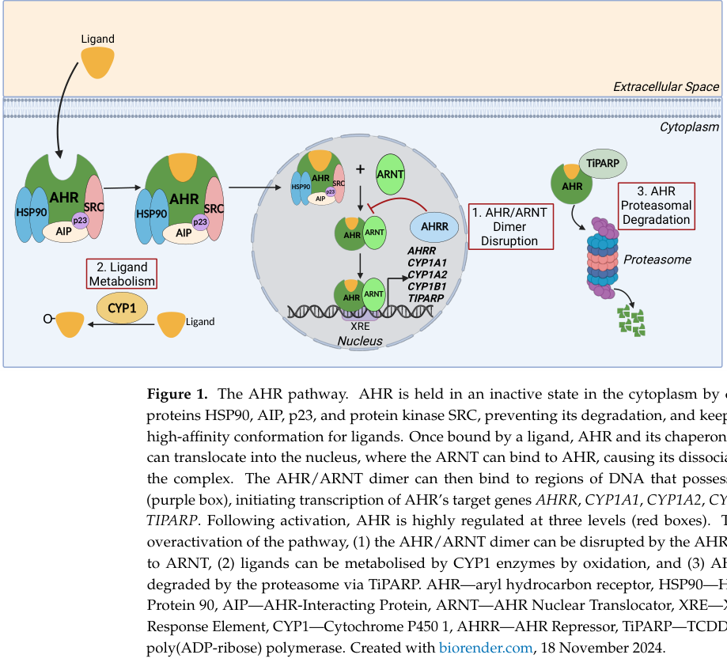

## Question

# Gene Research for Functional Annotation

## ⚠️ CRITICAL: Gene/Protein Identification Context

**BEFORE YOU BEGIN RESEARCH:** You MUST verify you are researching the CORRECT gene/protein. Gene symbols can be ambiguous, especially for less well-characterized genes from non-model organisms.

### Target Gene/Protein Identity (from UniProt):
- **UniProt Accession:** P35869
- **Protein Description:** RecName: Full=Aryl hydrocarbon receptor {ECO:0000303|PubMed:8393992}; Short=Ah receptor {ECO:0000303|PubMed:8393992}; Short=AhR {ECO:0000303|PubMed:8393992}; AltName: Full=Class E basic helix-loop-helix protein 76; Short=bHLHe76; Flags: Precursor;
- **Gene Information:** Name=AHR {ECO:0000303|PubMed:8393992, ECO:0000312|HGNC:HGNC:348}; Synonyms=BHLHE76 {ECO:0000312|HGNC:HGNC:348};
- **Organism (full):** Homo sapiens (Human).
- **Protein Family:** Not specified in UniProt
- **Key Domains:** AHR/AHRR. (IPR039091); AHR_bHLH. (IPR033348); bHLH_dom. (IPR011598); HLH_DNA-bd_sf. (IPR036638); PAC. (IPR001610)

### MANDATORY VERIFICATION STEPS:

1. **Check if the gene symbol "AHR" matches the protein description above**
2. **Verify the organism is correct:** Homo sapiens (Human).
3. **Check if protein family/domains align with what you find in literature**
4. **If you find literature for a DIFFERENT gene with the same or similar symbol, STOP**

### If Gene Symbol is Ambiguous or You Cannot Find Relevant Literature:

**DO NOT PROCEED WITH RESEARCH ON A DIFFERENT GENE.** Instead:
- State clearly: "The gene symbol 'AHR' is ambiguous or literature is limited for this specific protein"
- Explain what you found (e.g., "Found extensive literature on a different gene with the same symbol in a different organism")
- Describe the protein based ONLY on the UniProt information provided above
- Suggest that the protein function can be inferred from domain/family information

### Research Target:

Please provide a comprehensive research report on the gene **AHR** (gene ID: AHR, UniProt: P35869) in human.

The research report should be a detailed narrative explaining the function, biological processes, and localization of the gene product. Citations should be given for all claims.

You should prioritize authoritative reviews and primary scientific literature when conducting research. You can supplement
this with annotations you find in gene/protein databases, but these can be outdated or inaccurate.

We are specifically interested in the primary function of the gene - for enzymes, what reaction is catalyzed, and what is the substrate specificity? For transporters, what is the substrate? For structural proteins or adapters, what is the broader structural role? For signaling molecules, what is the role in the pathway.

We are interested in where in or outside the cell the gene product carries out its function.

We are also interested in the signaling or biochemical pathways in which the gene functions. We are less interested in broad pleiotropic effects, except where these elucidate the precise role.

Include evidence where possible. We are interested in both experimental evidence as well as inference from structure, evolution, or bioinformatic analysis. Precise studies should be prioritized over high-throughput, where available.

## Output

Question: You are an expert researcher providing comprehensive, well-cited information.

Provide detailed information focusing on:
1. Key concepts and definitions with current understanding
2. Recent developments and latest research (prioritize 2023-2024 sources)
3. Current applications and real-world implementations
4. Expert opinions and analysis from authoritative sources
5. Relevant statistics and data from recent studies

Format as a comprehensive research report with proper citations. Include URLs and publication dates where available.
Always prioritize recent, authoritative sources and provide specific citations for all major claims.

# Gene Research for Functional Annotation

## ⚠️ CRITICAL: Gene/Protein Identification Context

**BEFORE YOU BEGIN RESEARCH:** You MUST verify you are researching the CORRECT gene/protein. Gene symbols can be ambiguous, especially for less well-characterized genes from non-model organisms.

### Target Gene/Protein Identity (from UniProt):
- **UniProt Accession:** P35869
- **Protein Description:** RecName: Full=Aryl hydrocarbon receptor {ECO:0000303|PubMed:8393992}; Short=Ah receptor {ECO:0000303|PubMed:8393992}; Short=AhR {ECO:0000303|PubMed:8393992}; AltName: Full=Class E basic helix-loop-helix protein 76; Short=bHLHe76; Flags: Precursor;
- **Gene Information:** Name=AHR {ECO:0000303|PubMed:8393992, ECO:0000312|HGNC:HGNC:348}; Synonyms=BHLHE76 {ECO:0000312|HGNC:HGNC:348};
- **Organism (full):** Homo sapiens (Human).
- **Protein Family:** Not specified in UniProt
- **Key Domains:** AHR/AHRR. (IPR039091); AHR_bHLH. (IPR033348); bHLH_dom. (IPR011598); HLH_DNA-bd_sf. (IPR036638); PAC. (IPR001610)

### MANDATORY VERIFICATION STEPS:

1. **Check if the gene symbol "AHR" matches the protein description above**
2. **Verify the organism is correct:** Homo sapiens (Human).
3. **Check if protein family/domains align with what you find in literature**
4. **If you find literature for a DIFFERENT gene with the same or similar symbol, STOP**

### If Gene Symbol is Ambiguous or You Cannot Find Relevant Literature:

**DO NOT PROCEED WITH RESEARCH ON A DIFFERENT GENE.** Instead:
- State clearly: "The gene symbol 'AHR' is ambiguous or literature is limited for this specific protein"
- Explain what you found (e.g., "Found extensive literature on a different gene with the same symbol in a different organism")
- Describe the protein based ONLY on the UniProt information provided above
- Suggest that the protein function can be inferred from domain/family information

### Research Target:

Please provide a comprehensive research report on the gene **AHR** (gene ID: AHR, UniProt: P35869) in human.

The research report should be a detailed narrative explaining the function, biological processes, and localization of the gene product. Citations should be given for all claims.

You should prioritize authoritative reviews and primary scientific literature when conducting research. You can supplement
this with annotations you find in gene/protein databases, but these can be outdated or inaccurate.

We are specifically interested in the primary function of the gene - for enzymes, what reaction is catalyzed, and what is the substrate specificity? For transporters, what is the substrate? For structural proteins or adapters, what is the broader structural role? For signaling molecules, what is the role in the pathway.

We are interested in where in or outside the cell the gene product carries out its function.

We are also interested in the signaling or biochemical pathways in which the gene functions. We are less interested in broad pleiotropic effects, except where these elucidate the precise role.

Include evidence where possible. We are interested in both experimental evidence as well as inference from structure, evolution, or bioinformatic analysis. Precise studies should be prioritized over high-throughput, where available.

## Comprehensive research report: Human **AHR** (aryl hydrocarbon receptor; UniProt **P35869**) for functional annotation

### 1) Target verification (gene/protein identity)
The requested target **AHR** (UniProt **P35869**) is the **human aryl hydrocarbon receptor**, an evolutionarily conserved, ligand-activated **basic helix–loop–helix/Per-ARNT-Sim (bHLH-PAS)** transcription factor that senses diverse small molecules and converts those signals into context-dependent transcriptional programs. This identity is consistent across recent reviews and mechanistic papers that explicitly describe AHR as a bHLH-PAS transcription factor with **bHLH**, **PAS-A**, **PAS-B** (ligand-binding) and **C-terminal transactivation** regions; one review provides domain boundaries **bHLH aa 33–87; PAS-A aa 111–273; PAS-B aa 275–386; TAD aa 490–805**. (elson2023tumorsuppressivefunctionsof pages 2-4, bahman2024arylhydrocarbonreceptor pages 2-4)

### 2) Key concepts and definitions (current understanding)

#### 2.1 Canonical AHR signaling (“xenobiotic response” pathway)
**Canonical AHR signaling** is defined by a cytosol-to-nucleus activation cycle in which ligand binding triggers AHR nuclear translocation, **heterodimerization with ARNT**, binding to **XRE/DRE DNA motifs**, and transcriptional activation of a stereotyped gene set (“AHR gene battery”) including **CYP1A1** (a canonical biomarker), **CYP1A2**, **CYP1B1**, **AHRR**, and **TIPARP**. (dawe2025thearylhydrocarbon pages 1-2, bahman2024arylhydrocarbonreceptor pages 2-4, elson2023tumorsuppressivefunctionsof pages 2-4)

Key sequence concepts used in the literature:
- **XRE/DRE consensus**: reported as **5′-TNGCGTG-3′** (also described with core **GCGTG** and examples including **TTGCGTG**). (polonio2025thearylhydrocarbon pages 4-6, bahman2024arylhydrocarbonreceptor pages 2-4, elson2023tumorsuppressivefunctionsof pages 2-4)

#### 2.2 Ligand classes and “functional selectivity”
AHR is now viewed as a **broad-spectrum small-molecule sensor** activated by exogenous toxicants (e.g., dioxin-like compounds), dietary ligands, microbiome-derived indoles, and endogenous metabolites such as tryptophan pathway products; ligand affinity and metabolism shape **signal duration** (e.g., persistent activation by high-affinity ligands versus transient activation by rapidly metabolized ligands). (polonio2025thearylhydrocarbon pages 4-6, dawe2025thearylhydrocarbon pages 1-2, bahman2024arylhydrocarbonreceptor pages 2-4)

#### 2.3 Non-canonical AHR signaling
Beyond XRE-driven transcription, AHR can:
- Engage **transcription factor cross-talk** (e.g., with NF-κB subunits RelA/RelB) and immunoregulatory mediators such as **SOCS2**, affecting inflammatory cytokine programs. (polonio2025thearylhydrocarbon pages 4-6)
- Function as part of a **CUL4B-based E3 ubiquitin ligase complex** (CUL4B^AHR) targeting proteins such as **ER-α, AR, β-catenin, PPARγ** for degradation, and can act as a **cytoplasmic adaptor/scaffold** linking SRC/JAK2 to kinase pathways (PI3K–AKT, MEK–ERK, YAP–ERK) in certain contexts. (xie2024uremictoxinsmediate pages 7-9)

### 3) Molecular mechanism, domains, and subcellular localization

#### 3.1 Domain architecture and ligand recognition
AHR contains an N-terminal **bHLH DNA-binding/dimerization** domain followed by tandem **PAS-A** and **PAS-B** domains; **PAS-B** contains the principal **ligand-binding pocket**, while bHLH/PAS-A contribute critically to dimerization and DNA binding with ARNT. (diao2025structuralbasisfor pages 1-2, xie2024uremictoxinsmediate pages 7-9, bahman2024arylhydrocarbonreceptor pages 2-4)

#### 3.2 Resting localization and cytosolic chaperone complex
In the unliganded state, AHR is predominantly **cytoplasmic**, held in a multiprotein chaperone complex that includes **HSP90 (as a dimer), AIP/XAP2, and p23** (and can include **SRC**). This complex maintains AHR in a ligand-responsive state and constrains DNA-binding/nuclear trafficking until activation. (dawe2025thearylhydrocarbon pages 1-2, bahman2024arylhydrocarbonreceptor pages 2-4, elson2023tumorsuppressivefunctionsof pages 2-4)

#### 3.3 Nuclear translocation, ARNT dimerization, and transcriptional output
Upon ligand binding (primarily at PAS-B), AHR undergoes conformational change with exposure of nuclear localization features, **translocates to the nucleus**, dimerizes with **ARNT (HIF-1β)**, binds **XRE/DRE** motifs, recruits coactivators, and activates transcription. Canonical induced targets include **CYP1A1/CYP1A2/CYP1B1**, and immunoregulatory targets (context dependent) including **IL-10** and **IL-22** are also reported in mechanistic reviews. (polonio2025thearylhydrocarbon pages 4-6, xie2024uremictoxinsmediate pages 7-9, bahman2024arylhydrocarbonreceptor pages 2-4)

#### 3.4 Negative feedback and pathway termination
Canonical negative feedback loops include:
- **CYP1 enzymes** that metabolize many AHR ligands (terminating signaling, but sometimes bioactivating procarcinogens).
- **AHRR** (aryl hydrocarbon receptor repressor), which competes for ARNT and dampens transcriptional activity.
- **TIPARP/TiPARP**, and proteasomal degradation of ligated AHR after dissociation from DNA. (dawe2025thearylhydrocarbon pages 1-2, polonio2025thearylhydrocarbon pages 4-6)

A schematic of this canonical cycle and its feedback mechanisms is shown in a figure from a recent skin-focused review. (dawe2025thearylhydrocarbon media 492c33b4)

### 4) Primary functional annotation: what AHR “does”

#### 4.1 Primary function (functional core)
AHR’s best-supported primary function is as a **ligand-activated transcription factor** that couples chemical exposure (environmental, dietary, microbial, endogenous) to gene expression programs, with a conserved “detoxification” module that induces **phase I xenobiotic-metabolizing enzymes** (CYP1A1/1A2/1B1). (elson2023tumorsuppressivefunctionsof pages 2-4, bahman2024arylhydrocarbonreceptor pages 2-4)

In this context, AHR is not itself an enzyme; rather, it regulates enzymatic systems that metabolize xenobiotics and endogenous ligands. A key mechanistic example is that **CYP1A1** can oxidize **benzo[a]pyrene** to carcinogenic metabolites (bioactivation) while also metabolizing certain endogenous/physiological ligands such as **FICZ**, shaping signaling dynamics. (dawe2025thearylhydrocarbon pages 1-2)

#### 4.2 Key ligand categories (examples)
- **Exogenous/toxicological ligands:** TCDD and polycyclic aromatic hydrocarbons (e.g., BaP) are prototypical AHR agonists used in mechanistic toxicology and risk assessment. (elson2023tumorsuppressivefunctionsof pages 2-4, bahman2024arylhydrocarbonreceptor pages 1-2)
- **Physiological/endogenous ligands:** UV/tryptophan-derived **FICZ**, bilirubin, and kynurenine-pathway metabolites are described as endogenous AHR ligands that connect AHR to homeostatic immune/barrier functions. (dawe2025thearylhydrocarbon pages 1-2, bahman2024arylhydrocarbonreceptor pages 2-4)
- **Diet/microbiome-derived ligands:** dietary indole precursors and microbiome metabolism of tryptophan generate AHR agonists (e.g., I3C-derived ligands and related indole species), contributing to mucosal and immune homeostasis. (polonio2025thearylhydrocarbon pages 4-6)

### 5) Pathways and biological processes (well-supported roles)

#### 5.1 Xenobiotic sensing and metabolism
AHR is historically and mechanistically central to xenobiotic responses: ligand activation leads to AHR–ARNT binding at XREs and induction of CYP1 family enzymes and related detoxification modules. This canonical axis is foundational for understanding chemical toxicity and the biological effects of dioxin-like compounds. (elson2023tumorsuppressivefunctionsof pages 2-4, bahman2024arylhydrocarbonreceptor pages 1-2)

#### 5.2 Barrier tissue homeostasis (skin as a clear example)
In barrier tissues such as skin, AHR integrates environmental inputs (including UV-associated ligands such as FICZ and microbiome-derived indoles) to promote barrier integrity and regulate inflammation, with the outcome depending strongly on ligand type, dose, and duration. (dawe2025thearylhydrocarbon pages 1-2)

#### 5.3 Immunoregulation (innate/adaptive)
Recent immunology-focused reviews describe AHR as broadly expressed and functionally important in immune cells, where it regulates cytokine programs and tolerance/inflammation balance. Reported target outputs include cytokines such as **IL-10**, **IL-17**, and **IL-22**, and immunoregulatory modules such as CD39/CD73 (adenosinergic pathway) in certain settings. (bahman2024arylhydrocarbonreceptor pages 2-4, polonio2025thearylhydrocarbon pages 4-6)

#### 5.4 Kidney disease context: uremic toxin receptor concept
A 2024 kidney-focused review frames AHR as a receptor for **uremic toxins** (endogenous ligands that accumulate with renal dysfunction) and describes both canonical transcriptional outputs (including CYP1 genes and immunoregulatory mediators) and non-canonical signaling, including CUL4B^AHR E3 ligase activity and cytoplasmic adaptor signaling that can engage kinase cascades. (xie2024uremictoxinsmediate pages 7-9)

### 6) Recent developments and latest research (emphasis on 2023–2024; include key 2025 structural advance)

#### 6.1 2023–2024: improved mechanistic synthesis and expanded immunology context
Recent reviews consolidate: (i) the composition of the cytosolic chaperone complex (HSP90/AIP/p23), (ii) PAS-B-driven ligand binding and ARNT partnering, (iii) XRE/DRE consensus usage, and (iv) expanding immune-regulatory target repertoires that include cytokines and metabolic enzymes. (Publication dates: 2023-03; 2024-03; 2024-08) (elson2023tumorsuppressivefunctionsof pages 2-4, xie2024uremictoxinsmediate pages 7-9, bahman2024arylhydrocarbonreceptor pages 2-4)

#### 6.2 2025: structural biology milestone enabling ligand-specific interpretation
A major structural advance solved **AHR–ARNT–DNA** complexes bound to **six ligands** (tapinarof, FICZ, BaP, BNF, indigo, indirubin), directly supporting structure-guided interpretation of ligand-dependent activation and informing rational development of AHR-targeting drugs. The study also reported strong homology between porcine and human AHR N-terminal regions (**91% sequence identity; 66/71 interacting residues identical**) in the crystallized constructs, supporting relevance to human AHR. (Publication date: 2025-02) (diao2025structuralbasisfor pages 1-2)

### 7) Current applications and real-world implementations

#### 7.1 Toxicology and biomonitoring: CYP1A1 induction and XRE reporter assays
AHR biology is implemented widely in toxicology through:
- **CYP1A1 induction as a canonical biomarker of AHR activation/exposure**, repeatedly cited as a standard readout.
- **XRE-driven reporter gene assays** that operationalize AHR–ARNT binding to XREs to detect AHR agonists.
These implementations are grounded in the canonical mechanism (AHR–ARNT→XRE→CYP1A1) and are supported by mechanistic toxicology literature and reviews. (dawe2025thearylhydrocarbon pages 1-2, mosa2025identifyingarylhydrocarbona pages 29-34, elson2023tumorsuppressivefunctionsof pages 2-4)

#### 7.2 Therapeutics: dermatology (approved AHR modulator)
**Tapinarof 1% topical cream** is a clinically implemented AHR agonist/modulator. In two phase 3 trials (**PSOARING 1 and 2; n=683** adults), **up to 40%** of participants achieved **PGA 0/1** at week 12 (vs up to 6% vehicle) and **up to 47%** achieved **PASI-75** (vs up to 10% vehicle). A long-term extension (PSOARING 3) reported maintained response for **≥4 months** after stopping treatment. Tapinarof was **FDA-approved in May 2022** for adult plaque psoriasis (described as first-in-class AHR modulating drug). (dawe2025thearylhydrocarbon pages 7-9)

A related AHR modulator, **benvitimod**, is described as approved in China following phase 3 testing (with different formulation/dosing considerations noted). (dawe2025thearylhydrocarbon pages 7-9)

#### 7.3 Therapeutics: new indications and oncology programs
- **Cutaneous lupus erythematosus (CLE):** NCT06661213 tests topical tapinarof (VTAMA) in CLE (Early Phase 1; estimated enrollment **10**; started **2025-04-03**). (NCT06661213 chunk 1)
- **Oncology AHR antagonism:** IK-175 is an oral AHR inhibitor/antagonist in early clinical oncology development. A phase 1b HNSCC study combining IK-175 with nivolumab (NCT05472506) was **withdrawn** with **actual enrollment 0**. (NCT05472506 chunk 1)

### 8) Expert synthesis and interpretation (authoritative perspectives)
Recent authoritative reviews emphasize that AHR has transitioned from being viewed primarily as a “dioxin receptor” to a **rehabilitated therapeutic target** whose biology depends on ligand pharmacology (affinity, persistence, metabolism) and tissue context, motivating the concept of **selective AHR modulators** designed to capture beneficial barrier/immune effects while avoiding toxicological liabilities. (polonio2025thearylhydrocarbon pages 4-6, dawe2025thearylhydrocarbon pages 1-2)

### 9) Disease association evidence (database supplementation; interpret cautiously)
Open Targets reports disease-target association evidence linking **AHR** to **atopic eczema** and **psoriasis**, including clinical-stage evidence entries (including approval-stage items consistent with an approved AHR modulator in psoriasis). These database associations are supportive context but should be interpreted alongside primary clinical and mechanistic literature. (OpenTargets Search: -AHR)

---

### Summary table (mechanism, ligands, targets, applications)
The following table consolidates the most actionable functional-annotation facts, ligand examples, canonical targets, non-canonical modes, and real-world clinical/statistical highlights.

| Aspect | Compact summary |
|---|---|
| Identity / verification | **Human AHR / aryl hydrocarbon receptor**, UniProt **P35869**; ligand-activated **bHLH-PAS** transcription factor. Domain organization reported as **bHLH** (DNA binding/dimerization), **PAS-A** (heterodimer stability), **PAS-B** (principal ligand-binding pocket), and **C-terminal transactivation domain**; one review gives boundaries **bHLH aa 33–87, PAS-A aa 111–273, PAS-B aa 275–386, TAD aa 490–805**. This matches the requested human AHR protein/domain context (bahman2024arylhydrocarbonreceptor pages 1-2, bahman2024arylhydrocarbonreceptor pages 2-4, elson2023tumorsuppressivefunctionsof pages 2-4, sahoo2025exploringtherole pages 2-4). |
| Resting state / localization | Inactive AHR is mainly **cytosolic** in a multiprotein complex with **HSP90 (dimer), AIP/XAP2, p23, and c-SRC/SRC**; HSP90 helps maintain ligand-responsive conformation and masks/exposes trafficking/DNA-binding functions until activation (dawe2025thearylhydrocarbon pages 1-2, diao2025structuralbasisfor pages 1-2, bahman2024arylhydrocarbonreceptor pages 2-4, elson2023tumorsuppressivefunctionsof pages 2-4, dawe2025thearylhydrocarbon media 492c33b4). |
| Canonical activation steps | **Ligand binds PAS-B → conformational change → AIP dissociation / NLS exposure → nuclear import (importin-β / transportin pathways reported) → heterodimerization with ARNT (HIF-1β) → binding to XRE/DRE motifs** (consensus reported as **5'-TNGCGTG-3'**, also core **GCGTG/TTGCGTG**) → transcription of the “AHR gene battery”; negative feedback via **AHRR**, **TIPARP/TiPARP**, **CYP1-mediated ligand metabolism**, and proteasomal degradation (dawe2025thearylhydrocarbon pages 1-2, xie2024uremictoxinsmediate pages 7-9, polonio2025thearylhydrocarbon pages 4-6, bahman2024arylhydrocarbonreceptor pages 2-4, elson2023tumorsuppressivefunctionsof pages 2-4, dawe2025thearylhydrocarbon media 492c33b4). |
| Structural advance | 2025 structural work solved **AHR-ARNT-DNA complexes with 6 ligands** (**tapinarof, FICZ, benzo[a]pyrene, β-naphthoflavone, indigo, indirubin**) and described a ligand-driven transition from chaperone engagement to ARNT-stabilized active complex; porcine and human N-terminal halves showed **91% sequence identity** and **66/71 interacting residues identical** (diao2025structuralbasisfor pages 1-2). |
| Key exogenous ligands | Classic xenobiotic/toxic ligands include **TCDD**, **benzo[a]pyrene (BaP)**, **β-naphthoflavone (BNF)**; therapeutic/experimental agonists include **tapinarof** and **indirubin/indigo**. High-affinity ligands such as **TCDD** can produce prolonged signaling (diao2025structuralbasisfor pages 1-2, polonio2025thearylhydrocarbon pages 4-6, elson2023tumorsuppressivefunctionsof pages 2-4). |
| Key endogenous / physiological ligands | Endogenous and host-/microbiome-derived agonists include **FICZ** (UV/tryptophan photoproduct), **kynurenine (Kyn)**, **kynurenic acid (KYNA)**, **bilirubin**, dietary indole precursors such as **indole-3-carbinol (I3C)** and metabolites such as **DIM/ICZ/TEACOPs**, plus microbial indole pathways linking AHR to barrier and immune homeostasis (dawe2025thearylhydrocarbon pages 1-2, polonio2025thearylhydrocarbon pages 4-6, bahman2024arylhydrocarbonreceptor pages 2-4). |
| Primary canonical target genes | Strongly recurrent transcriptional targets: **CYP1A1, CYP1A2, CYP1B1** (canonical biomarkers of activation), plus **AHRR** and **TIPARP/TiPARP**; additional reported targets include **NQO1**, **TDO2**, **IDO1**, **IL10, IL17, IL22**, **CD39, CD73**, and some **ABC transporters**, depending on cell context (dawe2025thearylhydrocarbon pages 1-2, polonio2025thearylhydrocarbon pages 4-6, bahman2024arylhydrocarbonreceptor pages 2-4, elson2023tumorsuppressivefunctionsof pages 2-4). |
| Core biological function | Best-supported primary function is as a **small-molecule sensor and transcriptional regulator** coupling exposure to environmental, dietary, microbial, and endogenous metabolites to **xenobiotic metabolism**, especially induction of phase I enzymes that metabolize ligands and other substrates; this also creates feedback and, in some cases, bioactivation of procarcinogens (e.g., **BaP → BPDE**) (dawe2025thearylhydrocarbon pages 1-2, bahman2024arylhydrocarbonreceptor pages 1-2, elson2023tumorsuppressivefunctionsof pages 2-4). |
| Barrier / immune roles | AHR has well-supported roles in **skin and gut barrier maintenance** and **immune regulation**, especially through tryptophan/microbiome ligands and cytokine programs such as **IL-22** and **IL-10**; reviews emphasize strong activity in barrier tissues (**skin, gut, lung**) and immune cells including Th17/ILC3-associated programs (dawe2025thearylhydrocarbon pages 1-2, diao2025structuralbasisfor pages 1-2, bahman2024arylhydrocarbonreceptor pages 1-2, bahman2024arylhydrocarbonreceptor pages 2-4). |
| Non-canonical signaling: transcriptional cross-talk | AHR also signals beyond XRE-driven transcription via interactions with **NF-κB (RelA/RelB)**, **c-MAF**, **KLF6**, and other TFs; one review highlights **SOCS2 induction** suppressing TLR/NF-κB-dependent cytokines (**IL-6, IL-12A/B, IL-23A, TNF**) (polonio2025thearylhydrocarbon pages 4-6, elson2023tumorsuppressivefunctionsof pages 2-4). |
| Non-canonical signaling: E3 ligase / adaptor roles | Activated AHR can assemble a **CUL4B-based E3 ubiquitin ligase (CUL4B^AHR)** that promotes degradation of **ER-α, AR, β-catenin, PPARγ**; cytoplasmic ligand-AHR can also act as an **adaptor/scaffold** linking **SRC/JAK2** to **PI3K-AKT**, **MEK-ERK**, and **YAP-ERK** signaling. A dose-dependent switch between transcriptional and E3-ligase functions has been reported for some ligands (e.g., indoxyl sulfate) (xie2024uremictoxinsmediate pages 7-9). |
| Real-world application: approved dermatology drug | **Tapinarof 1% cream** is a topical **AHR agonist/modulator**. Two phase 3 psoriasis trials (**PSOARING 1 and 2**) enrolled **683 adults**; by **week 12**, **up to 40%** achieved **PGA 0/1** versus up to 6% vehicle, and **up to 47%** achieved **PASI-75** versus up to 10% vehicle. **FDA approval: May 2022** for adult plaque psoriasis; described as the first-in-class AHR-modulating drug. Long-term extension (**PSOARING 3**) reported maintained response for **at least 4 months** off treatment (dawe2025thearylhydrocarbon pages 7-9, polonio2025thearylhydrocarbon pages 9-11, dawe2025thearylhydrocarbon pages 1-2). |
| Additional dermatology implementation | **Benvitimod** (tapinarof-related AHR modulator) is noted as **approved in China** after phase 3 testing, with different formulation/dosing from tapinarof (dawe2025thearylhydrocarbon pages 7-9). |
| Ongoing / new indication trial for tapinarof | **NCT06661213**: topical tapinarof for **cutaneous lupus erythematosus**; **Early Phase 1**, open-label, enrolling by invitation; **estimated enrollment 10**, started **2025-04-03**; evaluates Week-16 CLA/CLASI activity outcomes (NCT06661213 chunk 1). |
| Oncology antagonist program | **IK-175** is an oral **AHR antagonist/inhibitor** in oncology development. **NCT04200963** (phase 1a/b, single agent and with nivolumab in advanced/metastatic solid tumors and urothelial carcinoma) is listed as **completed** with **enrollment 78** in trial-search results; broader review literature cites IK-175 as part of early-stage oncology programs (polonio2025thearylhydrocarbon pages 16-18). |
| Withdrawn IK-175 study | **NCT05472506**: IK-175 + **nivolumab** for primary PD-1-resistant metastatic/recurrent **HNSCC**; **Phase 1b**, randomized dose-expansion, but **withdrawn by sponsor decision** with **actual enrollment 0** and no results reported (NCT05472506 chunk 1). |
| Broader development landscape | A 2025 drug-discovery review notes **BAY2416964** and **IK-175** in oncology and states **~20 additional trials** of AHR modulation (endogenous, dietary, synthetic ligands), underscoring active translational exploitation of AHR as a therapeutic node (polonio2025thearylhydrocarbon pages 16-18). |

*Table: This table condenses verified functional annotation for human AHR (UniProt P35869), covering domain architecture, canonical and non-canonical signaling, major ligand classes, target genes, and current translational applications. It also captures key quantitative clinical figures for tapinarof and IK-175 that are useful for rapid reference.*

### Key figure: canonical pathway schematic
A pathway schematic illustrating the canonical cytosolic chaperone complex, ligand-triggered nuclear translocation, ARNT dimerization, XRE binding, and major feedback loops (AHRR/CYP1/TiPARP) is available here. (dawe2025thearylhydrocarbon media 492c33b4)

### URLs and publication dates (selected high-priority sources used)
- Elson DJ, Kolluri SK. *Biology* (2023-03). https://doi.org/10.3390/biology12040526 (elson2023tumorsuppressivefunctionsof pages 2-4)
- Xie H, et al. *Cellular & Molecular Biology Letters* (2024-03). https://doi.org/10.1186/s11658-024-00550-4 (xie2024uremictoxinsmediate pages 7-9)
- Bahman F, et al. *Frontiers in Immunology* (2024-08). https://doi.org/10.3389/fimmu.2024.1421346 (bahman2024arylhydrocarbonreceptor pages 1-2)
- Dawe HR, Di Meglio P. *International Journal of Molecular Sciences* (2025-02). https://doi.org/10.3390/ijms26041618 (dawe2025thearylhydrocarbon pages 1-2)
- Diao X, et al. *Nature Communications* (2025-02). https://doi.org/10.1038/s41467-025-56574-7 (diao2025structuralbasisfor pages 1-2)
- Polonio CM, et al. *Nature Reviews Drug Discovery* (2025-04). https://doi.org/10.1038/s41573-025-01172-x (polonio2025thearylhydrocarbon pages 4-6)
- ClinicalTrials.gov NCT06661213 (posted/active record; start 2025-04-03). https://clinicaltrials.gov/study/NCT06661213 (NCT06661213 chunk 1)
- ClinicalTrials.gov NCT05472506 (2023; withdrawn). https://clinicaltrials.gov/study/NCT05472506 (NCT05472506 chunk 1)

References

1. (elson2023tumorsuppressivefunctionsof pages 2-4): Daniel J. Elson and Siva K. Kolluri. Tumor-suppressive functions of the aryl hydrocarbon receptor (ahr) and ahr as a therapeutic target in cancer. Biology, 12:526, Mar 2023. URL: https://doi.org/10.3390/biology12040526, doi:10.3390/biology12040526. This article has 37 citations.

2. (bahman2024arylhydrocarbonreceptor pages 2-4): Fatemah Bahman, Khubaib Choudhry, Fatema Al-Rashed, Fahd Al-Mulla, Sardar Sindhu, and Rasheed Ahmad. Aryl hydrocarbon receptor: current perspectives on key signaling partners and immunoregulatory role in inflammatory diseases. Frontiers in Immunology, Aug 2024. URL: https://doi.org/10.3389/fimmu.2024.1421346, doi:10.3389/fimmu.2024.1421346. This article has 83 citations and is from a peer-reviewed journal.

3. (dawe2025thearylhydrocarbon pages 1-2): Hannah R. Dawe and Paola Di Meglio. The aryl hydrocarbon receptor (ahr): peacekeeper of the skin. International Journal of Molecular Sciences, 26:1618, Feb 2025. URL: https://doi.org/10.3390/ijms26041618, doi:10.3390/ijms26041618. This article has 27 citations.

4. (polonio2025thearylhydrocarbon pages 4-6): Carolina M. Polonio, Kimberly A. McHale, David H. Sherr, David Rubenstein, and Francisco J. Quintana. The aryl hydrocarbon receptor: a rehabilitated target for therapeutic immune modulation. Nature reviews. Drug discovery, 24:610-630, Apr 2025. URL: https://doi.org/10.1038/s41573-025-01172-x, doi:10.1038/s41573-025-01172-x. This article has 73 citations.

5. (xie2024uremictoxinsmediate pages 7-9): Hongyan Xie, Ninghao Yang, Chen Yu, and Limin Lu. Uremic toxins mediate kidney diseases: the role of aryl hydrocarbon receptor. Cellular & Molecular Biology Letters, Mar 2024. URL: https://doi.org/10.1186/s11658-024-00550-4, doi:10.1186/s11658-024-00550-4. This article has 30 citations and is from a peer-reviewed journal.

6. (diao2025structuralbasisfor pages 1-2): Xiaotong Diao, Qinghong Shang, Mengqi Guo, Yubin Huang, Meina Zhang, Xiaoyu Chen, Yinping Liang, Xiangnan Sun, Fan Zhou, Jingjing Zhuang, Shuang-Jiang Liu, Christoph F. A. Vogel, Fraydoon Rastinejad, and Dalei Wu. Structural basis for the ligand-dependent activation of heterodimeric ahr-arnt complex. Nature Communications, Feb 2025. URL: https://doi.org/10.1038/s41467-025-56574-7, doi:10.1038/s41467-025-56574-7. This article has 44 citations and is from a highest quality peer-reviewed journal.

7. (dawe2025thearylhydrocarbon media 492c33b4): Hannah R. Dawe and Paola Di Meglio. The aryl hydrocarbon receptor (ahr): peacekeeper of the skin. International Journal of Molecular Sciences, 26:1618, Feb 2025. URL: https://doi.org/10.3390/ijms26041618, doi:10.3390/ijms26041618. This article has 27 citations.

8. (bahman2024arylhydrocarbonreceptor pages 1-2): Fatemah Bahman, Khubaib Choudhry, Fatema Al-Rashed, Fahd Al-Mulla, Sardar Sindhu, and Rasheed Ahmad. Aryl hydrocarbon receptor: current perspectives on key signaling partners and immunoregulatory role in inflammatory diseases. Frontiers in Immunology, Aug 2024. URL: https://doi.org/10.3389/fimmu.2024.1421346, doi:10.3389/fimmu.2024.1421346. This article has 83 citations and is from a peer-reviewed journal.

9. (mosa2025identifyingarylhydrocarbona pages 29-34): FES Mosa. Identifying aryl hydrocarbon receptor (ahr) modulators from clinically approved drugs. Unknown journal, 2025.

10. (dawe2025thearylhydrocarbon pages 7-9): Hannah R. Dawe and Paola Di Meglio. The aryl hydrocarbon receptor (ahr): peacekeeper of the skin. International Journal of Molecular Sciences, 26:1618, Feb 2025. URL: https://doi.org/10.3390/ijms26041618, doi:10.3390/ijms26041618. This article has 27 citations.

11. (NCT06661213 chunk 1): Paras Vakharia. Tapinarof for Cutaneous Lupus Erythematosus. Northwestern University. 2025. ClinicalTrials.gov Identifier: NCT06661213

12. (NCT05472506 chunk 1):  Oral AHR Antagonist in Combination With Nivolumab in Patients With PD-1 Resistant Metastatic or Recurrent Head and Neck Cancer. Ikena Oncology. 2023. ClinicalTrials.gov Identifier: NCT05472506

13. (OpenTargets Search: -AHR): Open Targets Query (-AHR, 30 results). Buniello, A. et al. (2025). Open Targets Platform: facilitating therapeutic hypotheses building in drug discovery. Nucleic Acids Research.

14. (sahoo2025exploringtherole pages 2-4): Manisha Sahoo, Luna Samanta, and Raghunath Satpathy. Exploring the role of toxic and therapeutic compounds in aryl hydrocarbon receptor (ahr) modulation: insights from molecular modeling study. Discover Chemistry, Jun 2025. URL: https://doi.org/10.1007/s44371-025-00221-z, doi:10.1007/s44371-025-00221-z. This article has 1 citations.

15. (polonio2025thearylhydrocarbon pages 9-11): Carolina M. Polonio, Kimberly A. McHale, David H. Sherr, David Rubenstein, and Francisco J. Quintana. The aryl hydrocarbon receptor: a rehabilitated target for therapeutic immune modulation. Nature reviews. Drug discovery, 24:610-630, Apr 2025. URL: https://doi.org/10.1038/s41573-025-01172-x, doi:10.1038/s41573-025-01172-x. This article has 73 citations.

16. (polonio2025thearylhydrocarbon pages 16-18): Carolina M. Polonio, Kimberly A. McHale, David H. Sherr, David Rubenstein, and Francisco J. Quintana. The aryl hydrocarbon receptor: a rehabilitated target for therapeutic immune modulation. Nature reviews. Drug discovery, 24:610-630, Apr 2025. URL: https://doi.org/10.1038/s41573-025-01172-x, doi:10.1038/s41573-025-01172-x. This article has 73 citations.

## Artifacts

- [Edison artifact artifact-00](AHR-deep-research-falcon_artifacts/artifact-00.md)

## Citations

1. polonio2025thearylhydrocarbon pages 4-6
2. xie2024uremictoxinsmediate pages 7-9
3. dawe2025thearylhydrocarbon pages 1-2
4. diao2025structuralbasisfor pages 1-2
5. dawe2025thearylhydrocarbon pages 7-9
6. polonio2025thearylhydrocarbon pages 16-18
7. elson2023tumorsuppressivefunctionsof pages 2-4
8. bahman2024arylhydrocarbonreceptor pages 1-2
9. bahman2024arylhydrocarbonreceptor pages 2-4
10. mosa2025identifyingarylhydrocarbona pages 29-34
11. sahoo2025exploringtherole pages 2-4
12. polonio2025thearylhydrocarbon pages 9-11
13. a
14. https://doi.org/10.3390/biology12040526
15. https://doi.org/10.1186/s11658-024-00550-4
16. https://doi.org/10.3389/fimmu.2024.1421346
17. https://doi.org/10.3390/ijms26041618
18. https://doi.org/10.1038/s41467-025-56574-7
19. https://doi.org/10.1038/s41573-025-01172-x
20. https://clinicaltrials.gov/study/NCT06661213
21. https://clinicaltrials.gov/study/NCT05472506
22. https://doi.org/10.3390/biology12040526,
23. https://doi.org/10.3389/fimmu.2024.1421346,
24. https://doi.org/10.3390/ijms26041618,
25. https://doi.org/10.1038/s41573-025-01172-x,
26. https://doi.org/10.1186/s11658-024-00550-4,
27. https://doi.org/10.1038/s41467-025-56574-7,
28. https://doi.org/10.1007/s44371-025-00221-z,