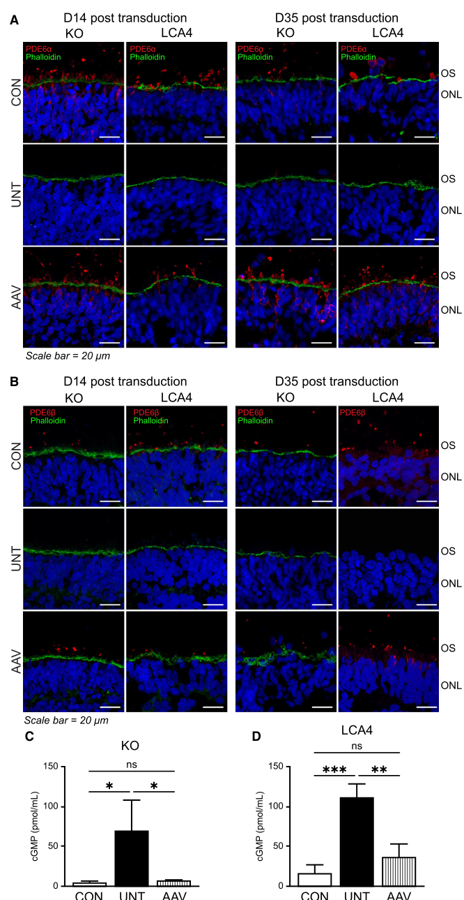

## Question

# Gene Research for Functional Annotation

## ⚠️ CRITICAL: Gene/Protein Identification Context

**BEFORE YOU BEGIN RESEARCH:** You MUST verify you are researching the CORRECT gene/protein. Gene symbols can be ambiguous, especially for less well-characterized genes from non-model organisms.

### Target Gene/Protein Identity (from UniProt):
- **UniProt Accession:** Q9NZN9
- **Protein Description:** RecName: Full=Aryl-hydrocarbon-interacting protein-like 1;
- **Gene Information:** Name=AIPL1; Synonyms=AIPL2;
- **Organism (full):** Homo sapiens (Human).
- **Protein Family:** Not specified in UniProt
- **Key Domains:** AIP/AIPL1/TTC9. (IPR039663); PPIase_AIP. (IPR056277); PPIase_dom_sf. (IPR046357); TPR-like_helical_dom_sf. (IPR011990); TPR_rpt. (IPR019734)

### MANDATORY VERIFICATION STEPS:

1. **Check if the gene symbol "AIPL1" matches the protein description above**
2. **Verify the organism is correct:** Homo sapiens (Human).
3. **Check if protein family/domains align with what you find in literature**
4. **If you find literature for a DIFFERENT gene with the same or similar symbol, STOP**

### If Gene Symbol is Ambiguous or You Cannot Find Relevant Literature:

**DO NOT PROCEED WITH RESEARCH ON A DIFFERENT GENE.** Instead:
- State clearly: "The gene symbol 'AIPL1' is ambiguous or literature is limited for this specific protein"
- Explain what you found (e.g., "Found extensive literature on a different gene with the same symbol in a different organism")
- Describe the protein based ONLY on the UniProt information provided above
- Suggest that the protein function can be inferred from domain/family information

### Research Target:

Please provide a comprehensive research report on the gene **AIPL1** (gene ID: AIPL1, UniProt: Q9NZN9) in human.

The research report should be a detailed narrative explaining the function, biological processes, and localization of the gene product. Citations should be given for all claims.

You should prioritize authoritative reviews and primary scientific literature when conducting research. You can supplement
this with annotations you find in gene/protein databases, but these can be outdated or inaccurate.

We are specifically interested in the primary function of the gene - for enzymes, what reaction is catalyzed, and what is the substrate specificity? For transporters, what is the substrate? For structural proteins or adapters, what is the broader structural role? For signaling molecules, what is the role in the pathway.

We are interested in where in or outside the cell the gene product carries out its function.

We are also interested in the signaling or biochemical pathways in which the gene functions. We are less interested in broad pleiotropic effects, except where these elucidate the precise role.

Include evidence where possible. We are interested in both experimental evidence as well as inference from structure, evolution, or bioinformatic analysis. Precise studies should be prioritized over high-throughput, where available.

## Output

Question: You are an expert researcher providing comprehensive, well-cited information.

Provide detailed information focusing on:
1. Key concepts and definitions with current understanding
2. Recent developments and latest research (prioritize 2023-2024 sources)
3. Current applications and real-world implementations
4. Expert opinions and analysis from authoritative sources
5. Relevant statistics and data from recent studies

Format as a comprehensive research report with proper citations. Include URLs and publication dates where available.
Always prioritize recent, authoritative sources and provide specific citations for all major claims.

# Gene Research for Functional Annotation

## ⚠️ CRITICAL: Gene/Protein Identification Context

**BEFORE YOU BEGIN RESEARCH:** You MUST verify you are researching the CORRECT gene/protein. Gene symbols can be ambiguous, especially for less well-characterized genes from non-model organisms.

### Target Gene/Protein Identity (from UniProt):
- **UniProt Accession:** Q9NZN9
- **Protein Description:** RecName: Full=Aryl-hydrocarbon-interacting protein-like 1;
- **Gene Information:** Name=AIPL1; Synonyms=AIPL2;
- **Organism (full):** Homo sapiens (Human).
- **Protein Family:** Not specified in UniProt
- **Key Domains:** AIP/AIPL1/TTC9. (IPR039663); PPIase_AIP. (IPR056277); PPIase_dom_sf. (IPR046357); TPR-like_helical_dom_sf. (IPR011990); TPR_rpt. (IPR019734)

### MANDATORY VERIFICATION STEPS:

1. **Check if the gene symbol "AIPL1" matches the protein description above**
2. **Verify the organism is correct:** Homo sapiens (Human).
3. **Check if protein family/domains align with what you find in literature**
4. **If you find literature for a DIFFERENT gene with the same or similar symbol, STOP**

### If Gene Symbol is Ambiguous or You Cannot Find Relevant Literature:

**DO NOT PROCEED WITH RESEARCH ON A DIFFERENT GENE.** Instead:
- State clearly: "The gene symbol 'AIPL1' is ambiguous or literature is limited for this specific protein"
- Explain what you found (e.g., "Found extensive literature on a different gene with the same symbol in a different organism")
- Describe the protein based ONLY on the UniProt information provided above
- Suggest that the protein function can be inferred from domain/family information

### Research Target:

Please provide a comprehensive research report on the gene **AIPL1** (gene ID: AIPL1, UniProt: Q9NZN9) in human.

The research report should be a detailed narrative explaining the function, biological processes, and localization of the gene product. Citations should be given for all claims.

You should prioritize authoritative reviews and primary scientific literature when conducting research. You can supplement
this with annotations you find in gene/protein databases, but these can be outdated or inaccurate.

We are specifically interested in the primary function of the gene - for enzymes, what reaction is catalyzed, and what is the substrate specificity? For transporters, what is the substrate? For structural proteins or adapters, what is the broader structural role? For signaling molecules, what is the role in the pathway.

We are interested in where in or outside the cell the gene product carries out its function.

We are also interested in the signaling or biochemical pathways in which the gene functions. We are less interested in broad pleiotropic effects, except where these elucidate the precise role.

Include evidence where possible. We are interested in both experimental evidence as well as inference from structure, evolution, or bioinformatic analysis. Precise studies should be prioritized over high-throughput, where available.

# Research Report: Human **AIPL1** (UniProt **Q9NZN9**) — Functional Annotation, Mechanism, and Translational Landscape

## 0) Target verification (mandatory)
The requested target is **aryl-hydrocarbon-interacting protein-like 1 (AIPL1)** in **Homo sapiens**, UniProt **Q9NZN9**. In the retrieved literature, human AIPL1 is consistently described as a **384 amino-acid** protein with an **N-terminal FKBP-like domain**, **three TPR repeats**, and a **primate-specific C-terminal proline-rich domain (PRD)**, matching the identity and domain context provided in the prompt (and aligning with the stated InterPro-style domain assignments to FKBP/PPIase-like and TPR-like folds). (galieva2025restoringsightthe pages 4-5, galieva2025restoringsightthe pages 5-7)

## 1) Key concepts and definitions (current understanding)

### 1.1 What AIPL1 “is” (functional class)
AIPL1 is **not an enzyme or transporter** in the classic sense; rather, it is best characterized as a **photoreceptor-specific molecular chaperone/co-chaperone** that supports the **biogenesis, maturation, and stability** of the phototransduction effector enzyme **phosphodiesterase-6 (PDE6)**. (galieva2025restoringsightthe pages 12-13, ashok2024updatesonproteinprenylation pages 7-8)

### 1.2 Core mechanistic concept: HSP90-dependent co-chaperoning
AIPL1 functions as an **HSP90-dependent co-chaperone**. Mechanistically, the **TPR domain** is required for **HSP90 interaction**, and formation of a **stable ternary complex** containing **AIPL1–HSP90–PDE6** is described as **crucial for PDE6 maturation**. (galieva2025restoringsightthe pages 10-12, galieva2025restoringsightthe pages 12-13)

### 1.3 Core mechanistic concept: prenyl (farnesyl/geranylgeranyl) recognition
AIPL1 is also described as preferentially recognizing **prenylated proteins**: PDE6 catalytic subunits are prenylated (rod PDE6A is typically farnesylated; PDE6B and cone PDE6 are geranylgeranylated), and **PDE6 prenylation is required for binding** to AIPL1’s **FKBP-like domain**, which supports a model where AIPL1 acts as a **prenyl-dependent assembly factor** for PDE6. (ashok2024updatesonproteinprenylation pages 7-8, ashok2024updatesonproteinprenylation pages 6-7)

### 1.4 Relationship to PDE6 and phototransduction pathway
PDE6 is a pivotal phototransduction enzyme because it **hydrolyzes cGMP**, and loss of AIPL1 can result in **PDE6 loss** with consequent **cGMP dysregulation**, a hallmark of AIPL1-related retinal degeneration models. (galieva2025restoringsightthe pages 13-15, sai2024effectiveaavmediatedgene pages 3-5)

## 2) Protein architecture and molecular interactions

### 2.1 Domain architecture (with residue mapping where available)
AIPL1 is described as a multi-domain protein containing:
- **FKBP-like domain** (reported residues ~12–157), with a notable **insert region** (reported ~90–147)
- **Three TPR repeats** (TPR1 ~178–213; TPR2 ~219–260; TPR3 ~264–297)
- **C-terminal proline-rich domain (PRD)** (reported ~328–384), described as primate-specific in reviewed sources
These assignments support the prompt’s “AIP/AIPL1/TTC9”, “PPIase-like”, and “TPR-repeat/helical” domain context. (galieva2025restoringsightthe pages 4-5, galieva2025restoringsightthe pages 5-7)

### 2.2 HSP90/HSP70 and PDE6 interactions
AIPL1 is reported to interact with **HSP90** (and HSP70), with the **TPR domain necessary for HSP90 binding**. Truncation removing TPR/PRD abolishes HSP90 interaction in the reviewed mechanistic summary, emphasizing domain integrity for co-chaperone action. (galieva2025restoringsightthe pages 10-12, galieva2025restoringsightthe pages 12-13)

### 2.3 Interaction with FAT10/NUB1: coupling PDE6 biogenesis to proteostasis
AIPL1 is also linked to a proteostasis axis involving **FAT10** (a ubiquitin-like modifier) and **NUB1**:
- In a primary biochemical study, **FAT10** is shown to **covalently conjugate** to PDE6 subunits (FAT10ylation) and target PDE6 toward **proteasomal degradation**, while also **non-covalently binding** PDE6 domains to **inhibit cGMP hydrolysis**. (boehm2020theubiquitinlikemodifier pages 1-2, boehm2020theubiquitinlikemodifier pages 5-6)
- The same work reports that **AIPL1 stabilizes** FAT10 and the **PDE6β–FAT10 conjugate**, and FAT10 binds AIPL1’s TPR motifs, supporting a model where AIPL1 can modulate PDE6’s stability under inflammatory/proteotoxic conditions. (boehm2020theubiquitinlikemodifier pages 5-6, boehm2020theubiquitinlikemodifier pages 3-4)

Quantitatively, Boehm et al. report that roughly **~50%** of the PDE6β–FAT10 conjugate was degraded after **2.5 hours** of cycloheximide chase, consistent with rapid turnover of FAT10ylated PDE6 species. (boehm2020theubiquitinlikemodifier pages 7-8)

## 3) Cellular/tissue expression and subcellular localization

### 3.1 Tissue specificity
AIPL1 is consistently characterized as **retina/photoreceptor-specific** (with retina-enriched patterns across sources), supporting its specialized role in phototransduction protein biogenesis. (galieva2025restoringsightthe pages 5-7, ashok2024updatesonproteinprenylation pages 7-8)

### 3.2 Rod vs cone expression across development
AIPL1 shows a **developmental expression pattern** in which it can be observed in both rod and developing cone contexts, but adult human retina immunofluorescence emphasizes strong detection in **rods** with reduced or minimal detection in **adult cones**. Despite this, AIPL1 is described as important for **cone photoreceptor viability/function**. (galieva2025restoringsightthe pages 40-42, galieva2025restoringsightthe pages 4-5)

### 3.3 Subcellular localization within photoreceptors
AIPL1 is discussed as localizing along the **synapse to inner segment/connecting cilium** axis, supporting the interpretation that its primary role is **PDE6 maturation/assembly** rather than being the principal carrier for outer-segment trafficking. (ashok2024updatesonproteinprenylation pages 7-8)

## 4) Recent developments (prioritizing 2023–2024)

### 4.1 2024 mechanistic synthesis: prenylation-centric view of AIPL1–PDE6 biology
A 2024 review on retinal prenylation and retinopathies highlights AIPL1 as a **photoreceptor-specific co-chaperone** essential for **PDE6 maturation and stabilization**, with **PDE6 prenylation required for binding** to AIPL1’s FKBP domain, while AIPL1’s **TPR domain binds HSP90** and engages co-chaperone-dependent maturation logic. (Publication date: **July 2024**; URL: https://doi.org/10.3389/fopht.2024.1410874) (ashok2024updatesonproteinprenylation pages 7-8)

The same review stresses that AIPL1 localization patterns (synapse → inner segment/connecting cilium) favor a model in which AIPL1 is primarily a **maturation factor**, and notes remaining uncertainty about handoff of mature PDE6 to trafficking chaperones (e.g., PrBP/δ), which is a current open mechanistic point. (ashok2024updatesonproteinprenylation pages 7-8, ashok2024updatesonproteinprenylation pages 12-13)

### 4.2 2024 preclinical gene-augmentation in human retinal organoids (high relevance)
A key 2024 translational study used **human iPSC-derived retinal organoids** (AIPL1 knockout and patient-derived LCA4 models) and delivered **AAV7m8.hRKp.AIPL1** (photoreceptor-directed transgene expression) to test gene replacement. (Publication date: **March 2024**; URL: https://doi.org/10.1016/j.omtn.2024.102148) (sai2024effectiveaavmediatedgene pages 1-2, sai2024effectiveaavmediatedgene pages 2-3)

Major findings:
- **AIPL1 protein became detectable** in rods and cones after treatment and persisted across measured timepoints. Quantitatively, AIPL1 was detected in approximately **~10.9–12.1%** of rhodopsin-positive rods and **~12.8–13.4%** of cone-arrestin-positive cones (KO model), with similar magnitudes reported in the patient line (up to **~15.4%** of rods and **~14.3%** of cones at later measured timepoints). (sai2024effectiveaavmediatedgene pages 1-2)
- **Rod PDE6 subunits (PDE6α/β)**, reduced or absent in untreated disease organoids, showed **recovery after AAV transduction**, while PDE6 transcripts were not notably changed—supporting a **post-transcriptional, proteostasis/assembly** rescue mechanism consistent with AIPL1’s chaperone role. (sai2024effectiveaavmediatedgene pages 2-3)
- **cGMP**, elevated in AIPL1-deficient organoids, was **reduced to control-like levels** after AAV treatment. Reported statistics include elevated cGMP in KO and patient models (e.g., **p = 0.0285** and **p = 0.007**, respectively; patient vs isogenic control **p = 0.0056**) and normalization after treatment. (sai2024effectiveaavmediatedgene pages 3-5)

Visual evidence for these rescue outcomes is provided in the organoid study figures (immunostaining rescue and cGMP ELISA plots). (sai2024effectiveaavmediatedgene media 9aa37a09)

### 4.3 2024 clinical genetics and natural-history style cohort data
A 2024 cohort of **52 children** with Leber congenital amaurosis (LCA) reported that **AIPL1 variants occurred in 4/52 (7.7%)** of patients; an AIPL1 variant **c.421C>T (p.Q141X)** was recurrently observed in **four** non-consanguineous patients in the cohort. (Publication date: **April 2024**; URL: https://doi.org/10.1007/s00417-024-06450-9) (zhou2024clinicalandgenetic pages 4-6, zhou2024clinicalandgenetic pages 6-8)

This study also provides objective vascular/hemodynamic statistics that may reflect degenerative severity in LCA generally: mean retinal artery diameter **43.6 ± 3.8 μm** in patients vs **51.7 ± 2.6 μm** in controls (P < 0.001), and reduced ophthalmic artery PSV **16.3 ± 5.4 cm/s** vs **23.5 ± 6.4 cm/s** (P = 0.0132). (zhou2024clinicalandgenetic pages 4-6)

## 5) Current applications and real-world implementations

### 5.1 Application: mechanism-guided gene augmentation
The strongest near-term application is **gene augmentation** (AAV-mediated AIPL1 replacement) to restore PDE6 maturation and normalize downstream signaling (cGMP), supported by human organoid evidence. (sai2024effectiveaavmediatedgene pages 3-5, sai2024effectiveaavmediatedgene pages 2-3)

### 5.2 Real-world implementation: ongoing clinical trial
Clinical translation is reflected by an active ClinicalTrials.gov record:
- **NCT07063030** — “A Study of **LX107** Gene Therapy in AIPL1-IRD Patients” (first posted **2025-07-14**, actual start **2025-07-15**; Recruiting status verified **2026-03**). (NCT07063030 chunk 1)
- Design: Early Phase 1, single-group, open-label; **single subretinal injection** on Day 0; estimated enrollment **13**.
- Dose cohorts: **1×10¹⁰ VG/eye (medium)** and **3×10¹⁰ VG/eye (high)** are explicitly stated, with a low cohort also reported; primary endpoint is safety/tolerability by adverse events over **6 months**. (NCT07063030 chunk 1)

URL: https://clinicaltrials.gov/study/NCT07063030 (trial details consistent with the cited record). (NCT07063030 chunk 1)

## 6) Expert opinions and authoritative analysis (from retrieved sources)
Two convergent expert-level analyses emerge from the 2024 and mechanistic syntheses:
1) **AIPL1 is best understood as a specialized, HSP90-dependent co-chaperone whose primary client is PDE6**, and disease arises largely from failure of PDE6 maturation/stability with downstream cGMP dysregulation and photoreceptor loss. (ashok2024updatesonproteinprenylation pages 7-8, galieva2025restoringsightthe pages 13-15)
2) There is an increasingly explicit **prenylation-centric model**: PDE6 prenylation is not only a membrane-anchor but also a **molecular recognition element** enabling AIPL1 binding and stable chaperone complex formation; this framing suggests that therapeutic strategies may need to consider prenylation-dependent assembly steps and broader prenylation/proteostasis networks (PrBP/δ, RCE1 processing, etc.). (ashok2024updatesonproteinprenylation pages 7-8, ashok2024updatesonproteinprenylation pages 6-7)

## 7) Summary of key statistics and data points
- **Protein/domain facts**: AIPL1 is **384 aa** with **FKBP-like + 3×TPR + PRD** architecture. (galieva2025restoringsightthe pages 4-5, galieva2025restoringsightthe pages 5-7)
- **LCA cohort (2024)**: AIPL1 variants **4/52 (7.7%)**; recurrent **p.Q141X** in four patients. (zhou2024clinicalandgenetic pages 4-6, zhou2024clinicalandgenetic pages 6-8)
- **Organoid gene therapy (2024)**:
  - Vector: **AAV7m8.hRKp.AIPL1**, delivered at **1×10¹¹ viral particles** in reported experiments; AIPL1 detected in **~11–15%** of rods/cones depending on model/timepoint. (sai2024effectiveaavmediatedgene pages 1-2, sai2024effectiveaavmediatedgene pages 2-3)
  - Functional biomarker: Elevated cGMP in disease organoids (e.g., **p = 0.0285**, **p = 0.007**, **p = 0.0056** comparisons) normalized after AAV treatment. (sai2024effectiveaavmediatedgene pages 3-5)
- **Proteostasis (2020 primary biochemistry)**: PDE6β–FAT10 conjugate shows rapid turnover with **~50% degraded at 2.5 h** (CHX chase), supporting vulnerability of PDE6 to inflammation-linked FAT10 pathways that AIPL1 interacts with. (boehm2020theubiquitinlikemodifier pages 7-8)

## 8) Evidence map (quick reference)
| Aspect | Key mechanistic/biological fact for human AIPL1 (UniProt Q9NZN9) | Best supporting citation IDs |
|---|---|---|
| Verified identity | AIPL1 is the human aryl-hydrocarbon-interacting protein-like 1, a 384-aa retina-enriched photoreceptor protein with FKBP-like, TPR, and C-terminal proline-rich features consistent with UniProt Q9NZN9. | (galieva2025restoringsightthe pages 4-5, galieva2025restoringsightthe pages 5-7) |
| Domain architecture | Domain organization comprises an N-terminal FKBP-like domain, an insert region within/adjacent to the FKBP-like module, three TPR repeats, and a primate-specific C-terminal proline-rich domain (PRD). Reported residue mapping includes FKBP 12–157, TPR1 178–213, TPR2 219–260, TPR3 264–297, PRD 328–384. | (galieva2025restoringsightthe pages 4-5, galieva2025restoringsightthe pages 5-7) |
| HSP90 interaction | The TPR domain is required for HSP90 binding, while FKBP-like domain features contribute to the HSP90-associated co-chaperone interface; AIPL1 preferentially binds the closed ATP-bound HSP90 dimer and forms an HSP90-dependent complex needed for PDE6 maturation. | (galieva2025restoringsightthe pages 10-12, galieva2025restoringsightthe pages 12-13) |
| PDE6 client relationship | AIPL1 is an obligate/specialized photoreceptor co-chaperone for rod and cone PDE6, promoting PDE6 folding, holoenzyme assembly, maturation, and stability before delivery to outer segments. Loss of AIPL1 causes rapid PDE6 loss and downstream cGMP dysregulation. | (galieva2025restoringsightthe pages 12-13, ashok2024updatesonproteinprenylation pages 7-8, galieva2025restoringsightthe pages 13-15) |
| Prenyl/farnesyl recognition | AIPL1 preferentially binds prenylated PDE6 subunits through its FKBP-like domain; PDE6 prenylation is required for productive AIPL1 binding, especially the farnesylated PDE6A subunit, and is important for stable AIPL1–HSP90–PDE6 ternary complex formation. | (galieva2025restoringsightthe pages 5-7, ashok2024updatesonproteinprenylation pages 7-8, ashok2024updatesonproteinprenylation pages 6-7) |
| Major binding partners | Best-supported interactors include HSP90/HSP70, PDE6 catalytic and regulatory subunits, FAT10, and NUB1. FAT10 binds AIPL1 TPR motifs; NUB1 binds within residues ~181–330; these interactions connect AIPL1 to PDE6 proteostasis. | (galieva2025restoringsightthe pages 10-12, galieva2025restoringsightthe pages 12-13, boehm2020theubiquitinlikemodifier pages 3-4) |
| FAT10/NUB1 proteostasis axis | Beyond PDE6 maturation, AIPL1 stabilizes FAT10 and PDE6β–FAT10 conjugates and is proposed to oppose NUB1/FAT10-linked proteasomal loss of PDE6. FAT10 both inhibits PDE6 cGMP hydrolysis non-covalently and targets FAT10ylated PDE6 for proteasomal degradation. | (boehm2020theubiquitinlikemodifier pages 7-8, boehm2020theubiquitinlikemodifier pages 1-2, boehm2020theubiquitinlikemodifier pages 5-6) |
| Subcellular localization | Evidence places AIPL1 mainly in photoreceptor inner segments and connecting cilium/ciliary region, supporting a principal role in PDE6 maturation rather than direct outer-segment trafficking. Adult human retina data show strongest expression in rods, with developmental expression in both rods and cones. | (galieva2025restoringsightthe pages 40-42, galieva2025restoringsightthe pages 4-5, ashok2024updatesonproteinprenylation pages 7-8) |
| Rods versus cones | In adult human retina, immunofluorescence detects AIPL1 mainly in rods, whereas developmental studies and organoid/transcript data indicate expression in both rods and developing cones, later reduced in mature cones. AIPL1 is nevertheless important for cone viability/function. | (galieva2025restoringsightthe pages 40-42, galieva2025restoringsightthe pages 4-5) |
| Primary biological role | AIPL1 is not an enzyme or transporter; its primary role is a photoreceptor-specific HSP90-dependent co-chaperone/adaptor that recognizes prenylated PDE6 and enables correct folding, assembly, and maintenance of the visual effector phosphodiesterase required for phototransduction. | (galieva2025restoringsightthe pages 10-12, ashok2024updatesonproteinprenylation pages 7-8, galieva2025restoringsightthe pages 1-2) |
| Disease association | Biallelic loss-of-function AIPL1 variants cause autosomal recessive LCA4/early-onset severe retinal dystrophy, typically with severe infantile visual impairment and rapid rod-cone degeneration. Reviews cite AIPL1 among the more severe LCA genes, with genotype–severity variation. | (ashok2024updatesonproteinprenylation pages 7-8, galieva2025restoringsightthe pages 13-15) |
| Recent cohort statistics | In a 2024 cohort of 52 children with LCA, AIPL1 variants were identified in 4/52 patients (7.7%); recurrent AIPL1 c.421C>T (p.Q141X) was observed in four non-consanguineous patients. The AIPL1 subgroup had mean age 2.8 ± 1.7 years and onset 5.5 ± 2.1 months. | (zhou2024clinicalandgenetic pages 4-6, zhou2024clinicalandgenetic pages 6-8) |
| Preclinical gene therapy | In 2024 human iPSC-derived retinal organoids modeling AIPL1-LCA4, AAV7m8.hRKp.AIPL1 restored AIPL1 expression, rescued rod PDE6, and normalized elevated cGMP. Rescue was detectable by 14 days and sustained up to 70 days in reported experiments. | (sai2024effectiveaavmediatedgene pages 5-8, sai2024effectiveaavmediatedgene pages 3-5, sai2024effectiveaavmediatedgene pages 1-2) |
| Quantitative organoid rescue notes | After AAV treatment, AIPL1-positive cells were detected in a minority of rods/cones (roughly ~11–15% of marker-positive photoreceptors depending on model/time point), yet this was sufficient to rescue PDE6 and reduce cGMP to control-like levels in organoids. | (sai2024effectiveaavmediatedgene pages 1-2, sai2024effectiveaavmediatedgene pages 2-3) |
| Clinical translation | A clinical study is underway for AIPL1-IRD: NCT07063030 (“A Study of LX107 Gene Therapy in AIPL1-IRD Patients”), an early phase 1, recruiting, single-group trial in Shanghai testing single subretinal LX107 administration in patients with biallelic AIPL1 mutations; primary endpoint is safety over 6 months. | (NCT07063030 chunk 1) |

*Table: This table condenses the most important mechanistic, localization, disease, and therapeutic facts about human AIPL1, with direct context-ID citations for each point. It is useful as a quick-reference evidence map linking AIPL1 biology to PDE6 maturation and current translational work.*

## Key cited sources (URLs and publication dates where available)
- Sai H. et al. **Effective AAV-mediated gene replacement therapy in retinal organoids modeling AIPL1-associated LCA4**. *Molecular Therapy – Nucleic Acids* (Mar **2024**). https://doi.org/10.1016/j.omtn.2024.102148 (sai2024effectiveaavmediatedgene pages 1-2)
- Ashok S., Rao S.R. **Updates on protein-prenylation and associated inherited retinopathies**. *Frontiers in Ophthalmology* (Jul **2024**). https://doi.org/10.3389/fopht.2024.1410874 (ashok2024updatesonproteinprenylation pages 7-8)
- Zhou Y. et al. **Clinical and genetic studies for a cohort of patients with Leber congenital amaurosis**. *Graefe’s Archive for Clinical and Experimental Ophthalmology* (Apr **2024**). https://doi.org/10.1007/s00417-024-06450-9 (zhou2024clinicalandgenetic pages 4-6)
- Boehm A.N. et al. **The ubiquitin-like modifier FAT10 inhibits retinal PDE6 activity and mediates its proteasomal degradation**. *Journal of Biological Chemistry* (Oct **2020**). https://doi.org/10.1074/jbc.ra120.013873 (boehm2020theubiquitinlikemodifier pages 1-2)
- ClinicalTrials.gov. **NCT07063030**: “A Study of LX107 Gene Therapy in AIPL1-IRD Patients” (First posted **2025-07-14**; version holder **2026-06-05**). https://clinicaltrials.gov/study/NCT07063030 (NCT07063030 chunk 1)

References

1. (galieva2025restoringsightthe pages 4-5): Alima Galieva, Alexander Karabelsky, and Alexander D. Egorov. Restoring sight: the journey of aipl1 from discovery to therapy. International Journal of Molecular Sciences, 26:12066, Dec 2025. URL: https://doi.org/10.3390/ijms262412066, doi:10.3390/ijms262412066. This article has 1 citations.

2. (galieva2025restoringsightthe pages 5-7): Alima Galieva, Alexander Karabelsky, and Alexander D. Egorov. Restoring sight: the journey of aipl1 from discovery to therapy. International Journal of Molecular Sciences, 26:12066, Dec 2025. URL: https://doi.org/10.3390/ijms262412066, doi:10.3390/ijms262412066. This article has 1 citations.

3. (galieva2025restoringsightthe pages 12-13): Alima Galieva, Alexander Karabelsky, and Alexander D. Egorov. Restoring sight: the journey of aipl1 from discovery to therapy. International Journal of Molecular Sciences, 26:12066, Dec 2025. URL: https://doi.org/10.3390/ijms262412066, doi:10.3390/ijms262412066. This article has 1 citations.

4. (ashok2024updatesonproteinprenylation pages 7-8): Sudhat Ashok and Sriganesh Ramachandra Rao. Updates on protein-prenylation and associated inherited retinopathies. Frontiers in Ophthalmology, Jul 2024. URL: https://doi.org/10.3389/fopht.2024.1410874, doi:10.3389/fopht.2024.1410874. This article has 7 citations.

5. (galieva2025restoringsightthe pages 10-12): Alima Galieva, Alexander Karabelsky, and Alexander D. Egorov. Restoring sight: the journey of aipl1 from discovery to therapy. International Journal of Molecular Sciences, 26:12066, Dec 2025. URL: https://doi.org/10.3390/ijms262412066, doi:10.3390/ijms262412066. This article has 1 citations.

6. (ashok2024updatesonproteinprenylation pages 6-7): Sudhat Ashok and Sriganesh Ramachandra Rao. Updates on protein-prenylation and associated inherited retinopathies. Frontiers in Ophthalmology, Jul 2024. URL: https://doi.org/10.3389/fopht.2024.1410874, doi:10.3389/fopht.2024.1410874. This article has 7 citations.

7. (galieva2025restoringsightthe pages 13-15): Alima Galieva, Alexander Karabelsky, and Alexander D. Egorov. Restoring sight: the journey of aipl1 from discovery to therapy. International Journal of Molecular Sciences, 26:12066, Dec 2025. URL: https://doi.org/10.3390/ijms262412066, doi:10.3390/ijms262412066. This article has 1 citations.

8. (sai2024effectiveaavmediatedgene pages 3-5): Hali Sai, Bethany Ollington, Farah O. Rezek, Niuzheng Chai, Amelia Lane, Anastasios Georgiadis, James Bainbridge, Michel Michaelides, Almudena Sacristan-Reviriego, Pedro R.L. Perdigão, Amy Leung, and Jacqueline van der Spuy. Effective aav-mediated gene replacement therapy in retinal organoids modeling aipl1-associated lca4. Molecular Therapy - Nucleic Acids, 35:102148, Mar 2024. URL: https://doi.org/10.1016/j.omtn.2024.102148, doi:10.1016/j.omtn.2024.102148. This article has 25 citations.

9. (boehm2020theubiquitinlikemodifier pages 1-2): Annika N. Boehm, Johanna Bialas, Nicola Catone, Almudena Sacristan-Reviriego, Jacqueline van der Spuy, Marcus Groettrup, and Annette Aichem. The ubiquitin-like modifier fat10 inhibits retinal pde6 activity and mediates its proteasomal degradation. Journal of Biological Chemistry, 295:14402-14418, Oct 2020. URL: https://doi.org/10.1074/jbc.ra120.013873, doi:10.1074/jbc.ra120.013873. This article has 12 citations and is from a domain leading peer-reviewed journal.

10. (boehm2020theubiquitinlikemodifier pages 5-6): Annika N. Boehm, Johanna Bialas, Nicola Catone, Almudena Sacristan-Reviriego, Jacqueline van der Spuy, Marcus Groettrup, and Annette Aichem. The ubiquitin-like modifier fat10 inhibits retinal pde6 activity and mediates its proteasomal degradation. Journal of Biological Chemistry, 295:14402-14418, Oct 2020. URL: https://doi.org/10.1074/jbc.ra120.013873, doi:10.1074/jbc.ra120.013873. This article has 12 citations and is from a domain leading peer-reviewed journal.

11. (boehm2020theubiquitinlikemodifier pages 3-4): Annika N. Boehm, Johanna Bialas, Nicola Catone, Almudena Sacristan-Reviriego, Jacqueline van der Spuy, Marcus Groettrup, and Annette Aichem. The ubiquitin-like modifier fat10 inhibits retinal pde6 activity and mediates its proteasomal degradation. Journal of Biological Chemistry, 295:14402-14418, Oct 2020. URL: https://doi.org/10.1074/jbc.ra120.013873, doi:10.1074/jbc.ra120.013873. This article has 12 citations and is from a domain leading peer-reviewed journal.

12. (boehm2020theubiquitinlikemodifier pages 7-8): Annika N. Boehm, Johanna Bialas, Nicola Catone, Almudena Sacristan-Reviriego, Jacqueline van der Spuy, Marcus Groettrup, and Annette Aichem. The ubiquitin-like modifier fat10 inhibits retinal pde6 activity and mediates its proteasomal degradation. Journal of Biological Chemistry, 295:14402-14418, Oct 2020. URL: https://doi.org/10.1074/jbc.ra120.013873, doi:10.1074/jbc.ra120.013873. This article has 12 citations and is from a domain leading peer-reviewed journal.

13. (galieva2025restoringsightthe pages 40-42): Alima Galieva, Alexander Karabelsky, and Alexander D. Egorov. Restoring sight: the journey of aipl1 from discovery to therapy. International Journal of Molecular Sciences, 26:12066, Dec 2025. URL: https://doi.org/10.3390/ijms262412066, doi:10.3390/ijms262412066. This article has 1 citations.

14. (ashok2024updatesonproteinprenylation pages 12-13): Sudhat Ashok and Sriganesh Ramachandra Rao. Updates on protein-prenylation and associated inherited retinopathies. Frontiers in Ophthalmology, Jul 2024. URL: https://doi.org/10.3389/fopht.2024.1410874, doi:10.3389/fopht.2024.1410874. This article has 7 citations.

15. (sai2024effectiveaavmediatedgene pages 1-2): Hali Sai, Bethany Ollington, Farah O. Rezek, Niuzheng Chai, Amelia Lane, Anastasios Georgiadis, James Bainbridge, Michel Michaelides, Almudena Sacristan-Reviriego, Pedro R.L. Perdigão, Amy Leung, and Jacqueline van der Spuy. Effective aav-mediated gene replacement therapy in retinal organoids modeling aipl1-associated lca4. Molecular Therapy - Nucleic Acids, 35:102148, Mar 2024. URL: https://doi.org/10.1016/j.omtn.2024.102148, doi:10.1016/j.omtn.2024.102148. This article has 25 citations.

16. (sai2024effectiveaavmediatedgene pages 2-3): Hali Sai, Bethany Ollington, Farah O. Rezek, Niuzheng Chai, Amelia Lane, Anastasios Georgiadis, James Bainbridge, Michel Michaelides, Almudena Sacristan-Reviriego, Pedro R.L. Perdigão, Amy Leung, and Jacqueline van der Spuy. Effective aav-mediated gene replacement therapy in retinal organoids modeling aipl1-associated lca4. Molecular Therapy - Nucleic Acids, 35:102148, Mar 2024. URL: https://doi.org/10.1016/j.omtn.2024.102148, doi:10.1016/j.omtn.2024.102148. This article has 25 citations.

17. (sai2024effectiveaavmediatedgene media 9aa37a09): Hali Sai, Bethany Ollington, Farah O. Rezek, Niuzheng Chai, Amelia Lane, Anastasios Georgiadis, James Bainbridge, Michel Michaelides, Almudena Sacristan-Reviriego, Pedro R.L. Perdigão, Amy Leung, and Jacqueline van der Spuy. Effective aav-mediated gene replacement therapy in retinal organoids modeling aipl1-associated lca4. Molecular Therapy - Nucleic Acids, 35:102148, Mar 2024. URL: https://doi.org/10.1016/j.omtn.2024.102148, doi:10.1016/j.omtn.2024.102148. This article has 25 citations.

18. (zhou2024clinicalandgenetic pages 4-6): Yunyu Zhou, Lijuan Huang, Yan Xie, Wen Liu, Shasha Zhang, Lili Liu, Ping Lin, and Ningdong Li. Clinical and genetic studies for a cohort of patients with leber congenital amaurosis. Graefe's Archive for Clinical and Experimental Ophthalmology, 262:3029-3038, Apr 2024. URL: https://doi.org/10.1007/s00417-024-06450-9, doi:10.1007/s00417-024-06450-9. This article has 3 citations.

19. (zhou2024clinicalandgenetic pages 6-8): Yunyu Zhou, Lijuan Huang, Yan Xie, Wen Liu, Shasha Zhang, Lili Liu, Ping Lin, and Ningdong Li. Clinical and genetic studies for a cohort of patients with leber congenital amaurosis. Graefe's Archive for Clinical and Experimental Ophthalmology, 262:3029-3038, Apr 2024. URL: https://doi.org/10.1007/s00417-024-06450-9, doi:10.1007/s00417-024-06450-9. This article has 3 citations.

20. (NCT07063030 chunk 1): Xiaodong Sun. A Study of LX107 Gene Therapy in AIPL1-IRD Patients. Shanghai General Hospital, Shanghai Jiao Tong University School of Medicine. 2025. ClinicalTrials.gov Identifier: NCT07063030

21. (galieva2025restoringsightthe pages 1-2): Alima Galieva, Alexander Karabelsky, and Alexander D. Egorov. Restoring sight: the journey of aipl1 from discovery to therapy. International Journal of Molecular Sciences, 26:12066, Dec 2025. URL: https://doi.org/10.3390/ijms262412066, doi:10.3390/ijms262412066. This article has 1 citations.

22. (sai2024effectiveaavmediatedgene pages 5-8): Hali Sai, Bethany Ollington, Farah O. Rezek, Niuzheng Chai, Amelia Lane, Anastasios Georgiadis, James Bainbridge, Michel Michaelides, Almudena Sacristan-Reviriego, Pedro R.L. Perdigão, Amy Leung, and Jacqueline van der Spuy. Effective aav-mediated gene replacement therapy in retinal organoids modeling aipl1-associated lca4. Molecular Therapy - Nucleic Acids, 35:102148, Mar 2024. URL: https://doi.org/10.1016/j.omtn.2024.102148, doi:10.1016/j.omtn.2024.102148. This article has 25 citations.

## Artifacts

- [Edison artifact artifact-00](AIPL1-deep-research-falcon_artifacts/artifact-00.md)

## Citations

1. boehm2020theubiquitinlikemodifier pages 7-8
2. ashok2024updatesonproteinprenylation pages 7-8
3. sai2024effectiveaavmediatedgene pages 1-2
4. sai2024effectiveaavmediatedgene pages 2-3
5. sai2024effectiveaavmediatedgene pages 3-5
6. zhou2024clinicalandgenetic pages 4-6
7. boehm2020theubiquitinlikemodifier pages 1-2
8. galieva2025restoringsightthe pages 4-5
9. galieva2025restoringsightthe pages 5-7
10. galieva2025restoringsightthe pages 12-13
11. galieva2025restoringsightthe pages 10-12
12. ashok2024updatesonproteinprenylation pages 6-7
13. galieva2025restoringsightthe pages 13-15
14. boehm2020theubiquitinlikemodifier pages 5-6
15. boehm2020theubiquitinlikemodifier pages 3-4
16. galieva2025restoringsightthe pages 40-42
17. ashok2024updatesonproteinprenylation pages 12-13
18. zhou2024clinicalandgenetic pages 6-8
19. galieva2025restoringsightthe pages 1-2
20. sai2024effectiveaavmediatedgene pages 5-8
21. https://doi.org/10.3389/fopht.2024.1410874
22. https://doi.org/10.1016/j.omtn.2024.102148
23. https://doi.org/10.1007/s00417-024-06450-9
24. https://clinicaltrials.gov/study/NCT07063030
25. https://doi.org/10.1074/jbc.ra120.013873
26. https://doi.org/10.3390/ijms262412066,
27. https://doi.org/10.3389/fopht.2024.1410874,
28. https://doi.org/10.1016/j.omtn.2024.102148,
29. https://doi.org/10.1074/jbc.ra120.013873,
30. https://doi.org/10.1007/s00417-024-06450-9,