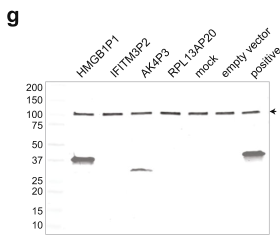

## Question

# Gene Research for Functional Annotation

## ⚠️ CRITICAL: Gene/Protein Identification Context

**BEFORE YOU BEGIN RESEARCH:** You MUST verify you are researching the CORRECT gene/protein. Gene symbols can be ambiguous, especially for less well-characterized genes from non-model organisms.

### Target Gene/Protein Identity (from UniProt):
- **UniProt Accession:** A0A8I5KW96
- **Protein Description:** RecName: Full=Adenylate kinase 4, mitochondrial {ECO:0000256|ARBA:ARBA00047198, ECO:0000256|HAMAP-Rule:MF_03170}; Short=AK 4 {ECO:0000256|HAMAP-Rule:MF_03170}; EC=2.7.4.10 {ECO:0000256|HAMAP-Rule:MF_03170}; EC=2.7.4.6 {ECO:0000256|HAMAP-Rule:MF_03170}; AltName: Full=Adenylate kinase 3-like {ECO:0000256|HAMAP-Rule:MF_03170}; AltName: Full=GTP:AMP phosphotransferase AK4 {ECO:0000256|HAMAP-Rule:MF_03170};
- **Gene Information:** Name=AK4P3 {ECO:0000313|Ensembl:ENSP00000510584.1}; Synonyms=AK3L1 {ECO:0000256|HAMAP-Rule:MF_03170}, AK4 {ECO:0000256|HAMAP-Rule:MF_03170};
- **Organism (full):** Homo sapiens (Human).
- **Protein Family:** Belongs to the adenylate kinase family. AK3 subfamily.
- **Key Domains:** Adenyl_kin_sub. (IPR006259); Adenylat/UMP-CMP_kin. (IPR000850); Adenylat_kinase_CS. (IPR033690); Adenylate_kinase_lid-dom. (IPR007862); ADK_active_lid_dom_sf. (IPR036193)

### MANDATORY VERIFICATION STEPS:

1. **Check if the gene symbol "AK4P3" matches the protein description above**
2. **Verify the organism is correct:** Homo sapiens (Human).
3. **Check if protein family/domains align with what you find in literature**
4. **If you find literature for a DIFFERENT gene with the same or similar symbol, STOP**

### If Gene Symbol is Ambiguous or You Cannot Find Relevant Literature:

**DO NOT PROCEED WITH RESEARCH ON A DIFFERENT GENE.** Instead:
- State clearly: "The gene symbol 'AK4P3' is ambiguous or literature is limited for this specific protein"
- Explain what you found (e.g., "Found extensive literature on a different gene with the same symbol in a different organism")
- Describe the protein based ONLY on the UniProt information provided above
- Suggest that the protein function can be inferred from domain/family information

### Research Target:

Please provide a comprehensive research report on the gene **AK4P3** (gene ID: AK4P3, UniProt: A0A8I5KW96) in human.

The research report should be a detailed narrative explaining the function, biological processes, and localization of the gene product. Citations should be given for all claims.

You should prioritize authoritative reviews and primary scientific literature when conducting research. You can supplement
this with annotations you find in gene/protein databases, but these can be outdated or inaccurate.

We are specifically interested in the primary function of the gene - for enzymes, what reaction is catalyzed, and what is the substrate specificity? For transporters, what is the substrate? For structural proteins or adapters, what is the broader structural role? For signaling molecules, what is the role in the pathway.

We are interested in where in or outside the cell the gene product carries out its function.

We are also interested in the signaling or biochemical pathways in which the gene functions. We are less interested in broad pleiotropic effects, except where these elucidate the precise role.

Include evidence where possible. We are interested in both experimental evidence as well as inference from structure, evolution, or bioinformatic analysis. Precise studies should be prioritized over high-throughput, where available.

## Output

Question: You are an expert researcher providing comprehensive, well-cited information.

Provide detailed information focusing on:
1. Key concepts and definitions with current understanding
2. Recent developments and latest research (prioritize 2023-2024 sources)
3. Current applications and real-world implementations
4. Expert opinions and analysis from authoritative sources
5. Relevant statistics and data from recent studies

Format as a comprehensive research report with proper citations. Include URLs and publication dates where available.
Always prioritize recent, authoritative sources and provide specific citations for all major claims.

# Gene Research for Functional Annotation

## ⚠️ CRITICAL: Gene/Protein Identification Context

**BEFORE YOU BEGIN RESEARCH:** You MUST verify you are researching the CORRECT gene/protein. Gene symbols can be ambiguous, especially for less well-characterized genes from non-model organisms.

### Target Gene/Protein Identity (from UniProt):
- **UniProt Accession:** A0A8I5KW96
- **Protein Description:** RecName: Full=Adenylate kinase 4, mitochondrial {ECO:0000256|ARBA:ARBA00047198, ECO:0000256|HAMAP-Rule:MF_03170}; Short=AK 4 {ECO:0000256|HAMAP-Rule:MF_03170}; EC=2.7.4.10 {ECO:0000256|HAMAP-Rule:MF_03170}; EC=2.7.4.6 {ECO:0000256|HAMAP-Rule:MF_03170}; AltName: Full=Adenylate kinase 3-like {ECO:0000256|HAMAP-Rule:MF_03170}; AltName: Full=GTP:AMP phosphotransferase AK4 {ECO:0000256|HAMAP-Rule:MF_03170};
- **Gene Information:** Name=AK4P3 {ECO:0000313|Ensembl:ENSP00000510584.1}; Synonyms=AK3L1 {ECO:0000256|HAMAP-Rule:MF_03170}, AK4 {ECO:0000256|HAMAP-Rule:MF_03170};
- **Organism (full):** Homo sapiens (Human).
- **Protein Family:** Belongs to the adenylate kinase family. AK3 subfamily.
- **Key Domains:** Adenyl_kin_sub. (IPR006259); Adenylat/UMP-CMP_kin. (IPR000850); Adenylat_kinase_CS. (IPR033690); Adenylate_kinase_lid-dom. (IPR007862); ADK_active_lid_dom_sf. (IPR036193)

### MANDATORY VERIFICATION STEPS:

1. **Check if the gene symbol "AK4P3" matches the protein description above**
2. **Verify the organism is correct:** Homo sapiens (Human).
3. **Check if protein family/domains align with what you find in literature**
4. **If you find literature for a DIFFERENT gene with the same or similar symbol, STOP**

### If Gene Symbol is Ambiguous or You Cannot Find Relevant Literature:

**DO NOT PROCEED WITH RESEARCH ON A DIFFERENT GENE.** Instead:
- State clearly: "The gene symbol 'AK4P3' is ambiguous or literature is limited for this specific protein"
- Explain what you found (e.g., "Found extensive literature on a different gene with the same symbol in a different organism")
- Describe the protein based ONLY on the UniProt information provided above
- Suggest that the protein function can be inferred from domain/family information

### Research Target:

Please provide a comprehensive research report on the gene **AK4P3** (gene ID: AK4P3, UniProt: A0A8I5KW96) in human.

The research report should be a detailed narrative explaining the function, biological processes, and localization of the gene product. Citations should be given for all claims.

You should prioritize authoritative reviews and primary scientific literature when conducting research. You can supplement
this with annotations you find in gene/protein databases, but these can be outdated or inaccurate.

We are specifically interested in the primary function of the gene - for enzymes, what reaction is catalyzed, and what is the substrate specificity? For transporters, what is the substrate? For structural proteins or adapters, what is the broader structural role? For signaling molecules, what is the role in the pathway.

We are interested in where in or outside the cell the gene product carries out its function.

We are also interested in the signaling or biochemical pathways in which the gene functions. We are less interested in broad pleiotropic effects, except where these elucidate the precise role.

Include evidence where possible. We are interested in both experimental evidence as well as inference from structure, evolution, or bioinformatic analysis. Precise studies should be prioritized over high-throughput, where available.

# Research report: human **AK4P3** (UniProt **A0A8I5KW96**)

## Executive conclusion

**The gene symbol “AK4P3” is literature-limited for this specific protein.** The accession supplied by the user is assigned to *Homo sapiens*, but AK4P3 is an **AK4-derived pseudogene locus**, not the well-studied canonical human **AK4/AK3L1** gene. Exact-locus evidence establishes a spliced human AK4P3 transcript with an intact open reading frame (ORF) that can be translated after forced expression in cultured cells. It does **not** establish endogenous protein production, enzymatic activity, substrate specificity, mitochondrial localization, pathway membership, disease causality, or physiological function. Most publications returned under “AK4,” “AK3L1,” or “adenylate kinase 4” concern canonical AK4 and cannot be reassigned to AK4P3. (troskie2021longreadcdnasequencing pages 2-5, troskie2021longreadcdnasequencing pages 9-11)

Accordingly, the most defensible current annotation is:

> **Human transcribed AK4-related pseudogene with an intact, translation-competent ORF; putative adenylate-kinase-family protein whose catalytic function and localization remain unvalidated.**

## 1. Mandatory identity verification

### 1.1 Symbol, accession, and organism

The supplied UniProt entry **A0A8I5KW96** associates the symbol **AK4P3** with a predicted human protein. The exact-symbol literature likewise treats AK4P3 as a human pseudogene transcript and recovered its cDNA from human RNA before expressing it in human HEK293T cells. Thus, the organism assignment—***Homo sapiens***—is consistent. (troskie2021longreadcdnasequencing pages 9-11)

However, **AK4P3 and AK4 are not interchangeable identifiers**. Canonical human AK4 has historically also been called **AK3L1**, creating a serious nomenclature trap. Publications describing an approximately 29-kDa, mitochondrial-matrix AK4/AK3L1 protein, nucleotide-binding structures, ANT interaction, hypoxia responses, or cancer phenotypes generally concern canonical AK4, not AK4P3. (liu2009enzymaticallyinactiveadenylate pages 1-2, noma2001structureandexpression pages 7-7, noma2001structureandexpression pages 3-5)

### 1.2 Pseudogene and coding status

Troskie and colleagues identified AK4P3 in a PacBio long-read survey as a **spliced pseudogene transcript with an intact ORF**. They amplified its 5′ exons and coding sequence, cloned and sequence-confirmed the full-length transcript, and tested its coding potential experimentally. (troskie2021longreadcdnasequencing pages 2-5, troskie2021longreadcdnasequencing pages 9-11)

After transfection of a C-terminal 3×HA-tagged AK4P3 construct into HEK293T cells, western blotting showed a clear AK4P3-derived band. This demonstrates that the recovered ORF is **translation competent under ectopic-expression conditions**. The relevant blot and caption explicitly identify AK4P3 as translated in cultured cells. (troskie2021longreadcdnasequencing media abdfc6b6, troskie2021longreadcdnasequencing media ea389586)

This evidence does **not** demonstrate normal endogenous translation. In the same study, unique endogenous proteomic peptides were reported for four other pseudogenes—HMGB1P1, SUMO1P1, MSL3P1, and PLEKHA8P1—but not for AK4P3. Therefore, endogenous AK4P3 protein remains unverified rather than disproven. (troskie2021longreadcdnasequencing pages 2-5)

| Claim | Exact AK4P3 evidence | Evidence grade | Interpretation or limitation |
|---|---|---|---|
| Human identity: **AK4P3; UniProt A0A8I5KW96** | The supplied accession context assigns AK4P3 to *Homo sapiens*. The exact-symbol study recovered AK4P3 cDNA from human RNA and tested it in a human cell line. (troskie2021longreadcdnasequencing pages 9-11) | **Moderate** | Human origin is supported, but the predicted protein description is not experimental functional validation. |
| Pseudogene or processed-retrocopy classification | AK4P3 was analyzed as an AK4-related pseudogene transcript in a long-read survey of the human pseudogene transcriptome. (troskie2021longreadcdnasequencing pages 2-5) | **Moderate–high** | AK4P3 is a pseudogene-derived locus, not another name for canonical **AK4/AK3L1**. |
| Full-length spliced transcript and intact ORF | PacBio analysis identified a spliced AK4P3 transcript. Researchers amplified its 5′ exons and coding sequence, cloned and sequence-confirmed the full-length cDNA, and selected it as a pseudogene with an intact ORF. (troskie2021longreadcdnasequencing pages 2-5, troskie2021longreadcdnasequencing pages 9-11) | **High for transcript recovery; moderate for physiological prevalence** | Establishes transcript structure and coding potential, but not abundance, tissue distribution, or biological function. |
| Protein translation | A C-terminal **3×HA-tagged AK4P3** construct produced a clear western-blot signal after transfection into HEK293T cells. (troskie2021longreadcdnasequencing pages 2-5, troskie2021longreadcdnasequencing media abdfc6b6) | **High for ectopic translation; low for endogenous translation** | Shows that the ORF is translation-competent under forced expression, not that native AK4P3 protein is normally produced. |
| Endogenous protein evidence | The study reported unique neXtProt peptides for four other pseudogenes, but no AK4P3-specific unique peptide was reported. (troskie2021longreadcdnasequencing pages 2-5) | **No direct evidence** | Endogenous AK4P3 protein remains unverified; absence of a reported unique peptide does not prove protein absence. |
| Adenylate-kinase and AK3-subfamily domains | The supplied UniProt record assigns adenylate-kinase and AK3-subfamily domains through automated ARBA, HAMAP, and sequence-based inference; no exact-locus biochemical or structural experiment was found. | **Predicted only** | Sequence conservation may support a kinase-like fold or nucleotide-binding potential, but it cannot establish catalysis. |
| EC 2.7.4.10 and EC 2.7.4.6 assignments | The supplied UniProt record attaches these EC numbers through automated annotation rather than an AK4P3 enzyme assay. | **Predicted only** | These are not demonstrated AK4P3 reactions. Canonical human AK4 was inactive in tested in-vitro phosphotransfer assays. (liu2009enzymaticallyinactiveadenylate pages 8-10, noma2001structureandexpression pages 7-7) |
| Catalytic reaction and substrate specificity | No purified AK4P3 activity assay, kinetic measurement, substrate screen, or catalytic-mutant study was found. | **Untested** | It is unknown whether AK4P3 catalyzes ATP:AMP, GTP:AMP, or any other phosphotransfer reaction. |
| Mitochondrial localization | No AK4P3-specific microscopy, organellar fractionation, protease-protection, or mitochondrial-import experiment was found. | **Untested** | “Mitochondrial” is an annotation-level inference. Matrix localization established for canonical AK4 cannot be assigned to AK4P3. (noma2001structureandexpression pages 7-7, noma2001structureandexpression pages 3-5) |
| Pathway, phenotype, and disease role | No AK4P3-specific perturbation, interaction, pathway, clinical-association, or disease-mechanism study was found. Recent cancer studies examined canonical AK4 rather than AK4P3. (jan2019adenylatekinase4 pages 2-4, pan2023comprehensiveanalysisof pages 1-5, pan2023comprehensiveanalysisof pages 8-10) | **Untested** | AK4-associated hypoxia, ROS–HIF-1α, ANT/VDAC, bioenergetic, prognostic, and drug-response findings must not be transferred to AK4P3. (liu2009enzymaticallyinactiveadenylate pages 1-2, liu2009enzymaticallyinactiveadenylate pages 7-8, fujisawa2016modulationofanticancer pages 11-14) |
| Overall functional annotation | Exact-locus evidence establishes a human pseudogene-derived, spliced transcript with an intact, translation-competent ORF, but no verified endogenous protein function. (troskie2021longreadcdnasequencing pages 2-5) | **Function unknown** | Defensible annotation: **putative AK4-related protein encoded by a transcribed pseudogene; molecular function and localization unvalidated**. Canonical AK4 evidence is comparative context only. |

*Table: Evidence grading for exact human AK4P3 distinguishes demonstrated transcript and ectopic-translation findings from automated predictions. It also identifies canonical AK4 properties that cannot be transferred to AK4P3.*

## 2. What is experimentally known about AK4P3

The exact-locus evidence is narrow but important:

1. **A human AK4P3 transcript exists.** Long-read cDNA sequencing identified it as an independently transcribed, spliced pseudogene transcript. (troskie2021longreadcdnasequencing pages 2-5)
2. **The recovered transcript contains an intact ORF.** It was one of four intact-ORF pseudogene transcripts selected for experimental testing. (troskie2021longreadcdnasequencing pages 2-5)
3. **The full-length cDNA was experimentally recovered and sequence-confirmed.** Reverse transcription used human total RNA, followed by cloning into pcDNA3.1-3×HA. (troskie2021longreadcdnasequencing pages 9-11)
4. **The ORF can produce protein under forced expression.** A tagged product was detected by western blot after HEK293T transfection. (troskie2021longreadcdnasequencing pages 2-5, troskie2021longreadcdnasequencing media abdfc6b6)
5. **No exact-locus biochemical or physiological function has been established.** No AK4P3-specific enzyme assay, localization experiment, interaction study, knockout, rescue experiment, endogenous proteomic validation, animal model, or clinical association was found.

The broader 2021 survey reported that **160 of 318** detected pseudogene transcripts—50%—encoded predicted proteins longer than 100 amino acids, while **53** retained more than 90% of the parental ORF length. Across conserved pseudogene ORFs suitable for evolutionary analysis, **29 of 35 (83%)** had dN/dS below 1, with a median of 0.4483. These are cohort-level statistics supporting the general plausibility of functional pseudogene-derived proteins; they are not AK4P3-specific evidence of selection or function. (troskie2021longreadcdnasequencing pages 2-5)

## 3. Predicted family and domain architecture

The supplied UniProt annotation assigns AK4P3 to the adenylate-kinase family/AK3 subfamily and identifies:

- adenylate-kinase substrate-binding domain;
- adenylate/UMP-CMP kinase fold;
- adenylate-kinase signature;
- LID domain;
- active-LID-domain superfamily.

These assignments are internally consistent with an **AK4-derived sequence** and support the prediction of an adenylate-kinase-like fold. Nevertheless, the annotation evidence codes given in the supplied record—ARBA and HAMAP rule predictions—are automated inferences. Domain recognition can support fold, ancestry, and possible nucleotide binding, but it does not establish catalysis, physiological substrate, or organellar import.

## 4. Proposed reaction and substrate specificity

### 4.1 Database-assigned reactions

The supplied record assigns:

- **EC 2.7.4.6**, conventionally associated with adenylate kinase:  
  **ATP + AMP ⇌ 2 ADP**;
- **EC 2.7.4.10**, consistent with a nucleoside-triphosphate:AMP phosphotransferase assignment, including a proposed GTP-dependent reaction:  
  **GTP + AMP ⇌ GDP + ADP**.

For **AK4P3 specifically**, neither reaction has been demonstrated. There are no reported purified-protein kinetics, substrate screens, isotope-flux experiments, catalytic-residue tests, or complementation assays. The EC assignments should therefore be treated as **computational functional predictions**, not confirmed biochemical annotations.

### 4.2 Why transfer from canonical AK4 is especially unsafe

Canonical human AK4 itself is an unusual comparator. Recombinant canonical AK4 lacked detectable adenylate-kinase activity in assays using bacterial and mammalian expression systems, despite its family resemblance and mitochondrial localization. (noma2001structureandexpression pages 7-7, noma2001structureandexpression pages 3-5)

Structural studies showed an adenylate-kinase-like architecture, AMP-binding motif, NTP-binding P-loop, nucleotide-induced open/closed conformations, and retained nucleotide binding. Yet canonical AK4 contains **Gln159 instead of a conserved catalytic arginine**. Substitution of Gln159 with arginine restored substantial GTP-dependent activity—reported as **842 nmol·min⁻¹·mg⁻¹**—whereas native AK4 remained inactive in the tested conditions. (liu2009enzymaticallyinactiveadenylate pages 1-2, liu2009enzymaticallyinactiveadenylate pages 8-10)

Consequently, even strong AK-family domain matches do not prove that AK4P3 is an active phosphotransferase. The critical next question is whether the AK4P3 sequence retains the canonical AK4 glutamine, restores an arginine, or contains other active-site changes. That requires exact sequence comparison and experimental validation.

## 5. Cellular and submitochondrial localization

No AK4P3-specific localization experiment was found. In particular, there is no evidence from fluorescent fusion proteins, mitochondrial import assays, organelle fractionation, protease protection, or endogenous immunodetection.

Canonical AK4 provides only a hypothesis-generating comparison. Fractionation and protease-protection experiments placed canonical AK4 inside the mitochondrial inner membrane, in the **mitochondrial matrix**, consistent with a positively charged, amphipathic N-terminal targeting sequence. (noma2001structureandexpression pages 7-7, noma2001structureandexpression pages 3-5)

Whether AK4P3 retains a functional N-terminal targeting peptide cannot be inferred from the shared catalytic domains alone. Retrocopies frequently acquire different transcriptional starts and 5′ exons, and altered N termini can change localization. The direct AK4P3 study indeed amplified novel transcript structure including 5′ exons; therefore, mitochondrial import must be tested on the exact AK4P3 isoform. (troskie2021longreadcdnasequencing pages 2-5, troskie2021longreadcdnasequencing pages 9-11)

## 6. Biological processes and pathways

### 6.1 AK4P3-specific conclusion

There is currently **no experimentally established AK4P3 biochemical pathway**. It has not been shown to participate in adenine-nucleotide homeostasis, mitochondrial energy transfer, oxidative phosphorylation, AMP signaling, hypoxia responses, apoptosis, or cancer progression.

Potential models include:

- a translated but catalytically inactive AK4-like protein;
- a nucleotide-binding regulatory protein;
- a dominant-negative or competitive interactor of AK4/AK3;
- an RNA-level regulator of its parental gene;
- a low-abundance or condition-specific protein without a broad physiological role.

All remain hypotheses.

### 6.2 Canonical AK4 as comparative context—not AK4P3 annotation

Canonical AK4 physically associates with mitochondrial ADP/ATP translocase (ANT): AK4-FLAG immunoprecipitation followed by mass spectrometry identified ANT2, reciprocal co-immunoprecipitation confirmed the association, and more ANT co-precipitated with AK4 after oxidative stress. VDAC was also detected in the complex. AK4 overexpression reduced mitochondrial cytochrome-c release and protected cells against hydrogen-peroxide stress. (liu2009enzymaticallyinactiveadenylate pages 7-8, liu2009enzymaticallyinactiveadenylate pages 17-20)

Cellular studies have consequently proposed a non-catalytic stress-survival role for canonical AK4 involving ANT/VDAC, mitochondrial permeability, and bioenergetic adaptation. AK4 depletion can increase oxidative-phosphorylation activity, ATP, mitochondrial number, mitochondrial DNA, and AMPK phosphorylation, whereas AK4 expression has been associated with hypoxia tolerance and altered TCA-cycle metabolites. (klepinin2020adenylatekinaseand pages 3-5, fujisawa2016modulationofanticancer pages 11-14)

These observations suggest biologically plausible assays for AK4P3, but **none establishes that AK4P3 enters mitochondria, binds ANT, or reproduces AK4 signaling**.

## 7. Recent developments, 2023–2024

No substantive 2023–2024 functional study specific to **AK4P3/A0A8I5KW96** was identified. This negative result is important: recent literature retrieved under the short symbol “AK4” concerns canonical AK4.

A May 2023 preprint analyzed canonical AK4 across cancers and in lung adenocarcinoma. It reported associations with pathological stage (**p=0.00539**), poorer overall survival (**p=0.001**), and recurrence-free survival (**p=0.038**). In single-cell analyses, canonical AK4 correlated with EMT (**r=0.23**) and metastasis (**r=0.32**); in HCC827 cells, AK4 knockdown reduced proliferation (**p<0.001**), migration (**p=0.001**), and invasion (**p=0.0001**). The authors emphasized the need for further experiments and clinical trials. This was a preprint and provides no AK4P3-specific result. (pan2023comprehensiveanalysisof pages 1-5, pan2023comprehensiveanalysisof pages 8-10, pan2023comprehensiveanalysisof pages 5-8)

No 2024 paper located in the search established AK4P3 expression, endogenous protein production, enzymology, localization, or clinical utility. Therefore, the latest exact-locus advance remains the 2021 demonstration of a full-length, translation-competent pseudogene ORF.

## 8. Disease relevance, applications, and real-world implementation

### 8.1 AK4P3

There is currently no validated clinical application for AK4P3. It is not an established:

- diagnostic or prognostic biomarker;
- therapeutic target;
- drug-response marker;
- Mendelian disease gene;
- clinically deployed assay;
- enzyme used in biotechnology.

Because AK4 and AK4P3 are homologous, short-read RNA-seq, non-unique PCR primers, antibodies, and proteomic peptides may cross-assign signals. The most immediate real-world relevance is therefore **assay design and annotation quality**: AK4P3-aware analyses should use locus-unique splice junctions, unique nucleotide regions, or unique peptides before attributing expression or phenotype to either locus.

### 8.2 Canonical AK4 context

Canonical AK4 has been explored as a cancer biomarker and target. In lung adenocarcinoma models, AK4 overexpression increased ROS, stabilized HIF-1α, promoted epithelial-to-mesenchymal transition, and enhanced metastatic behavior; the study analyzed a public cohort of **246 stage I/II patients**. (jan2019adenylatekinase4 pages 2-4)

A separate analysis of **140 lung adenocarcinoma specimens** found canonical AK4 overexpression associated with worse overall survival and investigated relationships with EGFR-targeted therapy. (jan2019acoexpressedgene pages 2-3)

Other experimental work found that canonical AK4 depletion altered mitochondrial metabolism and increased cisplatin sensitivity, motivating therapeutic proposals directed at AK4-dependent stress adaptation. These remain research-stage strategies, not evidence for an approved AK4 therapy—and not evidence for AK4P3 as a target. (fujisawa2016modulationofanticancer pages 11-14)

## 9. Expert assessment of the UniProt description

The supplied description—“adenylate kinase 4, mitochondrial,” EC 2.7.4.10/2.7.4.6—is best interpreted as an **automated homology-based prediction**. Three considerations argue for caution:

1. The locus is designated **AK4P3**, consistent with a pseudogene-derived copy rather than canonical AK4.
2. The only direct protein evidence is translation from a tagged expression construct, not endogenous protein detection. (troskie2021longreadcdnasequencing pages 2-5, troskie2021longreadcdnasequencing media abdfc6b6)
3. Even canonical AK4 is inactive in standard in-vitro phosphotransfer assays unless a key active-site residue is experimentally restored. (liu2009enzymaticallyinactiveadenylate pages 8-10, noma2001structureandexpression pages 7-7)

Thus, “putative AK4-related protein” is better supported than “validated mitochondrial adenylate kinase.” The family and domain annotations plausibly describe ancestry and fold; the reaction, substrate specificity, and localization require direct testing.

## 10. Highest-priority experiments

A rigorous functional-annotation program should proceed in this order:

1. **Confirm endogenous transcription** with AK4P3-unique RT-qPCR primers, long-read RNA sequencing, and 5′/3′ RACE across tissues and stress conditions.
2. **Confirm endogenous translation** by targeted parallel-reaction-monitoring mass spectrometry using peptides unique to AK4P3, supported by ribosome profiling and CRISPR-tagging at the native locus.
3. **Resolve sequence/function determinants** by aligning AK4P3 with canonical AK4 and AK3, especially the mitochondrial targeting sequence, P-loop, AMP-binding region, LID domain, and residue corresponding to AK4 Gln159.
4. **Test localization** using endogenous tagging, confocal microscopy, mitochondrial fractionation, carbonate extraction, and protease protection. Tagged overexpression alone would be insufficient because the tag and expression level may alter import.
5. **Test catalytic activity** with purified protein against ATP, GTP, ITP, and other NTP donors plus AMP, measuring both forward and reverse reactions and reporting kinetic constants. Catalytic-site mutants and canonical AK4/AK3 controls are essential.
6. **Test non-catalytic function** using interaction proteomics focused on ANT, VDAC, AK3, and mitochondrial chaperones, followed by knockout/rescue experiments using catalytically disabled constructs.
7. **Disentangle RNA and protein effects** by comparing locus deletion, transcript knockdown, start-codon disruption, and synonymous rescue constructs.

## References with dates and URLs

- Troskie RL et al. **Long-read cDNA sequencing identifies functional pseudogenes in the human transcriptome.** *Genome Biology*. Published May 2021. https://doi.org/10.1186/s13059-021-02369-0 (troskie2021longreadcdnasequencing pages 2-5)
- Noma T et al. **Structure and expression of human mitochondrial adenylate kinase targeted to the mitochondrial matrix.** *Biochemical Journal*. Published August 2001. https://doi.org/10.1042/0264-6021:3580225 (noma2001structureandexpression pages 7-7, noma2001structureandexpression pages 3-5)
- Liu R et al. **Enzymatically inactive adenylate kinase 4 interacts with mitochondrial ADP/ATP translocase.** *International Journal of Biochemistry & Cell Biology*. Published June 2009. https://doi.org/10.1016/j.biocel.2008.12.002 (liu2009enzymaticallyinactiveadenylate pages 1-2, liu2009enzymaticallyinactiveadenylate pages 8-10)
- Fujisawa K et al. **Modulation of anti-cancer drug sensitivity through the regulation of mitochondrial activity by adenylate kinase 4.** *Journal of Experimental & Clinical Cancer Research*. Published March 2016. https://doi.org/10.1186/s13046-016-0322-2 (fujisawa2016modulationofanticancer pages 11-14)
- Jan Y-H et al. **Adenylate kinase 4 modulates oxidative stress and stabilizes HIF-1α to drive lung adenocarcinoma metastasis.** *Journal of Hematology & Oncology*. Published January 2019. https://doi.org/10.1186/s13045-019-0698-5 (jan2019adenylatekinase4 pages 2-4)
- Jan Y-H et al. **A co-expressed gene status of adenylate kinase 1/4 reveals prognostic gene signature associated with prognosis and sensitivity to EGFR targeted therapy in lung adenocarcinoma.** *Scientific Reports*. Published August 2019. https://doi.org/10.1038/s41598-019-48243-9 (jan2019acoexpressedgene pages 2-3)
- Klepinin A et al. **Adenylate Kinase and Metabolic Signaling in Cancer Cells.** *Frontiers in Oncology*. Published May 2020. https://doi.org/10.3389/fonc.2020.00660 (klepinin2020adenylatekinaseand pages 3-5, klepinin2020adenylatekinaseand pages 2-3)
- Pan Q et al. **Comprehensive analysis of AK4 as a potential biomarker and analysis and validation of lung adenocarcinoma.** Research Square preprint. Published May 2023. https://doi.org/10.21203/rs.3.rs-2919291/v1 (pan2023comprehensiveanalysisof pages 1-5, pan2023comprehensiveanalysisof pages 8-10)

**Bottom line:** AK4P3 is a genuine human transcribed pseudogene locus with an intact ORF capable of producing a tagged protein experimentally. Its annotation as a mitochondrial GTP/ATP:AMP phosphotransferase is presently predictive, not demonstrated. Functional claims from canonical AK4—including matrix localization, nucleotide binding, ANT interaction, hypoxia signaling, and cancer associations—should be used only to design AK4P3 experiments, not as AK4P3 annotations.

References

1. (troskie2021longreadcdnasequencing pages 2-5): Robin-Lee Troskie, Yohaann Jafrani, Tim R. Mercer, Adam D. Ewing, Geoffrey J. Faulkner, and Seth W. Cheetham. Long-read cdna sequencing identifies functional pseudogenes in the human transcriptome. Genome Biology, May 2021. URL: https://doi.org/10.1186/s13059-021-02369-0, doi:10.1186/s13059-021-02369-0. This article has 51 citations and is from a highest quality peer-reviewed journal.

2. (troskie2021longreadcdnasequencing pages 9-11): Robin-Lee Troskie, Yohaann Jafrani, Tim R. Mercer, Adam D. Ewing, Geoffrey J. Faulkner, and Seth W. Cheetham. Long-read cdna sequencing identifies functional pseudogenes in the human transcriptome. Genome Biology, May 2021. URL: https://doi.org/10.1186/s13059-021-02369-0, doi:10.1186/s13059-021-02369-0. This article has 51 citations and is from a highest quality peer-reviewed journal.

3. (liu2009enzymaticallyinactiveadenylate pages 1-2): Rujuan Liu, Anna-Lena Ström, Jianjun Zhai, Jozsef Gal, Shilai Bao, Weimin Gong, and Haining Zhu. Enzymatically inactive adenylate kinase 4 interacts with mitochondrial adp/atp translocase. The international journal of biochemistry & cell biology, 41 6:1371-80, Jun 2009. URL: https://doi.org/10.1016/j.biocel.2008.12.002, doi:10.1016/j.biocel.2008.12.002. This article has 96 citations.

4. (noma2001structureandexpression pages 7-7): Takafumi NOMA, Koichi FUJISAWA, Yasuhiro YAMASHIRO, Miho SHINOHARA, Atsushi NAKAZAWA, Toshikazu GONDO, Tokuhiro ISHIHARA, and Kumiko YOSHINOBU. Structure and expression of human mitochondrial adenylate kinase targeted to the mitochondrial matrix. The Biochemical journal, 358 Pt 1:225-32, Aug 2001. URL: https://doi.org/10.1042/0264-6021:3580225, doi:10.1042/0264-6021:3580225. This article has 120 citations.

5. (noma2001structureandexpression pages 3-5): Takafumi NOMA, Koichi FUJISAWA, Yasuhiro YAMASHIRO, Miho SHINOHARA, Atsushi NAKAZAWA, Toshikazu GONDO, Tokuhiro ISHIHARA, and Kumiko YOSHINOBU. Structure and expression of human mitochondrial adenylate kinase targeted to the mitochondrial matrix. The Biochemical journal, 358 Pt 1:225-32, Aug 2001. URL: https://doi.org/10.1042/0264-6021:3580225, doi:10.1042/0264-6021:3580225. This article has 120 citations.

6. (troskie2021longreadcdnasequencing media abdfc6b6): Robin-Lee Troskie, Yohaann Jafrani, Tim R. Mercer, Adam D. Ewing, Geoffrey J. Faulkner, and Seth W. Cheetham. Long-read cdna sequencing identifies functional pseudogenes in the human transcriptome. Genome Biology, May 2021. URL: https://doi.org/10.1186/s13059-021-02369-0, doi:10.1186/s13059-021-02369-0. This article has 51 citations and is from a highest quality peer-reviewed journal.

7. (troskie2021longreadcdnasequencing media ea389586): Robin-Lee Troskie, Yohaann Jafrani, Tim R. Mercer, Adam D. Ewing, Geoffrey J. Faulkner, and Seth W. Cheetham. Long-read cdna sequencing identifies functional pseudogenes in the human transcriptome. Genome Biology, May 2021. URL: https://doi.org/10.1186/s13059-021-02369-0, doi:10.1186/s13059-021-02369-0. This article has 51 citations and is from a highest quality peer-reviewed journal.

8. (liu2009enzymaticallyinactiveadenylate pages 8-10): Rujuan Liu, Anna-Lena Ström, Jianjun Zhai, Jozsef Gal, Shilai Bao, Weimin Gong, and Haining Zhu. Enzymatically inactive adenylate kinase 4 interacts with mitochondrial adp/atp translocase. The international journal of biochemistry & cell biology, 41 6:1371-80, Jun 2009. URL: https://doi.org/10.1016/j.biocel.2008.12.002, doi:10.1016/j.biocel.2008.12.002. This article has 96 citations.

9. (jan2019adenylatekinase4 pages 2-4): Yi-Hua Jan, Tsung-Ching Lai, Chih-Jen Yang, Yuan-Feng Lin, Ming-Shyan Huang, and Michael Hsiao. Adenylate kinase 4 modulates oxidative stress and stabilizes hif-1α to drive lung adenocarcinoma metastasis. Journal of Hematology & Oncology, Jan 2019. URL: https://doi.org/10.1186/s13045-019-0698-5, doi:10.1186/s13045-019-0698-5. This article has 98 citations and is from a domain leading peer-reviewed journal.

10. (pan2023comprehensiveanalysisof pages 1-5): Qingyun Pan, Jiayu Zheng, Qian Zeng, Yuxian Liang, Lingxin Yan, and Quanfan Chen. Comprehensive analysis of ak4 as a potential biomarker and analysis and validation of lung adenocarcinoma. Unknown journal, May 2023. URL: https://doi.org/10.21203/rs.3.rs-2919291/v1, doi:10.21203/rs.3.rs-2919291/v1.

11. (pan2023comprehensiveanalysisof pages 8-10): Qingyun Pan, Jiayu Zheng, Qian Zeng, Yuxian Liang, Lingxin Yan, and Quanfan Chen. Comprehensive analysis of ak4 as a potential biomarker and analysis and validation of lung adenocarcinoma. Unknown journal, May 2023. URL: https://doi.org/10.21203/rs.3.rs-2919291/v1, doi:10.21203/rs.3.rs-2919291/v1.

12. (liu2009enzymaticallyinactiveadenylate pages 7-8): Rujuan Liu, Anna-Lena Ström, Jianjun Zhai, Jozsef Gal, Shilai Bao, Weimin Gong, and Haining Zhu. Enzymatically inactive adenylate kinase 4 interacts with mitochondrial adp/atp translocase. The international journal of biochemistry & cell biology, 41 6:1371-80, Jun 2009. URL: https://doi.org/10.1016/j.biocel.2008.12.002, doi:10.1016/j.biocel.2008.12.002. This article has 96 citations.

13. (fujisawa2016modulationofanticancer pages 11-14): Koichi Fujisawa, Shuji Terai, Taro Takami, Naoki Yamamoto, Takahiro Yamasaki, Toshihiko Matsumoto, Kazuhito Yamaguchi, Yuji Owada, Hiroshi Nishina, Takafumi Noma, and Isao Sakaida. Modulation of anti-cancer drug sensitivity through the regulation of mitochondrial activity by adenylate kinase 4. Journal of Experimental & Clinical Cancer Research : CR, Mar 2016. URL: https://doi.org/10.1186/s13046-016-0322-2, doi:10.1186/s13046-016-0322-2. This article has 70 citations.

14. (liu2009enzymaticallyinactiveadenylate pages 17-20): Rujuan Liu, Anna-Lena Ström, Jianjun Zhai, Jozsef Gal, Shilai Bao, Weimin Gong, and Haining Zhu. Enzymatically inactive adenylate kinase 4 interacts with mitochondrial adp/atp translocase. The international journal of biochemistry & cell biology, 41 6:1371-80, Jun 2009. URL: https://doi.org/10.1016/j.biocel.2008.12.002, doi:10.1016/j.biocel.2008.12.002. This article has 96 citations.

15. (klepinin2020adenylatekinaseand pages 3-5): Aleksandr Klepinin, Song Zhang, Ljudmila Klepinina, Egle Rebane-Klemm, Andre Terzic, Tuuli Kaambre, and Petras Dzeja. Adenylate kinase and metabolic signaling in cancer cells. Frontiers in Oncology, May 2020. URL: https://doi.org/10.3389/fonc.2020.00660, doi:10.3389/fonc.2020.00660. This article has 98 citations.

16. (pan2023comprehensiveanalysisof pages 5-8): Qingyun Pan, Jiayu Zheng, Qian Zeng, Yuxian Liang, Lingxin Yan, and Quanfan Chen. Comprehensive analysis of ak4 as a potential biomarker and analysis and validation of lung adenocarcinoma. Unknown journal, May 2023. URL: https://doi.org/10.21203/rs.3.rs-2919291/v1, doi:10.21203/rs.3.rs-2919291/v1.

17. (jan2019acoexpressedgene pages 2-3): Yi-Hua Jan, Tsung-Ching Lai, Chih-Jen Yang, Ming-Shyan Huang, and Michael Hsiao. A co-expressed gene status of adenylate kinase 1/4 reveals prognostic gene signature associated with prognosis and sensitivity to egfr targeted therapy in lung adenocarcinoma. Scientific Reports, Aug 2019. URL: https://doi.org/10.1038/s41598-019-48243-9, doi:10.1038/s41598-019-48243-9. This article has 34 citations and is from a peer-reviewed journal.

18. (klepinin2020adenylatekinaseand pages 2-3): Aleksandr Klepinin, Song Zhang, Ljudmila Klepinina, Egle Rebane-Klemm, Andre Terzic, Tuuli Kaambre, and Petras Dzeja. Adenylate kinase and metabolic signaling in cancer cells. Frontiers in Oncology, May 2020. URL: https://doi.org/10.3389/fonc.2020.00660, doi:10.3389/fonc.2020.00660. This article has 98 citations.

## Artifacts

- [Edison artifact artifact-00](AK4P3-deep-research-falcon_artifacts/artifact-00.md)

## Citations

1. troskie2021longreadcdnasequencing pages 9-11
2. troskie2021longreadcdnasequencing pages 2-5
3. jan2019acoexpressedgene pages 2-3
4. fujisawa2016modulationofanticancer pages 11-14
5. liu2009enzymaticallyinactiveadenylate pages 1-2
6. noma2001structureandexpression pages 7-7
7. noma2001structureandexpression pages 3-5
8. liu2009enzymaticallyinactiveadenylate pages 8-10
9. pan2023comprehensiveanalysisof pages 1-5
10. pan2023comprehensiveanalysisof pages 8-10
11. liu2009enzymaticallyinactiveadenylate pages 7-8
12. liu2009enzymaticallyinactiveadenylate pages 17-20
13. klepinin2020adenylatekinaseand pages 3-5
14. pan2023comprehensiveanalysisof pages 5-8
15. klepinin2020adenylatekinaseand pages 2-3
16. https://doi.org/10.1186/s13059-021-02369-0
17. https://doi.org/10.1042/0264-6021:3580225
18. https://doi.org/10.1016/j.biocel.2008.12.002
19. https://doi.org/10.1186/s13046-016-0322-2
20. https://doi.org/10.1186/s13045-019-0698-5
21. https://doi.org/10.1038/s41598-019-48243-9
22. https://doi.org/10.3389/fonc.2020.00660
23. https://doi.org/10.21203/rs.3.rs-2919291/v1
24. https://doi.org/10.1186/s13059-021-02369-0,
25. https://doi.org/10.1016/j.biocel.2008.12.002,
26. https://doi.org/10.1042/0264-6021:3580225,
27. https://doi.org/10.1186/s13045-019-0698-5,
28. https://doi.org/10.21203/rs.3.rs-2919291/v1,
29. https://doi.org/10.1186/s13046-016-0322-2,
30. https://doi.org/10.3389/fonc.2020.00660,
31. https://doi.org/10.1038/s41598-019-48243-9,