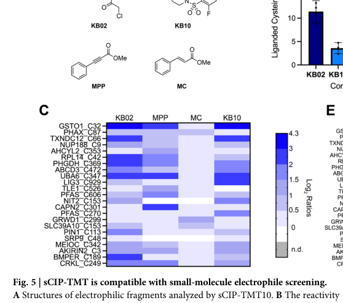

## Question

# Gene Research for Functional Annotation

## ⚠️ CRITICAL: Gene/Protein Identification Context

**BEFORE YOU BEGIN RESEARCH:** You MUST verify you are researching the CORRECT gene/protein. Gene symbols can be ambiguous, especially for less well-characterized genes from non-model organisms.

### Target Gene/Protein Identity (from UniProt):
- **UniProt Accession:** Q53H80
- **Protein Description:** RecName: Full=Akirin-2 {ECO:0000305};
- **Gene Information:** Name=AKIRIN2 {ECO:0000303|PubMed:18066067, ECO:0000312|HGNC:HGNC:21407}; Synonyms=C6orf166 {ECO:0000312|HGNC:HGNC:21407};
- **Organism (full):** Homo sapiens (Human).
- **Protein Family:** Belongs to the akirin family. .
- **Key Domains:** Akirin. (IPR024132)

### MANDATORY VERIFICATION STEPS:

1. **Check if the gene symbol "AKIRIN2" matches the protein description above**
2. **Verify the organism is correct:** Homo sapiens (Human).
3. **Check if protein family/domains align with what you find in literature**
4. **If you find literature for a DIFFERENT gene with the same or similar symbol, STOP**

### If Gene Symbol is Ambiguous or You Cannot Find Relevant Literature:

**DO NOT PROCEED WITH RESEARCH ON A DIFFERENT GENE.** Instead:
- State clearly: "The gene symbol 'AKIRIN2' is ambiguous or literature is limited for this specific protein"
- Explain what you found (e.g., "Found extensive literature on a different gene with the same symbol in a different organism")
- Describe the protein based ONLY on the UniProt information provided above
- Suggest that the protein function can be inferred from domain/family information

### Research Target:

Please provide a comprehensive research report on the gene **AKIRIN2** (gene ID: AKIRIN2, UniProt: Q53H80) in human.

The research report should be a detailed narrative explaining the function, biological processes, and localization of the gene product. Citations should be given for all claims.

You should prioritize authoritative reviews and primary scientific literature when conducting research. You can supplement
this with annotations you find in gene/protein databases, but these can be outdated or inaccurate.

We are specifically interested in the primary function of the gene - for enzymes, what reaction is catalyzed, and what is the substrate specificity? For transporters, what is the substrate? For structural proteins or adapters, what is the broader structural role? For signaling molecules, what is the role in the pathway.

We are interested in where in or outside the cell the gene product carries out its function.

We are also interested in the signaling or biochemical pathways in which the gene functions. We are less interested in broad pleiotropic effects, except where these elucidate the precise role.

Include evidence where possible. We are interested in both experimental evidence as well as inference from structure, evolution, or bioinformatic analysis. Precise studies should be prioritized over high-throughput, where available.

## Output

Question: You are an expert researcher providing comprehensive, well-cited information.

Provide detailed information focusing on:
1. Key concepts and definitions with current understanding
2. Recent developments and latest research (prioritize 2023-2024 sources)
3. Current applications and real-world implementations
4. Expert opinions and analysis from authoritative sources
5. Relevant statistics and data from recent studies

Format as a comprehensive research report with proper citations. Include URLs and publication dates where available.
Always prioritize recent, authoritative sources and provide specific citations for all major claims.

# Gene Research for Functional Annotation

## ⚠️ CRITICAL: Gene/Protein Identification Context

**BEFORE YOU BEGIN RESEARCH:** You MUST verify you are researching the CORRECT gene/protein. Gene symbols can be ambiguous, especially for less well-characterized genes from non-model organisms.

### Target Gene/Protein Identity (from UniProt):
- **UniProt Accession:** Q53H80
- **Protein Description:** RecName: Full=Akirin-2 {ECO:0000305};
- **Gene Information:** Name=AKIRIN2 {ECO:0000303|PubMed:18066067, ECO:0000312|HGNC:HGNC:21407}; Synonyms=C6orf166 {ECO:0000312|HGNC:HGNC:21407};
- **Organism (full):** Homo sapiens (Human).
- **Protein Family:** Belongs to the akirin family. .
- **Key Domains:** Akirin. (IPR024132)

### MANDATORY VERIFICATION STEPS:

1. **Check if the gene symbol "AKIRIN2" matches the protein description above**
2. **Verify the organism is correct:** Homo sapiens (Human).
3. **Check if protein family/domains align with what you find in literature**
4. **If you find literature for a DIFFERENT gene with the same or similar symbol, STOP**

### If Gene Symbol is Ambiguous or You Cannot Find Relevant Literature:

**DO NOT PROCEED WITH RESEARCH ON A DIFFERENT GENE.** Instead:
- State clearly: "The gene symbol 'AKIRIN2' is ambiguous or literature is limited for this specific protein"
- Explain what you found (e.g., "Found extensive literature on a different gene with the same symbol in a different organism")
- Describe the protein based ONLY on the UniProt information provided above
- Suggest that the protein function can be inferred from domain/family information

### Research Target:

Please provide a comprehensive research report on the gene **AKIRIN2** (gene ID: AKIRIN2, UniProt: Q53H80) in human.

The research report should be a detailed narrative explaining the function, biological processes, and localization of the gene product. Citations should be given for all claims.

You should prioritize authoritative reviews and primary scientific literature when conducting research. You can supplement
this with annotations you find in gene/protein databases, but these can be outdated or inaccurate.

We are specifically interested in the primary function of the gene - for enzymes, what reaction is catalyzed, and what is the substrate specificity? For transporters, what is the substrate? For structural proteins or adapters, what is the broader structural role? For signaling molecules, what is the role in the pathway.

We are interested in where in or outside the cell the gene product carries out its function.

We are also interested in the signaling or biochemical pathways in which the gene functions. We are less interested in broad pleiotropic effects, except where these elucidate the precise role.

Include evidence where possible. We are interested in both experimental evidence as well as inference from structure, evolution, or bioinformatic analysis. Precise studies should be prioritized over high-throughput, where available.

## Research report: Human **AKIRIN2** (Akirin-2; UniProt **Q53H80**, gene symbol **AKIRIN2**; synonym **C6orf166**) — functional annotation

### 0) Mandatory identity verification (disambiguation)
The target protein is **human Akirin-2**, encoded by **AKIRIN2** (synonym **C6orf166**) and assigned to the **akirin protein family** (UniProt accession **Q53H80**, per user-provided context). The literature retrieved here is consistent with an **evolutionarily conserved, primarily nuclear, non-enzymatic transcriptional cofactor/adaptor** termed **Akirin2/Akirin-2** (mammals) and **Akirin** (invertebrates), which lacks an obvious DNA-binding motif and functions via protein–protein interactions to connect signaling-dependent transcription factors (notably NF-κB pathway outputs) to chromatin remodeling machinery (tartey2016akirin2mediatedtranscriptionalcontrol pages 5-6, tartey2016akirin2mediatedtranscriptionalcontrol pages 1-2, tartey2016akirin2mediatedtranscriptionalcontrol pages 6-8).

*Scope note:* Much mechanistic evidence comes from **mouse immune cells** and **Drosophila**; these are used to infer human function because the mechanism is described as conserved and directly discussed in the mammalian Akirin2 context (tartey2016akirin2mediatedtranscriptionalcontrol pages 5-6, bonnay2014akirinspecifiesnfκb pages 2-3).

---

### 1) Key concepts and definitions (current understanding)

#### 1.1 What AKIRIN2 is (functional class)
AKIRIN2 is best understood as a **signal-responsive transcriptional cofactor/adaptor** rather than an enzyme, receptor, or transporter. It is described as a **highly conserved nuclear protein** required for **NF-κB-dependent gene expression**, but importantly it contributes to **selective induction of a subset** of NF-κB target genes rather than serving as a universal NF-κB co-activator (tartey2016akirin2mediatedtranscriptionalcontrol pages 5-6, tartey2016akirin2mediatedtranscriptionalcontrol pages 10-11).

Mechanistically, AKIRIN2 is described as linking transcriptional programs to **chromatin remodeling**, particularly **SWI/SNF (BAF) complexes** (tartey2016akirin2mediatedtranscriptionalcontrol pages 1-2, tartey2016akirin2mediatedtranscriptionalcontrol pages 6-8).

#### 1.2 “NF-κB selectivity” and “chromatin remodeling bridge”
A recurring concept is that Akirin proteins confer **NF-κB target gene selectivity** by enabling recruitment of SWI/SNF remodelers at specific promoters. In Drosophila, Akirin physically connects the NF-κB transcription factor **Relish** with the SWI/SNF component **BAP60**, supporting a promoter-bound complex that preferentially activates a subset of immune effector genes (bonnay2014akirinspecifiesnfκb pages 9-11, bonnay2014akirinspecifiesnfκb pages 2-3). The mechanism is presented as evolutionarily conserved, with mammalian Akirin-2 binding BAF60 homologs (bonnay2014akirinspecifiesnfκb pages 9-11).

#### 1.3 Protein features relevant to function
Akirin2 is summarized as lacking obvious DNA-binding motifs, with regions consistent with protein–protein interaction roles (including conserved helical regions), and having an **N-terminal nuclear localization signal**, consistent with its nuclear cofactor role (tartey2016akirin2mediatedtranscriptionalcontrol pages 5-6).

---

### 2) Experimentally supported functions, pathways, partners, and localization

#### 2.1 Core molecular function: adaptor linking NF-κB/IκBζ to SWI/SNF (BAF)
A major experimentally supported model is that Akirin2 helps drive transcription of specific inflammatory genes by **bridging NF-κB pathway components to SWI/SNF chromatin remodelers** (tartey2016akirin2mediatedtranscriptionalcontrol pages 1-2, tartey2016akirin2mediatedtranscriptionalcontrol pages 10-11).

**IκBζ (NFKBIZ)–Akirin2–SWI/SNF axis:** In macrophage contexts, IκBζ is reported to bind Akirin2 (via Akirin2’s C-terminal region) and to cooperate with Akirin2 and **Brg1 (SWI/SNF)** to support promoter recruitment and activation of inflammatory genes including **Il6** and **Il12b** after innate immune stimulation (e.g., LPS/IL-1β/TLR signaling) (tartey2016akirin2mediatedtranscriptionalcontrol pages 6-8, tartey2016akirin2mediatedtranscriptionalcontrol pages 10-11).

This places AKIRIN2 within the **nuclear stage of NF-κB response**, acting downstream of receptor signaling to implement chromatin remodeling–dependent transcriptional programs (tartey2016akirin2mediatedtranscriptionalcontrol pages 5-6, tartey2016akirin2mediatedtranscriptionalcontrol pages 6-8).

#### 2.2 Immune-cell biology: B cell activation programs
In B cells, Akirin2 is described as required for recruitment of **Brg1** to promoters such as **Myc** and **Ccnd2** after **CD40** stimulation, supporting expression of proliferative and survival genes (e.g., **Myc**, **Ccnd1/2**, **Bcl2**, **Bcl-xL**) and thereby influencing B-cell proliferation/survival and antibody responses (tartey2016akirin2mediatedtranscriptionalcontrol pages 6-8, tartey2016akirin2mediatedtranscriptionalcontrol pages 8-10).

#### 2.3 Developmental essentiality (strong genetic evidence from mouse)
Akirin2 is described as **essential for embryonic development**, with knockout lethality by embryonic day **E9.5** in mice, consistent with a fundamental role in transcriptional regulation (tartey2016akirin2mediatedtranscriptionalcontrol pages 5-6).

#### 2.4 Promoter-context selectivity (epigenetic logic)
Akirin2-dependent genes are summarized as enriched among promoters with **lower CpG-island density**, suggesting that some promoters may require Akirin2-dependent SWI/SNF remodeling for activation, providing one mechanistic explanation for **selective** NF-κB gene induction (tartey2016akirin2mediatedtranscriptionalcontrol pages 5-6, tartey2016akirin2mediatedtranscriptionalcontrol pages 6-8).

#### 2.5 Subcellular localization
Akirin2 is repeatedly described as **nuclear** in mechanistic reviews, consistent with its role in transcriptional control and chromatin remodeling (tartey2016akirin2mediatedtranscriptionalcontrol pages 5-6, tartey2016akirin2mediatedtranscriptionalcontrol pages 1-2, tartey2016akirin2mediatedtranscriptionalcontrol pages 10-11). In a cancer drug-resistance context (CML), increased **nuclear accumulation** of Akirin-2 in imatinib-resistant cells was reported (without numeric fold-change in retrieved excerpts) (karabay2018expressionanalysisof pages 7-7).

---

### 3) Recent developments (prioritizing 2023–2024)

#### 3.1 2024 chemoproteomics: a newly observed ligandable cysteine in AKIRIN2
A 2024 chemoproteomics study (Burton & Backus, *Communications Chemistry*, **published Apr 2024**; https://doi.org/10.1038/s42004-024-01162-x) reported **AKIRIN2 Cys3** among **“uniquely liganded”** cysteines detected by their sCIP-TMT workflow, and noted this residue is proximal to a **20S proteasome binding motif** (burton2024functionalizingtandemmass pages 5-7).

Quantitatively in that dataset: they report **29** uniquely liganded cysteines in the study; and that **760/789** liganded cysteines had prior support in CysDB, highlighting that AKIRIN2 Cys3 belonged to a small set of newly observed ligandable sites (burton2024functionalizingtandemmass pages 5-7). Figure evidence for AKIRIN2 Cys3 being listed among uniquely liganded cysteines is shown in their Figure 5C (burton2024functionalizingtandemmass media b5b8243d, burton2024functionalizingtandemmass media 0c97aa47).

*Interpretation:* This is not direct functional enzymology (AKIRIN2 is not an enzyme) but provides **chemical tractability/ligandability** data that could enable future chemical biology tools (burton2024functionalizingtandemmass pages 5-7).

#### 3.2 2024 transcriptional meta-analysis: AKIRIN2 as a conditional NRF2-responsive gene
A 2024 study (Luo et al., *Antioxidants & Redox Signaling*, **Dec 2024**; https://doi.org/10.1089/ars.2023.0409) derived a “core NRF2” transcriptional signature from **seven RNA-seq datasets** and reported that **AKIRIN2** was **primarily upregulated in drug-mediated NRF2 activation contexts**, but not consistently upregulated in some cancer cohort/cell line datasets (e.g., TCGA LUAD/NSCLC analyses mentioned in the excerpt) (luo2024acorenrf2 pages 4-7).

*Interpretation:* This supports AKIRIN2 as a context-dependent oxidative-stress/Nrf2-responsive transcript in some settings, but does not by itself establish direct NRF2 binding at AKIRIN2 regulatory elements (luo2024acorenrf2 pages 4-7).

#### 3.3 2023–2024 updates on the IκBζ axis (contextual, not AKIRIN2-specific in retrieved excerpt)
A 2024 review on IκBζ (Yamazaki, *Cells*, **Aug 2024**; https://doi.org/10.3390/cells13171467) reinforces that IκBζ supports selective NF-κB target gene induction through SWI/SNF-dependent chromatin remodeling (including examples such as IL6/LCN2 and dependence on BRG1 recruitment), which is mechanistically consistent with the previously described IκBζ–Akirin2–SWI/SNF framework (yamazaki2024thenuclearnfκb pages 4-6). However, the retrieved excerpt does **not** explicitly mention Akirin2/AKIRIN2 by name, so it mainly strengthens the pathway background rather than directly updating AKIRIN2-specific mechanisms (yamazaki2024thenuclearnfκb pages 4-6).

---

### 4) Current applications and real-world implementations

#### 4.1 Translational relevance: cancer-associated expression and resistance phenotypes
AKIRIN2 has been linked to tumor phenotypes in multiple models. A review summary describes Akirin2 as implicated as an oncogene and notes overexpression in tumor cell lines, where knockdown/antisense approaches reduced growth/tumorigenicity/metastasis in models and increased cell death susceptibility in glioblastoma lines (tartey2016akirin2mediatedtranscriptionalcontrol pages 5-6). In chronic myeloid leukemia models, increased nuclear accumulation of Akirin-2 in imatinib-resistant cells was proposed as a potential biomarker (karabay2018expressionanalysisof pages 7-7).

*Implementation status:* These are primarily **preclinical** or biomarker-proposal level findings; no AKIRIN2-targeted therapy is established in the retrieved evidence.

#### 4.2 Chemical biology opportunity: ligandability at Cys3
The 2024 sCIP-TMT chemoproteomics finding (AKIRIN2 Cys3 ligandability) provides a practical foothold for developing **covalent probes** to interrogate AKIRIN2 function or interactions in cells (burton2024functionalizingtandemmass pages 5-7, burton2024functionalizingtandemmass media b5b8243d).

#### 4.3 Systems biology signatures: NRF2 activation scoring
The 2024 NRF2 signature work includes AKIRIN2 as a conditional NRF2-induced gene in drug-activation settings, implying AKIRIN2 may appear in **transcriptomic readouts** of oxidative-stress responses in some perturbation screens (luo2024acorenrf2 pages 4-7).

---

### 5) Expert opinions / authoritative synthesis
A focused immunology review explicitly frames Akirin2 as a central nuclear cofactor that mediates transcriptional programs by recruiting SWI/SNF chromatin remodeling, emphasizing its role as a bridge linking signaling-induced transcription factors to chromatin remodeling machinery and driving selective NF-κB-dependent transcription (Tartey & Takeuchi, *Crit Rev Immunol*, **Jan 2016**, https://doi.org/10.1615/critrevimmunol.2017019629) (tartey2016akirin2mediatedtranscriptionalcontrol pages 1-2, tartey2016akirin2mediatedtranscriptionalcontrol pages 10-11). Although not new, this remains one of the clearest authoritative mechanistic syntheses in the retrieved corpus.

A key conceptual advance from the Drosophila EMBO Journal study is the “molecular selector” model—Akirin defining NF-κB target subset choice via chromatin remodeling—explicitly presented as conserved in mammals, supporting its relevance to human AKIRIN2 annotation (Bonnay et al., *EMBO J*, **Sep 2014**, https://doi.org/10.15252/embj.201488456) (bonnay2014akirinspecifiesnfκb pages 9-11, bonnay2014akirinspecifiesnfκb pages 2-3).

---

### 6) Relevant statistics and quantitative findings (from retrieved recent and foundational studies)
- **Gene selectivity (Drosophila):** Akirin required for **9 of 41** Relish-dependent immune-related genes; Akirin alone required for activation of **31** genes independently of Relish; loss caused derepression/overexpression of **205** genes (Bonnay et al. 2014) (bonnay2014akirinspecifiesnfκb pages 2-3).
- **Chemoproteomics coverage (2024):** **29** uniquely liganded cysteines identified in the sCIP-TMT study; **760/789** liganded cysteines had prior identification in CysDB; AKIRIN2 Cys3 was among “previously unreported liganded sites” (Burton & Backus 2024) (burton2024functionalizingtandemmass pages 5-7).
- **NRF2 signature construction (2024):** Seven transcriptomic datasets generated/analyzed to derive a candidate core NRF2 gene set; AKIRIN2 highlighted as conditionally induced in drug-mediated NRF2 activation but not consistently across LUAD/NSCLC datasets described in excerpt (Luo et al. 2024) (luo2024acorenrf2 pages 4-7).

---

## Consolidated evidence table
| Functional claim | Mechanism/partners/pathway | Cell/tissue/model | Key experimental evidence type | Quantitative/statistical detail (if available) | Primary source with publication date and URL/DOI | Notes (strength/limitations/species ambiguity) |
|---|---|---|---|---|---|---|
| Human AKIRIN2 (UniProt Q53H80) is the conserved nuclear Akirin-2 protein in the akirin family and functions primarily as a transcriptional cofactor rather than a DNA-binding enzyme or receptor | Lacks obvious DNA/RNA-binding motifs; contains N-terminal nuclear localization signal and conserved helical regions; acts through protein-protein interactions to couple NF-κB-responsive factors to chromatin remodeling machinery | Mammals/human ortholog context summarized from mouse and immune-cell studies | Review synthesis of KO/knockdown, promoter studies, interaction studies | Mouse Akirin2 knockout causes embryonic lethality by E9.5 | Tartey & Takeuchi, *Crit Rev Immunol* (Jan 2016), https://doi.org/10.1615/CritRevImmunol.2017019629 (tartey2016akirin2mediatedtranscriptionalcontrol pages 5-6, tartey2016akirin2mediatedtranscriptionalcontrol pages 1-2) | Strong mechanistic review grounded in primary studies; some evidence is from mouse rather than direct human experiments |
| AKIRIN2 is required for selective, not global, NF-κB-dependent transcription | Bridges NF-κB pathway output to SWI/SNF (BAF/Brg1) chromatin remodeling, enabling induction of specific inflammatory genes after TLR/IL-1/TNF signaling | Mouse embryonic fibroblasts, macrophages, B cells | Genetic KO/conditional deletion, promoter recruitment, transcriptional analysis | Selective defect in a subset of inducible genes rather than pan-NF-κB failure; promoters with lower CpG-island density are enriched among Akirin2-dependent genes | Tartey & Takeuchi, *Crit Rev Immunol* (Jan 2016), https://doi.org/10.1615/CritRevImmunol.2017019629 (tartey2016akirin2mediatedtranscriptionalcontrol pages 5-6, tartey2016akirin2mediatedtranscriptionalcontrol pages 6-8, tartey2016akirin2mediatedtranscriptionalcontrol pages 8-10, tartey2016akirin2mediatedtranscriptionalcontrol pages 10-11) | High-value functional annotation for human AKIRIN2 by orthology/conservation; quantitative fold changes were not provided in the retrieved excerpts |
| AKIRIN2 cooperates with IκBζ (NFKBIZ) and SWI/SNF to activate inflammatory promoters | IκBζ binds the C-terminal region of Akirin2; IκBζ-Akirin2-SWI/SNF complex interacts with NF-κB p50 and supports recruitment to Il6 and Il12b promoters after LPS/IL-1β/TLR stimulation | Macrophages | ChIP/recruitment studies, interaction mapping, stimulus-response transcription assays | No numeric recruitment values in retrieved excerpt; mechanistic link reported for Il6 and Il12b promoters | Tartey & Takeuchi, *Crit Rev Immunol* (Jan 2016), https://doi.org/10.1615/CritRevImmunol.2017019629 (tartey2016akirin2mediatedtranscriptionalcontrol pages 6-8, tartey2016akirin2mediatedtranscriptionalcontrol pages 10-11) | Strong pathway-specific mechanism; evidence is largely from mouse/immune-cell literature but directly relevant to conserved human AKIRIN2 function |
| AKIRIN2 supports B-cell activation and survival programs | Required for Brg1 recruitment to Myc and Ccnd2 promoters after CD40 stimulation; supports expression of Myc, Ccnd1, Ccnd2, Bcl2 and Bcl-xL | B cells | Conditional deletion, promoter recruitment, transcriptional profiling | Loss of Akirin2 severely impairs T-cell-dependent and T-cell-independent antibody responses; decreased splenic follicular and marginal zone B cells | Tartey & Takeuchi, *Crit Rev Immunol* (Jan 2016), https://doi.org/10.1615/CritRevImmunol.2017019629 (tartey2016akirin2mediatedtranscriptionalcontrol pages 6-8, tartey2016akirin2mediatedtranscriptionalcontrol pages 8-10) | Useful for immune-function annotation; retrieved evidence did not include exact cell-count statistics |
| Akirin proteins act as molecular selectors that confer NF-κB target-gene specificity through chromatin remodeling, a mechanism conserved to mammals | In Drosophila, Akirin binds Relish and BAP60 (SWI/SNF/BAP), forming a bridge to remodel chromatin at selected promoters; authors note conservation with mouse Akirin-2 binding BAF60 homologs | Drosophila innate immune system with mammalian conservation inference | Genome-wide expression analysis, proteomics, interaction studies, infection phenotyping | Akirin required for 9 of 41 Relish-dependent immune-related genes; Akirin alone required for 31 genes independently of Relish; loss caused derepression/overexpression of 205 genes | Bonnay et al., *EMBO Journal* (Sep 2014), https://doi.org/10.15252/embj.201488456 (bonnay2014akirinspecifiesnfκb pages 9-11, bonnay2014akirinspecifiesnfκb pages 2-3) | Not human-specific, but highly informative for conserved Akirin biology; should be used as evolutionary/mechanistic support, not as sole human evidence |
| AKIRIN2 contains a newly observed ligandable cysteine near a proteasome-related motif, suggesting potential chemical tractability | Chemoproteomics identified AKIRIN2 Cys3 as a uniquely liganded cysteine; text notes proximity to the 20S proteasome binding motif | Human proteome-scale chemoproteomics dataset | Chemoproteomics (sCIP-TMT), Figure 5C | 29 uniquely liganded cysteines identified in study; 760/789 liganded cysteines had prior CysDB support, placing AKIRIN2 Cys3 among newly observed sites | Burton & Backus, *Communications Chemistry* (Apr 2024), https://doi.org/10.1038/s42004-024-01162-x (burton2024functionalizingtandemmass pages 5-7, burton2024functionalizingtandemmass media b5b8243d, burton2024functionalizingtandemmass media 0c97aa47) | Important recent finding, but it does not establish AKIRIN2 biochemical function or therapeutic efficacy; ligandability ≠ validated drug target |
| AKIRIN2 can behave as a conditional NRF2-responsive gene in some pharmacologic activation contexts | AKIRIN2 was induced mainly in drug-mediated NRF2 activation datasets, but not consistently in TCGA LUAD or NSCLC cell-line analyses; thus not part of the most universal core NRF2 output | Multiple transcriptomic datasets including pharmacologic CDDO-2P-Im treatment and genetic KEAP1-knockout models | RNA-seq / transcriptomic meta-analysis | Seven transcriptomic databases used to derive a 15-gene candidate NRF2 core set; AKIRIN2 highlighted as conditionally induced rather than universally upregulated | Luo et al., *Antioxidants & Redox Signaling* (Dec 2024), https://doi.org/10.1089/ars.2023.0409 (luo2024acorenrf2 pages 4-7) | Recent and useful for regulatory context; this is association/expression evidence, not proof of direct NRF2 binding to AKIRIN2 regulatory DNA |
| 2024 IκBζ review reinforces the SWI/SNF-dependent selective NF-κB transcription mechanism relevant to AKIRIN2, but the retrieved excerpt does not explicitly mention Akirin2 | IκBζ promotes BRG1/SWI/SNF recruitment and chromatin remodeling at secondary NF-κB target genes such as IL6/LCN2, with p50 preference and promoter motif selectivity | Inflammatory gene regulation context | Review synthesis of ChIP/ATAC/structural studies | BRG1 recruitment to Lcn2 promoter is abolished without IκBζ; no AKIRIN2-specific quantitative measure in excerpt | Yamazaki, *Cells* (Aug 2024), https://doi.org/10.3390/cells13171467 (yamazaki2024thenuclearnfκb pages 4-6) | Useful contextual support for the IκBζ arm of the pathway; limitation: excerpt did not directly mention AKIRIN2, so it supports pathway context more than direct annotation |
| FBI1/Akirin2 has tumor-related functions in liver-cancer models, but this evidence is not specific to human AKIRIN2 and should be interpreted cautiously | Reported as a 14-3-3β-binding protein that sustains ERK1/2 activation by suppressing MKP-1; silencing FBI1/Akirin2 increases Lu/BCAM expression, consistent with Lu/BCAM as a possible downstream target | Rat hepatoma / rat liver cancer cells | Review citing functional silencing/overexpression studies | No exact effect sizes in retrieved excerpt; claim is qualitative (increased Lu/BCAM on Akirin2 silencing; reduced colony formation/migration/invasion with Lu/BCAM overexpression) | Jin et al., *Int J Mol Sci* (Jul 2024), https://doi.org/10.3390/ijms25137268 (jin2024theroleof pages 5-6, jin2024theroleof pages 8-10) | Important caveat: these findings concern rat cells/ortholog context and FBI1 alias usage; not sufficient alone for direct human AKIRIN2 functional annotation |
| AKIRIN2 has been implicated in cancer-associated phenotypes and nuclear accumulation in resistance states | Conserved nuclear NF-κB cofactor; increased nuclear AKIRIN2 reported in imatinib-resistant CML cells; related literature links AKIRIN2/FBI1 to tumorigenicity/metastasis and glioblastoma chemosensitivity | Human CML cells; broader tumor-cell literature summarized | Expression analysis, nuclear protein localization, literature synthesis | Increased nuclear accumulation in resistant cells reported, but no exact fold-change in retrieved excerpt | Karabay et al., *Hematology* (Jun 2018), https://doi.org/10.1080/10245332.2018.1488795 (karabay2018expressionanalysisof pages 7-7) | Human disease relevance is suggestive, but this is downstream/association-heavy and not the strongest source for core molecular function |

*Table: This table summarizes experimentally supported and recent literature-based functional annotation evidence for human AKIRIN2 (UniProt Q53H80), including core mechanism, pathway context, localization/function in immune transcription, and recent 2024 omics/chemoproteomics findings. It also flags species and evidence-strength limitations where the literature is indirect or ortholog-based.*

---

## Conclusion (functional annotation summary)
Across mechanistic immunology literature and conserved invertebrate models, the primary function of human **AKIRIN2 (Akirin-2; Q53H80)** is best annotated as a **nuclear transcriptional cofactor/adaptor** that confers **selective activation of NF-κB-dependent gene programs** by partnering with **IκBζ (NFKBIZ)** and recruiting **SWI/SNF (BAF/BRG1) chromatin remodeling complexes** to specific promoters (tartey2016akirin2mediatedtranscriptionalcontrol pages 6-8, tartey2016akirin2mediatedtranscriptionalcontrol pages 10-11). Recent 2024 work extends AKIRIN2’s practical research relevance by identifying **AKIRIN2 Cys3** as a **ligandable site** in human proteome chemoproteomics (potential for probe development) and by situating AKIRIN2 as a **context-dependent NRF2-responsive gene** in pharmacologic activation datasets (burton2024functionalizingtandemmass pages 5-7, luo2024acorenrf2 pages 4-7).

References

1. (tartey2016akirin2mediatedtranscriptionalcontrol pages 5-6): Sarang Tartey and Osamu Takeuchi. Akirin2-mediated transcriptional control by recruiting swi/snf complex in b cells. Critical reviews in immunology, 36 5:395-406, Jan 2016. URL: https://doi.org/10.1615/critrevimmunol.2017019629, doi:10.1615/critrevimmunol.2017019629. This article has 8 citations and is from a peer-reviewed journal.

2. (tartey2016akirin2mediatedtranscriptionalcontrol pages 1-2): Sarang Tartey and Osamu Takeuchi. Akirin2-mediated transcriptional control by recruiting swi/snf complex in b cells. Critical reviews in immunology, 36 5:395-406, Jan 2016. URL: https://doi.org/10.1615/critrevimmunol.2017019629, doi:10.1615/critrevimmunol.2017019629. This article has 8 citations and is from a peer-reviewed journal.

3. (tartey2016akirin2mediatedtranscriptionalcontrol pages 6-8): Sarang Tartey and Osamu Takeuchi. Akirin2-mediated transcriptional control by recruiting swi/snf complex in b cells. Critical reviews in immunology, 36 5:395-406, Jan 2016. URL: https://doi.org/10.1615/critrevimmunol.2017019629, doi:10.1615/critrevimmunol.2017019629. This article has 8 citations and is from a peer-reviewed journal.

4. (bonnay2014akirinspecifiesnfκb pages 2-3): François Bonnay, Xuan‐Hung Nguyen, Eva Cohen‐Berros, Laurent Troxler, Eric Batsche, Jacques Camonis, Osamu Takeuchi, Jean‐Marc Reichhart, and Nicolas Matt. Akirin specifies nf-κb selectivity of drosophila innate immune response via chromatin remodeling. The EMBO Journal, 33:2349-2362, Sep 2014. URL: https://doi.org/10.15252/embj.201488456, doi:10.15252/embj.201488456. This article has 124 citations.

5. (tartey2016akirin2mediatedtranscriptionalcontrol pages 10-11): Sarang Tartey and Osamu Takeuchi. Akirin2-mediated transcriptional control by recruiting swi/snf complex in b cells. Critical reviews in immunology, 36 5:395-406, Jan 2016. URL: https://doi.org/10.1615/critrevimmunol.2017019629, doi:10.1615/critrevimmunol.2017019629. This article has 8 citations and is from a peer-reviewed journal.

6. (bonnay2014akirinspecifiesnfκb pages 9-11): François Bonnay, Xuan‐Hung Nguyen, Eva Cohen‐Berros, Laurent Troxler, Eric Batsche, Jacques Camonis, Osamu Takeuchi, Jean‐Marc Reichhart, and Nicolas Matt. Akirin specifies nf-κb selectivity of drosophila innate immune response via chromatin remodeling. The EMBO Journal, 33:2349-2362, Sep 2014. URL: https://doi.org/10.15252/embj.201488456, doi:10.15252/embj.201488456. This article has 124 citations.

7. (tartey2016akirin2mediatedtranscriptionalcontrol pages 8-10): Sarang Tartey and Osamu Takeuchi. Akirin2-mediated transcriptional control by recruiting swi/snf complex in b cells. Critical reviews in immunology, 36 5:395-406, Jan 2016. URL: https://doi.org/10.1615/critrevimmunol.2017019629, doi:10.1615/critrevimmunol.2017019629. This article has 8 citations and is from a peer-reviewed journal.

8. (karabay2018expressionanalysisof pages 7-7): Arzu Zeynep Karabay, Asli Koc, Tulin Ozkan, Yalda Hekmatshoar, Buket Altinok Gunes, Asuman Sunguroglu, Zeliha Buyukbingol, Arzu Atalay, and Fugen Aktan. Expression analysis of akirin-2, nfκb-p65 and β-catenin proteins in imatinib resistance of chronic myeloid leukemia. Hematology, 23:765-770, Jun 2018. URL: https://doi.org/10.1080/10245332.2018.1488795, doi:10.1080/10245332.2018.1488795. This article has 21 citations and is from a peer-reviewed journal.

9. (burton2024functionalizingtandemmass pages 5-7): Nikolas R. Burton and Keriann M. Backus. Functionalizing tandem mass tags for streamlining click-based quantitative chemoproteomics. Communications Chemistry, Apr 2024. URL: https://doi.org/10.1038/s42004-024-01162-x, doi:10.1038/s42004-024-01162-x. This article has 17 citations and is from a peer-reviewed journal.

10. (burton2024functionalizingtandemmass media b5b8243d): Nikolas R. Burton and Keriann M. Backus. Functionalizing tandem mass tags for streamlining click-based quantitative chemoproteomics. Communications Chemistry, Apr 2024. URL: https://doi.org/10.1038/s42004-024-01162-x, doi:10.1038/s42004-024-01162-x. This article has 17 citations and is from a peer-reviewed journal.

11. (burton2024functionalizingtandemmass media 0c97aa47): Nikolas R. Burton and Keriann M. Backus. Functionalizing tandem mass tags for streamlining click-based quantitative chemoproteomics. Communications Chemistry, Apr 2024. URL: https://doi.org/10.1038/s42004-024-01162-x, doi:10.1038/s42004-024-01162-x. This article has 17 citations and is from a peer-reviewed journal.

12. (luo2024acorenrf2 pages 4-7): George Luo, Harshita Kumar, Kristin Aldridge, Stevie Rieger, EunHyang Han, Ethan Jiang, Ernest R. Chan, Ahmed Soliman, Haider Mahdi, and John J. Letterio. A core nrf2 gene set defined through comprehensive transcriptomic analysis predicts selective drug resistance and poor multicancer prognosis. Dec 2024. URL: https://doi.org/10.1089/ars.2023.0409, doi:10.1089/ars.2023.0409. This article has 13 citations and is from a domain leading peer-reviewed journal.

13. (yamazaki2024thenuclearnfκb pages 4-6): Soh Yamazaki. The nuclear nf-κb regulator iκbζ: updates on its molecular functions and pathophysiological roles. Cells, 13:1467, Aug 2024. URL: https://doi.org/10.3390/cells13171467, doi:10.3390/cells13171467. This article has 19 citations.

14. (jin2024theroleof pages 5-6): Juan Jin, Qinqin Guo, and Zhibin Yan. The role of lutheran/basal cell adhesion molecule in hematological diseases and tumors. International Journal of Molecular Sciences, 25:7268, Jul 2024. URL: https://doi.org/10.3390/ijms25137268, doi:10.3390/ijms25137268. This article has 6 citations.

15. (jin2024theroleof pages 8-10): Juan Jin, Qinqin Guo, and Zhibin Yan. The role of lutheran/basal cell adhesion molecule in hematological diseases and tumors. International Journal of Molecular Sciences, 25:7268, Jul 2024. URL: https://doi.org/10.3390/ijms25137268, doi:10.3390/ijms25137268. This article has 6 citations.

## Artifacts

- [Edison artifact artifact-00](AKIRIN2-deep-research-falcon_artifacts/artifact-00.md)

## Citations

1. karabay2018expressionanalysisof pages 7-7
2. burton2024functionalizingtandemmass pages 5-7
3. jin2024theroleof pages 5-6
4. jin2024theroleof pages 8-10
5. https://doi.org/10.1038/s42004-024-01162-x
6. https://doi.org/10.1089/ars.2023.0409
7. https://doi.org/10.3390/cells13171467
8. https://doi.org/10.1615/critrevimmunol.2017019629
9. https://doi.org/10.15252/embj.201488456
10. https://doi.org/10.1615/CritRevImmunol.2017019629
11. https://doi.org/10.3390/ijms25137268
12. https://doi.org/10.1080/10245332.2018.1488795
13. https://doi.org/10.1615/critrevimmunol.2017019629,
14. https://doi.org/10.15252/embj.201488456,
15. https://doi.org/10.1080/10245332.2018.1488795,
16. https://doi.org/10.1038/s42004-024-01162-x,
17. https://doi.org/10.1089/ars.2023.0409,
18. https://doi.org/10.3390/cells13171467,
19. https://doi.org/10.3390/ijms25137268,