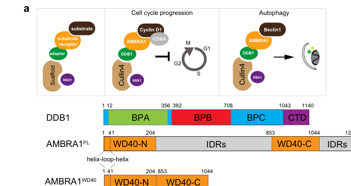

## Question

# Gene Research for Functional Annotation

## ⚠️ CRITICAL: Gene/Protein Identification Context

**BEFORE YOU BEGIN RESEARCH:** You MUST verify you are researching the CORRECT gene/protein. Gene symbols can be ambiguous, especially for less well-characterized genes from non-model organisms.

### Target Gene/Protein Identity (from UniProt):
- **UniProt Accession:** Q9C0C7
- **Protein Description:** RecName: Full=Activating molecule in BECN1-regulated autophagy protein 1 {ECO:0000303|PubMed:17589504}; AltName: Full=DDB1- and CUL4-associated factor 3 {ECO:0000303|PubMed:16949367};
- **Gene Information:** Name=AMBRA1 {ECO:0000303|PubMed:17589504, ECO:0000312|HGNC:HGNC:25990}; Synonyms=DCAF3 {ECO:0000303|PubMed:16949367}, KIAA1736 {ECO:0000303|PubMed:11214970};
- **Organism (full):** Homo sapiens (Human).
- **Protein Family:** Belongs to the WD repeat AMBRA1 family. .
- **Key Domains:** AMBRA1_autophagy. (IPR052596); WD40/YVTN_repeat-like_dom_sf. (IPR015943); WD40_repeat_CS. (IPR019775); WD40_repeat_dom_sf. (IPR036322); WD40_rpt. (IPR001680)

### MANDATORY VERIFICATION STEPS:

1. **Check if the gene symbol "AMBRA1" matches the protein description above**
2. **Verify the organism is correct:** Homo sapiens (Human).
3. **Check if protein family/domains align with what you find in literature**
4. **If you find literature for a DIFFERENT gene with the same or similar symbol, STOP**

### If Gene Symbol is Ambiguous or You Cannot Find Relevant Literature:

**DO NOT PROCEED WITH RESEARCH ON A DIFFERENT GENE.** Instead:
- State clearly: "The gene symbol 'AMBRA1' is ambiguous or literature is limited for this specific protein"
- Explain what you found (e.g., "Found extensive literature on a different gene with the same symbol in a different organism")
- Describe the protein based ONLY on the UniProt information provided above
- Suggest that the protein function can be inferred from domain/family information

### Research Target:

Please provide a comprehensive research report on the gene **AMBRA1** (gene ID: AMBRA1, UniProt: Q9C0C7) in human.

The research report should be a detailed narrative explaining the function, biological processes, and localization of the gene product. Citations should be given for all claims.

You should prioritize authoritative reviews and primary scientific literature when conducting research. You can supplement
this with annotations you find in gene/protein databases, but these can be outdated or inaccurate.

We are specifically interested in the primary function of the gene - for enzymes, what reaction is catalyzed, and what is the substrate specificity? For transporters, what is the substrate? For structural proteins or adapters, what is the broader structural role? For signaling molecules, what is the role in the pathway.

We are interested in where in or outside the cell the gene product carries out its function.

We are also interested in the signaling or biochemical pathways in which the gene functions. We are less interested in broad pleiotropic effects, except where these elucidate the precise role.

Include evidence where possible. We are interested in both experimental evidence as well as inference from structure, evolution, or bioinformatic analysis. Precise studies should be prioritized over high-throughput, where available.

## Output

Question: You are an expert researcher providing comprehensive, well-cited information.

Provide detailed information focusing on:
1. Key concepts and definitions with current understanding
2. Recent developments and latest research (prioritize 2023-2024 sources)
3. Current applications and real-world implementations
4. Expert opinions and analysis from authoritative sources
5. Relevant statistics and data from recent studies

Format as a comprehensive research report with proper citations. Include URLs and publication dates where available.
Always prioritize recent, authoritative sources and provide specific citations for all major claims.

# Gene Research for Functional Annotation

## ⚠️ CRITICAL: Gene/Protein Identification Context

**BEFORE YOU BEGIN RESEARCH:** You MUST verify you are researching the CORRECT gene/protein. Gene symbols can be ambiguous, especially for less well-characterized genes from non-model organisms.

### Target Gene/Protein Identity (from UniProt):
- **UniProt Accession:** Q9C0C7
- **Protein Description:** RecName: Full=Activating molecule in BECN1-regulated autophagy protein 1 {ECO:0000303|PubMed:17589504}; AltName: Full=DDB1- and CUL4-associated factor 3 {ECO:0000303|PubMed:16949367};
- **Gene Information:** Name=AMBRA1 {ECO:0000303|PubMed:17589504, ECO:0000312|HGNC:HGNC:25990}; Synonyms=DCAF3 {ECO:0000303|PubMed:16949367}, KIAA1736 {ECO:0000303|PubMed:11214970};
- **Organism (full):** Homo sapiens (Human).
- **Protein Family:** Belongs to the WD repeat AMBRA1 family. .
- **Key Domains:** AMBRA1_autophagy. (IPR052596); WD40/YVTN_repeat-like_dom_sf. (IPR015943); WD40_repeat_CS. (IPR019775); WD40_repeat_dom_sf. (IPR036322); WD40_rpt. (IPR001680)

### MANDATORY VERIFICATION STEPS:

1. **Check if the gene symbol "AMBRA1" matches the protein description above**
2. **Verify the organism is correct:** Homo sapiens (Human).
3. **Check if protein family/domains align with what you find in literature**
4. **If you find literature for a DIFFERENT gene with the same or similar symbol, STOP**

### If Gene Symbol is Ambiguous or You Cannot Find Relevant Literature:

**DO NOT PROCEED WITH RESEARCH ON A DIFFERENT GENE.** Instead:
- State clearly: "The gene symbol 'AMBRA1' is ambiguous or literature is limited for this specific protein"
- Explain what you found (e.g., "Found extensive literature on a different gene with the same symbol in a different organism")
- Describe the protein based ONLY on the UniProt information provided above
- Suggest that the protein function can be inferred from domain/family information

### Research Target:

Please provide a comprehensive research report on the gene **AMBRA1** (gene ID: AMBRA1, UniProt: Q9C0C7) in human.

The research report should be a detailed narrative explaining the function, biological processes, and localization of the gene product. Citations should be given for all claims.

You should prioritize authoritative reviews and primary scientific literature when conducting research. You can supplement
this with annotations you find in gene/protein databases, but these can be outdated or inaccurate.

We are specifically interested in the primary function of the gene - for enzymes, what reaction is catalyzed, and what is the substrate specificity? For transporters, what is the substrate? For structural proteins or adapters, what is the broader structural role? For signaling molecules, what is the role in the pathway.

We are interested in where in or outside the cell the gene product carries out its function.

We are also interested in the signaling or biochemical pathways in which the gene functions. We are less interested in broad pleiotropic effects, except where these elucidate the precise role.

Include evidence where possible. We are interested in both experimental evidence as well as inference from structure, evolution, or bioinformatic analysis. Precise studies should be prioritized over high-throughput, where available.

## Research Report: Human AMBRA1 (UniProt Q9C0C7) — Functional Annotation and Recent Advances

### 0) Target verification (identity and scope)
The research target is **human AMBRA1** (UniProt **Q9C0C7**), whose canonical description is “Activating molecule in BECN1-regulated autophagy protein 1” and which is also known as **DCAF3**, a **DDB1–CUL4-associated factor** and substrate receptor in **CRL4 (CUL4–DDB1–RBX1)** ubiquitin ligase complexes (rienzo2024roleofambra1 pages 2-3, liu2021ambra1promotestgfβ pages 5-6). Recent structural work explicitly models AMBRA1 using the UniProt entry **AF-Q9C0C7-F1** and deposits a DDB1–AMBRA1 structure (PDB **8WQR**) (liu2023structureofthe pages 10-11, liu2023structureofthe pages 1-2). These data collectively confirm that the literature summarized here pertains to the correct **Homo sapiens AMBRA1/Q9C0C7** protein.

---

### 1) Key concepts and definitions (current understanding)

#### 1.1 AMBRA1 as an autophagy initiation scaffold (“autophagy network adaptor”)
**AMBRA1 is best understood as a multifunctional scaffold/adaptor** that coordinates early steps of macroautophagy by organizing protein complexes and post-translational regulation upstream of autophagosome biogenesis, particularly around the **BECN1–PIK3C3/VPS34** class III PI3-kinase system and the **ULK1** complex (rienzo2024roleofambra1 pages 2-3, rienzo2024roleofambra1 pages 3-5, cianfanelli2015ambra1ata pages 2-3). In this framework, AMBRA1 contributes to the **assembly/activation** of autophagy initiation machinery and supports signal-responsive relocalization to membrane sites where autophagosomes form (rienzo2024roleofambra1 pages 3-5, cianfanelli2015ambra1ata pages 2-3).

#### 1.2 AMBRA1 as a CRL4 substrate receptor (DCAF3): ubiquitination logic
In ubiquitin-proteasome system terminology, AMBRA1 is a **substrate receptor** in the **CRL4** family (CUL4-based cullin–RING ligases), where **DDB1** is the adaptor and AMBRA1 provides substrate specificity (“DCAF3”) (liu2021ambra1promotestgfβ pages 5-6, liu2023structureofthe pages 1-2). Importantly, CRL4–AMBRA1 can mediate:
- **Degradative ubiquitination** of certain substrates (e.g., D-type cyclins), controlling protein stability and cell-cycle progression (simoneschi2021crl4ambra1isa pages 1-2).
- **Nonproteolytic polyubiquitylation** that modulates activity rather than degradation (e.g., Smad4 to enhance TGFβ transcriptional responses) (liu2021ambra1promotestgfβ pages 5-6).

#### 1.3 Mitophagy: AMBRA1 as an LC3-binding receptor/scaffold
AMBRA1 is also described as a mitophagy regulator with a defined **LC3-interacting region (LIR)** near the C-terminus, enabling coupling to ATG8-family proteins (LC3) and linking mitochondrial damage signaling to autophagic engulfment processes (li2022ambra1andits pages 3-5, rienzo2024roleofambra1 pages 3-5). A key phosphosite in this region (reviewed as **S1043**) is connected to promoting AMBRA1–LC3 interaction (rienzo2024roleofambra1 pages 3-5, rienzo2024roleofambra1 pages 2-3).

---

### 2) Molecular function, domains/structure, and interaction network

#### 2.1 Domain architecture and disorder/structure
A central contemporary concept is that AMBRA1 is largely **intrinsically disordered**, yet contains structured regions that form a **“split” WD40 domain**. Reviews summarize N- and C-terminal WD40 regions separated by a large disordered span (rienzo2024roleofambra1 pages 2-3). Direct experimental support comes from hydrogen–deuterium exchange mass spectrometry (HDX-MS) and cryo-EM modeling showing that AMBRA1’s N- and C-terminal regions fold together into a WD40-like architecture and bind DDB1 (liu2023structureofthe pages 1-2).

**Structural highlight (2023):** Liu et al. solved a **3.08 Å cryo-EM** structure of the **DDB1–AMBRA1** complex (PDB **8WQR**, EMD-37752), explaining how DDB1 engages AMBRA1 to create a substrate recruitment scaffold (liu2023structureofthe pages 10-11, liu2023structureofthe pages 1-2). This provides a mechanistic basis for AMBRA1’s DCAF function.

#### 2.2 Key interaction partners (with mapped binding regions where available)
A 2024 synthesis tabulates multiple experimentally validated interactors with approximate AMBRA1 binding regions, including:
- **DDB1–CUL4 (CRL4)**: residues **1–41** (wang2024ambra1orchestratingcell pages 4-6)
- **BECN1**: roughly **533–780** (wang2024ambra1orchestratingcell pages 4-6)
- **ULK1**: **1–532** and **781–1298** (wang2024ambra1orchestratingcell pages 4-6)
- **LC3**: **1043–1052** (LIR) (wang2024ambra1orchestratingcell pages 4-6)
- **ERLIN1**: **533–780** and **796–1298** (MAM recruitment axis) (wang2024ambra1orchestratingcell pages 4-6)
- **PP2A** (via PXP motifs): **275–281** and **1206–1212** (liu2023structureofthe pages 7-8)
These mapped regions help constrain functional hypotheses (e.g., how AMBRA1 simultaneously interfaces with autophagy initiation modules and CRL4 machinery) (wang2024ambra1orchestratingcell pages 4-6, liu2023structureofthe pages 7-8).

---

### 3) Pathways and mechanisms (experimental evidence prioritized)

#### 3.1 CRL4–AMBRA1 and cell-cycle control via D-type cyclins
**Core function (primary evidence, 2021):** Simoneschi et al. identify **CRL4AMBRA1 (CRL4DCAF3)** as an E3 ligase complex that targets **cyclin D1, D2, and D3** for degradation, positioning AMBRA1 as a master regulator of D-type cyclins (simoneschi2021crl4ambra1isa pages 1-2). The excerpted evidence links AMBRA1 loss to cyclin accumulation, RB hyperphosphorylation, hyperproliferation phenotypes, and altered response to CDK4/6 inhibitors (simoneschi2021crl4ambra1isa pages 1-2).

**Mechanistic refinement (primary structural/biochemical evidence, 2023):** Liu et al. reconstituted an **AMBRA1–DDB1–CUL4–RBX1** E3 ligase and performed in vitro ubiquitination assays using **myc–Cyclin D1–CDK4** as substrate (liu2023structureofthe pages 10-11). They also define **interface residues** critical for DDB1 binding and function; notably **V10 and L13** are essential for DDB1 binding and substrate ubiquitination (liu2023structureofthe pages 7-8). AMBRA1 mutants defective in DDB1 binding prevent cyclin D1 ubiquitination and increase cell-cycle progression (liu2023structureofthe pages 1-2).

**Visual structural evidence:** Cropped figure regions from Liu et al. show the DDB1–AMBRA1 cryo-EM structure and label key interface residues (**V10, L13, W14, H929**) and the split WD40 architecture (liu2023structureofthe media 518bd26b, liu2023structureofthe media 58c39966).

#### 3.2 TGFβ signaling: nonproteolytic Smad4 polyubiquitylation
**Primary evidence (2021):** Liu et al. (Cancer Research) show that AMBRA1 promotes **TGFβ signaling** by mediating **nonproteolytic polyubiquitylation of Smad4** through a **CRL4DDB1–AMBRA1** complex. Depletion of **AMBRA1, DDB1, or CUL4A** decreases Smad4 ubiquitylation (liu2021ambra1promotestgfβ pages 5-6).

**Site/function:** A **Smad4 K436R** mutant has reduced ability to rescue TGFβ reporter activity and only partially rescues induction of target proteins (e.g., **PAI-1/SERPINE1** and **FN1**) (liu2021ambra1promotestgfβ pages 5-6). In the excerpted experiments, effects were reported with **P < 0.001** (mean ± SEM; **n = 3**, two-tailed t test) (liu2021ambra1promotestgfβ pages 5-6). This positions AMBRA1 as a regulator of transcriptional output via ubiquitin signaling rather than protein degradation.

#### 3.3 Autophagy initiation and membrane contact sites (MAMs)
AMBRA1’s autophagy initiation role includes regulated relocalization to sites such as **ER–mitochondria contact regions (MAMs)** and participation in ubiquitin-dependent signaling around initiation complexes (reviewed) (rienzo2024roleofambra1 pages 3-5, rienzo2024roleofambra1 pages 2-3). Reviews summarize an **AMBRA1–ERLIN1** axis at MAM “raft-like” microdomains as important for autophagosome formation upon starvation (rienzo2024roleofambra1 pages 3-5).

#### 3.4 Mitophagy regulation via PINK1 stability and LC3 engagement
A 2024 review emphasizes emerging evidence for AMBRA1 in mitophagy, including recruitment to mitochondria and regulation of the **PINK1–PRKN** pathway, and notes the **LC3-binding LIR** at **aa 1043–1052** and regulation via phosphorylation at **S1043** (rienzo2024roleofambra1 pages 2-3). These features provide a mechanistic basis for AMBRA1 acting as a mitophagy scaffold/receptor coupling mitochondrial damage to ATG8/LC3 machinery (rienzo2024roleofambra1 pages 2-3).

---

### 4) Subcellular localization (where AMBRA1 acts)
A coherent localization model emerging from reviews and primary studies is that AMBRA1 is **dynamic and multi-compartmental**, consistent with its scaffold nature:
- **ER and ER–mitochondria contact sites (MAMs)** during autophagy initiation; AMBRA1 recruitment can be mediated by ERLIN1 (rienzo2024roleofambra1 pages 3-5, rienzo2024roleofambra1 pages 2-3).
- **Outer mitochondrial membrane (OMM)** in mitophagy-related contexts, aligned with roles in PINK1–PRKN signaling and LC3 engagement (li2022ambra1andits pages 3-5, rienzo2024roleofambra1 pages 3-5).
- **Nucleus / chromatin-associated contexts and focal adhesions/cortex** are discussed in review synthesis as part of non-autophagic roles influencing transcription and migration signaling (rienzo2024roleofambra1 pages 3-5).
- **CRL4-associated cellular compartments** (cytosol/nucleus) consistent with ubiquitin ligase receptor function, supported by structural and functional assays in cultured cells (e.g., U2OS) (liu2023structureofthe pages 1-2, liu2023structureofthe pages 7-8).

---

### 5) Recent developments (prioritizing 2023–2024)

#### 5.1 2023: Structure-informed functional annotation of AMBRA1 as DCAF
The 2023 cryo-EM structure of **DDB1–AMBRA1** provides direct molecular understanding of how AMBRA1 operates as a DCAF substrate receptor, connecting intrinsic disorder to induced folding upon DDB1 binding, and offering residue-level determinants (e.g., V10, L13) of E3 assembly and function (liu2023structureofthe pages 1-2, liu2023structureofthe pages 7-8). These data enable structure-based hypotheses for small-molecule modulation (reviewed) and for interpreting AMBRA1 variants (wang2024ambra1orchestratingcell pages 4-6).

#### 5.2 2024: AMBRA1 and therapy resistance in melanoma (MAPKi → FAK1 axis)
A 2024 PNAS study reports that **low AMBRA1** associates with **MAPK inhibitor resistance** in melanoma and proposes that AMBRA1 loss drives an **ERK-independent resistance program via FAK1 activation**, with combined **MAPKi + FAK inhibitor** proposed to prevent resistance emergence (leo2024ambra1levelspredict pages 1-2). Quantitative elements in the excerpt include defining AMBRA1-low subclones using a densitometry cutoff (≤0.5) and performing Pearson correlation analyses between AMBRA1 and pFAK/pSRC measures (sample sizes **n = 12** and **n = 25**) (leo2024ambra1levelspredict pages 8-9).

#### 5.3 2023–2024: AMBRA1 and immune contexture / immunotherapy response
In melanoma models, Ambra1 loss is linked to changes in cytokine/chemokine landscapes and reduced Treg infiltration (reviewed from the primary study), while paradoxically increasing sensitivity to anti–PD-1 therapy in certain contexts (frias2023ambra1modulatesthe pages 1-1, frias2023ambra1modulatesthe pages 1-2). Quantitatively, Frias et al. report survival/tumor studies with defined cohort sizes and statistically significant log-rank comparisons showing improved survival under anti–PD-1 in Ambra1-deficient tumor cohorts (e.g., **p < 0.01**; group sizes **n = 5–6** for survival cohorts) (frias2023ambra1modulatesthe pages 13-14). The same work reports multiple molecular readouts with **p-values** (e.g., **p < 0.01** for AMBRA1 silencing validation; **p < 0.05** for LC3 quantification changes) (frias2023ambra1modulatesthe pages 10-11).

#### 5.4 2024: Mitophagy/aging-focused synthesis
A 2024 Autophagy review synthesizes evidence linking AMBRA1 impairment to **reduced mitophagy in long-lived/post-mitotic cells** and to age-associated degenerative disorders, highlighting AMBRA1 as a regulator in mitochondrial quality control with broad disease relevance (rienzo2024roleofambra1 pages 1-2).

---

### 6) Current applications and real-world implementations

#### 6.1 Biomarker applications (oncology)
- **Predictive biomarker for therapy response/resistance:** AMBRA1 expression levels are proposed as predictive for **MAPK inhibitor resistance** in melanoma, supporting AMBRA1-stratified therapeutic decisions (e.g., considering **FAK inhibition** when AMBRA1 is low) (leo2024ambra1levelspredict pages 1-2, leo2024ambra1levelspredict pages 8-9).
- **Immunotherapy context:** Ambra1 status modulates tumor immune microenvironment and can influence **response to PD-1 blockade** in melanoma models, suggesting possible use in stratifying or understanding immunotherapy outcomes (frias2023ambra1modulatesthe pages 13-14, frias2023ambra1modulatesthe pages 1-1).

#### 6.2 Therapeutic targeting concepts
A 2024 structural mini-review discusses that AMBRA1’s role as a CRL4 receptor makes it conceptually targetable via **small molecules** that either inhibit AMBRA1–E3 interactions or act as “molecular glues” to modulate substrate recruitment, mirroring strategies in targeted protein degradation (TPD) and E3 modulation (wang2024ambra1orchestratingcell pages 4-6). The 2023 structural map provides a starting point for such approaches (liu2023structureofthe pages 10-11, liu2023structureofthe pages 1-2).

#### 6.3 Functional assays used in practice
Real-world implementation in research and translational labs includes:
- **In vitro ubiquitination reconstitution** for AMBRA1–CRL4 substrate studies (cyclin D1–CDK4) (liu2023structureofthe pages 10-11).
- **TGFβ transcriptional response assays** (CAGA-luc reporter; qRT-PCR of target genes; IP-ubiquitylation) to capture AMBRA1-dependent Smad4 signaling output (liu2021ambra1promotestgfβ pages 5-6).
- **In vivo syngeneic and GEM melanoma models** plus immunotherapy dosing protocols (anti–PD-1) to quantify survival and immune microenvironment shifts (frias2023ambra1modulatesthe pages 13-14, frias2023ambra1modulatesthe pages 1-2).

---

### 7) Expert synthesis and analysis (authoritative perspectives)
Across reviews and mechanistic studies, AMBRA1 emerges as a **hub protein** coordinating two major homeostatic systems—**autophagy** and **ubiquitin-dependent regulation**—and linking them to proliferation control and signaling. Reviews emphasize the conceptual unification: AMBRA1’s intrinsic disorder and multiple binding regions enable rapid rewiring between autophagy initiation sites (ER/MAMs) and ubiquitin ligase assemblies (CRL4), thereby coupling stress responses to cell-cycle decisions and mitochondrial quality control (rienzo2024roleofambra1 pages 2-3, rienzo2024roleofambra1 pages 3-5). The 2023 DDB1–AMBRA1 structure is a turning point because it grounds this “hub” concept in an atomic model and identifies residues whose mutation disrupts ubiquitination and cell-cycle phenotypes (liu2023structureofthe pages 1-2, liu2023structureofthe pages 7-8).

---

### 8) Statistics and quantitative data points (recent studies)
The available excerpts provide several quantitative/statistical anchors:
- **TGFβ/Smad4 pathway (Cancer Research, 2021):** AMBRA1 impacts Smad4 ubiquitylation and TGFβ reporter/target gene outputs with reported significance **P < 0.001** (mean ± SEM; **n = 3**) in key comparisons; functionally relevant site: **Smad4 K436** (liu2021ambra1promotestgfβ pages 5-6).
- **DDB1–AMBRA1 structural/functional assays (Nature Communications, 2023):** cryo-EM resolution **3.08 Å**; in vitro ubiquitination reactions specify reagent concentrations and were repeated **three times**; cell-based DNA damage quantification involved counting ~**300 cells/group**, **n = 3** biological replicates, and ANOVA with Tukey multiple comparisons (liu2023structureofthe pages 10-11, liu2023structureofthe pages 7-8). 
- **Anti–PD-1 response in Ambra1-deficient melanoma tumors (JITC, 2023):** survival cohorts **n = 5–6** and statistically significant log-rank comparisons showing improved survival with anti–PD-1 in Ambra1-deficient tumor settings (e.g., **p < 0.01**, **p < 0.001**) (frias2023ambra1modulatesthe pages 13-14). Additional molecular readouts include **p < 0.01** for AMBRA1 silencing validation and **p < 0.05** for LC3 quantification (frias2023ambra1modulatesthe pages 10-11).
- **MAPKi resistance association (PNAS, 2024):** operational definition of low AMBRA1 (densitometry cutoff **≤ 0.5**) and Pearson correlation analyses with sample sizes **n = 12** and **n = 25** relating AMBRA1 with pFAK/pSRC metrics and drug sensitivity measures (leo2024ambra1levelspredict pages 8-9).

Limitations: several 2024 cancer/immunology excerpts reference survival associations without reporting hazard ratios or exact effect sizes in the retrieved text segments; those values likely reside in figures/tables/supplemental datasets not captured here (leo2024ambra1levelspredict pages 1-2, ye2024ambra1drivesgastric pages 1-2).

---

### 9) Consolidated mechanism summary (evidence-backed)

| Axis | Key molecular role | Key partners | Key PTMs/ubiquitin linkage/sites | Subcellular site | Representative 2021-2024 sources (with DOI URLs and year) |
|---|---|---|---|---|---|
| Autophagy initiation | Scaffold/regulator that promotes autophagy initiation by supporting the BECN1-PIK3C3/VPS34 complex, enabling ULK1 activation/stability, and relocalizing from dynein-associated pools to membranes required for autophagosome formation (rienzo2024roleofambra1 pages 2-3, li2022ambra1andits pages 3-5, rienzo2024roleofambra1 pages 3-5, cianfanelli2015ambra1ata pages 2-3) | BECN1, PIK3C3/VPS34, ULK1, TRAF6, TRIM32, ERLIN1, WIPI1, CANX, GD3, cardiolipin (rienzo2024roleofambra1 pages 2-3, li2022ambra1andits pages 3-5, rienzo2024roleofambra1 pages 3-5, cianfanelli2015ambra1ata pages 2-3) | K63-linked ubiquitination of ULK1 and BECN1; ULK1 phosphorylation of AMBRA1 at S465/S635; MTORC1 phosphorylation at S52 suppresses activity; AMBRA1 can be turned over by CRL4 and RNF2 during prolonged stress (li2022ambra1andits pages 3-5, rienzo2024roleofambra1 pages 3-5, cianfanelli2015ambra1ata pages 2-3, rienzo2024roleofambra1 pages 2-3) | ER, ER-mitochondria contact sites/MAMs, lipid raft microdomains, microtubule/dynein-associated cytosol (rienzo2024roleofambra1 pages 3-5, cianfanelli2015ambra1ata pages 2-3, rienzo2024roleofambra1 pages 2-3) | Manganelli et al., 2021, *Autophagy*, https://doi.org/10.1080/15548627.2020.1834207; Di Rienzo et al., 2024, *Autophagy*, https://doi.org/10.1080/15548627.2024.2389474 (rienzo2024roleofambra1 pages 3-5, rienzo2024roleofambra1 pages 2-3) |
| Mitophagy | Acts as a mitophagy scaffold/receptor, engaging LC3 through its C-terminal LIR and supporting PINK1-PRKN pathway activity by stabilizing PINK1 and cooperating with mitochondrial quality-control factors (rienzo2024roleofambra1 pages 2-3, li2022ambra1andits pages 3-5, rienzo2024roleofambra1 pages 3-5) | LC3, PRKN/PARKIN, PINK1, ATAD3A, HUWE1, BCL2, ERLIN1 (rienzo2024roleofambra1 pages 2-3, li2022ambra1andits pages 3-5, rienzo2024roleofambra1 pages 3-5) | LIR at aa 1043-1052; CHUK/IKKα phosphorylation at S1043 promotes AMBRA1-LC3 interaction; HUWE1-mediated steps are linked to MFN2/MCL1 turnover; AMBRA1 itself is subject to degradative ubiquitination by RNF2/RhoBTB3 in broader regulatory literature summarized by reviews (rienzo2024roleofambra1 pages 2-3, li2022ambra1andits pages 3-5, rienzo2024roleofambra1 pages 3-5) | Outer mitochondrial membrane, mitochondria-associated membranes (MAMs), ER-mitochondria contact sites (li2022ambra1andits pages 3-5, rienzo2024roleofambra1 pages 3-5, rienzo2024roleofambra1 pages 2-3) | Di Rienzo et al., 2022, *Autophagy*, https://doi.org/10.1080/15548627.2021.1997052; Di Rienzo et al., 2024, *Autophagy*, https://doi.org/10.1080/15548627.2024.2389474 (rienzo2024roleofambra1 pages 2-3) |
| CRL4 E3 ligase / cell cycle | Functions as DCAF3, a CRL4 substrate receptor whose split WD40 domain binds DDB1 to recruit substrates such as D-type cyclins for ubiquitination, thereby restraining cell-cycle progression and linking AMBRA1 loss to cyclin accumulation and reduced CDK4/6 inhibitor sensitivity (rienzo2024roleofambra1 pages 1-2, wang2024ambra1orchestratingcell pages 4-6, simoneschi2021crl4ambra1isa pages 1-2, liu2023structureofthe pages 1-2, liu2023structureofthe pages 7-8) | DDB1, CUL4A/B, RBX1, Cyclin D1/D2/D3, CDK4, PP2A, MYC (rienzo2024roleofambra1 pages 1-2, wang2024ambra1orchestratingcell pages 4-6, simoneschi2021crl4ambra1isa pages 1-2, liu2023structureofthe pages 10-11, liu2023structureofthe pages 7-8) | DDB1-binding interface includes AMBRA1 residues 1-41; V10 and L13 are essential for DDB1 binding and cyclin ubiquitination, while W14R and H929A partially impair function; split WD40 domain formed by N- and C-terminal regions; PXP motifs at 275-281 and 1206-1212 bind PP2A (wang2024ambra1orchestratingcell pages 4-6, liu2023structureofthe pages 10-11, liu2023structureofthe pages 1-2, liu2023structureofthe pages 7-8, liu2023structureofthe media 518bd26b) | Cytosol/nucleus-associated CRL4 machinery; structural complex resolved for DDB1-AMBRA1; cell-cycle phenotypes assayed in U2OS cells (liu2023structureofthe pages 10-11, liu2023structureofthe pages 1-2, liu2023structureofthe pages 7-8, liu2023structureofthe media 518bd26b) | Simoneschi et al., 2021, *Nature*, https://doi.org/10.1038/s41586-021-03445-y; Liu et al., 2023, *Nature Communications*, https://doi.org/10.1038/s41467-023-43174-6 (simoneschi2021crl4ambra1isa pages 1-2, liu2023structureofthe pages 10-11, liu2023structureofthe pages 1-2, liu2023structureofthe pages 7-8) |
| Signaling / non-autophagy | Promotes non-autophagic signaling outputs, including CRL4-AMBRA1-dependent nonproteolytic Smad4 polyubiquitylation that enhances TGFβ transcriptional responses; reviews also summarize roles in focal-adhesion signaling, nuclear transcriptional control, and c-MYC/PP2A regulation (rienzo2024roleofambra1 pages 2-3, rienzo2024roleofambra1 pages 3-5, liu2021ambra1promotestgfβ pages 5-6) | Smad4, DDB1, CUL4A, PP2A, MYC, PTK2/FAK, SRC, AKAP8, CDK9, ATF2 (rienzo2024roleofambra1 pages 2-3, rienzo2024roleofambra1 pages 3-5, liu2021ambra1promotestgfβ pages 5-6) | Nonproteolytic polyubiquitylation of Smad4; Smad4 K436 is functionally important because K436R weakens rescue of TGFβ reporter/target-gene responses; key effects reported with P < 0.001 in n = 3 experiments in the excerpted study (liu2021ambra1promotestgfβ pages 5-6) | Cytosol and nucleus; focal adhesions and cell cortex also reported in review summaries (rienzo2024roleofambra1 pages 3-5, liu2021ambra1promotestgfβ pages 5-6) | Liu et al., 2021, *Cancer Research*, https://doi.org/10.1158/0008-5472.CAN-21-0431; Di Rienzo et al., 2024, *Autophagy*, https://doi.org/10.1080/15548627.2024.2389474 (rienzo2024roleofambra1 pages 3-5, liu2021ambra1promotestgfβ pages 5-6) |

*Table: This table summarizes experimentally supported functions, partners, modifications, and localizations of human AMBRA1/Q9C0C7 across autophagy, mitophagy, CRL4-mediated cell-cycle control, and non-autophagic signaling. It emphasizes 2021-2024 sources and maps each claim to the available evidence contexts.*

---

### 10) Key references (URLs and publication dates)
- Simoneschi et al. **CRL4AMBRA1 is a master regulator of D-type cyclins**. *Nature* (Apr 2021). https://doi.org/10.1038/s41586-021-03445-y (simoneschi2021crl4ambra1isa pages 1-2)
- Liu et al. **AMBRA1 promotes TGFβ signaling via nonproteolytic polyubiquitylation of Smad4**. *Cancer Research* (Aug 2021). https://doi.org/10.1158/0008-5472.CAN-21-0431 (liu2021ambra1promotestgfβ pages 5-6)
- Liu et al. **Structure of the DDB1–AMBRA1 E3 ligase receptor complex linked to cell cycle regulation**. *Nature Communications* (Nov 2023). https://doi.org/10.1038/s41467-023-43174-6 (liu2023structureofthe pages 10-11, liu2023structureofthe pages 1-2)
- Frias et al. **Ambra1 modulates the tumor immune microenvironment and response to PD-1 blockade in melanoma**. *Journal for Immunotherapy of Cancer* (Mar 2023). https://doi.org/10.1136/jitc-2022-006389 (frias2023ambra1modulatesthe pages 13-14, frias2023ambra1modulatesthe pages 10-11)
- Di Leo et al. **AMBRA1 levels predict resistance to MAPK inhibitors in melanoma**. *PNAS* (Jun 2024). https://doi.org/10.1073/pnas.2400566121 (leo2024ambra1levelspredict pages 1-2, leo2024ambra1levelspredict pages 8-9)
- Di Rienzo et al. **Role of AMBRA1 in mitophagy regulation: emerging evidence in aging-related diseases**. *Autophagy* (Sep 2024). https://doi.org/10.1080/15548627.2024.2389474 (rienzo2024roleofambra1 pages 2-3, rienzo2024roleofambra1 pages 1-2)

---

### Appendix: Figure-based structural evidence
Cropped figure regions from Liu et al. (2023) display the DDB1–AMBRA1 cryo-EM structure and the DDB1–AMBRA1 interface with labeled residues **V10, L13, W14, H929**, as well as a schematic of the split WD40 architecture (liu2023structureofthe media 518bd26b, liu2023structureofthe media 58c39966).

References

1. (rienzo2024roleofambra1 pages 2-3): Martina Di Rienzo, Alessandra Romagnoli, Giulia Refolo, Tiziana Vescovo, Fabiola Ciccosanti, Candida Zuchegna, Francesca Lozzi, Luca Occhigrossi, Mauro Piacentini, and Gian Maria Fimia. Role of ambra1 in mitophagy regulation: emerging evidence in aging-related diseases. Autophagy, 20:2602-2615, Sep 2024. URL: https://doi.org/10.1080/15548627.2024.2389474, doi:10.1080/15548627.2024.2389474. This article has 47 citations and is from a domain leading peer-reviewed journal.

2. (liu2021ambra1promotestgfβ pages 5-6): Jinquan Liu, Bo Yuan, Jin Cao, Hongjie Luo, Shuchen Gu, Mengdi Zhang, Ran Ding, Long Zhang, Fangfang Zhou, Mien-Chie Hung, Pinglong Xu, Xia Lin, Jianping Jin, and Xin-Hua Feng. Ambra1 promotes tgfβ signaling via nonproteolytic polyubiquitylation of smad4. Cancer Research, 81:5007-5020, Aug 2021. URL: https://doi.org/10.1158/0008-5472.can-21-0431, doi:10.1158/0008-5472.can-21-0431. This article has 26 citations and is from a highest quality peer-reviewed journal.

3. (liu2023structureofthe pages 10-11): Ming Liu, Yang Wang, Fei Teng, Xinyi Mai, Xi Wang, Ming-Yuan Su, and Goran Stjepanovic. Structure of the ddb1-ambra1 e3 ligase receptor complex linked to cell cycle regulation. Nature Communications, Nov 2023. URL: https://doi.org/10.1038/s41467-023-43174-6, doi:10.1038/s41467-023-43174-6. This article has 21 citations and is from a highest quality peer-reviewed journal.

4. (liu2023structureofthe pages 1-2): Ming Liu, Yang Wang, Fei Teng, Xinyi Mai, Xi Wang, Ming-Yuan Su, and Goran Stjepanovic. Structure of the ddb1-ambra1 e3 ligase receptor complex linked to cell cycle regulation. Nature Communications, Nov 2023. URL: https://doi.org/10.1038/s41467-023-43174-6, doi:10.1038/s41467-023-43174-6. This article has 21 citations and is from a highest quality peer-reviewed journal.

5. (rienzo2024roleofambra1 pages 3-5): Martina Di Rienzo, Alessandra Romagnoli, Giulia Refolo, Tiziana Vescovo, Fabiola Ciccosanti, Candida Zuchegna, Francesca Lozzi, Luca Occhigrossi, Mauro Piacentini, and Gian Maria Fimia. Role of ambra1 in mitophagy regulation: emerging evidence in aging-related diseases. Autophagy, 20:2602-2615, Sep 2024. URL: https://doi.org/10.1080/15548627.2024.2389474, doi:10.1080/15548627.2024.2389474. This article has 47 citations and is from a domain leading peer-reviewed journal.

6. (cianfanelli2015ambra1ata pages 2-3): Valentina Cianfanelli, Daniela De Zio, Sabrina Di Bartolomeo, Francesca Nazio, Flavie Strappazzon, and Francesco Cecconi. Ambra1 at a glance. Journal of Cell Science, 128:2003-2008, Jun 2015. URL: https://doi.org/10.1242/jcs.168153, doi:10.1242/jcs.168153. This article has 119 citations and is from a domain leading peer-reviewed journal.

7. (simoneschi2021crl4ambra1isa pages 1-2): Daniele Simoneschi, Gergely Rona, Nan Zhou, Yeon-Tae Jeong, Shaowen Jiang, Giacomo Milletti, Arnaldo A. Arbini, Alfie O’Sullivan, Andrew A. Wang, Sorasicha Nithikasem, Sarah Keegan, Yik Siu, Valentina Cianfanelli, Emiliano Maiani, Francesca Nazio, Francesco Cecconi, Francesco Boccalatte, David Fenyö, Drew R. Jones, Luca Busino, and Michele Pagano. Crl4ambra1 is a master regulator of d-type cyclins. Nature, 592:789-793, Apr 2021. URL: https://doi.org/10.1038/s41586-021-03445-y, doi:10.1038/s41586-021-03445-y. This article has 180 citations and is from a highest quality peer-reviewed journal.

8. (li2022ambra1andits pages 3-5): Xiang Li, Yuan Lyu, Junqi Li, and Xinjun Wang. Ambra1 and its role as a target for anticancer therapy. Frontiers in Oncology, Sep 2022. URL: https://doi.org/10.3389/fonc.2022.946086, doi:10.3389/fonc.2022.946086. This article has 27 citations.

9. (wang2024ambra1orchestratingcell pages 4-6): Yang Wang and Goran Stjepanovic. Ambra1: orchestrating cell cycle control and autophagy for cellular homeostasis. Journal of Cancer Immunology, 6:44-50, Jan 2024. URL: https://doi.org/10.33696/cancerimmunol.6.083, doi:10.33696/cancerimmunol.6.083. This article has 1 citations.

10. (liu2023structureofthe pages 7-8): Ming Liu, Yang Wang, Fei Teng, Xinyi Mai, Xi Wang, Ming-Yuan Su, and Goran Stjepanovic. Structure of the ddb1-ambra1 e3 ligase receptor complex linked to cell cycle regulation. Nature Communications, Nov 2023. URL: https://doi.org/10.1038/s41467-023-43174-6, doi:10.1038/s41467-023-43174-6. This article has 21 citations and is from a highest quality peer-reviewed journal.

11. (liu2023structureofthe media 518bd26b): Ming Liu, Yang Wang, Fei Teng, Xinyi Mai, Xi Wang, Ming-Yuan Su, and Goran Stjepanovic. Structure of the ddb1-ambra1 e3 ligase receptor complex linked to cell cycle regulation. Nature Communications, Nov 2023. URL: https://doi.org/10.1038/s41467-023-43174-6, doi:10.1038/s41467-023-43174-6. This article has 21 citations and is from a highest quality peer-reviewed journal.

12. (liu2023structureofthe media 58c39966): Ming Liu, Yang Wang, Fei Teng, Xinyi Mai, Xi Wang, Ming-Yuan Su, and Goran Stjepanovic. Structure of the ddb1-ambra1 e3 ligase receptor complex linked to cell cycle regulation. Nature Communications, Nov 2023. URL: https://doi.org/10.1038/s41467-023-43174-6, doi:10.1038/s41467-023-43174-6. This article has 21 citations and is from a highest quality peer-reviewed journal.

13. (leo2024ambra1levelspredict pages 1-2): Luca Di Leo, Chiara Pagliuca, Ali Kishk, Salvatore Rizza, Christina Tsiavou, Chiara Pecorari, Christina Dahl, Maria Pires Pacheco, Rikke Tholstrup, Jonathan Richard Brewer, Pietro Berico, Eva Hernando, Francesco Cecconi, Robert Ballotti, Corine Bertolotto, Giuseppe Filomeni, Morten Frier Gjerstorff, Thomas Sauter, Penny Lovat, Per Guldberg, and Daniela De Zio. Ambra1 levels predict resistance to mapk inhibitors in melanoma. Proceedings of the National Academy of Sciences of the United States of America, Jun 2024. URL: https://doi.org/10.1073/pnas.2400566121, doi:10.1073/pnas.2400566121. This article has 4 citations and is from a highest quality peer-reviewed journal.

14. (leo2024ambra1levelspredict pages 8-9): Luca Di Leo, Chiara Pagliuca, Ali Kishk, Salvatore Rizza, Christina Tsiavou, Chiara Pecorari, Christina Dahl, Maria Pires Pacheco, Rikke Tholstrup, Jonathan Richard Brewer, Pietro Berico, Eva Hernando, Francesco Cecconi, Robert Ballotti, Corine Bertolotto, Giuseppe Filomeni, Morten Frier Gjerstorff, Thomas Sauter, Penny Lovat, Per Guldberg, and Daniela De Zio. Ambra1 levels predict resistance to mapk inhibitors in melanoma. Proceedings of the National Academy of Sciences of the United States of America, Jun 2024. URL: https://doi.org/10.1073/pnas.2400566121, doi:10.1073/pnas.2400566121. This article has 4 citations and is from a highest quality peer-reviewed journal.

15. (frias2023ambra1modulatesthe pages 1-1): Alex Frias, Luca Di Leo, Asier Antoranz, Loulieta Nazerai, Marco Carretta, Valérie Bodemeyer, Chiara Pagliuca, Christina Dahl, Giuseppina Claps, Giulio Eugenio Mandelli, Madhavi Dipak Andhari, Maria Pires Pacheco, Thomas Sauter, Caroline Robert, Per Guldberg, Daniel Hargbøl Madsen, Francesco Cecconi, Francesca Maria Bosisio, and Daniela De Zio. Ambra1 modulates the tumor immune microenvironment and response to pd-1 blockade in melanoma. Journal for Immunotherapy of Cancer, 11:e006389, Mar 2023. URL: https://doi.org/10.1136/jitc-2022-006389, doi:10.1136/jitc-2022-006389. This article has 15 citations and is from a domain leading peer-reviewed journal.

16. (frias2023ambra1modulatesthe pages 1-2): Alex Frias, Luca Di Leo, Asier Antoranz, Loulieta Nazerai, Marco Carretta, Valérie Bodemeyer, Chiara Pagliuca, Christina Dahl, Giuseppina Claps, Giulio Eugenio Mandelli, Madhavi Dipak Andhari, Maria Pires Pacheco, Thomas Sauter, Caroline Robert, Per Guldberg, Daniel Hargbøl Madsen, Francesco Cecconi, Francesca Maria Bosisio, and Daniela De Zio. Ambra1 modulates the tumor immune microenvironment and response to pd-1 blockade in melanoma. Journal for Immunotherapy of Cancer, 11:e006389, Mar 2023. URL: https://doi.org/10.1136/jitc-2022-006389, doi:10.1136/jitc-2022-006389. This article has 15 citations and is from a domain leading peer-reviewed journal.

17. (frias2023ambra1modulatesthe pages 13-14): Alex Frias, Luca Di Leo, Asier Antoranz, Loulieta Nazerai, Marco Carretta, Valérie Bodemeyer, Chiara Pagliuca, Christina Dahl, Giuseppina Claps, Giulio Eugenio Mandelli, Madhavi Dipak Andhari, Maria Pires Pacheco, Thomas Sauter, Caroline Robert, Per Guldberg, Daniel Hargbøl Madsen, Francesco Cecconi, Francesca Maria Bosisio, and Daniela De Zio. Ambra1 modulates the tumor immune microenvironment and response to pd-1 blockade in melanoma. Journal for Immunotherapy of Cancer, 11:e006389, Mar 2023. URL: https://doi.org/10.1136/jitc-2022-006389, doi:10.1136/jitc-2022-006389. This article has 15 citations and is from a domain leading peer-reviewed journal.

18. (frias2023ambra1modulatesthe pages 10-11): Alex Frias, Luca Di Leo, Asier Antoranz, Loulieta Nazerai, Marco Carretta, Valérie Bodemeyer, Chiara Pagliuca, Christina Dahl, Giuseppina Claps, Giulio Eugenio Mandelli, Madhavi Dipak Andhari, Maria Pires Pacheco, Thomas Sauter, Caroline Robert, Per Guldberg, Daniel Hargbøl Madsen, Francesco Cecconi, Francesca Maria Bosisio, and Daniela De Zio. Ambra1 modulates the tumor immune microenvironment and response to pd-1 blockade in melanoma. Journal for Immunotherapy of Cancer, 11:e006389, Mar 2023. URL: https://doi.org/10.1136/jitc-2022-006389, doi:10.1136/jitc-2022-006389. This article has 15 citations and is from a domain leading peer-reviewed journal.

19. (rienzo2024roleofambra1 pages 1-2): Martina Di Rienzo, Alessandra Romagnoli, Giulia Refolo, Tiziana Vescovo, Fabiola Ciccosanti, Candida Zuchegna, Francesca Lozzi, Luca Occhigrossi, Mauro Piacentini, and Gian Maria Fimia. Role of ambra1 in mitophagy regulation: emerging evidence in aging-related diseases. Autophagy, 20:2602-2615, Sep 2024. URL: https://doi.org/10.1080/15548627.2024.2389474, doi:10.1080/15548627.2024.2389474. This article has 47 citations and is from a domain leading peer-reviewed journal.

20. (ye2024ambra1drivesgastric pages 1-2): Liuqi Ye, Danlei Lin, Wen Zhang, Shiji Chen, Yumiao Zhen, Sara Akkouche, Xiaoxu Liang, Cheong-Meng Chong, and Hai-Jing Zhong. Ambra1 drives gastric cancer progression through regulation of tumor plasticity. Frontiers in Immunology, Dec 2024. URL: https://doi.org/10.3389/fimmu.2024.1494364, doi:10.3389/fimmu.2024.1494364. This article has 8 citations and is from a peer-reviewed journal.

## Artifacts

- [Edison artifact artifact-00](AMBRA1-deep-research-falcon_artifacts/artifact-00.md)

## Citations

1. liu2023structureofthe pages 1-2
2. liu2023structureofthe pages 7-8
3. liu2023structureofthe pages 10-11
4. https://doi.org/10.1080/15548627.2020.1834207;
5. https://doi.org/10.1080/15548627.2024.2389474
6. https://doi.org/10.1080/15548627.2021.1997052;
7. https://doi.org/10.1038/s41586-021-03445-y;
8. https://doi.org/10.1038/s41467-023-43174-6
9. https://doi.org/10.1158/0008-5472.CAN-21-0431;
10. https://doi.org/10.1038/s41586-021-03445-y
11. https://doi.org/10.1158/0008-5472.CAN-21-0431
12. https://doi.org/10.1136/jitc-2022-006389
13. https://doi.org/10.1073/pnas.2400566121
14. https://doi.org/10.1080/15548627.2024.2389474,
15. https://doi.org/10.1158/0008-5472.can-21-0431,
16. https://doi.org/10.1038/s41467-023-43174-6,
17. https://doi.org/10.1242/jcs.168153,
18. https://doi.org/10.1038/s41586-021-03445-y,
19. https://doi.org/10.3389/fonc.2022.946086,
20. https://doi.org/10.33696/cancerimmunol.6.083,
21. https://doi.org/10.1073/pnas.2400566121,
22. https://doi.org/10.1136/jitc-2022-006389,
23. https://doi.org/10.3389/fimmu.2024.1494364,