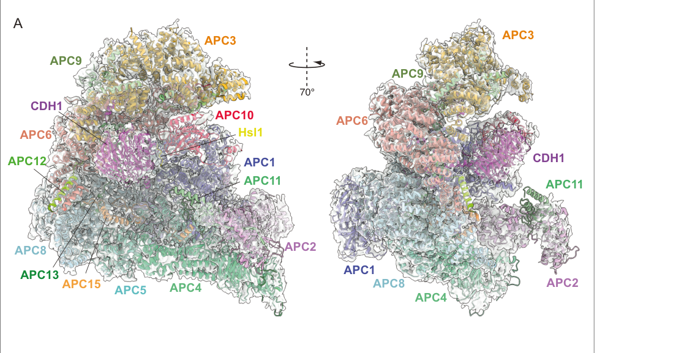

## Question

# Gene Research for Functional Annotation

## ⚠️ CRITICAL: Gene/Protein Identification Context

**BEFORE YOU BEGIN RESEARCH:** You MUST verify you are researching the CORRECT gene/protein. Gene symbols can be ambiguous, especially for less well-characterized genes from non-model organisms.

### Target Gene/Protein Identity (from UniProt):
- **UniProt Accession:** Q9NYG5
- **Protein Description:** RecName: Full=Anaphase-promoting complex subunit 11; Short=APC11; AltName: Full=Cyclosome subunit 11; AltName: Full=Hepatocellular carcinoma-associated RING finger protein;
- **Gene Information:** Name=ANAPC11; ORFNames=HSPC214;
- **Organism (full):** Homo sapiens (Human).
- **Protein Family:** Belongs to the RING-box family. .
- **Key Domains:** RING-box_E3_Ubiquitin_Ligase. (IPR051031); RING-H2_APC11. (IPR024991); Znf_RING. (IPR001841); Znf_RING/FYVE/PHD. (IPR013083); zf-ANAPC11 (PF12861)

### MANDATORY VERIFICATION STEPS:

1. **Check if the gene symbol "ANAPC11" matches the protein description above**
2. **Verify the organism is correct:** Homo sapiens (Human).
3. **Check if protein family/domains align with what you find in literature**
4. **If you find literature for a DIFFERENT gene with the same or similar symbol, STOP**

### If Gene Symbol is Ambiguous or You Cannot Find Relevant Literature:

**DO NOT PROCEED WITH RESEARCH ON A DIFFERENT GENE.** Instead:
- State clearly: "The gene symbol 'ANAPC11' is ambiguous or literature is limited for this specific protein"
- Explain what you found (e.g., "Found extensive literature on a different gene with the same symbol in a different organism")
- Describe the protein based ONLY on the UniProt information provided above
- Suggest that the protein function can be inferred from domain/family information

### Research Target:

Please provide a comprehensive research report on the gene **ANAPC11** (gene ID: ANAPC11, UniProt: Q9NYG5) in human.

The research report should be a detailed narrative explaining the function, biological processes, and localization of the gene product. Citations should be given for all claims.

You should prioritize authoritative reviews and primary scientific literature when conducting research. You can supplement
this with annotations you find in gene/protein databases, but these can be outdated or inaccurate.

We are specifically interested in the primary function of the gene - for enzymes, what reaction is catalyzed, and what is the substrate specificity? For transporters, what is the substrate? For structural proteins or adapters, what is the broader structural role? For signaling molecules, what is the role in the pathway.

We are interested in where in or outside the cell the gene product carries out its function.

We are also interested in the signaling or biochemical pathways in which the gene functions. We are less interested in broad pleiotropic effects, except where these elucidate the precise role.

Include evidence where possible. We are interested in both experimental evidence as well as inference from structure, evolution, or bioinformatic analysis. Precise studies should be prioritized over high-throughput, where available.

## Output

Question: You are an expert researcher providing comprehensive, well-cited information.

Provide detailed information focusing on:
1. Key concepts and definitions with current understanding
2. Recent developments and latest research (prioritize 2023-2024 sources)
3. Current applications and real-world implementations
4. Expert opinions and analysis from authoritative sources
5. Relevant statistics and data from recent studies

Format as a comprehensive research report with proper citations. Include URLs and publication dates where available.
Always prioritize recent, authoritative sources and provide specific citations for all major claims.

# Gene Research for Functional Annotation

## ⚠️ CRITICAL: Gene/Protein Identification Context

**BEFORE YOU BEGIN RESEARCH:** You MUST verify you are researching the CORRECT gene/protein. Gene symbols can be ambiguous, especially for less well-characterized genes from non-model organisms.

### Target Gene/Protein Identity (from UniProt):
- **UniProt Accession:** Q9NYG5
- **Protein Description:** RecName: Full=Anaphase-promoting complex subunit 11; Short=APC11; AltName: Full=Cyclosome subunit 11; AltName: Full=Hepatocellular carcinoma-associated RING finger protein;
- **Gene Information:** Name=ANAPC11; ORFNames=HSPC214;
- **Organism (full):** Homo sapiens (Human).
- **Protein Family:** Belongs to the RING-box family. .
- **Key Domains:** RING-box_E3_Ubiquitin_Ligase. (IPR051031); RING-H2_APC11. (IPR024991); Znf_RING. (IPR001841); Znf_RING/FYVE/PHD. (IPR013083); zf-ANAPC11 (PF12861)

### MANDATORY VERIFICATION STEPS:

1. **Check if the gene symbol "ANAPC11" matches the protein description above**
2. **Verify the organism is correct:** Homo sapiens (Human).
3. **Check if protein family/domains align with what you find in literature**
4. **If you find literature for a DIFFERENT gene with the same or similar symbol, STOP**

### If Gene Symbol is Ambiguous or You Cannot Find Relevant Literature:

**DO NOT PROCEED WITH RESEARCH ON A DIFFERENT GENE.** Instead:
- State clearly: "The gene symbol 'ANAPC11' is ambiguous or literature is limited for this specific protein"
- Explain what you found (e.g., "Found extensive literature on a different gene with the same symbol in a different organism")
- Describe the protein based ONLY on the UniProt information provided above
- Suggest that the protein function can be inferred from domain/family information

### Research Target:

Please provide a comprehensive research report on the gene **ANAPC11** (gene ID: ANAPC11, UniProt: Q9NYG5) in human.

The research report should be a detailed narrative explaining the function, biological processes, and localization of the gene product. Citations should be given for all claims.

You should prioritize authoritative reviews and primary scientific literature when conducting research. You can supplement
this with annotations you find in gene/protein databases, but these can be outdated or inaccurate.

We are specifically interested in the primary function of the gene - for enzymes, what reaction is catalyzed, and what is the substrate specificity? For transporters, what is the substrate? For structural proteins or adapters, what is the broader structural role? For signaling molecules, what is the role in the pathway.

We are interested in where in or outside the cell the gene product carries out its function.

We are also interested in the signaling or biochemical pathways in which the gene functions. We are less interested in broad pleiotropic effects, except where these elucidate the precise role.

Include evidence where possible. We are interested in both experimental evidence as well as inference from structure, evolution, or bioinformatic analysis. Precise studies should be prioritized over high-throughput, where available.

# Human ANAPC11 (UniProt Q9NYG5): functional-annotation research report

## Executive summary

**Identity is verified.** Human **ANAPC11** encodes anaphase-promoting complex subunit 11 (**APC11**), an approximately 9.8-kDa, 84-amino-acid RING-H2 protein and the human ortholog of yeast Apc11p. The cloned human gene was mapped to chromosome 17q25; its sequence, approved nomenclature, RING-H2 motif, and APC/C membership agree with UniProt Q9NYG5 and the supplied InterPro/Pfam domain assignments. It is related to, but distinct from, RBX1/ROC1, RBX2/SAG, ANAPC1, and the other APC/C subunits. No conflicting human protein using the ANAPC11 symbol was identified. (chan2001molecularcloningand pages 4-7, chan2001molecularcloningand pages 2-4)

ANAPC11 is the **RING E3 catalytic subunit of the anaphase-promoting complex/cyclosome (APC/C)**. Together with cullin-like ANAPC2, it forms the catalytic module that recruits an E2~ubiquitin conjugate and promotes direct ubiquitin transfer to substrate lysines. ANAPC11 does not itself recognize most substrates and does not form a catalytic ubiquitin–ANAPC11 intermediate; substrate selection is primarily supplied by CDC20 or CDH1/FZR1, APC10, and degrons in the substrate. UBE2C/UBCH10 generally primes substrates, whereas UBE2S extends predominantly K11-linked ubiquitin chains, generating proteasomal degradation signals. (bodrug2021intricateregulatorymechanisms pages 2-4, yamano2019apcccurrentunderstanding pages 3-5)

The best-established biological function is therefore the irreversible, temporally controlled destruction of cell-cycle regulators—especially securin and cyclin B—to initiate sister-chromatid separation, extinguish CDK1 activity, and complete mitotic exit. Recent work has refined how APC2–APC11 changes conformation, how UBE2C and UBE2S cooperate, and how chromatin concentrates APC/C–cyclin B1 interactions. Direct ANAPC11 disease evidence is strongest in urothelial bladder cancer, but it remains preclinical and does not yet establish an approved biomarker or therapy. (alfieri2017visualizingthecomplex pages 2-3, bodrug2023timeresolvedcryoem(trem) pages 2-3, yan2023theapcce3 pages 1-2)

| Topic | Conclusion | Evidence type/source year | Directness | Key caveat |
|---|---|---|---|---|
| Identity and domain | Human ANAPC11/Q9NYG5 is the 84-aa, ~9.8-kDa APC11 subunit, containing a C-terminal RING-H2/RING-box zinc-binding domain and belonging to the RING-box family. | Human cloning, sequence comparison and localization study (2001) | Direct ANAPC11 | Early GFP-fusion and predicted-size data should be interpreted alongside current curated protein records. |
| Catalytic APC2–APC11 module | ANAPC11 is the RING component of the APC/C catalytic module; cullin-like ANAPC2 supports and positions it. The pair constitutes a minimal ubiquitin-ligase module, while the intact APC/C supplies efficient substrate recognition and regulation. | Reconstituted biochemistry (2001); human cryo-EM and mechanistic studies (2014 onward) | Direct ANAPC11 within APC/C | ANAPC11 is a RING E3 scaffold, not a catalytic cysteine enzyme and not the principal substrate receptor. |
| UBE2C/UBE2S mechanism | APC11 engages E2 enzymes: UBE2C primes substrates with ubiquitin or short chains, whereas UBE2S preferentially extends K11-linked chains. CDC20/CDH1 and APC10 recognize degrons and orient substrates. | Biochemical reconstitution, structural analysis and reviews (2014–2021) | Direct catalytic-module evidence plus APC/C-level mechanism | Linkage and substrate outcomes depend on E2 availability, coactivator, substrate architecture and cellular context; ANAPC11 alone does not determine specificity. |
| Cellular localization | GFP-tagged ANAPC11 was observed in both nucleus and cytoplasm, with granular cytoplasmic and perinuclear enrichment. APC/C function is additionally concentrated at mitotic structures and chromatin in a cell-cycle-dependent manner. | Human fusion-protein microscopy (2001); APC/C spatial studies (2024) | Direct ANAPC11 localization for the early study; APC/C-level inference for mitotic localization | Granular localization was observed with overexpressed fusion protein; proposed proteasome association was not definitive, and APC/C localization cannot automatically be assigned to free ANAPC11. |
| FOXO3 in bladder cancer | Elevated ANAPC11 was associated with advanced urothelial bladder-cancer features. ANAPC11 interacted with FOXO3, increased K11-linked FOXO3 ubiquitination and proteasomal turnover, and reduced p21 and GULP1; genetic loss inhibited tumor growth and lymph-node metastasis in models. | Patient cohort, CRISPR/knockdown, biochemical assays and mouse models (2023) | Direct ANAPC11 disease evidence | The 110-patient cohort was retrospective and the mouse groups were small; canonical APC/C, coactivator and degron dependence of FOXO3 ubiquitination was not established. |
| Time-resolved cryo-EM | Active human APC/C structures directly visualized UBE2C clasped by the APC11 RING and APC2 WHB domain, simultaneous UBE2S engagement, conformational changes and multiple ubiquitin contacts that support processive chain construction. | Time-resolved human cryo-EM and biochemical assays (2023) | Direct ANAPC11 structural context within APC/C | Structures resolve dynamic ensembles rather than every chemical intermediate; reported processivity is a complex-level property, not an isolated-ANAPC11 activity. |
| Spatial APC/C control | APC/C and Cyclin B1 interact preferentially at chromosomes, spindle and spindle poles. Nucleosome binding accelerates Cyclin B1 degradation, and disrupting Cyclin B1 chromatin tethering delays degradation and promotes aneuploidy. | Live-cell imaging, FCCS, reconstitution and cryo-EM (2024) | APC/C-level inference | Experiments implicated APC3/APC8, CDC20 and Cyclin B1 spatial determinants rather than ANAPC11 specifically. |
| Translational APC/C studies | Weak APC/C activity predicts vulnerability to KIF18A inhibition, whereas experimental APC/C activation restored substrate turnover and chemosensitivity in multidrug-resistant breast-cancer models. | CRISPR screens, live-cell assays, cell lines and xenografts (2024) | APC/C-level inference | These are preclinical findings; APC/C modulators are not ANAPC11-selective, and no approved ANAPC11-directed therapy or validated clinical biomarker has been established. |

*Table: Evidence hierarchy distinguishing direct human ANAPC11 findings from conclusions inferred at the level of the complete APC/C. Caveats identify where substrate specificity, localization, disease mechanism or therapeutic relevance remains unresolved.*

## 1. Mandatory identity and domain verification

The original human cloning study reported a 514-bp cDNA encoding an 84-residue protein of approximately 9.84 kDa, with a C-terminal **C3H2C3 RING-H2 zinc-finger**. Human ANAPC11 shared 44% sequence identity with yeast Apc11p and 37% with each of RBX1/ROC1 and RBX2/SAG, supporting membership in the RING-box family while distinguishing these paralogous proteins. The gene symbol was approved by the HUGO/GDB nomenclature committee and mapped to 17q25. (chan2001molecularcloningand pages 4-7, chan2001molecularcloningand pages 2-4)

These observations align with the supplied annotations **RING-box E3 ubiquitin ligase**, **RING-H2 APC11**, **zinc-finger RING**, and **zf-ANAPC11**. Modern structural work likewise identifies APC11 as the RING component of the APC2:APC11 catalytic module. Thus, the target is specifically **human ANAPC11/Q9NYG5**, not ANAPC1 and not the related RING-box protein RBX1. (martinezchacin2020ubiquitinchainelongatingenzyme pages 1-3, vazquezfernandez2024acomparativestudy pages 1-2)

## 2. Primary molecular function and reaction

### 2.1 Enzyme class

ANAPC11 is a **RING-type E3 ubiquitin-ligase component**. Its RING domain binds and activates an E2 enzyme carrying ubiquitin through a thioester bond. The reaction promoted by the intact APC/C can be summarized as:

**E2–S~ubiquitin + substrate-Lys-NH₂ → E2-SH + substrate-Lys-NH–CO-ubiquitin**

Repeated cycles modify additional substrate lysines or ubiquitin lysines to form chains. Unlike HECT or RBR E3s, ANAPC11 is not known to accept ubiquitin onto a catalytic cysteine. It acts as a scaffold/allosteric activator that positions the E2~ubiquitin conjugate for direct aminolysis by a substrate lysine. ANAPC2 contributes a cullin scaffold and WHB-domain contacts that clasp and position the E2 together with the ANAPC11 RING. (bodrug2021intricateregulatorymechanisms pages 2-4, bansal2019mechanismsforthe pages 1-2)

The APC2–APC11 heterodimer constitutes a minimal ubiquitin-ligase module, but it has poor physiological substrate specificity in isolation. The full approximately 1.2-MDa APC/C supplies regulated substrate recruitment, architecture, processivity, and cell-cycle control. (martinezchacin2020ubiquitinchainelongatingenzyme pages 1-3, yamano2019apcccurrentunderstanding pages 3-5)

### 2.2 E2 specificity and chain construction

Human APC/C uses two principal E2 activities:

* **UBE2C/UBCH10** performs substrate priming, adding the first ubiquitin and sometimes additional ubiquitins or short K11-, K48-, or K63-linked chains.
* **UBE2S** preferentially extends substrate-attached ubiquitin through **K11 linkages**, producing longer chains and increasing processivity. Its C-terminal peptide binds an APC2–APC4 groove and stabilizes a catalytically competent APC2–APC11 conformation; UBE2S can therefore allosterically stimulate UBE2C-dependent priming as well as catalyze elongation. (bodrug2021intricateregulatorymechanisms pages 2-4, martinezchacin2020ubiquitinchainelongatingenzyme pages 9-11)

The resulting K11-rich and, in some contexts, mixed K11/K48 chains are proteasomal targeting signals. Four or more ubiquitins are commonly treated as a canonical degradation signal, although actual proteasome recognition depends on chain architecture and substrate context rather than a rigid universal threshold. (bodrug2023timeresolvedcryoem(trem) pages 2-3, bodrug2023timeresolvedcryoem(trem) pages 1-2)

### 2.3 What determines substrate specificity?

ANAPC11 is **not the principal substrate receptor**. CDC20 and CDH1/FZR1 provide temporally distinct substrate-binding surfaces. Together with APC10, a coactivator forms a composite receptor for the destruction box (**D-box**); the coactivator WD40 domain also recognizes **KEN-box** and **ABBA-motif** degrons. Substrate affinity, degron multiplicity, lysine accessibility, phosphorylation, chain initiation, and residence time jointly determine ubiquitination order and efficiency. (bodrug2021intricateregulatorymechanisms pages 2-4, vazquezfernandez2024acomparativestudy pages 1-2)

Accordingly, describing ANAPC11 as an E3 “with specificity for cyclin B” is incomplete. Its intrinsic biochemical specificity is primarily for compatible E2~ubiquitin conjugates; physiological protein-substrate specificity emerges from the assembled APC/C, coactivator, APC10, degrons, and cell-cycle state.

## 3. Structural role within APC/C

ANAPC11 and ANAPC2 occupy the APC/C platform and project toward the complex’s central catalytic cavity, opposite the coactivator–APC10 substrate receptor. Flexible linkers permit the APC2 C-terminal domain, APC2 WHB domain, and ANAPC11 RING to move between less-active “down” and E2-competent “up” states. Coactivator and substrate binding help reposition this module so that the E2 and substrate are brought into productive proximity. (alfieri2017visualizingthecomplex pages 2-3, bodrug2023timeresolvedcryoem(trem) pages 4-5)

A 2024 comparative cryo-EM study found that the overall APC/C architecture is strongly conserved between budding yeast and humans but emphasized species-specific regulation. In human APC/C, coactivator binding shifts APC2–APC11 from a downward, E2-blocked state to an upward state competent for E2 binding; budding-yeast APC2–APC11 is already positioned for E2 binding in apo-APC/C. This cautions against transferring every yeast regulatory detail directly to human ANAPC11. (vazquezfernandez2024acomparativestudy pages 1-2, vazquezfernandez2024acomparativestudy pages 2-3)

The retrieved 4.0-Å APC/C–CDH1–Hsl1 structure visually places APC11 beside APC2 in the catalytic module and shows its spatial relationship to CDH1, APC10, and substrate. The displayed complex is from *S. cerevisiae*, so it supports conserved architecture, not direct human-sequence identity. (vazquezfernandez2024acomparativestudy pages 3-5, vazquezfernandez2024acomparativestudy media 7544c407, vazquezfernandez2024acomparativestudy media 4cd0c6e2)

## 4. Biological processes and pathways

### 4.1 Metaphase-to-anaphase transition

When every chromosome is correctly attached to the spindle, APC/C–CDC20 ubiquitinates **securin** and **cyclin B1**. Securin destruction releases separase, enabling cohesin cleavage and sister-chromatid separation. Cyclin B destruction lowers CDK1 activity and drives mitotic exit. These irreversible proteolytic events impose directionality on the cell cycle. (alfieri2017visualizingthecomplex pages 2-3, kataria2019interplaybetweenphosphatases pages 3-5)

Before proper attachment, the spindle-assembly checkpoint generates the **mitotic checkpoint complex (MCC)**—containing checkpoint factors and CDC20—which inhibits APC/C–CDC20 by blocking degron recognition and restraining catalytic/E2 engagement. ANAPC11 therefore executes ubiquitin transfer only when the larger APC/C regulatory network permits it. (sivakumar2015spatiotemporalregulationof pages 1-2, liu2020theinteractionprofile pages 44-47)

### 4.2 Late mitosis and G1

After anaphase onset, **APC/C–CDH1** maintains low levels of mitotic regulators through late mitosis and G1. CDH1 also contributes to CDC20 turnover. At the G1/S transition, CDK-dependent CDH1 phosphorylation inhibits its APC/C association, helping permit S-phase entry. (bodrug2021intricateregulatorymechanisms pages 2-4, vazquezfernandez2024acomparativestudy pages 1-2)

### 4.3 Broader APC/C pathways

APC/C has reported roles in chromatin regulation, DNA-replication licensing, differentiation, neuronal biology, and genome stability. These are biologically plausible contexts for ANAPC11 because it is the obligate RING catalytic subunit of assembled APC/C, but most such studies perturb coactivators or the entire complex rather than ANAPC11 itself. They should therefore be described as **APC/C-level functional inference**, not automatically as independently demonstrated ANAPC11 functions. (bodrug2021intricateregulatorymechanisms pages 2-4)

## 5. Cellular localization

Early GFP-fusion microscopy found human ANAPC11 in both **nucleus and cytoplasm**, with diffuse signal and granular cytoplasmic/perinuclear enrichment in transfected cells. The authors suggested that some granules might involve proteasome-associated structures, but this interpretation was not definitive and the experiment used an overexpressed fusion protein. (chan2001molecularcloningand pages 4-7, chan2001molecularcloningand pages 1-2, chan2001molecularcloningand pages 7-10)

Functionally, assembled APC/C acts in both nuclear and cytoplasmic/mitotic compartments, including chromosomes, spindle structures, and centrosomes. A 2024 RPE-1 study using endogenously tagged cyclin B1 and APC8 found that APC/C–cyclin B1 interaction is enriched at the mitotic apparatus. Cyclin B1 degradation began at chromosomes, spindle, and centrosomes before the surrounding cytoplasm. Both APC/C and cyclin B1 bound nucleosomes; mutating cyclin B1’s N-terminal arginine anchor delayed degradation and produced aneuploid cells. This is compelling **whole-APC/C spatial evidence**, but it does not prove that free ANAPC11 independently binds chromatin. (cirillo2024spatialcontrolof pages 2-4, cirillo2024spatialcontrolof pages 4-6, cirillo2024spatialcontrolof pages 1-2)

## 6. Recent mechanistic developments

### 6.1 Time-resolved human cryo-EM, 2023

Bodrug and colleagues analyzed active 1.2-MDa human APC/C reactions at 0.5, 1.5, 5, and 15 minutes without chemically crosslinking or genetically fusing the reaction components. Approximately 3–4-Å reconstructions directly visualized UBE2C clasped by the ANAPC11 RING and ANAPC2 WHB domain, while UBE2S’s C-terminal peptide occupied the APC2–APC4 groove. UBE2C and UBE2S could bind simultaneously, and reactions containing both generated longer ubiquitin products than UBE2C alone. (bodrug2023timeresolvedcryoem(trem) pages 2-3, bodrug2023timeresolvedcryoem(trem) pages 1-2)

The APC2 catalytic region moved approximately 15 Å from “CRL down” to “CRL up,” with a further approximately 11-Å transition between partially and fully raised states. UBE2S stabilized the up state and increased UBE2C recruitment. Focused classification identified ubiquitin at the known ANAPC11 RING exosite and additional ubiquitins contacting CDH1 or UBE2C; some particles contained two such ubiquitins simultaneously. The study supports a model in which nascent substrate-linked ubiquitin enhances continued engagement and processive chain growth. (bodrug2023timeresolvedcryoem(trem) pages 4-5, bodrug2023timeresolvedcryoem(trem) pages 8-9, bodrug2023timeresolvedcryoem(trem) pages 6-7)

### 6.2 Comparative APC/C cryo-EM, 2024

Vazquez-Fernandez and colleagues resolved budding-yeast apo-, phosphorylated-, and CDH1–substrate APC/C at 4.9, 4.4, and 4.0 Å, respectively. The work confirmed conserved triangular architecture and APC2–APC11 placement while showing that human and yeast complexes differ in coactivator-induced E2 accessibility and phosphorylation-dependent CDC20 activation. (vazquezfernandez2024acomparativestudy pages 2-3, vazquezfernandez2024acomparativestudy pages 3-5)

### 6.3 Spatial control of cyclin B1 destruction, 2024

Cirillo and colleagues combined live imaging, fluorescence cross-correlation spectroscopy, reconstituted biochemistry, cross-linking mass spectrometry, and cryo-EM. Their results indicate that nucleosome binding raises the local concentration of APC/C and cyclin B1 on mitotic chromosomes, enabling rapid cyclin destruction when the checkpoint is switched off. APC3 residues contacting the nucleosome acidic patch and cyclin B1’s arginine anchor were implicated directly. This advances understanding of where APC/C—and consequently its ANAPC11 catalytic subunit—performs mitotic ubiquitination. (cirillo2024spatialcontrolof pages 4-6, cirillo2024spatialcontrolof pages 1-2)

## 7. Disease relevance and quantitative evidence

### 7.1 Urothelial bladder cancer: direct ANAPC11 evidence

A 2023 study started from DepMap CRISPR data covering 30 bladder-cancer cell lines. Of 904 genes with mean dependency effect below −1, intersection with 741 ubiquitination-related genes produced 31 candidates; expression filtering left ANAPC11 as the sole candidate. ANAPC11 protein was elevated in seven bladder-cancer cell lines, six matched tumor/adjacent-tissue specimens, and 14 paired sections. (yan2023theapcce3 pages 3-4)

In a retrospective cohort of **110 patients**, 65 tumors had high and 45 had low ANAPC11 expression. High expression was associated with advanced T stage—71.4% high versus 28.6% low among T2–T4 tumors (**P=0.002**)—lymph-node positivity—93.3% high versus 6.7% low (**P=0.004**)—high grade—68.5% versus 31.5% (**P<0.01**)—and worse survival. (yan2023theapcce3 pages 1-2)

Mechanistically, ANAPC11 interacted with FOXO3 in immunoprecipitation, mass-spectrometry, and GST-pulldown experiments. ANAPC11 altered FOXO3 protein stability without a consistent corresponding mRNA effect; cycloheximide, MG132, and ubiquitination assays supported proteasome-dependent turnover. The reported modification was **K11-linked rather than K48-linked FOXO3 polyubiquitination**. FOXO3 re-expression counteracted ANAPC11-driven proliferation, migration, and invasion, while loss of FOXO3 had the opposite effect. FOXO3 activated **CDKN1A/p21** and **GULP1**, providing a proposed ANAPC11→FOXO3 degradation→lower p21/GULP1 pathway. (yan2023theapcce3 pages 8-12, yan2023theapcce3 pages 6-8)

CRISPR ANAPC11 knockout reduced xenograft growth and footpad-model lymph-node metastasis; the reported in-vivo comparisons used five mice per group. Tumors lacking ANAPC11 showed increased FOXO3, p21, and GULP1 and reduced Ki67. (yan2023theapcce3 pages 8-12, yan2023theapcce3 pages 2-3)

**Important limitation:** the study did not establish that FOXO3 is a canonical APC/C substrate. Dependence on intact APC/C, CDC20 or CDH1, APC10, and a recognized degron was not demonstrated. The authors explicitly left open whether ANAPC11 acted through canonical APC/C or another complex/context. The result is therefore a credible ANAPC11-associated disease mechanism, but not yet a fully reconstituted APC/C substrate pathway. (yan2023theapcce3 pages 12-13)

### 7.2 Broader disease associations

Open Targets lists ANAPC11 associations with lung adenocarcinoma, broader lung cancer, neoplasm, and colorectal carcinoma, but the reported aggregate association scores are low—approximately 0.056–0.110—and the evidence sets are small. These database associations are hypothesis-generating, not equivalent to causal validation. (OpenTargets Search: -ANAPC11)

## 8. Current applications and translational implementations

No approved drug, clinical diagnostic, or validated patient-selection biomarker directly targeting **ANAPC11** was identified. Current implementation is predominantly experimental:

1. **Mechanistic reconstitution and cryo-EM.** Recombinant APC/C containing ANAPC11 is used to dissect ubiquitin transfer, checkpoint inhibition, coactivator function, and chain assembly. The 2023 time-resolved study demonstrates near-native structural analysis of an active ubiquitination reaction. (bodrug2023timeresolvedcryoem(trem) pages 2-3)
2. **Cancer dependency screening.** CRISPR/DepMap datasets can identify tumors dependent on APC/C components; ANAPC11 emerged as a candidate dependency in bladder-cancer models. (yan2023theapcce3 pages 2-3, yan2023theapcce3 pages 3-4)
3. **APC/C inhibition.** Compounds such as proTAME and APCin inhibit APC/C through coactivator-related mechanisms, not selective ANAPC11 blockade. Their main use remains preclinical research.
4. **APC/C activation.** In 2024, M2I-1 restored APC/C-substrate turnover and doxorubicin sensitivity in multidrug-resistant MCF7 models and stalled growth of a triple-negative breast-cancer patient-derived xenograft. The study also cited 182 high-grade TNBC samples, 58% of which retained high APC/C substrates despite G1 markers. This is APC/C-level preclinical evidence, not proof of ANAPC11-specific therapeutic benefit. (lubachowski2024activationofthe pages 17-18, lubachowski2024activationofthe pages 15-17)
5. **KIF18A inhibitor stratification.** A 2024 study found that KIF18A-inhibitor-sensitive tumors have a SAC:APC/C imbalance and weak basal APC/C activity. Partial checkpoint inhibition with 30 nM reversine rescued viability, while CDC20 or UBE2S overexpression could reduce sensitivity. DepMap co-dependencies placed ANAPC1, ANAPC4, CDC23, and CDC27 among the strongest KIF18A relationships; ANAPC11 was not directly validated. APC/C functional state may therefore be a response biomarker, but this remains preclinical. (gliech2024weakenedapccactivity pages 4-5, gliech2024weakenedapccactivity pages 29-29, gliech2024weakenedapccactivity pages 12-13)

## 9. Expert analysis and evidence-weighted interpretation

The convergent biochemical and structural evidence supports a high-confidence core annotation: **ANAPC11 is an obligate RING catalytic scaffold in the APC/C, not a stand-alone substrate-specific ligase.** Its most precise role is to bind/activate E2~ubiquitin in partnership with ANAPC2 and thereby catalyze substrate ubiquitination after the assembled complex has selected and positioned the substrate. (bodrug2021intricateregulatorymechanisms pages 2-4, yamano2019apcccurrentunderstanding pages 3-5)

Three distinctions are essential for database annotation and target assessment:

* **Catalysis versus recognition:** ANAPC11 drives ubiquitin transfer; CDC20/CDH1, APC10, and degrons supply most substrate specificity.
* **ANAPC11 versus APC/C phenotypes:** mitotic exit, chromatin localization, checkpoint regulation, and therapeutic responses are usually demonstrated for the complete complex. They are relevant to ANAPC11 but should not be reported as autonomous ANAPC11 activities.
* **Cancer association versus therapeutic tractability:** disrupting ANAPC11 would be expected to broadly compromise an essential chromosome-segregation machine, creating a narrow therapeutic window. Tumor-selective dependencies, allosteric states, coactivator interfaces, or synthetic-lethal contexts may be more tractable than indiscriminate ANAPC11 inhibition.

## 10. Remaining questions

The most important unresolved issues are whether FOXO3 is ubiquitinated by canonical APC/C–ANAPC11, which coactivator and degron would mediate that reaction, how endogenous ANAPC11 localization changes through the human cell cycle, and whether tumors with altered ANAPC11 expression are selectively dependent on its RING–E2 interface. Quantitative endogenous localization, acute separation-of-function mutants, purified FOXO3 ubiquitination reconstitution, and human genetic/clinical validation would substantially strengthen the functional annotation.

## Key dated sources and URLs

* Chan et al., **January 2001**, *Journal of Cellular Biochemistry*: human ANAPC11 cloning, RING-H2 identity, expression and localization. https://doi.org/10.1002/jcb.1217 (chan2001molecularcloningand pages 4-7, chan2001molecularcloningand pages 2-4)
* Bodrug et al., **May 2021**, *Frontiers in Cell and Developmental Biology*: APC/C catalytic and regulatory synthesis. https://doi.org/10.3389/fcell.2021.687515 (bodrug2021intricateregulatorymechanisms pages 2-4)
* Yan et al., **August 2023**, *Cell Death & Disease*: ANAPC11–FOXO3 axis in urothelial bladder cancer. https://doi.org/10.1038/s41419-023-06000-x (yan2023theapcce3 pages 1-2, yan2023theapcce3 pages 6-8)
* Bodrug et al., **September 2023**, *Nature Structural & Molecular Biology*: time-resolved human APC/C polyubiquitination cryo-EM. https://doi.org/10.1038/s41594-023-01105-5 (bodrug2023timeresolvedcryoem(trem) pages 2-3, bodrug2023timeresolvedcryoem(trem) pages 1-2)
* Gliech et al., **January 2024**, *EMBO Journal*: APC/C activity and KIF18A-inhibitor vulnerability. https://doi.org/10.1038/s44318-024-00031-6 (gliech2024weakenedapccactivity pages 4-5, gliech2024weakenedapccactivity pages 3-4)
* Lubachowski et al., **April 2024**, *Cancers*: experimental APC/C activation in multidrug-resistant breast cancer. https://doi.org/10.3390/cancers16091755 (lubachowski2024activationofthe pages 17-18, lubachowski2024activationofthe pages 15-17)
* Cirillo et al., **August 2024**, *EMBO Journal*: spatial APC/C control of cyclin B1 degradation. https://doi.org/10.1038/s44318-024-00194-2 (cirillo2024spatialcontrolof pages 2-4, cirillo2024spatialcontrolof pages 1-2)
* Vazquez-Fernandez et al., **October 2024**, *eLife*: comparative APC/C cryo-EM architecture and regulation. https://doi.org/10.7554/eLife.100821 (vazquezfernandez2024acomparativestudy pages 1-2, vazquezfernandez2024acomparativestudy pages 2-3)

References

1. (chan2001molecularcloningand pages 4-7): Anna H. Chan, Simon M.Y. Lee, Stephen S. Chim, Louis D.S. Kok, Mary M.Y. Waye, Cheuk‐Yu Lee, Kwok‐Pui Fung, and Stephen K.W. Tsui. Molecular cloning and characterization of a ring‐h2 finger protein, anapc11, the human homolog of yeast apc11p *. Journal of Cellular Biochemistry, 83:249-258, Jan 2001. URL: https://doi.org/10.1002/jcb.1217, doi:10.1002/jcb.1217. This article has 11 citations and is from a peer-reviewed journal.

2. (chan2001molecularcloningand pages 2-4): Anna H. Chan, Simon M.Y. Lee, Stephen S. Chim, Louis D.S. Kok, Mary M.Y. Waye, Cheuk‐Yu Lee, Kwok‐Pui Fung, and Stephen K.W. Tsui. Molecular cloning and characterization of a ring‐h2 finger protein, anapc11, the human homolog of yeast apc11p *. Journal of Cellular Biochemistry, 83:249-258, Jan 2001. URL: https://doi.org/10.1002/jcb.1217, doi:10.1002/jcb.1217. This article has 11 citations and is from a peer-reviewed journal.

3. (bodrug2021intricateregulatorymechanisms pages 2-4): Tatyana Bodrug, Kaeli A. Welsh, Megan Hinkle, Michael J. Emanuele, and Nicholas G. Brown. Intricate regulatory mechanisms of the anaphase-promoting complex/cyclosome and its role in chromatin regulation. Frontiers in Cell and Developmental Biology, May 2021. URL: https://doi.org/10.3389/fcell.2021.687515, doi:10.3389/fcell.2021.687515. This article has 29 citations.

4. (yamano2019apcccurrentunderstanding pages 3-5): Hiroyuki Yamano. Apc/c: current understanding and future perspectives. F1000Research, 8:725, May 2019. URL: https://doi.org/10.12688/f1000research.18582.1, doi:10.12688/f1000research.18582.1. This article has 143 citations and is from a peer-reviewed journal.

5. (alfieri2017visualizingthecomplex pages 2-3): Claudio Alfieri, Suyang Zhang, and David Barford. Visualizing the complex functions and mechanisms of the anaphase promoting complex/cyclosome (apc/c). Open Biology, 7:170204, Nov 2017. URL: https://doi.org/10.1098/rsob.170204, doi:10.1098/rsob.170204. This article has 207 citations and is from a peer-reviewed journal.

6. (bodrug2023timeresolvedcryoem(trem) pages 2-3): Tatyana Bodrug, Kaeli A. Welsh, Derek L. Bolhuis, Ethan Paulаkonis, Raquel C. Martinez-Chacin, Bei Liu, Nicholas Pinkin, Thomas Bonacci, Liying Cui, Pengning Xu, Olivia Roscow, Sascha Josef Amann, Irina Grishkovskaya, Michael J. Emanuele, Joseph S. Harrison, Joshua P. Steimel, Klaus M. Hahn, Wei Zhang, Ellen D. Zhong, David Haselbach, and Nicholas G. Brown. Time-resolved cryo-em (tr-em) analysis of substrate polyubiquitination by the ring e3 anaphase-promoting complex/cyclosome (apc/c). Nature Structural &amp; Molecular Biology, 30:1663-1674, Sep 2023. URL: https://doi.org/10.1038/s41594-023-01105-5, doi:10.1038/s41594-023-01105-5. This article has 24 citations and is from a highest quality peer-reviewed journal.

7. (yan2023theapcce3 pages 1-2): D. Yan, Qingqing He, Lu Pei, Meihua Yang, Lifang Huang, Jianqiu Kong, Wang He, Hao Liu, Shizhong Xu, Haide Qin, Tianxin Lin, and Jian-Ying Huang. The apc/c e3 ligase subunit anapc11 mediates foxo3 protein degradation to promote cell proliferation and lymph node metastasis in urothelial bladder cancer. Cell Death &amp; Disease, Aug 2023. URL: https://doi.org/10.1038/s41419-023-06000-x, doi:10.1038/s41419-023-06000-x. This article has 21 citations and is from a peer-reviewed journal.

8. (martinezchacin2020ubiquitinchainelongatingenzyme pages 1-3): Raquel C. Martinez-Chacin, Tatyana Bodrug, Derek L. Bolhuis, Katarzyna M. Kedziora, Thomas Bonacci, Alban Ordureau, Morgan E. Gibbs, Florian Weissmann, Renping Qiao, Gavin D. Grant, Jeanette G. Cook, Jan-Michael Peters, J. Wade Harper, Michael J. Emanuele, and Nicholas G. Brown. Ubiquitin chain-elongating enzyme ube2s activates the ring e3 ligase apc/c for substrate priming. May 2020. URL: https://doi.org/10.1038/s41594-020-0424-6, doi:10.1038/s41594-020-0424-6. This article has 45 citations and is from a highest quality peer-reviewed journal.

9. (vazquezfernandez2024acomparativestudy pages 1-2): Ester Vazquez-Fernandez, Jing Yang, Ziguo Zhang, Antonina E Andreeva, Paul Emsley, and David Barford. A comparative study of the cryo-em structures of saccharomyces cerevisiae and human anaphase-promoting complex/cyclosome (apc/c). eLife, Oct 2024. URL: https://doi.org/10.7554/elife.100821, doi:10.7554/elife.100821. This article has 7 citations and is from a domain leading peer-reviewed journal.

10. (bansal2019mechanismsforthe pages 1-2): Shivangee Bansal and Swati Tiwari. Mechanisms for the temporal regulation of substrate ubiquitination by the anaphase-promoting complex/cyclosome. Cell Division, Dec 2019. URL: https://doi.org/10.1186/s13008-019-0057-5, doi:10.1186/s13008-019-0057-5. This article has 27 citations and is from a peer-reviewed journal.

11. (martinezchacin2020ubiquitinchainelongatingenzyme pages 9-11): Raquel C. Martinez-Chacin, Tatyana Bodrug, Derek L. Bolhuis, Katarzyna M. Kedziora, Thomas Bonacci, Alban Ordureau, Morgan E. Gibbs, Florian Weissmann, Renping Qiao, Gavin D. Grant, Jeanette G. Cook, Jan-Michael Peters, J. Wade Harper, Michael J. Emanuele, and Nicholas G. Brown. Ubiquitin chain-elongating enzyme ube2s activates the ring e3 ligase apc/c for substrate priming. May 2020. URL: https://doi.org/10.1038/s41594-020-0424-6, doi:10.1038/s41594-020-0424-6. This article has 45 citations and is from a highest quality peer-reviewed journal.

12. (bodrug2023timeresolvedcryoem(trem) pages 1-2): Tatyana Bodrug, Kaeli A. Welsh, Derek L. Bolhuis, Ethan Paulаkonis, Raquel C. Martinez-Chacin, Bei Liu, Nicholas Pinkin, Thomas Bonacci, Liying Cui, Pengning Xu, Olivia Roscow, Sascha Josef Amann, Irina Grishkovskaya, Michael J. Emanuele, Joseph S. Harrison, Joshua P. Steimel, Klaus M. Hahn, Wei Zhang, Ellen D. Zhong, David Haselbach, and Nicholas G. Brown. Time-resolved cryo-em (tr-em) analysis of substrate polyubiquitination by the ring e3 anaphase-promoting complex/cyclosome (apc/c). Nature Structural &amp; Molecular Biology, 30:1663-1674, Sep 2023. URL: https://doi.org/10.1038/s41594-023-01105-5, doi:10.1038/s41594-023-01105-5. This article has 24 citations and is from a highest quality peer-reviewed journal.

13. (bodrug2023timeresolvedcryoem(trem) pages 4-5): Tatyana Bodrug, Kaeli A. Welsh, Derek L. Bolhuis, Ethan Paulаkonis, Raquel C. Martinez-Chacin, Bei Liu, Nicholas Pinkin, Thomas Bonacci, Liying Cui, Pengning Xu, Olivia Roscow, Sascha Josef Amann, Irina Grishkovskaya, Michael J. Emanuele, Joseph S. Harrison, Joshua P. Steimel, Klaus M. Hahn, Wei Zhang, Ellen D. Zhong, David Haselbach, and Nicholas G. Brown. Time-resolved cryo-em (tr-em) analysis of substrate polyubiquitination by the ring e3 anaphase-promoting complex/cyclosome (apc/c). Nature Structural &amp; Molecular Biology, 30:1663-1674, Sep 2023. URL: https://doi.org/10.1038/s41594-023-01105-5, doi:10.1038/s41594-023-01105-5. This article has 24 citations and is from a highest quality peer-reviewed journal.

14. (vazquezfernandez2024acomparativestudy pages 2-3): Ester Vazquez-Fernandez, Jing Yang, Ziguo Zhang, Antonina E Andreeva, Paul Emsley, and David Barford. A comparative study of the cryo-em structures of saccharomyces cerevisiae and human anaphase-promoting complex/cyclosome (apc/c). eLife, Oct 2024. URL: https://doi.org/10.7554/elife.100821, doi:10.7554/elife.100821. This article has 7 citations and is from a domain leading peer-reviewed journal.

15. (vazquezfernandez2024acomparativestudy pages 3-5): Ester Vazquez-Fernandez, Jing Yang, Ziguo Zhang, Antonina E Andreeva, Paul Emsley, and David Barford. A comparative study of the cryo-em structures of saccharomyces cerevisiae and human anaphase-promoting complex/cyclosome (apc/c). eLife, Oct 2024. URL: https://doi.org/10.7554/elife.100821, doi:10.7554/elife.100821. This article has 7 citations and is from a domain leading peer-reviewed journal.

16. (vazquezfernandez2024acomparativestudy media 7544c407): Ester Vazquez-Fernandez, Jing Yang, Ziguo Zhang, Antonina E Andreeva, Paul Emsley, and David Barford. A comparative study of the cryo-em structures of saccharomyces cerevisiae and human anaphase-promoting complex/cyclosome (apc/c). eLife, Oct 2024. URL: https://doi.org/10.7554/elife.100821, doi:10.7554/elife.100821. This article has 7 citations and is from a domain leading peer-reviewed journal.

17. (vazquezfernandez2024acomparativestudy media 4cd0c6e2): Ester Vazquez-Fernandez, Jing Yang, Ziguo Zhang, Antonina E Andreeva, Paul Emsley, and David Barford. A comparative study of the cryo-em structures of saccharomyces cerevisiae and human anaphase-promoting complex/cyclosome (apc/c). eLife, Oct 2024. URL: https://doi.org/10.7554/elife.100821, doi:10.7554/elife.100821. This article has 7 citations and is from a domain leading peer-reviewed journal.

18. (kataria2019interplaybetweenphosphatases pages 3-5): Meghna Kataria and Hiroyuki Yamano. Interplay between phosphatases and the anaphase-promoting complex/cyclosome in mitosis. Aug 2019. URL: https://doi.org/10.3390/cells8080814, doi:10.3390/cells8080814. This article has 32 citations.

19. (sivakumar2015spatiotemporalregulationof pages 1-2): Sushama Sivakumar and Gary J. Gorbsky. Spatiotemporal regulation of the anaphase-promoting complex in mitosis. Nature Reviews Molecular Cell Biology, 16:82-94, Jan 2015. URL: https://doi.org/10.1038/nrm3934, doi:10.1038/nrm3934. This article has 354 citations and is from a domain leading peer-reviewed journal.

20. (liu2020theinteractionprofile pages 44-47): Y Liu. The interaction profile between cdc20 and the components of the anaphase promoting complex or cyclosome (apc/c) in human hela cells. Unknown journal, 2020.

21. (chan2001molecularcloningand pages 1-2): Anna H. Chan, Simon M.Y. Lee, Stephen S. Chim, Louis D.S. Kok, Mary M.Y. Waye, Cheuk‐Yu Lee, Kwok‐Pui Fung, and Stephen K.W. Tsui. Molecular cloning and characterization of a ring‐h2 finger protein, anapc11, the human homolog of yeast apc11p *. Journal of Cellular Biochemistry, 83:249-258, Jan 2001. URL: https://doi.org/10.1002/jcb.1217, doi:10.1002/jcb.1217. This article has 11 citations and is from a peer-reviewed journal.

22. (chan2001molecularcloningand pages 7-10): Anna H. Chan, Simon M.Y. Lee, Stephen S. Chim, Louis D.S. Kok, Mary M.Y. Waye, Cheuk‐Yu Lee, Kwok‐Pui Fung, and Stephen K.W. Tsui. Molecular cloning and characterization of a ring‐h2 finger protein, anapc11, the human homolog of yeast apc11p *. Journal of Cellular Biochemistry, 83:249-258, Jan 2001. URL: https://doi.org/10.1002/jcb.1217, doi:10.1002/jcb.1217. This article has 11 citations and is from a peer-reviewed journal.

23. (cirillo2024spatialcontrolof pages 2-4): Luca Cirillo, Rose Young, Sapthaswaran Veerapathiran, Annalisa Roberti, Molly Martin, Azzah Abubacar, Camilla Perosa, Catherine Coates, Reyhan Muhammad, Theodoros I Roumeliotis, Jyoti S Choudhary, Claudio Alfieri, and Jonathon Pines. Spatial control of the apc/c ensures the rapid degradation of cyclin b1. The EMBO Journal, 43:4324-4355, Aug 2024. URL: https://doi.org/10.1038/s44318-024-00194-2, doi:10.1038/s44318-024-00194-2. This article has 25 citations.

24. (cirillo2024spatialcontrolof pages 4-6): Luca Cirillo, Rose Young, Sapthaswaran Veerapathiran, Annalisa Roberti, Molly Martin, Azzah Abubacar, Camilla Perosa, Catherine Coates, Reyhan Muhammad, Theodoros I Roumeliotis, Jyoti S Choudhary, Claudio Alfieri, and Jonathon Pines. Spatial control of the apc/c ensures the rapid degradation of cyclin b1. The EMBO Journal, 43:4324-4355, Aug 2024. URL: https://doi.org/10.1038/s44318-024-00194-2, doi:10.1038/s44318-024-00194-2. This article has 25 citations.

25. (cirillo2024spatialcontrolof pages 1-2): Luca Cirillo, Rose Young, Sapthaswaran Veerapathiran, Annalisa Roberti, Molly Martin, Azzah Abubacar, Camilla Perosa, Catherine Coates, Reyhan Muhammad, Theodoros I Roumeliotis, Jyoti S Choudhary, Claudio Alfieri, and Jonathon Pines. Spatial control of the apc/c ensures the rapid degradation of cyclin b1. The EMBO Journal, 43:4324-4355, Aug 2024. URL: https://doi.org/10.1038/s44318-024-00194-2, doi:10.1038/s44318-024-00194-2. This article has 25 citations.

26. (bodrug2023timeresolvedcryoem(trem) pages 8-9): Tatyana Bodrug, Kaeli A. Welsh, Derek L. Bolhuis, Ethan Paulаkonis, Raquel C. Martinez-Chacin, Bei Liu, Nicholas Pinkin, Thomas Bonacci, Liying Cui, Pengning Xu, Olivia Roscow, Sascha Josef Amann, Irina Grishkovskaya, Michael J. Emanuele, Joseph S. Harrison, Joshua P. Steimel, Klaus M. Hahn, Wei Zhang, Ellen D. Zhong, David Haselbach, and Nicholas G. Brown. Time-resolved cryo-em (tr-em) analysis of substrate polyubiquitination by the ring e3 anaphase-promoting complex/cyclosome (apc/c). Nature Structural &amp; Molecular Biology, 30:1663-1674, Sep 2023. URL: https://doi.org/10.1038/s41594-023-01105-5, doi:10.1038/s41594-023-01105-5. This article has 24 citations and is from a highest quality peer-reviewed journal.

27. (bodrug2023timeresolvedcryoem(trem) pages 6-7): Tatyana Bodrug, Kaeli A. Welsh, Derek L. Bolhuis, Ethan Paulаkonis, Raquel C. Martinez-Chacin, Bei Liu, Nicholas Pinkin, Thomas Bonacci, Liying Cui, Pengning Xu, Olivia Roscow, Sascha Josef Amann, Irina Grishkovskaya, Michael J. Emanuele, Joseph S. Harrison, Joshua P. Steimel, Klaus M. Hahn, Wei Zhang, Ellen D. Zhong, David Haselbach, and Nicholas G. Brown. Time-resolved cryo-em (tr-em) analysis of substrate polyubiquitination by the ring e3 anaphase-promoting complex/cyclosome (apc/c). Nature Structural &amp; Molecular Biology, 30:1663-1674, Sep 2023. URL: https://doi.org/10.1038/s41594-023-01105-5, doi:10.1038/s41594-023-01105-5. This article has 24 citations and is from a highest quality peer-reviewed journal.

28. (yan2023theapcce3 pages 3-4): D. Yan, Qingqing He, Lu Pei, Meihua Yang, Lifang Huang, Jianqiu Kong, Wang He, Hao Liu, Shizhong Xu, Haide Qin, Tianxin Lin, and Jian-Ying Huang. The apc/c e3 ligase subunit anapc11 mediates foxo3 protein degradation to promote cell proliferation and lymph node metastasis in urothelial bladder cancer. Cell Death &amp; Disease, Aug 2023. URL: https://doi.org/10.1038/s41419-023-06000-x, doi:10.1038/s41419-023-06000-x. This article has 21 citations and is from a peer-reviewed journal.

29. (yan2023theapcce3 pages 8-12): D. Yan, Qingqing He, Lu Pei, Meihua Yang, Lifang Huang, Jianqiu Kong, Wang He, Hao Liu, Shizhong Xu, Haide Qin, Tianxin Lin, and Jian-Ying Huang. The apc/c e3 ligase subunit anapc11 mediates foxo3 protein degradation to promote cell proliferation and lymph node metastasis in urothelial bladder cancer. Cell Death &amp; Disease, Aug 2023. URL: https://doi.org/10.1038/s41419-023-06000-x, doi:10.1038/s41419-023-06000-x. This article has 21 citations and is from a peer-reviewed journal.

30. (yan2023theapcce3 pages 6-8): D. Yan, Qingqing He, Lu Pei, Meihua Yang, Lifang Huang, Jianqiu Kong, Wang He, Hao Liu, Shizhong Xu, Haide Qin, Tianxin Lin, and Jian-Ying Huang. The apc/c e3 ligase subunit anapc11 mediates foxo3 protein degradation to promote cell proliferation and lymph node metastasis in urothelial bladder cancer. Cell Death &amp; Disease, Aug 2023. URL: https://doi.org/10.1038/s41419-023-06000-x, doi:10.1038/s41419-023-06000-x. This article has 21 citations and is from a peer-reviewed journal.

31. (yan2023theapcce3 pages 2-3): D. Yan, Qingqing He, Lu Pei, Meihua Yang, Lifang Huang, Jianqiu Kong, Wang He, Hao Liu, Shizhong Xu, Haide Qin, Tianxin Lin, and Jian-Ying Huang. The apc/c e3 ligase subunit anapc11 mediates foxo3 protein degradation to promote cell proliferation and lymph node metastasis in urothelial bladder cancer. Cell Death &amp; Disease, Aug 2023. URL: https://doi.org/10.1038/s41419-023-06000-x, doi:10.1038/s41419-023-06000-x. This article has 21 citations and is from a peer-reviewed journal.

32. (yan2023theapcce3 pages 12-13): D. Yan, Qingqing He, Lu Pei, Meihua Yang, Lifang Huang, Jianqiu Kong, Wang He, Hao Liu, Shizhong Xu, Haide Qin, Tianxin Lin, and Jian-Ying Huang. The apc/c e3 ligase subunit anapc11 mediates foxo3 protein degradation to promote cell proliferation and lymph node metastasis in urothelial bladder cancer. Cell Death &amp; Disease, Aug 2023. URL: https://doi.org/10.1038/s41419-023-06000-x, doi:10.1038/s41419-023-06000-x. This article has 21 citations and is from a peer-reviewed journal.

33. (OpenTargets Search: -ANAPC11): Open Targets Query (-ANAPC11, 5 results). Buniello, A. et al. (2025). Open Targets Platform: facilitating therapeutic hypotheses building in drug discovery. Nucleic Acids Research.

34. (lubachowski2024activationofthe pages 17-18): Mathew Lubachowski, Cordell VanGenderen, Sarah Valentine, Zach Belak, Gerald Floyd Davies, Terra Gayle Arnason, and Troy Anthony Alan Harkness. Activation of the anaphase promoting complex restores impaired mitotic progression and chemosensitivity in multiple drug-resistant human breast cancer. Cancers, 16:1755, Apr 2024. URL: https://doi.org/10.3390/cancers16091755, doi:10.3390/cancers16091755. This article has 5 citations.

35. (lubachowski2024activationofthe pages 15-17): Mathew Lubachowski, Cordell VanGenderen, Sarah Valentine, Zach Belak, Gerald Floyd Davies, Terra Gayle Arnason, and Troy Anthony Alan Harkness. Activation of the anaphase promoting complex restores impaired mitotic progression and chemosensitivity in multiple drug-resistant human breast cancer. Cancers, 16:1755, Apr 2024. URL: https://doi.org/10.3390/cancers16091755, doi:10.3390/cancers16091755. This article has 5 citations.

36. (gliech2024weakenedapccactivity pages 4-5): Colin R Gliech, Zhong Y Yeow, Daniel Tapias-Gomez, Yuchen Yang, Zhaoyu Huang, Andréa E Tijhuis, Diana CJ Spierings, Floris Foijer, Grace Chung, Nuria Tamayo, Zahra Bahrami-Nejad, Patrick Collins, Thong T Nguyen, Andres Plata Stapper, Paul E Hughes, Marc Payton, and Andrew J Holland. Weakened apc/c activity at mitotic exit drives cancer vulnerability to kif18a inhibition. The EMBO Journal, 43:666-694, Jan 2024. URL: https://doi.org/10.1038/s44318-024-00031-6, doi:10.1038/s44318-024-00031-6. This article has 40 citations.

37. (gliech2024weakenedapccactivity pages 29-29): Colin R Gliech, Zhong Y Yeow, Daniel Tapias-Gomez, Yuchen Yang, Zhaoyu Huang, Andréa E Tijhuis, Diana CJ Spierings, Floris Foijer, Grace Chung, Nuria Tamayo, Zahra Bahrami-Nejad, Patrick Collins, Thong T Nguyen, Andres Plata Stapper, Paul E Hughes, Marc Payton, and Andrew J Holland. Weakened apc/c activity at mitotic exit drives cancer vulnerability to kif18a inhibition. The EMBO Journal, 43:666-694, Jan 2024. URL: https://doi.org/10.1038/s44318-024-00031-6, doi:10.1038/s44318-024-00031-6. This article has 40 citations.

38. (gliech2024weakenedapccactivity pages 12-13): Colin R Gliech, Zhong Y Yeow, Daniel Tapias-Gomez, Yuchen Yang, Zhaoyu Huang, Andréa E Tijhuis, Diana CJ Spierings, Floris Foijer, Grace Chung, Nuria Tamayo, Zahra Bahrami-Nejad, Patrick Collins, Thong T Nguyen, Andres Plata Stapper, Paul E Hughes, Marc Payton, and Andrew J Holland. Weakened apc/c activity at mitotic exit drives cancer vulnerability to kif18a inhibition. The EMBO Journal, 43:666-694, Jan 2024. URL: https://doi.org/10.1038/s44318-024-00031-6, doi:10.1038/s44318-024-00031-6. This article has 40 citations.

39. (gliech2024weakenedapccactivity pages 3-4): Colin R Gliech, Zhong Y Yeow, Daniel Tapias-Gomez, Yuchen Yang, Zhaoyu Huang, Andréa E Tijhuis, Diana CJ Spierings, Floris Foijer, Grace Chung, Nuria Tamayo, Zahra Bahrami-Nejad, Patrick Collins, Thong T Nguyen, Andres Plata Stapper, Paul E Hughes, Marc Payton, and Andrew J Holland. Weakened apc/c activity at mitotic exit drives cancer vulnerability to kif18a inhibition. The EMBO Journal, 43:666-694, Jan 2024. URL: https://doi.org/10.1038/s44318-024-00031-6, doi:10.1038/s44318-024-00031-6. This article has 40 citations.

## Artifacts

- [Edison artifact artifact-00](ANAPC11-deep-research-falcon_artifacts/artifact-00.md)

## Citations

1. bodrug2021intricateregulatorymechanisms pages 2-4
2. chan2001molecularcloningand pages 4-7
3. chan2001molecularcloningand pages 2-4
4. yamano2019apcccurrentunderstanding pages 3-5
5. alfieri2017visualizingthecomplex pages 2-3
6. martinezchacin2020ubiquitinchainelongatingenzyme pages 1-3
7. vazquezfernandez2024acomparativestudy pages 1-2
8. bansal2019mechanismsforthe pages 1-2
9. martinezchacin2020ubiquitinchainelongatingenzyme pages 9-11
10. vazquezfernandez2024acomparativestudy pages 2-3
11. vazquezfernandez2024acomparativestudy pages 3-5
12. kataria2019interplaybetweenphosphatases pages 3-5
13. sivakumar2015spatiotemporalregulationof pages 1-2
14. liu2020theinteractionprofile pages 44-47
15. chan2001molecularcloningand pages 1-2
16. chan2001molecularcloningand pages 7-10
17. cirillo2024spatialcontrolof pages 2-4
18. cirillo2024spatialcontrolof pages 4-6
19. cirillo2024spatialcontrolof pages 1-2
20. lubachowski2024activationofthe pages 17-18
21. lubachowski2024activationofthe pages 15-17
22. gliech2024weakenedapccactivity pages 4-5
23. gliech2024weakenedapccactivity pages 29-29
24. gliech2024weakenedapccactivity pages 12-13
25. gliech2024weakenedapccactivity pages 3-4
26. https://doi.org/10.1002/jcb.1217
27. https://doi.org/10.3389/fcell.2021.687515
28. https://doi.org/10.1038/s41419-023-06000-x
29. https://doi.org/10.1038/s41594-023-01105-5
30. https://doi.org/10.1038/s44318-024-00031-6
31. https://doi.org/10.3390/cancers16091755
32. https://doi.org/10.1038/s44318-024-00194-2
33. https://doi.org/10.7554/eLife.100821
34. https://doi.org/10.1002/jcb.1217,
35. https://doi.org/10.3389/fcell.2021.687515,
36. https://doi.org/10.12688/f1000research.18582.1,
37. https://doi.org/10.1098/rsob.170204,
38. https://doi.org/10.1038/s41594-023-01105-5,
39. https://doi.org/10.1038/s41419-023-06000-x,
40. https://doi.org/10.1038/s41594-020-0424-6,
41. https://doi.org/10.7554/elife.100821,
42. https://doi.org/10.1186/s13008-019-0057-5,
43. https://doi.org/10.3390/cells8080814,
44. https://doi.org/10.1038/nrm3934,
45. https://doi.org/10.1038/s44318-024-00194-2,
46. https://doi.org/10.3390/cancers16091755,
47. https://doi.org/10.1038/s44318-024-00031-6,