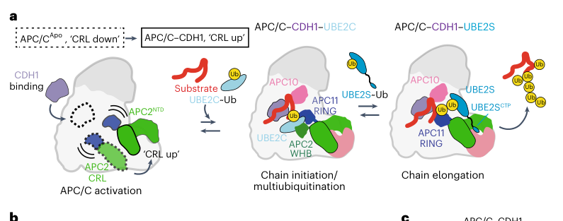

## Question

# Gene Research for Functional Annotation

## ⚠️ CRITICAL: Gene/Protein Identification Context

**BEFORE YOU BEGIN RESEARCH:** You MUST verify you are researching the CORRECT gene/protein. Gene symbols can be ambiguous, especially for less well-characterized genes from non-model organisms.

### Target Gene/Protein Identity (from UniProt):
- **UniProt Accession:** Q9UJX6
- **Protein Description:** RecName: Full=Anaphase-promoting complex subunit 2; Short=APC2; AltName: Full=Cyclosome subunit 2;
- **Gene Information:** Name=ANAPC2; Synonyms=APC2, KIAA1406;
- **Organism (full):** Homo sapiens (Human).
- **Protein Family:** Belongs to the cullin family. {ECO:0000255|PROSITE-
- **Key Domains:** ANAPC2. (IPR044554); ANAPC2_C. (IPR014786); Cullin-like_AB. (IPR059120); Cullin_homology. (IPR016158); Cullin_homology_sf. (IPR036317)

### MANDATORY VERIFICATION STEPS:

1. **Check if the gene symbol "ANAPC2" matches the protein description above**
2. **Verify the organism is correct:** Homo sapiens (Human).
3. **Check if protein family/domains align with what you find in literature**
4. **If you find literature for a DIFFERENT gene with the same or similar symbol, STOP**

### If Gene Symbol is Ambiguous or You Cannot Find Relevant Literature:

**DO NOT PROCEED WITH RESEARCH ON A DIFFERENT GENE.** Instead:
- State clearly: "The gene symbol 'ANAPC2' is ambiguous or literature is limited for this specific protein"
- Explain what you found (e.g., "Found extensive literature on a different gene with the same symbol in a different organism")
- Describe the protein based ONLY on the UniProt information provided above
- Suggest that the protein function can be inferred from domain/family information

### Research Target:

Please provide a comprehensive research report on the gene **ANAPC2** (gene ID: ANAPC2, UniProt: Q9UJX6) in human.

The research report should be a detailed narrative explaining the function, biological processes, and localization of the gene product. Citations should be given for all claims.

You should prioritize authoritative reviews and primary scientific literature when conducting research. You can supplement
this with annotations you find in gene/protein databases, but these can be outdated or inaccurate.

We are specifically interested in the primary function of the gene - for enzymes, what reaction is catalyzed, and what is the substrate specificity? For transporters, what is the substrate? For structural proteins or adapters, what is the broader structural role? For signaling molecules, what is the role in the pathway.

We are interested in where in or outside the cell the gene product carries out its function.

We are also interested in the signaling or biochemical pathways in which the gene functions. We are less interested in broad pleiotropic effects, except where these elucidate the precise role.

Include evidence where possible. We are interested in both experimental evidence as well as inference from structure, evolution, or bioinformatic analysis. Precise studies should be prioritized over high-throughput, where available.

## Output

Question: You are an expert researcher providing comprehensive, well-cited information.

Provide detailed information focusing on:
1. Key concepts and definitions with current understanding
2. Recent developments and latest research (prioritize 2023-2024 sources)
3. Current applications and real-world implementations
4. Expert opinions and analysis from authoritative sources
5. Relevant statistics and data from recent studies

Format as a comprehensive research report with proper citations. Include URLs and publication dates where available.
Always prioritize recent, authoritative sources and provide specific citations for all major claims.

# Gene Research for Functional Annotation

## ⚠️ CRITICAL: Gene/Protein Identification Context

**BEFORE YOU BEGIN RESEARCH:** You MUST verify you are researching the CORRECT gene/protein. Gene symbols can be ambiguous, especially for less well-characterized genes from non-model organisms.

### Target Gene/Protein Identity (from UniProt):
- **UniProt Accession:** Q9UJX6
- **Protein Description:** RecName: Full=Anaphase-promoting complex subunit 2; Short=APC2; AltName: Full=Cyclosome subunit 2;
- **Gene Information:** Name=ANAPC2; Synonyms=APC2, KIAA1406;
- **Organism (full):** Homo sapiens (Human).
- **Protein Family:** Belongs to the cullin family. {ECO:0000255|PROSITE-
- **Key Domains:** ANAPC2. (IPR044554); ANAPC2_C. (IPR014786); Cullin-like_AB. (IPR059120); Cullin_homology. (IPR016158); Cullin_homology_sf. (IPR036317)

### MANDATORY VERIFICATION STEPS:

1. **Check if the gene symbol "ANAPC2" matches the protein description above**
2. **Verify the organism is correct:** Homo sapiens (Human).
3. **Check if protein family/domains align with what you find in literature**
4. **If you find literature for a DIFFERENT gene with the same or similar symbol, STOP**

### If Gene Symbol is Ambiguous or You Cannot Find Relevant Literature:

**DO NOT PROCEED WITH RESEARCH ON A DIFFERENT GENE.** Instead:
- State clearly: "The gene symbol 'ANAPC2' is ambiguous or literature is limited for this specific protein"
- Explain what you found (e.g., "Found extensive literature on a different gene with the same symbol in a different organism")
- Describe the protein based ONLY on the UniProt information provided above
- Suggest that the protein function can be inferred from domain/family information

### Research Target:

Please provide a comprehensive research report on the gene **ANAPC2** (gene ID: ANAPC2, UniProt: Q9UJX6) in human.

The research report should be a detailed narrative explaining the function, biological processes, and localization of the gene product. Citations should be given for all claims.

You should prioritize authoritative reviews and primary scientific literature when conducting research. You can supplement
this with annotations you find in gene/protein databases, but these can be outdated or inaccurate.

We are specifically interested in the primary function of the gene - for enzymes, what reaction is catalyzed, and what is the substrate specificity? For transporters, what is the substrate? For structural proteins or adapters, what is the broader structural role? For signaling molecules, what is the role in the pathway.

We are interested in where in or outside the cell the gene product carries out its function.

We are also interested in the signaling or biochemical pathways in which the gene functions. We are less interested in broad pleiotropic effects, except where these elucidate the precise role.

Include evidence where possible. We are interested in both experimental evidence as well as inference from structure, evolution, or bioinformatic analysis. Precise studies should be prioritized over high-throughput, where available.

## Comprehensive research report: Human **ANAPC2** (APC2; UniProt **Q9UJX6**) functional annotation

### 0) Target verification (required disambiguation)
The UniProt accession **Q9UJX6** corresponds to **Homo sapiens ANAPC2** (synonyms: **APC2**, **KIAA1406**) annotated as **anaphase‑promoting complex subunit 2**, also called **cyclosome subunit 2**. The literature retrieved here consistently uses “APC2/Apc2” to denote the **cullin-family catalytic scaffold subunit** of the human **anaphase‑promoting complex/cyclosome (APC/C)** E3 ubiquitin ligase, which matches the UniProt description and the expected cullin-like domain architecture. (watson2019posingtheapcc pages 1-3, alfieri2017visualizingthecomplex pages 2-3)

### 1) Key concepts and current understanding

#### 1.1 What ANAPC2/APC2 is
**ANAPC2** encodes **APC2**, a core subunit of the multi‑subunit E3 ubiquitin ligase **APC/C** (anaphase-promoting complex/cyclosome). APC2 is the **cullin-like scaffold** that pairs with the **RING** subunit **APC11** to form the **APC2–APC11 cullin–RING catalytic core** (“CRL-like” module) responsible for recruiting and activating ubiquitin-loaded E2 enzymes for substrate ubiquitination. (watson2019posingtheapcc pages 1-3, alfieri2017visualizingthecomplex pages 2-3, bansal2019mechanismsforthe pages 1-2)

A central organizing principle is that APC/C function is achieved by:
- **Catalytic module:** APC2 (cullin-like) + APC11 (RING) that engages E2~Ub and catalyzes ubiquitin transfer. (watson2019posingtheapcc pages 1-3, alfieri2017visualizingthecomplex pages 2-3)
- **Substrate recognition:** coactivators **CDC20** or **CDH1 (FZR1)**, plus **APC10/DOC1**, which recognize substrate degrons (e.g., **D‑box**, **KEN‑box**, **ABBA** motifs) and position substrates for modification. (alfieri2017visualizingthecomplex pages 2-3, bansal2019mechanismsforthe pages 1-2, hofler2024cryoemstructuresof pages 1-3)

#### 1.2 Molecular function: ubiquitin ligase “reaction” and substrate specificity
APC/C is a **RING E3 ubiquitin ligase**, meaning it does **not** form a covalent E3~Ub intermediate. Instead, APC2–APC11 **recruits and activates an E2~Ub thioester** and facilitates **direct transfer** of ubiquitin to lysine residues on substrates (or to ubiquitin to build chains). APC2 functions primarily as a **structural/catalytic scaffold** positioning the APC11 RING and providing key interaction surfaces (including the APC2 WHB region) needed for productive E2 engagement. (watson2019posingtheapcc pages 1-3, alfieri2017visualizingthecomplex pages 2-3, bodrug2023timeresolvedcryoem(trem) pages 2-3)

APC/C typically polyubiquitinates key cell‑cycle regulators (classically including securin and cyclins), using degron-guided substrate selection via CDC20/CDH1 and APC10. (curtis2020theanaphasepromoting pages 6-11, bansal2019mechanismsforthe pages 1-2)

#### 1.3 E2 usage: division of labor
A widely accepted model is a **two‑E2 system**:
- **Initiation/priming E2s:** especially **UBE2C (UBCH10)** (and sometimes UBE2D/UBCH5 family) to install initial ubiquitin(s) and short chains. (zhou2016insightsintoapcc pages 1-2, yamano2019apcccurrentunderstanding pages 3-5)
- **Elongation E2:** **UBE2S** to extend **K11-linked chains**, generating a proteasome-recognized degradation signal. (zhou2016insightsintoapcc pages 1-2, bodrug2023timeresolvedcryoem(trem) pages 1-2)

### 2) Protein domains / structural features (with emphasis on 2023–2024)

#### 2.1 Canonical APC2 features: cullin-like scaffold + WHB region
Structural work and reviews describe APC2 as the **cullin** within the APC/C catalytic module, with flexible tethering of the APC11 RING and the APC2 WHB region enabling catalytic conformational rearrangements. (alfieri2017visualizingthecomplex pages 2-3, alfieri2017visualizingthecomplex pages 4-4)

#### 2.2 2024 high-resolution structures: APC2 **zinc-binding module**
A major 2024 advance is the report of **high‑resolution cryo‑EM** structures of human **apo‑APC/C** and **APC/C^CDH1:EMI1** (2.9–3.2 Å), which identified a **previously unreported zinc-binding module in APC2**; zinc ions were experimentally confirmed and proposed to stabilize APC2. (Nature Communications, publication date Nov 2024; https://doi.org/10.1038/s41467-024-54398-5) (hofler2024cryoemstructuresof pages 1-3)

#### 2.3 2023 time-resolved cryo-EM: APC2 participates in E2 docking via APC2–APC4 groove
Time-resolved cryo-EM (TR‑EM) of active human APC/C during substrate polyubiquitination revealed that the **UBE2S C-terminal peptide (CTP)** binds a groove formed by **APC2–APC4**, and that UBE2C is “clasped” by **APC11 RING** and the **APC2 WHB** region in active states. (Nature Structural & Molecular Biology, Sep 2023; https://doi.org/10.1038/s41594-023-01105-5) (bodrug2023timeresolvedcryoem(trem) pages 2-3)

**Figure evidence:** the CRL-up/CRL-down transitions and UBE2S CTP binding at the APC2–APC4 groove are shown in the cropped figure panels from Bodrug et al. 2023. (bodrug2023timeresolvedcryoem(trem) media b5724fab, bodrug2023timeresolvedcryoem(trem) media 4c971fd7, bodrug2023timeresolvedcryoem(trem) media 1866d704, bodrug2023timeresolvedcryoem(trem) media c7cbb8b1, bodrug2023timeresolvedcryoem(trem) media bafd06b8)

### 3) Mechanistic role of ANAPC2/APC2 in APC/C catalysis

#### 3.1 Minimal catalytic module and biochemical sufficiency
APC2 and APC11 comprise the minimal CRL-like catalytic module of APC/C. A classic biochemical reconstitution showed that an APC2–APC11 heterodimer can be sufficient to catalyze ubiquitination of at least some APC/C substrates in conjunction with appropriate E2s (e.g., UbcH10/UBE2C). (hoflerUnknownyeardriversofcell pages 44-47)

#### 3.2 Conformational activation: “CRL down” to “CRL up”
APC/C catalytic output depends on conformational transitions of the APC2–APC11 “CRL arm.” Coactivator binding (CDH1/CDC20) is linked to movement of the catalytic module from an autoinhibited “down” arrangement into an “up” state compatible with productive E2 engagement and ubiquitin transfer. (watson2019posingtheapcc pages 19-23)

The 2023 TR‑EM study quantified this landscape by cryoDRGN analysis, identifying dominant **“CRL down”** and **“CRL up”** states and measuring CRL movements (~15 Å and ~11 Å along principal components), supporting an energy landscape enabling thermally driven transitions. (bodrug2023timeresolvedcryoem(trem) pages 4-5)

#### 3.3 Allosteric coupling between elongation and priming E2s via APC2
A key recent concept is that **UBE2S** (elongating E2) can allosterically promote **UBE2C** (priming E2) engagement by stabilizing a catalytically competent APC/C conformation. Specifically, a **UBE2S CTP** interaction at an **APC2–APC4 groove** stabilized a “CRL up” state and increased recruitment of UBE2C~Ub to APC/C^CDH1 and substrate in dose-dependent assays. (bodrug2023timeresolvedcryoem(trem) pages 6-7)

### 4) Pathways and regulation

#### 4.1 Spindle assembly checkpoint (SAC) and MCC inhibition
During mitosis, the SAC restrains APC/C activation until proper kinetochore–microtubule attachment. Its key effector, the **mitotic checkpoint complex (MCC)** (CDC20, BUBR1, MAD2, BUB3), binds APC/C^CDC20 and inhibits substrate ubiquitination by blocking substrate engagement and/or E2 function. (curtis2020theanaphasepromoting pages 6-11, zhou2016insightsintoapcc pages 5-6)

#### 4.2 EMI1 inhibition engages APC2 surfaces
**EMI1** is a multi-domain inhibitor that acts as a pseudo-substrate and multivalent blocker. Structural analysis described EMI1 binding contacts including **CDH1**, **APC10**, **APC11 RING**, the **APC2 WHB**, and the **APC2–APC4 groove**, consistent with inhibition that directly targets APC2-centered catalytic and E2-binding interfaces. (watson2019posingtheapcc pages 19-23)

#### 4.3 Phosphoregulation and coactivator exchange
APC/C activation and coactivator exchange are regulated by phosphorylation: CDK1 and PLK1 promote CDC20 binding/early mitotic activation, while CDK1 phosphorylation of CDH1 restrains CDH1 binding in early mitosis; CDH1 becomes effective later as CDK activity falls. (hoflerUnknownyeardriversofcell pages 44-47, zhou2016insightsintoapcc pages 5-6)

### 5) Subcellular localization
The evidence gathered here supports **mechanistic spatial context** (e.g., SAC signaling from unattached kinetochores) rather than a detailed catalog of APC/C steady-state localization (nucleus vs cytoplasm vs spindle/kinetochores). SAC/MCC signaling is described as initiated at **unattached kinetochores**, producing a diffusible MCC that inhibits APC/C^CDC20. (liu2020theinteractionprofile pages 44-47, zhou2016insightsintoapcc pages 5-6)

Direct, specific localization statements for APC2/ANAPC2 itself (e.g., immunofluorescence localizing APC2 to spindle poles/kinetochores) were not recovered in the retrieved text corpus; therefore, this report does **not** assert such localization beyond checkpoint-associated spatial signaling. 

### 6) Recent developments (prioritizing 2023–2024)

#### 6.1 2023: time-resolved cryo-EM reveals dynamic ubiquitination mechanism and quantitative conformational landscape
Bodrug et al. (2023) provided multiple advances relevant to functional annotation of APC2:
- Visualized native active complexes of human APC/C^CDH1 with **UBE2C** and **UBE2S** without crosslinking, showing APC2’s role in E2 engagement via APC2 WHB and APC2–APC4 groove. (bodrug2023timeresolvedcryoem(trem) pages 2-3)
- Quantified conformational distributions and relationships to coactivator occupancy (e.g., in the CRL-down state, ~80% of particles lacked CDH1). (bodrug2023timeresolvedcryoem(trem) pages 6-7)
- Provided quantitative EM and biochemical metrics (e.g., final particle images ~661k and ~775k; map resolutions 3.5–4.0 Å). (bodrug2023timeresolvedcryoem(trem) pages 4-5)
- Reported quantitative recruitment/affinity proxies and bead-rolling (METRIS) statistics supporting ubiquitin-enhanced processivity, including **RP** values (Ub–CycBN 0.21 ± 0.007 vs CycBN 0.15 ± 0.004). (bodrug2023timeresolvedcryoem(trem) pages 10-11)

#### 6.2 2024: higher-resolution APC/C structures add new APC2 feature (zinc-binding module)
Höfler et al. (2024) achieved 2.9–3.2 Å structures that (i) clarified regulatory architecture in apo and inhibited states, and (ii) identified and experimentally confirmed a novel **APC2 zinc-binding module**, improving domain-level annotation for ANAPC2. (hofler2024cryoemstructuresof pages 1-3)

### 7) Current applications and real-world implementations

#### 7.1 Cancer-relevant axis involving APC/C catalytic function: APC/C^CDH1–UBE2C–DEPTOR–mTOR signaling
A 2023 JCI study established a mechanistic axis in Kras-driven lung tumorigenesis in which **UBE2C** cooperates with **APC/C^CDH1** to ubiquitylate and degrade **DEPTOR**, activating **mTORC** signaling. Importantly, **knockdown of APC2** (and CDH1) increased DEPTOR protein, consistent with APC2-containing APC/C being required for DEPTOR ubiquitination. (Journal of Clinical Investigation, Feb 2023; https://doi.org/10.1172/JCI162434) (zhang2023theube2ccdh1deptoraxis pages 5-6, zhang2023theube2ccdh1deptoraxis pages 9-11)

This supports practical uses of APC/C pathway components as mechanistic biomarkers or therapeutic nodes, even if APC2 itself is not directly drugged.

#### 7.2 Quantitative in vivo outcomes (disease-relevant statistics)
In the KrasG12D lung tumor model, **Ube2c deletion** produced quantitative disease modification: median survival increased from ~130 to ~150 days and delayed 100% mortality from day 175 to day 210 (P = 0.0241; n = 10/group). While this statistic is on the E2 component, the mechanism demonstrated requires APC/C function and includes APC2 dependence for DEPTOR regulation in vitro. (zhang2023theube2ccdh1deptoraxis pages 4-5, zhang2023theube2ccdh1deptoraxis pages 5-6)

#### 7.3 Disease association resources
OpenTargets reports disease associations for **ANAPC2** (evidence size 4 in the retrieved snapshot) including **colorectal carcinoma** and **neurodegenerative disease**, among others; these should be treated as hypothesis-generating and require deeper primary-evidence evaluation for causal claims. (OpenTargets; accessed via tool context) (OpenTargets Search: -ANAPC2)

### 8) Expert opinions / authoritative interpretations
Authoritative reviews frame APC2 as part of a **cullin–RING E3** whose core challenge is coordinating long-range substrate recruitment with catalysis via conformational mobility of the APC2–APC11 module; coactivators provide both **substrate recruitment** and **catalytic activation** by promoting an “up” catalytic state. (watson2019posingtheapcc pages 1-3, watson2019posingtheapcc pages 19-23)

### 9) Summary of evidence (table)
The following table consolidates APC2/ANAPC2 functional annotation, emphasizing 2023–2024 advances and quantitative statistics.

| ANAPC2 (APC2) functional annotation: evidence summary | Key points | Recent (2023–2024) evidence | Foundational/consensus evidence | Practical implications/applications |
|---|---|---|---|---|
| Identity/domains | Human ANAPC2 encodes APC2, the cullin-family catalytic scaffold subunit of APC/C; literature matches UniProt Q9UJX6 and cullin-family/domain annotation. APC2 contains a cullin-like C-terminal region with a WHB subdomain; 2024 cryo-EM additionally identified a zinc-binding module stabilizing APC2. | High-resolution human APC/C structures identified a previously unreported APC2 zinc-binding module and confirmed APC2 as part of the catalytic module in 2.9–3.2 Å maps (hofler2024newstructuralfeatures pages 1-3, hofler2024cryoemstructuresof pages 1-3). | APC2 has long been defined as the cullin-like APC/C subunit, partnering APC11 in the catalytic core; structural reviews describe flexible APC2 CTD/WHB regions and cullin homology (alfieri2017visualizingthecomplex pages 2-3, alfieri2017visualizingthecomplex pages 4-4, curtis2020theanaphasepromoting pages 6-11). | Confirms the target is the human APC/C subunit rather than another APC2 symbol; domain knowledge supports functional annotation and variant interpretation in cell-cycle studies. |
| Catalytic role in APC/C | APC2 is the scaffold of the APC2–APC11 cullin–RING catalytic module, positioning APC11/RING and E2~Ub for ubiquitin transfer to APC/C substrates; APC2 itself is not the E2 or protease but a structural/catalytic organizer of the E3 ligase. | TR-EM directly visualized active APC/C with E2s and showed APC2 participates in E2/CTP engagement during substrate polyubiquitination (bodrug2023timeresolvedcryoem(trem) pages 2-3, bodrug2023timeresolvedcryoem(trem) pages 1-2). | Reconstitution showed APC2 plus APC11 is the minimal ubiquitin ligase module sufficient for ubiquitination with appropriate E2s; reviews consistently describe APC2 as the cullin scaffold of APC/C (hoflerUnknownyeardriversofcell pages 44-47, watson2019posingtheapcc pages 1-3, penas2012theapccubiquitin pages 1-2). | Central for interpreting APC/C-dependent proteolysis of cyclins, securin, and other cell-cycle substrates; useful when considering APC/C as a therapeutic vulnerability in proliferative disease. |
| E2/coactivator interactions | APC/C uses coactivators CDC20 or CDH1 for substrate recruitment and catalytic activation. APC2/APC11 engages initiating and elongating E2s, especially UBE2C/UBCH10 and UBE2S; APC10 and coactivators recognize degrons such as D-box/KEN/ABBA. | 2023 TR-EM showed UBE2C clasped by APC11 RING and APC2 WHB, while the UBE2S C-terminal peptide binds a groove formed by APC2–APC4; both E2s can be engaged in active complexes (bodrug2023timeresolvedcryoem(trem) pages 6-7, bodrug2023timeresolvedcryoem(trem) pages 2-3, bodrug2023timeresolvedcryoem(trem) pages 8-9). 2024 structures reaffirmed that coactivators stimulate a catalytic-module change permitting UBE2C binding (hofler2024newstructuralfeatures pages 1-3, hofler2024cryoemstructuresof pages 1-3). | Reviews define APC/C substrate selection through CDC20/CDH1 plus APC10 and distinguish initiating E2s (UBE2C/UBCH10, sometimes UBE2D/UBCH5) from elongating UBE2S (curtis2020theanaphasepromoting pages 6-11, bansal2019mechanismsforthe pages 1-2, zhou2016insightsintoapcc pages 1-2, yamano2019apcccurrentunderstanding pages 3-5). | Explains substrate specificity and timing of mitotic exit; relevant to experimental design, degron engineering, and efforts to modulate APC/C signaling indirectly via E2s or coactivators. |
| Conformational regulation (CRL up/down) | APC2-containing catalytic module is mobile and switches between autoinhibited “CRL down” and active “CRL up” states; coactivators and UBE2S-linked interactions favor the active state and improve UBE2C recruitment/processivity. | CryoDRGN/TR-EM defined major CRL-down and CRL-up substates and showed UBE2S CTP allosterically stabilizes CRL-up, increasing UBE2C recruitment; APC2 CRL movements of ~15 Å and ~11 Å were quantified (bodrug2023timeresolvedcryoem(trem) pages 6-7, bodrug2023timeresolvedcryoem(trem) pages 4-5, bodrug2023timeresolvedcryoem(trem) media b5724fab). | Earlier structural work established that APC2 WHB and APC11 RING are flexibly tethered and undergo conformational changes required for catalysis (alfieri2017visualizingthecomplex pages 2-3, alfieri2017visualizingthecomplex pages 4-4, watson2019posingtheapcc pages 19-23). | Mechanistic basis for APC/C activity tuning; suggests allosteric control points for chemical probes or inhibitors and helps explain processive ubiquitin-chain assembly. |
| Inhibition/regulation (MCC, EMI1, phosphorylation) | APC/C is inhibited by the spindle assembly checkpoint via MCC (CDC20, BUBR1, MAD2, BUB3), which blocks substrate access and E2 function. EMI1 acts as a pseudosubstrate/multivalent inhibitor contacting CDH1, APC10, APC11, APC2 WHB, and the APC2–APC4 groove. Phosphorylation promotes CDC20 loading and regulates coactivator exchange, while CDK1 phosphorylation restrains CDH1 in early mitosis. | 2024 structural work further clarified APC/C–CDH1:EMI1 organization and regulatory architecture (hofler2024cryoemstructuresof pages 1-3). 2024 Cdc20 functional analysis reinforced SAC dependence on proper APC/C–MCC interactions (hoflerUnknownyeardriversofcell pages 44-47). | Reviews consistently describe MCC-mediated inhibition, EMI1 blockade, and mitotic phosphorylation as core APC/C regulatory layers (hoflerUnknownyeardriversofcell pages 44-47, watson2019posingtheapcc pages 19-23, curtis2020theanaphasepromoting pages 6-11, zhou2016insightsintoapcc pages 5-6, yamano2019apcccurrentunderstanding pages 3-5). | Relevant to anti-mitotic strategies, checkpoint biology, and explaining how APC/C remains inactive until chromosomes are properly attached. |
| Disease relevance (lung cancer DEPTOR axis; OpenTargets associations) | Direct ANAPC2 disease literature is limited, but APC2 function is implicated through APC/C-dependent oncogenic signaling. In lung cancer, APC/C^CDH1 with UBE2C requires APC2 for DEPTOR degradation, activating mTOR signaling. OpenTargets lists ANAPC2 associations with colorectal carcinoma, neurodegenerative disease, aplastic anemia, and skeletal phenotypes, though evidence depth is limited. | In Kras-driven lung cancer, knockdown of APC2 or CDH1 increased DEPTOR protein, supporting DEPTOR as an APC/C^CDH1 substrate; Ube2c deletion suppressed tumorigenesis and survival defects in vivo, placing APC/C catalytic function in a disease-relevant pathway (zhang2023theube2ccdh1deptoraxis pages 5-6, zhang2023theube2ccdh1deptoraxis pages 9-11, zhang2023theube2ccdh1deptoraxis pages 4-5). OpenTargets reports several ANAPC2 disease associations with modest evidence sizes (OpenTargets Search: -ANAPC2). | APC/C dysregulation is broadly linked to tumorigenesis and genome instability in consensus reviews (alfieri2017visualizingthecomplex pages 2-3, zhou2016insightsintoapcc pages 1-2, hofler2024cryoemstructuresof pages 1-3). | Supports using APC/C pathway readouts as cancer biomarkers or mechanistic stratifiers; suggests indirect therapeutic opportunities by targeting APC/C partners (e.g., UBE2C, checkpoint regulators) rather than APC2 directly. |
| Quantitative statistics highlighted | Recent studies provide structural and functional numbers that strengthen annotation: cryo-EM resolutions, particle counts, conformational fractions, biochemical recruitment windows, and cancer survival outcomes. | TR-EM used ~25,380 and 25,900 movies, yielding ~661,289 and 774,933 particle images and 3.5–4.0 Å maps; CRL-down particles were largely CDH1-lacking (~80%); timepoints included 0.5, 1.5, 5, 15 min; UBE2S CTP titrations 0–1.25 µM increased UBE2C recruitment; METRIS RP values included Ub–CycBN 0.21 ± 0.007 versus CycBN 0.15 ± 0.004 and UbV competition ~0.13 ± 0.003 (bodrug2023timeresolvedcryoem(trem) pages 6-7, bodrug2023timeresolvedcryoem(trem) pages 2-3, bodrug2023timeresolvedcryoem(trem) pages 4-5, bodrug2023timeresolvedcryoem(trem) pages 10-11, bodrug2023timeresolvedcryoem(trem) pages 1-2). 2024 structures reached 2.9 and 3.2 Å (hofler2024newstructuralfeatures pages 1-3, hofler2024cryoemstructuresof pages 1-3). In KrasG12D lung cancer, Ube2c deletion extended median survival from ~130 to ~150 days and delayed 100% mortality from day 175 to day 210 (P = 0.0241; n = 10/group) (zhang2023theube2ccdh1deptoraxis pages 4-5). | Quantitative biochemical and structural measurements are consistent with long-standing APC/C models of dynamic catalytic activation and processive ubiquitination (watson2019posingtheapcc pages 1-3, alfieri2017visualizingthecomplex pages 2-3, zhou2016insightsintoapcc pages 1-2). | Useful for benchmarking structural quality, prioritizing recent evidence, and conveying effect sizes in translational or grant/reporting contexts. |

*Table: This table summarizes the strongest gathered evidence for human ANAPC2/APC2 function, mechanism, regulation, and disease relevance. It highlights both recent 2023–2024 structural advances and foundational consensus needed for functional annotation.*

### 10) Key URLs and publication dates (most-cited/most-recent used here)
- Bodrug et al., **Nature Structural & Molecular Biology**, **Sep 2023**. “Time-resolved cryo-EM analysis of substrate polyubiquitination by the APC/C.” https://doi.org/10.1038/s41594-023-01105-5 (bodrug2023timeresolvedcryoem(trem) pages 2-3)
- Höfler et al., **Nature Communications**, **Nov 2024**. “Cryo-EM structures of apo-APC/C and APC/C^CDH1:EMI1…” https://doi.org/10.1038/s41467-024-54398-5 (hofler2024cryoemstructuresof pages 1-3)
- Zhang et al., **Journal of Clinical Investigation**, **Feb 2023**. “The UBE2C/CDH1/DEPTOR axis…” https://doi.org/10.1172/jci162434 (zhang2023theube2ccdh1deptoraxis pages 1-2)
- Watson et al., **Trends in Cell Biology**, **Feb 2019**. “Posing the APC/C E3 ubiquitin ligase to orchestrate cell division.” https://doi.org/10.1016/j.tcb.2018.09.007 (watson2019posingtheapcc pages 1-3)

### 11) Limitations of the current evidence set
- **APC/C subcellular localization**: the retrieved evidence emphasizes checkpoint signaling and structural mechanism but does not provide strong primary localization statements for APC2/ANAPC2 itself (e.g., direct imaging to spindle/kinetochores). Accordingly, this report avoids over-claiming precise localization beyond the well-supported SAC context. (liu2020theinteractionprofile pages 44-47, zhou2016insightsintoapcc pages 5-6)

References

1. (watson2019posingtheapcc pages 1-3): Edmond R. Watson, Nicholas G. Brown, Jan-Michael Peters, Holger Stark, and Brenda A. Schulman. Posing the apc/c e3 ubiquitin ligase to orchestrate cell division. Trends in cell biology, 29 2:117-134, Feb 2019. URL: https://doi.org/10.1016/j.tcb.2018.09.007, doi:10.1016/j.tcb.2018.09.007. This article has 149 citations and is from a domain leading peer-reviewed journal.

2. (alfieri2017visualizingthecomplex pages 2-3): Claudio Alfieri, Suyang Zhang, and David Barford. Visualizing the complex functions and mechanisms of the anaphase promoting complex/cyclosome (apc/c). Open Biology, 7:170204, Nov 2017. URL: https://doi.org/10.1098/rsob.170204, doi:10.1098/rsob.170204. This article has 199 citations and is from a peer-reviewed journal.

3. (bansal2019mechanismsforthe pages 1-2): Shivangee Bansal and Swati Tiwari. Mechanisms for the temporal regulation of substrate ubiquitination by the anaphase-promoting complex/cyclosome. Cell Division, Dec 2019. URL: https://doi.org/10.1186/s13008-019-0057-5, doi:10.1186/s13008-019-0057-5. This article has 27 citations and is from a peer-reviewed journal.

4. (hofler2024cryoemstructuresof pages 1-3): Anna Höfler, Jun Yu, Jing Yang, Ziguo Zhang, Leifu Chang, Stephen H. McLaughlin, Geoffrey W. Grime, Elspeth F. Garman, Andreas Boland, and David Barford. Cryo-em structures of apo-apc/c and apc/ccdh1:emi1 complexes provide insights into apc/c regulation. Nature Communications, Nov 2024. URL: https://doi.org/10.1038/s41467-024-54398-5, doi:10.1038/s41467-024-54398-5. This article has 11 citations and is from a highest quality peer-reviewed journal.

5. (bodrug2023timeresolvedcryoem(trem) pages 2-3): Tatyana Bodrug, Kaeli A. Welsh, Derek L. Bolhuis, Ethan Paulаkonis, Raquel C. Martinez-Chacin, Bei Liu, Nicholas Pinkin, Thomas Bonacci, Liying Cui, Pengning Xu, Olivia Roscow, Sascha Josef Amann, Irina Grishkovskaya, Michael J. Emanuele, Joseph S. Harrison, Joshua P. Steimel, Klaus M. Hahn, Wei Zhang, Ellen D. Zhong, David Haselbach, and Nicholas G. Brown. Time-resolved cryo-em (tr-em) analysis of substrate polyubiquitination by the ring e3 anaphase-promoting complex/cyclosome (apc/c). Nature Structural & Molecular Biology, 30:1663-1674, Sep 2023. URL: https://doi.org/10.1038/s41594-023-01105-5, doi:10.1038/s41594-023-01105-5. This article has 21 citations and is from a highest quality peer-reviewed journal.

6. (curtis2020theanaphasepromoting pages 6-11): Natalie L. Curtis and V. Bolanos-Garcia. The anaphase promoting complex/cyclosome (apc/c): a versatile e3 ubiquitin ligase. Sub-cellular biochemistry, 93:539-623, 2020. URL: https://doi.org/10.1007/978-3-030-28151-9\_18, doi:10.1007/978-3-030-28151-9\_18. This article has 21 citations.

7. (zhou2016insightsintoapcc pages 1-2): Zhuan Zhou, Mingjing He, Anil A. Shah, and Yong Wan. Insights into apc/c: from cellular function to diseases and therapeutics. Cell Division, Mar 2016. URL: https://doi.org/10.1186/s13008-016-0021-6, doi:10.1186/s13008-016-0021-6. This article has 173 citations and is from a peer-reviewed journal.

8. (yamano2019apcccurrentunderstanding pages 3-5): Hiroyuki Yamano. Apc/c: current understanding and future perspectives. F1000Research, 8:725, May 2019. URL: https://doi.org/10.12688/f1000research.18582.1, doi:10.12688/f1000research.18582.1. This article has 137 citations and is from a peer-reviewed journal.

9. (bodrug2023timeresolvedcryoem(trem) pages 1-2): Tatyana Bodrug, Kaeli A. Welsh, Derek L. Bolhuis, Ethan Paulаkonis, Raquel C. Martinez-Chacin, Bei Liu, Nicholas Pinkin, Thomas Bonacci, Liying Cui, Pengning Xu, Olivia Roscow, Sascha Josef Amann, Irina Grishkovskaya, Michael J. Emanuele, Joseph S. Harrison, Joshua P. Steimel, Klaus M. Hahn, Wei Zhang, Ellen D. Zhong, David Haselbach, and Nicholas G. Brown. Time-resolved cryo-em (tr-em) analysis of substrate polyubiquitination by the ring e3 anaphase-promoting complex/cyclosome (apc/c). Nature Structural & Molecular Biology, 30:1663-1674, Sep 2023. URL: https://doi.org/10.1038/s41594-023-01105-5, doi:10.1038/s41594-023-01105-5. This article has 21 citations and is from a highest quality peer-reviewed journal.

10. (alfieri2017visualizingthecomplex pages 4-4): Claudio Alfieri, Suyang Zhang, and David Barford. Visualizing the complex functions and mechanisms of the anaphase promoting complex/cyclosome (apc/c). Open Biology, 7:170204, Nov 2017. URL: https://doi.org/10.1098/rsob.170204, doi:10.1098/rsob.170204. This article has 199 citations and is from a peer-reviewed journal.

11. (bodrug2023timeresolvedcryoem(trem) media b5724fab): Tatyana Bodrug, Kaeli A. Welsh, Derek L. Bolhuis, Ethan Paulаkonis, Raquel C. Martinez-Chacin, Bei Liu, Nicholas Pinkin, Thomas Bonacci, Liying Cui, Pengning Xu, Olivia Roscow, Sascha Josef Amann, Irina Grishkovskaya, Michael J. Emanuele, Joseph S. Harrison, Joshua P. Steimel, Klaus M. Hahn, Wei Zhang, Ellen D. Zhong, David Haselbach, and Nicholas G. Brown. Time-resolved cryo-em (tr-em) analysis of substrate polyubiquitination by the ring e3 anaphase-promoting complex/cyclosome (apc/c). Nature Structural & Molecular Biology, 30:1663-1674, Sep 2023. URL: https://doi.org/10.1038/s41594-023-01105-5, doi:10.1038/s41594-023-01105-5. This article has 21 citations and is from a highest quality peer-reviewed journal.

12. (bodrug2023timeresolvedcryoem(trem) media 4c971fd7): Tatyana Bodrug, Kaeli A. Welsh, Derek L. Bolhuis, Ethan Paulаkonis, Raquel C. Martinez-Chacin, Bei Liu, Nicholas Pinkin, Thomas Bonacci, Liying Cui, Pengning Xu, Olivia Roscow, Sascha Josef Amann, Irina Grishkovskaya, Michael J. Emanuele, Joseph S. Harrison, Joshua P. Steimel, Klaus M. Hahn, Wei Zhang, Ellen D. Zhong, David Haselbach, and Nicholas G. Brown. Time-resolved cryo-em (tr-em) analysis of substrate polyubiquitination by the ring e3 anaphase-promoting complex/cyclosome (apc/c). Nature Structural & Molecular Biology, 30:1663-1674, Sep 2023. URL: https://doi.org/10.1038/s41594-023-01105-5, doi:10.1038/s41594-023-01105-5. This article has 21 citations and is from a highest quality peer-reviewed journal.

13. (bodrug2023timeresolvedcryoem(trem) media 1866d704): Tatyana Bodrug, Kaeli A. Welsh, Derek L. Bolhuis, Ethan Paulаkonis, Raquel C. Martinez-Chacin, Bei Liu, Nicholas Pinkin, Thomas Bonacci, Liying Cui, Pengning Xu, Olivia Roscow, Sascha Josef Amann, Irina Grishkovskaya, Michael J. Emanuele, Joseph S. Harrison, Joshua P. Steimel, Klaus M. Hahn, Wei Zhang, Ellen D. Zhong, David Haselbach, and Nicholas G. Brown. Time-resolved cryo-em (tr-em) analysis of substrate polyubiquitination by the ring e3 anaphase-promoting complex/cyclosome (apc/c). Nature Structural & Molecular Biology, 30:1663-1674, Sep 2023. URL: https://doi.org/10.1038/s41594-023-01105-5, doi:10.1038/s41594-023-01105-5. This article has 21 citations and is from a highest quality peer-reviewed journal.

14. (bodrug2023timeresolvedcryoem(trem) media c7cbb8b1): Tatyana Bodrug, Kaeli A. Welsh, Derek L. Bolhuis, Ethan Paulаkonis, Raquel C. Martinez-Chacin, Bei Liu, Nicholas Pinkin, Thomas Bonacci, Liying Cui, Pengning Xu, Olivia Roscow, Sascha Josef Amann, Irina Grishkovskaya, Michael J. Emanuele, Joseph S. Harrison, Joshua P. Steimel, Klaus M. Hahn, Wei Zhang, Ellen D. Zhong, David Haselbach, and Nicholas G. Brown. Time-resolved cryo-em (tr-em) analysis of substrate polyubiquitination by the ring e3 anaphase-promoting complex/cyclosome (apc/c). Nature Structural & Molecular Biology, 30:1663-1674, Sep 2023. URL: https://doi.org/10.1038/s41594-023-01105-5, doi:10.1038/s41594-023-01105-5. This article has 21 citations and is from a highest quality peer-reviewed journal.

15. (bodrug2023timeresolvedcryoem(trem) media bafd06b8): Tatyana Bodrug, Kaeli A. Welsh, Derek L. Bolhuis, Ethan Paulаkonis, Raquel C. Martinez-Chacin, Bei Liu, Nicholas Pinkin, Thomas Bonacci, Liying Cui, Pengning Xu, Olivia Roscow, Sascha Josef Amann, Irina Grishkovskaya, Michael J. Emanuele, Joseph S. Harrison, Joshua P. Steimel, Klaus M. Hahn, Wei Zhang, Ellen D. Zhong, David Haselbach, and Nicholas G. Brown. Time-resolved cryo-em (tr-em) analysis of substrate polyubiquitination by the ring e3 anaphase-promoting complex/cyclosome (apc/c). Nature Structural & Molecular Biology, 30:1663-1674, Sep 2023. URL: https://doi.org/10.1038/s41594-023-01105-5, doi:10.1038/s41594-023-01105-5. This article has 21 citations and is from a highest quality peer-reviewed journal.

16. (hoflerUnknownyeardriversofcell pages 44-47): AK Höfler. Drivers of cell cycle progression: structures and functions of the e3 ubiquitin ligases trip12 and apc/c. Unknown journal, Unknown year.

17. (watson2019posingtheapcc pages 19-23): Edmond R. Watson, Nicholas G. Brown, Jan-Michael Peters, Holger Stark, and Brenda A. Schulman. Posing the apc/c e3 ubiquitin ligase to orchestrate cell division. Trends in cell biology, 29 2:117-134, Feb 2019. URL: https://doi.org/10.1016/j.tcb.2018.09.007, doi:10.1016/j.tcb.2018.09.007. This article has 149 citations and is from a domain leading peer-reviewed journal.

18. (bodrug2023timeresolvedcryoem(trem) pages 4-5): Tatyana Bodrug, Kaeli A. Welsh, Derek L. Bolhuis, Ethan Paulаkonis, Raquel C. Martinez-Chacin, Bei Liu, Nicholas Pinkin, Thomas Bonacci, Liying Cui, Pengning Xu, Olivia Roscow, Sascha Josef Amann, Irina Grishkovskaya, Michael J. Emanuele, Joseph S. Harrison, Joshua P. Steimel, Klaus M. Hahn, Wei Zhang, Ellen D. Zhong, David Haselbach, and Nicholas G. Brown. Time-resolved cryo-em (tr-em) analysis of substrate polyubiquitination by the ring e3 anaphase-promoting complex/cyclosome (apc/c). Nature Structural & Molecular Biology, 30:1663-1674, Sep 2023. URL: https://doi.org/10.1038/s41594-023-01105-5, doi:10.1038/s41594-023-01105-5. This article has 21 citations and is from a highest quality peer-reviewed journal.

19. (bodrug2023timeresolvedcryoem(trem) pages 6-7): Tatyana Bodrug, Kaeli A. Welsh, Derek L. Bolhuis, Ethan Paulаkonis, Raquel C. Martinez-Chacin, Bei Liu, Nicholas Pinkin, Thomas Bonacci, Liying Cui, Pengning Xu, Olivia Roscow, Sascha Josef Amann, Irina Grishkovskaya, Michael J. Emanuele, Joseph S. Harrison, Joshua P. Steimel, Klaus M. Hahn, Wei Zhang, Ellen D. Zhong, David Haselbach, and Nicholas G. Brown. Time-resolved cryo-em (tr-em) analysis of substrate polyubiquitination by the ring e3 anaphase-promoting complex/cyclosome (apc/c). Nature Structural & Molecular Biology, 30:1663-1674, Sep 2023. URL: https://doi.org/10.1038/s41594-023-01105-5, doi:10.1038/s41594-023-01105-5. This article has 21 citations and is from a highest quality peer-reviewed journal.

20. (zhou2016insightsintoapcc pages 5-6): Zhuan Zhou, Mingjing He, Anil A. Shah, and Yong Wan. Insights into apc/c: from cellular function to diseases and therapeutics. Cell Division, Mar 2016. URL: https://doi.org/10.1186/s13008-016-0021-6, doi:10.1186/s13008-016-0021-6. This article has 173 citations and is from a peer-reviewed journal.

21. (liu2020theinteractionprofile pages 44-47): Y Liu. The interaction profile between cdc20 and the components of the anaphase promoting complex or cyclosome (apc/c) in human hela cells. Unknown journal, 2020.

22. (bodrug2023timeresolvedcryoem(trem) pages 10-11): Tatyana Bodrug, Kaeli A. Welsh, Derek L. Bolhuis, Ethan Paulаkonis, Raquel C. Martinez-Chacin, Bei Liu, Nicholas Pinkin, Thomas Bonacci, Liying Cui, Pengning Xu, Olivia Roscow, Sascha Josef Amann, Irina Grishkovskaya, Michael J. Emanuele, Joseph S. Harrison, Joshua P. Steimel, Klaus M. Hahn, Wei Zhang, Ellen D. Zhong, David Haselbach, and Nicholas G. Brown. Time-resolved cryo-em (tr-em) analysis of substrate polyubiquitination by the ring e3 anaphase-promoting complex/cyclosome (apc/c). Nature Structural & Molecular Biology, 30:1663-1674, Sep 2023. URL: https://doi.org/10.1038/s41594-023-01105-5, doi:10.1038/s41594-023-01105-5. This article has 21 citations and is from a highest quality peer-reviewed journal.

23. (zhang2023theube2ccdh1deptoraxis pages 5-6): Shizhen Zhang, Xiahong You, Yawen Zheng, Yanwen Shen, Xiufang Xiong, and Yi Sun. The ube2c/cdh1/deptor axis is an oncogene and tumor suppressor cascade in lung cancer cells. Journal of Clinical Investigation, Feb 2023. URL: https://doi.org/10.1172/jci162434, doi:10.1172/jci162434. This article has 79 citations and is from a highest quality peer-reviewed journal.

24. (zhang2023theube2ccdh1deptoraxis pages 9-11): Shizhen Zhang, Xiahong You, Yawen Zheng, Yanwen Shen, Xiufang Xiong, and Yi Sun. The ube2c/cdh1/deptor axis is an oncogene and tumor suppressor cascade in lung cancer cells. Journal of Clinical Investigation, Feb 2023. URL: https://doi.org/10.1172/jci162434, doi:10.1172/jci162434. This article has 79 citations and is from a highest quality peer-reviewed journal.

25. (zhang2023theube2ccdh1deptoraxis pages 4-5): Shizhen Zhang, Xiahong You, Yawen Zheng, Yanwen Shen, Xiufang Xiong, and Yi Sun. The ube2c/cdh1/deptor axis is an oncogene and tumor suppressor cascade in lung cancer cells. Journal of Clinical Investigation, Feb 2023. URL: https://doi.org/10.1172/jci162434, doi:10.1172/jci162434. This article has 79 citations and is from a highest quality peer-reviewed journal.

26. (OpenTargets Search: -ANAPC2): Open Targets Query (-ANAPC2, 5 results). Buniello, A. et al. (2025). Open Targets Platform: facilitating therapeutic hypotheses building in drug discovery. Nucleic Acids Research.

27. (hofler2024newstructuralfeatures pages 1-3): Anna Höfler, Jun Yu, Jing Yang, Ziguo Zhang, Leifu Chang, Stephen H. McLaughlin, Geoffrey W. Grime, Elspeth F. Garman, Andreas Boland, and David Barford. New structural features of the apc/c from high-resolution cryo-em structures of apo-apc/c and apc/ccdh1:emi1 complexes. bioRxiv, Nov 2024. URL: https://doi.org/10.1101/2023.08.31.555674, doi:10.1101/2023.08.31.555674. This article has 2 citations.

28. (penas2012theapccubiquitin pages 1-2): Clara Penas, Vimal Ramachandran, and Nagi George Ayad. The apc/c ubiquitin ligase: from cell biology to tumorigenesis. Frontiers in Oncology, Jan 2012. URL: https://doi.org/10.3389/fonc.2011.00060, doi:10.3389/fonc.2011.00060. This article has 66 citations.

29. (bodrug2023timeresolvedcryoem(trem) pages 8-9): Tatyana Bodrug, Kaeli A. Welsh, Derek L. Bolhuis, Ethan Paulаkonis, Raquel C. Martinez-Chacin, Bei Liu, Nicholas Pinkin, Thomas Bonacci, Liying Cui, Pengning Xu, Olivia Roscow, Sascha Josef Amann, Irina Grishkovskaya, Michael J. Emanuele, Joseph S. Harrison, Joshua P. Steimel, Klaus M. Hahn, Wei Zhang, Ellen D. Zhong, David Haselbach, and Nicholas G. Brown. Time-resolved cryo-em (tr-em) analysis of substrate polyubiquitination by the ring e3 anaphase-promoting complex/cyclosome (apc/c). Nature Structural & Molecular Biology, 30:1663-1674, Sep 2023. URL: https://doi.org/10.1038/s41594-023-01105-5, doi:10.1038/s41594-023-01105-5. This article has 21 citations and is from a highest quality peer-reviewed journal.

30. (zhang2023theube2ccdh1deptoraxis pages 1-2): Shizhen Zhang, Xiahong You, Yawen Zheng, Yanwen Shen, Xiufang Xiong, and Yi Sun. The ube2c/cdh1/deptor axis is an oncogene and tumor suppressor cascade in lung cancer cells. Journal of Clinical Investigation, Feb 2023. URL: https://doi.org/10.1172/jci162434, doi:10.1172/jci162434. This article has 79 citations and is from a highest quality peer-reviewed journal.

## Artifacts

- [Edison artifact artifact-00](ANAPC2-deep-research-falcon_artifacts/artifact-00.md)

## Citations

1. hofler2024cryoemstructuresof pages 1-3
2. watson2019posingtheapcc pages 19-23
3. watson2019posingtheapcc pages 1-3
4. alfieri2017visualizingthecomplex pages 2-3
5. bansal2019mechanismsforthe pages 1-2
6. curtis2020theanaphasepromoting pages 6-11
7. zhou2016insightsintoapcc pages 1-2
8. yamano2019apcccurrentunderstanding pages 3-5
9. alfieri2017visualizingthecomplex pages 4-4
10. zhou2016insightsintoapcc pages 5-6
11. liu2020theinteractionprofile pages 44-47
12. hofler2024newstructuralfeatures pages 1-3
13. penas2012theapccubiquitin pages 1-2
14. https://doi.org/10.1038/s41467-024-54398-5
15. https://doi.org/10.1038/s41594-023-01105-5
16. https://doi.org/10.1172/JCI162434
17. https://doi.org/10.1172/jci162434
18. https://doi.org/10.1016/j.tcb.2018.09.007
19. https://doi.org/10.1016/j.tcb.2018.09.007,
20. https://doi.org/10.1098/rsob.170204,
21. https://doi.org/10.1186/s13008-019-0057-5,
22. https://doi.org/10.1038/s41467-024-54398-5,
23. https://doi.org/10.1038/s41594-023-01105-5,
24. https://doi.org/10.1007/978-3-030-28151-9\_18,
25. https://doi.org/10.1186/s13008-016-0021-6,
26. https://doi.org/10.12688/f1000research.18582.1,
27. https://doi.org/10.1172/jci162434,
28. https://doi.org/10.1101/2023.08.31.555674,
29. https://doi.org/10.3389/fonc.2011.00060,