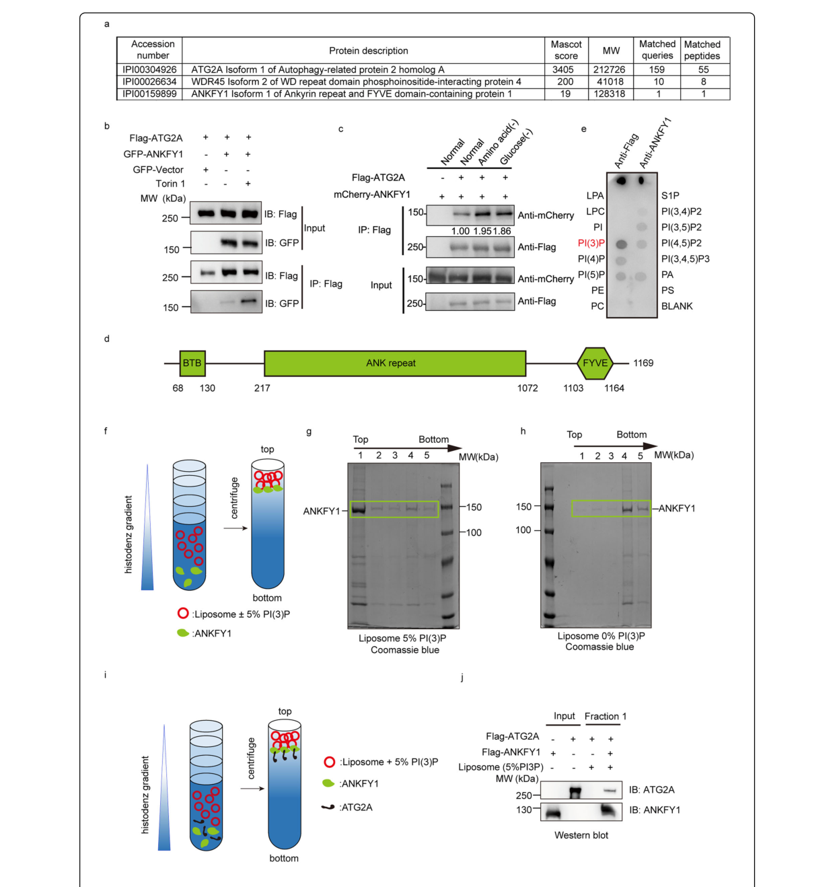

## Question

# Gene Research for Functional Annotation

## ⚠️ CRITICAL: Gene/Protein Identification Context

**BEFORE YOU BEGIN RESEARCH:** You MUST verify you are researching the CORRECT gene/protein. Gene symbols can be ambiguous, especially for less well-characterized genes from non-model organisms.

### Target Gene/Protein Identity (from UniProt):
- **UniProt Accession:** Q9P2R3
- **Protein Description:** RecName: Full=Ankyrin repeat and FYVE domain-containing protein 1 {ECO:0000312|HGNC:HGNC:20763}; AltName: Full=Ankyrin repeats hooked to a zinc finger motif; AltName: Full=Rab5-binding and ankyrin repeats-containing protein {ECO:0000303|PubMed:15328530}; Short=Rabankyrin-5 {ECO:0000303|PubMed:15328530}; Short=Rank-5 {ECO:0000303|PubMed:22284051};
- **Gene Information:** Name=ANKFY1 {ECO:0000312|HGNC:HGNC:20763}; Synonyms=ANKHZN, KIAA1255;
- **Organism (full):** Homo sapiens (Human).
- **Protein Family:** Not specified in UniProt
- **Key Domains:** ANFY1_BTB_POZ. (IPR049765); ANFY1_FYVE. (IPR049764); ANKFY1_BACK. (IPR049763); Ankyrin_rpt. (IPR002110); Ankyrin_rpt-contain_sf. (IPR036770)

### MANDATORY VERIFICATION STEPS:

1. **Check if the gene symbol "ANKFY1" matches the protein description above**
2. **Verify the organism is correct:** Homo sapiens (Human).
3. **Check if protein family/domains align with what you find in literature**
4. **If you find literature for a DIFFERENT gene with the same or similar symbol, STOP**

### If Gene Symbol is Ambiguous or You Cannot Find Relevant Literature:

**DO NOT PROCEED WITH RESEARCH ON A DIFFERENT GENE.** Instead:
- State clearly: "The gene symbol 'ANKFY1' is ambiguous or literature is limited for this specific protein"
- Explain what you found (e.g., "Found extensive literature on a different gene with the same symbol in a different organism")
- Describe the protein based ONLY on the UniProt information provided above
- Suggest that the protein function can be inferred from domain/family information

### Research Target:

Please provide a comprehensive research report on the gene **ANKFY1** (gene ID: ANKFY1, UniProt: Q9P2R3) in human.

The research report should be a detailed narrative explaining the function, biological processes, and localization of the gene product. Citations should be given for all claims.

You should prioritize authoritative reviews and primary scientific literature when conducting research. You can supplement
this with annotations you find in gene/protein databases, but these can be outdated or inaccurate.

We are specifically interested in the primary function of the gene - for enzymes, what reaction is catalyzed, and what is the substrate specificity? For transporters, what is the substrate? For structural proteins or adapters, what is the broader structural role? For signaling molecules, what is the role in the pathway.

We are interested in where in or outside the cell the gene product carries out its function.

We are also interested in the signaling or biochemical pathways in which the gene functions. We are less interested in broad pleiotropic effects, except where these elucidate the precise role.

Include evidence where possible. We are interested in both experimental evidence as well as inference from structure, evolution, or bioinformatic analysis. Precise studies should be prioritized over high-throughput, where available.

## Output

Question: You are an expert researcher providing comprehensive, well-cited information.

Provide detailed information focusing on:
1. Key concepts and definitions with current understanding
2. Recent developments and latest research (prioritize 2023-2024 sources)
3. Current applications and real-world implementations
4. Expert opinions and analysis from authoritative sources
5. Relevant statistics and data from recent studies

Format as a comprehensive research report with proper citations. Include URLs and publication dates where available.
Always prioritize recent, authoritative sources and provide specific citations for all major claims.

# Gene Research for Functional Annotation

## ⚠️ CRITICAL: Gene/Protein Identification Context

**BEFORE YOU BEGIN RESEARCH:** You MUST verify you are researching the CORRECT gene/protein. Gene symbols can be ambiguous, especially for less well-characterized genes from non-model organisms.

### Target Gene/Protein Identity (from UniProt):
- **UniProt Accession:** Q9P2R3
- **Protein Description:** RecName: Full=Ankyrin repeat and FYVE domain-containing protein 1 {ECO:0000312|HGNC:HGNC:20763}; AltName: Full=Ankyrin repeats hooked to a zinc finger motif; AltName: Full=Rab5-binding and ankyrin repeats-containing protein {ECO:0000303|PubMed:15328530}; Short=Rabankyrin-5 {ECO:0000303|PubMed:15328530}; Short=Rank-5 {ECO:0000303|PubMed:22284051};
- **Gene Information:** Name=ANKFY1 {ECO:0000312|HGNC:HGNC:20763}; Synonyms=ANKHZN, KIAA1255;
- **Organism (full):** Homo sapiens (Human).
- **Protein Family:** Not specified in UniProt
- **Key Domains:** ANFY1_BTB_POZ. (IPR049765); ANFY1_FYVE. (IPR049764); ANKFY1_BACK. (IPR049763); Ankyrin_rpt. (IPR002110); Ankyrin_rpt-contain_sf. (IPR036770)

### MANDATORY VERIFICATION STEPS:

1. **Check if the gene symbol "ANKFY1" matches the protein description above**
2. **Verify the organism is correct:** Homo sapiens (Human).
3. **Check if protein family/domains align with what you find in literature**
4. **If you find literature for a DIFFERENT gene with the same or similar symbol, STOP**

### If Gene Symbol is Ambiguous or You Cannot Find Relevant Literature:

**DO NOT PROCEED WITH RESEARCH ON A DIFFERENT GENE.** Instead:
- State clearly: "The gene symbol 'ANKFY1' is ambiguous or literature is limited for this specific protein"
- Explain what you found (e.g., "Found extensive literature on a different gene with the same symbol in a different organism")
- Describe the protein based ONLY on the UniProt information provided above
- Suggest that the protein function can be inferred from domain/family information

### Research Target:

Please provide a comprehensive research report on the gene **ANKFY1** (gene ID: ANKFY1, UniProt: Q9P2R3) in human.

The research report should be a detailed narrative explaining the function, biological processes, and localization of the gene product. Citations should be given for all claims.

You should prioritize authoritative reviews and primary scientific literature when conducting research. You can supplement
this with annotations you find in gene/protein databases, but these can be outdated or inaccurate.

We are specifically interested in the primary function of the gene - for enzymes, what reaction is catalyzed, and what is the substrate specificity? For transporters, what is the substrate? For structural proteins or adapters, what is the broader structural role? For signaling molecules, what is the role in the pathway.

We are interested in where in or outside the cell the gene product carries out its function.

We are also interested in the signaling or biochemical pathways in which the gene functions. We are less interested in broad pleiotropic effects, except where these elucidate the precise role.

Include evidence where possible. We are interested in both experimental evidence as well as inference from structure, evolution, or bioinformatic analysis. Precise studies should be prioritized over high-throughput, where available.

## Research report: Human **ANKFY1** (Rabankyrin‑5; UniProt **Q9P2R3**)—functional annotation, mechanisms, and recent research

### 0) Target verification (gene/protein identity)
The literature consistently identifies **ANKFY1** (human) as **Rabankyrin‑5**, a **Rab5 effector** protein that contains an N‑terminal **BTB/POZ** domain, extensive **ankyrin repeats**, and a C‑terminal **FYVE** domain, matching the UniProt Q9P2R3 description you provided. The canonical 2004 discovery paper explicitly defines this protein architecture and Rab5/PI3P binding properties, and later human genetic/functional work in podocytes uses the same ANKFY1 identity and FYVE‑dependent vesicular targeting (schnatwinkel2004therab5effector pages 2-3, hermle2018gapvd1andankfy1 pages 4-7).

### 1) Key concepts and definitions (current understanding)

#### 1.1 ANKFY1 as a **Rab5 effector**
A *Rab5 effector* is a protein that binds activated **Rab5‑GTP** to execute Rab5‑dependent functions on early endosomes (e.g., tethering, fusion, trafficking coordination). Rabankyrin‑5/ANKFY1 binds **Rab5 specifically and in a GTP‑dependent manner**, i.e., it binds Rab5‑GTP analogs but not Rab5‑GDP and not other tested Rab proteins, satisfying a biochemical definition of a Rab5 effector (Schnatwinkel et al., 2004‑08; https://doi.org/10.1371/journal.pbio.0020261) (schnatwinkel2004therab5effector pages 2-3, schnatwinkel2004therab5effector pages 1-2).

#### 1.2 FYVE domain and PI(3)P recognition
The FYVE domain is a zinc‑finger fold that typically binds **phosphatidylinositol‑3‑phosphate (PI3P)**, a hallmark lipid enriched on early endosomes. ANKFY1 is **directly PI3P‑binding**, as shown by liposome binding assays, and FYVE‑mediated PI3P recognition is a key determinant of its membrane recruitment (Schnatwinkel et al., 2004‑08; https://doi.org/10.1371/journal.pbio.0020261) (schnatwinkel2004therab5effector pages 2-3, schnatwinkel2004characterisationofnovel pages 106-107).

#### 1.3 Ankyrin repeats and BTB/POZ domain (conceptual roles)
Ankyrin repeats are common protein–protein interaction modules and are frequently used to scaffold multi‑protein assemblies. In the discovery work, ANKFY1/Rabankyrin‑5 is described as containing **~21 ankyrin repeats** and an N‑terminal **BTB/POZ** region, consistent with a role as an endocytic scaffold rather than an enzyme (Schnatwinkel et al., 2004‑08; https://doi.org/10.1371/journal.pbio.0020261) (schnatwinkel2004therab5effector pages 2-3, schnatwinkel2004characterisationofnovel pages 101-104).

### 2) Molecular function, pathways, and subcellular localization

#### 2.1 Subcellular localization: early endosomes and macropinosomes
ANKFY1 localizes predominantly to **Rab5/EEA1‑positive early endosomes** and also to large vacuolar structures corresponding to **macropinosomes** (Schnatwinkel et al., 2004‑08; https://doi.org/10.1371/journal.pbio.0020261) (schnatwinkel2004therab5effector pages 1-2, schnatwinkel2004therab5effector pages 10-12, schnatwinkel2004therab5effector pages 2-3). Quantitatively, the early endosome co‑localization with Rab5/EEA1 was reported at approximately **~80%** in A431 cells (schnatwinkel2004therab5effector pages 2-3, schnatwinkel2004characterisationofnovel pages 104-106).

#### 2.2 Core cellular roles: coordinating endocytosis/macropinocytosis and endosome fusion
**Macropinocytosis / fluid‑phase uptake.** In epithelial cells and fibroblasts, overexpression of Rabankyrin‑5 increased macropinosome number and **stimulated fluid‑phase uptake**, while downregulation inhibited these processes. In polarized epithelia, this activity was largely **apical** (Schnatwinkel et al., 2004‑08; https://doi.org/10.1371/journal.pbio.0020261) (schnatwinkel2004therab5effector pages 1-2, schnatwinkel2004therab5effector pages 10-12).

**Endosome fusion.** Rabankyrin‑5/ANKFY1 stimulates early endosome fusion activity and can influence fusion steps involving clathrin‑derived cargo delivery to early endosomes; however, complementary characterization indicates a **modulatory** contribution in certain fusion assays (not the sole essential component) (schnatwinkel2004therab5effector pages 2-3, schnatwinkel2004characterisationofnovel pages 104-106).

#### 2.3 Determinants of endosomal targeting: requirement for both PI3P and Rab5
A key mechanistic point is that ANKFY1 targeting to early endosomes depends on **both** (i) FYVE‑mediated **PI3P** binding and (ii) **Rab5** interaction. A FYVE‑deleted ANKFY1 can still bind Rab5‑GTP in vitro but fails to localize properly in vivo, and recruitment assays show dependence on Rab5 and PI3P together (schnatwinkel2004characterisationofnovel pages 106-107, schnatwinkel2004characterisationofnovel pages 104-106).

### 3) Recent developments (prioritizing 2023–2024)

#### 3.1 2024: ANKFY1 in autophagy—bridging endosomes to phagophores via ATG2A
A major 2024 advance is the identification of ANKFY1 as a new **ATG2A‑binding** factor that links **PI3P‑enriched endosomes** to **phagophores** during autophagosome biogenesis (Wei et al., 2024‑04, *Cell Discovery*; https://doi.org/10.1038/s41421-024-00659-y) (wei2024ankfy1bridgesatg2amediated pages 1-2, wei2024ankfy1bridgesatg2amediated pages 2-4).

Mechanistic findings:
- **Physical/functional coupling:** tandem affinity purification + MS identified ANKFY1 as an ATG2A interactor, validated by co‑IP; binding increased under autophagy stimulation conditions (e.g., Torin1/starvation) (wei2024ankfy1bridgesatg2amediated pages 1-2).
- **PI3P dependence:** recombinant ANKFY1 binds PI3P strongly, and FYVE deletion abrogates its capacity to support ATG2A activity (wei2024ankfy1bridgesatg2amediated pages 2-4, wei2024ankfy1bridgesatg2amediated pages 10-12).
- **Reconstitution:** In liposome assays, ANKFY1 robustly recruited ATG2A to PI3P membranes and promoted tethering/clustering, enabling enhanced ATG2A lipid transfer (wei2024ankfy1bridgesatg2amediated pages 2-4, wei2024ankfy1bridgesatg2amediated pages 8-10).
- **Quantitative effect size:** ANKFY1 approximately **doubled** ATG2A lipid transfer efficiency in a FRET‑based lipid transfer assay (wei2024ankfy1bridgesatg2amediated pages 10-12).

The most direct visual evidence is provided by microscopy showing ANKFY1 in close proximity to both endosomal and phagophore markers and by biochemistry/biophysics panels showing enhanced ATG2A recruitment and lipid transfer (wei2024ankfy1bridgesatg2amediated media a99a411e, wei2024ankfy1bridgesatg2amediated media ea7133fe).

#### 3.2 2024: Human genetics—bi‑allelic ANKFY1 variants and a proposed neuro‑renal phenotype
A 2024 case report describes a child with **infantile‑onset proteinuria** and a **movement disorder** carrying compound heterozygous ANKFY1 variants (Zhang et al., 2024‑06, *Clinical Kidney Journal*; https://doi.org/10.1093/ckj/sfae124) (zhang2024compoundheterozygousvariants pages 1-3).

Notable functional and quantitative observations in this report:
- An intronic deletion caused abnormal splicing with nested PCR products of **199 bp** (full length) and **108 bp** (exon‑24 skipped) (zhang2024compoundheterozygousvariants pages 3-4).
- Both variants reduced ANKFY1 protein expression in transfected cells; localization was not obviously altered in that overexpression assay (zhang2024compoundheterozygousvariants pages 4-5).
- Reported urinary microprotein values included **α1‑microglobulin 127 mg/L**, **microalbumin 159 mg/L**, and **IgG 42.3 mg/L** (zhang2024compoundheterozygousvariants pages 1-3).

These findings complement earlier evidence linking ANKFY1 to steroid‑resistant nephrotic syndrome via Rab5/endocytic regulation (see §4.2) (hermle2018gapvd1andankfy1 pages 4-7).

### 4) Current applications and real‑world implementations

#### 4.1 ANKFY1 as a mechanistic node in membrane trafficking research (cell biology application)
In practice, ANKFY1 is used as:
- a marker and mechanistic component for **Rab5/PI3P early endosome biology** and **macropinocytosis** studies, due to its Rab5‑GTP and PI3P binding and its localization to early endosomes/macropinosomes (schnatwinkel2004therab5effector pages 2-3, schnatwinkel2004therab5effector pages 10-12);
- an experimentally tractable scaffold to dissect how endosomes and PI3P‑positive membranes coordinate diverse uptake routes (clathrin‑dependent and macropinocytic) under Rab5 control (schnatwinkel2004therab5effector pages 10-12, schnatwinkel2004therab5effector pages 1-2).

#### 4.2 Clinical genetics implementation (SRNS diagnostics)
Whole‑exome sequencing in a cohort of **665** patients with steroid‑resistant nephrotic syndrome identified a homozygous ANKFY1 variant in two siblings, and functional assays supported a Rab5 regulatory mechanism through ANKFY1 and GAPVD1 interaction (Hermle et al., 2018‑06, *JASN*; https://doi.org/10.1681/ASN.2017121312) (hermle2018gapvd1andankfy1 pages 4-7). This positions ANKFY1 as a gene that can be included in **monogenic SRNS** diagnostic evaluation and mechanistic interpretation, particularly in cases suggesting endocytic trafficking defects.

### 5) Expert opinions and synthesis (authoritative analysis grounded in sources)

#### 5.1 ANKFY1 is best viewed as a PI3P/Rab5‑dependent endosomal scaffold rather than an enzyme
Across biochemical binding assays, localization, and functional perturbations, the most consistent interpretation is that ANKFY1 is an **adapter/scaffold** that couples **Rab5‑GTP signaling** to **PI3P‑rich membranes**, influencing endosome fusion dynamics and macropinocytic uptake (schnatwinkel2004therab5effector pages 2-3, schnatwinkel2004therab5effector pages 1-2). Its requirement for both Rab5 interaction and PI3P binding for correct targeting supports a “coincidence detection” model commonly invoked for endosomal effectors (schnatwinkel2004characterisationofnovel pages 106-107, schnatwinkel2004characterisationofnovel pages 104-106).

#### 5.2 A 2024 expansion of scope: from endocytosis to autophagosome growth
Wei et al. (2024) extend the ANKFY1 functional landscape by proposing that PI3P‑endosomes are not only trafficking hubs but can serve as **lipid donors** to growing phagophores via an **ANKFY1→ATG2A** bridging mechanism (wei2024ankfy1bridgesatg2amediated pages 1-2, wei2024ankfy1bridgesatg2amediated pages 2-4). The combined in‑cell and in‑vitro reconstitution evidence, including a quantitative increase in lipid transfer efficiency, supports an actionable mechanistic model rather than a purely correlative association (wei2024ankfy1bridgesatg2amediated pages 10-12, wei2024ankfy1bridgesatg2amediated media ea7133fe).

### 6) Relevant statistics and data highlights (from cited studies)
- **~80%** colocalization of endogenous ANKFY1 with Rab5/EEA1 early endosome markers in A431 cells (schnatwinkel2004therab5effector pages 2-3, schnatwinkel2004characterisationofnovel pages 104-106).
- **Cohort size:** **665** SRNS patients screened by exome sequencing in Hermle et al. 2018 (hermle2018gapvd1andankfy1 pages 4-7).
- **Autophagy reconstitution:** PI3P liposomes used at **5% PI3P**; ANKFY1 enhanced ATG2A recruitment and lipid transfer; reported to **~double** ATG2A lipid transfer efficiency in FRET assays (wei2024ankfy1bridgesatg2amediated pages 2-4, wei2024ankfy1bridgesatg2amediated pages 10-12).
- **Clinical splicing assay:** **199 bp** full-length vs **108 bp** exon‑24‑skipped products in a nested PCR assay for an ANKFY1 intronic deletion (zhang2024compoundheterozygousvariants pages 3-4).
- **Clinical urine markers:** α1‑microglobulin **127 mg/L**, microalbumin **159 mg/L**, IgG **42.3 mg/L** in the 2024 neuro‑renal phenotype report (zhang2024compoundheterozygousvariants pages 1-3).

### 7) Disease associations (curated evidence)
Open Targets lists ANKFY1 association signals for **familial idiopathic steroid‑resistant nephrotic syndrome**, **neurodegenerative disease**, **type 2 diabetes mellitus**, **obesity**, and **overnutrition**, each with evidence size 3; the displayed association scores include ~0.37 for familial idiopathic SRNS and ~0.33 for neurodegenerative disease (platform: https://platform.opentargets.org/) (OpenTargets Search: -ANKFY1). These associations should be interpreted as aggregation of evidence types (e.g., genetics/functional/omics) rather than proof of direct causality or druggability.

### 8) Summary of functional annotation
ANKFY1 (Rabankyrin‑5) is a **PI3P‑binding, Rab5‑GTP‑binding** endosomal scaffold that localizes to **early endosomes** and **macropinosomes**, promotes **macropinocytic fluid‑phase uptake**, and modulates **endosome fusion**. Recent 2024 work extends ANKFY1’s role to **autophagy**, where it recruits/bridges **ATG2A** to PI3P endosomes to enhance lipid transfer and phagophore expansion. Human genetics implicate ANKFY1 in **steroid‑resistant nephrotic syndrome**, and a 2024 case report suggests a possible broader **neuro‑renal syndrome** associated with bi‑allelic ANKFY1 variants (schnatwinkel2004therab5effector pages 2-3, schnatwinkel2004therab5effector pages 10-12, wei2024ankfy1bridgesatg2amediated pages 1-2, hermle2018gapvd1andankfy1 pages 4-7, zhang2024compoundheterozygousvariants pages 1-3).

---

### Structured evidence table
| Aspect | Key claim | Evidence type | Key quantitative/statistical details | Primary source with publication date and URL/DOI | Citation id(s) to use in final answer |
|---|---|---|---|---|---|
| Identity/domains | Human ANKFY1 corresponds to Rabankyrin-5, a Rab5 effector with an N-terminal BTB/POZ domain, ~21 ankyrin repeats, and a C-terminal FYVE finger/domain. | Biochemical, cell biology | Predicted size ~130 kDa; truncation mapping used constructs spanning aa 1–1169, 1–1075, 255–1169, 255–1075. | Schnatwinkel et al., **2004-08**, *PLoS Biology*; https://doi.org/10.1371/journal.pbio.0020261 | (schnatwinkel2004therab5effector pages 2-3, schnatwinkel2004characterisationofnovel pages 101-104, schnatwinkel2004characterisationofnovel pages 104-106) |
| Lipid binding | ANKFY1 directly binds phosphatidylinositol 3-phosphate [PI(3)P], and FYVE-mediated PI(3)P recognition is required for membrane targeting. | Biochemical | Liposome-binding assays showed strongest binding to PI(3)P; FYVE deletion abolished endosomal recruitment despite retained Rab5-GTP binding in vitro. | Schnatwinkel et al., **2004-08**, *PLoS Biology*; https://doi.org/10.1371/journal.pbio.0020261 | (schnatwinkel2004therab5effector pages 2-3, schnatwinkel2004characterisationofnovel pages 106-107, schnatwinkel2004characterisationofnovel pages 104-106) |
| Rab5 binding | ANKFY1 binds Rab5 specifically, directly, and in a GTP-dependent manner, consistent with its designation as a Rab5 effector. | Biochemical | Binds GST-Rab5-GTPγS/GTPcS, not Rab5-GDP or other tested Rabs. | Schnatwinkel et al., **2004-08**, *PLoS Biology*; https://doi.org/10.1371/journal.pbio.0020261 | (schnatwinkel2004therab5effector pages 2-3, schnatwinkel2004characterisationofnovel pages 101-104, schnatwinkel2004therab5effector pages 1-2) |
| Localization | ANKFY1 localizes to Rab5/EEA1-positive early endosomes and to large vacuolar macropinosomes; in kidney it is enriched beneath the apical brush border of proximal tubule cells. | Cell biology | ~80% colocalization with Rab5/EEA1-positive early endosomes in A431 cells; macropinocytic structures are largely transferrin-negative. | Schnatwinkel et al., **2004-08**, *PLoS Biology*; https://doi.org/10.1371/journal.pbio.0020261 | (schnatwinkel2004therab5effector pages 10-12, schnatwinkel2004therab5effector pages 2-3, schnatwinkel2004characterisationofnovel pages 104-106, schnatwinkel2004therab5effector pages 1-2) |
| Endocytosis/macropinocytosis | ANKFY1 promotes fluid-phase uptake and macropinocytosis, especially at the apical membrane of polarized epithelial cells. Overexpression increases, and depletion reduces, macropinosome formation/uptake. | Cell biology | Overexpression increased macropinosome number and fluid-phase uptake; downregulation inhibited these processes; apical restriction emphasized in polarized epithelia. | Schnatwinkel et al., **2004-08**, *PLoS Biology*; https://doi.org/10.1371/journal.pbio.0020261 | (schnatwinkel2004therab5effector pages 10-12, schnatwinkel2004therab5effector pages 1-2, schnatwinkel2004characterisationofnovel pages 134-138) |
| Endosome fusion | ANKFY1 modulates early endosome fusion, stimulating homotypic early-endosome fusion and heterotypic fusion with clathrin-coated vesicles, but appears modulatory rather than the sole essential factor. | Biochemical, cell biology | Quantitative immunodepletion produced only minor effects in some early-endosome fusion assays, supporting a modulatory role. | Schnatwinkel et al., **2004-08**, *PLoS Biology*; https://doi.org/10.1371/journal.pbio.0020261 | (schnatwinkel2004therab5effector pages 2-3, schnatwinkel2004characterisationofnovel pages 106-107, schnatwinkel2004characterisationofnovel pages 104-106) |
| Domain requirements for targeting | Efficient recruitment of ANKFY1 to early endosomes requires both PI(3)P/FYVE recognition and Rab5 interaction; neither module alone is sufficient. | Biochemical, cell biology | FYVE deletion mutant still bound Rab5-GTP in vitro but failed to localize in vivo; recruitment assays showed dependence on both Rab5 and PI(3)P. | Schnatwinkel et al., **2004-08**, *PLoS Biology*; https://doi.org/10.1371/journal.pbio.0020261 | (schnatwinkel2004characterisationofnovel pages 104-106, schnatwinkel2004characterisationofnovel pages 106-107) |
| Autophagy/phagophore expansion | A 2024 study identified ANKFY1 as an ATG2A-binding endosomal factor that bridges endosomes and phagophores, promoting ATG2A-mediated lipid transfer for phagophore growth. | Biochemical, cell biology | ANKFY1 depletion impaired autophagosome growth and autophagy flux, largely phenocopying ATG2A/B depletion. | Wei et al., **2024-04**, *Cell Discovery*; https://doi.org/10.1038/s41421-024-00659-y | (wei2024ankfy1bridgesatg2amediated pages 1-2, wei2024ankfy1bridgesatg2amediated pages 2-4) |
| Autophagy quantitative reconstitution | In reconstituted liposome assays, ANKFY1 enhanced ATG2A-mediated lipid transfer and tethering of PI(3)P-containing liposomes; FYVE-mediated PI(3)P binding was essential. | Biochemical | Example donor liposomes: 61% DOPC, 30% POPE, 2% NBD-PE, 2% Rhod-PE, 5% PI3P; acceptor liposomes: 65% DOPC, 30% POPE, 5% PI3P; ANKFY1 roughly doubled ATG2A lipid transfer efficiency; DLS showed clustering/tethering of 100 nm PI(3)P liposomes only with ATG2A+ANKFY1; microscopy quantification used n=36 vs 48 cells in one assay and n=30 cells in others. | Wei et al., **2024-04**, *Cell Discovery*; https://doi.org/10.1038/s41421-024-00659-y | (wei2024ankfy1bridgesatg2amediated pages 2-4, wei2024ankfy1bridgesatg2amediated pages 10-12, wei2024ankfy1bridgesatg2amediated pages 8-10, wei2024ankfy1bridgesatg2amediated media a99a411e) |
| Visual/mechanistic support | Figure-level evidence shows ANKFY1-ATG2A proximity at Rab5-positive endosomes and LC3-positive phagophores, plus FRET/co-flotation support for ANKFY1-assisted ATG2A lipid transfer. | Figure/image evidence | Retrieved figures include microscopy with white-arrow-marked three-way proximity and FRET curves/quantification demonstrating enhanced transfer in the presence of ANKFY1. | Wei et al., **2024-04**, *Cell Discovery*; https://doi.org/10.1038/s41421-024-00659-y | (wei2024ankfy1bridgesatg2amediated media a99a411e, wei2024ankfy1bridgesatg2amediated media 1181e331, wei2024ankfy1bridgesatg2amediated media ea7133fe, wei2024ankfy1bridgesatg2amediated media 5c7dbd2b) |
| Kidney/podocyte relevance | In podocytes, ANKFY1 localizes to Rab5-positive vesicles/endosomes in a FYVE-dependent manner and interacts with GAPVD1; this supports a role in endocytic regulation relevant to glomerular filtration barrier biology. | Cell biology, genetics | Deletion of the FYVE domain abrogated vesicular localization; ANKFY1 and GAPVD1 partially colocalized and co-immunoprecipitated; endogenous/overexpressed ANKFY1 partially colocalized with Rab5. | Hermle et al., **2018-06**, *JASN*; https://doi.org/10.1681/ASN.2017121312 | (hermle2018gapvd1andankfy1 pages 4-7) |
| Human genetics/disease links | Biallelic ANKFY1 variants are linked to steroid-resistant nephrotic syndrome (SRNS), and a 2024 case report extends the phenotype to a probable neuro-renal syndrome with infantile-onset proteinuria plus movement disorder. | Human genetics, functional assay | 2018 study screened 665 patients by exome sequencing and found homozygous ANKFY1 missense mutation in two siblings with SRNS; 2024 case reported compound heterozygous variants p.Ser918Ter and c.3287–11_3287–10del with abnormal splicing producing 199 bp full-length and 108 bp exon-24-skipped PCR products; urinary markers included α1-microglobulin 127 mg/L, microalbumin 159 mg/L, IgG 42.3 mg/L. | Hermle et al., **2018-06**, *JASN*; https://doi.org/10.1681/ASN.2017121312; Zhang et al., **2024-06**, *Clinical Kidney Journal*; https://doi.org/10.1093/ckj/sfae124 | (hermle2018gapvd1andankfy1 pages 4-7, zhang2024compoundheterozygousvariants pages 4-5, zhang2024compoundheterozygousvariants pages 3-4, zhang2024compoundheterozygousvariants pages 1-3) |
| Variant functional consequences | Patient-derived ANKFY1 variants in the 2024 case reduced ANKFY1 protein expression but did not obviously alter subcellular localization in the overexpression assay. | Genetics, cell biology | Exon 24-skipped transcript detected; two transcripts differed by ~108 bp; western blot showed reduced ANKFY1 expression from both variants. | Zhang et al., **2024-06**, *Clinical Kidney Journal*; https://doi.org/10.1093/ckj/sfae124 | (zhang2024compoundheterozygousvariants pages 4-5, zhang2024compoundheterozygousvariants pages 3-4) |
| Disease-target associations | Open Targets currently lists ANKFY1 associations with familial idiopathic SRNS, neurodegenerative disease, type 2 diabetes mellitus, obesity, and overnutrition, but these are association-level signals rather than validated therapeutic indications. | Database | Evidence size reported as 3 for each listed disease; strongest score among displayed entries was for familial idiopathic SRNS (score 0.3696), followed by neurodegenerative disease (0.3345) and type 2 diabetes mellitus (0.2181). | Open Targets platform query for ANKFY1, accessed during this research; https://platform.opentargets.org/ | (OpenTargets Search: -ANKFY1) |

*Table: This table summarizes the main experimentally supported functions, localization, pathways, and disease links for human ANKFY1/Rabankyrin-5. It is designed to provide citable claims and quantitative details for a final research report.*

References

1. (schnatwinkel2004therab5effector pages 2-3): Carsten Schnatwinkel, Savvas Christoforidis, Margaret R Lindsay, Sandrine Uttenweiler-Joseph, Matthias Wilm, Robert G Parton, and Marino Zerial. The rab5 effector rabankyrin-5 regulates and coordinates different endocytic mechanisms. PLoS Biology, 2:e261, Aug 2004. URL: https://doi.org/10.1371/journal.pbio.0020261, doi:10.1371/journal.pbio.0020261. This article has 299 citations and is from a highest quality peer-reviewed journal.

2. (hermle2018gapvd1andankfy1 pages 4-7): Tobias Hermle, Ronen Schneider, David Schapiro, Daniela A. Braun, Amelie T. van der Ven, Jillian K. Warejko, Ankana Daga, Eugen Widmeier, Makiko Nakayama, Tilman Jobst-Schwan, Amar J. Majmundar, Shazia Ashraf, Jia Rao, Laura S. Finn, Velibor Tasic, Joel D. Hernandez, Arvind Bagga, Sawsan M. Jalalah, Sherif El Desoky, Jameela A. Kari, Kristen M. Laricchia, Monkol Lek, Heidi L. Rehm, Daniel G. MacArthur, Shrikant Mane, Richard P. Lifton, Shirlee Shril, and Friedhelm Hildebrandt. Gapvd1 and ankfy1 mutations implicate rab5 regulation in nephrotic syndrome. Journal of the American Society of Nephrology : JASN, 29 8:2123-2138, Jun 2018. URL: https://doi.org/10.1681/asn.2017121312, doi:10.1681/asn.2017121312. This article has 75 citations.

3. (schnatwinkel2004therab5effector pages 1-2): Carsten Schnatwinkel, Savvas Christoforidis, Margaret R Lindsay, Sandrine Uttenweiler-Joseph, Matthias Wilm, Robert G Parton, and Marino Zerial. The rab5 effector rabankyrin-5 regulates and coordinates different endocytic mechanisms. PLoS Biology, 2:e261, Aug 2004. URL: https://doi.org/10.1371/journal.pbio.0020261, doi:10.1371/journal.pbio.0020261. This article has 299 citations and is from a highest quality peer-reviewed journal.

4. (schnatwinkel2004characterisationofnovel pages 106-107): C Schnatwinkel. Characterisation of novel rab5 effector proteins in the endocytic pathway. Unknown journal, 2004.

5. (schnatwinkel2004characterisationofnovel pages 101-104): C Schnatwinkel. Characterisation of novel rab5 effector proteins in the endocytic pathway. Unknown journal, 2004.

6. (schnatwinkel2004therab5effector pages 10-12): Carsten Schnatwinkel, Savvas Christoforidis, Margaret R Lindsay, Sandrine Uttenweiler-Joseph, Matthias Wilm, Robert G Parton, and Marino Zerial. The rab5 effector rabankyrin-5 regulates and coordinates different endocytic mechanisms. PLoS Biology, 2:e261, Aug 2004. URL: https://doi.org/10.1371/journal.pbio.0020261, doi:10.1371/journal.pbio.0020261. This article has 299 citations and is from a highest quality peer-reviewed journal.

7. (schnatwinkel2004characterisationofnovel pages 104-106): C Schnatwinkel. Characterisation of novel rab5 effector proteins in the endocytic pathway. Unknown journal, 2004.

8. (wei2024ankfy1bridgesatg2amediated pages 1-2): Bin Wei, Yuhui Fu, Xiuzhi Li, Fang Chen, Yiqing Zhang, Hanmo Chen, Mindan Tong, Linsen Li, Yi Pan, Shen Zhang, She Chen, Xiaoxia Liu, and Qing Zhong. Ankfy1 bridges atg2a-mediated lipid transfer from endosomes to phagophores. Cell Discovery, Apr 2024. URL: https://doi.org/10.1038/s41421-024-00659-y, doi:10.1038/s41421-024-00659-y. This article has 13 citations and is from a peer-reviewed journal.

9. (wei2024ankfy1bridgesatg2amediated pages 2-4): Bin Wei, Yuhui Fu, Xiuzhi Li, Fang Chen, Yiqing Zhang, Hanmo Chen, Mindan Tong, Linsen Li, Yi Pan, Shen Zhang, She Chen, Xiaoxia Liu, and Qing Zhong. Ankfy1 bridges atg2a-mediated lipid transfer from endosomes to phagophores. Cell Discovery, Apr 2024. URL: https://doi.org/10.1038/s41421-024-00659-y, doi:10.1038/s41421-024-00659-y. This article has 13 citations and is from a peer-reviewed journal.

10. (wei2024ankfy1bridgesatg2amediated pages 10-12): Bin Wei, Yuhui Fu, Xiuzhi Li, Fang Chen, Yiqing Zhang, Hanmo Chen, Mindan Tong, Linsen Li, Yi Pan, Shen Zhang, She Chen, Xiaoxia Liu, and Qing Zhong. Ankfy1 bridges atg2a-mediated lipid transfer from endosomes to phagophores. Cell Discovery, Apr 2024. URL: https://doi.org/10.1038/s41421-024-00659-y, doi:10.1038/s41421-024-00659-y. This article has 13 citations and is from a peer-reviewed journal.

11. (wei2024ankfy1bridgesatg2amediated pages 8-10): Bin Wei, Yuhui Fu, Xiuzhi Li, Fang Chen, Yiqing Zhang, Hanmo Chen, Mindan Tong, Linsen Li, Yi Pan, Shen Zhang, She Chen, Xiaoxia Liu, and Qing Zhong. Ankfy1 bridges atg2a-mediated lipid transfer from endosomes to phagophores. Cell Discovery, Apr 2024. URL: https://doi.org/10.1038/s41421-024-00659-y, doi:10.1038/s41421-024-00659-y. This article has 13 citations and is from a peer-reviewed journal.

12. (wei2024ankfy1bridgesatg2amediated media a99a411e): Bin Wei, Yuhui Fu, Xiuzhi Li, Fang Chen, Yiqing Zhang, Hanmo Chen, Mindan Tong, Linsen Li, Yi Pan, Shen Zhang, She Chen, Xiaoxia Liu, and Qing Zhong. Ankfy1 bridges atg2a-mediated lipid transfer from endosomes to phagophores. Cell Discovery, Apr 2024. URL: https://doi.org/10.1038/s41421-024-00659-y, doi:10.1038/s41421-024-00659-y. This article has 13 citations and is from a peer-reviewed journal.

13. (wei2024ankfy1bridgesatg2amediated media ea7133fe): Bin Wei, Yuhui Fu, Xiuzhi Li, Fang Chen, Yiqing Zhang, Hanmo Chen, Mindan Tong, Linsen Li, Yi Pan, Shen Zhang, She Chen, Xiaoxia Liu, and Qing Zhong. Ankfy1 bridges atg2a-mediated lipid transfer from endosomes to phagophores. Cell Discovery, Apr 2024. URL: https://doi.org/10.1038/s41421-024-00659-y, doi:10.1038/s41421-024-00659-y. This article has 13 citations and is from a peer-reviewed journal.

14. (zhang2024compoundheterozygousvariants pages 1-3): Luyan Zhang, Xueqin Cheng, Chunli Wang, Wei Zhou, Bixia Zheng, and Aihua Zhang. Compound heterozygous variants of ankfy1 in a child with infantile-onset proteinuria and movement disorder. Clinical Kidney Journal, Jun 2024. URL: https://doi.org/10.1093/ckj/sfae124, doi:10.1093/ckj/sfae124. This article has 0 citations and is from a peer-reviewed journal.

15. (zhang2024compoundheterozygousvariants pages 3-4): Luyan Zhang, Xueqin Cheng, Chunli Wang, Wei Zhou, Bixia Zheng, and Aihua Zhang. Compound heterozygous variants of ankfy1 in a child with infantile-onset proteinuria and movement disorder. Clinical Kidney Journal, Jun 2024. URL: https://doi.org/10.1093/ckj/sfae124, doi:10.1093/ckj/sfae124. This article has 0 citations and is from a peer-reviewed journal.

16. (zhang2024compoundheterozygousvariants pages 4-5): Luyan Zhang, Xueqin Cheng, Chunli Wang, Wei Zhou, Bixia Zheng, and Aihua Zhang. Compound heterozygous variants of ankfy1 in a child with infantile-onset proteinuria and movement disorder. Clinical Kidney Journal, Jun 2024. URL: https://doi.org/10.1093/ckj/sfae124, doi:10.1093/ckj/sfae124. This article has 0 citations and is from a peer-reviewed journal.

17. (OpenTargets Search: -ANKFY1): Open Targets Query (-ANKFY1, 5 results). Buniello, A. et al. (2025). Open Targets Platform: facilitating therapeutic hypotheses building in drug discovery. Nucleic Acids Research.

18. (schnatwinkel2004characterisationofnovel pages 134-138): C Schnatwinkel. Characterisation of novel rab5 effector proteins in the endocytic pathway. Unknown journal, 2004.

19. (wei2024ankfy1bridgesatg2amediated media 1181e331): Bin Wei, Yuhui Fu, Xiuzhi Li, Fang Chen, Yiqing Zhang, Hanmo Chen, Mindan Tong, Linsen Li, Yi Pan, Shen Zhang, She Chen, Xiaoxia Liu, and Qing Zhong. Ankfy1 bridges atg2a-mediated lipid transfer from endosomes to phagophores. Cell Discovery, Apr 2024. URL: https://doi.org/10.1038/s41421-024-00659-y, doi:10.1038/s41421-024-00659-y. This article has 13 citations and is from a peer-reviewed journal.

20. (wei2024ankfy1bridgesatg2amediated media 5c7dbd2b): Bin Wei, Yuhui Fu, Xiuzhi Li, Fang Chen, Yiqing Zhang, Hanmo Chen, Mindan Tong, Linsen Li, Yi Pan, Shen Zhang, She Chen, Xiaoxia Liu, and Qing Zhong. Ankfy1 bridges atg2a-mediated lipid transfer from endosomes to phagophores. Cell Discovery, Apr 2024. URL: https://doi.org/10.1038/s41421-024-00659-y, doi:10.1038/s41421-024-00659-y. This article has 13 citations and is from a peer-reviewed journal.

## Artifacts

- [Edison artifact artifact-00](ANKFY1-deep-research-falcon_artifacts/artifact-00.md)

## Citations

1. zhang2024compoundheterozygousvariants pages 1-3
2. zhang2024compoundheterozygousvariants pages 3-4
3. zhang2024compoundheterozygousvariants pages 4-5
4. schnatwinkel2004characterisationofnovel pages 106-107
5. schnatwinkel2004characterisationofnovel pages 101-104
6. schnatwinkel2004characterisationofnovel pages 104-106
7. schnatwinkel2004characterisationofnovel pages 134-138
8. PI(3)P
9. https://doi.org/10.1371/journal.pbio.0020261
10. https://doi.org/10.1038/s41421-024-00659-y
11. https://doi.org/10.1093/ckj/sfae124
12. https://doi.org/10.1681/ASN.2017121312
13. https://platform.opentargets.org/
14. https://doi.org/10.1681/ASN.2017121312;
15. https://doi.org/10.1371/journal.pbio.0020261,
16. https://doi.org/10.1681/asn.2017121312,
17. https://doi.org/10.1038/s41421-024-00659-y,
18. https://doi.org/10.1093/ckj/sfae124,